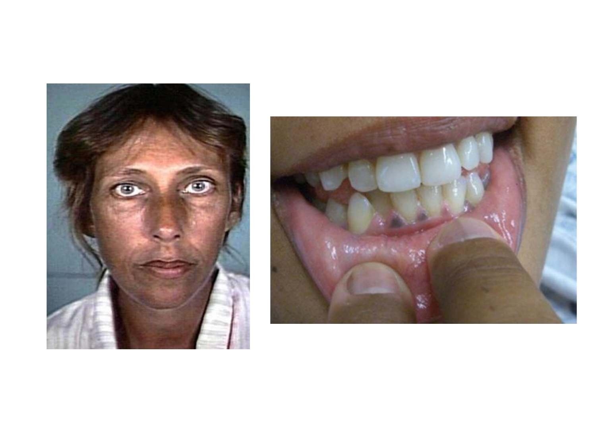
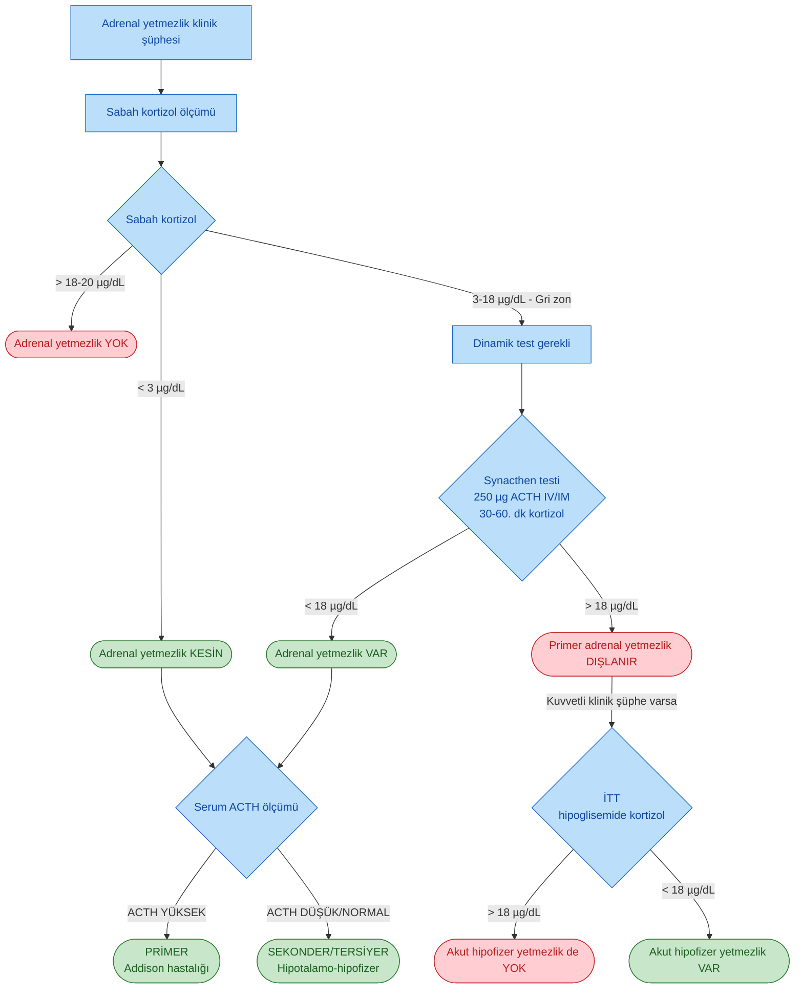
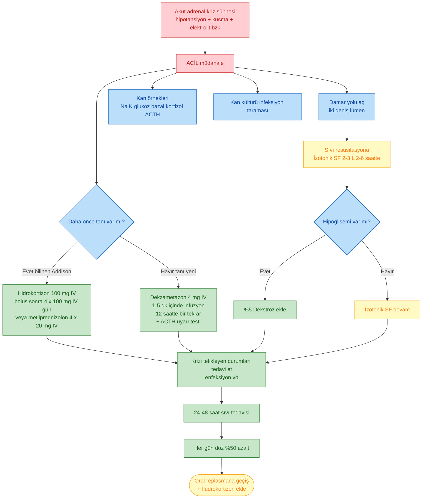

# ADDİSON HASTALIĞI (PRİMER ADRENAL YETMEZLİK)

**Hazırlayan:** Prof. Dr. Engin Güney
**Bölüm:** Aydın Adnan Menderes Üniversitesi -- Endokrinoloji Bilim Dalı

---

## İÇİNDEKİLER

1. [Tanım ve Tarihçe](#tanım-ve-tarihçe)
2. [Epidemiyoloji](#epidemiyoloji)
3. [Etyoloji](#etyoloji)
4. [Otoimmün Süreç ve Dönemler](#otoimmün-süreç-ve-dönemler)
5. [Poliglandüler Otoimmün Sendromlar](#poliglandüler-otoimmün-sendromlar)
6. [Enfeksiyöz Nedenler](#enfeksiyöz-nedenler)
7. [Klinik Belirti ve Bulgular](#klinik-belirti-ve-bulgular)
8. [Laboratuvar](#laboratuvar)
9. [Tanısal Testler](#tanısal-testler)
10. [Primer vs Sekonder/Tersiyer Ayırıcı Tanı](#primer-vs-sekondertersiyer-ayırıcı-tanı)
11. [Tanı Algoritması](#tanı-algoritması)
12. [Olgu Örnekleri](#olgu-örnekleri)
13. [Kronik Tedavi: Glukokortikoid Replasmanı](#kronik-tedavi-glukokortikoid-replasmanı)
14. [Mineralokortikoid Replasmanı](#mineralokortikoid-replasmanı)
15. [DHEA Tedavisi](#dhea-tedavisi)
16. [Stres Dozu ve Araya Giren Hastalıklar](#stres-dozu-ve-araya-giren-hastalıklar)
17. [Akut Adrenal Kriz (Addisonian Kriz)](#akut-adrenal-kriz-addisonian-kriz)
18. [Hasta Eğitimi](#hasta-eğitimi)

---

## TANIM VE TARİHÇE

> **Tanım:** Addison hastalığı, **adrenal korteksin kronik primer yetmezliği** sonucu **glukokortikoid (kortizol), mineralokortikoid (aldosteron) ve adrenal androjen (DHEA)** üretiminin birlikte azalması ile karakterize endokrin hastalıktır.

* Hastalık ilk kez **1855 yılında Thomas Addison** tarafından tarif edilmiştir.
* Thomas Addison hastalığı tarif ettiğinde en sık neden **tüberküloz** iken, günümüzde **otoimmünite** hastalığın en sık nedenidir.

**⚠️ ÖNEMLİ:**

* Primer adrenal yetmezlikte **hem kortizol hem aldosteron hem de DHEA eksiktir**; sekonder (hipofizer) ve tersiyer (hipotalamik) yetmezlikte aldosteron yapımı (renin-anjiotensin aksı korunduğu için) genellikle etkilenmez.

---

## EPİDEMİYOLOJİ

* Batı ülkelerinde yaygınlığı yaklaşık **milyonda 35-144**.
* **Kadınlarda** -- poliglandüler sendromun parçası olarak daha sık.
* **Genç erkeklerde** -- izole otoimmün adrenal yetmezlik daha sık.

---

## ETYOLOJİ

### Primer Adrenal Yetmezlik Nedenleri

**Türkiye Endokrinoloji ve Metabolizma Derneği Adrenal ve Gonadal Hastalıklar Kılavuzu (2022) temelinde:**

| Kategori | Alt gruplar / örnekler |
|---|---|
| **Otoimmün** | 
- İzole adrenal yetmezlik

- Otoimmün poliglandüler sendrom tip 1 (OPS tip 1): Addison hastalığı, hipoparatiroidizm, mukokutanöz kandidiazis, primer gonadal yetmezlik, malabsorbsiyon

- Otoimmün poliglandüler sendrom tip 2 (OPS tip 2, Schmidt sendromu): Addison hastalığı, otoimmün tiroid hastalıkları, primer gonadal yetmezlik, hipoparatiroidizm, tip 1 diabetes mellitus
 |
| **Enfeksiyonlar** | Tüberküloz, yaygın mantar enfeksiyonları, HIV, sifiliz |
| **Metastatik tümörler** | Öncelikle akciğer, meme, mide, kolon kanseri, lenfoma |
| **Bilateral adrenal kanama** | Meningokoksemik sepsis (Waterhouse-Friderichsen), anti-koagülan kullanımı |
| **İlaçlar** | Antikoagülanlar, ketokonazol, mitotan, rifampin, flukonazol, fenitoin, barbitüratlar, ipilimumab (anti-CTLA4 antikor) |
| **İnfiltratif hastalıklar** | Amiloidoz, sarkoidoz |
| **Adrenolökodistrofi / adrenomyelonöropati** | X'e bağlı peroksizomal hastalık |
| **Konjenital adrenal hipoplazi** | -- |
| **Ailesel glukokortikoid eksikliği** | ACTH reseptör mutasyonları |
| **Ailesel glukokortikoid direnci** | -- |
| **Defektif kolesterol metabolizması** | -- |

---

## OTOİMMÜN SÜREÇ VE DÖNEMLER

Günümüzde Addison hastalığının **en sık nedeni otoimmündür**.

* **Steroid sentezinde rol alan enzimlere karşı gelişen antikorlar** (en sık **21-hidroksilaz**) genellikle adrenal korteksin üç histolojik katmanını da (zona glomerulosa, fasciculata, reticularis) etkiler.
* Bu antikorlar hastaların **%86'sında** saptanabilir.

### Otoimmün Adrenal Yetmezliğe Gidişin 4 Dönemi

Adrenal antikorları pozitif ancak yetmezlik bulgusu olmayan hastalar 3-5 yıl süreyle izlendiğinde **4 dönem** olduğu gözlenmiştir:

| Dönem | Bulgu |
|---|---|
| **Dönem I** | Yüksek renin aktivitesi ve normal veya düşük aldosteron |
| **Dönem II** | ACTH uyarısına bozulmuş kortizol yanıtı |
| **Dönem III** | Normal serum kortizol düzeyi ile birlikte artmış sabah ACTH düzeyi |
| **Dönem IV** | Düşük sabah kortizolü ve **aşikar adrenal yetmezlik** |

> **Klinik çıkarım:** Aldosteron-renin ekseni (mineralokortikoid kaybı) **en erken** bozulur; aşikar semptomatik tablo ise dönem IV'te ortaya çıkar. Bu nedenle yüksek riskli kişilerde (ör. OPS-1, OPS-2 takibi) renin ve ACTH erken dönem taraması anlam taşır.

---

## POLİGLANDÜLER OTOİMMÜN SENDROMLAR

**Poliglandüler sendromların bir parçası** olarak adrenal yetmezlik **kadınlarda** daha sık görülür. **İzole otoimmün** adrenal yetmezlik ise genç erkeklerde daha sıktır.

### OPS Tip 1 (APS-1, APECED)

* AIRE gen mutasyonu (otozomal resesif)
* Çocukluk çağında başlar
* **Klasik triad:** Mukokutanöz kandidiazis + hipoparatiroidizm + Addison hastalığı
* Ek: primer gonadal yetmezlik, malabsorbsiyon, pernisiöz anemi

### OPS Tip 2 (APS-2, Schmidt Sendromu)

* Poligenik, HLA-DR3/DR4 ilişkili
* Erişkinde başlar, **kadın baskın**
* **Addison hastalığı** + otoimmün tiroid hastalığı (Hashimoto/Graves) + tip 1 DM
* Ek: primer gonadal yetmezlik, vitiligo, pernisiöz anemi

---

## ENFEKSİYÖZ NEDENLER

### Tüberküloz

* Gelişmekte olan ve az gelişmiş ülkelerde önemini korumaktadır.
* **Yaygın tüberküloz** saptanan vakaların **%10'unda** adrenal yetmezlik gelişebilir.
* Bu hastaların **%50'sinde** direkt grafilerde sürrenal bölgede **kalsifikasyonlar** görülebilir.
* Tüberküloza bağlı adrenal yetmezlikte sürrenal bezler **adrenal BT ve MR'da büyük ve kalsifiye** görülür (aksine otoimmün Addison'da adrenaller atrofik ve küçüktür).

### Diğer Enfeksiyonlar

* **HIV** (CMV adrenaliti, disemine fungal, ilaç ilişkili)
* **Yaygın mantar enfeksiyonları** (histoplazmoz, kriptokok, blastomikoz)
* **Sifiliz** (nadir)

### Waterhouse-Friderichsen Sendromu

* **Meningokoksemik sepsiste** bilateral masif adrenal hemoraji
* Ani şok + purpura fulminans + akut adrenal kriz tablosu
* Antikoagülan tedavi altındaki hastalarda da benzer tablo gelişebilir.

---

## KLİNİK BELİRTİ VE BULGULAR

### Primer Adrenal Yetmezlikte Belirti, Bulgu ve Laboratuvar Anormallikleri

(Türkiye Endokrinoloji ve Metabolizma Derneği Kılavuzu, 2022'den uyarlanmıştır)

| Belirti / Bulgu / Laboratuvar | Sıklık (%) |
|---|---|
| **Güçsüzlük, çabuk yorulma, halsizlik** | 100 |
| **İştahsızlık** | 100 |
| **Kilo kaybı** | 100 |
| **Hiperpigmentasyon** | 94 |
| **Mide-bağırsak sistemi belirtileri** | 92 |
| -- Bulantı | 86 |
| -- Kusma | 75 |
| -- Kabızlık | 33 |
| -- Karın ağrısı | 31 |
| -- İshal | 16 |
| **Hipotansiyon** (sistolik KB <110 mmHg) | 88-94 |
| **Elektrolit bozuklukları** | 92 |
| -- Hiponatremi | 88 |
| -- Hiperkalemi | 64 |
| -- Hiperkalsemi | 6 |
| **Azotemi** | 55 |
| **Anemi** | 40 |
| **Eozinofili** | 17 |
| **Tuz açlığı** | 16 |
| **Baş dönmesi** | 12 |
| **Vitiligo** | 10-20 |
| **Kas ve eklem ağrısı** | 6-13 |
| **Auriküler kalsifikasyon** | 5 |

### Hiperpigmentasyon

> **Görsel yorumu:**
>
> Solda yüzde **güneş görmeyen bölgelerde dahi** yaygın bronzlaşma (ceviz rengi cilt) izlenmektedir. Sağda bukkal mukoza ve diş eti kenarlarında **koyu kahverengi pigmentasyon bantları** (mukozal hiperpigmentasyon) izlenmektedir.
>
> Patofizyoloji: Primer adrenal yetmezlikte **kortizol geri bildiriminin kaybı** nedeniyle ön hipofizden **POMC (pro-opiomelanokortin) aşırı sentezi** olur. POMC, ACTH ve **α-MSH (melanosit stimüle edici hormon)** ortak öncüsüdür; α-MSH melanositlerde melanin yapımını artırır. Pigmentasyon özellikle **güneşe maruz kalan bölgelerde, avuç içi çizgilerinde, diş etlerinde, meme uçlarında, eski skar ve ameliyat izlerinde** belirgindir.
>
> **Klinik ipucu:** Sekonder veya tersiyer (hipofizer/hipotalamik) adrenal yetmezlikte ACTH düşük olduğu için **hiperpigmentasyon görülmez** -- bu bulgu primer vs sekonder ayrımında güçlü bir klinik ipucudur.

### Kardinal Bulguların Özeti

* **Halsizlik, kilo kaybı, iştahsızlık** -- %100 hastada
* **Hiperpigmentasyon** -- primer yetmezliğin alamet-i farikası
* **Postural hipotansiyon, tuz isteği** -- mineralokortikoid kaybı
* **GİS yakınmaları** (bulantı, kusma, karın ağrısı) -- akut krizi taklit edebilir
* **Hipoglisemi** -- özellikle çocuklarda ve sekonder yetmezlikte

---

## LABORATUVAR

### Rutin Biyokimya Bulguları

| Parametre | Beklenen bulgu | Mekanizma |
|---|---|---|
| Na | ↓ (hiponatremi) | Aldosteron eksikliği + ADH artışı |
| K | ↑ (hiperkalemi) | Aldosteron eksikliği |
| Ca | ↑ (hafif hiperkalsemi, %6) | Volüm kaybı + böbrek ekskresyon azalması |
| Glukoz | ↓ (hipoglisemi) | Kortizol eksikliği (glukoneogenez ↓) |
| Üre / kreatinin | ↑ (prerenal azotemi) | Volüm kaybı |
| Eozinofil | ↑ (eozinofili) | Kortizol eksikliği |
| Hb | ↓ (normositik anemi) | Kortikosteroid/androjen eksikliği |
| TSH | Hafif ↑ olabilir | Kortizol eksikliğinde TSH geri baskılanması bozulur |

### Serum Kortizol Düzeyi

> **Tanı eşikleri (sabah 08:00):**
>
> * **Sabah kortizol < 3 µg/dL** → adrenal yetmezliği **kuvvetle düşündürür**.
> * **Sabah kortizol > 18-20 µg/dL** → tanıdan **uzaklaştırır**.
> * **3-18 µg/dL arası** → tanı koydurmaz, **dinamik test** (ACTH uyarı testi veya İTT) gerekir.

---

## TANISAL TESTLER

### 1. ACTH Uyarı Testi (Synacthen Testi)

**Endikasyon:** Adrenal yetmezlik düşünülen her hastada, bazal kortizol seviyesi 18-20 µg/dL üzerinde saptanmadığı sürece uygulanması gereken testtir.

**Protokol:**

1. Sentetik ACTH (1,24) = **cosyntropin (Synacthen) 250 µg IV veya IM** uygulanır.
2. **30. ve 60. dakikalarda** kan kortizol düzeyi ölçülür.
3. Değerlendirme:
   * **Zirve kortizol > 18 µg/dL** → primer adrenal yetmezlik **dışlanır**.
   * **Zirve kortizol < 18 µg/dL** → adrenal yetmezlik **konfirme** edilir.

**Düşük doz ACTH testi (1 µg):**

* Özellikle **kısmi (parsiyel) adrenal yetmezlik** tanısında 250 µg testine göre **daha duyarlıdır**.

**⚠️ ÖNEMLİ:**

* Akut hipofizer yetmezlikte (ör. post-op cerrahi, Sheehan, akut hipofiz apopleksisi) adrenal bezler henüz atrofi yaşamadığından, **yüksek doz (250 µg) ACTH'a normal yanıt verebilirler**. Bu durum yanlış negatif sonuç doğurur -- kuvvetli klinik şüphede İTT ile doğrulama gerekir.

### 2. İnsülin Tolerans Testi (İTT)

**Önemi:** Hipofizer-adrenal aks değerlendirilmesinde **"altın standart"** test olarak kabul edilir.

**Protokol:**

1. 0.1-0.15 U/kg regüler insülin IV bolus.
2. Kan glukozu **< 40 mg/dL** veya temel glukozun yarısına düşene kadar (nörojenik hipoglisemi semptomları) izlenir.
3. Hipoglisemi sırasında kortizol ölçülür.
4. **Beklenen yanıt:** Kortizol **> 18-20 µg/dL**.

**Kontrendikasyonlar / Dikkat:**

* **Yaşlı hastalar**
* **Koroner kalp hastalığı öyküsü**
* **Serebrovasküler olay öyküsü**
* **Epilepsi**

Bu gruplarda ciddi yan etkiler (MI, inme, konvülziyon) gelişebilir -- yakın monitörizasyon ve %50 dekstroz kurtarması hazır bulundurulmalıdır.

### 3. Diğer Testler

* **Bazal plazma ACTH** -- primer vs sekonder ayrımı için en değerli test
* **Plasma renin aktivitesi ve aldosteron** -- dönem I'in erken tanısı
* **21-hidroksilaz antikoru** -- otoimmün etyoloji doğrulama
* **Uzun ACTH uyarı testi, metyrapone testi, CRH uyarı testi** -- primer/sekonder/tersiyer ayrımında nadiren kullanılır

### 4. Görüntüleme

* **Adrenal BT/MR:**
  * Otoimmün Addison → adrenaller **küçük / atrofik**
  * Tüberküloz / granülomatöz → adrenaller **büyük + kalsifikasyon**
  * Bilateral hemoraji → adrenallerde hemorajik kitle görünümü
  * Metastaz → heterojen, düzensiz kitle
* **Hipofiz MR:** Sekonder yetmezlik düşünülen hastalarda

---

## PRİMER VS SEKONDER/TERSİYER AYIRICI TANI

Tanı ve tedavi açısından primer, sekonder ve tersiyer adrenal yetmezliğin ayrımı **kritiktir**.

| Özellik | Primer (Addison) | Sekonder (Hipofizer) | Tersiyer (Hipotalamik) |
|---|---|---|---|
| Patoloji yeri | Adrenal korteks | Ön hipofiz (ACTH) | Hipotalamus (CRH) |
| **Serum kortizol** | ↓↓ | ↓ | ↓ |
| **Serum ACTH** | ↑↑ (yüksek) | ↓ veya normal | ↓ veya normal |
| **Aldosteron / renin** | Aldosteron ↓, renin ↑ | Normal (RAA aksı korunur) | Normal |
| **Hiperpigmentasyon** | **Var** (ACTH/α-MSH ↑) | **Yok** | **Yok** |
| **Hipotansiyon** | Belirgin, dehidratasyon var | Daha hafif, dehidratasyon yok | Daha hafif |
| **Hiperkalemi** | Var | Yok | Yok |
| **Hiponatremi** | Belirgin | Hafif (ADH yoluyla) | Hafif |
| **Mineralokortikoid replasmanı** | Gerekli (fludrokortizon) | Gerekli değil | Gerekli değil |
| **En sık neden** | Otoimmün | Hipofiz tümörü / cerrahi / radyoterapi | Kronik ekzojen steroid + ani kesilme |

---

## TANI ALGORİTMASI

Dersteki olgu-temelli yaklaşımın özet akış şeması:

---

## OLGU ÖRNEKLERİ

**📋 VAKA ÖRNEĞİ 1:**

**Bulgular:** Sabah kortizolü **< 3 µg/dL**.

**Tanı:** Adrenal yetmezlik **kesin**.

**Etyoloji?** Serum ACTH ölçümü:

* **ACTH yüksek** → **Adrenal kaynaklı (Addison hastalığı)**
* **ACTH düşük** → Hipotalamo-hipofizer kaynaklı (sekonder/tersiyer)

---

**📋 VAKA ÖRNEĞİ 2:**

**Bulgular:** Sabah kortizolü 3-18 µg/dL arası (gri zon).

**Tanı:** Kortizol tek başına tanı koydurmaz.

**Yapılması gereken:** ACTH uyarı testi (Synacthen 250 µg).

* 30. ve 60. dakikada kortizol **< 18 µg/dL** → Adrenal yetmezlik **var**.
* Ardından serum ACTH:
  * **Düşük** → Hipotalamo-hipofizer
  * **Yüksek** → Adrenal (Addison)

---

**📋 VAKA ÖRNEĞİ 3:**

**Bulgular:** Synacthen testinde 30. ve 60. dakika kortizolü **> 18 µg/dL**.

**Yorum:**

* **Adrenal bez kaynaklı yetmezlik dışlanır**.
* **Kronik hipofizer yetmezlik dışlanır**.
* Ancak kuvvetli şüphe varsa **AKUT HİPOFİZER YETMEZLİK dışlanamaz** (adrenaller henüz atrofiye uğramamış olabilir).

**Sonraki adım:** İTT uygulanır.

* İTT sırasında kortizol **> 18 µg/dL** → yetmezlik yok.
* İTT sırasında kortizol **< 18 µg/dL** → **akut hipofizer yetmezlik**.

---

**📋 VAKA ÖRNEĞİ 4:**

**Bulgular:** Sabah kortizol 3-18 µg/dL. Synacthen bulunamadı; İTT yapıldı → kortizol **> 18 µg/dL**.

**Tanı:** Adrenal yetmezlik **YOK**.

---

**📋 VAKA ÖRNEĞİ 5:**

**Bulgular:** Sabah kortizol 3-18 µg/dL. Synacthen bulunamadı; İTT yapıldı → kortizol **< 18 µg/dL**.

**Tanı:** Adrenal yetmezlik **var**.

**Etyoloji?** Serum ACTH:

* **Düşük** → Hipotalamo-hipofizer
* **Yüksek** → Adrenal (Addison)

---

**📋 VAKA ÖRNEĞİ 6:**

**Bulgular:** Adrenal yetmezlik şüphesi var. Sabah kortizolü **> 18 µg/dL**.

**Tanı:** Adrenal yetmezlik **YOK**.

---

## KRONİK TEDAVİ: GLUKOKORTİKOİD REPLASMANI

> **Tedavinin amacı:** Eksik olan **glukokortikoid, mineralokortikoid** ve gerekirse **androjenleri** yerine koymak.

### İdeal Glukokortikoid Tedavisinin Özellikleri

1. **Endojen kortizol ritmini taklit edebilmeli** (sabah yüksek, gece düşük).
2. Metabolizması esnasında **bireyler arası değişkenlik az** olmalı.
3. **Kolay doz ayarlaması** yapılabilmeli.
4. **Yan etkileri mümkün olduğunca az** olmalı.

### Glukokortikoid Seçimi

| İlaç | Yarı ömür | Yerinde kullanım |
|---|---|---|
| **Hidrokortizon** | Kısa (8 saat) | **Tercih edilen** -- fizyolojik ritme en yakın |
| **Kortizon asetat** | Kısa | Alternatif |
| **Prednizolon** | Orta-uzun | Uyum sorunu olan hastalarda alternatif |
| **Dekzametazon** | Uzun | **Önerilmez** -- Cushingoid yan etkiler ve titrasyon zorluğu |

* Normal bir kişide ortalama kortizol salınımı **2.7-14 mg/m²/gün**.
* **Hidrokortizon için önerilen günlük doz: 10-12 mg/m²** (erişkinde yaklaşık 15-25 mg/gün).

### Doz Bölüşümü

**Günlük doz 2 parçaya bölünüyor ise:**

* Toplam dozun **2/3'ü sabah uyanınca**
* **1/3'ü öğleden sonra** (saat ~15:00-16:00)

**Günlük doz 3 parçaya bölünüyor ise:**

* Sabah > öğle > erken akşam (yatmadan en az 4-6 saat önce)

**Uzun etkili steroid kullanılıyorsa:**

* Günlük **2.5-5 mg prednizolon** sabah tek doz.

**⚠️ ÖNEMLİ:**

* **Yeni kılavuzlar** Cushingoid yan etkiler ve doz titrasyonu güçlüğü nedeniyle **dekzametazon gibi uzun etkili steroidleri replasman tedavisinde önermemektedir**.

### Doz Takibi ve Ayarlama

* **Osteoporoz** gibi yan etkilerini engellemek için mümkün olan **en düşük doz** tercih edilmelidir.
* Doz ayarının **ACTH veya idrar serbest kortizolüne bakılarak yapılması önerilmez**.
* Bununla birlikte **düşük-normal ACTH seviyeleri aşırı replasmanı** işaret edebilir.
* **Doz ayarlamasında klinik belirtiler büyük önem taşır:**

| Bulgu | Yorum |
|---|---|
| Halsizlik, iştahsızlık, postural hipotansiyon devam ediyor | **Doz yetersiz** -- artır |
| Kilo alımı, sentral obezite, stria, buffalo hump, hipertansiyon, hiperglisemi | **Doz fazla (Cushingoid)** -- azalt |
| Hiperpigmentasyonda azalma | Tedavi yanıtı olumlu |

---

## MİNERALOKORTİKOİD REPLASMANI

* **Fludrokortizon 0.05-0.2 mg/gün** (tek doz, sabah).
* **Aşırı terleme** nedeniyle su ve tuz kaybının olduğu yaz aylarında mineralokortikoid dozunu **artırmak gerekebilir**.

### Etkinlik Değerlendirmesi

* Postural hipotansiyon bulgularının **olmaması**
* Ayakta ve yatarak ölçülen **kan basınçlarının normal** seviyede bulunması
* **Serum K düzeyinin** normal sınırlarda olması
* **Plazma renin aktivitesi** normal-yüksek normal sınırda (aşırı fludrokortizon doz aşımının göstergesi supresyondur)

---

## DHEA TEDAVİSİ

* **Kadınlarda DHEA tedavisinin** hastanın yaşam kalitesi üzerine **olumlu etki** yaptığına dair yayınlar çoğunluktadır.
* **Endikasyon:** Yeterli glukokortikoid ve mineralokortikoid tedaviye rağmen **düşkünlük hali devam eden kadın hastalar**.
* **Doz:** **25-50 mg/gün DHEA**, **3-6 ay** denenir.
* Hastanın genel durumu ve yaşam kalitesinde **objektif bir düzelme** tespit ediliyorsa tedaviye devam edilir.

---

## STRES DOZU VE ARAYA GİREN HASTALIKLAR

Yerine koyma tedavisi esnasında stres dönemlerinde doz artışı kritiktir.

### Stres Dozu Şeması

| Durum | Öneri |
|---|---|
| **Hafif hastalık** (ÜSYE, gastroenterit, ateş >38 °C) | Günlük glukokortikoid dozu **2-3 misline** çıkılır, 2-3 gün sonra tedricen azaltılır |
| **Orta cerrahi / orta derece hastalık** | Hidrokortizon **50 mg IV** pre-op, sonra **50 mg 6 saatte bir IV** 24-48 saat |
| **Ağır enfeksiyon / majör cerrahi / travma** | Hidrokortizon **100 mg IV bolus**, sonra **100 mg 6-8 saatte bir IV** (günde 400 mg'a kadar), paranteral tedaviye geçilir |
| **Doğum** | Aktif doğum eylemi başlangıcında 100 mg IV, her 6 saatte bir tekrar |
| **Kusma / oral alım yok** | Hemen **IM/IV hidrokortizon**; hasta kendi ev kitinden 100 mg IM yapabilmeli |

**⚠️ ÖNEMLİ:**

* Stres dozu **ertelenemez** -- oral alım mümkün değilse paranteral yola geçilir.
* Kriz dozu uygulandıktan sonra klinik düzeldikçe **her gün %50 azaltılarak** oral idame dozuna geri dönülür.

---

## AKUT ADRENAL KRİZ (ADDİSONİAN KRİZ)

> **Tanım:** Akut adrenal kriz, **mutlak veya göreli kortizol eksikliğine bağlı** gelişen, tedavi edilmediğinde **ölümcül** olabilen **endokrin acil** durumdur.

### Tetikleyiciler

* Araya giren enfeksiyon (en sık)
* Cerrahi / travma / yanık
* Kusma / ishal (oral tedavinin alınamaması)
* Hasta tarafından **replasman ilacının kesilmesi** veya atlanması
* Yeni tanı Addison hastasında geç başvuru
* Waterhouse-Friderichsen (meningokoksemik sepsis)
* Bilateral adrenal hemoraji (antikoagülan)

### Klinik Tablo

* **Hipotansif şok** (sıvıya dirençli)
* **Bulantı, kusma, karın ağrısı** (akut batını taklit edebilir)
* **Ateş, dehidratasyon**
* **Bilinç değişikliği, letarji, konfüzyon**
* **Hipoglisemi** (özellikle çocuklarda)
* **Hiperkalemi, hiponatremi, azotemi**
* Tipik vital bulgular: **Nabız 120/dk, TA 70/40 mmHg, Solunum 24/dk, SpO₂ %94**

### Tedavi Algoritması

### Tedavi Ayrıntıları

**Sıvı Tedavisi:**

* **2-3 L izotonik salin** (%0.9 NaCl) **2-6 saatte** verilir.
* Hipoglisemi eşlik ediyorsa izotonik ile birlikte **%5 dekstroz** da verilir.
* **Hipotonik solüsyonlardan kaçınılmalıdır** (serbest su yükü hiponatremiyi ağırlaştırır).
* Sıvı tedavisine hastanın genel durumuna göre **24-48 saat** devam edilir.

**Glukokortikoid Tedavi:**

| Durum | Tedavi |
|---|---|
| **Bilinen Addison hastası** | **Hidrokortizon 4 x 100 mg IV** (veya **metilprednizolon 4 x 20 mg IV**) |
| **Yeni tanı (tanı henüz konmamış)** | **Dekzametazon 4 mg IV** 1-5 dakikada infüze edilir; 12 saatte bir tekrar. Dekzametazon **kortizol ölçümünü etkilemediği** için ACTH uyarı testi yapılabilir. |

**Not:** Bu dozlarda her iki glukokortikoidin de **yeterince mineralokortikoid aktivitesi** vardır -- dolayısıyla akut krizde ayrıca fludrokortizon başlamaya gerek yoktur.

**Mineralokortikoid Replasmanı:**

* Sıvı tedavisi kesildiğinde veya glukokortikoid dozu **günlük hidrokortizon 50 mg altına** indirildiğinde, **fludrokortizon** (0.05-0.1 mg/gün oral) başlanmalıdır.

**Tetikleyici Tedavisi:**

* Krizi tetikleyen durumlar (infeksiyon, sepsis, dehidratasyon, metabolik bozukluk) **eşzamanlı tedavi edilmelidir**.

**⚠️ ÖNEMLİ:**

* Kriz şüphesinde **tanısal testleri beklemeden** tedavi başlatılır. Bazal kortizol/ACTH örneği alınır, sonuç beklenmeden hidrokortizon verilir (dekzametazon seçilmişse tanı testi yapılabilir).

---

## HASTA EĞİTİMİ

### Günlük Yaşam

* İlaçları **hiç aksatmadan** belirtilen **saat ve dozlarda** almak çok önemlidir.
* Tedavi genellikle **yaşam boyu** sürecektir.
* Araya giren ciddi başka hastalıklar veya cerrahi işlemlerde alınan ilaçların **dozlarının ayarlanması** gereklidir.

### Kimlik ve Acil Müdahale

* Yanlarında daima hastalığını belirten bir **kimlik kartı / medikal alert bileklik** taşımalıdır.
* Hasta ve yakınları **evde acil IM hidrokortizon (Act-O-Vial 100 mg veya benzeri)** bulundurmalı ve uygulama konusunda eğitilmelidir.
* Kusma, ishal, bilinç bulanıklığı gibi durumlarda **vakit kaybetmeden IM hidrokortizon** uygulanıp en yakın acile başvurulmalıdır.

### "Sick Day" Kuralları (Hasta Gün Kuralları)

1. **Hafif ateş / enfeksiyon** → doz **2x** (38 °C civarı) veya **3x** (>39 °C) artır.
2. **Kusma / ishal** → **derhal IM hidrokortizon 100 mg** ve acile başvuru.
3. **Ağır stres / travma / ameliyat** → IV stres dozu protokolüne geç.
4. Oral alım kesildiyse **oral tablet yerine paranteral form** kullanılır.

### İzlem

* Yıllık klinik değerlendirme: kilo, KB (ayakta/yatarak), elektrolitler, glukoz, kemik mineral yoğunluğu.
* Otoimmün etyolojide **diğer otoimmün endokrinopatiler** için tarama: TSH, fT4, anti-TPO, HbA1c, B12, tam kan sayımı.
* Kadın hastalarda DHEA replasmanı düşünülüyorsa yaşam kalitesi skorları izlenir.

---

> **Özet vurgu:** Addison hastalığı erken tanıda laboratuvar öncesi dikkatli anamnez ve fizik muayene (**halsizlik + hiperpigmentasyon + postural hipotansiyon + hiperkalemi + hiponatremi**) üçgeni üzerine kurulur. Sabah kortizol + ACTH + Synacthen testi tanıyı koyar. Replasman yaşam boyu hidrokortizon + fludrokortizon (+/- DHEA) ile yapılır. **Akut adrenal kriz, tanıyı beklemeden hidrokortizon ve sıvı ile müdahale gerektiren endokrin acildir**.
