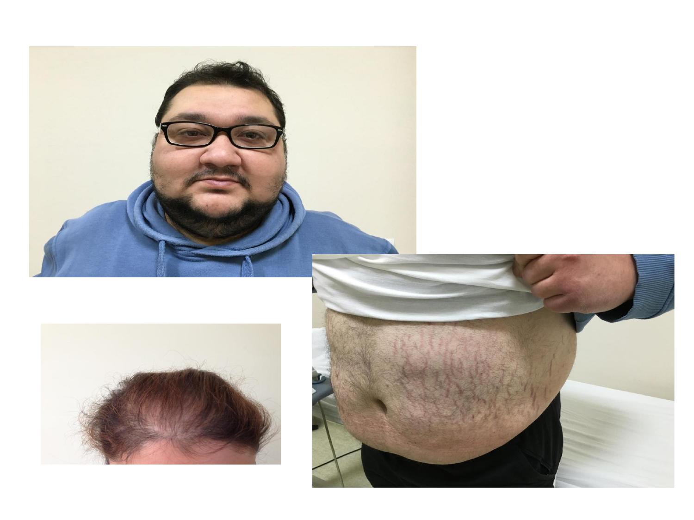
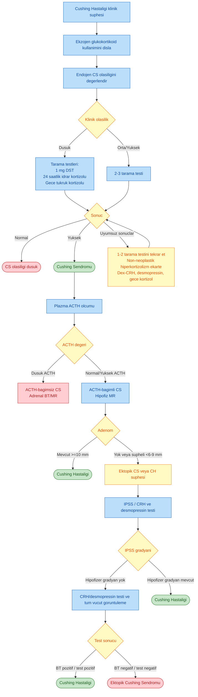
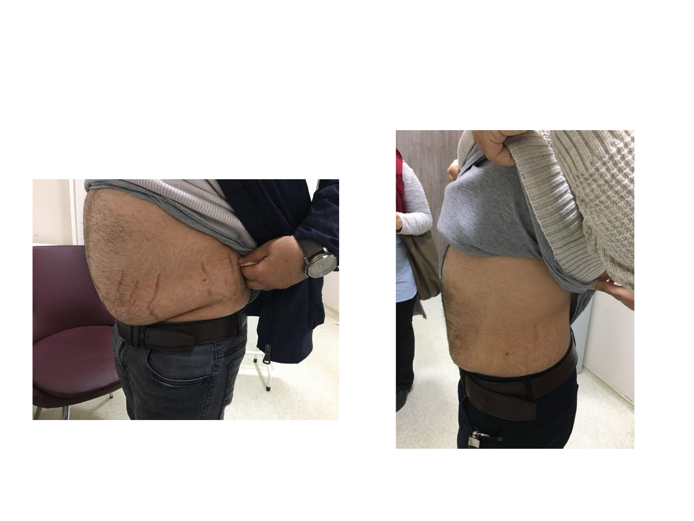
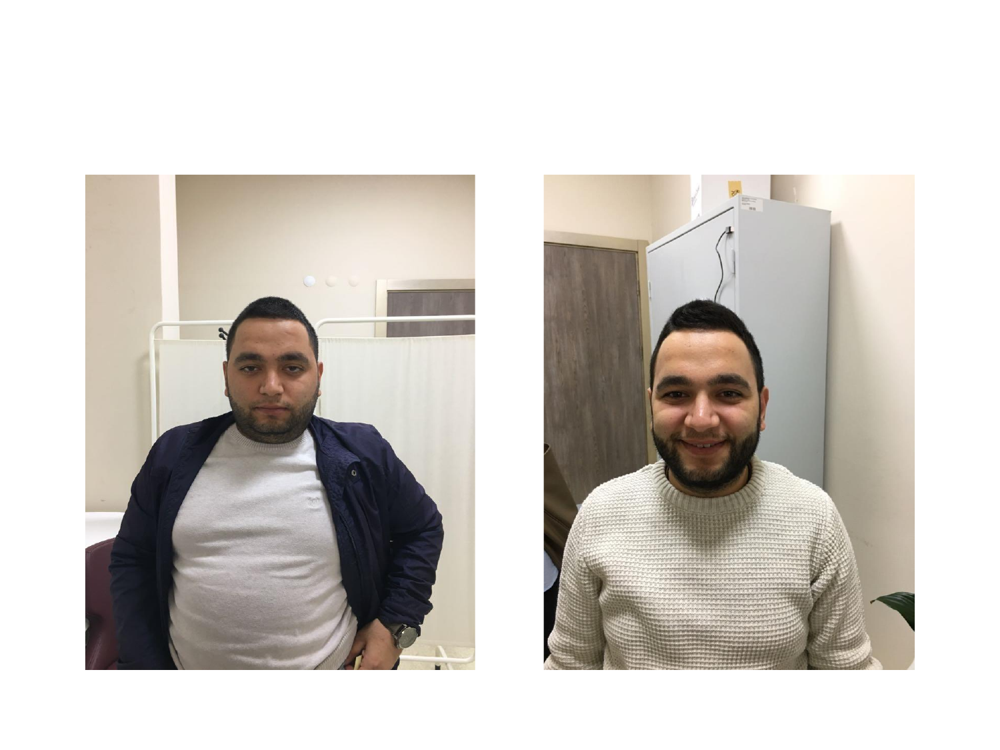

# CUSHING SENDROMU

**Hazırlayan:** Prof. Dr. Engin Güney
**Bölüm:** Aydın Adnan Menderes Üniversitesi -- Endokrinoloji Bilim Dalı

---

## İÇİNDEKİLER

1. [Tanım](#tanım)
2. [Etyoloji](#etyoloji)
3. [Psödo-Cushing ve Fizyolojik Hiperkortizolizm](#psödo-cushing-ve-fizyolojik-hiperkortizolizm)
4. [Klinik Bulgular](#klinik-bulgular)
5. [Kimlerde Cushing Sendromu Düşünülmeli](#kimlerde-cushing-sendromu-düşünülmeli)
6. [Mortalite](#mortalite)
7. [Tanıda Temel Prensipler](#tanıda-temel-prensipler)
8. [Tarama ve Doğrulama Testleri](#tarama-ve-doğrulama-testleri)
9. [Düşük Doz Deksametazon Baskılama Testleri](#düşük-doz-deksametazon-baskılama-testleri)
10. [Günlük İdrar Serbest Kortizol Atımı](#günlük-idrar-serbest-kortizol-atımı)
11. [Gece Yarısı Tükrük Kortizolü](#gece-yarısı-tükrük-kortizolü)
12. [Gece Yarısı Serum Kortizolü Ölçümü](#gece-yarısı-serum-kortizolü-ölçümü)
13. [Tanı Yorumu](#tanı-yorumu)
14. [Lokalizasyon Testleri ve ACTH](#lokalizasyon-testleri-ve-acth)
15. [Yüksek Doz 8 mg Deksametazon Baskılama Testi](#yüksek-doz-8-mg-deksametazon-baskılama-testi)
16. [CRH Testi](#crh-testi)
17. [Bilateral Inferior Petrozal Sinus Örnekleme (BIPSS)](#bilateral-inferior-petrozal-sinus-örnekleme-bipss)
18. [Testler İçin Özel Durumlar](#testler-için-özel-durumlar)
19. [Radyolojik Görüntüleme](#radyolojik-görüntüleme)
20. [Cushing Sendromu Tanı Algoritması](#cushing-sendromu-tanı-algoritması)
21. [Tedavi](#tedavi)
22. [Perioperatif Takip](#perioperatif-takip)
23. [Nelson Sendromu](#nelson-sendromu)
24. [Medikal Tedavi](#medikal-tedavi)
25. [Medikal Tedavi Ajanları Özet Tablosu](#medikal-tedavi-ajanları-özet-tablosu)

---

## TANIM

> **Tanım:** Cushing sendromu (CS); **kronik, aşırı ve uygunsuz glukokortikoid maruziyetinin** yol açtığı klinik tablodur.

Üç ana başlıkta incelenir:

* **Endojen CS:** Adrenal korteksten aşırı miktarda hormon (kortizol) üretimi
* **Ekzojen CS:** Tedavi amacı ile verilen glukokortikoid ajanlar (en sık görülen form)
* **Psödo-CS (Cushing benzeri durumlar):** Alkolizm, depresyon, obezite gibi durumlarda ortaya çıkan biyokimyasal bulgular

> **Kaynak:** Türkiye Endokrinoloji ve Metabolizma Derneği Hipofiz Hastalıkları Tanı, Tedavi ve İzlem Kılavuzu, 2022.

---

## ETYOLOJİ

Endojen Cushing sendromu, ACTH'a bağımlı olup olmamasına göre iki ana gruba ayrılır.

### Endojen Cushing Sendromu'nun Etyolojik Sınıflandırılması

| Kategori | Alt tip | Oran |
|---|---|---|
| **A. ACTH-bağımlı Cushing Sendromu** | | **%80-85** |
| | Cushing hastalığı (hipofiz ACTH salgılayan adenom) | %65-70 |
| | Ektopik ACTH sendromu | |
| | Ektopik CRH sendromu | |
| **B. ACTH-bağımsız Cushing Sendromu** | | **%15-20** |
| | Adrenal adenom | |
| | Bilateral makronodüler adrenal hiperplazi (multipl nodül ve çap >1 cm) | |
| | Primer bilateral makronodüler adrenokortikal hiperplazi (c-BMAH) | |
| | Çocuklukta bilateral makronodüler adrenokortikal hiperplazi (BMAH) | |
| | ACTH bağımsız makronodüler adrenokortikal hiperplazi (diffüz makronodüler adrenokortikal hastalık) (MMAD, AIMAH, MMAD) | |
| | Mikronodüler hiperplazi (multipl nodül ve çap <1 cm) | |
| | İzole primer pigmente nodüler adrenokortikal hastalık (i-PPNAD) | |
| | Carney kompleksi eşlik eden primer pigmente nodüler adrenokortikal hastalık (c-PPNAD) | |
| | İzole mikronodüler adrenokortikal hastalık (i-MAD) | |
| | Adrenal karsinom | |

> **Şema yorumu:** ACTH-bağımlı formların büyük çoğunluğunu **Cushing hastalığı** (hipofiz kaynaklı mikroadenom) oluşturur. ACTH-bağımsız formlar arasında ise **adrenal adenom** en sık görülürken, çocuklarda **bilateral makronodüler hiperplazi** ve Carney kompleksi gibi genetik sendromların ayırıcı tanıda akılda tutulması gerekir.

---

## PSÖDO-CUSHING VE FİZYOLOJİK HİPERKORTİZOLİZM

Gerçek Cushing sendromu olmadığı halde klinik ve/veya biyokimyasal olarak taklit eden durumlar vardır.

### Psödo-CS'ye Neden Olabilen Durumlar

| Durum |
|---|
| Gebelik |
| Kronik alkolizm |
| Morbid obezite |
| Kontrolsüz diyabet |
| Depresyon, yoğun stres durumları |

### Fizyolojik Hiperkortizolizme Neden Olabilen Durumlar

| Durum |
|---|
| Malnutriyon, anoreksiya nervoza |
| Yoğun fiziksel egzersiz |
| Yüksek CBG düzeyleri, OKS (oral kontraseptif) kullanımı |
| Glukokortikoid direnci |
| Hipotalamik amenore |

> **Klinik inci:** Gerçek CS ile psödo-CS ayrımı tarama testlerinin yorumlanmasındaki en zorlu noktadır. **2 mg deksametazon baskılama testi (klasik Liddle, LDDST)** bu senaryolarda tercih edilir.

---

## KLİNİK BULGULAR

Cushing sendromu'nun klinik spektrumu oldukça geniştir. Semptomlar ve bulgular yıllar içinde yavaşça ilerleyebilir.

### Tablo: Cushing Sendromu'nun Semptom / Bulguları ve Görülme Sıklıkları

| Semptomlar | % |
|---|---|
| Kilo artışı | 91 |
| Adet düzensizliği | 84 |
| Hirsutizm | 81 |
| Psikiyatrik belirtiler | 62 |
| Sırt ağrısı | 43 |
| Kas güçsüzlüğü | 29 |
| Kırıklar | 19 |
| Saçlarda dökülme | 13 |

| Bulgular | % |
|---|---|
| Obezite (özellikle santral obezite) | 97 |
| Pletora | 94 |
| Yüzde yuvarlaklaşma (aydede yüz görünümü) | 88 |
| Hipertansiyon | 74 |
| Kolay morarma, ekimoz | 62 |
| Pembe -- mor renkli çatlaklar (verjetür) | 56 |
| Bilek ödemi | 50 |
| Diabetes mellitus veya glukoz entoleransı | 50 |
| Osteoporoz | 50 |
| Böbrek taşı | 15 |
| Ciltte koyulaşma | 4 |

### Cushing Sendromlu Hastada Tipik Klinik Görünüm

> **Klinik fotoğraf yorumu (temkinli):**
>
> **Üst panel:** Hastanın yüzünde **aydede yüz görünümü** (moon face); yanaklarda dolgunluk, pletora (kırmızımsı kızarıklık) ve cilt incelmesi izlenmektedir. **Sağ alt panel:** Göbek ve flanklarda **geniş (>1 cm), mor-pembe renkli striae (verjetür)** -- deri atrofisine ve dermisin yırtılmasına bağlı klasik bulgu. **Sol alt panel:** Frontal bölgede **saçlarda dökülme/alopesi** dikkat çekmektedir. Bu bulgular toplu halde Cushing sendromu için oldukça tipiktir, ancak kesin tanı laboratuvar ile konur.

---

## KİMLERDE CUSHİNG SENDROMU DÜŞÜNÜLMELİ

### Kimler CS İçin Taranmalıdır

| Taranması Önerilen Grup |
|---|
| CS'ye özgü tipik klinik bulguları olan hastalar (santral obezite, stria, ciltte atrofi ve kolay ekimoz oluşumu, proksimal kas güçsüzlüğü vb) |
| Raslantısal adrenal lezyonu olanlar (adrenal insidentaloma) |
| Travmasız kırık, açıklanamayan osteoporoz ve/veya kontrolsüz diyabet ve hipertansiyonu olan hastalar |
| Boy uzaması geri kalan ve kilo alan çocuklar |

> **⚠️ ÖNEMLİ:** CS bulguları spesifik olmadığı için tarama kararı **klinik bütünlük** değerlendirilerek verilir. Tek bir bulgu (ör. sadece obezite) tarama endikasyonu oluşturmaz; ancak **birkaç bulgunun birlikteliği** (özellikle **stria, proksimal kas güçsüzlüğü ve kolay morarma**) çok değerlidir.

---

## MORTALİTE

Cushing sendromu tedavi edilmediğinde ciddi morbidite ve mortaliteye neden olur.

* **Venöz tromboemboli prevalansında artış**
* **Artmış protrombotik faktörler**, fibrinoliz ve anormal koagülasyon
* **Miyokard infarktüsü ve inme (stroke)** artmış metabolik ve vasküler etkiler dolayısıyla normal popülasyona oranla **3,6 kat yüksek**
* Bu hastalarda mortalitenin nedeni de sıklıkla **vasküler olaylardır**

> **Klinik inci:** Bu nedenle tüm cerrahi işlemlerde **düşük molekül ağırlıklı heparin (DMAH)** ile perioperatif tromboprofilaksi standart uygulamadır.

---

## TANIDA TEMEL PRENSİPLER

Tanı adımlarına başlamadan önce:

* **Ekzojen glukokortikoid ajan kullanımı** mutlaka dışlanmalıdır (en sık CS nedeni)
* **Hipotalamo-hipofizer-adrenal (HHA) aksın diürnal ritminin bozulması** gösterilmelidir
* **Negatif feedback kontrolün kaybolduğu** ortaya konmalıdır

> **CS'nin iki önemli belirleyicisi:**
> 1. Diürnal ritim kaybı (gece yarısı kortizolünde artış)
> 2. Glukokortikoid geribildirim mekanizmasının bozulması (deksametazon ile baskılanmama)

---

## TARAMA VE DOĞRULAMA TESTLERİ

### Cushing Sendromu Tanı ve Ayırıcı Tanı Testleri

| Aşama | Kullanılan Test |
|---|---|
| **Tanı -- Hastada Cushing Sendromu var mı?** | Serum kortizol diürnal ritmi |
| | Gece yarısı tükrük kortizolü |
| | 24 saatlik idrarda serbest kortizol düzeyi |
| | Düşük doz deksametazon baskılama testi |
| **Ayırıcı Tanı -- Hastadaki Cushing Sendromu'nun sebebi nedir?** | Plazma ACTH düzeyi |
| | Yüksek doz deksametazon baskılama testi |
| | CRH testi |
| | Hipofiz MRG |
| | İnferior petrozal sinus örneklemesi (BIPSS) |

---

## DÜŞÜK DOZ DEKSAMETAZON BASKILAMA TESTLERİ

### 1 mg Deksametazon Kortizol Baskılama Testi

* Gece 23.00-24.00 gibi **deksametazon 1 mg oral** yolla verilir
* Ertesi sabah saat 08.00-09.00 civarı serum kortizol ölçümü yapılır

### 2 mg Deksametazon Kortizol Baskılama Testi (Klasik Liddle / LDDST)

* **Ardışık 48 saat 4 x 0,5 mg deksametazon** ile kortizol baskılama testi
* Sabah saat 09.00'da başlamak üzere **6 saat ara** ile ardışık 48 saat oral yolla verilen deksametazonu takiben
* Son dozdan **6 saat kadar sonra** serum kortizol değeri ölçülür
* **Depresyon, anksiyete, obsesif kompulsif bozukluk gibi psikiyatrik bozukluklar, morbid obezite, alkolizm ve diyabetes mellitus** varlığında CS taraması için **optimal testtir**

### Testin Yorumu -- Serum Kortizol Düzeyi

> **Eşik değer:** Dex sonrası serum kortizolü **< 1,8 µg/dL** ise baskılama var (CS ekarte)
>
> * Duyarlılık: **%100**
> * Özgüllük: **%85**

### Deksametazon Baskılama Testlerinin Uygun Olmadığı Durumlar

* **Fenitoin, barbitürat, karbamazepin, rifampisin, alkol** gibi deksametazonun hepatik klirensini artıran ajanların kullanımı (yalancı pozitif)
* **Kortizol bağlayıcı globulin (CBG) düzeylerini artırarak total kortizol düzeylerini artıran OKS kullanımı** (yalancı pozitif)
* **Eşlik eden tirotoksikoz** durumunda deksametazonun hepatik klirensi artacağından

---

## GÜNLÜK İDRAR SERBEST KORTİZOL ATIMI

* **Endojen kortizol üretiminin doğrudan göstergesidir**
* Günlük **5 litrenin üzerinde sıvı alanlarda yalancı yüksek sonuç** verebilir
* **GFR 60 mL/dk altına inmiş** orta-ağır şiddette renal yetmezlikli olgularda da **yalancı negatif** sonuç alınır
* **High pressure liquid chromatography (HPLC)** metodu ile ölçümü **altın standart yöntemdir**

### Testin Sınırlamaları

* Duyarlılığı düşük bir test olduğu için **en az iki kez yapılmalı**
* **Tek başına tarama testi** olarak kullanılması tavsiye edilmez
* **Hafif hastalığı** atlayabilir
* **Siklik CS**'de yalancı negatif bulunabilir

---

## GECE YARISI TÜKRÜK KORTİZOLÜ

Saat 23.00 civarı alınan örnekle yapılan bir tarama testidir.

### Normal Diürnal Ritim

Uyku siklusu normal olan bir kişide:

* Serum kortizolü gece saat 03.00-04.00'de artmaya başlar
* Sabah saat 07.00-09.00'da **doruk (pik) seviyeye** ulaşır
* Günün geri kalan zamanında (stres yoksa) **çok düşük seviyelere** iner

### Tükrük Kortizolünün Özellikleri

* Tükrükteki kortizol, kandaki **biyolojik aktif serbest kortizol** ile denge halindedir
* Konsantrasyonu **tükrük üretim hızından etkilenmez**
* Kan kortizolündeki artış, tükrük kortizol konsantrasyonunda **birkaç dakika içinde** değişiklikle sonuçlanır

> **Eşik değer:** Gece saat 23.00-24.00 civarı tükrük kortizolü normal kişilerde **< 4 nmol/L**'dir.

### Ölçüm ve Saklama

* Cinsiyet, yaş, eşlik eden medikal durumların olası etkileri net değil
* Ölçümde **ELISA** ya da **LC-MS/MS** metotları kullanılmakta
* Tükrüğün emdirilerek ya da çiğnenerek pamuğa aktarılması, ardından plastik bir tüpte saklanması ve laboratuvara iletilmesi işlemidir
* **Oda sıcaklığında bir hafta** veya **buzdolabında haftalarca** bozulmaz

---

## GECE YARISI SERUM KORTİZOLÜ ÖLÇÜMÜ

* Diürnal ritmin belirlenmesinde kullanılan önemli bir yöntem
* Tarama testi olarak da kullanılabilir

### Normal Değerler

| Durum | Normal Gece Yarısı Serum Kortizolü |
|---|---|
| Uyurken | **< 1,8 µg/dL** |
| Uyanıkken | **< 7,5 µg/dL** |

---

## TANI YORUMU

* **Tarama testi normalse** hasta muhtemelen CS **değildir**
* **Yoğun klinik şüphe** varlığında **iki farklı tarama testi** yapılmalı
* Takipte yeni semptomlar ortaya çıkar veya bulgularda ilerleme olursa testler tekrar edilmeli
* **İki farklı testi pozitif** olan hastalarda **endojen hiperkortizolizm varlığı kabul edilir**

---

## LOKALİZASYON TESTLERİ VE ACTH

Tarama ve doğrulama testleri sonucunda CS tanısı konduktan sonra **kaynağın lokalizasyonu** belirlenir. İlk adım **plazma ACTH ölçümüdür**.

### ACTH Düzeyine Göre Ayrım

| Plazma ACTH Düzeyi | Yorum |
|---|---|
| **ACTH < 10 ng/L** | **ACTH-bağımsız** (adrenal kaynaklı) CS |
| **ACTH > 15-20 ng/L** | **ACTH-bağımlı** CS |
| **10 ng/L > ACTH < 15 ng/L** | **Belirsiz odak** -- CRH uyarısına ACTH yanıtı bakılmalıdır |

### ACTH Yüksek Hasta (ACTH > 15-20 ng/L)

ACTH-bağımlı CS saptandığında ayırıcı tanı gerekir:

* **Hipofizer Cushing (Cushing hastalığı)?**
* **Ektopik Cushing sendromu?**

Bu ayrım için **yüksek doz deksametazon baskılama testi, CRH testi ve BIPSS** kullanılır.

---

## YÜKSEK DOZ 8 mg DEKSAMETAZON BASKILAMA TESTİ

Bu test **iki şekilde** yapılabilir:

### Yöntem 1 (Klasik, Liddle Yüksek Doz)

* **4 x 2 mg deksametazon 2 gün** verilir
* 3. gün sabah saat 08.00-09.00 gibi sabah kortizol ölçülür

### Yöntem 2 (Tek doz, gece)

* **8 mg deksametazon** gece saat 23.00-24.00 gibi bir seferde alınır
* Ertesi sabah saat 08.00-09.00 civarı kortizol ölçülür

### Test Yorumu

Her iki yöntemde de ölçülen kortizol değeri:

* **Bazal kortizol ölçümünün %50'sinden düşük** ise → **Cushing Hastalığı**'na (hipofizer) işaret eder
* Ancak **hipofizer kaynaklı olguların sadece %80'i** %50'den fazla baskılanmaktadır
* **Ektopik ACTH olgularının da %10-30'u yalancı pozitif** sonuç verebilir

> **⚠️ ÖNEMLİ:** Testin duyarlılığı ve özgüllüğü sınırlıdır; tek başına yeterli değildir. BIPSS ve CRH testi ile birlikte değerlendirilmelidir.

---

## CRH TESTİ

**Mantık:** **Ektopik ACTH salgılayan tümörler CRH reseptörleri bulundurmayacakları için CRH uyarısına yanıt vermez**. Hipofizer adenomlar ise CRH'ye yanıt verir.

### Test Uygulaması

* **CRH 100 µg veya 1 µg/kg İV** yapılır
* **15 - 30 - 45 - 60 - 90 - 120. dakikalarda** ACTH yanıtı bakılır

### Test Yorumu -- Pozitif Yanıt

> **Cushing Hastalığı kriterleri:**
> * **ACTH artışı > %30-50** VE
> * **Kortizol artışı > %20**

### Tanısal Performans

* **Cushing Hastalığı'nda** olguların **%90'dan fazlasında** pozitif yanıt alınır
* **Ektopik ACTH Sendromu'nda** sadece **%10 civarı** hastada pozitif yanıt alınır

---

## BİLATERAL INFERİOR PETROZAL SİNUS ÖRNEKLEME (BIPSS)

**BIPSS + CRH (100 µg İV)** testi, ACTH-bağımlı CS'de altın standart tanısal yöntemdir.

### Testin Önemi

* **Cushing Hastalığı tanısında duyarlılığı ve özgüllüğü %100**
* **Tüm ACTH-bağımlı CS hastalarına** yapılması tavsiye edilir
* Başarısı, **radyoloğun deneyimine** dayanır

### Test Uygulaması

* Doğrulamayı takiben **CRH 100 µg İV** uygulanır
* **0., 3., 5., 8., 10. ve 15. dakikalarda** her iki inferior petrozal sinusten ve periferden ACTH ölçümü için örneklem alınır
* Ortalama **5. dakika civarı** yanıt alındığı düşünülür

### BIPSS Testi Yorumlanması

| Tanı | Santral/Perifer ACTH (0. dk -- bazal) | Santral/Perifer ACTH (CRH sonrası) |
|---|---|---|
| **Cushing Hastalığı** | > 2 | > 3 |
| **Ektopik ACTH Sendromu** | < 2 | < 3 |

### Lateralizasyon

* Bazı ACTH-bağımlı CS olgularında BIPSS sonuçları **santrali gösterdiği halde görüntüleme ile adenom izlenmeyebilir**
* Bu durumda, **santral sol-sağ ACTH gradienti > 1,4** olması, odağın yönünün belirlenmesinde kullanılabilir
* Olası mikroadenomun bulunduğu bölgeyi **%75-80 oranında** gösterir

---

## TESTLER İÇİN ÖZEL DURUMLAR

### Gebelik

* **Östrojen**, kortizol bağlayıcı globülin artışı ile total kortizol düzeylerini yükselteceği için **deksametazon baskılama testlerinin yalancı pozitif** çıkmasına neden olabilir
* Bu nedenle CS tanısında **gebelerde idrar kortizol atılımına** bakmak gerekir
* Normal gebelik seyrinde idrar kortizolü **normalin 3 katı** kadar artar
* **2. ve 3. trimestrde bu sınırın üzerindeki değerler** tanıda yol gösterebilir

### Epilepsi

* **Antiepileptik ilaçlar** (fenitoin, karbamazepin vb) deksametazonun hepatik klirensini artıracağı için epileptik hasta grubunda **deksametazon baskılama testi dışındaki testlerin** kullanılması önerilir

### Renal Yetmezlik

* **Kreatinin klirensi 60 mL/dk'nın altına indiğinde**, idrarla atılan kortizol miktarı azalmaya başlar
* Bu hasta grubunda tanıda **idrar kortizol atılımının bakılmaması** önerilir

### Adrenal İnsidentaloma

* Tarama testi olarak **1 mg deksametazon ile baskılama testi** önerilir
* **İdrar kortizol atılımı genellikle normaldir**

---

## RADYOLOJİK GÖRÜNTÜLEME

Lokalizasyon sonrasında hedef organ görüntülemesi yapılır.

* **ACTH-bağımsız (adrenal kaynaklı):** Adrenal görüntüleme
* **ACTH-bağımlı:**
  * Hipofiz görüntüleme
  * Ektopik ACTH için primer malignite taraması

### Cushing Sendromu Tanısında Kullanılan Görüntüleme Yöntemleri

| Görüntüleme Yöntemi | Kullanım Alanı |
|---|---|
| **Hipofiz MRG** | Cushing Hastalığı (adenomların %70'ini gösterir) |
| **Toraks HRCT / Batın MR** | Ektopik ACTH sendromu |
| **Oktreotid sintigrafi** | Ektopik ACTH sendromu |
| **PET (Pozitron Emisyon Tomografisi)** | Ektopik ACTH sendromu |
| **Sürrenal BT / MRI** | Bilateral hiperplazi, adenom veya karsinom; PPNAD; Bilateral makronodüler hiperplazi |

> **Kısaltma:** MRG: Manyetik rezonans görüntüleme

---

## CUSHING SENDROMU TANI ALGORİTMASI

Aşağıdaki akış şeması, klinik şüpheden kesin ayırıcı tanıya kadar tüm tanısal adımları özetler.

> **Algoritma yorumu:**
>
> 1. **İlk basamakta** mutlaka **ekzojen glukokortikoid kullanımı dışlanır** (en sık CS nedeni -- iatrojenik).
> 2. Klinik olasılığa göre **1-3 tarama testi** yapılır (1 mg DST, 24 saatlik idrar kortizolü, gece yarısı tükrük kortizolü).
> 3. **İki testi pozitif** olan hastada endojen CS tanısı konur.
> 4. **Plazma ACTH** ile **bağımlı / bağımsız** ayrımı yapılır.
> 5. ACTH-bağımsız → **adrenal BT/MR**; ACTH-bağımlı → **hipofiz MR**.
> 6. Hipofiz MR'da adenom **≥ 10 mm** net görülüyorsa → **Cushing Hastalığı**.
> 7. Adenom yok veya şüpheli ise → **BIPSS** ve CRH/desmopressin testi ile **hipofizer vs ektopik** ayrımı.
> 8. BIPSS gradyanı yoksa ve test negatifse → **ektopik ACTH sendromu** olarak kabul edilir; tüm vücut görüntülemesi yapılır.

---

## TEDAVİ

Tedavi yaklaşımı **altta yatan etyolojiye** göre belirlenir.

### Cushing Hastalığı (Hipofizer Adenom)

* **Trans-sfenoidal cerrahi (TSS)**, önerilen **ilk basamak müdahale**
* **Kavernöz sinus** ya da diğer beyin yapılarını invaze etmiş makroadenomlarda bu yolla **kür elde edebilmek olası değildir**

### Adrenal Kaynaklı CS

* **Adrenalektomi** (tek taraflı -- adenom/karsinom; bilateral -- hiperplazi)

### Ektopik ACTH Sendromu

* **Altta yatan malignitenin tedavisi** (sıklıkla küçük hücreli akciğer kanseri, karsinoid tümörler)

### Post-operatif Kür Olmayan Cushing Hastalığı

İlk TSS sonrası remisyona girmeyen hastada:

1. **İkinci TSS ile adenomektomi** ya da özellikle yaşlı hastada **total hipofizektomi**
2. **Hipofiz ışınlaması** (radyoterapi)
3. **Glukokortikoid hormon sentezini inhibe eden ilaçlar** (medikal tedavi)
4. **Bilateral adrenalektomi:**
   * Hiperkortizoleminin **radikal tedavisidir**
   * Tümör odağının gösterilemediği ya da gösterilip hormonal kontrolün sağlanamadığı ağır hasta grubunda **son seçenek**

### Tedavi Sonrası Klinik İyileşme

> **Klinik fotoğraf yorumu:** Başarılı tedavi sonrasında (TSS veya adrenalektomi) **pembe-mor renkli aktif stria** (verjetür) zamanla **soluk beyaz çizgiler** halinde silinir. Cilt elastikiyeti ve kas kütlesi de zamanla toparlanır. Bulguların tam olarak geri dönmesi **aylar-yıllar** alabilir.

> **Klinik fotoğraf yorumu:** **Sol panel** (tedavi öncesi): Aydede yüz görünümü, pletora, santral obezite, dolgunlaşmış yanaklar. **Sağ panel** (tedavi sonrası): Belirgin yüz inceltmesi, normal vücut kitlesi, pletoranın kaybolması. Remisyon sonrasında **vital bulgular** (hipertansiyon), **glukoz metabolizması** ve **kemik mineral yoğunluğunun** da düzelmesi beklenir -- ancak bazı değişiklikler (osteoporoz, psikiyatrik sekeller) kalıcı olabilir.

---

## PERİOPERATİF TAKİP

> **⚠️ ÖNEMLİ:** Cushing sendromunda ameliyat sırasında ve sonrasında iki ana risk vardır: **adrenal yetmezlik** ve **tromboembolik olaylar**.

* **Tüm etyolojik nedenlere yönelik CS'da** hastalar **steroid korumasında** ameliyata alınmalı
* Tüm cerrahi işlemlerde perioperatif dönemde **düşük moleküler ağırlıklı heparin (DMAH)** ile **trombozdan korunmalı**

---

## NELSON SENDROMU

> **Tanım:** **Bilateral adrenalektomiyi takiben oluşan/alevlenen** hipofizer ACTH salgılayan tümör gelişimi

### Patogenez

Bilateral adrenalektomi sonrası **kortizol feedback'inin kaybolması** nedeniyle hipofizdeki kortikotrop hücrelerin uyarılması; bazen var olan mikroadenomun büyümesine, bazen de yeni adenom gelişimine neden olur. Klinikte **şiddetli hiperpigmentasyon** (ACTH/MSH etkisi), **görme alanı defektleri** ve hipofizer tümör büyümesine bağlı bulgular görülür.

### Günümüzde Önleme Stratejisi

* Günümüzde pek çok merkezde, özellikle artık **hipofizer tümörü olan olgularda bilateral adrenalektomiyi takiben neoadjuvan radyoterapi** yapılmaktadır.

---

## MEDİKAL TEDAVİ

Medikal tedavi, cerrahinin mümkün olmadığı veya yetersiz kaldığı durumlarda uygulanır.

### Endikasyonlar

* **Hormonal aşırı aktivitenin cerrahi ile kontrol altına alınamadığı** durumlar
* Hormonal aşırı aktivite odağının gösterilemediği, **bilateral adrenalektomi kararı verilemediği** durumlar
* **Radyoterapi işlemi sonrası**, etkinliğin ortaya çıkmasının beklendiği ara dönem
* Ağır bulguları olan olgularda **ciddi hiperkortizoleminin olumsuz etkilerini kontrol altına almak** için **preoperatif hazırlık dönemi**

### Medikal Tedavi Ajanları

**Adrenolitik ajanlar (steroidogenez inhibitörleri):**

* **Metirapon**
* **Ketokonazol**
* **Mitotan**
* **Etomidat**
* **Mifepriston**
* **Aminoglutetimid**
* **Siproheptadin**
* **Trilostan**

**Santral etkili ajanlar:**

* **Dopamin agonistleri** (Kabergolin)
* **Somatostatin reseptör agonistleri**
* **Pasireotid**

---

### Ketokonazol

* **İmidazol derivesi antifungaldir**
* Adrenal bezde **11-β hidroksilaz, 17-20 liyaz ve 18 hidroksilaz** enzimlerini inhibe ederek adrenal **kortizol ve androjen üretimini baskılar**
* **Kortikotrop adenilat siklaz** enzim inhibisyonu ile ACTH üretimini de baskılayabilir

### Mitotan

* **CYP11A1 ve 11-β hidroksilaz** enzimi üzerinden etki göstererek kortizol üretimini baskılar
* Metaboliti olan **asil klorid**, mitokondrilerdeki makromoleküllere bağlanarak **hücre nekrozuna** neden olur -- bu nedenle adrenal korteks üzerine **direkt sitotoksik etkisi** vardır
* Çoğunlukla **adrenal karsinomların tedavisinde** kullanılır

### Metirapon

* **11-β hidroksilaz inhibitörü**
* Bu yolla **kortizol ve aldosteron sentezini** inhibe eder

### Etomidat

* Ketokonazol gibi **imidazol derivesi**
* **11-β hidroksilaz ve 17-α hidroksilaz** yolaklarını inhibe eder
* **İV uygulanabilir** -- oral alamayan, ağır hasta, yoğun bakım hastalarında tercih edilir

### Mifepriston

* **Anti-progestin özellikleri olan glukokortikoid reseptör antagonistidir**
* **Biyokimyasal olarak kortizol seviyesini düşürmeden**, hiperkortizoleminin metabolik etkileri -- **diyabet ve hipertansiyon gibi** -- üzerine olumlu etkisi vardır

### Pasireotid (Santral Etkili)

* **Somatostatin reseptörleri subtip 1 ve 5'e (SST1 ve SST5) yüksek afinitesi** olan somatostatin analoğudur
* **Kortikotrop hücreli adenomlarda özellikle SST5 ekspresyonu fazla** olduğu için cerrahi sonrası remisyona girmeyen hastalar için tedavide bir **alternatiftir**

### Kabergolin (Santral Etkili)

* **D2 reseptörleri** üzerinden etkilidir
* **Haftalık 7 mg dozuna kadar** çıkılabilir
* Tedaviye cevap **%30-40 civarındadır**
* **Adenom boyutunu küçültücü etkisi** bulunmaktadır

---

## MEDİKAL TEDAVİ AJANLARI ÖZET TABLOSU

| İlaç Sınıfı / Ajan | Yan Etkileri | Doz |
|---|---|---|
| **Steroidogenez inhibitörleri** | GİS, karaciğer, erkek hipogonadizmi, ilaç etkileşimleri GİS, hirsutizm, hipertansiyon, hipokalemi Adrenolitik, yavaş etki, lipofilik, yarı ömrü uzun, teratojenik, GİS, SSS yan etkileri, jinekomasti, lokozit sayısında, T4 azalma, KCFT ve CBG artışı İntravenöz kullanım, yoğun bakımda izlem | **Ketokonazol:** 400-1600 mg/gün **Metirapon:** 600 mg/6sa/gün **Mitotan:** 250-500 mg/gün başlangıç, 8 gr/gün **Etomidat:** Bolus ve titrasyon |
| **ACTH salgısını azaltanlar** | Bulantı, baş dönmesi, güçsüzlük s.c. verilim, bulantı, diyare, hiperglisemi, kolelitiazis, KCFT bozulma, QT de uzama | **Kabergolin:** 1-7 mg/hafta **Pasireotid:** 600-900 µg/günde iki kez |
| **Glukokortikoid reseptörü antagonisti** | Bulantı, kusma, halsizlik, artralji, hipertansiyon, hipokalemi, baş ağrısı, ödem, endometrium kalınlaşması | **Mifepriston:** 300-1200 mg/gün |

> **Klinik inci:** Steroidogenez inhibitörleri (ketokonazol, metirapon) günümüzde Cushing hastalığı ve ektopik ACTH sendromunda medikal tedavinin **en yaygın ilk tercihleridir**. **Ağır olgularda** ve yoğun bakımda **etomidat İV infüzyon** hızlı kortizol düşüşü sağlar. **Pasireotid** kortikotrop adenomlarda spesifik bir seçenektir ancak **hiperglisemi** yaygın bir yan etkidir. **Mifepriston**, biyokimyasal olarak kortizolü düşürmeden **klinik düzelme** sağlayan tek ajandır.

---

> **Kaynak:** Türkiye Endokrinoloji ve Metabolizma Derneği Hipofiz Hastalıkları Tanı, Tedavi ve İzlem Kılavuzu, 2022.
