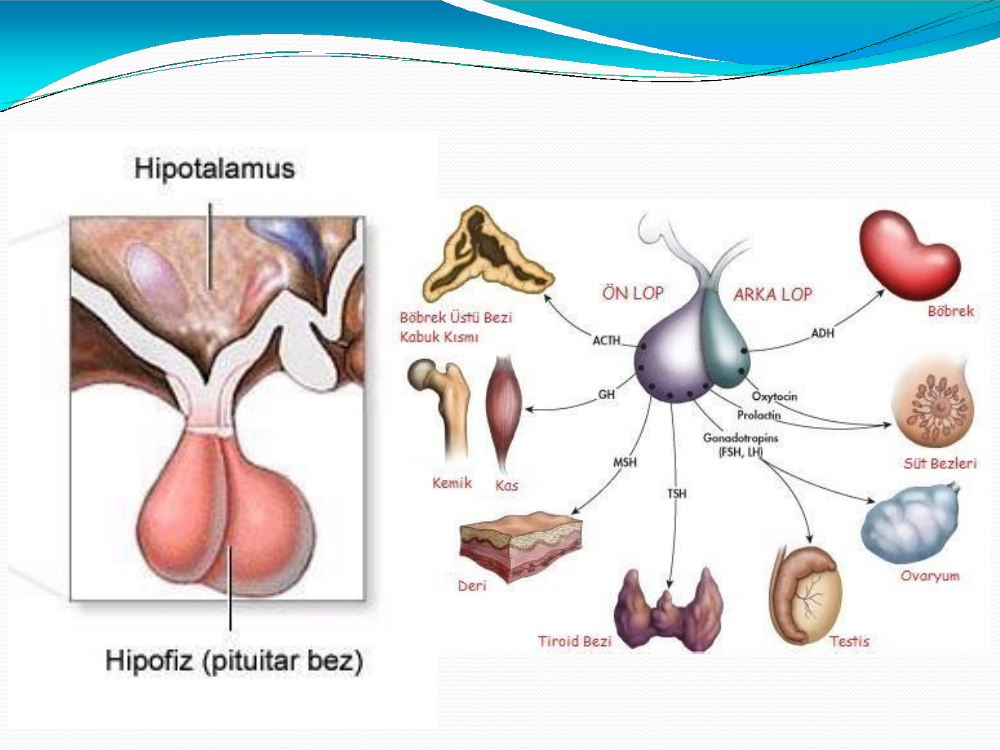
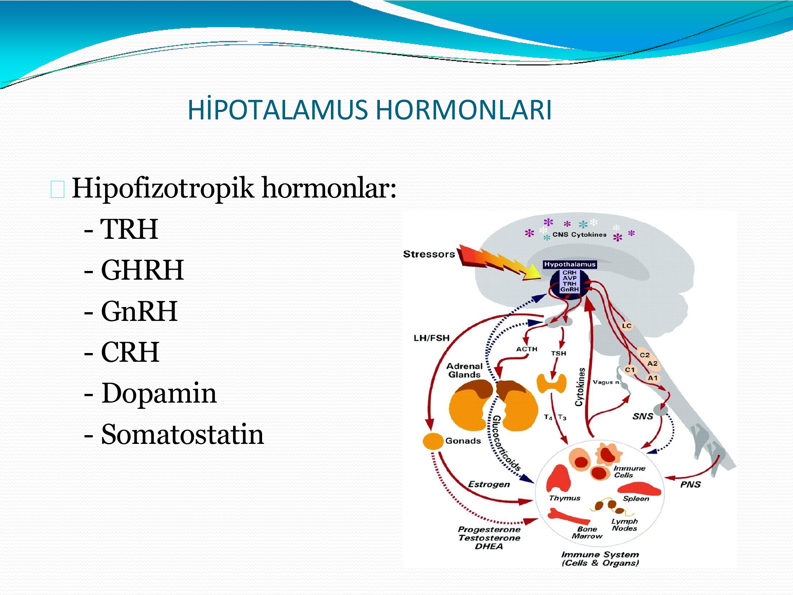
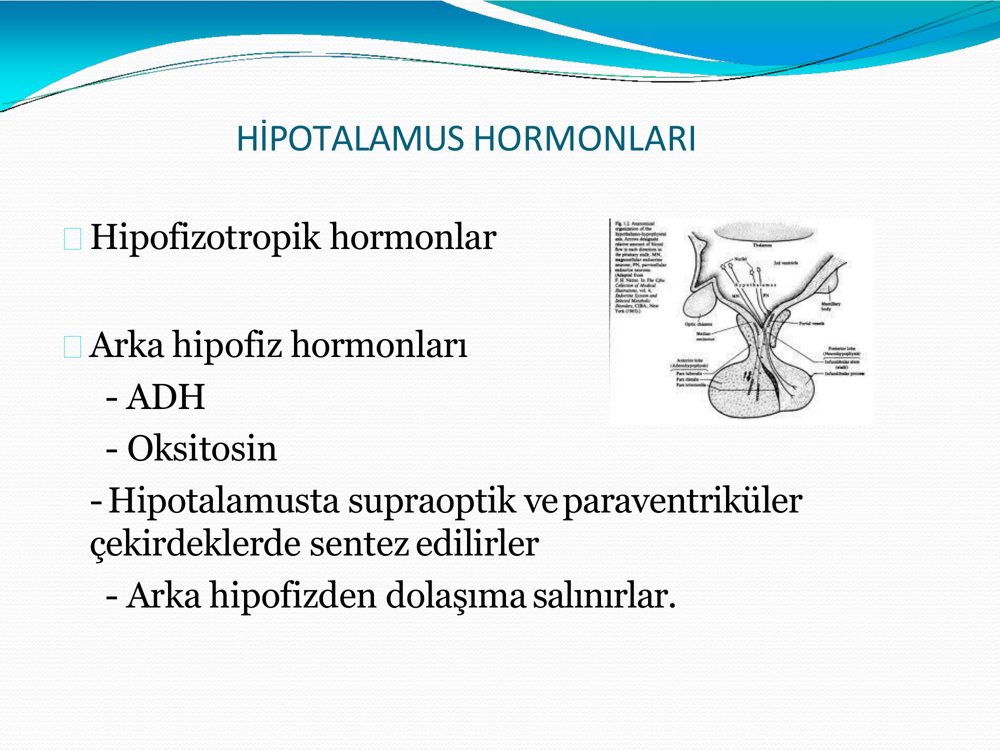
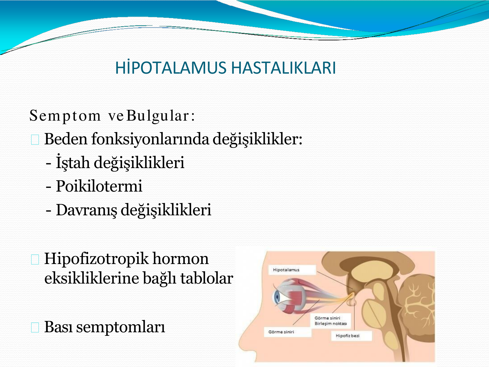
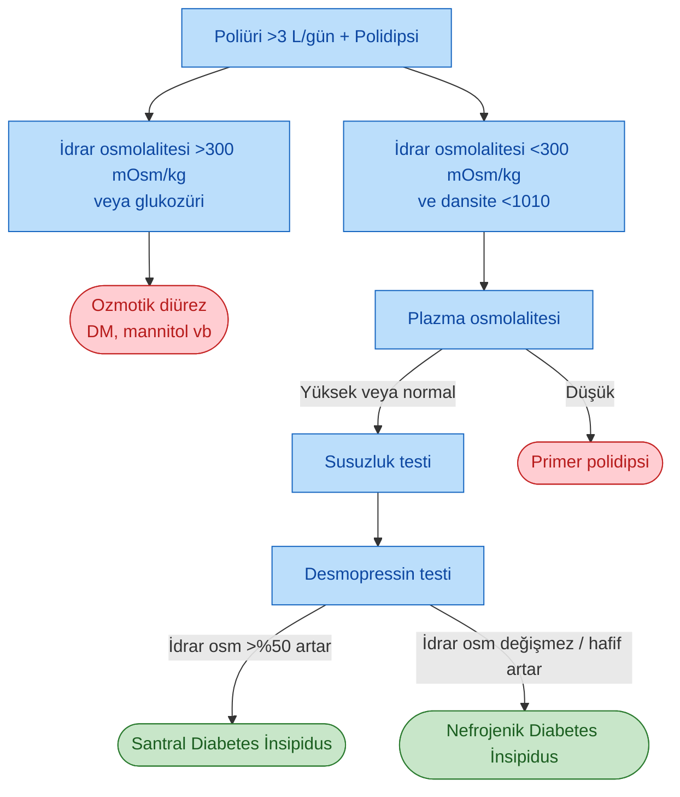
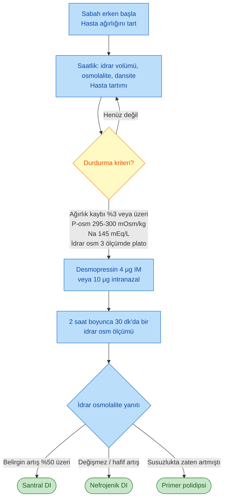
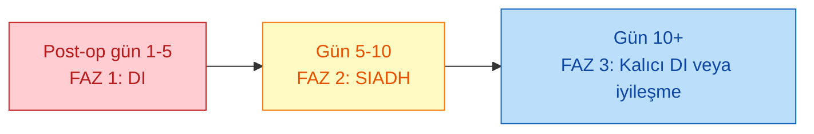

# DİABETES İNSİPİDUS

**Hazırlayan:** Prof. Dr. Engin Güney
**Bölüm:** Aydın Adnan Menderes Üniversitesi -- Endokrinoloji ve Metabolizma Hastalıkları Bilim Dalı

---

## İÇİNDEKİLER

1. [Hipotalamus ve Hipofiz Anatomisi](#hipotalamus-ve-hipofiz-anatomisi)
2. [Hipotalamusun Görevleri](#hipotalamusun-görevleri)
3. [Hipotalamus Hormonları](#hipotalamus-hormonları)
4. [Hipotalamus Hastalıkları](#hipotalamus-hastalıkları)
5. [Kraniofarenjioma](#kraniofarenjioma)
6. [Arka Hipofiz ve ADH Fizyolojisi](#arka-hipofiz-ve-adh-fizyolojisi)
7. [Diabetes İnsipidus -- Tanım ve Sınıflama](#diabetes-i̇nsipidus--tanım-ve-sınıflama)
8. [Santral Diabetes İnsipidus Nedenleri](#santral-diabetes-i̇nsipidus-nedenleri)
9. [Nefrojenik Diabetes İnsipidus](#nefrojenik-diabetes-i̇nsipidus)
10. [Primer Polidipsi](#primer-polidipsi)
11. [Gestasyonel Diabetes İnsipidus](#gestasyonel-diabetes-i̇nsipidus)
12. [Klinik Bulgular](#klinik-bulgular)
13. [Tanı ve Ayırıcı Tanı](#tanı-ve-ayırıcı-tanı)
14. [Susuzluk (Dehidratasyon) Testi](#susuzluk-dehidratasyon-testi)
15. [Tedavi](#tedavi)
16. [Post-operatif DI (Üç Fazlı Yanıt)](#post-operatif-di-üç-fazlı-yanıt)
17. [Adipsik Diabetes İnsipidus](#adipsik-diabetes-i̇nsipidus)
18. [Vaka Örnekleri](#vaka-örnekleri)

---

## HİPOTALAMUS VE HİPOFİZ ANATOMİSİ

> **Tanım:** Hipotalamus, talamus ve subtalamusun altında yerleşik, önde optik kiazma ve lamina terminalis, arkada mammillar cisimler, yanlarda optik sinirler ile çevrili; erişkinde yaklaşık **4 gram ağırlığında** bir nöroendokrin organdır.

> **Şema yorumu:**
>
> **Sol panelde** hipotalamus-hipofiz sagittal anatomisi: beynin tabanında yer alan **hipotalamus**, **hipofiz sapı (infundibulum)** aracılığı ile sella turcica içindeki **hipofiz bezine (pituiter bez)** bağlanır.
>
> **Sağ panelde** hipofizin **ön lobu (adenohipofiz)** ve **arka lobu (nörohipofiz)** ile hedef organlara giden hormon ağı gösterilmiştir:
>
> * **Ön lop:** ACTH (böbrek üstü bezi korteksi), GH (kemik, kas), TSH (tiroid), FSH/LH (testis, ovaryum), prolaktin (süt bezleri), MSH (deri)
> * **Arka lop:** **ADH (böbrek)** ve **oksitosin (süt bezleri)**

---

## HİPOTALAMUSUN GÖREVLERİ

Hipotalamus, hipofiz üzerine etki ile endokrin organların çalışmasını düzenler. Salgıladığı hormon ve nörotransmitterler aracılığıyla endokrin dışı fonksiyonları da kontrol eder:

* **Gıda ve su alımı**
* **Uyku-uyanıklık döngüsü**
* **Vücut ısısının ayarlanması**
* **Davranış**

---

## HİPOTALAMUS HORMONLARI

Hipotalamus hormonları iki büyük gruba ayrılır:

### 1. Hipofizotropik Hormonlar (Ön Hipofizi Uyaran veya Baskılayan)

* TRH
* GHRH
* GnRH
* CRH
* Dopamin
* Somatostatin

> **Şema yorumu:**
>
> Şekilde **hipotalamus**, **stres uyaranları (Stressors)** ve **SSS sitokinleri (CNS Cytokines)** tarafından uyarılır. Hipotalamik hormonlar ön hipofiz üzerinden ACTH, TSH, GH, LH/FSH, prolaktin salınımını düzenler. Bunlar sırasıyla **adrenal (kortizol)**, **tiroid (T3/T4)**, **gonadlar (östrojen, testosteron, DHEA)** ve diğer hedef organları etkiler. Hipotalamik-hipofizer aks ayrıca **sempatik sinir sistemi (SNS)**, **perifer sinir sistemi (PNS)** ve **immün sistem (timus, dalak, kemik iliği, lenf nodları)** ile iki yönlü etkileşim halindedir.

### 2. Arka Hipofiz Hormonları (Nörohipofizden Salınan)

> **Şema yorumu:** Hipotalamusun **supraoptik nukleusu (SON)** ve **paraventriküler nukleusundan (PVN)** kalkan magnosellüler nöronların aksonları hipofiz sapı içinden arka hipofize (nörohipofiz) uzanır. ADH ve oksitosin ayrı gangliyon hücrelerinde sentezlenir, aksonlar boyunca taşınır, nörohipofizde depolanır ve uygun uyaranlarla dolaşıma salınır.

* **ADH (Vazopressin, AVP)**
* **Oksitosin**

> Her iki hormon hipotalamusta **supraoptik (SON)** ve **paraventriküler (PVN)** çekirdeklerde ayrı gangliyon hücrelerinde sentezlenir; aksonal taşıma ile nörohipofize inip burada depolanır, uygun uyaranlarla dolaşıma salınır.

### Hipofizotropik Hormonların Fonksiyonel Özeti

| Hormon | Salgılandığı Bölge | Temel Etki |
|---|---|---|
| **GnRH** | Ön hipotalamus, preoptik bölge | Hipofizden **FSH ve LH** salgılatır |
| **GHRH** | Ventromedial ve arkuat nukleus | Hipofizden **büyüme hormonu (GH)** salgılatır |
| **TRH** | Paraventriküler nukleus | Hipofizden **TSH** (ve daha az prolaktin) salgılatır |
| **CRH** | Paraventriküler nukleus | Hipofizden **ACTH** (POMC ürünleri: β-endorfin, β-lipotropin, MSH) salgılatır |
| **Dopamin** | Arkuat ve ventromedial nukleus | Hipofizden **prolaktin salgılanmasını baskılar** (Prolactin Inhibiting Factor) |
| **Somatostatin** | Periventriküler alan (optik kiazma önü) | **GH** (ve daha az TSH) salgılanmasını **baskılar** |

### Hipofizotropik Damarsal Düzenek

Üst hipofiz arteri hipotalamusun alt bölgesinde kapiller ağa ayrılır; hipotalamik hormonlar bu kapillerlere salgılanır ve **hipotalamo-hipofizer portal venler** aracılığıyla ön hipofize ulaşır. Bu yapı, **çok az miktardaki hipotalamik hormonların bile sistemik dolaşımda dilüe olmadan ön hipofize yüksek konsantrasyonda** ulaşmasını sağlar.

### Hipotalamus Nörotransmitterleri

* Dopamin
* Norepinefrin
* Epinefrin
* Serotonin
* GABA
* Opioid peptidler
* Asetil kolin
* Histamin

---

## HİPOTALAMUS HASTALIKLARI

### Etiyoloji

* **Tümörler** (en sık)
* **Sarkoidoz** ve diğer granülomatöz hastalıklar
* **Hipofizotropik hormonların doğuştan izole veya kombine eksiklikleri**

### Hipotalamik Tümörler

* **Kraniofaringioma** (çocuklarda sık)
* **Hipotalamustan köken alan primer SSS tümörleri:** Epidermoid ve dermoid tümörler (erişkinlerde sık)
* **Glioma**
* **Meningioma**
* **Hamartoma**

### Semptom ve Bulgular

> **Şema yorumu:** Hipotalamik/hipofizer yerleşimli kitleler **optik kiyazmaya bası** yaparak görme alanı defekti (tipik olarak bitemporal hemianopsi) oluşturabilir. Aynı zamanda hipotalamus parankimi ve hipofiz sapı tutulumu, hormonal eksiklik ve diabetes insipidus tablosuna yol açabilir.

**Beden fonksiyonlarında değişiklikler:**

* İştah değişiklikleri (hiperfaji / anoreksi)
* **Poikilotermi** (ısı regülasyonu bozukluğu)
* Davranış değişiklikleri

**Hormonal bulgular:**

* Hipofizotropik hormon eksikliklerine bağlı tablolar (hipopituitarizm)
* **Bası semptomları** (baş ağrısı, görme alanı defekti)

### Laboratuvar Değerlendirmesi

* Hipofiz hormonları ve hedef organ hormon düzeylerinin ölçümü
* Uyarı ve baskılama testleri
* **Hipotalamus hastalıklarında genellikle prolaktin dışındaki hormon düzeylerinde azalma ve hiperprolaktinemi** görülür (sap basısı ile dopamin inhibisyonunun kalkması)
* **Ön hipofiz yetmezliğine diabetes insipidus eşlik ediyorsa, hipotalamik hasar veya hipofiz sap basısı düşünülmelidir**

### Görüntüleme

* **MRI** (en iyi yöntem)
* Bilgisayarlı tomografi (BT) -- özellikle kalsifikasyon varlığında
* Kraniofarenjiomada kafa grafisinde kalsifikasyon görülebilir

---

## KRANİOFARENJİOMA

> **Tanım:** Hipofizin embriyonel gelişimi **Rathke kesesi** olarak adlandırılan bir doku parçasından olmaktadır. Kraniofarenjiomalar, Rathke kesesi kalıntılarından köken alan nadir benign tümörlerdir. (Diğer adları: **Rathke kesesi tümörü**, **adamantinoma**.)

**Epidemiyoloji:** Yılda 1 milyonda **1-2 yeni olgu**.

### Yerleşim ve Büyüme

Sıklıkla **hipofiz sapının suprasellar kısmından ve optik kiyazmaya yakın bölgeden** gelişirler; büyük boyutlara ulaşabilirler. Hipofiz sapı, çevre dokular ve suprasellar sisterne doğru büyüyerek **bası etkisi** yaparlar.

### Klinik

| Yaş Grubu | Klinik |
|---|---|
| **Çocuklar** | Büyüme ve gelişme geriliği |
| **Erişkin erkek** | İmpotans, libido kaybı |
| **Erişkin kadın** | Amenore |

### Radyoloji

* **MRI veya BT** ile kitle görüntülemesi
* Genellikle **kalsifikasyon** içerdikleri için kafatası grafisi ve BT tipik görüntü verir

### Tedavi

* Öncelikle **cerrahi**
* Tam rezeksiyon olmazsa **radyoterapi (RT)**
* **Yıllık BT ile takip**
* **Hipopituitarizm gelişmesi** açısından izlenmelidir

---

## ARKA HİPOFİZ VE ADH FİZYOLOJİSİ

### Anatomi

Hipotalamusta **supraoptik ve paraventriküler nukleuslardan** kalkan aksonlar hipofiz sapı içinde arka hipofize uzanır. **Vazopressin (AVP, ADH)** ve **oksitosin** ayrı gangliyon hücrelerinde yapılır; nörohipofizde depolanır, uygun uyaranlarla buradan salınır.

### Vazopressin (ADH) Etki Mekanizması

**ADH salınımı uyaranları:**

* **Plazma effektif ozmotik basıncındaki artış** (en önemli fizyolojik uyaran)
* Etkin dolaşım volümü azalması, hipotansiyon
* Bulantı, ağrı, stres

**Ozmoreseptörler** başlıca **anterolateral hipotalamusta** bulunur.

**ADH'nin en önemli etkisi:** İdrar miktarının azaltılması. Bu etki, böbrekte **distal ve toplayıcı tübüller düzeyinde serbest suyun geri emilmesi** ile ortaya çıkar.

> **Moleküler mekanizma:** ADH, toplayıcı tübül prensipal hücrelerinde bazolateral membrandaki **V2 reseptörüne** bağlanır → Gs-protein → adenil siklaz ↑ → cAMP ↑ → **akuaporin-2 (AQP2)** su kanallarının apikal membrana yerleşmesi → serbest su geri emilimi ↑ → idrar konsantre olur.

### ADH Reseptörleri

| Reseptör | Doku | Etki |
|---|---|---|
| **V1a** | Damar düz kası, karaciğer | Vazokonstrüksiyon, glikojenoliz |
| **V1b (V3)** | Ön hipofiz | ACTH salınımı |
| **V2** | Böbrek toplayıcı tübül | **Akuaporin-2 → su reabsorpsiyonu** |

---

## DİABETES İNSİPİDUS -- TANIM VE SINIFLAMA

> **Tanım:** **ADH eksikliği ya da etkisizliği** sonucu oluşan, **poliüri** (>3 L/gün veya >50 mL/kg/gün) ve **polidipsi** ile karakterize, idrarın dilüe kaldığı klinik tablodur.

### Sınıflama (Ayırıcı Tanı)

DI kliniği (poliüri + polidipsi) ile başvuran hastada **dört temel ayırıcı tanı** vardır:

1. **Ozmotik diürez** (ör. hiperglisemi, mannitol, yüksek sodyum yükü)
2. **Primer polidipsi**
3. **Santral (nörojenik) diabetes insipidus** -- arka hipofizden ADH salınımı bozuktur
4. **Nefrojenik diabetes insipidus** -- ADH salınımı normaldir ancak böbrek ADH'ya **yanıtsızdır**

---

## SANTRAL DİABETES İNSİPİDUS NEDENLERİ

> **Tanım:** Santral (nörojenik) DI'da hipotalamik ADH sentezi veya arka hipofizden ADH salınımı bozulmuştur.

**Ana nedenler:**

* Tümörler
* Hipofizektomi (cerrahi)
* Histiositozis X (Langerhans hücreli histiositoz)
* İnfeksiyonlar (menenjit, ensefalit)
* İskemi
* Otoimmün (lenfositik infundibulonörohipofizit)
* Familial / kalıtsal
* İdiopatik
* Travma

### 1. Hipotalamus ve Hipofizin Neoplastik / İnfiltratif Lezyonları

**Tümörler:**

* **Hipofiz adenomları** -- büyük olsalar bile DI'a yol açmaları **nadirdir**
* **Kraniofarinjioma** (hipotalamik kaynaklı, sık DI nedeni)
* Germinoma
* Pinealoma
* **Metastatik tümörler** (en sık meme, akciğer)
* Lösemi
* **Histiositozis X** (Langerhans hücreli histiositoz)
* **Sarkoidoz**

> **Önemli mekanizma:** Hipofiz adenomları büyük olsa bile DI nadirdir; çünkü DI oluşması için ya **hipofiz sapının kesilmesi** (hipotalamik-nörohipofizer nöron bağlantısının bozulması) ya da **hipotalamusta ADH sentezleyen nöronların direkt tahribi** gerekir. Hipotalamik tümörler (kraniofarinjioma gibi) ve bölgenin infiltratif-invazif lezyonları bu nedenle daha sık DI yapar.

### 2. Hipofiz veya Hipotalamus Cerrahisi Sonrası

| Özellik | Detay |
|---|---|
| **Başlangıç** | Operasyondan **1-6 gün** sonra ortaya çıkar |
| **Geçici form** | Genellikle birkaç gün içinde iyileşir; iskemiye bağlıdır (~%5) |
| **Kronik form** | Tam hasar varsa **1-5 günlük aradan sonra tekrar başlar** ve kronikleşir (~%2) |
| **Kalıcı DI koşulu** | Ancak **hipofiz sapının yüksek seviyelerindeki kesiler** kalıcı DI yapar |

**⚠️ ÖNEMLİ:** Transsfenoidal hipofiz cerrahisi sonrası **üç-fazlı yanıt** (triphasic response) görülebilir -- ilerideki [Post-operatif DI](#post-operatif-di-üç-fazlı-yanıt) bölümüne bakınız.

### 3. Ciddi Kafa Travması

* Spontan olarak aksonların rejenerasyonuna bağlı **6 ay içinde remisyon** olabilir
* Yüksek seviyeli sap ayrılmalarında kalıcı olabilir

### 4. İdiopatik Santral DI

* Genellikle çocuklukta başlar
* "İdiopatik" demek için **tümör veya başka lezyon olmadığı** bilinmeli
* Ön hipofiz yetersizliği, hiperprolaktinemi veya sellar lezyona işaret eden radyolojik bulgu şüphesi varsa hasta **3-12 ay aralarla izlenmelidir**
* Bu vakalarda supraoptik ve paraventriküler nukleuslar azalmış veya **nukleuslara karşı antikor** gelişmiş olabilir (otoimmün süreç)

### 5. Familial ve Konjenital Hastalık

* Nadiren **kalıtsal** olarak geçebilir
* **Otozomal resesif DIDMOAD (Wolfram sendromu):**
  * **D**iabetes **I**nsipidus
  * **D**iabetes **M**ellitus
  * **O**ptik **A**trofi
  * **D**eafness (sağırlık)
* Otozomal dominant formlar (AVP-neurophysin II geni, WFS1) da tanımlıdır

### 6. Diğer

Şok, kardiopulmoner arrest, hipertansif ensefalopati, zehirlenmeler ve menenjitler gibi **travmatik olmayan ensefalomalaziler** de neden olabilir.

---

## NEFROJENİK DİABETES İNSİPİDUS

> **Tanım:** ADH salınımı normal veya yüksek olmasına rağmen **böbreğin ADH'ya yanıt vermediği** tablodur.

**Patofizyolojik temel:**

* **ADH'ya renal cevap yoktur**
* **ADH düzeyi normal veya yüksektir**

### Nedenler

**A. Kalıtsal (Herediter):**

* **V2 reseptör mutasyonu** -- X'e bağlı resesif (en sık konjenital form; erkek çocuklarda)
* **Akuaporin-2 (AQP2) mutasyonu** -- otozomal resesif/dominant

**B. Edinsel:**

* **İlaçlar:**
  * **Lityum** (en sık edinsel neden)
  * **Demeklosiklin**
  * Amfoterisin B, foskarnet, sisplatin, ifosfamid
* **Elektrolit bozuklukları:**
  * **Hiperkalsemi**
  * **Hipokalemi**
* **Kronik böbrek hastalıkları:**
  * Böbreğin **medulla ve toplayıcı kanallarını** tutan kronik renal hastalıklar
  * Kronik tübülointerstisyel nefrit
  * Orak hücre nefropatisi
  * Amiloidoz
* **Post-obstrüktif diürez** (uzamış idrar yolu tıkanıklığı sonrası)
* Gebelik (vazopressinaz etkisi ile -- gestasyonel DI'a bakınız)

---

## PRİMER POLİDİPSİ

> **Tanım:** Susama regülasyonunun **(osmotik veya nonosmotik)** değişikliğe uğramasına bağlı **susama bozukluğudur**.

**Özellikler:**

* **Günde 5 L'yi geçen aşırı su içimi** vardır
* Kronik yüksek su yüklemesi → **ADH fizyolojik olarak baskılanır** → poliüri gelişir
* ADH baskılandığı için idrar dilüedir

### Alt Tipler

| Tip | Özellik |
|---|---|
| **Psikojenik polidipsi** | Psikiyatrik hastalığa eşlik eder (şizofreni, obsesif davranış) |
| **Dipsojenik polidipsi** | Hipotalamik susama merkezi disregülasyonu; osmotik eşik düşmüştür |
| **İatrojenik** | Hasta veya doktor kaynaklı aşırı sıvı önerisi |

> **Ayırıcı özellik:** Primer polidipside **hem idrar hem plazma osmolalitesi düşüktür** (dilüsyonel hiponatremi eğilimi); DI'da ise idrar dilüe ama **plazma osmolalitesi normalin üst sınırı veya yüksektir**.

---

## GESTASYONEL DİABETES İNSİPİDUS

> **Tanım:** Gebeliğin 3. trimesterinde plasentadan salınan **vazopressinaz (sistin-aminopeptidaz)** enziminin endojen ADH'yı artmış oranda yıkması sonucu gelişen geçici DI tablosudur.

**Özellikler:**

* Gebeliğin **ikinci yarısında** (genellikle 3. trimester)
* Doğumdan **4-6 hafta sonra** düzelir
* **Desmopressin (dDAVP) vazopressinaza dirençlidir** ve tedavide kullanılır
* Natürel ADH tedavide etkisizdir

---

## KLİNİK BULGULAR

**Ana semptomlar:**

* **Poliüri** (günlük idrar miktarı **>50 mL/kg** veya erişkinde genelde **>3 L/gün**, ağır vakalarda 10-20 L/gün)
* **Polidipsi** (aşırı susama, özellikle soğuk su tercihi karakteristik)
* **Noktüri** (geceleri tekrarlayan işeme)
* **Dehidratasyon** -- susama merkezi sağlamsa hasta yeterli sıvı alarak kompanse eder; **susama merkezi hasarı varsa (adipsik DI) hayatı tehdit eden hipernatremi** gelişir
* Çocuklarda: büyüme geriliği, enürezis, iştahsızlık

---

## TANI VE AYIRICI TANI

### Temel Laboratuvar

| Parametre | DI Değeri |
|---|---|
| **24 saatlik idrar volümü** | >50 mL/kg veya >3 L/gün |
| **İdrar dansitesi** | <1010 (sıklıkla <1005) |
| **İdrar osmolalitesi** | **<300 mOsm/kg** |
| **Plazma osmolalitesi** | Normal veya **yüksek** (>295 mOsm/kg) |
| **Serum sodyum** | Normal veya yüksek |

> **Uyarı:** Bu **random ölçümlerin sensitivitesi düşüktür**. Tanı için **susuzluk (dehidratasyon) testi** ve **vazopressin yanıt testi** gereklidir.

> **Not:** Plazma AVP tayini pahalı, zaman alıcı ve **rutin olarak gerekli değildir**. Son yıllarda ADH öncül peptidi olan **kopeptin** ölçümü daha stabil bir alternatif olarak kullanılmaktadır (hipertonik salin veya arginin uyarısı sonrası).

### Primer Polidipsi Ayırıcı Noktası

* **DI:** Plazma osmolalitesi **yüksek**, idrar osmolalitesi düşük
* **Primer polidipsi:** **Hem plazma hem idrar osmolalitesi düşüktür**

---

## SUSUZLUK (DEHİDRATASYON) TESTİ

> **Amaç:** Dehidratasyon karşısında böbreğin idrarı konsantre etme kapasitesini ölçmek; ardından ekzojen desmopressin vererek böbreğin ADH'ya yanıtını test etmek. Bu yolla **santral DI / nefrojenik DI / primer polidipsi** ayrımı yapılır.

### Test Prosedürü

1. **Sabah erken** teste başlanır
2. Hasta test boyunca **yakın gözlem** altında tutulur
3. Hasta **her saat başı tartılır**
4. Başlangıç kilosunun **%3'ünden fazlasını kaybetmesine izin verilmez** (aksi halde hastanın hayatı tehlikeye girer; test sonlandırılır)
5. **İdrar volümü ve osmolalitesi** (imkan yoksa dansitesi) **saat başı** ölçülür
6. Plazma osmolalitesi ve sodyum periyodik olarak bakılır

### Beklenen Yanıtlar

* **Normal kişide:** İdrar volümü azalır, dansite ve osmolalitesi artar (>600 mOsm/kg)
* **DI'lı hastada:** İdrar dansitesi **1005'in altında** kalır ve konsantre olmaz

### Desmopressin (Vazopressin) Yanıt Testi

**Test Sonlandırma / Desmopressin Verme Kriterleri:**

Aşağıdakilerden biri sağlanırsa desmopressin uygulaması yapılır:

* **İdrar dansitesi veya osmolalitesi son 3 ölçümde değişmezse** (plato)
* **Plazma osmolalitesi 295-300 mOsm/kg'ı aşarsa**
* **Plazma sodyum 145 mEq/L'yi aşarsa**

**Uygulama:**

* **Desmopressin 4 μg IM** (veya intranazal yoldan **10 μg**)
* İdrar osmolalite ve hacmi **2 saat boyunca 30 dakikada bir** ölçülür

### Desmopressin Sonrası Yanıt

| Grup | İdrar Osmolalite Yanıtı |
|---|---|
| **Normal kişi** | Vazopressin sonrası idrar osmolalitesi **%9'dan fazla artmaz** (zaten maksimum konsantre olmuştur) |
| **Komplet santral DI** | **%100 artış** -- belirgin yanıt |
| **Parsiyel santral DI** | %10-50 arası artış |
| **Nefrojenik DI** | Susuzluktan sonra **hafif artış olur ancak desmopressine cevap vermez** |

### Ayırıcı Tanı Tablosu (Özet)

| Parametre | Santral DI | Nefrojenik DI | Primer (Psikojenik) Polidipsi |
|---|---|---|---|
| **Plazma osmolalitesi** | Yüksek | Yüksek | **Düşük** |
| **İdrar osmolalitesi (bazal)** | Düşük | Düşük | Düşük |
| **Susuzluk testinde idrar osm.** | Değişmez | Değişmez | **Yükselir** |
| **Vazopressin sonrası idrar osm.** | **Yükselir** | Değişmez | Yükselir |
| **Plazma ADH** | **Düşük** | Normal / **Yüksek** | Düşük |

### Susuzluk Testi Algoritması

### Görüntüleme

* **Hipofiz MR:** Santral DI düşünülen hastalarda mutlak endikasyon
  * Normalde **T1 ağırlıklı kesitlerde arka hipofizde parlaklık (bright spot)** vardır (depolanmış ADH-nörofizin)
  * Santral DI'da **bu bright spot kaybolur**
  * Ayrıca sap kalınlaşması, infiltratif lezyon, tümör aranır

---

## TEDAVİ

### Santral Diabetes İnsipidus

> **Tedavi:** Vazopressinin sentetik analoğu olan **desmopressin (dDAVP) asetat** uygulanır.

**Desmopressin özellikleri:**

* Seçici **V2 reseptör agonisti** (V1 etkisi minimal → vazopressör etkisi yok)
* Vazopressinazla yıkılmaz (uzun etkili)
* Anti-diüretik etkisi vazopressinden ~10 kat fazla

**Uygulama Yolları ve Dozlar:**

| Yol | Doz (Erişkin) |
|---|---|
| **Oral (tablet)** | 0.1-0.4 mg, günde 2-3 kez (100-400 μg) |
| **Oral lyofilizat (ODT)** | 60-240 μg, günde 2-3 kez |
| **İntranazal sprey** | 10-40 μg/gün (tek veya bölünmüş doz) |
| **Subkutan / IV** | 1-2 μg, günde 1-2 kez |

**Tedavi takibi:**

* **Serum sodyum düzeyi** periyodik kontrol (hiponatremi riski!)
* Günlük idrar çıkışı ve susama takibi
* Haftada 1-2 gün ilaç dozunu atlayıp poliürinin geri gelmesine izin vermek → **su entoksikasyonu** riskini azaltır

**⚠️ ÖNEMLİ:** Desmopressin tedavisinde **en önemli yan etki hiponatremidir**. Hasta susamadığı halde aşırı su içerse ciddi dilüsyonel hiponatremi gelişebilir.

### Nefrojenik Diabetes İnsipidus

Santral DI'ya göre tedavisi **güçtür**; desmopressin yanıt vermez.

**Genel prensipler:**

1. **Altta yatan hastalığın tedavisi** (ilaç kesilmesi, elektrolit düzeltilmesi, obstrüksiyon giderilmesi)
2. **Tuz kısıtlaması ile birlikte diüretik kullanımı**

**Farmakolojik yaklaşım:**

| Tedavi | Mekanizma |
|---|---|
| **Tiazid diüretikler** (hidroklorotiazid) | Hafif volum kontraksiyonu → proksimal Na/su reabsorpsiyonu ↑ → distal akım ↓ → idrar volümü **paradoksik olarak azalır** |
| **Amilorid** | Lityum kaynaklı NDI'da spesifik; lityumun ENaC kanalı üzerinden prinsipal hücreye girişini bloke eder |
| **NSAİİ (indometazin)** | Prostaglandinler ADH etkisini azaltır; NSAİİ ile PG↓ → ADH etkisi rölatif olarak artar |
| **Düşük tuz, düşük protein diyet** | Solut yükünü azaltır; böbreğin konsantrasyon yükünü hafifletir |

**Lityum ile ilişkili NDI:**

* Lityum mümkünse kesilmeli
* Mümkün değilse **amilorid 5-10 mg/gün** ilk tercih
* Erken dönem (<2 yıl) geri dönüşlü, uzun süreli kullanımda kalıcı olabilir

### Primer Polidipsi

* **Davranış terapisi** / psikiyatrik tedavi (psikojenik)
* Sıvı kısıtlaması (izlem altında, aşamalı)
* **Desmopressin KONTRENDİKEDİR** -- zaten aşırı su içen hastada ciddi hiponatremi ve serebral ödem yapar

---

## POST-OPERATİF DI (ÜÇ FAZLI YANIT)

Transsfenoidal hipofiz cerrahisi sonrasında klasik olarak **üç fazlı yanıt** görülebilir:

| Faz | Zaman | Mekanizma | Klinik |
|---|---|---|---|
| **Faz 1: Geçici DI** | Post-op **1-5 gün** | Hipotalamik-nörohipofizer aksonların **geçici şoku** -- ADH salınımı azalır | Poliüri, polidipsi, hipernatremi eğilimi |
| **Faz 2: SIADH-benzeri** | 5-10. günler | Hasarlı aksonlardan **depo ADH'nın düzensiz salınımı** | **Hiponatremi**, idrar konsantre, sıvı retansiyonu |
| **Faz 3: Kalıcı DI veya iyileşme** | 10. günden sonra | Ya aksonal rejenerasyon ile iyileşme ya da ADH nöronlarının tamamen dejenere olması | Kalıcı DI: sürekli desmopressin; iyileşme: normale dönüş |

**⚠️ UYARI:** Post-operatif dönemde faz 1'de desmopressine başlanan hastaya **faz 2'de SIADH geldiğinde desmopressin devam ederse ağır hiponatremi** gelişir. Serum sodyum yakın takip edilmeli, SIADH fazına girildiğinde doz ayarlanmalı veya geçici kesilmelidir.

---

## ADİPSİK DİABETES İNSİPİDUS

> **Tanım:** Santral DI ile birlikte **hipotalamik susama merkezinin de hasarlandığı**, hastanın susama hissi yaşamadığı ağır klinik tablodur.

**Önem:**

* **En tehlikeli DI formudur** -- susama kompansasyonu olmadığı için hasta hipernatremi ve dehidratasyonu fark etmez
* Hayati tehdit oluşturan hipernatremi ve nörolojik sekel gelişebilir

**Nedenler:**

* Anterior kommunikan arter anevrizma cerrahisi / rüptürü
* Kraniofarinjioma cerrahisi
* Geniş suprasellar kitle / travma
* Sarkoidoz, histiositoz

**Tedavi prensipleri:**

* Sabit desmopressin dozu
* **Kiloya göre günlük sabit sıvı alımı** (susamadan bağımsız -- günde sabit miktar; genellikle 1.5-2 L)
* **Günlük vücut ağırlığı takibi** -- kilo kaybı dehidratasyona, kilo alımı aşırı hidratasyona işaret eder
* Haftalık serum sodyum kontrolü

---

## VAKA ÖRNEKLERİ

**📋 VAKA ÖRNEĞİ 1: Post-travmatik Santral DI**

**Hasta:** 32 yaşında erkek
**Öykü:** 2 hafta önce trafik kazası, kafa travması, beyin sapı yakın hasarlı intrakraniyal kanama; tedavi sonrası servise alındı. **Son 5 gündür günde 8-10 litre idrar yapıyor, sürekli soğuk su istiyor**.
**Fizik Muayene:** Nabız 95/dk, TA 115/70 mmHg, mukozaları kuru
**Laboratuvar:**

* Serum Na: 149 mEq/L
* Plazma osmolalitesi: 302 mOsm/kg
* İdrar osmolalitesi: 95 mOsm/kg
* İdrar dansitesi: 1003
* Serum glukozu, Ca, K normal

**Tanı:** Santral diabetes insipidus (post-travmatik)
**Tedavi:**

* **Desmopressin nazal sprey 10 μg × 2/gün** başlandı
* 24 saatte idrar miktarı 2.5 L'ye düştü, serum Na 142 mEq/L
* Hipofiz MR: arka hipofiz bright spot kaybı

**Öğretici Notlar:**

1. Kafa travması sonrası poliüri ayırıcı tanısında **diabetes insipidus, osmotik diürez (IV mannitol, hiperglisemi), aşırı sıvı yüklenmesi sonrası diürez** düşünülmeli.
2. Travmatik DI **6 ay içinde spontan remisyona** girebilir; tedavi süresince periyodik olarak dozun azaltılıp DI'nın devam edip etmediği kontrol edilmelidir.
3. Desmopressin başlanan her hastada **serum sodyum yakın takibi** şarttır.

---

**📋 VAKA ÖRNEĞİ 2: Lityuma Bağlı Nefrojenik DI**

**Hasta:** 48 yaşında kadın
**Öykü:** **10 yıldır bipolar bozukluk için lityum kullanıyor**. Son 6 aydır poliüri, noktüri, polidipsi (~5 L/gün). Düşünsel yavaşlama yok.
**Fizik Muayene:** Nabız 82/dk, TA 125/78 mmHg, normal
**Laboratuvar:**

* Serum Na: 145 mEq/L
* Lityum düzeyi: 0.9 mEq/L (terapötik)
* Plazma osmolalitesi: 297 mOsm/kg
* İdrar osmolalitesi: 180 mOsm/kg
* İdrar dansitesi: 1006
* Böbrek fonksiyonları normal, Ca ve K normal

**Susuzluk testi:** İdrar osmolalitesi plato yaptı (215 mOsm/kg); **desmopressin 10 μg intranazal sonrası idrar osmolalitesi sadece 240 mOsm/kg'a çıktı** (%12 artış).

**Tanı:** Lityuma bağlı nefrojenik diabetes insipidus

**Tedavi:**

* Psikiyatri ile konsülte: lityum kesilemiyor → **amilorid 5 mg/gün** eklendi
* Tuz kısıtlaması önerildi
* 3 ay sonra idrar volümü 2.8 L'ye düştü

**Öğretici Notlar:**

1. Uzun süreli lityum kullanımı **nefrojenik DI'nın en sık edinsel nedenidir**.
2. Lityum, prinsipal hücreye ENaC kanalı aracılığıyla girerek AQP2 ekspresyonunu bozar; **amilorid ENaC blokajı ile bu girişi önler**.
3. Lityum kesildiğinde erken dönemde (<2 yıl) genelde geri dönüşlü, uzun süreli kullanımda kalıcı olabilir.

---

**📋 VAKA ÖRNEĞİ 3: Primer Polidipsi -- Dİ Ayrımı**

**Hasta:** 29 yaşında kadın, hemşire
**Öykü:** Günde yaklaşık 6-7 L su içiyor, buna bağlı sık idrara çıkma. "Metabolizmamı hızlandırmak ve cildim için içiyorum" diyor. Psikiyatrik hastalık öyküsü yok.
**Fizik Muayene:** Nabız 72/dk, TA 110/65 mmHg, normal
**Laboratuvar:**

* Serum Na: 136 mEq/L
* Plazma osmolalitesi: **282 mOsm/kg** (düşük sınır)
* İdrar osmolalitesi: 110 mOsm/kg
* İdrar dansitesi: 1004

**Susuzluk testi:** 5. saatte idrar osmolalitesi **580 mOsm/kg**'a çıktı, kilo kaybı %1.2, plazma Na 141 mEq/L. Desmopressin sonrası ek %5 artış.

**Tanı:** Primer (muhtemelen dipsojenik) polidipsi
**Tedavi:** Sıvı alımının **günde 2-2.5 L ile sınırlanması** önerildi; davranışsal takip.

**Öğretici Notlar:**

1. **Plazma osmolalitesi düşük / normal alt sınırı** + idrar dilüe görüntüsü varlığında **primer polidipsi** ayırıcı tanıda öne çıkar.
2. DI'da plazma osmolalitesi **normal üst sınırı veya yüksek** olur; primer polidipside ise aşırı su içimi plazmayı diluer.
3. Primer polidipsili hastaya **asla desmopressin verilmemelidir** -- ciddi hiponatremi ve serebral ödem riski vardır.

---

**📋 VAKA ÖRNEĞİ 4: Transsfenoidal Cerrahi Sonrası Üç Fazlı Yanıt**

**Hasta:** 45 yaşında erkek, büyük non-fonksiyone hipofiz makroadenomu nedeniyle transsfenoidal cerrahi geçirdi.

**Klinik seyir:**

| Post-op Gün | Bulgu | Yorum |
|---|---|---|
| **Gün 2** | İdrar 6 L/gün, Na 148, idrar osm 110 mOsm/kg | **Faz 1: Geçici DI** -- desmopressin 2 μg SC başlandı |
| **Gün 6** | İdrar 1.2 L/gün, Na **128 mEq/L**, idrar osm 620 mOsm/kg | **Faz 2: SIADH benzeri** -- desmopressin kesildi, sıvı kısıtlaması |
| **Gün 12** | İdrar 5 L/gün, Na 146, idrar osm 150 mOsm/kg | **Faz 3: Kalıcı DI** -- desmopressin tekrar başlandı (oral 0.1 mg × 2) |

**Öğretici Notlar:**

1. Transsfenoidal cerrahi sonrası serum sodyum ve günlük idrar çıkışı **en az 10-14 gün** yakın takip edilmelidir.
2. Faz 1'de başlanan desmopressin, faz 2'de **agresif hiponatremi** yapabilir -- sodyum düştüğünde desmopressin kesilip takip edilir.
3. Faz 3'te poliüri tekrar ortaya çıkarsa kalıcı DI tanısı konur ve kronik tedaviye geçilir.

---

## ÖZET

* **Diabetes insipidus = ADH eksikliği (santral) veya ADH'ya yanıtsızlık (nefrojenik) → poliüri + polidipsi + dilüe idrar**
* Ayırıcı tanıda her zaman **ozmotik diürez** (glukoz!), **primer polidipsi**, santral DI ve nefrojenik DI düşünülür
* Tanıda **susuzluk testi + desmopressin yanıtı** altın standarttır; **hipofiz MR** ile posterior bright spot değerlendirilir
* Santral DI tedavisi **desmopressin**; nefrojenik DI'da altta yatan neden + **tiazid ± amilorid ± NSAİİ + tuz/protein kısıtlaması**
* **Post-operatif üç fazlı yanıt** ve **adipsik DI** mutlaka bilinmelidir
* Desmopressin tedavisinde en büyük yan etki **hiponatremidir**; primer polidipsili hastaya **desmopressin verilmez**
