# DİYABETİN KOMPLİKASYONLARININ TEDAVİSİ

**Hazırlayan:** Prof. Dr. Engin Güney
**Bölüm:** Aydın Adnan Menderes Üniversitesi Tıp Fakültesi — Endokrinoloji ve Metabolizma Hastalıkları Bilim Dalı

---

## İÇİNDEKİLER

1. [Diyabet Komplikasyonlarına Genel Bakış](#diyabet-komplikasyonlarına-genel-bakış)
2. [Akut Komplikasyonlar — DKA ve HHD](#akut-komplikasyonlar--dka-ve-hhd)
3. [DKA/HHD Patogenezi](#dkahhd-patogenezi)
4. [Klinik ve Tanı](#klinik-ve-tanı)
5. [DKA/HHD Tedavisi](#dkahhd-tedavisi)
6. [Tedavi Komplikasyonları](#tedavi-komplikasyonları)
7. [Kronik Komplikasyonlar — Genel Çerçeve](#kronik-komplikasyonlar--genel-çerçeve)
8. [Diyabetik Nefropati](#diyabetik-nefropati)
9. [Diyabetik Retinopati](#diyabetik-retinopati)
10. [Diyabetik Nöropati](#diyabetik-nöropati)
11. [Diyabetik Ayak](#diyabetik-ayak)
12. [Makrovasküler Komplikasyonlar](#makrovasküler-komplikasyonlar)
13. [İyi Glisemik Kontrolün Önemi](#i̇yi-glisemik-kontrolün-önemi)

---

## DİYABET KOMPLİKASYONLARINA GENEL BAKIŞ

Diyabetin komplikasyonları iki ana grupta incelenir:

* **Akut komplikasyonlar** — Hiperglisemik krizler (saatler-günler içinde gelişir)
    * **Diyabetik ketoasidoz (DKA)**
    * **Hiperozmolar hiperglisemik durum (HHD)**
    * **(Hipoglisemi** — ayrı ders notu)

* **Kronik komplikasyonlar** — Yıllar içinde gelişir
    * **Mikrovasküler:** Retinopati, nefropati, nöropati
    * **Makrovasküler:** Koroner arter hastalığı, serebrovasküler hastalık, periferik arter hastalığı
    * **Diyabetik ayak** (nöropati + iskemi + enfeksiyon)

> **💡 Hatırlatma:** Tip 1 DM genellikle **DKA** ile başvurur. Tip 2 DM'nin klasik akut komplikasyonu **HHD**'dir (ancak tip 2 DM'de de DKA olabilir).

---

## AKUT KOMPLİKASYONLAR — DKA ve HHD

### Mortalite

| Durum | Mortalite |
|---|---|
| **Diyabetik ketoasidoz (DKA)** | **%1 – 5** |
| **Hiperozmolar hiperglisemik durum (HHD)** | **%10 – 20** |

> **⚠️ ÖNEMLİ:** HHD mortalitesi DKA'dan çok daha yüksektir — çünkü hastalar genellikle **yaşlı, komorbiditeli ve ağır dehidrate**dir.

### Presipite Edici Faktörler

* **Yetersiz insülin tedavisi** (uyumsuzluk, doz atlama, pompa arızası)
* **Yeni tanı DM**
* **Enfeksiyonlar** (en sık tetikleyici — pnömoni, ÜSE, sepsis)
* **İlaçlar:** Glukokortikoidler, aşırı diüretik, atipik antipsikotikler
* **Miyokard infarktüsü**
* İnme, pankreatit, travma, cerrahi, alkol

> **💡 Klinik pratikte:** Yeni gelen bir DKA hastasında her zaman **"bu krizi ne tetikledi?"** sorulmalıdır — tedavi sadece insülin ve sıvı değil, aynı zamanda **altta yatan neden**e yöneliktir.

---

## DKA/HHD PATOGENEZİ

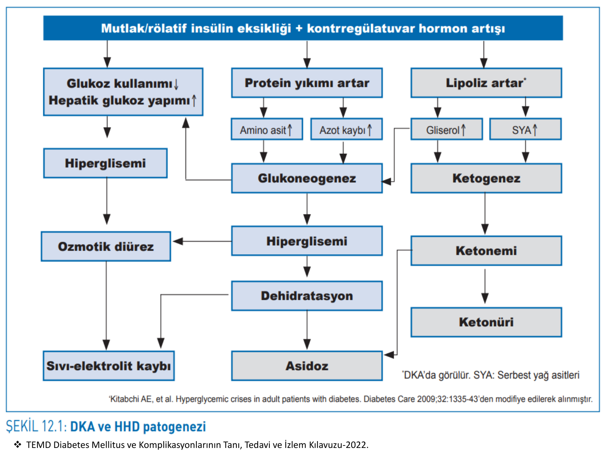

Her iki durumda da temel bozukluk şudur:

> **Mutlak / rölatif insülin eksikliği + kontrregülatuar hormon artışı** (glukagon, katekolaminler, kortizol, büyüme hormonu)

### Patogenez Akışı

```
    Mutlak/rölatif insülin eksikliği + kontrregülatuar hormon ↑
                            │
        ┌───────────────────┼────────────────────┐
        ↓                   ↓                    ↓
  Glukoz kullanımı ↓   Protein yıkımı ↑     Lipoliz ↑
  Hepatik glukoz ↑           ↓              (DKA'da)
        ↓              Amino asit ↑             ↓
        ↓              Azot kaybı ↑         Gliserol ↑
        ↓                    ↓              SYA ↑
        └──────┬─────────────┘                  ↓
               ↓                            Ketogenez
        Glukoneogenez                           ↓
               ↓                             Ketonemi
         HİPERGLİSEMİ                           ↓
               ↓                             Ketonüri
       Ozmotik diürez                           ↓
               ↓                             ASİDOZ
          Dehidratasyon
               ↓
        Sıvı-elektrolit kaybı
```

### DKA vs HHD — Temel Fark

| | **DKA** | **HHD** |
|---|---|---|
| **İnsülin eksikliği** | **Mutlak** (genellikle Tip 1) | **Rölatif** (genellikle Tip 2) |
| **Keton üretimi** | **Var** (lipoliz + ketogenez aktif) | **Yok/az** (rezidüel insülin ketogenezi baskılar) |
| **Dominant bulgu** | **Asidoz** | **Hiperozmolarite** |

> **💡 Neden tip 2'de keton yok?** Tip 2 DM'de endojen insülin **lipolizi baskılamaya yeterli** ama glukoneogenez ve glukoz kullanımını düzeltmeye yetmez → sonuç: aşırı hiperglisemi var, keton yok.

---

## KLİNİK VE TANI

### Semptomlar

* **Halsizlik**
* **Poliüri, polidipsi**
* **Bulantı, kusma**
* **Karın ağrısı** (özellikle DKA — peritonitis benzeri tablo olabilir!)
* Kilo kaybı
* Görme bozukluğu

### Fizik Muayene Bulguları

* **Taşikardi, takipne**
* **Dehidratasyon** (kuru mukozalar, deri turgoru azalmış, göz küresinin çökmüş olması)
* **Hipotansiyon**
* **Bilinç bulanıklığı, koma**
* **Kussmaul solunumu** (DKA — derin, hızlı, kompansatuar hiperventilasyon)
* **Ağızda keton kokusu** ("elma kokusu") (DKA)
* **Fokal nörolojik belirtiler** (HHD — inme benzeri)

> **💡 Öğrenci için:** HHD hastası %50'ye varan oranda **fokal nörolojik bulgu** ile gelebilir — bu durum düzeltildikten sonra tamamen geriler.

### Tanı Kriterleri

**Diyabetik Ketoasidoz (DKA):**

* **Hiperglisemi:** Plazma glukoz **>300 mg/dl**
* **Ketonemi:** β-hidroksibütirat **≥3 mmol/l** ya da ketonüri **≥2+**
* **Asidoz:** **pH <7.30** ve **HCO₃⁻ <15 mEq/L**

**Hiperozmolar Hiperglisemik Durum (HHD):**

* **Plazma glukoz: >600 mg/dl**
* **Efektif ozmolarite: ≥320 mOsm/kg**
* **pH >7.30, HCO₃⁻ >15 mEq/L**
* Plazma / idrarda **keton yok ya da eser miktarda**

### Anyon Açığı ve Efektif Ozmolarite Hesaplama

> **📐 Formüller:**
>
> * **Anyon açığı = Na⁺ − (Cl⁻ + HCO₃⁻)** → Normal: **7-9 mEq/L**, DKA'da **artmış (>12)**
> * **Efektif ozmolarite = 2 × Na⁺ + Glukoz(mg/dl)/18** → Normal: **280-295 mOsm/L**

**⚠️ Neden üre dahil edilmez?**

Efektif ozmolarite hesabında yalnızca **suyu hücre dışına çıkarabilme yeteneği olan** biyolojik aktif moleküller kullanılır. Üre intra ve ekstravasküler aralıkta **serbestçe hareket eder** — hücreye kolayca girer çıkar → ozmotik gradyent yaratmaz → dışarıda bırakılır.

### DKA Şiddetlendirme ve DKA/HHD Karşılaştırma Tablosu

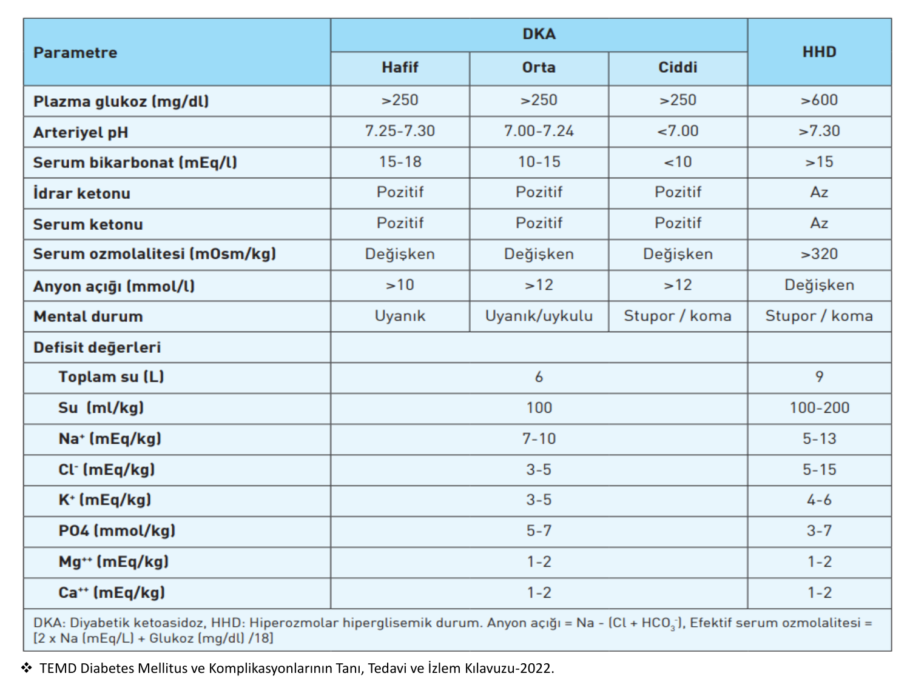

| Parametre | **DKA Hafif** | **DKA Orta** | **DKA Ciddi** | **HHD** |
|---|---|---|---|---|
| **Plazma glukoz** (mg/dl) | >250 | >250 | >250 | **>600** |
| **Arteriyel pH** | 7.25-7.30 | 7.00-7.24 | **<7.00** | >7.30 |
| **Serum bikarbonat** (mEq/L) | 15-18 | 10-15 | **<10** | >15 |
| **İdrar ketonu** | Pozitif | Pozitif | Pozitif | Az |
| **Serum ketonu** | Pozitif | Pozitif | Pozitif | Az |
| **Ozmolalite** (mOsm/kg) | Değişken | Değişken | Değişken | **>320** |
| **Anyon açığı** (mmol/l) | >10 | >12 | >12 | Değişken |
| **Mental durum** | Uyanık | Uyanık/uykulu | **Stupor/koma** | **Stupor/koma** |

### Sıvı-Elektrolit Defisitleri (Tipik)

| | **DKA** | **HHD** |
|---|---|---|
| Toplam su kaybı | ~6 L | **~9 L** |
| Su (ml/kg) | 100 | 100-200 |
| Na⁺ (mEq/kg) | 7-10 | 5-13 |
| K⁺ (mEq/kg) | 3-5 | 4-6 |
| PO₄ (mmol/kg) | 5-7 | 3-7 |

---

## DKA/HHD TEDAVİSİ

### Tedavinin Beş Temel Bileşeni

1. **Sıvı replasmanı** (en önemli ve en acil — önce sıvı, sonra insülin!)
2. **İnsülin** (IV regüler insülin infüzyonu)
3. **Potasyum** (tedavi seyrinde hızla düşebilir)
4. **Bikarbonat** (sadece çok ağır asidozda)
5. **Diğer** (fosfat, Mg, tetikleyici tedavisi)

### 1. Sıvı Tedavisi

**Hedefler:**

* İntravasküler volümün düzeltilmesi
* Kan glukoz düzeyinin düşmesi (dilüsyon + renal atılım)
* Kan basıncının yükselmesi
* Periferik dokuların perfüzyonu
* Metabolik asidozun düzelmesi
* Akut böbrek yetmezliğinin önlenmesi

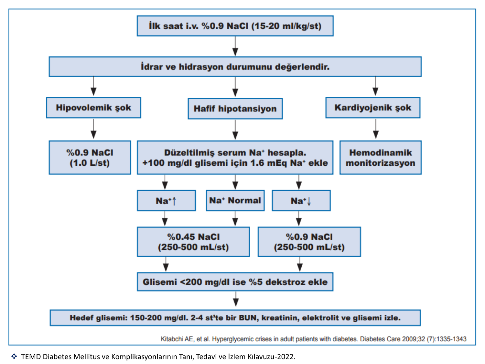

**Başlangıç algoritması:**

```
İlk saat IV %0.9 NaCl (15-20 ml/kg/st ≈ 1-1.5 L)
                    ↓
         İdrar çıkışı ve hidrasyon değerlendir
                    ↓
    ┌──────────────┼──────────────┐
    ↓              ↓              ↓
Hipovolemik şok  Hafif hipotansiyon  Kardiyojenik şok
%0.9 NaCl        Düzeltilmiş Na⁺    Hemodinamik
(1 L/st)         hesapla*           monitörizasyon
                    ↓
          Na⁺ yüksek/normal → %0.45 NaCl (250-500 ml/st)
          Na⁺ düşük → %0.9 NaCl (250-500 ml/st)
                    ↓
       Glisemi <200 mg/dl → %5 dekstroz ekle
                    ↓
    Hedef glisemi: 150-200 mg/dl
    2-4 saatte bir BUN, kreatinin, elektrolit, glisemi
```

> **📐 Düzeltilmiş Na⁺:** Glukoz her 100 mg/dl artışı için ölçülen Na⁺'a **+1.6 mEq/L** eklenir (hiperglisemi Na'yı dilüe eder).

**İlave notlar:**

* **Ozmolarite >320 mOsm/kg** ise → yarı izotonik (**%0.45 NaCl**) tercih
* **Ozmolarite <320 mOsm/kg** ise → izotonik (**%0.9 NaCl**) devam
* **Yaşlı ve kalp sorunlu** hastalarda **santral venöz basınç izlemi**
* **Böbrek yetersizliği** varsa sıvı miktarı azaltılmalı
* **Kan glukoz 300 mg/dl'ye inince** → insülin infüzyonu **yarıya düşürülür** ve **%5 dekstroz eklenir**

### 2. İnsülin Tedavisi

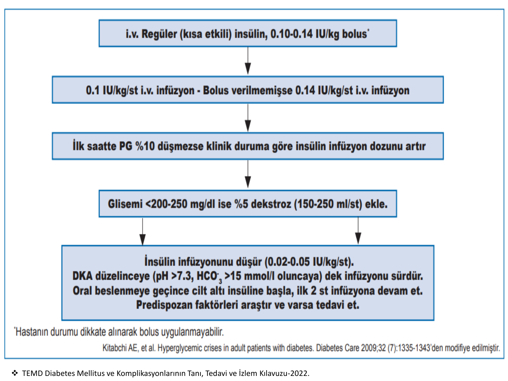

```
IV Regüler insülin
0.10-0.14 IU/kg bolus (isteğe bağlı)
            ↓
0.1 IU/kg/st IV infüzyon
(bolus verilmemişse 0.14 IU/kg/st)
            ↓
İlk saatte PG %10 düşmezse → infüzyon dozunu artır
            ↓
Glisemi <200-250 mg/dl → %5 dekstroz (150-250 ml/st) ekle
            ↓
İnsülin infüzyonunu düşür (0.02-0.05 IU/kg/st)
            ↓
DKA düzelinceye (pH >7.3, HCO₃ >15 mmol/l) dek sürdür
            ↓
Oral beslenmeye geçince cilt altı insüline geç
(ilk 2 saat IV infüzyona devam et — overlap)
            ↓
Predispozan faktörleri araştır ve tedavi et
```

> **⚠️ ÇOK ÖNEMLİ — IV → SC geçiş:** IV insülin kesilirken **mutlaka ilk SC insülin dozundan sonra 1-2 saat IV infüzyona devam edilmelidir** — aksi halde rekürren DKA gelişebilir (IV insülinin yarı ömrü sadece ~5 dakikadır).

> **💡 Öğrenci hatırlatması:** Kan glukozu normal olunca insülini kesme! DKA "kanda ketonun temizlenmesine" kadar sürer. Glukoz düşüp keton hâlâ yüksekken **dekstroz başlayıp insülini sürdürmek** gerekir.

### 3. Potasyum Tedavisi

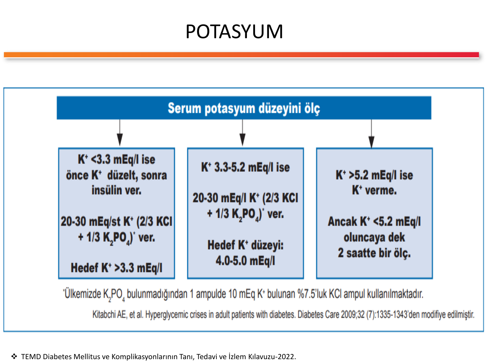

**Neden kritik?** DKA'da toplam vücut K⁺ **düşüktür** (idrarla kayıp + protein yıkımı); ancak asidoz K⁺'u hücre dışına kaydırdığı için **başlangıç serum K⁺'u normal ya da yüksek** olabilir. İnsülin ve sıvı tedavisi başlayınca K⁺ **hızla hücre içine girer** → hipokalemi!

| Serum K⁺ | Yaklaşım |
|---|---|
| **<3.3 mEq/L** | **Önce K⁺'u düzelt, sonra insülin başla!** 20-30 mEq/st K⁺ (2/3 KCl + 1/3 K₂PO₄) ver. Hedef K⁺ >3.3 |
| **3.3 – 5.2 mEq/L** | 20-30 mEq/L K⁺ infüzyon sıvısına ekle. Hedef K⁺: 4.0-5.0 |
| **>5.2 mEq/L** | **K⁺ verme**, ancak <5.2 oluncaya dek 2 saatte bir ölç |

> **⚠️ KRİTİK UYARI:** Serum K⁺ <3.3 ise **insülin verilmez** — insülin K'yı hücre içine kaydırır, ölümcül hipokalemi ve aritmi olur. **Önce K⁺'u 3.3'ün üstüne çıkar, sonra insüline başla.**

### 4. Bikarbonat Tedavisi

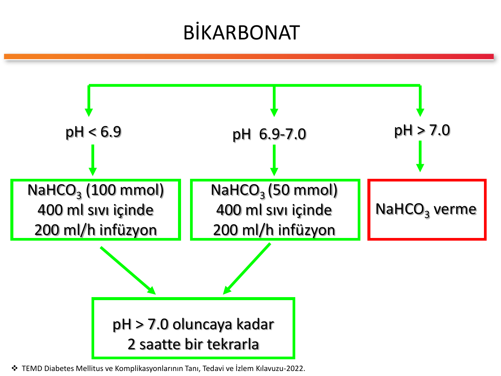

| Arteriyel pH | Yaklaşım |
|---|---|
| **pH < 6.9** | NaHCO₃ **100 mmol** (400 ml sıvı içinde 200 ml/st infüzyon) |
| **pH 6.9 – 7.0** | NaHCO₃ **50 mmol** (400 ml sıvı içinde 200 ml/st infüzyon) |
| **pH > 7.0** | **Bikarbonat verme** |

pH >7.0 olunca 2 saatte bir tekrar değerlendirilir.

**Bikarbonatın rasyoneli:**

* Sıvı ve insülin tedavisi ile **ağır asidoz zaten düzelir**.
* İnsülin yeni ketoasit üretimini durdurur; mevcut ketoasitlerin metabolizasyonu ile **endojen bikarbonat üretilir**.
* Hipovoleminin düzelmesi → renal perfüzyon → ketoasitlerin atılımı ↑.

**Bikarbonatın riskleri:**

* **2,3-DPG** azalması → **O₂-Hb ayrışması bozulur** → doku oksijenasyonu **azalır**.
* **Paradoksal SSS asidozu** (CO₂ kan-beyin bariyerini hızla geçer)
* **Hipokalemi** (K⁺ hücre içine kaçar)
* **Hipertonisite, sodyum yükü, hepatik keton üretiminde artış**

> **💡 Pratik sonuç:** Bikarbonat **sadece çok ağır asidoz (pH <7.0)** durumunda verilir. pH >6.9 ve özellikle >7.0 ise bikarbonata gerek yoktur.

### 5. Fosfat

* **Rutin replasman gerekmez.**
* **Serum fosfat <1 mg/dl** + **kardiyak disfonksiyon / solunum depresyonu** varsa fosfat replasmanı yapılabilir.

### Ek Yaklaşımlar

* **Enfeksiyon araştırması:** Akciğer grafisi, kültürler (kan, idrar), CRP, uygun antibiyoterapi
* **EKG:** Tüm erişkinlerde çekilir (özellikle K⁺ bozuklukları ve Mİ taraması)
* **Düşük doz heparin:** Özellikle **yaşlılarda** hiperkoagülabilite ve tromboz önlenmesi için

---

## TEDAVİ KOMPLİKASYONLARI

Tedavi sırasında **dikkat edilmesi gereken komplikasyonlar:**

* **Serebral ödem** (özellikle çocuklar — kan glukozunu çok hızlı düşürmekten kaçının!)
* **Hipoglisemi** (insülin dozunu zamanında azalt, dekstroz ekle)
* **Hipokalemi** (+/− hiperkalemi)
* **Hiperkloremik metabolik asidoz** (çok fazla %0.9 NaCl verimi)
* **Miyokard infarktüsü, pulmoner ödem, rabdomyoliz**
* **Tromboz**

> **⚠️ Çocuklarda serebral ödem:** Kan glukozunu saatte **50 mg/dl'den hızlı düşürmek** ve hipotonik sıvı hataları serebral ödem ve ölüm riskini artırır. Glukozu yavaş, dengeli şekilde düşürün.

---

## KRONİK KOMPLİKASYONLAR — GENEL ÇERÇEVE

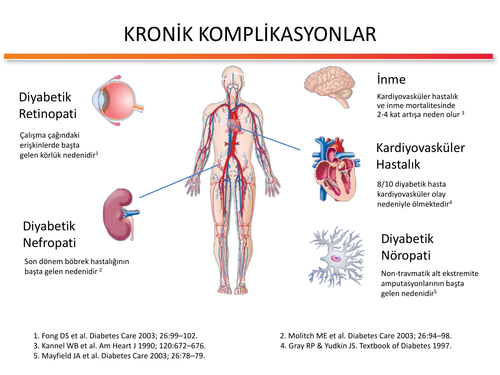

| Komplikasyon | Klinik Önemi |
|---|---|
| **Diyabetik retinopati** | **Çalışma çağındaki erişkinlerde başta gelen körlük nedeni** |
| **Diyabetik nefropati** | **Son dönem böbrek hastalığının başta gelen nedeni** |
| **Diyabetik nöropati** | **Non-travmatik alt ekstremite amputasyonlarının başta gelen nedeni** |
| **Kardiyovasküler hastalık ve inme** | KV ve inme mortalitesini **2-4 kat** artırır |
| **KV hastalık** | **Diyabetik hastaların 8/10'u KV olay nedeniyle ölür** |

### Komplikasyonların Gelişim Mekanizmaları

Kronik hiperglisemi, hücresel düzeyde birçok yolda hasar yaratır:

* **Polyol yolu** (aldoz redüktaz aktivasyonu → sorbitol birikimi)
* **Heksosamin yolu** (UDP-GlcNAc artışı)
* **İleri glikozilasyon son ürünleri (AGE)** → protein glikozilasyonu
* **Protein kinaz C (PKC) aktivasyonu**
* **Oksidatif stres** ↑ (ROS üretimi), antioksidan savunma ↓
* **Glukoz otooksidasyonu**

### Komplikasyon Değerlendirmesi — Ne Zaman Başlanır?

| | **Komplikasyon taraması başlangıcı** |
|---|---|
| **Tip 1 DM** | Tanıdan **5 yıl sonra** |
| **Tip 2 DM** | **Tanı konduğu andan itibaren** |

* **Yılda 1 kez** değerlendirme yapılır.
* Komplikasyon saptandığında izlem sıklığı artırılır.

> **💡 Öğrenci hatırlatması:** Tip 2 DM'de komplikasyon taramasının tanı ile birlikte başlaması, hastalığın **tanı öncesi 5-10 yıl** sinsi seyrettiği ve tanı anında %20-30 hastada **zaten komplikasyon mevcut** olduğu içindir.

---

## DİYABETİK NEFROPATİ

### Progresyon

Hiperfiltrasyon (GFR ↑) → mikroalbüminüri → makroalbüminüri → GFR düşüşü → son dönem böbrek hastalığı.

### Albümin Atılımının Değerlendirilmesi

**24 saatlik idrar:**

| Durum | Albümin Miktarı |
|---|---|
| **Normal** | **<30 mg/24 saat** |
| **Mikroalbüminüri** | **30-299 mg/24 saat** |
| **Makroalbüminüri (aşikar proteinüri)** | **≥300 mg/24 saat** |

**Spot idrar** (albümin/kreatinin oranı — mg/g):

| Durum | A/K Oranı |
|---|---|
| Normal | <30 |
| Mikroalbüminüri | 30-299 |
| Makroalbüminüri | ≥300 |

### Kronik Böbrek Hastalığı Evreleri (GFR'ye Göre)

| Evre | **GFR (ml/dk/1.73 m²)** | Yorum |
|---|---|---|
| **1** | **>90** | Normal ya da artmış GFR |
| **2** | **60-89** | Hafif azalmış |
| **3** | **30-59** | Orta derecede azalmış |
| **4** | **15-29** | Ciddi azalmış |
| **5** | **<15** veya diyaliz | Böbrek yetmezliği |

### Nefropati Önleme ve Tedavisi

* **Sıkı glisemik kontrol** ✓
* **Kan basıncı kontrolü** (hedef <130/80 mmHg)
* **Albüminüri varsa:** **ACE inhibitörü veya Anjiyotensin Reseptör Blokeri (ARB)** — glomerüler basıncı azaltarak nefroproteksiyon sağlar
* **KBH ilerlemişse:** **Protein alımı kısıtlanır** (0.8 g/kg/gün)
* **Diüretikler:** Tiazid (GFR >30), **loop (furosemid)** ileri evrede
* **İlaç dozları GFR'ye göre düzenlenir** (özellikle metformin, SGLT2i, SU)
* **SGLT2i** ve **non-steroidal mineralokortikoid reseptör antagonistleri (finerenon)** → KBH progresyonunu yavaşlatır

---

## DİYABETİK RETİNOPATİ

### Evreler (Oftalmoskopide)

| Evre | Bulgular |
|---|---|
| **Non-proliferatif** | Mikroanevrizmalar, sert eksüdalar |
| **Pre-proliferatif** | Eksüdalar, kanamalar, IRMA (intraretinal mikrovasküler anormallikler), venöz boncuklanma |
| **Proliferatif** | Neovaskülarizasyon — yeni, frajil damarlar; vitreus hemorajisi ve **traksiyonel retina dekolmanı** riski yüksek |
| **Makula ödemi** | **En önemli görme kaybı nedeni** — proliferatif retinopati ile birlikte traksiyonel retina dekolmanı ve neovasküler glokoma yol açar |

### Retinopati Örnekleri

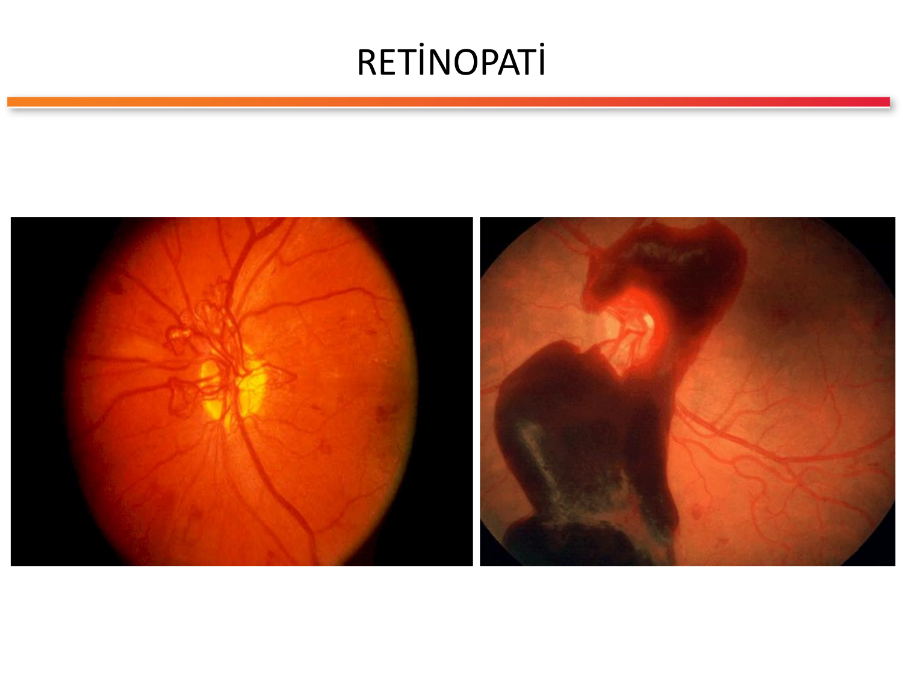

### Önleme ve Tedavi

* **Glisemik kontrol** ✓
* **Kan basıncı kontrolü**
* **Panretinal lazer fotokoagülasyon** (proliferatif retinopatide altın standart)
* **Vitrektomi** (vitreus hemorajisi / traksiyon varlığında)
* **Anti-VEGF intravitreal enjeksiyon** (bevacizumab, ranibizumab, aflibercept) — **özellikle makula ödeminde** ön plandadır

> **💡 Gebelik ve retinopati:** Gebelik retinopati progresyonunu hızlandırabilir — gebelik öncesi ve trimester taraması yapılmalıdır.

---

## DİYABETİK NÖROPATİ

### Klinik Formlar

* **Distal simetrik polinöropati** (en sık) — "çorap-eldiven" tarzı duyu kaybı, parestezi, yanıcı ağrı
* **Fokal nöropati** — kraniyal sinirler (özellikle CN III), mononöritis multipleks, radikülopati
* **Otonom nöropati** — hipoglisemiden habersizlik, istirahat taşikardisi, ortostatik hipotansiyon, gastroparezi, konstipasyon/diyare, fekal inkontinans, erektil disfonksiyon, nörojen mesane, sudomotor disfonksiyon (terleme bozukluğu)

### Tanı

* **Detaylı nörolojik muayene** (monofilaman, diapazon, derin tendon refleksleri)
* **Elektrofizyolojik testler** (sinir iletim çalışmaları)
* **Otonom nöropati değerlendirmesi** (kalp hızı varyabilitesi, Valsalva, ortostatik test)

### Ağrılı Diyabetik Nöropatinin Farmakolojik Tedavisi

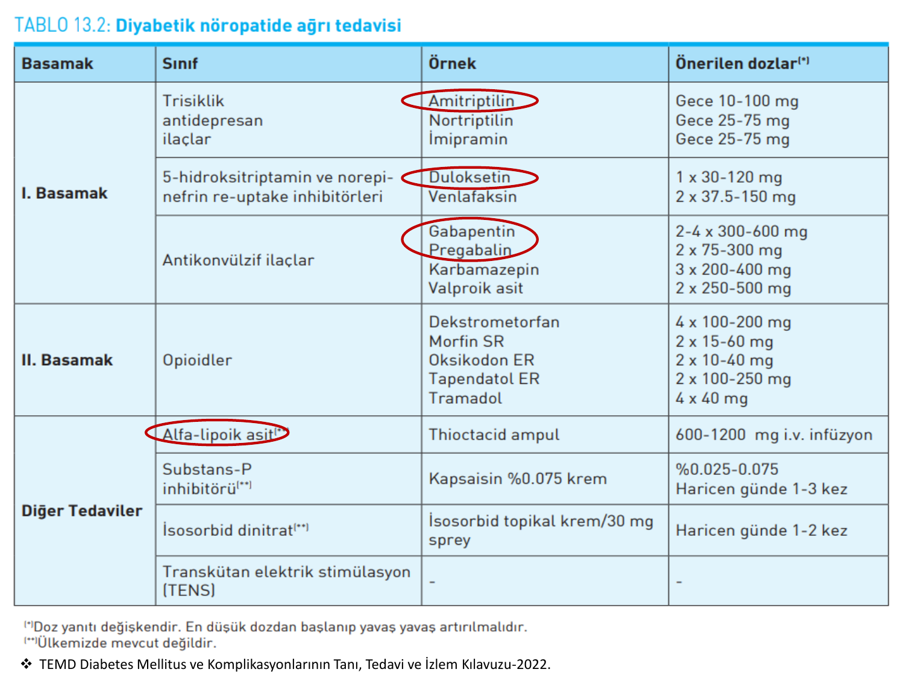

**I. Basamak:**

| Sınıf | İlaç | Önerilen Doz |
|---|---|---|
| **Trisiklik antidepresanlar** | Amitriptilin | Gece 10-100 mg |
| | Nortriptilin | Gece 25-75 mg |
| | İmipramin | Gece 25-75 mg |
| **SNRI** (serotonin-noradrenalin) | **Duloksetin** | 1 × 30-120 mg |
| | Venlafaksin | 2 × 37.5-150 mg |
| **Antikonvülzanlar** | **Gabapentin** | 2-4 × 300-600 mg |
| | **Pregabalin** | 2 × 75-300 mg |
| | Karbamazepin | 3 × 200-400 mg |
| | Valproik asit | 2 × 250-500 mg |

**II. Basamak — Opioidler:**

* Tramadol, Morfin SR, Oksikodon ER, Tapendatol ER, Dekstrometorfan

**Diğer tedaviler:**

* **α-lipoik asit** (thioctacid) — 600-1200 mg IV infüzyon (Türkiye'de mevcut)
* **Kapsaisin %0.075 krem** — substans P tükettirir; topikal
* İzosorbid dinitrat topikal krem/sprey
* **TENS** (transkutan elektrik sinir stimülasyonu)

> **💡 Pratik seçim:** Çoğu hastada **pregabalin** ya da **duloksetin** ile başlanır. **Amitriptilin** etkili ancak yaşlılarda antikolinerjik yan etkileri nedeniyle dikkatli kullanılır.

### Otonom Nöropati — Sistem Bazlı Yaklaşım

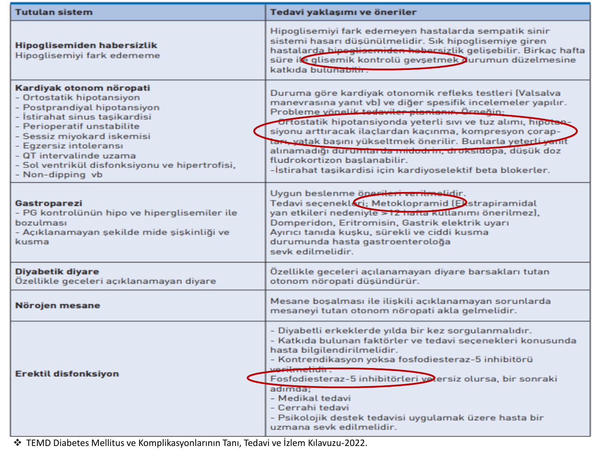

| Sistem | Klinik | Yaklaşım |
|---|---|---|
| **Hipogliseminin farkına varamama** | Sempatik sinir sistemi hasarı | **Glisemik hedefi birkaç hafta gevşet** → sempatik cevap geri gelebilir |
| **Kardiyak otonom nöropati** | Ortostatik hipotansiyon, postprandiyal hipotansiyon, istirahat taşikardisi, sessiz iskemi, QT uzaması, sol ventrikül disfonksiyonu | Kompresyon çorapları, hidrasyon, **fludrokortizon** düşük doz, **kardiyoselektif β-bloker** |
| **Gastroparezi** | Mide şişkinliği, kusma, glisemik dalgalanma | Sık küçük öğünler, **metoklopramid** (≤5 gün EPS nedeniyle), **domperidon**, **eritromisin**, gastrik elektrik uyarı |
| **Diyabetik diyare** | Geceleri açıklanamayan diyare | Barsak otonom nöropatisi düşünülür |
| **Nörojen mesane** | Mesane boşalma bozuklukları | Ürodinamik değerlendirme |
| **Erektil disfonksiyon** | Yılda 1 kez sorgulanmalı | **PDE-5 inhibitörleri** (sildenafil, tadalafil) — kontrendikasyon yoksa |

---

## DİYABETİK AYAK

**Patofizyoloji üçlüsü:**

```
        NÖROPATİ          İSKEMİ (PAH)       ENFEKSİYON
           ↓                   ↓                  ↓
    Duyu kaybı,          Yetersiz kanlanma,     Bakteriyel
    deformite,           doku hipoksisi,        invazyon
    travmayı fark        iyileşme bozukluğu
    edememe
           └───────────────┬──────────────────┘
                           ↓
                     DİYABETİK AYAK ÜLSERİ
                           ↓
                     Gangren / amputasyon
```

### Klinik Örnekler

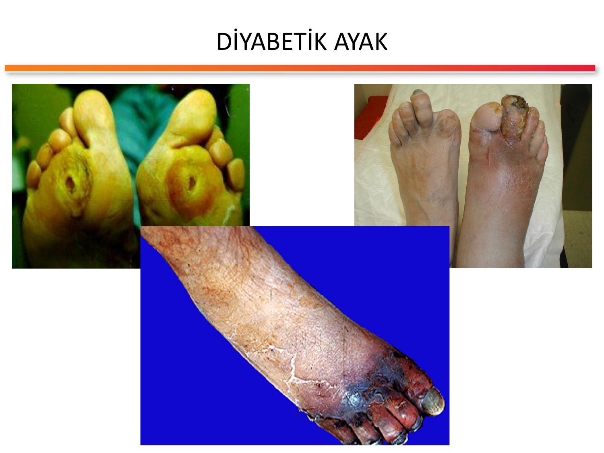

### Wagner Sınıflaması

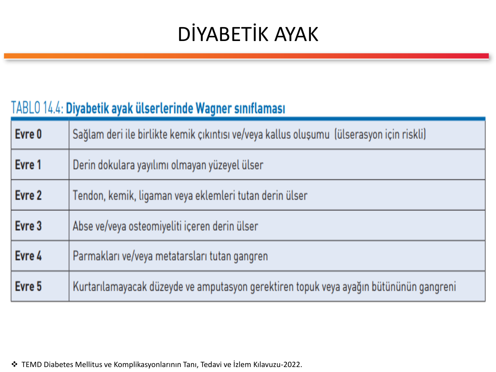

| Evre | Tanım |
|---|---|
| **Evre 0** | Sağlam deri ile birlikte kemik çıkıntısı ve/veya kallus (ülserasyon için riskli) |
| **Evre 1** | Derin dokulara yayılım olmayan **yüzeyel ülser** |
| **Evre 2** | Tendon, kemik, ligaman veya eklemleri tutan **derin ülser** |
| **Evre 3** | **Abse ve/veya osteomiyelit** içeren derin ülser |
| **Evre 4** | Parmakları ve/veya metatarsları tutan **gangren** |
| **Evre 5** | Kurtarılamayacak düzeyde; **topuk veya ayağın bütününün gangreni → amputasyon** |

### Teksas Üniversitesi Sınıflaması

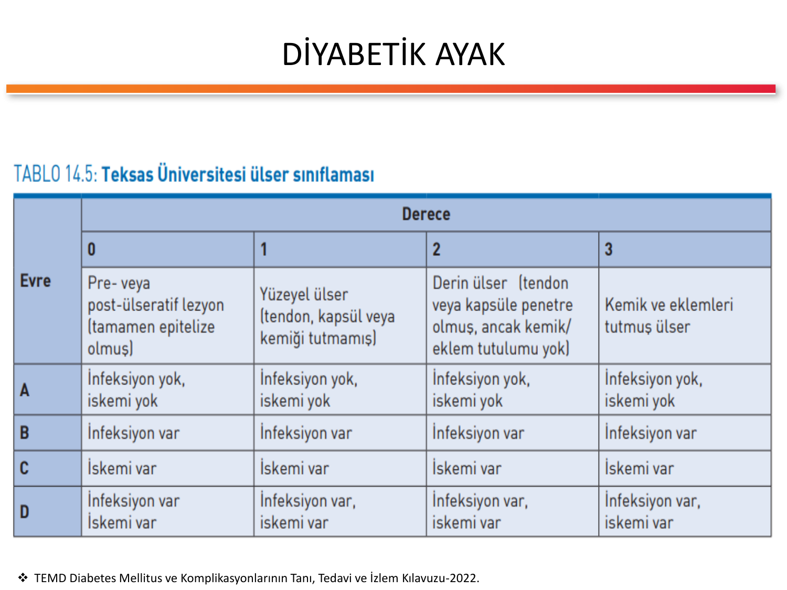

**Derece** (0-3: ülser derinliği) × **Evre** (A-D: enfeksiyon ve iskemi varlığı)

| | **Derece 0** | **Derece 1** | **Derece 2** | **Derece 3** |
|---|---|---|---|---|
| | Pre/post-ülseratif | Yüzeyel ülser | Tendon/kapsüle penetre | Kemik/ekleme penetre |
| **A** | Enfeksiyon yok, iskemi yok | | | |
| **B** | Enfeksiyon var | | | |
| **C** | İskemi var | | | |
| **D** | Enfeksiyon + iskemi var | | | |

> **💡 Wagner sınıflaması** derinliğe odaklanırken, **Teksas sınıflaması** derinlik + **enfeksiyon ve iskemi**yi de içerdiği için prognozu daha iyi öngörür.

### Tedavi — Beş Temel Basamak

1. **Glisemik kontrol**
2. **Yara bakımı** (debridman, nemli yara ortamı, pansumanlar)
3. **Antibiyotik tedavisi** (doku kültürüne göre geniş spektrumlu)
4. **Revaskülarizasyon** (iskemi varsa anjiyografi ve girişimsel/cerrahi revaskülarizasyon)
5. **Basının kaldırılması ("off-loading")** — total kontakt cast, diyabetik ayakkabı, istirahat

### Önleme

* Her muayenede **ayak muayenesi** (gözlem + monofilaman + diapazon)
* **Hasta eğitimi:** Ayakkabı seçimi, tırnak bakımı, günlük inspeksiyon
* **Uygun ayakkabı**
* **Yılda en az 1 kez** ayrıntılı ayak değerlendirmesi
* **Önemli:** Hiçbir ülseri hafife alma — küçük ülser → amputasyon zinciri hızlı işleyebilir.

---

## MAKROVASKÜLER KOMPLİKASYONLAR

### Haffner Çalışması — Diyabetin KV Riski

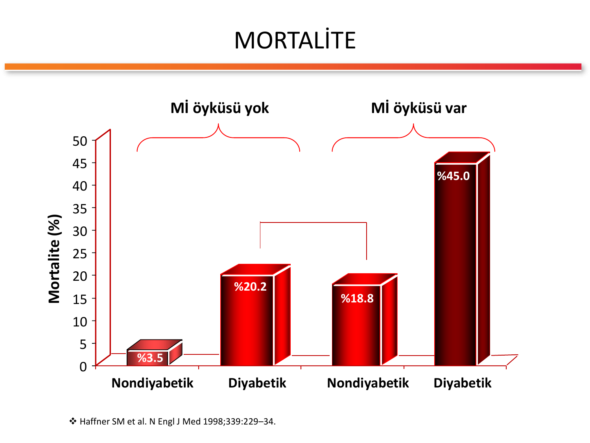

**Haffner SM et al. N Engl J Med 1998;339:229-34:**

| Grup | 7 Yıllık Mortalite |
|---|---|
| Nondiyabetik, Mİ öyküsü yok | **%3.3** |
| **Diyabetik, Mİ öyküsü yok** | **%20.2** |
| Nondiyabetik, Mİ öyküsü var | **%18.8** |
| **Diyabetik, Mİ öyküsü var** | **%45.0** |

> **⚠️ Klasik çıkarım:** "**Diyabet bir KAH eşdeğeridir**" — hiç Mİ geçirmemiş bir diyabetik, Mİ öyküsü olan nondiyabetik ile **benzer KV mortaliteye sahiptir**. Bu nedenle diyabet **sekonder koruma düzeyinde** ele alınır.

### Kardiyovasküler Hastalık Tanı Yöntemleri

* **EKG** (rutinde)
* **Efor testi**
* **Miyokard perfüzyon sintigrafisi**
* **Farmakolojik stres ekokardiyografi**
* **BT anjiyografi**
* **Koroner anjiyografi** (altın standart)

> **💡 Diyabette sessiz iskemi:** Otonom nöropati nedeniyle **anjinal ağrı hissedilmeyebilir**. Açıklanamayan dispne, halsizlik veya ani fonksiyonel bozulma → sessiz Mİ düşünülmelidir.

### Tedavi — Bütünsel Yaklaşım

Diyabetik hastada KV risk yönetimi **multifaktöriyel**dir:

* **Yaşam tarzı değişikliği** (sigara bırakma, diyet, egzersiz)
* **Sıkı glisemik kontrol**
* **Kan basıncı kontrolü** (<130/80 mmHg hedef)
* **Antiagregan tedavi** (sekonder korumada aspirin)
* **Statin** (LDL hedefine göre yüksek-orta yoğunluklu)
* **β-bloker** (özellikle Mİ sonrası, kalp yetersizliği)
* **ACE inhibitörü / ARB** (HT, albuminüri, KKY)
* **SGLT2 inhibitörü / GLP-1 analoğu** (KV kanıtı olan ajanlar)

---

## İYİ GLİSEMİK KONTROLÜN ÖNEMİ

### DCCT Çalışması — Mikrovasküler Sonuçlar

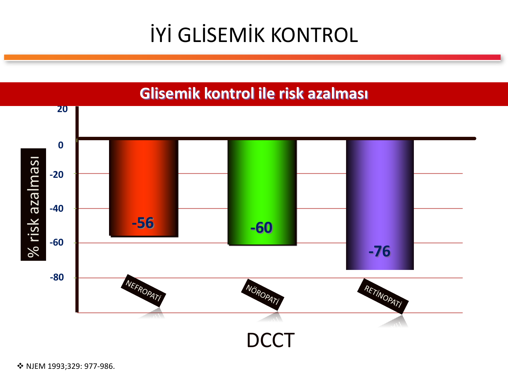

**DCCT** (NEJM 1993;329:977-86), tip 1 DM'de sıkı glisemik kontrolün etkisini göstermiştir:

| Komplikasyon | Risk Azalması |
|---|---|
| **Retinopati** | **%56** |
| **Nefropati** | **%60** |
| **Nöropati** | **%76** |

### HbA1c — Ortalama Plazma Glukozu Çevirme Tablosu

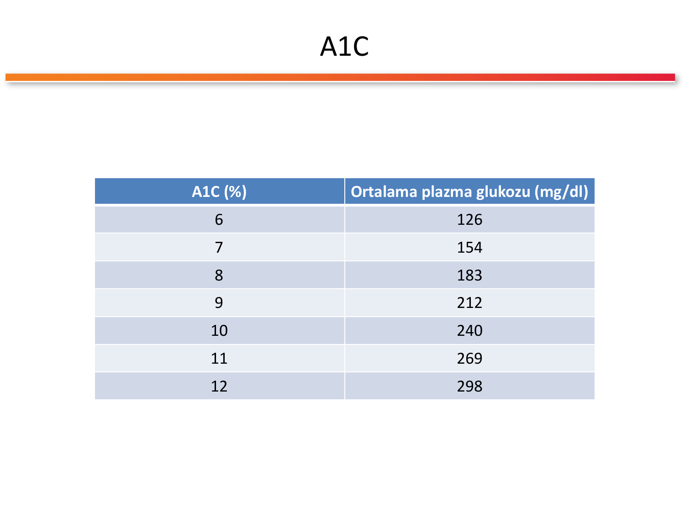

| **HbA1c (%)** | **Ortalama Plazma Glukoz (mg/dl)** |
|---|---|
| **6** | **126** |
| **7** | **154** |
| **8** | **183** |
| **9** | **212** |
| **10** | **240** |
| **11** | **269** |
| **12** | **298** |

> **💡 Pratik kural:** HbA1c'de her **%1 artış ≈ 29 mg/dl ortalama glukoz artışı**na karşılık gelir.

### Türkiye'de Güncel Durum

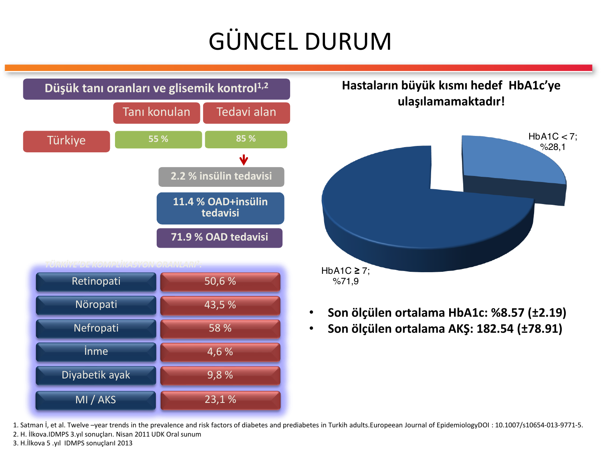

* **Türkiye'de hastaların ancak ~%55'i** diyabet tanısı almaktadır; tanı alanların **~%85'i** tedavi görür.
* Tedavi alanların **~%72'sinin HbA1c >%7** (hedefin üstünde).
* Ortalama HbA1c: **%8.57**
* Komplikasyon sıklığı (Türkiye verileri):
    * **Retinopati: %50.6**
    * **Nöropati: %43.5**
    * **Nefropati: %58**
    * **MI / AKS: %13.1**
    * **Diyabetik ayak: %9.8**
    * İnme: %4.6

> **⚠️ Çıkarım:** Türkiye'de diyabet kontrolü çok büyük oranda hedefin altındadır — hasta eğitimi ve düzenli takip hayati önem taşır.

---

## SINAV NOTLARI — ANAHTAR HATIRLATMALAR

> **📋 En Sık Sorulan Noktalar:**
>
> 1. **DKA tanı triadı:** Glukoz >300, pH <7.30, HCO₃ <15, ketonemi/ketonüri.
> 2. **HHD tanı triadı:** Glukoz >600, ozmolarite ≥320, **keton yok**, pH >7.30.
> 3. **HHD mortalitesi (%10-20) > DKA mortalitesi (%1-5)**.
> 4. **Anyon açığı** = Na − (Cl + HCO₃). Normal 7-9. DKA'da artmış.
> 5. **Efektif ozmolarite** = 2 × Na + Glukoz/18. Üre **dahil edilmez** (hücre membranından serbestçe geçer).
> 6. **DKA tedavisi önceliği:** **1) Sıvı, 2) Potasyum, 3) İnsülin**. Önce sıvı, sonra insülin!
> 7. **K⁺ <3.3 → insülin verme**, önce K⁺'u düzelt.
> 8. **Bikarbonat sadece pH <7.0'de** verilir (paradoksal SSS asidozu, hipokalemi, 2,3-DPG riski).
> 9. **Glukoz <200-250 mg/dl olduğunda %5 dekstroz ekle**, insülini kesme.
> 10. **IV → SC geçişte 1-2 saat overlap** — rekürren DKA'yı önler.
> 11. **Tip 1 DM komplikasyon taraması 5 yıl sonra, Tip 2 DM tanı anında** başlar.
> 12. **Mikroalbüminüri:** 30-299 mg/24 saat ya da spot A/K 30-299 mg/g. Tedavi: **ACEi/ARB**.
> 13. **Retinopati:** Non-proliferatif → pre-proliferatif → proliferatif → makula ödemi. Çalışma çağında **en sık körlük nedeni**. Tedavi: lazer, vitrektomi, anti-VEGF.
> 14. **Nöropatik ağrıda 1. basamak:** Pregabalin, gabapentin, duloksetin, TCA (amitriptilin).
> 15. **Diyabetik ayak üçlüsü:** Nöropati + iskemi + enfeksiyon. Wagner 0-5, Teksas A-D × 0-3.
> 16. **Haffner:** Diyabet **koroner arter hastalığı eşdeğeri** — sekonder koruma gibi tedavi.
> 17. **DCCT:** Sıkı kontrol ile **retinopati %56, nefropati %60, nöropati %76** azalır.
> 18. **HbA1c %1 ≈ ortalama glukoz 29 mg/dl.** (Hedefe yakın bir çevirim için: HbA1c 7 → 154 mg/dl.)

---

> **Kaynaklar:**
>
> 1. TEMD Diabetes Mellitus ve Komplikasyonlarının Tanı, Tedavi ve İzlem Kılavuzu, 2022-2024.
> 2. Kitabchi AE et al. Hyperglycemic crises in adult patients with diabetes. Diabetes Care 2009;32:1335-43.
> 3. DCCT Research Group. N Engl J Med 1993;329:977-86.
> 4. Haffner SM et al. N Engl J Med 1998;339:229-34.
> 5. Fadini GP et al. Diabetes Res Clin Pract 2011;94:172-9.
> 6. Zhong VW et al. Diabetes Care 2018;41:1870-7.
