# DİABETES MELLİTUS TANISI VE GESTASYONEL DİYABET

**Hazırlayan:** Prof. Dr. Engin Güney
**Bölüm:** Aydın Adnan Menderes Üniversitesi Tıp Fakültesi — Endokrinoloji ve Metabolizma Hastalıkları Bilim Dalı

---

## İÇİNDEKİLER

1. [Tanı Kriterleri](#tanı-kriterleri)
2. [Prediyabet](#prediyabet)
3. [Prevalans](#prevalans)
4. [Diyabet Önleme Çalışmaları](#diyabet-önleme-çalışmaları)
5. [Sınıflama](#sınıflama)
6. [Tip 1 Diabetes Mellitus](#tip-1-diabetes-mellitus)
7. [Tip 2 Diabetes Mellitus](#tip-2-diabetes-mellitus)
8. [Gebelik ve Diyabet](#gebelik-ve-diyabet)
9. [Gestasyonel Diyabet](#gestasyonel-diyabet)
10. [Gestasyonel Diyabet Tedavisi ve İzlemi](#gestasyonel-diyabet-tedavisi-ve-izlemi)

---

## GİRİŞ — KISACA DİYABET NEDİR?

**Diabetes Mellitus (DM)**, **insülin sekresyonunda ve/veya insülin etkisinde bozukluk** sonucu gelişen, kronik **hiperglisemi** ile karakterize heterojen bir metabolik hastalıklar grubudur.

> **💡 Ezberle:** Diyabetin özü iki kelimeyle → **"insülin yetersiz ya da iş görmüyor"**.
>
> * **Tip 1:** İnsülin **yok** (β-hücre yıkımı).
> * **Tip 2:** İnsülin **iş görmüyor** + zamanla yetersizleşiyor (direnç + sekresyon defekti).

Kronik hiperglisemi uzun dönemde **makrovasküler** (koroner, serebrovasküler, periferik arter hastalığı) ve **mikrovasküler** (retinopati, nefropati, nöropati) komplikasyonlara yol açar.

---

## TANI KRİTERLERİ

### Hiperglisemi Semptomları

Diyabetin klasik semptomları hiperglisemiye bağlıdır.

> **💡 Hatırlatma — "4P + K":**
>
> * **P**oliüri (sık idrara çıkma) — kan şekeri böbrek eşiğini (~180 mg/dl) aşınca ozmotik diürez.
> * **P**olidipsi (çok su içme) — poliüriye sekonder dehidratasyon.
> * **P**olifaji (çok yeme) — hücre içinde glukoz kullanılamaması.
> * **P**erde (bulanık görme) — lens ozmotik değişiklikleri.
> * **K**ilo kaybı — yağ/kas yıkımı, ozmotik diürez.

**Diğer bulgular:**

* Noktüri
* Ağız kuruluğu
* Halsizlik
* Kaşıntı (özellikle genital bölgede — kandidiyaz)
* Tekrarlayan enfeksiyonlar, yara iyileşmesinde gecikme

### Açlık Kan Şekeri (AKS)

| AKS Değeri          | Yorum                        |
| ------------------- | ---------------------------- |
| **< 100 mg/dl**     | Normal                       |
| **100 – 125 mg/dl** | Bozulmuş Açlık Glukozu (BAG) |
| **≥ 126 mg/dl**     | Diabetes Mellitus            |

### 75 gr OGTT — 2. Saat Kan Şekeri

| 2. Saat Değeri      | Yorum                           |
| ------------------- | ------------------------------- |
| **< 140 mg/dl**     | Normal                          |
| **140 – 199 mg/dl** | Bozulmuş Glukoz Toleransı (BGT) |
| **≥ 200 mg/dl**     | Diabetes Mellitus               |

### DM Tanı Kriterleri (Özet)

> Aşağıdaki kriterlerden **herhangi birinin varlığı** diyabet tanısı koydurur:
>
> 1. **Semptomlara ek olarak** günün herhangi bir saatinde ölçülen kan şekeri **≥ 200 mg/dl** (rastgele plazma glukoz)
> 2. **Açlık plazma glukozu ≥ 126 mg/dl** (en az 8 saat açlık)
> 3. **75 gr OGTT — 2. saat kan şekeri ≥ 200 mg/dl**
> 4. **HbA1c ≥ %6.5** (standardize yöntemle)

**⚠️ DOĞRULAMA KURALI (çok önemli!):**

* **Asemptomatik** bir hastada tanı, **farklı bir günde yapılan ikinci test** ile doğrulanmalıdır.
* **Semptomatik** (4P + kilo kaybı olan) bir hastada **rastgele kan şekeri ≥ 200 mg/dl** ise tek ölçüm tanı koydurur.
* Tercihen **aynı test tekrarlanır** (ör. AKS + AKS). Farklı iki test de pozitifse (ör. AKS + HbA1c) tanı doğrulanır.

**💡 HbA1c nedir?**

HbA1c (glikolize hemoglobin), **son 2-3 aylık ortalama kan şekerini** yansıtır. Eritrositin ömrü boyunca hemoglobine irreversibl glukoz bağlanması ilkesine dayanır. **%1'lik HbA1c değişimi ~29 mg/dl ortalama glukoz değişimine karşılık gelir.** Hemoglobinopati, hemoliz, gebelik, kronik böbrek hastalığı gibi durumlarda güvenilirliği azalır.

---

## PREDİYABET

Prediyabet, diyabet sınırına ulaşmamış ancak normalin üzerinde seyreden glukoz değerleri olarak tanımlanır.

| Test                            | Prediyabet Aralığı |
| ------------------------------- | ------------------ |
| Açlık kan şekeri                | 100 – 125 mg/dl    |
| 75 gr OGTT — 2. saat kan şekeri | 140 – 199 mg/dl    |
| HbA1c                           | %5.7 – 6.4         |

**⚠️ ÖNEMLİ:**

* Diyabet gelişme riski üç test için de **giderek artmaktadır**.
* **5 yılda diyabet gelişme riski:**
    * Bozulmuş glukoz toleransı olanlarda: **%24**
    * Normal glukoz toleransı olanlarda: **%4**
* **Tüm nedenlere bağlı mortalite (BGT / NGT):** 1.48
* **Kardiyovasküler mortalite (BGT / NGT):** 1.66

> Kaynak: WHO. Definition and diagnosis of diabetes mellitus and intermediate hyperglycemia, 2006.

---

## PREVALANS

### TURDEP-II Verileri

| Grup                             | Prevalans |
| -------------------------------- | --------- |
| İzole BAG                        | %14.7     |
| İzole BGT                        | %7.9      |
| BAG + BGT                        | %8.2      |
| **Toplam prediyabet prevalansı** | **%30.8** |

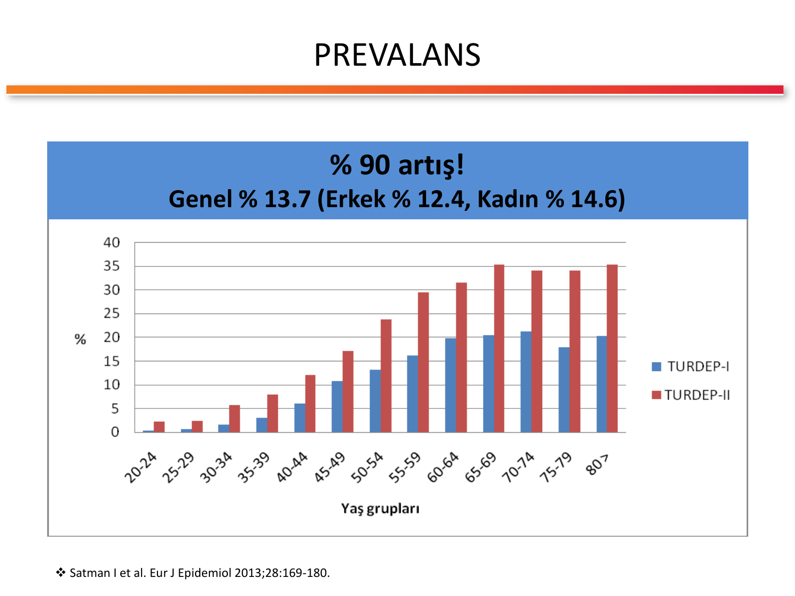

**TURDEP-I → TURDEP-II:** Genel diyabet prevalansında **%90 artış** (Erkek %12.4, Kadın %14.6).

### Küresel Durum — IDF Diabetes Atlas (10. baskı, 2021)

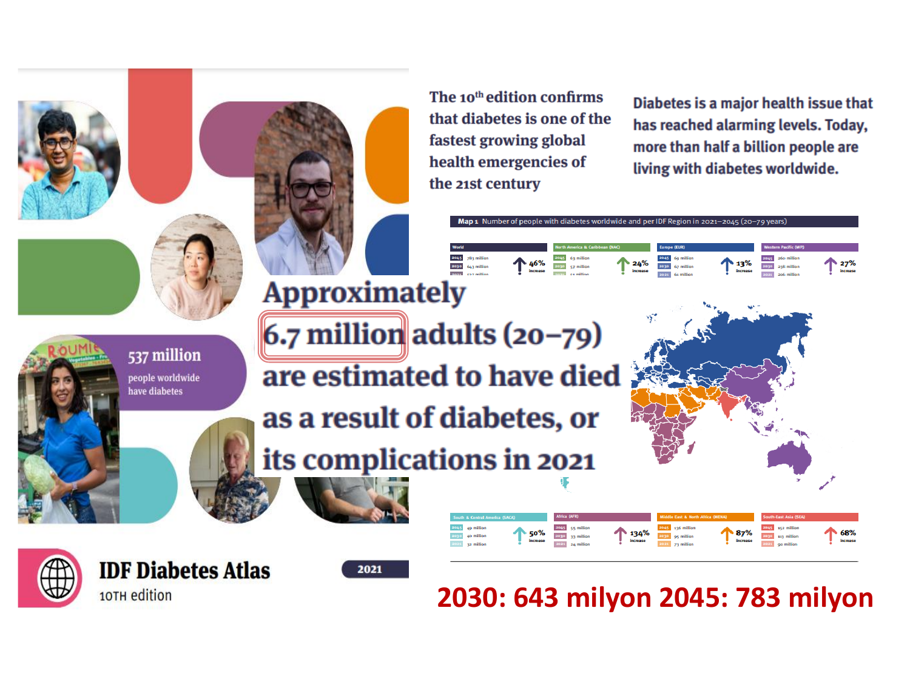

**2024'te bu sayı 589 milyon kişiye ulaştı.**

* 2021: Dünyada **537 milyon** erişkin (20-79 yaş) diyabetle yaşıyor.
* 2021: Yaklaşık **6.7 milyon** erişkin diyabet veya komplikasyonlarına bağlı hayatını kaybetti.
* 2030 tahmini: **643 milyon**
* 2045 tahmini: **783 milyon**

Diyabet, 21. yüzyılın **en hızlı büyüyen küresel sağlık sorunlarından biridir.**

---

## DİYABET ÖNLEME ÇALIŞMALARI

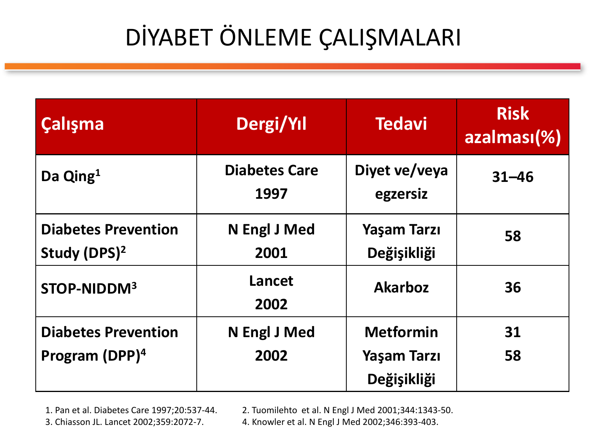

| Çalışma                               | Dergi/Yıl           | Tedavi                               | Risk Azalması (%) |
| ------------------------------------- | ------------------- | ------------------------------------ | ----------------- |
| **Da Qing**                           | Diabetes Care, 1997 | Diyet ve/veya egzersiz               | 31 – 46           |
| **Diabetes Prevention Study (DPS)**   | N Engl J Med, 2001  | Yaşam tarzı değişikliği              | 58                |
| **STOP-NIDDM**                        | Lancet, 2002        | Akarboz                              | 36                |
| **Diabetes Prevention Program (DPP)** | N Engl J Med, 2002  | Metformin<br>Yaşam tarzı değişikliği | 31<br>58          |

**💡 Sonuç:** Yaşam tarzı değişikliği (diyet + egzersiz) prediyabetten diyabete geçişi en az metformin kadar - hatta daha fazla - azaltmaktadır.

---

## SINIFLAMA (Tanısı kolay; tanı koyduğun gibi sınıfla)

### Ana Diyabet Tipleri (TEMD 2024)

1. **Tip 1 Diabetes Mellitus**
    * A. Otoimmün
    * B. İdiyopatik

2. **Tip 2 Diabetes Mellitus**
    * İnsülin direnci zemininde ilerleyici insülin sekresyon defekti ile karakterize.

3. **Gestasyonel Diabetes Mellitus (GDM)**
    * 2. ya da 3. trimesterde saptanan glukoz tolerans bozukluğu.

4. **Diğer Özel Diyabet Tipleri**

### Tip 1 vs Tip 2 — Öğrenci Dostu Karşılaştırma

| Özellik              | **Tip 1 DM**                                        | **Tip 2 DM**                                              |
| -------------------- | --------------------------------------------------- | --------------------------------------------------------- |
| **Sıklık**           | Tüm DM'nin %5-10'u                                  | Tüm DM'nin **%90-95'i**                                   |
| **Başlangıç yaşı**   | Genelde çocuk/genç (<30)                            | Genelde >40 (giderek gençleşiyor)                         |
| **Başlangıç hızı**   | **Akut / haftalar içinde**                          | **Sinsi / yıllar içinde**                                 |
| **Vücut tipi**       | Zayıf/normal                                        | Sıklıkla **obez**, özellikle santral                      |
| **Genetik**          | HLA ilişkili (DR3, DR4)                             | **Güçlü aile öyküsü** (konkordans ikizlerde ~%90)         |
| **Patogenez**        | **Otoimmün β-hücre yıkımı** → insülin yokluğu       | **İnsülin direnci + progresif β-hücre disfonksiyonu**     |
| **Otoantikorlar**    | **Pozitif** (anti-GAD, ICA, IAA, IA2, ZnT8)         | Negatif                                                   |
| **C-peptid**         | **Düşük / saptanamaz**                              | Normal ya da yüksek (başlangıçta)                         |
| **Tipik başvuru**    | **Diyabetik ketoasidoz (DKA)**, belirgin semptomlar | **Asemptomatik** tanı (tarama), komplikasyonlarla başvuru |
| **Ketoaside eğilim** | **Yüksek** (insülin yok)                            | Düşük (rezidüel insülin var)                              |
| **Tedavi**           | **Yaşam boyu insülin** (zorunlu)                    | Yaşam tarzı + OAD ± insülin                               |

> **💡 Klinik ipucu:** "Zayıf bir genç, haftalar içinde kilo kaybı, poliüri ve ketoasidozla geliyor" → **Tip 1 DM**. "60 yaşında, obez, rutin check-up'ta AKS 160" → **Tip 2 DM**.

### A. Beta Hücre Fonksiyonlarının Genetik Defekti (MODY)

**MODY (Maturity Onset Diabetes of the Young):** Otozomal dominant geçişli, **genç yaşta** (<25) başlayan, **tek gen** defektine bağlı diyabet formudur. Tip 1 ve tip 2 DM'den ayırt etmek önemlidir, çünkü tedavi farklılık gösterir.

> **💡 Öğrenci için vurgu — En sık sorulan iki MODY:**
>
> * **MODY2 (Glukokinaz mutasyonu):** **Hafif**, stabil açlık hiperglisemisi. **Çoğunlukla tedavi gerekmez**, komplikasyon nadir.
> * **MODY3 (HNF-1α mutasyonu):** En sık MODY. **Düşük doz sülfonilüreye çok iyi yanıt** verir (insülin yerine!). Progresif seyir gösterir.

| Kromozom          | Gen                   | Tip             | Klinik Not                            |
| ----------------- | --------------------- | --------------- | ------------------------------------- |
| 20                | HNF-4α                | MODY1           | Sülfonilüreye duyarlı                 |
| **7**             | **Glukokinaz**        | **MODY2**       | **Hafif; çoğunlukla tedavisiz izlem** |
| **12**            | **HNF-1α**            | **MODY3**       | **En sık; sülfonilüre tedavisi**      |
| 13                | IPF-1                 | MODY4           | —                                     |
| 17                | HNF-1β                | MODY5           | Renal kist + diyabet (RCAD)           |
| 2                 | NeuroD1               | MODY6           | —                                     |
| 2                 | KLF11                 | MODY7           | —                                     |
| 9                 | CEL                   | MODY8           | Pankreatik ekzokrin bozukluk          |
| 7                 | PAX4                  | MODY9           | —                                     |
| 11                | INS                   | MODY10          | —                                     |
| 8                 | BLK                   | MODY11          | —                                     |
| 11                | KCNJ11                | MODY13          | —                                     |
| 3                 | APPL1                 | MODY14          | —                                     |
| Mitokondriyal DNA | —                     | —               | **Maternal geçiş** + sağırlık (MIDD)  |
| 11                | Kir6.2, ABCC8, KCNJ11 | **Neonatal DM** | İlk 6 ayda tanı; sülfonilüre yanıtlı  |

| Kromozom          | Gen                             | Tip         |
| ----------------- | ------------------------------- | ----------- |
| 20                | HNF-4α                          | MODY1       |
| 7                 | Glukokinaz                      | MODY2       |
| 12                | HNF-1α                          | MODY3       |
| 13                | IPF-1                           | MODY4       |
| 17                | HNF-1β                          | MODY5       |
| 2                 | NeuroD1                         | MODY6       |
| 2                 | KLF11                           | MODY7       |
| 9                 | CEL                             | MODY8       |
| 7                 | PAX4                            | MODY9       |
| 11                | INS                             | MODY10      |
| 8                 | BLK                             | MODY11      |
| 11                | KCNJ11                          | MODY13      |
| 3                 | APPL1                           | MODY14      |
| Mitokondriyal DNA | —                               | —           |
| 11                | Kir6.2, ABCC8, KCNJ11 mutasyonu | Neonatal DM |

### B. İnsülin Etkisindeki Genetik Defektler

* Leprechaunism
* Lipoatrofik diyabet
* Rabson-Mendenhall sendromu
* Tip A insülin direnci

### C. Pankreasın Ekzokrin Doku Hastalıkları

* Fibrokalkülöz pankreatopati
* Hemokromatoz
* Kistik fibroz
* Neoplazi
* Pankreatit
* Travma / pankreatektomi

### D. Endokrinopatiler

* Akromegali
* Aldosteronoma
* Cushing sendromu
* Feokromositoma
* Glukagonoma
* Hipertiroidi
* Somatostatinoma

### E. İlaç ya da Kimyasal Ajanlar

Diyabet ya da hiperglisemi yapabilen ilaçlar:

| İlaç Grubu              | Örnekler                                                                                        |
| ----------------------- | ----------------------------------------------------------------------------------------------- |
| **Glukokortikoidler**   | **En sık sorumlu — steroid-indüklü diyabet**                                                    |
| Atipik anti-psikotikler | Olanzapin, klozapin                                                                             |
| Anti-viral ilaçlar      | HIV tedavisinde proteaz inhibitörleri                                                           |
| β-adrenerjik agonistler | Salbutamol (yüksek doz)                                                                         |
| Diüretikler             | Tiazid grubu                                                                                    |
| İmmünsüpresifler        | Tacrolimus, siklosporin (transplant)                                                            |
| Diğer                   | Fenitoin, diazoksid, nikotinik asit, α-interferon, pentamidin, Vacor, statinler, tiroid hormonu |

### F. İmmün Aracılıklı Nadir Diyabet Formları

* Anti-insülin reseptör antikorları
* Stiff-Person sendromu

### G. Diyabetle İlişkili Genetik Sendromlar

* Alström sendromu
* Down sendromu
* Friedreich tipi ataksi
* Huntington korea
* Klinefelter sendromu
* Laurence-Moon-Biedl sendromu
* Miyotonik distrofi
* Porfiria
* Prader-Willi sendromu
* Turner sendromu
* **Wolfram (DIDMOAD) sendromu**

### H. Enfeksiyonlar

* Konjenital rubella
* Sitomegalovirüs
* Koksaki B
* **SARS-CoV-2**
* Adenovirüs, kabakulak

---

## TİP 1 DİABETES MELLİTUS

### Patogenez

Tip 1 DM, genetik yatkınlık zemininde çevresel tetikleyicilerin (özellikle viral enfeksiyonlar) başlattığı otoimmün bir β-hücre yıkımı sürecidir.

**Tetikleyici adacık β-hücre enfeksiyonuna neden olabilen viruslar:**

* Kabakulak
* Rubella
* Sitomegalovirüs
* Ebstein-Barr
* Retrovirüs
* Koksaki B

**Patogenetik Basamaklar:**

```
         β-hücrelerinde viral enfeksiyon
                    ↓
         β-hücrelerinden α-interferon sekresyonu
                    ↓
         Klas 1 MHC ekspresyonunda artış
                    ↓
         Genetik yatkınlık + Klas 2 MHC ekspresyonu
                    ↓
         Otoimmünitenin tetiklenmesi
                    ↓
                 İnsülitis
                    ↓
            Tip 1 Diabetes Mellitus
```

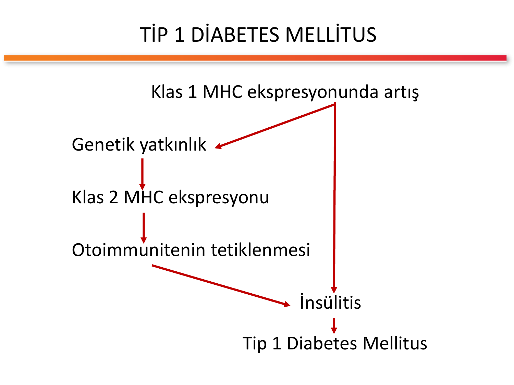

### β-Hücre Kitlesinin Zamanla Değişimi

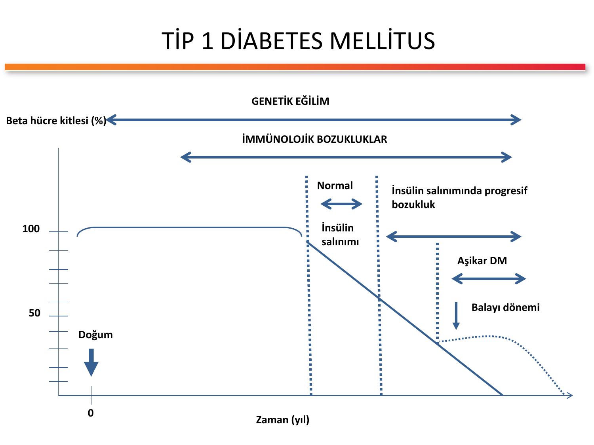

* **Doğumda:** β-hücre kitlesi yaklaşık %100
* **Genetik eğilim** + **immünolojik bozukluklar** ile birlikte β-hücre kitlesinde progresif azalma başlar.
* **İnsülin salınımında progresif bozukluk** gelişir.
* Klinik olarak **aşikâr DM** tablosu ortaya çıktığında β-hücre kitlesinin büyük kısmı kaybedilmiştir.
* Başlangıçta eksojen insülin tedavisi ile kalan β-hücrelerinin kısa süreli toparlanmasına bağlı **"balayı dönemi"** yaşanır.

### Tip 1 Diyabetin Evreleri (TEMD 2024)

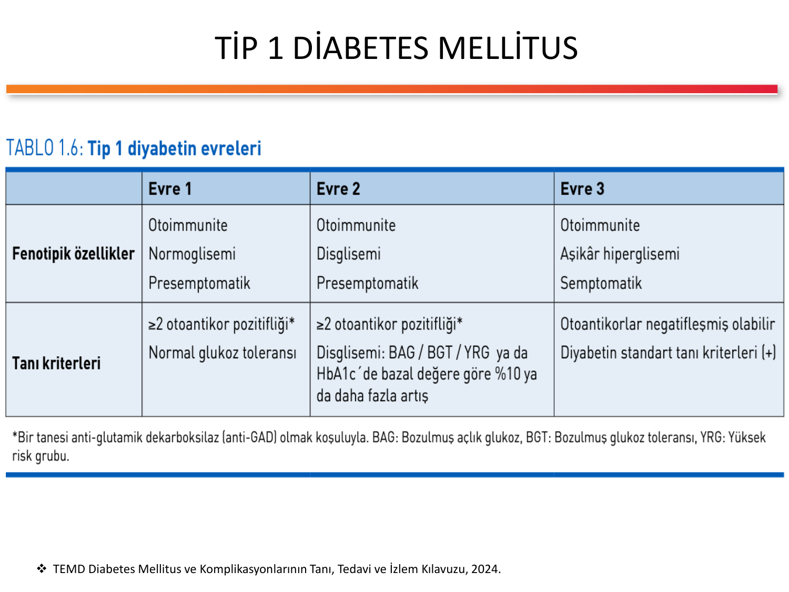

| Özellik                  | Evre 1                                                           | Evre 2                                                                                                           | Evre 3                                                                                   |
| ------------------------ | ---------------------------------------------------------------- | ---------------------------------------------------------------------------------------------------------------- | ---------------------------------------------------------------------------------------- |
| **Fenotipik özellikler** | <p>Otoimmünite</p><p>Normoglisemi</p><p>Presemptomatik</p>       | <p>Otoimmünite</p><p>Disglisemi</p><p>Presemptomatik</p>                                                         | <p>Otoimmünite</p><p>Aşikâr hiperglisemi</p><p>Semptomatik</p>                           |
| **Tanı kriterleri**      | <p>≥2 otoantikor pozitifliği\*</p><p>Normal glukoz toleransı</p> | <p>≥2 otoantikor pozitifliği\*</p><p>Disglisemi: BAG / BGT / YRG ya da HbA1c'de bazal değere göre ≥%10 artış</p> | <p>Otoantikorlar negatifleşmiş olabilir</p><p>Diyabetin standart tanı kriterleri (+)</p> |

> \*Bir tanesi anti-glutamik dekarboksilaz (anti-GAD) olmak koşuluyla. BAG: Bozulmuş açlık glukozu, BGT: Bozulmuş glukoz toleransı, YRG: Yüksek risk grubu.

### Tip 1 DM'de Otoantikorlar

* **Anti-glutamik asit dekarboksilaz (anti-GAD)**
* **Adacık hücresi sitoplazmik antikoru (ICA)**
* **İnsülin otoantikoru (IAA)**
* **Anti-tirozin fosfataz**
* **Anti-fogrin antikorları (IA2 ve IA2-β)**
* **Çinko transporter-8 antikoru (anti-ZnT8)**

---

## TİP 2 DİABETES MELLİTUS

### Patogenezin Genel Çerçevesi

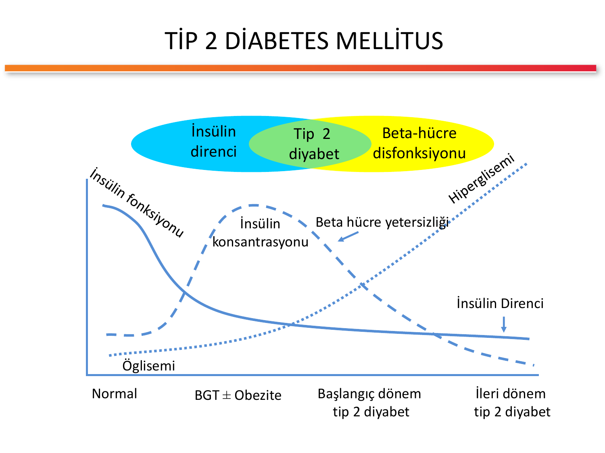

Tip 2 DM'nin üç temel bileşeni vardır:

1. **İnsülin direnci**
2. **β-hücre disfonksiyonu**
3. **Hiperglisemi**

**Hastalığın seyri:**

* **Normal →** İnsülin fonksiyonu ve konsantrasyonu dengede.
* **BGT ± Obezite →** İnsülin direncine karşı kompansatuvar hiperinsülinemi gelişir; öglisemi korunur.
* **Başlangıç tip 2 diyabet →** β-hücre yetersizliği başlar, kompansasyon yeterli olmaz, hiperglisemi ortaya çıkar.
* **İleri dönem tip 2 diyabet →** β-hücre rezervi iyice azalır; insülin konsantrasyonu düşer, hiperglisemi belirginleşir.

### Glukoz ve İnsülin Cevap Eğrileri (75 gr OGTT)

**Normal İnsülin Salgısı:**

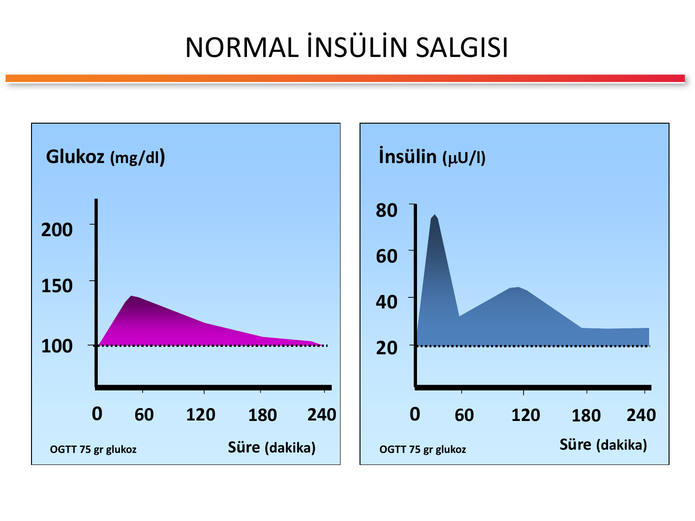

* Glukoz pik değeri **< 140 mg/dl**
* İnsülin erken ve yüksek pik yapar, zamanında normal değerine döner.

**Glukoz İntoleransı (BGT):**

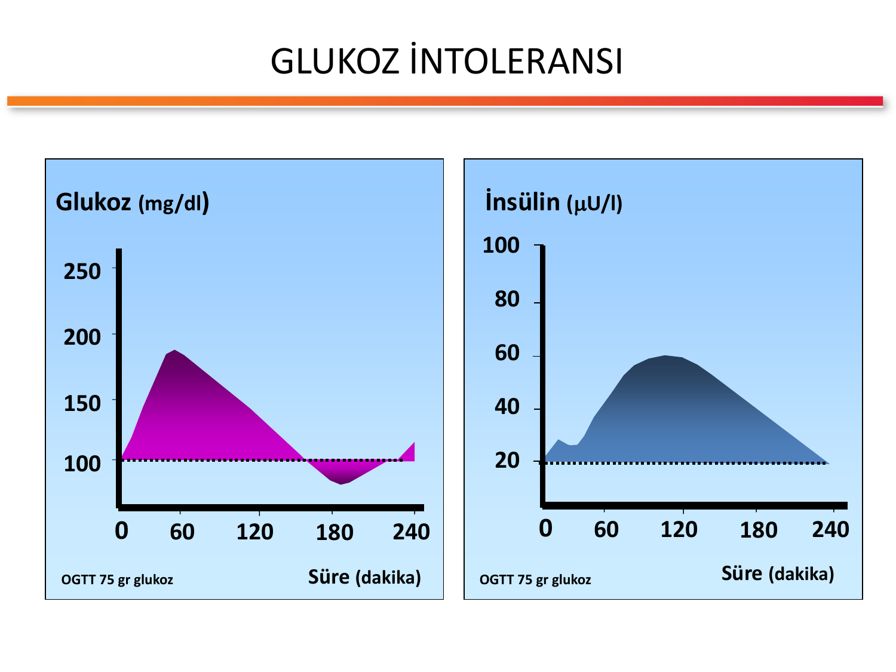

* Glukoz pik değeri **140 – 199 mg/dl** arasında.
* İnsülin cevabı **gecikmiş ve uzamış** (hiperinsülinemik kompansasyon).

**Tip 2 Diabetes Mellitus:**

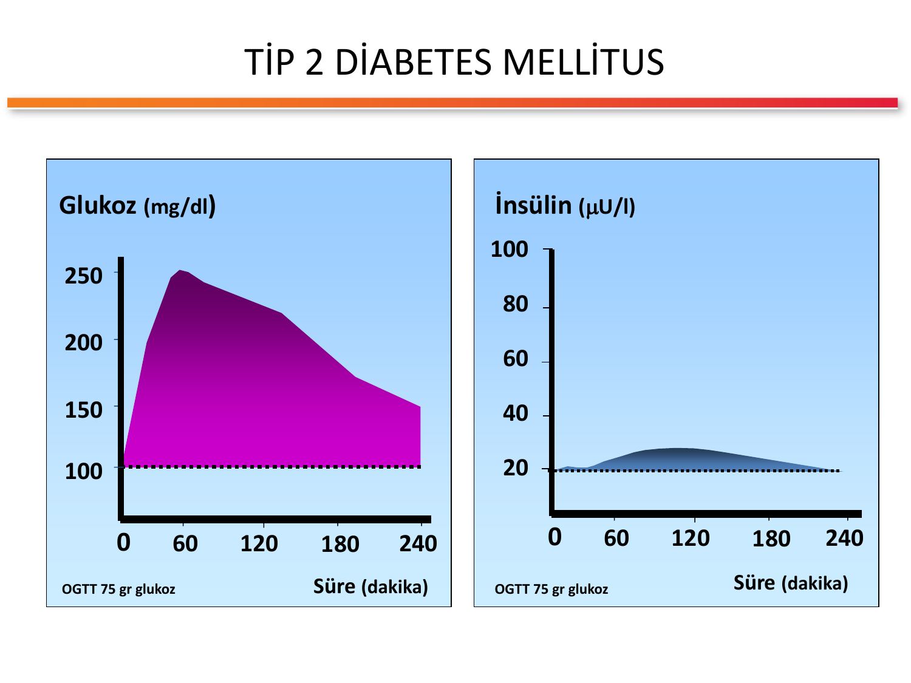

* Glukoz değerleri **yüksek seyreder** ve geri dönmez (≥200 mg/dl).
* İnsülin cevabı **oldukça küntleşmiştir** (β-hücre yetmezliği).

### Tip 2 Diyabet Patogenezi — Basitleştirilmiş Akış

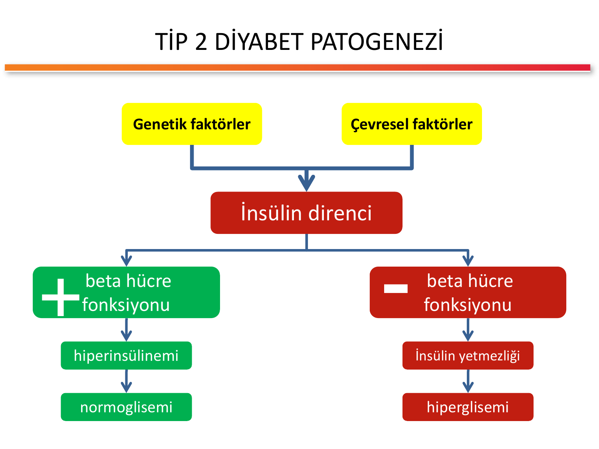

```
    Genetik faktörler         Çevresel faktörler
             ↓                         ↓
             └──────────┬──────────────┘
                        ↓
                İNSÜLİN DİRENCİ
                ↙              ↘
   (+) β-hücre fonksiyonu     (−) β-hücre fonksiyonu
            ↓                         ↓
     Hiperinsülinemi            İnsülin yetmezliği
            ↓                         ↓
       Normoglisemi               Hiperglisemi
```

### İnsülin Direncinin Organ Düzeyinde Etkileri

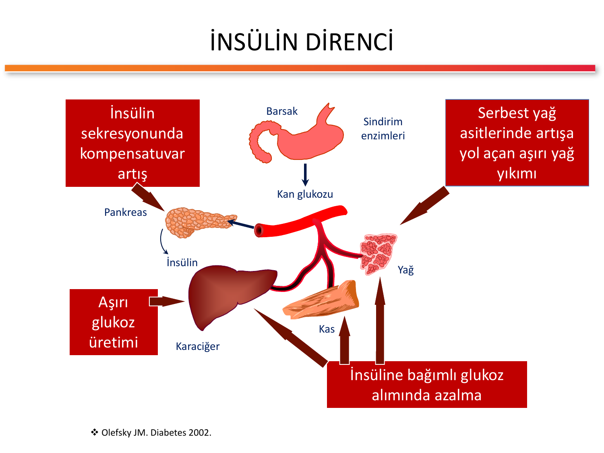

İnsülin direnci çok sayıda organı etkileyen bir tablodur:

* **Pankreas:** İnsülin sekresyonunda kompansatuvar artış.
* **Barsak:** Sindirim enzimleri üzerinden glukoz emiliminde değişiklik.
* **Yağ doku:** Serbest yağ asitlerinde artışa yol açan aşırı yağ yıkımı (lipoliz).
* **Karaciğer:** Aşırı glukoz üretimi (hepatik glikoneogenez).
* **Kas:** İnsüline bağımlı glukoz alımında azalma.

> **Sonuç:** Kan glukoz düzeyinde artış → hiperglisemi.

### DeFronzo — "Ominous Octet" (Uğursuz Sekizli)

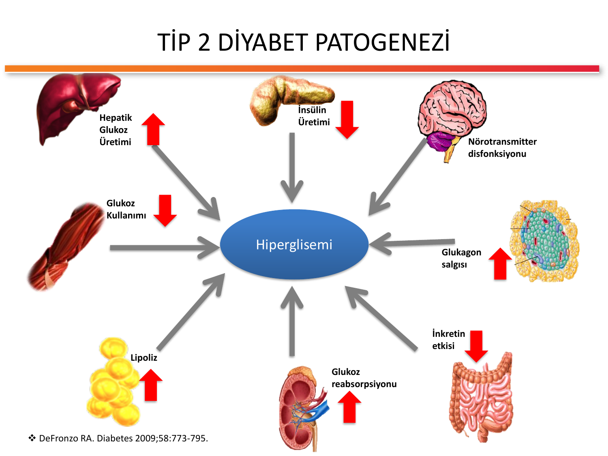

DeFronzo (2009), tip 2 DM'de hiperglisemiye katkıda bulunan 8 mekanizmayı tanımlamıştır:

1. **Pankreas:** İnsülin üretiminde azalma ↓
2. **Pankreas (α-hücre):** Glukagon salgısında artış ↑
3. **Karaciğer:** Hepatik glukoz üretiminde artış ↑
4. **Kas:** Periferik glukoz kullanımında azalma ↓
5. **Yağ doku:** Lipolizde artış ↑
6. **Barsak:** İnkretin etkisinde azalma ↓
7. **Böbrek:** Glukoz reabsorpsiyonunda artış ↑
8. **Beyin:** Nörotransmitter disfonksiyonu

> Kaynak: DeFronzo RA. Diabetes 2009;58:773-795.

---

## GEBELİK VE DİYABET

### Sınıflama

* **Pregestasyonel diyabet**
    * Tip 1 Diabetes Mellitus
    * Tip 2 Diabetes Mellitus
* **Gestasyonel diyabet (GDM)**

**⚠️ ÖNEMLİ:** Tanı konmamış tip 2 diyabetik gebe kadın oranı giderek artmaktadır.

### Gebelikte Diyabetin Etkileri — Freinkel Hipotezi

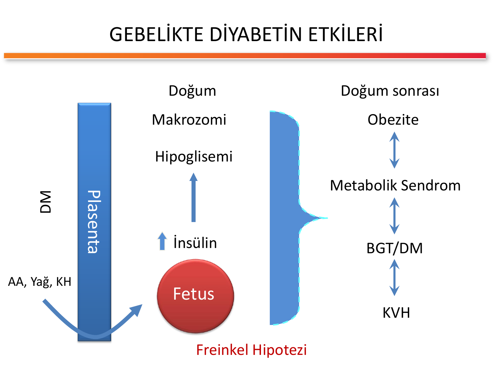

Maternal hiperglisemi plasentayı geçerek fetal metabolizmayı etkiler. Bu etkiler **doğum** ve **doğum sonrası** döneme uzanır:

**Doğum döneminde:**
* Makrozomi
* Hipoglisemi

**Doğum sonrası (ileride çocukta):**
* Obezite
* Metabolik sendrom
* BGT / DM
* Kardiyovasküler hastalık (KVH)

### Maternal ve Fetal Komplikasyonlar

* ↑ **Perinatal mortalite**
* ↑ **Konjenital malformasyonlar**
* ↑ **Spontan abortus**
* ↑ **Polihidramnioz**
* ↑ **Makrozomi**
* ↑ **Doğum travması riski**
* ↑ **Neonatal hipoglisemi**
* ↑ **Hiperbilirubinemi, hipokalsemi, polisitemi**

### Konjenital Malformasyonlar

* **Kaudal regresyon**
* **Spina bifida**
* **Anansefali**
* **Kardiyak anomaliler:**
    * Büyük damarların transpozisyonu
    * Ventriküler septal defekt (VSD)
    * Atrial septal defekt (ASD)
* **Anal/rektal atrezi**
* **Renal anomaliler:**
    * Agenezi
    * Kistik böbrek
    * Çift üreter
* **Situs inversus**

**⚠️ ÖNEMLİ:**

* Malformasyonlar **ilk 6-8 haftada** yüksek glukoz düzeyleri ile ilişkilidir.
* **Gebelik öncesi planlama** malformasyon oranını anlamlı düzeyde azaltır.
* Ancak gebeliklerin **2/3'ü plansızdır**.

> Kaynak: Kitzmiller JL et al. Diabetes Care 2008;31:1060-1079.

### Makrozomi Mekanizması

```
      Maternal hiperglisemi
              ↓
       Fetal hiperglisemi
              ↓
   Fetal pankreatik β-hücre hiperplazisi
              ↓
       Fetal hiperinsülinemi
              ↓
        Fetal adipozite artışı
              ↓
            Makrozomi
```

---

## GESTASYONEL DİYABET

### Tanım ve Patofizyoloji

**Gestasyonel diyabet (GDM):** 2. ya da 3. trimesterde saptanan glukoz tolerans bozukluğudur.

**Patofizyoloji:**

Plasental hormonların (progesteron, kortizol, büyüme hormonu, prolaktin, human plasental laktojen — HPL) etkisiyle gebeliğin ikinci yarısında **insülin direnci** gelişir. Maternal pankreatik β-hücreler artan insülin gereksinimini karşılayamadığında **GDM** ortaya çıkar.

```
 Plasental Hormonlar (Progesteron, Kortizol, GH, Prolaktin, HPL)
                            ↓
                   İnsülin Direnci ↑
                   (gebeliğin 2. yarısı)
                            ↓
           Maternal pankreatik β-hücrelerin
           artan insülin gereksinimini
           karşılamakta başarısız olması
                            ↓
                           GDM
```

### Yüksek Risk Grupları

* **Obezite**
* **Önceki gebelikte GDM öyküsü** veya **gestasyonel yaşa göre iri bebek doğum öyküsü**
* **Glukozüri**
* **Polikistik over sendromu (PCOS)**
* **Ailede yoğun tip 2 diyabet öyküsü**

### Tarama ve Tanı — Klasik İki Aşamalı Yaklaşım

**Tarama zamanı:** Gebeliğin **24-28. haftaları**

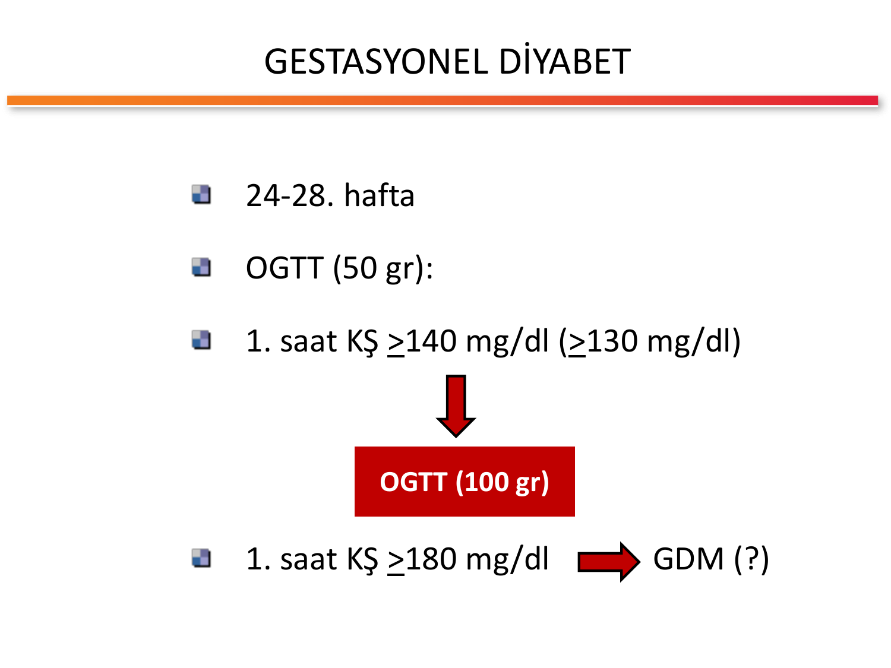

**1. Basamak: 50 gr Glukoz Tarama Testi** (açlık gerekmez)

* **1. saat kan şekeri < 140 mg/dl (bazı kaynaklarda <130):** Tarama negatif, GDM yok.
* **1. saat kan şekeri ≥ 140 mg/dl:** Şüpheli → **100 gr OGTT** ile doğrulama.
* **1. saat kan şekeri ≥ 180 mg/dl:** Bazı yaklaşımlarda **doğrudan GDM kabul edilir**, OGTT'ye gerek görülmeyebilir (çok yüksek değer).

**2. Basamak: 100 gr OGTT — Tanı Kriterleri**

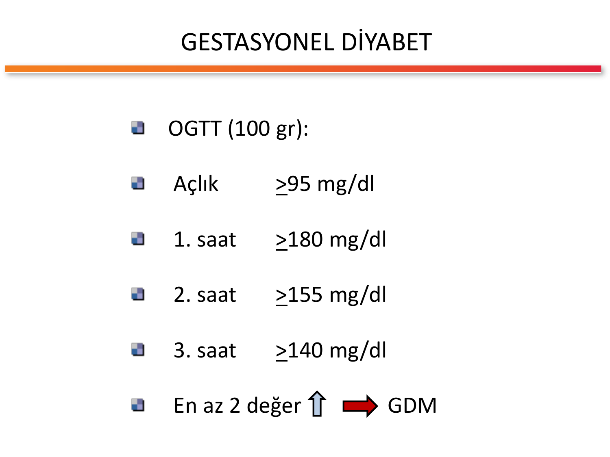

| Zaman   | Eşik Değer  |
| ------- | ----------- |
| Açlık   | ≥ 95 mg/dl  |
| 1. saat | ≥ 180 mg/dl |
| 2. saat | ≥ 155 mg/dl |
| 3. saat | ≥ 140 mg/dl |

> **En az 2 değerin eşik ve üstü olması → GDM tanısı.**

### Tek Aşamalı Yaklaşım — 75 gr OGTT

| Zaman   | Eşik Değer  |
| ------- | ----------- |
| Açlık   | ≥ 92 mg/dl  |
| 1. saat | ≥ 180 mg/dl |
| 2. saat | ≥ 153 mg/dl |

> **En az 1 değerin eşik ve üstü olması → GDM tanısı.**

### HAPO Çalışması — Glukoz Kategorisi ve Sonuçlar

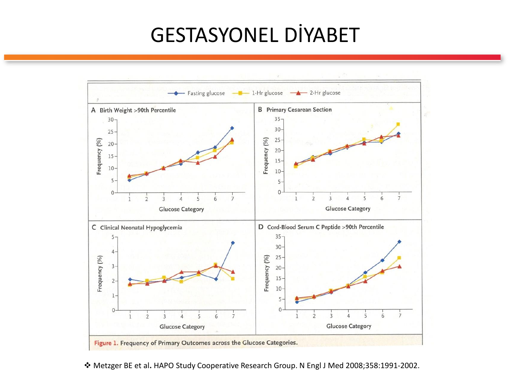

Metzger ve ark. tarafından yayımlanan **HAPO** (Hyperglycemia and Adverse Pregnancy Outcome) çalışması, maternal glukoz düzeylerinin — diyabet eşiği altında bile — aşağıdaki sonuçlarla **sürekli ve lineer** ilişkili olduğunu göstermiştir:

**A.** Doğum ağırlığı > 90. persentil (makrozomi)
**B.** Primer sezaryen
**C.** Klinik neonatal hipoglisemi
**D.** Kord kan C-peptid düzeyi > 90. persentil

> Kaynak: Metzger BE et al. HAPO Study Cooperative Research Group. N Engl J Med 2008;358:1991-2002.

---

## GESTASYONEL DİYABET TEDAVİSİ VE İZLEMİ

### ACHOIS Çalışması — Tedavinin Sonuçları

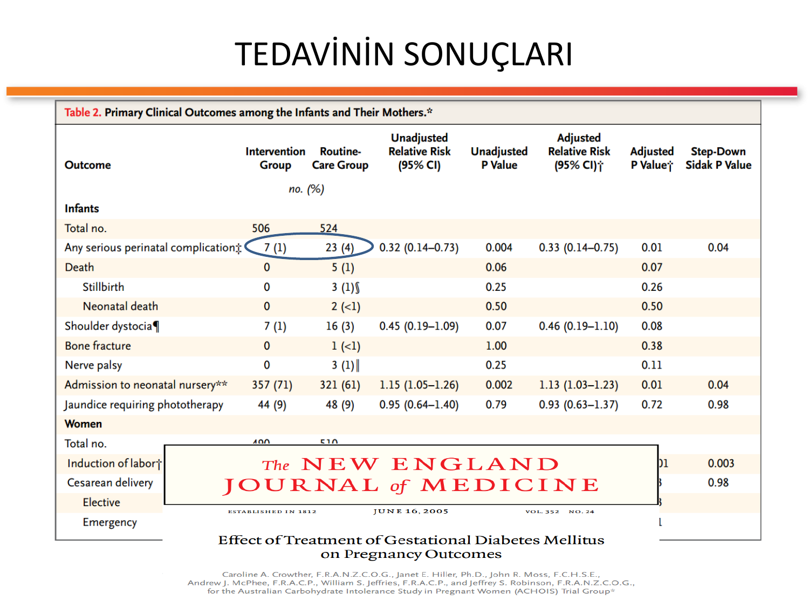

ACHOIS (Crowther et al., N Engl J Med 2005;352:2477-86) çalışmasında gestasyonel diyabetin tedavisi:

| Sonuç                                         | Tedavi Grubu | Rutin Bakım | RR (%95 CI)      | p     |
| --------------------------------------------- | ------------ | ----------- | ---------------- | ----- |
| **Herhangi bir ciddi perinatal komplikasyon** | 7 (%1)       | 23 (%4)     | 0.33 (0.14-0.75) | 0.01  |
| Omuz distosisi                                | 7 (%1)       | 16 (%3)     | 0.46 (0.19-1.10) | 0.08  |
| Neonatal üniteye yatış                        | 357 (%71)    | 321 (%61)   | 1.13 (1.03-1.23) | 0.01  |
| İndüksiyon                                    | ↑            |             |                  | 0.003 |

**Sonuç:** GDM tedavisi ciddi perinatal komplikasyonları anlamlı düzeyde **azaltmaktadır**.

### Beslenme ve Egzersiz

**Makronutrient Dağılımı:**

* **%45-50** karbonhidrat
* **%18-20** protein
* **%30-35** yağ

**Kalori İhtiyacı:**

* **Obez diyabetlilerde:** 24 kcal/kg
* **Obez olmayan diyabetlilerde:**
    * İlk trimesterde: **30 kcal/kg**
    * İkinci trimesterden itibaren: **35 kcal/kg**

### İnsülin Tedavisi — Tarihsel Perspektif

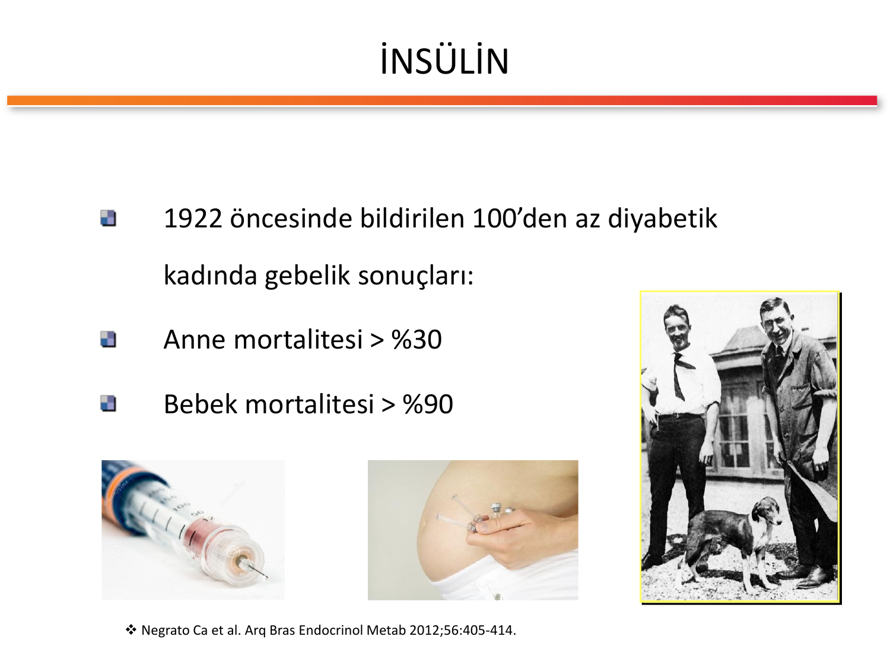

**⚠️ 1922 öncesi (insülin öncesi dönem):** Bildirilen 100'den az diyabetik kadında gebelik sonuçları şu şekildeydi:

* **Anne mortalitesi:** > **%30**
* **Bebek mortalitesi:** > **%90**

> Kaynak: Negrato CA et al. Arq Bras Endocrinol Metab 2012;56:405-414.

### Yoğun İnsülin Tedavisi

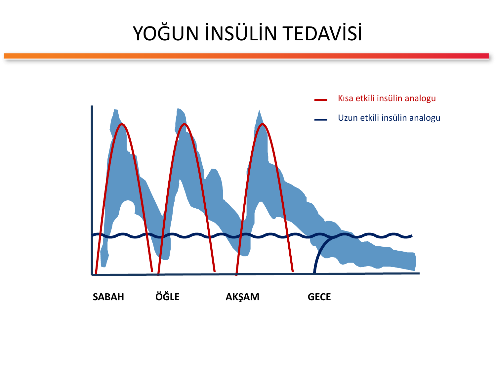

Gebelikte temel yaklaşım **bazal-bolus (yoğun) insülin tedavisidir:**

* **Öğünlerde:** Kısa etkili insülin analogu (sabah – öğle – akşam)
* **Gece:** Uzun etkili insülin analogu (bazal)

### Gebelikte İnsülin Kategorileri

| İnsülin          | FDA Kategorisi |
| ---------------- | -------------- |
| Regüler insülin  | **B**          |
| NPH insülin      | **B**          |
| İnsülin lispro   | **B**          |
| İnsülin aspart   | **B**          |
| İnsülin detemir  | **B**          |
| İnsülin glarjin  | C              |
| İnsülin glulizin | C              |
| İnsülin degludec | C              |

> **💡 Gebelikte tercih:** Kategori B insülinler (regüler, NPH, lispro, aspart, detemir).

### GDM İzlemi

* **Kan şekeri takibi:** Günlük olarak izlenmeli; yoğun insülin tedavisi altında olanlarda **günde 4-7 kez** kan glukoz ölçümü önerilir.
* **HbA1c:** **4-6 hafta aralarla** yapılmalıdır (gebelikte eritrosit turnover'ı hızlandığı için HbA1c tek başına yeterli değildir).
* **Fruktozamin** ölçümü de yapılabilir — son **2-3 haftalık** glisemik kontrolü yansıtır (HbA1c'den daha kısa).
* **İdrarda keton takibi** yararlıdır.

> **💡 Neden idrarda keton?** Gebelikte artan insülin gereksinimi karşılanmazsa ya da yetersiz karbonhidrat alımıyla **açlık ketozisi** ve hatta **öglisemik diyabetik ketoasidoz (DKA)** gelişebilir. Maternal ketoz fetal nörogelişim üzerine olumsuz etkilidir.

### Postpartum İzlem

**⚠️ ÇOK ÖNEMLİ:** GDM tanısı olan kadınlarda doğum sonrası hastalık bitmez — **gizli tip 2 DM riski çok yüksektir**.

* **Doğumdan sonraki 6-12. haftada 75 gr OGTT** yapılmalıdır.
* OGTT normal çıksa bile **her 1-3 yılda bir** diyabet taraması sürdürülmelidir.
* **Hayat boyu tip 2 DM gelişme riski ~%50-70** (ilk 5-10 yılda en yüksek).
* Sonraki gebeliklerde **GDM tekrarlama riski %30-70**.
* **Emzirme**, laktasyon süresince anne için diyabet riskini azaltır ve glukoz toleransını iyileştirir.

### Tedavi Hedefleri — Glisemik Kontrol

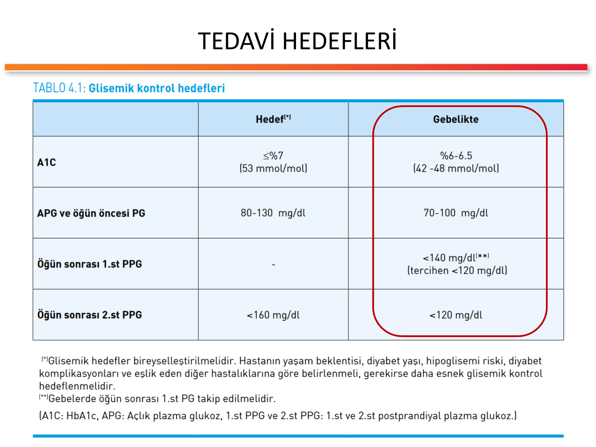

| Parametre                    | Genel Hedef        | **Gebelikte**                          |
| ---------------------------- | ------------------ | -------------------------------------- |
| **HbA1c**                    | ≤ %7 (53 mmol/mol) | **%6 – 6.5** (42-48 mmol/mol)          |
| **APG ve öğün öncesi PG**    | 80 – 130 mg/dl     | **70 – 100 mg/dl**                     |
| **Öğün sonrası 1. saat PPG** | —                  | **< 140 mg/dl** (tercihen < 120 mg/dl) |
| **Öğün sonrası 2. saat PPG** | < 160 mg/dl        | **< 120 mg/dl**                        |

> **⚠️ ÖNEMLİ:**
>
> * Glisemik hedefler **bireyselleştirilmelidir**. Hastanın yaşam beklentisi, diyabet yaşı, hipoglisemi riski, diyabet komplikasyonları ve eşlik eden hastalıklara göre belirlenir.
> * **Gebelerde öğün sonrası 1. saat PG takip edilmelidir.**
>
> *Kısaltmalar: APG: Açlık plazma glukoz, PPG: Postprandiyal plazma glukoz.*


---

## SINAV NOTLARI — ANAHTAR HATIRLATMALAR

> **📋 En Sık Sorulan Noktalar:**
>
> 1. **DM tanısı 4 yoldan biri ile konur:** Semptom + rastgele ≥200 / AKS ≥126 / OGTT 2.st ≥200 / HbA1c ≥%6.5. Asemptomatik hastada **doğrulama şart**.
> 2. **Prediyabet eşikleri (ezberle):** AKS **100-125**, OGTT 2.st **140-199**, HbA1c **%5.7-6.4**.
> 3. **Tip 1 → otoimmün, zayıf, DKA, anti-GAD pozitif, insülin zorunlu.**
> 4. **Tip 2 → insülin direnci + β-hücre disfonksiyonu, obez, sinsi.**
> 5. **MODY3 → sülfonilüreye muhteşem yanıt**, MODY2 → hafif ve tedavisiz.
> 6. **Tip 2 patogenezi — DeFronzo "ominous octet":** 8 organ — pankreas (β ve α), karaciğer, kas, yağ, barsak, böbrek, beyin.
> 7. **GDM tarama zamanı: 24-28. hafta.** 100 gr OGTT'de **≥2 değer** / 75 gr OGTT'de **≥1 değer** tanı koydurur.
> 8. **HAPO çalışması:** Glukoz ile kötü sonuçlar arasında **eşik değer yok, süreklilik var**.
> 9. **Gebelikte tercih edilen insülinler: Kategori B** (regüler, NPH, lispro, aspart, detemir).
> 10. **GDM sonrası 6-12. haftada 75 gr OGTT** — tip 2 DM gelişim riski **yüksek**.
> 11. **Gebelikte glisemik hedefler:** HbA1c **%6-6.5**, APG **70-100**, 1.st PPG **<140** (tercihen <120).
> 12. **Konjenital malformasyonlar ilk 6-8 haftada** yüksek glukoza bağlı → **gebelik öncesi planlama** kritik.

---

## VAKA SORULARI

> Bu bölüm öğrenciye yönelik olarak hazırlanmış 15 vaka sorusu içerir:
>
> * **Soru 1-10:** Standart 5 seçenekli test soruları
> * **Soru 11-15:** Multidisipliner zor vaka soruları

---

### SORU 1 — Asemptomatik AKS Yüksekliği

**📋 Vaka:** 55 yaşında kadın hasta, rutin sağlık taraması için başvuruyor. Asemptomatik. **AKS: 132 mg/dl** ölçülüyor. Hasta polidipsi, poliüri ve kilo kaybı tanımlamıyor.

**Bu hastada bir sonraki en uygun yaklaşım hangisidir?**

A) Hemen diabetes mellitus tanısı koyup metformin başlanması
B) Farklı bir günde aynı testin (AKS) tekrarlanması veya HbA1c ile doğrulanması
C) Doğrudan OGTT yapılarak 2. saat değerine göre tedavi planlanması
D) Bozulmuş açlık glukozu tanısı konularak yıllık izleme alınması
E) Hipoglisemi araştırması için 72 saatlik açlık testi yapılması
---

### SORU 2 — Akut Başlangıçlı Tip 1 DM

**📋 Vaka:** 14 yaşında, daha önce sağlıklı erkek çocuk, son **2 haftadır** poliüri, polidipsi, polifaji ve **6 kg kilo kaybı** ile acile getiriliyor. Halsiz ve solunum hızlı (Kussmaul). Rastgele kan şekeri **380 mg/dl**, idrarda keton **(++++)**, kan gazında metabolik asidoz (pH 7.20, HCO₃ 12).

**En olası tanı hangisidir?**

A) Tip 1 Diabetes Mellitus (Diyabetik ketoasidoz ile başvuru)
B) Tip 2 Diabetes Mellitus
C) MODY2 (Glukokinaz mutasyonu)
D) Diabetes insipitus
E) Gestasyonel diabetes mellitus
---

### SORU 3 — HbA1c ile Tanı Doğrulama

**📋 Vaka:** 60 yaşında, BMI 32 kg/m², asemptomatik kadın. AKS: **118 mg/dl**, HbA1c: **%6.8**.

**Bu hasta için en doğru değerlendirme hangisidir?**

A) Normal — sadece ileri yaşa bağlı glukoz yükselmesi
B) Bozulmuş açlık glukozu — yaşam tarzı değişikliği önerilir
C) Diabetes mellitus — HbA1c kriteri tek başına yeterlidir, hemen tedavi başlanır
D) Bozulmuş glukoz toleransı — OGTT yapılması gereksizdir
E) Asemptomatik hastada tanı için doğrulayıcı ikinci test gereklidir; HbA1c ≥%6.5 doğrulanırsa diabetes mellitus tanısı konur
---

### SORU 4 — MODY3 (HNF-1α)

**📋 Vaka:** 22 yaşında, BMI 22 kg/m², zayıf erkek hasta. Tesadüfen yapılan tetkikte AKS 145 mg/dl, HbA1c %7.2. Otoantikorlar (anti-GAD, ICA, IA2) **negatif**, C-peptid normal. Aile öyküsünde **dede, baba ve abla** genç yaşlarda diyabet tanısı almış (anne sağlıklı). Hastaya düşük doz **glimepirid** başlanmış ve KŞ değerleri dramatik olarak normalleşmiş.

**En olası tanı hangisidir?**

A) Latent Autoimmune Diabetes of Adults (LADA)
B) Tip 2 diabetes mellitus, erken başlangıç
C) MODY3 (HNF-1α mutasyonu)
D) MODY2 (Glukokinaz mutasyonu)
E) Sekonder pankreatik diyabet
---

### SORU 5 — MODY2 (Glukokinaz)

**📋 Vaka:** 8 yaşında, asemptomatik kız çocuk. Okul check-up'ında AKS 115 mg/dl saptanıyor. Tekrar değerlendirmede AKS 112-118 arası seyrediyor, HbA1c **%6.2**. Çocuk normal kilolu, otoantikorlar negatif. **Babasında** yıllardır benzer hafif hiperglisemi saptanmış ancak hiç tedavi almamış ve hiçbir komplikasyon gelişmemiş.

**Bu hasta için en olası tanı ve en uygun yaklaşım nedir?**

A) Tip 1 DM — hemen insülin başlanmalı
B) Tip 2 DM — metformin başlanmalı
C) MODY3 (HNF-1α) — sülfonilüre başlanmalı
D) MODY2 (Glukokinaz mutasyonu) — tedavisiz izlem yeterlidir
E) Diabetes insipitus — desmopressin başlanmalı
---

### SORU 6 — GDM Tarama Zamanı

**📋 Vaka:** 28 yaşında G2P1, son adet tarihine göre **26. gebelik haftasında**. İlk gebeliğinde GDM öyküsü yok. Rutin gebelik takibinde GDM taraması planlanıyor.

**Bu hastada gestasyonel diyabet için ilk basamak tarama testi hangisidir?**

A) Açlık plazma glukozu ölçümü
B) HbA1c
C) 50 gr glukoz tarama testi (1. saat kan şekeri)
D) 100 gr OGTT (3 saatlik test)
E) 75 gr OGTT (2 saatlik test)
---

### SORU 7 — 75 gr OGTT ile GDM Tanısı

**📋 Vaka:** 32 yaşında G3P2 gebe, 26. haftada **tek aşamalı 75 gr OGTT** uygulanıyor. Sonuçlar:

* Açlık: **96 mg/dl**
* 1. saat: **175 mg/dl**
* 2. saat: **165 mg/dl**

**Bu hasta için tanı nedir?**

A) Normal — gebelik fizyolojisi
B) Bozulmuş glukoz toleransı
C) Gestasyonel diabetes mellitus
D) Aşikâr (overt) diabetes mellitus
E) Bozulmuş açlık glukozu
---

### SORU 8 — Konjenital Malformasyon Kritik Dönemi

**📋 Vaka:** 27 yaşında, **pregestasyonel tip 1 DM** hastası kadın, gebelik planlamak için endokrinoloji polikliniğine başvuruyor. Son 1 yıldır HbA1c %9.5 düzeyinde seyrediyor.

**Bu hastaya, fetal konjenital malformasyon riskinin **en yüksek olduğu dönem** açısından hangi bilgi verilmelidir?**

A) 24-28. haftalar (GDM tarama dönemi)
B) 1. trimesterin sonu (12. hafta civarı)
C) 2. trimesterin tamamı
D) 3. trimester ve doğum sırası
E) Konsepsiyondan itibaren ilk 6-8 hafta (organogenez dönemi)
---

### SORU 9 — Tip 1 DM Otoantikorları

**📋 Vaka:** 12 yaşında erkek çocuk DKA tablosuyla acile getiriliyor. Tedavi sonrası tip 1 DM tanısı doğrulanmak isteniyor.

**TEMD 2024 evrelerine göre Tip 1 DM tanısında, **en az ikisinden biri olarak aranan** ve en kritik kabul edilen otoantikor hangisidir?**

A) Anti-nükleer antikor (ANA)
B) Anti-glutamik asit dekarboksilaz (anti-GAD)
C) Anti-tiroid peroksidaz (anti-TPO)
D) Anti-çift sarmal DNA (anti-dsDNA)
E) Anti-nötrofil sitoplazmik antikor (ANCA)
---

### SORU 10 — Postpartum GDM İzlemi

**📋 Vaka:** 31 yaşında kadın, son gebeliğinde 28. haftada GDM tanısı almış, insülinle takip edilmiş. **8 hafta önce** doğum yapmış. Endokrinoloji polikliniğine kontrol için geliyor. Gebeliğinden önce diyabet öyküsü yoktu.

**Postpartum dönemde bu hasta için en uygun değerlendirme hangisidir?**

A) GDM gebelikle sınırlıydı, doğum sonrası ek değerlendirmeye gerek yok
B) Sadece HbA1c bakılması yeterlidir
C) Doğum sonrası 6-12. haftada 75 gr OGTT yapılmalı; sonrası her 1-3 yılda bir diyabet taraması sürdürülmelidir
D) Sadece yıllık AKS ölçümü yeterlidir
E) İdrarda glukozüri tetkiki ile takip yeterlidir
---

## ZOR VAKALAR — MULTİDİSİPLİNER DEĞERLENDİRME

---

### SORU 11 

**📋 Vaka:** 24 yaşında kadın hasta. Son 1 aydır halsizlik ve poliüri yakınması ile başvuruyor. **BMI 21 kg/m²**, AKS **165 mg/dl**, HbA1c **%7.1**. Otoantikorlar (anti-GAD, ICA, IA2) **negatif**, C-peptid normal. Tetkiklerinde **eGFR 55 ml/dk/1.73 m²**, kreatinin 1.4 mg/dl, idrar tetkikinde proteinüri yok. Abdominal **ultrasonda bilateral renal kortikal kistler** saptanıyor (polikistik patern değil). **Aile öyküsünde**: anne 28 yaşında diyabet tanısı almış, 45 yaşında diyaliz başlamış; teyzesinde de erken yaşta DM ve renal yetmezlik öyküsü mevcut.

**Bu hastada en olası tanı hangisidir?**

A) Tip 1 DM (LADA varyantı) zemininde gelişen erken diyabetik nefropati
B) Tip 2 DM zemininde diyabetik nefropati
C) Otozomal dominant polikistik böbrek hastalığı + tesadüfi tip 2 DM
D) MODY5 (HNF-1β mutasyonu) — RCAD sendromu (Renal Cysts and Diabetes)
E) Wolfram (DIDMOAD) sendromu
---

### SORU 12 — 
**📋 Vaka:** 65 yaşında kadın, **6 aydır romatoid artrit nedeniyle prednizolon 15 mg/gün** kullanıyor. Son 2 haftadır poliüri, polidipsi ve halsizlik gelişmiş. AKS **220 mg/dl**, HbA1c **%7.5**. Hasta gebe değil, BMI 28 kg/m², ailede DM yok. Daha önce hiç diyabet tanısı almamış. Romatoid artrit aktivitesi şu anda kısmen kontrol altında (DAS28 4.2), tam remisyonda değil.

**Bu hastada en doğru klinik yaklaşım hangisidir?**

A) Steroidi hemen tamamen kesip RA için sadece NSAID başlanması
B) Romatoloji ile birlikte değerlendirip mümkünse steroidi en düşük etkin doza azaltmak ya da steroid-koruyucu (DMARD) tedaviye geçmek + glisemik kontrol için tedavi başlatmak (steroid sürdürülecekse genellikle insülin/NPH tercih edilir)
C) Sadece düşük doz sülfonilüre ile tek başına tedavi, steroide dokunulmaması
D) Yoğun bazal-bolus insülin başlanması ve steroidin değiştirilmemesi
E) Bu hiperglisemi ilaca bağlıdır, izlem yeterli, tedaviye gerek yok
---

### SORU 13 

**📋 Vaka:** 38 yaşında kadın. Son **1 yılda 25 kg kilo artışı**, **mor stria** (karın ve uylukta geniş, koyu mor), yüzde dolgunlaşma (Cushingoid görünüm), hipertansiyon (TA 165/100 mmHg), proksimal kas güçsüzlüğü, kolay morarma. AKS **195 mg/dl**, HbA1c **%8.5**, **serum potasyum 3.0 mEq/L** (hipokalemi), serum bikarbonat 32 (hafif metabolik alkaloz). Ailede DM ve hipertansiyon yok. EKG'de sol ventrikül hipertrofi paterni.

**Bu hastada en olası altta yatan tanı ve en uygun ilk basamak değerlendirme hangisidir?**

A) Primer obeziteye bağlı tip 2 DM + esansiyel hipertansiyon — yaşam tarzı + metformin
B) Primer hiperaldosteronizm — aldosteron/renin oranı ve adrenal görüntüleme
C) Akromegali — IGF-1 ve OGTT sırasında GH baskılanma testi
D) Endojen Cushing sendromu (sekonder DM ile birlikte) — tarama: 1 mg gece deksametazon supresyon testi, 24 saatlik idrarda kortizol veya gece tükürük kortizolü; doğrulandıktan sonra ACTH ile etiyoloji araştırması
E) Feokromositoma — plazma/idrarda metanefrinler
---

### SORU 14 

**📋 Vaka:** 30 yaşında G3P2, **32. gebelik haftasında**, 26. haftada GDM tanısı almış. Diyet ve insülin tedavisi alıyor. Son **2 gündür bulantı, kusma, halsizlik, derin solunum** ile acile getiriliyor. **Kan şekeri: 145 mg/dl** (normal sınırda). Arteriyel kan gazı: **pH 7.18, HCO₃ 12 mEq/L, anyon açığı 22**. İdrarda **keton (++++) ve glukoz (+)**. Öyküsünde son 1 haftadır oral alımı çok az, "diyete uyamadım" diyor.

**Bu hastada en olası tanı hangisidir?**

A) Hiperozmolar hiperglisemik durum (HHD)
B) Açlık ketozisi — basit dehidratasyon
C) Öglisemik diyabetik ketoasidoz
D) Hiperemezis gravidarum'a bağlı pür metabolik alkaloz
E) Akut pankreatit — gebelik dışı bir tablo
---

### SORU 15

**📋 Vaka:** 14 yaşında erkek hasta. **5 yaşında insülin gerektiren diyabet** tanısı almış (otoantikorlar negatifti, neden tam aydınlatılamadı). Son 2 yıldır **giderek azalan görme keskinliği**; oftalmoloji muayenesinde **bilateral optik atrofi** saptanmış. Aileden öğrenildiğine göre son 1 yıldır **yüksek frekansları işitememeye** başlamış (sensörinöral işitme kaybı). Ayrıca **gece çok fazla idrara çıkma** (kan şekeri kontrol altında), **idrar yapmada güçlük ve mesane boşalmasında bozukluk** mevcut. Akrabalık öyküsü pozitif (anne-baba kuzen).

**Bu hastada en olası tanı hangisidir?**

A) Tip 1 DM + Friedreich tipi ataksi birlikteliği
B) Wolfram sendromu (DIDMOAD): Diabetes Insipitus, Diabetes Mellitus, Optic Atrophy, Deafness
C) Alström sendromu
D) MELAS sendromu (mitokondriyal)
E) Bardet-Biedl sendromu
---

> **💡 Vaka Çalışması Sonu:** Bu 15 vaka, ders notunda yer alan tanı kriterlerinden başlayarak, MODY tipleri, sekonder diyabet nedenleri, gestasyonel diyabet ve nadir multisistemik diyabet sendromlarına kadar geniş bir spektrumu kapsar. Klinik yaklaşımda **ayrıntılı öykü + aile hikayesi + ekstra-pankreatik bulgular** her zaman tip 1/tip 2 dışı tanıları ekarte etmek için kritiktir.

---


## CEVAP ANAHTARI VE AÇIKLAMALAR

> Önce kendiniz çözmeye çalışın, sonra buradaki cevaplara bakın.

---

### SORU 1 — Asemptomatik AKS Yüksekliği

**Doğru Cevap: B**

> **Açıklama:** **Asemptomatik bir hastada DM tanısı tek bir testle konulamaz.** Tanı, **farklı bir günde yapılan ikinci test** ile doğrulanmalıdır. Tercihen aynı test (AKS) tekrarlanır; farklı iki test (örn. AKS + HbA1c) de pozitifse tanı doğrulanır. Semptomu olmayan hastada tek ölçümle doğrudan tanı **doğru değildir**.

---

### SORU 2 — Akut Başlangıçlı Tip 1 DM

**Doğru Cevap: A**

> **Açıklama:** Klasik tablo: **zayıf bir genç, haftalar içinde kilo kaybı, ketoasidoz** → **Tip 1 DM**. Otoimmün β-hücre yıkımı sonucu insülin yokluğu nedeniyle ketoasidoz tablosu gelişir. Tip 2 DM sinsi seyreder, obez hastalarda görülür ve ketoasidoz nadirdir. MODY2 hafif seyirlidir, DKA yapmaz. Diabetes insipitus glukoz değil, ADH bozukluğudur.

---

### SORU 3 — HbA1c ile Tanı Doğrulama

**Doğru Cevap: E**

> **Açıklama:** HbA1c ≥**%6.5** diyabet tanı kriterlerinden biridir. Ancak **asemptomatik hastada tek test yetmez** — farklı günde HbA1c veya AKS tekrar edilmeli, ya da iki farklı test pozitifliği aranmalıdır. AKS 118 mg/dl prediyabet aralığında olsa da HbA1c %6.8 diyabet aralığındadır; doğrulanırsa tanı kesinleşir.

---

### SORU 4 — MODY3 (HNF-1α)

**Doğru Cevap: C**

> **Açıklama:** Klinik ipuçları: <**25 yaş**, zayıf, **otoantikor negatif**, **otozomal dominant aile öyküsü** (3 nesil), **düşük doz sülfonilüreye dramatik yanıt** → klasik **MODY3 (HNF-1α)** tablosu. MODY3 en sık MODY tipidir. LADA otoantikor pozitifliği ile, MODY2 hafif-stabil hiperglisemi ile (tedavi gerektirmez), Tip 2 obezite ile karakterizedir.

---

### SORU 5 — MODY2 (Glukokinaz)

**Doğru Cevap: D**

> **Açıklama:** **MODY2 (Glukokinaz)**: çocuklukta başlayan, **hafif ve stabil açlık hiperglisemisi**, otozomal dominant geçiş, **çoğunlukla tedavi gerekmez**, komplikasyon nadir. Ailede benzer hafif ve sessiz seyirli hiperglisemi tipik. MODY2'yi tip 1, tip 2 ve MODY3'ten ayırt etmek gereksiz tedaviden kaçınmak için kritiktir.

---

### SORU 6 — GDM Tarama Zamanı

**Doğru Cevap: C**

> **Açıklama:** Klasik **iki aşamalı yaklaşımda** gebelik **24-28. haftalarda** önce **50 gr glukoz tarama testi** yapılır (açlık gerekmez). 1. saat KŞ ≥140 mg/dl ise **100 gr OGTT** ile doğrulama yapılır. Tek aşamalı yaklaşımda doğrudan **75 gr OGTT** kullanılır; bu vakada iki aşamalı yaklaşım sorulmuştur.

---

### SORU 7 — 75 gr OGTT ile GDM Tanısı

**Doğru Cevap: C**

> **Açıklama:** Tek aşamalı 75 gr OGTT GDM tanı eşikleri:
>
> * Açlık ≥**92 mg/dl**
> * 1. saat ≥**180 mg/dl**
> * 2. saat ≥**153 mg/dl**
>
> **En az 1 değerin eşik üstü olması GDM tanısı koydurur.** Bu hastada açlık (96 ≥92) ve 2. saat (165 ≥153) eşik üstü → **GDM**. 1. saat (175) eşik altıdır ama 1 değer bile yeterlidir.

---

### SORU 8 — Konjenital Malformasyon Kritik Dönemi

**Doğru Cevap: E**

> **Açıklama:** Diyabetik gebelikte **konjenital malformasyonlar ilk 6-8 haftada** (organogenez döneminde) yüksek glukoz düzeylerine bağlı gelişir. Kaudal regresyon, anansefali, kardiyak anomaliler, renal anomaliler tipiktir. **Gebelik öncesi planlama (preconception care)** ile glukozun normalleştirilmesi malformasyon oranını anlamlı azaltır. Ne yazık ki gebeliklerin 2/3'ü plansızdır.

---

### SORU 9 — Tip 1 DM Otoantikorları

**Doğru Cevap: B**

> **Açıklama:** Tip 1 DM otoantikorları: **anti-GAD, ICA, IAA, anti-fogrin (IA2 ve IA2-β), anti-ZnT8**. TEMD 2024 evrelendirmesinde **≥2 otoantikor pozitifliği** aranır ve **biri mutlaka anti-GAD** olmalıdır. ANA, anti-TPO, anti-dsDNA, ANCA diğer otoimmün hastalıklarla ilişkilidir, Tip 1 DM tanı paneline girmez.

---

### SORU 10 — Postpartum GDM İzlemi

**Doğru Cevap: C**

> **Açıklama:** GDM hastaları doğumdan sonra **gizli tip 2 DM riski açısından çok yüksek risk** taşır:
>
> * **Postpartum 6-12. hafta** → 75 gr OGTT ile değerlendirme
> * Hayat boyu tip 2 DM gelişme riski **~%50-70** (ilk 5-10 yılda en yüksek)
> * Sonraki gebeliklerde GDM tekrarlama riski **%30-70**
> * OGTT normal çıksa bile **her 1-3 yılda bir** diyabet taraması yapılmalı
> * **Emzirme** anne için diyabet riskini azaltır

---

### SORU 11 — MODY5 / RCAD (Endokrinoloji + Nefroloji + Genetik)

**Doğru Cevap: D**

> **Açıklama (multidisipliner):**
>
> * **Endokrinolojik veriler:** Genç (<25), zayıf, otoantikor negatif, ailede otozomal dominant geçiş → MODY paterni
> * **Nefrolojik veriler:** Bilateral **renal kortikal kistler** + ailede erken renal yetmezlik öyküsü → renal tutulum
> * **Genetik:** **HNF-1β** mutasyonu **MODY5**'e ve renal kist + diyabet birlikteliğine (**RCAD**) yol açar
> * MODY5 ayrıca pankreatik atrofi, üreme sistemi anomalileri (uterin malformasyon), karaciğer fonksiyon bozuklukları ile gelebilir
> * **Wolfram sendromu** optik atrofi + sağırlık + DI ile gelir; bu vakada bu bulgular yok
> * Tanı **genetik testle** konur; multidisipliner takip (endokrinoloji + nefroloji + jinekoloji) gerekir

---

### SORU 12 — Steroid-İndüklü Diyabet (Endokrinoloji + Romatoloji)

**Doğru Cevap: B**

> **Açıklama (multidisipliner):**
>
> * **Steroidler diyabet yapan ilaç gruplarının en sık sorumlusudur** (steroid-indüklü diyabet).
> * Patofizyoloji: glukokortikoid → hepatik glukoneogenez ↑ + insülin direnci ↑ + β-hücre disfonksiyonu → özellikle **postprandiyal hiperglisemi belirgin**.
> * **Multidisipliner yaklaşım:** Romatoloji ile konsülte edilerek steroid dozu **en düşük etkin doza** indirilir veya steroid-koruyucu DMARD eklenir/değiştirilir. Steroidin aniden tam kesilmesi (A) hem RA aktivasyonuna hem adrenal yetmezliğe yol açar.
> * Glisemik kontrol için: prednizolon **sabah verilirse** akşam üzeri-gece pikinde hiperglisemi belirgindir → **NPH insülin (öğleden sonra)** veya prandiyal kısa etkili insülin tipik tercih.
> * Steroid azaldıkça glisemik tedavi azaltılır; kalıcı DM gelişimi açısından izlem gerekir.

---

### SORU 13 — Cushing Sendromu (Endokrinoloji + Kardiyoloji)

**Doğru Cevap: D**

> **Açıklama (multidisipliner):**
>
> * Klasik Cushing tetrad/pentadı: santral obezite, mor stria, proksimal kas güçsüzlüğü, hipertansiyon, hiperglisemi, **hipokalemik metabolik alkaloz**.
> * Hiperkortizolizm → **hepatik glukoneogenez ↑ + insülin direnci ↑** → sekonder diyabet.
> * **Endokrinoloji**: tarama testleri (1 mg DST, 24 saat idrar kortizol, gece tükürük kortizol — en az 2 anormal). Sonrasında ACTH ile ayrım: ACTH yüksek/normal → ACTH-bağımlı (hipofizer veya ektopik); ACTH düşük → adrenal kaynaklı.
> * **Kardiyoloji**: hipertansiyon + sol ventrikül hipertrofisi + KV risk yönetimi (Cushing'de KV mortalite 4 kat artmıştır).
> * Tedavi altta yatan nedene göre (hipofiz cerrahisi, adrenalektomi, ektopik tümör). Diyabet altta yatan neden tedavi edilince genellikle düzelir.
> * Yalnızca obezite ve esansiyel HT ile açıklanamayacak kadar hızlı ve ağır bir tablo + hipokalemi → mutlaka sekonder neden araştır.

---

### SORU 14 — Öglisemik DKA (Endokrinoloji + Acil + Obstetrik)

**Doğru Cevap: C**

> **Açıklama (multidisipliner):**
>
> * **Öglisemik DKA**, özellikle **gebelikte**, **uzun süreli açlıkta**, **SGLT2 inhibitörü** kullanımı sırasında ve **insülin dozunun atlanması** durumlarında görülür.
> * Patofizyoloji: gebelikte artan insülin gereksinimi karşılanmaz veya yetersiz karbonhidrat alımıyla **lipoliz ↑ → ketogenez ↑** olur, ancak göreceli korunmuş insülin etkisi nedeniyle kan şekeri belirgin yükselmez.
> * Tanı kriterleri: kan şekeri **<200 mg/dl** (öglisemik), **artmış anyon açığı metabolik asidoz**, **ketonüri/ketonemi**.
> * **Maternal ketoz fetal nörogelişim** üzerine olumsuz etkilidir → acil tedavi gerekir.
> * **Tedavi:** IV sıvı (izotonik) + **dextrozlu sıvı** (öglisemik olduğu için glukoz şart) + **IV insülin infüzyonu** + elektrolit yönetimi (özellikle K). **Obstetri ile birlikte fetal monitorizasyon**.
> * **Önemli not:** Gebelikte ders notunda da vurgulandığı gibi "açlık ketozisi" ve "öglisemik DKA" ayrımı klinik ve laboratuvar bütünlüğü ile yapılır; metabolik asidoz + artmış anyon açığı varlığı DKA lehinedir.

---

### SORU 15 — Wolfram (DIDMOAD) Sendromu (Endokrinoloji + Oftalmoloji + Nöroloji + Üroloji)

**Doğru Cevap: B**

> **Açıklama (multidisipliner):**
>
> * **DIDMOAD** akronimi: **D**iabetes **I**nsipidus + **D**iabetes **M**ellitus + **O**ptic **A**trophy + **D**eafness
> * Otozomal resesif geçişli, **WFS1** geni mutasyonu (kromozom 4); **WFS2** ile de tanımlanmıştır.
> * **Endokrinolojik bulgular:** insüline bağımlı diyabet (otoantikor negatif), santral diabetes insipidus (gece poliürisi → kan şekerinden bağımsız, ADH yetersizliği)
> * **Oftalmolojik:** bilateral optik atrofi → ilerleyici görme kaybı (genellikle ilk dekattan sonra)
> * **Otolojik:** sensörinöral işitme kaybı (özellikle yüksek frekanslar)
> * **Ürolojik / nörolojik:** nörojenik mesane, hidroüreter, üst motor nöron bulguları, beyin sapı atrofisi, psikiyatrik bozukluklar
> * **Akraba evliliği** otozomal resesif geçişi düşündürür.
> * **Multidisipliner takip şart:** endokrinoloji (DM + DI yönetimi), oftalmoloji (görme rehabilitasyonu), KBB/odyoloji (işitme cihazı), üroloji (nörojenik mesane), nöroloji (progresif nörodejenerasyon), genetik danışmanlık.

---

> **💡 Vaka Çalışması Sonu:** Bu 15 vaka, ders notunda yer alan tanı kriterlerinden başlayarak, MODY tipleri, sekonder diyabet nedenleri, gestasyonel diyabet ve nadir multisistemik diyabet sendromlarına kadar geniş bir spektrumu kapsar. Klinik yaklaşımda **ayrıntılı öykü + aile hikayesi + ekstra-pankreatik bulgular** her zaman tip 1/tip 2 dışı tanıları ekarte etmek için kritiktir.
