# DİABETES MELLİTUS TEDAVİSİ

**Hazırlayan:** Prof. Dr. Engin Güney
**Bölüm:** Aydın Adnan Menderes Üniversitesi Tıp Fakültesi — Endokrinoloji ve Metabolizma Hastalıkları Bilim Dalı

---

## İÇİNDEKİLER

1. [Tedavi Planı ve Hasta Eğitimi](#tedavi-planı-ve-hasta-eğitimi)
2. [Diyet, Egzersiz ve Yaşam Tarzı Değişikliği](#diyet-egzersiz-ve-yaşam-tarzı-değişikliği)
3. [Glisemik Kontrol Hedefleri](#glisemik-kontrol-hedefleri)
4. [Antidiyabetik İlaçlar — Genel Çerçeve](#antidiyabetik-i̇laçlar--genel-çerçeve)
5. [Biguanidler — Metformin](#biguanidler--metformin)
6. [Tiazolidindionlar — Pioglitazon](#tiazolidindionlar--pioglitazon)
7. [Sülfonilüreler](#sülfonilüreler)
8. [Glinidler](#glinidler)
9. [α-Glukozidaz İnhibitörleri — Akarboz](#α-glukozidaz-i̇nhibitörleri--akarboz)
10. [SGLT2 İnhibitörleri (Gliflozinler)](#sglt2-i̇nhibitörleri-gliflozinler)
11. [İnkretin Temelli Tedaviler](#i̇nkretin-temelli-tedaviler)
12. [DPP-4 İnhibitörleri](#dpp-4-i̇nhibitörleri)
13. [GLP-1 Analogları](#glp-1-analogları)
14. [İnsülin Tedavisi](#i̇nsülin-tedavisi)
15. [İnsülin Uygulama Rejimleri](#i̇nsülin-uygulama-rejimleri)
16. [İnsülin Tedavisinin Komplikasyonları](#i̇nsülin-tedavisinin-komplikasyonları)
17. [Tedavi Algoritmaları (TEMD + ADA)](#tedavi-algoritmaları-temd--ada)
18. [Diyabet Tedavisinde Bireyselleştirme](#diyabet-tedavisinde-bireyselleştirme)

---

## TEDAVİ PLANI VE HASTA EĞİTİMİ

### Diyabet Tedavisinin Beş Temel Ayağı

```
        ┌─────────────────────────┐
        │       EĞİTİM            │  ← En önemli bileşen
        └─────────────────────────┘
                   │
       ┌───────────┼────────────┐
       ↓           ↓            ↓
    DİYET      EGZERSİZ      İLAÇ / İNSÜLİN
                   ↓
              İZLEM (SMBG + HbA1c)
```

### Hasta Eğitiminin Kapsamı

Eğitim **diyabet tedavisinin en önemli bölümüdür**. Hasta şu başlıklarda bilgilendirilmelidir:

* Diyabetin ne olduğu ve **komplikasyonları**
* **Diyet ve egzersiz** prensipleri
* Uygulanacak **ilaç / insülin** tedavisi
* **Hipoglisemi** tanıma ve tedavi etme
* **Ayak bakımı** (diyabetik ayak önlenmesi)
* **Kan şekeri izlemi** (SMBG — self monitoring of blood glucose)

> **💡 Altın kural:** Eğitimsiz hasta, en iyi ilaç rejiminden bile yararlanamaz. Diyabet büyük ölçüde **hastanın kendini yönettiği** bir hastalıktır.

---

## DİYET, EGZERSİZ VE YAŞAM TARZI DEĞİŞİKLİĞİ

### Diyet İlkeleri

* **İdeal kilo başına 20-30 kcal/gün** verilir.
* Hastanın **ideal kilosuna ulaşması** hedeflenir.
* Öğünler **düzenli** olmalıdır.
* **Glisemik indeksi düşük** besinler ve **kompleks karbonhidratlar** tercih edilir.

### Makro Besin Dağılımı

| Besin            | Önerilen Alım         |
| ---------------- | --------------------- |
| **Karbonhidrat** | %50-60 / total kalori |
| **Protein**      | ~%15 / total kalori   |
| **Total yağ**    | %25-35 / total kalori |
| Doymuş yağ       | <%7 / total kalori    |
| Poliansatüre yağ | <%10 / total kalori   |
| Monoansatüre yağ | <%20 / total kalori   |
| **Lif**          | 20-30 g/gün           |
| **Kolesterol**   | <200 mg/gün           |

### Egzersiz

* **Zamanlama:** Yemekten **1-1,5 saat sonra** başlanmalı (postprandiyal hiperglisemi kontrolü).
* **Şiddet:** Maksimum kalp hızının **%60-75'i** → formül: **220 − yaş**.
* **Sıklık:** En az **haftada 3-4 kez** (mümkünse her gün)
* **Süre:** **30-60 dakika**.

### Yaşam Tarzı Değişikliği (Kapsamlı)

* **Kalori kısıtlaması:** 1200-1800 kcal/gün
* **Alınan yağ oranının azaltılması:** <%25
* **Fiziksel aktivite artışı:** >30 dk/gün
* **Kilo kaybı:** >%5
* **Sigara ve alkolün bırakılması**

> **⚠️ ÖNEMLİ:** Prediyabet ve obeziteye bağlı erken tip 2 DM'de **%5-7'lik kilo kaybı** bile insülin direncini ve hiperglisemiyi dramatik biçimde düzeltebilir. Yaşam tarzı değişikliği metforminden **daha etkili** olabilmektedir (bkz. DPP çalışması — %58 risk azalması).

---

## GLİSEMİK KONTROL HEDEFLERİ

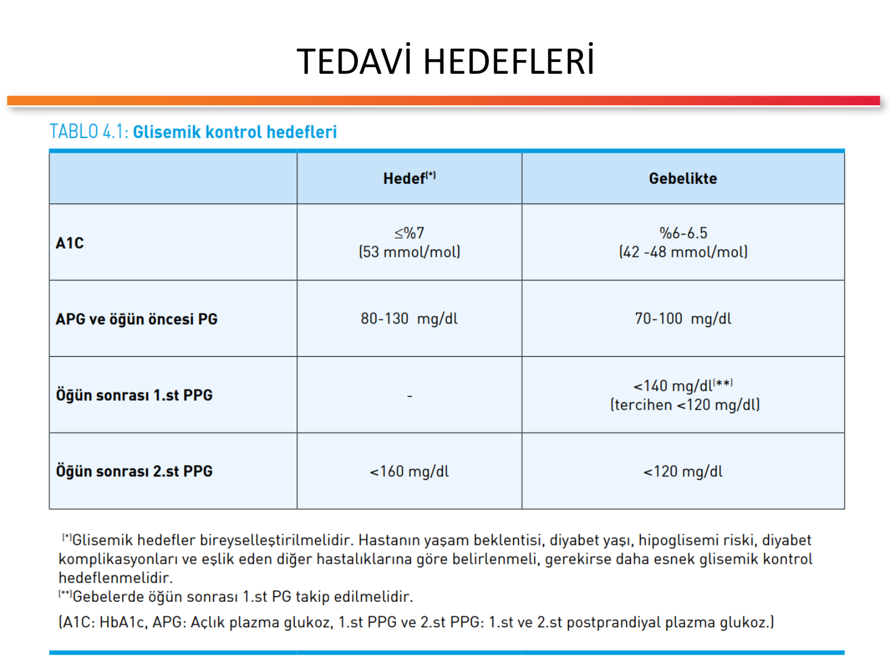

| Parametre                  | **Genel Hedef**    | **Gebelikte**              |
| -------------------------- | ------------------ | -------------------------- |
| **HbA1c**                  | ≤ %7 (53 mmol/mol) | %6 – 6.5 (42-48 mmol/mol)  |
| **APG ve öğün öncesi PG**  | 80 – 130 mg/dl     | 70 – 100 mg/dl             |
| **Öğün sonrası 1. st PPG** | —                  | <140 mg/dl (tercihen <120) |
| **Öğün sonrası 2. st PPG** | <160 mg/dl         | <120 mg/dl                 |

**⚠️ ÖNEMLİ:**

* Glisemik hedefler **bireyselleştirilir**. Hasta yaşı, yaşam beklentisi, diyabet süresi, hipoglisemi riski, komplikasyonları ve komorbiditelerine göre belirlenir.
* Gerekirse daha **esnek** hedefler seçilebilir.
* Gebelerde **1. saat PPG** takibi esastır.

> *Kısaltmalar: APG: Açlık plazma glukoz, PPG: Postprandiyal plazma glukoz.*

---

## ANTİDİYABETİK İLAÇLAR — GENEL ÇERÇEVE

### İlaç Sınıfları ve DeFronzo "Ominous Octet"

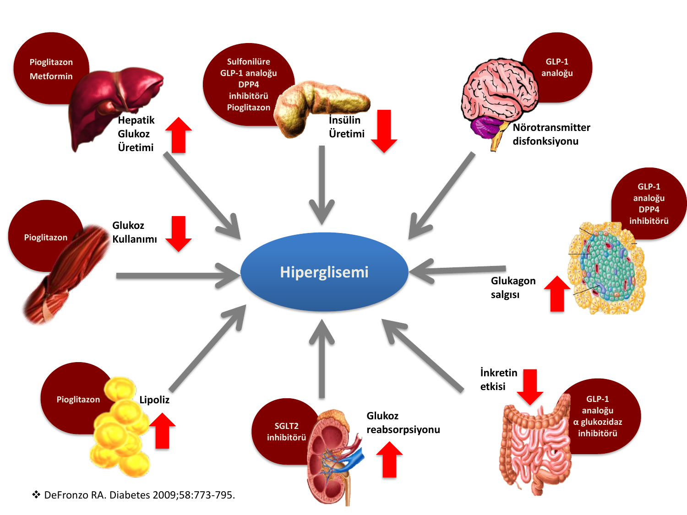

Tip 2 DM patogenezindeki 8 bozuklukla, hangi ilaçların ne üzerine etki ettiği:

| Patogenetik Bozukluk          | Etkili İlaç Grubu                                    |
| ----------------------------- | ---------------------------------------------------- |
| ↑ Hepatik glukoz üretimi      | **Metformin, Pioglitazon**                           |
| ↓ İnsülin sekresyonu          | **Sülfonilüre, Glinid, GLP-1A, DPP-4i, Pioglitazon** |
| Nörotransmitter disfonksiyonu | **GLP-1 analoğu**                                    |
| ↓ Glukoz kullanımı (kas)      | **Pioglitazon**                                      |
| ↑ Glukagon salgısı            | **GLP-1A, DPP-4i**                                   |
| ↑ Lipoliz                     | **Pioglitazon**                                      |
| ↓ İnkretin etkisi             | **GLP-1A, DPP-4i**                                   |
| ↑ Renal glukoz reabsorpsiyonu | **SGLT2 inhibitörü**                                 |

Sadece metformin kaldı; diğerleri kullanılmıyor.

**Pratik sınıflama:**

**Oral antidiyabetikler (OAD):**
* Metformin (biguanid)
* Pioglitazon (tiazolidindion)
* Sülfonilüreler
* Glinidler
* Akarboz (α-glukozidaz inhibitörü)
* SGLT-2 inhibitörleri
* DPP-4 inhibitörleri

**Enjektabl tedaviler:**
* GLP-1 analogları
* İnsülin

---

## BİGUANİDLER — METFORMİN

**Dozaj:** 500 – 2550 mg/gün (standart: 2000 mg), yarı ömür 1.5-4 saat, etki süresi 4-12 saat.

> **📌 Not:** Fenformin tüm dünyada kullanımdan kaldırılmıştır (**laktik asidoz** riski).

### Etki Mekanizması

* **AMPK** (5'-adenozin monofosfat-aktive protein kinaz) aktivasyonu ve kısmen **mitokondriyal gliserofosfat dehidrogenaz (mGDP)** enzim inhibisyonu.
* **Karaciğerde glukoneogenezi inhibe eder** (ana etki).
* Mitokondriyal solunum zinciri kompleks I'in geçici inhibisyonu ile kolesterol biyosentezini baskılar.
* Kas glukoz alımı ve yağ asidi oksidasyonunu artırır (tartışmalı).
* **Barsaktan glukoz absorpsiyonunu** azaltır, iştahı kısmen baskılar.
* **Mikrobiyota** üzerine olumlu etkileri vardır.

> **💡 Öğrenci hatırlatması:** Metformin = **"karaciğer glukoneogenezini kes"**. Pankreastan insülin salgılatmaz → **hipoglisemi yapmaz**.

### Avantajları

* **Hipoglisemi riski düşük** ✓
* **Kilo üzerine nötr** ya da hafif **kilo kaybı** ✓
* **Kardiyovasküler olay riskini azaltır** (UKPDS 34: Mİ %39, diyabet ilişkili ölüm %42)

### Yan Etkiler

* **Gastrointestinal** (en sık): Bulantı, kusma, gaz, şişkinlik, abdominal kramp, diyare, ağızda metalik tat
* **Vitamin B₁₂ eksikliği** (uzun dönem kullanımda — B12 düzeyini periyodik izle)
* **Laktik asidoz** (çok nadir: <10/100.000 hasta-yılı)

### Kontrendikasyonlar

* **Karaciğer yetersizliği**
* Laktik asidoz öyküsü
* **Ağır hipoksi, dehidratasyon**
* **Kronik alkolizm**
* KV kollaps, akut miyokard infarktüsü
* **Ketonemi / ketonüri**
* Sınıf IV konjestif kalp yetersizliği
* KOAH, periferik damar hastalığı
* **Major cerrahi girişim** (perioperatif geçici kesim)
* **Renal fonksiyon bozukluğu:**
    * **GFR < 30 ml/dk:** **Kontrendike**
    * **GFR 30-45 ml/dk:** Yeni başlama → **kontrendike**; kullanmakta olan hastada **yarı doza** düşür
* **Gebelik ve laktasyon:** Plasentayı geçer; emzirme döneminde alımdan sonra 3-4 saat emzirme yapılmaması önerilir.
* **İleri yaş** (bazı otörlere göre >80)

> **⚠️ Klinik ipucu:** İV kontrast madde verilmeden **önce** ve **sonraki 48 saat** metformin kesilir (kontrast nefropatisi + laktik asidoz riski).

---

## TİAZOLİDİNDİONLAR — PİOGLİTAZON

**Dozaj:** 15-45 mg/gün (standart 30 mg). Yarı ömür 16-24 saat, etki süresi 15-45 saat.

> **📌 Not:** **Roziglitazon** ülkemizde kullanımdan kaldırılmıştır (KV olay riskinde artış).

### Etki Mekanizması

* Hücresel düzeyde nükleer transkripsiyon faktörü **PPAR-γ** (Peroxisome Proliferator-Activated Receptor-gamma) aktivasyonu.
* **Periferik dokularda (kas, karaciğer, yağ)** insülin direncini **azaltır**, duyarlılığı artırır.
* Yağ dokusunda **adiposit diferansiyasyonunu** artırır → küçük, insüline duyarlı adipositler oluşur.
* Hepatik glukoz üretimini bir miktar azaltır.
* Plazma serbest yağ asit ve lipotoksisiteyi azaltır → β-hücre fonksiyonunda geri kazanım.

### Avantajları

* **Hipoglisemi yapmaz** ✓
* **HDL-kolesterolü yükseltir**, **trigliseridi düşürür** ✓
* **Sekonder KV olay ve inme riskini azaltır** (PROactive çalışması — %16 risk azalması)

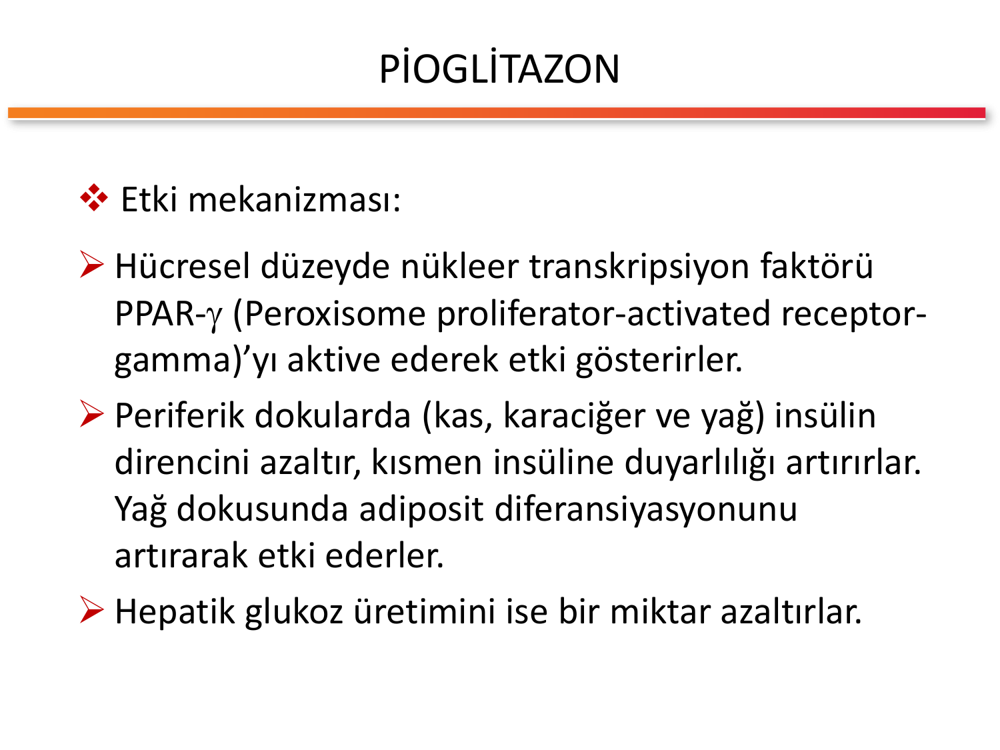

### Vücut Yağ Dağılımı Üzerine Etkisi

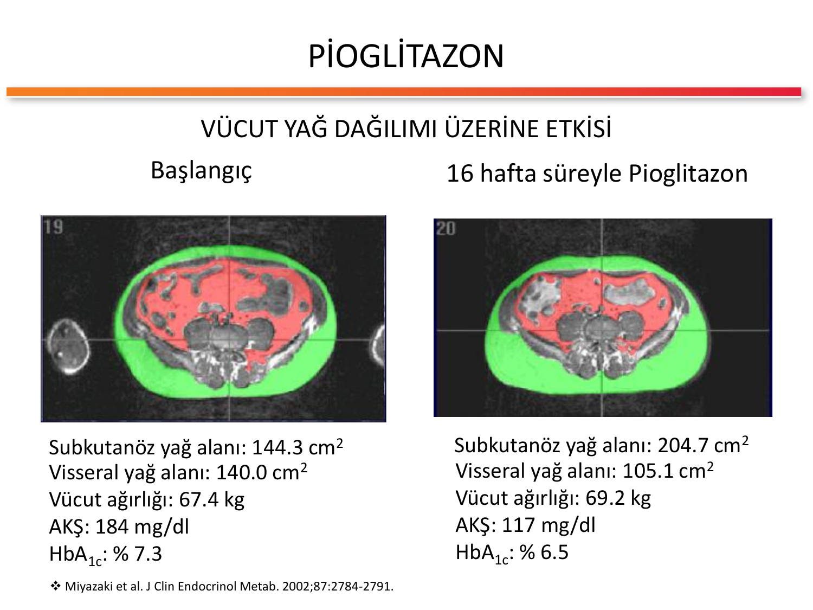

Pioglitazon, **visseral yağı azaltırken subkutanöz yağı artırır**. Bu sağlıklı yağ dağılımı paradoksu sayesinde:

* HbA1c düşer
* AKS düşer
* İnsülin duyarlılığı artar (ancak **total kilo bir miktar artabilir**).

### Yan Etkiler

* **Ödem** (sıvı retansiyonu)
* **Anemi** (dilüsyonel)
* **Konjestif kalp yetersizliği** (özellikle insülinle kombinasyonda)
* **Kilo alımı** (sağlıklı adipoz dağılımı ancak kilo artışı)
* Transaminazlarda yükselme
* **Graves oftalmopatisini alevlendirebilir**
* **Postmenopozal kadın** ve **ileri yaş erkek**lerde **kırık riskinde artış**
* **Mesane kanseri:** Gözlemsel çalışmalarda minimal artış bildirilmiştir; aktif mesane kanserinde **kullanılmaz**.

### Kontrendikasyonlar

* **ALT > 2.5× ULN**
* **NYHA sınıf I-IV kalp yetersizliği**
* **Kronik ileri böbrek yetersizliği:** Kontrendike değil ama ödem riski nedeniyle tercih edilmez
* **Gebelik**
* **Maküla ödemi** riski
* **Postmenopozal kadınlar, kırık riski yüksek hastalar**
* **Mesane kanseri**
* **Tip 1 diyabet**
* **Çocuklar ve adölesanlar**

---

## SÜLFONİLÜRELER

| Etken Madde   | Doz (mg/gün) | Yarı Ömür | Etki Süresi |
| ------------- | ------------ | --------- | ----------- |
| Glibenklamid  | 2.5-10       | 5-10 sa   | 16-24 sa    |
| Gliklazid     | 80-240       | 6-12 sa   | 16-24 sa    |
| Glimepirid    | 1-8          | 9 sa      | 16-24 sa    |
| Glipizid      | 2.5-10       | 2-4 sa    | 15-24 sa    |
| Glikuidon     | 15-120       | 12 sa     | 24 sa       |
| Gliklazid MR  | 30-120       | 6-12 sa   | 16-24 sa    |
| Glipizid GITS | 5-10         | 2-4 sa    | 15-24 sa    |

### Etki Mekanizması

Pankreas **β-hücresinde K_ATP kanallarını** (SUR1/Kir6.2 kompleksi) bloke ederek **depolarizasyon → Ca²⁺ girişi → insülin salgısı** şeklinde **glukozdan bağımsız** insülin sekresyonu sağlar.

> **💡 Öğrenci için:** "Sülfonilüre pankreası **zorlar**." Bu yüzden **hipoglisemi yapar** ve **kilo aldırır**. β-hücre rezervi olan (yeni tanı) tip 2 DM'de etkilidir.

### Yan Etkiler

* **Hipoglisemi** (en önemli — özellikle uzun etkili gliburid/glibenklamid)
* **Kilo alımı**
* Alerjik reaksiyonlar, deri döküntüleri
* Hepatotoksisite
* Hematolojik toksisite (agranülositoz, kemik iliği aplazisi)
* **Alkol flushing** (özellikle eski klorpropamid)

### Kontrendikasyonlar

* **Tip 1 diyabet** (pankreas β-hücresi yok!)
* Sekonder diyabet (pankreas hastalıkları)
* **Hiperglisemik acil durumlar (DKA, HHD)**
* **Gebelik**
* Travma, stres, cerrahi müdahale
* Ağır enfeksiyon
* SU grubu ilaçlara alerji
* Ağır hipoglisemiye yatkınlık
* Dekompanse karaciğer ve son dönem böbrek yetersizliği

---

## GLİNİDLER

| Etken Madde    | Doz        | Yarı Ömür | Etki Süresi |
| -------------- | ---------- | --------- | ----------- |
| **Repaglinid** | 1.5-6 mg   | 1-1.2 sa  | 3-4 sa      |
| **Nateglinid** | 180-360 mg | 1-1.5 sa  | 3-4 sa      |

### Özellikler

* Etki mekanizması **sülfonilürelerle aynıdır**, ancak K_ATP kanallarını **daha kısa süreli** kapatırlar.
* Etkileri **hızlı başlar, kısa sürer**.
* **Postprandiyal (tokluk) kan şekerini** düşürmekte daha etkilidir, AKS üzerine etkileri zayıftır.
* **Her ana öğünden önce** alınır (atla öğünü → atla dozu).
* **Hipoglisemi** sülfonilürelere göre **daha az** görülür.
* Kilo alımı daha azdır.
* **Repaglinid son dönem böbrek yetersizliğinde kullanılabilir** (önemli klinik avantaj).

---

## α-GLUKOZİDAZ İNHİBİTÖRLERİ — AKARBOZ

| İlaç     | Günlük Doz |
| -------- | ---------- |
| Akarboz  | 150-300 mg |
| Miglitol | 150-300 mg |

### Etki Mekanizması

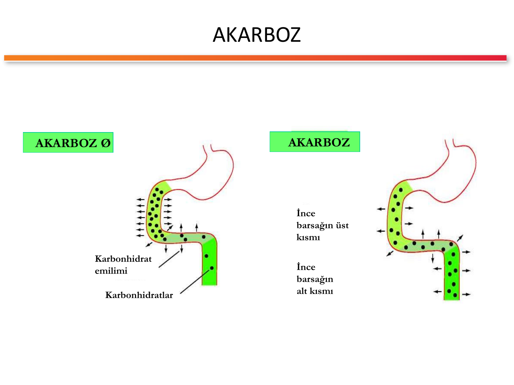

* **İntestinal α-glukozidazı kompetitif inhibe eder**, polisakkaridlerin enzimatik sindirimini yavaşlatır ve **karbonhidrat absorpsiyonunu geciktirir**.
* Glukoz, ince barsağın **üst kısmından alt kısmına** doğru absorpsiyon şiftlenir → postprandiyal glukoz pik değeri düşer.

### Avantajları

* **Tokluk kan glukozunu düşürür** ✓
* **Hipoglisemi riski düşük** ✓
* **Kilo nötr** ✓
* **Sistemik etkiler yok** ✓

### Dezavantajları

* **Orta etkinlikte** (HbA1c düşüşü sınırlı)
* **GİS yan etkileri** → hasta uyumu düşük

### Yan Etkiler

* **Gaz, şişkinlik, hazımsızlık, bulantı, diyare** (sindirilmeyen karbonhidratların kolonda fermentasyonu)
* Karaciğer enzimlerinde reversibl artış
* Nadiren demir eksikliği anemisi

### Kontrendikasyonlar

* **İnflamatuvar barsak hastalığı**
* Otonom nöropati
* Malabsorpsiyon
* Parsiyel barsak obstrüksiyonu
* Karaciğer yetersizliği, böbrek yetersizliği
* Gebelik, laktasyon

> **⚠️ Klinik ipucu:** Akarboz alan hastada **hipoglisemi geliştiğinde** → **glukoz verilmelidir, sükroz (çay şekeri) işe yaramaz** (disakkarit sindirimi inhibedir).

---

## SGLT2 İNHİBİTÖRLERİ (GLİFLOZİNLER)

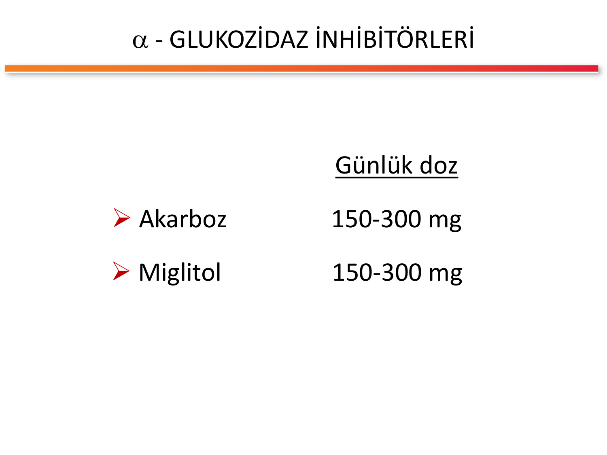

| Jenerik           | Günlük Doz | Alınma Zamanı                          |
| ----------------- | ---------- | -------------------------------------- |
| **Kanagliflozin** | 100-300 mg | Günde 1 kez, tercihen kahvaltıdan önce |
| **Dapagliflozin** | 5-10 mg    | Günde 1 kez, yemekten bağımsız         |
| **Empagliflozin** | 10-25 mg   | Günde 1 kez, yemekten bağımsız         |

### Fizyoloji — SGLT2 vs SGLT1

| Özellik             | **SGLT2**                       | **SGLT1**                       |
| ------------------- | ------------------------------- | ------------------------------- |
| Lokasyon            | Proksimal tübül **S1 segmenti** | Proksimal tübül **S3 segmenti** |
| Glukoz geri emilimi | **~%90**                        | **~%10**                        |
| Afinite             | Düşük                           | Yüksek                          |
| Kapasite            | **Yüksek**                      | Düşük                           |

### Etki Mekanizması
  
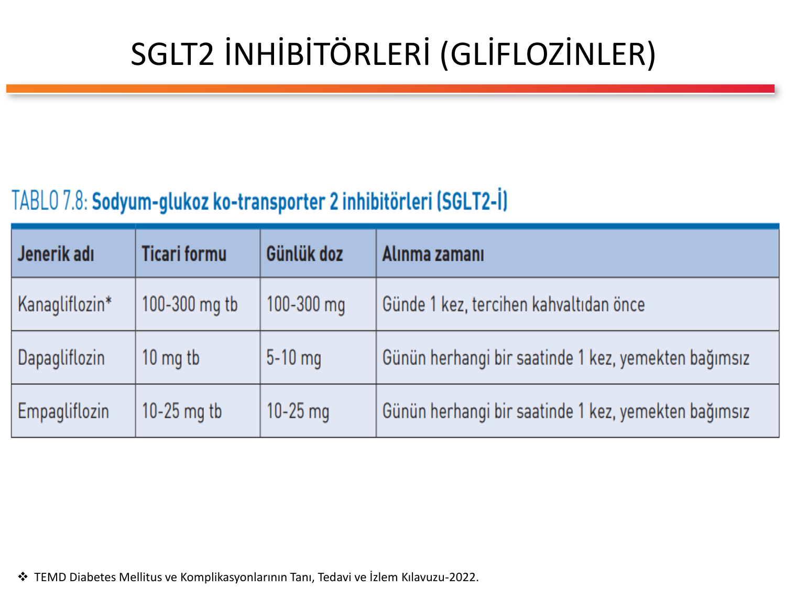

* Normal renal glukoz yönetiminde glukozun **%90'ı SGLT2** tarafından geri emilir.
* Tip 2 DM'de atılım eşiği **patolojik olarak artar**, bu da hiperglisemiyi besler.
* SGLT2 inhibitörleri SGLT2'yi bloke ederek **insülinden bağımsız** olarak idrardaki fazla glukozu uzaklaştırır.
* Günde **~80 gr** (≈240 kcal) glukoz idrarla atılır → kilo kaybı, hafif diürez.

### Avantajları

* **Kilo kaybı** ✓
* **Kan basıncında düşme** ✓
* **KV olay azalması** (özellikle kalp yetersizliği) ✓
* **KBH progresyonunu yavaşlatır** ✓
* Hipoglisemi riski düşük

### Yan Etkiler

* **Poliüri, sıvı kaybı, hipotansiyon, baş dönmesi**
* **Genitoüriner enfeksiyonlar** (özellikle kadınlarda genital kandidiyaz)
* Riskli vakalarda **ürosepsis ve piyelonefrit** açısından dikkat
* LDL ve serum kreatininde başlangıçta geçici artış
* **Kanagliflozin** → kırık ve alt ekstremite **amputasyon** vakaları
* Nadiren **Fournier gangreni**
* **⚠️ Öglisemik DKA:** Sıvı kaybı ile atipik (öglisemik ya da hafif hiperglisemik) DKA gelişebilir.

> **⚠️ ÖNEMLİ:** İnsülin kullanan hastada SGLT2-i eklendiğinde, kan glukozu normal bile olsa **insülin tamamen kesilmemeli** ve kuşkulu ketoasidozda araştırma yapılmalıdır.

* **Loop diüretiği** alanlarda ve **yaşlı hastalarda** dehidratasyona dikkat.
* **Major cerrahi** (3-4 gün önce kesim), ciddi hastalık veya enfeksiyon durumunda ilaç kesilmelidir.

### Kontrendikasyonlar

* **Son dönem böbrek yetmezliği**
* **Tip 1 diyabet**
* **Gebelik ve laktasyon**

---

## İNKRETİN TEMELLİ TEDAVİLER

### İnkretin Etkisi Nedir?

**İnkretinler**, besin alımından sonra ince barsaklardan salgılanan **insülin sekresyonunu uyaran GI hormonlardır:**

* **GLP-1** (Glucagon-Like Peptide-1) — ileum ve kolon **L-hücreleri**
* **GIP** (Glucose-dependent Insulinotropic Polypeptide) — duodenum **K-hücreleri**

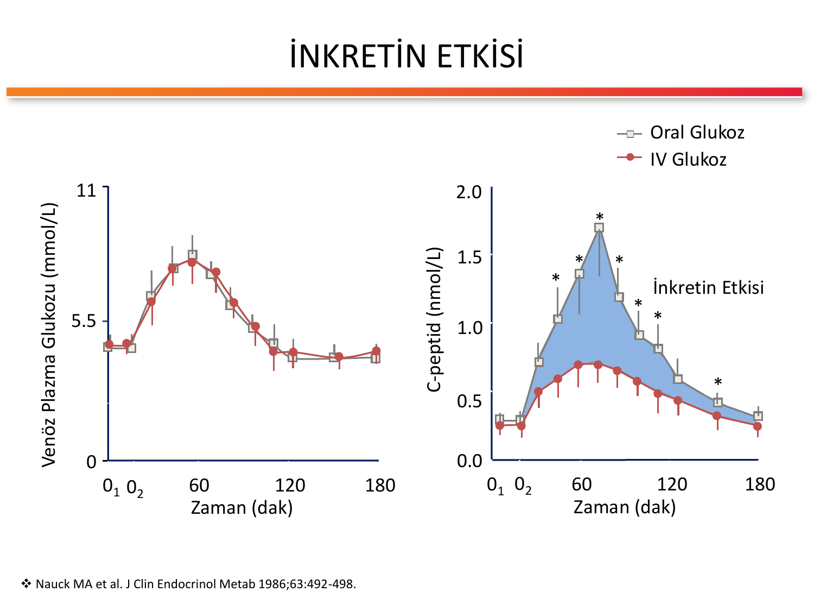

**İnkretin etkisi:** Aynı glukoz yükünün **oral alımı**, **IV alımından çok daha yüksek** C-peptid / insülin yanıtı oluşturur. Bu fark, incretinlerin sağladığı ek uyarıdır.

* Postprandiyal insülin salgısının **%70'inden** sorumludurlar.
* **Yalnızca yükselmiş glukoz düzeylerinde** insülini uyarırlar → bu yüzden **hipoglisemi yapmazlar** (glukoza bağımlı insülin salgısı).
* Tip 2 DM'de **GLP-1 sekresyonu azalmış, GIP aktivitesi bozulmuştur**. İnkretin etkisi **%30'lara** gerilemiştir.

### GLP-1 vs GIP Farkları

| Etki                        | **GLP-1**     | **GIP** |
| --------------------------- | ------------- | ------- |
| İnsülin salgısını uyarır    | ✓             | ✓       |
| Gastrik boşalmayı baskılar  | **✓ (güçlü)** | Minimal |
| Gıda alımını/kiloyu azaltır | **✓**         | Etkisiz |
| Glukagon salgısını baskılar | **✓**         | Etkisiz |

### GLP-1'in Etkileri

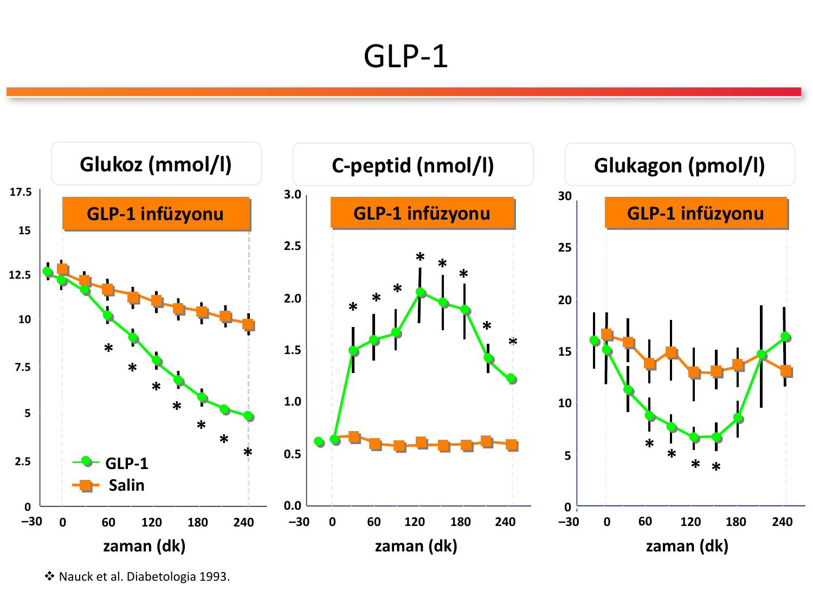

GLP-1 infüzyonu:
* ↓ Glukoz
* ↑ C-peptid (insülin salgısı)
* ↓ Glukagon

### İnkretin Temelli İlaç Grupları

**GLP-1'in insan plazmasındaki yarı ömrü ~2 dakikadır**, çünkü **DPP-4** enzimi hızla parçalar. Bu nedenle iki stratejide ilaçlar geliştirilmiştir:

1. **DPP-4 inhibitörleri** → endojen GLP-1 ve GIP'in yıkımını yavaşlatır
2. **GLP-1 analogları** → DPP-4'e dirençli, uzun etkili GLP-1 reseptör agonistleri

---

## DPP-4 İNHİBİTÖRLERİ

| Jenerik          | Günlük Doz | Alım                                     |
| ---------------- | ---------- | ---------------------------------------- |
| **Sitagliptin**  | 100 mg     | Günde 1 kez                              |
| **Vildagliptin** | 50-100 mg  | Günde 1-2 kez                            |
| **Saksagliptin** | 5 mg       | Günde 1 kez                              |
| **Linagliptin**  | 5 mg       | Günde 1 kez (**SDBY'de kullanılabilir**) |
| **Alogliptin**   | 25 mg      | Günde 1 kez                              |

### Etki Mekanizması

GLP-1 ve GIP'i parçalayan **DPP-4** enzimini inhibe eder → aktif GLP-1/GIP düzeyleri **2-3 kat** artar → **glukoza bağımlı** insülin sekresyonu artar, glukagon baskılanır.

### Avantajları

* **Kilo üzerine nötral** ✓
* **Hipoglisemi riski düşük** ✓
* Oral kullanım ✓
* İyi tolere edilir

### Yan Etkiler

* ÜSYE benzeri yakınmalar, burun tıkanıklığı, boğaz ağrısı
* **Eklem ağrıları**
* Başağrısı
* **Saksagliptin** → kalp yetersizliği nedenli hastane yatışı riskinde artış
* Nadiren **pankreatit, büllöz pemfigoid**, kutanöz vaskülit, interstisyel akciğer hastalığı
* **Şiddetli karın ağrısı + amilaz/lipaz yükselmesi** → akut pankreatit düşün, ilacı kes.

### Kontrendikasyonlar

* Karaciğer yetersizliği
* **Ağır böbrek yetersizliği** (istisna: **linagliptin** SDBY'de kullanılabilir)
* **Gebelik ve laktasyon**
* **Kalp yetersizliği** (özellikle saksagliptin, alogliptin)
* Pankreatit öyküsü

---

## GLP-1 ANALOGLARI

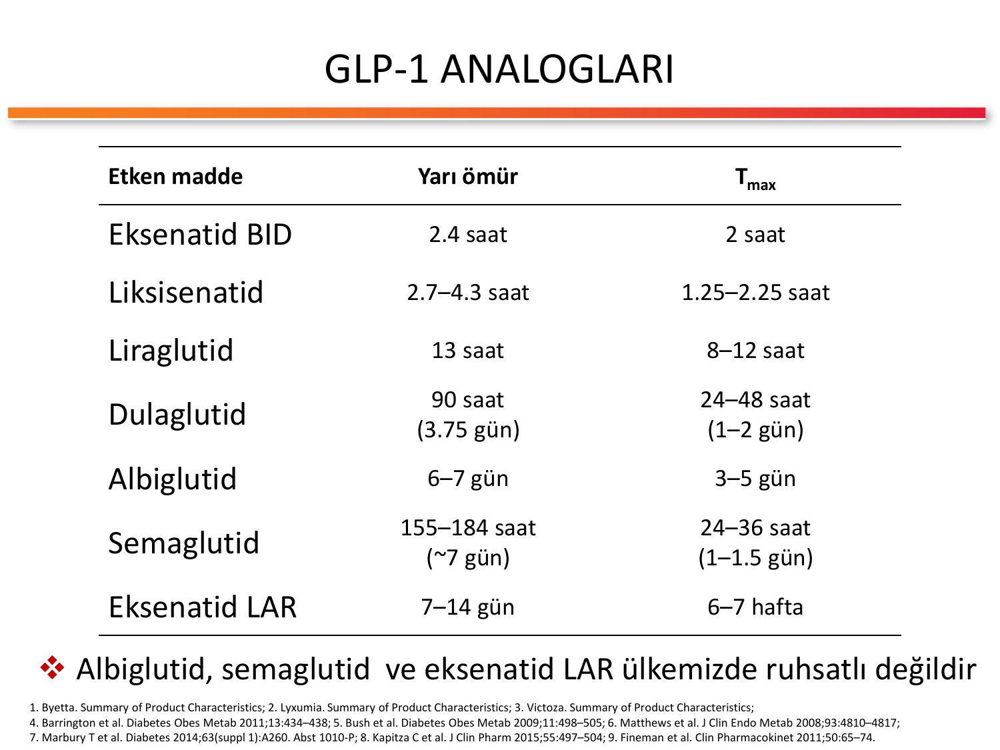

| Etken Madde       | Yarı Ömür           | Tmax         |
| ----------------- | ------------------- | ------------ |
| **Eksenatid BID** | 2.4 sa              | 2 sa         |
| **Liksisenatid**  | 2.7-4.3 sa          | 1.25-2.25 sa |
| **Liraglutid**    | 13 sa               | 8-12 sa      |
| **Dulaglutid**    | 90 sa (3.75 gün)    | 24-48 sa     |
| **Semaglutid**    | 155-184 sa (~7 gün) | 24-36 sa     |
| **Albiglutid**    | 6-7 gün             | 3-5 gün      |
| **Eksenatid LAR** | 7-14 gün            | 6-7 hafta    |

> Albiglutid, semaglutid ve eksenatid LAR ülkemizde ruhsatlı değildir.

### Eksenatid — İlginç Kaynak: Gila Monster

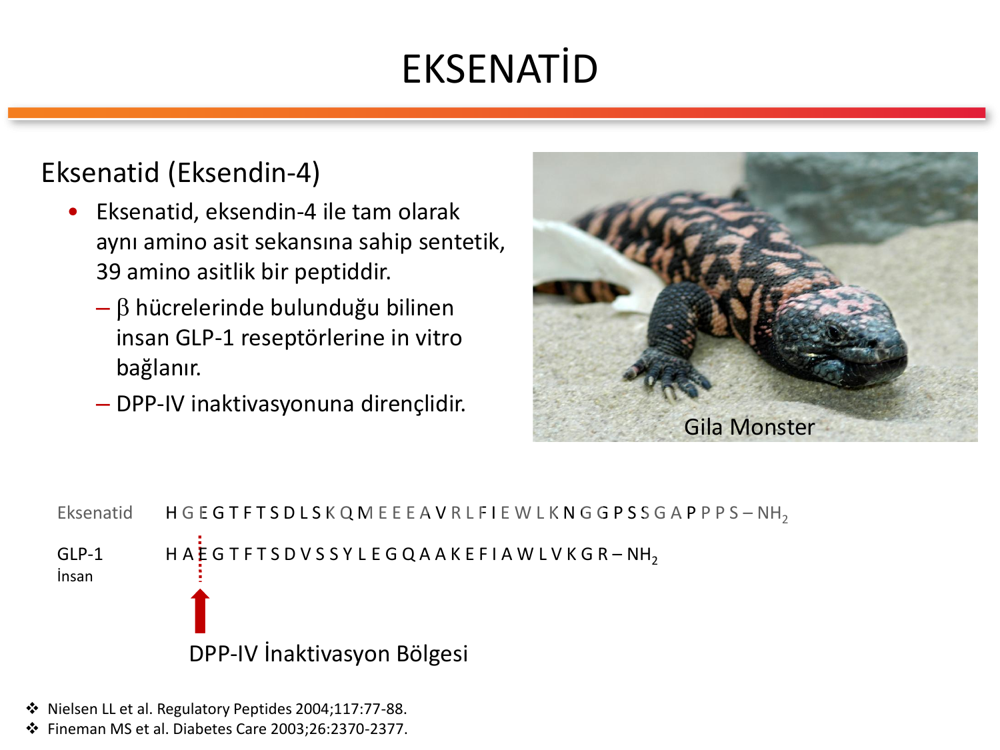

* **Eksenatid**, **Gila canavarı** (Heloderma suspectum) tükürüğünde bulunan **eksendin-4** peptidinin sentetik analoğudur.
* 39 amino asit; insan GLP-1'e **%53 benzerlik**.
* **DPP-IV inaktivasyonuna dirençli** → uzun etki.

### Genel Özellikler

* **Enjeksiyon (SC)** yoluyla kullanılır.
* **En önemli avantaj:** **Kilo kaybı sağlar** (5-15 kg).
* Sistolik kan basıncını düşürür.
* **Hipoglisemi riski düşük** (glukoza bağımlı insülin salgısı).
* KV olay ve böbrek sonuçlarını iyileştirir (özellikle liraglutid, semaglutid, dulaglutid).

### Yan Etkiler

* **Bulantı, kusma** (en sık; zamanla azalır)
* **Diyare**, konstipasyon, karın ağrısı
* Kalp hızında minimal artış
* **Pankreatit, safra taşı** (liraglutid ile akut komplikasyonlu safra taşı bildirilmiş)
* **C-hücre hiperplazisi / medüller tiroid kanseri** (kemirgen çalışmalarında; insanda ek izlem önerilir)

### Kontrendikasyonlar

* Pankreatit öyküsü
* Ciddi GI hastalık (gastroparezi, kolelityaz, reflü)
* **Medüller tiroid kanseri** veya **MEN tip 2** aile / kişisel öyküsü
* Ailede pankreas kanseri
* **Gebelik, laktasyon**

---

## İNSÜLİN TEDAVİSİ

**1922:** İlk insülin tedavisi **Leonard Thompson**'a uygulandı.
**1923 Nobel Tıp Ödülü:** Frederick Banting, Charles Best, John Macleod, James Collip.

### Tip 1 vs Tip 2 DM'de İnsülin Yaklaşımı

|                         | **Tip 1 DM**                 | **Tip 2 DM**                                                |
| ----------------------- | ---------------------------- | ----------------------------------------------------------- |
| **İnsülin gereksinimi** | **Yaşam boyu, zorunlu**      | Progresif β-hücre yetmezliği geliştikçe                     |
| **Rejim**               | **Bazal-bolus** (veya pompa) | Bazal ile başla → gerekirse karışım → gerekirse bazal-bolus |
| **Başlangıç dozu**      | ~0.5 IU/kg/gün               | 0.1-0.2 IU/kg/gün (bazal)                                   |
| **C-peptid rezervi**    | Yok / düşük                  | Korunmuş (başlangıçta)                                      |
| **OAD kombinasyonu**    | Genellikle tek başına        | Metformin vs. diğer OAD ile kombinasyon                     |

### İnsülin Tipleri — Elde Ediliş Yöntemine Göre

* Domuz kaynaklı (tarihsel)
* Sığır kaynaklı (tarihsel)
* **İnsan kaynaklı:**
    * Biyosentetik (rDNA tekniği — bugünkü standart)
    * Semisentetik (alanin → treonin dönüşümü)

### İnsülin Tipleri — Etki Süresine Göre

| Tip                       | Örnek                                      | Etki Başlama | Pik        | Süre       |
| ------------------------- | ------------------------------------------ | ------------ | ---------- | ---------- |
| **Kısa etkili (regüler)** | Kristalize                                 | 30-60 dk     | 2-4 sa     | 5-8 sa     |
| **Orta etkili**           | NPH                                        | 1-2 sa       | 4-10 sa    | >14 sa     |
| **Karışım**               | NPH + Regüler (50/50, 70/30, 80/20, 90/10) | —            | —          | —          |
| **Kısa etkili analog**    | Lispro, Aspart, Glulisin                   | <15 dk       | 30-90 dk   | 3-5 sa     |
| **Uzun etkili analog**    | Detemir                                    | 3-4 sa       | 6-8 sa     | 20-24 sa   |
| **Uzun etkili analog**    | **Glarjin**                                | 90 dk        | **piksiz** | 24 sa      |
| **Ultra-uzun etkili**     | **Glarjin U-300**                          | 90 dk        | piksiz     | **26 sa**  |
| **Ultra-uzun etkili**     | **Degludec**                               | 30-60 dk     | piksiz     | **>30 sa** |

### Karışım (Bifazik) İnsülinler

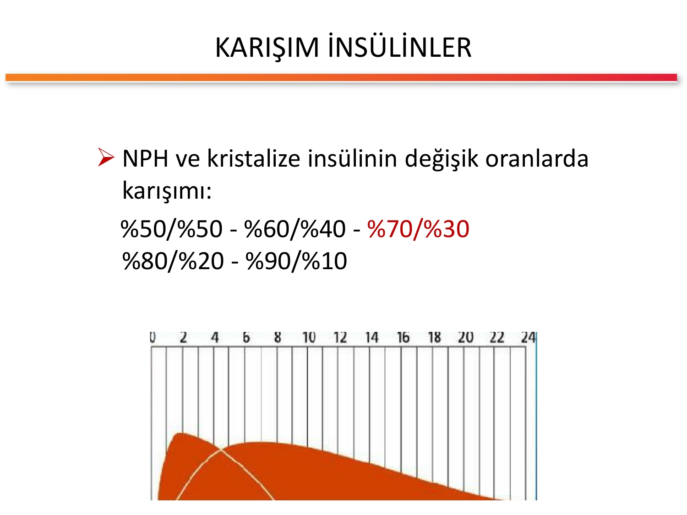

NPH ve kristalize insülin **değişik oranlarda** (50/50, 60/40, **70/30** [en sık], 80/20, 90/10) karıştırılır.

### Kısa Etkili İnsülin Analogları — Avantajları

* **Fizyolojik insülin profiline benzer etki**
* **Daha iyi postprandiyal kontrol**
* **Hipoglisemi riskinde azalma**
* **Hemen öğün öncesinde** uygulanabilir (regüler insülin gibi 30 dk beklemek gerekmez)

### Uzun Etkili İnsülin Analogları

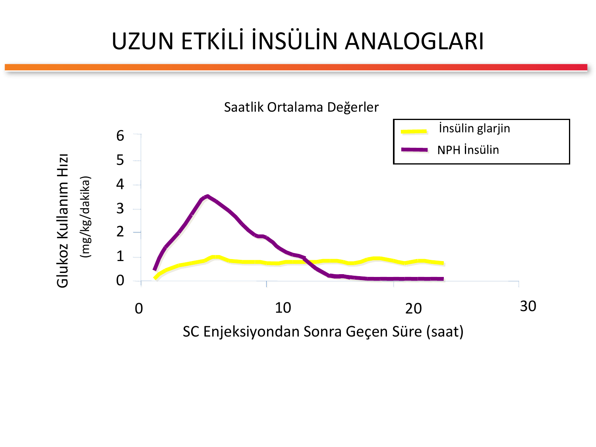

* **Detemir:** B29 pozisyonunda alifatik yağ asidi; albümine geri dönüşlü bağlanır → yavaş salınır.
* **Glarjin:** Arjinil modifikasyonları ile izoelektrik nokta değişir; subkutan dokuda çöker → uzamış etki.
* **Avantajlar:** Fizyolojik bazal profil, 24 saatlik etki, daha az noktürnal hipoglisemi.

### İnsülin Glarjin U-300

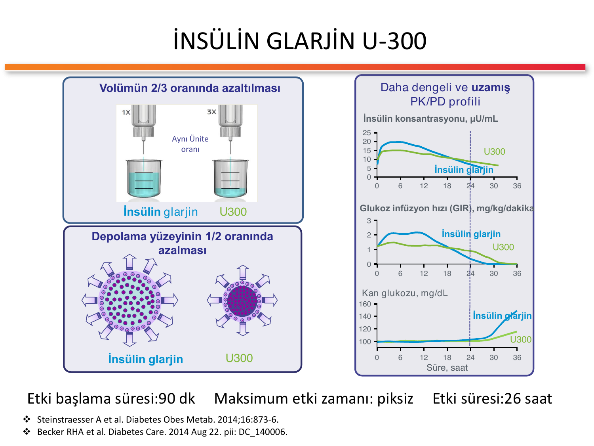

* Hacim **2/3 oranında azaltılmış** (100 U/ml → 300 U/ml) → depolama yüzeyi yarıya düşer → daha yavaş salınım.
* **Etki süresi: 26 saat, piksiz.**
* U-100 glarjine göre **hipoglisemi oranı ~%21 daha düşük**.

### İnsülin Degludec

* B30'daki treonin çıkarılmış; B29 lizine glutamik asit aracılığı ile yağ asidi bağlanmış.
* **Etki süresi >30 saat, piksiz**, çok stabil PK/PD profili.
* Hipoglisemi riski glarjinden daha düşük.
* **Ryzodeg:** Degludec + Aspart kombinasyonu (bazal + prandiyal tek enjeksiyon).

---

## İNSÜLİN UYGULAMA REJİMLERİ

### Uygulama Bölgeleri

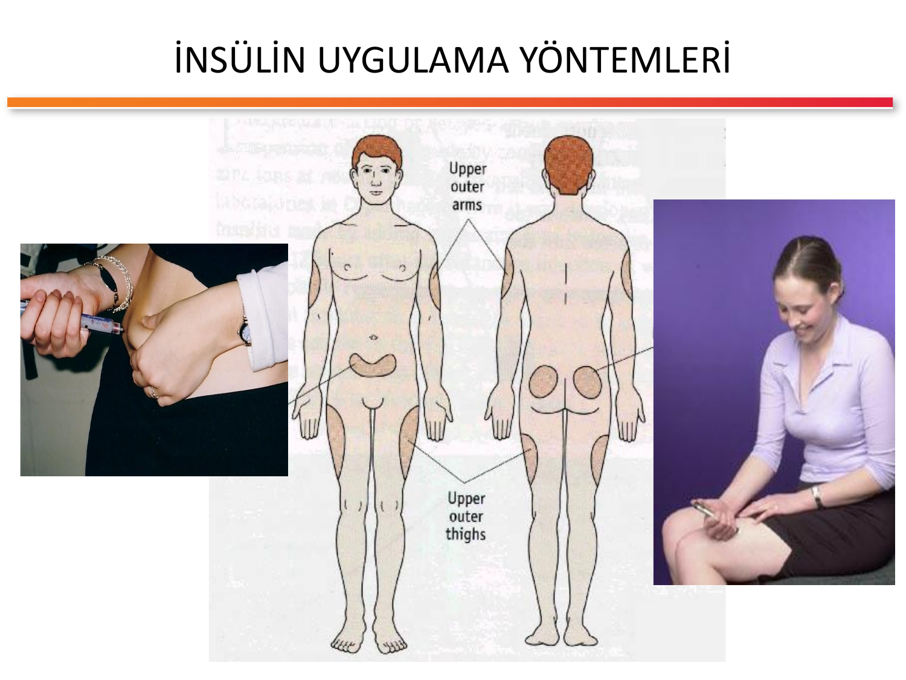

* **Abdomen:** En hızlı emilim (postprandiyal için tercih)
* **Uyluk, gluteal:** Daha yavaş
* **Kol üst dış yüz:** Orta
* **Rotasyon:** Lipohipertrofi önlemek için enjeksiyon bölgeleri dönüşümlü kullanılmalıdır.

### 1. Bazal İnsülin Tedavisi

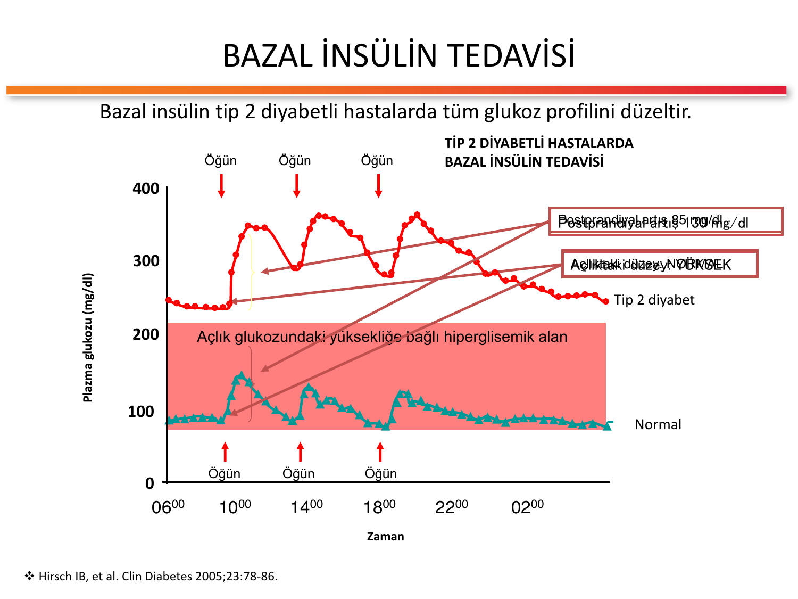

* **Strateji:** OAD'ye ek **günde 1 kez bazal insülin** (genellikle gece).
* Öncelikle **açlık kan şekerini** düzeltir, sonra postprandiyal değerler dolaylı olarak iyileşir.
* **İlk insülin basamağı** için tip 2 DM'de en pratik başlangıç rejimi.

### 2. Bifazik (Karışım) İnsülin Tedavisi

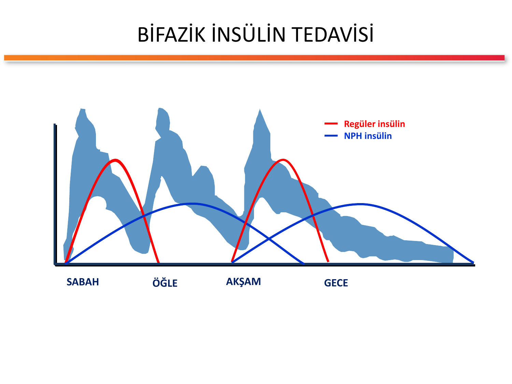

* Sabah ve akşam **karışım insülin** (ör. 70/30).
* Enjeksiyon sayısı az (2 doz/gün) → hasta uyumu yüksek.
* Öğün esnekliği düşüktür (hasta düzenli yemek yemelidir).

### 3. Yoğun (Bazal-Bolus) İnsülin Tedavisi

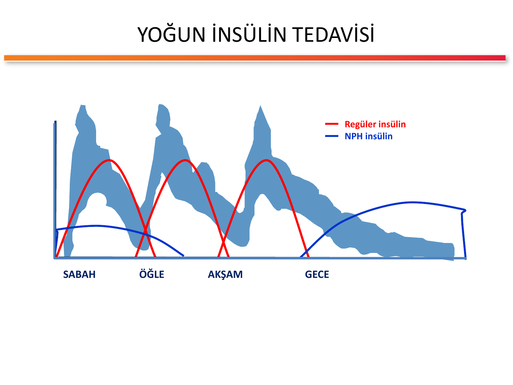

* **Öğünler öncesi kısa etkili insülin** (regüler ya da analog) × 3
* **Gece uzun etkili bazal** insülin × 1
* **Tip 1 DM için standart tedavi.**
* Tip 2 DM'de ileri evrede gerekli olabilir.
* **En esnek ve en fizyolojik** rejim.

### 4. Sürekli Cilt Altı İnsülin İnfüzyonu (CSII — İnsülin Pompası)

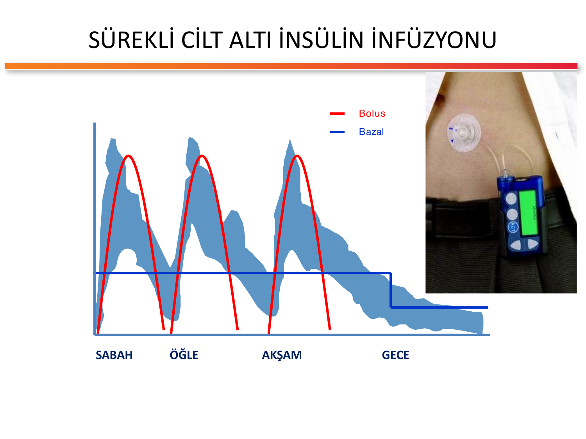

* Pompa, devamlı **bazal infüzyon** sağlar; öğünlerde hasta **bolus** verir.
* Sensör (CGM) entegrasyonu ile **kapalı/yarı-kapalı** döngü sistemleri mevcuttur.
* Özellikle **tip 1 DM**, kırılgan diyabet, sık hipoglisemi, gebelik planlayan hastalar için tercih edilir.

### Karbonhidrat Sayımı

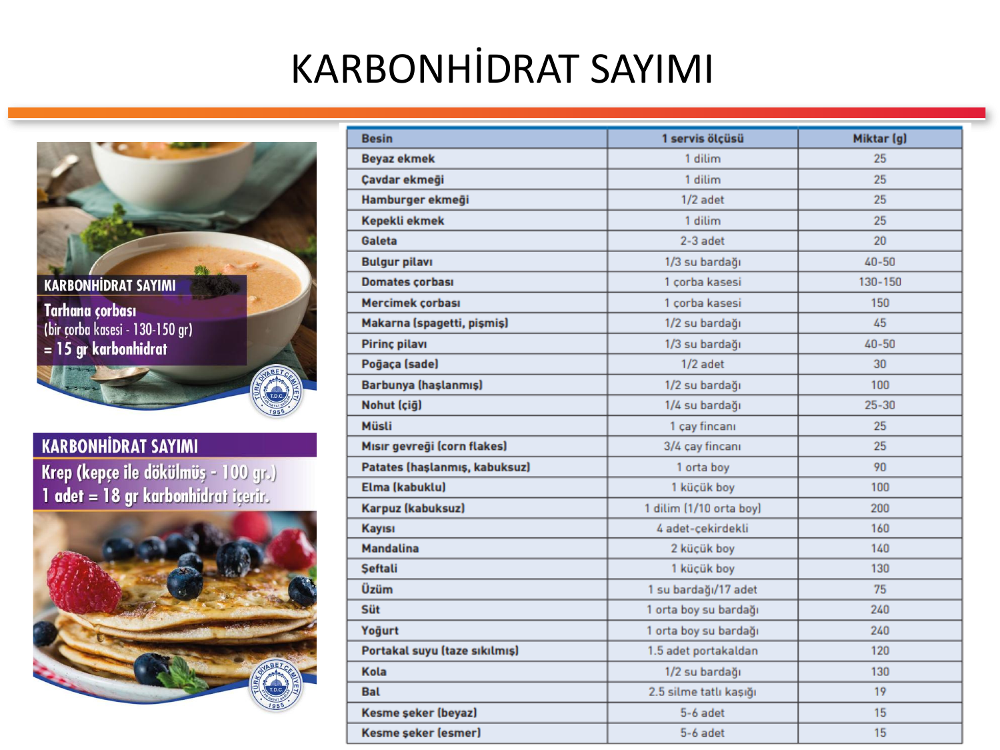

Bazal-bolus tedavisinde öğün bolusu, alınan karbonhidrat miktarına göre ayarlanır.

**Örnekler:**
* 1 dilim beyaz ekmek ≈ **15 gr** KH
* 1 orta boy haşlanmış patates ≈ **15 gr** KH
* Krep 1 adet ≈ **18 gr** KH
* Tarhana çorbası 1 kase ≈ **15 gr** KH
* 1 su bardağı süt/yoğurt ≈ **12 gr** KH

> **💡 İnsülin/Karbonhidrat Oranı ("İ:KH")**: Genelde **1 ünite insülin / 10-15 gr karbonhidrat** ile başlanır ve bireyselleştirilir.

### Doz Titrasyonu (Bazal İnsülin)

* **Başlangıç dozu:** 0.1-0.2 IU/kg/gün
* **AKS < 120 mg/dl** olana kadar → **3 günde bir 2 IU** artır
* **AKS > 180 mg/dl** ise → **3 günde bir 4 IU** artır
* **Hipoglisemi olursa** ya da gece insülininde **AKS < 70 mg/dl** ise → dozu **4 IU azalt**
* Koroner sorunlu, demanslı, yaşlı hastalarda AKS < 100 mg/dl ise gece/akşam dozu azalt

### İnsülin Günlük Doz Hesaplaması

**Tip 2 DM idame:** 0.3-1.5 IU/kg/gün (ortalama 0.5 IU/kg)

| Durum                                | IU/kg/gün |
| ------------------------------------ | --------- |
| Normal, fizik aktivitesi yoğun       | 0.3       |
| Normal, orta-hafif aktivite          | 0.4       |
| Obez, yoğun aktivite                 | 0.5       |
| Obez, orta aktivite                  | 0.6       |
| Obez, hafif aktivite                 | 0.8       |
| Böbrek yetersizliği                  | −0.2      |
| Hipoglisemi riskini artıran durumlar | −0.2      |

**Örnek — 60 kg hasta, 0.5 IU/kg:**

```
Total günlük doz (GID)      = 60 × 0.5 = 30 U
Toplam yemek öncesi doz     = %60 × 30 = 18 U
Total bazal doz             = %40 × 30 = 12 U

Kahvaltı öncesi (1/3 × 18)  = 6 U
Öğle öncesi   (1/3 × 18)    = 6 U
Akşam öncesi  (1/3 × 18)    = 6 U
Yatarken (bazal)            = 12 U
```

### Erken İnsülin Tedavisi

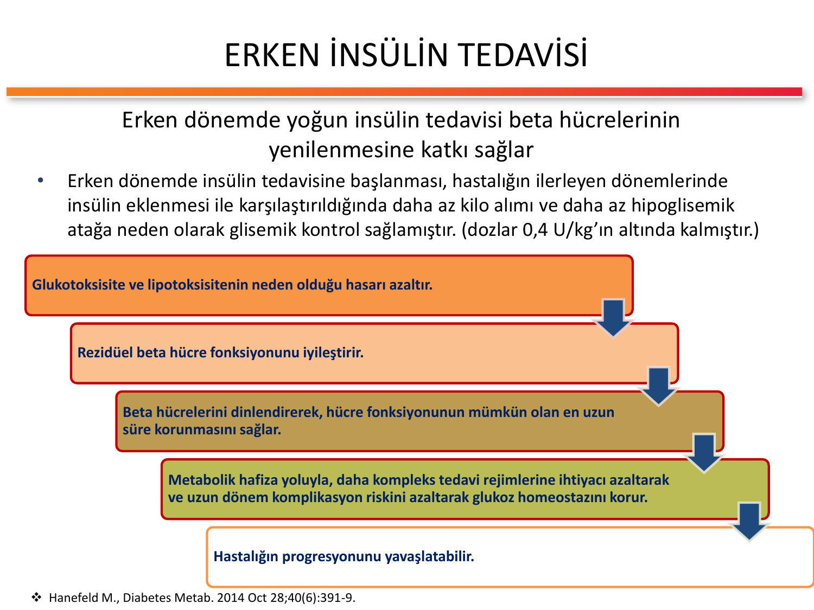

Erken dönemde yoğun insülin tedavisi **β-hücrelerinin yenilenmesine katkı sağlar**:

* **Glukotoksisite ve lipotoksisiteyi** azaltır.
* **Rezidüel β-hücre fonksiyonunu iyileştirir.**
* Hücreleri dinlendirerek fonksiyonun mümkün olan en uzun süre korunmasını sağlar.
* **Metabolik hafıza** yoluyla uzun dönem komplikasyon riskini azaltır.
* Hastalık progresyonunu yavaşlatabilir.

---

## İNSÜLİN TEDAVİSİNİN KOMPLİKASYONLARI

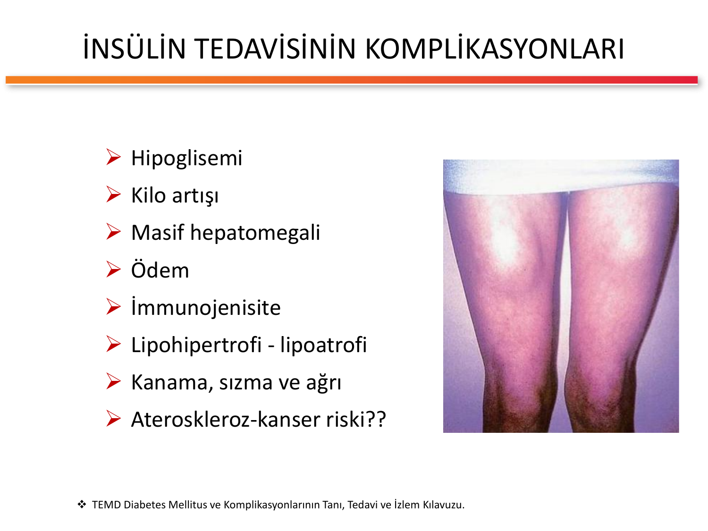

* **Hipoglisemi** (en sık ve en önemli)
* **Kilo artışı** (ilk ayda en fazla; ortalama %3-6)
* Masif hepatomegali
* **Ödem**
* İmmunojenisite (nadir)
* **Lipohipertrofi ve lipoatrofi** (enjeksiyon bölgesi rotasyonu önemli)
* Kanama, sızma, ağrı
* Ateroskleroz / kanser riski (tartışmalı)

### Kilo Alımı — Neden?

* İnsülin başlangıcında kaybedilmiş **yağ ve kas dokusunun yeniden kazanılması**
* **Su ve tuz tutulumu**
* **Glukozürinin azalması** (idrarla kalori kaybının durması)
* **Hipoglisemi korkusu** ile dengesiz beslenme → kilo artışı sürebilir.
* Kilo artışının **2/3'ü yağ dokusu** artışıdır.

### Hipoglisemi

* İnsülin tedavisinin **en önemli ve en sık** komplikasyonudur.
* **Sıkı glisemik kontrol** ve **uzun diyabet süresi** ile ilişkilidir.
* **İnsülin analogları**, insan insülinlerine göre hipoglisemi riskini azaltır.

> **💡 Pratik Hipoglisemi Tedavisi — "15/15 Kuralı":**
>
> 1. Bilinci açık hasta: **15 gr hızlı emilen karbonhidrat** (4-5 kesme şeker, yarım bardak meyve suyu, 1 yemek kaşığı bal).
> 2. **15 dakika sonra** kan şekerini tekrar ölç.
> 3. Hâlâ <70 mg/dl ise tekrar 15 gr karbonhidrat ver.
> 4. Bilinç kapalı / oral alamıyor ise: **IV %20 dextroz** (2-3 ampul) ya da **glukagon 1 mg SC/IM**.
> 5. **Akarboz alanlarda** → sükroz değil, **saf glukoz** kullanılmalıdır.

### Somogyi Fenomeni

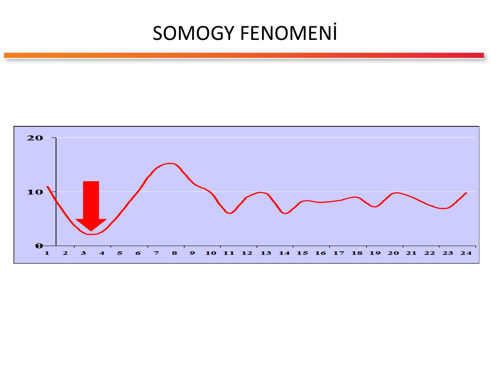

* **Gece yarısı (saat 2-4) hipoglisemisi**, karşı düzenleyici hormonların (kortizol, GH, glukagon, katekolaminler) salınımı ile **sabah rebound hiperglisemisine** yol açar.
* Sabah AKS yüksek çıkınca hasta gece insülinini **artırmaya** çalışır → durum kötüleşir.
* **Tedavi:** Gece insülini **azaltılır** ya da yatmadan önce atıştırmalık verilir.

> **💡 Ayırıcı tanı — Dawn fenomeni:** Gece büyüme hormonu salgısına bağlı sabah saatlerinde (4-8 arası) **hipoglisemisiz** AKS yükselmesidir. Hipoglisemi **yok**, tedavi bazal insülini **artırmaktır**.

---

## TEDAVİ ALGORİTMALARI (TEMD + ADA)

### TEMD — Antidiyabetik İlaçların Özellikleri

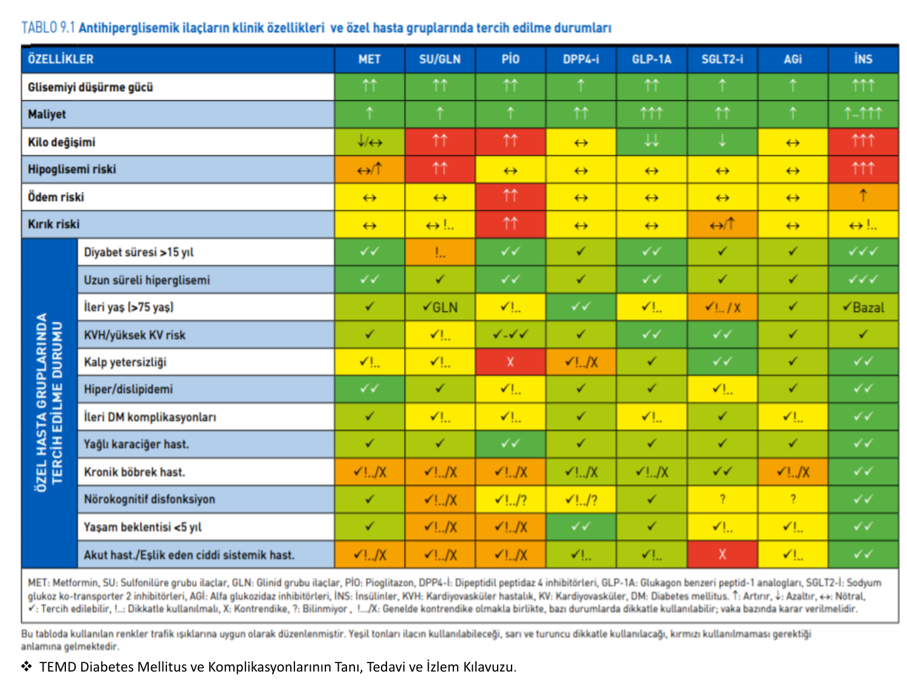

Bu tablo hasta tipi ve komorbiditelere göre ilaç seçimini kolaylaştırır. Hücre renkleri:

* **Yeşil** → Güvenle kullanılabilir
* **Sarı/Turuncu** → Dikkatle kullanılabilir
* **Kırmızı** → Kontrendike

**Bazı pratik çıkarımlar:**

| Durum                        | **Tercih**                                                            |
| ---------------------------- | --------------------------------------------------------------------- |
| KVH / yüksek KV risk         | **GLP-1A** ya da **SGLT2i** (kanıt düzeyi yüksek)                     |
| Kalp yetersizliği            | **SGLT2i** ✓ (pioglitazon ve saksagliptin **dikkat**)                 |
| Kronik böbrek hastalığı      | **SGLT2i** (albuminüride tercih), **GLP-1A**                          |
| Yağlı karaciğer              | **Pioglitazon, GLP-1A, SGLT2i**                                       |
| İleri yaş                    | Hipoglisemi yapmayan ajanlar (**metformin, DPP-4i**, SGLT2i dikkatle) |
| Hipoglisemi riski yüksek     | **SU ve glinidlerden kaçın**, bazal insülin dikkatle                  |
| Obez / kilo alımı istenmiyor | **GLP-1A, SGLT2i, metformin**                                         |

### TEMD — Yeni Tanı Tip 2 DM Tedavi Algoritması

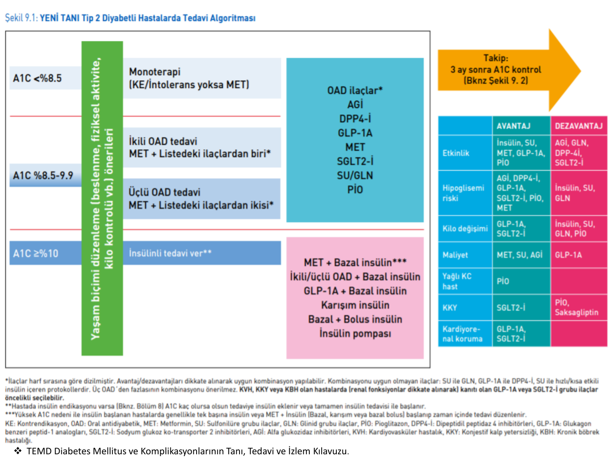

```
                      YAŞAM TARZI DEĞİŞİKLİĞİ (hepsinde eşlik eder)
                                       ↓
     ┌─────────────┬───────────────────┼──────────────────┬──────────────┐
     ↓             ↓                   ↓                  ↓              ↓
 HbA1c < %8.5   %8.5 - %9.9          ≥ %10           Hasta şiddetli   DKA/HHD
     ↓             ↓                   ↓              semptomatik        ↓
 Monoterapi    İkili OAD            Üçlü OAD        İnsülin ver      İnsülin
  (MET)        (MET +)             (MET + 2 ajan)                     tedavisi
                                        ↓
                               Hedefe ulaşılmazsa
                                        ↓
                          MET + Bazal insülin
                          İkili/üçlü OAD + Bazal insülin
                          GLP-1A + Bazal insülin
                          Karışım insülin
                          Bazal-Bolus insülin
                          İnsülin pompası
```

**Kombinasyon kuralları:**

* **SU ile GLN** kombine edilmez (aynı mekanizma).
* **GLP-1A ile DPP-4i** kombine edilmez (aynı yol).
* **SU ile hızlı/kısa etkili insülin** kombine edilmez.
* **3'ten fazla OAD** önerilmez.
* KVH, KKY veya KBH varsa **GLP-1A veya SGLT2i** öncelikli seçilir.

### ADA — Tip 2 DM Farmakolojik Tedavi Akış Şeması

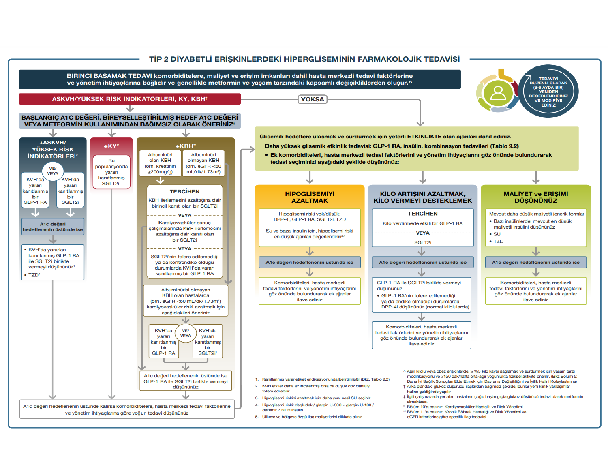

**Birinci basamak:** Metformin + yaşam tarzı değişikliği.

**Sonraki adım komorbiditeye göre:**

| Komorbidite                | Öncelikli İlaç                                                                   |
| -------------------------- | -------------------------------------------------------------------------------- |
| **ASKVH / yüksek KV risk** | KVH'da yararı kanıtlanmış **GLP-1 RA veya SGLT2i** (ya da kombinasyon)           |
| **Kalp yetersizliği**      | **SGLT2i** (kanıt düzeyi en yüksek)                                              |
| **KBH — albuminüri (+)**   | KBH ilerlemesini azaltan **SGLT2i** (tercihen); SGLT2i tolere edilmezse GLP-1 RA |
| **KBH — albuminüri (−)**   | **SGLT2i veya GLP-1 RA**                                                         |
| **Kilo azaltma hedefi**    | **Kilo verdirmede etkili GLP-1 RA** (semaglutid, liraglutid), SGLT2i             |
| **Hipoglisemiden kaçınma** | GLP-1 RA, SGLT2i, DPP-4i, TZD                                                    |
| **Maliyet kaygısı**        | SU, TZD, düşük maliyetli jenerikler                                              |

Tedavi **3-6 ayda bir** yeniden değerlendirilir ve HbA1c hedefe ulaşmazsa ajan eklenir / değiştirilir.

---

## DİYABET TEDAVİSİNDE BİREYSELLEŞTİRME

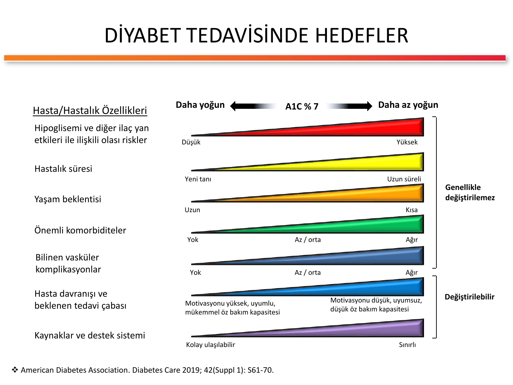

HbA1c hedefi **tek bir sayı değildir**. Hasta özelliklerine göre **%7'nin her iki tarafına** doğru kayar:

| Faktör                                | **Daha yoğun hedef** (~%6-7) | **Daha az yoğun** (~%7.5-8.5) |
| ------------------------------------- | ---------------------------- | ----------------------------- |
| **Hipoglisemi / ilaç yan etki riski** | Düşük                        | Yüksek                        |
| **Hastalık süresi**                   | Yeni tanı                    | Uzun süreli                   |
| **Yaşam beklentisi**                  | Uzun                         | Kısa                          |
| **Önemli komorbiditeler**             | Yok                          | Az/orta → ağır                |
| **Vasküler komplikasyonlar**          | Yok                          | Az/orta → ağır                |
| **Hasta motivasyonu**                 | Yüksek, uyumlu               | Düşük, uyumsuz                |
| **Kaynaklar / destek**                | Kolay ulaşılabilir           | Sınırlı                       |

> **💡 Altın kural:** **Yeni tanı, genç, motive, komplikasyonsuz hasta** → sıkı kontrol (~%6.5-7).
> **Yaşlı, kırılgan, hipoglisemi riski yüksek, kısa yaşam beklentili hasta** → daha esnek hedef (~%8-8.5).

---

## SINAV NOTLARI — ANAHTAR HATIRLATMALAR

> **📋 En Sık Sorulan Noktalar:**
>
> 1. **Metformin** = 1. basamak, karaciğer glukoneogenezini baskılar, **hipoglisemi yapmaz**, kilo nötr, GFR <30 kontrendike.
> 2. **Sülfonilüre** = pankreası zorlar → **hipoglisemi + kilo alımı**. Tip 1 DM'de kontrendike.
> 3. **Pioglitazon** = PPAR-γ agonisti, **ödem ve KKY, mesane kanseri, kırık** endişesi; KV ve karaciğer yağı için avantajlı.
> 4. **Akarboz** = α-glukozidaz inhibitörü; **postprandiyal glukoza** etkili. Hipoglisemisinde **glukoz** (sükroz değil!) verilir.
> 5. **SGLT2i** = renal glukoz atar. **Kilo kaybı + KV fayda + KBH koruma**. **Öglisemik DKA, Fournier gangreni, genital enfeksiyon**. T1DM'de kontrendike.
> 6. **GLP-1 analogları** = SC enjeksiyon, **kilo kaybı**, KV fayda. MEN2 / medüller tiroid Ca aile öyküsü → **kontrendike**. Eksenatid → Gila monster tükürüğü.
> 7. **DPP-4i** = kilo nötr, hipoglisemi yapmaz, **linagliptin SDBY'de bile kullanılabilir**. Saksagliptin → kalp yetersizliği riskini artırır.
> 8. **İnsülin tipleri:** Kısa etkili analoglar (lispro/aspart/glulisin) <15 dk başlar; **glarjin piksiz 24 sa**; **degludec piksiz >30 sa**; **NPH pik 4-10 sa**.
> 9. **Bazal-bolus** → Tip 1 DM standart; öğün öncesi kısa + gece uzun etkili.
> 10. **Somogyi** = gece hipoglisemisi → sabah rebound hiperglisemi. Tedavi: gece insülini **azalt**.
> 11. **Dawn** = hipoglisemisiz sabah hiperglisemisi. Tedavi: gece insülini **artır**.
> 12. **KVH / KBH / KKY olan tip 2 DM'de** metforminden sonra **SGLT2i ve/veya GLP-1A** öncelikli.
> 13. **HbA1c hedefi bireyselleştirilir** (genç motive hasta → %6.5-7; yaşlı kırılgan → %8-8.5).
> 14. **Günlük insülin dozu** tip 2 DM idame: 0.3-1.5 IU/kg. **%60 prandiyal + %40 bazal** (bazal-bolus için).
> 15. **Erken insülin tedavisi**, β-hücre fonksiyonunu korur, metabolik hafızayı güçlendirir.

---

> **Kaynaklar:**
>
> 1. TEMD Diabetes Mellitus ve Komplikasyonlarının Tanı, Tedavi ve İzlem Kılavuzu, 2024.
> 2. American Diabetes Association. Standards of Medical Care in Diabetes, 2019-2023.
> 3. DeFronzo RA. Diabetes 2009;58:773-795.
> 4. UKPDS 34, Lancet 1998;352:854-65.
> 5. Dormandy JA et al. PROactive. Lancet 2005;366:1279-89.
> 6. Nauck MA et al. J Clin Endocrinol Metab 1986;63:492-498.
> 7. Hanefeld M. Diabetes Metab 2014;40:391-9.

---

## VAKA SORULARI

> Bu bölüm öğrenciye yönelik 15 vaka sorusu içerir:
>
> * **Soru 1-10:** Standart 5 seçenekli test soruları
> * **Soru 11-15:** Multidisipliner zor vaka soruları
>
> **Not:** Soru başlıkları konuyu ele vermesin diye yalnızca numara olarak verilmiştir. Konu adları ve cevaplar dosyanın sonundaki **CEVAP ANAHTARI** bölümündedir.

---

### SORU 1

**📋 Vaka:** 58 yaşında, BMI 32 kg/m², asemptomatik kadın hasta. Yeni tanı tip 2 diabetes mellitus, AKS 165 mg/dl, HbA1c %7.4. Karaciğer enzimleri normal, eGFR 88 ml/dk. Ailede tip 2 DM öyküsü mevcut.

**Yaşam tarzı değişikliği önerileri yanı sıra başlanması gereken ilk basamak farmakolojik tedavi hangisidir?**

A) Glimepirid 2 mg/gün
B) Metformin 1000 mg/gün (kademeli artırma)
C) İnsülin glarjin 10 IU akşam
D) Pioglitazon 30 mg/gün
E) Akarboz 50 mg ana öğün öncesi

---

### SORU 2

**📋 Vaka:** 70 yaşında erkek, 12 yıllık tip 2 DM. Halen metformin 2000 mg/gün almakta. Son tetkikinde **eGFR 22 ml/dk/1.73 m²**, kreatinin 2.6 mg/dl, HbA1c %8.2. Hasta diyalize girmiyor.

**Bu hastada metformin ile ilgili doğru yaklaşım ve eklenebilecek en uygun oral ajan hangisidir?**

A) Metformin yarı doza düşür, sülfonilüre ekle
B) Metformin yarı doza düşür, kanagliflozin ekle
C) Metformin tam dozda devam, dapagliflozin ekle
D) Metformini kes, linagliptin ekle
E) Metformini kes, doğrudan yoğun bazal-bolus insülin başla

---

### SORU 3

**📋 Vaka:** 64 yaşında erkek tip 2 DM hastası. Ana öğün öncesi **akarboz 100 mg** kullanıyor. Aynı zamanda gliklazid kullanmakta. Akşam yemeğinden 2 saat sonra terleme, çarpıntı, titreme oluyor; parmak ucu KŞ **52 mg/dl**.

**Bu hastanın hipoglisemisinin tedavisinde hangi besin/ilaç kullanılmalıdır?**

A) 4-5 küp kesme şeker (sakkaroz)
B) Bir bardak portakal suyu (sukroz/fruktoz karışımı)
C) Saf glukoz tablet ya da intravenöz dekstroz solüsyonu
D) Bir dilim ekmek + bir kaşık reçel
E) Bir bardak süt + bisküvi

---

### SORU 4

**📋 Vaka:** 22 yaşında tip 1 DM hastası, bazal-bolus tedavide. Sabah AKS değerleri **220-260 mg/dl**, gün içi diğer ölçümler kabul edilebilir. Hasta kendi isteğiyle gece bazal insülini bir hafta boyunca her gün 2 IU artırdı; sabah AKS değerleri **daha da yükseldi**. Bunun üzerine tek gece **saat 03:00'te** ölçüm yapıldı: KŞ **45 mg/dl**.

**Bu klinik tabloda en olası tanı ve doğru tedavi yaklaşımı hangisidir?**

A) Dawn fenomeni — gece bazal insülini daha fazla artır
B) Somogyi fenomeni — gece bazal insülinini azalt veya yatmadan önce atıştırmalık ver
C) İnsülin pompası endikasyonu — pompaya geçilsin
D) Tip 1 DM kontrolsüz — yoğun bakım izlemi
E) Hasta diyetine uymuyor — yalnızca diyet eğitimi yeterli

---

### SORU 5

**📋 Vaka:** 19 yaşında, **60 kg**, yeni tanı tip 1 DM. C-peptid düşük, anti-GAD pozitif. DKA tablosu çözüldükten sonra hastane çıkışında subkutan bazal-bolus insülin tedavisi planlanıyor.

**Bu hasta için en uygun günlük başlangıç insülin dozu ve dağılımı yaklaşık olarak hangisidir?**

A) Total 12 IU/gün — tamamı bazal
B) Total 18 IU/gün — %60 bazal, %40 prandiyal
C) Total 30 IU/gün — %60 prandiyal (3 öğüne eşit), %40 bazal (gece)
D) Total 30 IU/gün — sadece kahvaltı öncesi tek doz karışım insülin
E) Total 60 IU/gün — sadece bazal insülin

---

### SORU 6

**📋 Vaka:** 45 yaşında tip 2 DM kadın hasta, son 6 aydır metformin 2000 mg + **dapagliflozin 10 mg** kullanıyor. Acile bulantı, kusma ve halsizlik ile başvuruyor. **Kan şekeri 165 mg/dl** (normal sınırda). Arteriyel kan gazı: pH **7.20**, HCO₃ 11 mEq/L, anyon açığı **22**. İdrarda **keton (+++)**. Son 5 gündür düşük karbonhidratlı diyet ve oral alımda azalma var.

**En olası tanı ve uygun ilk yaklaşım hangisidir?**

A) Hiperozmolar hiperglisemik durum — sadece IV %0.9 NaCl yeterli
B) Basit dehidratasyon — oral hidrasyon yeterli
C) Öglisemik diyabetik ketoasidoz — SGLT2 inhibitörünü kes, IV sıvı + dekstroz + IV insülin başla
D) Akut viral gastroenterit — antiemetik yeterli, KŞ normal
E) Laktik asidoz — metformin sorumludur, hemen hemodiyaliz

---

### SORU 7

**📋 Vaka:** Tip 1 DM hastasında bazal insülin için aşağıdaki ajan tercihleri tartışılıyor.

**Aşağıdaki bazal insülinlerden hangisi "piksiz" profile sahip ve etki süresi 30 saatten uzun olarak bilinir?**

A) NPH insülin
B) İnsülin glarjin U-100
C) İnsülin detemir
D) İnsülin lispro
E) İnsülin degludec

---

### SORU 8

**📋 Vaka:** 62 yaşında postmenopozal kadın hasta, tip 2 DM, BMI 28. Anamnezinde **2 yıl önce mesane karsinomu** nedeniyle takip ediliyor (şu an aktif hastalık yok ancak izleminde). Ek olarak **NYHA sınıf II kalp yetersizliği** ve osteoporoz mevcut.

**Bu hastada kontrendike olan antidiyabetik ajan hangisidir?**

A) Metformin
B) Linagliptin
C) Empagliflozin
D) Pioglitazon
E) Liraglutid

---

### SORU 9

**📋 Vaka:** 48 yaşında erkek, yeni tanı tip 2 DM. Ailede annede ve teyzede **medüller tiroid karsinomu** (MEN tip 2A) öyküsü mevcut, hastanın kalsitonin değeri yüksek normal sınırda. HbA1c %8.6, BMI 34.

**Bu hasta için kesinlikle kaçınılması gereken antidiyabetik ilaç grubu hangisidir?**

A) Metformin
B) SGLT2 inhibitörleri
C) DPP-4 inhibitörleri
D) GLP-1 reseptör agonistleri
E) Sülfonilüreler

---

### SORU 10

**📋 Vaka:** Tip 2 DM tedavisinde 1998 yılında yayımlanan **UKPDS 34** çalışması, obez hastalarda intensif glisemik kontrolün özellikle bir antidiyabetik ile uygulandığında **miyokard infarktüsünü %39, diyabete bağlı ölümü %42 oranında azalttığını** göstermiştir.

**Bu çalışmada öne çıkan ve KV fayda kanıtının en eski olduğu ilaç hangisidir?**

A) Glibenklamid
B) Metformin
C) Pioglitazon
D) Repaglinid
E) İnsülin tek başına

---

## ZOR VAKALAR — MULTİDİSİPLİNER DEĞERLENDİRME

---

### SORU 11

**📋 Vaka:** 68 yaşında erkek hasta, 10 yıllık tip 2 DM. Eş zamanlı **NYHA sınıf III kalp yetersizliği** (LVEF %30, son 6 ayda 2 kez dekompansasyon nedeniyle hastane yatışı), hipertansiyon, hiperlipidemi mevcut. Şu anda metformin 2000 mg + glimepirid 4 mg + bazal insülin 18 IU kullanıyor. HbA1c %8.4, eGFR 65 ml/dk, BMI 31. Kardiyolog rehabilitasyon programı ve furosemid 40 mg başlamış.

**Bu hastada glisemik tedaviye en uygun eklenecek/değiştirilecek antidiyabetik ajan hangisidir?**

A) Pioglitazon — insülin direncini düşürür
B) Saksagliptin — oral, kilo nötr
C) Empagliflozin — hem glisemik hem KKY hospitalizasyonunu azaltır; glimepirid kesilebilir
D) İnsülin dozunu agresif artırma — bazal-bolus rejimine geç
E) Tedavide değişiklik gereksiz, sadece HbA1c hedefini gevşet

---

### SORU 12

**📋 Vaka:** 55 yaşında kadın hasta, 8 yıllık tip 2 DM. Tetkiklerinde **eGFR 38 ml/dk/1.73 m²**, **idrar albümin/kreatinin oranı 480 mg/g** (makroalbuminüri), HbA1c %7.8. Halen metformin 1000 mg + sitagliptin 100 mg + bazal insülin 14 IU kullanıyor. TA 152/92 mmHg, ramipril alıyor. BMI 29, KV olay öyküsü yok ancak yüksek KV risk.

**Bu hastada böbrek koruyucu etkisi en güçlü ve glisemik kontrolde de yarar sağlayacak antidiyabetik eklemesi hangisidir?**

A) Metformin dozunu 2000 mg'a çıkar
B) Glimepirid ekle
C) Pioglitazon ekle
D) Dapagliflozin ya da empagliflozin ekle (SGLT2 inhibitörü)
E) Akarboz ekle

---

### SORU 13

**📋 Vaka:** 42 yaşında erkek, BMI **38 kg/m²**, 4 yıllık tip 2 DM. Hepatoloji tarafından **NAFLD** ileri evresi (transaminazlar 2× ULN, fibroz skoru orta-ileri, MR-elastografi F2-F3) tanısı konmuş. HbA1c %8.0, halen metformin 2000 mg/gün kullanıyor. KV olay öyküsü yok, eGFR 92.

**Bu hastada hem glisemi hem karaciğer yağlanması ve fibroz üzerine olumlu etkisi kanıtlanmış, kilo verdirici özelliği olan en uygun ajan hangisidir?**

A) Sülfonilüre (gliklazid)
B) Akarboz
C) Bazal insülin tedavisi
D) Pioglitazon ya da GLP-1 reseptör agonisti (semaglutid/liraglutid)
E) DPP-4 inhibitörü (sitagliptin)

---

### SORU 14

**📋 Vaka:** 84 yaşında kadın hasta, **orta derecede demans** (MMSE 18), evde yardımla yaşıyor. Son 6 ayda **3 kez düşme** öyküsü, 1 kez kalça çevresi morarma ile acile başvuru. 15 yıldır tip 2 DM, halen **glibenklamid 10 mg + bazal insülin 22 IU + prandiyal kısa etkili insülin 6+6+6 IU** kullanıyor. HbA1c %6.4. Evde son ay 2 kez sabah saatlerinde "uyandırılamama, ter içinde bulunma" tablosu olmuş — kapiller KŞ 38 mg/dl. eGFR 48 ml/dk.

**Bu hastada en doğru tedavi düzenlemesi hangisidir?**

A) Mevcut tedaviye devam, HbA1c hedefi uygun
B) Glibenklamidi kes, insülin dozlarını agresif artır, HbA1c hedefini %6'ya çek
C) Glibenklamidi kes, prandiyal insülini kes, bazal insülini azalt; HbA1c hedefini gevşet (~%7.5-8.5); hipoglisemi riski düşük ajan tercih et; düşme/demans için geriatri ile ortak izlem
D) Yoğun bazal-bolus tedavisini koru, sadece düşmeleri önlemek için fizyoterapi
E) Tedaviyi tamamen kes, sadece diyet ve egzersiz

---

### SORU 15

**📋 Vaka:** 72 yaşında erkek hasta, **KOAH alevlenmesi** nedeniyle göğüs hastalıkları kliniğine yatırılıyor. Tedavi olarak **metilprednizolon 40 mg/gün IV** + nebülize bronkodilatör + antibiyotik başlanıyor. Hastanın bilinen **tip 2 DM**'i mevcut (ev tedavisi: metformin 2000 mg + sitagliptin 100 mg). Yatışın 2. gününde kan şekeri profili: AKS 180 mg/dl, **öğle ve akşam tokluk KŞ 320-380 mg/dl**, idrarda keton negatif. Kreatinin normal, eGFR 78. Bilinen kalp yetersizliği yok.

**Bu hastada glisemik kontrol için en uygun yaklaşım hangisidir?**

A) Sadece metformin + sitagliptin doz artırımı yeterli
B) Glukokortikoid kesilsin, KOAH alevlenmesi sadece antibiyotikle tedavi edilsin
C) Sülfonilüre (glimepirid) ekle, insülin gereksiz
D) Steroid süresi boyunca özellikle **öğle/akşam pik hiperglisemiyi karşılayacak şekilde** prandiyal kısa etkili (veya öğleden sonra NPH) insülin ekle, oral ajanları sürdür; göğüs hastalıkları ile birlikte steroid azaltıldıkça doz titre et
E) Yoğun bazal-bolus insülin başla ve metformini kes

---

## CEVAP ANAHTARI VE AÇIKLAMALAR

> Önce kendiniz çözmeye çalışın, sonra buradaki cevaplara bakın.

---

### SORU 1 — Yeni Tanı Tip 2 DM'de İlk Basamak Tedavi

**Doğru Cevap: B** — Metformin 1000 mg/gün (kademeli artırma)

> **Açıklama:** **TEMD ve ADA algoritmalarında yeni tanı tip 2 DM'de ilk basamak farmakolojik tedavi metformindir** (kontrendikasyon yoksa). Yaşam tarzı değişikliği daima eşlik eder. HbA1c <%8.5 ise monoterapi (metformin) uygundur. Metformin **karaciğer glukoneogenezini baskılar**, **hipoglisemi yapmaz**, **kilo nötr ya da hafif kilo kaybı** sağlar ve **KV fayda** kanıtı vardır (UKPDS 34). Bu hastada eGFR 88 olduğu için kontrendikasyon yoktur. Diğer seçenekler (SU, insülin, pioglitazon, akarboz) ilk basamak değildir.

---

### SORU 2 — İleri Renal Yetmezlikte Antidiyabetik Tercihi (Linagliptin)

**Doğru Cevap: D** — Metformini kes, linagliptin ekle

> **Açıklama:**
>
> * **Metformin GFR <30 ml/dk'da kontrendikedir** (laktik asidoz riski). Bu hastada eGFR 22 → metformin **kesilmelidir**.
> * **SGLT2 inhibitörleri** son dönem böbrek yetmezliğinde glisemik etkinliği belirgin azalır; bu eGFR'de tercih edilmez.
> * **Sülfonilüreler** ileri böbrek yetmezliğinde **hipoglisemi riskini artırır** (özellikle glibenklamid).
> * **Linagliptin**, DPP-4 inhibitörlerinden **böbrek yoluyla atılmadığı için** ileri böbrek yetmezliğinde ve **SDBY'de doz ayarlaması gerektirmeden** güvenle kullanılabilir.
> * Repaglinid de ileri renal yetmezlikte güvenli alternatiftir; ancak burada DPP-4i hipoglisemi riski açısından daha avantajlıdır.

---

### SORU 3 — Akarboz Hipoglisemisinde Tedavi (Saf Glukoz Şart)

**Doğru Cevap: C** — Saf glukoz tablet ya da IV dekstroz

> **Açıklama:** **Akarboz**, intestinal **α-glukozidazı** inhibe ederek **disakkaridlerin (sukroz, maltoz) sindirimini engeller**. Bu nedenle akarboz alan bir hastada hipoglisemi geliştiğinde **kesme şeker, çay şekeri, meyve suyu** gibi sukroz/disakkarit içeren besinler **işe yaramaz** — emilemezler. **Tek etkili tedavi monosakkarit olan saf glukoz** (glukoz tableti) ya da IV dekstroz uygulamasıdır. Bu, akarboz reçete eden hekimin hastasına mutlaka eğitim vermesi gereken kritik bir noktadır.

---

### SORU 4 — Somogyi Fenomeni vs Dawn Fenomeni

**Doğru Cevap: B** — Somogyi fenomeni; gece insülinini azalt veya yatmadan atıştırmalık ver

> **Açıklama:**
>
> * **Somogyi fenomeni:** Gece (genelde 02:00-04:00) **hipoglisemi** → karşı düzenleyici hormonların (kortizol, GH, glukagon, katekolaminler) salınımı → **sabah rebound hiperglisemi**. Hasta sabah AKS yüksek görünce gece insülinini artırırsa tablo kötüleşir.
> * **Dawn fenomeni:** Gece **hipoglisemi YOK**, ancak sabah saatlerinde (04:00-08:00) GH salgısına bağlı sabah hiperglisemisi. Tedavi: gece bazal insülini **artırılır**.
> * Bu vakada gece 03:00'te KŞ 45 mg/dl saptanması → **gece hipoglisemisi var** → **Somogyi**. Tedavi: gece insülini **azalt** veya yatmadan **atıştırmalık** ver.
> * Belirsiz vakalarda **gece 02:00-03:00 ölçümü** ayırıcı tanıda altın standarttır.

---

### SORU 5 — Tip 1 DM'de Başlangıç İnsülin Doz Hesaplaması

**Doğru Cevap: C** — Total 30 IU/gün; %60 prandiyal (6+6+6) + %40 bazal (12)

> **Açıklama:**
>
> * Tip 1 DM tipik başlangıç dozu: **~0.5 IU/kg/gün**
> * 60 kg × 0.5 = **30 IU/gün** total
> * Klasik bazal-bolus dağılımı: **%60 prandiyal** + **%40 bazal**
>     * Prandiyal: 18 IU → **6 + 6 + 6 IU** (kahvaltı/öğle/akşam)
>     * Bazal: **12 IU** (gece, uzun etkili)
> * Tip 1 DM'de **bazal-bolus standarttır**. Tek bazal (A, E) veya tek karışım (D) tip 1 DM'de fizyolojik insülin profilini sağlamaz ve hipoglisemi/hiperglisemi dalgalanmalarını artırır. Total 18 IU/gün (B) yetersizdir.

---

### SORU 6 — Öglisemik Diyabetik Ketoasidoz (SGLT2i)

**Doğru Cevap: C** — SGLT2 inhibitörünü kes; IV sıvı + dekstroz + IV insülin

> **Açıklama:**
>
> * **Öglisemik DKA**, SGLT2 inhibitörü kullanımı sırasında, gebelikte, uzun açlık ve düşük karbonhidrat alımı durumlarında görülür.
> * Tanı kriterleri: **kan şekeri <200 mg/dl** + **artmış anyon açığı metabolik asidoz** + **ketonüri/ketonemi**.
> * Patofizyoloji: SGLT2i ile glukozüri ↑, göreceli insülin yetersizliği + glukagon ↑ → **lipoliz ↑ → ketogenez ↑**, ancak glukoz idrarla atıldığı için belirgin hiperglisemi yok.
> * **Tedavi:** SGLT2i **hemen kes**, **IV izotonik + dekstroz** (öglisemik olduğu için glukoz şart) + **IV insülin infüzyonu** + elektrolit (özellikle K) yönetimi.
> * **Major cerrahi öncesi 3-4 gün**, ciddi hastalık ve enfeksiyonda SGLT2i kesilmelidir.

---

### SORU 7 — Ultra-Uzun Etkili Bazal İnsülin (Degludec)

**Doğru Cevap: E** — İnsülin degludec

> **Açıklama:**
>
> * **Degludec:** B30 treonin çıkarılmış, B29 lizine glutamik asit aracılığı ile yağ asidi bağlanmıştır. **Etki süresi >30 saat, piksiz**, çok stabil PK/PD profili. Hipoglisemi riski glarjinden daha düşük.
> * **Glarjin U-100:** 24 sa, piksiz
> * **Glarjin U-300:** 26 sa, piksiz; U-100'e göre hipoglisemi ~%21 daha düşük
> * **NPH:** Pik 4-10 sa, süre >14 sa (orta etkili, bazal değil)
> * **Detemir:** 20-24 sa, hafif pikli
> * **Lispro:** Kısa etkili analog (bazal değil)

---

### SORU 8 — Pioglitazon Kontrendikasyonları

**Doğru Cevap: D** — Pioglitazon

> **Açıklama:** Pioglitazon kontrendikasyonları:
>
> * **NYHA I-IV kalp yetersizliği** ✓ (vakada NYHA II)
> * **Mesane kanseri** öyküsü/aktif hastalık ✓ (vakada izlemde)
> * **Postmenopozal kadın / kırık riski yüksek hasta** ✓ (vakada osteoporoz)
> * Ayrıca: ALT >2.5× ULN, gebelik, maküla ödemi, tip 1 DM, çocuk/adölesan
>
> Bu hasta pioglitazon için **3 ayrı kontrendikasyona** sahiptir. Diğer ajanlar (metformin, linagliptin, empagliflozin, liraglutid) bu hastada dikkatle kullanılabilir; özellikle KKY hikayesi açısından **empagliflozin ve liraglutid avantajlıdır**.

---

### SORU 9 — GLP-1 Analogu Kontrendikasyonu (MEN2 / MTC)

**Doğru Cevap: D** — GLP-1 reseptör agonistleri

> **Açıklama:**
>
> * **GLP-1 analogları kemirgen çalışmalarında C-hücre hiperplazisi ve medüller tiroid karsinomuna** yol açmıştır. İnsanda kanıt sınırlı olsa da **MEN tip 2 ya da MTC kişisel/aile öyküsünde GLP-1 analogları KESİN olarak kontrendikedir**.
> * Bu hastada anne ve teyzede MTC (MEN2A) öyküsü + kalsitonin yüksek normal → GLP-1 RA kullanılamaz.
> * **Klinik ipucu:** GLP-1 analoğu reçete etmeden önce mutlaka tiroid/MEN aile öyküsü sorulmalıdır.
> * Diğer ajanlar (metformin, SGLT2i, DPP-4i, sülfonilüre) bu hastada güvenle kullanılabilir.

---

### SORU 10 — UKPDS 34 ve Metforminin KV Faydası

**Doğru Cevap: B** — Metformin

> **Açıklama:**
>
> * **UKPDS 34 (1998, Lancet)** çalışması, **obez tip 2 DM hastalarında metformin** ile yoğun glisemik kontrolün:
>     * **Mİ riskini %39**
>     * **Diyabete bağlı ölümü %42**
>     * Tüm nedenli ölümü anlamlı şekilde **azalttığını** göstermiştir.
> * Bu, metforminin **birinci basamak ajan** olarak öne çıkmasının temel kanıtıdır.
> * SGLT2i ve GLP-1 RA'nın KV fayda kanıtları çok daha sonra (2015 sonrası — EMPA-REG, LEADER vb.) gelmiştir; ancak UKPDS metformini "klasik KV fayda kanıtı olan ilk antidiyabetik" yapar.
> * Pioglitazon (PROactive 2005) sekonder KV olayda %16 azalma sağlar — UKPDS kadar erken/güçlü değildir.

---

### SORU 11 — Tip 2 DM + Kalp Yetersizliği — SGLT2i (Endokrinoloji + Kardiyoloji)

**Doğru Cevap: C** — Empagliflozin; glimepirid kesilebilir

> **Açıklama (multidisipliner):**
>
> * **NYHA III KKY + LVEF %30 + dekompansasyon hospitalizasyonu** olan tip 2 DM hastasında, glisemik kontrol kadar **KKY hospitalizasyonunu azaltmak** da öncelik.
> * **EMPA-REG OUTCOME, DAPA-HF, EMPEROR-Reduced** çalışmaları **SGLT2 inhibitörlerinin KKY hospitalizasyonunu ve KV ölümü** anlamlı azalttığını göstermiştir. Bu etki **diyabet olmayan KKY hastalarında bile kanıtlanmıştır**.
> * **Kardiyoloji + Endokrinoloji ortak yaklaşımı:** SGLT2i (empagliflozin/dapagliflozin) mutlaka eklenmeli.
> * **Glimepirid (SU)** → hipoglisemi + kilo + KV avantaj yok → kesilebilir.
> * **Pioglitazon (A) KKY'de KESİN KONTRENDİKE** — sıvı tutulumu ile dekompansasyon yapar.
> * **Saksagliptin (B)** SAVOR-TIMI çalışmasında **KKY hospitalizasyonunu artırdığı** için bu hastada uygun değildir.
> * **Yoğun insülin (D)** kilo aldırır, KV fayda sağlamaz — öncelikli değil.

---

### SORU 12 — Tip 2 DM + Diyabetik Nefropati / Albuminüri — SGLT2i (Endokrinoloji + Nefroloji)

**Doğru Cevap: D** — Dapagliflozin ya da empagliflozin (SGLT2i)

> **Açıklama (multidisipliner):**
>
> * **DAPA-CKD, CREDENCE, EMPA-KIDNEY** çalışmaları **SGLT2 inhibitörlerinin KBH progresyonunu, eGFR düşüşünü, end-stage renal disease ve KV mortaliteyi azalttığını** göstermiştir. Bu etki özellikle **albuminürik (UACR >200-300 mg/g) hastalarda** belirgindir.
> * SGLT2 inhibitörleri günümüzde **eGFR ≥20-25 ml/dk'a kadar başlanabilir**; renal koruma glisemik etkiden bağımsızdır.
> * **GLP-1 RA** (özellikle semaglutid, dulaglutid) da renal koruyucu kanıtları olan iyi bir alternatif; SGLT2i tolere edilemediğinde tercih.
> * **Metformin (A)** GFR 38 olduğu için yarı dozda devam edebilir ama renal koruma sağlamaz.
> * **Sülfonilüre (B)** hipoglisemi + kilo, KBH'da yarar yok.
> * **Pioglitazon (C)** ödem ve sıvı tutulumu nedeniyle renal hastalıkta dikkatle, koruyucu değil.
> * **Akarboz (E)** etkisi sınırlı.
> * **Nefroloji + Endokrinoloji ortak takip** ile **ramipril (RAAS blokeri) optimal dozda + SGLT2i** kombinasyonu standart yaklaşımdır.

---

### SORU 13 — Tip 2 DM + Obezite + NAFLD — Pioglitazon / GLP-1 RA (Endokrinoloji + Hepatoloji)

**Doğru Cevap: D** — Pioglitazon ya da GLP-1 RA (semaglutid/liraglutid)

> **Açıklama (multidisipliner):**
>
> * **NAFLD/NASH** tip 2 DM'de %50-70 oranında bulunur ve fibroza ilerleyebilir.
> * **Pioglitazon:** PIVENS ve diğer çalışmalarda **histolojik düzelme (steatoz, lobüler enflamasyon)** ve **NAS skorunda azalma** göstermiştir. Kilo alımı/ödem dezavantajı olsa da NASH'da etkisi kanıtlıdır.
> * **GLP-1 RA (semaglutid, liraglutid):** Hem **kilo kaybı (5-15 kg)** hem **karaciğer enzimlerinde, steatozda ve NASH histolojisinde düzelme** sağladığı LEAN, SEMA-NASH gibi çalışmalarda gösterilmiştir.
> * **BMI 38 + NAFLD F2-F3** olan bu hastada **GLP-1 RA** ya da **pioglitazon** seçimi NASH için kanıt düzeyi en yüksek seçeneklerdir. KV/böbrek profil ve kilo hedefi düşünüldüğünde **GLP-1 RA günümüzde tercih edilen ilk basamaktır**.
> * Sülfonilüre ve insülin **kilo aldırır**, NAFLD için yararsızdır.
> * **Hepatoloji + Endokrinoloji** ortak takibi ile yıllık fibroz değerlendirmesi (Fibroscan/FIB-4) yapılmalıdır.

---

### SORU 14 — Yaşlı Kırılgan Hasta — Bireyselleştirme (Endokrinoloji + Geriatri)

**Doğru Cevap: C** — Glibenklamidi kes, prandiyal insülini kes, bazal insülini azalt; hedefi gevşet (~%7.5-8.5); hipoglisemi riski düşük ajan tercih et; geriatri ile ortak izlem

> **Açıklama (multidisipliner):**
>
> * **HbA1c %6.4 yaşlı kırılgan demanslı hastada AŞIRI SIKI bir kontroldür** — düşme, hipoglisemi, kalça kırığı, KV olay ve mortalite riskini artırır.
> * **Glibenklamid:** Uzun etkili sülfonilüre, **yaşlılarda kesinlikle kaçınılması gerekir** (Beers Criteria) — uzamış hipoglisemi yapar.
> * **Yoğun insülin (bazal-bolus)** demanslı hasta için karmaşıktır, uyum sorunu yaratır, hipoglisemi riski yüksektir.
> * **Bireyselleştirme:**
>     * **HbA1c hedefi: ~%7.5-8.5**
>     * Hipoglisemi yapmayan ajanlar: **DPP-4i (linagliptin)**, basit bazal insülin (gerekirse)
>     * Düşme ve kalça kırığı önleme için fizyoterapi, ev güvenliği değerlendirmesi, D vitamini
>     * **Geriatri ile ortak takip:** kapsamlı geriatrik değerlendirme, ilaç gözden geçirilmesi (deprescribing), demans yönetimi
> * **Altın kural:** Yaşlı kırılgan hastada **hedef hipoglisemiden kaçınmaktır**, agresif glisemik kontrol değil.

---

### SORU 15 — Steroid-İndüklü Hiperglisemi (Endokrinoloji + Göğüs Hastalıkları)

**Doğru Cevap: D** — Öğle/akşam pikine yönelik prandiyal kısa etkili (ya da öğleden sonra NPH) insülin ekle, oral ajanları sürdür, steroid azaldıkça titre et

> **Açıklama (multidisipliner):**
>
> * **Glukokortikoidler diyabet yapan ilaç gruplarının en sık sorumlusudur** — steroid-indüklü hiperglisemi tip 2 DM hastalarında belirgin alevlenir.
> * **Patofizyoloji:** Glukokortikoid → **hepatik glukoneogenez ↑ + insülin direnci ↑ + β-hücre disfonksiyonu** → özellikle **postprandiyal (öğle-akşam) hiperglisemi** belirgin.
> * **Steroidin sirkadiyen profili:** Sabah verilen prednizolon/metilprednizolon → etki **6-8 saat sonra (öğle/akşam) zirveye çıkar** → bu yüzden **öğleden sonra/akşam KŞ piklerine** yönelik müdahale gerekir.
> * **En uygun yaklaşım:**
>     * **Öğle/akşam prandiyal kısa etkili insülin** (lispro/aspart) eklemek, ya da
>     * **Öğleden sonra NPH** vermek (sabah steroid pikiyle senkron çalışır)
>     * Oral ajanları (metformin, sitagliptin) sürdür
> * **Göğüs hastalıkları + Endokrinoloji ortak yaklaşımı:** Steroid dozu KOAH alevlenmesi düzeldikçe **azaltılır**; insülin dozu paralel **titre edilir**. Steroid kesildikten sonra hasta tekrar değerlendirilmeli, oral ajanlar yeterliyse insülin kesilir.
> * **A-C-E seçenekleri yetersiz/yanlış:**
>     * Sadece oral ajan artırımı (A) postprandiyal pikleri kontrol edemez.
>     * Steroidin kesilmesi (B) KOAH alevlenmesinde uygun değildir.
>     * Sülfonilüre (C) steroide bağlı pikleri yeterince karşılamaz, hipoglisemi riski.
>     * Metformini kesmek (E) gereksiz.

---

> **💡 Vaka Çalışması Sonu:** Bu 15 vaka; tip 2 DM tedavisinde sıklıkla karşılaşılan ilk basamak ajan seçimi, doz ayarlama, komplikasyon yönetimi ve özel popülasyonlardaki bireyselleştirme noktalarını kapsar. **Doğru ajan seçimi yalnızca HbA1c'ye değil; KV profil, böbrek fonksiyonu, kilo, hipoglisemi riski, komorbiditeler ve hastanın tercihlerine göre yapılmalıdır.**
