# DİSLİPİDEMİ

**Hazırlayan:** Prof. Dr. Engin Güney
**Bölüm:** Aydın Adnan Menderes Üniversitesi -- Endokrinoloji Bilim Dalı

---

## İÇİNDEKİLER

1. [Tanım ve Dislipidemi Bileşenleri](#tanım-ve-dislipidemi-bileşenleri)
2. [Lipoproteinler](#lipoproteinler)
3. [Prevalans](#prevalans)
4. [Dislipideminin Riskleri](#dislipideminin-riskleri)
5. [Serum Lipidlerinin Sınıflandırılması](#serum-lipidlerinin-sınıflandırılması)
6. [Dislipidemi Taraması](#dislipidemi-taraması)
7. [Dislipidemili Hastaya Yaklaşım](#dislipidemili-hastaya-yaklaşım)
8. [Sekonder Dislipidemi Nedenleri ve İlaçlar](#sekonder-dislipidemi-nedenleri-ve-ilaçlar)
9. [Laboratuvar](#laboratuvar)
10. [Standart Dışı Ölçümler](#standart-dışı-ölçümler)
11. [Lipid Profili İçin Kan Alma Zamanı](#lipid-profili-için-kan-alma-zamanı)
12. [Toplam Kardiyovasküler Risk ve SCORE](#toplam-kardiyovasküler-risk-ve-score)
13. [SCORE Risk Kategorileri](#score-risk-kategorileri)
14. [Tedavi Kararı](#tedavi-kararı)
15. [Dislipidemi Tedavi Hedefleri](#dislipidemi-tedavi-hedefleri)
16. [İlaç Dışı Tedavi Yaklaşımları](#ilaç-dışı-tedavi-yaklaşımları)
17. [Statinler](#statinler)
18. [Statin İntoleransı Yönetimi](#statin-i̇ntoleransı-yönetimi)
19. [Ezetimib](#ezetimib)
20. [Safra Asidi Bağlayıcılar](#safra-asidi-bağlayıcılar)
21. [Fibratlar](#fibratlar)
22. [Nikotinik Asit (Niasin)](#nikotinik-asit-niasin)
23. [Omega-3 Yağ Asitleri](#omega-3-yağ-asitleri)
24. [PCSK9 İnhibitörleri](#pcsk9-i̇nhibitörleri)
25. [Aferez Tedavisi](#aferez-tedavisi)
26. [Özel Durumlar ve Vaka Örnekleri](#özel-durumlar-ve-vaka-örnekleri)

---

## TANIM VE DİSLİPİDEMİ BİLEŞENLERİ

> **Tanım:** Dislipidemi, plazma lipid veya lipoprotein düzeylerinin sağlıklı bir yetişkinde olması gerekenden **sayısal ve/veya kalitatif olarak farklı olması** durumudur. Başlıca ateroskleroz ve pankreatit olmak üzere ciddi morbidite/mortaliteye yol açar.

**Dislipidemi Dört Bileşeni:**

* **Total kolesterol yüksekliği**
* **LDL-kolesterol yüksekliği**
* **Trigliserid yüksekliği**
* **HDL-kolesterol düşüklüğü**

Bu dört bulgudan bir veya daha fazlasının bulunması dislipidemi tanısı için yeterlidir. Tedavi kararı hem lipid düzeyine hem de toplam kardiyovasküler riske göre verilir.

---

## LİPOPROTEİNLER

Lipoproteinler kandaki çözünmez lipidleri taşıyan partiküllerdir. **Çekirdekte** trigliserid (TG) ve kolesterol esteri, **yüzeyde** fosfolipid, serbest kolesterol ve apolipoproteinler bulunur. Apolipoproteinler lipoproteinlere hem yapısal stabilite kazandırır hem de doku reseptörleri ile etkileşerek metabolizmalarını yönlendirir.

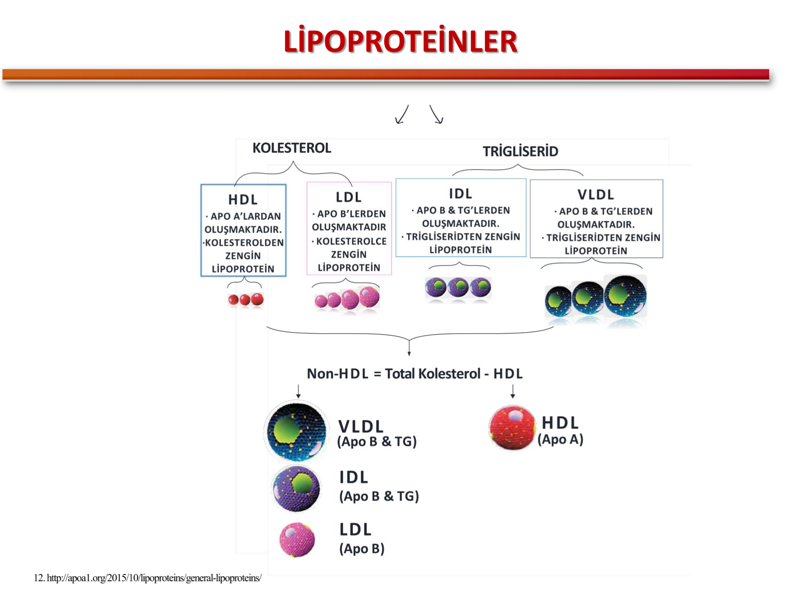

> **Şema yorumu:** Lipoproteinler ana lipid içeriklerine göre iki uca dağılır. **Kolesterolden zengin** tarafta **HDL** (ApoA taşır, ters yönde kolesterol nakli yapar) ve **LDL** (ApoB taşır, karaciğerden periferik dokuya kolesterol taşır); **trigliseridden zengin** tarafta **VLDL** ve **IDL** (ApoB ve ApoE taşırlar). **Non-HDL kolesterol = Total kolesterol -- HDL** formülü ile hesaplanır ve tüm **ApoB içeren (aterojenik) partiküllerin toplamını** yansıtır; özellikle hipertrigliseridemili hastalarda LDL-K yerine tercih edilir.

### Lipoprotein Sınıfları

| Lipoprotein | Ana İçerik | Başlıca Apolipoprotein | Kaynak | Fonksiyon |
|---|---|---|---|---|
| **Şilomikron** | Diyet TG | ApoB-48, ApoC, ApoE | İnce bağırsak | Diyet kaynaklı lipid taşıma |
| **VLDL** | Endojen TG | ApoB-100, ApoC, ApoE | Karaciğer | Endojen TG'yi periferik dokuya taşır |
| **IDL** | TG + Kolesterol | ApoB-100, ApoE | VLDL metabolizması | LDL'ye dönüşüm ara ürünü |
| **LDL** | Kolesterol esteri | ApoB-100 | IDL'den | Periferik dokulara kolesterol taşır (aterojenik) |
| **HDL** | Kolesterol esteri | ApoA-I, ApoA-II | Karaciğer, bağırsak | Ters kolesterol taşıması (koruyucu) |
| **Lp(a)** | LDL benzeri | ApoB-100 + Apo(a) | Karaciğer | Bağımsız KV risk faktörü, trombojenik |

### Önemli Enzim ve Proteinler

* **LPL (Lipoprotein lipaz):** Şilomikron ve VLDL'deki TG'yi serbest yağ asitlerine hidrolize eder.
* **LCAT (Lesitin kolesterol açiltransferaz):** HDL içinde serbest kolesterolü esterleştirir.
* **CETP (Kolesteril ester transfer protein):** HDL ile VLDL/LDL arasında kolesterol esteri-TG değişimini sağlar.
* **PCSK9:** Hepatosit yüzeyindeki LDL reseptörünü lizozoma yönlendirerek yıkar; düzeyi artınca dolaşımdaki LDL-K artar.

---

## PREVALANS

> **📋 Temel istatistik:** Türk yetişkinlerinin **kadınların %80,4'ünde**, **erkeklerin %78,7'sinde** **en az bir lipid bozukluğu** saptanmıştır.

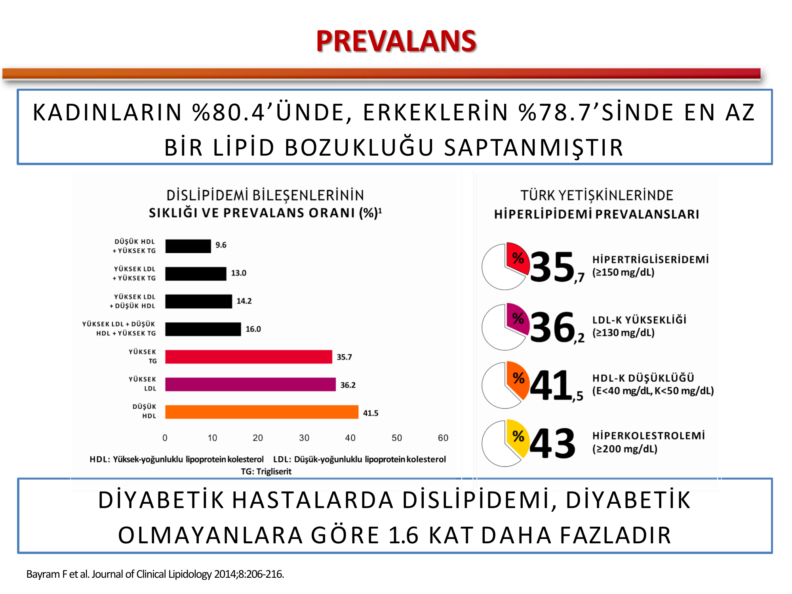

> **Grafik yorumu:** Türkiye'de en sık görülen dislipidemi bileşenleri; **düşük HDL (%41,5)**, **yüksek LDL (%36,2)** ve **yüksek trigliserid (%35,7)** şeklindedir. Hiperkolesterolemi (Total-K ≥ 200 mg/dL) prevalansı ise **%43** düzeyindedir. **Diyabetik hastalarda dislipidemi prevalansı diyabetik olmayanlara göre yaklaşık 1,6 kat daha yüksektir.** Bu durum Tip 2 DM olgularının dislipidemi açısından yıllık taranmasını zorunlu kılar.

---

## DİSLİPİDEMİNİN RİSKLERİ

Dislipidemi iki ana klinik sonuca yol açar:

* **🫀 Ateroskleroz** -- LDL-K ve non-HDL-K yüksekliğine bağlı aterosklerotik kardiyovasküler hastalık (ASKVH). Koroner arter hastalığı, iskemik inme, periferik arter hastalığı.
* **🔴 Pankreatit** -- Şiddetli hipertrigliseridemi (özellikle **TG > 1000 mg/dL**) akut pankreatit tetikleyicisidir.

**⚠️ ÖNEMLİ:**

* Dislipidemi tedavisinde birincil öncelik **ASKVH önlemektir** ve bu nedenle **LDL-K düşürücü yaklaşımlar** temeldir.
* Ancak **TG > 500 mg/dL** olduğunda öncelik değişir ve **pankreatit atağını önlemek** için TG düşürücü tedavi öne çıkar.

---

## SERUM LİPİDLERİNİN SINIFLANDIRILMASI

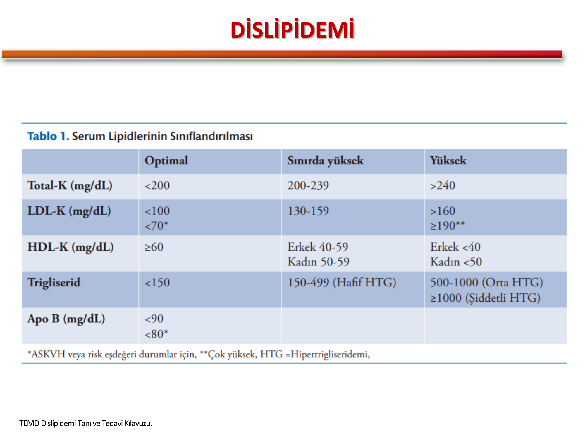

### Tablo 1. Serum Lipidlerinin Sınıflandırılması (Türkçe Özet)

| Parametre | Optimal | Sınırda Yüksek | Yüksek |
|---|---|---|---|
| **Total-K (mg/dL)** | < 200 | 200-239 | > 240 |
| **LDL-K (mg/dL)** | < 100   < 70\* | 130-159 | > 160   ≥ 190\*\* |
| **HDL-K (mg/dL)** | ≥ 60 | Erkek 40-59   Kadın 50-59 | Erkek < 40   Kadın < 50 |
| **Trigliserid (mg/dL)** | < 150 | 150-499 (Hafif HTG) | 500-1000 (Orta HTG)   ≥ 1000 (Şiddetli HTG) |
| **Apo B (mg/dL)** | < 90   < 80\* | -- | -- |

> \* ASKVH veya risk eşdeğeri durumlar için hedef değer.
> \*\* Çok yüksek; monogenik (familial) hiperkolesterolemi düşündürür.
> **HTG:** Hipertrigliseridemi.

---

## DİSLİPİDEMİ TARAMASI

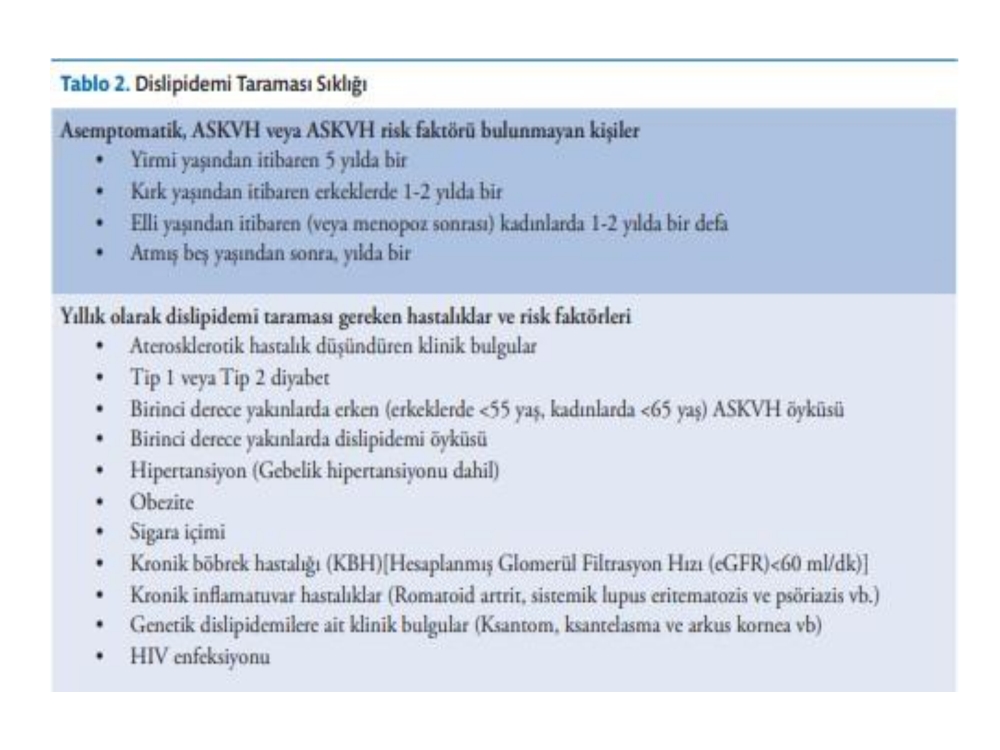

### Tablo 2. Dislipidemi Tarama Sıklığı

**Asemptomatik, ASKVH veya ASKVH risk faktörü bulunmayan kişiler:**

* Yirmi yaşından itibaren **5 yılda bir**
* Kırk yaşından itibaren erkeklerde **1-2 yılda bir**
* Elli yaşından itibaren (veya menopoz sonrası) kadınlarda **1-2 yılda bir**
* **Altmış beş yaşından sonra yılda bir**

**Yıllık dislipidemi taraması gereken hastalıklar ve risk faktörleri:**

* Aterosklerotik hastalık düşündüren klinik bulgular
* **Tip 1 veya Tip 2 diyabet**
* Birinci derece yakınlarda **erken ASKVH öyküsü** (erkeklerde < 55 yaş, kadınlarda < 65 yaş)
* Birinci derece yakınlarda **dislipidemi öyküsü**
* Hipertansiyon (gebelik hipertansiyonu dahil)
* Obezite
* Sigara içimi
* **Kronik böbrek hastalığı** (eGFR < 60 mL/dk)
* Kronik inflamatuvar hastalıklar (romatoid artrit, SLE, psöriazis)
* Genetik dislipidemi klinik bulguları (**ksantom, ksantelazma, arkus kornea**)
* **HIV enfeksiyonu**

---

## DİSLİPİDEMİLİ HASTAYA YAKLAŞIM

### Anamnez

* Aile öyküsü (birinci derece yakınlarda erken ASKVH, ailesel hiperkolesterolemi)
* Kişisel ASKVH öyküsü (Mİ, inme, PAH, revaskülarizasyon)
* Diyabet ve hipertansiyon varlığı
* Sigara, alkol ve diyet alışkanlıkları
* Kullandığı ilaçlar (tiyazid, beta bloker, kortikosteroid, oral kontraseptif, antiretroviral)
* Tiroid, karaciğer ve böbrek hastalığı sorgulaması

### Fizik Muayene

* **Yüksek kan basıncı**
* **VKİ > 25 kg/m²**
* **Ksantomlar** -- Aşil tendonunda, el sırtı ekstansörlerinde, diz ve dirseklerde lipid birikimleri
* **Arkus kornea** -- Korneanın periferinde beyaz-gri halka (< 45 yaşta hiperkolesterolemiyi düşündürür)
* **Ksantelazma** -- Göz kapağında sarımtırak plaklar
* Ateroskleroza bağlı olarak **periferik nabızlarda zayıflama**
* **Hepatosplenomegali** (özellikle şiddetli hipertrigliseridemide)

---

## SEKONDER DİSLİPİDEMİ NEDENLERİ VE İLAÇLAR

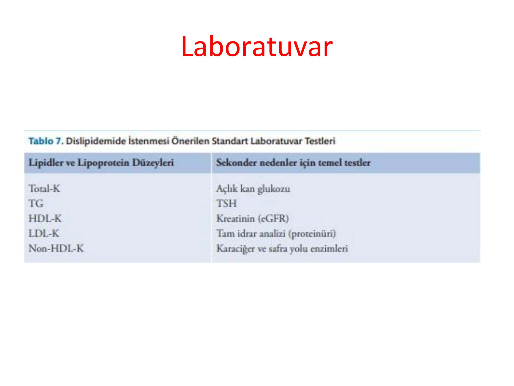

### Tablo 6. Dislipidemiye Neden Olan Hastalıklar ve İlaçlar

| Neden | LDL-K ↑ | TG ↑, HDL-K ↓ |
|---|---|---|
| **Hipotiroidizm** | + | + |
| **Nefrotik sendrom** | + | -- |
| **Kronik böbrek hastalığı** | -- | + |
| **Kolestatik hastalıklar** | + | -- |
| **Obezite** | -- | + |
| **Gebelik** | -- | + |
| **Tip 2 Diyabet** | -- | + |
| **Aşırı alkol tüketimi** | -- | + |
| **Anabolik steroidler** | + | -- |
| **Kortikosteroidler** | -- | + |
| **Oral kontraseptifler, östrojenler** | -- | + |
| **HIV tedavisi (proteaz inhibitörleri)** | + | + |
| **Tiyazid diüretikler, beta blokerler** | -- | + |

> **⚠️ ÖNEMLİ:** Her yeni tanı dislipidemi hastasında sekonder nedenler **mutlaka dışlanmalıdır**. Sekonder nedeni tedavi etmek lipid profilini normale döndürebilir ve gereksiz statin kullanımını önler.

---

## LABORATUVAR

### Tablo 7. Dislipidemide İstenmesi Önerilen Standart Laboratuvar Testleri

| Lipid ve Lipoprotein Düzeyleri | Sekonder Nedenler İçin Temel Testler |
|---|---|
| Total-K | Açlık kan glukozu |
| TG | TSH |
| HDL-K | Kreatinin (eGFR) |
| LDL-K | Tam idrar analizi (proteinüri) |
| Non-HDL-K | Karaciğer ve safra yolu enzimleri |

### LDL-K Hesaplanması (Friedewald Formülü)

> **Formül:** **LDL-K = Total-K -- HDL-K -- (TG / 5)** (mg/dL birimi ile)

**⚠️ Kısıtlamalar:**

* **TG ≥ 400 mg/dL** ise formül güvenilir değildir; **direkt LDL-K** veya **non-HDL-K** kullanılmalıdır.
* Tip III hiperlipoproteinemi (disbetalipoproteinemi) olgularında formül yanıltıcıdır.
* Non-HDL-K hesabı formülsüz yapılabilir: **Non-HDL-K = Total-K -- HDL-K**.

---

## STANDART DIŞI ÖLÇÜMLER

Rutin olmayan ancak seçilmiş hastalarda değerli bilgi veren testler:

* **ApoB** -- Tüm aterojenik partiküllerin (VLDL + IDL + LDL + Lp(a)) sayısal yansıması. LDL-K yanıltıcı olduğunda (HTG, düşük LDL) tercih edilir.
* **Apo A-1** -- HDL partiküllerinin fonksiyonel göstergesi.
* **Apo B / Apo A-1, Total-K / HDL-K ve non-HDL-K / HDL-K oranları** -- Aterojenik risk göstergeleridir.
* **Lipoprotein(a) [Lp(a)]** -- Genetik kökenli, bağımsız kardiyovasküler risk faktörüdür. Değer > 50 mg/dL veya > 125 nmol/L ise yüksek risk; hayat boyu en az bir kere ölçülmesi önerilir.
* **Lipoprotein partikül boyutu** -- Küçük, yoğun LDL partikülleri daha aterojeniktir.

---

## LİPİD PROFİLİ İÇİN KAN ALMA ZAMANI

* Lipid profilinin **açlıkta** ölçülmesi klasik öneridir.
* Ancak güncel kılavuzlar **tokluk (non-açlık)** ölçümün de büyük oranda kabul edilebilir olduğunu belirtmektedir.
* Olağan yağ içeriğine sahip bir yemek sonrasında:
  - TG düzeyleri **en fazla %20 artar**
  - LDL-K düzeyleri yaklaşık **%10 azalır**
  - **Total-K, HDL-K, non-HDL-K ve Apo B-100 düzeyleri değişmez**

> **⚠️ Doğrulama kuralı:** Tokluk TG > 440 mg/dL ölçüldüyse sonucun **açlık ölçümüyle doğrulanması** uygun olur.

---

## TOPLAM KARDİYOVASKÜLER RİSK VE SCORE

> **Tanım:** Toplam kardiyovasküler risk, bir yetişkinin yakın gelecekte **aterosklerotik kardiyovasküler olay (ASKVO)** yaşama olasılığıdır.

**Risk faktörleri:**

* **Önlenemeyenler:** Yaş, cinsiyet, genetik yatkınlık
* **Önlenebilir:** Sigara, dislipidemi, hipertansiyon, obezite, hareketsiz yaşam, kötü beslenme

Ülkemizde kardiyovasküler risk tahmini için **ESC/EAS kılavuzunda yer alan SCORE modeli** kullanılır. SCORE genellikle **40 yaş üzeri** yetişkinlerde **10 yıllık ölümcül ASKVO riskini** öngörür. Olay (ölümcül + ölümcül olmayan) riskini tahmin etmek için SCORE sonucu **erkeklerde 3**, **kadınlarda 4** ile çarpılır.

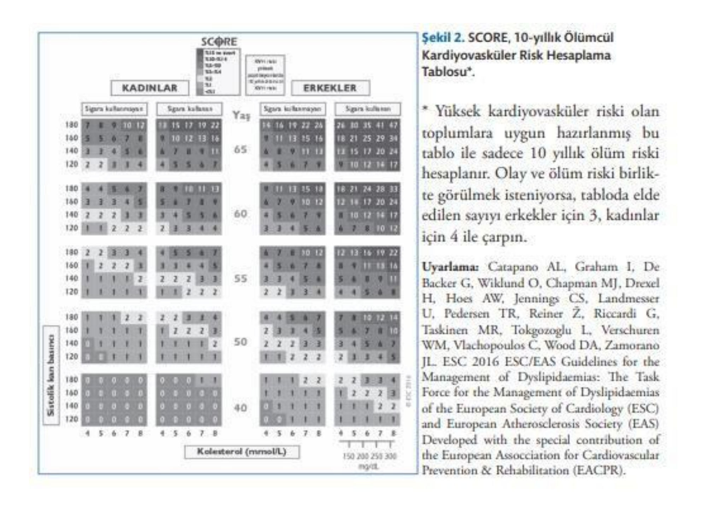

> **Şema yorumu:** SCORE tablosu **cinsiyet, yaş, sigara kullanımı, sistolik kan basıncı ve total kolesterol** değerlerine göre hastayı bir renk skalasına yerleştirir. Yeşil/açık tonlar düşük riski, koyu kırmızı/siyah tonlar çok yüksek riski gösterir. Tablo sadece **ölüm riskini** hesaplar; olay riski için erkekte 3, kadında 4 ile çarpılır. Türkiye yüksek-riskli ülkeler kategorisine dahildir.

---

## SCORE RİSK KATEGORİLERİ

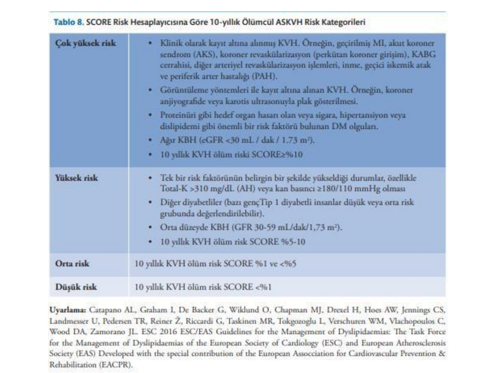

### Tablo 8. SCORE Risk Kategorileri

| Risk Kategorisi | Tanım |
|---|---|
| **Çok Yüksek Risk** | 
• Kayıt altına alınmış KVH (geçirilmiş Mİ, AKS, perkütan/cerrahi koroner revaskülarizasyon, inme, GİA, PAH)

• Görüntülemede (koroner anjiyografi veya karotis USG) gösterilmiş KVH

• Proteinüri veya hedef organ hasarı olan, ya da sigara/HT/dislipidemi gibi risk faktörü olan **DM olguları**

• **Ağır KBH** (eGFR < 30 mL/dk/1.73 m²)

• **10 yıllık KVH ölüm riski SCORE ≥ %10**
 |
| **Yüksek Risk** | 
• Tek bir risk faktörünün belirgin şekilde yükseldiği durumlar, özellikle Total-K > 310 mg/dL veya kan basıncı ≥ 180/110 mmHg

• Diğer diyabetliler (genç Tip 1 DM'lu olgular düşük/orta risk grubunda değerlendirilebilir)

• **Orta düzeyde KBH** (GFR 30-59 mL/dk/1.73 m²)

• **10 yıllık KVH ölüm riski SCORE %5-10**
 |
| **Orta Risk** | 10 yıllık KVH ölüm riski SCORE %1 ve < %5 |
| **Düşük Risk** | 10 yıllık KVH ölüm riski SCORE < %1 |

---

## TEDAVİ KARARI

### Dislipidemili Hastaya Genel Yaklaşım Algoritması

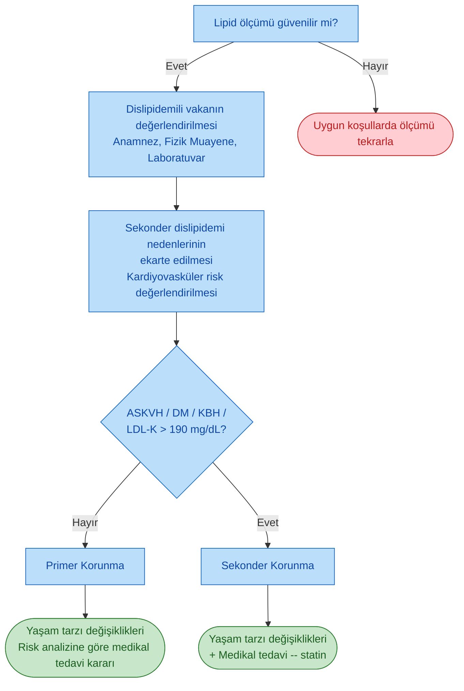

### Sekonder Korunma

* Dislipidemi tedavisinde kararı belirleyen **en temel faktör ASKVH bulunup bulunmadığıdır**.
* **ASKVH tanısı almış her dislipidemi olgusu statin tedavisini hak eder.**
* ASKVH risk eşdeğeri olan **DM** ve **kronik böbrek hastalığı** olguları da statin tedavisini hak eder.

### Primer Korunma

* ASKVH, DM, KBH veya çok yüksek LDL-K (> 190 mg/dL) bulunmayan olgularda tıbbi tedavi kararı **SCORE tablosunda hesaplanan risk puanına** göre verilir.
* Toplam kardiyovasküler risk ne kadar fazla ise ilaç tedavisi o kadar gereklidir.
* Hasta LDL-K düzeyi ve total KV risk belirlendikten sonra **Tablo 9'daki kategoriye** yerleştirilir.

### Tablo 9. SCORE İle Hesaplanan 10 Yıllık KV Ölüm Riskine Göre LDL-K Düzeyine Dayalı Tedavi Önerileri

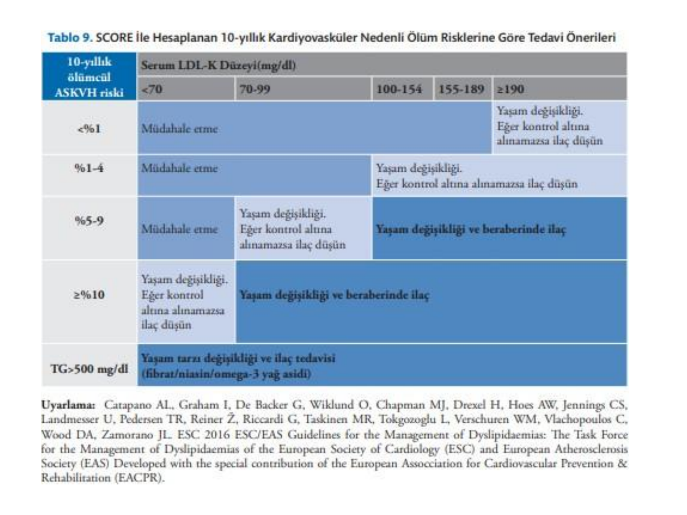

| 10-yıllık ölümcül ASKVH riski | LDL-K < 70 | LDL-K 70-99 | LDL-K 100-154 | LDL-K 155-189 | LDL-K ≥ 190 |
|---|---|---|---|---|---|
| **< %1** | Müdahale etme | Müdahale etme | Yaşam değişikliği | Yaşam değişikliği | Yaşam değişikliği; kontrol altına alınamazsa ilaç düşün |
| **%1-4** | Müdahale etme | Müdahale etme | Yaşam değişikliği | Yaşam değişikliği | Yaşam değişikliği; kontrol altına alınamazsa ilaç düşün |
| **%5-9** | Müdahale etme | Yaşam değişikliği; kontrol altına alınamazsa ilaç düşün | **Yaşam değişikliği ve beraberinde ilaç** | **Yaşam değişikliği ve beraberinde ilaç** | **Yaşam değişikliği ve beraberinde ilaç** |
| **≥ %10** | Yaşam değişikliği; kontrol altına alınamazsa ilaç düşün | **Yaşam değişikliği ve beraberinde ilaç** | **Yaşam değişikliği ve beraberinde ilaç** | **Yaşam değişikliği ve beraberinde ilaç** | **Yaşam değişikliği ve beraberinde ilaç** |
| **TG > 500 mg/dL** | Yaşam tarzı değişikliği ve ilaç tedavisi (fibrat/niasin/omega-3 yağ asidi) | | | | |

> **⚠️ ÖNEMLİ TEDAVİ ÖNCELİĞİ:**
>
> 1. Dislipidemi tedavisinde öncelik **ASKVH önlemektir**; dolayısıyla **LDL-K düşürücü yaklaşımlar önceliklidir**.
> 2. Ancak **TG > 500 mg/dL** ise **pankreatit atağını önlemek** öncelikli hedef haline gelir ve TG düşürücü tedavi öne geçer.

---

## DİSLİPİDEMİ TEDAVİ HEDEFLERİ

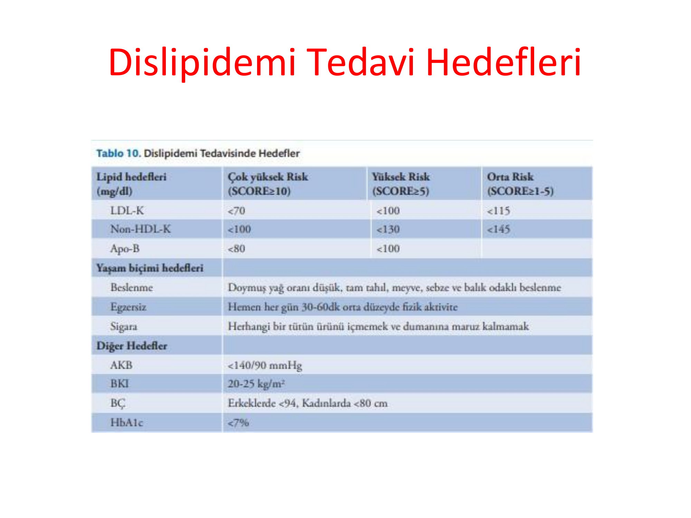

### Tablo 10. Dislipidemi Tedavisinde Hedefler

| Lipid Hedefleri (mg/dL) | Çok Yüksek Risk (SCORE ≥ 10) | Yüksek Risk (SCORE ≥ 5) | Orta Risk (SCORE 1-5) |
|---|---|---|---|
| **LDL-K** | < 70 | < 100 | < 115 |
| **Non-HDL-K** | < 100 | < 130 | < 145 |
| **Apo-B** | < 80 | < 100 | -- |

> **Not:** ESC 2019 güncellemesinde **çok yüksek risk** için hedef LDL-K **< 55 mg/dL** (hatta tekrarlayan olayda < 40 mg/dL), **yüksek risk** için **< 70 mg/dL** olarak güncellenmiştir.

### Yaşam Biçimi Hedefleri

| Parametre | Hedef |
|---|---|
| **Beslenme** | Doymuş yağ oranı düşük, tam tahıl, meyve, sebze ve balık odaklı beslenme |
| **Egzersiz** | Hemen her gün 30-60 dakika orta düzey fizik aktivite |
| **Sigara** | Herhangi bir tütün ürününü kullanmamak ve duman maruziyetinden kaçınmak |
| **AKB** | < 140/90 mmHg |
| **BKİ** | 20-25 kg/m² |
| **Bel çevresi** | Erkek < 94 cm, Kadın < 80 cm |
| **HbA1c** (diyabetliler) | < %7 |

---

## İLAÇ DIŞI TEDAVİ YAKLAŞIMLARI

Dislipidemide yaşam tarzı değişikliği her hastada, ilaç kullanılsın veya kullanılmasın, tedavinin temelini oluşturur.

* **Kalori kısıtlaması** -- Özellikle kilolu/obez hastalarda
* **Kilo kontrolü** -- Fazla kilonun her 1 kg'ının verilmesi TG ve LDL'de belirgin düşüş sağlar
* **Aerobik egzersiz** -- Haftada en az 150 dakika orta şiddetli aktivite; HDL'yi yükseltir, TG'yi düşürür
* **Sigara ve alkol bırakılması** -- Aşırı alkol tüketimi özellikle TG yüksekliğinin önde gelen nedenidir
* **Beslenme** -- **Akdeniz tipi diyet** (zeytinyağı, balık, sebze, meyve, tam tahıl, kuruyemiş); doymuş yağ ve trans yağ kısıtlaması; omega-3 zengin gıdalar

---

## STATİNLER

### Etki Mekanizması

* Kolesterol sentezinde hız kısıtlayıcı basamak olan **hidroksimetil glutaril koenzim A redüktaz (HMG-CoA redüktaz)** enzimini inhibe ederler.
* İntrahepatik kolesterol düzeyi azalınca hepatosit yüzeyindeki **LDL reseptörlerinde (LDLR) upregülasyon** olur.
* Böylece plazma LDL-K ve TG'den zengin tüm **ApoB içeren lipoprotein** düzeylerinde azalma sağlanır.

### Endikasyonlar

* **ASKVH'ye bağlı olay ve ölümlerden korunmada** etkinliği kanıtlanmış ajanlardır.
* Metaanalizlerde **LDL-K'deki her 40 mg/dL azalmanın, majör KV olaylarda %20 relatif risk azalması** sağladığı gösterilmiştir.
* LDL-K yüksekliği ile seyreden tüm dislipidemilerde kullanılır.
* Özellikle vasküler hastalığı ve çok yüksek LDL-K düzeyi olan **aile hiperlipidemisi (AH)** ve **kombine hiperlipidemi** olgularında, ASKVH sekonder korunmasında **ilk tercih** edilir.
* **Homozigot AH** olgularında LDLR'nin tam yokluğu nedeniyle etkinlikleri düşüktür.

### Statin Grubu İlaçların Özellikleri

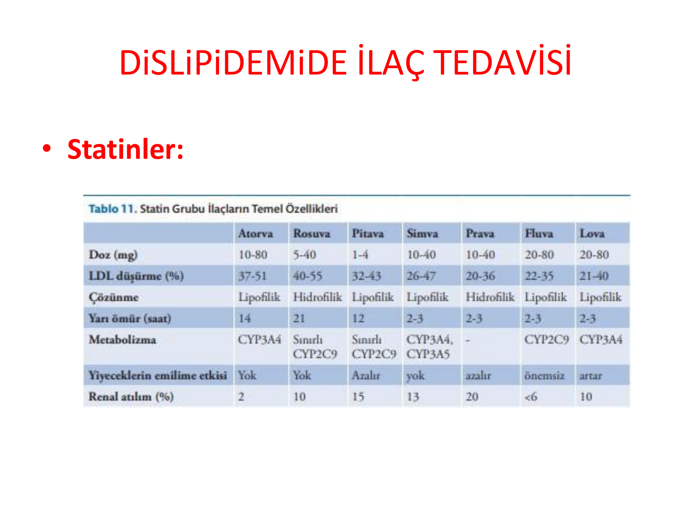

### Tablo 11. Statin Grubu İlaçların Temel Özellikleri

| Özellik | Atorva | Rosuva | Pita | Simva | Prava | Fluva | Lova |
|---|---|---|---|---|---|---|---|
| **Doz (mg)** | 10-80 | 5-40 | 1-4 | 10-40 | 10-40 | 20-80 | 20-80 |
| **LDL düşürme (%)** | 37-51 | 40-55 | 32-43 | 26-47 | 20-36 | 22-35 | 21-40 |
| **Çözünme** | Lipofilik | Hidrofilik | Lipofilik | Lipofilik | Hidrofilik | Lipofilik | Lipofilik |
| **Yarı ömür (saat)** | 14 | 21 | 12 | 2-3 | 2-3 | 2-3 | 2-3 |
| **Metabolizma** | CYP3A4 | Sınırlı CYP2C9 | Sınırlı CYP2C9 | CYP3A4, CYP3A5 | -- | CYP2C9 | CYP3A4 |
| **Yiyeceklerin emilim etkisi** | Yok | Yok | Azalır | Yok | Azalır | Önemsiz | Artar |
| **Renal atılım (%)** | 2 | 10 | 15 | 13 | 20 | < 6 | 10 |

### Statin Yoğunluğu

| Yoğunluk | LDL-K Düşüşü | Ajanlar |
|---|---|---|
| **Yüksek yoğunluklu** | ≥ %50 | Atorvastatin 40-80 mg, Rosuvastatin 20-40 mg |
| **Orta yoğunluklu** | %30-50 | Atorvastatin 10-20 mg, Rosuvastatin 5-10 mg, Simvastatin 20-40 mg, Pitavastatin 2-4 mg |
| **Düşük yoğunluklu** | < %30 | Simvastatin 10 mg, Pravastatin 10-20 mg, Fluvastatin 20-40 mg, Lovastatin 20 mg |

### Yan Etkiler

* Genellikle iyi tolere edilir; diğer lipid düşürücü ajanlara kıyasla yan etkileri daha düşüktür.
* **En sık yan etkiler:** Baş ağrısı, karın ağrısı, konstipasyon, bulantı, iştahsızlık, diyare gibi **gastrointestinal** ve **musküler** şikayetler.
* **Ciddi hepatik yan etki oranı çok düşüktür.**
* **En önemli yan etkisi kas ağrılarıdır** (miyalji, miyopati, nadiren rabdomiyoliz).
* Lipofilik statinlerin musküler yan etki oranının hidrofilik olanlardan daha yüksek olduğu düşünülse de, lipofilik bir statin olan **fluvastatinin musküler yan etkisi belirgin olarak daha azdır**.
* **İlaç-indüklü diyabet:** Özellikle yüksek yoğunluklu statinlerle hafif artış bildirilmiştir; kardiyovasküler fayda diyabet riskini aşar.

---

## STATİN İNTOLERANSI YÖNETİMİ

### Statin Kaynaklı Kas Yan Etkileri Yaklaşım Şeması

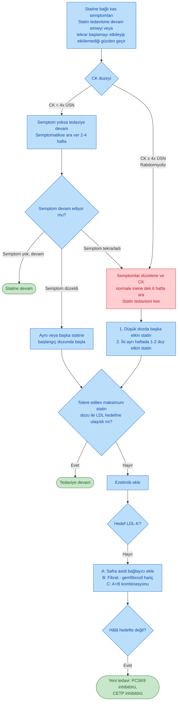

### Tablo 14. Statin Tedavisi Verilen Hastanın Takibinde Dikkat Edilecek Noktalar

**Lipid testleri ne sıklıkla yapılmalıdır?**

* Akut koroner sendrom ve çok yüksek riskli hastalar gibi hızlı tedavi başlanması gereken durumlar haricinde **lipid düzeylerini tedaviye başlamadan 1-2 hafta arayla** olmak üzere en az 2 ayrı ölçüm yapılmalıdır.

**Statin başlandıktan sonra lipid profiline ne sıklıkta bakılmalıdır?**

* Tedavi başlangıcından **8 (± 4) hafta sonra**.
* Hedef seviyeye ulaşıncaya kadar doz değişimlerinde **8 (± 4) hafta sonra**.

**Hasta hedef değerlere veya optimal lipid seviyelerine ulaştıktan sonra lipid düzeyi ne sıklıkla bakılmalıdır?**

* **Yıllık** olarak (uyum problemi veya daha sık kontrol gerektiren özel bir durum yoksa).

**Karaciğer ve kas enzimlerinin takibi**

* **Tedavi öncesi**
* Tedavi başlangıcı veya doz değişiminden **takiben 8-12 hafta sonra**
* Bu sayıdan sonra stabil hastalar için tedavi dozu değişmediği sürece rutin ALT kontrolü gerek yoktur.

**Statin alan hastada karaciğer enzimleri yükselirse ne yapılmalı?**

* **ALT normalin üst sınırının < 3 katı yükselirse:** Tedaviye devam edin ve 4-6 hafta ara ile karaciğer enzimleri kontrol edin.
* **ALT normalin üst sınırının ≥ 3 katı yükselirse:** Lipid düşürücü tedaviyi kesin veya dozunu azaltın, 4-6 hafta sonra karaciğer enzimlerini kontrol edin. ALT normal değerlere gerildiğinde dikkatli bir şekilde yeniden tedavi başlaması düşünülebilir. ALT hâlâ yüksekse enzim yüksekliği yapabilecek diğer etiyolojileri araştırın.

**Statin alan hastada CK ne sıklıkta bakılmalıdır?**

* **Tedavi öncesi:** Tedaviye başlamadan önce bazal CK normalin üst sınırının 4 kat veya daha fazla yüksek ise ilaca başlamayın ve tekrar CK bakın.
* **Takip:** Rutin CK takibi gerekli değildir. Miyalji gelişirse CK bakın.
* İleri yaş hastalar, eşlik eden etkileşebilecek tedavi alanlar, çoklu ilaç kullananlar, karaciğer veya renal hastalığı olanlar, sportif kişiler gibi riskli hastalarda miyopati ve CK yüksekliklerine dikkat edilmelidir.

---

## EZETİMİB

### Etki Mekanizması

* **Kolesterol emilim inhibitörü** olup yağda eriyen vitaminlerin emilimini bozmaksızın diyetle alınan ve biliyer kolesterolün intestinal emilimini bloke eder.
* İnce bağırsak fırçamsı yüzeyinde ve karaciğerde kolesterolün hücre içine alımından sorumlu **Niemann-Pick C1-like protein (NPC1L1)** ekspresyonunu inhibe ederek kolesterol emilimini bloke eder.
* Kolesterol emiliminin azalması hepatik kolesterol düzeyini azaltır, LDL-R upregüle olur ve plazma LDL-K klirensi artar.

### Endikasyonlar

* **Maksimum tolere edilen statin tedavisi ile hedef LDL-K'ya ulaşılamayan** hastalarda
* **Statin intoleransı ve/veya kontrendikasyonu** bulunan hastalarda (monoterapi veya kombinasyon)

### Etkinlik

* **Monoterapi:** LDL-K'yı %10-18, ApoB'yi %11-16 azaltır.
* **Statin ile kombinasyon:** Statinin etkisine ilave olarak LDL-K'da **%25 ek düşme** sağlar.

### Doz

* 10 mg/gün, tek doz, aç veya tok alınabilir.

---

## SAFRA ASİDİ BAĞLAYICILAR

### Etki Mekanizması

* İnce bağırsakta safra asitlerine bağlanarak safra asitlerinin enterohepatik sirkülasyonunu **%90 oranında inhibe ederler**.
* İntrahepatik kolesterol havuzunun azalması, kolesterolden safra asidi sentezleyen **CYP7A1** enzimini indükler.
* **ApoB/E içeren LDL-R** sentezi artar; LDL-K klirensi artarak plazma LDL-K düşer.
* HDL-K düzeylerinde minimal artış sağlarlar.

### İlaçlar ve Etkinlik

| İlaç | Doz | Etki |
|---|---|---|
| **Kolestiramin** | 24 mg/gün | LDL-K'da %18-25 düşme, HDL-K'da %3-5 artış |
| **Kolestipol** | 20 mg/gün | Benzer |
| **Kolesevelam** | 4,5 mg/gün | Benzer, daha az GİS yan etki |

### Endikasyonlar

* Maksimum tolere edilen statin tedavisi ile hedef LDL-K'ya ulaşılamayan hastalarda **statin ile kombine**.
* Statin kontrendikasyonu veya intoleransı olan hastalarda **monoterapi**.
* **Kolesevelamın gebelikte kullanımı güvenlidir** (sistemik emilmez).

### Yan Etkiler

* **Gastrointestinal:** Konstipasyon, karın ağrısı, bulantı, şişkinlik, dolgunluk hissi.
* **Yağda eriyen vitamin eksikliği** (A, D, E, K).
* Birçok ilacın emilimini bozar: **Amiodaron, digoksin, warfarin, tiyazidler, beta blokerler, levotiroksin.** Birlikte kullanılan ilaçlar **4 saat önce veya 1 saat sonra** alınmalıdır.
* **TG düzeylerinde artış** yapabilirler: **Serum TG > 300 mg/dL olan hastalarda kullanılmamalı**; tedavi sırasında TG > 400 mg/dL olursa kesilmelidir.

---

## FİBRATLAR

### Etki Mekanizması

* Nükleer transkripsiyon faktörü **peroksizom proliferator aktive edici reseptör-α (PPAR-α)** agonistidir.
* PPAR-α aktivasyonu lipid ve lipoprotein metabolizmasındaki çeşitli genleri (LPL, ApoA-I, ApoA-II, ApoC-III) modüle eder.

### Endikasyonlar

* **TG > 500 mg/dL (orta/şiddetli HTG):** Pankreatit riskini önlemek için
* **TG = 150-500 mg/dL (hafif HTG):** Uygun seçilmiş hastalarda ASKVH riskini azaltmak için

### Etkinlik

* **Açlık ve tokluk TG ile artık (remnant) partiküllerde %20-35 düşme**
* **HDL-K'da orta düzey (%6-18) artış**
* LDL-K konsantrasyonunu belirgin değiştirmez; daha aterojenik olan **küçük yoğun LDL miktarını azaltır**.
* Kullanılan moleküller: **Fenofibrat ve gemfibrozil**. Fenofibrat Total-K ve LDL-K'yı da bir miktar düşürür ve fibrinojeni azaltır.

### Klinik Çalışmalar

| Çalışma | Hasta Grubu | Sonuç |
|---|---|---|
| **HHS (Helsinki Heart Study)** | Orta yaşlı erkekler, primer korunma | Gemfibrozil KV sonlanımları plaseboya göre **anlamlı azalttı** |
| **VA-HIT** | KAH olan erkekler, sekonder korunma | Gemfibrozil ile KV olay sayısında **anlamlı azalma** |
| **FIELD** | Tip 2 DM, bir kısmı ASKVH'li | Fenofibrat primer sonlanımda **fayda sağlamadı**; posthoc analizde yüksek TG/düşük HDL alt grubunda ölümcül olmayan Mİ azaldı |
| **ACCORD** | Statin alan Tip 2 DM | Fenofibrat statine eklenince **ek fayda göstermedi**; yüksek TG/düşük HDL alt grubunda eğilim pozitif |

> **⚠️ Güncel Değerlendirme:** Fibratların ASKVH bağlı olay ve ölümleri azaltma yönündeki etkinliğinin **statinler kadar belirgin olarak ortaya konmadığı** söylenmelidir. Ancak güvenlik profili nedeniyle, LDL-K'sı hedefte olup **yüksek TG/düşük HDL** görülen yüksek riskli hastalarda tedaviye eklenebilir.

### Yan Etkiler

* Fibratlar genellikle iyi tolere edilir.
* Gastrointestinal rahatsızlık (%5) ve deri döküntüleri (%2) nispeten daha sık bildirilmiştir.
* **En iyi bilinen yan etkiler: miyopati, karaciğer enzim yüksekliği ve safra kesesi taşı.**
* **Fibratların miyopati yapma riski statinlerden daha fazladır.**
* Miyopati riski **KBH'li hastalarda** daha yüksektir.
* **Gemfibrozil statinlerle kombinasyonda miyopati riskini belirgin artırır** ve **statin + gemfibrozil kombinasyonundan kaçınılmalıdır**. Fenofibrat farklı farmakokinetik yolak kullandığı için statin ile kombinasyonda güvenlidir.

> **📌 KLİNİK İPUCU:** Hipertrigliseridemi ve LDL-K yüksekliği bir arada ise statin + fenofibrat kombinasyonu düşünülebilir; gemfibrozil asla statinle kombine edilmez.

### Hipertrigliseridemi ve Rezidüel Risk

Hipertrigliseridemi ve kalıntı (remnant) kolesterol, LDL-K'dan bağımsız olarak **ilave rezidüel bir kardiyovasküler risk** yaratır. Kılavuzlar, riskli hastalarda LDL'ye ek olarak **non-HDL parametresinin (yani TG seviyelerinin)** de kontrol altına alınmasını önerir.

---

## NİKOTİNİK ASİT (NİASİN)

* **HDL-K'yı artırıp LDL-K ve TG'yi etkili biçimde düşüren kuvvetli bir ajandır.**
* **Lp(a) düzeylerini azaltabilen nadir ilaçlardandır.**
* Özellikle **hiperkolesterolemi + düşük HDL-K** olan kombine dislipidemide etkilidir.

### Etkinlik (2 g/gün)

* HDL-K'yı **%25'e kadar yükseltir**
* LDL-K'yı **%15-18 azaltır**
* TG'yi **%20-40 azaltır**

### Etki Mekanizması

* Niasin karaciğere yağ asidi akışını ve karaciğerden VLDL sekresyonunu azaltır.
* Adipoz dokuda **hormon-duyarlı lipaz** etkisiyle yağ mobilizasyonunu azaltır.
* Karaciğerde **diasilgliserol transferaz-2 (DGAT2)** enzimini inhibe ederek VLDL partikül sekresyonunu azaltır.
* Hem IDL hem LDL partikülleri azalır.
* Karaciğerde **ApoA-I** üretimini uyararak HDL-K ve ApoA-I düzeylerini yükseltir.

### Kullanım

* Statin tedavisine rağmen LDL-K'sı düşmeyen hastalarda veya TG yüksekliği tedavisinde başarısız olunduğunda ilave tedavi olarak önerilebilir.

### Yan Etkiler

* **Hiperglisemi** (DM olgularında dikkat)
* **Ateş basması, yüz kızarması (flushing)** -- Aspirinle veya yavaş salınımlı formla azaltılabilir
* **Hiperürisemi** -- Gut alevlenmesine yol açabilir
* **Gastrointestinal yakınmalar**

> **📌 NOT:** Son dönem klinik çalışmalarda (AIM-HIGH, HPS2-THRIVE) statin üzerine eklenen niasinin KV olayları önemli derecede azaltmadığı gösterildiğinden, rutin kullanımı önerilmemektedir.

---

## OMEGA-3 YAĞ ASİTLERİ

* Uzun zincirli omega-3 poliansatüre yağ asitleri **EPA (eikosapentaenoik asit)** ve **DHA (dokosaheksaenoik asit)** HTG tedavisinde kullanılır.
* Günlük **2-4 g dozda** VLDL düzeylerini olumlu yönde değiştirir.
* Omega-3 yağ asitlerinin TG dışındaki lipidler üzerindeki etkileri klinik açıdan önemsizdir.

### Alım Önerileri

* **En sağlıklı yol:** Haftada en az 2 kez **soğuk sularda yetişen yağlı balık** tüketmek (somon, uskumru, sardalya).
* ASKVH tanısı olan bireylerde **günde 1 g EPA+DHA** alınması önerilir.
* HTG tedavisinde fibratlar yeterli kontrolü sağlayamazsa omega-3 yağ asitleri fibratlara güvenle eklenebilir.

### Etkinlik

* 2-4 g/gün dozda TG düzeyleri **doza bağlı olarak %45'e kadar** azalabilir.
* Yüksek TG (> 500 mg/dL) olanlarda veya ASKVH riski ile birlikte TG 200-500 mg/dL olan bireylerde **non-HDL-K'da anlamlı düşme** saptanır.
* Kardiyovasküler sonlanımlar açısından etkinlik tartışmalıdır; 60.000'den fazla olguyu kapsayan bir metaanaliz ASKVH ilişkili olay ve ölümlerde **anlamlı bir yarar saptamamıştır**.
* Ancak **REDUCE-IT** çalışmasında **icosapent ethyl (yüksek doz EPA, 2x2 g/gün)** yüksek KV riskli, TG yüksek olan hastalarda olayları anlamlı azaltmıştır.

### Yan Etkiler

* Uzun dönem güvenilirlik çalışmaları çocuk ve gebelerde olumlu sonuçlanmıştır.
* **Günde 3 g'dan fazla EPA+DHA** alımında **kanama eğilimi artar**. Aspirin/klopidogrel alan hastalarda dikkatli olunmalıdır.
* Diyetle fazla omega-3 alımı bir çalışmada **prostat kanser riski** ile ilişkilendirilmiştir.
* Bazı çalışmalarda 2 g/gün üzeri omega-3 alımı **Tip 2 DM insidansında hafif artışa** yol açmış; diyabetik dislipidemi metaanalizinde balık yağının kan glukozunu hafif artırdığı ama HbA1c'yi etkilemediği bildirilmiştir.

---

## PCSK9 İNHİBİTÖRLERİ

### Etki Mekanizması

* **PCSK9 (Proprotein Convertase Subtilisin/Kexin Type 9)**, karaciğerde üretilen ve vücudun kolesterol ihtiyacını regüle eden bir proteazdır.
* Hepatosit yüzeyindeki **LDL-R'ye bağlanır**; PCSK9-LDLR kompleksi endositoz ile hücre içine alındığında LDL-R **lizozomlarda yıkılır**.
* Böylece periferde kolesterol ihtiyacı olduğunda artan PCSK9 düzeyleri, LDL-R sayısını azaltıp dolaşımdaki kolesterolü artırır.
* **PCSK9 monoklonal antikorları** PCSK9'u bağlayarak LDL-R'nin yıkımını engeller; LDL-R yüzeyde artar, plazma LDL-K çok belirgin azalır (~%50-60).

### Klinik Kullanım

| Ajan | Uygulama |
|---|---|
| **Alirocumab** | SC, 75 mg veya 150 mg, **iki haftada bir** |
| **Evolocumab** | SC, 140 mg iki haftada bir veya **420 mg ayda bir** |
| **İnklisiran** | SC, siRNA; başlangıçta, 3. ayda, sonra 6 ayda bir |

* Her iki preparatın da **kardiyovasküler olayları önleme açısından etkin** olduğu gösterilmiştir (FOURIER -- evolocumab; ODYSSEY OUTCOMES -- alirocumab).
* Başlangıç LDL-K'sı ~90 mg/dL olan yüksek riskli hastalarda 2,5 yıllık takipte LDL-K ~50 mg/dL'ye inmiş, majör KV olay riski yaklaşık **%15 azalmıştır**.

### Endikasyonlar

* Maksimum doz statin + ezetimib ile hedef LDL-K'ya ulaşılamayan **ASKVH mevcut hastalarda**
* **Statin intoleransı** olan olgularda monoterapi
* **Homozigot ailesel hiperkolesterolemide** yalnız **evolocumab** ruhsatlıdır.

### Yan Etkiler

* **En sık yan etki: Enjeksiyon bölgesinde yanma ve ağrı.**
* Plaseboya göre farklı sistemik yan etki gösterilmemiştir.
* **Maliyet etkinliği** ilacın ülkedeki maliyeti, hasta bakım ücretleri ve kullanıldığı risk grubuyla ilişkilidir. Bazı analizler maliyet etkin bulmazken, diğerleri yüksek riskli kişilerde maliyet etkin olabileceğini göstermektedir.

---

## AFEREZ TEDAVİSİ

Dislipidemide aferez kullanımını gerektiren iki önemli endikasyon bulunur:

1. **Ailesel hiperkolesterolemi (AH)** -- özellikle homozigot formda
2. **Hipertrigliseridemiye bağlı akut pankreatit (HBAP)**

### LDL Aferezi

* Tıbbi tedaviye (maksimum doz statin + ezetimib ± PCSK9) rağmen hedef LDL-K'ya ulaşılamayan **dirençli AH** olgularında veya **statin intoleransı** olan AH olgularında önemli bir seçenektir.
* LDL-K düzeyini tek seansta belirgin düşürür; genellikle 1-2 haftada bir tekrarlanır.

### Hipertrigliseridemide Plazmaferez

* Hipertrigliseridemi ile akut pankreatit ve ASKVH arasındaki ilişki giderek güçlenmektedir.
* **TG > 1000 mg/dL** olduğunda akut pankreatit riski artar.
* **HBAP**, diğer sebeplere bağlı pankreatitlerden **daha ciddidir** ve komplikasyon oranı daha yüksektir.
* **Standart tedaviye cevap vermeyen HBAP** olgularında plazmaferez son tedavi seçeneği olarak ele alınmalıdır.
* HBAP atağı sırasında etkin tedaviye rağmen TG ≥ 1000 mg/dL seyreden dirençli olgularda plazmaferez tedavisi yararlı olabilir.

---

## ÖZEL DURUMLAR VE VAKA ÖRNEKLERİ

### Gebelikte Dislipidemi

* **Statinler gebelikte kontrendikedir** (FDA kategori X).
* **Fibratlar, niasin, PCSK9 inhibitörleri** gebelikte önerilmez.
* **Kolesevelam (safra asidi bağlayıcı)** sistemik emilmediği için gebelikte kullanılabilir.
* Şiddetli HTG'de plazmaferez düşünülebilir.
* Laktasyonda da statin kesilmelidir.

### Çocuk ve Adölesanda Dislipidemi

* **Ailesel hiperkolesterolemi** taraması 9-11 yaşta önerilir; aile öyküsü pozitifse daha erken.
* Heterozigot AH'de **10 yaş sonrası** statin başlanabilir.
* Homozigot AH tanısı aldığında erken statin + LDL aferezi + gerekirse PCSK9 (evolocumab) + lomitapid.

### Kronik Böbrek Hastalığında Dislipidemi

* KBH ASKVH risk eşdeğeridir.
* Başlıca değişiklik: **TG ↑, HDL-K ↓**, küçük yoğun LDL artışı.
* Statinler **eGFR 30-60** olduğunda kullanılabilir; eGFR < 30 veya diyalizde **atorvastatin veya fluvastatin** (renal atılımı düşük) tercih edilir.
* **Gemfibrozil KBH'de miyopati riski nedeniyle önerilmez**; fenofibrat doz ayarlaması gerektirir.

### Ailesel Hiperkolesterolemi (AH)

* Otozomal dominant kalıtım; başlıca **LDL-R, ApoB veya PCSK9 mutasyonları**.
* **Heterozigot AH** prevalansı ~1/250; LDL-K genellikle 190-400 mg/dL.
* **Homozigot AH** prevalansı ~1/300.000; LDL-K genellikle > 500 mg/dL, erken çocuklukta ASKVH.
* Tanı: **Dutch Lipid Clinic Network kriterleri** (kişi + aile öyküsü + fizik bulgular + LDL-K + genetik test).
* Klinik bulgular: **Tendon ksantomları, arkus kornea (< 45 yaş), ksantelazma, erken KAH öyküsü**.
* Tedavi: Erken başlanan yüksek doz statin, ezetimib, PCSK9 inhibitörleri, gerektiğinde LDL aferezi.

---

**📋 VAKA ÖRNEĞİ 1: Akut Koroner Sendromlu Hasta**

**Hasta:** 58 yaşında erkek, sigara içicisi, HT ve Tip 2 DM öyküsü olan, yeni geçirilmiş Mİ.

**Öykü:** 3 gün önce akut anterior Mİ nedeniyle primer PKG uygulanmış; stent takılmış. Taburculukta lipid profili.

**Laboratuvar:** Total-K 245, LDL-K 170, HDL-K 38, TG 180 mg/dL; HbA1c %7,8; eGFR 72 mL/dk.

**Risk Kategorisi:** **Çok yüksek risk** (kayıtlı ASKVH + Tip 2 DM + hipertansiyon).

**Hedef:** **LDL-K < 55 mg/dL** (ESC 2019), en az **%50 düşme**.

**Tedavi:**

1. **Atorvastatin 80 mg veya rosuvastatin 40 mg** (yüksek yoğunluklu statin) -- hemen başla
2. 4-6 hafta sonra lipid kontrolü; hedef yakalanamazsa **ezetimib 10 mg** ekle
3. Hâlâ hedefte değilse **PCSK9 inhibitörü** (alirocumab/evolocumab)
4. Sigarayı bırakma, Akdeniz diyeti, kardiyak rehabilitasyon
5. HT ve DM hedefleri: AKB < 130/80, HbA1c < %7

**Öğretici Notlar:**

1. ASKVH tanısı olan her hasta statin tedavisini hak eder.
2. Çok yüksek riskte hedef LDL-K < 55 mg/dL; en az %50 düşüş zorunludur.
3. Yüksek yoğunluklu statin ile başlanır; ezetimib ardından, PCSK9 en sonra eklenir.

---

**📋 VAKA ÖRNEĞİ 2: Şiddetli Hipertrigliseridemi ve Akut Pankreatit**

**Hasta:** 42 yaşında kadın, obez (VKİ 34), Tip 2 DM, alkol kullanımı (haftada 3-4 kadeh).

**Öykü:** Son 48 saattir karın ağrısı, bulantı, kusma. Acil servise başvurdu.

**Fizik Muayene:** Nabız 110/dk, TA 100/60 mmHg, solunum 22/dk, sıcaklık 37,8°C; epigastrik hassasiyet, defans +.

**Laboratuvar:** Lipaz 1850 U/L, Amilaz 520 U/L, TG **2400 mg/dL**, Total-K 380, LDL-K hesaplanamıyor (TG yüksek), HDL-K 28, glukoz 290, HbA1c %9,4, Ca 8,5.

**Tanı:** **Hipertrigliseridemiye bağlı akut pankreatit (HBAP)**.

**Tedavi:**

1. **Açlık, IV sıvı, analjezi, antiemetik** -- pankreatit standart tedavisi
2. **İnsülin infüzyonu** (LPL aktivitesini artırır, TG düşürür)
3. TG hâlâ > 1000 mg/dL ve klinik kötüleşirse **plazmaferez** uygulanabilir
4. Akut dönem sonrası: **fenofibrat 160-200 mg/gün** + **omega-3 4 g/gün**
5. Diyabet kontrolü, alkol yasağı, kilo verme, düşük yağlı diyet

**Öğretici Notlar:**

1. TG > 1000 mg/dL şiddetli pankreatit riski oluşturur.
2. TG > 500 mg/dL olduğunda öncelik LDL değil, **pankreatit önlenmesidir**.
3. İnsülin LPL'yi aktive ederek TG'yi hızlıca düşürür.
4. Dirençli HBAP olgularında plazmaferez etkilidir.

---

**📋 VAKA ÖRNEĞİ 3: Heterozigot Ailesel Hiperkolesterolemi**

**Hasta:** 28 yaşında erkek, asemptomatik; rutin check-up'ta lipid yüksekliği saptandı.

**Öykü:** Babası 45 yaşında Mİ geçirmiş; anne ve erkek kardeşte de hiperkolesterolemi var.

**Fizik Muayene:** BMI 24, normotansif. **Aşil tendonunda bilateral yumuşak nodüler şişlikler (tendon ksantomu)**, sağ kornea periferinde **arkus kornea**.

**Laboratuvar:** Total-K 385, **LDL-K 305**, HDL-K 48, TG 130 mg/dL. TSH, karaciğer ve böbrek fonksiyon testleri normal.

**Tanı:** **Heterozigot ailesel hiperkolesterolemi** (Dutch skorlama ≥ 8 puan -- kesin tanı).

**Tedavi:**

1. **Yüksek yoğunluklu statin** -- atorvastatin 80 mg veya rosuvastatin 40 mg
2. 6 hafta sonra hedefe ulaşılamazsa **ezetimib 10 mg** ekle
3. Dirençli ise **PCSK9 inhibitörü** (alirocumab veya evolocumab)
4. Birinci derece yakınların (anne, kardeş, çocuklar) **cascade taraması**
5. Yaşam tarzı: sigara yasağı, Akdeniz diyeti, düzenli egzersiz
6. Hedef **LDL-K < 100 mg/dL** (primer korunma, yüksek risk) veya ASKVH gelişirse **< 70-55 mg/dL**

**Öğretici Notlar:**

1. Ksantom + arkus kornea + aile öyküsü AH için klasik triaddır.
2. AH'de KV risk normalden 10-13 kat yüksektir; erken ve agresif tedavi şarttır.
3. Cascade tarama ile yakınlarda erken tanı mortaliteyi azaltır.
4. Homozigot AH'de statin+ezetimib+PCSK9 yeterli olmazsa LDL aferezi ve **lomitapid**, **evinacumab (ANGPTL3 inhibitörü)** kullanılabilir.

---

**📋 VAKA ÖRNEĞİ 4: Statin İntoleransı**

**Hasta:** 62 yaşında kadın, Tip 2 DM ve hipertansiyon, 1 yıl önce geçirilmiş Mİ nedeniyle rosuvastatin 40 mg kullanıyor.

**Öykü:** Son 2 aydır **her iki uyluk ve kalçada kas ağrısı**, hâlsizlik; günlük aktivitelerinde kısıtlanma.

**Laboratuvar:** **CK 950 U/L (normalin ~3,5 katı)**, ALT 32, AST 28; TSH normal; LDL-K 85 mg/dL (hedef < 55).

**Yaklaşım:**

1. Statin 2-4 hafta **ara verilir**; semptom ve CK takip edilir.
2. Semptomlar düzelir ve CK normale dönerse farklı bir statin (**fluvastatin** veya **pravastatin** -- düşük miyopati riski) **düşük dozda** başlanır.
3. Hâlâ tolere edilemezse **haftada 1-2 doz etkin statin** denenir (rosuvastatin 5-10 mg, 2x/hafta).
4. Tolere edilen maksimum statin ile hedef yakalanamıyorsa **ezetimib** eklenir.
5. Hâlâ hedefe ulaşılamıyorsa **PCSK9 inhibitörü** (evolocumab/alirocumab) veya **inklisiran** eklenir.
6. **CK > 10x ÜSN veya rabdomiyoliz bulgusu** varsa statin kalıcı olarak kesilir.

**Öğretici Notlar:**

1. Statin intoleransı için en az **iki farklı statin**, biri düşük dozda, denenmelidir.
2. Fluvastatin lipofilik olsa da musküler yan etkileri düşük bir statindir.
3. PCSK9 inhibitörleri statin intoleransı olan ASKVH'li hastalarda ruhsatlıdır.
4. CoQ10 desteğinin miyaljiyi azaltmadığı kontrollü çalışmalarda gösterilmiştir.

---

## KAYNAKLAR

1. TEMD Dislipidemi Tanı ve Tedavi Kılavuzu, 2021.
2. Mach F, Baigent C, Catapano AL, et al. 2019 ESC/EAS Guidelines for the management of dyslipidaemias. Eur Heart J 2020;41(1):111-188.
3. Bayram F et al. Prevalence of dyslipidemia and associated risk factors in Turkish adults. J Clin Lipidol 2014;8:206-216.
4. Aguiar C et al. A review of the evidence on reducing macrovascular risk in patients with atherogenic dyslipidaemia. Atherosclerosis Suppl 2015;19:1-12.
5. Catapano AL, Graham I, De Backer G, et al. ESC/EAS Guidelines for the Management of Dyslipidaemias. Atherosclerosis 2016;253:281-344.
