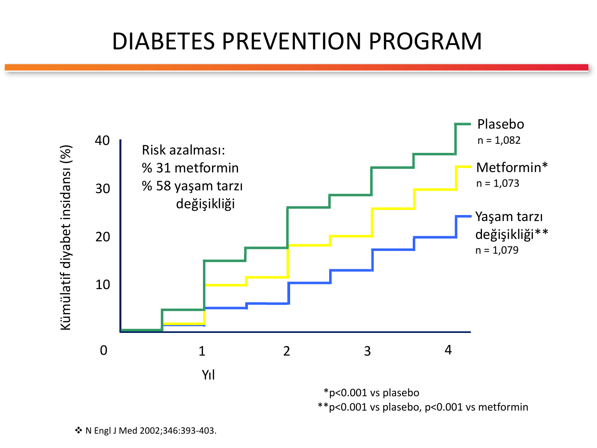
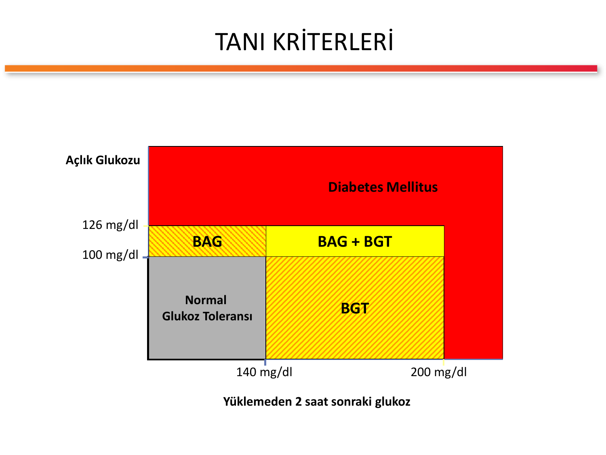
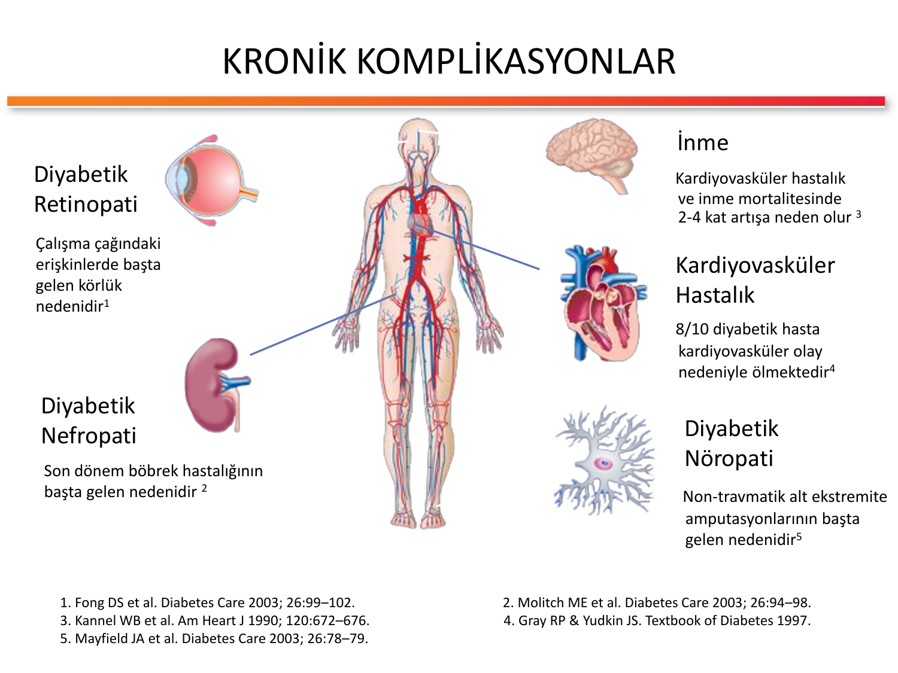
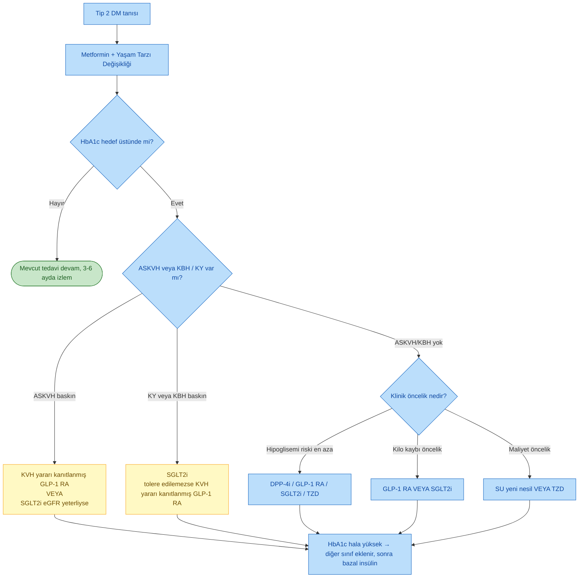
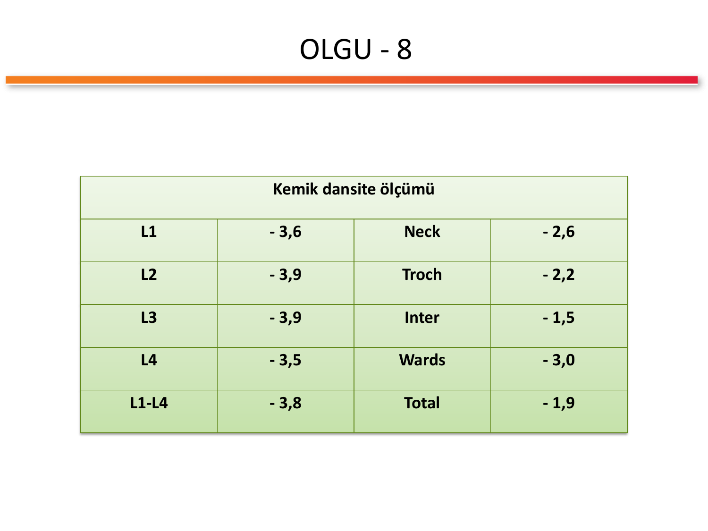

# ENDOKRİN VAKA TARTIŞMASI

**Hazırlayan:** Prof. Dr. Engin Güney
**Bölüm:** Aydın Adnan Menderes Üniversitesi -- Endokrinoloji ve Metabolizma Hastalıkları Bilim Dalı

> **Ders başlığı:** Olgularla Diyabet -- Diabetes Mellitus tanısı, sınıflaması, tedavi yaklaşımı ve komplikasyonlarının vaka bazlı tartışılması.

---

## İÇİNDEKİLER

1. [Giriş ve Ders Akışı](#giriş-ve-ders-akışı)
2. [Vaka 1: Prediyabet (Bozulmuş Glukoz Toleransı)](#vaka-1-prediyabet-bozulmuş-glukoz-toleransı)
3. [Vaka 2: Zayıf Erişkinde Tip 2 DM Sanılan LADA](#vaka-2-zayıf-erişkinde-tip-2-dm-sanılan-lada)
4. [Vaka 3: Gestasyonel Diabetes Mellitus](#vaka-3-gestasyonel-diabetes-mellitus)
5. [Vaka 4: Yeni Tanı Tip 2 DM ve Metabolik Sendrom](#vaka-4-yeni-tanı-tip-2-dm-ve-metabolik-sendrom)
6. [Vaka 5: İyi Kontrollü Tip 2 DM'de Kronik Komplikasyon Taraması](#vaka-5-iyi-kontrollü-tip-2-dmde-kronik-komplikasyon-taraması)
7. [Vaka 6: Obez Tip 2 DM -- GLP-1 RA ile Tedavi](#vaka-6-obez-tip-2-dm----glp-1-ra-ile-tedavi)
8. [Vaka 7: Kronik Komplikasyonlu Tip 2 DM](#vaka-7-kronik-komplikasyonlu-tip-2-dm)
9. [Vaka 8: Gizlenmiş Cushing Sendromu (DM + HT + Osteoporoz)](#vaka-8-gizlenmiş-cushing-sendromu-dm--ht--osteoporoz)
10. [Vaka 9: İleri Komplikasyonlu Tip 2 DM -- Lazer + Doz Titrasyonu](#vaka-9-ileri-komplikasyonlu-tip-2-dm----lazer--doz-titrasyonu)
11. [Tanı Kriterleri -- Özet](#tanı-kriterleri----özet)
12. [Sınıflama -- Tip 1 vs Tip 2 DM](#sınıflama----tip-1-vs-tip-2-dm)
13. [Tedavi Hedefleri](#tedavi-hedefleri)
14. [Yaşam Tarzı Değişikliği](#yaşam-tarzı-değişikliği)
15. [Kronik Komplikasyonlar](#kronik-komplikasyonlar)
16. [ADA 2019 Tip 2 DM İlaç Algoritması](#ada-2019-tip-2-dm-ilaç-algoritması)
17. [A1C Hedefinin Bireyselleştirilmesi](#a1c-hedefinin-bireyselleştirilmesi)

---

## Giriş ve Ders Akışı

Bu ders; 9 farklı klinik olgu üzerinden **Diabetes Mellitus (DM)** yönetiminin temel prensiplerini tartışmak için hazırlanmıştır. Her vaka farklı bir klinik senaryoyu örneklendirir:

| Vaka | Tema |
|---|---|
| 1 | Bozulmuş Glukoz Toleransı (BGT) / prediyabet |
| 2 | Zayıf erişkin hastada otoimmun diyabet (LADA) |
| 3 | Gestasyonel DM |
| 4 | Yeni tanı Tip 2 DM + metabolik sendrom |
| 5 | İyi kontrollü DM'de komplikasyon taraması |
| 6 | Morbid obez Tip 2 DM'de GLP-1 RA tedavisi |
| 7 | Mikro- ve makrovasküler komplikasyonlar |
| 8 | Kötü kontrollü DM altında yatan sekonder neden (Cushing) |
| 9 | İleri retinopatili uzun süreli DM |

> **Öğretici amaç:** DM tanısında ve yönetiminde yalnızca glukoza değil; yaşa, VKİ'ye, otoantikorlara, eşlik eden hastalıklara, ilaç etkileşimlerine ve kronik komplikasyonlara **bütüncül** yaklaşmayı öğrenmek.

---

## VAKA 1: Prediyabet (Bozulmuş Glukoz Toleransı)

**Hasta:** 53 yaşında, kadın
**Öykü:** 6 yıldır hipertansiyon tanısıyla izlenen hastanın kan basıncı genelde normal seyrediyormuş. Rutin kontrollerde 2 ay önce yapılan tetkiklerde kan şekerinin sınırda olduğu saptanmış ve şekerli gıdaları almaması söylenmiş. Kontrol amacıyla polikliniğe başvurmuş.
**Yakınma:** Halsizlik, terleme, çarpıntı

**Özgeçmiş:** Özellik yok
**Soygeçmiş:** Baba Tip 2 DM
**Kullandığı ilaçlar:** Coversyl (perindopril) 5 mg 1x1

**Fizik Muayene:**

* Boy: 1.62 m, VA: 79 kg, **VKİ: 30 kg/m²** (obez)
* KB: 130/85 mmHg
* Sistem muayenelerinde anlamlı bulgu yok

**Laboratuvar:**

| Parametre | Değer | Yorum |
|---|---|---|
| Açlık KŞ | 112 mg/dl | BAG sınırında (100-125) |
| HbA1c | %5.9 | Prediyabet sınırında (5.7-6.4) |
| AST | 49 U/L | Hafif yüksek |
| ALT | 56 U/L | Hafif yüksek (hepatosteatoz?) |
| Kreatinin | 1.0 mg/dl | Normal |
| Total kolesterol | 257 mg/dl | Yüksek |
| HDL | 32 mg/dl | Düşük (K için <50) |
| Trigliserid | 218 mg/dl | Yüksek |
| LDL | 181 mg/dl | Yüksek |

**Tanısal Test -- OGTT (75 gr glukoz):**

* 0. dk: 111 mg/dl
* 120. dk: **178 mg/dl** (140-199 arası → Bozulmuş Glukoz Toleransı)

**Kesin Tanı:** **Bozulmuş Glukoz Toleransı (BGT) + Bozulmuş Açlık Glukozu (BAG) = Prediyabet**; eşlik eden **obezite, hipertansiyon, dislipidemi** (metabolik sendrom).

**Tedavi:**

1. **Yaşam tarzı değişikliği** (birinci basamak)
2. Vücut ağırlığının %5-10 azaltılması
3. Haftada en az 150 dk fiziksel aktivite
4. Akdeniz tipi diyet
5. Yüksek risk grubunda **metformin** (DPP çalışmasına göre risk azalması %31)
6. Dislipidemi için statin, KB için mevcut ACE inhibitörü devamı

### Öğretici Notlar

1. Açlık KŞ 112 mg/dl **tek başına** BAG'ı düşündürür, ancak 2 saatlik glukoz 178 mg/dl olduğu için hastanın **BAG + BGT** tablosu vardır; bu grup Tip 2 DM'ye geçiş riski en yüksek olan alt gruptur.
2. HbA1c %5.9 prediyabet eşiğindedir (5.7-6.4) ve tarama amaçlıdır; tanı için yeterli değildir.
3. **Diabetes Prevention Program (DPP)** çalışması yaşam tarzı değişikliğinin diyabet gelişimini %58, metforminin %31 azalttığını göstermiştir (N Engl J Med 2002;346:393-403).

> **Şema yorumu:** Grafik, 4 yıllık izlem süresince diyabet gelişme oranını göstermektedir. Plasebo (%~40), metformin (%~30), yaşam tarzı değişikliği (%~20). Yaşam tarzı değişikliği, metforminden de daha etkili bulunmuştur.

---

## VAKA 2: Zayıf Erişkinde Tip 2 DM Sanılan LADA

**Hasta:** 53 yaşında (slaytta ayrıca "33 yaş" şeklinde özet de verilmiştir), erkek
**Öykü:** 1 yıl önce çok su içme ve çok idrara çıkma yakınmalarıyla doktora başvurmuş. Yapılan tetkiklerde AKŞ 468 mg/dl bulunup Tip 2 DM tanısı konmuş; diyet + oral antidiyabetik başlanmış. Kan şekeri başlangıçta kontrollüymüş, ancak son dönemde giderek yükselmeye başlamış.
**Yakınma:** Çok su içme, çok idrara çıkma

**Özgeçmiş:** Özellik yok
**Soygeçmiş:** Özellik yok
**Kullandığı ilaçlar:** Diaformin (metformin) 1000 mg 2x1, Diamicron MR (gliklazid) 60 mg 1x1

**Fizik Muayene:**

* Boy: 1.79 m, VA: 71 kg, **VKİ: 22 kg/m²** (normal)
* KB: 130/75 mmHg
* Tiroid bilateral diffüz palpabl

**Laboratuvar:**

| Parametre | Değer |
|---|---|
| Açlık KŞ | 238 mg/dl |
| Tokluk KŞ | 368 mg/dl |
| HbA1c | %8.8 |
| Kreatinin | 0.8 mg/dl |
| ALT | 32 U/L |
| Trigliserid | 131 mg/dl |
| LDL | 108 mg/dl |
| Tiroid fonksiyon testleri | Normal |

**Tanısal Testler:**

* **Anti-GAD: Pozitif (+)**
* **Adacık hücresi antikoru (ICA): Pozitif (+)**

**Kesin Tanı:** **LADA (Latent Autoimmune Diabetes in Adults) / otoimmun erişkin Tip 1 DM**

**Tedavi:**

1. Oral antidiyabetikler kesilir (özellikle sülfonilüre)
2. **Multipl doz insülin** (bazal + bolus) başlanır
3. Karbonhidrat sayımı eğitimi
4. Sık kan şekeri ölçümü

### Öğretici Notlar

1. Zayıf (VKİ 22), aile öyküsü olmayan, başlangıçta yüksek glukozla (AKŞ 468) başvuran ve oral tedaviye sekonder yetersizlik gösteren erişkinde **otoimmun diyabet (LADA)** dışlanmalıdır.
2. LADA tanısı için: başlangıçta Tip 2 DM düşünülmesine rağmen adacık otoantikorlarının pozitif olması (en sık **anti-GAD**), erişkin başlangıç (>30 yaş), genellikle tanıdan 6 ay sonra insüline bağımlılık gelişmesi.
3. Tiroidin bilateral diffüz palpe edilmesi ve tiroid fonksiyonlarının normal olması, otoimmun poliglandüler sendrom açısından dikkate alınmalıdır (otoimmun tiroidit ko-morbiditesi için antitiroid antikorlar istenebilir).

---

## VAKA 3: Gestasyonel Diabetes Mellitus

**Hasta:** 30 yaşında, kadın, 4,5 aylık (18 haftalık) gebe
**Öykü:** Gebelik nedeniyle kadın doğum uzmanınca izleniyormuş. Son zamanlarda çok su içme ve çok idrara çıkma yakınmaları nedeniyle endokrinoloji konsültasyonu istenmiş.
**Yakınma:** Çok su içme, çok idrara çıkma

**Özgeçmiş:** Özellik yok
**Soygeçmiş:** Anne ve babada DM (+)
**Kullandığı ilaçlar:** Gyno Ferro Sanol (demir + folik asit) 1x1

**Fizik Muayene:**

* Boy: 1.64 m, VA: 82 kg, **VKİ: 30.4 kg/m²** (gebelik öncesi obezite)
* KB: 130/80 mmHg

**Laboratuvar:**

| Parametre | Değer |
|---|---|
| Açlık KŞ | 109 mg/dl |
| T. Kolesterol | 237 mg/dl |
| HDL | 42 mg/dl |
| Trigliserid | 228 mg/dl |
| LDL | 150 mg/dl |

**Tanısal Test -- 75 gr OGTT:**

| Zaman | Değer | GDM eşiği (IADPSG) |
|---|---|---|
| Açlık | **107 mg/dl** | >92 mg/dl |
| 1. saat | **170 mg/dl** | >180 mg/dl |
| 2. saat | **161 mg/dl** | >153 mg/dl |

> **Yorum:** Açlık ve 2. saat değerleri eşiğin üzerinde → **Gestasyonel Diabetes Mellitus (GDM)**

**Kesin Tanı:** **Gestasyonel Diabetes Mellitus**

**Tedavi:**

1. Gebelik diyeti (kalori ihtiyacına göre bireyselleştirilmiş)
2. Orta şiddette fiziksel aktivite
3. Kan şekeri hedeflerine ulaşılamazsa **insülin** (tercih edilir; oral antidiyabetikler gebelikte önerilmez)
4. Doğum sonrası 6-12 hafta OGTT ile yeniden değerlendirme (Tip 2 DM riski yüksek)

### Öğretici Notlar

1. **IADPSG (75 gr OGTT) kriterleri:** Açlık ≥92, 1. saat ≥180, 2. saat ≥153 mg/dl -- **en az bir değerin** eşik üstünde olması GDM tanısı koydurur.
2. GDM 2. veya 3. trimesterde saptanır; 1. trimesterde yüksek glukoz saptanırsa **gebelikte aşikar DM (overt DM)** olarak değerlendirilir.
3. GDM'li hastaların yaklaşık %50'sinde 5-10 yıl içinde Tip 2 DM gelişir; doğum sonrası mutlaka izlem gerekir.
4. VKİ 30.4 kg/m² gebelik öncesi obezite, aile öyküsü ve ileri anne yaşı GDM için kuvvetli risk faktörleridir.

---

## VAKA 4: Yeni Tanı Tip 2 DM ve Metabolik Sendrom

**Hasta:** 58 yaşında, kadın
**Öykü:** Daha önce "gizli şeker" olduğu söylenmiş; diyet ve yürüyüş önerilmiş. Bir süre diyet uygulamış, yakınmaları azalınca bırakmış. Geçen yıl başka bir nedenle başvurduğu doktor kan şekerinin yüksek olduğunu, iç hastalıklarına başvurmasını söylemiş.
**Yakınma:** Halsizlik, çok su içme

**Özgeçmiş:** Kolesistektomi
**Soygeçmiş:** Baba Tip 2 DM
**Kullandığı ilaçlar:** Hyzaar Fort (losartan + HCT) 1x1

**Fizik Muayene:**

* Boy: 1.62 m, VA: 82 kg, **VKİ: 31 kg/m²** (obez)
* KB: **150/90 mmHg** (Evre 1 HT)
* Karaciğer 2 cm palpabl (hepatomegali → olası hepatosteatoz)

**Laboratuvar:**

| Parametre | Değer | Yorum |
|---|---|---|
| Açlık KŞ | 151 mg/dl | Aşikar DM |
| Tokluk KŞ | 244 mg/dl | DM |
| HbA1c | %8.3 | Yüksek |
| Kreatinin | 1.1 mg/dl | Normal-üst |
| ALT | 38 U/L | Hafif yüksek |
| T. Kolesterol | 233 mg/dl | Yüksek |
| HDL | 38 mg/dl | Düşük |
| Trigliserid | 206 mg/dl | Yüksek |
| LDL | 154 mg/dl | Yüksek |
| Tam idrar tetkiki | Glukoz (++) | Renal eşik aşılmış |

**Kesin Tanı:** **Yeni tanı Tip 2 Diabetes Mellitus + Metabolik Sendrom + NAFLD (non-alkolik yağlı karaciğer)**

**Tedavi:**

1. **Yaşam tarzı değişikliği** (kilo kaybı %5-7)
2. **Metformin** 1000 mg 2x1 (birinci basamak)
3. **Statin** (LDL 154 → atorvastatin 40 mg)
4. HT kontrolü (ACE inhibitörü veya ARB tercih edilir -- mevcut HCT/losartan sürdürülebilir veya ACEi'ye geçilebilir)
5. A1C hedefi <%7

### Öğretici Notlar

1. Hastanın tüm kriterleri (abdominal obezite, HT, hiperglisemi, yüksek TG, düşük HDL) **metabolik sendrom** tanısı koydurur.
2. ALT yüksekliği ve hepatomegali **non-alkolik yağlı karaciğer hastalığı (NAFLD)** düşündürür; Tip 2 DM'li obez hastalarda sıkça görülür. Metformin ve kilo kaybı iki taraflı fayda sağlar.
3. HbA1c %8.3 → bu hasta için A1C hedefi (yeni tanı, komplikasyon yok, motivasyon değerlendirilmeli) **<%7** olarak belirlenmelidir.

---

## VAKA 5: İyi Kontrollü Tip 2 DM'de Kronik Komplikasyon Taraması

**Hasta:** 50 yaşında, erkek
**Öykü:** 9 yıl önce Tip 2 DM tanısı konmuş. Diyetini iyi uyguladığını ve yürüyüş yaptığını ifade ediyor. 2 ay önce AKŞ 110 mg/dl; 2 gün önce AKŞ 105 mg/dl. Yakınma yok.
**Yakınma:** Yok

**Özgeçmiş:** Özellik yok
**Soygeçmiş:** Özellik yok
**Kullandığı ilaçlar:** Glifor (metformin) 1000 mg 2x1

**Fizik Muayene:**

* Boy: 1.75 m, VA: 81 kg, **VKİ: 27 kg/m²** (fazla kilolu)
* KB: 130/85 mmHg
* Sistem muayenelerinde anlamlı bulgu yok

**Başvuru Laboratuvarı:**

| Parametre | Değer |
|---|---|
| Açlık KŞ | 109 mg/dl |
| Kreatinin | 0.9 mg/dl |
| ALT | 22 U/L |
| T. Kolesterol | 181 mg/dl |
| HDL | 47 mg/dl |
| Trigliserid | 155 mg/dl |
| LDL | 103 mg/dl |
| Tam idrar tetkiki | Normal |

**İleri Tetkikler (Tarama):**

| Parametre | Değer | Yorum |
|---|---|---|
| Tokluk KŞ | **198 mg/dl** | Sınırda |
| HbA1c | **%7.6** | Hedef üstü |
| Mikroalbüminüri | **90 mg/gün** | Patolojik (>30) |
| Göz konsültasyonu | **Nonproliferatif diyabetik retinopati** | Mikrovasküler komplikasyon |

**Kesin Tanı:** Tip 2 DM + **erken diyabetik nefropati (mikroalbüminüri) + nonproliferatif diyabetik retinopati**

**Tedavi ve İzlem:**

1. **Yoğunlaştırılmış tedavi:** Metformin devam, ikinci ajan eklenmeli (SGLT2i veya GLP-1 RA tercih edilebilir -- kardiyovasküler/renal koruma)
2. ACE inhibitörü veya ARB başlanır (mikroalbüminüri varlığında KB normal olsa bile)
3. Göz hekimine düzenli kontrol (lazer fotokoagülasyon ihtiyacı olabilir)
4. Yıllık ayak muayenesi, nöropati taraması

### Öğretici Notlar

1. **Sadece açlık kan şekerine bakmak yanıltıcıdır:** Hastanın AKŞ'si 109 mg/dl (iyi gibi görünüyor) ancak tokluk 198, A1C %7.6; yani kontrol **yetersizdir**.
2. HbA1c ve tokluk glukozu DM izleminde açlık KŞ'ye **eklenmelidir**. Postprandial hiperglisemi, diyabetik komplikasyonlarla daha güçlü ilişkilidir.
3. **Komplikasyon taraması** asemptomatik hastada bile yapılmalıdır: yıllık mikroalbüminüri, göz muayenesi, ayak muayenesi.
4. Mikroalbüminüri saptanan her DM hastasına ACE inhibitörü / ARB başlanır (renoproteksiyon).

---

## VAKA 6: Obez Tip 2 DM -- GLP-1 RA ile Tedavi

**Hasta:** 56 yaşında, erkek
**Öykü:** 10 yıldır Tip 2 DM tanısıyla izleniyor. 2 aydır stresli bir dönem geçirmiş; bu dönemde sağlıksız beslenmiş, tedavilerini aksatmış ve yakınmaları artmış. 2 ayda 12 kg almış.
**Yakınma:** Halsizlik, baş ağrısı, kilo alma

**Özgeçmiş:** Hipertansiyon, hiperlipidemi
**Soygeçmiş:** Baba ve 2 kardeşi Tip 2 DM
**Alışkanlıklar:** Sigara 1 paket/gün, Alkol haftada 3-4 kez
**Kullandığı ilaçlar:**

* Humalog Mix 25 (insülin lispro mix) **48+44 U**
* Glifor (metformin) 1000 mg 2x1
* Crestor (rosuvastatin) 10 mg 1x1
* Coveram (perindopril + amlodipin) 10/5 mg 1x1
* Coraspin (ASA) 100 mg 1x1

**Fizik Muayene:**

* Boy: 1.70 m, VA: **135 kg**, **VKİ: 46.7 kg/m²** (sınıf 3 / morbid obezite), **bel çevresi 136 cm**
* KB: 140/90 mmHg
* Tiroid sağ lobunda **3 cm nodül** palpe edildi

**Laboratuvar:**

| Parametre | Değer |
|---|---|
| Açlık KŞ | 159 mg/dl |
| Tokluk KŞ | 244 mg/dl |
| HbA1c | %7.9 |
| Kreatinin | 1.0 mg/dl |
| ALT | 34 U/L |
| T. Kolesterol | 181 mg/dl |
| HDL | 47 mg/dl |
| Trigliserid | 112 mg/dl |
| LDL | 85 mg/dl |
| TSH | 1.6 mIU/L |
| **1 mg deksametazon testi (kortizol)** | **1.1 µg/dl** (baskılandı → Cushing dışlandı) |

**Tiroid Değerlendirmesi:**

* **Tiroid USG:** Sağ lob 35x38x70 mm, sol lob 27x27x45 mm. Parenkim heterojen. Sağ lobda **34 mm sınırları düzensiz, milimetrik kalsifikasyon içeren hipoekoik nodül**; sol lobda 12 mm düzgün sınırlı izoekoik nodül.
* **İİAB:** Kuşkulu sitoloji
* **Total tiroidektomi** → **Patoloji: Papiller tiroid kanseri**
* **Radyoaktif iyod (RAİ) tedavisi**

**Tedavi Planı (3 ay sonra):**

Yüksek doz insülinle kilo alımı ve kötü kontrol nedeniyle **GLP-1 reseptör agonisti** eklendi; insülin dozu azaltıldı.

**Yeni ilaçlar:**

* Byetta (eksenatid) 2x10 µg
* Levemir (insülin detemir) 20 U
* Glifor 1000 mg 2x1
* Crestor 10 mg 1x1
* Coveram 10/5 mg 1x1
* Coraspin 100 mg 1x1

**3 Ay Sonraki Sonuçlar:**

* Boy: 170 cm, VA: **118 kg** (17 kg kayıp), VKİ: 40.8 kg/m², bel çevresi: 128 cm
* **HbA1c: %6.9** (hedefe ulaştı)

**Kan Şekeri Takip Tablosu (3 ay sonra):**

| Gün | Sabah açlık | Sabah tokluk | Öğle tokluk | Akşam tokluk |
|---|---|---|---|---|
| 1 | 121 | 144 | 163 | 133 |
| 2 | 135 | 150 | 138 | 145 |

### Öğretici Notlar

1. **Obez Tip 2 DM hastasında GLP-1 RA tercih edilir**: kilo kaybı sağlar, hipoglisemi riski düşüktür, kardiyovasküler yarar kanıtlanmıştır. Bu hastada Humalog Mix'in kesilip GLP-1 RA + bazal insüline geçişi 3 ayda 17 kg kayıp ve A1C'de 1 puan düşüş sağladı.
2. DM hastalarında palpabl tiroid nodülleri **USG ± İİAB** ile mutlaka değerlendirilmelidir; kuşkulu sitoloji varsa tiroidektomi endikedir.
3. Kötü DM kontrolü ve hızlı kilo alımı olan hastalarda **sekonder nedenler** (Cushing sendromu, akromegali, hipotiroidi) dışlanmalıdır. Bu hastada 1 mg deksametazon testi baskılandığı için Cushing dışlanmıştır.
4. **Papiller tiroid Ca** tedavisinde total tiroidektomi + (endikasyon varsa) RAİ ablasyonu + TSH supresyonu amaçlı yüksek doz levotiroksin uygulanır.

---

## VAKA 7: Kronik Komplikasyonlu Tip 2 DM

**Hasta:** 63 yaşında, kadın
**Öykü:** 15 yıldır diyabet tanısıyla izlenen hasta düzenli kontrole gelmemiş. Seyrek yaptığı kan şekeri ölçümleri genellikle yüksek çıkıyormuş. Göz muayenesinde bozukluk saptanmış ve kan şekerini düşürmesi söylenmiş.
**Yakınma:** Halsizlik, ayaklarda ağrı, yanma

**Özgeçmiş:** Kolesistektomi
**Soygeçmiş:** Anne Tip 2 DM
**Kullandığı ilaçlar:**

* Hipersar Plus (olmesartan + HCT) 1x1
* Ator (atorvastatin) 20 mg 1x1
* Diaformin (metformin) 1000 mg 2x1
* Novonorm (repaglinid) 2 mg 3x1

**Fizik Muayene:**

* Boy: 1.62 m, VA: 76 kg, **VKİ: 29 kg/m²**
* KB: 130/80 mmHg
* **Alt ekstremitede duyu kaybı** (nöropati)

**Laboratuvar:**

| Parametre | Değer | Yorum |
|---|---|---|
| Açlık KŞ | 197 mg/dl | Yüksek |
| Tokluk KŞ | 220 mg/dl | Yüksek |
| HbA1c | %8.0 | Yüksek |
| T. Kolesterol | 170 mg/dl | Normal |
| HDL | 34 mg/dl | Düşük |
| Trigliserid | 162 mg/dl | Sınırda |
| LDL | 103 mg/dl | Sınırda |
| Kreatinin | **1.3 mg/dl** | Hafif yüksek |
| ALT | 57 U/L | Yüksek |
| **Mikroalbüminüri** | **49 mg/gün** | Patolojik |
| **GFR** | **56 ml/dk** | Evre 3a KBH |

**Kesin Tanı:** Uzun süreli, kötü kontrollü Tip 2 DM + **diyabetik polinöropati + diyabetik nefropati (Evre 3a KBH) + diyabetik retinopati**

**Tedavi:**

1. **Metformin dikkatli kullanılmalı** (GFR <60 → doz azaltımı; GFR <30 → kontrendike)
2. Repaglinid devam veya **DPP-4 inhibitörü / SGLT2 inhibitörü** (eGFR uygunluğuna göre)
3. Nöropatik ağrı için **pregabalin / duloksetin / gabapentin**
4. ACE inhibitörü veya ARB (mikroalbüminüri + HT)
5. Atorvastatin doz artışı (hedef LDL <70)
6. Göz lazer tedavi konsültasyonu
7. Ayak bakımı eğitimi, yıllık monofilaman muayenesi

### Öğretici Notlar

1. **Uzun süreli, kötü kontrollü DM** → 15 yıl + A1C %8.0 + düzensiz izlem → beklendiği gibi **tüm mikrovasküler komplikasyonlar** (retinopati + nefropati + nöropati) mevcut.
2. GFR 56 ml/dk → **metformin dozu azaltılmalı** (maksimum 1000 mg/gün); GFR <30 olursa **kesilmelidir**.
3. Nöropatik ağrıda NSAİİ etkisizdir; **pregabalin (75-300 mg/gün) veya duloksetin (60 mg/gün)** birinci tercihtir.
4. Mikroalbüminüri (>30 mg/gün) + HT varsa **ACEi/ARB mutlaka kullanılmalıdır** (HCT ile kombinasyon uygundur).

---

## VAKA 8: Gizlenmiş Cushing Sendromu (DM + HT + Osteoporoz)

**Hasta:** 51 yaşında, kadın
**Öykü:** 13 yıldır diyabet tanısıyla izleniyor. Kan şekeri uzun zamandır yüksek seyrediyormuş. İnsülin dozları artırılmasına rağmen kontrol sağlanamadığı için endokrinolojiye sevk edilmiş.
**Yakınma:** Ayaklarda ağrı, duyu kaybı, bacaklarda şişlik

**Özgeçmiş:** Hipertansiyon, dislipidemi
**Soygeçmiş:** Özellik yok
**Kullandığı ilaçlar:**

* Novorapid (insülin aspart) **3x16 U**
* Lantus (insülin glarjin) **34 U**
* Diaformin (metformin) 1000 mg 2x1
* Glucobay (akarboz) 100 mg 3x1
* Ator (atorvastatin) 20 mg 1x1
* Hipersar Plus (olmesartan + HCT) 20/12.5 mg 1x1

**Fizik Muayene:**

* Boy: 1.60 m, VA: 89 kg, **VKİ: 34.7 kg/m²** (obez), bel çevresi 102 cm
* KB: **160/100 mmHg** (dirençli HT)
* Pretibial ödem (++)

**Başvuru Laboratuvarı:**

| Parametre | Değer |
|---|---|
| Açlık KŞ | 285 mg/dl |
| Tokluk KŞ | 356 mg/dl |
| HbA1c | %9.5 |
| T. Kolesterol | 170 mg/dl |
| HDL | 34 mg/dl |
| Trigliserid | 169 mg/dl |
| LDL | 89 mg/dl |
| Kreatinin | 0.69 mg/dl |
| ALT | 14 U/L |
| TSH | 2.3 mIU/L |

**Tanısal Testler (Cushing sendromu araştırması):**

| Test | Sonuç | Yorum |
|---|---|---|
| **1 mg deksametazon testi (kortizol)** | **5.2 µg/dl** | Baskılanmadı (>1.8 → patolojik) |
| **Gece yarısı kortizol** | **8.5 µg/dl** | Yüksek (>7.5) |
| **24 saatlik idrar kortizol** | **320 µg/gün** | Yüksek |
| **2 mg deksametazon testi (kortizol)** | **6.4 µg/dl** | Baskılanmadı |
| **ACTH** | **4 pg/ml** | Baskılanmış (düşük → ACTH-bağımsız Cushing) |
| **Abdomen BT** | **Sağ sürrenalde 33x21 mm adenom** | Tanısal |

**Kemik Dansite Ölçümü (DEXA):**

| Bölge | T-skoru | Bölge | T-skoru |
|---|---|---|---|
| L1 | -3.6 | Femur boynu | -2.6 |
| L2 | -3.9 | Trokanter | -2.2 |
| L3 | -3.9 | İntertrokanterik | -1.5 |
| L4 | -3.5 | Ward alanı | -3.0 |
| **L1-L4** | **-3.8** | **Total femur** | **-1.9** |

> **Yorum:** Lomber vertebrada T-skoru -3.8 → **ağır osteoporoz**. Femur boynu -2.6 → osteoporoz. Sekonder osteoporoz nedeni Cushing sendromudur.

**Kesin Tanı:** **ACTH-bağımsız Cushing sendromu (sağ sürrenal adenom)** + buna bağlı **sekonder DM, HT, osteoporoz**

**Tedavi:**

* **Sağ sürrenalektomi** (küratif)

**Postoperatif izlem:**

* İnsülin dozları **azaltılmasına rağmen sık hipoglisemik ataklar** → **insülin kesildi**
* Geçici hipoadrenalizm için **hidrokortizon** başlandı, yavaşça azaltılarak kesildi
* Yeni ilaç rejimi:
  * Galvus-met (vildagliptin + metformin) 50/1000 2x1
  * Cozaar (losartan) 100 mg 1x1
  * Ator (atorvastatin) 10 mg 1x1
  * Fosavance (alendronat + vit D) haftada bir
  * Calcimax-D3 (kalsiyum + vit D) 1x1

**Son Kontrol:**

* TA: 110/70 mmHg
* Boy: 160 cm, VA: 66 kg, **VKİ: 25.7 kg/m²** (ciddi kilo kaybı)
* **HbA1c: %6.1**

| Gün | Sabah açlık | Sabah tokluk | Öğle tokluk | Akşam tokluk |
|---|---|---|---|---|
| 1 | 81 | 122 | 115 | 149 |
| 2 | 78 | 92 | 153 | 137 |

### Öğretici Notlar

1. **Dirençli, kötü kontrollü DM + dirençli HT + hızlı kilo alma + ağır osteoporoz (51 yaşında premenopozal) = Cushing sendromu taraması mutlaka yapılmalıdır.**
2. **Cushing sendromu tanı algoritması:**
   * Tarama: **1 mg deksametazon testi** (gece 23:00, sabah kortizol <1.8 µg/dl olmalı), 24 saatlik idrar kortizol, gece yarısı tükrük/serum kortizol
   * En az **2 test pozitif** olmalı
   * Sebep ayrımı: **ACTH ölçümü** -- düşükse sürrenal (bu vakada), yüksekse Cushing hastalığı (hipofiz) veya ektopik ACTH
3. ACTH bağımsız Cushing'te tedavi **sürrenalektomidir**. Ameliyat sonrası karşı sürrenalin supresyon altında olması nedeniyle geçici hidrokortizon replasmanı ve yavaş kesim gereklidir.
4. Tedavi sonrası **insülin ihtiyacı ciddi biçimde azalır** (bu vakada tamamen kesildi); hipoglisemiden kaçınılmalıdır.
5. **Genç kadında şiddetli osteoporoz** her zaman sekonder nedenleri araştırmayı gerektirir (Cushing, hipertiroidi, primer hiperparatiroidi, hipogonadizm, malabsorpsiyon).

---

## VAKA 9: İleri Komplikasyonlu Tip 2 DM -- Lazer + Doz Titrasyonu

**Hasta:** 68 yaşında, kadın
**Öykü:** 10 yıldır diyabet tanısıyla izleniyor. 5 yıl önce tek doz insülin başlanmış; 3 yıl önce multipl doz insüline geçilmiş. Görme kaybı nedeniyle göz hekimi lazer tedavisi planlamış; tedavi düzenlemesi için endokrinolojiye sevk edilmiş.
**Yakınma:** Halsizlik, görme kaybı

**Özgeçmiş:** Kolesistektomi, TAH+BSO (histerektomi + bilateral ooferektomi)
**Soygeçmiş:** Abla Tip 2 DM
**Kullandığı ilaçlar:**

* Novorapid 3x12 U
* Lantus 20 U
* Coveram 5/5 mg 1x1
* Ecopirin Pro (ASA) 1x1

**Fizik Muayene:**

* Boy: 1.62 m, VA: 80 kg, **VKİ: 30.5 kg/m²**
* KB: 150/85 mmHg
* **Pretibial ödem (+)**

**Laboratuvar:**

| Parametre | Değer | Yorum |
|---|---|---|
| Açlık KŞ | 162 mg/dl | Yüksek |
| Tokluk KŞ | 202 mg/dl | Yüksek |
| HbA1c | %8.3 | Yüksek |
| T. Kolesterol | 249 mg/dl | Yüksek |
| HDL | 30 mg/dl | Çok düşük |
| Trigliserid | 216 mg/dl | Yüksek |
| LDL | 176 mg/dl | Yüksek |
| Kreatinin | **1.4 mg/dl** | Yüksek |
| ALT | 69 U/L | Yüksek |
| **GFR** | **50 ml/dk** | Evre 3a KBH |
| **Mikroalbüminüri** | **72 mg/gün** | Patolojik |

**Kan Şekeri Takip Tablosu (başvuru):**

| Gün | Sabah açlık | Sabah tokluk | Öğle tokluk | Akşam tokluk |
|---|---|---|---|---|
| 1 | 134 | 180 | 177 | 214 |
| 2 | 162 | 212 | 190 | 196 |
| 3 | 148 | 192 | 205 | 142 |
| 4 | 154 | 173 | 166 | 201 |

**Kesin Tanı:** İleri mikro- ve makrovasküler komplikasyonlu Tip 2 DM + **proliferatif diyabetik retinopati (lazer endikasyonu) + nefropati (Evre 3a) + HT + dislipidemi**

**Plan:**

1. **İnsülin doz titrasyonu** (bolus ve bazal artırımı)
2. **Metformin 2x500 mg eklenmesi** (GFR 50 → doz azaltılmış şekilde eklenebilir)
3. **ACE inhibitörü devam** (Coveram = perindopril + amlodipin), ARB'e geçiş düşünülebilir
4. **Statin dozu artırımı** (atorvastatin 40-80 mg; LDL hedefi <70)
5. **Göz: Panretinal lazer fotokoagülasyon**
6. Nefroloji konsültasyonu izlemi

### Öğretici Notlar

1. **Proliferatif diyabetik retinopati** körlük nedenidir ve **panretinal lazer fotokoagülasyon** gerektirir.
2. Multipl doz insülin tedavisi alan hastada **sabah açlık + tokluk tabloları yorumlanarak doz titrasyonu** yapılır:
   * Sabah açlık yüksek → **bazal doz** artırılır
   * Tokluk yüksek → o öğünün **bolus** dozu artırılır
3. Eşlik eden **metformin** insülin direncini azaltır, kilo alımını sınırlar; GFR ≥30 ise (doz azaltımı ile) eklenebilir.
4. Bu hastada HT, dislipidemi, mikroalbüminüri eş zamanlı tedavi edilmelidir -- **kardiyovasküler mortalite** diyabet hastalarında en sık ölüm nedenidir.

---

## TANI KRİTERLERİ -- ÖZET

### ADA / TEMD DM Tanı Kriterleri

**Dört yoldan biri ile tanı konur:**

1. **Açlık plazma glukozu** ≥126 mg/dl (en az 8 saat açlık)
2. **75 gr OGTT 2. saat** plazma glukozu ≥200 mg/dl
3. **HbA1c** ≥%6.5
4. Diyabet semptomları (poliüri, polidipsi, kilo kaybı) + **rastgele glukoz** ≥200 mg/dl

> 1-3 numaralı kriterlerde test **farklı bir günde tekrarlanarak doğrulanmalıdır**.

### Prediyabet (Ara Grup) Kriterleri

| Kategori | Açlık plazma glukozu | OGTT 2. saat | HbA1c |
|---|---|---|---|
| Normal | <100 mg/dl | <140 mg/dl | <%5.7 |
| **Bozulmuş Açlık Glukozu (BAG)** | **100-125 mg/dl** | <140 mg/dl | %5.7-6.4 |
| **Bozulmuş Glukoz Toleransı (BGT)** | <126 mg/dl | **140-199 mg/dl** | %5.7-6.4 |
| **Diabetes Mellitus** | ≥126 mg/dl | ≥200 mg/dl | ≥%6.5 |

> **Şema yorumu:** Dikey eksen açlık glukozu, yatay eksen OGTT 2. saat glukozunu göstermektedir. Kesim değerleri (açlık: 100 / 126, 2. saat: 140 / 200 mg/dl) dört bölgeye ayrılmıştır -- normal, BAG, BGT, BAG+BGT ve aşikar DM.

### Gestasyonel DM Tanı Kriterleri (75 gr OGTT -- IADPSG/ADA)

| Zaman | Eşik değer |
|---|---|
| Açlık | ≥92 mg/dl |
| 1. saat | ≥180 mg/dl |
| 2. saat | ≥153 mg/dl |

**En az 1 değer** eşiğin üstünde ise GDM tanısı konur.

---

## SINIFLAMA -- TİP 1 vs TİP 2 DM

### DM Sınıflaması

1. **Tip 1 DM**
   * A. Otoimmun (anti-GAD, ICA, IA-2A, ZnT8 antikorları pozitif)
   * B. İdiyopatik
2. **Tip 2 DM** -- insülin direnci zemininde ilerleyici insülin sekresyon defekti
3. **Gestasyonel DM** -- 2. veya 3. trimesterde saptanan glukoz tolerans bozukluğu
4. **Diğer Özel Diyabet Tipleri** -- MODY, ilaç/toksin kaynaklı, pankreatik, endokrinopatiler (Cushing, akromegali), enfeksiyonlar, sendromlar

### Ayırıcı Özellikler Tablosu

| Özellik | Tip 2 DM | Ara Grup (LADA) | Tip 1 DM |
|---|---|---|---|
| Diyabetik semptom | +/- | Değişken | + (belirgin) |
| Başlangıç yaşı | >30 yaş | Değişken | <30 yaş |
| Vücut kitle indeksi | Obez | Değişken | Non-obez |
| Açlık kan şekeri | ↑ (orta) | Değişken | ↑↑↑ (çok yüksek) |
| İdrarda ketonüri | - | - | + |
| Adacık otoantikorları | - | + (zamanla) | + |
| İnsülin ihtiyacı | Geç (yıllar) | 6-12 ay | Hemen |

> **Klinik ipucu:** Zayıf, ketonürili, adacık antikorları pozitif, oral tedaviye dirençli erişkin → **LADA** (Latent Autoimmune Diabetes in Adults).

---

## TEDAVİ HEDEFLERİ

### Glisemik Kontrol Hedefleri (TEMD/ADA)

| Parametre | Genel Hedef | Gebelikte Hedef |
|---|---|---|
| **HbA1c** | ≤%7 (53 mmol/mol) | %6-6.5 (42-48 mmol/mol) |
| Açlık plazma glukozu / öğün öncesi | 80-130 mg/dl | 70-100 mg/dl |
| Öğün sonrası 1. saat postprandial | -- | <140 mg/dl (tercihen <120) |
| Öğün sonrası 2. saat postprandial | <160 mg/dl | <120 mg/dl |

> **Not:** Glisemik hedefler bireyselleştirilmelidir. Hastanın yaşam beklentisi, diyabet yaşı, hipoglisemi riski, komplikasyonlar ve komorbiditeler belirleyicidir.

### Ek Hedefler

* **KB:** <130/80 mmHg (kardiyovasküler risk yüksekse)
* **LDL-kolesterol:**
  * ASKVH varsa: <55 mg/dl
  * Çok yüksek risk: <70 mg/dl
  * Orta-yüksek risk: <100 mg/dl
* **Sigara:** Mutlak bırakma
* **VKİ:** <25 kg/m², bel çevresi: E <94 cm, K <80 cm

---

## YAŞAM TARZI DEĞİŞİKLİĞİ

Tüm DM ve prediyabet hastalarında **birinci basamak** tedavidir:

* **Kalori kısıtlaması:** 1200-1800 kcal/gün (bireysel ihtiyaca göre)
* **Yağ oranının azaltılması:** Toplam kalorinin <%25-30'u
* **Fiziksel aktivite:** >30 dk/gün, haftada en az 150 dk
* **Kilo kaybı:** Başlangıç kilosunun >%5-7'si
* **Sigara ve alkolün bırakılması**

**Karbonhidrat dağılımı:**

* Tüm gün: %45-60 kompleks karbonhidrat (lifli gıdalar)
* Basit şekerler <%10
* Glisemik indeksi düşük besinler tercih edilmeli

---

## KRONİK KOMPLİKASYONLAR

### Akut Komplikasyonlar

* Diyabetik ketoasidoz (DKA)
* Hiperozmolar hiperglisemik durum (HHD)
* Laktik asidoz
* Hipoglisemi

### Kronik Komplikasyonlar

> **Şema yorumu:** Diyabetin mikrovasküler (retinopati, nefropati, nöropati) ve makrovasküler (koroner arter hastalığı, inme, periferik arter hastalığı) komplikasyonları vücut üzerinde gösterilmiştir.

**Komplikasyonların klinik önemi:**

| Komplikasyon | Klinik Sonuç |
|---|---|
| **Diyabetik Retinopati** | Çalışma çağındaki erişkinlerde başta gelen **körlük nedeni** |
| **Diyabetik Nefropati** | Son dönem böbrek hastalığının **başta gelen nedeni** |
| **Diyabetik Nöropati** | Non-travmatik alt ekstremite amputasyonlarının **başta gelen nedeni** |
| **İnme** | Kardiyovasküler ve inme mortalitesinde **2-4 kat artış** |
| **Kardiyovasküler Hastalık** | **8/10** diyabetik hasta kardiyovasküler olay nedeniyle ölür |

### A1C -- Ortalama Plazma Glukozu İlişkisi

| HbA1c (%) | Ortalama plazma glukozu (mg/dl) |
|---|---|
| 6 | 126 |
| 7 | 154 |
| 8 | 183 |
| 9 | 212 |
| 10 | 240 |
| 11 | 269 |
| 12 | 298 |

> **Formül:** Ortalama plazma glukozu ≈ 28.7 × A1C - 46.7

---

## ADA 2019 TİP 2 DM İLAÇ ALGORİTMASI

**Birinci basamak tedavi:** **Metformin + yaşam tarzı değişikliği** (kilo yönetimi ve fiziksel aktivite).

HbA1c hedefin üzerindeyse, hasta profiline göre ikinci ajan eklenir. Algoritma, **aterosklerotik kardiyovasküler hastalık (ASKVH), kalp yetersizliği (KY) veya kronik böbrek hastalığı (KBH)** varlığına göre yönlendirilir.

**Kısaltmalar:**

* **ASKVH:** Aterosklerotik kardiyovasküler hastalık
* **KY:** Kalp yetersizliği
* **KBH:** Kronik böbrek hastalığı
* **SGLT2i:** Sodyum-glukoz kotransporter-2 inhibitörü (örn. empagliflozin, dapagliflozin, kanagliflozin)
* **GLP-1 RA:** Glukagon-benzeri peptid-1 reseptör agonisti (örn. liraglutid, semaglutid, dulaglutid, eksenatid)
* **DPP-4i:** Dipeptidil peptidaz-4 inhibitörü (örn. sitagliptin, vildagliptin, linagliptin)
* **TZD:** Tiazolidindion (örn. pioglitazon)
* **SU:** Sülfonilüre (yeni nesil: gliklazid MR, glimepirid)

**Ek notlar:**

* Proven KVH faydası: GLP-1 RA için **liraglutid > semaglutid > dulaglutid > eksenatid ER**; SGLT2i için **empagliflozin > kanagliflozin**
* KY durumunda **TZD'den kaçınılmalıdır**
* SU tercih edilecekse hipoglisemi riski düşük **yeni nesil (gliklazid MR)** tercih edilmelidir
* Bazal insülin tercihi: **Degludek / glarjin U300 < glarjin U100 / detemir < NPH** (hipoglisemi riski açısından)

---

## A1C HEDEFİNİN BİREYSELLEŞTİRİLMESİ

A1C hedefi tek değildir; hasta özelliklerine göre **daha yoğun (%6-6.5) ile daha az yoğun (%7.5-8) arasında** belirlenir.

> **Şema yorumu:** Sola doğru (**daha yoğun tedavi, A1C <%7**) hipoglisemi riski düşük, genç, yeni tanı, uzun yaşam beklentisi, komorbidite ve komplikasyon olmayan, motive ve destekli hasta. Sağa doğru (**daha az yoğun tedavi, A1C %7.5-8**) hipoglisemi riski yüksek, uzun süreli DM, kısa yaşam beklentisi, ağır komorbidite/komplikasyon, düşük motivasyon ve sınırlı destek sistemi.

### A1C Hedefini Etkileyen Faktörler

| Özellik | Daha Yoğun (%<7) | Daha Az Yoğun (%7.5-8) |
|---|---|---|
| Hipoglisemi / ilaç yan etki riski | Düşük | Yüksek |
| Hastalık süresi | Yeni tanı | Uzun süreli |
| Yaşam beklentisi | Uzun | Kısa |
| Önemli komorbiditeler | Yok | Ağır |
| Vasküler komplikasyonlar | Yok | Ağır |
| Hasta motivasyonu ve öz bakım | Yüksek | Düşük |
| Kaynaklar ve destek | Kolay ulaşılabilir | Sınırlı |

> **Genellikle değiştirilemez kriterler:** Hastalık süresi, yaşam beklentisi, komorbiditeler, komplikasyonlar
> **Değiştirilebilir kriterler:** Hasta motivasyonu ve destek sistemi

---

## GENEL DERS ÖZETİ

**Bu vaka serisinden çıkan 10 altın öğreti:**

1. Prediyabet (BAG/BGT) saptanan hastada **yaşam tarzı değişikliği** diyabet gelişimini %58 azaltır; metforminden daha etkilidir.
2. Zayıf, oral tedaviye dirençli erişkinde **LADA** (anti-GAD, ICA pozitifliği) dışlanmalıdır.
3. Gebelikte 75 gr OGTT'de en az **1 değerin** eşik üstünde olması GDM tanısı için yeterlidir.
4. Tip 2 DM sıklıkla **metabolik sendrom** ile birlikte seyreder; tedavi tüm bileşenleri (HT, dislipidemi, obezite, NAFLD) kapsamalıdır.
5. DM kontrolü **sadece açlık glukozuyla** değerlendirilemez; **HbA1c + tokluk + komplikasyon taraması** mutlaka yapılmalıdır.
6. Obez Tip 2 DM'de **GLP-1 RA** hem glisemik kontrolü düzeltir hem de kilo kaybı sağlar.
7. Uzun süreli, kötü kontrollü DM'de tüm mikrovasküler komplikasyonlar bir arada görülebilir; böbrek fonksiyonu bozulan hastalarda **metformin doz azaltımı** gerekir.
8. Dirençli kötü kontrollü DM + dirençli HT + hızlı kilo alma + genç yaşta ağır osteoporoz → **Cushing sendromu** mutlaka dışlanmalıdır.
9. İnsülin tedavisinde doz titrasyonu: Sabah açlık yüksek → **bazal ↑**, tokluk yüksek → **bolus ↑**.
10. A1C hedefi her hastaya özgü belirlenmelidir; yaşlı, komplikasyonlu, kısa yaşam beklentisi olan hastada hedef **%7.5-8**'e kadar esnetilebilir.

---

**Kaynaklar:**

* American Diabetes Association. Standards of Medical Care in Diabetes-2019. *Diabetes Care* 2019;42(Suppl.1):S90-S102.
* TEMD Diabetes Mellitus ve Komplikasyonlarının Tanı, Tedavi ve İzlem Kılavuzu 2020.
* Diabetes Prevention Program Research Group. *N Engl J Med* 2002;346:393-403.
* Fong DS et al. *Diabetes Care* 2003;26:99-102.
* Molitch ME et al. *Diabetes Care* 2003;26:94-98.
* Mayfield JA et al. *Diabetes Care* 2003;26:78-79.
