# GUATR VE TİROİD TÜMÖRLERİ

**Hazırlayan:** Prof. Dr. Engin Güney
**Bölüm:** Endokrinoloji

---

## İÇİNDEKİLER

1. [Tanım ve Genel Bakış](#tanım-ve-genel-bakış)
2. [Guatr Sınıflaması](#guatr-sınıflaması)
3. [Guatr Etyolojisi](#guatr-etyolojisi)
4. [Epidemiyoloji](#epidemiyoloji)
5. [Tiroid Nodülüne Klinik Yaklaşım](#tiroid-nodülüne-klinik-yaklaşım)
6. [Öykü ve Fizik Muayene](#öykü-ve-fizik-muayene)
7. [Laboratuvar Değerlendirme](#laboratuvar-değerlendirme)
8. [Ultrasonografi ve TI-RADS](#ultrasonografi-ve-ti-rads)
9. [Elastografi](#elastografi)
10. [Sintigrafi](#sintigrafi)
11. [İnce İğne Aspirasyon Biyopsisi ve Bethesda Sistemi](#ince-iğne-aspirasyon-biyopsisi-ve-bethesda-sistemi)
12. [Moleküler Belirteçler](#moleküler-belirteçler)
13. [Tiroid Nodülü Değerlendirme Algoritması](#tiroid-nodülü-değerlendirme-algoritması)
14. [Tedavi Seçenekleri](#tedavi-seçenekleri)
15. [Tiroid Kanseri - Genel](#tiroid-kanseri---genel)
16. [Papiller Tiroid Karsinomu](#papiller-tiroid-karsinomu)
17. [Foliküler Tiroid Karsinomu](#foliküler-tiroid-karsinomu)
18. [Medüller Tiroid Karsinomu ve MEN Sendromları](#medüller-tiroid-karsinomu-ve-men-sendromları)
19. [Anaplastik Tiroid Karsinomu](#anaplastik-tiroid-karsinomu)
20. [Tiroid Lenfoması](#tiroid-lenfoması)
21. [Tümör Karşılaştırma ve TNM Evreleme](#tümör-karşılaştırma-ve-tnm-evreleme)
22. [Postoperatif Takip](#postoperatif-takip)
23. [İzlem](#i̇zlem)
24. [Klinik Vaka Örnekleri](#klinik-vaka-örnekleri)
25. [Mnemonikler ve Özet](#mnemonikler-ve-özet)
26. [Test Soruları](#test-soruları)
27. [Kısaltmalar](#kısaltmalar)

---

## TANIM VE GENEL BAKIŞ

> **Guatr:** Tiroid bezinin herhangi bir nedenle büyümesi. "Guatr" terimi hacim artışını ifade eder; altta yatan fonksiyon durumu (ötiroidi, hipotiroidi, hipertiroidi) veya histopatoloji (benign/malign) ayrı bir boyuttur.

> **Tiroid nodülü:** Tiroid parankimi içinde, çevredeki dokudan radyolojik olarak ayırt edilebilir ayrı lezyon. Tek veya çoklu (multinodüler) olabilir; solid, kistik ya da karma yapıda görülebilir.

**Tiroid hastalığına yaklaşımda üç temel klinik soru (bkz. Prof. Dr. Engin Güney):**

> 1. **Hiperfonksiyon var mı?** (TSH, sT4, sT3)
> 2. **Bası bulgusu var mı?** (retrosternal uzanım, disfaji, dispne, ses değişikliği)
> 3. **Malignite var mı?** (USG özellikleri + İİAB)

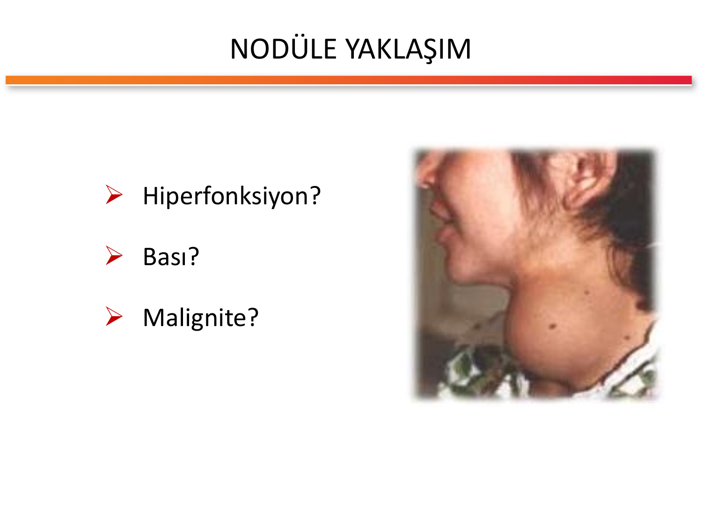

> ⭐ **Klinik altın kural:** Her palpabl nodül mutlaka **TSH ölçümü + boyun ultrasonografisi** ile değerlendirilir. TSH düşükse sintigrafi eklenir; TSH normal/yüksekse uygun USG özelliği ve boyut için İİAB düşünülür.

---

## GUATR SINIFLAMASI

Guatr, üç farklı eksende sınıflandırılır: **morfoloji**, **fonksiyon** ve **epidemiyoloji**.

### Morfolojiye Göre

| Tip | Özellik |
|---|---|
| **Difüz guatr** | Tiroid dokusunun homojen ve simetrik büyümesi (nodül yok) |
| **Uninodüler (soliter) guatr** | Tek nodüllü büyüme |
| **Multinodüler guatr (MNG)** | Birden fazla nodülün bulunduğu guatr |

### Fonksiyona Göre

| Tip | Laboratuvar | Klinik |
|---|---|---|
| **Ötiroid (nontoksik) guatr** | TSH normal, sT4/sT3 normal | Genelde asemptomatik |
| **Hipotiroid guatr** | TSH ↑, sT4 ↓ | Hashimoto tiroiditi, ileri iyot eksikliği |
| **Hipertiroid (toksik) guatr** | TSH ↓, sT4/sT3 ↑ | Graves, toksik adenom, toksik MNG |

### Epidemiyolojik Sınıflama

| Tip | Tanım |
|---|---|
| **Endemik guatr** | Bir bölgede erişkinlerin > %10, çocukların > %5'inde guatr varlığı. Tipik olarak **iyot eksikliğine** bağlıdır (Himalaya, Orta Afrika, tarihsel olarak Karadeniz bölgesi). |
| **Sporadik guatr** | Bölge genelinde iyot yeterliyken tek tek bireylerde görülen guatr. Genetik yatkınlık, guatrojenler ve otoimmünite ön plandadır. |

> 💡 **Mnemonik - Guatr tipleri "DMU-T-NE":** **D**ifüz / **M**ultinodüler / **U**ninodüler (morfoloji); **T**oksik vs non-toksik (fonksiyon); **N**on-endemik vs **E**ndemik (coğrafya). Her guatr değerlendirmesinde bu üç eksende sınıflandırılır.

---

## GUATR ETYOLOJİSİ

Guatr gelişiminde ortak patogenetik yol, tiroid hücresinde **kronik TSH stimülasyonu** ve/veya **büyüme faktörü hiperaktivasyonu** nedeniyle foliküler proliferasyon artışıdır.

### Başlıca Nedenler

1. **İyot eksikliği** (dünyada en sık neden)
   * Tiroid hormon sentezi azalır → TSH yükselir → foliküler hiperplazi
   * Uzun süreli iyot eksikliği → difüz guatr → sonrasında MNG gelişimi
   * Türkiye'de **iyotlu tuz programı** (2000'li yıllardan itibaren) ile endemik guatr sıklığı azalmıştır

2. **Otoimmün tiroid hastalığı**
   * **Hashimoto tiroiditi** (anti-TPO, anti-Tg) -- hipotiroid guatr
   * **Graves hastalığı** (TRAb) -- toksik difüz guatr

3. **Guatrojenler (iyot uptake'ini veya hormon sentezini baskılayan maddeler)**
   * **İlaçlar:** lityum, amiodaron, fenilbutazon, aminoglutetimid, tiyoüre türevleri
   * **Gıdalar:** lahana ailesi (brokoli, karnabahar, turp), manyok, soya, darı
   * **Kimyasallar:** tiyosiyanat (sigara), perklorat, nitrat

4. **Dishormonogenez**
   * Kalıtsal enzim defektleri (TPO, tiroglobulin, iyodotirozin dehalogenaz, pendrin)
   * **Pendred sendromu:** dishormonogenez + sensorinöral işitme kaybı

5. **TSH reseptör mutasyonları**
   * Aktivasyon mutasyonları → toksik adenom / toksik MNG

6. **Tiroiditler**
   * Subakut (de Quervain), postpartum, radyasyon tiroiditi

7. **Neoplaziler**
   * Benign: foliküler adenom
   * Malign: papiller / foliküler / medüller / anaplastik karsinom, lenfoma

> 💡 **Mnemonik - Guatrojenler "LAPS":** **L**ityum, **A**miodaron, **P**erklorat/Propilthiouracil, **S**oya/Sigara (tiyosiyanat). Amiodaron hem guatrojen hem iyot yükü sağladığından özel bir rol oynar.

> ⭐ **Kritik:** Uzun süreli ötiroid difüz guatr, zaman içinde **foliküler otonomi** kazanarak multinodüler ve toksik hale gelebilir (toksik MNG -- Plummer hastalığı). Bu dönüşüm özellikle iyot eksikliği olan yaşlı kadınlarda görülür.

---

## EPİDEMİYOLOJİ

### Tiroid Nodülü Prevalansı

| Tanı Yöntemi | Toplam | Tek Nodül | Multinodüler |
|---|---|---|---|
| **Palpasyon** | %21 | %9 | %12 |
| **Ultrasonografi** | **%67** | %22 | %45 |

*Kaynak: Ezzat S et al. Arch Intern Med 1994;154:1838-40.*

> ⭐ **Kritik nokta:** Yüksek rezolüsyonlu USG ile toplumun **üçte ikisinde** tiroid nodülü saptanır. Yani nodül "var olmak" değil, **"hangisi malign?"** sorusu önemlidir.

### Tiroid Kanseri

- Tiroid kanseri **kadınlarda en sık görülen ilk 10 kanser arasındadır** (meme ve kolorektal kanserden sonra sık görülür).
- **Türkiye 2009 verilerine göre** kadınlarda tiroid kanseri hızı **18,6 / 100 000** (meme kanserinden sonra ikinci sıradadır).
- ABD verilerine göre yıllık insidans yaklaşık 14,2 / 100 000; **5 yıllık sağkalım %98,2**.
- Tüm kanser ölümlerinin sadece **%0,3**'ünü oluşturur (iyi prognozlu).

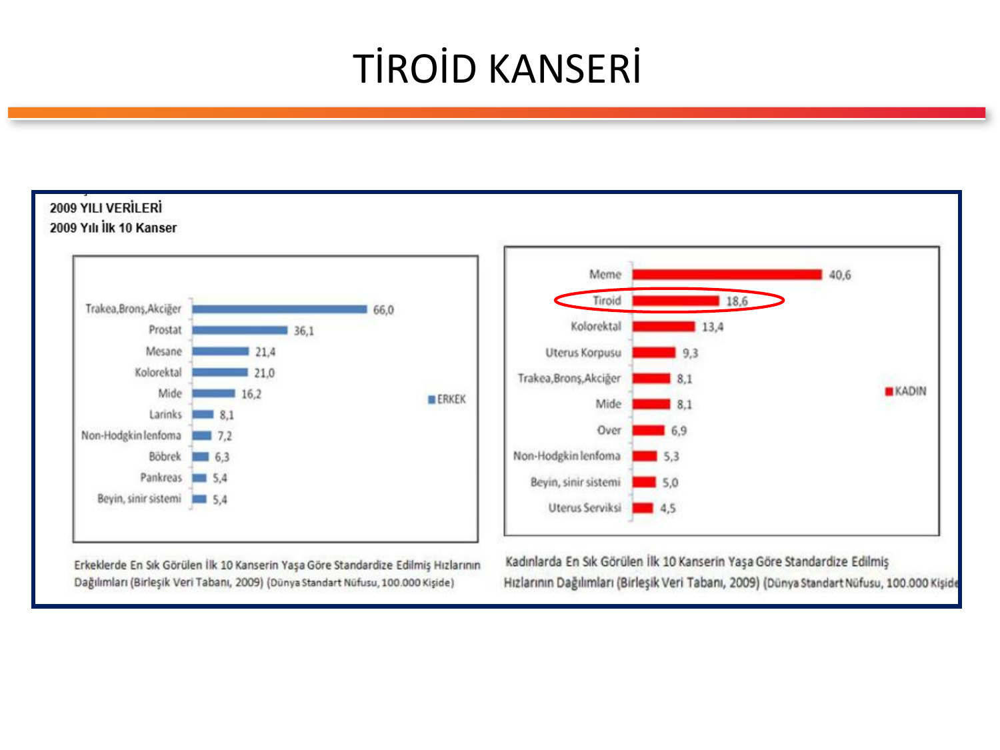

### Tiroid Mikrokarsinomu (PTmC)

- **Tanım:** En büyük çapı **≤ 1 cm** olan papiller tiroid karsinomu.
- Otopsi ve cerrahi serilerinde prevalansı **%1,8 -- 35,6** arasında değişir (101 825 olguluk meta-analizde toplam **%21,9**).
- Çoğu klinik olarak sessizdir ve insidental saptanır.

### İnsidans Artışının Nedenleri

**Tanısal artış:**
* Yüksek frekanslı ultrasonografi
* USG eşliğinde İİAB
* Patoloji değerlendirme tekniklerinin iyileşmesi
* Benign guatr nedeniyle yapılan tiroidektomilerde insidental karsinom saptanması

**Gerçek artış?**
* İyonize radyasyon maruziyetinde artış (tartışmalı)

---

## TİROİD NODÜLÜNE KLİNİK YAKLAŞIM

### Risk Değerlendirmesinde Anahtar Faktörler

**Klinik (öykü + FM) kırmızı bayraklar:**

| Risk Faktörü | Açıklama |
|---|---|
| **Yaş** | **< 20 yaş** ve **> 70 yaş** malignite riskini artırır |
| **Cinsiyet** | Nodül kadında daha sık, fakat **erkekte saptanan nodül daha malign** |
| **Ses kısıklığı / disfaji / dispne** | Rekürren laringeal sinir veya komşu yapı invazyonu |
| **Nodülde hızlı büyüme** | Agresif histoloji / lenfoma şüphesi |
| **Boyun bölgesine çocuklukta radyoterapi** | En güçlü epidemiyolojik risk faktörlerinden biri |
| **Ailede tiroid kanseri veya MEN öyküsü** | Medüller karsinom / ailesel papiller karsinom |
| **Sert, düzensiz, fikse nodül** | İnvazyon göstergesi |
| **Vokal kord paralizisi** | Rekürren sinir tutulumu (≈ malignite) |
| **Servikal lenfadenopati** | Metastaz |

> 💡 **Mnemonik - Malign nodül şüphesi "YESAR":** **Y**aş (uç yaşlar), **E**rkek, **S**es kısıklığı, **A**ile öyküsü/**r**adyasyon. Bu beşlinin herhangi birinin varlığı biyopsi eşiğini düşürür.

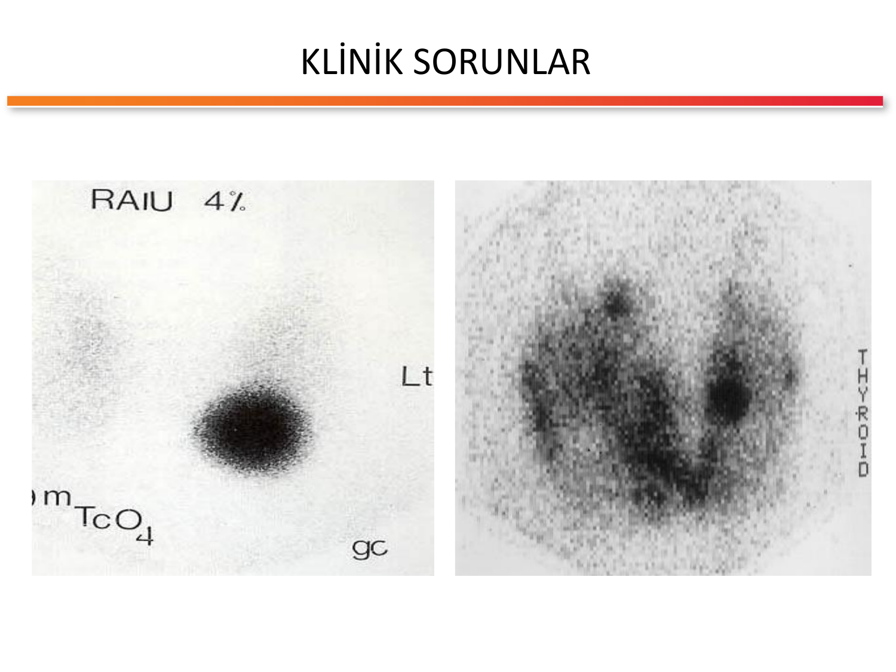

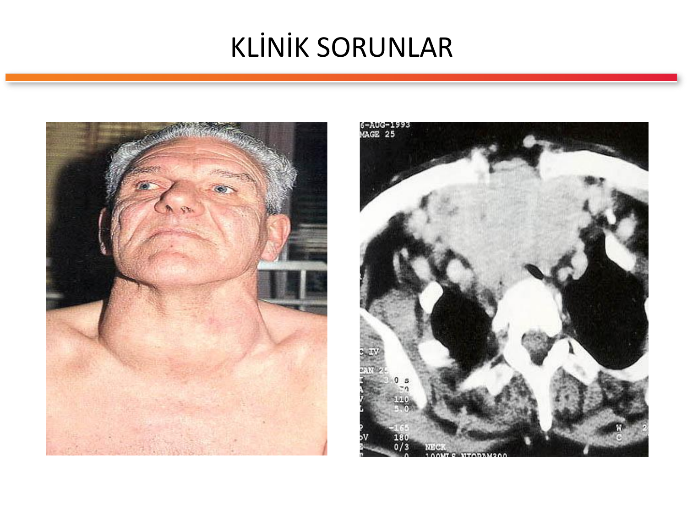

---

## ÖYKÜ VE FİZİK MUAYENE

### Öyküde Sorgulanacaklar

* İlerleyen **disfaji**
* **Ses kalınlaşması / kısıklığı**
* **Zor nefes alma** (özellikle supin pozisyonda)
* **Nodülde hızlı büyüme**
* Boyun bölgesine radyoterapi öyküsü
* Ailede MEN, medüller tiroid kanseri, papiller kanser öyküsü

### Fizik Muayenede Aranacaklar

* **Sert nodül** (taş sertliğinde)
* **Düzensiz yüzeyli** nodül
* **Fikse nodül** (yutkunma ile hareket etmeyen -- çevre dokulara invazyon)
* **Servikal lenfadenopati** (özellikle lateral bölge)
* **Vokal kord paralizisi** (dolaylı laringoskopi)

> ⚠️ **ÖNEMLİ:** Fikse, sert, düzensiz nodül + ipsilateral lenfadenopati + ses kısıklığı → **bunun aksi ispatlanana kadar tiroid karsinomudur.**

---

## LABORATUVAR DEĞERLENDİRME

### TSH

> **Her tiroid nodülü değerlendirmesinin ilk basamağı TSH ölçümüdür.**

| TSH | Olasılık | Sonraki Adım |
|---|---|---|
| **Düşük** | Hiperaktif (otonom) nodül | **Tiroid sintigrafisi** (Tc-99m / I-123) |
| **Normal veya yüksek** | Hiperaktif değil | **USG ± İİAB** (boyut + sonografik risk) |

> ⭐ **Sınav kuralı:** Otonom (sıcak) nodüllerde malignite riski çok düşüktür (<1-2%). TSH düşük + sintigrafide sıcak nodül → biyopsiye genellikle gerek yoktur.

### Serum Tiroglobulin (Tg)

* Tiroid dokusunun ürettiği spesifik bir proteindir.
* **Pek çok benign tiroid hastalığında da yükselir** (nodüler guatr, tiroidit, Graves).
* **Tanı için duyarlılığı ve özgünlüğü çok düşüktür.**
* **İzlemde kullanılır:** Total tiroidektomi + RAI ablasyon sonrası Tg, rekürrens ve metastaz takibinde kritik tümör belirtecidir.
* **Anti-Tg antikoru** mutlaka eş zamanlı ölçülmelidir -- yalancı düşüklüğe yol açabilir.

### Serum Kalsitonin

* **Medüller tiroid kanserinin (MTC) parafoliküler C hücresi kökenli tümör belirtecidir.**
* Nodüler guatrda **rutin ölçülmesi önerilmektedir** -- MTC'yi erken evrede yakalar, sağkalımı uzatır.
* **Kalsitonin > 100 pg/mL** → **MTC olasılığı çok yüksektir.**
* **Pentagastrin veya kalsiyum uyarı testi**, borderline değerlerde (10--100 pg/mL) kullanılabilir.

> ⭐ **Kritik pearl:** Her MEN2 şüphesinde ve ailesinde medüller kanser olan bireyde bazal kalsitonin + RET proto-onkogen mutasyon analizi yapılmalıdır.

### Diğer Testler

* **sT4, sT3:** TSH'ya göre ikincil, toksik nodül / MNG değerlendirmesinde.
* **Anti-TPO, anti-Tg:** Otoimmün tiroidit şüphesinde.
* **TRAb:** Graves şüphesinde.

---

## ULTRASONOGRAFİ VE TI-RADS

### Tiroid USG'de Nodül Değerlendirme Parametreleri

**Yüksek riskli (malignite kuşkusu uyandıran) sonografik özellikler:**

1. **Hipoekojenite** (çevre dokudan belirgin koyu)
2. **Düzensiz kenar** (mikrolobüle, spiküler, kesintili)
3. **Mikrokalsifikasyon** (< 1 mm, punktat)
4. **Halo yokluğu** veya inkomplet halo
5. **Artmış intranodüler kan akımı** (Tip 3 vaskülarite)
6. **Yükseklik > genişlik** (transvers kesitte "taller-than-wide")
7. **Ekstratiroidal yayılım** / **anterior boyun kası invazyonu**
8. **Kesintili periferal kalsifikasyon + yumuşak doku komponentinin dışa invazyonu**
9. **Patolojik servikal LAP varlığı**

**Benign bulgular:**

* Hiperekojenite
* Yumurta kabuğu tipi kesintisiz kalsifikasyon
* Süngerimsi (spongioform) görünüm
* Halo varlığı / pürüzsüz kenar
* Vaskülarite yokluğu (Tip 1) veya periferal (Tip 2)
* Pür kistik nodül
* Nodül boyutlarında zamanla azalma
* Multipl koalesan nodüller
* Reaktif özellikli servikal LAP

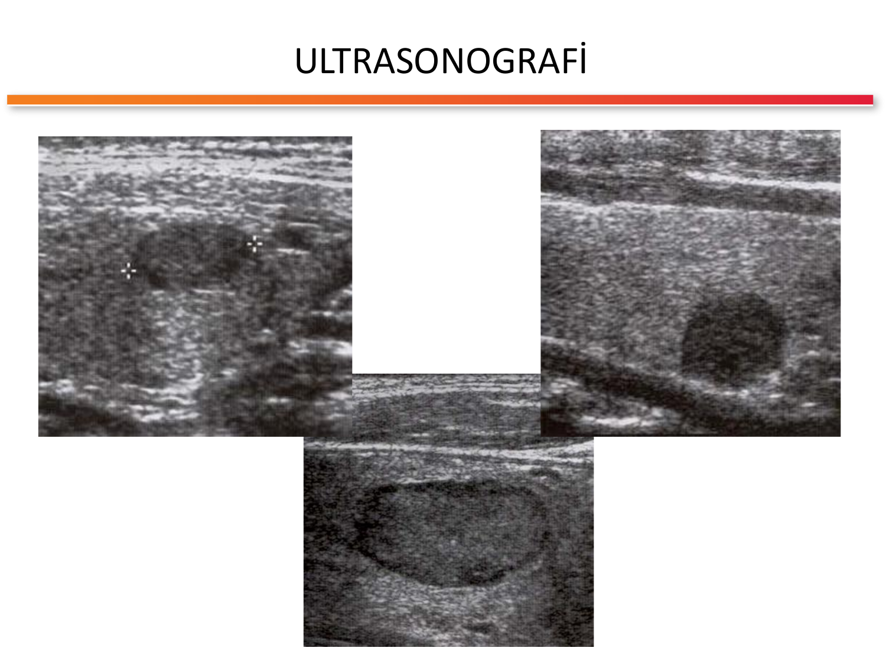

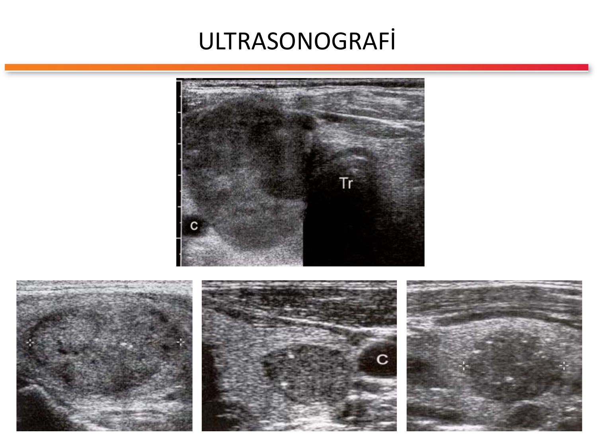

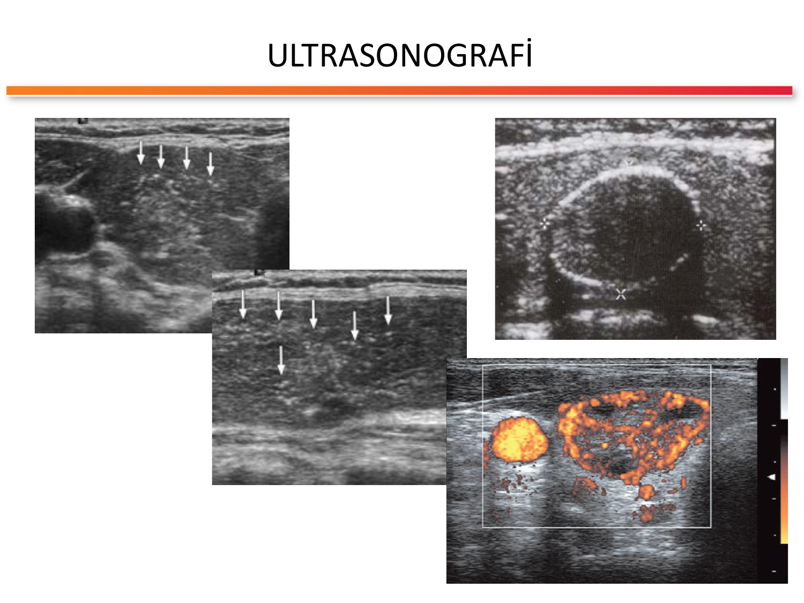

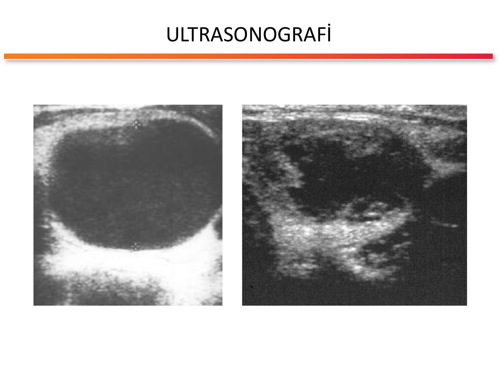

### Özel Durumlar

| Durum | Risk |
|---|---|
| **Saf kistik nodüller** | < %2 (benign kabul edilir) |
| **Solid + kistik komponentli nodüller** | Solid nodüllerle aynı risk -- **USG eşliğinde solid komponentten İİAB** |
| **Süngerimsi (spongioform) nodül** | Nodül volümünün > %50'si mikrokistik → **malignite için NPD %98,5** |

*Kaynak: Frates MC et al. JCEM 2006;91:3411-7; Bonavita JA et al. Am J Roentgenol 2009;193:207-13.*

### TEMD Tablo 3 - Ultrasonografik Malignite Belirteçleri

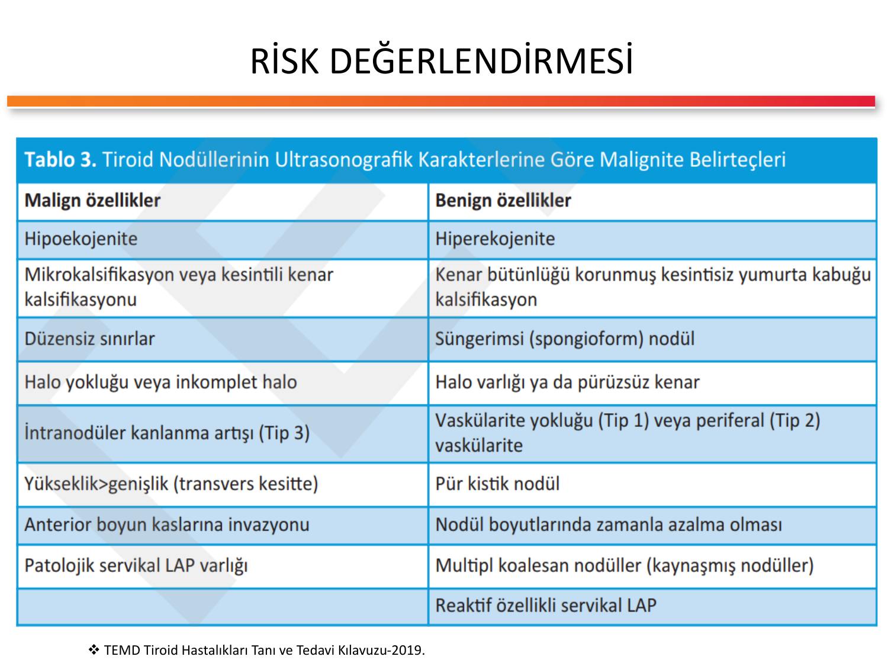

### EU-TIRADS (European Thyroid Association, 2017)

> **EU-TIRADS (EU-TIRADS):** Yetişkin tiroid nodüllerinde USG ile malignite risk stratifikasyonu sınıflaması.

| Kategori | Tanım | Malignite Riski |
|---|---|---|
| **EU-TIRADS 1** | Nodül yok | -- |
| **EU-TIRADS 2** | Benign (pür kistik veya spongioform) | **~%0** |
| **EU-TIRADS 3** | Düşük risk (oval, düzgün kenar, izoekoik / hiperekoik) | **%2--4** |
| **EU-TIRADS 4** | Orta risk (oval, düzgün kenar, hafif hipoekoik) | **%6--17** |
| **EU-TIRADS 5** | Yüksek risk (≥ 1 yüksek risk özelliği: belirgin hipoekoik, düzensiz kenar, mikrokalsifikasyon, yükseklik>genişlik, ekstratiroidal yayılım) | **%26--87** |

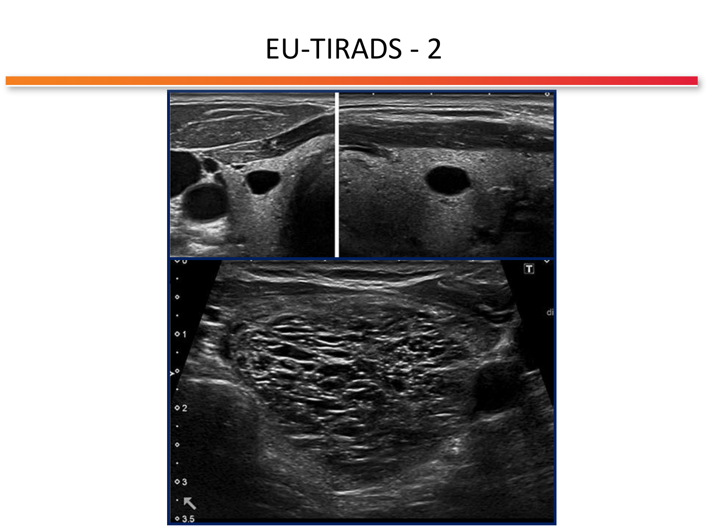

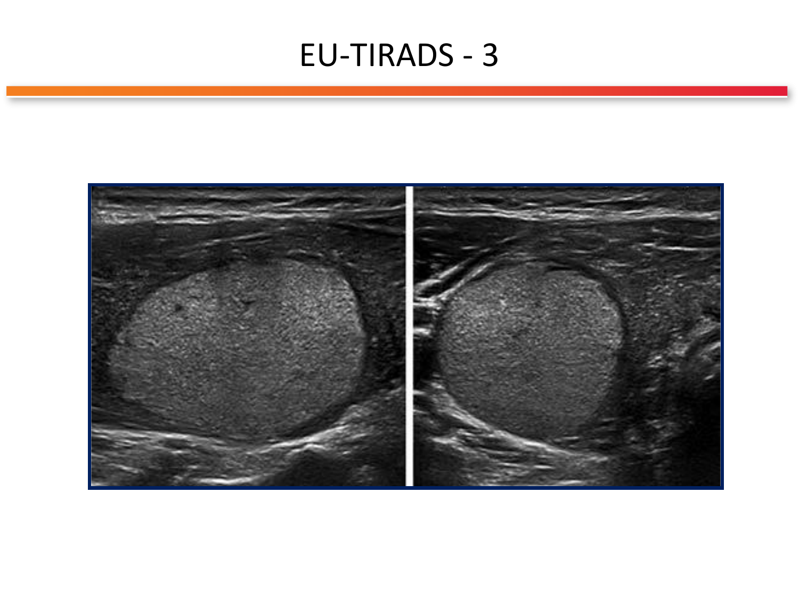

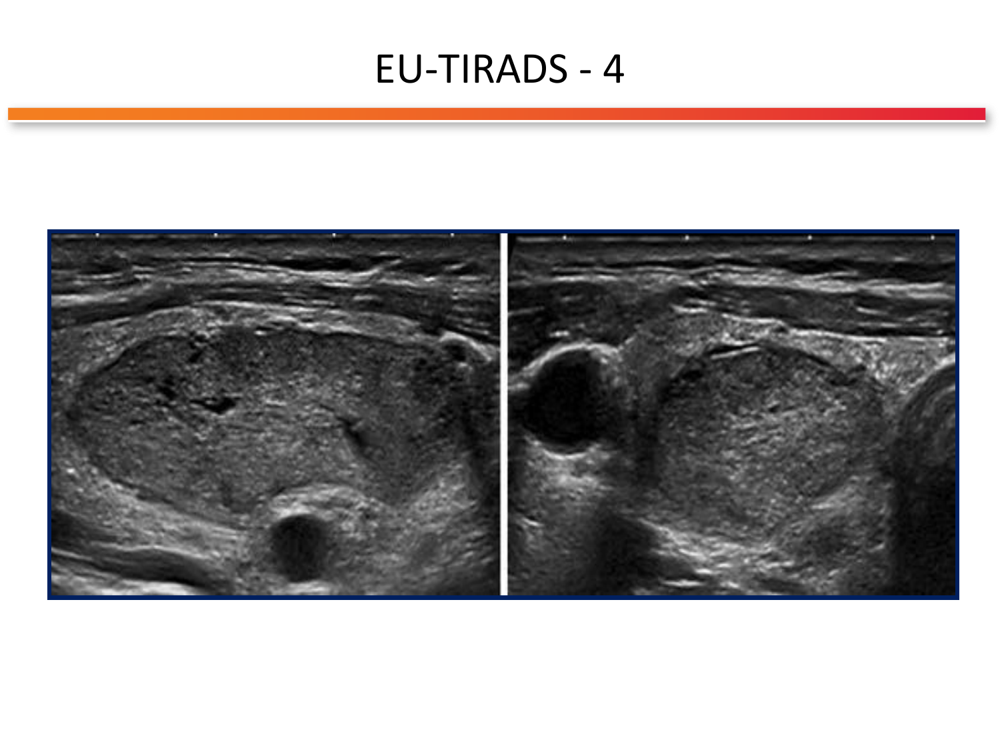

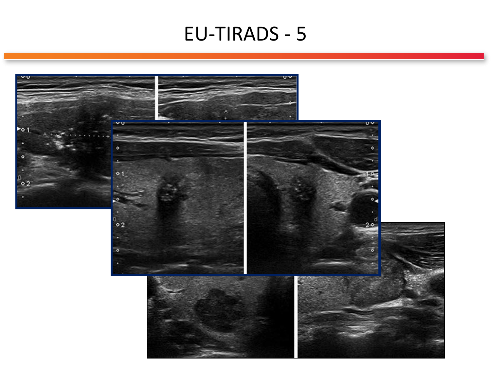

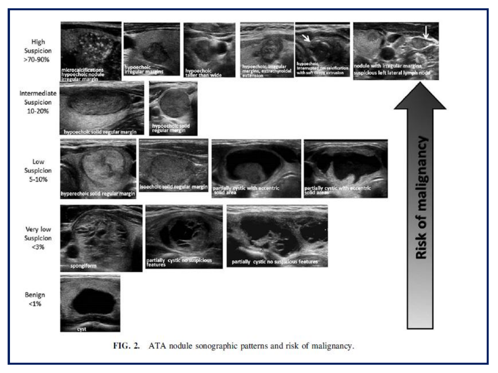

### TEMD Tablo 5 - US Özelliklerine Göre Risk Kategorileri ve TİİAB Boyut Önerisi

| Risk Kategorisi | US Özelliği | Malignite Riski (%) | İİAB için Boyut |
|---|---|---|---|
| **Benign** | Saf tiroid kisti, süngerimsi, kanlanan solid komponenti olmayan kistik | **0 -- <3** | Yok (boşaltma veya PEE amaçlı) |
| **Düşük risk** | İzo/hiperekoik, kanlanan solid komponentli kistik | **< 5** | **≥ 20 mm** |
| **Orta risk** | Hipoekoik nodül | **10 -- 20** | **≥ 15 mm** |
| **Yüksek risk** | En az bir yüksek risk US özelliği* | **> 60** | **≥ 10 mm** |

*Yüksek risk US özellikleri: Mikrokalsifikasyon, düzensiz kenar, yükseklik>genişlik, kesintili periferal kalsifikasyon + yumuşak doku komponenti dışa invazyon, ekstratiroidal yayılım, patolojik LAP.*

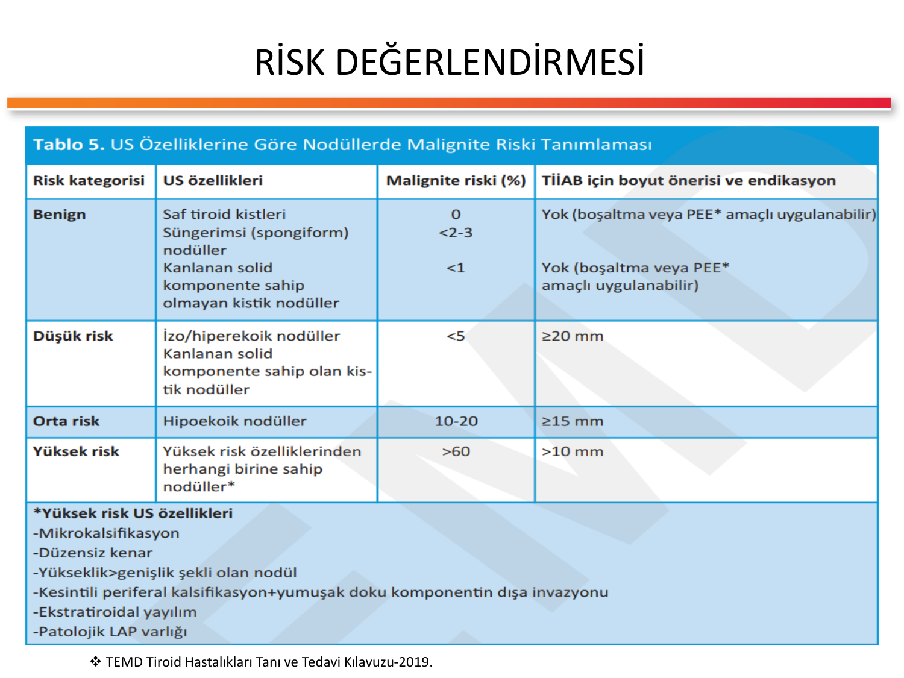

*Kaynak: TEMD Tiroid Hastalıkları Tanı ve Tedavi Kılavuzu-2019.*

> 💡 **Mnemonik - Malign USG özellikleri "Hipo-Mikro-Düz-Halo-Taller":** **Hipo**ekojenite, **Mikro**kalsifikasyon, **Düz**ensiz kenar, **Halo** yokluğu, **Taller**-than-wide. Bu beşliye "ekstratiroidal invazyon + lenfadenopati"yi eklediğinde yüksek risk EU-TIRADS 5 tamamlanır.

---

## ELASTOGRAFİ

> **Elastografi:** Doku sertliğini ölçerek malignite ayırımına katkı sağlayan USG teknolojisi. Malign nodüller genellikle benign nodüllerden daha **sert**tir.

**Elastisite Skoru (Rago, 5 basamak):**

1. Tüm nodülde elastisite var
2. Nodülün büyük bölümünde elastisite var
3. Nodülün sadece periferal bölümünde elastisite var
4. Nodülde elastisite yok
5. Nodülde elastisite yok ve arka gölgelenme var

Skor 4--5 → **malignite için yüksek duyarlılık**.

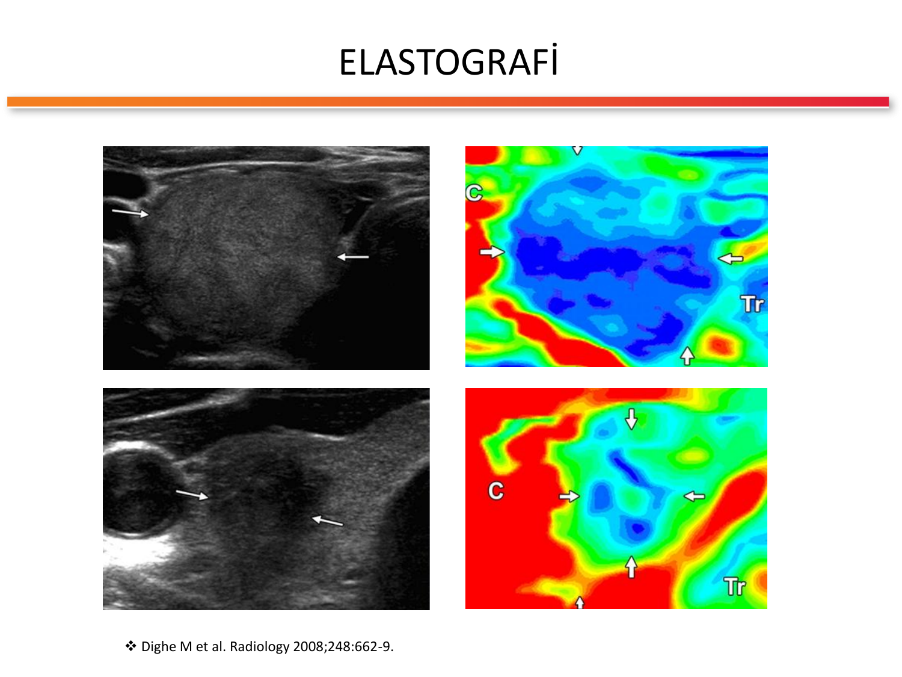

*Kaynak: Rago T et al. JCEM 2007;92:2917-22; Dighe M et al. Radiology 2008;248:662-9.*

---

## SİNTİGRAFİ

### Endikasyon

**TSH düşük** olan tiroid nodülünde sintigrafi yapılır (otonom nodül ayırımı için).

### Radyofarmasötikler

* **Tc-99m pertekhetat** (en sık, ucuz, kısa yarı ömür)
* **I-123** (daha doğru -- iyot organifikasyonunu da gösterir)
* **I-131** (tedavide)

### Bulgu Sınıflaması

| Bulgu | Yorum |
|---|---|
| **Sıcak (hiperaktif) nodül** | Otonom adenom; malignite riski **< %1--2** |
| **Ilık nodül** | Normofonksiyonel |
| **Soğuk nodül** | Hipoaktif; malignite riski **%10--20** → **İİAB** |

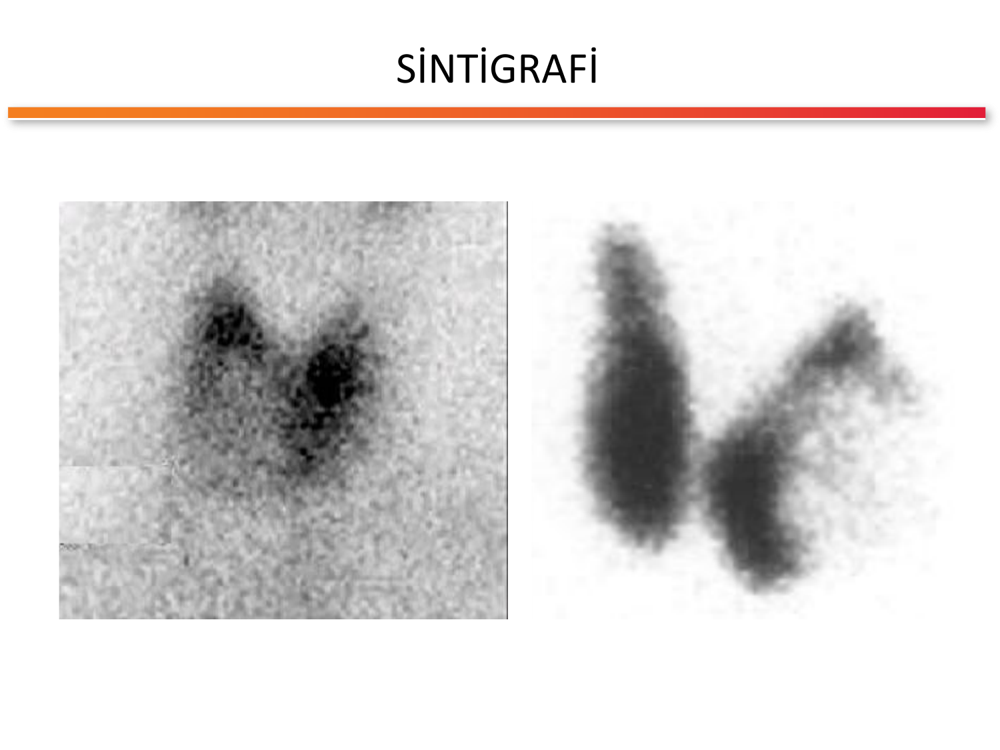

> ⭐ **Pearl:** Otonom nodüllerin **malign olanları %1--2**'dir. Bu nedenle "sıcak nodül = biyopsi yok" kuralı büyük çoğunluk için geçerlidir; ancak USG'de malign özellikleri varsa istisnaen biyopsi yapılabilir.

---

## İNCE İĞNE ASPİRASYON BİYOPSİSİ VE BETHESDA SİSTEMİ

### İİAB Endikasyonları (TEMD-2019)

TSH **normal / yüksek** olan hastada, sonografik risk kategorisine göre:

| Kategori | İİAB Boyut Eşiği |
|---|---|
| Yüksek risk nodül | **≥ 10 mm** |
| Orta risk nodül | **≥ 15 mm** |
| Düşük / çok düşük risk | **≥ 20 mm** |
| Benign patern | İİAB gerekmez |

**Ek endikasyonlar (boyuttan bağımsız):**

* Ekstratiroidal yayılım kuşkusu
* Patolojik servikal lenfadenopati
* Klinik yüksek risk (aile öyküsü, radyasyon, hızlı büyüme, ses kısıklığı)
* Kalsitonin yüksekliği

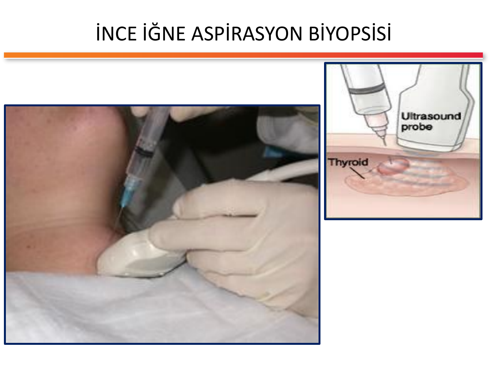

### Bethesda Sistemi (TBSRTC, 2017 -- Sitolojik Sınıflama)

> **The Bethesda System for Reporting Thyroid Cytopathology (TBSRTC):** Tiroid İİAB sitolojik raporlarını 6 kategoriye ayıran standart.

| Kategori | Tanım | Malignite Riski (%) | Yönetim |
|---|---|---|---|
| **I** | Tanısal olmayan / yetersiz materyal | **5 -- 10** (TEMD: <1--4) | USG eşliğinde **İİAB tekrarı** |
| **II** | **Benign** (adenomatöz nodül, koloid nodül, Hashimoto) | **< 3** (TEMD: <1) | **İzlem** (6--12 ay USG) |
| **III** | **Önemi belirsiz atipi / önemi belirsiz foliküler lezyon (ÖBA / ÖBFL / AUS-FLUS)** | **10 -- 30** (TEMD: ~5--10) | Sonografik riske göre **İİAB tekrarı** (3 ay sonra) / moleküler test |
| **IV** | **Foliküler neoplazi / Hürthle hücreli neoplazi şüphesi (FN / FNŞ)** | **25 -- 40** (TEMD: 20--30) | **Lobektomi** (frozen section ± moleküler) |
| **V** | **Malignite açısından şüpheli** | **50 -- 75** (TEMD: 60--75) | **Lobektomi veya total tiroidektomi** |
| **VI** | **Malign** (papiller, medüller, anaplastik, lenfoma, metastaz) | **97 -- 99** | **Total tiroidektomi** ± lenf nodu diseksiyonu |

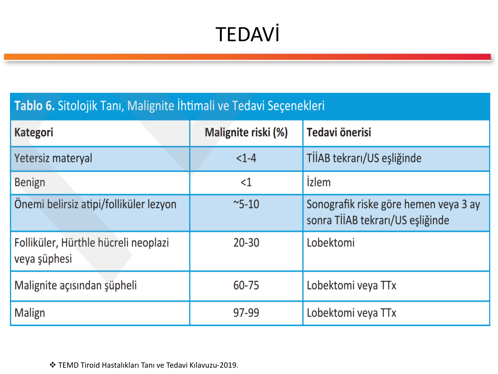

> 💡 **Mnemonik - Bethesda "YBA-FŞM":** **Y**etersiz, **B**enign, **A**tipi, **F**oliküler neoplazi, **Ş**üpheli, **M**align. Sırayla malignite riski **tırmanır**; I-II izlem/tekrar, III-IV moleküler/lobektomi, V-VI cerrahi.

---

## MOLEKÜLER BELİRTEÇLER

Tanısal belirsizlik durumlarında (özellikle Bethesda III-IV) ek bilgi sağlar.

| Belirteç | Klinik Önem |
|---|---|
| **BRAF V600E** | Papiller karsinoma yüksek oranda eşlik eder (agresif) |
| **RAS** mutasyonu | Foliküler karsinoma sık |
| **RET / PTC** rearranjmanı | Papiller karsinom (özellikle radyasyona bağlı) |
| **RET** germline mutasyonu | **Medüller karsinom** / MEN2A/2B |
| **Galectin-3** | Benign-malign ayırımında |
| **PAX8 / PPARγ** füzyonu | Foliküler karsinom |

*Kaynak: Nikiforov YE et al. JCEM 2009;94:2092-98.*

---

## TİROİD NODÜLÜ DEĞERLENDİRME ALGORİTMASI

### Ana Algoritma (Prof. Dr. Engin Güney, TEMD-2019)

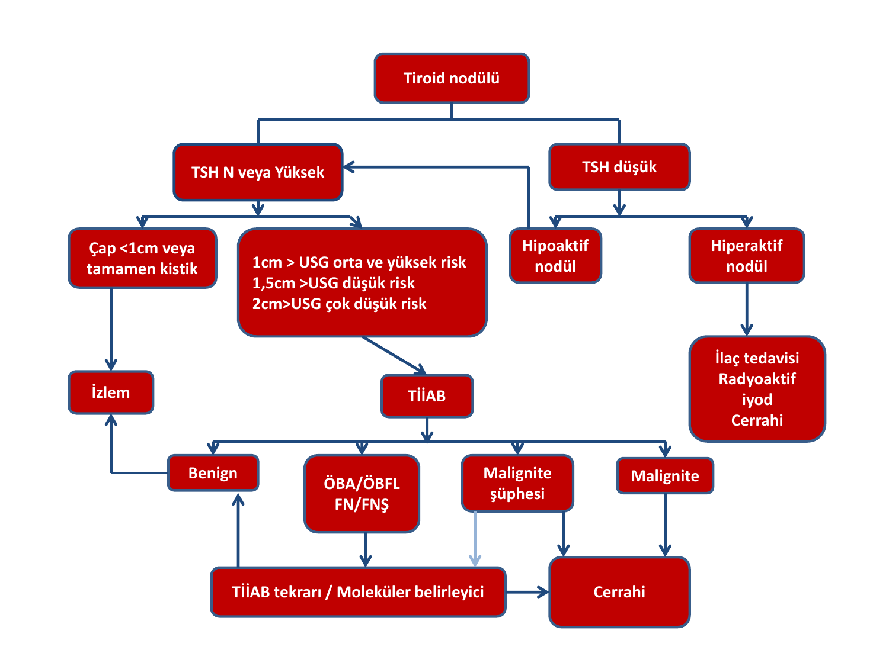

### ASCII Şema -- Değerlendirme Akışı

```
                          TİROİD NODÜLÜ
                                │
                    ┌───────────┴───────────┐
                    │                       │
              TSH N veya ↑              TSH düşük
                    │                       │
                    │              ┌────────┴────────┐
                    │              │                 │
                    │          Hipoaktif         Hiperaktif
                    │          (soğuk)           (sıcak)
                    │              │                 │
                    │              │            İlaç tedavisi
                    │              │            Radyoaktif iyod
                    │              │                Cerrahi
                    │              │
                    ▼              │
       Çap / USG risk              │
                    │              │
        ┌───────────┼──────────┐   │
        │           │          │   │
   <1cm veya   Orta/yüksek   Düşük │
   tamamen     risk ≥10mm    risk  │
   kistik      Orta ≥15mm    ≥20mm │
        │      Yüksek ≥10mm    │   │
        │           │          │   │
        ▼           ▼          ▼   │
     İZLEM       İİAB      İİAB◄───┘
                    │
       ┌────────┬───┼───┬──────────┐
       ▼        ▼   ▼   ▼          ▼
   Benign  ÖBA/ÖBFL  FN/FNŞ  Malignite  Malign
                              şüphesi
       │        │           │      │      │
       ▼        ▼           ▼      ▼      ▼
    İzlem   İİAB tekrar / Moleküler    CERRAHİ
              belirleyici
```

### ASCII Şema -- İİAB Karar Ağacı

```
          İİAB SONUCU (BETHESDA)
                    │
    ┌────────┬──────┼──────┬─────────┬────────┐
    ▼        ▼      ▼      ▼         ▼        ▼
    I        II     III    IV        V        VI
 Yetersiz Benign   ÖBA    FN/FNŞ  Şüpheli   Malign
    │        │      │      │         │        │
    ▼        ▼      ▼      ▼         ▼        ▼
  İİAB    İzlem  İİAB    Lobekto-  Lobekto-  Total
 tekrar   (USG   tekrar  mi +     mi veya   tiroidek-
         6-12 ay)/mol    frozen    TTx      tomi +
                                                LN dis.
```

---

## TEDAVİ SEÇENEKLERİ

### Genel Tedavi Yöntemleri

1. **Medikal tedavi** (L-tiroksin süpresyon -- sınırlı endikasyon)
2. **Cerrahi tedavi** (lobektomi / total tiroidektomi)
3. **Radyoaktif iyod (RAI) tedavisi**
4. Perkütan etanol enjeksiyonu (PEE -- özellikle kistik nodül)
5. Radyofrekans ablasyon (RFA)
6. Lazer ablasyon

### Medikal Tedavi (L-Tiroksin Süpresyonu)

* **Günümüzde rutin olarak önerilmemektedir.**
* Meta-analizler, **iyot eksikliği bölgelerinde** L-tiroksin süpresyonunun nodül boyutlarında azalma ve yeni nodül oluşumunda azalma sağladığını göstermiştir.
* **İyot yeterli bölgelerde veriler çelişkilidir**: Nodüllerin yalnızca %17--25'inde %50 küçülme sağlanmıştır.
* **Riskler:** İyatrojenik subklinik hipertiroidi → atriyal fibrilasyon, kemik kaybı (özellikle postmenopozal kadın).

*Kaynak: Wemeau JL et al. JCEM 2002;87:4928-34; Castro MR et al. JCEM 2002;87:4154-9.*

### Cerrahi Tedavi

| Yöntem | Endikasyon |
|---|---|
| **Lobektomi (hemitiroidektomi)** | Tek loba sınırlı, Bethesda IV (foliküler neoplazi), düşük riskli papiller mikrokarsinom |
| **Total tiroidektomi** | Bilateral MNG, Bethesda V--VI, boyu ≥ 4 cm tümör, ekstratiroidal yayılım, lenf nodu metastazı, aile öyküsü, radyasyon öyküsü, MEN2 profilaktik |
| **Total tiroidektomi + santral LN diseksiyonu** | MTC, yüksek riskli PTC |

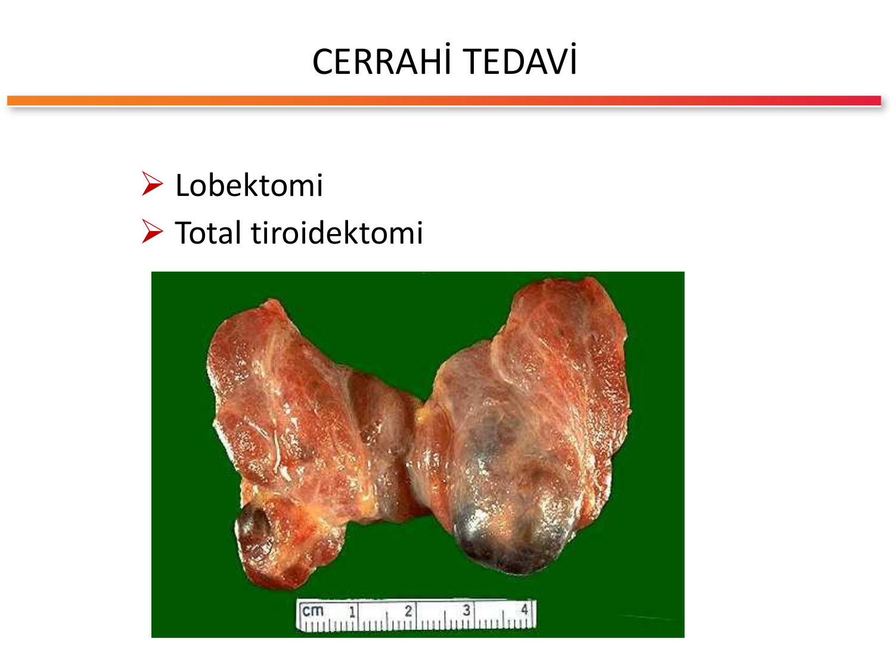

**Cerrahinin komplikasyonları:**

* Rekürren laringeal sinir hasarı (ses kısıklığı)
* Hipoparatiroidizm (hipokalsemi)
* Kanama / hematom / enfeksiyon

### Radyoaktif İyod (RAI, I-131) Tedavisi

**Endikasyonları:**

1. **Toksik adenom / toksik MNG / Graves** (hipertiroidi)
2. **Diferansiye tiroid karsinomu** (papiller, foliküler) tiroidektomi sonrası **remnant ablasyon** ve metastaz tedavisi
3. Büyük ötiroid MNG (cerrahi yapılamayan hastada hacim azaltma)

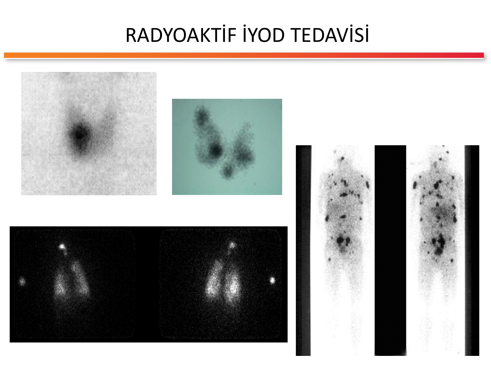

> ⭐ **Kritik:** Medüller karsinom ve anaplastik karsinom **RAI tutmaz** (parafoliküler ve/veya dediferansiye hücre kökenli). RAI yalnızca **diferansiye tiroid karsinomlarında** (papiller + foliküler) etkilidir.

> 💡 **Mnemonik - RAI etkili tümörler "PaFo-diferansiye":** **Pa**piller + **Fo**liküler = diferansiye = RAI tutar. **Me**düller + **An**aplastik + **Le**nfoma = RAI tutmaz.

---

## TİROİD KANSERİ - GENEL

### Tiroid Tümörlerinin Sıklık Dağılımı

| Tümör Tipi | Sıklık (%) | Köken |
|---|---|---|
| **Papiller karsinom** | **%80** | Foliküler hücre (diferansiye) |
| **Foliküler karsinom** | **%10** | Foliküler hücre (diferansiye) |
| **Medüller karsinom** | **%5** | Parafoliküler C hücresi |
| **Anaplastik karsinom** | **%3** | Foliküler hücre (dediferansiye) |
| **Diğer** (lenfoma, fibrosarkom, yassı hücreli ca, malign hemanjioendotelioma, metastatik) | **%1** | Çeşitli |

> 💡 **Mnemonik - Tümör tipleri sıklık sırası "Pa-Fo-Me-An-Le":** **Pa**piller → **Fo**liküler → **Me**düller → **An**aplastik → **Le**nfoma. 80-10-5-3-1 (%) oranlarını akılda tutun.

### Tümör Kökenleri

```
TİROİD BEZİ
     │
     ├── FOLİKÜLER HÜCRE (çoğunluk)
     │       │
     │       ├── Diferansiye
     │       │       ├── PAPİLLER (%80)
     │       │       └── FOLİKÜLER (%10, Hürthle dahil)
     │       │
     │       └── Dediferansiye
     │               └── ANAPLASTİK (%3)
     │
     ├── PARAFOLİKÜLER C HÜCRESİ
     │       └── MEDÜLLER (%5, kalsitonin salgılar)
     │
     └── LENFOİD DOKU (Hashimoto zemini)
             └── PRİMER TİROİD LENFOMA (<%1)
```

---

## PAPİLLER TİROİD KARSİNOMU

### Özellikler

* **En sık tiroid malignitesidir (%80).**
* Kadın / erkek oranı **≈ 3 / 1**.
* **Ortalama yaş: 30--50**.
* **Risk faktörleri:** Çocuklukta radyasyon maruziyeti, **RET/PTC** rearranjmanı, **BRAF V600E** mutasyonu, iyot fazlalığı, ailesel (FAP, Cowden, Carney kompleks).

### Klinik

* Sıklıkla yavaş büyüyen, sert, hareketli tiroid nodülü
* **Lenfatik yolla servikal lenf bezlerine erken metastaz** yapar
* Uzak metastaz nadir (akciğer > kemik)

### Patolojik Özellikler

* **Orphan Annie göz çekirdekleri** (bol nükleoplazma, belirsiz nukleolus)
* **Psammom cisimcikleri** (kalsifik laminar yapılar)
* **Nükleer yarık / katlantı / intranükleer inklüzyonlar**
* Papiller yapılar (fibrovasküler kor etrafında epitelyum)

### Alt Tipler

| Alt Tip | Prognoz |
|---|---|
| **Klasik papiller** | İyi |
| **Papiller mikrokarsinom** (≤ 1 cm) | Mükemmel (sağkalım ≈ %100) |
| **Foliküler varyant** | Klasik ile benzer |
| **Tall cell varyant** | **Kötü** (agresif, yaşlı) |
| **Kolumnar hücreli varyant** | Kötü |
| **Diffüz sklerozan varyant** | Agresif, genç |
| **Hobnail varyant** | Kötü |

### Tedavi

| Durum | Tedavi |
|---|---|
| Mikrokarsinom (< 1 cm), düşük risk | **Lobektomi** (seçilmiş olguda aktif izlem) |
| 1--4 cm, unifokal, ekstratiroidal yayılım yok | Lobektomi veya total tiroidektomi |
| > 4 cm, multifokal, ekstratiroidal yayılım, LN metastazı, radyasyon öyküsü | **Total tiroidektomi + santral LN diseksiyonu** |
| Uzak metastaz veya yüksek risk | Total tiroidektomi + **RAI ablasyon** + TSH süpresyonu |

### Prognoz

* **10 yıllık sağkalım: %95--98** (diferansiye tümörler arasında en iyi)
* Kötü prognostik faktörler (AMES / MACIS skoru): **A**ge (> 45--55), **M**etastasis, **E**xtension, **S**ize (> 4 cm), **C**ompleteness of resection, **I**nvasion.

---

## FOLİKÜLER TİROİD KARSİNOMU

### Özellikler

* Tiroid malignitelerinin **%10**'u.
* Kadın / erkek ≈ 3 / 1.
* Ortalama yaş: 40--60.
* **İyot eksikliği bölgelerinde daha sıktır.**
* **RAS** mutasyonları, **PAX8-PPARγ** füzyonu sık.

### Klinik ve Patoloji

* Genellikle **soliter nodül** (kapsüllü).
* Lenfatik değil, **hematojen metastaz** yapar (akciğer, kemik, beyin).
* Papiller hücre özellikleri **yoktur**; tanı için **kapsül invazyonu veya vasküler invazyon** gerekir.
* Bu nedenle İİAB ile **tam tanı konulamaz**; foliküler neoplazi (Bethesda IV) tanısı sonrası **lobektomi + histopatolojik inceleme** gerekir.

### Hürthle Hücreli (Onkositik) Karsinom

* Foliküler karsinomun bir varyantı olarak kabul edilir (yeni WHO'da ayrı entite).
* **Daha agresiftir**, RAI tutma oranı düşüktür.
* Kapsül ve vasküler invazyon için agresif histopatoloji gerekir.

### Tedavi ve Prognoz

* **Total tiroidektomi + RAI ablasyon + TSH süpresyonu.**
* 10 yıllık sağkalım: **%85--90** (papillerden biraz daha düşük).
* Hürthle varyantında prognoz daha kötü.

> 💡 **Mnemonik - Metastaz yolu farkı "Papiller Lenfatik, Foliküler Fe":** **P**apiller → **L**enfatik (servikal LN); **F**oliküler → **F**e (hematojen -- kemik, akciğer). İki harfin baş harfleri sizi yanıltmasın; bu kural klinik olarak kritiktir.

---

## MEDÜLLER TİROİD KARSİNOMU VE MEN SENDROMLARI

### Medüller Tiroid Karsinomu (MTC)

* Tiroid malignitelerinin **%5**'i.
* **Parafoliküler C hücrelerinden** köken alır → **kalsitonin** salgılar.
* Hem **sporadik (%75)** hem **ailesel (%25)** formları vardır.

### Tipler

| Tip | Özellik |
|---|---|
| **Sporadik MTC** | Unilateral, tek odaklı, 40--60 yaş |
| **Ailesel MTC (FMTC)** | MEN2 olmaksızın ailesel, en hafif formu |
| **MEN2A** | MTC + feokromositoma + primer hiperparatiroidi |
| **MEN2B** | MTC + feokromositoma + mukokutanöz nöromalar + marfanoid habitus |

### Tanı

* **Serum kalsitonin** yüksekliği (bazal veya kalsiyum / pentagastrin uyarılı).
* **Kalsitonin > 100 pg/mL** → MTC olasılığı **çok yüksek**.
* **CEA** da yükselir (daha nonspesifik).
* **RET proto-onkogen germline mutasyon analizi** (tüm MTC hastalarında önerilir).

### Klinik

* **Diyare** (kalsitoninin parakrin etkisi)
* **Flushing**
* Boyunda palpabl, sert nodül
* Erken **santral ve lateral servikal LN metastazı**
* Uzak metastaz: karaciğer, kemik, akciğer

### Tedavi

* **Total tiroidektomi + bilateral santral LN diseksiyonu ± lateral LN diseksiyonu.**
* RAI etkisizdir (foliküler hücre kökenli değil).
* İleri evrede **tirozin kinaz inhibitörleri** (vandetanib, cabozantinib, selpercatinib, pralsetinib).
* **Takip:** Kalsitonin + CEA.

### MEN2A vs MEN2B Karşılaştırma

| Özellik | **MEN2A (Sipple)** | **MEN2B** |
|---|---|---|
| Genetik | **RET** mutasyonu (sıklıkla kodon 634) | **RET** mutasyonu (kodon 918) |
| MTC | %95--100 | %100 (erken ve agresif) |
| Feokromositoma | %50 | %50 |
| Primer hiperparatiroidi | %20--30 | **Yok** |
| Mukokutanöz nöroma | Yok | **Var** (dil, dudak, göz) |
| Marfanoid habitus | Yok | **Var** |
| Başlangıç yaşı | 20--30 | **Çocukluk / adolesan** |
| Prognoz | Daha iyi | **Daha kötü** |
| Profilaktik tiroidektomi | ≤ 5 yaş | **≤ 1 yaş (hatta 6 ay)** |

> ⭐ **Sınav pearl:** MEN2B'de **primer hiperparatiroidi YOKTUR** -- bu, MEN2A'dan ayırmadaki en önemli farktır. MEN2B ayrıca **marfanoid habitus + mukokutanöz nöroma** üçlüsü ile karakterizedir.

> 💡 **Mnemonik - MEN sendromları "3P + 3M":**
> - **MEN1 (Wermer):** 3P = **P**ituiter + **P**arathyroid + **P**ankreas (gastrinoma, insülinoma)
> - **MEN2A (Sipple):** 3M₁ = **M**edüller tiroid ca + **M**edulla adrenal (feokromositoma) + **M**izan paratiroid (hiperpara)
> - **MEN2B:** 3M₂ = **M**edüller tiroid ca + **M**edulla adrenal + **M**ukokutanöz nöroma (+marfanoid)

---

## ANAPLASTİK TİROİD KARSİNOMU

* Tiroid malignitelerinin **%3**'ü.
* **En agresif tiroid tümörüdür.**
* **Yaşlı** (> 60--70 yaş), bazen uzun süreli MNG veya diferansiye karsinomdan dediferansiye olarak gelişir.
* **p53**, **BRAF**, **RAS** mutasyonları sık.

### Klinik

* **Hızla büyüyen boyun kitlesi** (haftalar içinde)
* **Ses kısıklığı, disfaji, dispne, stridor**
* Sert, fikse, ağrılı kitle
* Erken uzak metastaz (akciğer, kemik)
* Tanıda sıklıkla **unrezektabl**.

### Tedavi

* **Küratif tedavi çoğunlukla mümkün değildir.**
* Multimodal (cerrahi + radyoterapi + kemoterapi) palyasyon.
* BRAF mutasyonlu olgularda **dabrafenib + trametinib** sağkalımı uzatır.

### Prognoz

* **Ortalama sağkalım: 3--6 ay.**
* 1 yıllık sağkalım **< %20**.
* Bu tümör her zaman **evre IV** olarak sınıflandırılır (lokalize bile olsa).

---

## TİROİD LENFOMASI

* Tiroid malignitelerinin **%1**'den azı.
* **Hashimoto tiroiditi zemininde** gelişir.
* Genellikle **non-Hodgkin B hücreli lenfoma (MALT veya DLBCL)**.
* **Yaşlı kadın + hızla büyüyen tiroid kitlesi + Hashimoto öyküsü** klasik üçlü.

### Tedavi

* **Cerrahi değil** -- **kemoterapi (R-CHOP) ± radyoterapi.**
* Tedaviye yanıt genellikle iyi (MALT lenfomada mükemmel).

> ⭐ **Sınav pearl:** Uzun süredir **Hashimoto öyküsü olan yaşlı kadında** tiroidin hızla büyümesi → **lenfoma** düşünülmelidir; **anaplastik ile ayırıcı tanı** kritiktir (biyopsi belirleyicidir).

---

## TÜMÖR KARŞILAŞTIRMA VE TNM EVRELEME

### Tiroid Tümör Tipleri Karşılaştırma

| Özellik | Papiller | Foliküler | Medüller | Anaplastik | Lenfoma |
|---|---|---|---|---|---|
| **Sıklık** | %80 | %10 | %5 | %3 | <%1 |
| **Köken** | Foliküler | Foliküler | Parafoliküler C | Foliküler (dediferansiye) | Lenfosit |
| **Yaş** | 30--50 | 40--60 | 40--60 (spor.) / çocukluk (MEN2B) | >60 | >60 |
| **K/E oranı** | 3/1 | 3/1 | 1/1 | 1/1 | Kadın baskın |
| **Metastaz yolu** | **Lenfatik** (servikal LN) | **Hematojen** (kemik, akciğer) | Lenfatik + hematojen | Erken hematojen + lokal invazyon | Kontigü + hematojen |
| **Tümör belirteci** | Tiroglobulin | Tiroglobulin | **Kalsitonin + CEA** | -- | LDH |
| **RAI duyarlılığı** | **Var** | **Var** | Yok | Yok | Yok |
| **Tedavi** | TTx ± LN disseksiyonu + RAI + TSH süpresyonu | TTx + RAI + TSH süpresyonu | TTx + bilateral santral LN + TKI | Palyasyon + kemo/RT ± hedef tedavi | **R-CHOP ± RT** |
| **10 yıl sağkalım** | **%95--98** | %85--90 | %65--75 | <%10 | %50--80 |

### AJCC/TNM Evreleme (8. Baskı -- Özet)

**T (Primer tümör):**

| T | Tanım |
|---|---|
| T1a | ≤ 1 cm, tiroide sınırlı |
| T1b | > 1--2 cm, tiroide sınırlı |
| T2 | > 2--4 cm, tiroide sınırlı |
| T3a | > 4 cm, tiroide sınırlı |
| T3b | **Kaslara makroskopik ekstratiroidal yayılım** |
| T4a | Subkutan doku, larinks, trakea, özofagus, rekürren sinir invazyonu |
| T4b | Prevertebral fasya, karotid arter, mediasten invazyonu |

**N (Lenf nodu):**

| N | Tanım |
|---|---|
| N0 | LN metastazı yok |
| N1a | Santral kompartman (VI) LN |
| N1b | Lateral servikal (I-V), retrofaringeal veya mediastinal LN |

**M:** M0 / M1 (uzak metastaz).

### Diferansiye Tiroid Kanseri AJCC 8. Evreleme (Yaşa Göre)

| Evre | **< 55 yaş** | **≥ 55 yaş** |
|---|---|---|
| **I** | Herhangi T, herhangi N, M0 | T1-T2, N0, M0 |
| **II** | Herhangi T, herhangi N, **M1** | T1-T2, N1, M0 veya T3, herhangi N, M0 |
| **III** | -- | T4a, herhangi N, M0 |
| **IVA** | -- | T4b, herhangi N, M0 |
| **IVB** | -- | Herhangi T, herhangi N, **M1** |

> ⭐ **Kritik:** Diferansiye tiroid karsinomunda **yaş**, T-N-M kadar önemlidir. **< 55 yaş**ta uzak metastazı olmayan tüm olgular **Evre I** (!) -- bu, prognozun yaş ile ne kadar ilişkili olduğunu gösterir.

### Anaplastik Karsinom Evreleme

Anaplastik karsinom daima **Evre IV**'tür:

| Evre | Tanım |
|---|---|
| **IVA** | Tiroide sınırlı, rezektabl |
| **IVB** | Ekstratiroidal, rezektabl |
| **IVC** | Uzak metastazlı |

### Medüller Karsinom Evreleme

Yaşa bakılmaksızın klasik TNM evrelemesi kullanılır (Evre I-IV).

---

## POSTOPERATİF TAKİP

### Diferansiye Tiroid Karsinomunda İzlem

**1. TSH süpresyonu (L-tiroksin ile)**

| Risk Grubu | Hedef TSH |
|---|---|
| Yüksek risk | **< 0,1 mIU/L** |
| Orta risk | 0,1--0,5 mIU/L |
| Düşük risk | 0,5--2,0 mIU/L (orta süpresyon) |

**2. Serum tiroglobulin (Tg) + anti-Tg ölçümü**

* Total tiroidektomi + RAI sonrası Tg **saptanamayan düzeyde (<0,2 ng/mL)** olmalı.
* Yükselmesi → **rekürrens / metastaz şüphesi**.
* Anti-Tg pozitifliği yanlış düşük Tg sonuç verir; o zaman **görüntüleme** ön planda.

**3. Görüntüleme**

* **Boyun USG** (6-12 ayda bir)
* **I-131 tüm vücut tarama** (TSH stimülasyonu ile -- hipotiroid bırakarak veya rekombinant TSH ile)
* PET-BT (yüksek riskli, Tg yüksek ama tarama negatif olgularda)

### Medüller Karsinomda İzlem

* **Kalsitonin + CEA** (6 ayda bir)
* Doubling time (ikiye katlanma süresi) **< 6 ay** → kötü prognoz
* Boyun USG, gerektiğinde BT / MR / PET

---

## İZLEM

### Benign İİAB Sonucu Sonrası İzlem

* %5'e varan oranda **yanlış negatif** sonuç olasılığı vardır.
* İzlem **6--12 ayda bir USG** ile yapılır.
* **Nodül büyümesi tanımı:** 2 veya daha fazla boyutunda **en az 2 mm artış** + nodül çapında **%20 artış** (nodül volümünde yaklaşık %50 artış).
* Büyüme patognomonik değildir ancak **tekrar biyopsi endikasyonudur**.

*Kaynak: Ylagan LR et al. Thyroid 2004;14:35-41; Brauer VF et al. Thyroid 2005;15:1169-75.*

---

## KLİNİK VAKA ÖRNEKLERİ

### Vaka 1 -- Soliter Tiroid Nodülü, Bethesda V, Papiller Tiroid Karsinomu

**📋 VAKA ÖRNEĞİ 1: Genç kadında soliter nodül**

**Hasta:** 23 yaş, kadın
**Yakınma:** Sık acıkma, ellerde titreme
**Öykü:** Yakınmaları son aylarda artmış. Çok yeme nedeniyle kilo almaya başlamış.
**Özgeçmiş:** Özellik yok
**Soygeçmiş:** Anne ve babada DM, tiroid hastalığı yok
**Alışkanlıklar:** Yok
**İlaç kullanımı:** Yok

**Fizik Muayene:**
- TA: 120/80 mmHg, Nabız: 80/dk
- Tiroid **sağ lobda 1 cm nodül** (palpabl, sert, hareketli)
- Servikal LAP: Yok

**Laboratuvar:**
- **sT4: 1,2 ng/dL** (N: 0,8--1,7)
- **TSH: 2,1 mIU/mL** (N: 0,4--5,6)

**Tiroid USG:**
> Tiroid bezi sağ lobu 48x16x13 mm, sol lobu 42x18x12 mm. Parankim minimal heterojen. **Sağda 8x7x12 mm iyi sınırlı lobüle konturlu belirgin hipoekoik, inferior kesimde noktasal kalsifikasyonlar içeren solid nodül** mevcuttur. Karma tipte damarlanma izlenmektedir. **Sağda level II'de kısa aksı 5 mm'e ulaşan yağlı hilusu seçilen korteksi kalınlaşmış birkaç lenf nodu** saptanmıştır.

**Değerlendirme:**
- USG yüksek risk özellikleri: **belirgin hipoekojenite + noktasal (mikro)kalsifikasyon + karma/intranodüler vaskülarite + reaktif özellikli olmayan LAP**
- Yükseklik > genişlik değerlendirilmeli
- TSH normal → **İİAB endikasyonu var** (yüksek risk özellikleri + >10 mm eşiği karşılandı)

**İİAB (1. işlem):** Önemi belirsiz atipi (Bethesda III)

**İİAB (2. işlem, 3 ay sonra tekrar):** Malignite açısından şüpheli (Bethesda V)

**Tedavi:** Sağ lateral servikal LN USG değerlendirme yapıldı; **total tiroidektomi + santral LN diseksiyonu**.

**Patoloji Sonucu:**
> **Papiller tiroid karsinomu.** Tümörün en büyük çapı 0,8 cm (mikrokarsinom). **Kapsül intakt, lenfovasküler invazyon yok.** Sağ servikal LN'ler reaktif.

**Postoperatif İzlem:**
- **Tiroglobulin < 0,04 ng/mL** (saptanamayan düzey -- başarılı cerrahi)
- TSH süpresyonu ile L-tiroksin başlandı
- Düşük risk grubunda → rutin RAI ablasyon önerilmeyebilir
- 6-12 ayda bir Tg + USG izlemi

**Öğretici Notlar:**
1. Genç hastada soliter nodül + USG'de yüksek risk → İİAB mutlaka yapılır.
2. **Bethesda III (ÖBA)** ilk sonuç olsa bile, sonografik yüksek risk varsa 3 ay sonra tekrar veya moleküler test planlanır.
3. **Papiller mikrokarsinomun** prognozu mükemmeldir; postoperatif Tg'nin **saptanamaz** düzeyde olması başarılı cerrahi göstergesidir.
4. Tc-99m sintigrafisine **gerek yoktur** -- TSH normal olduğu için.
5. USG'de LAP **"reaktif özellikli, yağlı hilus korunmuş"** ise çoğunlukla benigndir; ancak operasyon sırasında göz önünde bulundurulur.

---

### Vaka 2 -- Ailesel MEN2A, Yüksek Kalsitonin, Medüller Tiroid Kanseri

**📋 VAKA ÖRNEĞİ 2: Ailede MEN2A öyküsü olan erişkin**

**Hasta:** 32 yaş, erkek
**Yakınma:** Rutin kontrol (asemptomatik); ablasında 40 yaşında **MEN2A (MTC + feokromositoma)** tanısı konulmuş.
**Öykü:** Kendi sağlığı iyi, ara sıra flushing atakları, kronik hafif diyare.
**Özgeçmiş:** Hipertansiyon yok.
**Soygeçmiş:** Baba 55 yaşında "tiroid kanseri" nedeniyle operasyon geçirmiş; erkek kardeşte MEN2A tanısı.

**Fizik Muayene:**
- TA: 130/80 mmHg, Nabız: 88/dk
- Tiroid: Sağ lobda palpabl 1,5 cm sert nodül
- Servikal LAP: Yok

**Laboratuvar:**
- **Bazal kalsitonin: 340 pg/mL** (N < 10) -- **çok yüksek**
- **CEA: 25 ng/mL** (N < 5) -- yüksek
- TSH: 1,8 mIU/L, sT4 normal
- Kalsiyum: 10,2 mg/dL (üst sınır), **PTH: 85 pg/mL (yüksek)** → primer hiperparatiroidi
- Plazma metanefrin / normetanefrin: Normal (feokromositoma henüz yok)

**Genetik Test:**
- **RET kodon 634 germline mutasyonu (+)** → **MEN2A konfirme**

**Tiroid USG:** Sağ lob 1,5x1,2x1 cm hipoekoik, düzensiz kenarlı, mikrokalsifikasyonlu solid nodül (EU-TIRADS 5).

**İİAB:** Medüller karsinom ile uyumlu sitoloji (amyloid, nöroendokrin özellikler).

**Preoperatif Hazırlık:**
- Feokromositoma dışlanır (her MEN2 ameliyatı öncesi **ZORUNLU**).
- Paratiroid bezleri preoperatif görüntülenir.

**Tedavi:**
- **Total tiroidektomi + bilateral santral + ipsilateral lateral LN diseksiyonu**
- **Hiperparatiroidi** için anormal paratiroid bezleri rezeke edildi
- **Profilaktik tiroidektomi kuralı:** MEN2A'da RET kodon 634 mutasyonu olanlarda **5 yaşından önce** profilaktik tiroidektomi önerilir; MEN2B'de ise **1 yaşından (hatta 6 aydan) önce**.

**Postoperatif Patoloji:** 1,6 cm medüller karsinom, santral kompartmanda 3/8 LN metastazı.

**Postoperatif İzlem:**
- **Kalsitonin + CEA** 6 ayda bir
- Kalsitonin doubling time < 6 ay olursa → agresif hastalık → tirozin kinaz inhibitörü (cabozantinib / vandetanib / selpercatinib)
- Yıllık metanefrin takibi (feokromositoma gelişebilir)
- **Aile taraması:** Birinci derece tüm akrabalara RET testi

**Öğretici Notlar:**
1. **Aile öyküsü + yüksek kalsitonin + sert tiroid nodülü** üçlüsü → MTC düşünülmelidir.
2. **MEN2 cerrahisinde feokromositomanın dışlanması zorunludur** (aksi takdirde intraoperatif hipertansif kriz -- ölümcül).
3. **Profilaktik tiroidektomi** MEN2A'da çocukluk çağında yapılır (RET kodon 634 için < 5 yaş).
4. MTC'de **RAI etkisizdir**; postoperatif takip **kalsitonin + CEA** ile yapılır.
5. MEN2B'de **primer hiperparatiroidi YOKTUR**; MEN2A'nın ayırıcı özelliğidir.

---

## MNEMONİKLER VE ÖZET

### Mnemonik Özeti

| Konu | Mnemonik |
|---|---|
| **Malign nodül klinik ipuçları** | **YESAR** -- Yaş / Erkek / Ses kısıklığı / Aile-Radyasyon |
| **Malign USG özellikleri** | **Hipo-Mikro-Düz-Halo-Taller** -- Hipoekoik, Mikrokalsifikasyon, Düzensiz kenar, Halo yok, Taller-than-wide |
| **Bethesda kategorileri** | **YBA-FŞM** -- Yetersiz / Benign / Atipi / Foliküler neoplazi / Şüpheli / Malign |
| **Tümör tipleri sıklık sırası** | **Pa-Fo-Me-An-Le** -- 80-10-5-3-1 (%) |
| **RAI etkili tümörler** | **PaFo diferansiye** (Papiller + Foliküler) |
| **Metastaz yolu farkı** | **Papiller → Lenfatik; Foliküler → hematojen (Fe-kemik)** |
| **Guatrojenler** | **LAPS** -- Lityum, Amiodaron, Perklorat/PTU, Soya/Sigara |
| **MEN sendromları** | **MEN1 = 3P**; **MEN2A = 3M₁**; **MEN2B = 3M₂ + marfanoid + nöroma** |

### 10 Altın Kural

1. Her tiroid nodülü değerlendirmesine **TSH ile başla.**
2. **TSH düşükse sintigrafi** (sıcak nodül → biyopsi genellikle gereksiz).
3. **TSH normal/yüksekse USG + İİAB** (boyut + sonografik risk kategorisine göre).
4. **Yüksek risk USG özellikleri** (hipoekoik + mikrokalsifikasyon + düzensiz kenar + halo yok + taller-than-wide + LAP) biyopsi eşiğini **10 mm**'e düşürür.
5. **Bethesda V-VI** → cerrahi; **IV** → lobektomi; **III** → İİAB tekrar / moleküler test.
6. **RAI** yalnızca **diferansiye (papiller + foliküler)** tümörlerde etkilidir.
7. **Medüller karsinomda** kalsitonin + CEA + RET genetik testi zorunludur.
8. **MEN2 cerrahisinde** önce **feokromositoma dışlanır** (hayati!).
9. **Anaplastik karsinom** daima **Evre IV**'tür; ortalama sağkalım 3--6 ay.
10. **Hashimoto zemininde hızla büyüyen tiroid → lenfoma** düşünülür (anaplastik ile ayırıcı tanı).

---

## TEST SORULARI

### Soru 1

Kırk sekiz yaşında kadın hasta, rutin muayenede tiroid sağ lobda 1,8 cm nodül saptanıyor. TSH: 1,5 mIU/L (normal). Tiroid USG'de nodül **belirgin hipoekoik, düzensiz kenarlı, mikrokalsifikasyonlu** ve **yükseklik > genişlik** oranına sahip. Servikal LAP yok.

**Bu hastada en uygun sonraki adım hangisidir?**

A) 6 ay sonra USG tekrarı
B) L-tiroksin süpresyon tedavisi başlanması
C) Tc-99m tiroid sintigrafisi
D) **USG eşliğinde ince iğne aspirasyon biyopsisi (İİAB)**
E) Direkt total tiroidektomi

**Doğru cevap: D**

**Açıklama:**
Nodül **EU-TIRADS 5 (yüksek risk)** kategorisindedir:
- Belirgin hipoekojenite ✓
- Düzensiz kenar ✓
- Mikrokalsifikasyon ✓
- Yükseklik > genişlik ✓

Yüksek risk nodüllerinde **İİAB eşiği ≥ 10 mm**. Hastanın 1,8 cm nodülü bu eşiğin üzerindedir, dolayısıyla **USG eşliğinde İİAB yapılmalıdır**.

- (A) Yanlış: Yüksek risk özellikleri var; 6 ay bekleme uygun değildir.
- (B) Yanlış: L-tiroksin süpresyon rutinde önerilmez.
- (C) Yanlış: TSH normal -- sintigrafi otonom nodül şüphesinde (TSH düşük) yapılır.
- (E) Yanlış: Biyopsi yapmadan cerrahi uygun değildir.

---

### Soru 2

Otuz dört yaşında erkek hasta, kardeşinde bilinen **MEN2A** tanısı nedeniyle taramaya geliyor. Asemptomatik. Fizik muayenede tiroid sağ lobda 1 cm sert nodül. Bazal kalsitonin **280 pg/mL** (N < 10), CEA yüksek. RET kodon 634 mutasyonu pozitif.

**Bu hastada cerrahi öncesi hangi değerlendirme ZORUNLUDUR?**

A) Tiroid antikorları (anti-TPO, anti-Tg)
B) **Plazma metanefrin / 24 saat idrar metanefrin (feokromositoma taraması)**
C) Koagülasyon paneli ve kanama zamanı
D) Serum TSH ve sT4
E) Karaciğer fonksiyon testleri

**Doğru cevap: B**

**Açıklama:**
**MEN2A**'da **feokromositoma %50 oranında eşlik eder.** Eğer feokromositoma dışlanmadan tiroidektomi yapılırsa, indüksiyon anestezisi ve cerrahi manipülasyon sırasında **hipertansif kriz, aritmi ve ölüm** riski vardır.

- **Her MEN2 cerrahisi öncesi** plazma fraksiyone metanefrin / normetanefrin veya 24 saat idrar metanefrin ölçümü yapılmalıdır.
- Feokromositoma varsa önce **laparoskopik adrenalektomi** + preoperatif alfa-bloker (fenoksibenzamin / doksazosin) uygulanır.
- Sonrasında tiroidektomi ± paratiroid cerrahisi planlanır.

Diğer seçenekler rutin preoperatif hazırlıkta değerlendirilse de MEN2A'da **feokromositoma dışlanması** hayati önceliğe sahiptir.

**Ek öğretici not:**
Bu hastada kalsitonin 280 pg/mL → **medüller tiroid karsinomu kesin** (eşik 100 pg/mL). Genetik test pozitif olduğu için **profilaktik TTx değil, terapötik TTx + bilateral santral + ipsilateral lateral LN diseksiyonu** planlanır.

---

## KISALTMALAR

| Kısaltma | Açılım |
|---|---|
| **TSH** | Tiroid Stimüle Edici Hormon (thyroid-stimulating hormone) |
| **sT4 / sT3** | Serbest tiroksin / triiyodotironin |
| **Tg** | Tiroglobulin |
| **anti-Tg** | Anti-tiroglobulin antikoru |
| **anti-TPO** | Anti-tiroid peroksidaz antikoru |
| **TRAb** | TSH reseptör antikoru |
| **USG** | Ultrasonografi |
| **İİAB / TİİAB** | (Tiroid) İnce İğne Aspirasyon Biyopsisi |
| **TBSRTC** | The Bethesda System for Reporting Thyroid Cytopathology |
| **ÖBA / ÖBFL** | Önemi Belirsiz Atipi / Önemi Belirsiz Foliküler Lezyon (Bethesda III) |
| **FN / FNŞ** | Foliküler Neoplazi / Foliküler Neoplazi Şüphesi (Bethesda IV) |
| **TI-RADS** | Thyroid Imaging Reporting and Data System |
| **EU-TIRADS** | European Thyroid Imaging Reporting and Data System |
| **ATA** | American Thyroid Association |
| **TEMD** | Türkiye Endokrinoloji ve Metabolizma Derneği |
| **TNM** | Tümör-Node-Metastaz (evreleme) |
| **AJCC** | American Joint Committee on Cancer |
| **LN / LAP** | Lenf nodu / lenfadenopati |
| **TTx** | Total tiroidektomi |
| **PEE** | Perkütan Etanol Enjeksiyonu |
| **RFA** | Radyofrekans Ablasyon |
| **RAI / I-131** | Radyoaktif İyot (Iodine-131) |
| **Tc-99m** | Teknesyum-99m pertekhetat (sintigrafi) |
| **MNG** | Multinodüler Guatr |
| **PTC** | Papiller Tiroid Karsinomu |
| **PTmC** | Papiller Tiroid Mikrokarsinomu |
| **FTC** | Foliküler Tiroid Karsinomu |
| **MTC** | Medüller Tiroid Karsinomu |
| **ATC** | Anaplastik Tiroid Karsinomu |
| **DTC** | Diferansiye Tiroid Karsinomu (papiller + foliküler) |
| **FMTC** | Ailesel Medüller Tiroid Karsinomu |
| **MEN** | Multiple Endocrine Neoplasia (Çoklu Endokrin Neoplazi) |
| **MEN1** | Wermer sendromu (hipofiz + paratiroid + pankreas) |
| **MEN2A** | Sipple sendromu (MTC + feokromositoma + hiperparatiroidi) |
| **MEN2B** | MTC + feokromositoma + mukokutanöz nöroma + marfanoid |
| **CEA** | Karsinoembriyonik Antijen |
| **RET** | REarranged during Transfection proto-onkogen |
| **BRAF** | v-Raf murine sarcoma viral oncogene homolog B |
| **PAX8-PPARγ** | Foliküler karsinomda görülen kromozomal translokasyon |
| **TKI** | Tirozin Kinaz İnhibitörü |
| **R-CHOP** | Rituksimab + Siklofosfamid + Doksorubisin + Vinkristin + Prednizolon |
| **AMES / MACIS** | Diferansiye tiroid ca prognoz skoru |
| **NPD** | Negatif Prediktif Değer |
| **RAIU** | Radyoaktif İyot Uptake |

---

*Bu ders notu, Prof. Dr. Engin Güney'in ADÜ Tıp Fakültesi Endokrinoloji ve Metabolizma Hastalıkları Bilim Dalı'nda verdiği "Guatr ve Tiroid Tümörleri" ders sunumu temel alınarak, TEMD Tiroid Hastalıkları Tanı ve Tedavi Kılavuzu-2019, ATA 2015 ve EU-TIRADS 2017 referansları ile zenginleştirilmiştir.*
