# HİPERTİROİDİZM

**Hazırlayan:** Prof. Dr. Engin Güney
**Bölüm:** Endokrinoloji

---

## İÇİNDEKİLER

1. [Tanımlar - Tirotoksikoz vs Hipertiroidizm](#tanımlar---tirotoksikoz-vs-hipertiroidizm)
2. [Etyolojik Sınıflandırma](#etyolojik-sınıflandırma)
3. [Hipertiroidi Alt Tipleri](#hipertiroidi-alt-tipleri)
4. [Epidemiyoloji](#epidemiyoloji)
5. [Klinik Bulgular](#klinik-bulgular)
6. [Graves Hastalığı](#graves-hastalığı)
7. [Toksik Multinodüler Guatr](#toksik-multinodüler-guatr)
8. [Toksik Adenom](#toksik-adenom)
9. [Tanı ve Laboratuvar](#tanı-ve-laboratuvar)
10. [Görüntüleme Yöntemleri](#görüntüleme-yöntemleri)
11. [Tirotoksikozda Ayırıcı Tanı Algoritması](#tirotoksikozda-ayırıcı-tanı-algoritması)
12. [Tedavi İlkeleri](#tedavi-i̇lkeleri)
13. [Antitiroid İlaçlar](#antitiroid-i̇laçlar)
14. [Radyoaktif İyot Tedavisi](#radyoaktif-i̇yot-tedavisi)
15. [Cerrahi Tedavi](#cerrahi-tedavi)
16. [Graves Oftalmopatisi Tedavisi](#graves-oftalmopatisi-tedavisi)
17. [Gebelikte Hipertiroidi](#gebelikte-hipertiroidi)
18. [Özel Durumlar - Apatik Hipertiroidizm ve Tiroid Fırtınası](#özel-durumlar---apatik-hipertiroidizm-ve-tiroid-fırtınası)
19. [Klinik Vakalar](#klinik-vakalar)
20. [Özet Karşılaştırma Tablosu](#özet-karşılaştırma-tablosu)
21. [Test Soruları](#test-soruları)
22. [Kısaltmalar](#kısaltmalar)

---

## TANIMLAR - TİROTOKSİKOZ vs HİPERTİROİDİZM

> **Tirotoksikoz:** Dokuların yüksek konsantrasyonda tiroid hormonları ile karşılaşması sonucunda gelişen **klinik tablo**.

> **Hipertiroidizm:** Yüksek hormon konsantrasyonunun **tiroid bezi tarafından artmış hormon sentez ve salgısı** sonucu oluşturulmasıdır.

**Kritik ayrım:**

| Durum | Hormon Kaynağı | RAI Tutulumu | Örnek |
|---|---|---|---|
| **Hipertiroidi** (tirotoksikoz sebebi) | Tiroid bezi (aşırı sentez) | **Normal/artmış** | Graves, TMNG, Toksik adenom |
| **Tirotoksikoz** (hipertiroidi olmadan) | Tiroid dışı veya depolanmış hormon salınımı | **Azalmış** | Tiroiditler, ekzojen hormon, struma ovarii |

> ⭐ **Önemli:** Her hipertiroidi bir tirotoksikozdur, ancak her tirotoksikoz hipertiroidi değildir. RAI tutulumu ayrımı, tedaviyi yönlendiren anahtardır (antitiroid ilaca yanıt için tiroidin hormon sentezliyor olması gerekir).

> 💡 **Mnemonik - "HIP-TOK" ayrımı:** **HIP**ertiroidi = tiroid **HIP**eraktif (RAI ↑); **TOK**sikoz (sadece) = tiroid **TOK** durmuş, hormon dışarıdan ya da sızıntıdan (RAI ↓).

---

## ETYOLOJİK SINIFLANDIRMA

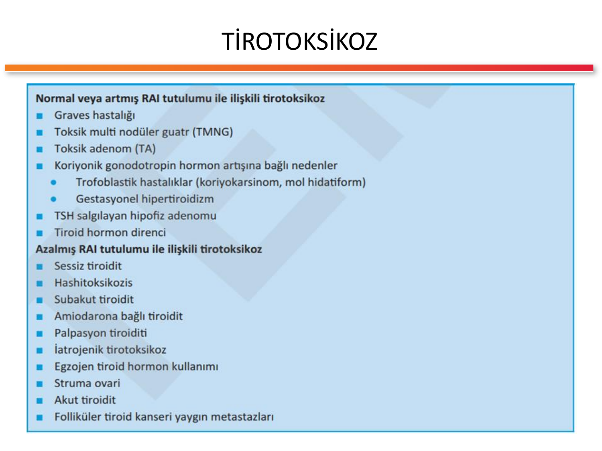

### Normal/Artmış RAI Tutulumu ile İlişkili Tirotoksikoz

| Hastalık | Mekanizma |
|---|---|
| **Graves hastalığı** | TSH reseptör antikoru (TRAb/TSI) -- uyarıcı |
| **Toksik multinodüler guatr (TMNG)** | Multipl otonom nodüller (TSHR somatik mutasyonları) |
| **Toksik adenom (TA)** | Tek otonom nodül |
| **Koryonik gonadotropin artışına bağlı** | hCG'nin TSH reseptörüne çapraz uyarısı |
| -- Trofoblastik hastalıklar | Koryokarsinom, mol hidatiform |
| -- Gestasyonel hipertiroidizm | İlk trimester hCG piki |
| **TSH salgılayan hipofiz adenomu** | Sekonder hipertiroidi (TSH ↑, sT4 ↑) |
| **Tiroid hormon direnci** | THR-β mutasyonu |

### Azalmış RAI Tutulumu ile İlişkili Tirotoksikoz

| Hastalık | Mekanizma |
|---|---|
| **Sessiz tiroidit** | Postpartum veya sporadik -- kısa tirotoksik faz |
| **Hashitoksikozis** | Hashimoto zemininde geçici hormon sızıntısı |
| **Subakut tiroidit (De Quervain)** | Viral, ağrılı, ESH ↑↑ |
| **Amiodarona bağlı tiroidit** | Tip 2 (destrüktif) AIT |
| **Palpasyon tiroiditi** | Travma ile hormon sızıntısı |
| **İatrojenik tirotoksikoz** | Aşırı levotiroksin dozu |
| **Egzojen tiroid hormon kullanımı** | "Thyrotoxicosis factitia" (zayıflama amaçlı gizli kullanım) |
| **Struma ovarii** | Over teratomunda tiroid dokusu |
| **Akut (süpüratif) tiroidit** | Bakteriyel enfeksiyon |
| **Folliküler tiroid kanseri yaygın metastazları** | Metastatik dokudan hormon üretimi |

> 💡 **Mnemonik - Tirotoksikoz etyolojisi "GRAVES'in SESSİZ STRUMA OVARİ OYUNU":** **GRAVES** -- TMNG -- TA -- hCG -- TSH adenom -- direnç (RAI ↑); sonra **SESSİZ** -- **HASHİ**toksikoz -- subakut -- amiodaron -- palpasyon -- iatrojenik -- **STRUMA OVARİ** -- akut -- FTK metastaz (RAI ↓).

---

## HİPERTİROİDİ ALT TİPLERİ

Hipertiroidi primer/sekonder ve subklinik/aşikar olarak alt sınıflandırılır:

| Tip | TSH | Serbest T4 | Serbest T3 |
|---|---|---|---|
| **Primer subklinik** | ↓ | Normal | Normal |
| **Primer aşikar** | ↓ | ↑ | ↑ |
| **Sekonder** | ↑ veya normal | ↑ | ↑ |

> ⭐ **Klinikte pratik kural:** TSH baskılı (<0.1 mU/mL) + sT4/sT3 normal → **subklinik hipertiroidi**; TSH baskılı + sT4/sT3 ↑ → **aşikar (overt) hipertiroidi**; TSH **baskılı değil** (normal/yüksek) + sT4/sT3 ↑ → **sekonder hipertiroidi** (TSHoma) veya tiroid hormon direnci.

### T3 Toksikozu

> **Tanım:** TSH baskılı + sT4 normal + **sT3 yüksek**. Erken/atipik hipertiroidide veya otonom nodüllerde görülür.

---

## EPİDEMİYOLOJİ

- **Hipertiroidi prevalansı: %1.2-1.6**
  - Aşikar: %0.5-0.6
  - Subklinik: %0.7-1.2
- **Kadınlarda** daha sık
- **30-60 yaş** arasında pik insidans

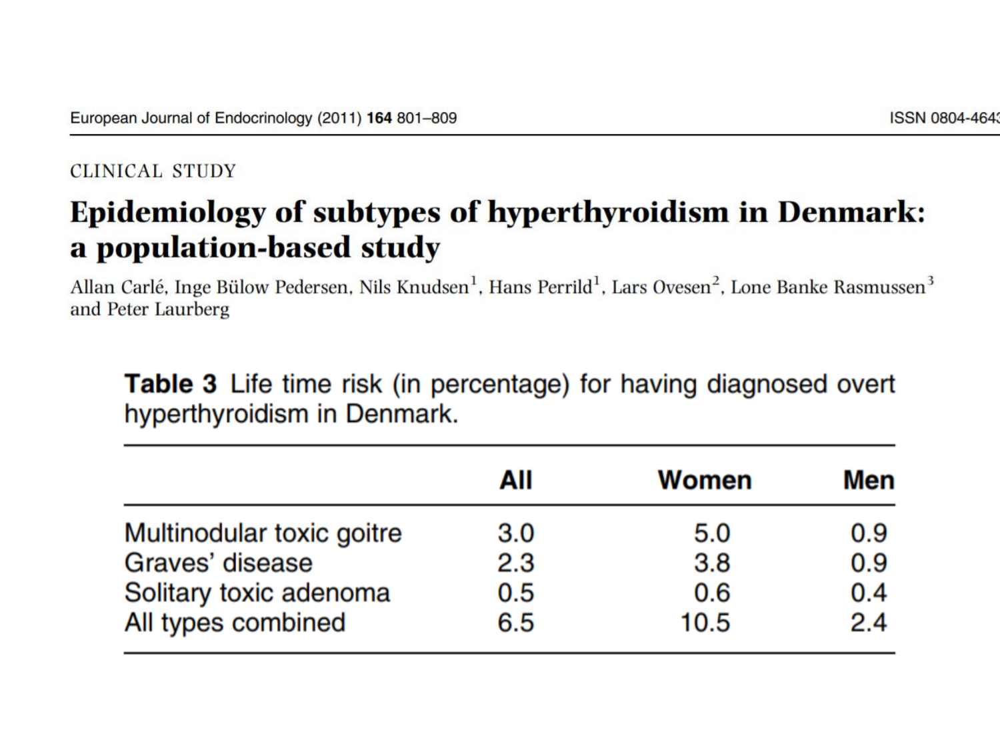

**Yaşam boyu aşikar hipertiroidi riski (Danimarka, Carlé 2011):**

| Alt tip | Toplam | Kadın | Erkek |
|---|---|---|---|
| **Multinodüler toksik guatr** | 3.0 | 5.0 | 0.9 |
| **Graves hastalığı** | 2.3 | 3.8 | 0.9 |
| **Soliter toksik adenom** | 0.5 | 0.6 | 0.4 |
| **Tüm tipler birlikte** | 6.5 | 10.5 | 2.4 |

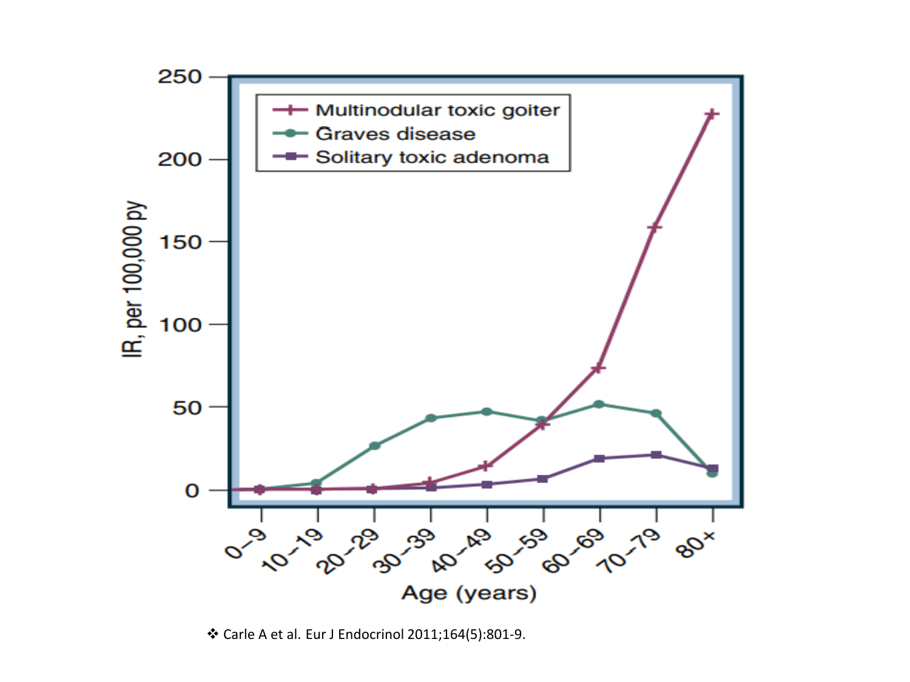

> ⭐ **Kritik gözlem:** **Graves** orta yaşta pik yaparken (~40-60), **TMNG** ileri yaşta ( >60) belirgin artışla klinikte baskın neden olur. Yaşlı hipertiroidik hastada **her zaman TMNG'yi öncelikle düşün**.

> 💡 **Mnemonik - "G-20'ler, T-70'ler":** **G**raves **20-40** yaş; **T**MNG **60-80** yaş ağırlıklı. Toksik adenom -- her yaşta, orta sıklıkta.

---

## KLİNİK BULGULAR

### Semptomlar (Hastanın Yakınmaları)

| Sistem | Semptom |
|---|---|
| 🧠 Nöropsikiyatrik | Sinirlilik, huzursuzluk, halsizlik, konsantrasyon güçlüğü |
| 💓 Kardiyovasküler | Çarpıntı, nefes darlığı |
| 🤢 Gastrointestinal | Diyare, iştah artışı |
| 🔴 Cilt/ısı | Terleme, sıcağa tahammülsüzlük |
| ⚖️ Metabolik | Kilo kaybı (iştah artışına rağmen) |
| 👩 Genital | Oligomenore, libido azalması |

### Bulgular (Muayene ile Tespit Edilen)

| Sistem | Bulgu |
|---|---|
| 💓 Kardiyovasküler | **Taşikardi** (istirahatte >100/dk), atriyal fibrilasyon, yüksek nabız basıncı |
| 🦋 Tiroid | **Guatr** (diffüz veya nodüler), Graves'te üfürüm/tril |
| 🔴 Cilt | Nemli, sıcak cilt; hafif palmar eritem; onikoliz |
| 🤚 Nöromüsküler | **İnce tremor** (ellerde), proksimal miyopati, hiperrefleksi |
| 👁️ Oftalmik (Graves) | **Ekzoftalmus**, lid-lag (Graefe), stare, periorbital ödem |

> 💡 **Mnemonik - Hipertiroidi kliniği "TERLEDİM" (Türkçe):**
> - **T**aşikardi
> - **E**kzoftalmus (Graves)
> - **R**uhsal huzursuzluk (sinirlilik, anksiyete)
> - **L**ezzet arttı ama kilo düşüyor (iştah ↑, kilo ↓)
> - **E**llerde tremor
> - **D**iyare
> - **İ**sı tahammülsüzlüğü + terleme
> - **M**enstruel düzensizlik (oligomenore)

> 💡 **İngilizce mnemonik "SWEATING":** **S**weating, **W**eight loss, **E**motional lability, **A**trial fibrillation, **T**remor, **I**ntolerance to heat, **N**ervousness, **G**oiter.

### Özellikli Fizik Bulgular

- **Plummer tırnağı:** Onikoliz (distal tırnak ayrılması) -- dördüncü parmakta klasik
- **Tiroid akropakisi:** Parmak uçlarında çomaklaşma (Graves'e özgü, %0.1)
- **Pretibial miksödem:** Tibialar önünde turuncu-pembe portakal kabuğu cilt (Graves, %0.5)

---

## GRAVES HASTALIĞI

### Tanım ve Triad

> **Graves hastalığı:** TSH reseptörüne karşı stimülan antikorların (TRAb/TSI) yol açtığı, **multisistem otoimmün bozukluktur.**

**Graves triadı:**

```
      HİPERTİROİDİ
         (+GUATR)
            |
     ┌──────┴──────┐
     ↓             ↓
  OFTALMOPATİ   DERMOPATİ
  (%25-50)      (Pretibial miksödem, %0.5)
                    |
                 Akropaki (%0.1)
```

### Ekstratiroidal Manifestasyonlar

- **Oftalmopati:** Toplam %35
  - Tanı sırasında: %26
  - Süreç içinde ortaya çıkan: %9
  - Ciddi oftalmopati: %5
  - İzole "Oftalmik Graves" (ötiroid): Nadir
- **Dermopati (pretibial miksödem):** %0.5
- **Akropaki:** %0.1

> 💡 **Mnemonik - Graves triadı "3G":** **G**uatr + **G**öz (oftalmopati) + **G**laç (pretibial miksödem -- bacak cildi). "G"lerle hatırla.

### Patogenez

- **TSH reseptör antikoru (TRAb/TSI):** TSH reseptörünü uyararak hormon sentezini artırır.
- T lenfositleri tiroid bezindeki antijenlere duyarlı hale gelir → B lenfositlerini uyarır → TRAb üretimi.
- Otoimmün tiroid hastalığı spektrumunda (Hashimoto ile aynı ailede sık görülür).

**Epidemiyoloji:**
- Kadın/Erkek = **5-8/1**
- En sık **20-40 yaş**

### Tetikleyici ve Risk Faktörleri

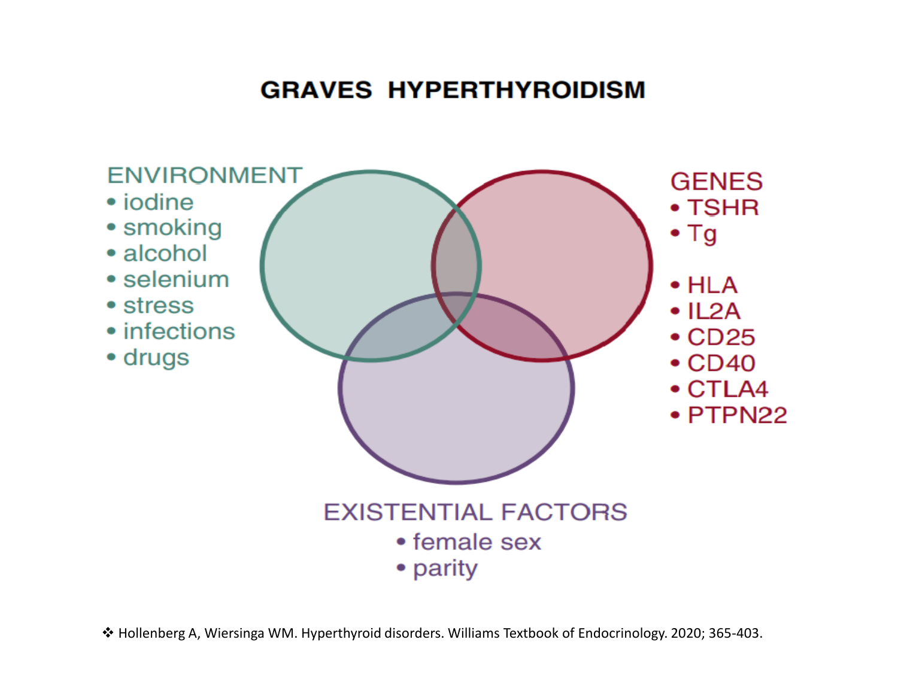

| Kategori | Faktörler |
|---|---|
| **Çevresel** | İyot alımı, **sigara**, alkol, selenyum, stres, enfeksiyonlar, ilaçlar (IFN-α, amiodaron, litium kesilmesi) |
| **Genetik** | TSHR, Tg, **HLA**, IL2A, CD25, CD40, CTLA4, PTPN22 |
| **Varoluşsal** | Kadın cinsiyet, **parite** (postpartum dönem) |

> ⭐ **Klinik ipucu:** **Sigara**, Graves oftalmopatisini hem başlatır hem ağırlaştırır -- bırakma oftalmopati tedavisinin temel taşıdır.

### Graves Oftalmopatisi (NOSPECS Sınıflaması)

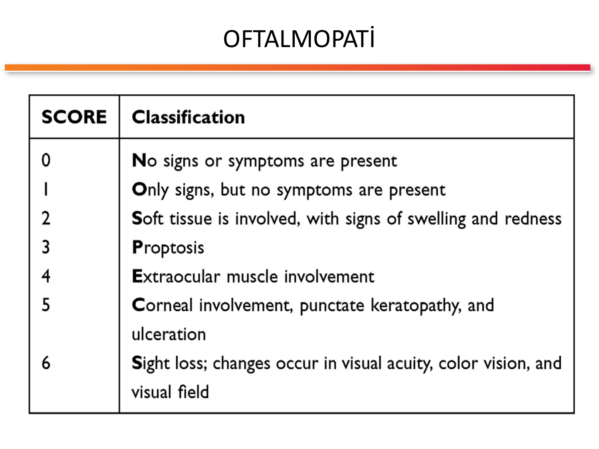

| Skor | Sınıflandırma (NOSPECS) |
|---|---|
| **0** | **N**o signs/symptoms -- Bulgu ve belirti yok |
| **1** | **O**nly signs -- Sadece bulgu, semptom yok (lid-lag, stare) |
| **2** | **S**oft tissue -- Yumuşak doku tutulumu (ödem, kızarıklık) |
| **3** | **P**roptosis -- Proptozis (ekzoftalmus) |
| **4** | **E**xtraocular muscle -- Ekstraoküler kas tutulumu (diplopi) |
| **5** | **C**orneal -- Korneal tutulum, keratopati, ülserasyon |
| **6** | **S**ight loss -- Görme kaybı (optik nöropati) |

> 💡 **Mnemonik - NOSPECS:** Hasta oftalmopati bulgusu ile geldiğinde NOSPECS basamaklarını hatırla -- skor ≥3 ciddi, skor 6 acil cerrahi/steroid endikasyonu.

### Graves Sintigrafisi

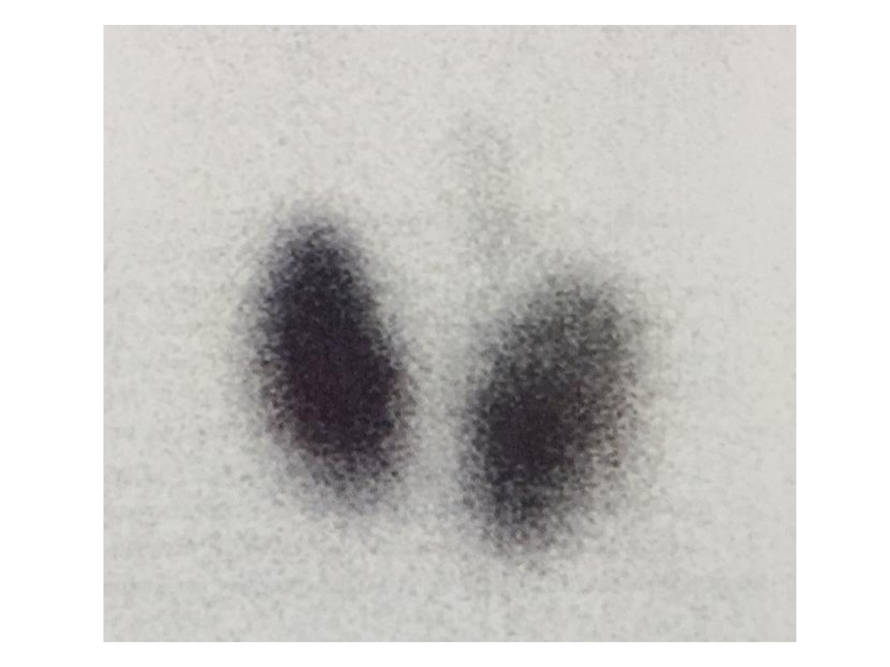

**RAI uptake:** %70 civarı (normal %10-30) -- Graves'e tipik diffüz homojen artmış tutulum.

---

## TOKSİK MULTİNODÜLER GUATR

> **Tanım:** Uzun süredir devam eden multinodüler guatrda, otonom fonksiyon gösteren nodüllerin hormon salgılamasıyla ortaya çıkan hipertiroidi.

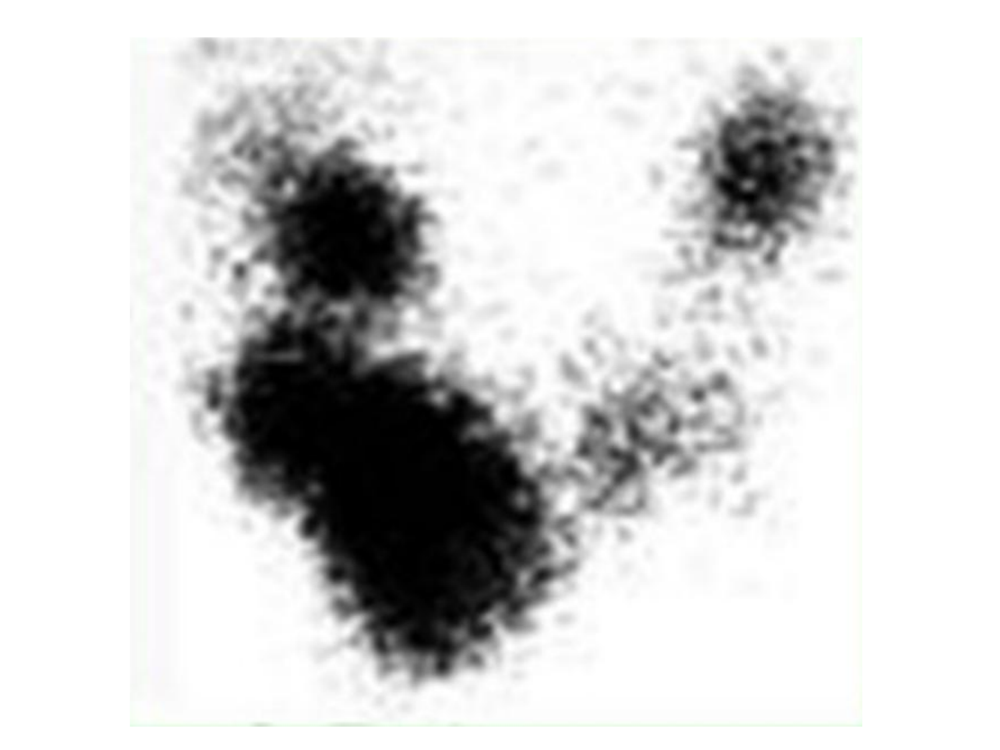

### Patogenez

- **TSHR geninde somatik mutasyonlar** ilk olarak toksik adenomlarda gösterilmiş, TMNG'de de saptanmıştır.
- Mutasyonlar **nodülden nodüle farklılık** gösterir.
- Toksik nodüllerin yaklaşık **%60'ında** TSHR mutasyonları bildirilmiştir.
- Diğer nodüllerde sinyal yollarının farklı basamaklarında mutasyonlar bulunur (Gs-α vb.).

### Gelişim Dinamiği

```
  İyot eksikliği / uzun süreli guatr
              ↓
          Hiperplazi
              ↓
   TSH reseptöründe yapısal aktivasyon
              ↓
    Otokrin mekanizmalar → daha fazla hiperplazi
              ↓
   Multipl nodül oluşumu
              ↓
  TSHR somatik mutasyonları → nodüllerin otonom kazanımı
              ↓
         TOKSİK MNG
```

### Klinik Özellikleri

- Hastalar genellikle **ileri yaşlı** (>60)
- Oftalmopati ve dermopati **yoktur**
- Başlangıç sinsi, kardiyovasküler bulgular (AF, kalp yetmezliği) sıklıkla baskındır
- TRAb **negatif**

---

## TOKSİK ADENOM

> **Tanım:** Tek, otonom fonksiyon gösteren tiroid adenomunun hipertiroidi yapmasıdır. TSHR geninde **somatik aktive edici mutasyon** sorumludur.

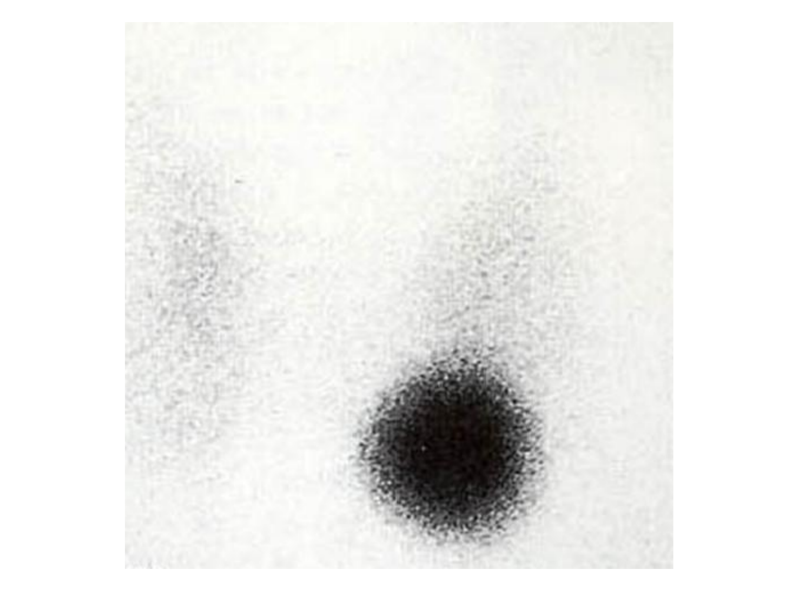

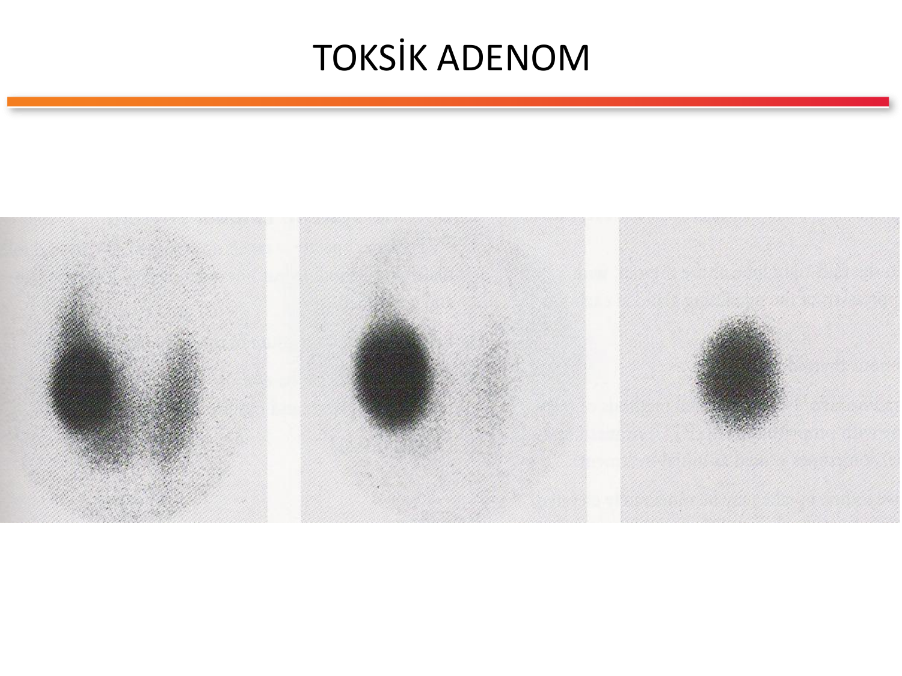

**Evreleri:**
1. **Kompanse (ötiroid otonom nodül):** Nodül sıcak, bez geri kalanı hala aktif, TSH normal
2. **Dekompanse (toksik adenom):** Nodül bezin geri kalanını baskılar, TSH düşük, klinik tirotoksikoz

> ⭐ **Nodül çapı kritiği:** Genellikle **>3 cm** otonom nodüller toksik adenoma dönüşür. 2.5-3 cm altı otonom nodüller subklinik kalabilir.

---

## TANI VE LABORATUVAR

### Algoritma

```
Hipertiroidi şüphesi
        ↓
      TSH
        ↓
┌───────┼────────┐
↓       ↓        ↓
DÜŞÜK  NORMAL   YÜKSEK
 ↓              ↓
sT4/sT3       sT4/sT3
bakılır       bakılır
 ↓              ↓
 (primer)   (sekonder: TSHoma,
            tiroid hormon direnci)
```

### Graves Hastalığında Tanı

| Durum | Yaklaşım |
|---|---|
| **Tirotoksikoz + oftalmopati** | → Graves tanısı kliniktir |
| **Tirotoksikoz, oftalmopati yok** | → TRAb + görüntüleme (US + sintigrafi) |

### TSH Reseptör Antikoru (TRAb)

- **Duyarlılık: %97**
- **Özgünlük: %98**
- Aktif hastalıkta pozitif; antitiroid ilaçla remisyon sonrası kalmakta ısrar ediyorsa **nüks riski yüksek**.

### Laboratuvar Paneli

| Test | Anlam |
|---|---|
| TSH | Hipertiroidide **baskılı** (<0.1 mU/mL) |
| sT4 | Aşikar hipertiroidide yüksek |
| sT3 | Aşikar hipertiroidide yüksek; "T3 toksikozu"nda izole yüksek |
| **TRAb/TSI** | Graves için (%97 duyarlı) |
| Anti-TPO | Otoimmün zemin (Hashitoksikoz, Graves) |
| Hemogram | ATİ öncesi **bazal nötrofil sayımı** |
| ALT/AST | ATİ öncesi bazal transaminaz |
| EKG | Taşikardi, AF değerlendirmesi |

---

## GÖRÜNTÜLEME YÖNTEMLERİ

### Tiroid Ultrasonografisi

**Graves bulguları:**
- **Diffüz guatr**
- **Hipoekojenite** (difüz)
- **Kanlanma artışı** (renkli Doppler'de "thyroid inferno")

**TMNG bulguları:**
- Heterojen parankim
- Multipl nodül (izoekoik/hipoekoik)

### Tiroid Sintigrafisi (Tc-99m veya I-123)

| Patern | Hastalık |
|---|---|
| **Diffüz homojen artmış tutulum** | Graves |
| **Yamalı/heterojen -- birden fazla sıcak nodül** | TMNG |
| **Tek sıcak nodül, bezin geri kalanı baskılı** | Toksik adenom |
| **Azalmış/yok tutulum** | Tiroidit, ekzojen hormon, struma ovarii |

> ⭐ **Sintigrafi aç karna ve iyot kontaminasyonu olmadan yapılır.** Son 2-4 haftada kontrastlı görüntüleme (örn. kontrastlı BT) yapılmışsa sintigrafi yanıltıcıdır.

---

## TİROTOKSİKOZDA AYIRICI TANI ALGORİTMASI

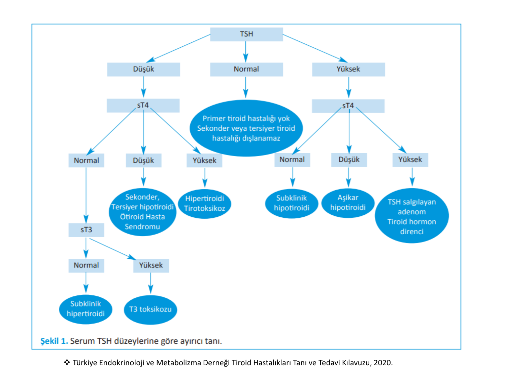

**TSH odaklı yorumlama matrisi (TEMD 2020):**

```
                          TSH ÖLÇ
                            |
      ┌────────────────────┼─────────────────────┐
      ↓                    ↓                     ↓
   DÜŞÜK               NORMAL                YÜKSEK
      |                    |                     |
   sT4 bak          Primer tiroid hst       sT4 bak
      |              dışlanır; sekonder/         |
      |              tersiyer tiroid hst         |
      |              dışlanamaz                  |
   ┌──┼──┐                                  ┌────┼────┐
   ↓  ↓  ↓                                  ↓    ↓    ↓
  N  ↓   ↑                                  N    ↓    ↑
  |  |   |                                  |    |    |
  sT3  Sekonder/  HİPERTİROİDİ          Subklinik Aşikar TSH salgılayan
  bak  Tersiyer  TİROTOKSİKOZ          hipotiroidi hipotiroidi adenom
   |   hipotiroidi                                          Tiroid hormon
 ┌─┼─┐ ÖHS                                                  direnci
 ↓   ↓
 N   ↑
 |   |
Subklinik  T3
hipertiroidi  toksikozu
```

> 💡 **Mnemonik - TSH yorumu:** **TSH baskılı + sT4 ↑ = aşikar hipertiroidi; TSH baskılı + sT4 N + sT3 ↑ = T3 toksikozu; TSH baskılı + sT4 N + sT3 N = subklinik hipertiroidi; TSH N/↑ + sT4 ↑ = sekonder (TSHoma / direnç).**

---

## TEDAVİ İLKELERİ

### Ötiroidi Sağlanıncaya Kadar Önlemler

- **Ağır fiziksel egzersizden kaçın** (AF, iskemi riski)
- **Kafein** alımı azaltılmalı
- **Dekonjestanlar** ve soğuk algınlığı ilaçlarından (sempatomimetikler) kaçın
- **Sigara** bırakılmalı (özellikle Graves'te -- oftalmopati riski)
- **İyot içerikli gıda/ilaç** (amiodaron, iyotlu kontrast, algler) alınmamalı
- Taşikardik semptomlarda **beta-bloker** (propranolol) eklenebilir

### Üç Ana Tedavi Yaklaşımı

| Yöntem | Mekanizma | Endikasyon |
|---|---|---|
| **Antitiroid ilaçlar (ATİ)** | Hormon sentezini inhibe eder | Graves ilk seçenek; cerrahi/RAI öncesi hazırlık |
| **Radyoaktif iyot (RAI)** | Tiroid dokusunu ablate eder | Graves nüks, TMNG, toksik adenom |
| **Cerrahi** | Tiroid dokusunu fiziken çıkarır | Büyük guatr, malignite kuşkusu, gebelikte ATİ intoleransı, oftalmopati |

### Beta-Bloker

- **Propranolol** (tercih -- non-selektif, periferik T4→T3 dönüşümünü de kısmen azaltır): 20-40 mg × 3-4/gün
- Atenolol/metoprolol kardiyoselektif alternatifler
- Astım, kalp yetmezliği (sistolik fonksiyon düşük), bradikardi kontrendikasyon

---

## ANTİTİROİD İLAÇLAR

### İlaç Seçenekleri

| İlaç | Yıl | Özellikler |
|---|---|---|
| **Metimazol (MMI)** | 1949 | **Tercih edilen.** Yan etki daha az; günde tek doz; gebelikte 1. trimesterden sonra güvenli |
| **Propiltiourasil (PTU)** | 1946 | **Gebelikte 1. trimester** ve **tirotoksik krizde** tercih; periferik T4→T3 dönüşümünü inhibe eder |
| **Karbimazol** | -- | Ülkemizde yok (MMI ön ilacı) |

### Etki Mekanizması

**Tiroid peroksidaz (TPO) inhibisyonu:**
- İyodun oksidasyonunu inhibe eder
- İyodun tiroglobuline **organifikasyonunu** inhibe eder
- PTU ekstra olarak periferde T4→T3 dönüşümünü azaltır (tirotoksik krizde avantaj)

### Yan Etkiler

| Yan Etki | Sıklık | Yönetim |
|---|---|---|
| Kaşıntı, deri döküntüsü | %4-6 | Antihistaminik; hafifse tedaviye devam |
| Artralji | %1-5 | Takip; ilaca devam |
| Gastrointestinal | %1-5 | Semptomatik |
| Toksik hepatit, kolestatik sarılık | Nadir | **İlaç derhal kesilir** |
| Vaskülit | Nadir (çoğu PTU) | İlaç kesilir, diğer ajana geçiş/ablatif tedavi |
| **Agranülositoz** | **%0.2-0.5** | **İlaç derhal kesilir, acil başvuru!** |

### Agranülositoz Uyarısı

> **🚨 KRİTİK UYARI - Agranülositoz:**
> - **Ateş + boğaz ağrısı** → ATİ kullanan her hastada **acil CBC** iste!
> - İlk 3 ay en yüksek risk
> - Absolu nötrofil <500/mm³ ise **ATİ kes + hematoloji konsültasyonu + G-CSF** düşün
> - MMI ve PTU arasında çapraz reaksiyon olabilir -- genellikle ablatif tedaviye geçilir

> 💡 **Mnemonik - ATİ yan etki "ÇADAG" (Çok Aman Dikkat Agranülositoz!):** **Ç**adır döküntü (kaşıntı/döküntü), **A**rtralji, **D**üzensiz karaciğer (hepatit), **A**granülositoz, **G**riplenme gibi ateş + boğaz ağrısı = hemen CBC. Agranülositoz **tek başına hayati tehlike yaratan** yan etkidir.

### Tedaviye Başlamadan Önce

- **Bazal hemogram** (WBC, nötrofil sayımı)
- **Transaminazlar** (ALT, AST)
- Başlamama kriterleri:
  - Bazal **absolu nötrofil <1.000/mm³**
  - **Transaminaz >5× üst sınır**
- Hastaya yan etkiler ve acil başvuru gereken durumlar anlatılmalı

### Doz -- Graves Hastalığı (MMI)

| Başlangıç FT4 düzeyi | MMI dozu |
|---|---|
| Normal üst sınırın 1-1.5 katı | **5-10 mg/gün** |
| Normal üst sınırın 1.5-2 katı | **10-20 mg/gün** |
| Normal üst sınırın 2-3 katı | **30-40 mg/gün** |

- Ötiroidi sağlandıkça **doz kademeli azaltılır**
- En küçük etkin dozla (genellikle 5 mg) uzun süre (**1-2 yıl**) devam edilir
- Uzun süreli kullanım immün sistem üzerinden **remisyon şansını artırır**

### Doz -- Toksik Adenom ve TMNG

- RAI veya cerrahi tedavi öncesi **ötiroid hazırlık** için kullanılır
- **RAI sonrası 6-8 hafta** boyunca ATİ'ye devam gerekebilir (RAI etkisi gecikmeli başlar)
- RAI/cerrahi uygulanamayan **yaşlı hastalarda** yaşam boyu düşük doz ATİ bir seçenek

### Remisyon ve Nüks

- Yeterli süre ve dozda ATİ sonrası **nüks %40-60** (Graves'te)
- Nüks veya ciddi yan etkide → **ablatif tedavi** (RAI veya cerrahi)
- Ablatif tedavi öncesi mutlaka **ATİ ile ötiroid hale getir**

---

## RADYOAKTİF İYOT TEDAVİSİ

### Avantajlar

- Uygulama **kolay** (oral, tek doz)
- **Yan etki oranı düşük**
- **Ayaktan** tedavi olanağı
- **Kesin** tedavi (çoğu hastada)

### Kontrendikasyonlar

| Tip | Durum |
|---|---|
| **Mutlak** | **Gebelik** ve **emzirme dönemi** |
| **Rölatif** | Ciddi **oftalmopati** (alevlenme riski), büyük guatr, intratorasik guatr, malignite kuşkusu (cerrahi gereklidir) |

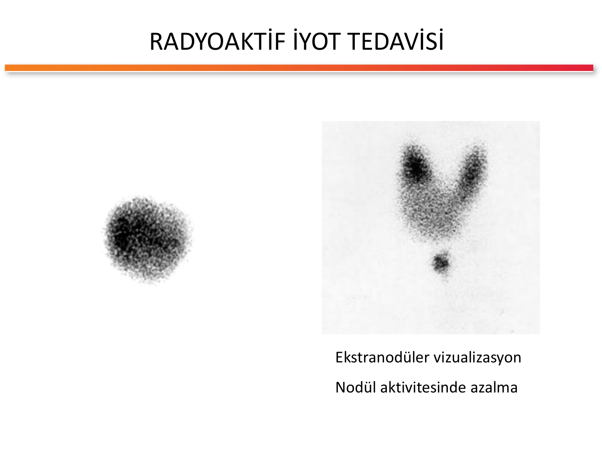

### RAI Uygulamasının Hedefleri

- Graves: **Hipotiroidi hedeflenir** (bez tamamen ablate edilir → sonraki levotiroksin replasmanı)
- TMNG/Toksik adenom: Otonom nodüller baskılanır, çevre doku aktivasyonu sağlanır

### Komplikasyonlar

- **Akut tiroidit** (ilk 1-2 hafta)
- **Kısa süreli hipertiroidi alevlenmesi** (depolanmış hormonun salınımı)
  - ⚠️ **Yaşlı ve kardiyovasküler hastalığı olanlarda aritmi/iskemi tetikleyebilir!**
  - ATİ + beta-bloker ile ön hazırlık önemli
- Kalıcı **hipotiroidi** (zaten beklenen son sonuç çoğu hastada)
- Oftalmopatide kötüleşme (özellikle sigara içen Graves hastalarında)

> 💡 **Mnemonik - RAI kontrendikasyon "GEMMA":** **G**ebelik, **E**mzirme, **M**alignite (cerrahi gerekiyorsa), **M**ega guatr (büyük/intratorasik), **A**ktif oftalmopati.

---

## CERRAHİ TEDAVİ

### Prosedürler

| Yöntem | Endikasyon |
|---|---|
| **Lobektomi** | Soliter toksik adenom |
| **Total tiroidektomi** | Graves, TMNG (iki taraflı) |

### Komplikasyonlar

| Komplikasyon | Açıklama |
|---|---|
| Anestezi komplikasyonları | Genel cerrahi riskleri |
| **Akut dönemde kanama** | Hematom (havayolu tehdidi -- acil boşaltma) |
| **Hipoparatiroidi** | Geçici (%10-30) veya **kalıcı** (%1-3); hipokalsemi izlenmeli |
| **Rekürren laringeal sinir yaralanması** | Ses kısıklığı; %1-2 (tek taraflı); tekrar cerrahide risk **3-10 kat artar** |

### Cerrahi Endikasyonları

- Büyük semptomatik guatr (bası, intratorasik)
- Malignite kuşkusu
- **Ciddi oftalmopati** (RAI alevlendirir)
- Gebelikte ATİ intoleransı (2. trimesterde tercih)
- ATİ yetersizliği + RAI kontrendikasyonu

---

## GRAVES OFTALMOPATİSİ TEDAVİSİ

### Temel Prensipler

- **Ötiroidi hızla sağlanmalı ve sürdürülmelidir** (hem hipo- hem hiper- göz bulgularını kötüleştirir)
- **Sigara içenler bırakma konusunda uyarılmalıdır** (en kritik davranışsal önlem)
- **Selenyum** suplementasyonu (6 ay) hafif-orta olguda olumlu etki
- Yapay gözyaşı, güneş gözlüğü, başı yüksek yatış

### Aktif/Ciddi Oftalmopatide

| Tedavi | Detay |
|---|---|
| **İV metilprednizolon** | Haftada bir 500 mg × 6 hafta, sonra 250 mg × 6 hafta |
| **Retrobulber ışınlama** | Seçilmiş olgularda (diplopili) |
| **Rituksimab** | Refrakter/ciddi olgularda |
| **Teprotumumab** | IGF-1R inhibitörü (yeni, ülkemizde kısıtlı) |
| **Cerrahi dekompresyon** | Optik nöropati, korneal risk, inaktif dönemde kozmetik |

> ⭐ **RAI + Ciddi oftalmopati uyarısı:** RAI, aktif oftalmopatisi olan sigara içen hastada göz tablosunu **alevlendirebilir.** Bu hastalarda ATİ ile uzun süre tedavi veya cerrahi tercih edilir; RAI verilecekse **profilaktik oral steroid** (0.4 mg/kg/gün prednizolon, 1 ay) eklenir.

---

## GEBELİKTE HİPERTİROİDİ

### Önemi

**Tedavi edilmemiş hipertiroidinin gebelik sonuçları:**
- **Ölü doğum**
- **Erken doğum**
- **Preeklampsi**
- **İntrauterin gelişme geriliği**
- Konsepsiyonda tespit edilmemiş hipertiroidi → **spontan abortus**
- Fetal/neonatal tirotoksikoz (maternal TRAb plasentayı geçer)

### Etyoloji

- Gebelikte de **en sık neden Graves hastalığı**
- **Gestasyonel geçici tirotoksikoz** (hiperemezis gravidarum, hCG aracılı) ayırıcı tanıda önemli

### Graves vs Gestasyonel Tirotoksikoz Ayırımı

| Özellik | Graves Hastalığı | Gestasyonel Tirotoksikoz |
|---|---|---|
| **Otoimmün tiroid hst öyküsü (OİTH)** | ✅ Sık | ❌ Yok |
| **Orbitopati/dermopati** | ✅ Olabilir | ❌ Yok |
| **TRAb** | ✅ Pozitif | ❌ Negatif |
| **Diğer tiroid antikorları** | ✅ Sıklıkla (+) | ❌ Negatif |
| **Tiroid US -- heterojen parankim** | ✅ Var | ❌ Yok |
| **Tiroid Doppler US -- kan akımı** | ✅ Artmış | Normal |
| **Hiperemezis birlikteliği** | ± | **Sık** (özellikle çoğul gebelik, mol hidatiform) |

> ⚠️ **Gebede radyonüklid YASAK:** Ne tanısal ne terapötik amaçla radyoaktif iyot verilmez -- fetal tiroid hasarı oluşur. Tanı klinik + laboratuvar + (gerekirse) tiroid US ile konur.

### Gebelikte Antitiroid İlaç Seçimi -- Trimester Kuralı

```
  1. TRİMESTER       2.-3. TRİMESTER       LAKTASYON
 (organogenez)                             (emzirme)
      |                    |                  |
     PTU   ───────→    Metimazol   ──────→   Her ikisi
                                              güvenli
                                             (düşük doz)
```

| Dönem | Tercih | Neden |
|---|---|---|
| **1. trimester** (gebelik 0-12. hafta) | **PTU** | MMI aplazia kutis + metimazol embriyopatisi (koanal/özofageal atrezi, disformik yüz) yapabilir |
| **2.-3. trimester** | **Metimazol** | PTU hepatotoksisite riski; FDA uyarısı |
| **Laktasyon** | Her ikisi güvenli (düşük doz) | Süte geçiş minimal |

> 💡 **Mnemonik - Gebelikte "PTU önce, MMI sonra":** **P**TU = "**P**reconception ve **P**irst (1.) trimester"; **M**MI = "**M**id (orta) ve **M**ature (geç) trimester". Doz **mümkün olan en düşük düzeyde** tutulur (fetal hipotiroidi/guatr riski).

> ⚠️ **PTU Hepatotoksisite:** Herhangi bir zamanda (ilk doz dahil) gelişebilir. Bu nedenle PTU'nun **ilk trimester ile sınırlandırılması** önerilir.

### Gebelikte Hedef

- Maternal sT4 normalin **üst sınırına yakın** tutulur (fetal hipotiroidi riski)
- TSH hedefi değil -- baskılı kalabilir
- **TRAb** gebelik boyunca 2-3 kez bakılır (3. trimesterdeki yüksek düzey → fetal/neonatal Graves riski)

---

## ÖZEL DURUMLAR - APATİK HİPERTİROİDİZM VE TİROİD FIRTINASI

### Apatik Hipertiroidizm (Yaşlı)

> **Tanım:** Yaşlı (>60) hastalarda klasik adrenerjik semptomlar yerine **apati, depresyon, kilo kaybı, kas güçsüzlüğü, AF, kalp yetmezliği** ile prezente olan hipertiroidi varyantı.

**Özellikleri:**
- Klasik hipertiroidi semptomları **silinir** (sinirlilik, hiperaktivite yok)
- Sıklıkla **TMNG** zemininde
- Guatr **küçük** olabilir, oftalmopati yoktur
- İlk bulgu sıklıkla **yeni başlangıçlı atriyal fibrilasyon** veya **dirençli kalp yetmezliği**
- Kilo kaybı → malignite sanılabilir
- Tedavi edilmezse mortalite yüksek

> ⭐ **Klinik yaklaşım:** Yaşlıda açıklanamayan AF, kilo kaybı veya apati varsa **TSH mutlaka isteklenmelidir**. "Yaşlıda depresyon gibi duran tiroid fırtınası" -- apatik hipertiroidi klinik kapısıdır.

---

### Tiroid Fırtınası (Tirotoksik Kriz)

> **Tanım:** Tirotoksikozun **hayati tehdit oluşturan dekompanse formu.** Multipl organ yetmezliği ile seyreder, tedavisiz mortalite **%80-100**, tedavi ile **%20-30**.

**Tetikleyici Faktörler:**

| Kategori | Örnekler |
|---|---|
| Enfeksiyon | Pnömoni, idrar yolu, sepsis |
| Cerrahi/travma | Tiroid cerrahisi (preop ötiroid değilse), diğer operasyonlar |
| İyot yükü | İyotlu kontrast, amiodaron |
| Metabolik | DKA, hipoglisemi |
| Kardiyovasküler | Miyokard infarktüsü, pulmoner emboli |
| İlaç/ATİ | Ani ATİ kesilmesi, RAI sonrası (nadir) |
| Obstetrik | Doğum, preeklampsi |

#### Burch-Wartofsky Skoru (Tiroid Fırtınası Tanı)

| Parametre | Skor |
|---|---|
| **Termoregülasyon -- Ateş (°C)** | |
| 37.2-37.7 | 5 |
| 37.8-38.3 | 10 |
| 38.4-38.8 | 15 |
| 38.9-39.4 | 20 |
| 39.5-39.9 | 25 |
| ≥40 | 30 |
| **SSS Bulguları** | |
| Yok | 0 |
| Hafif ajitasyon | 10 |
| Deliryum, psikoz, aşırı letarji | 20 |
| Nöbet/koma | 30 |
| **GIS/Hepatik** | |
| Yok | 0 |
| Bulantı, kusma, diyare, karın ağrısı | 10 |
| Açıklanamayan sarılık | 20 |
| **Kardiyovasküler -- Taşikardi (/dk)** | |
| 99-109 | 5 |
| 110-119 | 10 |
| 120-129 | 15 |
| 130-139 | 20 |
| ≥140 | 25 |
| **Konjestif Kalp Yetmezliği** | |
| Yok | 0 |
| Hafif (ayak ödemi) | 5 |
| Orta (bibaziler ral) | 10 |
| Ağır (pulmoner ödem) | 15 |
| **Atriyal Fibrilasyon** | |
| Yok | 0 |
| Var | 10 |
| **Tetikleyici Olay** | |
| Yok | 0 |
| Var | 10 |

**Skor Yorumu:**
- **<25:** Tiroid fırtınası olası değil
- **25-44:** Kuvvetli şüphe (impending storm)
- **≥45:** **Tiroid fırtınası ile uyumlu**

> 💡 **Mnemonik - Tiroid fırtınası bulguları "ATEŞ KALP":**
> - **A**teş (yüksek, >38.5)
> - **T**aşikardi (>130/dk, AF sık)
> - **E**njeksiyonla (enfeksiyon) tetiklenme
> - **Ş**uurda bozulma (ajitasyon → koma)
> - **K**alp yetmezliği (akut pulmoner ödem)
> - **A**ğrı karında + kusma + diyare
> - **L**ökositoz, **L**iver (sarılık, AST ↑)
> - **P**sikoz/paranoyak (SSS disfonksiyonu)

#### Tiroid Fırtınası Tedavi Algoritması

```
          TİROİD FIRTINASI ŞÜPHESİ
         (Burch-Wartofsky ≥45 veya klinik)
                    ↓
        ┌───────────┼───────────────┐
        ↓           ↓               ↓
    DESTEK      HORMON SENTEZ   HORMON SALINIMI
    TEDAVİ      İNHİBİSYONU     İNHİBİSYONU
        ↓           ↓               ↓
  - Soğutma     PTU 500-1000 mg  Lugol solüsyonu
    (asetaminofen)  yükleme,      (Wolff-Chaikoff
    (ASA KULLANMA!) 250 mg/4 st    etkisi)
  - İV sıvı                       YA DA
  - Elektrolit   (MMI 60-80       SSKI
  - O2           mg/gün)          (potasyum iyodür)
                                  ** PTU'dan 1 saat
                                  SONRA başlanır!
        ↓           ↓               ↓
        └───────────┼───────────────┘
                    ↓
        ┌───────────┼───────────────┐
        ↓           ↓               ↓
   ADRENERJİK   T4→T3            TETİKLEYİCİYİ
   BLOKAJ       DÖNÜŞÜMÜ         TEDAVİ ET
                AZALT
        ↓           ↓               ↓
   Propranolol  Hidrokortizon    Enfeksiyon:
   60-80 mg     100 mg İV/8 st   antibiyotik
   /4-6 st      (+PTU + iyot:    DKA: insülin
   (astım varsa CV T4→T3 azaltır) Emboli: antikoag.
   dilti./verapamil)               vs.
                    ↓
        Kontrolsüz/refrakter →
        PLAZMAFEREZ / total tiroidektomi
```

**Tiroid Fırtınası Tedavi Beşlisi:**

1. **Tiroid hormon sentezini inhibe et:** **PTU** (tercih -- T4→T3 dönüşümünü de bloke eder) 500-1000 mg yükleme → 250 mg PO/NG her 4 saatte. PTU yoksa MMI 60-80 mg/gün.
2. **Tiroid hormon salınımını inhibe et:** **Lugol** (iyotlu solüsyon) veya SSKI -- **PTU'dan en az 1 saat sonra** (önce verilirse iyot substrat oluşturup alevlendirir).
3. **Adrenerjik blokaj:** **Propranolol** 60-80 mg PO/4-6 saatte veya 1 mg İV yavaş (kardiyak monitörde).
4. **Periferik T4→T3 dönüşümünü azalt:** **Hidrokortizon** 100 mg İV her 8 saatte (olası rölatif adrenal yetmezlik için de).
5. **Destek tedavi ve tetikleyici tedavi:** Soğutma (asetaminofen; **ASA -- aspirin -- KULLANILMAZ!** Tiroid hormonunu TBG'den ayırıp serbest hormonu artırır), İV sıvı-elektrolit, O2, enfeksiyon tedavisi, DKA yönetimi.

> ⚠️ **Tiroid fırtınası "sırası" kritik:**
> 1. **Önce PTU** (sentezi kapat)
> 2. **Sonra (≥1 saat sonra) iyot** (salınımı kapat)
> 3. **Beta-bloker + hidrokortizon** eş zamanlı başlanabilir
> 4. **Aspirin verme!**

> 💡 **Mnemonik - Tiroid fırtınası 5'lisi "BIST-H":** **B**eta-bloker, **I**yot (PTU'dan sonra), **S**teroid (hidrokortizon), **T**iyoüre (PTU), **H**asarlandıran tetikleyici tedavisi.

---

## KLİNİK VAKALAR

**📋 VAKA ÖRNEĞİ 1: Klasik Graves Hastalığı**

**Hasta:** 35 yaş, kadın
**Yakınma:** Çarpıntı, aşırı terleme, sinirlilik
**Öykü:** 1 aydır süren yakınmalar. Gözlerinde "dışa doğru çıkma" ve kumlanma hissi de başlamış. Sıcak havaya tahammülsüzlük.
**Özgeçmiş:** Özellik yok
**Soygeçmiş:** Anne romatoid artrit (otoimmün aile öyküsü)
**Alışkanlıklar:** 1 paket/gün sigara, alkol yok
**Kullandığı ilaç:** Yok

**Fizik Muayene:**
- KB: 130/80 mmHg, Nabız 106/dk (ritmik, taşikardik), Ateş 36.8°C
- Cilt nemli, sıcak
- Ellerde ince tremor
- Gözlerde hafif proptozis ve lid-lag
- Tiroid her iki lobda nodüller **ele geliyor** (diffüz hassas büyüme + nodülarite)

**Laboratuvar:**
- **sT3: 5.2 pg/mL** (N: 1.3-4.75) ↑
- **sT4: 2.6 ng/dL** (N: 0.8-1.9) ↑
- **TSH: 0.01 mU/mL** (N: 0.4-4) ↓↓ (baskılı)

**Tiroid Ultrasonografisi:**
- Sağ lob: 46×19×18 mm, sol lob: 52×16×15 mm
- Sağ lobda 14×10 mm, sol lobda 22×14 mm **düzgün sınırlı hipoekoik nodüller**

**Radyoaktif İyot Uptake:**
- **%70** (N: %10-30) -- diffüz artmış tutulum

**Tanı:** Graves hastalığı (klinik triad: hipertiroidi + guatr + hafif oftalmopati; K/E = 5-8/1, 20-40 yaş tipik)

**Tedavi:**
- **Metimazol 20 mg/gün** (sT4 normalin 1.5× katı → orta doz)
- **Propranolol 40 mg × 3/gün** (semptomatik taşikardi için)
- **Sigara bırakma desteği** (oftalmopati için kritik)
- TRAb, anti-TPO istendi
- 4-6 haftada kontrol (TSH 6 haftada anlamlı yanıt verir, sT4/sT3 daha erken)

**Öğretici Notlar:**
1. Klasik Graves profili: **genç kadın + otoimmün aile öyküsü + sigara + çarpıntı + oftalmopati**.
2. Nodül varlığı Graves'i dışlamaz -- TMNG ile birliktelik olabilir ("Marine-Lenhart sendromu"). Sintigrafi ayırt eder.
3. RAI uptake **>50%** Graves/TMNG/toksik adenom (artmış tutulum grubu) ayırıcı tanısında değerli. Tiroiditte düşük olur.
4. ATİ tedavisi 1-2 yıl sürdürülür; nüks çok yüksekse (TRAb persistan +, gencde/büyük guatr) RAI veya cerrahi düşünülür.

---

**📋 VAKA ÖRNEĞİ 2: Apatik Hipertiroidi / Tiroid Fırtınası Riski**

**Hasta:** 74 yaş, erkek
**Yakınma:** Son 3 aydır kilo kaybı (8 kg), halsizlik, çarpıntı; son 2 gündür **bilinç bulanıklığı** ve **nefes darlığı**
**Öykü:** 3 yıldır multinodüler guatr tanısıyla izlenmiş, tedavisiz. Son 1 haftada idrar yolu enfeksiyonu nedeniyle hastaneye yatış yapılmış, kontrastlı BT çekilmiş. 2 gündür ateşi yükselmiş.
**Özgeçmiş:** Hipertansiyon, KAH
**Soygeçmiş:** Özellik yok

**Fizik Muayene:**
- **Ateş: 39.2°C**, Nabız 148/dk (düzensiz -- **atriyal fibrilasyon**), KB 110/60 mmHg, Solunum 28/dk, SpO₂ %91
- Şuur: Ajite, dezoryante
- Tiroid: Bilateral büyümüş, multipl nodüler -- **TMNG**
- Akciğer: Bibaziler raller (pulmoner ödem)
- Cilt kuru (dehidratasyon), ince tremor

**Laboratuvar:**
- TSH <0.01 mU/mL, sT4 ≫ normal, sT3 çok yüksek
- WBC 15.000 (sola kayma), ALT 120, AST 140, bilirubin hafif yüksek
- Kreatinin 1.8 mg/dL (prerenal), CRP 180

**Burch-Wartofsky skoru:**
- Ateş 39.2 → **25**
- Bilinç (deliryum) → **20**
- Taşikardi 148 + AF → **25 + 10**
- Kalp yetmezliği (orta) → **10**
- Tetikleyici (enfeksiyon + kontrast iyot) → **10**
- Hafif transaminit/sarılık → **10**
- **Toplam: ~110 → TİROİD FIRTINASI**

**Tanı:** Tiroid fırtınası -- TMNG zemininde, **iyotlu kontrast + enfeksiyon tetikleyicili** (klasik apatik hipertiroidi zeminde dekompansasyon)

**Tedavi (yoğun bakımda):**
1. **PTU** 500 mg PO/NG yükleme → 250 mg/4 saatte
2. **Propranolol** 60 mg PO/6 saatte (sistolik fonksiyon korunduğunda) -- AF için kritik
3. **Hidrokortizon** 100 mg İV/8 saatte
4. PTU'dan **1 saat sonra Lugol** 5-10 damla/6 saatte
5. **Asetaminofen** ile soğutma (aspirin verilmez)
6. Geniş spektrumlu antibiyotik (enfeksiyon)
7. İV sıvı resüsitasyonu, elektrolit düzeltmesi, O2
8. Ötiroidi sonrası → **cerrahi total tiroidektomi** planı (TMNG, yaşlı hastada RAI alevlenmesi endişesi)

**Öğretici Notlar:**
1. **İyotlu kontrast** (jod-Basedow), TMNG'li yaşlı hastada tiroid fırtınasını tetikleyen klasik nedendir; preoperatif görüntüleme planlarında TSH kontrol edilmelidir.
2. **Aspirin** kontrendikedir -- TBG'den hormon ayırır, serbest T4/T3 artırır.
3. **PTU önce → iyot sonra** sırası mutlaktır. Tersi iyodu substrat yapar ve hastalığı alevlendirir.
4. Yaşlıda apatik hipertiroidi: kilo kaybı + AF + halsizlik → TSH bak!
5. Burch-Wartofsky ≥45 = tanı; ≥25 = impending storm.

---

## ÖZET KARŞILAŞTIRMA TABLOSU

### Hipertiroidi Etyolojileri -- Ayırıcı Bulgular

| Özellik | Graves | TMNG | Toksik Adenom | Tiroidit (tirotoksik faz) | Gestasyonel |
|---|---|---|---|---|---|
| **Yaş** | 20-40 | >60 | Her yaş | Her yaş | Gebe |
| **Cinsiyet (K/E)** | 5-8/1 | K>E | K>E | K>E | K |
| **Guatr** | Diffüz | Multinodüler | Tek nodül | Ağrılı (subakut) / ağrısız | Hafif diffüz |
| **Oftalmopati** | ✅ | ❌ | ❌ | ❌ | ❌ |
| **TRAb** | ✅ (+) | ❌ | ❌ | ❌ | ❌ (hCG yüksek) |
| **Anti-TPO** | ± | ± | ± | Hashitoksikoz'da (+) | ❌ |
| **USG** | Diffüz hipoekoik, kanlanma ↑↑ | Multinodüler heterojen | Tek nodül + baskılı parankim | Heterojen, hipoekoik | Normal/hafif büyüme |
| **Sintigrafi (RAI uptake)** | Diffüz homojen, ↑↑ (%70) | Yamalı, multi-sıcak nodül | Tek sıcak nodül, bez baskılı | **Azalmış** (~<5%) | Azalmış (gebede yapılmaz) |
| **Sedimantasyon** | N | N | N | ↑↑ (subakut) | N |
| **Tedavi** | ATİ → RAI / Cerrahi | RAI / Cerrahi | RAI / Lobektomi | NSAİİ, beta-bloker, izlem | Destek (gen. kendiliğinden düzelir) |

### Graves vs Toksik Nodüler Karşılaştırma

| Özellik | Graves | Toksik Nodüler (TMNG/TA) |
|---|---|---|
| Mekanizma | Otoimmün (TRAb) | Somatik TSHR mutasyonu |
| Bez tutulumu | Diffüz | Fokal (nodüler) |
| Parankim aktivitesi | Homojen aktif | Nodül aktif + çevre baskılı |
| Oftalmopati | ✅ (%25-50) | ❌ |
| Dermopati | ✅ (%0.5) | ❌ |
| TRAb | ✅ | ❌ |
| Remisyon ihtimali (ATİ ile) | Var (%40-60) | ❌ (otonom -- kalıcı tedavi gerekir) |
| RAI başarısı | Yüksek (hipotiroidi hedefli) | Yüksek (nodül ablasyon) |

### Antitiroid İlaçlar -- MMI vs PTU

| Özellik | Metimazol (MMI) | Propiltiourasil (PTU) |
|---|---|---|
| **Günlük doz sayısı** | 1-2 | 3-4 |
| **Yarı ömür** | Uzun | Kısa |
| **Periferik T4→T3 dönüşümü inhibisyonu** | ❌ | ✅ |
| **Gebelik 1. trimester** | ❌ (embriyopati) | ✅ **Tercih** |
| **Gebelik 2.-3. trimester** | ✅ **Tercih** | ❌ (hepatotoksik) |
| **Tirotoksik kriz** | Yetersiz | ✅ **Tercih** |
| **Hepatotoksisite** | Kolestatik (nadir) | **Fulminan hepatit** (FDA uyarısı) |
| **Agranülositoz riski** | Doza bağımlı | Doza bağımsız |
| **Vaskülit** | Nadir | Daha sık (ANCA ilişkili) |
| **Aplazia kutis** | ✅ (nadir) | ❌ |

> 💡 **Mnemonik -- MMI vs PTU seçimi "3P":** **P**iro **P**iroidi (tirotoksik kriz) **P**regnansi-1. trimester → PTU. Diğer herkes → MMI.

---

## TEST SORULARI

---

**Soru 1.**

32 yaşında kadın hasta, 2 aydır çarpıntı, kilo kaybı (6 kg) ve sinirlilik yakınmalarıyla başvurdu. Son 2 haftadır sağ göz arkasında ağrı ve dışa doğru çıkma şikayeti var. Muayenede diffüz guatr, bilateral proptozis, taşikardi (112/dk) saptandı. Laboratuvar: TSH <0.01 mU/L, sT4 ↑, sT3 ↑. Anne Hashimoto tiroiditi tanılı. Hasta sigara içmektedir.

Bu hasta için **en uygun** başlangıç tedavisi hangisidir?

**A)** Radyoaktif iyot tedavisi, eş zamanlı oral prednizolon
**B)** Total tiroidektomi
**C)** Metimazol + propranolol + sigara bırakma danışmanlığı
**D)** Yalnızca propranolol, 2 ay izlem
**E)** Levotiroksin supresyon tedavisi

---

**Doğru cevap: C**

**Açıklama:**
Hasta **Graves hastalığı** tanısı için klasik (genç kadın, otoimmün aile, diffüz guatr, oftalmopati, TSH baskılı + sT4/sT3 ↑). Tedavi yaklaşımı:
- **C doğru:** Graves'te ilk basamak **ATİ (metimazol)** + semptomatik **beta-bloker** + sigara bırakma (oftalmopati için kritik).
- **A yanlış:** Aktif oftalmopati varken RAI **alevlendirir**; verilecekse profilaktik steroid gerekir, ancak ciddi oftalmopatide tercih edilmez. Ayrıca hasta henüz ATİ denemedi, ilk seçenek değil.
- **B yanlış:** Cerrahi, ATİ denenmemiş hastada ilk tedavi değildir. Büyük guatr/malignite şüphesi/gebelik intoleransı durumunda öncelikli olur.
- **D yanlış:** Beta-bloker tek başına yalnızca geçici tirotoksikozda (subakut tiroidit, hafif postpartum tiroidit) kullanılır. Graves gibi aktif hormon sentezi varlığında yetersizdir.
- **E yanlış:** Levotiroksin hipertiroidi tedavisi **değildir** -- tablo kötüleşir.

---

**Soru 2.**

78 yaşında erkek hasta, 1 aydır halsizlik, 10 kg kilo kaybı yakınmasıyla başvurdu. Son 3 gündür bilinç bulanıklığı, nefes darlığı ve yüksek ateş (39.5°C) gelişmiş. Bilinen multinodüler guatrı var (tedavisiz). 10 gün önce idrar yolu enfeksiyonu için hastanede kontrastlı abdominal BT çekilmiş. Muayenede: Nabız 152/dk, atriyal fibrilasyon, bibaziler raller, şuur dezoryante. TSH <0.01, sT4 ve sT3 çok yüksek.

Bu hastada **tedavi sırası** en uygun şekilde hangi seçenekte verilmiştir?

**A)** Lugol solüsyonu → PTU → propranolol → hidrokortizon → aspirin
**B)** Aspirin → PTU → propranolol → Lugol (PTU'dan hemen sonra)
**C)** PTU → 1 saat sonra Lugol + propranolol + hidrokortizon + asetaminofen + antibiyotik
**D)** Radyoaktif iyot → metimazol → propranolol
**E)** Total tiroidektomi (acil) → postop ATİ

---

**Doğru cevap: C**

**Açıklama:**
Hasta **tiroid fırtınası** (Burch-Wartofsky >45): TMNG zemininde yaşlı apatik hipertiroidi + iyotlu kontrast (jod-Basedow) + enfeksiyon tetikleyici.
- **C doğru:** Doğru sıra: (1) **PTU** sentezi kapatır, (2) **≥1 saat sonra iyot** salınımı kapatır (erken verilirse substrat olur!), (3) **propranolol** adrenerjik blokaj, (4) **hidrokortizon** hem T4→T3 dönüşümünü azaltır hem rölatif adrenal yetmezlik tedavisi, (5) **asetaminofen** (aspirin değil) soğutma, (6) altta yatan enfeksiyon tedavisi.
- **A yanlış:** Lugol PTU'dan **önce** verilmez, **aspirin** tiroid fırtınasında kontrendike (TBG'den hormon ayırır, serbest hormonu artırır).
- **B yanlış:** Aspirin verilmez; Lugol ≥1 saat beklemeden verilmez.
- **D yanlış:** Akut fırtınada RAI kullanılmaz (etkisi gecikmelidir ve alevlendirebilir).
- **E yanlış:** Cerrahi ötiroid olmayan hastada yapılmaz -- intraoperatif fırtına alevlenir. Medikal stabilizasyon sonrası düşünülür.

---

## KISALTMALAR

| Kısaltma | Açılım |
|---|---|
| **ADÜ** | Aydın Adnan Menderes Üniversitesi |
| **AF** | Atriyal fibrilasyon |
| **AIT** | Amiodarona bağlı tiroidit |
| **ATİ** | Antitiroid ilaç |
| **BT** | Bilgisayarlı tomografi |
| **BW** | Burch-Wartofsky (skoru) |
| **CBC** | Complete blood count (tam kan sayımı) |
| **CTLA-4** | Cytotoxic T-lymphocyte antigen-4 |
| **DKA** | Diyabetik ketoasidoz |
| **ESH** | Eritrosit sedimantasyon hızı |
| **FDA** | U.S. Food and Drug Administration |
| **FTK** | Folliküler tiroid kanseri |
| **G-CSF** | Granülosit koloni uyarıcı faktör |
| **hCG** | Human koryonik gonadotropin |
| **HLA** | Human leukocyte antigen |
| **IFN** | İnterferon |
| **IGF-1R** | Insulin-like growth factor-1 receptor |
| **İV** | İntravenöz |
| **KB** | Kan basıncı |
| **K/E** | Kadın/Erkek |
| **MMI** | Metimazol (methimazole) |
| **MNG** | Multinodüler guatr |
| **NG** | Nazogastrik |
| **NSAİİ** | Non-steroid antiinflamatuar ilaç |
| **NOSPECS** | No signs, Only signs, Soft tissue, Proptosis, Extraocular, Corneal, Sight loss -- Graves oftalmopati sınıflaması |
| **OİTH** | Otoimmün tiroid hastalığı |
| **ÖHS** | Ötiroid hasta sendromu |
| **PO** | Per oral |
| **PTU** | Propiltiourasil |
| **PTPN22** | Protein tirozin fosfataz non-receptor tip 22 |
| **RA** | Romatoid artrit |
| **RAI** | Radyoaktif iyot (I-131) |
| **SSKI** | Saturated solution of potassium iodide (doymuş potasyum iyodür solüsyonu) |
| **sT3** | Serbest triiyodotironin |
| **sT4** | Serbest tiroksin |
| **T3** | Triiyodotironin |
| **T4** | Tiroksin (levotiroksin) |
| **TA** | Toksik adenom |
| **TBG** | Tiroksin bağlayıcı globulin |
| **TEMD** | Türkiye Endokrinoloji ve Metabolizma Derneği |
| **Tg** | Tiroglobulin |
| **THR-β** | Tiroid hormon reseptör beta |
| **TMNG** | Toksik multinodüler guatr |
| **TPO** | Tiroid peroksidaz |
| **TRAb** | TSH reseptör antikoru |
| **TSH** | Thyroid-stimulating hormone (tirotropin) |
| **TSHoma** | TSH salgılayan hipofiz adenomu |
| **TSHR** | TSH reseptörü |
| **TSI** | Thyroid-stimulating immunoglobulin |
| **US / USG** | Ultrasonografi |
