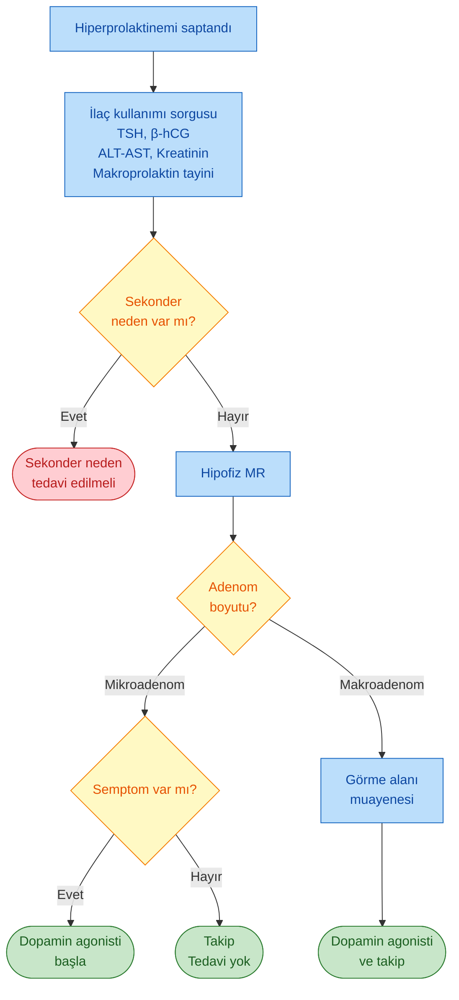
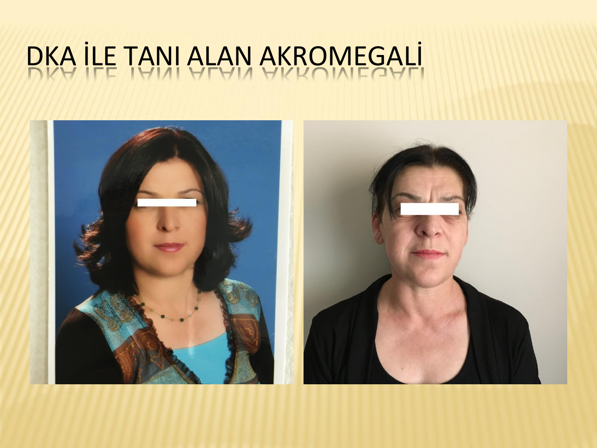
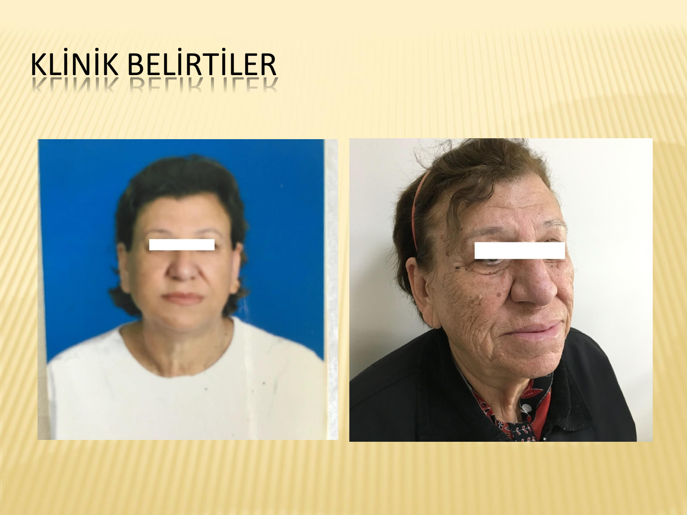
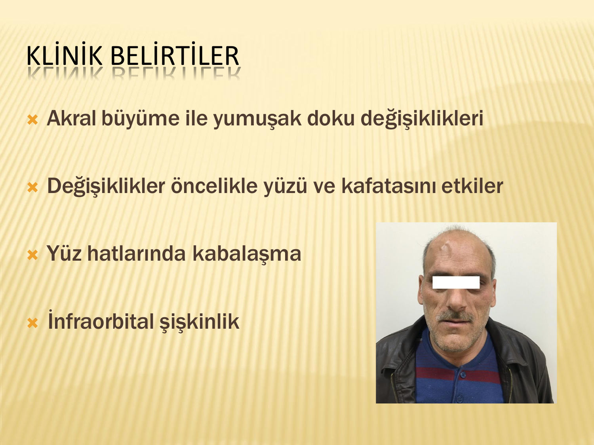
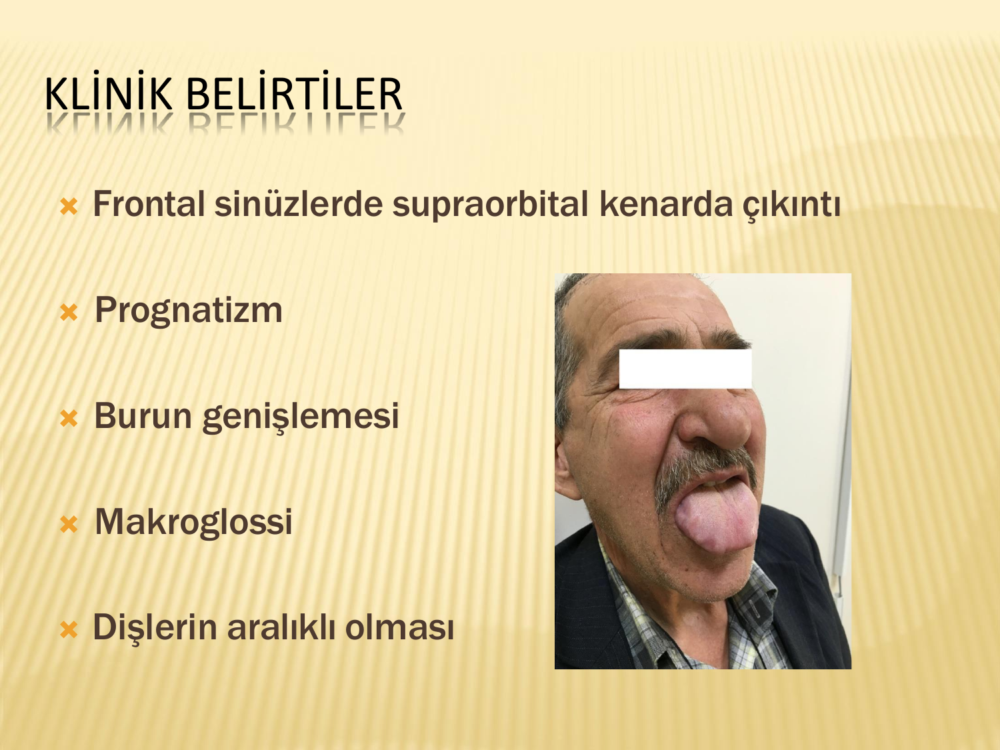
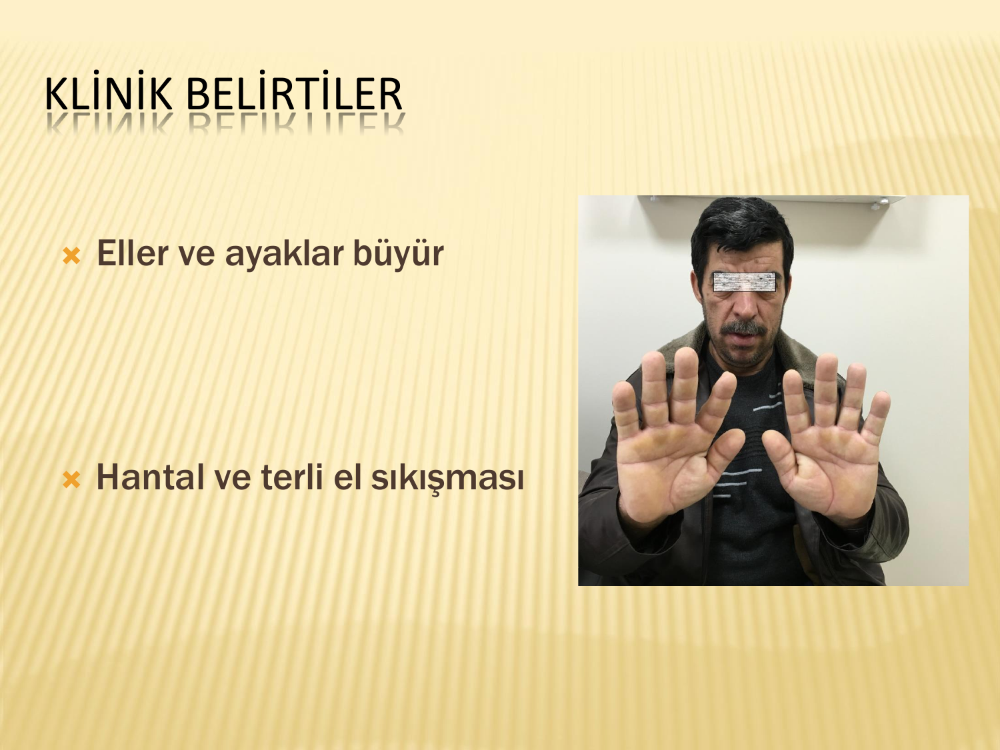
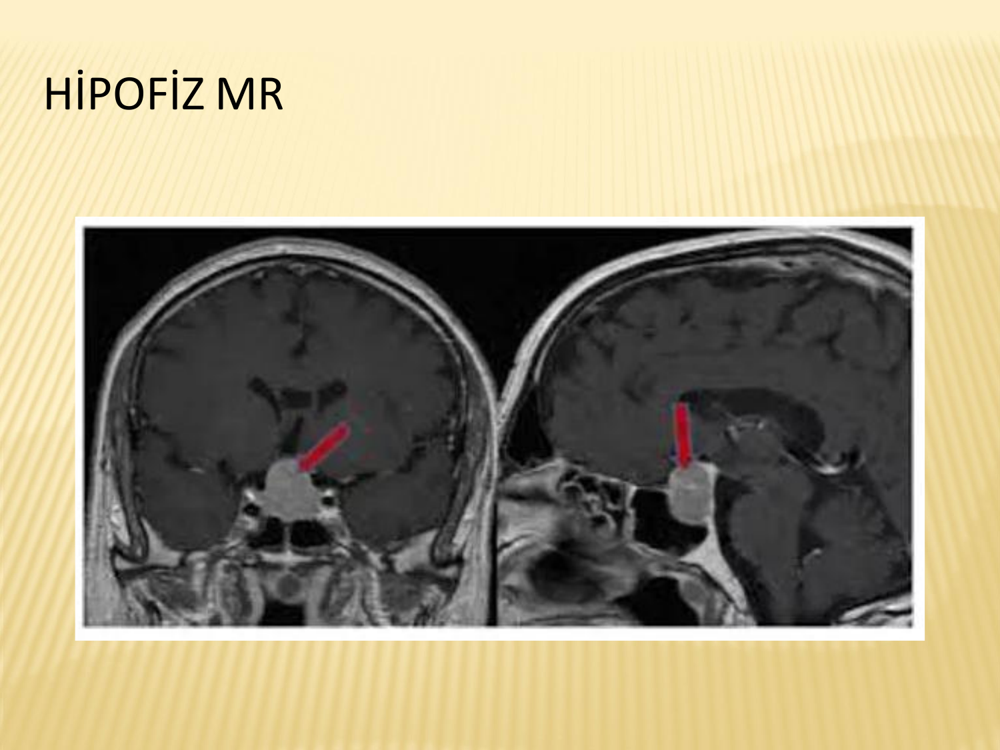
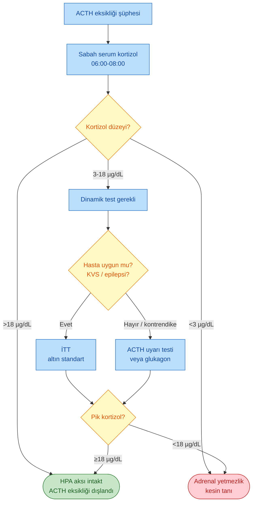

# HİPOFİZ BOZUKLUKLARI

**Hazırlayan:** Prof. Dr. Engin Güney
**Bölüm:** Aydın Adnan Menderes Üniversitesi -- Endokrinoloji Bilim Dalı

---

## İÇİNDEKİLER

1. [Hipofiz Anatomisi ve Fizyolojisi](#hipofiz-anatomisi-ve-fizyolojisi)
2. [Hipofizer İnsidentaloma](#hipofizer-i̇nsidentaloma)
3. [Hipofiz Adenomlarına Genel Yaklaşım](#hipofiz-adenomlarına-genel-yaklaşım)
4. [Prolaktinoma](#prolaktinoma)
5. [Prolaktin Ölçümü ve Makroprolaktinemi](#prolaktin-ölçümü-ve-makroprolaktinemi)
6. [Hiperprolaktinemi Nedenleri](#hiperprolaktinemi-nedenleri)
7. [Hiperprolaktinemi Ayırıcı Tanı](#hiperprolaktinemi-ayırıcı-tanı)
8. [Kanca Etkisi (Hook Effect)](#kanca-etkisi-hook-effect)
9. [Prolaktinoma Tedavisi](#prolaktinoma-tedavisi)
10. [Hiperprolaktinemi Tanı Algoritması](#hiperprolaktinemi-tanı-algoritması)
11. [Akromegali - Tanım ve Epidemiyoloji](#akromegali-tanım-ve-epidemiyoloji)
12. [Akromegali - Etyoloji](#akromegali-etyoloji)
13. [Akromegali - Klinik Belirtiler](#akromegali-klinik-belirtiler)
14. [Akromegali - Sistemik Etkilenme](#akromegali-sistemik-etkilenme)
15. [Akromegali - Tanı](#akromegali-tanı)
16. [Akromegali - Görüntüleme](#akromegali-görüntüleme)
17. [Akromegali - Tedavi](#akromegali-tedavi)
18. [Cushing Hastalığı, TSHoma, FSHoma](#cushing-hastalığı-tshoma-fshoma)
19. [Hipopitüitarizm - Tanım](#hipopitüitarizm-tanım)
20. [Hipopitüitarizm - Etyoloji](#hipopitüitarizm-etyoloji)
21. [Hipopitüitarizm - Klinik](#hipopitüitarizm-klinik)
22. [Hipopitüitarizm - Tanıya Genel Yaklaşım](#hipopitüitarizm-tanıya-genel-yaklaşım)
23. [TSH ve Gonadotropin Eksikliği Tanısı](#tsh-ve-gonadotropin-eksikliği-tanısı)
24. [ACTH Eksikliği ve Dinamik Testler](#acth-eksikliği-ve-dinamik-testler)
25. [İnsülin Tolerans Testi (İTT)](#insülin-tolerans-testi-i̇tt)
26. [ACTH Stimülasyon Testi](#acth-stimülasyon-testi)
27. [Büyüme Hormonu Eksikliği](#büyüme-hormonu-eksikliği)
28. [Hipopitüitarizm Tedavisi](#hipopitüitarizm-tedavisi)
29. [Özel Klinik Durumlar](#özel-klinik-durumlar)
30. [Vaka Örnekleri](#vaka-örnekleri)

---

## HİPOFİZ ANATOMİSİ VE FİZYOLOJİSİ

> **Tanım:** Hipofiz bezi (pituiter gland), **sella tursika** içine yerleşmiş, hipotalamus ile **hipofiz sapı (infundibulum)** aracılığıyla bağlı, endokrin sistemin "orkestra şefi" kabul edilen beze verilen addır.

### Anatomik Yerleşim

* **Sella tursika:** Sfenoid kemikte yer alan küçük kemik çukur
* **Hipofiz sapı:** Hipotalamus ile hipofizi bağlayan yapı; hormon regülasyonunun taşıyıcısı
* **Optik kiazma:** Hipofizin **hemen üzerinde** yerleşimli -- makroadenomlarda basıya bağlı **bitemporal hemianopsi** gelişebilir
* **Kavernöz sinüs:** Sella'nın iki yanında; içinde III, IV, VI. ve V. kraniyal sinir dalları ile internal karotid arter geçer
* **Hipofizyal portal sistem:** Hipotalamik hormonların ön hipofize iletildiği özel kapiller ağ

### Hipofiz Bölümleri ve Hormonları

| Lob | Hormon | Hipotalamik regülasyon |
|---|---|---|
| **Ön hipofiz (adenohipofiz)** | GH | GHRH (+) / Somatostatin (-) |
| | PRL | Dopamin (-) / TRH (+) |
| | ACTH | CRH (+) |
| | TSH | TRH (+) |
| | LH, FSH | GnRH (+) |
| **Arka hipofiz (nörohipofiz)** | ADH (vazopressin) | Hipotalamik supraoptik çekirdek |
| | Oksitosin | Hipotalamik paraventriküler çekirdek |

> **Not:** Arka hipofiz hormonları (ADH ve oksitosin) aslında hipotalamusta üretilir; akson boyunca arka hipofize taşınıp orada depolanır.

### Hipofiz Görüntüleme

* **İlk tercih:** Kontrastlı (gadolinyum) hipofiz MR
* **Dinamik MR:** Mikroadenomların ve özellikle **Cushing hastalığı**nda küçük adenomların saptanmasında
* **BT:** Kanama şüphesi veya kemik yapıların değerlendirilmesi gerektiğinde

---

## HİPOFİZER İNSİDENTALOMA

> **Tanım:** **İlişkisiz bir nedenle** yapılan görüntülemede saptanan ve önceden varlığından şüphelenilmeyen hipofizer lezyondur.

### Sınıflama (Boyut)

* **Mikroadenom:** 1 cm'den küçük lezyonlar
* **Makroadenom:** 1 cm ve üzeri lezyonlar
* **İnvaziv adenom:** Çevre yapılara (kavernöz sinüs, sfenoid sinüs) invaze olan

### Epidemiyoloji

* Otopsi serilerinde ortalama hipofiz adenomu sıklığı: **%10,6**
* Toplumda görüntüleme ile saptanan insidentaloma sıklığı giderek artıyor

**⚠️ ÖNEMLİ:**

* Hipofizer insidentaloma saptanan tüm hastalar, **hem hipopitüitarizm hem de hipofizer hormon hipersekresyonu** semptom ve bulguları içerecek şekilde öykü ve fizik muayene ile değerlendirilmelidir.
* Herhangi bir semptom olmasa bile, **hormon hipersekresyonu açısından** tüm hastalara klinik ve laboratuvar değerlendirmesi yapılmalıdır.

---

## HİPOFİZ ADENOMLARINA GENEL YAKLAŞIM

### Fonksiyonel Sınıflandırma

| Adenom tipi | Salgılanan hormon | Klinik tablo |
|---|---|---|
| **Prolaktinoma** | Prolaktin (PRL) | Hiperprolaktinemi |
| **ACTH salgılayan adenom** | ACTH | Cushing hastalığı |
| **GH salgılayan adenom** | Growth Hormon | Akromegali |
| **TSH salgılayan adenom** | TSH | TSHoma (santral hipertiroidi) |
| **LH/FSH salgılayan adenom** | Gonadotropinler | Gonadotropinoma / FSHoma |
| **Fonksiyonel olmayan adenom** | Hormon salgılamaz | Bası semptomları, hipopitüitarizm |

### Her Hipofiz Adenomunda Cevaplanması Gereken 3 Soru

1. **Hormon salgılıyor mu?** (Hipersekresyon var mı?)
2. **Makroadenomsa bası yapıyor mu?** (Hipopitüitarizm var mı?)
3. **Görme alanı basısı var mı?** (Optik kiazma tutulumu)

---

## PROLAKTİNOMA

> **Tanım:** Hipofiz bezinin **prolaktin sekrete eden tümörleri**ne prolaktinoma denir. **En sık görülen hipofiz adenomu**dur (tüm adenomların yaklaşık **%40**'ı).

### Epidemiyoloji

* **İnsidans:** Milyonda 27
* **Prevalans:** Milyonda 500
* Kadınlarda daha sık (ancak erkeklerde genellikle makroadenom olarak bulunur)

### Klinik

| Kadınlarda | Erkeklerde |
|---|---|
| Amenore / oligomenore | İmpotans (erektil disfonksiyon) |
| Galaktore | Libido kaybı |
| İnfertilite | İnfertilite |
| Seksüel disfonksiyon / vajinal kuruluk | Güçsüzlük |
| Kilo artışı | Jinekomasti |
| Hirsutizm | Galaktore (nadir) |
| Osteoporoz / osteopeni | Osteoporoz / osteopeni |
| Adenom basısına bağlı semptomlar | Adenom basısına bağlı semptomlar |
| Görme alanı defekti | Görme alanı defekti |
| Hipopitüitarizm | Hipopitüitarizm |
| Hidrosefali | Hidrosefali |

> **Klinik perspektif:** Kadınlarda menstrüel bozukluk erken semptom olduğundan genellikle **mikroadenom** aşamasında yakalanır. Erkeklerde ise bulgular daha siliktir; tanı sıklıkla **makroadenom** evresinde (bası semptomlarıyla) konur.

---

## PROLAKTİN ÖLÇÜMÜ VE MAKROPROLAKTİNEMİ

### Prolaktin Ölçümünün Esasları

* **Normal aralık:** 5-20 ng/mL
* Günün **herhangi bir saatinde** ölçüm genellikle yeterlidir
* Hafif yükseklik (21-40 ng/mL) durumunda **15-20 dakika ara ile iki ölçüm** ile konfirme edilmelidir
* **Fizyolojik artış nedenleri:** Uyku, egzersiz, emosyonel ve fiziksel stres, meme stimülasyonu, yüksek proteinli diyetler

### Prolaktinin Moleküler Formları

| Form | Ağırlık | Oran | Biyolojik aktivite |
|---|---|---|---|
| **Monomerik prolaktin** | 23.5 kDa | %85 | **Aktif** |
| **Big prolaktin** | 45-60 kDa | Azınlık | Monomerik PRL'nin kovalan bağ ile birleşmesi; inaktif |
| **Big big prolaktin (makroprolaktin)** | >100 kDa | <%1 | **İnaktif** (kapiller endotelden geçemez) |

### Makroprolaktinemi Tanısı (PEG Çöktürme)

Serum prolaktin düzeyi yüksek saptanan **asemptomatik** hastalarda mutlaka makroprolaktin tayini yapılmalıdır.

| PEG ile prolaktin düzeyinde azalma oranı | Yorum |
|---|---|
| **< %40** | Makroprolaktinemi yok |
| **%40-60** | Gri zon (klinik değerlendirme) |
| **> %60** | Makroprolaktinemi |

**⚠️ ÖNEMLİ:** Asemptomatik + makroprolaktin pozitif hastalarda **ilave tetkik gerekli değildir.**

---

## HİPERPROLAKTİNEMİ NEDENLERİ

### Fizyolojik Nedenler

* Egzersiz
* Laktasyon
* Gebelik
* Uyku
* Stres
* Koitus

### İlaçlar (Tümör dışı **en sık neden**)

* **Nöroleptikler / Antipsikotikler** (tipik antipsikotiklerde %40-90, risperidonla %50-100)
* Antidepresanlar, trisiklik antidepresanlar, SSRI
* MAO inhibitörleri
* Antiepileptikler
* Antihistaminikler
* Antihipertansifler (metildopa, verapamil)
* Kolinerjik ilaçlar
* **Dopamin reseptör blokerleri** (metoklopramid)
* Dopamin sentez inhibitörleri
* Östrojenler, oral kontraseptifler
* Opiatlar
* Kokain
* Anestetikler

### Hipotalamik Nedenler

* İnfiltratif hastalıklar (tüberküloz, histiositoz, sarkoidoz)
* Tümörler
* Kraniofarenjioma
* Germinoma
* Meningioma
* Metastatik tümörler
* Kraniyal radyoterapi

### Hipofizer Nedenler

* **Prolaktinoma**
* Akromegali (karışık tümör)
* Non-fonksiyone hipofiz adenomu (**sap basısı / stalk effect**)
* Rathke kleft kisti
* Makroprolaktinemi
* Lenfositik hipofizit
* İnfiltratif hastalıklar (tüberküloz, histiositoz, sarkoidoz)
* Hipofiz cerrahisi
* Kafa travmaları
* Boş sella sendromu

### Sistemik Hastalıklar

* Primer hipotiroidi (TRH artışı → PRL uyarımı)
* Kronik böbrek yetmezliği (azalmış klerens)
* Karaciğer sirozu
* Göğüs duvarı travması
* Spinal kord lezyonları
* Herpes zoster enfeksiyonu
* Epileptik nöbet
* Polikistik over sendromu

### İlaca Bağlı Hiperprolaktinemiye Pratik Yaklaşım

* İlaca bağlı PRL artışı, ilaç kesildikten sonra **3 gün içinde normal düzeylere düşer**
* **Asemptomatik:** Mümkünse ilaç değişikliği; tedaviye gerek yok
* **Semptomatik:** Dopamin antagonistik potansiyeli daha az olan ajana geçilebilir; dopamin agonisti psikozu tetikleyebilir (dikkat)
* **Psikiyatrist konsültasyonu zorunlu:** İlaç kesiminin uygunluğu hasta için değerlendirilmeli
* İlaç kesilemiyorsa ya da PRL yüksekliği ilaç öncesinde de varsa hipofiz MR çekilmelidir

---

## HİPERPROLAKTİNEMİ AYIRICI TANI

| Etyoloji | Prolaktin seviyesi (ng/mL) |
|---|---|
| İlaçlar, stres, sekonder nedenler | **25-100** |
| Hipofiz sap basısı | **25-150** |
| Prolaktinoma (genel) | **>150** |
| Mikroadenoma bağlı prolaktinoma | **50-300** |
| Makroadenoma bağlı prolaktinoma | **>200** |

> **Pratik kural:** Makroadenom + PRL >200 ng/mL → prolaktinoma; makroadenom + PRL 20-200 ng/mL → **sap basısı** (non-fonksiyone adenom) ya da **hook effect** düşünülmelidir.

---

## KANCA ETKİSİ (HOOK EFFECT)

> **Tanım:** Serum prolaktin düzeyinin **çok yüksek** olması (bazen 5000 ng/mL'ye varan) nedeniyle immunoassay ölçümde yapay olarak düşük çıkması durumudur.

**Ne zaman düşünülmeli?**
Makroadenomlu bir hastada hiperprolaktinemi var, ancak makroprolaktinoma tanısından emin olacak kadar yüksek değilse (**20-200 ng/mL**)

**Nasıl dışlanır?**
Serum örneği **1/100 oranda dilüe edilerek** prolaktin ölçümü tekrarlanır.

| Dilüsyon sonucu | Yorum |
|---|---|
| PRL **>200 ng/mL** | Makroprolaktinoma |
| PRL **<200 ng/mL** | Sap basısına bağlı hiperprolaktinemi (non-fonksiyone adenom) |

---

## PROLAKTİNOMA TEDAVİSİ

### Tedavi Hedefleri

* Tümör boyutunun küçülmesi
* Varsa bası bulgularının ortadan kaldırılması
* Gonadal fonksiyonların düzelmesi
* Fertilitenin sağlanması / korunması
* Galaktorenin düzelmesi
* Kemik kaybının önlenmesi

### Kimler Tedavi Edilmeli?

* **Asemptomatik mikroprolaktinomalı hastalar** tedavi gerektirmez (mikroadenomlar sıklıkla büyüme göstermez)
* **Semptomatik** mikroprolaktinomalı erkek hastalar
* **Gebelik planlayan** kadınlar
* **Makroprolaktinomalı** hastalar (her durumda tedavi edilir)

### Medikal Tedavi: Dopamin Agonistleri (İlk Tercih)

| İlaç | Özellik |
|---|---|
| **Kabergolin** | 1. seçim; haftada 1-2 kez, yan etki profili daha iyi |
| **Bromokriptin** | Gebelik planlayan hastada tercih; günlük kullanım |
| **Kinagolid** | Alternatif |
| **Pergolid** | Alternatif |

### Cerrahi ve Radyoterapi

* **Cerrahi** (transsfenoidal) ve **radyoterapi** nadir olarak gerekir
* Endikasyonlar: Dopamin agonisti intoleransı, dirençli makroadenom, görme tehdidi olan hızlı progresif kitle

---

## HİPERPROLAKTİNEMİ TANI ALGORİTMASI

> **Şema yorumu:** İlk adımda **mutlaka** ilaç öyküsü sorgulanır ve sekonder nedenler (hipotiroidi, gebelik, KBY, karaciğer hastalığı) dışlanır. Makroprolaktin tayini ise asemptomatik hastada gereksiz tetkik zincirini önler. Sekonder neden yoksa MR ile adenom varlığı ve boyutu değerlendirilir.

---

## AKROMEGALİ - TANIM VE EPİDEMİYOLOJİ

> **Tanım:** **Büyüme hormonu (GH) salgılayan hipofiz tümörü**nün yol açtığı, GH'nin sürekli hipersekresyonu sonucu **insülin benzeri büyüme faktörü (IGF-1)** düzeyinin artmasıyla karakterize, sinsi ilerleyen hastalıktır.

* **Prevalans:** 4-7 olgu / 100.000
* **İnsidans:** 3-4 olgu / milyon / yıl
* Hastalık bulgularını tanımada eksiklik vardır → gerçek sıklık muhtemelen daha yüksek

### Akromegali Atlanıyor mu?

**DETECT çalışması (Almanya):**
* 1. basamakta 6773 hastada IGF-1 ile tarama
* 76 hastada akromegali saptandı
* **Prevalans: 103 olgu / 100.000** (klasik bilgiden çok daha yüksek)
* **Sonuç:** Akromegali atlanıyor.

> **Kaynak:** Schneider HJ et al. High prevalence of biochemical acromegaly in primary care patients with elevated IGF-1 levels. Clin Endocrinol (Oxf). 2008.

### Tanıda Gecikme

* Kemik ve yumuşak doku büyümesi sinsi seyirli
* **Semptom başlangıcı → tanı** arası tahmini süre: **7-10 yıl**

---

## AKROMEGALİ - ETYOLOJİ

* **%95'inden fazlası:** Hipofizer somatotrop adenom
* **Tanı anında:** Çoğunlukla **makroadenom**; <%20 mikroadenom
* **Nadir genetik sendromlar:**
    * MEN-1 (Multipl endokrin neoplazi tip 1)
    * McCune-Albright sendromu
    * Ailesel izole akromegali
    * Carney kompleksi
* **Ektopik GH / GHRH salınımı:** %0.5 (çok nadir)

---

## AKROMEGALİ - KLİNİK BELİRTİLER

### Cinsiyet ve Yaş

* Cinsiyet farkı yok
* Tanı anında ortalama yaş: **40**

### GH Aşırı Sekresyonunun İki Ana Etki Yolu

1. **Somatik ve metabolik etkiler** (GH/IGF-1 kaynaklı)
2. **Direkt kitle etkisi** (hipofiz makroadenomu kaynaklı)

### GH'nin Somatik Etki Gösterdiği Dokular

* Deri
* Bağ dokusu
* Kartilaj
* Visseral kemik
* Çoğu epitelyal doku

### Tipik Semptomlar

* Yüz hatlarında kabalaşma
* El ve ayaklarda büyüme
* **Ayakkabı numarasında artış**
* **Yüzük boyutunda genişleme**

### Diğer Semptomlar

| Sistemik | Lokomotor/nörolojik |
|---|---|
| Başağrısı | Parestezi |
| Halsizlik | Artralji |
| Letarji | Karpal tünel sendromu |
| Aşırı terleme | Seste kalınlaşma |
| Kilo artışı | Galaktore |
| | Oligo/amenore |

### Klinik Prezentasyon (164 Akromegali Hastası)

| Başvuru nedeni | Oran |
|---|---|
| Yüz hatlarındaki değişiklik | %35 |
| Baş ağrısı, görme alanı defekti | %34 |
| Doktor tarafından farkındalık | %31 |

### ADÜ Başvuru Semptomları (Klinik Deneyim)

| Başvuru Şikayeti | Akromegali Tanısını Koyan |
|---|---|
| 1. Yeni tanı diyabetik ketoasidoz (DKA) | Tarafımızdan tipik görünüm |
| 2. Tiroid nodül biyopsisi | Tarafımızdan tipik görünüm |
| 3. Obezite | Tarafımızdan tipik görünüm |
| 4. Kontrolsüz diyabet | Tarafımızdan tipik görünüm |
| 5. Baş ağrısı | Nöroşirürji tipik görünüm |
| 6. Baş ağrısı | Beyin MR'da adenom |
| 7. Diş tedavisi | Diş hekimi farkındalık |
| 8. Yakınlarının fark ettiği değişim | -- |

### Yüz ve Kafa Bulguları (Kraniyofasiyal)

* Akral büyüme ile yumuşak doku değişiklikleri
* Değişiklikler **öncelikle yüzü ve kafatasını** etkiler
* Yüz hatlarında kabalaşma
* **İnfraorbital şişkinlik**
* **Frontal sinüslerde supraorbital kenarda çıkıntı (kemik çıkıntı)**
* **Prognatizm** (alt çene ileride)
* Burun genişlemesi
* **Makroglossi** (büyük dil)
* Dişlerde **aralıklanma (diastema)**

> **Klinik gözlem:** Akromegali tanısı **genellikle eski hasta fotoğrafları** ile kıyaslama yaparak konur. Hasta günlük yaşamda yavaş değişimi fark etmez; çocukluk/gençlik dönemindeki fotoğraflarla karşılaştırma akromegalik değişimi belirgin kılar. Gösterilen fotoğraflarda yüz hatlarında kabalaşma ve dokuda kalınlaşma uyumlu bulgulardır; kesin tanı **biyokimyasal testlere** (IGF-1, OGTT-GH) dayanır.

---

## AKROMEGALİ - SİSTEMİK ETKİLENME

### Visseromegali (Organ Büyümesi)

* **Tiroid:** Hastaların yaklaşık **%90**'ında büyüme
* Kalp, akciğer, karaciğer, böbrek, prostat büyümesi

### Tiroid

* Yaklaşık **%90 tiroid büyümesi**
* **%90 diffüz ya da multinodüler guatr**
* **%4 diferansiye tiroid kanseri**

> **Kaynak:** Wolinski K et al. Risk of thyroid nodular disease and thyroid cancer in patients with acromegaly -- meta-analysis and systematic review. PLoS One. 2014.

### Kardiyovasküler Hastalıklar

**Mortalite nedenlerinin %60'ı kardiyovasküler!**

* **En önemli neden:** Aterosklerotik kalp hastalığı
* **Hipertansiyon:** %25-40
* **Kardiyomiyopati**
* **Sol ventrikül hipertrofisi**
* **Ritim problemleri:** AF, ektopik atım, VT

### Obstrüktif Uyku Apne Sendromu (OSAS)

* Sıklık: **%40-50**
* Artmış mortalite riski
* Patofizyoloji: makroglossi, larinks ve farinks yumuşak doku büyümesi
* **Pratik klinik uyarı:** Obez olmayan uyku apne sendromlu hastada akromegali düşünülmeli.

> **Kaynak:** Roemmler J et al. Elevated incidence of sleep apnoea in acromegaly-correlation to disease activity. Sleep Breath. 2012.

### Diyabet ve Metabolik Etkiler

| Bulgu | Oran |
|---|---|
| Hiperinsülinizm | %70 |
| Glukoz intoleransı | %50 |
| Aşikar diyabet | %10-15 |

* Patofizyoloji: GH fazlalığına bağlı **insülin direnci**

### Kolonik Etkiler

* **Kolon polip riski:** %30
* Kolon adenomatöz kanser riski artmış
* Trofik IGF-1 → kolon epitelyal hücre proliferasyonu
* PPAR gen ekspresyonunda azalma

### Diğer Sistemik Bulgular

* Maligniteler (tiroid, kolon)
* Artropati (akromegalik artrit)
* Periferik nöropati
* **Hiperfosfatemi** (renal tübüler yeniden emilim artışı)
* Hipertansiyon
* Hiperhidroz (aşırı terleme)
* Papilloma ve **skin tag** (acrochordon)
* Nodüler guatr
* Akantozis nigrikans (insülin direncine bağlı)

---

## AKROMEGALİ - TANI

### Tanı Basamakları

1. **IGF-1 (Somatomedin C)** -- **ilk basamak tarama testi**
2. **75 g OGTT ile GH supresyon testi** -- **en spesifik dinamik test**
3. **Hipofiz MR** -- GH fazlalığı doğrulanınca

### IGF-1 Ölçümü

* Yaşa ve cinsiyete göre **yüksek** saptanır
* Tanı için ilk basamak testi

> **Kaynak:** UpToDate. Diagnosis of acromegaly. Shlomo Melmed, 2015.

### 75 g OGTT ile GH Testi (En Spesifik Test)

**Prosedür:**
* 75 g glukoz içirilir
* **0, 30, 60, 90, 120. dakikalarda** GH ölçümü

**Yorum:**

| Ölçüm yöntemi | Normal bireyde GH baskılanması |
|---|---|
| Radyoimmunoassay | **<1 ng/mL** |
| Yüksek sensitif immunoradiometrik / kemiluminesent | **<0.3 ng/mL** |

> **Tanı:** OGTT sonrası **GH baskılanmaması** (radyoimmunoassay ile >1 ng/mL) akromegali tanısını koydurur.

### Random GH Ölçümü Neden Önerilmiyor?

* GH sekresyonu normal bireyde **pulsatil**
* Diurnal salınım değişkenliği yüksek
* Kısa süreli açlık, egzersiz, stres ve uyku GH'yi yükseltebilir
* GH klerensi hızlıdır → tek ölçüm yanıltıcı

> **Kaynak:** Katznelson L et al. Endocrine Society. Acromegaly: an endocrine society clinical practice guideline. JCEM 2014.

---

## AKROMEGALİ - GÖRÜNTÜLEME

* GH fazlalığı biyokimyasal olarak doğrulandıktan sonra
* **En sık bulgu:** Hipofizer makroadenom (%75)
* Ektopik GH salınımı: %0.5

> **Şema yorumu:** Gadolinyumlu koronal T1 kesitte sella tabanını dolduran, optik kiazmaya doğru suprasellar uzanım gösteren kitle izlenmektedir. Akromegali olgularında MR, hem tanı hem de cerrahi planlamada kullanılır.

---

## AKROMEGALİ - TEDAVİ

### Amaç

* Hastalığın progresyonunu durdurmak
* Geç komplikasyonları önlemek
* Mortalite artışını engellemek

### Hedefler

* Hipofiz adenomunun çıkarılması
* GH hipersekresyonunun azaltılması (IGF-1 normalizasyonu)
* Normal ön ve arka hipofiz fonksiyonlarının korunması

### Cerrahi (İlk Tercih)

**Önerilen yaklaşım (transsfenoidal cerrahi):**
* Mikroadenomu olanlar
* Makroadenomu olup tamamen rezeke edilebilecek tümörler
* Görme bozukluğu gibi **bası semptomlarına neden olan** makroadenomlar

### Medikal Tedavi

**1) Somatostatin analogları (1. basamak medikal tedavi)**

| İlaç | Özellik |
|---|---|
| **Oktreotid** | Kısa ve uzun etkili formlar |
| **Lanreotid** | Uzun etkili |
| **Pasireotid** | Yeni kuşak somatostatin analoğu |

* GH sekresyonunu **doğal somatostatine göre 45 kat** daha fazla inhibe eder.

**2) Dopamin agonisti**

* **Kabergolin** -- özellikle miks GH/PRL adenomlarında

**3) GH reseptör antagonisti**

* **Pegvisomant** -- dirençli olgularda; IGF-1'i normale getirir ama tümör boyutunu etkilemez

### Radyoterapi

* **Gamma knife**
* **Proton beam**
* **Linac**

Medikal ve cerrahi tedaviye yanıtsız / tekrarlayan olgularda kullanılır.

---

## CUSHING HASTALIĞI, TSHOMA, FSHOMA

### Cushing Hastalığı (Hipofizer ACTH-Salgılayan Adenom)

* Ayrıntılı değerlendirme **Cushing sendromu** notunda
* ACTH-bağımlı endojen Cushing sendromunun **%65-70**'i
* Genellikle mikroadenom şeklinde
* Tanı: 1 mg deksametazon supresyon testi, 24 saatlik idrar serbest kortizol, gece yarısı tükrük kortizolü → yüksek doz DST, CRH testi, hipofiz MR, gerekirse **BIPSS**
* Tedavi: Transsfenoidal adenomektomi

### TSHoma (TSH-Salgılayan Adenom)

* **Çok nadir** (tüm hipofiz adenomlarının <%1'i)
* Klinik: Hipertiroidi semptomları (santral hipertiroidi)
* Labortuvar: **TSH uygunsuz olarak normal ya da yüksek + fT3 / fT4 yüksek**
* Ayırıcı tanı: **Tiroid hormon direnci** (genetik, TRα/β mutasyonu) -- TRH testi ve genetik analiz gerekebilir
* Tedavi: Transsfenoidal cerrahi, somatostatin analoğu

### FSHoma / Gonadotropinoma

* **Nadir**
* Çoğu klinik olarak **sessiz** -- non-fonksiyone adenom gibi davranır
* Klinik: Bası semptomları (görme alanı, baş ağrısı), kadınlarda over hiperstimülasyonu, erkeklerde testis büyümesi
* Tedavi: Cerrahi

### Non-Fonksiyone Hipofiz Adenomu

* Hormon salgılamaz ancak immunohistokimyasal olarak LH/FSH alfa subünit pozitif olabilir
* Klinik: Bası semptomları, hipopitüitarizm, görme alanı defekti
* Tedavi: Semptomatik makroadenomda cerrahi; asemptomatik mikroadenomda takip

---

## HİPOPİTÜİTARİZM - TANIM

> **Tanım:** Hipopitüitarizm (hipofiz bezi yetersizliği); **bir veya daha fazla** hipofiz hormonunun yetersiz yapımı ve salınımı sonucu gelişen bir klinik sendromdur.

### Sınıflama

* **Parsiyel (kısmi) hipopitüitarizm:** Bir veya birkaç hipofiz hormon eksikliği
* **İzole hipopitüitarizm:** Tek bir hipofiz hormonu eksikliği
* **Panhipopitüitarizm:** **Tüm** hipofiz hormonlarının eksikliği

### İnsidans ve Prevalans

* **Prevalans (İspanya çalışması):** 45 / 100.000
* **İnsidans:** Yaklaşık 4 / 100.000 / yıl
* Vakaların yaklaşık yarısında **çoklu hormon eksikliği**
* **Mortalite:** Normal bireylere göre **1.2-2.2 kat artmış**

---

## HİPOPİTÜİTARİZM - ETYOLOJİ

### 1. Kalıtsal Nedenler (Erişkinde nadir)

| Kategori | Örnekler |
|---|---|
| **Genetik** | KAL mutasyonu (Kallmann sendromu), Prader-Willi, Laurence-Moon-Biedl sendromu |
| **Reseptör** | Melanokortin rsp, GnRH rsp, GHRH rsp, CRH rsp mutasyonları |
| **Yapısal** | Pituiter aplazi, hipoplazi, SSS kitleleri, ensefalosel |
| **Transkripsiyon faktör defektleri** | PITX2, Prop-1, Pit-1 |
| **Hormon mutasyonu** | Hormonun kendisi defektli |

### 2. Edinsel Nedenler

#### 2a. Travmatik (Beyin hasarı)

* Cerrahi rezeksiyon
* **Kafa travmaları** (travmatik beyin hasarı, spora bağlı tekrarlayan kafa travmaları)
* Radyoterapiye bağlı hasar
* Subaraknoid kanama, stroke

#### 2b. Enfeksiyon ile ilişkili

* Tüberküloz
* Bakteriyel / viral menenjit veya ensefalit
* Pneumocystis jirovecii
* Fungal (histoplazmoz, aspergilloz)
* Parazitler (toksoplazmoz)

#### 2c. Neoplastik

* **Hipofiz adenomları**
* **Parasellar kitleler:** Rathke kisti, dermoid kist, meningioma, germinoma, ependimoma, glioma
* **Kraniofarenjioma**
* Hipotalamik hamartoma, gangliositoma
* Hipofiz metastazları
* Hematolojik maligniteler (lösemi, lenfoma)

#### 2d. Vasküler

* **Gebelikle ilişkili (Sheehan sendromu)**
* Anevrizma, apopleksi
* Diyabet, hipotansiyon
* Arterit, orak hücre hastalığı

#### 2e. İnfiltratif / İnflamatuar

* Primer hipofizit (lenfositik, granülomatöz, ksantomatöz)
* Sekonder hipofizit
* **Sarkoidoz**, histiositoz X
* Enfeksiyonlar
* Wegener granülomatozu, Takayasu hastalığı
* **Hemokromatoz**

#### 2f. Fonksiyonel

* Nütrisyonel (kalori kısıtlaması, malnütrisyon, aşırı egzersiz)
* Kritik hastalıklar (sepsis, akut kafa travması)
* Kronik böbrek yetmezliği
* Kronik karaciğer yetersizliği

#### 2g. İlaçlar

* Anabolik steroidler
* Glukokortikoid fazlalığı
* GnRH agonistleri
* Östrojen
* Dopamin
* Somatostatin analogları

#### 2h. İdiyopatik

### Güncel Epidemiyolojik Bakış

* **Eskiden en sık neden:** Hipofiz adenomları ve/veya tedavileri
* **Son 10 yılın meta-analizi:** Travmatik beyin hasarı sonrası **%20-25 oranında** hipopitüitarizm (olaydan en erken 6 ay - 1 yıl sonra); en sık GH ve FSH/LH eksikliği
* **Güncel sınıflama:** "Travmatik nedenler / beyin hasarı" artık **sık nedenler** arasında
* **Ülkemizde kadın hastalarda Sheehan sendromu** halen en sık nedenlerden biridir.

---

## HİPOPİTÜİTARİZM - KLİNİK

### Hormon Eksiklik Sıralaması

> **Klasik (bası tipi) sıralama:** **GH → FSH/LH → TSH → ACTH**
> (Prolaktin en son kaybedilir)

### Özel Durumlar

* **Lenfositik hipofizit:** İzole ACTH ya da TSH ilk eksilen hormonlar olabilir
* **Kafa travması sonrası:** İzole hormon eksiklikleri daha sık
* **Çocuklukta başvuru nedeni:** **Büyüme geriliği**
* **Erişkinde en erken semptom:** **Hipogonadizm**

### ACTH Eksikliği (Sekonder Adrenal Yetmezlik)

* **Akut form:**
    * Güçsüzlük, baş dönmesi
    * Bulantı, kusma
    * Ağır eksiklikte **vasküler kollaps, hipotansiyon, hiponatremi**
    * Erişkinde nadiren hipoglisemi

* **Kronik form:**
    * Güçsüzlük, solukluk
    * İştahsızlık, kilo kaybı
    * Hipotansiyon, hiponatremi

> **Önemli farklılık:** Sekonder adrenal yetmezlikte **hiperpigmentasyon yoktur** (ACTH düşük) ve **hiperkalemi nadirdir** (aldosteron RAAS tarafından kontrol edilir). Primer (Addison) adrenal yetmezlikten ayırt etmeyi sağlayan önemli özelliklerdir.

### TSH Eksikliği (Sekonder Hipotiroidi)

* **Çocuklarda:** Büyüme-gelişme geriliği, mental gelişim bozuklukları
* **Erişkinlerde:** Halsizlik, soğuk intoleransı, kabızlık, saç dökülmesi, kuru cilt, kognitif bozukluklar, mental yavaşlama, kilo alımı, bradikardi

### GH Eksikliği

* **Çocuklarda:** Büyüme ve gelişme geriliği (boy kısalığı)
* **Erişkinlerde:**
    * Anormal vücut kompozisyonu (visseral obezite)
    * Azalmış kas kitlesi ve gücü
    * Halsizlik
    * Azalmış kemik mineral yoğunluğu
    * **Hayat kalitesinde azalma**, kognitif bozukluklar, hafıza problemleri
    * Dislipidemi ve artmış kardiyovasküler risk

### Gonadotropin (FSH/LH) Eksikliği

| Grup | Bulgular |
|---|---|
| **Çocuklarda** | Gecikmiş puberte |
| **Kadınlarda** | Menstrüel bozukluklar (oligo/amenore), meme atrofisi, infertilite |
| **Erkeklerde** | Erektil disfonksiyon, kas kitlesinde azalma, libido kaybı, infertilite, seksüel kıllarda azalma |
| **Her iki cinste** | Kemik mineral yoğunluğunda azalma |

### Prolaktin Eksikliği

* İzole PRL eksikliğine bağlı klinik semptom ve bulgular **henüz tanımlanmamıştır**.
* **Sheehan sendromu**nda olduğu gibi, PRL eksikliği **doğum sonrası laktasyon yetmezliğine** yol açar (post-partum emziremeyen anne → klasik bulgu).

---

## HİPOPİTÜİTARİZM - TANIYA GENEL YAKLAŞIM

### Klinik Şüphe

Hipopitüitarizm (hipofizer apopleksi ve Sheehan sendromu gibi durumlar dışında) genellikle **yavaş bir gelişim** gösterir ve subklinik formlar kolaylıkla gözden kaçabilir.

**Şüphelendirici öykü:**
* Hipofiz kitle öyküsü
* Beyin operasyonu
* Ciddi kafa travması
* Menenjit / ensefalit
* Kraniyal radyoterapi
* Doğum sırasında aşırı kanama ve/veya laktasyon olmaması (Sheehan)
* Kraniofasiyal anormallikler (çocuk)

### Temel Tanı Basamakları

1. **Bazal hipofiz hormonları**
2. **Uyarı (stimülasyon) testleri**
3. **Hipofiz MR görüntüleme**
4. **Genetik testler** (uygun olgularda)
5. **Etyolojiye yönelik testler**

### Bazal Laboratuvar Paneli

Hem **hipofizer trofik** hem de **hedef bez hormonu** eş zamanlı ölçülür:

| Hipofiz hormonu | Hedef hormon |
|---|---|
| **TSH** | Serbest T4 (sT4) |
| **ACTH** | Kortizol |
| **GH** | IGF-1 |
| **FSH, LH** | Estradiol (E2) (kadın) / Testosteron (erkek) |
| **PRL** | -- |

### Tanı Prensibi

**Santral hormon eksikliğinin kriteri:** Hem bazal hipofiz hem de hedef bez hormon düzeylerinin **birlikte düşük** olması.

* TSH ve gonadotropin eksiklikleri: Bazal ölçümler **çoğunlukla yeterli**
* ACTH ve GH eksiklikleri: Bazal **yetersiz** → **uyarı testleri gerekir**

> **Pratik nokta:** TSH ve gonadotropin eksikliklerinin tanısında rutin klinik pratikte **stimülasyon testleri artık kullanılmamaktadır.**

---

## TSH VE GONADOTROPİN EKSİKLİĞİ TANISI

### TSH Eksikliği (Sekonder / Hipofizer Hipotiroidizm)

**Tanı kriteri:**

> sT4 düzeyi **düşük**, TSH düzeyi **düşük veya uyumsuz olarak normal**

### FSH/LH Eksikliği (Hipogonadotropik Hipogonadizm)

| Hasta grubu | Tanı kriteri |
|---|---|
| **Erkek** | Düşük testosteron + düşük/normal gonadotropin |
| **Premenopozal kadın** | Düşük estradiol + düşük/normal gonadotropin |
| **Postmenopozal kadın** | **Yüksek olması beklenen** gonadotropinlerin **düşük** saptanması |

---

## ACTH EKSİKLİĞİ VE DİNAMİK TESTLER

### Bazal Kortizol Yorumu

ACTH ve kortizol salınımı **pulsatil** olup karakteristik bir **diürnal ritm** izler. Sabah ölçüm esastır (06:00-08:00 arası).

| Sabah kortizol (μg/dL) | Yorum |
|---|---|
| **> 18** | Hipotalamo-hipofiz-adrenal aks **intakt** |
| **3-18** (gri zon) | **Dinamik testler gerekli** |
| **< 3** | Adrenal yetmezliğin **kesin kanıtı** |

### Gri Zon Kortizol (3-18 μg/dL) İçin Dinamik Testler

1. **İnsülin tolerans testi (İTT)** -- altın standart
2. **ACTH stimülasyon testi**
3. **Glukagon stimülasyon testi (GST)**
4. **Metirapon testi**

---

## İNSÜLİN TOLERANS TESTİ (İTT)

> **Altın standart:** Hipotalamo-hipofiz-adrenal aksın değerlendirilmesinde.

### Prosedür

* **0.1-0.15 U/kg IV bolus regüler insülin** verilir
* Hipoglisemi oluşturulur
* **Hipoglisemi semptomları + glukoz <40 mg/dL** iken
* Belirli aralarla **glukoz, kortizol** (ve gerekirse **GH**) için kan örnekleri alınır

### Yorum

* **Pik kortizol ≥18 μg/dL** → hipotalamo-hipofizer aks **normal**
* Aksi halde → ACTH rezervinde yetersizlik

### Kontrendikasyonlar ve Önlemler

**⚠️ ÖNEMLİ:**

* Test **hekim gözetiminde** yapılmalıdır
* **Kardiyovasküler hastalığı olanlarda kontrendike**
* **Epilepsi öyküsü olanlarda kontrendike**
* Akut hipofiz yetmezliği düşünülüyorsa **uygulanmaz**

---

## ACTH STİMÜLASYON TESTİ

### Standart ACTH Stimülasyon Testi (Sinakten / Cosyntropin)

* **250 μg ACTH (cosyntropin)** IV olarak verilir
* Serum kortizol düzeyi **0, 30, 60. dakikalarda** ölçülür
* Pik kortizol **≥18 μg/dL** → ACTH rezervi iyi (bazı merkezler ≥20 μg/dL eşiğini kullanır)

### Düşük Doz (1 μg) ACTH Stimülasyon Testi

* **Rasyonel:** 250 μg ACTH dozu suprafizyolojik
* **Subklinik** pitüiter ve adrenal yetmezlik için daha duyarlı
* Hazır 1 μg ACTH preparatı **yok** → 250 μg dilüe edilerek hazırlanır

### Test Yorumu ve Kısıtlılıklar

* ACTH stimülasyon testi adrenal bezin fonksiyonel durumunu **direkt**, hipotalamo-hipofizer aksı ise **indirekt** değerlendirir
* **Yeni gelişmiş ACTH yetmezliğinde** (ilk 4 hafta): Adrenal bezlerde **henüz atrofi gelişmediği için** dışardan verilen ACTH'ya kortizol cevabı yeterli olabilir → **vaka atlanabilir!**
* Akut hipofiz yetmezliği düşünülüyorsa test **uygulanmaz** (replasman öncelikli)

> **Şema yorumu:** ACTH eksikliği değerlendirmesinde sabah kortizolü triaj eder. >18 μg/dL aks sağlam kabul edilir, <3 μg/dL kesin yetmezlik tanısı koydurur. Gri zondaki hastalarda İTT altın standarttır; ancak KVS hastalığı veya epilepsi varsa ACTH ya da glukagon stimülasyon testi tercih edilir.

---

## BÜYÜME HORMONU EKSİKLİĞİ

### Tanı İlkesi

* **Hipotalamo-hipofizer hastalığı + bir veya daha fazla hipofiz hormon eksikliği** olan erişkinlerde **bir GH stimülasyon testi** yeterli.
* **İzole GH eksikliği** düşünülenlerde **iki test** gereklidir.

### GH Stimülasyon Testleri

1. **İTT (İnsülin tolerans testi)** -- altın standart
2. **Kombine GHRH + arginin testi**
3. **Glukagon stimülasyon testi**
4. **Kombine GHRH + GHRP-6 testi**
5. **L-dopa testi**

### İTT

* Altın standart
* **Pik GH <3 ng/mL** → tanı
* KVS problemleri ve epilepsi öyküsü olanlarda **kontrendike**
* Tanı eşik değerleri adolesan, erişkin ve yaşlılarda farklıdır

### L-DOPA Testi

* **10 mg/kg PO**
* **0, 30, 60, 120. dakikalarda** GH ölçümü
* **GH <3 ng/mL** → tanısal

### IGF-1 Düzeyi

* **Tanısal değildir**, ancak yardımcıdır
* **Düşük IGF-1'e yol açan durumlar:** malnütrisyon, karaciğer hastalıkları, diabetes mellitus, hipotiroidizm
* **Genç erişkinlerde** daha yararlı (yaşla birlikte normal IGF-1 azalır)

---

## HİPOPİTÜİTARİZM TEDAVİSİ

### Tedavi Prensipleri

1. **Altta yatan nedene yönelik** tedavi (adenomun cerrahi çıkarımı, vb.)
2. **Hormonal eksikliğe yönelik** replasman
3. **Fizyolojik hormon salgısını taklit** edecek ve homeostazı sağlayacak şekilde
4. Tedavide **hedef endokrin bez hormonları** kullanılır (GH ve fertilite sağlanması hariç)

### Replasman Şeması

| Eksik hormon | Replasman | Erişkin dozu |
|---|---|---|
| **ACTH** (kortizol) | **Hidrokortizon** | 20-30 mg/gün (bölünmüş doz) |
| **TSH** (tiroid) | **L-Tiroksin** | 75-150 mcg/gün |
| **Gonadotropin** (erkek) | Testosteron | Haftalık / aylık IM veya topikal |
| **Gonadotropin** (kadın) | Östrojen (± progestin) | Siklik replasman |
| **Fertilite (her iki cins)** | **GnRH (infüzyon pompası)** veya **FSH + LH (hCG)** | Ovülasyon indüksiyonu protokolü |
| **GH (çocuk)** | Rekombinant somatotropin | **0.05 mg/kg/gün SC** |
| **GH (erişkin)** | Rekombinant somatotropin | **0.025 mg/kg/gün SC** |

### Replasman Sırası -- Kritik Nokta

**⚠️ ÖNEMLİ:**

* **GLUKOKORTİKOİD** replasmanı **tiroid replasmanından ÖNCE** başlatılır!
* Aksi durumda: Tiroksin metabolizmayı hızlandırır, mevcut minimal kortizol rezervini tüketerek **adrenal kriz**e yol açabilir.
* Yeni tanı hipopitüitarizmde sıra: **Hidrokortizon → L-tiroksin → diğer replasmanlar**

### GH Replasmanı

* Önceleri pahalı ve günlük SC enjeksiyon gerekiyordu
* Yeni kuşak **uzun etkili GH analogları** (haftalık) geliştirilmektedir
* **Kontrendikasyonlar:** Aktif malignite, aktif retinopati, ağır dekompanze kalp yetmezliği

---

## ÖZEL KLİNİK DURUMLAR

### Hipofizer Apopleksi

> **Tanım:** Hipofiz adenomu içine ani **kanama** veya **infarkt** gelişmesi sonucu ortaya çıkan **acil** tablodur.

**Klinik:**
* **Ani, şiddetli başağrısı**
* Görme kaybı, görme alanı defekti
* **Oftalmopleji** (kavernöz sinüs sendromu; III, IV, VI. sinir tutulumu)
* Bilinç değişikliği
* **Akut hipopitüitarizm** (özellikle sekonder adrenal yetmezlik → şok)

**Tanı:** Acil **hipofiz MR** (BT genellikle yetersiz)

**Tedavi:**
1. **Stres dozu glukokortikoid** (önce, sorgulamadan!)
2. Hemodinamik ve elektrolit desteği
3. Nöroşirürji konsültasyonu (cerrahi dekompresyon gerekebilir)
4. Görme kaybı hızlı ilerliyorsa acil cerrahi endikedir

### Sheehan Sendromu

> **Tanım:** Doğum sırasında aşırı kanamaya bağlı hipotansiyon sonrası gelişen **hipofiz nekrozu**.

**Klinik (klasik triad):**
* Post-partum **laktasyon yetmezliği** (PRL eksikliği)
* **Amenore** (FSH/LH eksikliği)
* Giderek gelişen panhipopitüitarizm (geç bulgu)

**Ülkemizde hala kadınlarda en sık hipopitüitarizm nedenlerinden biridir** -- doğum hikayesi mutlaka sorgulanmalı.

### Boş Sella Sendromu

* **Primer:** Sella diyaframının yetersizliği ile BOS'un sellaya girmesi
* **Sekonder:** Cerrahi, radyoterapi, apopleksi sonrası sellanın boşalması
* **Klinik:** Sıklıkla **asemptomatik**; bazen başağrısı, hafif hipopitüitarizm
* Görüntülemede insidentaloma olarak saptanır

### Kraniofarenjioma

* Bimodal yaş dağılımı: **çocuk + erişkin**
* Rathke kesesi kalıntısından köken alır
* **Optik kiazma basısı**, **kalsifikasyon** ve **kistik bileşen** tipiktir
* Klinik: Büyüme geriliği (çocuk), bitemporal hemianopsi, hipopitüitarizm, diabetes insipidus
* Tedavi: Cerrahi ± radyoterapi

### Çocukluk Hipopitüitarizmi

* **Başvuru nedeni:** Büyüme geriliği
* **Konjenital nedenler:** Septo-optik displazi (De Morsier sendromu), kallmann sendromu, Prop-1 ve Pit-1 mutasyonları
* Erken tanı → boy potansiyelinin korunması açısından kritik

### Diabetes İnsipidus

* Arka hipofiz hormonu ADH eksikliği (santral DI) veya renal direnç (nefrojenik DI)
* Ayrıntı için **diabetes-insipidus** notuna bakınız
* **Kısa özet:** Poliüri (>3 L/gün), polidipsi, idrar osmolalite düşük; **susuzluk testi** + **desmopressin yanıtı** ile tanı

---

## VAKA ÖRNEKLERİ

**📋 VAKA ÖRNEĞİ 1: Klasik Prolaktinoma**

**Hasta:** 28 yaşında kadın
**Öykü:** 6 aydır amenore, son 2 aydır meme ucundan süt gelmesi (galaktore). Gebelik testi negatif. Evli, 2 yıldır gebelik istiyor ancak olmamış.
**Fizik Muayene:** Nabız 72/dk, TA 110/70 mmHg, BMI 23; meme muayenesinde ekspresyonla galaktore (+)
**Laboratuvar:** PRL 180 ng/mL, TSH 1.8 mU/L (normal), β-hCG negatif, Cr normal, AST/ALT normal
**Görüntüleme:** Hipofiz MR -- 0.7 cm mikroadenom (sol lob)
**Tanı:** Mikroprolaktinoma (amenore-galaktore-infertilite ile semptomatik)
**Tedavi:** Kabergolin 0.25 mg haftada 2 kez başlandı; 3. ayda PRL normal, menstrüel siklus düzeldi, 6. ayda spontan gebelik.

**Öğretici Notlar:**
1. Genç kadında amenore-galaktore-infertilite triadı prolaktinoma için klasik tablodur.
2. Hipotiroidi ve gebelik PRL yüksekliğinin en önemli **sekonder** nedenleridir; mutlaka dışlanmalıdır.
3. Semptomatik mikroprolaktinomada ilk tercih **dopamin agonisti**dir; gebelik isteyen hastada **bromokriptin** tercih edilir.

---

**📋 VAKA ÖRNEĞİ 2: Kontrolsüz Diyabetle Tanı Alan Akromegali**

**Hasta:** 45 yaşında erkek
**Öykü:** 2 yıldır aşikar diyabet tanılı; metformin + gliklazid tedavisine rağmen HbA1c %9.8. Son 1 yıldır aşırı terleme, ayakkabı numarasının artması (42 → 44), obeziteye rağmen yüzük çıkarılamaması. Yakınları yüz hatlarının değiştiğini söylüyor.
**Fizik Muayene:** Nabız 88/dk, TA 150/95 mmHg; frontal kemik çıkıntısı, prognatizm, makroglossi, akral büyüme, hantal ve terli el sıkışması
**Laboratuvar:** IGF-1 yaş-cinsiyete göre 3 kat yüksek; OGTT sonrası GH 8 ng/mL (baskılanma yok); HbA1c %9.8; PRL hafif yüksek (karışık tümör olasılığı)
**Görüntüleme:** Hipofiz MR -- 1.8 cm makroadenom, kavernöz sinüse parsiyel invazyon
**Tanı:** Akromegali (GH salgılayan hipofiz makroadenomu)
**Tedavi:** Transsfenoidal cerrahi → rezidüel tümör için uzun etkili oktreotid LAR başlandı; 6. ayda IGF-1 normale yaklaştı, HbA1c %7.2.

**Öğretici Notlar:**
1. Akromegali **kontrolsüz diyabet**, **yeni başlayan HT**, **uyku apnesi** veya **bilinmeyen artrit** olan hastada akla getirilmeli.
2. **Tanıda gecikme 7-10 yıl**a varabilir; yakın çevrenin fark ettiği yüz değişimi önemli ipucudur.
3. Makroadenomda bile **cerrahi** ilk tercihtir; tam rezeksiyon mümkün değilse **somatostatin analoğu** eklenir.

---

**📋 VAKA ÖRNEĞİ 3: Sheehan Sendromu Tanısı**

**Hasta:** 38 yaşında kadın
**Öykü:** 10 yıl önce ikinci doğumda aşırı kanama (post-partum hemoraji), kan transfüzyonu. Doğumdan sonra **bebeğini emziremedi**; 6 ay içinde adet göremedi. Son 2 yıldır aşırı halsizlik, soğuk intoleransı, kilo alma, saç dökülmesi, cilt kuruluğu ve hipotansif episodlar.
**Fizik Muayene:** Nabız 58/dk, TA 85/55 mmHg, cilt soluk ve kuru, aksiller ve pubik kıllanma azalmış, tiroid muayenesi normal
**Laboratuvar:** fT4 düşük + TSH 0.6 mU/L (uygunsuz normal), kortizol (sabah) 2 μg/dL, ACTH düşük, FSH/LH düşük, estradiol düşük, IGF-1 yaşa göre düşük, PRL düşük
**Görüntüleme:** Hipofiz MR -- **boş sella** görüntüsü (sekonder)
**Tanı:** Sheehan sendromu -- panhipopitüitarizm
**Tedavi:** **Önce hidrokortizon 20 mg/gün** (bölünmüş doz) başlandı, **sonra** L-tiroksin 75 mcg/gün eklendi; östrojen-progestin replasmanı başlandı; GH replasmanı planlandı. Hasta stres doz kortikosteroid (hastalık/cerrahi durumlarında 3x doz) konusunda eğitildi.

**Öğretici Notlar:**
1. Sheehan'da klasik triad: **post-partum emzireme + amenore + panhipopitüitarizm** (yıllar içinde).
2. Ülkemizde hala kadınlarda **en sık hipopitüitarizm nedenlerinden biridir**.
3. Panhipopitüitarizmde replasman sırası kritik: **glukokortikoid önce, tiroid sonra** -- aksi halde adrenal kriz tetiklenebilir.

---

**📋 VAKA ÖRNEĞİ 4: Hipofizer Apopleksi (Acil!)**

**Hasta:** 55 yaşında erkek, bilinen hipofiz makroadenomu (non-fonksiyone)
**Öykü:** 4 saat önce ani, şiddetli baş ağrısı, ardından sağ gözünde çift görme ve pitozis gelişmiş. Acil servise getirildi.
**Fizik Muayene:** Şuur letarjik, TA 85/50 mmHg, Nabız 110/dk, SpO₂ %95; sağda pitozis, dışa bakışta kısıtlılık (III. sinir tutulumu); görme alanı muayenesinde **bitemporal hemianopsi**
**Laboratuvar:** Glukoz 55 mg/dL, Na 128 mEq/L, kortizol düşük
**Görüntüleme:** Acil hipofiz MR -- makroadenom içinde **akut kanama** (T1 hiperintens alan)
**Tanı:** **Hipofizer apopleksi** (adenom içi kanama)
**Tedavi:** Derhal **hidrokortizon 100 mg IV bolus** + 50 mg/6 saat; IV sıvı resüsitasyonu; nöroşirürji acil konsültasyon → progresif görme kaybı nedeniyle acil **transsfenoidal dekompresyon**.

**Öğretici Notlar:**
1. Hipofizer apopleksi ani başağrısı + oftalmopleji + görme kaybı üçlüsü ile tanınır.
2. **Replasman sorgulamadan verilir!** Beklenen cevap: şok düzelir, bilinç açılır.
3. Hızlı progresif görme kaybı **acil cerrahi endikasyonu**dur.

---

**📋 VAKA ÖRNEĞİ 5: Travma Sonrası Hipopitüitarizm**

**Hasta:** 32 yaşında erkek
**Öykü:** 14 ay önce motorsiklet kazası, ağır kafa travması (Glasgow 8) nedeniyle 3 hafta yoğun bakımda yatış. Taburculuktan bu yana **halsizlik, libido kaybı, kilo artışı, konsantrasyon güçlüğü** ve kas kitlesi kaybı yakınıyor.
**Fizik Muayene:** BMI 31 (önceki kilosundan +10 kg), testis küçük ve yumuşak, seksüel kıllanmada hafif azalma
**Laboratuvar:** Testosteron düşük + LH/FSH düşük; IGF-1 yaşa göre düşük; sabah kortizol 8 μg/dL (gri zon); TSH normal, fT4 düşük-normal sınırda
**Dinamik test:** İTT'de pik GH 1.5 ng/mL (GH eksikliği); pik kortizol 14 μg/dL (ACTH eksikliği)
**Görüntüleme:** Hipofiz MR -- sap bölgesinde hafif incelme, ince kalibreli hipofiz
**Tanı:** Travmatik beyin hasarı sonrası **parsiyel hipopitüitarizm** (GH + FSH/LH + hafif ACTH eksikliği)
**Tedavi:** Hidrokortizon (stres doz eğitimi ile), testosteron replasmanı, rekombinant GH başlandı.

**Öğretici Notlar:**
1. Ağır kafa travması geçiren hastalarda **hipopitüitarizm %20-25** oranında görülür (özellikle **6 ay-1 yıl sonra**).
2. En sık eksilen hormonlar **GH ve FSH/LH**'dir.
3. Travma sonrası açıklanamayan halsizlik, libido kaybı, kilo değişimi olan hastada mutlaka **hipofizer tarama** yapılmalıdır.

---

> **Genel özet:** Hipofiz bozuklukları adenomun fonksiyonel / non-fonksiyonel oluşuna göre ikiye ayrılır. Fonksiyonel adenomlar **hipersekresyon sendromlarına** (prolaktinoma, akromegali, Cushing hastalığı, TSHoma), non-fonksiyonel adenomlar ve yıkıcı süreçler **hipopitüitarizme** yol açar. Her iki grupta da **boyut, bası, görme alanı ve hormon profili** birlikte değerlendirilmelidir. Tedavide hedef: hipersekresyonun kontrolü + eksik hormonların fizyolojik replasmanı + bası bulgularının çözümüdür.

---
