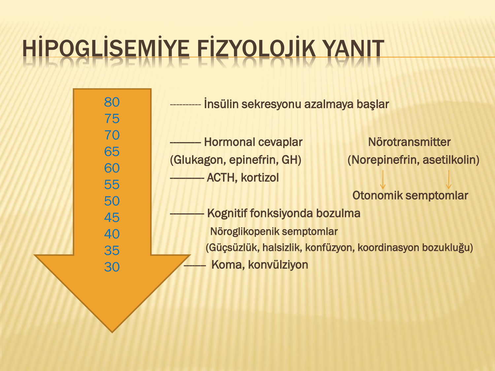
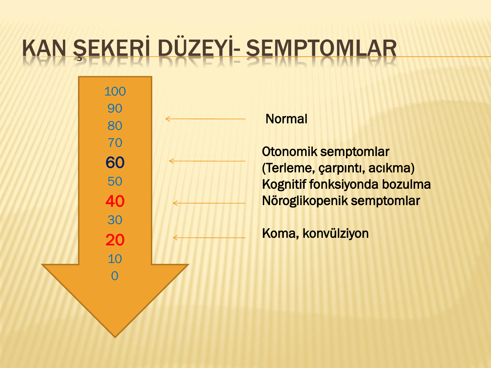
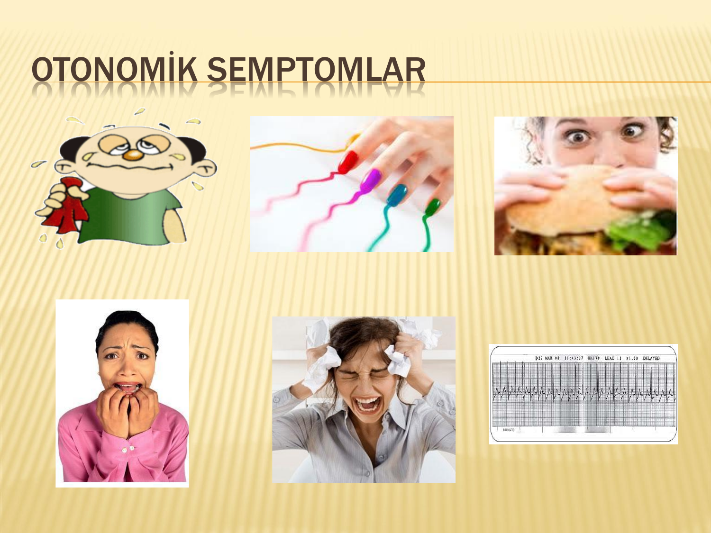
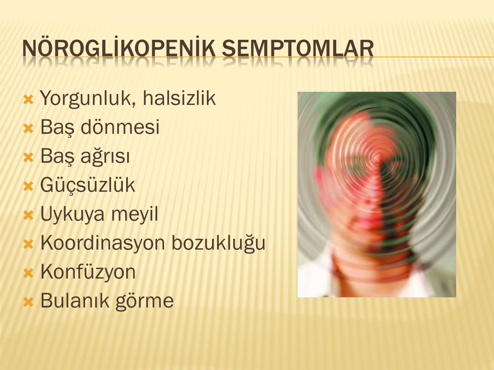
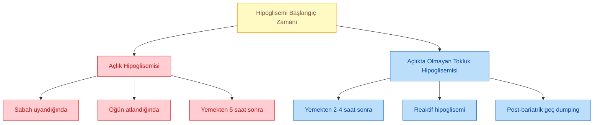
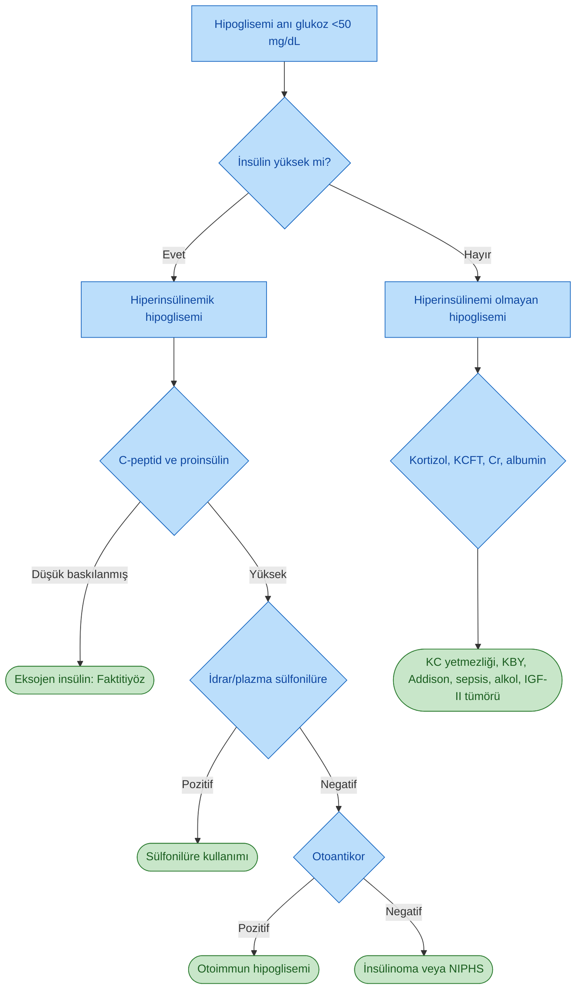
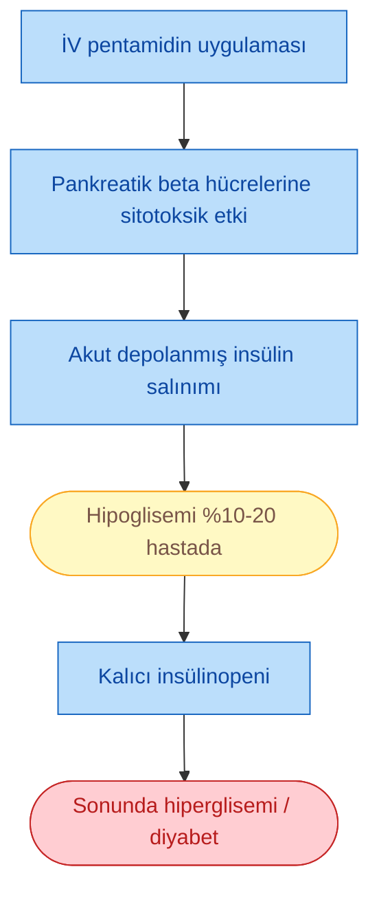
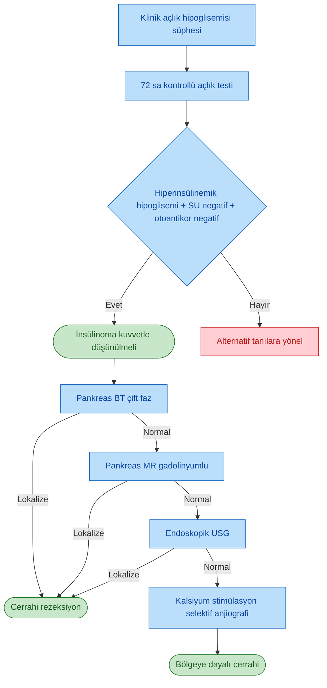
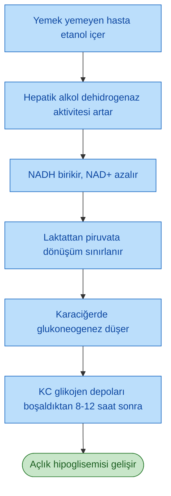
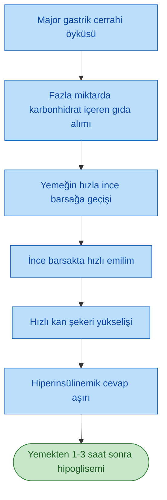

# HİPOGLİSEMİLER

**Hazırlayan:** Prof. Dr. Engin Güney
**Bölüm:** Aydın Adnan Menderes Üniversitesi -- Endokrinoloji ve Metabolizma Hastalıkları Bilim Dalı

---

## İÇİNDEKİLER

1. [Tanım ve Whipple Triadı](#tanım-ve-whipple-triadı)
2. [Glukoz Homeostazı ve Karşı Regülatuar Yanıt](#glukoz-homeostazı-ve-karşı-regülatuar-yanıt)
3. [Klinik Semptomlar](#klinik-semptomlar)
4. [Hipoglisemi Sınıflaması](#hipoglisemi-sınıflaması)
5. [Açlık Hipoglisemisi Nedenleri](#açlık-hipoglisemisi-nedenleri)
6. [Diyabetik Hastalarda Hipoglisemi](#diyabetik-hastalarda-hipoglisemi)
7. [Tanısal Yaklaşım ve Testler](#tanısal-yaklaşım-ve-testler)
8. [Hiperinsülinemi ile Açlık Hipoglisemisi](#hiperinsülinemi-ile-açlık-hipoglisemisi)
9. [Faktitiyöz Hipoglisemi](#faktitiyöz-hipoglisemi)
10. [İlaçlara Bağlı Hipoglisemi](#ilaçlara-bağlı-hipoglisemi)
11. [Otoimmun Hipoglisemi](#otoimmun-hipoglisemi)
12. [İnsülinoma](#insülinoma)
13. [Hiperinsülinemi Olmadan Açlık Hipoglisemisi](#hiperinsülinemi-olmadan-açlık-hipoglisemisi)
14. [Açlıkta Olmayan (Postprandial) Hipoglisemi](#açlıkta-olmayan-postprandial-hipoglisemi)
15. [NIPHS -- Nezidioblastozis](#niphs----nezidioblastozis)
16. [Reaktif Hipoglisemi](#reaktif-hipoglisemi)
17. [Geç Dumping Sendromu](#geç-dumping-sendromu)
18. [Klinik Olgular](#klinik-olgular)
19. [Özet ve Sınav İçin Önemli Noktalar](#özet-ve-sınav-için-önemli-noktalar)

---

## TANIM VE WHIPPLE TRİADI

> **Tanım:** Hipoglisemi, plazma glukoz konsantrasyonunda semptom yaratacak kadar düşme ile karakterize bir durumdur. Tanı, izole glukoz değerine göre değil klinik-biyokimyasal üçleme olan **Whipple triadı** ile konur.

### Whipple Triadı (Üçlemesi)

Hipoglisemi tanısı konabilmesi için aşağıdaki üç kriterin birlikte bulunması gerekir:

1. **Düşük kan şekeri** (laboratuvarla dokümante edilmiş)
2. **Hipoglisemi semptomlarının varlığı** (otonomik ve/veya nöroglikopenik)
3. **Semptomların şeker alımı ile düzelmesi** (kan şekerinin normale gelmesiyle)

> **⚠️ ÖNEMLİ:**
>
> * İzole düşük kan şekeri değeri tek başına hipoglisemi tanısı koydurmaz.
> * Sağlıklı bireylerde (özellikle genç, zayıf kadınlarda) uzun açlık sonrasında semptom vermeden 50 mg/dL altında değerler görülebilir.
> * Whipple triadı sağlanmıyorsa "hipoglisemi" olarak değerlendirme yapılmamalı; gereksiz pahalı tetkiklere yönelinmemelidir.

### Tanısal Eşik Değerler

| Plazma Glukoz (mg/dL) | Yorum                                                         |
|---|---|
| ≥70                   | Açlık plazma glukozunun normal alt sınırı                     |
| <70                   | Diyabetik hastada hipoglisemi eşiği (ADA tanımı)              |
| <60                   | Sağlıksız kişide şüpheli, değerlendirme gerektirir            |
| <55                   | Sağlıklı kişilerde hipoglisemi semptomlarının ortaya çıktığı eşik |
| <50                   | Mutlaka araştırılması gereken değer                           |
| <45                   | Whipple triadı + bu değer → insülinoma için anlamlı           |
| <40                   | Koma, konvülziyon riski yüksek                                |

---

## GLUKOZ HOMEOSTAZI VE KARŞI REGÜLATUAR YANIT

Normal bir bireyde plazma glukozu düştükçe vücut bir dizi hormonal ve nörotransmitter yanıt devreye sokar. Bu yanıtlar belirli glukoz eşiklerinde ardışık olarak aktive olur.

> **Şema yorumu:** Plazma glukozu 80 mg/dL'ye düştüğünde ilk basamak olarak **endojen insülin sekresyonu azalmaya** başlar. 70 mg/dL civarında hormonal karşı regülasyon devreye girer (glukagon, epinefrin, GH). 65 mg/dL altında ACTH/kortizol yanıtı eklenir ve otonomik semptomlar (norepinefrin, asetilkolin aracılı) ortaya çıkar. 50 mg/dL altında kognitif fonksiyonlar bozulur ve nöroglikopenik semptomlar (güçsüzlük, halsizlik, konfüzyon, koordinasyon bozukluğu) belirir. 30 mg/dL ve altı değerlerde koma ve konvülziyon gelişir.

### Glukoz Düşüşünde Basamaklı Yanıt

| Plazma Glukoz | Devreye Giren Yanıt                                           |
|---|---|
| ~80 mg/dL     | Endojen insülin sekresyonu azalır                             |
| ~70 mg/dL     | Glukagon, epinefrin, GH salınımı artar (ilk hormonal yanıt)   |
| ~65 mg/dL     | ACTH ve kortizol salınımı artar                               |
| 60-55 mg/dL   | Otonomik semptomlar (terleme, çarpıntı, acıkma)               |
| <50 mg/dL     | Kognitif bozulma, nöroglikopenik semptomlar                   |
| <40 mg/dL     | Ciddi nöroglikopeni                                           |
| ~30 mg/dL     | Koma, konvülziyon                                             |

### Karşı Regülatuar Hormonlar

* **Glukagon:** İlk ve en hızlı karşı düzenleyici; hepatik glikojenoliz ve glukoneogenezi artırır.
* **Epinefrin (Adrenalin):** Glukagon ile birlikte akut yanıtın bel kemiğini oluşturur; hepatik glukoz çıkışını artırır, periferik glukoz alımını azaltır, lipolizi uyarır. Otonomik semptomlardan büyük ölçüde sorumludur.
* **Kortizol:** Uzamış hipoglisemide glukoneogenezi destekler; katekolaminlerin etkisini güçlendirir.
* **Büyüme Hormonu (GH):** Geç dönemde lipolizi ve periferik insülin direncini artırır.

> **💡 Klinik ipucu:** Uzun süreli tip 1 diyabetlilerde glukagon yanıtı kaybolur, sonrasında epinefrin yanıtı da körelir. Bu **hipoglisemi unawareness (farkındalık kaybı)** tablosunun zeminidir -- hasta otonomik semptomları hissetmeden doğrudan nöroglikopenik semptomlara (konfüzyon, koma) girer.

---

## KLİNİK SEMPTOMLAR

Hipoglisemi semptomları iki ana grupta toplanır: **otonomik (adrenerjik)** ve **nöroglikopenik**. Otonomik semptomlar genellikle daha erken ve daha yüksek glukoz düzeyinde başlar ve hastaya "uyarı" işlevi görür.

> **Şema yorumu:** Kan şekeri 70-60 mg/dL düzeyine düştüğünde **otonomik semptomlar** (terleme, çarpıntı, acıkma) başlar. 50-40 mg/dL civarında **kognitif bozulma ve nöroglikopenik semptomlar** ön plana geçer. 30 mg/dL ve altında **koma ile konvülziyon** gelişebilir.

### Otonomik (Adrenerjik) Semptomlar

* **Terleme** (özellikle soğuk-soğuk)
* **Çarpıntı, taşikardi**
* **Titreme, tremor**
* **Acıkma hissi**
* **Sinirlilik, anksiyete**
* **Solukluk**
* **Parmak/dudak uyuşması**

### Nöroglikopenik Semptomlar

* **Yorgunluk, halsizlik**
* **Baş dönmesi**
* **Baş ağrısı**
* **Güçsüzlük**
* **Uykuya meyil**
* **Koordinasyon bozukluğu**
* **Konfüzyon**
* **Bulanık görme**
* **Disartri, diplopi**
* **Konvülziyon, koma** (ileri evrede)

> **⚠️ ÖNEMLİ:**
>
> * Otonomik semptomlar hastanın **alarm sistemidir** -- glukozun düştüğünü hissettiren ve müdahale etmesini sağlayan yanıttır.
> * Nöroglikopenik semptomlar beynin glukoz yoksunluğuna bağlıdır ve **ciddi tehlike işareti**dir.
> * Beta bloker kullanan hastalarda otonomik uyarı belirtileri baskılanabilir; hasta nöroglikopeniye kadar uyarı almaz.

---

## HİPOGLİSEMİ SINIFLAMASI

Hipoglisemi, oluşum zamanına göre iki ana gruba ayrılır:

### Açlık Hipoglisemisi

* Sabah uyandığında, öğün atlandığında veya yemekten 5 saat sonra görülür.
* Genellikle ciddi organik patoloji (insülinoma, hormon yetmezliği, ilaç, karaciğer/böbrek yetmezliği) ile ilişkilidir.

### Açlıkta Olmayan (Tokluk) Hipoglisemi

* Yemekten 2-4 saat içinde gelişir.
* Çoğunlukla fonksiyoneldir; bariatrik cerrahi öyküsü, reaktif mekanizmalar, gizli diyabet veya NIPHS ile ilişkili olabilir.

---

## AÇLIK HİPOGLİSEMİSİ NEDENLERİ

Açlık hipoglisemisinin ayırıcı tanısında ilk basamak, **hipoglisemi anında ölçülen insülin düzeyi** ile hiperinsülinemik ve hiperinsülinemi-olmayan grupların ayrılmasıdır.

### Hiperinsülinemi ile Birlikte

* **İnsülin reaksiyonu** (eksojen insülin uygulaması)
* **Sülfonilüre (SU) aşırı doz kullanımı**
* **Faktitiyöz (yapay) hipoglisemi**
* **Otoimmun hipoglisemi**
* **İlaçlar** (pentamidin gibi)
* **İnsülinoma**

### Hiperinsülinemi Olmadan

* **Ağır karaciğer fonksiyon bozukluğu** (glukoneogenez ve glikojenoliz yetersizliği)
* **Kronik böbrek yetmezliği (KBY)**
* **Zafiyet (ileri malnütrisyon)**
* **Hipokortizolizm** (Addison hastalığı, hipofiz yetmezliği)
* **Alkol kullanımı**
* **Pankreas dışı tümörler** (IGF-II salgılayan mezenkimal tümörler)

---

## DİYABETİK HASTALARDA HİPOGLİSEMİ

Diyabetik hipoglisemisi, klinik pratikte **en sık karşılaşılan hipoglisemi nedeni**dir. Genellikle iyatrojeniktir.

### Tip 2 Diyabet ile İlişkili Hipoglisemi Nedenleri

* **İyatrojenik nedenler**
  * Sülfonilüre (SU), repaglinid, nateglinid
  * İnsülin
  * SU'nun hipoglisemik etkisini artıran **ilaç etkileşimleri**
    * Klaritromisin
    * Salisilat
    * Sülfonamid
  * **SU kullanan hastada risk faktörleri:** ileri yaş, KBY, karaciğer yetmezliği
* **Diyet uyumsuzluğu** (öğün atlama, yetersiz karbonhidrat)
* **Aşırı egzersiz**

### Tip 1 Diyabet ile İlişkili Hipoglisemi Nedenleri

* **İnsülin dozu hatası** (fazla doz, yanlış zamanlama)
* **Diyet uyumsuzluğu**
* **Aşırı egzersiz**
* **Balayı dönemi** (yeni tanıda beta hücre rezidüel fonksiyonuyla artmış insülin duyarlılığı)
* **Addison hastalığı** (kortizol yetmezliği → karşı regülasyon bozulur)
* **Çölyak hastalığı** (emilim bozukluğu, değişken karbonhidrat emilimi)
* **KBY** (insülin klirensi azalır, dozun birikmesi)
* **Otonomik nöropati -- gastroparezi** (yemeğin sindirimi geciktiği için insülin erken etki eder)
* **Brittle diyabet (oynak diyabet)** (glukoz regülasyonunun ileri derecede dengesizleşmesi)

> **⚠️ ÖNEMLİ:**
>
> * Sülfonilüre ile oluşan hipoglisemi **uzun ve dirençli** olabilir; hasta glukoz verilse bile saatler içinde tekrarlayabilir. Bu hastalar hastanede **en az 24-48 saat gözlenmelidir**.
> * Tip 1 diyabetlide yeni gelişen tekrarlayan hipoglisemiler → **Addison hastalığı** (otoimmun çakışma sendromu) mutlaka araştırılmalıdır.

---

## TANISAL YAKLAŞIM VE TESTLER

Açlık hipoglisemisi şüphesi olan hastada ana testler hipoglisemi anında (glukoz <50 mg/dL iken) eş zamanlı alınmalıdır.

### Açlık Hipoglisemisinde İstenecek Temel Testler

> Açlık sırasında **glikoz 50 mg/dL'nin altındayken** aşağıdaki testler eş zamanlı istenmelidir:

* **Plazma glukozu**
* **İnsülin**
* **C-peptid**
* **Proinsülin**
* **Beta-hidroksibutirat**
* **Sülfonilüre / meglitinid taraması (plazma/idrar)**
* **İnsülin otoantikorları**
* **Kortizol** (hipokortizolizmi ekarte etmek için)

### Sonuçların Yorumlanması

---

## HİPERİNSÜLİNEMİ İLE AÇLIK HİPOGLİSEMİSİ

Hiperinsülinemik açlık hipoglisemisinin dört temel etiyolojisi vardır: **faktitiyöz hipoglisemi, ilaçlar, otoimmun hipoglisemi ve insülinoma**.

### Ayırıcı Tanı Tablosu

Hipoglisemi anındaki laboratuvar bulguları ile ayırıcı tanı yapılır:

| Parametre              | İnsülinoma            | Faktitiyöz (İnsülin)  | Faktitiyöz (Sülfonilüre) |
|---|---|---|---|
| **İnsülin düzeyi**     | ↑ (yüksek)            | ↑↑ (çok yüksek)       | ↑ (yüksek)               |
| **C-peptid düzeyi**    | ↑ (yüksek)            | ↓ (baskılanmış)       | ↑ (yüksek)               |
| **Proinsülin düzeyi**  | ↑ (yüksek)            | ↓ (baskılanmış)       | ↑ (yüksek)               |
| **İdrarda sülfonilüre**| NEGATİF               | NEGATİF               | **POZİTİF**              |

> **💡 Klinik ipucu:**
>
> * Eksojen insülin verilmişse → **yüksek insülin + baskılanmış C-peptid** karakteristiktir (eksojen insülin C-peptid içermez).
> * Sülfonilüre kullanımı → **endojen insülin salınımı artar**, bu yüzden laboratuvar görünümü insülinomaya benzer; ayırım için **plazma/idrar SU taraması** şarttır.
> * İnsülinomada **proinsülin/total insülin oranı** tipik olarak yüksektir (%30-90; normalde <%10).

---

## FAKTİTİYÖZ HİPOGLİSEMİ

### Tanım ve Risk Grupları

Faktitiyöz (yapay) hipoglisemi, hastanın bilinçli veya bilinçsiz olarak hipoglisemik ilaç (insülin veya sülfonilüre) kullanımı sonucu gelişen hipoglisemidir.

* En sık **sağlık çalışanları** ve DM'lu yakını olanlarda görülür.
* **Ciddi psikiyatrik bozukluk, ilgi gereksinimi, intihar girişimi** zemininde olabilir.
* Hipoglisemi anında yüksek insülin düzeyi saptanır; bu nedenle ilk bakışta **insülinomayı düşündürür**.
* Ayırıcı tanı için **eş zamanlı C-peptid ve proinsülin** bakılmalıdır.

### Eksojen İnsülin Kullanımı

* **Hipoglisemi**
* **Yüksek plazma insülin düzeyi**
* **Baskılanmış plazma C-peptid** (ayırt edici!)
* **Baskılanmış plazma proinsülin** (ayırt edici!)

### Sülfonilüre Kötüye Kullanımı

* **Hipoglisemi**
* **Uygunsuz şekilde yükselmiş insülin düzeyi**
* **Yüksek plazma C-peptid düzeyi** (endojen insülin salınımı arttığı için)
* İnsülinomayı taklit eder.
* **Tanı:** İyi bir öykü ile şüphelenildiğinde **plazma veya idrarda sülfonilüre/meglitinid taraması** ile konur.

---

## İLAÇLARA BAĞLI HİPOGLİSEMİ

Sayısız farmakolojik ajan hipoglisemiye yol açabilir. Hipoglisemi için araştırılan her hastada detaylı **ilaç öyküsü** alınmalıdır.

### En Sık Sorumlu İlaçlar

* **Fluorokinolonlar** (özellikle levofloksasin, gatifloksasin)
* **Pentamidin**
* **Kininler** (kinin, kinidin)
* **ACE inhibitörleri**
* **Etanol (alkol)**
* **Salisilat** (yüksek doz)
* **Beta-adrenerjik blokerler** (ayrıca semptomları maskeler)

### Pentamidinin Tetiklediği Hipoglisemi

Pentamidin, özellikle **Pneumocystis jirovecii** tedavisinde kullanılan bir ilaçtır ve kendine özgü bir mekanizma ile hipoglisemi yapar.

> **⚠️ ÖNEMLİ:** Pentamidin alan hastalar bu yüzden **hem hipoglisemi hem de hiperglisemi** açısından yakın izlenmelidir. Başta hipoglisemi, sonrasında kalıcı beta hücre hasarı ile diyabet gelişir.

---

## OTOİMMUN HİPOGLİSEMİ

### Genel Bilgi

Otoimmun hipoglisemi (Hirata hastalığı), dolaşımda **insülin otoantikorları** bulunan hastalarda paradoksik olarak hipoglisemi görülen nadir bir tablodur.

* İlk kez 1970'lerde tanımlanmıştır; literatürde 200'ün üzerinde olgu bildirilmiştir.
* **%90'ı Japon** olgulardır.
* **HLA sınıf II alelleri** ile ilişkili: DRB1*0406, DQA1*0301, DQB1*0302.
* Japon ve Kore'lilerde **10-30 kat daha yaygın**.

### Patofizyoloji

* Yemekten **3-4 saat sonra** hipoglisemi görülür; erken beslenme sonrası hiperglisemiyi izler.
* Yüksek titrede **IgG sınıfı insülin otoantikorları** vardır.
* Yemek sonrasında fizyolojik olarak salınan insülin, bu antikorlara bağlanır.
* Hipoglisemi anında **antikor-insülin kompleksi ayrışır**, serbest insülin salınır ve hipoglisemiye yol açar.
* İnsülin, proinsülin ve C-peptid düzeyleri artmış görünür.
* Ancak insülin otoantikorları immunoassay ile karışabilir → **yanlış yüksek sonuçlar** alınabilir.

### Eşlik Eden Klinik Durumlar

* **Graves hastalığı** (özellikle metimazol tedavisi alanlarda)
* **Sülfhidril grubu içeren ilaçlar** (kaptopril, penisilamin)
* **Hidralazin, izoniazid, prokainamid**
* **Romatolojik hastalıklar:** Romatoid artrit (RA), SLE, polimiyozit
* **Multiple myelom (MM), plazma hücre diskrazileri**

### Tedavi

* Çoğu olguda hipoglisemi **geçicidir**.
* Tanıdan **3-6 ay içinde, suçlu ilaç tedavilerine son verilince kendiliğinden** geçer.
* **Sık düşük karbonhidratlı küçük öğünler**
* Dirençli vakalarda insülin antikor titresini düşürmek için **prednizolon 30-60 mg/gün** denenebilir.

---

## İNSÜLİNOMA

### Genel Özellikler

İnsülinoma, Langerhans adacıklarının **insülin salgılayan tümörü** olup sağlıklı bir yetişkinde spontan açlık hipoglisemisinin **en yaygın nedeni**dir.

* **%80'i tek ve benign**
* **%10 malign** (metastaz saptanmışsa)
* **%10** normal adacık doku içinde serpilmiş **mikro-makroadenomlar ile çoklu**
* **Ailesel olabilir** -- MEN-1 sendromu ile ilişkili olabilir.
* En sık **40-60 yaş** arasında görülür.
* **Kadınlarda** daha sıktır.

> **💡 Klinik ipucu:** Genç bir hastada spontan açlık hipoglisemisi varsa ve birden fazla insülinoma saptandıysa mutlaka **MEN-1 sendromu** (pituiter adenom, primer hiperparatiroidizm, pankreatik nöroendokrin tümör üçlüsü) taranmalıdır.

### Klinik Özellikler ve Tanı

* Hipoglisemi varlığında insülin salgılamasını **azaltmaz** (inhibisyon kaybı).
* Hipoglisemi anında **yüksek insülin, yüksek C-peptid ve yüksek proinsülin** düzeyleri vardır.
* Emilebilir karbonhidrat yemek veya içmek semptomları yaklaşık **15 dakika içinde** iyileştirir.
* **Fizik muayene genellikle normaldir**.
* Hastaların **%30'unda obezite** görülür (sık yemek yeme kompansasyonuna bağlı).
* Hipoglisemi anında genellikle kan glukozu **40 mg/dL civarındadır**.
* Ayırıcı tanı için kan/idrarda **sülfonilüre taraması negatif**; **insülin otoantikorları negatif**.

### 72 Saat Açlık Testi -- Kontrollü (Supervised) Protokol

Ayaktan izlem ile semptom gelişmiyorsa veya klinik şüphe yüksekse, altın standart tanı testi **72 saat kontrollü açlık testi**dir.

**Test Protokolü:**

1. **Başlangıç (0. saat):** Serum glukoz, insülin, C-peptid, proinsülin ölçümü.
2. **İçecekler:** Kalorisiz ve kafeinsiz içecek ile su serbest.
3. **İdrar ketonu:** Başlangıç, her 12 saatte ve test sonunda ölçüm.
4. **Kapiller glukoz:** Her 6 saatte 1 kez ölçüm.
5. **KŞ <60 mg/dL olursa:** Her saat ölçüm yap.
6. **KŞ <49 mg/dL olduğunda:** Glukoz, insülin, C-peptid, proinsülin için **venöz kan** al.
7. **Nöroglikopeni semptomlarını takip et.**
8. **KŞ <45 mg/dL olursa veya 72 saati geçerse:** Son örneği glukoz, insülin, C-peptid, proinsülin için al. Ayrıca **beta-hidroksibutirat veya aseton** ve **sülfonilüre** ölçümü yap.
9. **Testi sonlandır:** Hızlı oral karbonhidrat içeren yemek ver. Konfüze ise veya oral alamıyorsa **İV dekstroz** uygula.

### 72 Saat Açlık Testi Sonrası Tanı Kriterleri

Aşağıdaki tüm kriterlerin karşılanması insülinoma tanısını destekler:

| Parametre                          | Tanı Kriteri   |
|---|---|
| Plazma glukozu                     | <45 mg/dL      |
| Plazma insülini (RIA)              | >6 μU/mL       |
| Plazma insülini (ICMA)             | >3 μU/mL       |
| Plazma C-peptid                    | >200 pmol/L    |
| Plazma proinsülin                  | >5 pmol/L      |
| Beta-hidroksibutirat               | <2.7 nmol/L    |
| Sülfonilüre değerlendirmesi        | Negatif        |

> **⚠️ ÖNEMLİ -- Proinsülin oranı:**
>
> * Normal durumda proinsülin, total immunreaktif insülinin **%10'undan azını** oluşturur.
> * İnsülinoma hücreleri kötü diferansiyedir ve **proinsülini insüline dönüştüremez**.
> * İnsülinomada proinsülin düzeyi artar ve total immunreaktif insülinin **%30-90'ına** ulaşır.
> * Hiperinsülinemi keton üretimini baskılar → **plazma beta-hidroksibutirat ≤2.7 nmol/L**'dir.
> * Ek olarak **İV tolbutamid, glukagon, kalsiyum uyarı testleri** yapılabilir.

### İnsülinomada Görüntüleme

Tanı konduktan sonra tümör lokalize edilmelidir. İnsülinoma tipik olarak **küçük (ort. 1.5 cm)** olduğu için görüntüleme zordur ve görüntüleme yöntemleri **tanımlayamayabilir**.

**Görüntüleme Sıralaması ve Duyarlılık:**

| Yöntem                                  | Duyarlılık  |
|---|---|
| Pankreas çift-fazlı ince kesit helikal BT | %82-94      |
| Gadolinyumlu MR                         | %85         |
| Endoskopik ultrasonografi (EUS)         | %80-90      |
| Kalsiyumla uyarılmış selektif anjiografi | Lokalizasyon için; dirençli vakalarda  |

### Kalsiyumla Uyarılmış Selektif Anjiografi

Tümör hala tanımlanamıyorsa invaziv yöntem olarak kalsiyum stimülasyon testi uygulanır:

* **Gastroduodenal arter** (pankreas başı bölgesi)
* **Splenik arter** (pankreas gövde ve kuyruk)
* **Süperior mezenterik arter** (unsinat proses)
* Bu arterlere **kalsiyum glukonat** enjekte edilir.
* **Hepatik ven çıkışından** insülin düzeyi ölçülür.
* Kalsiyum, insülinomalarda insülin salınımını artırır.
* **Bazale göre 2 kat ve üzeri insülin artışı** lokalizasyon için önemlidir.

### Tedavi

#### Cerrahi Rezeksiyon (Tercih edilen tedavi)

* **Deneyimli cerrah** şarttır.
* **Laparoskopik intraoperatif USG** tümörün lokalize edilmesine yardım eder.
* Tümör hala lokalize edilemiyorsa **körleme (kör) rezeksiyon artık önerilmemektedir**.
* Cerrahi işlem sırasında **kan glukoz düzeyi monitörize** edilmelidir.

#### Diazoksid

* **Endikasyonlar:** Preoperatif dönem, inoperabl vakalar.
* **Mekanizma:** Pankreatik beta hücresinin **ATP-duyarlı potasyum kanalını açar**, hücre zarını hiperpolarize eder. Voltaj bağımlı kalsiyum kanalından Ca⁺² iç akışı azalır. Böylece insülin salınımı azalır.
* **Doz:** 300-400 mg/gün.
* **Yan etkileri:** Sodyum tutulumuna bağlı ödem, mide irritasyonu, hirsutizm.

#### Oktreotid

* **Somatostatinin güçlü uzun etkili analoğudur**.
* Pankreasta etkili reseptör: **SSTR5** (somatostatin reseptör 5).
* **Endikasyonlar:**
  * Post-operatif hipogliseminin devam ettiği durumlarda
  * Diazoksid ve verapamil tolere edilemediğinde veya etkisiz olduğunda
* **Doz:** Günde 2 kez sc 50 μg oktreotid denenebilir.

### İlginç Olgu Örneği -- Tanı Konulamamış İnsülinomanın 6 Yıllık Seyri

> **📋 VAKA ÖRNEĞİ -- Engin Güney ve ark., ADÜ Tıp Fakültesi**
>
> 40 yaşında kadın hasta, 7 yıl önce dış merkezde hipoglisemi nedeniyle başvurmuş. Pankreas BT'si normal saptanıp reaktif hipoglisemi düşünülerek **akarboz** başlanmış. Sık beslenen hastada bu süre içinde **ciddi kilo artışı** olmuş. 6 yıl sonra ciddi açlık hipoglisemileri ile tekrar başvurmuş.
>
> Hiperinsülinemik hipoglisemi saptanan hastanın pankreas BT ve MR'ı yine normal. **Endoskopik USG** yapılmış: Pankreas başında portal konfluens komşuluğunda **2x1.6 cm hipoekoik insülinoma ile uyumlu kitle** saptanmış. Hasta cerrahiyi kabul etmedi ve diazoksid başlandı. Yaklaşık 1 yıldır tedavi altında ciddi hipoglisemisi olmuyor.
>
> **Tedavisiz seyirde değişim:**
>
> | Parametre               | 2004 (Tanı konulamayan dönem) | 2010 (Tanı aldığı dönem) | 2011 (Tedavi altında) |
> |---|---|---|---|
> | Açlık glukoz (mg/dL)    | 30                             | 14                        | 58                    |
> | Açlık insülin (μU/mL)   | 32.9                           | 98.5                      | 30.9                  |
> | C-peptid (ng/mL)        | 2.2                            | 7.18                      | 2.48                  |
> | Vücut ağırlığı (kg)     | 93                             | 138                       | 133                   |
> | Hemoglobin              | 11.2                           | 10.5                      | 11.8                  |
> | Lökosit                 | 11900                          | 10240                     | 11200                 |
> | Trombosit               | 253000                         | 370000                    | 315000                |
> | Sedimantasyon           | 24                             | 37                        | 16                    |
>
> **Öğretici Notlar:**
>
> 1. İlk başvuruda görüntüleme negatifse bile klinik olarak hiperinsülinemik hipoglisemi devam ediyorsa **endoskopik USG** mutlaka yapılmalıdır.
> 2. Tedavisiz seyirde hipoglisemilerin sıklığı ve şiddeti artabilir; hasta kompanzasyon için sık beslenerek **45 kg'a varan kilo artışı** yaşayabilir.
> 3. İnsülinomada cerrahi kabul edilmiyorsa **diazoksid** ile uzun süreli etkili kontrol sağlanabilir.

---

## HİPERİNSÜLİNEMİ OLMADAN AÇLIK HİPOGLİSEMİSİ

Hipoglisemi anında insülin düşük/normal ise karşı regülatuar sistem bozukluğu, organ yetmezliği veya ekstrapankreatik tümör araştırılmalıdır.

### Temel Nedenler ve Taranacak Testler

| Neden                        | Tarama Testi                                 |
|---|---|
| Ağır karaciğer yetmezliği   | KCFT, INR, albumin                           |
| Kronik böbrek yetmezliği     | Kreatinin klirensi                           |
| Hipokortizolizm              | Hipoglisemi anında kortizol, ACTH düzeyi; Addison/hipofiz yetmezliği değerlendirmesi |
| Zafiyet                      | Klinik ve nütrisyonel değerlendirme           |
| Alkol kullanımı              | Öykü, etanol düzeyi                          |
| Pankreas dışı tümör          | Görüntüleme, IGF-II, IGF-II/IGF-I oranı     |

### Alkol ile İlişkili Hipoglisemi

> **⚠️ ÖNEMLİ:** Alkole bağlı hipoglisemi, akşam aç karnına alkol alan ve gece sabah uykudan hipoglisemi ile uyanan hastalarda akla gelmelidir. Klasik olarak **8-12 saatlik latent dönem** vardır.

### Adacık Hücresi Dışı (Ekstrapankreatik) Tümör Hipoglisemisi

* Bu grup tümörlerin **çoğu büyük ve mezenkimal orijinli**dir.
* **Retroperitoneal fibrosarkom** klasik prototiptir.
* Diğer tümörler:
  * **Hepatosellüler karsinom (HCC)**
  * **Adrenokortikal karsinom**
  * **Hipernefrom (renal hücreli karsinom)**
  * **Gastrointestinal sistem tümörleri**
  * **Lenfoma, lösemi**
* Patogenez: **IGF-II (big IGF-II)** ekspresyonu ve salınımı.
* IGF-II insülin reseptörlerine bağlanarak hipoglisemi yapar.
* Laboratuvarda **insülin, C-peptid, proinsülin düşük**; **IGF-II düzeyi ve IGF-II/IGF-I oranı artmış**.

---

## AÇLIKTA OLMAYAN (POSTPRANDİAL) HİPOGLİSEMİ

Yemekten **2-4 saat sonra** ortaya çıkan hipoglisemidir. Başlıca nedenleri:

* **Beslenme ile ilişkili (reaktif) hipoglisemi**
* **Fonksiyonel hipoglisemi**
* **Non-insülinoma pankreatojenik hipoglisemik sendrom (NIPHS -- nezidioblastozis)**
* **Gizli diyabet** (IGT/erken tip 2 DM)
* **Şekerle karışık etanol alımı**

### Postprandial Hipoglisemide Beslenme İlişkili Nedenler

* **Reaktif hipoglisemi** (fonksiyonel)
* **Gastrik cerrahi sonrası -- özellikle Roux-en-Y gastrik bypass cerrahisi** (post-bariatrik hipoglisemi)
* **Non-insülinoma pankreatojenik hipoglisemi (NIPHS)**
* **Gizli diyabet**

---

## NIPHS -- NEZİDİOBLASTOZİS

### Tanım ve Klinik

NIPHS (Non-Insulinoma Pancreatogenous Hypoglycemia Syndrome), pankreas adacık hücrelerinin **diffüz hiperplazisi** sonucu gelişen hiperinsülinemik hipoglisemi sendromudur.

* **Adacık hücre hiperplazisi**
* **Hiperinsülinemik hipoglisemi**
* Yemekten **2-4 saat sonra** semptomlar başlar.
* **%70'i erkek**
* Klinik olarak **diplopi, disartri, konfüzyon, disoryantasyon, konvülziyon, koma** görülebilir.

### Tanı

* Hipoglisemi anında **insülin, C-peptid, proinsülin yüksektir**.
* **Sülfonilüre taraması negatif**.
* **72 saat açlık testi NEGATİF** (insülinomadan en önemli ayırıcı özellik!).
* BT, MR **normal** (tümör yok).
* **Kalsiyumla uyarılmış selektif anjiografi**, multiple arter beslenme alanı için **POZİTİF**dir (diffüz hastalık olduğu için tek odakta değil).

### Tedavi

* **Parsiyel veya subtotal pankreatektomi**.
* Medikal tedavide diazoksid, oktreotid denenebilir.

> **⚠️ ÖNEMLİ -- İnsülinoma vs NIPHS Ayrımı:**
>
> | Özellik                     | İnsülinoma                      | NIPHS                                |
> |---|---|---|
> | Hipoglisemi zamanı          | Açlık (sabah, öğün atlama)      | Postprandial (yemekten 2-4 sa sonra) |
> | 72 sa açlık testi           | POZİTİF (<45 mg/dL + yüksek insülin) | NEGATİF                       |
> | Görüntüleme                 | Tek odak (BT/MR/EUS'da görülebilir) | Normal                           |
> | Kalsiyum stimülasyon        | Tek arter alanı pozitif         | Birden fazla arter alanı pozitif     |
> | Tedavi                      | Enükleasyon/rezeksiyon          | Parsiyel-subtotal pankreatektomi     |

---

## REAKTİF HİPOGLİSEMİ

### Klinik

* Yemek yedikten **3-4 saat sonra** başlayan sinirlilik, halsizlik, titreme, terleme, çarpıntı **sempatik aktivite semptomları** ön plandadır.
* **Fizik muayene ve laboratuvar testleri normal**dir.
* Gerçek nöroglikopenik semptomlar genellikle **yoktur**.

### Tanı Testleri -- Güncel Yaklaşım

* **Önceden** 5 saat 100 g **OGTT** önerilirdi; kan şekeri 50 mg/dL altına düştüğünde "reaktif hipoglisemi" tanısı konup diyet önerilirdi.
* Ancak, semptom olmayan normal bireylerin **%10'unda** da OGTT sırasında kan şekeri 50 mg/dL altına düşebilir.
* OGTT ve **mixed meal testi karşılaştırılmış**: OGTT ile 50 mg/dL altına düşüldüğünde mixed meal testi **normal** bulunmuştur.
* Bu nedenle **bu testler artık herkese önerilmemektedir**.

### Güncel Tanı Yaklaşımı

* **Evde glukometri** ile semptom olduğunda ölçüm önerilir.
* Semptom olup **KŞ <50 mg/dL** saptanan ve **kolay emilir karbonhidrat alımı ile semptom geçen** hastalarda ek test önerilir.
* Whipple triadı tam ise reaktif hipoglisemi tanısı desteklenir.

### Tedavi

* **Kilo verme**
* **Lifli gıda tüketimini artırma**
* **Ara öğünlerin atlanmaması**
* **Sık sık az az yeme**
* **Öğünlerde karbonhidrat alımının azaltılması**
* İleri vakalarda:
  * **Akarboz** (alfa glukozidaz inhibitörü)
  * **Metformin**

---

## GEÇ DUMPİNG SENDROMU

### Patofizyoloji

Geç dumping sendromu, **major gastrik cerrahi öyküsü** olan hastalarda postprandial hipoglisemi tablosudur. Özellikle **Roux-en-Y gastrik bypass** sonrası giderek daha sık görülmektedir.

### Tanı

* **Mixed meal testi**
* **100 g OGTT 5 saat**

### Tedavi

* **Diyet modifikasyonu:** Düşük glisemik indeksli, sık küçük öğünler; basit şekerlerden kaçınma.
* **Alfa glukozidaz inhibitörleri:** Akarboz, miglitol.
* **Dirençli ciddi vakalarda:** Günde 2-3 kez **oktreotid**.

---

## KLİNİK OLGULAR

### Olgu 1

> **📋 VAKA ÖRNEĞİ 1: Hemşirelik Öğrencisinde Hipoglisemi**
>
> **Hasta:** 22 yaşında, kadın, hemşirelik öğrencisi.
>
> **Başvuru şikayeti:** Ellerde titreme, halsizlik, soğuk soğuk terleme, sinirlilik, çarpıntı şikayetleri ile acile başvuruyor.
>
> **Özgeçmiş:** Özellik yok.
> **Soygeçmiş:** Baba DM, insülin kullanıyor.
>
> **Fizik Muayene:**
> * TA: 90/60 mmHg
> * Nabız: 110/dk, ritmik
> * Cilt nemli, ellerde tremor
>
> **Parmak ucu KŞ:** 45 mg/dL.
>
> Bir bardak meyve suyu içince şikayetler geçmiş. Kontrol parmak ucu KŞ: 89 mg/dL.
>
> **Öykünün detayları (ek sorgulama):**
> * Son 2 haftadır şikayetler mevcut.
> * Sabah uyandığında oluyor.
> * Gece uykudan hipoglisemi semptomları ile uyanıyor.
> * **Yemekten bağımsız** oluyor.
>
> **Tanı yaklaşımı:**
>
> 1. **Whipple triadı tam:** Düşük KŞ (45 mg/dL) + semptom + şekerle düzelme.
> 2. **Sınıflama:** Sabah uyandığında, yemekten bağımsız → **açlık hipoglisemisi**.
> 3. Hipoglisemi anı laboratuvarı:
>    * Venöz glukoz: **42 mg/dL**
>    * Eş zamanlı insülin: **30 μU/mL (yüksek)**
>    * C-peptid: **düşük/baskılanmış**
>    * Proinsülin: **düşük/baskılanmış**
>
> **Yorum:** **Hiperinsülinemik açlık hipoglisemisi** + **baskılanmış C-peptid ve proinsülin** → **Eksojen insülin uygulaması** (faktitiyöz hipoglisemi) en olası tanı.
>
> **Öyküde destekleyici ögeler:**
> * Sağlık çalışanı (hemşirelik öğrencisi) -- insüline erişim kolay.
> * Baba diyabetik, insülin kullanıyor -- evde insülin ulaşılabilir.
>
> **Öğretici Notlar:**
>
> 1. Faktitiyöz hipoglisemi düşünülen hastalarda **psikiyatrik değerlendirme** ve eşlik eden ilaç/intihar riski taraması yapılmalıdır.
> 2. Hiperinsülinemik hipoglisemide **C-peptid** en kritik ayırıcı testtir -- eksojen insülinde C-peptid **baskılanmış**, endojen nedenlerde (insülinoma, SU) **yüksek**.
> 3. Hipoglisemi değerlendirmesinde ilk basamak her zaman **hipoglisemi anında eş zamanlı glukoz, insülin, C-peptid, proinsülin** almaktır.

---

## ÖZET VE SINAV İÇİN ÖNEMLİ NOKTALAR

### Mutlaka Bilinmesi Gerekenler

1. **Whipple Triadı:** Düşük KŞ + semptom + şeker alımı ile düzelme. Hipoglisemi tanısı izole değere değil üçlemeye göre konur.
2. **Glukoz eşikleri:**
   * ~80 mg/dL: endojen insülin azalmaya başlar.
   * ~70 mg/dL: ilk hormonal yanıt (glukagon, epinefrin, GH).
   * ~55 mg/dL: sağlıklı kişide semptom eşiği.
   * <50 mg/dL: araştırma gerekli.
   * <45 mg/dL: insülinoma için anlamlı.
3. **Karşı regülatuar hormonlar:** Glukagon → Epinefrin → Kortizol/GH (sırayla devreye girer).
4. **Sınıflama:**
   * **Açlık hipoglisemisi** (sabah, öğün atlama, yemekten 5 saat sonra) → ciddi organik neden.
   * **Postprandial hipoglisemi** (yemekten 2-4 sa sonra) → fonksiyonel, reaktif, post-bariatrik.
5. **Hiperinsülinemik hipoglisemi ayırıcı tanı (4 temel):**
   * Faktitiyöz (insülin veya SU)
   * İlaçlar (pentamidin, fluorokinolon, kinin)
   * Otoimmun hipoglisemi
   * İnsülinoma
6. **Ayırıcı tanı anahtar tablo:** İnsülinomada insülin↑ / C-peptid↑ / proinsülin↑ / SU negatif; Eksojen insülinde insülin↑ / C-peptid↓ / proinsülin↓; SU kullanımında her üç hormon da ↑ ama SU taraması POZİTİF.
7. **İnsülinoma tanısında altın standart:** 72 saat kontrollü açlık testi + KŞ <45 mg/dL + insülin (ICMA) >3 μU/mL + C-peptid >200 pmol/L + proinsülin >5 pmol/L + BOHB <2.7 nmol/L + SU negatif.
8. **Proinsülin/insülin oranı:** Normal <%10, insülinomada %30-90.
9. **Görüntüleme sıralaması insülinomada:** BT çift faz → Gadolinyumlu MR → EUS → Kalsiyum stimülasyon selektif anjiografi.
10. **İnsülinoma tedavisi:** Cerrahi rezeksiyon (deneyimli cerrah, intraoperatif USG); tıbbi: diazoksid 300-400 mg/gün, oktreotid.
11. **NIPHS vs İnsülinoma:** NIPHS'de 72 sa açlık testi NEGATİF, görüntüleme normal, kalsiyum stimülasyonu multiple arter alanında pozitif.
12. **Diyabetiklerde en sık hipoglisemi nedenleri:** SU ve insülin; SU kullanan yaşlı/KBY/KC yetmezliği olan hasta yüksek risk.
13. **Alkol hipoglisemisi mekanizması:** NADH artışı → glukoneogenez inhibisyonu → 8-12 saat sonra KC glikojeni tükendiğinde hipoglisemi.
14. **Ekstrapankreatik tümör hipoglisemisi:** Büyük mezenkimal tümör + IGF-II salınımı. İnsülin, C-peptid, proinsülin DÜŞÜK; IGF-II YÜKSEK.
15. **Post-bariatrik (geç dumping):** Yemekten 1-3 saat sonra, tedavide akarboz, dirençli vakada oktreotid.
16. **Reaktif hipoglisemi:** OGTT artık tanıda önerilmiyor; evde glukometri ile semptom-glukoz eşleşmesi ve Whipple triadı esas alınır.

### Hipoglisemi Tedavisinin Akut Prensipleri

> **⚠️ ÖNEMLİ -- "15 Gram Kuralı":**
>
> * Bilinci açık hastada: 15 g hızlı emilen karbonhidrat (örn. 1 bardak meyve suyu, 3 glukoz tablet, 1 yemek kaşığı bal) → 15 dakika sonra KŞ kontrol → hala <70 mg/dL ise tekrarla.
> * Bilinci kapalı veya oral alamayan hastada: **İV %50 dekstroz 25-50 mL** veya **IM/SC glukagon 1 mg**.
> * Sülfonilüreye bağlı uzamış hipoglisemide: **Sürekli İV dekstroz infüzyonu** ve en az 24-48 saat izlem gerekir.

### Unutulmaması Gereken İleri Noktalar

* Hipoglisemi farkındalık kaybı (unawareness) uzun süreli tip 1 DM'da sık; beta bloker kullanımı ve otonomik nöropati riski artırır.
* MEN-1 sendromu şüphesi: Birden fazla insülinoma + hiperparatiroidizm + pituiter adenom kombinasyonu.
* Otoimmun hipoglisemi: Japonlar + Graves (metimazol) + HLA ilişkili; çoğu geçicidir.
* Pentamidin iki fazlı etki yapar: önce hipoglisemi (akut insülin salınımı), sonra kalıcı insülinopeni → diyabet.

---
