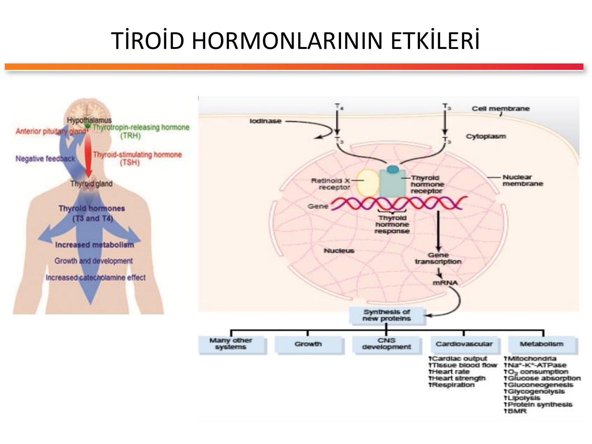
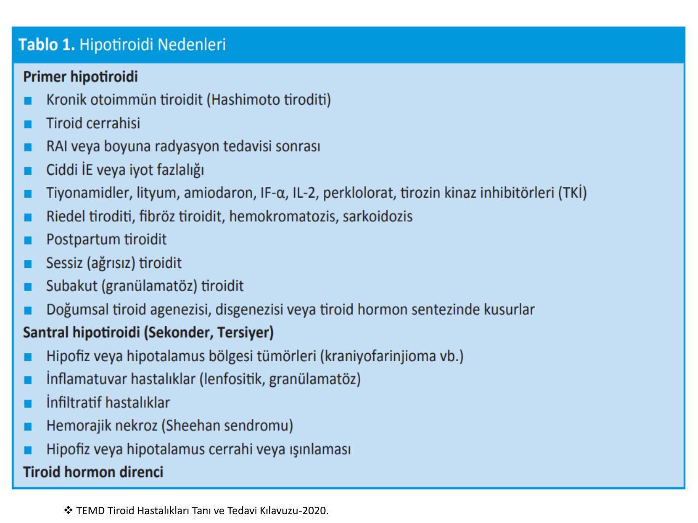
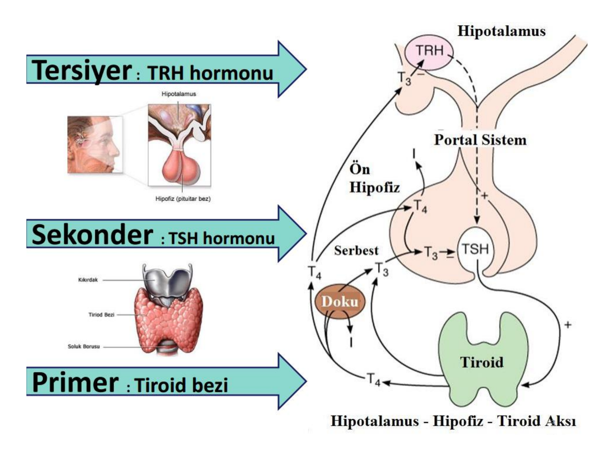
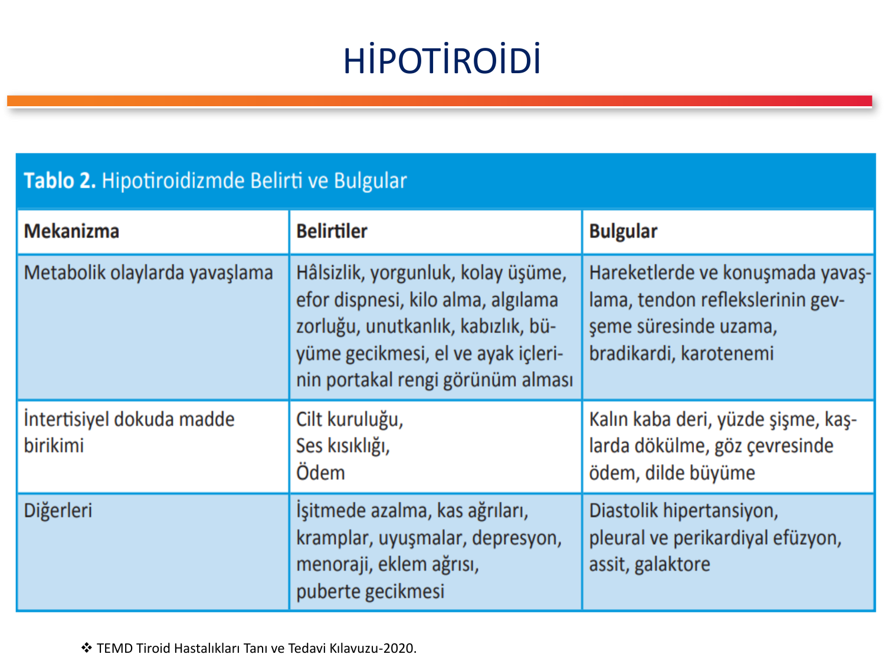
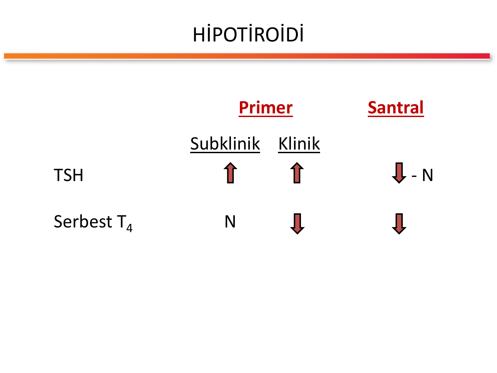
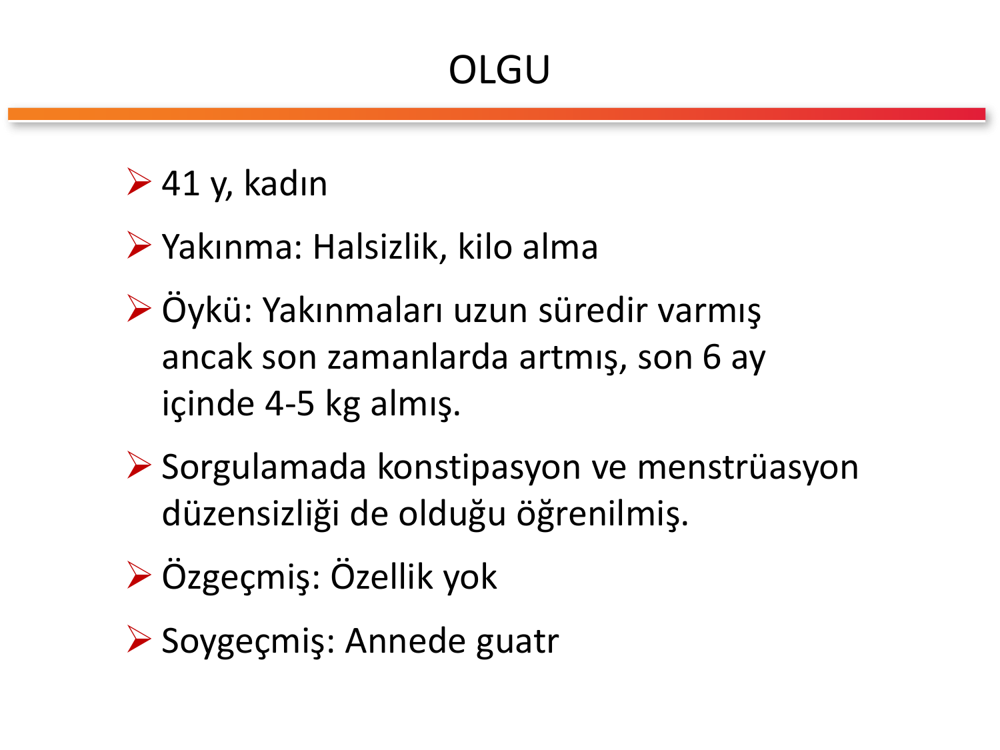
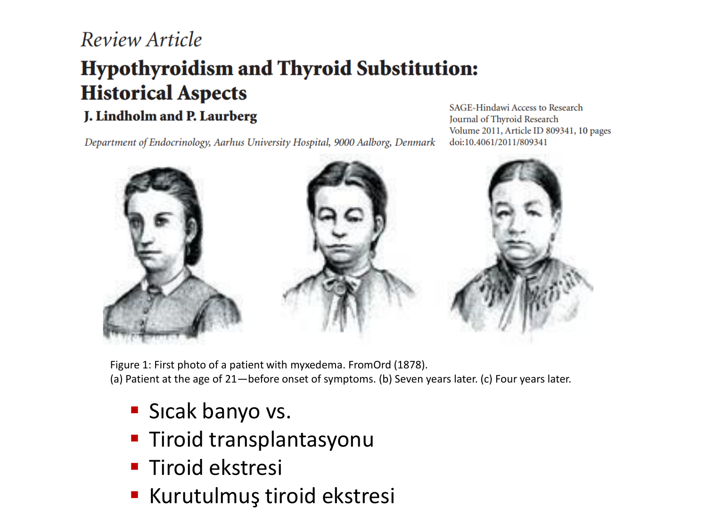
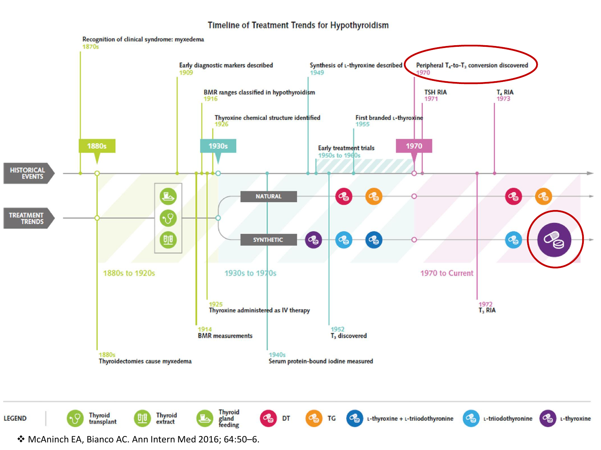

# HİPOTİROİDİZM

**Hazırlayan:** Prof. Dr. Engin Güney
**Bölüm:** Endokrinoloji

---

## İÇİNDEKİLER

1. [Tanım ve Genel Bakış](#tanım-ve-genel-bakış)
2. [Epidemiyoloji](#epidemiyoloji)
3. [Tiroid Hormonlarının Fizyolojisi](#tiroid-hormonlarının-fizyolojisi)
4. [Etyoloji ve Sınıflandırma](#etyoloji-ve-sınıflandırma)
5. [Hashimoto Tiroiditi (Kronik Otoimmün Tiroidit)](#hashimoto-tiroiditi-kronik-otoimmün-tiroidit)
6. [Klinik Bulgular](#klinik-bulgular)
7. [Organ Sistemi Bazında Bulgular](#organ-sistemi-bazında-bulgular)
8. [Tanı](#tanı)
9. [TSH ve sT4 Yorumlama Matrisi](#tsh-ve-st4-yorumlama-matrisi)
10. [Tanısal Yaklaşım Algoritması](#tanısal-yaklaşım-algoritması)
11. [Subklinik Hipotiroidizm](#subklinik-hipotiroidizm)
12. [Miksödem Koması](#miksödem-koması)
13. [Konjenital Hipotiroidizm](#konjenital-hipotiroidizm)
14. [Gebelikte Hipotiroidizm](#gebelikte-hipotiroidizm)
15. [Tedavi -- Levotiroksin](#tedavi----levotiroksin)
16. [Subklinik Hipotiroidide Tedavi](#subklinik-hipotiroidide-tedavi)
17. [Santral Hipotiroidide Tedavi](#santral-hipotiroidide-tedavi)
18. [T3 + T4 Kombinasyon Tedavisi](#t3--t4-kombinasyon-tedavisi)
19. [İzlem](#izlem)
20. [Levotiroksin Kullanımının Riskleri](#levotiroksin-kullanımının-riskleri)
21. [Ayırıcı Tanı](#ayırıcı-tanı)
22. [Klinik Vaka Örnekleri](#klinik-vaka-örnekleri)
23. [Özet ve Akılda Kalıcı Bilgiler](#özet-ve-akılda-kalıcı-bilgiler)
24. [Test Soruları](#test-soruları)
25. [Kısaltmalar](#kısaltmalar)

---

## TANIM VE GENEL BAKIŞ

> **Hipotiroidizm:** Doku düzeyinde tiroid hormonu yetersizliği veya nadiren etkisizliği (hormon direnci) sonucu ortaya çıkan, **metabolik yavaşlama** ile giden sistemik bir hastalıktır.

**Temel patofizyolojik tema:**

* Metabolik olaylarda yavaşlama
* İntertisyel dokuda **glikozaminoglikan (GAG) birikimi** → nonpitting "miksödem" oluşumu
* Tiroid hormonu eksikliği vücuttaki **bütün dokuları** etkiler

> 💡 **Akılda kalıcı:** Hipotiroidi, yalnızca bir boyun hastalığı değildir -- SSS, kalp, böbrek, kas, cilt, üreme ve lipid metabolizmasını ilgilendiren **sistemik, çok-organlı** bir bozukluktur.

> 💡 **Etimoloji -- "Miksödem":** Yunanca **myxa** (mukus) + **oidema** (şişme) → "mukus-benzeri şişlik". Dermis ve subkutan dokuda hidrofilik GAG (özellikle hiyalüronik asit ve kondroitin sülfat) birikimi su tutarak **pittingsiz ödem** yapar.

---

## EPİDEMİYOLOJİ

| Parametre | Değer |
|---|---|
| **Aşikar hipotiroidi prevalansı** | ~ %0,3 |
| **Subklinik hipotiroidi prevalansı** | ~ %4,3 |
| **Kadın/Erkek oranı** | 5-8 / 1 |
| **Yaşlılarda (>65 yaş) kadın** | %5-20 |
| **Yaşlılarda (>65 yaş) erkek** | %3-8 |
| **Subklinik → aşikar progresyon** | Yıllık %2-4 |

> ⭐ **Kritik epidemiyolojik ipuçları:**
>
> * Kadınlarda **5-8 kat** daha sık
> * Yaşla birlikte prevalans **artar**
> * Subklinik hipotiroidi aşikar hipotiroidiye göre **~14 kat** daha yaygındır
> * 35 yaş üzeri tüm kadınlarda **her 5 yılda bir TSH ölçülmesi** önerilir

---

## TİROİD HORMONLARININ FİZYOLOJİSİ



### Hormon Sentezi ve Etkileri

**Tiroid bezi başlıca iki hormon üretir:**

| Hormon | Özellik |
|---|---|
| **T4 (Tiroksin)** | Tiroidden salınan hormonun **~%93'ü**; biyolojik olarak daha zayıf; prohormon |
| **T3 (Triiyodotironin)** | Tiroidden salınan hormonun ~%7'si; biyolojik olarak **3-4 kat daha aktif** |

> **Periferik konversiyon:** Dolaşımdaki T3'ün **yaklaşık %80'i** periferik dokularda (karaciğer, böbrek, kas) **5'-deiyodinaz** enzimi ile T4'ten dönüşerek oluşur.

### Hipotalamo-Hipofizer-Tiroid Aksı



**Aksın şematik özeti:**

```
          HİPOTALAMUS
               │
               │ TRH (Tirotropin salgılatıcı hormon)
               ▼
          ÖN HİPOFİZ
               │
               │ TSH (Tiroid uyarıcı hormon)
               ▼
           TİROİD BEZİ
               │
               │ T4 (%93) + T3 (%7)
               ▼
       Periferik dokular (T4 → T3 dönüşümü)
               │
               ▼
         Biyolojik etki
               │
               └── (-) Negatif geri bildirim ──> Hipofiz + Hipotalamus
```

**Hipotiroidi seviyesine göre sınıflandırma:**

| Seviye | Bozukluk yeri | Hormon profili |
|---|---|---|
| **Primer** | Tiroid bezi | TSH ↑ + sT4 ↓ |
| **Sekonder** | Ön hipofiz (TSH eksikliği) | TSH ↓ veya N + sT4 ↓ |
| **Tersiyer** | Hipotalamus (TRH eksikliği) | TSH ↓ veya N + sT4 ↓ |
| **Periferik** (nadir) | Hormon direnci (doku düzeyinde) | TSH + sT4 varyasyonlu |

> 💡 **Mnemonik -- "PST + H":** **P**rimer tiroid, **S**ekonder hipofiz, **T**ersiyer hipotalamus, **H**ormon direnci (periferik). Lezyon ne kadar yukarıda ise tedavi o kadar karmaşıktır.

---

## ETYOLOJİ VE SINIFLANDIRMA



### Kapsamlı Etyoloji Tablosu

| Grup | Neden | Mekanizma / Not |
|---|---|---|
| **Primer (tiroid bezi kaynaklı)** | **Kronik otoimmün tiroidit (Hashimoto)** | En sık neden, erişkin kadında %1-2 |
| | **Tiroid cerrahisi** (total/subtotal tiroidektomi) | Yapısal doku kaybı |
| | **RAI veya boyuna radyasyon sonrası** | Graves, tiroid Ca, Hodgkin LH tedavisi sonrası |
| | **İyot eksikliği (ciddi)** | Endemik guatr bölgeleri |
| | **İyot fazlalığı** (Wolff-Chaikoff etkisi) | Amiodaron, kontrast maddeler, yüksek iyot alımı |
| | **İlaçlar** | Tiyonamidler (PTU, MMI), **lityum**, **amiodaron**, **İnterferon-α**, **İnterlökin-2**, perklorat, **tirozin kinaz inhibitörleri (TKİ)** |
| | **Riedel tiroiditi, fibröz tiroidit** | Fibrozis ile parankim kaybı |
| | **İnfiltratif hastalıklar** | Hemokromatozis, sarkoidozis, amiloidoz |
| | **Postpartum tiroidit** | Otoimmün, 6-12 ay içinde geçici/kalıcı |
| | **Sessiz (ağrısız) tiroidit** | Otoimmün, geçici |
| | **Subakut (granülomatöz) tiroidit (de Quervain)** | Viral sonrası, hipotiroidi fazı geçici |
| | **Doğumsal** | Agenezi, disgenezi, hormon sentez kusurları |
| **Santral (Sekonder + Tersiyer)** | Hipofiz/hipotalamus **tümörleri** (kraniyofarinjioma, hipofiz adenomu) | Kitle etkisi |
| | İnflamatuar hastalıklar (lenfositik hipofizit, granülomatöz) | TSH/TRH üretim bozukluğu |
| | İnfiltratif hastalıklar (sarkoidoz, histiyositoz) | |
| | **Sheehan sendromu** (postpartum hipofiz nekrozu) | Hemorajik nekroz |
| | Hipofiz / hipotalamus cerrahi veya ışınlaması | İatrojenik |
| **Tiroid hormon direnci** (periferik) | THRβ reseptör mutasyonu | Hormon düzeyleri yüksek ama yanıt yok |

> ⚠️ **ÖNEMLİ -- En sık nedenler:**
>
> * **Dünya genelinde:** İyot eksikliği (endemik bölgeler)
> * **İyot yeterli alım bölgelerinde (Türkiye dahil):** **Hashimoto tiroiditi**
> * **Primer/santral oranı:** Primer ~ **%99**, santral < **%1**

> 💡 **Mnemonik -- Primer hipotiroidi nedenleri "5İ":**
> **İ**mmün (Hashimoto) + **İ**yot (eksikliği/fazlalığı) + **İ**laç (Li, amiodaron, IFN) + **İ**atrojenik (cerrahi/RAI) + **İ**nfiltratif (Riedel, hemokromatoz)

> 💡 **Mnemonik -- Hipotiroidi yapan ilaçlar "LAT-PTI":**
> **L**ityum + **A**miodaron + **T**iyonamidler (PTU/MMI) + **P**erklorat + **T**irozin kinaz inhibitörleri + **I**nterferon-α / IL-2

---

## HASHİMOTO TİROİDİTİ (KRONİK OTOİMMÜN TİROİDİT)

> **Tanım:** Tiroid dokusuna karşı otoreaktif T ve B lenfosit aktivitesi sonucu ilerleyici parankim yıkımı ile giden **organ-spesifik otoimmün hastalık (AITD -- Autoimmune Thyroid Disease).**

### Epidemiyoloji ve Risk Faktörleri

* Erişkin kadında prevalans ~ **%1-2**
* Kadın/Erkek = **5-10/1**
* HLA-DR3, DR4, DR5 ile birliktelik
* Diğer otoimmün hastalıklarla sık birliktelik: **Tip 1 DM, Addison, vitiligo, çölyak, pernisiyöz anemi, Sjögren, SLE**

### Hashimoto Otoantikorları

| Antikor | Hedef | Pozitiflik oranı | Klinik değer |
|---|---|---|---|
| **Anti-TPO (anti-mikrozomal)** | Tiroid peroksidaz enzimi | **~%95** | En duyarlı marker; titresi hastalık progresyonu ile koreledir |
| **Anti-Tg (anti-tiroglobulin)** | Tiroglobulin | ~%60-80 | Daha az spesifik; tiroid Ca takibinde de kullanılır |
| **Anti-TSH reseptör (blokan)** | TSH reseptörü | < %10 | Graves'in stimülan tipinin aksine "**blokan**" tip |

> ⭐ **Kritik pearl:** Subklinik hipotiroidi + **yüksek anti-TPO titresi** = aşikar hipotiroidiye **hızlı** progresyon riski. Yıllık progresyon normal bireylerde %2-4 iken, anti-TPO (+) olanlarda **%4,3**'e kadar çıkar ve TSH ≥ 10 ise risk çok daha yüksektir.

### Histopatoloji

* **Yaygın lenfosit infiltrasyonu** (germinal merkezler dahil)
* **Hürthle hücreleri** (oksifilik eozinofilik epitelyal hücreler)
* Fibrozis (ilerlemiş olgularda)
* Follikül atrofisi ve yıkımı

### Ultrasonografik bulgular

* **Heterojen parankim** ("püresel" görünüm)
* **Psödonodüler patern** (gerçek nodül değil, değişken ekojenite)
* Azalmış ekojenite, mikronodüler zemin
* Hipervaskülarizasyon (erken dönem)

> 💡 **Mnemonik -- "H-A-R-M":** **H**eterojen parankim, **A**nti-TPO (+), **R**eaktif (hipoekoik) bant, **M**inör nodül / psödonodüler görünüm -- Hashimoto USG dörtlüsü.

---

## KLİNİK BULGULAR



### Genel Mekanistik Yaklaşım

| Mekanizma | Belirtiler | Bulgular |
|---|---|---|
| **Metabolik olaylarda yavaşlama** | Halsizlik, yorgunluk, kolay üşüme, efor dispnesi, **kilo alma**, algılama zorluğu, unutkanlık, **kabızlık**, büyüme gecikmesi, el ve ayak içlerinde **portakal rengi** (karotenemi) | Hareketlerde ve konuşmada yavaşlama, **tendon reflekslerinin gevşeme süresinde uzama**, **bradikardi**, karotenemi |
| **İntertisyel dokuda GAG birikimi** | Cilt kuruluğu, **ses kısıklığı**, ödem | Kalın kaba deri, **yüzde şişme**, **kaşlarda dökülme** (özellikle 1/3 dış), göz çevresinde **periorbital ödem**, **dilde büyüme (makroglossi)** |
| **Diğer sistemik etkiler** | İşitmede azalma, kas ağrıları, kramplar, uyuşmalar, **depresyon**, **menoraji**, eklem ağrısı, puberte gecikmesi | **Diastolik hipertansiyon**, **plevral ve perikardiyal efüzyon**, asit, **galaktore** (TRH yüksekliği prolaktini uyarır) |

> 💡 **Mnemonik -- Hipotiroidi klinik "7H":**
> **H**alsizlik + **H**ız yavaşlığı (bradikardi, konuşma/hareket yavaş) + **H**afıza problemi (unutkanlık, demans benzeri) + **H**ipotermi/soğuk intoleransı + **H**ipersomni/depresyon + **H**iperkolesterolemi + **H**iperprolaktinemi (galaktore, menstrüasyon düzensizliği). "Her şey yavaşlar, her şey yükselir -- sadece ses ve cilt kalınlaşır."

> ⚠️ **ÖNEMLİ -- Klasik "sorgu" soruları:**
>
> * "Soğuğu sevmez misiniz?" (soğuk intoleransı)
> * "Kabız mısınız?" (konstipasyon)
> * "Saçlarınız döküldü mü, kaşlarınızın dış ucu seyrekleşti mi?" (madarosis)
> * "Sesiniz kaba / kısık mı çıkıyor?" (vokal kord miksödemi)
> * "Menstrüasyonunuz düzenli mi?" (menoraji)

---

## ORGAN SİSTEMİ BAZINDA BULGULAR

### 1. Kardiyovasküler Sistem

* **Bradikardi** (metabolik yavaşlama)
* **Diastolik hipertansiyon** (periferik direnç artışı)
* **Perikardiyal efüzyon** (GAG birikimi, proteinden zengin sıvı)
* Düşük kardiyak output, azalmış kontraktilite
* **EKG bulguları:**
  * **Düşük voltaj** (perikardiyal efüzyon ± miksödem)
  * **PR aralığında uzama** (AV iletim gecikmesi)
  * Non-spesifik **ST değişiklikleri**
  * Sinüs bradikardisi

> 💡 **Pearl:** Hipertiroidinin aksine hipotiroidide hipertansiyon genellikle **diastolik** tiptir; sistolik HT beklenmez.

### 2. Nörolojik ve Psikiyatrik

* **Depresyon**, apati, anhedonia
* Hafıza ve konsantrasyon bozukluğu (**"miksödem demansı"** yaşlılarda)
* Parestezi, karpal tünel sendromu (median sinir basısı, GAG birikimi)
* **Tendon reflekslerinde gevşeme süresinde uzama** (Woltman işareti -- özellikle **aşil refleksi**)
* Uyku bozukluğu, aşırı uyku hali
* Ağır olgularda: koma, konvülziyon, psikoz ("**miksödem çılgınlığı -- myxedema madness**")

### 3. Gastrointestinal

* **Konstipasyon** (bağırsak motilitesi ↓)
* İştah azalmasına rağmen **kilo alma** (sıvı retansiyonu + metabolik yavaşlama)
* Asit, karaciğer enzim yüksekliği (ALT, AST)

### 4. Cilt, Saç, Tırnak

* Kuru, kaba, soluk cilt
* **Periorbital ödem**, yüz şişkinliği (nonpitting)
* **Karotenemi** (el ve ayak avuç içlerinde portakal rengi -- karoten→A vitamini dönüşümü azalmış)
* Saç dökülmesi (diffüz)
* **Madarosis** -- kaşların dış 1/3 bölümünde dökülme (klasik)
* Tırnaklarda kırılganlık, büyüme yavaşlaması

### 5. Üreme Sistemi

* **Kadın:** Menoraji, oligomenore, anovulatuar sikluslar, **infertilite**, düşük riski
* **Erkek:** Libido azalması, erektil disfonksiyon
* **Galaktore** (TRH → prolaktin stimülasyonu)

### 6. Kas-İskelet

* Miyalji, kramplar
* **CK (kreatin kinaz) yüksekliği** (miyopati)
* Proksimal kas güçsüzlüğü (Hoffmann sendromu -- erişkinde psödohipertrofi)

### 7. Hematolojik

* **Anemi** (sıklıkla normositik-normokrom; nadir megaloblastik -- B12 eksikliği ile birlikte)
* Bazı olgularda pernisiyöz anemi birlikteliği

### 8. Biyokimyasal Profil (Klasik)

| Parametre | Değişim |
|---|---|
| **Toplam kolesterol** | **↑↑** |
| **LDL-kolesterol** | **↑↑** |
| **HDL-kolesterol** | ↓ |
| Trigliserid | ↑ (değişken) |
| **Karaciğer enzimleri** (ALT, AST) | ↑ |
| **CK (kas enzimi)** | **↑↑** |
| **Prolaktin** | ↑ (orta düzey) |
| **Sodyum** | ↓ (SIADH benzeri tablo) |

> ⭐ **Sınav pearl:** Açıklanamayan **hiperkolesterolemi** + **CK yüksekliği** + **bradikardi** olan orta yaşlı kadında **TSH** iste. Statinin "miyopati" sandığın tablo aslında hipotiroidi olabilir.

---

## TANI

### Temel Laboratuvar Testleri

| Test | Rol | Yorum |
|---|---|---|
| **TSH (ultra-sensitif)** | **Birinci sıra** tarama testi | Primer hipotiroidide **en erken yükselir** |
| **Serbest T4 (sT4)** | Tiroid hormonunun biyoaktif kısmı | Klinik hipotiroidide düşer |
| **Serbest T3 (sT3)** | Biyolojik olarak daha aktif | Tanıda rutin kullanılmaz; dönüşüm bozukluklarında yardımcı |
| **Anti-TPO** | Hashimoto için **en duyarlı marker** | Pozitif = otoimmün etyoloji |
| **Anti-Tg** | Hashimoto'da ek antikor | Pozitifliği TPO'ya ek tanısal değer sağlar |
| **Tiroid USG** | Yapısal değerlendirme | Heterojenite, psödonodüler patern, nodül taraması |
| **TRH stimülasyon testi** | Santral / primer ayırımı (günümüzde nadir) | Primer → abartılı TSH yanıtı; sekonder → yanıt yok; tersiyer → geç / yetersiz yanıt |

### Diğer Laboratuvar Bulguları

* **Kolesterol ↑**, LDL ↑, HDL ↓
* **Karaciğer enzimleri ↑** (ALT)
* **Kas enzimleri ↑** (CK)
* **EKG:** Düşük voltaj, PR uzaması, ST değişiklikleri, bradikardi

> 💡 **Mnemonik -- "TTT-AU" tanı paketi:** **T**SH → **T**4 (serbest) → **T**PO antikor → **A**nti-Tg → **U**SG. Hipotiroidi şüphesinde basit 5 adımlık sıralama.

---

## TSH VE sT4 YORUMLAMA MATRİSİ



| Durum | TSH | Serbest T4 | Serbest T3 | Ek ipucu |
|---|---|---|---|---|
| **Ötiroid** | Normal | Normal | Normal | Asemptomatik |
| **Subklinik hipotiroidi** | **↑** | Normal | Normal | Semptom hafif/yok, anti-TPO (+) olabilir |
| **Aşikar primer hipotiroidi** | **↑↑** | **↓** | Normal/↓ | Klinik belirgin |
| **Santral (sek./ters.) hipotiroidi** | Düşük / Normal (uygunsuz) | **↓** | ↓ | Diğer hipofiz eksiklikleri aranır |
| **Tiroid hormon direnci** | Normal/↑ (uygunsuz) | ↑ | ↑ | Hormonlar yüksek, klinik ötiroid/hipotiroid karışık |
| **Subklinik hipertiroidi** | ↓ | Normal | Normal | Ayırıcı tanı için |
| **Aşikar hipertiroidi** | ↓↓ | ↑ | ↑ | Ters profil |
| **Ötiroid hasta sendromu** (low T3 syndrome) | Normal/↓ | Normal/↓ | **↓↓** | Ağır sistemik hastalıkta, tedavi gerekmez |

> ⭐ **Kritik pearl:**
>
> * **"Uygunsuz normal/düşük TSH + düşük sT4" = santral hipotiroidi!** Primer hipotiroidide TSH'nin yükselmesi beklenir; yükselmemiş ise hipofiz/hipotalamus patolojisi düşünülür → hipofiz MR + diğer hipofiz hormonları.
> * **"TSH yüksek + sT4 normal" = subklinik hipotiroidi.**
> * **"TSH yüksek + sT4 düşük" = aşikar primer hipotiroidi.**

---

## TANISAL YAKLAŞIM ALGORİTMASI



**ASCII akış şeması:**

```
                  Hipotiroidi şüphesi
                         │
                         ▼
                     Serum TSH
           ┌─────────────┼──────────────┐
           ▼             ▼              ▼
         DÜŞÜK        NORMAL          YÜKSEK
           │              │               │
           ▼              ▼       ┌───────┴────────┐
          sT4     Klinik düşük?   ▼                ▼
         ┌──┴──┐        │       sT4              sT4
         ▼     ▼        │       DÜŞÜK          NORMAL
       DÜŞÜK NORMAL  İleri tetkik  │                │
         │     │      gerekmez     ▼                ▼
         ▼     ▼                 Aşikâr         Subklinik
      SANTRAL  TSH              primer         hipotiroidi*
    hipotiroidi baskılanma     hipotiroidi*
         │     diğer nedenleri       │              │
         ▼                           ▼              ▼
    Hipofiz MR,                      Tedavi    TSH tekrarı +
    diğer hipofiz                              Anti-TPO
    hormonları
```

> ⚠️ ***Primer aşikâr veya subklinik hipotiroidi saptanan tüm hastalar en azından tedavi başında bir kez, gerekirse takipler sırasında US ile mutlaka değerlendirilmelidir.**

---

## SUBKLİNİK HİPOTİROİDİZM

### Tanım

> **Subklinik hipotiroidi:** Serumda **serbest tiroid hormon düzeyleri normal** iken, **TSH yüksek** olan biyokimyasal bir tanımlamadır. Hafif/hiç klinik semptom bulunmayabilir.

### Epidemiyoloji ve Doğal Seyir

* **Prevalans:** ~ %4,3 (genel nüfus), yaşlı kadında **%10-20**'ye çıkar
* **Aşikar hipotiroidiye yıllık progresyon hızı: %2-4**
* **TSH ve anti-TPO düzeyleri yükseldikçe** progresyon hızı artar
* Kilo verme güçlüğü, depresyona eğilim gözlenebilir

### Klinik Önemi

Subklinik hipotiroidide aşikar hipotiroidi gelişmese bile:

* **Ateroskleroz** riski artmış
* **Kardiyovasküler hastalık** riski artmış
* Bozulmuş **endotel fonksiyonu**
* Artmış **arteriyel intimal media kalınlığı**
* **İnsülin direnci** birlikteliği

### Tanı Kuralı

> **Tanı için:** **1-3 ay** arayla tekrarlanan ölçümde benzer sonucun **teyit edilmesi gerekir.** Tek yüksek TSH değeri ile tanı konmaz (transient TSH yükselmeleri -- akut hastalık, ilaç, laboratuvar varyasyonu gibi nedenler dışlanır).

### Tarama Önerisi

* **35 yaş üstü** kişilerde **her 5 yılda bir** TSH ölçülmesi önerilir
* Gebelik öncesi / gebelikte tüm kadınlar
* Tiroid hastalığı aile öyküsü, otoimmün hastalık olanlar

> 💡 **Pearl:** Subklinik hipotiroidide karar "**tedavi et - tedavi etme**" dikotomisidir; endikasyonlar için "Subklinik Hipotiroidide Tedavi" bölümüne bakınız.

---

## MİKSÖDEM KOMASI

> **Tanım:** Uzun süre tanınmamış veya tedavisiz bırakılmış ciddi hipotiroidinin, tetikleyici bir faktörle **dekompanse** olarak **bilinç bozukluğu, hipotermi ve multiorgan yetmezliği** ile ortaya çıkan, **mortalitesi %30-50** olan **endokrinolojik acil** durumudur.

### Epidemiyoloji

* Çok nadir
* **Yaşlı kadın** (60-70 yaş üstü)
* **Kış ayları** (hipotermi tetikleyicisi)
* Genellikle altta yatan tanınmamış uzun süreli hipotiroidi üzerine gelişir

### Tetikleyici Faktörler

| Kategori | Örnekler |
|---|---|
| **Enfeksiyon** | Pnömoni, sepsis, üriner enf. (en sık tetikleyici) |
| **Soğuğa maruziyet** | Kış, evsizlik |
| **İlaçlar** | **Sedatifler, opioidler, anestezikler, amiodaron, lityum, fenotiyazinler, diüretikler** |
| **Metabolik** | Hipoglisemi, hiponatremi |
| **Kardiyovasküler** | Miyokard enfarktüsü, kalp yetmezliği, serebrovasküler olay |
| **Cerrahi / travma** | Postoperatif dönem |
| **GI kanama, anemi** | Hipotansiyon, hipoksi |
| **Levotiroksin kesilmesi** | Özellikle yaşlılarda |

### Klinik Tablo -- "6 Hipo" Komponenti

> 💡 **Mnemonik -- Miksödem koması "6 Hipo":**
>
> 1. **Hi**potermi (< 35 °C, bazen < 30 °C)
> 2. **Hi**po**ventilasyon / hipoksemi** (CO₂ retansiyonu, solunumsal asidoz)
> 3. **Hi**po**tansiyon** (vazodilatasyon, düşük KO)
> 4. **Bra**di**kardi** (H yerine B -- hız yavaşlaması)
> 5. **Hi**po**glisemi**
> 6. **Hi**po**natremi** (dilüsyonel, SIADH benzeri)

> ⭐ **Ek bulgular:** Bilinç değişikliği (letarji → stupor → koma), **konvülziyon**, areflesi, gevşeme süresi uzamış derin tendon refleksleri, miksödematöz yüz görünümü, **paralitik ileus**, üriner retansiyon, perikardiyal efüzyon.

### Laboratuvar

* TSH **çok yüksek** (primer tipte)
* sT4 **çok düşük**, sT3 düşük
* Hipoglisemi, **hiponatremi**
* Solunumsal asidoz (PaCO₂ ↑, PaO₂ ↓)
* CK ↑↑, LDH ↑, kolesterol ↑↑
* Kortizol kontrolü (paralel adrenal yetmezliği ekartasyonu için)

### Tedavi -- Acil Yaklaşım

**Miksödem koması tedavi algoritması:**

```
        Şüpheli miksödem koması
                 │
                 ▼
      Yoğun bakım ünitesi (YBÜ)
                 │
                 ▼
     ┌───────────┴────────────┐
     ▼                        ▼
  HAVA YOLU +           MONİTORİZASYON
  SOLUNUM                (EKG, TA, O₂)
  (Entübasyon,
   mek. vent.)
     │
     ▼
  STEROİD ÖNCE!
  (Hidrokortizon 100 mg IV
   her 8 saatte bir)
     │
     ▼
  LEVOTİROKSİN IV yükleme
  200-500 µg IV bolus
     │
     ▼
  İdame: 50-100 µg/gün IV
  ± T3 (10 µg IV) tartışmalı
     │
     ▼
  DESTEK TEDAVİSİ:
   • Pasif ısıtma (battaniye)
   • Hiponatremi: sıvı kısıtlama/
     hipertonik (gerekirse)
   • Hipoglisemi: %10 dekstroz
   • Enfeksiyon: ampirik antibiyotik
   • Hipotansiyon: sıvı + vazopressör
```

### Miksödem Koması Tedavi Basamakları -- Tablo

| Basamak | Müdahale | Gerekçe |
|---|---|---|
| **1. Hava yolu/solunum** | Entübasyon, mekanik ventilasyon | Hipoventilasyon, CO₂ retansiyonu |
| **2. Glukokortikoid** | **Hidrokortizon 100 mg IV her 8 saat** | **Paralel adrenal yetmezliği riski** -- tiroid replasmanı öncesi verilmeli |
| **3. Levotiroksin yükleme** | LT4 200-500 µg IV bolus | Hormon deposunu acil restore |
| **4. Levotiroksin idame** | LT4 50-100 µg/gün IV (oral alıma geçince oral) | Sürekli replasman |
| **5. T3 (tartışmalı)** | T3 10 µg IV bolus → 2,5-10 µg/8 saat | Daha hızlı etki, ancak aritmi riski (özellikle yaşlılarda) |
| **6. Isıtma** | **Pasif** ısıtma (battaniye, oda ısısı) | Aktif ısıtma → vazodilatasyon → hipotansiyon şoku |
| **7. Hipoglisemi** | %10 dekstroz IV | Düzeltme |
| **8. Hiponatremi** | Sıvı kısıtlama; ciddi ise hipertonik salin (yavaş) | Ani Na düzeltmesi → santral pontin miyelinoliz |
| **9. Ampirik antibiyotik** | Geniş spektrumlu | En sık tetik enfeksiyondur |
| **10. Sedatif/opioid kesimi** | Tüm sedatifler kesilir | Hipoventilasyonu kötüleştirir |

> 🚨 **KRİTİK:** **Steroid, tiroid hormonundan ÖNCE verilir!** Eşlik eden adrenal yetmezlik varsa, LT4 hızla adrenal krizi presipite edebilir. "**Kortizol önce, tiroksin sonra**" kuralı.

> 💡 **Mnemonik -- Miksödem koması tedavi "ABCDEF":**
> **A**irway (entübasyon) + **B**reathing (ventilasyon) + **C**ortisol (steroid) + **D**oping (LT4 IV) + **E**nfeksiyon tedavisi + **F**uid + ısıtma (pasif)

---

## KONJENİTAL HİPOTİROİDİZM

### Tanım ve Önem

> **Tanım:** Doğumdan itibaren var olan tiroid hormon eksikliği. **Erken tanı + tedavi ile nörolojik sekel tamamen önlenebilir.**

### İnsidans ve Etiyoloji

* **İnsidans:** ~ 1/2.000 - 1/4.000 canlı doğum (en sık konjenital endokrin bozukluk)
* **Nedenler:**
  * **Tiroid disgenezisi** (agenezi, ektopi, hipoplazi) -- **en sık** (~%85)
  * **Dishormonogenezis** (hormon sentez defektleri) -- ~%10-15
  * **Transient** (maternal anti-tiroid ilaçlar, maternal bloke edici antikorlar, iyot eksikliği)
  * **TSH direnci**, hipotalamik/hipofizer konjenital nedenler

### Klinik Bulgular (Yenidoğan)

Doğumda genellikle **asemptomatik** -- çünkü maternal T4 transplasental geçmiştir. Haftalar içinde ortaya çıkar:

* Uzamış yenidoğan sarılığı
* Zayıf emme, letarji
* Konstipasyon
* Hipotermi
* Umbilikal herni
* **Makroglossi**, kaba yüz hatları
* Geniş ön fontanel + açık arka fontanel
* Miksödem (kuru, soğuk cilt)
* Gelişme geriliği

### "Kretenizm" (Tedavisiz Konjenital Hipotiroidi)

Klasik tablo -- günümüzde tarama programı sayesinde neredeyse görülmez:

* Mental retardasyon (ağır)
* Boy kısalığı
* Dil büyüklüğü, sarkık ağız
* Umbilikal herni
* Geniş düz burun kökü

### Tarama ve Tedavi

> ⭐ **Kritik:** Türkiye dahil birçok ülkede **yenidoğan topuk kanından TSH taraması** rutindir. 48-72. saatte TSH ölçülür. Pozitif sonuç acil değerlendirme ve LT4 başlanmasını gerektirir.

* **Tedavi:** Levotiroksin **10-15 µg/kg/gün**, tanı konur konmaz (ideal ilk 2 hafta içinde) başlanır
* İlk 3 yılda yakın izlem -- TSH 0,5-2,0 mU/mL hedef
* **Tedavi gecikmesi 3-4 haftayı aşarsa IQ düşüklüğü kaçınılmaz**

---

## GEBELİKTE HİPOTİROİDİZM

### Gebelikte Tiroid Fizyolojisinin Değişikleri

| Değişiklik | Neden / Mekanizma |
|---|---|
| **TBG (Tiroxin bağlayıcı globulin) artışı** | Östrojen → hepatik TBG sentezi ↑; 6-8. haftadan itibaren yükselir, 20. haftada **plato** |
| **Total T4 ve T3 artışı** (gebelik boyunca) | TBG artışına paralel; serbest fraksiyonlar az değişir |
| **β-hCG'nin tiroid uyarıcı etkisi** | β-hCG ve TSH molekül benzerliği → **birinci trimesterde TSH baskılanması** |
| **Renal iyot atılımı artışı** | GFR ↑; iyot ihtiyacı **artar** (gebelikte önerilen: 250 µg/gün) |
| **Tiroid hormon sentezi artışı** | Artmış talebi karşılamak için |
| **Plasental iç halka deiyodinasyonu** | T3 ve T4'ün hem yapımı hem yıkımı artar |

### Gebelikte Hipotiroidinin Sonuçları

**Anneye zararı:**

* **Düşük** riski ↑
* **Preeklampsi** riski ↑
* **Plasental ayrılma** (dekolman)
* **Erken doğum**
* **Anemi**
* Postpartum kanama

**Fetusa zararı:**

* **Nörolojik gelişim bozukluğu**
* **Kognitif ve entellektüel performans düşüklüğü** (düşük IQ)
* Özellikle birinci trimesterde kritik (fetal tiroid gelişmeden önce anneden bağımlı)
* Fertilite azalması (anne)

> ⚠️ **ÖNEMLİ:** Tüm gebelerde rutin **tiroid fonksiyon testi** önerilmektedir. Otoimmün tiroiditli hastalarda gebelik ilerledikçe başlangıçta ötiroid olsa bile subklinik/aşikar hipotiroidi gelişme riski artar → tüm gebelik boyunca TFT izlemi yapılmalıdır.

### Gebelikte TSH Hedefleri

| Dönem | TSH alt sınırı | TSH üst sınırı |
|---|---|---|
| **1. Trimester** | 0,1 mU/mL | **2,5 mU/mL** |
| **2. Trimester** | 0,2 mU/mL | **3,0 mU/mL** |
| **3. Trimester** | 0,3 mU/mL | **3,0 mU/mL** |

> ⭐ **Altın kural:** Gebelikte TSH hedefi genel nüfustan **daha sıkıdır** (üst sınır 2,5-3,0 mU/mL).

### Gebelikte Levotiroksin Yönetimi

* **Gebelik öncesi LT4 alıp TSH < 2,5 mU/L olan kadınlar:**
  * Gebelik tanısı konur konmaz **dozun %25-30 artırılması** önerilir
  * Hastaya doğal olarak şöyle söylenebilir: "**Haftada 2 ek doz**" (7 yerine 9 doz)
* **Gebelik oluştuktan sonra görülen hasta:** TSH hemen ölçülmeli, doz ayarlanmalı
* **İzlem:**
  * İlk 24 haftada **her 4 haftada bir** TFT
  * 24-40. haftalarda **en az bir kez**
  * Doğum sonrası **gebelik öncesi dozuna** düşülür ve 6-8. haftada TFT kontrolü

> 💡 **Mnemonik -- Gebelikte hipotiroidi "3 kural":**
>
> 1. **%25-30 doz artır** (gebelik tanısıyla birlikte)
> 2. **TSH < 2,5 (1. trim), < 3,0 (2.-3. trim)** hedefle
> 3. **Her 4 haftada bir** TFT (ilk yarıda)

---

## TEDAVİ -- LEVOTİROKSİN

### Levotiroksin (L-T4) Temel Özellikleri

**Molekül:** L-tiroksin = 3',5',3,5-tetraiyodotironin (sentetik T4)

**Özellikleri:**

* **Yarı ömrü: ~7 gün** → günde bir kez uygulama yeterli
* Vücutta T3'e dönüşerek biyolojik etkiyi gösterir -- fizyolojik replasman
* Sabah **aç karnına**, tercihen kahvaltıdan **30-60 dakika önce** alınmalıdır

### Ortalama Yerine Koyma Dozu

> **Tam replasman dozu: 1,2-1,6 µg/kg/gün** (70 kg için ~ 100 µg)

### Levotiroksin Doz Gruplaması

| Hasta Grubu | Başlangıç Dozu | Titrasyon |
|---|---|---|
| **Genç hasta (< 60 yaş, kalp hastalığı yok)** | **Tam doz başlanabilir** -- genellikle 1 hafta yarım doz, sonra tam doz | TSH 6-8 haftada bir kontrol |
| **60 yaş üstü** | **50 µg/gün** başlangıç | 4-6 haftada 25 µg artış, TSH hedefe göre |
| **Koroner kalp hastalığı olan** | **12,5-25 µg/gün** başlangıç | Çok yavaş titrasyon; angina, aritmi izlemi |
| **Gebelik (zaten LT4 kullanan)** | Mevcut doz **%25-30 artırılır** | Her 4 haftada TSH |
| **Santral hipotiroidi** | Genellikle daha düşük dozlarla başlanır | **sT4** ile takip (TSH ile DEĞİL) |
| **Tiroid Ca supresyon tedavisi** | Tam doz üzeri (TSH supresyonu için) | sT4 üst normal sınırda tutulur |

### Tedavi Hedefleri

| Hasta Grubu | Hedef TSH |
|---|---|
| **Genç ve orta yaşlı** | **0,4 - 2,5 mU/mL** |
| **Yaşlı (65-70 yaş)** | 3 - 6 mU/mL |
| **Çok yaşlı (> 80-85 yaş)** | **< 10 mU/mL** (üst sınır olarak tolere edilir) |
| **Gebelikte** | 1. trim: < 2,5; 2.-3. trim: < 3,0 mU/mL |
| **Tiroid Ca (yüksek risk)** | **< 0,1 mU/mL** (baskılayıcı) |

### Levotiroksin Emilimini Etkileyen Faktörler

> ⚠️ **Şu ilaçlar LT4'ten en az 4 saat SONRA alınmalıdır** (emilimini azaltırlar):

| Grup | Örnek ilaçlar / Madde |
|---|---|
| **Mineraller** | **Demir preparatları**, **kalsiyum karbonat**, **alüminyum hidroksit** |
| **Reçineler** | **Kolestiramin**, kolestipol |
| **Asit supresörleri** | **PPI** (omeprazol), H2 blokörler, sukralfat |
| **Gıdalar** | **Soya**, lif (fiber), kahve (< 1 saat) |
| **Diğer** | Safra asidi sekestranları |

> 💡 **Mnemonik -- LT4 emilim engelleyicileri "KDSP-SoKa":**
> **K**alsiyum + **D**emir + **S**oya + **P**PI + **So**ya + **Ka**hve + **Ko**lestiramin. Hepsi **4 saat** beklemek gerektirir.

### İlaç Etkileşimleri -- LT4 İhtiyacını Artıran İlaçlar

* **Enzim indükleyiciler:** Fenitoin, karbamazepin, rifampisin, fenobarbital (hepatik T4 klirensi ↑)
* Östrojen preparatları (TBG ↑ → serbest fraksiyon ↓)
* Tirozin kinaz inhibitörleri, HIV proteaz inhibitörleri

---

## SUBKLİNİK HİPOTİROİDİDE TEDAVİ

### Kesin Tedavi Endikasyonları

> **TSH > 10 mU/mL olan tüm hastalar tedavi edilmelidir.**

### TSH: 4,5 -- 10 mU/mL Aralığı -- Tedavi Kararı

Şu durumlardan **herhangi biri** varsa tedavi başlanır:

| # | Endikasyon |
|---|---|
| 1 | **Gebelik ve gebelik planı** |
| 2 | **İnfertilite, ovulatuar disfonksiyon** |
| 3 | **Yüksek titrede tiroid otoantikoru varlığı** (anti-TPO) |
| 4 | **Evre II guatr** varlığı |
| 5 | TSH değeri **giderek artan** hastalar |
| 6 | TSH değeri **iki kez > 8 mU/L** bulunmuş olan hastalar |
| 7 | **Bipolar bozukluk, depresyon** |
| 8 | **Bilinen kardiyovasküler risk faktörlerinin** varlığı |
| 9 | **Çocuk ve adölesan** yaş |
| 10 | **Klinik semptomların varlığı** |
| 11 | **Dislipidemi** |

### Subklinik Hipotiroidide Başlangıç Dozu

| Başlangıç TSH | Önerilen LT4 Dozu |
|---|---|
| **4 -- 8 mU/mL** | **25 µg/gün** |
| **8 -- 12 mU/mL** | **50 µg/gün** |
| **> 12 mU/mL** | **75 µg/gün** |

> ⭐ **Pearl:** TSH ne kadar yüksekse başlangıç dozu da o kadar yüksektir; ancak yaşlı ve kardiyak hastalarda bu doz da azaltılmalıdır.

---

## SANTRAL HİPOTİROİDİDE TEDAVİ

### Özel Kurallar

> ⚠️ **Santral hipotiroidide TSH kullanılamaz, takip sT4 ile yapılır.**

**Yönetim basamakları:**

1. Santral hipotiroidi saptandığında **diğer hipofiz hormonları** mutlaka değerlendirilir (ACTH-kortizol, GH-IGF1, FSH-LH, PRL)
2. **ACTH eksikliği varsa → önce steroid replasmanı, sonra LT4** başlanır (adrenal kriz önleme)
3. **Takip parametresi:** Serum **sT4** düzeyi
4. **sT4 hedefi:** Normal aralık **ortası ve üst 1/3**'ünde olmalı
5. Hipofiz MR ile altta yatan nedeni araştır (adenom, kraniyofarinjioma vb.)

> 🚨 **ADRENAL YETMEZLİK KURAL:**
> Santral hipotiroidide (veya eşlik eden Addison şüphesinde) **LT4 öncesi steroid** verilmezse **adrenal kriz tetiklenebilir**. Kural: **"Önce kortizol, sonra tiroksin."**

---

## T3 + T4 KOMBİNASYON TEDAVİSİ

**Gerekçe:**

* LT4 monoterapisi alan hipotiroidili olguların **%5-10'unda** uygun TSH düzeyine rağmen semptomlar (halsizlik, kognitif sorun) devam eder
* Bu olgularda T3+T4 kombinasyonu düşünülmüştür

**Kanıt durumu:**

> ⭐ **1000'in üzerinde hastayı kapsayan 11 randomize kontrollü çalışmanın meta-analizinde, levotiroksin + triiyodotironin kombinasyonunun LT4 monoterapisine ek bir yarar sağlamadığı gösterilmiştir** (Grozinsky-Glasberg S et al., J Clin Endocrinol Metab 2006;91:2592-9).

**Pratik sonuç:** T3+T4 kombinasyonu rutin önerilmez; yalnızca seçilmiş dirençli vakalarda deneme olarak düşünülebilir.

---

## İZLEM

### İzlem Aralıkları

| Dönem | İzlem Aralığı |
|---|---|
| **Tedavi başlangıcı → TSH normalleşene kadar** | **6-8 haftada bir** TSH |
| **Hedeflenen aralığa ulaştıktan sonra stabil ise** | **6 ay - 1 yıl** aralıklarla TSH |
| **Gebelik (ilk yarı)** | 4 haftada bir |
| **Gebelik (2. yarı)** | En az bir kez |
| **Postoperatif / RAI sonrası** | 6 haftada bir, stabil olana kadar |

### Erken TSH Takibi Gerektiren Durumlar

* **Cerrahi**
* **Gebelik**
* Araya giren önemli **hastalıklar**
* **İlaç değişimi** (LT4 dozu, emilimi etkileyen ek ilaç)
* Tiroid metabolizmasını etkileyen ilaçların (amiodaron, lityum, IFN) kullanılması
* **VKİ'de hızlı değişiklik** (± 10 kg)

---

## LEVOTİROKSİN KULLANIMININ RİSKLERİ

### Aşırı Doz Belirtileri (İyatrojenik Hipertiroidizm)

* **Çarpıntı**, taşikardi
* Aritmiler (özellikle **atriyal fibrilasyon** yaşlılarda)
* **Tremor**, huzursuzluk
* **Uykusuzluk**
* Terleme, sıcak intoleransı
* Kilo kaybı
* İshal

### Uzun Vadeli Kemik Etkisi

> **Tiroid kanseri nedeniyle TSH supresyon tedavisi uygulanan hastalarda bile:**
>
> * TSH baskılanmış olsa dahi **sT4 normal üst sınırda** tutulduğunda kemik üzerine etkiler **minimaldir**
> * Supresyon süresi uzun ve sT4 yüksek ise **osteoporoz riski artar** (özellikle postmenopozal kadın)

### Kardiyovasküler Riskler

* Yaşlı ve KAH'lı hastalarda **angina** presipite edilebilir
* Başlangıç dozunun **12,5-25 µg/gün** olması ve yavaş titre edilmesi bu nedenledir
* AF riski özellikle TSH < 0,1 olduğunda 3 kata çıkar

---

## AYIRICI TANI

### Hipotiroidi vs Hipertiroidi -- Hızlı Karşılaştırma

| Özellik | **Hipotiroidi** | **Hipertiroidi** |
|---|---|---|
| Metabolik hız | ↓ | ↑ |
| Isı toleransı | Soğuk **intoleransı** | Sıcak **intoleransı** |
| Kilo | **Artar** | **Azalır** |
| Kalp hızı | **Bradikardi** | **Taşikardi**, AF |
| Bağırsak | Konstipasyon | **İshal** |
| Cilt | **Kuru, kaba, soğuk** | Sıcak, terli, ince |
| Ruh hali | Depresyon, apati | Anksiyete, irritabilite |
| Reflex | **Gevşeme uzamış** (Woltman) | Hiperrefleksi |
| Tremor | Yok | **Var** |
| TSH | **↑ (primer)** | **↓↓** |
| sT4 | ↓ | ↑ |
| Kolesterol | **↑↑** | ↓ |
| Göz | Periorbital ödem, madarosis | **Ekzoftalmi** (Graves) |

### Hipotiroidi vs Ötiroid Hasta Sendromu ("Sick Euthyroid")

| Özellik | **Aşikar Hipotiroidi** | **Ötiroid Hasta Sendromu** |
|---|---|---|
| Zemin | Tiroid patolojisi | Ağır sistemik hastalık (sepsis, MI, açlık) |
| **TSH** | **↑↑** | **Normal veya ↓** |
| **sT4** | ↓ | Normal / ↓ |
| **sT3** | Normal / ↓ | **↓↓** (5'-deiyodinaz inhibisyonu) |
| Reverse T3 | Değişken | **↑** (karakteristik) |
| **Tedavi** | **LT4 replasmanı** | **Tedavi gerekmez**; altta yatan hastalığı tedavi et |

> ⭐ **Kritik pearl:** YBÜ'de ağır hastada **izole düşük sT3** = ötiroid hasta sendromu. Bu hastalara LT4/T3 verilmez; **altta yatan durumu** tedavi et, tiroid fonksiyonu düzelince normale döner.

### Ayırıcıda Dikkat Edilmesi Gereken Diğer Durumlar

* **Depresyon** (halsizlik, kilo, uyku -- TSH kontrolü her depresyon hastasında şart!)
* **Kalp yetmezliği** (ödem, efor dispnesi, bradikardi)
* **Nefrotik sendrom** (yüz ödemi, hiperkolesterolemi)
* **Anemi** (halsizlik, solukluk)
* **İlaç yan etkisi** (β-blokör → bradikardi)
* **Menopoz** (kilo, depresif belirtiler)

---

## KLİNİK VAKA ÖRNEKLERİ



---

**📋 VAKA ÖRNEĞİ 1: "Hasta bende hipotiroidi düşünüyor ama TSH normal"**

**Hasta:** 48 yaş, erkek

**Yakınma:** Halsizlik, uyku düzensizliği

**Öykü:** Yakınmaları yaklaşık **1 yıldır** sürüyor. Ayrıca genel olarak kendini **mutsuz** hissettiğini ve **cinsel isteksizlik** olduğunu ifade ediyor.

**Özgeçmiş:** Özellik yok
**Soygeçmiş:** Özellik yok
**Alışkanlıklar:** Sigara 1 paket/gün, alkol sık

**Kullandığı ilaç:** Sertralin 50 mg 1x1 (depresyon öyküsü)

**Fizik muayene:**
* Kan basıncı: 120/90 mmHg
* Nabız: 66 atım/dk, ritmik
* VKİ: 26 kg/m²

**Laboratuvar:**
* ALT: 58 U/L (hafif yüksek)
* LDL-kolesterol: 178 mg/dL (yüksek)
* Trigliserid: 256 mg/dL (yüksek)
* **TSH: 2,1 mU/mL (N: 0,3-4,9)** ← normal
* sT4: normal
* Anti-TPO: negatif

**Değerlendirme:** **Hipotiroidi YOK.** Hastanın kliniği (halsizlik, mutsuzluk, cinsel isteksizlik, dislipidemi) hipotiroidi benzerdir; ancak TSH ve sT4 normal. **Metabolik sendrom + depresyon** olarak değerlendirilir.

**Tedavi:** Yaşam tarzı değişikliği, dislipidemi tedavisi (statin), depresyon tedavisi devam, **LT4 BAŞLANMAZ**.

**Öğretici Notlar:**

1. Her "halsiz, depresif, kilolu" hastada TSH mutlaka bakılır -- ama **normalse hipotiroidi ekarte edilir**
2. "Subklinik hipotiroidi var mı?" sorusu: TSH 0,3-4,9 aralığında ise subklinik hipotiroidi **değildir**
3. **Depresyon kendi başına halsizlik, kilo, cinsel isteksizlik, dislipidemi yapabilir** -- hipotiroidi şart değil
4. Klinik benzerlik nedeniyle hipotiroidi + depresyon ayırımı için **TSH "kapı açıcı"** testtir

---

**📋 VAKA ÖRNEĞİ 2: Klasik Hashimoto Hipotiroidizmi**

**Hasta:** 41 yaş, kadın

**Yakınma:** Halsizlik, kilo alma

**Öykü:** Yakınmaları uzun süredir varmış; son zamanlarda artmış, son **6 ay içinde 4-5 kg** almış. Sorgulamada **konstipasyon** ve **menstrüasyon düzensizliği** de olduğu öğrenilmiş.

**Özgeçmiş:** Özellik yok
**Soygeçmiş:** **Annede guatr**
**Alışkanlıklar:** Sigara yok, alkol yok
**Kullandığı ilaç:** Yok

**Fizik muayene:**
* Kan basıncı: **140/95 mmHg** (diastolik HT)
* Nabız: **64/dk, ritmik**
* VKİ: **31 kg/m²** (obez)
* Tiroid palpabl, **düzensiz yüzeyli, hafif sert**
* **Pretibial ödem (+)**

**Laboratuvar:**
* **TSH: 16,4 mU/mL (N: 0,3-4,9)** ↑↑
* **sT4: 0,57 ng/dL (N: 0,7-1,4)** ↓
* **Anti-TPO: 606 IU/mL** (yüksek titre)
* **Anti-Tg: 148 IU/mL** (pozitif)

**Tiroid USG:**
> Tiroid bezi sağ lob 13x12x39 mm, sol lob 12x12x38 mm. **Parankim heterojen.** Her iki lobda **psödonodüler görünümler** dikkati çekmektedir. Her iki lobda 3 mm çapında şüpheli nodüler alanlar mevcuttur.

**Tanı:** **Aşikar primer hipotiroidizm -- Hashimoto tiroiditi zemininde.**

**Tedavi:** LT4 başlanır (yaşı genç, kalp hastalığı yok). Örneğin: **75 µg/gün başlangıç**, 6-8 hafta sonra TSH kontrolü.

**İzlem:**
* 6-8 haftada bir TSH → hedef TSH 0,4-2,5 mU/mL
* Doz ayarlamaları ile stabilize
* Yıllık tiroid USG (nodül takibi)
* **Gebelik planı varsa** dozu %25-30 artırılacak ve 4 haftada bir takip edilecek

**Öğretici Notlar:**

1. Vaka 1 ile tezattır: Vaka 1'de TSH normal, hipotiroidi yok; bu vakada TSH yüksek, sT4 düşük = **aşikar primer hipotiroidi**
2. **Anti-TPO yüksek titre** + **heterojen/psödonodüler USG** = **Hashimoto** tanısı kesindir
3. Aile öyküsü (**annede guatr**) AITD için tipik -- HLA-DR ilişkili
4. Diastolik HT, pretibial ödem, VKİ 31 = **"miksödem" zemini** -- tedavi ile gerileyecektir
5. Tiroid Ca nodüler alanlar USG ile ayrı izlenir -- Hashimoto zemininde **papiller tiroid kanseri riski hafif artmıştır**

---

## ÖZET VE AKILDA KALICI BİLGİLER

### Tek Sayfa Özet

| Konu | Kritik bilgi |
|---|---|
| **En sık neden** | Hashimoto tiroiditi (iyot yeterli bölgelerde) |
| **Tarama testi** | TSH (tek başına birinci sıra) |
| **Tanı üçlüsü** | ↑TSH + ↓sT4 (± anti-TPO pozitif) |
| **En duyarlı Hashimoto antikoru** | Anti-TPO |
| **Subklinik hipotiroidi kesin tedavi eşiği** | TSH > 10 mU/mL |
| **Gebelikte TSH üst sınır (1. trim.)** | 2,5 mU/mL |
| **Replasman dozu** | 1,2-1,6 µg/kg/gün |
| **Yaşlı/KAH başlangıç dozu** | 12,5-25 µg/gün |
| **İzlem aralığı** | 6-8 hafta (başta), 6-12 ay (stabilize) |
| **Miksödem koması -- önce ne verilir?** | **Steroid (hidrokortizon) sonra LT4** |
| **Santral hipotiroidi takip hormonu** | **sT4** (TSH değil!) |
| **LT4 alım zamanı** | **Sabah aç**, kahvaltıdan 30-60 dk önce |
| **Emilim engelleri (4 saat ara)** | Demir, kalsiyum, PPI, soya, kolestiramin |
| **Gebelikte doz artışı** | **%25-30** (gebelik tanısıyla) |

### Tarihsel Bakış -- Tedavi Gelişimi



| Yıl | Gelişme |
|---|---|
| **1870'ler** | Miksödem klinik sendromu tanımlandı (Ord, Gull) |
| 1880'ler | Tiroidektomilerin miksödeme yol açtığı fark edildi |
| 1891 | İlk tiroid ekstresi ile tedavi (Murray) |
| 1909-1916 | BMR ölçümü, erken tanısal belirteçler |
| **1925** | IV tiroksin tedavisi |
| 1940'lar | Serum protein-bağlı iyot ölçümü |
| **1949** | L-tiroksin sentezinin tanımlanması |
| **1952** | T3'ün keşfi |
| **1955** | İlk markalı LT4 ürünü |
| 1970 | Periferik T4 → T3 dönüşümünün aydınlatılması |
| **1971** | **TSH RIA** (radyoimmünolojik ölçüm) |
| 1972-1973 | T4, T3 RIA ölçümleri |

> 💡 **Tarihsel pearl:** "Kurutulmuş tiroid ekstresi" (dessicated thyroid) hala bazı hastalarda kullanılsa da **LT4 (sentetik T4)** günümüzde altın standarttır. Ekstreler değişken T3/T4 oranı nedeniyle öngörülemeyen etki profiline sahiptir.

---

## TEST SORULARI

### Soru 1

**58 yaşında kadın hasta, 1 yıldır süren halsizlik, kilo alma (6 kg), kabızlık, saç dökülmesi yakınmalarıyla başvuruyor. Fizik muayenede nabız 56/dk, TA 145/95 mmHg, cilt kuru, göz çevresinde ödem var. Laboratuvarda TSH: 28 mU/mL, sT4: 0,4 ng/dL (N: 0,7-1,4), anti-TPO: 850 IU/mL (yüksek), LDL: 195 mg/dL, CK: 320 U/L. Aşağıdakilerden hangisi bu hastanın yönetiminde EN UYGUN ilk basamaktır?**

A) Tiroid ince iğne aspirasyon biyopsisi yap
B) Levotiroksin 150 µg/gün ile tam replasman başla
C) Levotiroksin 50-75 µg/gün başla, 6-8 haftada TSH kontrolü yap
D) T3 + T4 kombinasyon tedavisi başla
E) Tedavi öncesi hipofiz MR iste

<details>
<summary>Cevap ve Açıklama</summary>

**Doğru cevap: C**

Hasta aşikar primer hipotiroidi (TSH↑ + sT4↓) + Hashimoto zemini (anti-TPO yüksek titre) + klasik klinik tablo (bradikardi, diastolik HT, CK↑, LDL↑, periorbital ödem) ile geliyor.

* **58 yaş:** 60 yaşa yakın, yaşlı grubu sınırında → başlangıç dozu düşük tutulmalı (**50-75 µg/gün**)
* Olası eşlik eden subklinik KAH riskine karşı yavaş titrasyon önemli
* **6-8 haftada TSH** kontrolü ile doz ayarı standart yaklaşımdır
* **(A) İİAB** yanlış -- bu hastanın USG'sinde belirgin tek nodül yok, Hashimoto'da rutin biyopsi gereksiz
* **(B) 150 µg tam doz** yanlış -- yaşlı/sınır yaş hastada angina/aritmi riski
* **(D) T3+T4** rutin önerilmez, meta-analizler kombinasyonun monoterapiye üstünlüğünü göstermemiştir
* **(E) Hipofiz MR** yanlış -- TSH **yüksek** (primer hipotiroidi); santral olsaydı TSH düşük/uygunsuz normal olurdu

</details>

---

### Soru 2

**72 yaşında kadın hasta, yaklaşık 10 yıldır tanı konmamış Hashimoto hipotiroidisi öyküsü ile kış ayında evde bilinci kapalı halde bulunarak getiriliyor. Muayenede vücut ısısı 33,5 °C, kan basıncı 85/50 mmHg, nabız 48/dk, solunum 8/dk, derin tendon refleksleri gevşemiş. Laboratuvar: TSH 95 mU/mL, sT4: 0,15 ng/dL, Na: 122 mEq/L, glukoz: 54 mg/dL, pH: 7,25, PaCO₂: 62 mmHg. Aşağıdaki tedavi yaklaşımlarından hangisi YANLIŞTIR?**

A) Yoğun bakım ünitesine alınmalı, entübasyon gerekebilir
B) Tedaviye levotiroksin IV 200-500 µg bolus ile başlanmalı; hidrokortizon sonra verilmeli
C) Hidrokortizon 100 mg IV ve 8 saatte bir tekrarlanmalı
D) Hipotermi pasif ısıtma ile düzeltilmeli, aktif ısıtmadan kaçınılmalı
E) Tetikleyici faktör olarak enfeksiyon araştırılmalı ve ampirik antibiyotik başlanmalı

<details>
<summary>Cevap ve Açıklama</summary>

**Doğru cevap: B**

Hastada **miksödem koması** tablosu mevcut: hipotermi, bradikardi, hipotansiyon, hiponatremi, hipoglisemi, hipoventilasyon (6 Hipo!) + komada bilinç + ileri düzey biyokimyasal değişiklikler.

**Yanlış (B) seçeneği açıklaması:** **Levotiroksinden ÖNCE hidrokortizon verilmelidir.** Miksödem komasında eşlik eden adrenal yetmezlik çok yaygındır ve LT4 metabolik hızı artırarak **adrenal krizi tetikleyebilir.** Kural: **"Önce kortizol, sonra tiroksin"**.

* **(A) Doğru:** YBÜ + entübasyon (hipoventilasyon, CO₂ retansiyonu 62 mmHg)
* **(C) Doğru:** Hidrokortizon 100 mg IV q8h standart
* **(D) Doğru:** **Aktif ısıtma vazodilatasyon → hipotansif şok** riski nedeniyle pasif ısıtma tercih edilir
* **(E) Doğru:** Enfeksiyon en sık tetikleyici faktördür, ampirik geniş spektrumlu antibiyotik verilmelidir

</details>

---

## KISALTMALAR

| Kısaltma | Açılımı (İngilizce) | Türkçe |
|---|---|---|
| **TSH** | Thyroid Stimulating Hormone | Tiroid uyarıcı hormon |
| **TRH** | Thyrotropin Releasing Hormone | Tirotropin salgılatıcı hormon |
| **T3** | Triiodothyronine | Triiyodotironin |
| **T4** | Thyroxine | Tiroksin |
| **sT4 (FT4)** | Free T4 | Serbest T4 |
| **sT3 (FT3)** | Free T3 | Serbest T3 |
| **rT3** | Reverse T3 | Ters T3 |
| **TBG** | Thyroxine Binding Globulin | Tiroksin bağlayıcı globulin |
| **TPO** | Thyroid Peroxidase | Tiroid peroksidaz |
| **Anti-TPO** | Anti-Thyroid Peroxidase antibody | Anti-tiroid peroksidaz antikoru |
| **Anti-Tg** | Anti-Thyroglobulin antibody | Anti-tiroglobulin antikoru |
| **TRAb** | TSH Receptor antibody | TSH reseptör antikoru |
| **LT4** | Levothyroxine | Levotiroksin |
| **AITD** | Autoimmune Thyroid Disease | Otoimmün tiroid hastalığı |
| **GAG** | Glycosaminoglycan | Glikozaminoglikan |
| **RAI** | Radioactive Iodine | Radyoaktif iyot |
| **TEMD** | -- | Türkiye Endokrinoloji ve Metabolizma Derneği |
| **USG** | Ultrasonography | Ultrasonografi |
| **CK** | Creatine Kinase | Kreatin kinaz |
| **LDL** | Low Density Lipoprotein | Düşük yoğunluklu lipoprotein |
| **HDL** | High Density Lipoprotein | Yüksek yoğunluklu lipoprotein |
| **MTF** | Metatarsofalangeal | -- |
| **VKİ (BMI)** | Body Mass Index | Vücut kitle indeksi |
| **SIADH** | Syndrome of Inappropriate ADH | Uygunsuz ADH sendromu |
| **PPI** | Proton Pump Inhibitor | Proton pompa inhibitörü |
| **IFN-α** | Interferon-alpha | İnterferon-alfa |
| **IL-2** | Interleukin-2 | İnterlökin-2 |
| **TKİ** | Tyrosine Kinase Inhibitor | Tirozin kinaz inhibitörü |
| **MMI** | Methimazole | Metimazol |
| **PTU** | Propylthiouracil | Propiltiourasil |
| **β-hCG** | Beta-human Chorionic Gonadotropin | Beta-hCG |
| **GFR** | Glomerular Filtration Rate | Glomerüler filtrasyon hızı |
| **EKG** | Electrocardiogram | Elektrokardiyogram |
| **MRI / MR** | Magnetic Resonance Imaging | Manyetik rezonans görüntüleme |
| **YBÜ** | -- | Yoğun bakım ünitesi |
| **KAH** | -- | Koroner arter hastalığı |
| **AF** | Atrial Fibrillation | Atriyal fibrilasyon |
| **KO** | Kardiyak output | Kardiyak debi |

---

**Kaynak:** Prof. Dr. Engin Güney -- ADÜ Tıp Fakültesi İç Hastalıkları / Endokrinoloji ve Metabolizma Hastalıkları Bilim Dalı; TEMD Tiroid Hastalıkları Tanı ve Tedavi Kılavuzu-2020; McAninch EA, Bianco AC. Ann Intern Med 2016;64:50-6; Grozinsky-Glasberg S et al. J Clin Endocrinol Metab 2006;91:2592-9.
