# OBEZİTE

**Hazırlayan:** Prof. Dr. Engin Güney
**Bölüm:** Aydın Adnan Menderes Üniversitesi -- İç Hastalıkları / Endokrinoloji ve Metabolizma Bilim Dalı

---

## İÇİNDEKİLER

1. [Giriş ve Tarihçe](#giriş-ve-tarihçe)
2. [Tanım](#tanım)
3. [Obezite Karmaşık ve Çok Faktörlü Bir Hastalıktır](#obezite-karmaşık-ve-çok-faktörlü-bir-hastalıktır)
4. [Patofizyoloji -- İştah ve Enerji Dengesi](#patofizyoloji----i̇ştah-ve-enerji-dengesi)
5. [Adipoz Doku -- Endokrin Bir Organ](#adipoz-doku----endokrin-bir-organ)
6. [Obezite Bir Hastalık Olarak Kabul Edilir](#obezite-bir-hastalık-olarak-kabul-edilir)
7. [Komorbiditeler](#komorbiditeler)
8. [Epidemiyoloji](#epidemiyoloji)
9. [Nedenler ve Risk Faktörleri](#nedenler-ve-risk-faktörleri)
10. [Tanı -- VKİ, Bel Çevresi, Yağ Dağılımı](#tanı----vki̇-bel-çevresi-yağ-dağılımı)
11. [Beden Kompozisyonu Analizi](#beden-kompozisyonu-analizi)
12. [VKİ ve Yaşam Süresi](#vki̇-ve-yaşam-süresi)
13. [Kilo Kaybının Yararları](#kilo-kaybının-yararları)
14. [Kilo Kaybına Fizyolojik Yanıtlar](#kilo-kaybına-fizyolojik-yanıtlar)
15. [Obez Hastanın Değerlendirilmesi](#obez-hastanın-değerlendirilmesi)
16. [Sekonder Obezite Nedenleri](#sekonder-obezite-nedenleri)
17. [Obezite Tedavisine Genel Bakış](#obezite-tedavisine-genel-bakış)
18. [Tıbbi Beslenme Tedavisi](#tıbbi-beslenme-tedavisi)
19. [Egzersiz](#egzersiz)
20. [Davranış Tedavisi ve Psikososyal Destek](#davranış-tedavisi-ve-psikososyal-destek)
21. [Farmakolojik Tedavi](#farmakolojik-tedavi)
22. [Cerrahi Tedavi -- Bariyatrik Cerrahi](#cerrahi-tedavi----bariyatrik-cerrahi)
23. [Bariyatrik Cerrahi Sonrası İzlem ve Vitamin Desteği](#bariyatrik-cerrahi-sonrası-i̇zlem-ve-vitamin-desteği)
24. [Klinik Vakalar](#klinik-vakalar)
25. [Özet ve Sonuç](#özet-ve-sonuç)

---

## GİRİŞ VE TARİHÇE

Obezite yalnızca modern çağa özgü bir sorun değildir; tarih öncesi insanın da gündemindedir.

- Avusturya'da bulunan, yaklaşık **25.000 yıl** öncesi Paleolitik döneme ait, 11 cm boyunda, kireçtaşından yapılmış **"Willendorf Venüsü"** figüründe belirgin **abdominal obezite** betimlenmiştir.
- Anadolu'da bulunan Neolitik döneme (M.Ö. 5500-8000) ait **"Ana Tanrıça"** figüründe de obezite net şekilde betimlenmektedir.

> **Tanım:** Obezite, günümüzde **epidemik** boyuta ulaşmış, multifaktöriyel, kronik, relaps gösteren ve yaşam beklentisini azaltan bir metabolik hastalıktır. Artık basit bir "kilo problemi" değil, tedavisi ve takibi gereken tıbbi bir durumdur.

---

## TANIM

> **Tanım (DSÖ):** Obezite, **sağlığı bozabilecek düzeyde anormal veya aşırı yağ birikimi** olarak tanımlanır.

- Obezite, yalnızca aşırı kilo değil, **adipoz dokunun işlevsel ve yapısal bozulmasıyla** giden bir hastalıktır.
- Sağlıklı yağ dokusunda; **yüksek yağlı beslenme** ve **fiziksel aktivite azlığı** sonucunda adiposit **hipertrofi ve hiperplazisi** gelişir.
- Bu süreçte hipoksi, inflamasyon, otonomik aktivite artışı ve lipid yayılması adipokin düzensizliğine yol açar.
- Adipokin düzensizliği çok sayıda sistemik sonuca neden olur: **arteriyel sertlik artışı**, **RAAS aktivasyonu**, **karaciğer inflamasyonu**, **metabolik hızda azalma**, **insülin duyarlılığında azalma**, **kas perfüzyonunda azalma**.
- Sonuç: **Hipertansiyon ve Tip 2 Diyabet** başta olmak üzere kardiyometabolik hastalık yükü.

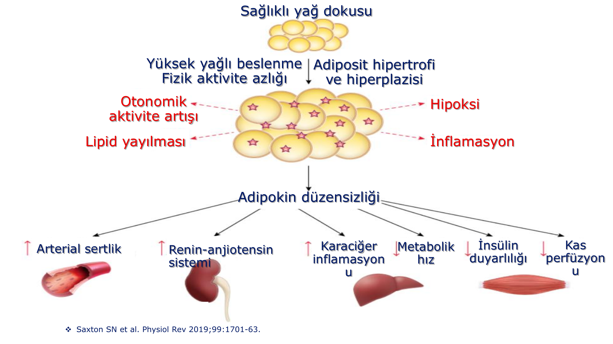

> **Şema yorumu:** Sağlıklı yağ dokusu üzerine etki eden yüksek yağlı beslenme ve fiziksel aktivite azlığı adiposit hipertrofi/hiperplazisine, hipoksi ve inflamasyona neden olur. Bu, adipokin salınım profilini bozar; arteriyel sertlik, RAAS aktivasyonu, karaciğer inflamasyonu, metabolik hız azalması, insülin direnci ve kas perfüzyonu azalması üzerinden hipertansiyon ve Tip 2 DM'ye yol açar.

---

## OBEZİTE KARMAŞIK VE ÇOK FAKTÖRLÜ BİR HASTALIKTIR

Obezite temelde **enerji alımı** ile **enerji tüketimi** arasındaki dengenin bozulmasına dayanır; ancak bu denge çok sayıda iç ve dış faktörün etkisindedir.

- **Hedonik girdi:** Lezzet ve hazdaki artış (tecrübe edilen zevk)
- **Çevre:** Hareketsiz yaşam tarzı, sigarayı bırakma, psikososyal faktörler
- **Biyolojik/periferik belirleyiciler:** Yağ dokusu, pankreas, barsak, genetik, ilaçlar

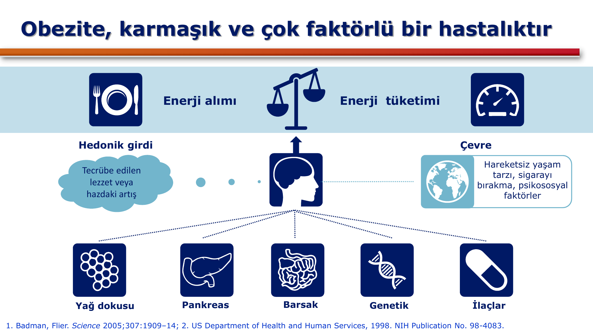

> **Şema yorumu:** Enerji alımı (hedonik girdi, gıda çevresi) ve enerji tüketimi (metabolizma, fiziksel aktivite) arasındaki dengesizlik; yağ dokusu, pankreas, barsak, genetik ve ilaç etkileri ile modüle edilir. Hareketsiz yaşam, sigara bırakımı sonrası kilo alımı ve psikososyal etkenler dengeyi alım lehine kaydırır.

---

## PATOFİZYOLOJİ -- İŞTAH VE ENERJİ DENGESİ

İştah ve enerji tüketimi **periferik sinyaller** aracılığı ile **hipotalamik nöronlar** üzerinden düzenlenir. Bu sistem, obezite tedavisinde hedef alınan moleküler yolakları da içerir.

### Hipotalamik İştah Merkezi

**Arkuat çekirdekte (nucleus arcuatus)** birbirine zıt etkili iki nöron populasyonu vardır:

| Nöron Grubu | Salgıladığı Peptit | Reseptör | Etki |
|---|---|---|---|
| **POMC / CART** (anoreksijenik) | α-MSH | **MC3/4R** | Tokluk, iştah baskılanması, enerji harcaması artışı |
| **NPY / AgRP** (oreksijenik) | NPY, AgRP | **Y1/Y5R** | Açlık, iştah artışı, enerji korunumu |

### Periferik Sinyaller

| Sinyal Tipi | Hormon / Kaynak | Etki |
|---|---|---|
| **Adipozite sinyalleri** | Leptin (yağ dokusu), İnsülin (pankreas) | Tokluk (POMC aktivasyonu, NPY/AgRP inhibisyonu) |
| **Tokluk peptitleri** | PYY, GLP-1, PP, OXM (barsak) | Yemek sonrası tokluk |
| **Açlık sinyalleri** | Ghrelin (mide) | Yemek öncesi açlık |
| **Vagal afferentler** | Mide distansiyonu | Nükleus traktus solitarius üzerinden tokluk |

Arka beyindeki **nükleus traktus solitarius** (NTS); beslenme, mide boşalması ve metabolizma hızı efektörlerine komuta eder.

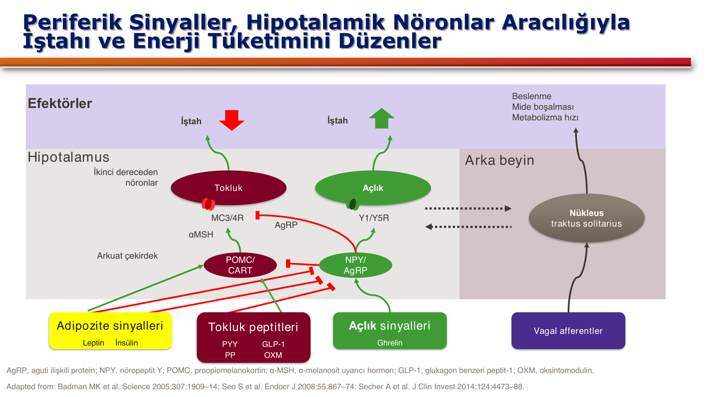

> **Şema yorumu:** Leptin ve insülin arkuat çekirdekteki POMC/CART nöronlarını uyarır, NPY/AgRP nöronlarını baskılar. Tokluk yolağında α-MSH, MC3/4R üzerinden tokluğu sağlar; AgRP bu yolağı antagonize eder. Barsaktan salgılanan GLP-1, PYY gibi peptitler tokluğu artırır, mideden salgılanan ghrelin ise açlığı tetikler. **Klinik karşılık:** GLP-1 analogları (semaglutid, liraglutid) ve MC4R agonisti setmelanotid tam olarak bu yolakları hedefler.

### Kısaltmalar

- **AgRP:** Agouti ilişkili protein
- **NPY:** Nöropeptit Y
- **POMC:** Proopiomelanokortin
- **α-MSH:** α-melanosit uyarıcı hormon
- **GLP-1:** Glukagon benzeri peptit-1
- **OXM:** Oksintomodulin
- **CART:** Kokain-amfetamin ilişkili transkript

---

## ADİPOZ DOKU -- ENDOKRİN BİR ORGAN

Adipoz doku yalnızca enerji deposu değildir; **endokrin, otokrin ve parakrin** olarak etkili bir organdır.

### Adipoz Dokudan Salgılanan Faktörler

| Sınıf | Örnekler |
|---|---|
| **Sitokin ve sitokin-ilişkili proteinler** | Leptin, TNF-α, IL-6, MCP-1 |
| **Bağışıklıkla ilişkili diğer proteinler** | Doku faktörü |
| **Fibrinolitik sistem proteinleri** | PAI-1 (plazminojen aktivatör inhibitörü-1) |
| **Kompleman ve kompleman ile ilişkili proteinler** | Adipsin (kompleman faktörü D), ASP, kompleman faktörü B |
| **Lipid metabolizması/transport proteinleri** | LPL (lipoprotein lipaz), CETP (kolesterol ester transfer proteini), apolipoprotein E |
| **Steroid metabolizması enzimleri** | Sitokrom P450 (aromataz), 17βHSD, 11βHSD1 |
| **RAS proteinleri** | Anjiyotensinojen (AGT) |
| **Diğer** | Adiponektin, rezistin, NEFAs |

### Adipoz Dokuda Eksprese Edilen Reseptörler

| Reseptör Grubu | Örnekler |
|---|---|
| **Klasik endokrin hormon reseptörleri** | İnsülin reseptörü, glukagon reseptörü, GH reseptörü, TSH reseptörü, gastrin/CCK-B reseptörü, GLP-1 reseptörü, anjiyotensin II tip 1 ve 2 reseptörleri |
| **Nükleer hormon reseptörleri** | Glukokortikoid reseptörü, D vitamini reseptörü, tiroid hormon reseptörü, androjen reseptörü, östrojen reseptörü, progesteron reseptörü |
| **Sitokin reseptörleri** | Leptin reseptörü, IL-6 reseptörü, TNF-α reseptörü |
| **Katekolamin reseptörleri** | β1, β2, β3 ve α1, α2 adrenerjik reseptörler |

> **Klinik anlamı:** Obezitede adipoz doku genişlediğinde pro-inflamatuvar sitokinler (TNF-α, IL-6, MCP-1) ve PAI-1 artar, anti-inflamatuvar ve insülin duyarlılaştırıcı **adiponektin azalır**. Bu denge kayması insülin direnci, dislipidemi ve kardiyovasküler riskin moleküler temelini oluşturur.

---

## OBEZİTE BİR HASTALIK OLARAK KABUL EDİLİR

Obezite; **Dünya Sağlık Örgütü (WHO)**, **Avrupa İlaç Ajansı (EMA)** ve **Amerikan Tıp Birliği (AMA)** tarafından **kronik hastalık** olarak tanınır.

- **WHO:** "Obezite, hem gelişmiş hem gelişmekte olan ülkelerde yaygın olan ve yetişkinlerin yanı sıra çocukları da etkileyen **kronik bir hastalıktır**."
- **EMA:** "Obezite kronik bir klinik rahatsızlık olarak kabul edilir; genetik, metabolik, çevresel ve davranışsal faktörlerin etkileşiminin bir sonucu olduğu düşünülür; morbidite ve mortalitedeki artışlar ile ilişkilidir."
- **AMA:** "Obezitenin bir hastalık olarak tanınması, tıbbi camianın **üç Amerikalıdan yaklaşık birini** etkileyen bu kompleks sorunu ele alma şeklini değiştirmeye yardımcı olacaktır."

### AMA -- Hastalık Kriterleri (Obezitenin Karşıladığı)

- Vücudun bazı fonksiyonlarının normal işleyişinde bozulma
- Karakteristik bulgu veya semptomlar
- Morbidite veya organ hasarı

### Obezitedeki Karşılıklar

| Fonksiyon bozuklukları | Semptomlar / Sonuçlar |
|---|---|
| İştah düzensizliği | Artmış vücut yağı |
| Anormal enerji dengesi | Eklem ağrısı, hareketsizlik, uyku apnesi |
| Endokrin fonksiyon bozukluğu | Tip 2 diyabet, kardiyovasküler hastalık |
| İnfertilite | Kanser, osteoporoz |
| MASLD (metabolik disfonksiyon ilişkili yağlı karaciğer hastalığı) | Polikistik over sendromu |
| Dislipidemi | -- |

---

## KOMORBİDİTELER

Obezite, **birden fazla kronik, komorbid rahatsızlıkla** ilişkilidir. Neredeyse tüm organ sistemlerini etkiler.

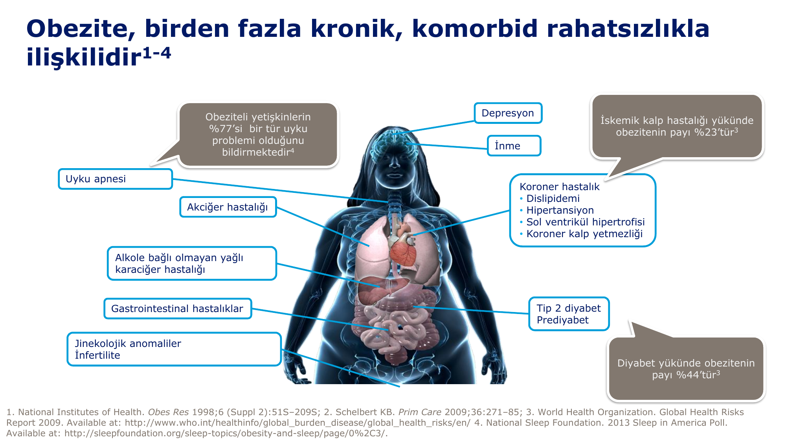

> **Şema yorumu:** Obezite; uyku apnesi, akciğer hastalıkları, dislipidemi, HT, sol ventrikül hipertrofisi, koroner kalp hastalığı ve kalp yetmezliği, alkole bağlı olmayan yağlı karaciğer hastalığı (MASLD), GİS hastalıkları, jinekolojik anomaliler-infertilite, Tip 2 DM ve prediyabet ile birlikte gider. Obeziteli yetişkinlerin %77'si bir tür uyku problemi bildirir. **İskemik kalp hastalığı yükünde obezitenin payı ~%23, diyabet yükünde ~%44'tür.**

### Organ Sistemlerine Göre Komorbiditeler

| Sistem | Obezite İlişkili Hastalıklar |
|---|---|
| **Kardiyovasküler** | Hipertansiyon, dislipidemi, koroner arter hastalığı, sol ventrikül hipertrofisi, kalp yetmezliği, atriyal fibrilasyon, inme |
| **Metabolik** | Tip 2 diyabet, prediyabet, metabolik sendrom, hiperürisemi, gut |
| **Respiratuar** | Obstrüktif uyku apnesi sendromu (OSAS), obezite-hipoventilasyon sendromu, astım |
| **Gastrointestinal** | MASLD/MASH, GERD, safra taşı, pankreatit |
| **Muskuloskeletal** | Osteoartrit (özellikle diz), bel ağrısı |
| **Hormonal** | PKOS, infertilite, erkekte hipogonadizm, çocukta erken puberte |
| **Onkolojik** | Endometrium, postmenopozal meme, kolorektal, özofagus (adeno), pankreas, böbrek, karaciğer, safra, tiroid kanseri |
| **Psikiyatrik** | Depresyon, anksiyete, tıkınırcasına yeme bozukluğu, stigmatizasyon |
| **Dermatolojik** | Akantozis nigrikans, intertrigo, hidradenitis süpürativa, stria |
| **Renal** | Obezite ilişkili glomerulopati, KBH |

---

## EPİDEMİYOLOJİ

### Dünya ve Türkiye Karşılaştırması

| Parametre | Dünya (WHO) | Türkiye |
|---|---|---|
| **Obezite prevalansı** | %13 | %36 |
| **Obeziteli birey sayısı** | 650 milyon | 20 milyon |
| **Ölüm sebebi sıralaması** | En sık 5. | En sık 3. |
| **Son dönem artış** | Son 30 yılda 3 kat | Son 12 yılda %70 artış |

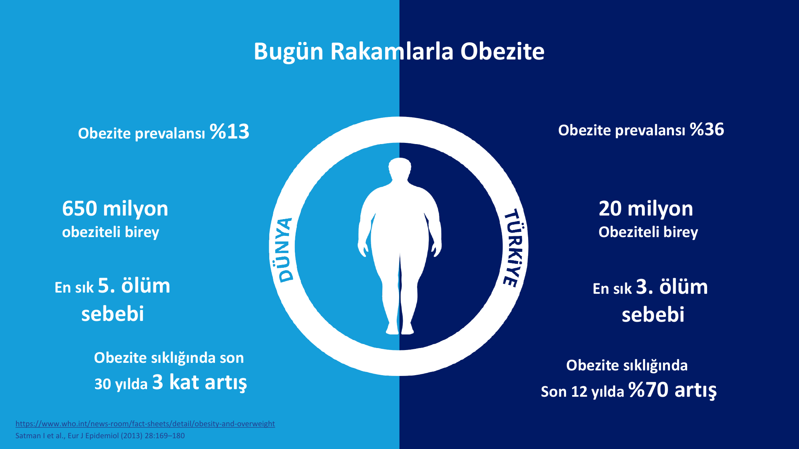

> **Şema yorumu:** Türkiye'de obezite prevalansı dünya ortalamasının yaklaşık 3 katıdır (%36 vs %13). Türkiye'de obezite en sık 3. ölüm sebebi olup, son 12 yılda %70'lik bir artış göstermiştir.

### TURDEP-II Çalışması -- Türkiye VKİ Dağılımı

| VKİ Aralığı (kg/m²) | Prevalans (%) | Tanımlama |
|---|---|---|
| <18.5 | %1 | Zayıf |
| 18.5 -- 24.9 | %26 | Normal |
| 25 -- 29.9 | %37 | Fazla kilolu |
| 30 -- 34.9 | %24 | Hafif obez |
| 35 -- 39.9 | %8.8 | Orta derecede obez |
| ≥40 | %3.1 | Morbid obez |

- **Fazla kilolu + obez toplamı:** %72.9 (VKİ ≥25)
- **Obez toplamı (VKİ ≥30):** %35.9
- Türkiye'de son 12 yılda obezite ortalama **%70** artmıştır.
- Türkiye'de **her 3 kişiden 1'i** obezite ile mücadele etmektedir.

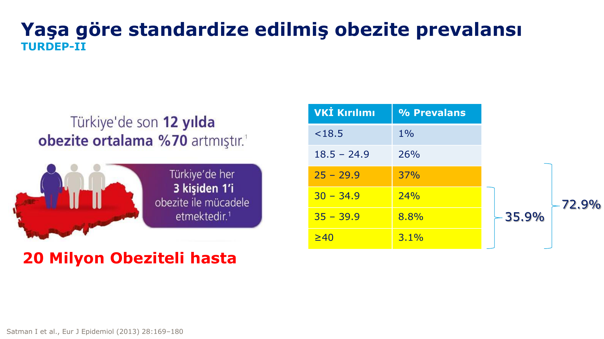

> **Şema yorumu:** Türkiye'de populasyonun büyük çoğunluğu (%72.9) normal kilonun üzerindedir; üçte biri (%35.9) obezdir. Morbid obezite prevalansı %3.1 ile azımsanmayacak düzeydedir.

### Yüksek Obezite Oranlarını Açıklayan Faktörler

- Gıda ortamında çarpıcı değişiklikler (ultra-işlenmiş gıdalar, şeker eklenmiş içecekler)
- **Daha büyük porsiyonlar** → daha fazla kalori alımı
- Hareketsiz yaşam (TV, ekran süresi, otomasyon)
- Uykusuzluk ve kronik stres
- Epigenetik değişiklikler (gelişim penceresinde maruziyetler)

---

## NEDENLER VE RİSK FAKTÖRLERİ

Obezite; enerji alımı ve tüketimi dengesini bozan çok sayıda iç ve dış faktörün ortak ürünüdür.

### Başlıca Etiyolojik Kategoriler

| Kategori | Örnekler |
|---|---|
| **Genetik (monogenik/poligenik)** | MC4R mutasyonları, leptin ve leptin reseptör mutasyonları, POMC mutasyonları; sendromik: Prader-Willi, Bardet-Biedl, Alström, Cohen, Carpenter |
| **Çevresel** | Hareketsiz yaşam tarzı, kalori-yoğun ve porsiyon büyük gıda, obezojenik çevre, sosyoekonomik etkenler |
| **Endokrin** | Cushing sendromu, hipotiroidi, hipopituitarizm, insülinoma, PKOS, erkek hipogonadizmi |
| **Hipotalamik lezyonlar** | Kraniyofaringioma, hipotalamusu tutan travma / inflamasyon / tümörler (Fröhlich sendromu: adipoz-genital distrofi) |
| **İlaca bağlı** | Antipsikotikler (olanzapin, klozapin), antidepresanlar (mirtazapin, TCA, paroksetin), antiepileptikler (valproat, gabapentin, karbamazepin), lityum, steroidler, progestajenler, insülin, sulfonilüre, tiazolidindionlar, nonsteroid antiinflamatuvarlar, beta-blokerler |

---

## TANI -- VKİ, BEL ÇEVRESİ, YAĞ DAĞILIMI

### Vücut Kitle İndeksi (VKİ)

**VKİ = Vücut ağırlığı (kg) / Boy² (m²)**

| VKİ (kg/m²) | Sınıflama |
|---|---|
| <18.5 | Zayıf |
| 18.5 -- 24.9 | Normal |
| 25.0 -- 29.9 | Fazla kilolu |
| 30.0 -- 34.9 | Hafif obez (Sınıf I) |
| 35.0 -- 39.9 | Orta derecede obez (Sınıf II) |
| ≥40 | Morbid obez (Sınıf III) |

*Kaynak: Türkiye Endokrinoloji ve Metabolizma Derneği (TEMD) Obezite Tanı ve Tedavi Kılavuzu.*

### Bel Çevresi -- Abdominal Obezite Göstergesi

Bel çevresi, **visseral (abdominal)** yağlanmanın pratik bir göstergesidir ve bağımsız bir kardiyometabolik risk belirtecidir.

#### TEMD -- Türkiye İçin Önerilen Bel Çevresi Eşik Değerleri

| Cinsiyet | Fazla Kilolu | Obez |
|---|---|---|
| **Kadın** | >80 cm | >90 cm |
| **Erkek** | >90 cm | >100 cm |

#### Farklı Etnik Gruplarda Obezite İçin Önerilen Bel Çevresi Eşik Değerleri (cm)

| Popülasyon | Erkek | Kadın |
|---|---|---|
| Beyaz Avrupalılar (WHO) | ≥102 | ≥88 |
| Kafkaslar; siyah popülasyon (IDF) | ≥94 | ≥80 |
| Güney Asyalılar, Çinliler, Japonlar (IDF) | ≥90 | ≥80 |
| Hispanikler | ≥90 | ≥85 |
| Güney Amerikalılar | ≥88-90 | ≥83-84 |
| Asyalılar | ≥85 | ≥80 |

> **Pratik kural:** Aynı VKİ'de **Asyalı popülasyonlar daha düşük bel çevresinde** kardiyometabolik riske girer; bu nedenle eşik değerler etnisiteye göre farklılaşır.

### Yağ Dağılımı -- Sistemik ve Lokal Etkiler

Abdominal (android, "elma tipi") yağlanma, gluteofemoral (jinoid, "armut tipi") yağlanmadan çok daha risklidir.

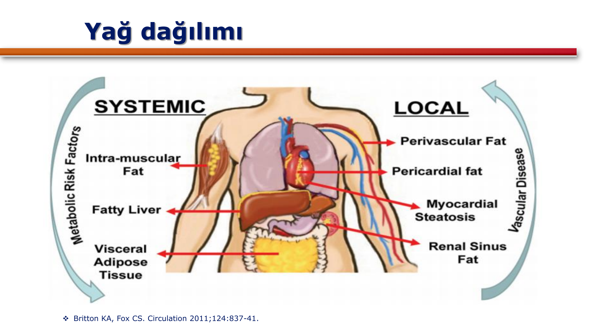

> **Şema yorumu:** Obezite **sistemik** (yağlı karaciğer, visseral adipoz doku, intramüsküler yağ) ve **lokal** (perivasküler, perikardiyal yağ, miyokardiyal steatoz, renal sinüs yağı) etkiler ile gider. Sistemik yağlanma metabolik risk faktörlerini artırırken, lokal (ektopik) yağlanma doğrudan vasküler ve organ hasarı oluşturur.

**Ektopik yağ depolanma alanları:**

- **Karaciğer:** MASLD → MASH → siroz, HCC
- **Kas:** İntramüsküler yağ → insülin direnci
- **Kalp:** Perikardiyal/epikardiyal yağ → atriyal fibrilasyon, koroner hastalık
- **Pankreas:** Pankreatik steatoz → beta-hücre disfonksiyonu
- **Böbrek:** Renal sinüs yağı → HT, obezite-ilişkili glomerulopati

---

## BEDEN KOMPOZİSYONU ANALİZİ

- **Bel çevresi** ölçümü abdominal yağlanmanın pratik göstergesidir.
- **Beden Kompozisyon Analizi (BKA)**, klinik uygulamada **mutlak gerekli değildir**.
- Özellikle obez bireylerde **biyoelektrik impedans analizi (BİA)** gibi ayaktan uygulanan tekniklerle beden kompozisyonu veya kilo kaybındaki değişikliklerin ölçülmesinin geçerliği **belirsizdir**.
- Bu nedenle genel yağlanma belirteci olarak **VKİ'nin yerine BİA kullanılması önerilmez**.
- **DEXA (Dual-X-ray absorbsiyometri)** özel merkezlerde kullanılmaktadır ve beden kompozisyonunun değerlendirilmesinde daha uygun bir yöntemdir.

---

## VKİ VE YAŞAM SÜRESİ

**VKİ azaldıkça yaşam süresi uzamaktadır.** Prospective Studies Collaboration verileri (n=541.452, erkek gönüllüler):

| VKİ Aralığı (kg/m²) | 70 yaşına ulaşma ihtimali |
|---|---|
| **Normal (22.5--25)** | ~%80 |
| 25--30 | ~%75 |
| 30--35 | ~%70 |
| **35--40** | ~%60 |
| **40--50** | ~%50 |

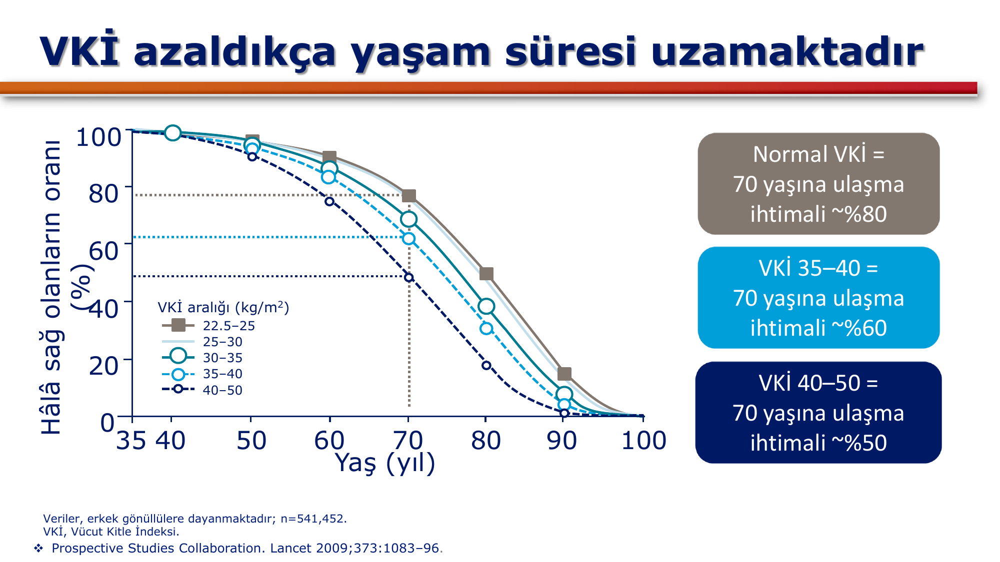

> **Şema yorumu:** Normal VKİ'ye sahip bireylerin 70 yaşına ulaşma ihtimali yaklaşık %80 iken, VKİ 40-50 arasında olan bireylerde bu oran %50'ye düşmektedir. Morbid obezite yaşam beklentisini belirgin olarak kısaltır.

---

## KİLO KAYBININ YARARLARI

Mütevazı miktarda bir kilo kaybı bile klinik olarak anlamlı faydalar sağlar.

| Verilen Kilo | Sağlanan Yarar |
|---|---|
| **1 kilo** | Kan basıncını yaklaşık **1 mmHg** düşürür |
| **5 kilo** | **Diyabet riskini %55 azaltır** |
| **5 kilo** | Osteoartrit riskini **%50 azaltır** |
| **11 kilo** | Obstrüktif uyku apnesi riskini **%76 azaltır** |

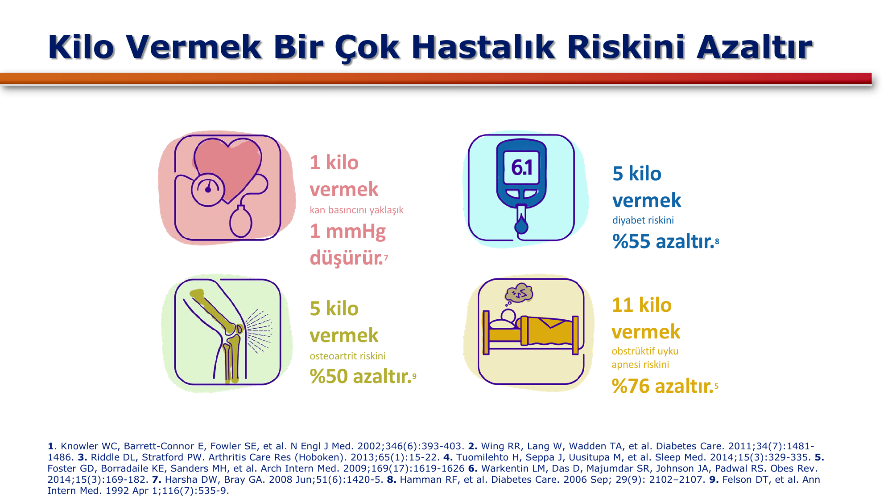

> **Şema yorumu:** %5-10'luk mütevazı kilo kayıpları bile hipertansiyon, diyabet, osteoartrit ve uyku apnesi riskinde belirgin azalma sağlar. Bu nedenle obezite tedavisinde hedef, "ideal kilo" değil, **metabolik olarak anlamlı, sürdürülebilir kilo kaybıdır**.

---

## KİLO KAYBINA FİZYOLOJİK YANITLAR

Kilo kaybı, vücut tarafından **hayatta kalmaya yönelik tehdit** olarak algılanır ve güçlü bir karşı-düzenleyici yanıt oluşturur.

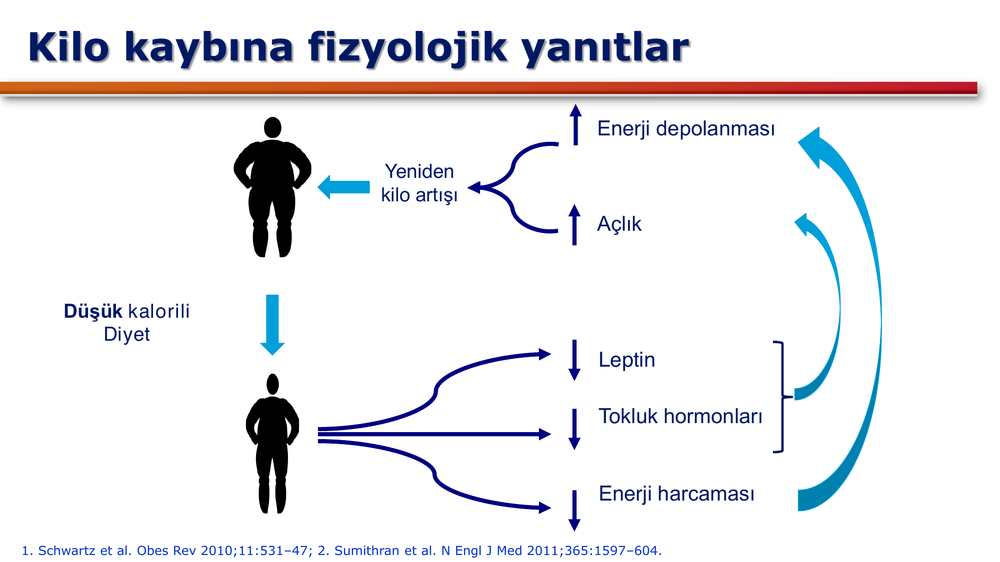

> **Şema yorumu:** Düşük kalorili diyet → Leptin düşer, tokluk hormonları (GLP-1, PYY) azalır, enerji harcaması düşer. Bu üç mekanizma enerji depolanması ve açlık hissini artırarak **yeniden kilo artışı** ile sonuçlanır. Diyete direnç biyolojiktir, irade zayıflığı değildir.

### Kilo Kaybı Sürecine Karşı Koyan Mekanizmalar

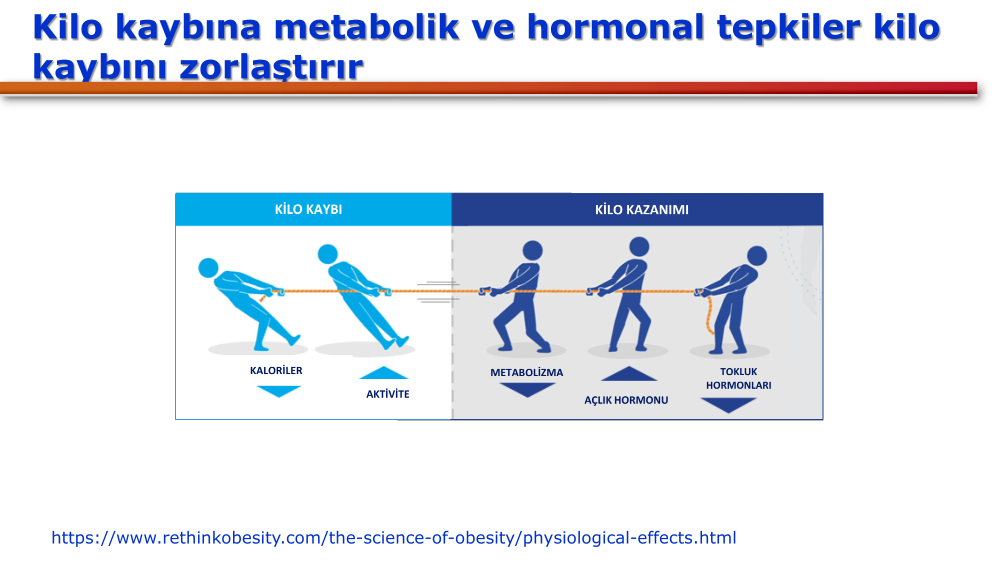

> **Şema yorumu:** Kilo kaybında kalori alımı azaldıkça **bazal metabolizma hızı** düşer, **fiziksel aktivite** azalır (yorgunluk, letarji), **açlık hormonu (ghrelin)** artar, **tokluk hormonları** azalır. Bu dört faktör, hastayı kilo geri alımına iter. Bu nedenle obezite **kronik** bir hastalıktır ve tedavisi **uzun süreli** olmalıdır.

---

## OBEZ HASTANIN DEĞERLENDİRİLMESİ

> **⚠️ ÖNEMLİ:** Kilo kaybı tedavisine başlamadan önce yaşam tarzı değişiklikleri için hastanın tedavi girişimlerine karşı **istekli ve gönüllü** olması şarttır.

### Obezitede Risk Durumunun Belirlenmesi

**Eşlik eden hastalıklar (mortalite için çok yüksek risk kategorisi):**

- Koroner kalp hastalığı
- Diğer aterosklerotik hastalıklar
- Tip 2 diyabet
- OSAS (obstrüktif uyku apnesi sendromu)

**Kardiyovasküler risk faktörleri:**

- Hipertansiyon
- Dislipidemi (düşük HDL, yüksek LDL, hipertrigliseridemi)
- Bozulmuş açlık glukozu
- Ailede erken koroner kalp hastalığı öyküsü
- İleri yaş (erkekte ≥45, kadında ≥55)
- Sigara içimi

### Fiziksel Aktivite-Egzersiz Anamnezi

- Egzersiz **sıklığı** (haftada kaç gün)
- Egzersiz **yoğunluğu** (hafif, orta, ağır-şiddetli)
- Egzersiz **süresi** (seans süresi)
- Fiziksel kısıtlamalar (egzersizi engelleyebilecek)

### Fizik Muayene

- Sistemik fizik muayene
- Boy ve ağırlık ölçümü → **VKİ hesaplanması**
- **Bel çevresi** ölçümü
- Kan basıncı (uygun manşon boyutu ile)
- **Cilt muayenesi:** boyun ve aksillada **akantozis nigrikans** (insülin direnci bulgusu)
- Sekonder obezite bulguları (hipotiroidi, Cushing, PKOS, genetik sendromlar)
- Obezite ile ilişkili komorbid durumların bulguları

### Laboratuvar İncelemeleri

**Rutin:**

- Açlık plazma glukozu (AKŞ) -- gerekirse OGTT, HbA1c
- Tam idrar analizi
- Açlık serum lipid profili (total kolesterol, LDL, HDL, TG)
- Serum ürik asit
- Yaşlılarda BUN ve kreatinin
- Karaciğer enzimleri (ALT, AST) -- gerekirse USG
- EKG, gerekirse ileri kardiyovasküler inceleme

**Sekonder obezite şüphesinde:**

- **TSH** (hipotiroidi şüphesi; anormalse serbest T4)
- **24 saatlik idrarda serbest kortizol / düşük doz deksametazon supresyon testi** (Cushing şüphesi)
- **Total testosteron, LH, FSH** (PKOS, erkek hipogonadizmi)
- Hipotalamik hastalık şüphesinde hipofiz hormon paneli

---

## SEKONDER OBEZİTE NEDENLERİ

### Genetik (Sendromik) Obezite

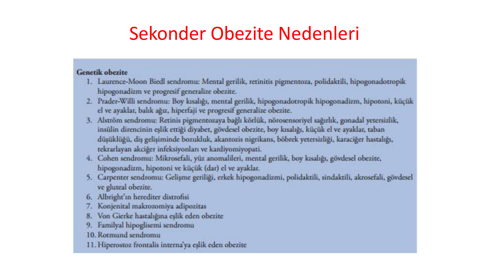

**Başlıca sendromlar:**

1. **Laurence-Moon Biedl sendromu:** Mental gerilik, retinitis pigmentoza, polidaktili, hipogonadotropik hipogonadizm, progresif generalize obezite
2. **Prader-Willi sendromu:** Boy kısalığı, mental gerilik, hipogonadotropik hipogonadizm, hipotoni, küçük el ve ayaklar, balık ağız, hiperfaji, progresif generalize obezite
3. **Alström sendromu:** Retinis pigmentozaya bağlı körlük, nörosensöriyel sağırlık, gonadal yetersizlik, insülin direncinin eşlik ettiği diyabet, gövdesel obezite, boy kısalığı, küçük el ve ayaklar, taban düşüklüğü, diş gelişiminde bozukluk, akantozis nigrikans, böbrek yetersizliği, karaciğer hastalığı, tekrarlayan akciğer infeksiyonları ve kardiyomiyopati
4. **Cohen sendromu:** Mikrosefali, yüz anomalileri, mental gerilik, boy kısalığı, gövdesel obezite, hipogonadizm, hipotoni, küçük (dar) el ve ayaklar
5. **Carpenter sendromu:** Gelişme geriliği, erkek hipogonadizmi, polidaktili, sindaktili, akrosefali, gövdesel ve gluteal obezite
6. **Albright herediter distrofisi**
7. **Konjenital makrozomiya adipozitas**
8. **Von Gierke hastalığına eşlik eden obezite**
9. **Familyal hipoglisemi sendromu**
10. **Rotmund sendromu**
11. **Hiperostoz frontalis interna'ya eşlik eden obezite**

### Hipotalamik, Endokrin ve İlaca Bağlı Nedenler

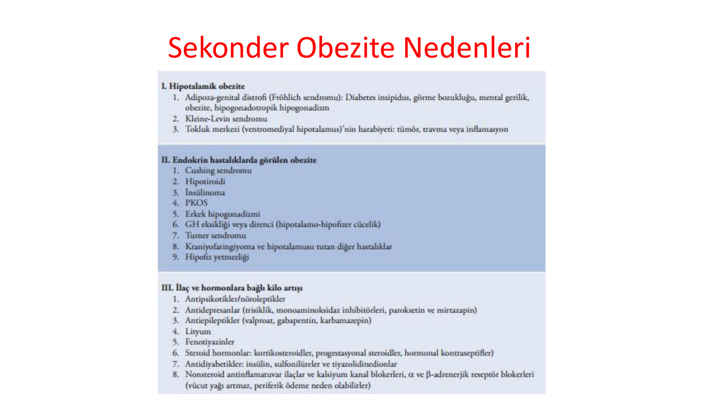

#### I. Hipotalamik Obezite

1. **Adipoza-genital distrofi (Fröhlich sendromu):** Diabetes insipidus, görme bozukluğu, mental gerilik, obezite, hipogonadotropik hipogonadizm
2. Kleine-Levin sendromu
3. Tokluk merkezi (ventromediyal hipotalamus)'nin harabiyeti: Tümör, travma veya inflamasyon

#### II. Endokrin Hastalıklarda Görülen Obezite

1. Cushing sendromu
2. Hipotiroidi
3. İnsülinoma
4. PKOS
5. Erkek hipogonadizmi
6. GH eksikliği veya direnci (hipotalamo-hipofizer cücelik)
7. Turner sendromu
8. Kraniyofaringioma ve hipotalamusu tutan diğer hastalıklar
9. Hipofiz yetmezliği

#### III. İlaç ve Hormonlara Bağlı Kilo Artışı

1. **Antipsikotikler/nöroleptikler** (olanzapin, klozapin)
2. **Antidepresanlar** (trisiklik, monoaminoksidaz inhibitörleri, **paroksetin**, **mirtazapin**)
3. **Antiepileptikler** (valproat, gabapentin, karbamazepin)
4. **Lityum**
5. Fenotiyazinler
6. **Steroid hormonlar:** Kortikosteroidler, progestasyonel steroidler, hormonal kontraseptifler
7. **Antidiyabetikler:** İnsülin, sülfonilüreler, tiyazolidindionlar
8. Nonsteroid antiinflamatuvar ilaçlar ve kalsiyum kanal blokerleri, α ve β-adrenerjik reseptör blokerleri (vücut yağı artmaz, periferik ödem neden olabilirler)

---

## OBEZİTE TEDAVİSİNE GENEL BAKIŞ

Obezite tedavisi **basamaklı** olarak ilerler; hiçbir basamak öncekinin yerine geçmez, üzerine eklenir.

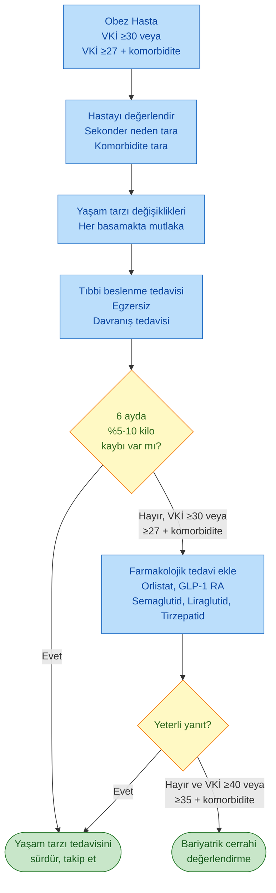
```mermaid
flowchart TD
    A[Obez Hasta<br/>VKİ ≥30 veya<br/>VKİ ≥27 + komorbidite] --> B[Hastayı değerlendir<br/>Sekonder neden tara<br/>Komorbidite tara]
    B --> C[Yaşam tarzı değişiklikleri<br/>Her basamakta mutlaka]
    C --> D[Tıbbi beslenme tedavisi<br/>Egzersiz<br/>Davranış tedavisi]
    D --> E{6 ayda<br/>%5-10 kilo<br/>kaybı var mı?}
    E -->|Evet| F([Yaşam tarzı tedavisini<br/>sürdür, takip et])
    E -->|Hayır, VKİ ≥30 veya<br/>≥27 + komorbidite| G[Farmakolojik tedavi ekle<br/>Orlistat, GLP-1 RA<br/>Semaglutid, Liraglutid, Tirzepatid]
    G --> H{Yeterli yanıt?}
    H -->|Evet| F
    H -->|Hayır ve VKİ ≥40 veya<br/>≥35 + komorbidite| I([Bariyatrik cerrahi<br/>değerlendirme])

    classDef diagnose fill:#c8e6c9,stroke:#2e7d32,color:#1b5e20
    classDef exclude fill:#ffcdd2,stroke:#c62828,color:#b71c1c
    classDef test fill:#bbdefb,stroke:#1565c0,color:#0d47a1
    classDef warning fill:#fff9c4,stroke:#f57f17,color:#33691e
    class A,B,C,D,G test
    class E,H warning
    class F,I diagnose
```

### Obezite Tedavisinin Bileşenleri

- **Tıbbi beslenme tedavisi** (diyet)
- **Fiziksel aktivite artışı** (egzersiz)
- **Davranış tedavisi** ve psikososyal destek
- **Farmakolojik tedavi**
- **Cerrahi tedavi** (bariyatrik cerrahi)

---

## TIBBİ BESLENME TEDAVİSİ

### Hedefler

- Bireyin yaşına, cinsiyetine, fiziksel aktivitesine, yaşam şekline ve fizyolojik durumuna uygun besin ögesi gereksinimlerini **yeterli ve dengeli** biçimde sağlamak
- Yanlış beslenme alışkanlıkları yerine **doğru ve kalıcı** alışkanlıklar kazandırmak
- Vücut ağırlığını hedeflenen düzeye indirmek
- Hedefe ulaştıktan sonra **tekrar kilo almayı önlemek** ve istenen düzeyde tutmak

### Makro Besin ve Kalori Dağılımı

| Besin Ögesi | Günlük Enerjideki Oran / Miktar | Notlar |
|---|---|---|
| **Toplam enerji** | BMH'nin altına inilmez; 500-1000 kcal/gün açık hedefi | Haftada 0.5-1 kg kayıp sağlayacak düzey |
| **Protein** | %12-15 | %30-40'ı hayvansal (B12 için) |
| **Yağ** | %25-30 | Doymuş <%10, tekli doymamış %10-15, çoklu doymamış %7-8, kolesterol <300 mg/gün |
| **Karbonhidrat** | %55-60 | Basit KH <%10, kompleks KH (tam tahıl, baklagiller) artırılmalı |
| **Posa (lif)** | 25-35 g/gün | Tokluk, barsak hareketi, insülin kontrolü |
| **Sıvı** | 2-3 L/gün (1-1.5 L su) | Kabızlık önlenir |
| **Vitamin-mineral** | Gerekirse multivitamin | <1200 kcal kadın, <1500 kcal erkek diyetlerde |

### Glisemik İndeks

| Düzey | GI Değeri | Örnekler |
|---|---|---|
| Düşük | <55 | Çavdar ekmeği, kuru baklagiller, sebzeler, süt, yoğurt, elma, armut, şeftali |
| Orta | 56-69 | Muz, kiraz, dondurma, spagetti |
| Yüksek | ≥70 | Beyaz ekmek, patates, pirinç, rafine tahıl ürünleri |

### Öğün Düzeni

- Günlük **4-6 öğün** olarak düzenlenmelidir
- Öğünler arası **3-4 saat**
- **Sık aralıklarla beslenme** gereğinden fazla yemeyi önler, acıkmayı geciktirir
- **Öğün atlama**: vücut yağ kütlesi, leptin konsantrasyonu ve solunum kapasitesinde artış ile ilişkilidir

### Alkol

- Zayıflama diyetlerinde **önerilmez**
- Alınırsa kalorisi günlük enerjiden düşülmeli
- Yaklaşık 30 g (200 kcal) alkol içeren içecekler: 60 mL rakı, 270 mL şarap, 750 mL bira, 75 mL viski, 80 mL votka, 90 mL cin

### Zayıflamaya Yönelik Bilimsel Olmayan Popüler Diyetler

> **⚠️ ÖNEMLİ -- Önerilmeyen uygulamalar:**
>
> - Bireye özgü olmayan beslenme programları
> - "Sihirli-şok" hızlı kilo vermeyi iddia eden diyetler
> - Bireyin gereksinimine göre düzenlenmemiş, kontrolsüz çok düşük kalorili diyetler
> - Yeterli ve dengeli beslenme alışkanlığı kazandırmayan, özel ürünleri öneren diyetler
> - **Tek tip besine dayalı** diyetler
> - Karbonhidratları ve proteinleri ayırma diyetleri
> - Yan etkili zayıflama iddialı ilaçlarla birlikte önerilen diyetler
> - **Akupunktur** ile açlık diyetleri
> - Diüretik ilaçlar, saunalar, otlar ve çaylarla **sadece su kaybı** sağlayan yöntemler

---

## EGZERSİZ

### Egzersizin Obezitedeki Yeri

- Tek başına fiziksel aktivite artışının kilo vermeye katkısı **kalori kısıtlamasına göre daha fazla değildir**.
- Ancak:
  - **Visseral yağın** azalması ve **kas kitlesinin** artması
  - **İnsülin direncinin** azalması
  - **Kan basıncı** ve **lipid profilinin** düzelmesi
  - Düzenli egzersiz yapanlarda **KAH ve ölüm** oranları daha düşüktür
- Özgüven artışı ve **yeniden kilo almanın önlenmesi** açısından çok önemlidir.

### Önerilen Egzersiz Reçetesi

| Parametre | Öneri |
|---|---|
| **Süre** | Günde ortalama 30-45 dakika |
| **Sıklık** | Mümkünse haftanın her günü |
| **Yoğunluk** | Orta düzey |
| **Örnek aktivite** | Saatte 5-6 km hızla yürüyüş |
| **Enerji harcaması** | ~150 kcal/gün → haftada ~1000 kcal |

---

## DAVRANIŞ TEDAVİSİ VE PSİKOSOSYAL DESTEK

- **Tedavi gruplarının** oluşturulması
- Periyodik toplantılar → hastaların bir araya gelmesi, birbirini motive etmesi
- Bir **terapist yönetiminde** haftada 1-2 saatlik oturumlar, 10-15 kişilik gruplar
- Başarının anahtarlarından biri **stimulus kontrolüdür**; yeme davranışını tetikleyen görsel uyaranların ortadan kaldırılması kilo kontrolünde önemlidir

---

## FARMAKOLOJİK TEDAVİ

### Farmakolojik Tedavinin Sınıflandırılması

- **Besin alımını azaltan santral etkili ilaçlar**
- **Periferik olarak gıda emilimini bozan ilaçlar**
- **Enerji harcamasını artıran ilaçlar**

### Tarihsel -- Geçmişte Kullanılan, Artık Kullanılmayan İlaçlar

> **🚨 Kullanımdan çekilen ajanlar:**
>
> - **Amfetamin, metamfetamin, fenmetrazin** -- bağımlılık
> - **Tiroid hormonları**, **dinitrofenol**, gökkuşağı hapı (dijital + diüretik), **aminoreks**, kollajen bazlı VLDL içeren ajanlar -- önemli yan etkiler ve **ani ölüm**
> - **D-fenfluramin** ve **sibutramin** -- **kardiyak valvulopati** ve **primer pulmoner hipertansiyon**
> - **Efedrin ve kafein**: İkinci sıra ajanlar olarak sınırlı yerleri vardır
> - **SSRI, bupropiyon, venlafaksin**: Obezite tedavisi için FDA onayı **yoktur** (depresyonlu obez hastalarda tercih edilebilir)

### 1. Yağ Emilimini Azaltan -- Orlistat

| Özellik | Detay |
|---|---|
| **Etki mekanizması** | Gastrointestinal (pankreatik) lipazı bağlar → yağın ince barsakta hidrolizini engeller, emilimi kısmen önler |
| **Etkinlik** | Alınan yağın ~1/3'ünün emilimini engeller; 2 yıldan uzun süreli çalışmalarda plaseboya göre anlamlı kilo kaybı |
| **Doz** | 120 mg, günde 3 kez, **yemeğin başında**. Unutulursa 1 saat içinde alınabilir. |
| **Günlük yağ alımı** | ≤100 g veya total kalorinin ≤%35'i (aşırı steatoreyi önler) |
| **Yan etkiler** | Aşırı gaz, fekal sıkışma/inkontinens, yağlı lekelenme, artmış defekasyon sıklığı |
| **Vitamin etkisi** | Yağda eriyen vitaminler (A, D, E, K) düşebilir → **multivitamin** eklenmelidir |
| **Ek yarar** | Kolesterol ve trigliserid düzeylerinde beklenenden fazla düşüş |
| **Kontrendikasyon** | Kronik malabsorpsiyon, kolestatik hastalıklar |

### 2. Sempatomimetik İlaçlar -- Fentermin

- MSS'de **adrenerjik/serotonerjik transmisyonu** etkiler
- Randomize çalışmalarda anlamlı kilo kaybı, ancak **uzun süreli etkinlik/güvenlik verisi eksik**
- Yan etkiler: Uykusuzluk, sinirlilik, çarpıntı, hipertansiyon, baş ağrısı
- **Kontrendikasyon:** Pulmoner HT, kapak hastalıkları, HT, hipertiroidi, alkol/ilaç bağımlılığı
- FDA onayı: **≤12 hafta** süreli kullanım

### 3. Antidepresanlar

**SSRI (Fluoksetin, Sertralin):**

- Kilo kaybı iştah azalması ve gıda tüketimini baskılamaya sekonderdir
- Fluoksetin kilo kaybı dozu **60 mg/gün** (depresyon dozunun 3 katı)
- **Depresyonlu obez hastalarda** tercih edilebilecek ajanlardır

**Bupropiyon:**

- Zayıf serotonin, norepinefrin, dopamin geri alım inhibitörü
- Depresyon ve **sigara bırakanlarda kilo alımının önlenmesi** için onaylı
- Yan etkiler: İnsomnia, ağız kuruluğu
- **Kontrendikasyon:** Epileptik hastalar
- Obezite için **FDA onayı yoktur**

### 4. Antiepileptik -- Topiramat

- Epilepsi çalışmalarında **besin alımında azalma ve kilo kaybı** gösterilmiştir
- Kilo kaybında **GABA yolağı modülasyonu** rol oynar
- 6 ayda %6 kilo kaybı sağlar (plaseboya göre)
- **Tıkınırcasına yeme bozukluğunda** yararlıdır
- Yan etkiler: Parestezi, somnolans, dikkat azalması, tat değişikliği, **B12 vitamini düşüşü**

### 5. Selektif Serotonin 2C Reseptör Agonisti -- Lorkaserin

- Hipotalamik 5-HT2CR aktivasyonu → POMC üretimi artar → tokluk artar
- Kardiyak ve metabolik risk faktörlerinde düzelme
- **FDA onayı (Haziran 2012):** VKİ ≥30 kg/m², ayrıca VKİ ≥27 kg/m² + HT, T2DM ya da dislipidemi gibi ≥1 komorbidite
- Yan etkiler: Baş ağrısı, ÜSYE, bulantı, yorgunluk, diyare
- **Serotonerjik ilaçlarla birlikte kullanılmamalı**

> **Not:** Lorkaserin, malignite riski nedeniyle sonradan (2020) piyasadan çekilmiştir. Endokrinoloji pratiği için bu bilgi akılda tutulmalıdır.

### 6. Antidiyabetikler -- Metformin

- T2DM'de sulfonilüre ve insüline göre **daha belirgin kilo kaybı** sağlar
- Obezite ve metabolik sendromda plaseboya göre **anlamlı** kilo kaybı yapar
- Ancak kilo verdirici etkisi **klinik olarak anlamlı değildir** → **antiobezite ilacı olarak kabul edilmez**
- **Prediyabetli obez** ve **PKOS'lu kadınlarda** diyabet gelişimini önlemek açısından tercih edilir

### 7. GLP-1 Reseptör Agonistleri -- Obezite Tedavisinde Çığır Açıcı Ajanlar

GLP-1 analogları; iştah baskılama, mide boşalmasının yavaşlaması, POMC aktivasyonu ve insülin salgılanmasının glukoz bağımlı artması yolu ile kilo kaybı sağlar.

#### Liraglutid (Saxenda, 3.0 mg/gün SC)

- Günlük subkutan enjeksiyon
- Obezite için onaylı doz: **3.0 mg/gün** (T2DM'de 1.2-1.8 mg)
- SCALE çalışmalarında **~%5-8** kilo kaybı

#### Semaglutid (Wegovy, 2.4 mg/hafta SC)

- **Haftalık** subkutan enjeksiyon (obezitede 2.4 mg/hafta; T2DM'de 0.5-1 mg)
- **STEP çalışmaları** (Semaglutide Treatment Effect in People with obesity):
  - **STEP 1** (non-diyabetik obez, n=1961): 68 haftada semaglutid 2.4 mg ile **%14.9** kilo kaybı (plasebo %2.4)
  - **STEP 2** (T2DM + obez): %9.6 kilo kaybı
  - **STEP 3** (yoğun yaşam tarzı ile birlikte): %16 kilo kaybı
  - **STEP 4** (idame çalışması): 20. haftadan sonra ilaç kesilenler kilo geri aldı
- Oral semaglutid (Rybelsus) obezite için onaylı değildir

#### Tirzepatid (Mounjaro / Zepbound, haftalık SC)

- **GIP/GLP-1 ikili (dual) reseptör agonisti**
- **SURMOUNT çalışmaları:**
  - **SURMOUNT-1** (non-diyabetik obez, n=2539): 72 haftada 15 mg tirzepatid ile **%20.9** kilo kaybı; 10 mg ile %19.5; 5 mg ile %15.0 (plasebo %3.1)
  - **SURMOUNT-2** (T2DM + obez): %12-15 kilo kaybı
  - **SURMOUNT-3** (yoğun yaşam tarzı ile): %21'e varan ek kayıp
- Obezitede **bugüne kadar gösterilmiş en yüksek farmakolojik kilo kaybı**

#### GLP-1 RA -- Yan Etkiler ve Uyarılar

> **⚠️ ÖNEMLİ:**
>
> - **GİS yan etkileri**: bulantı, kusma, diyare, konstipasyon (en sık; doz titrasyonu ile azalır)
> - **Pankreatit, safra taşı** (özellikle hızlı kilo kaybında)
> - **Medüller tiroid karsinoması** ve **MEN 2** öyküsünde kontrendike (hayvan verisi)
> - Diyabetik retinopati kötüleşmesi (özellikle hızlı glisemi düşüşünde)
> - Kilo kaybı **kas kütlesi kaybı** ile gidebilir → direnç egzersizi önerilmelidir

### 8. Kombinasyon Ajanları

- **Fentermin/Topiramat (Qsymia):** %8-10 kilo kaybı
- **Naltrekson/Bupropion (Contrave):** %5-8 kilo kaybı
- **Setmelanotid:** **MC4R agonisti**; POMC, PCSK1, LEPR eksikliği gibi **monogenik obezite** endikasyonu; Bardet-Biedl sendromunda onaylı

### 9. Bitkisel Preparatlar ve Diyet Destek Ürünleri

> **⚠️ Uyarı:** Bazı bitkisel ürünler akla yatkın mekanizmalara sahip olsa da, çok azı uzun dönemli etkinlik ve güvenilirlik için denenmiştir. **Hiçbirinin rutin önerilmesi için kanıta dayalı veri yoktur**.

---

## CERRAHİ TEDAVİ -- BARİYATRİK CERRAHİ

Obezitede cerrahi tedavi (bariyatrik cerrahi), eskiye oranla çok daha sık tercih edilir. En kalıcı ve etkili kilo kaybını sağlar; komorbiditelerde belirgin gerileme (hatta **T2DM remisyonu**) sağlayabilir.

### Cerrahi Yöntem Sınıflaması

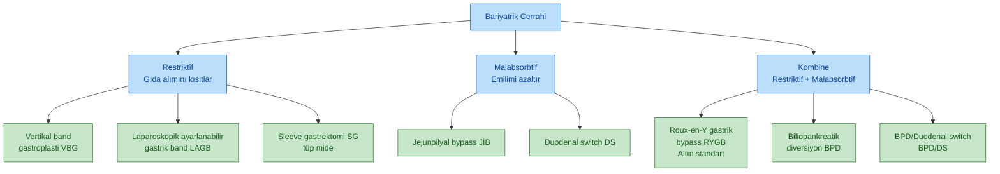
```mermaid
flowchart TD
    A[Bariyatrik Cerrahi] --> B[Restriktif<br/>Gıda alımını kısıtlar]
    A --> C[Malabsorbtif<br/>Emilimi azaltır]
    A --> D[Kombine<br/>Restriktif + Malabsorbtif]

    B --> B1[Vertikal band<br/>gastroplasti VBG]
    B --> B2[Laparoskopik ayarlanabilir<br/>gastrik band LAGB]
    B --> B3[Sleeve gastrektomi SG<br/>tüp mide]

    C --> C1[Jejunoilyal bypass JİB]
    C --> C2[Duodenal switch DS]

    D --> D1[Roux-en-Y gastrik<br/>bypass RYGB<br/>Altın standart]
    D --> D2[Biliopankreatik<br/>diversiyon BPD]
    D --> D3[BPD/Duodenal switch<br/>BPD/DS]

    classDef test fill:#bbdefb,stroke:#1565c0,color:#0d47a1
    classDef diagnose fill:#c8e6c9,stroke:#2e7d32,color:#1b5e20
    class A,B,C,D test
    class B1,B2,B3,C1,C2,D1,D2,D3 diagnose
```

### Endikasyonlar

> **✅ Bariyatrik Cerrahi Endikasyonları:**
>
> - **VKİ ≥40 kg/m²**
> - **VKİ >35 kg/m²** + obezite ile ilişkili komorbidite (Tip 2 DM, OSAS, ciddi HT vb.) tıbbi tedavi ve yaşam tarzı değişiklikleri ile **kontrol edilememesi**
> - Cerrahi dışı yöntemleri daha önce uygulamış fakat başarısız olmak
>
> *Güncel eğilim:* VKİ ≥30 + kontrolsüz T2DM olgularında **metabolik cerrahi** olarak da önerilmektedir (ADA/IFSO 2022 konsensüsü).

### Kontrendikasyonlar

> **❌ Bariyatrik Cerrahi Kontrendikasyonları:**
>
> - Tedavi edilemeyen **major depresyon** ve psikoz
> - **İlaç veya alkol bağımlılığı**
> - **Tıkınırcasına yeme hastalığı** (kontrol edilmeden)
> - İleri **kalp hastalığı**
> - Ciddi **koagülopati**
> - Postoperatif dönemde önerilenleri yapabilecek düzeyde **psişik ve mental yeterliliğin olmaması**

### Başlıca Cerrahi Teknikler

#### 1. Laparoskopik Ayarlanabilir Gastrik Band (LAGB, Mide Kelepçesi)

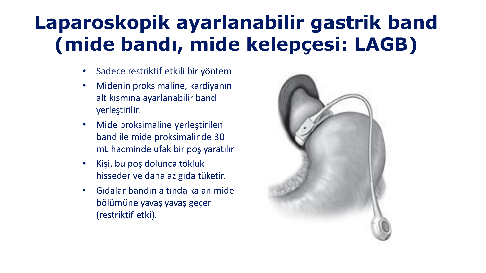

- **Sadece restriktif** etkili
- Midenin proksimaline, kardiyanın alt kısmına **ayarlanabilir band** yerleştirilir
- Band ile mide proksimalinde **30 mL hacimli küçük bir poş** yaratılır
- Hasta bu poş dolduğunda tokluk hisseder, daha az gıda tüketir
- Gıdalar bandın altındaki mideye yavaş yavaş geçer
- Günümüzde daha az tercih edilir (komplikasyonlar, band kayması, yetersiz kilo kaybı)

#### 2. Roux-en-Y Gastrik Bypass (RYGB)

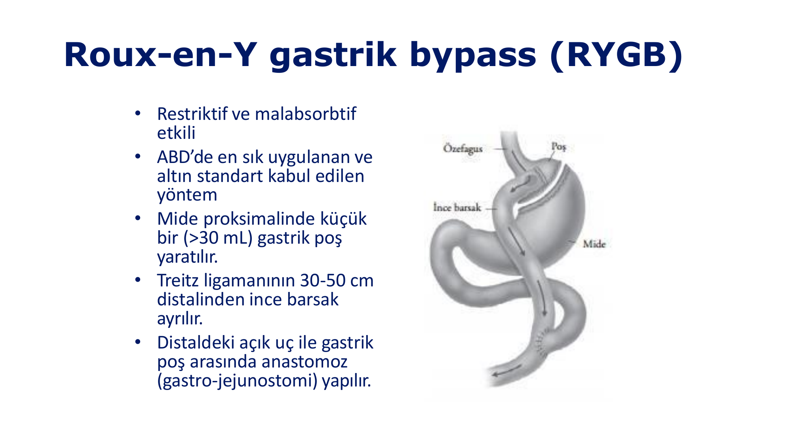

- **Restriktif + malabsorbtif**
- ABD'de en sık uygulanan ve **altın standart** kabul edilen yöntem
- Mide proksimalinde **küçük (<30 mL) gastrik poş** yaratılır
- **Treitz ligamanının 30-50 cm distalinden** ince barsak ayrılır
- Distaldeki açık uç ile gastrik poş arasında **gastro-jejunostomi** yapılır
- Kilo kaybı: **%60-70 fazla kilo kaybı** (EWL), T2DM remisyon oranı yüksek

#### 3. Sleeve Gastrektomi (SG, Tüp Mide)

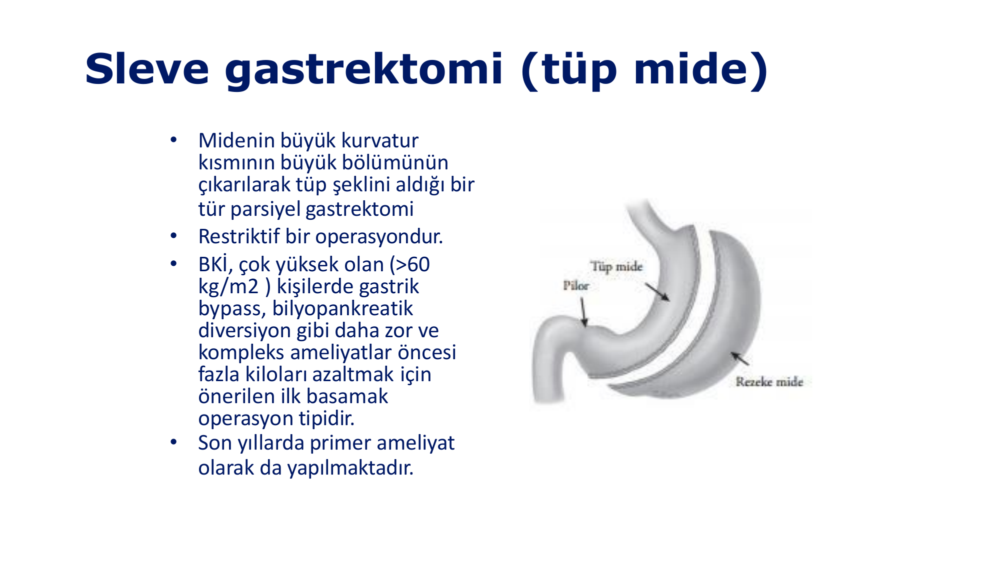

- Midenin **büyük kurvatur** kısmının büyük bölümünün çıkarılarak tüp şeklini aldığı **parsiyel gastrektomi**
- **Restriktif** operasyondur
- VKİ çok yüksek (>60 kg/m²) kişilerde gastrik bypass veya BPD gibi daha kompleks ameliyatlar **öncesi fazla kiloları azaltmak** için önerilen ilk basamak
- **Son yıllarda primer ameliyat** olarak da sıklıkla yapılmaktadır
- Günümüzde **dünyada en sık uygulanan** bariyatrik operasyon
- Ghrelin salgılayan fundus çıkarıldığı için iştah azalması da belirgin

#### 4. Biliopankreatik Diversiyon + Duodenal Switch (BPD/DS)

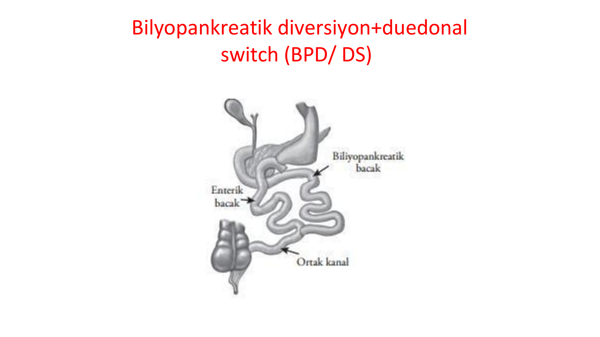

- **Restriktif + belirgin malabsorbtif**
- Enterik bacak, biliopankreatik bacak ve **ortak kanal** oluşturulur
- En yüksek kilo kaybını sağlar, ancak **protein-kalori malnütrisyonu**, **vitamin eksiklikleri**, diyare gibi komplikasyonlar daha sık

### Sonuç Karşılaştırması

| Yöntem | Tip | Ortalama Kilo Kaybı (%EWL) | T2DM Remisyon | Komplikasyon |
|---|---|---|---|---|
| **LAGB** | Restriktif | %40-50 | Düşük | Band kayması, erozyon |
| **Sleeve Gastrektomi** | Restriktif | %50-60 | Orta-yüksek | Leak, GERD |
| **RYGB** | Kombine | %60-70 | Yüksek | Dumping, ülser, iç herni |
| **BPD/DS** | Kombine | %70-80 | En yüksek | Malnütrisyon, vitamin eksiklikleri |

*EWL: Excess weight loss (fazla kilo kaybı)*

### Bariyatrik Cerrahi Komplikasyonları

- **Erken (<30 gün):** Anastomoz kaçağı (leak), kanama, tromboembolizm, enfeksiyon
- **Geç:** Darlık, iç herni, ülser, safra taşı, **dumping sendromu** (RYGB sonrası), GERD (SG sonrası), **protein-kalori malnütrisyonu**, **vitamin-mineral eksiklikleri**
- **Postbaryatrik hipoglisemi:** Özellikle RYGB sonrası, reaktif-hiperinsülinemik hipoglisemi
- **Kilo yeniden alımı:** Hastaların bir kısmında 2-5 yıl içinde

---

## BARİYATRİK CERRAHİ SONRASI İZLEM VE VİTAMİN DESTEĞİ

Bariyatrik cerrahi sonrası hasta **ömür boyu** izlemde kalmalı, **mutlaka vitamin-mineral desteği** almalıdır.

### Önerilen Vitamin ve Mineral Dozları

| Vitamin / Mineral | Doz |
|---|---|
| **Multivitamin preparatı** | Günde 1-2 adet |
| **A vitamini** | 1 mg |
| **E vitamini** | 100-300 mg |
| **K vitamini** | 65-80 mcg |
| **C vitamini** | 500 mg |
| **Demir** | 45-60 mg |
| **Çinko** | 15 mg |
| **Biotin** | 3000 mcg |
| **Folik asit** | 400 mcg/gün |
| **Kalsiyum sitrat** | 1200-2000 mg/gün |
| **D vitamini** | 400-800 Ü/gün |
| **B12 vitamini** | ≥350 mcg/gün oral **veya** 1.000 mcg/gün intramusküler |

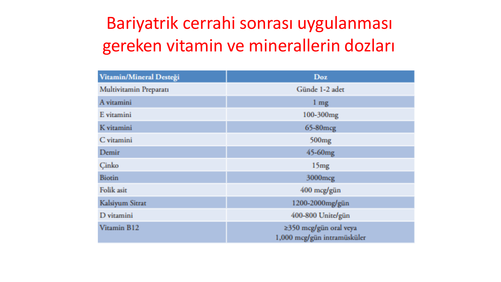

> **Şema yorumu:** Bariyatrik cerrahi özellikle malabsorbtif bileşeni olan yöntemlerde (RYGB, BPD/DS) demir, B12, folat, yağda eriyen vitaminler (A, D, E, K), kalsiyum ve çinko eksikliklerine yol açar. Multivitamin başlangıç desteği yeterli değildir; **hedefe yönelik doz ve parenteral B12 gerekebilir**.

### Bariyatrik Cerrahi Sonrası Rutin İzlem

| Parametre | Sıklık |
|---|---|
| Kilo, VKİ, bel çevresi | Her vizit |
| Tam kan sayımı, demir, ferritin | 3, 6, 12. ay; sonra yıllık |
| B12, folat | 6, 12. ay; sonra yıllık |
| 25(OH)D, kalsiyum, PTH, ALP | Yıllık |
| Albumin, protein, prealbumin | 6, 12. ay; sonra endike ise |
| Lipid, glukoz, HbA1c | 3, 6, 12. ay; sonra yıllık |
| DEXA (kemik mineral yoğunluğu) | Yıllık (özellikle RYGB/BPD sonrası) |
| Psikolojik değerlendirme | Endikasyona göre |

---

## KLİNİK VAKALAR

**📋 VAKA ÖRNEĞİ 1:** *PKOS, insülin direnci ve abdominal obezite*

**Hasta:** 28 yaşında kadın
**Öykü:** 3 yıldır oligomenore, giderek artan kilo, son 2 yılda 15 kg artış, hirsutizm, infertilite
**Fizik Muayene:** Boy 165 cm, kilo 88 kg, **VKİ 32.3 kg/m²** (sınıf I obez), **bel çevresi 102 cm** (obez aralığı), boyunda ve aksillada **akantozis nigrikans**, Ferriman-Gallwey skoru 12
**Laboratuvar:**

- AKŞ 106 mg/dL (bozulmuş açlık glukozu), HbA1c %5.9 (prediyabet)
- İnsülin 28 mIU/L, HOMA-IR 7.3 (yüksek)
- Total testosteron 78 ng/dL (yüksek), DHEAS normal, SHBG düşük
- TSH normal; 24 saatlik idrar kortizol normal

**Tanı:** PKOS (Rotterdam), insülin direnci, sınıf I obezite, prediyabet

**Tedavi:**

1. **Yaşam tarzı:** 500-750 kcal/gün açık, Akdeniz tipi beslenme, haftada 150 dk orta şiddetli egzersiz + 2 gün direnç egzersizi
2. **Metformin** 2x500 mg → 2x1000 mg (prediyabet ve PKOS)
3. %5-10 kilo kaybı ile ovulasyon ve gebelik şansının artacağı anlatıldı
4. Yanıt yetersizse **GLP-1 RA (liraglutid 3 mg/gün veya semaglutid 2.4 mg/hafta)** planlandı (gebelik planlanmıyorsa)

**Öğretici Notlar:**

1. Obezite + PKOS kombinasyonunda **insülin direnci** tedavinin temelidir.
2. Metformin tek başına obezite ilacı değildir; ancak PKOS ve prediyabette anlamlı yer tutar.
3. Akantozis nigrikans insülin direncinin **klinik kanıtıdır**; laboratuvardan önce bakılır.
4. GLP-1 RA'lar gebelik planlamasında en az 2 ay önceden kesilmelidir.

---

**📋 VAKA ÖRNEĞİ 2:** *Morbid obezite -- bariyatrik cerrahi adayı*

**Hasta:** 42 yaşında erkek
**Öykü:** Çocukluktan beri kilolu, 10 yıldır T2DM, 5 yıldır HT, OSAS (CPAP tedavisinde), diz osteoartriti. 3 kez diyet programı ile toplam 20 kg vermiş ancak geri almış.
**Fizik Muayene:** Boy 175 cm, kilo 140 kg, **VKİ 45.7 kg/m²** (sınıf III / morbid obez), **bel çevresi 135 cm**
**Laboratuvar:** HbA1c %8.4 (3 oral antidiyabetik + bazal insülin 40 Ü ile kontrolsüz), LDL 145 mg/dL, TG 320 mg/dL, HDL 32 mg/dL, AST/ALT 52/65 U/L, karaciğer USG: hepatosteatoz grade 3
**Polisomnografi:** AHI 48/saat (ciddi OSAS)

**Tanı:** Morbid obezite (sınıf III) + kontrolsüz T2DM + HT + ciddi OSAS + MASLD

**Tedavi Kararı:**

1. Hasta çok disiplinli bariyatrik cerrahi ekibine yönlendirildi:
   - Endokrinoloji + cerrah + psikiyatri + diyetisyen + göğüs hastalıkları (OSAS)
2. Preoperatif **semaglutid 2.4 mg/hafta** ile 4 ay içinde %12 kilo kaybı (140 → 123 kg); HbA1c %7.1'e düştü
3. **Sleeve gastrektomi** yapıldı
4. Postop 12. ay: kilo 92 kg, VKİ 30 kg/m², HbA1c %5.8 (**T2DM remisyonu** kabul edildi, antidiyabetik kesildi), HT tek ilaçla kontrol altında, CPAP ihtiyacı azaldı
5. Ömür boyu multivitamin, B12 (IM aylık), D vitamini 1000 Ü/gün, kalsiyum sitrat 1200 mg/gün; yıllık endokrin izlem

**Öğretici Notlar:**

1. **Morbid obezite (VKİ ≥40)** bariyatrik cerrahi için bağımsız endikasyondur.
2. T2DM + VKİ ≥35 kombinasyonunda **metabolik cerrahi** T2DM remisyonunda en etkili tedavidir.
3. Preoperatif **GLP-1 RA** ile kilo kaybı cerrahi riskini ve karaciğer boyutunu azaltarak operasyonu kolaylaştırır.
4. Postoperatif **ömür boyu vitamin desteği** ve yıllık izlem zorunludur.

---

**📋 VAKA ÖRNEĞİ 3:** *Sekonder obezite -- Cushing sendromu*

**Hasta:** 35 yaşında kadın
**Öykü:** Son 1.5 yılda 18 kg artış, özellikle karın ve yüzde belirgin. Menstrüel düzensizlik, morarmalar, yeni başlangıçlı HT ve T2DM, kas güçsüzlüğü
**Fizik Muayene:** VKİ 32 kg/m², "ay dede" yüzü, santripetal yağ dağılımı, buffalo hump, mor renkli **abdominal stria** (>1 cm), proksimal kas zayıflığı, akne
**Laboratuvar:** AKŞ 168 mg/dL, HbA1c %8.2, hipokalemi (K: 3.2 mEq/L), TA 160/100 mmHg

**Endokrin testler:**

- 24 saatlik idrar serbest kortizol **4 kat artmış**
- Gece yarısı tükürük kortizolü yüksek
- 1 mg deksametazon supresyon testi -- **supresyon yok**
- ACTH düşük → **ACTH-bağımsız Cushing**
- Adrenal BT: sağ adrenal 3.5 cm adenom

**Tanı:** ACTH-bağımsız (adrenal adenoma bağlı) Cushing sendromu → sekonder obezite

**Tedavi:**

1. Laparoskopik sağ adrenalektomi
2. Postop geçici glukokortikoid replasmanı (karşı adrenalin supresyonundan uyanana kadar)
3. 6. ayda kilo 18 kg azaldı, T2DM ve HT tamamen düzeldi

**Öğretici Notlar:**

1. **Hızlı başlangıçlı, santripetal dağılımlı obezite** + yeni HT + yeni DM + stria + proksimal kas zayıflığı → **Cushing** aklına getir.
2. Sekonder obezite nedenleri dışlanmadan primer obezite tedavisine geçilmez.
3. Cushing gibi sekonder nedenlerde primer hastalığın tedavisi kiloyu düzeltir; farmakolojik/cerrahi obezite tedavisine gerek kalmaz.

---

## ÖZET VE SONUÇ

- **Obezite** karmaşık, çok faktörlü, **kronik** ve **relaps gösteren** bir metabolik hastalıktır; DSÖ, AMA ve EMA tarafından resmi olarak hastalık kabul edilir.
- Tanı **VKİ ≥30 kg/m²** ve/veya artmış **bel çevresi** (kadın >90, erkek >100 cm) ile konur; yağ dağılımı (visseral/ektopik) kardiyometabolik riskin belirleyicisidir.
- Obezite neredeyse tüm organ sistemlerinde komorbidite oluşturur; kardiyovasküler, metabolik, onkolojik, psikososyal yük çok yüksektir.
- Tedavide **yaşam tarzı değişiklikleri** (beslenme + egzersiz + davranış) temeldir, ancak biyolojik karşı-düzenleyici mekanizmalar nedeniyle tek başına genellikle yetersizdir.
- **Farmakolojik tedavi** özellikle son yıllarda **GLP-1 RA'lar (liraglutid, semaglutid)** ve **GIP/GLP-1 dual agonisti tirzepatid** ile devrim niteliğinde etkinliğe ulaşmıştır; STEP ve SURMOUNT çalışmaları sırasıyla **%15** ve **%20-25** kilo kaybını güvenle göstermiştir.
- **Monogenik obezitede** MC4R agonisti **setmelanotid** seçilmiş endikasyonlarda (LEPR, POMC, PCSK1, Bardet-Biedl) kullanılır.
- **Bariyatrik cerrahi** (sleeve gastrektomi, RYGB, BPD/DS); VKİ ≥40 veya ≥35 + komorbidite olgularında en etkili ve kalıcı tedavidir; T2DM remisyonu sağlayabilir. Ömür boyu **vitamin-mineral desteği ve izlem** zorunludur.
- Obezite tedavisi her zaman **multidisipliner** olmalıdır: endokrinolog, diyetisyen, psikiyatrist/psikolog, cerrah, fizyoterapist.
- Başarının anahtarı: **kalıcı yaşam tarzı değişikliği + uygun farmakolojik/cerrahi müdahalenin zamanında eklenmesi + uzun süreli izlem**.

---

**Kaynaklar:**

1. Türkiye Endokrinoloji ve Metabolizma Derneği (TEMD) Obezite, Dislipidemi, Hipertansiyon Tanı ve Tedavi Kılavuzu -- Güncel baskı
2. Satman I et al. TURDEP-II Çalışması. *Eur J Epidemiol* 2013;28:169-180
3. Prospective Studies Collaboration. *Lancet* 2009;373:1083-96
4. Saxton SN et al. *Physiol Rev* 2019;99:1701-63
5. Kershaw EE, Flier JS. *J Clin Endocrinol Metab* 2004;89:2548-56
6. Wilding JPH et al. STEP 1 (Semaglutide 2.4 mg). *N Engl J Med* 2021;384:989
7. Jastreboff AM et al. SURMOUNT-1 (Tirzepatide). *N Engl J Med* 2022;387:205
8. WHO Obesity and Overweight Fact Sheet. who.int
