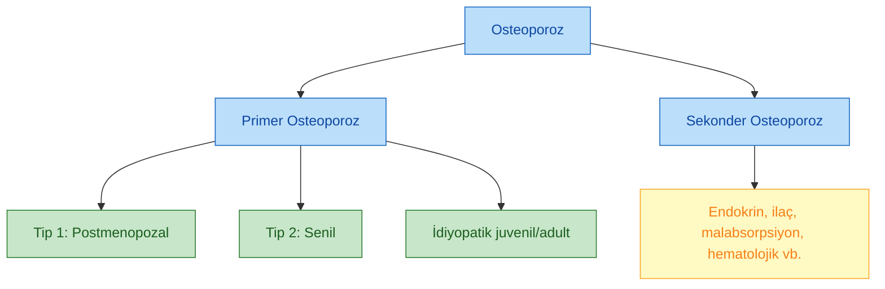
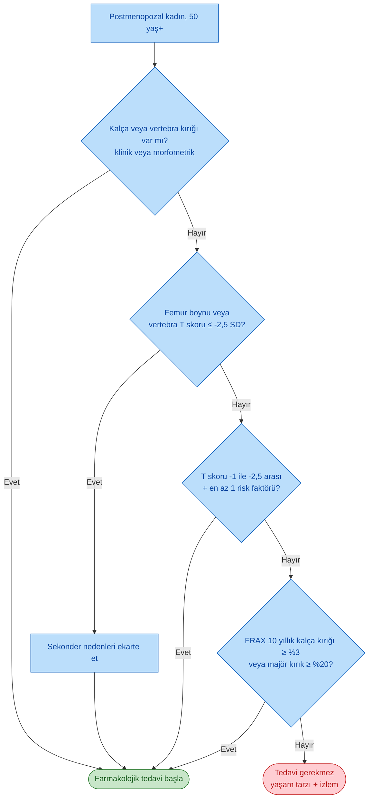
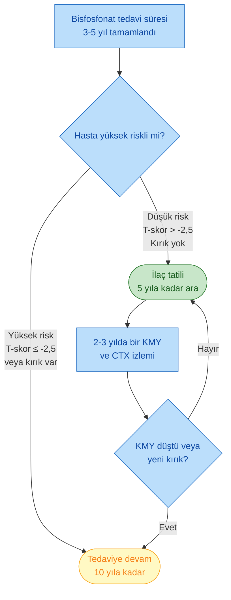
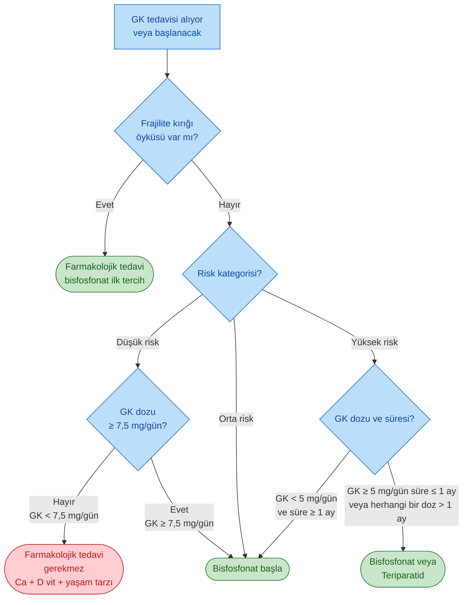

# OSTEOPOROZ

**Hazırlayan:** Prof. Dr. Engin Güney
**Bölüm:** Aydın Adnan Menderes Üniversitesi -- Endokrinoloji Bilim Dalı

---

## İÇİNDEKİLER

1. [Tanım ve Genel Bakış](#tanım-ve-genel-bakış)
2. [Frajilite Kırığı](#frajilite-kırığı)
3. [Osteoporoz Sınıflaması](#osteoporoz-sınıflaması)
4. [Kemik Biyolojisi ve Remodelling](#kemik-biyolojisi-ve-remodelling)
5. [Risk Faktörleri](#risk-faktörleri)
6. [Tanı -- DXA ile Kemik Mineral Yoğunluğu](#tanı----dxa-ile-kemik-mineral-yoğunluğu)
7. [Postmenopozal Osteoporoz](#postmenopozal-osteoporoz)
8. [FRAX ile Kırık Riski Değerlendirmesi](#frax-ile-kırık-riski-değerlendirmesi)
9. [Laboratuvar Değerlendirmesi](#laboratuvar-değerlendirmesi)
10. [Yaşam Tarzı ve Non-Farmakolojik Tedavi](#yaşam-tarzı-ve-non-farmakolojik-tedavi)
11. [Farmakolojik Tedavi Endikasyonu](#farmakolojik-tedavi-endikasyonu)
12. [Bisfosfonatlar](#bisfosfonatlar)
13. [Stronsiyum Ranelat](#stronsiyum-ranelat)
14. [Teriparatid (PTH 1-34)](#teriparatid-pth-1-34)
15. [Hormon Replasman Tedavisi (HRT)](#hormon-replasman-tedavisi-hrt)
16. [Selektif Estrojen Reseptör Modülatörleri (SERM)](#selektif-estrojen-reseptör-modülatörleri-serm)
17. [Kalsitonin](#kalsitonin)
18. [Denosumab](#denosumab)
19. [Tedavinin İzlenmesi](#tedavinin-izlenmesi)
20. [Erkek Osteoporozu](#erkek-osteoporozu)
21. [Premenopozal Osteoporoz](#premenopozal-osteoporoz)
22. [İlaca Bağlı Osteoporoz](#ilaca-bağlı-osteoporoz)
23. [Glukokortikoid ile İndüklenmiş Osteoporoz (GIO)](#glukokortikoid-ile-indüklenmiş-osteoporoz-gio)
24. [Klinik Vaka Örnekleri](#klinik-vaka-örnekleri)
25. [Özet ve Akılda Kalıcı Bilgiler](#özet-ve-akılda-kalıcı-bilgiler)
26. [Kısaltmalar](#kısaltmalar)

---

## TANIM VE GENEL BAKIŞ

> **Osteoporoz:** Düşük kemik kütlesi ve kemik dokusu mikromimarisinin bozulması ile karakterize, kemik gücünün azaldığı, kırılganlığın ve kırık gelişme duyarlılığının arttığı **sistemik bir kemik hastalığıdır**.

### WHO (Dünya Sağlık Örgütü) Tanısal Kriteri

> **Dansitometrik tanım:** Kemik mineral yoğunluğunun (KMY), aynı cinsiyetten genç erişkin referans aralığının ortalamasından **-2,5 standart sapma (SD) ve altında** olması.

**Osteoporozun iki ayağı:**

* **Düşük kemik kütlesi** (kantitatif bozukluk)
* **Mikromimari bozukluk** (kalitatif bozukluk)

> ⭐ **Kritik:** Osteoporoz tanısı hem **DXA ile T-skoru ≤ -2,5 SD** hem de **frajilite kırığı varlığı** ile konulabilir. Kırık varsa KMY normal olsa bile klinik osteoporoz mevcuttur.

---

## FRAJİLİTE KIRIĞI

> **Frajilite kırığı:** Ayakta durur pozisyondan düşmeye eşdeğer ya da daha az travmaya bağlı meydana gelen kırıktır.

### Frajilite Kırığı ile İlişkili Yaygın Bölgeler

| Sıralama | Lokalizasyon | Klinik Özellik |
|---|---|---|
| 1 (en sık) | **Vertebra** | Sıklıkla sessiz (morfometrik); boy kısalması, kifoz |
| 2 | **Distal ön kol (Colles kırığı)** | Postmenopozal dönemin erken belirtisi |
| 3 | **Proksimal femur (kalça)** | En yıkıcı; mortalite ve morbidite yüksek |

> 💡 **İpucu:** Son 5 yılda **3 cm'den fazla boy kısalması**, vertebral kompresyon kırığının klinik bulgusu olabilir.

---

## OSTEOPOROZ SINIFLAMASI

### Primer Osteoporoz

| Tip | Adı | Dönem | Kemik Tipi | Tipik Kırık |
|---|---|---|---|---|
| **Tip 1** | Postmenopozal | 50-65 yaş kadın | Trabeküler (vertebra) | Vertebra, Colles |
| **Tip 2** | Senil | >70 yaş her iki cins | Kortikal + trabeküler | Kalça, vertebra |
| -- | İdiyopatik | Juvenil / genç erişkin | Değişken | Değişken |

### Sekonder Osteoporoz

Altta yatan tanımlanabilir bir hastalık veya ilaç nedeniyle gelişen osteoporozdur (bkz. [İlaca Bağlı Osteoporoz](#ilaca-bağlı-osteoporoz)).

---

## KEMİK BİYOLOJİSİ VE REMODELLING

### Kemik Dönüşümü (Remodelling)

Kemik, durağan değil sürekli yenilenen dinamik bir dokudur. Temel hücresel oyuncular:

| Hücre | İşlev | Ana Sinyal |
|---|---|---|
| **Osteoblast** | Kemik yapımı (osteoid sentezi ve mineralizasyon) | Wnt yolağı, IGF-1 |
| **Osteoklast** | Kemik yıkımı (rezorpsiyon) | **RANKL** ile aktivasyon |
| **Osteosit** | Mekanosensör, sklerostin salgılar | Wnt inhibisyonu |

### RANK / RANKL / OPG Sistemi

> **RANKL (Receptor Activator of NF-kB Ligand):** Osteoblast ve stromal hücrelerden salgılanır, osteoklast öncüsündeki **RANK** reseptörüne bağlanarak osteoklast oluşumunu, aktivitesini ve yaşam süresini artırır.

> **OPG (osteoprotegerin):** RANKL için tuzak reseptördür; RANKL-RANK bağlanmasını engelleyerek kemik yıkımını azaltır.

**Denge:** RANKL / OPG oranı kemik rezorpsiyonunun hızını belirler. Estrojen eksikliğinde RANKL artar → osteoklastogenez hızlanır → postmenopozal kemik kaybı.

### Wnt / Sklerostin Yolağı

* Wnt sinyali osteoblast farklılaşmasını ve kemik yapımını uyarır.
* Osteositlerden salgılanan **sklerostin** Wnt'i inhibe eder → kemik yapımı azalır.
* **Romosozumab** anti-sklerostin monoklonal antikorudur (yeni anabolik ajan).

---

## RİSK FAKTÖRLERİ

### Değiştirilemeyen

* İleri yaş
* Kadın cinsiyet, beyaz/Asya ırkı
* Genetik (ailede kalça kırığı öyküsü) -- **doruk kemik kütlesi %80 genetik olarak belirlenir**
* Erken menopoz (<45 yaş), geç menarş
* Küçük yapı / düşük vücut kütle indeksi (VKİ <21)

### Değiştirilebilir

* D vitamini ve kalsiyum alımının yetersizliği
* Sigara içme
* Aşırı alkol tüketimi (>3 ünite/gün)
* Fiziksel inaktivite, immobilizasyon
* Aşırı kafein tüketimi
* Düşük vücut ağırlığı, yeme bozuklukları
* Kronik glukokortikoid kullanımı ve diğer ilaçlar

### Klinik Risk Faktörleri (FRAX için)

* Önceki frajilite kırığı öyküsü
* Ailede kalça kırığı
* Sigara, alkol
* Romatoid artrit
* Sekonder osteoporoz nedenleri
* Oral glukokortikoid kullanımı

---

## TANI -- DXA İLE KEMİK MİNERAL YOĞUNLUĞU

### Altın Standart: DXA (Dual X-ray Absorpsiyometri)

> KMY ölçümünde halen önerilen yöntem **DXA**'dır. Ölçüm lomber omurga (L1-L4) ve proksimal femur (total kalça ve femur boynu) bölgelerinden yapılır.

**DXA'nın kullanım alanları:**

* Tanı koyma
* Kırık riskini belirleme
* Farmakolojik tedavi başlama kararı
* Tedavi monitorizasyonu

### T-Skoru ve Z-Skoru

| Skor | Referans | Kullanım |
|---|---|---|
| **T-skoru** | Genç erişkin ortalamasından SD farkı | Postmenopozal kadın ve >50 yaş erkek |
| **Z-skoru** | Yaş-cinsiyet eşleştirilmiş ortalamadan SD farkı | Premenopozal kadın, <50 yaş erkek, çocuk |

### WHO T-Skoru Sınıflaması

| Kategori | T-Skoru |
|---|---|
| **Normal** | -1 SD ve üstü |
| **Osteopeni (düşük kemik kütlesi)** | -1 SD ile -2,5 SD arasında |
| **Osteoporoz** | -2,5 SD altı |
| **Ciddi (severe) osteoporoz** | -2,5 SD ve altı + frajilite kırığı varlığı |

> ⭐ **Önemli:** Bu sınıflama özellikle **postmenopozal kadınlar** için geçerlidir. Premenopozal kadın ve genç erkekte Z-skoru kullanılır.

### Z-Skoru Yorumu (Premenopozal Kadın)

| Z-skoru | Yorum |
|---|---|
| **> -2,0 SD** | Beklenen sınırlarda kemik kütlesi |
| **≤ -2,0 SD** | Beklenenden düşük kemik yoğunluğu → sekonder neden araştır |

> ⚠️ **Dikkat:** Kaynakta bazı slaytlarda Z-skoru ile ilgili "büyük/küçük" ifadelerinde tutarsızlık görülebilir. Uluslararası kabul gören kriter: **Z ≤ -2,0 SD beklenenden düşüktür ve metabolik kemik hastalığı araştırılmalıdır.**

---

## POSTMENOPOZAL OSTEOPOROZ

> **Tanım:** Postmenopozal dönemde **estrojen eksikliği** ile ilişkili olan osteoporozdur.

### Menopoz Tanımı

* En az **6 aydır adet görmeyen** ve/veya **FSH >20 ng/mL** olan postmenopozal kadınlar osteoporoz riski açısından değerlendirilmelidir.

### Tanı Kriterleri

* **T-skoru < -2,5 SD** → Osteoporoz
* **-2,5 SD < T-skoru < -1,0 SD** → Osteopeni
* T-skoru ≥ -1 SD → Normal

### Patofizyoloji Özeti

Estrojen eksikliği → RANKL ↑, OPG ↓ → osteoklast aktivitesi ↑ → **trabeküler kemik kaybı hızlanır** (Tip 1 osteoporoz) → tipik olarak vertebra ve distal radius kırıkları.

---

## FRAX İLE KIRIK RİSKİ DEĞERLENDİRMESİ

> **FRAX®:** Dünya Sağlık Örgütü (DSÖ) tarafından hastalardaki kırık riskini değerlendirmek için geliştirilmiş, bilgisayarla çalıştırılan ve <http://www.shef.ac.uk/FRAX/> adresinde **ücretsiz erişilebilen** bir programdır.

### FRAX Ne Verir?

* **10 yıllık kalça kırığı olasılığı**
* **10 yıllık majör osteoporotik kırık olasılığı** (klinik vertebra, önkol, kalça veya omuz kırığı)

### Girdi Parametreleri

* Yaş, cinsiyet, boy, ağırlık (VKİ)
* Önceki frajilite kırığı
* Ailede kalça kırığı öyküsü
* Sigara, alkol (≥3 ünite/gün)
* Glukokortikoid kullanımı
* Romatoid artrit
* Sekonder osteoporoz nedenleri
* Femur boynu KMY (opsiyonel)

> ⚠️ **Önemli kısıtlılık:** FRAX ile elde edilen olasılık değeri, size **kimi tedavi edeceğinizi** söylemez. Farmakolojik tedavi kararı, FRAX sonucu + **klinik yargı** birlikte değerlendirilerek verilmelidir.

---

## LABORATUVAR DEĞERLENDİRMESİ

Osteoporoz tanısı konulduğunda veya şüphesinde sekonder nedenleri dışlamak için aşağıdaki testler istenir:

### Temel Laboratuvar

* Serum kalsiyum (Ca), fosfor (P), alkalen fosfataz (ALP)
* Serum albumin (düzeltilmiş Ca için)
* Kreatinin, eGFR
* **25-hidroksi vitamin D [25(OH)D]**
* PTH (paratiroid hormonu)
* TSH
* 24 saatlik idrar kalsiyumu
* Tam kan sayımı

### Seçilmiş Hastalarda

* Erkekte serum **total testosteron**
* Serum ve idrar protein elektroforezi (multipl miyelom)
* Çölyak antikorları (anti-doku transglutaminaz)
* Sabah serum kortizolü veya 1 mg DST (Cushing şüphesi)
* Ferritin (hemokromatoz)

### Kemik Dönüşüm Belirteçleri

| Belirteç | Tip | Anlamı |
|---|---|---|
| **CTX** (C-telopeptid) | Rezorpsiyon | Antirezorptif tedaviyi izlemede |
| **P1NP** (prokollajen tip 1 N-ucu peptidi) | Formasyon | Anabolik tedaviyi izlemede |
| Osteokalsin | Formasyon | Alternatif formasyon belirteci |

---

## YAŞAM TARZI VE NON-FARMAKOLOJİK TEDAVİ

Her osteoporoz hastasında **temel müdahale**:

* **Egzersiz** (yük bindirici ve direnç)
* **Sigaranın bırakılması**
* **Alkol alımının kısıtlanması** (<3 ünite/gün)
* **Düşme riskinin azaltılması** (ev güvenliği, görme/işitme kontrolü, ilaç gözden geçirme)
* **Yeterli kalsiyum alımı** → Önerilen günlük kalsiyum alımı **1200 mg**
* **Yeterli D vitamini alımı**

### D Vitamini Replasmanı (Postmenopozal Kadınlarda)

Beslenme ile D vitamini alımı genellikle yetersizdir.

| Serum 25(OH)D Düzeyi | Yaklaşım |
|---|---|
| **≤ 20 ng/mL** | Yükleme: 50.000 IU/hafta x 8 hafta (toplam 400.000 IU), ardından 1500-2000 IU/gün idame |
| **> 20 ng/mL** | Tüm postmenopozal kadınlara 1500-2000 IU/gün D vitamini |

**Hedef:** Serum 25(OH)D **>30 ng/mL**.

### Erkek Osteoporozunda Replasman

* D vitamini: **1500-2000 IU/gün**
* Kalsiyum: **1000-1500 mg/gün**

---

## FARMAKOLOJİK TEDAVİ ENDİKASYONU

### Postmenopozal Kadın (≥50 yaş) Farmakolojik Tedavi Kriterleri

**Kaynak metinde belirtilen FRAX eşikleri** (Prof. Güney ders notu): 10 yıllık kalça kırığı riski **≥ %30** veya 10 yıllık majör osteoporotik kırık riski **≥ %20** olanlarda farmakolojik tedavi önerilir.

> 💡 **Not:** NOF (National Osteoporosis Foundation) uluslararası eşiği kalça için **≥ %3**, majör için **≥ %20** şeklindedir. Ders notundaki kalça eşiği daha yüksek tutulmuştur; klinik pratikte ≥ %3 yaygın kabul görür.

---

## BİSFOSFONATLAR

> **Bisfosfonatlar, osteoporoz tedavisinde ilk basamak (ilk tercih) ilaçlardır.**

### Mekanizma

* Hidroksiapatit kristallerine yüksek afinite ile bağlanır.
* Osteoklastlar tarafından fagosite edilir → **farnesil pirofosfat sentaz enzimini inhibe eder** → osteoklast apoptozu → kemik rezorpsiyonu azalır.
* Kemik kütlesini artırarak kırık riskini önemli ölçüde azaltır.

### Osteoporoz Tedavisinde Kullanılan Başlıca Bisfosfonatlar

| İlaç | Doz | Yol |
|---|---|---|
| **Alendronat** | 10 mg/gün veya **70 mg/hafta** | Oral |
| **Risedronat** | 5 mg/gün, 35 mg/hafta veya 150 mg/ay | Oral |
| **İbandronat** | 150 mg/ay veya 3 mg/3 ay | Oral / İV |
| **Zoledronik asit** | **5 mg yılda bir kez** | İV |

### Oral Bisfosfonat Kullanım Kuralları

Oral bisfosfonatlar çok az emilir (biyoyararlanım <%1); emilimi artırmak ve üst GİS yan etkilerini azaltmak için **kesin uyulması gereken** kurallar vardır:

* **Sabah aç karına**, günün ilk ilacı olarak
* **200-300 cc su** ile, **tek başına** (diğer ilaç, yiyecek, içecek YOK)
* İlacı aldıktan sonra **en az 30 dakika** başka bir yiyecek/ilaç/içecek alınmamalı
* **En az 30 dakika yatılmamalı** → dik oturma veya ayakta kalma (reflü / özofajit riski)

### Kontrendikasyonlar (KE)

* **Kreatinin klirensi < 30-35 mL/dk** (renal yetmezlik)
* **Aktif üst gastrointestinal hastalık** (oral bisfosfonatlar için)
* Özofajit semptomu gelişen hastada ilaç kesilmelidir
* Akalazya, özofageal striktür gibi geçiş bozuklukları
* Hipokalsemi (düzeltilmeden başlanmaz)
* Gebelik

### Yan Etkiler

#### Akut (özellikle İV)

* **Grip benzeri semptomlar** (akut faz reaksiyonu) → profilaksi / tedavi: **asetaminofen**
* **Hipokalsemi** (özellikle D vitamini eksikliğinde) → kalsiyum ve D vitamini replasmanı ile önlenir

#### Uzun Süreli

* **Çene kemiği osteonekrozu (ONJ)**
* **Atipik femur kırığı** (subtrokanterik, diyafizer)
* Atriyal fibrilasyon riski (tartışmalı)
* Kas-iskelet ağrısı (ilaç kesilmesiyle tam düzelmeyebilir)
* Oküler yan etkiler (konjunktivit, üveit, bulanık görme) -- nadir

### Çene Kemiği Osteonekrozu (ONJ) -- Risk Faktörleri

* İntravenöz bisfosfonat kullanımı
* Kanserli olmak / anti-kanser tedavi alıyor olmak
* Diş çekimi ve önceden mevcut diş hastalığı
* Diş implantları
* Glukokortikoid kullanımı
* Sigara
* Bisfosfonatlara **uzun süreli maruziyet**

> 💡 **Klinik ipucu:** İnvaziv diş işlemi öncesi bisfosfonat başlanmamalı; tedavi altındaki hasta invaziv işleme gitmeden önce diş hekimi ile danışılmalıdır.

### Tedavi Süresi -- "İlaç Tatili" (Drug Holiday)

Bisfosfonatların süresi konusunda kesin konsensus yoktur:

* **Düşük riskli hastalar:** 5 yıldan sonra tedavi kesilmesi uygun bir yaklaşımdır. Kesimden sonraki 5 yıl boyunca ilacın KMY ve kırık riski üzerindeki etkileri devam eder (depot etki).
* **Yüksek riskli hastalar:** Tedavi **10 yıla kadar** sürdürülebilir.

---

## STRONSİYUM RANELAT

* Postmenopozal osteoporozun tedavisinde ilk basamak ilaçlar arasında kullanılabilir.
* **Çift etkili:** Kemik yıkımını azaltır + kemik yapımını artırır.
* Tedavi sırasında KMY'deki artışın önemli bir kısmı stronsiyumun kemik dokusundaki **fiziksel (yoğunluk) etkisine** bağlıdır (atom numarası Ca'dan yüksek).

### Yan Etkiler

* **Hipersensitivite sendromu** (DRESS) -- nadir ama ciddi
* Cilt reaksiyonu gelişirse tedavi kesilmelidir
* Venöz tromboemboli ve kardiyovasküler olay riski (günümüzde kullanımı kısıtlanmıştır)

---

## TERİPARATİD (PTH 1-34)

> **Teriparatid:** Rekombinant insan paratiroid hormonunun 1-34 amino asitlik fragmanıdır. **Anabolik** (kemik yapımını artıran) tek önemli sınıf ilaçtır.

### Mekanizma

* Aralıklı (pulse) PTH uygulaması → osteoblastları uyarır → kemik yapımı, kemik yıkımına göre **orantısız olarak artar** → kemik kütlesi artar.
* (Sürekli yüksek PTH ise, primer hiperparatiroidide olduğu gibi, net kemik kaybına yol açar -- "anabolik pencere" hipotezi.)

### Kullanım

| Parametre | Değer |
|---|---|
| **Doz** | 20 mikrogram/gün, subkutan |
| **Tedavi süresi** | **18 ay** (en fazla 24 ay) |

### Klinik Kanıt

Post-menopozal osteoporoz tedavisinde 21 ay süren bir çalışmada teriparatid:

* **Vertebra kırık insidansını %60'tan fazla** azaltmıştır.
* **Vertebra dışı kırık insidansını %50** oranında azaltmıştır.

### Endikasyonlar

* İleri osteoporozu olan ve daha önceden **osteoporotik kırığı** olanlar
* **Multipl risk faktörü** olanlar
* **Tedaviye dirençli** vakalar

> 📋 **Türkiye geri ödeme kriteri:** T-skoru **< -3,5** olmalı ve **en az 2 vertebra kırığı** bulunmalıdır.

### Kontrendikasyonlar

* **Kemiğin Paget hastalığı**
* **Açıklanamayan ALP yüksekliği**
* **Açık epifiz** (büyüme çağındaki çocuk)
* **İskelet sistemine radyoterapi** uygulanmış olması
* Kemik metastazı, primer kemik tümörü
* Şiddetli renal yetmezlik
* Hiperkalsemi

### Güvenlik -- Osteosarkom Riski

* Yaşamlarının yaklaşık yarısı boyunca teriparatid verilen sıçanlarda **doz ilişkili osteosarkom artışı** izlenmiştir.
* İnsanlarda **430.000'den fazla kullanımda yalnızca 2 osteosarkom** bildirilmiştir (arka plan insidansıyla uyumlu).
* Yine de süre sınırı ve yukarıdaki kontrendikasyonlar buna dayanır.

### Tedavi Sonrası Strateji

Teriparatid tedavisinin hemen ardından **bisfosfonatlara başlanması**, lomber bölgede KMY artışına katkıda bulunur (kazanımı korumak için sekans tedavi önerilir).

* **İzlem:** 6 ay ve 1 yıllık DXA ölçümleri.

---

## HORMON REPLASMAN TEDAVİSİ (HRT)

* Kombine estrojen/progesteron (HRT) veya tek başına estrojen (ERT) postmenopozal kadınlarda kemik kaybını önler, kalça ve vertebra kırığı riskini azaltır.

### Neden Artık Tercih Edilmez?

Çalışmalarda (özellikle WHI) HRT'nin aşağıdaki riskleri artırdığı belirlenmiştir:

* **Meme kanseri**
* **Venöz tromboemboli (VTE)**
* **İnme**
* Muhtemelen koroner arter hastalığı

> ⚠️ **Sonuç:** Hormon replasman tedavisi **günümüzde osteoporozun tedavisinde bir tedavi seçeneği değildir**. Menopozal vazomotor semptom tedavisi için seçilmiş hastalarda kullanılabilir; osteoporoz etkisi "bonus" olarak değerlendirilir.

---

## SELEKTİF ESTROJEN RESEPTÖR MODÜLATÖRLERİ (SERM)

> **Raloksifen:** Dokuya seçici estrojen reseptör modülatörüdür; kemik ve lipid dokusunda **agonist**, meme ve endometriyumda **antagonist** etki gösterir.

### Etkileri

| Alan | Etki |
|---|---|
| Kemik mineral yoğunluğu | **Artırır** |
| **Vertebra kırık riski** | **Azaltır** |
| Vertebra dışı kırık riski | Anlamlı etki yok |
| **Meme kanseri riski** | **Azaltabilir** |
| Endometriyum hiperplazisi / vajinal kanama | Yok |
| **Venöz tromboemboli riski** | **Artırır** |

### Kullanım

* Tedavi süresi **8 yıla kadar** uzatılabilir.
* Özellikle meme kanseri riski yüksek olan, vertebra osteoporozu ön planda olan postmenopozal kadınlarda tercih edilir.

### Premenopozal Kadında Kontrendikedir

---

## KALSİTONİN

* Kemik mineral yoğunluğu üzerine etkisi **diğer ajanlara göre düşük**tür.
* Kırık önleme açısından bisfosfonatlar ve PTH analoglarıyla karşılaştırıldığında **zayıf** etkilidir.
* **Akut kırık ağrısında analjezik etkisi** oldukça belirgindir (özellikle vertebra kompresyon kırığı).
* Son yıllarda bazı kanserlerin oluşumunda etkili olabileceği düşünülerek **osteoporoz tedavisinde kullanılmaması önerilmektedir**.

---

## DENOSUMAB

> **Denosumab:** RANK-L (NF-kB ligand reseptör aktivatörü) reseptörüne karşı geliştirilmiş **monoklonal antikordur**. Osteoklast formasyonu, sayısı ve yaşam süresini inhibe ederek kemik rezorpsiyonunu engeller.

### Endikasyon

* Postmenopozal osteoporoz tedavisinde endikedir.
* Erkek osteoporozu, aromataz inhibitörü kullanan kadın, ADT alan erkek, kanserde SRE önleme gibi endikasyonları da vardır.

### Kullanım

| Parametre | Değer |
|---|---|
| **Doz** | 60 mg |
| **Sıklık** | **6 ayda bir** |
| **Yol** | Subkutan enjeksiyon |

### Yan Etkiler

* **Hipokalsemi** (en önemli)
* **Selülit** ve cilt enfeksiyonları
* ONJ ve atipik femur kırığı (bisfosfonatlardaki kadar olmasa da bildirilmiştir)
* **"Rebound" vertebra kırıkları:** Denosumab kesildiğinde kemik dönüşümü hızla artar; 1 yıl içinde multipl vertebra kırığı riski vardır → **kesildikten sonra mutlaka bisfosfonat ile konsolidasyon** yapılmalıdır.

### Kontrendikasyonlar

* **Hipokalsemi** (önce düzeltilmelidir)
* **D vitamini eksikliği** → denosumab tedavisinden önce giderilmelidir.

> ✅ **Avantaj:** Kronik böbrek yetmezliğinde (KBY) **doz ayarlaması gerektirmez** -- renal yetmezlikli osteoporoz hastası için önemli bir seçenektir.

---

## TEDAVİNİN İZLENMESİ

* Tedaviye yanıt **kemik mineral yoğunluğu ölçümleri** ile izlenir.
* **KMY ölçümleri yılda bir kez tekrarlanmalıdır.**
* KMY'nin değişmemesi veya artış göstermesi → **tedaviye yanıt var** demektir.
* Eğer KMY stabil veya düzelme gösteriyor ise daha uzun aralıklarla (2 yıl) DXA yapılabilir.

### Yanıt Değerlendirmesi

| Bulgu | Yorum |
|---|---|
| KMY ↑ veya stabil | Tedavi başarılı |
| KMY ↓ veya yeni frajilite kırığı | Tedavi başarısız → uyum kontrol et, sekonder neden ara, ilaç değiştir |

---

## ERKEK OSTEOPOROZU

### Tarama

> **Kemik dansitometresi (DXA):**
>
> * **70 yaş üzerindeki tüm erkeklerde**
> * **50-70 yaş arasında risk faktörleri olan erkeklerde**

### Klinik

* Genellikle **asemptomatik**tir.
* Frajilite (düşük düzeyde travmaya bağlı) kırığına bağlı ağrı ile kendini gösterebilir.
* **Son 5 yılda 3,0 cm'den daha fazla boy kısalması** → vertebral kompresyon kırığı bulgusu olabilir.

### Sekonder Nedenler (Erkekte Özellikle Sorgula)

* **Hipogonadizm** (en sık sekonder neden) → total testosteron bakılır
* Glukokortikoid kullanımı
* Alkolizm
* Hiperkalsiüri
* Primer hiperparatiroidi
* GI hastalıklar (çölyak, İBH)
* Multipl miyelom

### Tedavi

* Yaşam tarzı değişiklikleri
* Sekonder nedenlerin tedavisi
* Sigara ve aşırı alkol tüketiminden uzak kalınması
* Yeterli kalsiyum ve D vitamini alımı (D vit: 1500-2000 IU/gün, Ca: 1000-1500 mg/gün)
* **Bisfosfonatlar** ilk tercih
* Denosumab, teriparatid seçilmiş hastalarda

---

## PREMENOPOZAL OSTEOPOROZ

### Önemli Farklar

* Premenopozal dönemde azalmış kemik kütlesi ile kırık arasındaki korelasyon, postmenopozal kadınlarda olduğu kadar **doğru orantılı değildir**.
* Premenopozal kadınlardaki düşük kemik kütlesi:
  * **Düşük doruk (peak) kemik kütlesi** nedeniyle, veya
  * Doruk kemik kütlesi oluştuktan sonra meydana gelen **kayıplarla**, veya
  * Her ikisinin kombinasyonu ile oluşur.

> 💡 **Doruk kemik kütlesi %80 genetik** olarak belirlenir; yaşam tarzı ve çevresel faktörler katkıda bulunur.

### Neden Kısa Süreli Kırık Riski Düşüktür?

Postmenopozal kadınla kıyaslandığında premenopozal kadın:

* **Estrojeni yeterlidir**
* Daha büyük kas kütlesine sahiptir
* **Daha kalın kortekse** sahiptir
* **Normal trabeküler bağlantılara** sahiptir
* **Daha düşük kemik döngüsüne** sahiptir
* **Daha düşük düşme riskine** sahiptir

→ Bu nedenle düşük Z-skoruna sahip premenopozal kadında kısa süreli kırık riski düşüktür. Başka risk faktörleri eklenirse risk artar.

### Z-Skoru Yorumu

* **Z-skoru > -2,0 SD:** Beklenen sınırlarda kemik kütlesi
* **Z-skoru ≤ -2,0 SD:** Beklenenden düşük → **sekonder osteoporoz nedenleri araştırılmalı ve dışlanmalı**

### Tedavi

**Temel yaklaşım: Yaşam tarzı + sekonder nedenin tedavisi**

* Yük bindirici fiziksel aktivitelere yönlendirme
* Sigara bırakma
* Alkol <3 ünite/gün
* D vitamini ve kalsiyum alımı
* Yaşam tarzı ile ilgili genel tedbirler

### Farmakolojik Tedaviye Yaklaşım

| İlaç | Premenopozal Uygunluk |
|---|---|
| Bisfosfonatlar (antirezorptifler) | **Saklanmalıdır** -- olası gebeliklerde fetusun iskelet mineralizasyonunda sorun yaratabilir; **sınırda KMY** değerlerinde **kullanımdan kaçın**. |
| **SERM (raloksifen)** | **Kontrendikedir** |
| Teriparatid | Etkinliği bu grupta **bilinmemektedir** |
| Stronsiyum | Etkinliği bu grupta **bilinmemektedir** |

> ⚠️ **Prensip:** Premenopozal osteoporotik kadınlarda antirezorptif ilaçlar, **zorunlu durumlarda** kullanılmak üzere saklanmalıdır.

---

## İLACA BAĞLI OSTEOPOROZ

Sekonder osteoporozun sık karşılaşılan ve önlenebilir nedeni ilaç kullanımıdır.

### Osteoporoza Neden Olan İlaçlar

| Grup | İlaçlar |
|---|---|
| **Antiepileptikler** | Fenitoin, karbamazepin, fenobarbital, valproik asit |
| **Antineoplastik ajanlar** | Anastrozol |
| **Aromataz inhibitörleri** | Letrozol, anastrozol, eksemestan |
| **İmmunosüpresanlar** | Siklosporin |
| **Diüretikler** | Furosemid |
| **GnRH agonistleri** | Leuprolid, goserelin |
| **Sitotoksikler** | Metotreksat (yüksek dozlarda) |
| **Tiroid hormonu** | Levotiroksin (aşırı dozlarda / süprese TSH) |
| **Psikotrop** | Lityum, SSRI'lar |
| **Antiasitler** | Proton pompa inhibitörleri (PPI) |
| **Glukokortikoidler** | Prednizon, prednizolon, metilprednizolon, deksametazon |
| **Antidiyabetik** | Tiazolidindionlar (pioglitazon, rosiglitazon) |
| **Antikoagülanlar** | Heparin ve warfarin |
| **Antiretroviraller** | HAART ilaçları |
| **Vitamin** | Vitamin A (>1,5 mg/gün retinol) |

> 💡 **Mekanizma ipuçları:**
>
> * **Aromataz inhibitörleri / GnRH agonistleri / ADT** → estrojen/androjen yetersizliği
> * **PPI** → kalsiyum emilimini azaltır
> * **Heparin** → osteoklast aktivasyonu (özellikle uzun süreli, yüksek doz)
> * **Antiepileptikler** → CYP450 indüksiyonu ile D vitamini yıkımı
> * **Tiazolidindionlar** → mezenkimal kök hücreyi osteoblast yerine adiposit farklılaşmasına yöneltir
> * **Glukokortikoidler** → hem yapım azaltır hem yıkımı artırır (bkz. GIO bölümü)

---

## GLUKOKORTİKOİD İLE İNDÜKLENMİŞ OSTEOPOROZ (GIO)

### Doz ve Süre İlişkisi

> Osteoporoz glukokortikoidlerin **dozu ve kullanım süresi** ile ilişkilidir. Doz ve süre arttıkça kırıklar artar.

* **2,5 mg/gün (prednizolon eşdeğeri) kadar düşük dozlarda bile** kırık riski artar.
* Hem kadınlar hem erkekler etkilenir.

### Patofizyoloji (GIO)

* Osteoblast sayısını ve aktivitesini azaltır (kemik yapımı ↓)
* Osteoblast ve osteosit apoptozunu artırır
* RANKL üretimini artırır, OPG'yi azaltır → osteoklast aktivitesi ↑ (özellikle erken dönemde)
* İntestinal kalsiyum emilimini azaltır
* Renal kalsiyum atılımını artırır
* Sekonder hiperparatiroidi
* Hipogonadizm (GnRH baskılanması)

### Daha Yüksek Risk Kategorisine Taşıyan Klinik Faktörler

* Vücut kütle indeksinin düşük oluşu
* Ailede kalça kırığı öyküsü
* Sigara içiyor olmak
* **≥3 birim/gün alkollü içecek**
* **Günlük GK dozunun yüksek olması**
* **Kümülatif GK dozunun yüksek olması**
* **İV pulse GK kullanımı**
* Aksiyal KMY ölçümünde azalma (en az anlamlı değişikliği aşan)

### GIO'da Farmakolojik Tedavi Endikasyonu

**Postmenopozal kadınlar ve >50 yaş erkeklerde:**

* GK tedavisi başlanan ve tedavi altındaki **tüm postmenopozal kadınlar** değerlendirilir.
* **>50 yaş erkeklerde** osteoporoz/kırık risk faktörleri değerlendirilir; **FRAX®** ile kırık olasılığının değerlendirilmesi önerilir.

### Risk Kategorilerine Göre Yaklaşım

### GIO Tedavisinin Genel İlkeleri

* **Frajilite kırığı öyküsü** olanlar **her zaman** farmakolojik tedavi almalıdır.
* GIO önlenmesinde ve tedavisinde **başlıca bisfosfonatlar** kullanılır.
* Bisfosfonatlar tolere edilemiyorsa **teriparatid** kullanılabilir.
* **Premenopozal (doğurganlık çağındaki) kadınlar** GK alıyor veya alacaksa, hipogonadizmi varsa ve kontrendikasyon yoksa **estrojen/progesteron replasmanı** önerilir.
* Tüm hastalarda kalsiyum (1000-1200 mg/gün) + D vitamini (800-2000 IU/gün) desteklenir.

---

## KLİNİK VAKA ÖRNEKLERİ

**📋 VAKA ÖRNEĞİ 1: Asemptomatik Postmenopozal Kadında DXA Taraması**

**Hasta:** 62 yaşında kadın.
**Öykü:** 52 yaşında menopoza girmiş, adet görmüyor. Annesinde 75 yaşında kalça kırığı öyküsü var. Günde yarım paket sigara, haftada 1-2 kadeh şarap. Aktif yaşıyor, düzenli yürüyüş yapıyor.
**Fizik Muayene:** Boy 160 cm (gençliğe göre 2 cm kısalmış), kilo 54 kg (VKİ 21), sırt ağrısı yok, kifoz yok.
**Laboratuvar:** Ca 9,4 mg/dL, P 3,6 mg/dL, ALP 78 U/L, 25(OH)D 18 ng/mL, PTH 62 pg/mL, TSH 1,8 mU/L, kreatinin 0,8 mg/dL.
**DXA:** Lomber omurga T-skoru -2,7 SD, Femur boynu T-skoru -2,4 SD.
**Tanı:** Postmenopozal osteoporoz (Tip 1) + D vitamini eksikliği + ailede kalça kırığı.
**Tedavi:**

* D vitamini yüklemesi: 50.000 IU/hafta x 8 hafta, ardından 2000 IU/gün idame.
* Kalsiyum 1200 mg/gün.
* Sigara bırakma danışmanlığı.
* D vitamini normale geldikten sonra **alendronat 70 mg/hafta** (oral, sabah aç karnına, 30 dk dik kalma kuralı).
* 1 yıl sonra kontrol DXA.

**Öğretici Notlar:**

1. D vitamini eksikliği giderilmeden bisfosfonat başlatılmaz -- hipokalsemi riski.
2. Postmenopozal kadınlarda osteoporoz tanısı için T-skoru kullanılır.
3. Oral bisfosfonat alım kuralları titizlikle uygulanmalıdır.

---

**📋 VAKA ÖRNEĞİ 2: Glukokortikoid Kullanan Hasta**

**Hasta:** 58 yaşında kadın (postmenopozal).
**Öykü:** 6 aydır sistemik lupus eritematozus nedeniyle prednizolon 10 mg/gün kullanıyor. Sırt ağrısı olmadan getirilen akciğer grafisinde T12 vertebra kompresyon bulgusu dikkati çekiyor.
**Laboratuvar:** Ca 9,2 mg/dL, 25(OH)D 22 ng/mL, kreatinin normal.
**DXA:** Lomber T-skoru -1,8 SD.
**Tanı:** Glukokortikoid ile indüklenmiş osteoporoz + morfometrik vertebra kırığı.
**Tedavi:**

* Kırık öyküsü = **yüksek risk** → farmakolojik tedavi **zorunlu**.
* Kalsiyum 1200 mg/gün, D vitamini 2000 IU/gün.
* **Zoledronik asit 5 mg/yıl İV** (hastanın alım uyumu için tercih edilebilir).
* Lupus aktivitesi izin verdikçe GK dozu en düşük etkin doza indirilir.
* Diş muayenesi planlanır (ONJ riski).

**Öğretici Notlar:**

1. GIO'da T-skoru -2,5'ten iyi olsa da **frajilite/morfometrik kırık varlığı tedavi endikasyonudur**.
2. Düşük doz GK bile (≥2,5 mg/gün prednizolon) kırık riskini artırır.
3. İV bisfosfonat öncesi grip benzeri semptomlar için asetaminofen profilaksisi verilebilir.

---

**📋 VAKA ÖRNEĞİ 3: İleri Osteoporoz + Multipl Vertebra Kırığı**

**Hasta:** 74 yaşında kadın.
**Öykü:** Son 1 yılda 2 kez minimal travmaya bağlı sırt ağrısı, 5 cm boy kısalması. Alendronatı 3 yıldır düzenli kullanıyor.
**Fizik Muayene:** Kifoz belirgin, palpasyonda T8 ve L1 hassasiyeti.
**Görüntüleme:** Lateral torakolomber grafide **T8 ve L1 kompresyon kırıkları** (morfometrik olarak %40'tan fazla yükseklik kaybı).
**DXA:** Lomber T-skoru -3,8 SD, Femur boynu T-skoru -3,2 SD.
**Tanı:** Tedavi altında ilerleyen ciddi osteoporoz (bisfosfonat başarısızlığı) + multipl vertebra kırığı.
**Tedavi:**

* Türkiye geri ödeme kriterini karşılıyor (T-skor < -3,5 + ≥2 vertebra kırığı).
* **Teriparatid 20 μg/gün SC x 18 ay** başlandı.
* Tedavi bitiminde konsolidasyon için **zoledronik asit** veya denosumab planlandı.
* Kalsiyum ve D vitamini replasmanı sürdürüldü.
* 6 ay ve 1 yılda DXA kontrolü.

**Öğretici Notlar:**

1. Antirezorptif tedavi altında ilerleme gösteren ciddi osteoporozda anabolik ajan tercih edilir.
2. Teriparatid sonrası **mutlaka konsolidasyon** bisfosfonatı/denosumab gerekir; yoksa kazanım kaybedilir.
3. Teriparatid süresi 18 ay ile sınırlıdır; açık epifiz, Paget hastalığı, açıklanamayan ALP yüksekliği, iskelete RT öyküsünde kontrendikedir.

---

**📋 VAKA ÖRNEĞİ 4: Renal Yetmezlikli Osteoporoz**

**Hasta:** 68 yaşında erkek.
**Öykü:** Kronik böbrek hastalığı evre 4 (eGFR 24 mL/dk/1,73 m²). Minimal travmaya bağlı distal radius kırığı geçirdi.
**Laboratuvar:** Ca 8,8 mg/dL, P 4,5 mg/dL, PTH 180 pg/mL, 25(OH)D 14 ng/mL.
**DXA:** Femur boynu T-skoru -2,8 SD.
**Sorun:** Bisfosfonatlar **CrCl < 30-35 mL/dk** olduğunda önerilmez.
**Tedavi:**

* Önce **hipokalsemi ve D vitamini eksikliği giderildi** (aktif D vit analoğu, kalsiyum).
* **Denosumab 60 mg/6 ay SC** -- renal yetmezlikte doz ayarı gerektirmez.
* Hipokalsemi riski nedeniyle enjeksiyon sonrası 1-2 hafta yakın takip.
* Diş muayenesi yapıldı.

**Öğretici Notlar:**

1. Renal yetmezlikte **denosumab doz ayarlaması gerektirmez** ancak hipokalsemi riski yüksektir.
2. Bisfosfonatlar CrCl < 30-35 mL/dk'da kontrendikedir.
3. KBY'de renal osteodistrofi ile osteoporoz örtüşür; PTH ve D vit durumu mutlaka değerlendirilmelidir.

---

## ÖZET VE AKILDA KALICI BİLGİLER

### Tanı Özeti

| Parametre | Değer |
|---|---|
| **WHO tanısal eşik (T-skoru)** | ≤ -2,5 SD |
| **Osteopeni** | -1 ile -2,5 SD |
| **Normal** | ≥ -1 SD |
| **Ciddi osteoporoz** | T ≤ -2,5 SD + frajilite kırığı |
| **Premenopozal Z-skoru eşik** | -2,0 SD |
| **Tarama: Kadın** | ≥65 yaş veya postmenopozal risk faktörü |
| **Tarama: Erkek** | ≥70 yaş veya 50-70 yaş + risk faktörü |

### En Sık Frajilite Kırıkları

1. **Vertebra** (en sık, sessiz olabilir)
2. Distal ön kol (Colles)
3. Proksimal femur (kalça -- en yıkıcı)

### Tedavi Hiyerarşisi

* **İlk basamak:** Bisfosfonat (alendronat, risedronat, zoledronik asit)
* **Renal yetmezlik:** Denosumab
* **Ciddi osteoporoz / multipl kırık / tedaviye dirençli:** Teriparatid (18 ay)
* **Meme kanseri riski + vertebra osteoporozu:** Raloksifen
* **HRT:** Osteoporoz için **artık önerilmez**

### Kritik İpuçları

> ⭐
>
> * D vitamini eksikliği **her** antirezorptif öncesi düzeltilmelidir.
> * Oral bisfosfonat: sabah aç, 200-300 cc su, 30 dk yiyecek/ilaç yok, 30 dk dik kal.
> * **Bisfosfonat KE:** CrCl < 30-35 mL/dk, aktif üst GIS hastalığı, özofajit.
> * **Teriparatid KE:** Paget, açıklanamayan ALP ↑, açık epifiz, iskelete RT.
> * Denosumab kesildikten sonra **rebound kırık** riski → **mutlaka bisfosfonat ile konsolidasyon**.
> * GK dozu **2,5 mg/gün** gibi düşük dozlarda bile kırık riski artar.
> * Teriparatid süresi **18 ay** ile sınırlıdır.
> * Kalsitonin **artık önerilmez** (kanser riski şüphesi).
> * Stronsiyum ranelat, hipersensitivite ve KV risk nedeniyle kısıtlanmıştır.

---

## KISALTMALAR

| Kısaltma | Açılımı |
|---|---|
| **ADT** | Androjen deprivasyon tedavisi |
| **ALP** | Alkalen fosfataz |
| **CrCl** | Kreatinin klirensi |
| **CTX** | C-telopeptid (kemik rezorpsiyon belirteci) |
| **DXA** | Dual X-ray absorpsiyometri |
| **E2** | Estradiol |
| **ERT** | Estrojen replasman tedavisi |
| **FRAX** | Fracture Risk Assessment Tool |
| **GIO** | Glukokortikoid ile indüklenmiş osteoporoz |
| **GK** | Glukokortikoid |
| **GnRH** | Gonadotropin releasing hormone |
| **HRT** | Hormon replasman tedavisi |
| **KBY** | Kronik böbrek yetmezliği |
| **KMY** | Kemik mineral yoğunluğu |
| **ONJ** | Çene kemiği osteonekrozu (osteonecrosis of the jaw) |
| **OPG** | Osteoprotegerin |
| **P1NP** | Prokollajen tip 1 N-ucu peptidi |
| **PPI** | Proton pompa inhibitörü |
| **PTH** | Paratiroid hormonu |
| **RANK** | Receptor activator of NF-kB |
| **RANKL** | RANK ligand |
| **SD** | Standart sapma |
| **SERM** | Selektif estrojen reseptör modülatörü |
| **SRE** | Skeletal related events |
| **TBS** | Trabeküler kemik skoru |
| **VFA** | Vertebral fraktür değerlendirme |
| **VKİ** | Vücut kütle indeksi |
| **VTE** | Venöz tromboemboli |
| **WHI** | Women's Health Initiative |
| **WHO / DSÖ** | Dünya Sağlık Örgütü |
