# HİPOPARATİROİDİZM VE HİPERPARATİROİDİZM

**Hazırlayan:** Prof. Dr. Engin Güney
**Bölüm:** Aydın Adnan Menderes Üniversitesi -- Endokrinoloji ve Metabolizma Hastalıkları Bilim Dalı

---

## İÇİNDEKİLER

1. [Kalsiyum Metabolizması](#kalsiyum-metabolizmasi)
2. [Parathormon (PTH)](#parathormon-pth)
3. [D Vitamini Metabolizması](#d-vitamini-metabolizmasi)
4. [Hipoparatiroidizm](#hipoparatiroidizm)
5. [Hipokalsemi Klinik Bulguları](#hipokalsemi-klinik-bulgulari)
6. [Hipoparatiroidizm Tedavisi](#hipoparatiroidizm-tedavisi)
7. [Psödohipoparatiroidizm](#psodohipoparatiroidizm)
8. [Hiperkalsemi](#hiperkalsemi)
9. [Hiperkalsemi Semptom ve Bulguları](#hiperkalsemi-semptom-ve-bulgulari)
10. [Hiperkalsemi Nedenleri](#hiperkalsemi-nedenleri)
11. [Hiperkalsemi Ayırıcı Tanı](#hiperkalsemi-ayirici-tani)
12. [Primer Hiperparatiroidizm](#primer-hiperparatiroidizm)
13. [Primer Hiperparatiroidizm Klinik](#primer-hiperparatiroidizm-klinik)
14. [Radyolojik ve Kemik Bulguları](#radyolojik-ve-kemik-bulgulari)
15. [Laboratuvar](#laboratuvar)
16. [Lokalizasyon Yöntemleri](#lokalizasyon-yontemleri)
17. [Hiperkalsemi Akut Tedavisi](#hiperkalsemi-akut-tedavisi)
18. [Primer Hiperparatiroidizm Cerrahi Tedavi](#primer-hiperparatiroidizm-cerrahi-tedavi)
19. [Asemptomatik Hastalarda Cerrahi Endikasyonları](#asemptomatik-hastalarda-cerrahi-endikasyonlari)
20. [Medikal Tedavi](#medikal-tedavi)
21. [Sekonder ve Tersiyer Hiperparatiroidizm](#sekonder-ve-tersiyer-hiperparatiroidizm)
22. [Klinik Vakalar](#klinik-vakalar)

---

## KALSİYUM METABOLİZMASI

> **Tanım:** Kalsiyum, vücutta hem yapısal (kemik mineralizasyonu) hem de fonksiyonel (hücre içi sinyal, iletim) rolü olan temel bir divalent katyondur. Serum düzeyi dar bir aralıkta (**8.5-10.5 mg/dL**) tutulur ve bu homeostazı **parathormon (PTH), 1,25-dihidroksi D vitamini (kalsitriol)** ve **kalsitonin** üçlüsü sağlar.

**Kalsiyumun başlıca işlevleri:**

* **Enzimatik reaksiyonlar** (koenzim/kofaktör)
* **Hormon metabolizmasında ikincil haberci (mediatör)**
* **Nörotransmisyon**
* **Kas kontraksiyonu** (iskelet, düz, kardiyak)
* **Pıhtılaşma mekanizması** (faktör IV olarak)

### Kalsiyumun Vücut İçi Dağılımı

* Vücut kalsiyumunun **%99'u kemiklerde hidroksiapatit [Ca₁₀(PO₄)₆(OH)₂]** şeklinde depolanır.
* Geri kalan %1 hücre dışı sıvı ve hücre içi havuzda bulunur; bu küçük havuz fonksiyonel olarak en önemli kısımdır.

### Plazma Kalsiyumu Fraksiyonları

**Plazma düzeyi: 8.5-10.5 mg/dL**

| Fraksiyon | Oran | Özellik |
|---|---|---|
| **İyonize (serbest) kalsiyum** | %50 | **Biyolojik olarak aktif form**; hormonal düzenlemeye tabi fraksiyon |
| **Proteine bağlı kalsiyum** | %40 | %90'ı albümine, kalanı globülinlere bağlıdır; inaktif |
| **Suda çözünen kompleks (anyonlara bağlı)** | %10 | Fosfat, sitrat, bikarbonat ile kompleks halde |

### pH ve İyonize Kalsiyum İlişkisi

Proteine bağlanma **pH'a bağımlıdır**:

* **pH ↓ (asidoz):** Albümine bağlanma azalır → **iyonize Ca²⁺ artar**
* **pH ↑ (alkaloz):** Albümine bağlanma artar → **iyonize Ca²⁺ azalır**

> **Klinik ipucu:** Hiperventilasyonla gelişen respiratuvar alkalozda toplam kalsiyum normal olsa bile iyonize Ca düşer ve hasta parestezi, karpopedal spazm tablosuyla başvurur. Kan gazı ile pH değerlendirmesi tanıya yardımcıdır.

### Düzeltilmiş Kalsiyum Formülü

Hipoalbüminemide toplam kalsiyum düşük ölçülür ancak iyonize fraksiyon etkilenmeyebilir. Bu nedenle:

> **Düzeltilmiş Ca (mg/dL) = Ölçülen serum Ca + [0.8 × (4.0 -- albümin g/dL)]**

Her 1 g/dL albümin düşüşü için serum total kalsiyumuna **0.8 mg/dL eklenir**.

---

### Kalsiyum Homeostazı: Organlar Arası İlişki

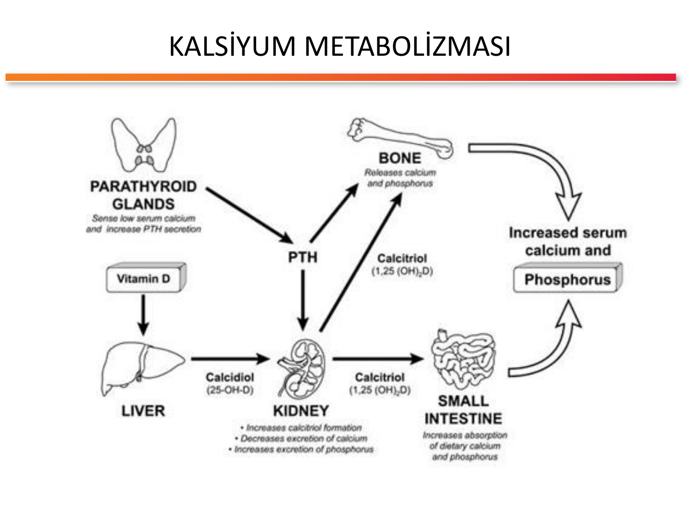

> **Şema yorumu:**
>
> **Parathyroid glands (Paratiroid bezleri):** Serum kalsiyumunda düşme algılayınca **PTH sekresyonunu artırırlar**.
>
> **Üç hedef organ üzerinden kalsiyum yükseltme:**
>
> * **Liver (Karaciğer):** D vitamininin ilk hidroksilasyonu burada gerçekleşir; 25-OH-D (kalsidiol) üretilir.
> * **Kidney (Böbrek):** PTH etkisiyle kalsiyum geri emilimi artar, fosfat atılımı artar; ayrıca **1-alfa hidroksilaz** enzimi aktiflenir ve **1,25(OH)₂D (kalsitriol)** üretilir.
> * **Small intestine (İnce bağırsak):** Kalsitriol etkisiyle **diyetle alınan Ca ve P emilimi artar**.
> * **Bone (Kemik):** PTH ve kalsitriol birlikte osteoklastik aktiviteyi artırır, **Ca ve P kemikten dolaşıma salınır**.
>
> Sonuç: **Serum kalsiyumu ve fosfor düzeyleri yükselir** (Increased serum calcium and Phosphorus).

---

## PARATHORMON (PTH)

> **Tanım:** Parathormon, paratiroid bezinin esas hücrelerinden (chief cells) salınan, **84 amino asitlik bir polipeptid hormondur**. Ana biyolojik amacı serum iyonize kalsiyumunu dar bir aralıkta tutmak ve düşen Ca düzeylerini yükseltmektir. Plazma yarı ömrü **2-4 dakika** kadar kısadır.

### PTH Genetiği ve Hücresel Regülasyon

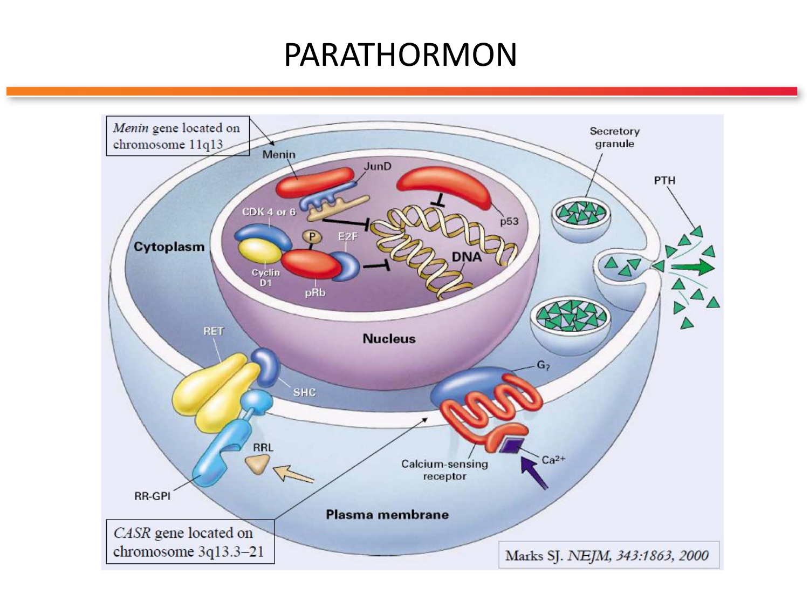

> **Şema yorumu:**
>
> Paratiroid esas hücresinin içindeki moleküler mekanizma gösterilmiştir:
>
> * **Menin geni 11q13 kromozomunda** bulunur; mutasyonu **MEN-1 (Multipl Endokrin Neoplazi Tip 1)** ile sonuçlanır.
> * **CASR (Kalsiyum duyarlı reseptör) geni 3q13.3-21** kromozomunda yer alır. Hücre zarında bulunan CaSR, ekstraselüler kalsiyumu "hisseden" G-protein bağlı reseptördür.
> * **Kalsiyum yükselince** CaSR aktifleşir, hücre içi sinyaller (fosfolipaz C, PKC) PTH sentez ve salınımını **baskılar**.
> * **Kalsiyum düşünce** CaSR inaktifleşir, nükleer transkripsiyon (PreProPTH mRNA) ve sekretuvar granüllerden **PTH salınımı artar**.
> * **CaSR mutasyonları:** İnaktive edici mutasyon → **Familial Hipokalsiürik Hiperkalsemi (FHH)**; aktive edici mutasyon → **otozomal dominant hipokalsemi**.

### PTH'nın Hedef Organ Etkileri

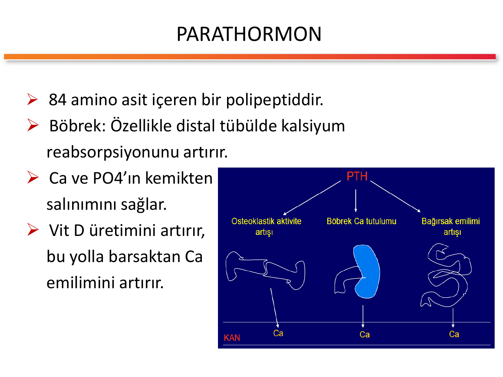

> **Şema yorumu:** PTH üç yolla serum kalsiyumunu yükseltir:
>
> * **Kemik:** **Osteoklastik aktivite artışı** → kemikten kana Ca²⁺ salınımı
> * **Böbrek:** Distal tübülde **Ca geri emiliminin artırılması** (Ca tutulumu) ve proksimal tübülde fosfat atılımının artması (fosfatüri)
> * **Bağırsak:** **Kalsitriol üzerinden dolaylı** olarak bağırsak Ca emiliminin artırılması

### PTH Etkilerinin Özeti

| Organ | PTH Etkisi | Sonuç |
|---|---|---|
| **Kemik** | Osteoklastik rezorpsiyon artar | Kan Ca↑, P↑ |
| **Böbrek -- distal tübül** | Ca geri emilimi artar | Ca tutulumu↑ |
| **Böbrek -- proksimal tübül** | Fosfat geri emilimi azalır | Fosfatüri, serum P↓ |
| **Böbrek** | 1-alfa hidroksilaz aktivasyonu | Kalsitriol üretimi↑ |
| **Bağırsak (dolaylı, kalsitriol üzerinden)** | Ca ve P emilimi artar | Kan Ca↑ |

### PTH Geri Besleme Döngüsü

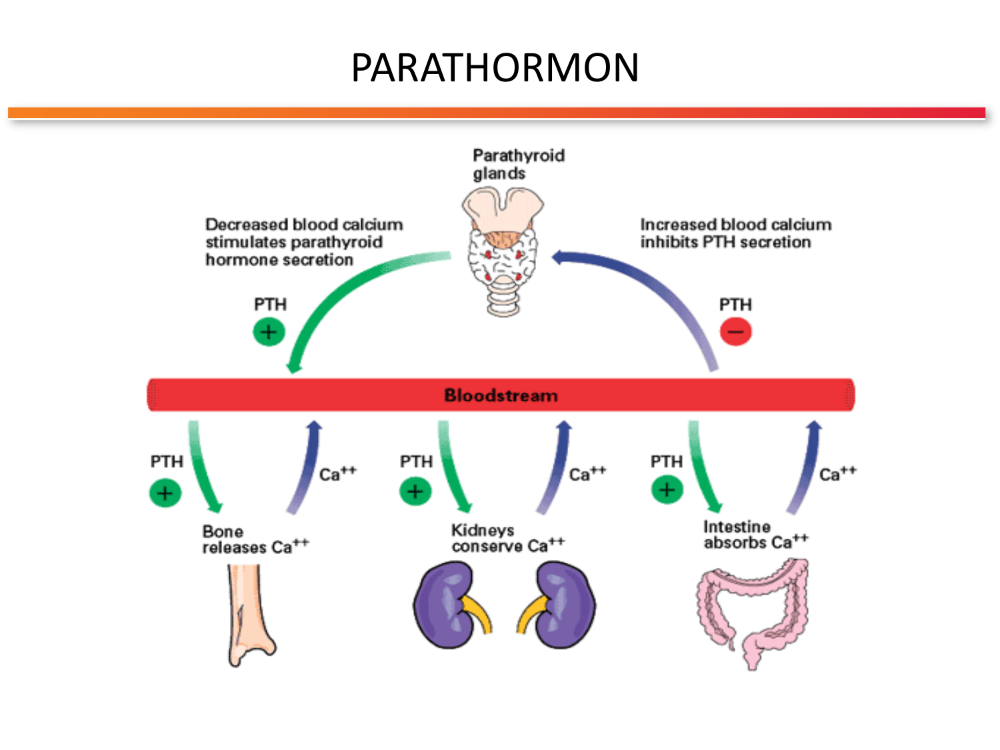

> **Şema yorumu:**
>
> **Sol taraf (kırmızı "+" yolak):** Kanda **kalsiyum düşünce (decreased blood calcium)** → paratiroid bezi **PTH salınımını artırır (+)** → kemikten Ca salınımı, böbrekte Ca tutulumu ve bağırsaktan Ca emilimi artar → serum kalsiyumu normale döner.
>
> **Sağ taraf (mavi "−" yolak):** Kanda **kalsiyum yükselince (increased blood calcium)** → paratiroid bezi **PTH salınımını baskılar (−)** → üç hedef organda Ca yükseltici etkiler azalır → serum kalsiyumu normal aralığa iner.
>
> Bu klasik bir **negatif geri besleme** döngüsüdür ve dakikalar içinde plazma Ca düzeyini dar aralıkta (8.5-10.5 mg/dL) tutar.

### PTH ve PTHrP (PTH-İlişkili Peptid)

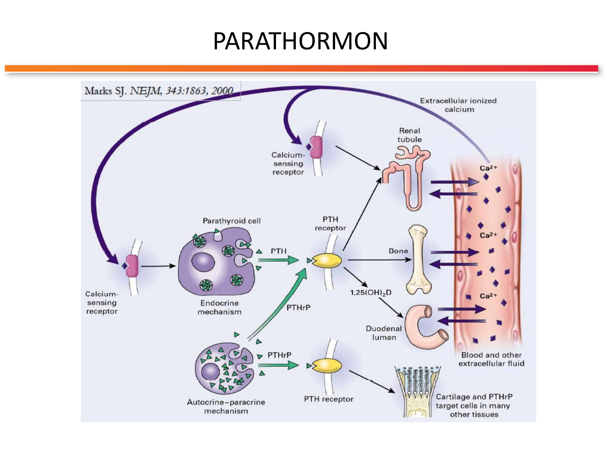

> **Şema yorumu:**
>
> **İki ayrı mekanizma gösterilmiştir:**
>
> * **Endokrin mekanizma:** Paratiroid bezi (parathyroid cell), ekstraselüler iyonize kalsiyumu CaSR ile algılar ve **PTH** salar. PTH, **böbrek tübülü (renal tubule), kemik (bone, 1,25(OH)₂D aktivasyonu) ve duodenum lümeni (Ca emilimi)** üzerine etki ederek kalsiyumu yükseltir.
> * **Otokrin-parakrin mekanizma:** Başta **kıkırdak (cartilage) ve pek çok dokuda** **PTHrP (PTH-related peptide)** üretilir; kendi PTH reseptörüne (PTH1R) bağlanarak yerel etki yapar. **PTHrP, maligniteye bağlı hiperkalseminin (humoral hiperkalsemi) ana aracısıdır.**

### PTH Salınımının Düzenleyicileri

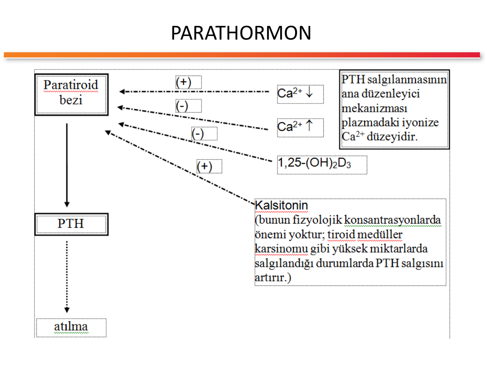

> **Şema yorumu:** PTH salınımının ana düzenleyicileri:
>
> * **İyonize Ca²⁺ ↑** → PTH salınımı **baskılanır (−)**
> * **İyonize Ca²⁺ ↓** → PTH salınımı **artar (+)**
> * **1,25(OH)₂D₃ (kalsitriol) ↑** → PTH gen ekspresyonu **baskılanır (−)** (uzun dönem kontrol)
> * **Kalsitonin:** Fizyolojik konsantrasyonlarda önemi yoktur; ancak **tiroid medüller karsinomu** gibi yüksek düzeylerde **PTH salgısını uyarabilir (+)**.

---

## D VİTAMİNİ METABOLİZMASI

> **Tanım:** D vitamini yağda çözünen bir prohormondur; karaciğer ve böbrekte iki basamaklı hidroksilasyonla aktif formu **1,25(OH)₂D (kalsitriol)** haline gelir. Ana görevi bağırsaktan **Ca ve P emilimini artırmak**, kemik mineralizasyonunu desteklemek ve PTH üzerinde negatif geri besleme sağlamaktır.

**D vitamini yolağı:**

1. **Cilt:** UV-B ışığı etkisiyle 7-dehidrokolesterol → **kolekalsiferol (D₃)**
2. **Karaciğer:** 25-hidroksilaz → **25-OH-D (kalsidiol)** -- vücut deposunu yansıtan ölçüm
3. **Böbrek:** **1-alfa hidroksilaz (PTH ile uyarılır)** → **1,25(OH)₂D (kalsitriol) -- aktif form**

**Kalsitriolün etkileri:**

* Bağırsakta Ca ve P emilimini artırır (temel etki)
* Kemikte osteoblastları uyarır
* PTH gen ekspresyonunu baskılar (uzun dönem negatif geri besleme)

---

## HİPOPARATİROİDİZM

> **Tanım:** Paratiroid bezinin yeterli PTH üretememesi ve buna bağlı gelişen **hipokalsemi, hiperfosfatemi** tablosudur. Düşük veya uygunsuz düşük-normal PTH düzeyi ile karakterizedir.

**Biyokimyasal triad:**

* **Hipokalsemi** (Ca ↓)
* **Hiperfosfatemi** (P ↑)
* **Düşük PTH düzeyi**

### Etyoloji

* **Cerrahi (en sık neden):** Özellikle tiroid/paratiroid ameliyatları sonrası paratiroid bezlerinin çıkarılması, devaskülarizasyonu veya hasarlanması
* **Otoimmünite:** İzole otoimmün hipoparatiroidizm veya **APS-1 (Otoimmün Poliendokrin Sendrom Tip 1)** çerçevesinde (hipoparatiroidizm + mukokutanöz kandidiyaz + Addison hastalığı)
* **Radyasyon, metastaz** (nadir infiltratif nedenler)
* **Genetik:** DiGeorge sendromu (22q11 delesyonu -- paratiroid agenezisi, timus hipoplazisi, konotrunkal kalp anomalileri), otozomal dominant hipokalsemi (aktive edici CaSR mutasyonu)
* **Magnezyum eksikliği (ağır):** Hem PTH salınımını baskılar hem de PTH direnci yapar -- Mg düzelmeden hipokalsemi düzelmez
* **İnfiltratif hastalıklar:** Wilson hastalığı, hemokromatoz, talasemi (demir birikimi)

### Postoperatif Hipoparatiroidizm

* **Total tiroidektomi sonrası %10 oranında geçici hipoparatiroidizm** görülebilir.
* **Kalıcı hipoparatiroidizm** tanımı: **Operasyondan 6 ay sonra hipoparatiroidizmin devam etmesi**.

> **⚠️ ÖNEMLİ:**
>
> * Cerrahi en sık hipoparatiroidizm nedenidir. Geçici tablo sık olsa da 6. ay sonunda Ca replasmanı hâlâ gerekiyorsa "kalıcı" olarak sınıflanır.
> * Tiroidektomi sonrası ilk 24-72 saatte hastanın **Chvostek/Trousseau belirtisi** ve serum Ca takibi mutlaka yapılmalıdır.

---

## HİPOKALSEMİ KLİNİK BULGULARI

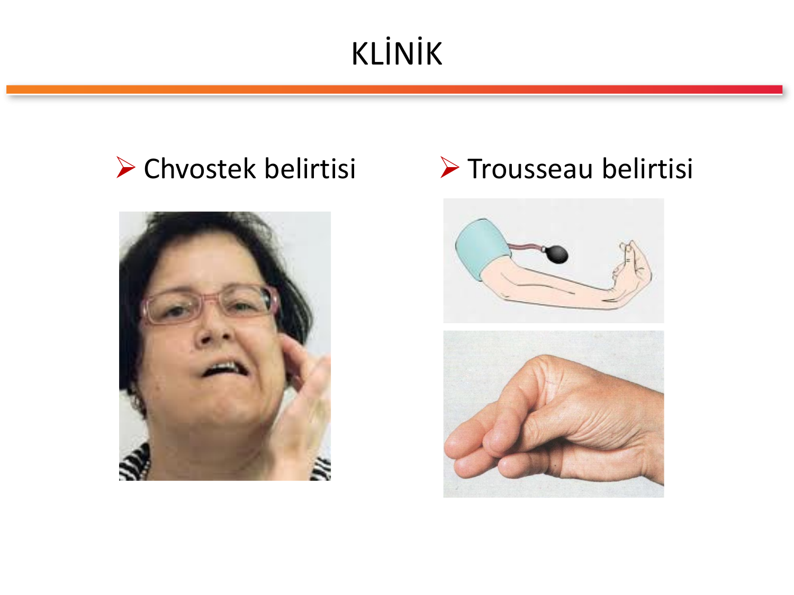

> **Şema yorumu:**
>
> * **Sol panel (Chvostek belirtisi):** Kulak tragusunun 2 cm önünde, zigomatik arkın altında **fasial sinir trasesine parmak ucuyla vurulur**. Pozitif yanıtta aynı taraf **ağız köşesi, burun kanadı veya göz kapağında kasılma** izlenir. Hipokalsemide nöromüsküler eksitabilitenin arttığını gösterir. **Sağlıklı popülasyonun %10-30'unda yanlış pozitif olabilir.**
> * **Sağ panel (Trousseau belirtisi):** Kola tansiyon manşonu takılır, sistolik TA'nın 20 mmHg üzerinde şişirilir ve **3 dakika bekletilir**. Pozitif yanıtta el ve bilekte **karpopedal spazm** ("ebe eli" -- metakarpofalangeal fleksiyon, interfalangeal ekstansiyon, başparmak addüksiyonu) gelişir. **Chvostek'e göre daha spesifiktir.**

### Hipokalsemi Semptom ve Bulguları

**Nöromüsküler (parestezi-tetani-spektrumu):**

* El ve ayaklarda uyuşma, karıncalanma (özellikle perioral, parmak uçları)
* **Karpopedal spazm** (ebe eli)
* **Tetani, laringeal spazm, bronkospazm**
* **Chvostek belirtisi** (fasial sinir perküsyonuyla kasılma)
* **Trousseau belirtisi** (manşet sonrası karpopedal spazm)

**Santral sinir sistemi:**

* Konfüzyon, irritabilite, depresyon
* **Deliryum, konvülsiyonlar**
* Bazal gangliyon kalsifikasyonu (kronik vakalarda)
* **Subkapsüler katarakt** (uzun süreli hipokalsemide)

**Kardiyovasküler:**

* **Uzamış QT mesafesi** (EKG bulgusu)
* Aritmiler, torsades de pointes
* Konjestif kalp yetmezliği (kronik ağır hipokalsemide)

**Diğer:**

* Diş anomalileri (minesi zayıf dişler, gecikmiş çıkarma -- özellikle çocukluk çağı başlangıçlı)
* Kuru cilt, kırılgan tırnak

> **💡 Klinik ipucu:** Tiroidektomi sonrası hastada ağız çevresinde karıncalanma veya elinde kasılma şikayeti hipokalseminin **erken ve güvenilir belirtisidir** -- ameliyat sonrası gün içinde mutlaka sorulmalıdır.

---

## HİPOPARATİROİDİZM TEDAVİSİ

### Akut (Semptomatik) Hipokalsemi Tedavisi

> **⚠️ ACİL TEDAVİ ENDİKASYONU:** Tetani, laringospazm, konvülsiyon, uzamış QT, semptomatik hipokalsemi veya Ca <7.0 mg/dL.

**Kalsiyum glukonat (%10, 10 mL ampul = 90 mg elementer Ca):**

* **Bolus:** 1-2 ampul, **10-15 dakikada** intravenöz (100-200 mL %5 dekstroz içinde)
* **Etki süresi:** 2-3 saat
* **İdame infüzyon:** **0.5-3 mg/kg/saat** elementer Ca

> **⚠️ Dikkat:** Kalsiyum klorür periferik damardan verildiğinde ciddi doku nekrozu yapar -- ekstravazasyon riski nedeniyle **kalsiyum glukonat tercih edilir**. Digital (digoksin) alan hastada IV Ca infüzyonu dikkatle yapılmalı (ani iyonize Ca yükselmesi digital toksisitesini artırır).

### Kronik Tedavi

**Oral kalsiyum:**
* Kalsiyum karbonat veya kalsiyum sitrat, **1-3 g/gün elementer Ca**, bölünmüş dozlarda, yemekle

**D vitamini:**
* **Kolekalsiferol (D₃):** 10.000-50.000 IU/gün (yüksek doz standart D vitamini)
* **Kalsitriol (1,25-(OH)₂D):** 0.5-2 µg/gün -- böbrek aktivasyonu atlanır, hızlı etkili
* **Alfakalsidiol (1α-(OH)D):** 0.5-2 µg/gün -- karaciğerde 25-hidroksilasyonla aktive olur

**Hedef serum kalsiyumu: 8-9 mg/dL (düşük-normal aralık)**

> Normal-üst sınıra yaklaşıldığında **hiperkalsiüri ve nefrokalsinozis riski** artar; bu nedenle hedef üst sınıra zorlanmamalıdır.

**Magnezyum düzeyi <1.8 mg/dL ise mutlaka replase edilmelidir.** Mg eksikliği hem PTH salınımını baskılar hem de hedef dokularda PTH direnci oluşturur -- Mg düzelmeden hipokalsemi kalıcı olarak düzelmez.

### PTH Replasmanı (Yenilikçi Tedavi)

* **rhPTH(1-84):** Rekombinant insan parathormonu, günlük subkutan enjeksiyon. Kronik hipoparatiroidizmde Ca ve D vitamini ihtiyacını azaltan onaylı tedavi.
* **Teriparatid [PTH(1-34)]:** Ağırlıklı olarak osteoporoz için kullanılır; hipoparatiroidizmde off-label kullanım olabilir.

### Komplikasyonlar ve Uzun Dönem İzlem

* **Hiperkalsiüri:** Tedavi sırasında idrar Ca artar; 24 saatlik idrar kalsiyumu **yılda 1-2 kez** izlenmeli.
* **Nefrolitiyazis, nefrokalsinozis**
* **Böbrek yetmezliği:** Uzun dönemde progresif KBH
* **Bazal gangliyon kalsifikasyonu:** Fahr sendromu benzeri tablo
* **Katarakt:** Subkapsüler, bilateral

---

## PSÖDOHİPOPARATİROİDİZM

> **Tanım:** PTH salınımı normal veya artmış olmasına rağmen hedef dokularda (böbrek, kemik) **PTH direnci** nedeniyle gelişen, biyokimyasal olarak hipoparatiroidizmi taklit eden herediter hastalık grubudur.

### Biyokimyasal Bulgular

* Hipokalsemi
* Hiperfosfatemi
* **PTH düzeyi yüksek** (hipoparatiroidizmden farklı olarak)
* İdrarla cAMP atılımı normalde PTH'a yanıt olarak artar, pseudohypoparatiroidizmde bu yanıt bozulmuştur.

### Sınıflama

| Tip | Mekanizma | AHO Fenotipi | İmprinting |
|---|---|---|---|
| **Tip 1A** | GNAS geni mutasyonu (α-subunit), anneden kalıtılır | **Var (AHO)** | Maternal |
| **Tip 1B** | GNAS metilasyon defekti (PTH hedef doku spesifik) | Yok | Maternal |
| **Tip 1C** | Gs-α fonksiyon kaybı, reseptör düzeyinde | Var | Değişken |
| **Tip 2** | Reseptör sonrası cAMP yolağı intakt ancak Ca mobilizasyonu bozuk | Yok | - |

### Albright Herediter Osteodistrofi (AHO -- Tip 1A)

**Klinik bulgular:**

* **Kısa boy**
* **Yuvarlak yüz**
* **Obezite**
* **Kısa metakarp ve metatarslar** (özellikle 4. ve 5. parmaklar -- yumruk yapıldığında o parmakların eklemi belirsiz kalır, "Archibald belirtisi")
* **Mental retardasyon**
* **Subkutan kalsifikasyonlar / ossifikasyonlar**
* Diğer hormon dirençleri (TSH, gonadotropinler, GHRH -- GNAS baba tarafından gelirse "pseudo-pseudohypoparathyroidism" tablosuyla fenotip var ama PTH direnci yok)

### Ellsworth-Howard Testi

* Amaç: PTH'a böbrek yanıtını ölçmek
* Yöntem: IV PTH verilir, **idrarla cAMP ve fosfat atılımı** ölçülür.
* **Pseudohypoparathyroidismde** PTH'a cAMP ve fosfatüri yanıtı **azalmıştır** (Tip 1 hastalıkta cAMP yanıtı yok, Tip 2'de cAMP var ama fosfatüri yok).

---

## HİPERKALSEMİ

> **Tanım:** Plazma kalsiyum konsantrasyonu ölçümün yapılacağı laboratuvarın normal aralığının **üst sınırından 0.1 mg/dL fazla** olmasıdır. Pratik olarak düzeltilmiş Ca > 10.5 mg/dL kabul edilir.

### Serum Kalsiyum Düzeylerine Göre Sınıflama

| Düzey | Ca (mg/dL) | Klinik |
|---|---|---|
| **Normal** | 8.5 -- 10.5 | - |
| **Hafif hiperkalsemi** | 10.5 -- 12 | Genellikle asemptomatik |
| **Orta hiperkalsemi** | 12 -- 15 | Semptomatik olabilir |
| **Ağır hiperkalsemi** | > 15 | **Hiperkalsemik kriz** |

> Kaynak: TEMD Metabolik Kemik Hastalıkları Tanı ve Tedavi Kılavuzu.

---

## HİPERKALSEMİ SEMPTOM VE BULGULARI

Klinik tablo klasik olarak **"stones, bones, abdominal groans, psychic moans"** (taşlar, kemikler, karın ağrıları, ruhsal inlemeler) cümlesiyle özetlenir.

### Sistem Bazlı Bulgular

| Sistem | Bulgular |
|---|---|
| **Nörolojik** | Kas güçsüzlüğü, halsizlik, baş ağrısı, letarji, konfüzyon, stupor, **koma** |
| **Gastrointestinal** | Kabızlık, iştahsızlık, bulantı, kusma, karın ağrısı, **pankreatit, peptik ülser** |
| **Renal** | **Aşırı susuzluk (polidipsi), poliüri**, **nefrolitiyazis, nefrokalsinozis**, böbrek yetmezliği |
| **Kardiyovasküler** | Aritmi, bradikardi, hipertansiyon, **QT intervalinde kısalma**, kardiyak arrest, venöz tromboz |
| **İskelet sistemi** | Kemik ağrıları, artralji, osteoporoz, **osteitis fibrosa cystica**, patolojik kırık |

> **⚠️ EKG İpucu:** Hipokalsemi uzun QT yapar, **hiperkalsemi ise QT'yi kısaltır**. Digoksin alan hastada hiperkalsemi digital toksisitesini artırır.

> **💡 Klinik ipucu:** Poliüri-polidipsi ayırıcı tanısında **hiperkalsemi mutlaka dışlanmalıdır** (nefrojenik diabetes insipidus benzeri tablo yapar: Ca, ADH'nin distal tübüldeki etkisini antagonize eder).

---

## HİPERKALSEMİ NEDENLERİ

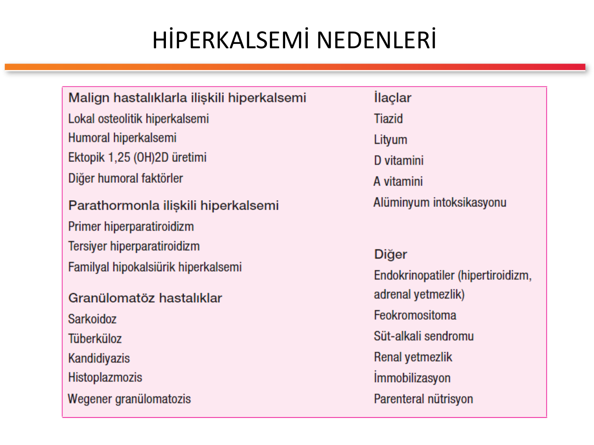

> **Şema yorumu:** Görselde hiperkalsemi nedenleri beş ana grupta özetlenmiştir.

### Etyolojik Tablo

| Grup | Nedenler |
|---|---|
| **Malign hastalıklarla ilişkili hiperkalsemi** | 
Lokal osteolitik hiperkalsemi (kemik metastazları)

Humoral hiperkalsemi (PTHrP aracılı -- skuamoz hücreli akciğer, böbrek, baş-boyun)

Ektopik 1,25(OH)₂D üretimi (lenfoma)

Diğer humoral faktörler
 |
| **Parathormonla ilişkili hiperkalsemi** | 
Primer hiperparatiroidizm

Tersiyer hiperparatiroidizm

Familial hipokalsiürik hiperkalsemi (FHH)
 |
| **Granülomatöz hastalıklar** | 
Sarkoidoz

Tüberküloz

Kandidiyazis

Histoplazmozis

Wegener granülomatozu
 |
| **İlaçlar** | 
**Tiyazid diüretikler** (idrar Ca atılımını azaltır)

**Lityum** (CaSR set-point'ini yükseltir)

**D vitamini intoksikasyonu**

**A vitamini** (yüksek doz)

Alüminyum intoksikasyonu
 |
| **Diğer** | 
Endokrinopatiler (hipertiroidizm, adrenal yetmezlik, feokromositoma)

**Süt-alkali sendromu** (antasid, kalsiyum)

Renal yetmezlik

İmmobilizasyon

Parenteral nütrisyon
 |

### Sıklık

> **⭐ ÖNEMLİ:**
>
> **Primer hiperparatiroidizm ve malign hastalıklara bağlı hiperkalsemi**, tüm hiperkalsemi olgularının **%90'dan fazlasını** teşkil eder.
>
> * **Hastanede yatan, klinik olarak ağır hastalarda:** en sık neden **malign hastalıklar**
> * **Poliklinik hastalarında:** en sık neden **primer hiperparatiroidizm** (genellikle asemptomatik, rutin biyokimyada yakalanır)

---

## HİPERKALSEMİ AYIRICI TANI

Hiperkalseminin ayırıcı tanısında **ilk ve en kritik adım PTH ölçümüdür.** PTH düzeyine göre iki ana kolon oluşur.

### PTH ↑ (Yüksek veya Uygunsuz Normal)

* **Primer hiperparatiroidizm** (en sık)
* **Tersiyer hiperparatiroidizm** (uzun süreli sekonder HPT sonrası paratiroid otonomisi -- KBH)
* **Familial hipokalsiürik hiperkalsemi (FHH)**

### PTH ↓ (Baskılı)

* Malign hastalıklar (PTHrP, osteolitik metastaz, kalsitriol-ektopik)
* Granülomatöz hastalıklar
* İlaçlar
* Vitamin D / A intoksikasyonu
* Endokrinopatiler (hipertiroidi)
* Süt-alkali sendromu, immobilizasyon

### Familial Hipokalsiürik Hiperkalsemi (FHH)

> **Tanım:** CaSR geninin **inaktive edici mutasyonu** sonucu paratiroid bezinin yüksek Ca düzeyini "normal" olarak algıladığı, otozomal dominant geçişli benign bir durumdur. Primer hiperparatiroidizmle karışır ama **cerrahi gerektirmez.**

**Biyokimyasal bulgular:**

* **Kalsiyum:** Yüksek (genellikle hafif)
* **PTH:** Normal ya da hafif yüksek
* **İdrar kalsiyum atılımı:** **< 100 mg/gün** (düşük)
* **24 saatlik idrarda Ca/Kreatinin klirensi oranı < 0.01**

> **Ca/Kr klirens oranı formülü:**
>
> **Ca/Kr klirensi = (idrar Ca / plazma Ca) × (plazma Kr / idrar Kr)**

* **Genetik tanı:** CASR gen mutasyonu ile doğrulanır.

**Ayırıcı değer:** FHH'de paratiroid cerrahisi kalsiyum düzeyini düzeltmez, gereksiz cerrahi yapılmamalıdır.

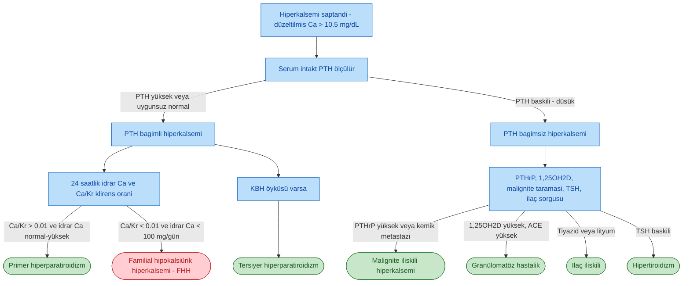
```mermaid
flowchart TD
    A[Hiperkalsemi saptandi - düzeltilmis Ca > 10.5 mg/dL] --> B[Serum intakt PTH ölçülür]
    B -->|PTH yüksek veya uygunsuz normal| C[PTH bagimli hiperkalsemi]
    B -->|PTH baskili - düsük| D[PTH bagimsiz hiperkalsemi]
    C --> E[24 saatlik idrar Ca ve Ca/Kr klirens orani]
    E -->|Ca/Kr > 0.01 ve idrar Ca normal-yüksek| F([Primer hiperparatiroidizm])
    E -->|Ca/Kr < 0.01 ve idrar Ca < 100 mg/gün| G([Familial hipokalsiürik hiperkalsemi - FHH])
    C --> H[KBH öyküsü varsa] --> I([Tersiyer hiperparatiroidizm])
    D --> J[PTHrP, 1,25OH2D, malignite taramasi, TSH, ilaç sorgusu]
    J -->|PTHrP yüksek veya kemik metastazi| K([Malignite iliskili hiperkalsemi])
    J -->|1,25OH2D yüksek, ACE yüksek| L([Granülomatöz hastalik])
    J -->|Tiyazid veya lityum| M([Ilaç iliskili])
    J -->|TSH baskili| N([Hipertiroidizm])

    classDef diagnose fill:#c8e6c9,stroke:#2e7d32,color:#1b5e20
    classDef exclude fill:#ffcdd2,stroke:#c62828,color:#b71c1c
    classDef test fill:#bbdefb,stroke:#1565c0,color:#0d47a1
    class F,I,K,L,M,N diagnose
    class G exclude
    class A,B,C,D,E,H,J test
```

---

## PRİMER HİPERPARATİROİDİZM

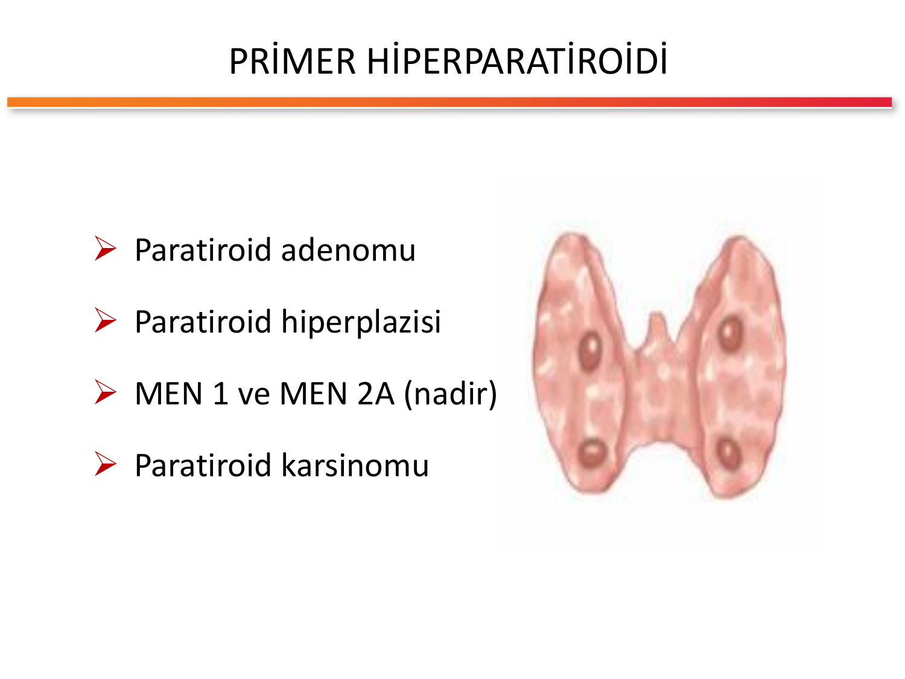

> **Şema yorumu:** Tiroid bezinin arka yüzüne yerleşmiş **4 adet paratiroid bezi** (2 üst, 2 alt) gösterilmiştir. Ektopik lokalizasyonlar (timus, mediasten, karotis kılıfı) nadiren görülür ve cerrahide zorluk çıkarabilir.

### Etyoloji

| Neden | Sıklık |
|---|---|
| **Paratiroid adenomu** (tek bez) | **%85** |
| **Paratiroid hiperplazisi** (4 bez) | %10-15 |
| **MEN-1 ve MEN-2A** (nadir; hiperplazi) | < %5 |
| **Paratiroid karsinomu** (nadir) | < %1 |

**Sendromik formlar:**

* **MEN-1 (Werner):** Paratiroid hiperplazisi + enteropankreatik tümörler (gastrinoma, insülinoma) + hipofiz adenomu. MEN1 geni (11q13, menin).
* **MEN-2A (Sipple):** Paratiroid hiperplazisi + medüller tiroid karsinomu + feokromositoma. RET protoonkogeni mutasyonu.
* **HPT-JT sendromu (Hiperparatiroidizm-jaw tümör):** CDC73/HRPT2 mutasyonu -- karsinom riski yüksek.

---

## PRİMER HİPERPARATİROİDİZM KLİNİK

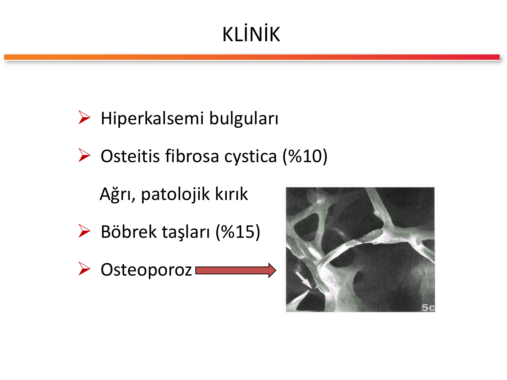

> **Şema yorumu:** Görselde ağır primer hiperparatiroidizmde görülen klasik kemik bulgusu **osteitis fibrosa cystica** izlenmektedir: osteoklastik rezorpsiyon nedeniyle kortikal incelme, medüller kaviteler ve fibröz doku ile dolu kistik alanlar.

### Klinik Bulgular

* **Çoğu hasta asemptomatiktir** (günümüzde rutin Ca ölçümü ile saptanır, "asymptomatic primary hyperparathyroidism")
* **Hiperkalsemi bulguları** (yukarıda)
* **Osteitis fibrosa cystica (%10):** Ağrı, **patolojik kırık**, "Brown tümörler" (osteoklast birikimi + kanama → kahverengi görünüm)
* **Böbrek taşları (%15):** Kalsiyum oksalat/fosfat taşları; nefrokalsinozis
* **Osteoporoz:** Özellikle **kortikal kemik** tutulur (distal ön kol, kalça); trabeküler kemik görece korunur
* **Peptik ülser, pankreatit** (hiperkalseminin gastrik asit ve tripsinojen aktivasyonu etkisi)
* **Nöropsikiyatrik bulgular:** Depresyon, yorgunluk, konsantrasyon güçlüğü, hafıza zayıflaması
* Eklem şikayetleri (kondrokalsinozis/pseudogut)

---

## RADYOLOJİK VE KEMİK BULGULARI

### El Falankslarında Subperiostal Rezorpsiyon

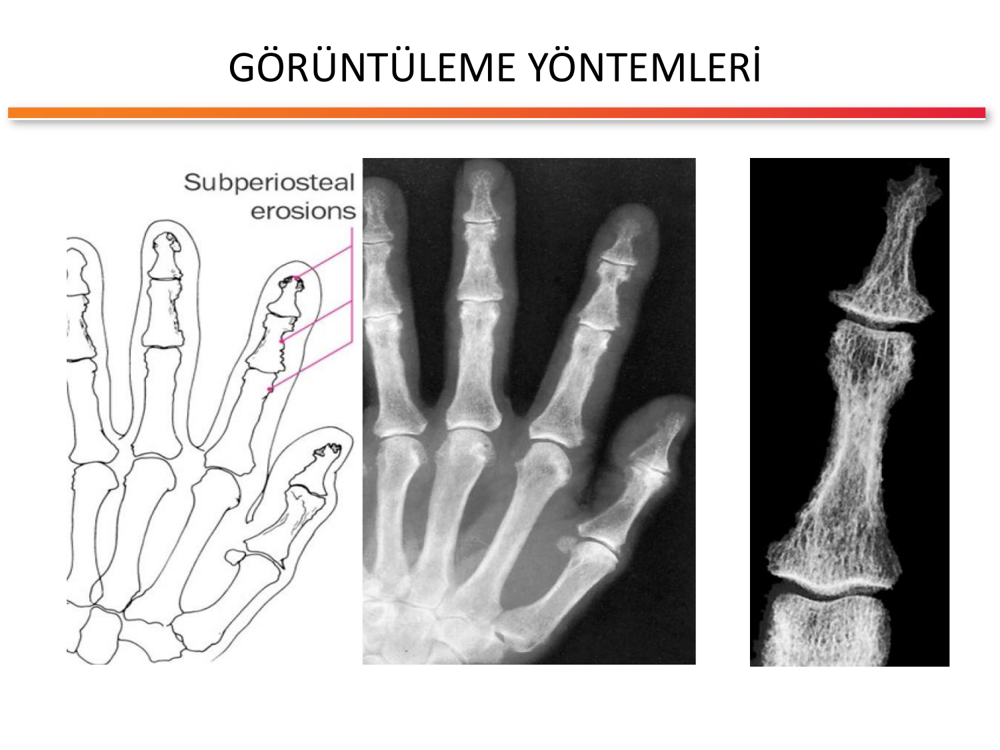

> **Şema yorumu:**
>
> Sol şematik çizimde el falankslarının **radiyal (başparmak tarafı) yüzünde subperiostal erozyonlar** (subperiosteal erosions) gösterilmiştir. Orta ve sağ radyografide **orta falanksların kortikal kenarları düzensiz ve incelmiş** olarak izlenir -- bu primer hiperparatiroidizmin patognomonik radyolojik bulgusudur. Klasik lokalizasyon **2. ve 3. parmağın orta falanksının radial yüzüdür.**

### Kafa Grafisinde Tuz-Biber Görünümü

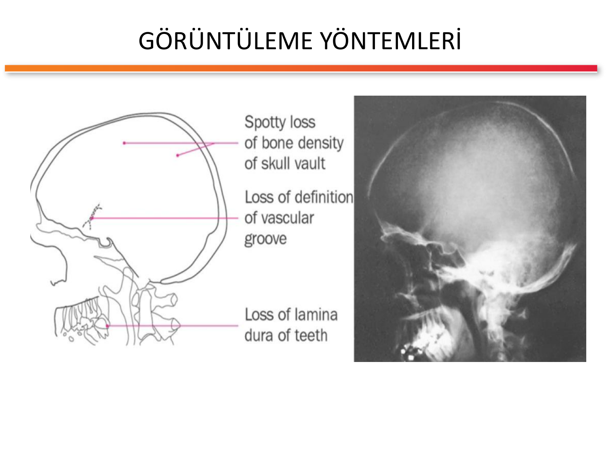

> **Şema yorumu:**
>
> Lateral kafa grafisinde üç bulgu dikkat çeker:
>
> * **Spotty loss of bone density of skull vault (Kafatası kubbesinde noktasal kemik dansite kaybı):** Klasik **"tuz-biber (salt-and-pepper) görünümü"** -- küçük osteolitik odaklar kafatası tabanında yaygındır.
> * **Loss of definition of vascular groove (Vasküler oyukların sınır kaybı):** Meningeal arter oyuklarının keskinliğinin kaybolması
> * **Loss of lamina dura of teeth (Dişlerin lamina durasının kaybı):** Diş köklerini çevreleyen kortikal çizginin silinmesi -- erken ve güvenilir bir bulgudur.

### Kistler ve Brown Tümörler

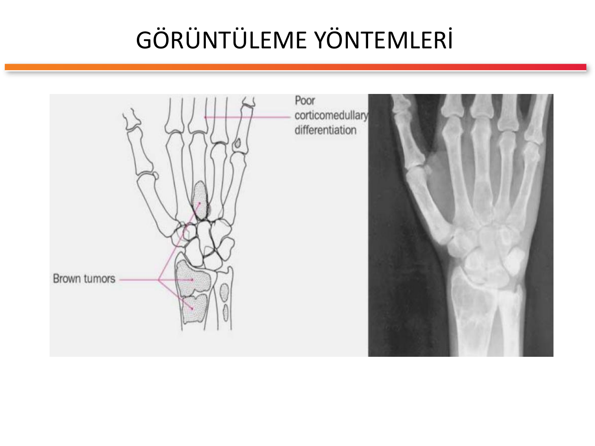

> **Şema yorumu:**
>
> * **Poor corticomedullary differentiation (Zayıf kortiko-medüller ayrım):** Trabeküler yapının silinmesi, kemik dansitesinin genel azalması
> * **Brown tumors (Kahverengi tümörler):** Osteoklastik dev hücre birikimi + hemosiderin nedeniyle makroskopik olarak kahverengi görünen, **osteolitik ekspansil lezyonlar**. Malign görünüme rağmen benigndir; PTH normale dönünce regrese olur.

### Osteitis Fibrosa Cystica

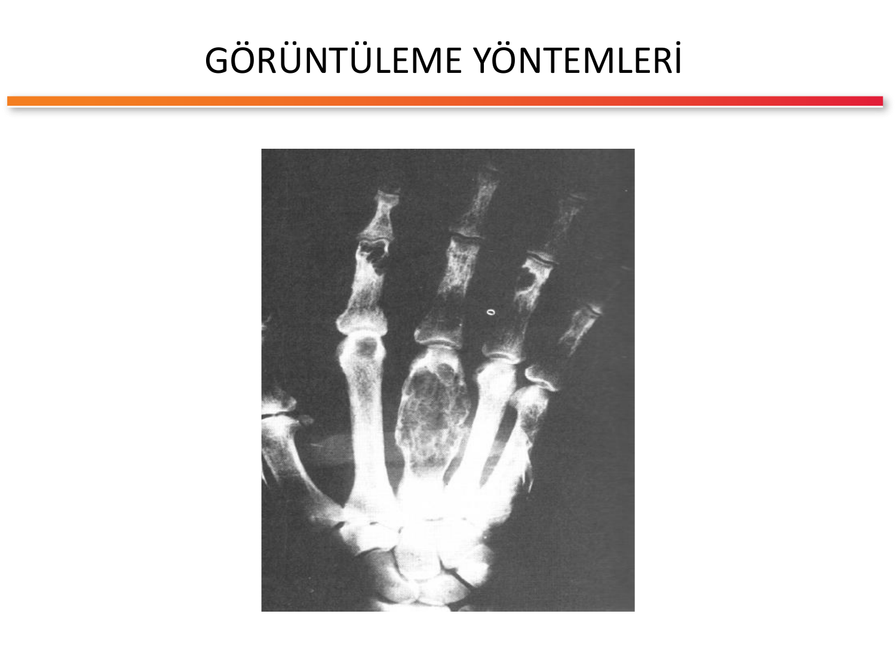

> **Şema yorumu:** El radyografisinde falankslar ve karpal kemiklerde **çok sayıda osteolitik lezyon (Brown tümörler)**, kortikal incelme ve patolojik kırık riski gösteren yaygın **osteitis fibrosa cystica** tablosu izlenmektedir. Günümüzde Batı ülkelerinde nadir görülür, ancak gelişmekte olan ülkelerde hâlâ karşımıza çıkabilir.

### Radyolojik Bulgular Özeti

* **Kortikal kemiğin subperiostal rezorpsiyonu** (özellikle **falanks** radial yüzü)
* **Tuz-biber görünümü** (kafa grafisi)
* **Osteolitik lezyonlar** (kistler, **Brown tümörler**)
* **Dişlerde lamina dura kaybı**

### Kemik Dansitometri (DEXA)

* **T skoru < -2.5:** Osteoporoz -- cerrahi endikasyonu
* Primer HPT'de özellikle **distal 1/3 radius (kortikal kemik)** en erken ve en belirgin tutulan bölgedir; DEXA ölçümüne **mutlaka ön kol da eklenmelidir.**

---

## LABORATUVAR

**Primer hiperparatiroidizmin klasik biyokimyası:**

* **Ca ↑**
* **P ↓** (fosfatüri nedeniyle)
* **PTH ↑**
* **İdrar Ca atılımı ↑**
* Hafif hiperkloremik metabolik asidoz (Cl/P oranı > 33 olabilir)
* ALP (kemik tutulumunda) ↑
* **Kemik yapım ve yıkım belirteçleri artmıştır** (osteokalsin, P1NP, CTX)
* 25-OH-D: Sıklıkla düşük (HPT hastalarında eş zamanlı vitamin D eksikliği sık)

> **⭐ ÖNEMLİ:**
>
> **Hiperkalsemi varlığında yüksek veya yüksek-normal PTH düzeyi tanı koydurucudur!**
>
> Normalde yüksek Ca, PTH'yı baskılamalıdır; yüksek Ca'ya rağmen PTH'nın normal kalması veya yükselmesi **uygunsuz PTH salınımını** gösterir ve primer hiperparatiroidizm tanısını koydurur.

---

## LOKALİZASYON YÖNTEMLERİ

Primer HPT **tanısı biyokimyasaldır**; görüntüleme yalnızca **cerrahi öncesi lokalizasyon** amacıyla yapılır. Adenom odağının bulunması minimal invaziv cerrahi (odaklı paratiroidektomi) yapılmasına olanak tanır.

### Paratiroid USG

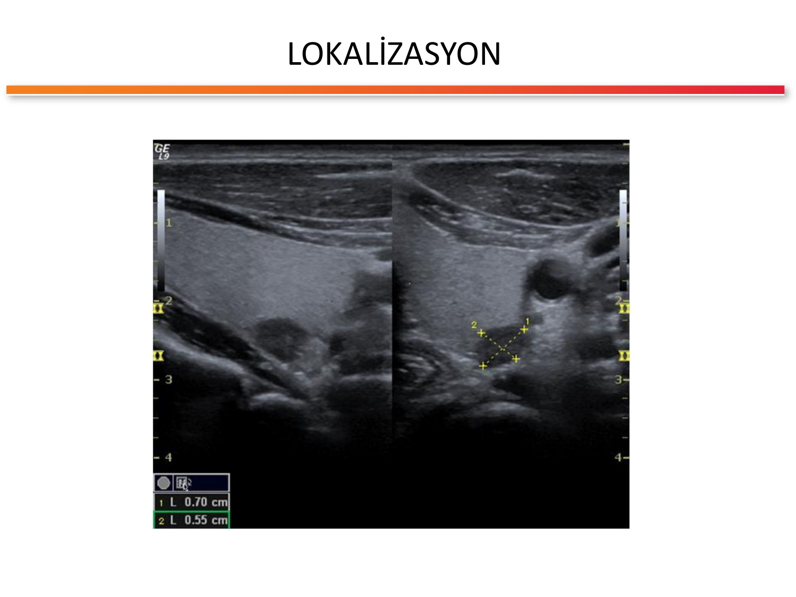

> **Şema yorumu:** Yüksek frekanslı (7.5-15 MHz) yüzeyel prob ile yapılır. Paratiroid adenomları tipik olarak **tiroid lobunun alt/orta posterior kesimine komşu**, **oval, hipoekoik (tiroidden daha koyu), iyi sınırlı, vasküler bir "polar feeding artery"** ile beslenir. Avantajlar: Radyasyonsuz, ucuz, yatak başı. Dezavantaj: **operator bağımlı**, derin/ektopik (mediasten) yerleşimde yetersiz.

### MIBI Sintigrafisi (Tc-99m Sestamibi)

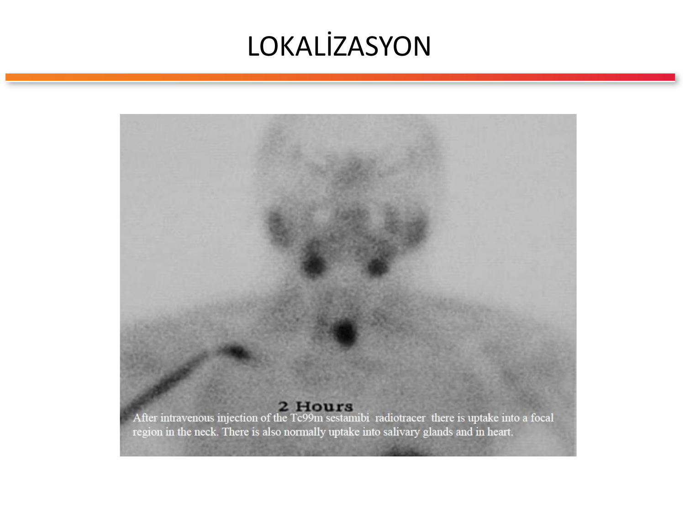

> **Şema yorumu:**
>
> **2 saat gecikmiş (geç faz) görüntü:** Tc-99m sestamibi başlangıçta hem tiroid hem paratiroid hücreleri tarafından tutulur; ancak **mitokondriden zengin paratiroid adenom hücrelerinde radyofarmasötik daha uzun kalır.** Geç fazda tiroidden yıkanırken adenomda tutulum kalmaya devam eder ve fokal odak olarak izlenir. Görselde boyun bölgesinde sağda **fokal persistent uptake** izlenmektedir (paratiroid adenomu). Ayrıca parotis/submandibular tükürük bezleri ve kalpte normal biofiziksel tutulum vardır.

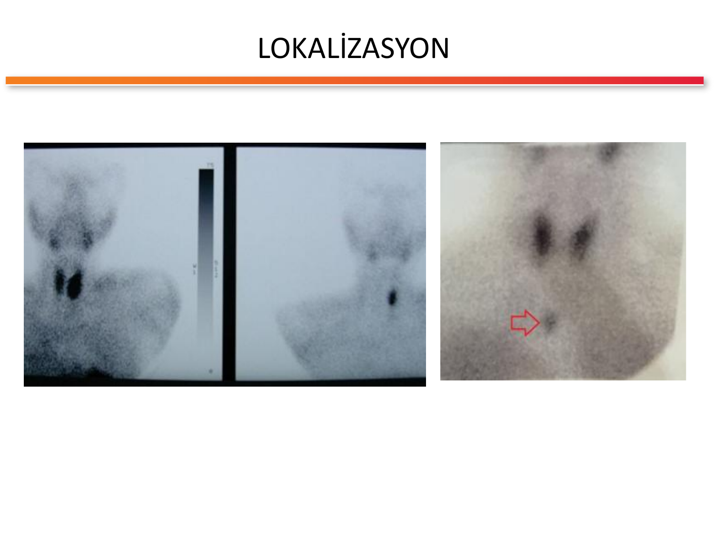

> **Şema yorumu:** Sol ikili görüntüde erken (tiroid dominant) ve geç (adenom dominant) fazlar karşılaştırılmıştır. Sağ büyütmede **ok ile işaretli fokal adenom odağı** gösterilmektedir. **SPECT/CT eklendiğinde sensitivite ve anatomik lokalizasyon doğruluğu artar.**

### MR ve 4D-CT

* **MR:** Boyun ve üst mediasten için kullanılır. T2 ağırlıklı kesitlerde paratiroid adenomu **hiperintens** izlenir. Özellikle **ektopik/mediastinal yerleşim, rekürren hastalık** ve USG/MIBI çelişkili vakalarda tamamlayıcıdır.
* **4D-CT:** Zaman çözünürlüklü kontrastlı CT; erken arteriyel ve geç venöz fazlarda paratiroid adenomunun karakteristik kontrastlanma paterni (erken hiperdens, geç washout) değerlendirilir. Yüksek sensitiviteye sahiptir.

**Lokalizasyon yöntemleri listesi:**

* **Paratiroid USG** (ilk basamak)
* **MIBI sintigrafisi (Tc-99m sestamibi)** -- standart
* **MR** (ektopik/mediastinal lokalizasyon, rekürren vakalar)
* **4D-CT** (yüksek çözünürlük, ektopik vakalarda)
* **Seçici venöz örnekleme** (nadir, zor vakalar)
* **İntraoperatif PTH izlemi:** Cerrahi sırasında adenom çıkarıldıktan 10 dk sonra PTH > %50 düşüş → başarılı rezeksiyon kriteri.

> **Cerrahi strateji:** USG + MIBI konkordan ise **minimal invaziv odaklı paratiroidektomi (MIP)**; çelişkili ise veya hiperplazi düşünülüyorsa **bilateral boyun eksplorasyonu** tercih edilir.

---

## HİPERKALSEMİ AKUT TEDAVİSİ

> **⚠️ ACİL TEDAVİ ENDİKASYONU:** **Serum kalsiyum düzeyi > 14 mg/dL** veya semptomatik hiperkalsemi (şuur bozukluğu, aritmi, pankreatit, böbrek yetmezliği) akut tedavi gerektirir.

### Tedavi Basamakları

| Basamak | İlaç / Yöntem | Etki Mekanizması | Başlangıç / Süre |
|---|---|---|---|
| **1. Sıvı replasmanı** | %0.9 NaCl **200-500 mL/saat** | Volüm ekspansiyonu, glomerüler filtrasyon ve renal Ca ekskresyonu artışı | Dakikalar içinde |
| **2. Yoğun diürez** | **Furosemid** (yalnızca hipervolemik hastada) | Henle kulpunda Ca geri emilimini azaltır | Saatler |
| **3. Kalsitonin** | 4 IU/kg SC/IM 12 saatte bir | Osteoklast inhibisyonu, renal Ca atılımı | **4-6 saat** (hızlı ama kısa süreli; 48 saat sonra taşiflaksi) |
| **4. Bisfosfonat** | **Zoledronat 4 mg IV 15 dk** (veya pamidronat 60-90 mg) | Osteoklast apoptozu, rezorpsiyon baskılaması | **2-4 gün sonra maksimum etki**; 2-4 hafta sürer |
| **5. Denosumab** | 120 mg SC | RANK-L inhibitörü, bisfosfonat başarısız/KBH'li hastada | Günler |
| **6. Glukokortikoid** | Prednizolon 20-40 mg/gün | 1-alfa hidroksilazı baskılar; **granülomatöz hastalık ve hematolojik malignite kökenli hiperkalsemi** için etkili | 2-5 gün |
| **7. Hemodiyaliz** | Düşük Ca'lı diyalizat | **Ağır hiperkalsemi, böbrek yetmezliği** veya tedaviye dirençli vakalarda son seçenek | Saatler |
| **8. Kalsimimetik** | **Cinacalcet** | CaSR'yi aktive eder, PTH salınımını baskılar | Günler; özellikle paratiroid karsinomu ve cerrahi uygunsuz HPT'de |

> **⚠️ DİKKAT:**
>
> * **Loop diüretik yalnızca sıvı replasmanı sonrası hipervolemik hastaya verilmelidir.** Hipovolemik hastada loop diüretik hiperkalsemiyi kötüleştirir.
> * **Tiyazid kullanıyorsa kesilmelidir** (Ca atılımını azaltır).
> * Digoksin alıyorsa IV Ca sonrası ritm takibi mutlaka yapılmalıdır.

---

## PRİMER HİPERPARATİROİDİZM CERRAHİ TEDAVİ

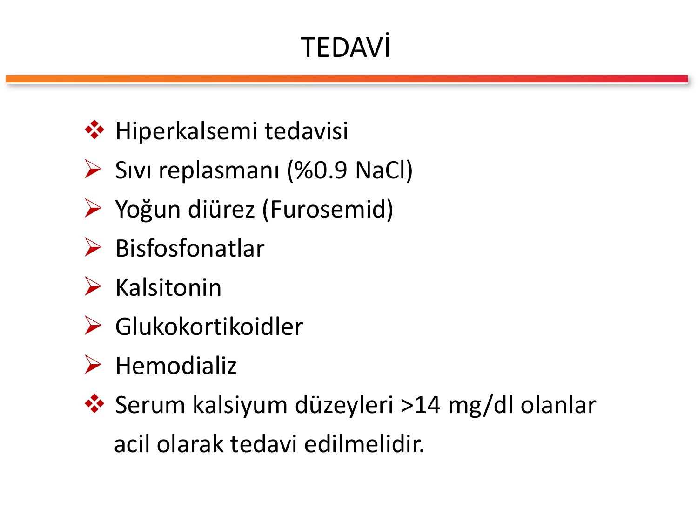

> **Şema yorumu:** Paratiroidektomi operasyonunda tiroid lobunun alt kutbu retrakte edilmiş, komşu bölgede **kahverengi-kırmızı, glandüler, kapsüllü paratiroid adenomu** izlenmektedir. Cerrahi, primer hiperparatiroidizmin **tek küratif tedavisidir.**

### Cerrahi Yaklaşım

* **Adenom (tek bez hastalığı):** **Tek bez eksizyonu** (odaklı/minimal invaziv paratiroidektomi)
* **Hiperplazi (4 bez hastalığı):** **3.5 bez eksizyonu** (subtotal paratiroidektomi) -- yarım bez **boyunda** veya **ön kol kasına otoototransplantasyon** ile korunur; nüks durumunda ön kolda bulunması reoperasyonu kolaylaştırır.
* **Karsinom:** Tiroid lobu, bölgesel lenf nodları ile en-bloc rezeksiyon.

### İntraoperatif PTH Takibi

* PTH'nın yarı ömrü kısadır (2-4 dk).
* Adenom çıkarıldıktan **10 dakika sonra PTH'nın bazalin %50'sinden fazla düşmesi** başarılı cerrahi kriteridir.

---

## ASEMPTOMATİK HASTALARDA CERRAHİ ENDİKASYONLARI

Günümüzde primer HPT hastalarının çoğu asemptomatiktir; bu grup için cerrahi endikasyonları **2014 NIH konsensus revizyonuna** göre belirlenir.

> **📋 ASEMPTOMATİK PRİMER HPT'DE CERRAHİ ENDİKASYONLARI:**
>
> * **Serum Ca üst sınırın 1 mg/dL üzerinde olması**
> * **Geçirilmiş yaşamı tehdit eden hiperkalsemi epizodu**
> * **Kreatinin klirensinin 60 mL/dk altında olması**
> * **İdrar Ca: > 400 mg/gün**
> * **Osteoporoz (T skoru < -2.5)** -- herhangi bir bölgede (lumbar, kalça, **ön kol**)
> * **Yaş: < 50**
> * **Fraktür öyküsü veya vertebral fraktür (X-ray/VFA)**
> * **Renal taş veya nefrokalsinozis (görüntülemede)**

Bu kriterlerden en az biri varsa cerrahi önerilir; hiçbiri yoksa izlem (yıllık Ca, kreatinin, DEXA) mantıklıdır.

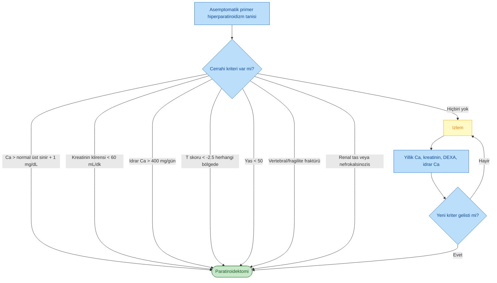
```mermaid
flowchart TD
    A[Asemptomatik primer hiperparatiroidizm tanisi] --> B{Cerrahi kriteri var mi?}
    B -->|Ca > normal üst sinir + 1 mg/dL| C([Paratiroidektomi])
    B -->|Kreatinin klirensi < 60 mL/dk| C
    B -->|Idrar Ca > 400 mg/gün| C
    B -->|T skoru < -2.5 herhangi bölgede| C
    B -->|Yas < 50| C
    B -->|Vertebral/fragilite fraktürü| C
    B -->|Renal tas veya nefrokalsinozis| C
    B -->|Hiçbiri yok| D[Izlem]
    D --> E[Yillik Ca, kreatinin, DEXA, idrar Ca]
    E --> F{Yeni kriter gelisti mi?}
    F -->|Evet| C
    F -->|Hayir| D

    classDef diagnose fill:#c8e6c9,stroke:#2e7d32,color:#1b5e20
    classDef test fill:#bbdefb,stroke:#1565c0,color:#0d47a1
    classDef warning fill:#fff9c4,stroke:#f9a825,color:#f57f17
    class C diagnose
    class A,B,E,F test
    class D warning
```

---

## MEDİKAL TEDAVİ

Cerrahiye uygun olmayan veya reddeden hastalarda medikal izlem seçenekleri:

### Cinacalcet (Kalsimimetik)

* **Etki:** CaSR'ye alosterik olarak bağlanır, Ca'ya duyarlılığı artırır → PTH salınımı **baskılanır** → serum Ca düşer.
* **Endikasyonlar:**
  * Hafif hiperparatiroidizmli hastaların çoğunda **kalsiyum düzeylerini normalleştirir.**
  * Hiperparatiroidizmli hiperkalsemik ve **cerrahiye uygun olmayan hastalarda alternatif olabilir.**
  * Paratiroid karsinomuna bağlı hiperkalsemi
  * Refrakter sekonder hiperparatiroidizm (KBH)
* **Başlangıç dozu:** 30 mg 2x1 PO; maksimum 90 mg 4x1
* **Yan etki:** Bulantı, kusma, hipokalsemi

### Bifosfonatlar ve Denosumab

* **Bifosfonatlar (alendronat, zoledronat):** Kemik dansitesini korur; Ca üzerine cinacalcet kadar etkili değildir.
* **Denosumab:** KBH'li hastalarda bifosfonat yerine kullanılabilir (böbrek atılımı gerektirmez).

### Vitamin D ve Hidrasyon

* Eş zamanlı **25-OH-D eksikliği düzeltilmelidir** (paradoksal olarak HPT hastalarında D eksikliği Ca'yı daha da yükseltmez, aksine PTH'yı daha da artırabilir).
* Yeterli hidrasyon (günlük 2-3 L sıvı), **tiyazid kullanımından kaçınma.**

---

## SEKONDER VE TERSİYER HİPERPARATİROİDİZM

### Sekonder Hiperparatiroidizm

> **Tanım:** Paratiroid bezi dışı nedenlerle gelişen hipokalsemi veya 1,25(OH)₂D eksikliğine **reaktif** olarak gelişen PTH artışıdır.

**Nedenler:**

* **Kronik böbrek hastalığı (KBH) -- en sık:** Fosfat retansiyonu + kalsitriol üretim yetersizliği → hipokalsemi → PTH artışı
* **Vitamin D eksikliği** (yetersiz güneş, malabsorpsiyon)
* Malabsorpsiyon sendromları (çölyak, gastrik bypass)
* Rikets / osteomalazi

**Biyokimya (KBH tipi):**

| Parametre | Değer |
|---|---|
| Ca | Düşük veya normal |
| **P** | **Yüksek** (KBH'de) |
| **PTH** | **Yüksek** |
| 25-OH-D | Düşük |
| 1,25(OH)₂D | Düşük |

**Tedavi:** Altta yatan nedeni düzeltmek (fosfat bağlayıcı, aktif D vitamini analoğu -- kalsitriol/parikalsitol, kalsimimetik).

### Tersiyer Hiperparatiroidizm

> **Tanım:** Uzun süreli sekonder HPT sonrası paratiroid bezlerinin **otonom (PTH'yı durdurmayan, Ca'dan bağımsız)** hale gelmesidir.

* En sık **uzun süre diyalize giren KBH** hastalarında veya **renal transplantasyon sonrası** görülür.
* Transplantasyondan sonra Ca ve P metabolizması düzelse bile hipertrofik bezler PTH salmaya devam eder → **hiperkalsemi + hiperfosfatemi + yüksek PTH**.

**Tedavi:** Refrakter vakalarda **paratiroidektomi (subtotal veya total + otoototransplantasyon).**

### Hiperparatiroidizm Formlarının Karşılaştırması

| Parametre | Primer HPT | Sekonder HPT (KBH) | Tersiyer HPT |
|---|---|---|---|
| **Ca** | ↑ | ↓ veya N | ↑ |
| **P** | ↓ | ↑ | ↑ |
| **PTH** | ↑ | ↑↑ | ↑↑↑ |
| **25-OH-D** | N veya ↓ | ↓ | Değişken |
| **Ana neden** | Adenom/hiperplazi | KBH, D eksikliği | Kronik sekonder HPT |
| **Tedavi** | Cerrahi | Altta yatan nedeni düzelt | Paratiroidektomi |

---

## KLİNİK VAKALAR

**📋 VAKA ÖRNEĞİ 1: Tiroidektomi Sonrası Akut Hipokalsemi**

**Hasta:** 42 yaşında kadın, 3 gün önce papiller tiroid karsinomu nedeniyle total tiroidektomi geçirdi.
**Öykü:** Sabah uyandığında ağız çevresi ve parmak uçlarında karıncalanma. Sonra her iki elde kasılma, konuşmada güçlük.
**Fizik Muayene:** Nabız 98/dk, TA 110/70 mmHg, SpO₂ %98. **Chvostek (+), Trousseau (+)**. Ellerinde ebe eli pozisyonu.
**Labotatuvar:** Ca 6.4 mg/dL (düzeltilmiş 6.6), fosfor 5.8 mg/dL, albümin 3.6 g/dL, Mg 1.5 mg/dL, iPTH 8 pg/mL (↓).
**EKG:** Uzamış QT mesafesi (QTc 510 msn).

**Tanı:** Postoperatif hipoparatiroidizm (geçici olması muhtemel) + Mg eksikliği.

**Tedavi:**
1. **IV kalsiyum glukonat %10, 2 ampul** 100 mL %5 dekstroz içinde 15 dk'da infüze edildi.
2. Ardından **0.5-1 mg/kg/saat** Ca infüzyonu başlandı.
3. **IV MgSO₄ 2 g** (Mg düzelmeden hipokalsemi düzelmez).
4. Oral kalsiyum karbonat 1500 mg/gün + **kalsitriol 0.5 µg 2x1** başlandı.
5. Kardiyak monitörizasyon; QT normale dönene kadar izlem.

**İzlem:** 6 ay sonra PTH ve Ca tekrar değerlendirildi; kalıcı hipoparatiroidizm gelişmediği saptandı, oral tedavi sonlandırıldı.

**Öğretici Notlar:**

1. Tiroidektomi sonrası hipokalsemi **ilk 24-72 saatte zirve** yapar. Hastane taburculuğunda mutlaka Ca ölçülmelidir.
2. **Chvostek ve Trousseau** hipokalseminin klasik yatak başı bulgularıdır; fakat Chvostek'in duyarlılığı-özgüllüğü sınırlıdır, **Trousseau daha spesifiktir**.
3. **Magnezyum eksikliği** eşlik ediyorsa önce düzeltilmelidir. Mg, PTH salınımı ve hedef doku PTH etkisi için gereklidir.
4. Kalıcı hipoparatiroidizm tanısı için **en az 6 ay beklenmelidir**.

---

**📋 VAKA ÖRNEĞİ 2: Rastlantısal Hiperkalsemi -- Primer Hiperparatiroidizm**

**Hasta:** 58 yaşında kadın, rutin check-up'ta hiperkalsemi saptandı.
**Öykü:** Yorgunluk, unutkanlık şikayeti var. İki yıl önce **böbrek taşı** öyküsü. Kabızlık aralıklı. Başka kronik hastalığı yok.
**Fizik Muayene:** Nabız 78/dk, TA 135/85 mmHg. Muayenede ek bulgu yok.
**Laboratuvar:**
* Ca: 11.8 mg/dL
* Albümin: 4.2 g/dL (düzeltilmiş Ca: 11.6)
* Fosfor: 2.2 mg/dL (↓)
* PTH (intakt): 125 pg/mL (↑, normal 15-65)
* 25-OH-D: 18 ng/mL (↓)
* Kreatinin: 1.1 mg/dL, eGFR 58 mL/dk
* 24 saatlik idrar Ca: 450 mg/gün
* DEXA T skoru: Lumbar -1.8, femur boynu -2.1, **distal 1/3 radius: -2.8**

**Görüntüleme:**
* **Paratiroid USG:** Sol alt tiroid lobu arkasında 14 × 8 mm hipoekoik, oval kitle.
* **MIBI sintigrafisi:** Sol alt paratiroid lojunda persistent tutulum (adenomla uyumlu).

**Tanı:** **Primer hiperparatiroidizm -- tek paratiroid adenomu.**

**Cerrahi endikasyonu:**
* Ca normal üst sınır + 1 mg/dL ↑ (10.5 + 1 = 11.5 → hastada 11.6)
* eGFR < 60 (58)
* **Distal radius T skoru < -2.5 (-2.8) -- osteoporoz kriteri**
* İdrar Ca > 400 mg/gün

**Tedavi:**
1. Cerrahi öncesi **25-OH-D replasmanı** (kolekalsiferol 50.000 IU/hafta × 8 hafta).
2. **Minimal invaziv odaklı paratiroidektomi (sol alt):** Adenom eksize edildi. **İntraoperatif PTH:** 10 dk sonra 28 pg/mL (%78 düşüş) → başarılı.
3. Postoperatif geçici hipokalsemi için oral Ca + kalsitriol 2 hafta.
4. 6 ay sonra kontrol: Ca 9.4 mg/dL, PTH 42 pg/mL (normal), DEXA'da iyileşme eğilimi.

**Öğretici Notlar:**

1. **Rutin biyokimyada saptanan hiperkalsemide ilk test PTH'dır.** Yüksek veya uygunsuz normal PTH → primer HPT tanısı.
2. **Primer HPT'de en erken tutulan kemik bölgesi kortikal dominant olan distal ön kol (radius)'dur.** DEXA'ya mutlaka eklenmelidir.
3. Cerrahi endikasyonları **2014 NIH revizyonu** ile belirlenir; **tek bir kriter bile** yeterlidir.
4. Preoperatif D vitamini eksikliği düzeltilmelidir; yoksa postoperatif "hungry bone" riski artar.
5. **İntraoperatif PTH takibi (%50'den fazla düşüş)** başarı kriteridir.

---

**📋 VAKA ÖRNEĞİ 3: Hiperkalsemik Kriz -- Malignite**

**Hasta:** 67 yaşında erkek, skuamöz hücreli akciğer karsinomu tanılı.
**Öykü:** Son 3 gündür kusma, letarji, konfüzyon; günde 4 L su içiyor, idrar sık.
**Fizik Muayene:** Nabız 110/dk, TA 90/55 mmHg, ateş yok. Dehidrate, konfüze.
**Laboratuvar:**
* Ca: 16.2 mg/dL
* Albümin: 3.1 g/dL (düzeltilmiş Ca: 16.9)
* Fosfor: 3.6 mg/dL
* PTH: 5 pg/mL (↓, baskılanmış)
* **PTHrP: 18 pmol/L (↑↑↑, normal < 2)**
* Kreatinin: 2.4 mg/dL (bazal 1.0)
* EKG: Kısa QT (QTc 340 msn)

**Tanı:** **Humoral (PTHrP aracılı) malign hiperkalsemi -- hiperkalsemik kriz.**

**Tedavi (paralel basamaklar):**
1. **Hızlı sıvı replasmanı:** %0.9 NaCl 500 mL/saat ilk 4 saat, sonra 250 mL/saat (total 24 saatte 4-6 L).
2. Sıvı yüklendikten sonra **furosemid 20-40 mg IV** (gerekirse) -- yalnızca euvolemi sağlandıktan sonra.
3. **Kalsitonin 4 IU/kg SC 12 saatte bir** (hızlı ama kısa süreli etki için).
4. **Zoledronat 4 mg IV 15 dk'da infüzyon** (48-72 saat içinde maksimum etki).
5. Nörolojik izlem, kardiyak monitörizasyon.
6. Primer hastalığın (akciğer Ca) onkolojik tedavisi.

**İzlem:** 72. saatte Ca 11.2 mg/dL; şuur açıldı. Kemoterapi ile ana hastalık tedavisi planlandı.

**Öğretici Notlar:**

1. **Hospitalize hiperkalsemi hastalarında en sık neden malignitedir.**
2. **PTH baskılı + PTHrP yüksek** → humoral hiperkalsemi (en sık skuamöz hücreli akciğer, baş-boyun, renal, meme).
3. **Sıvı replasmanı birinci basamaktır**; furosemid **ancak hipervolemi sağlandıktan sonra** verilmelidir.
4. **Bifosfonat** etkisi 2-4 gün sonra maksimuma ulaşır; **kalsitonin** ilk 24-48 saatte köprü görevi görür.
5. Hastaya **tiyazid diüretik veya kalsiyum/D vitamini suplementasyonu varsa kesilmelidir.**

---

## ÖZET TABLO: HİPO vs HİPERPARATİROİDİZM

| Özellik | Hipoparatiroidizm | Primer Hiperparatiroidizm |
|---|---|---|
| **Serum Ca** | ↓ | ↑ |
| **Serum P** | ↑ | ↓ |
| **PTH** | ↓ (veya uygunsuz normal) | ↑ |
| **En sık neden** | **Cerrahi (tiroidektomi sonrası)** | **Paratiroid adenomu (%85)** |
| **Klinik** | Parestezi, karpopedal spazm, tetani, QT uzar, konvülsiyon, katarakt | Çoğu asemptomatik; "stones, bones, abdominal groans, psychic moans"; QT kısalır |
| **Yatak başı bulgu** | **Chvostek, Trousseau (+)** | Spesifik yok |
| **Kemik bulguları** | Genelde normal; kronik: bazal gangliyon kalsifikasyonu | Subperiostal rezorpsiyon, tuz-biber kafa, Brown tümör, **osteitis fibrosa cystica** |
| **Görüntüleme** | - | **USG + MIBI sintigrafisi** |
| **Akut tedavi** | IV kalsiyum glukonat, Mg replasmanı | Hidrasyon, bifosfonat, kalsitonin |
| **Kronik tedavi** | Oral Ca + aktif D vit (kalsitriol/alfakalsidiol); rhPTH(1-84) | **Paratiroidektomi** (küratif); cinacalcet (medikal) |

---

## KAYNAKLAR

1. TEMD Metabolik Kemik Hastalıkları Tanı ve Tedavi Kılavuzu.
2. Marks SJ. *NEJM* 343:1863, 2000 (PTH moleküler biyolojisi).
3. Ünübol M, Soyder A, Katkın N, Demir P, Çetinkaya E, Süle M, Güney E. Primer Hiperparatiroidizmde Preoperatif Ultrasonografi Eşliğinde İnce İğne Aspirasyon Biyopsisi ve Aspiratta Parathormon Ölçümünün Olgu Eşliğinde Değerlendirilmesi -- ADÜ Tıp Fakültesi Endokrinoloji AD.
4. 2014 NIH Consensus Development Conference on Asymptomatic Primary Hyperparathyroidism.
5. Bilezikian JP et al. Guidelines for the Management of Asymptomatic Primary Hyperparathyroidism. *J Clin Endocrinol Metab*.
