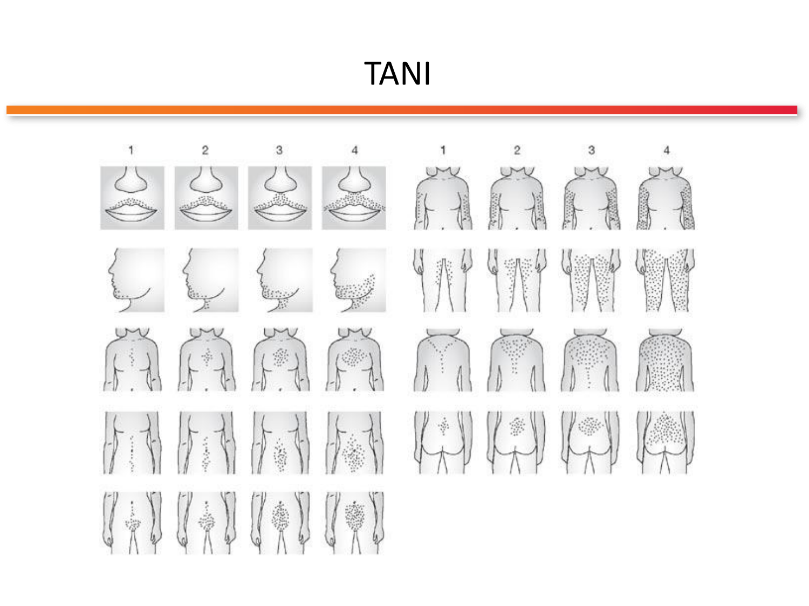
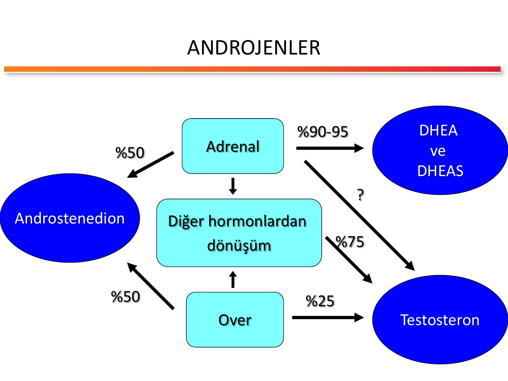
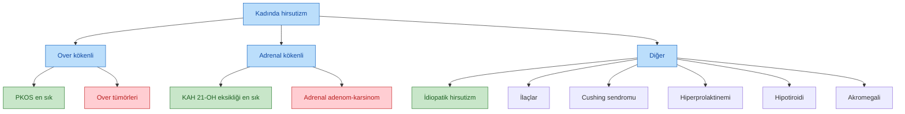
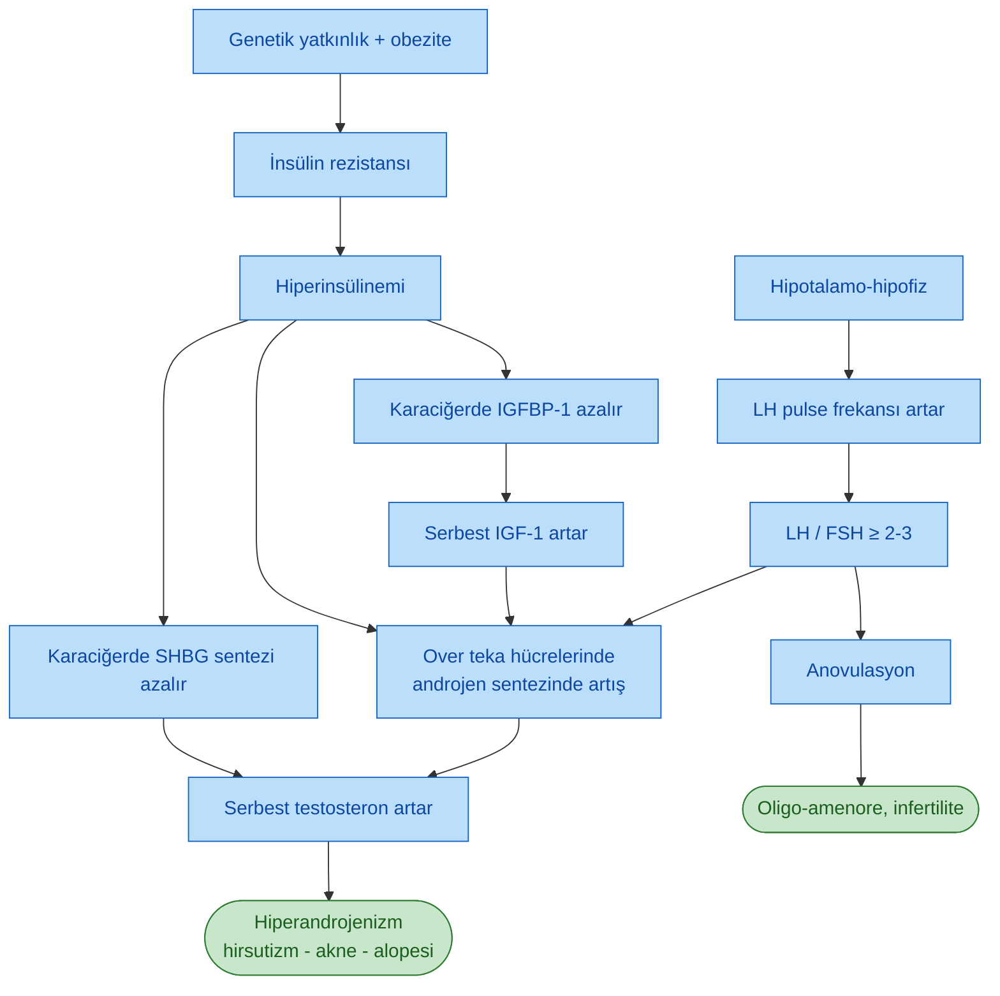
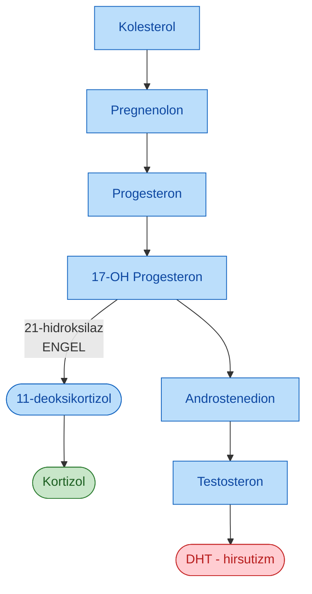
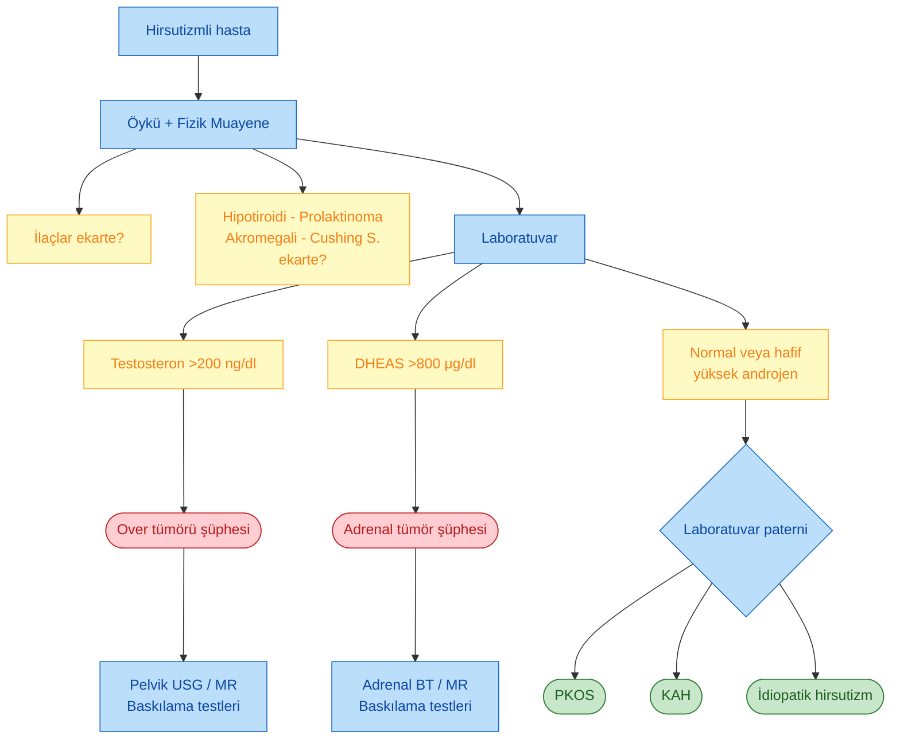
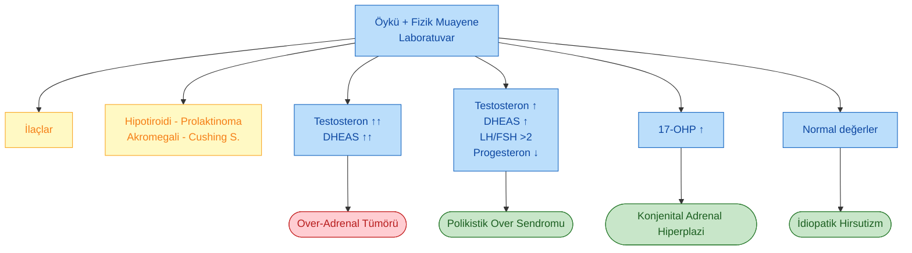
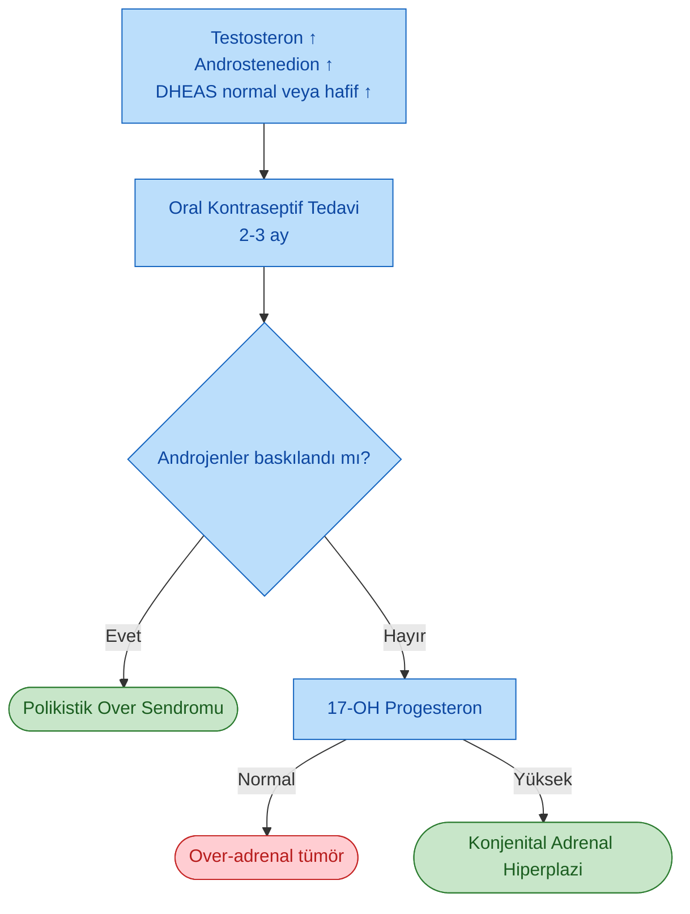
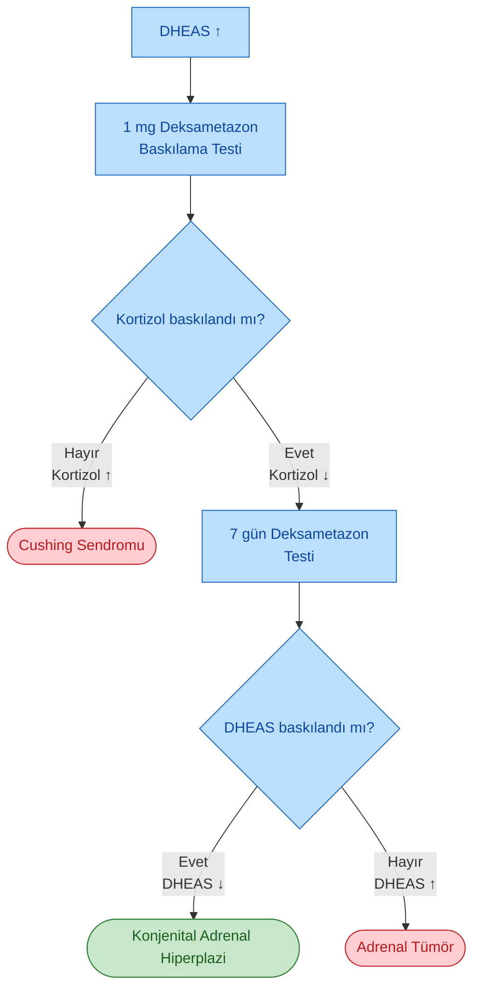
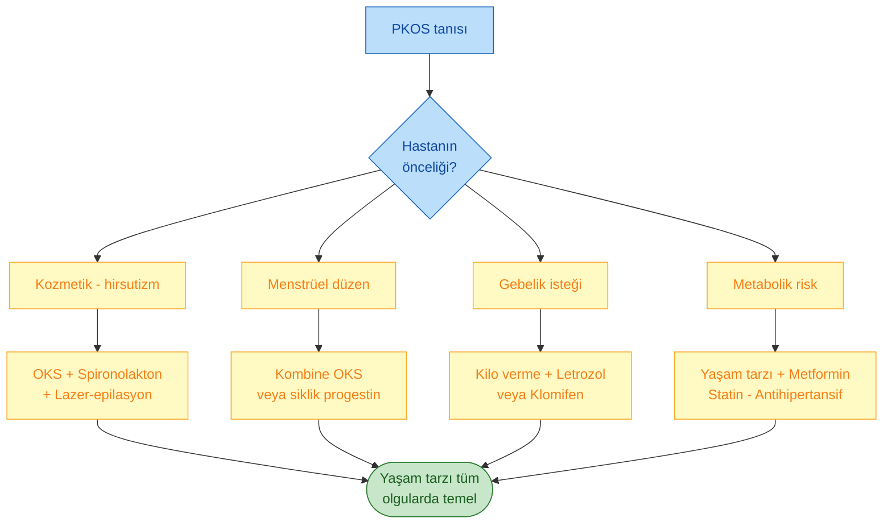

# POLİKİSTİK OVER SENDROMU VE HİRSUTİZM

**Hazırlayan:** Prof. Dr. Engin Güney
**Bölüm:** Aydın Adnan Menderes Üniversitesi -- Endokrinoloji ve Metabolizma Hastalıkları Bilim Dalı

---

## İÇİNDEKİLER

1. [Hirsutizm Tanımı ve Virilizasyon](#hirsutizm-tanımı-ve-virilizasyon)
2. [Ferriman-Gallwey Skorlaması](#ferriman-gallwey-skorlaması)
3. [Kıl Fizyolojisi](#kıl-fizyolojisi)
4. [Hirsutizmin Patogenezi](#hirsutizmin-patogenezi)
5. [Androjenlerin Kaynakları](#androjenlerin-kaynakları)
6. [SHBG Düzeyini Azaltan Nedenler](#shbg-düzeyini-azaltan-nedenler)
7. [Hirsutizm Nedenleri](#hirsutizm-nedenleri)
8. [Polikistik Over Sendromu (PKOS)](#polikistik-over-sendromu-pkos)
9. [Konjenital Adrenal Hiperplazi (KAH)](#konjenital-adrenal-hiperplazi-kah)
10. [İdiopatik Hirsutizm](#idiopatik-hirsutizm)
11. [Hirsutizme Neden Olan İlaçlar](#hirsutizme-neden-olan-ilaçlar)
12. [Androjen Salgılayan Tümörler](#androjen-salgılayan-tümörler)
13. [Hirsutizmli Hastaya Yaklaşım](#hirsutizmli-hastaya-yaklaşım)
14. [Laboratuvar Değerlendirmesi](#laboratuvar-değerlendirmesi)
15. [ACTH Uyarı Testi](#acth-uyarı-testi)
16. [Görüntüleme Yöntemleri](#görüntüleme-yöntemleri)
17. [Tanı Algoritması (Genel)](#tanı-algoritması-genel)
18. [Tanı Algoritması (Laboratuvar Odaklı)](#tanı-algoritması-laboratuvar-odaklı)
19. [OKS Baskılanma Sonrası Değerlendirme](#oks-baskılanma-sonrası-değerlendirme)
20. [DHEAS Yüksekliğinde Deksametazon Testi](#dheas-yüksekliğinde-deksametazon-testi)
21. [Tedavi](#tedavi)
22. [Klinik Vaka Örnekleri](#klinik-vaka-örnekleri)

---

## HİRSUTİZM TANIMI VE VİRİLİZASYON

> **Tanım:** Hirsutizm, kadınlarda **erkek tipi ve dağılımında terminal kılların artışı** olarak tanımlanır. Androjene duyarlı bölgelerde (üst dudak, çene, göğüs orta hattı, sırt, alt karın, uyluk iç yüzü) koyu, kalın, pigmente kılların görülmesidir.

> **Virilizasyon:** Hirsutizmle birlikte aşağıdaki belirtilerin bulunması durumunda **virilizasyon**'dan söz edilir:
>
> * **Kliteromegali**
> * **Ses kalınlaşması**
> * **Frontal (erkek tipi) saç dökülmesi**
> * **Göğüslerde küçülme (meme atrofisi)**
> * **Kadına özgü vücut hatlarının kaybolması** (kas kitlesinde artış, yağ dağılımında değişiklik)

**⚠️ ÖNEMLİ:** Virilizasyon bulguları **ileri düzey androjen fazlalığını** gösterir ve çoğunlukla **androjen salgılayan tümörleri (over veya adrenal kaynaklı)** akla getirir. Hızlı gelişen hirsutizm + virilizasyon = tümör ekartasyonu şarttır.

---

## FERRIMAN-GALLWEY SKORLAMASI

> **Tanım:** Ferriman-Gallwey (FG) skoru, vücudun androjene duyarlı **9 bölgesindeki** kıllanmanın **0 ile 4** arasında puanlanmasıyla elde edilen klinik bir skordur (maksimum 36 puan). **Skor 8 ve üzerinde ise hirsutizm** kabul edilir.

> **Şema yorumu:** Skorlama; **üst dudak, çene, göğüs orta hattı, üst sırt, alt sırt (lumbosakral), üst karın, alt karın (umbilikus-pubis hattı), üst kol ve uyluk** olmak üzere androjene duyarlı dokuz bölgede, her bölgedeki terminal kıl yoğunluğunun 0 (yok) ile 4 (erkek tipi yoğun kıllanma) arasında derecelendirilmesiyle hesaplanır. **Ön kol ve bacak (cruris) skorlamaya dahil değildir** çünkü bu bölgelerin kıllanması büyük ölçüde androjen bağımsızdır.

### Şiddet Sınıflaması

| FG Skoru | Şiddet |
|---|---|
| **8-12** | Hafif hirsutizm |
| **13-18** | Orta hirsutizm |
| **19-36** | Ağır hirsutizm |

**💡 Pratik not:** Akdeniz ve Orta Doğu popülasyonlarında bazı kaynaklar **eşiği 9 veya 10** olarak önerse de klinikte klasik olarak **≥8** kullanılır. Etnik farklılıklar sebebiyle skor tek başına değerlendirilmez; **klinik + biyokimyasal bulgular** birlikte yorumlanır.

---

## KIL FİZYOLOJİSİ

Vücutta iki temel kıl tipi vardır:

* **Vellus tipi kıllar:** İnce, yumuşak, kısa, pigmentsiz, androjen bağımsız kıllar.
* **Terminal kıllar:** Kalın, uzun, pigmente, androjene duyarlı kıllar.

> **Temel mekanizma:** Çeşitli bölgelerdeki **kıl follikülleri androjenlere farklı şekilde yanıt** verir. Kadınlarda androjenler arttığında vücudun büyük bölümündeki **vellus tipi kıllar terminal kıllara dönüşür**. Bu dönüşüm, androjenlere duyarlı olan **pilosebaseöz birim** düzeyinde gerçekleşir.

### Androjen Bağımlı ve Bağımsız Bölgeler

| Androjen Bağımlı (FG skoru için önemli) | Androjen Bağımsız |
|---|---|
| Üst dudak, çene, yanak | Kafa derisi saçı (vertex dışı) |
| Göğüs orta hattı | Ön kol |
| Sırt, lomber bölge | Bacak (cruris) |
| Üst ve alt karın | Kaş, kirpik |
| Uyluk iç yüzü, omuz, üst kol | Aksilla ve pubis (kısmen; adrenarş ile ilgili) |

---

## HİRSUTİZMİN PATOGENEZİ

Hirsutizm gelişiminde dört ana mekanizma rol oynar:

1. **Androjenlerin artışı** (over, adrenal veya periferik kaynaklı)
2. **SHBG (Seks Hormon Bağlayıcı Globulin) düzeylerinde azalma** → serbest testosteron artışı
3. **5-alfa-redüktaz enzim aktivitesinde artış** → testosteronun daha güçlü olan **dihidrotestosteron (DHT)**'a dönüşümünde artış
4. **Genetik özellikler** → reseptör duyarlılığı, enzim polimorfizmleri

> **Hatırlatma:** Testosteronun büyük bölümü (~%98) plazmada SHBG ve albumine bağlıdır; biyolojik olarak aktif olan kısım **serbest (%1-2) testosterondur**. SHBG azaldığında total testosteron normal olsa bile **serbest testosteron artar** ve klinik hirsutizm ortaya çıkar.

---

## ANDROJENLERİN KAYNAKLARI

> **Şema yorumu:** Kadında androjen havuzunun kaynak dağılımı:
>
> * **DHEA ve DHEAS:** ~%90-95 **adrenal** kaynaklıdır. Bu nedenle DHEAS **adrenal androjen belirteci** olarak kullanılır.
> * **Androstenedion:** Yaklaşık **%50 adrenal + %50 over** olmak üzere eşit dağılımlıdır.
> * **Testosteron:** Overden **~%25** doğrudan salgılanır. Geriye kalan **~%75**'i periferik dokularda (özellikle yağ dokusu, karaciğer, cilt) androstenedion ve DHEA'nın **periferik dönüşümüyle** elde edilir. Adrenalin doğrudan testosteron katkısı minimaldir (?).

### Androjenlerin Potensi (Azalan Sırayla)

1. **DHT (Dihidrotestosteron)** -- en güçlü, reseptör afinitesi en yüksek
2. **Testosteron**
3. **Androstenedion**
4. **DHEA / DHEAS** -- en zayıf, prekürsor görevi görür

---

## SHBG DÜZEYİNİ AZALTAN NEDENLER

SHBG azaldığında serbest biyoaktif testosteron artar, klinik hirsutizm şiddetlenir.

* **Hipotiroidi**
* **Akromegali**
* **Obezite**
* **Androjen kullanımı** (eksojen veya endojen)
* **Kortikosteroid kullanımı**
* **İnsülin rezistansı / hiperinsülinemi** (PKOS'ta tipik)

> **Klinik ipucu:** PKOS'lu hastada insülin rezistansı → SHBG ↓ → serbest testosteron ↑ → hirsutizm + akne + androjenik alopesi. Bu zincir, PKOS'un insülin duyarlaştırıcılarla (metformin) tedavisinin mantığını açıklar.

---

## HİRSUTİZM NEDENLERİ

### Over Kökenli Nedenler

* **Polikistik over sendromu (PKOS)** -- en sık neden
* **Over tümörleri** (arrhenoblastoma, hiler hücre tümörü, lipoid hücre tümörü, Brenner tümörü)

### Adrenal Kökenli Nedenler

* **Konjenital adrenal hiperplazi (KAH)** -- özellikle geç başlangıçlı (non-klasik) form
* **Adrenal adenom ve karsinomlar**

### Diğer Nedenler

* **İdiopatik hirsutizm**
* **İlaçlara bağlı hirsutizm**
* **Endokrin hastalıklar:**
  * Cushing sendromu
  * Hiperprolaktinemi
  * Hipotiroidi
  * Akromegali

---

## POLİKİSTİK OVER SENDROMU (PKOS)

> **Tanım:** PKOS; üreme çağındaki kadınlarda **hiperandrojenizm, kronik anovulasyon ve polikistik over morfolojisi** ile karakterize, **multisistemik** bir endokrin-metabolik bozukluktur.

### Genel Özellikler

* **Hirsutizmin en sık nedenidir.**
* **Kronik anovulasyon** görülür; oligomenore/amenore sık.
* **Hirsutizm pubertede başlar**, menarş ile eş zamanlı veya hemen sonrasında belirir.
* **Toplumda görülme sıklığı %5-10** arasındadır.

### Tanı Kriterleri (Üç Ana Bileşen)

1. **Ovulatuvar disfonksiyon** (oligo/anovulasyon, menstrüel düzensizlik)
2. **Hiperandrojenizm bulguları** (klinik -- hirsutizm/akne/alopesi -- ve/veya biyokimyasal -- testosteron/androstenedion yüksekliği)
3. **Diğer nedenlerin ekarte edilmesi** (KAH, Cushing, prolaktinoma, tiroid, tümör)

> **Pratik not:** Günümüzde en yaygın kullanılan **Rotterdam (2003) kriterleri** yukarıdaki üç özelliğe **polikistik over USG görünümü**'nü (≥12 folikül 2-9 mm çapta ve/veya over volümü >10 mL) ekleyerek **üçten ikisinin bulunmasını** yeterli sayar. NIH kriterleri ise hiperandrojenizm + anovulasyon'u zorunlu görür.

### Özel Sendromlar

> **Stein-Leventhal Sendromu:** Klasik triad -- **obezite, amenore, infertilite** (PKOS'un ilk tanımlanan formu, 1935).

> **HAIR-AN Sendromu:** **H**iper**A**ndrojenizm + **I**nsülin **R**ezistansı + **A**kantozis **N**igrikans. Ağır insülin rezistansının eşlik ettiği PKOS varyantıdır; genellikle obez adolesanlarda görülür.

### Klinik Bulgular

| Sistem | Bulgu |
|---|---|
| **Deri-adneks** | Hirsutizm, akne, androjenik (frontal) alopesi, seboroik cilt, akantozis nigrikans |
| **Menstrüel** | Oligomenore, amenore, anovulatuvar disfonksiyonel kanama |
| **Jinekolojik** | İnfertilite, erken gebelik kaybı, endometrial hiperplazi/karsinom riski |
| **Metabolik** | Santral obezite, insülin rezistansı, T2DM, dislipidemi, metabolik sendrom, NASH |
| **Kardiyovasküler** | Hipertansiyon, subklinik ateroskleroz, KV olay riski artışı |
| **Psikososyal** | Depresyon, anksiyete, beden algısı bozukluğu, OSA (obstrüktif uyku apnesi) |

### PKOS Patogenezi (Kısır Döngü)

> **Şema yorumu:** PKOS patogenezinde iki eksen iç içe geçer: **(1) İnsülin rezistansı → hiperinsülinemi** teka hücrelerinde androjen sentezini artırır, SHBG ve IGFBP-1'i baskılar, serbest testosteron ve IGF-1'i yükseltir. **(2) Hipotalamo-hipofiz ekseninde** GnRH pulse frekansı bozulur, **LH baskın** salınır, FSH göreli olarak baskılanır (LH/FSH ≥2), folikül olgunlaşması durur ve **anovulasyon** gelişir.

---

## KONJENİTAL ADRENAL HİPERPLAZİ (KAH)

> **Tanım:** Kortizol biyosentezindeki bir enzim defekti sonucu **kortizol düzeyi düşer**; negatif feedback kaybı ile **ACTH artar**. Aşırı ACTH uyarısı sonucu **adrenal hiperplazi** gelişir ve defektin proksimalindeki androjenik steroid prekürsörleri birikir.

### Enzim Defektleri

* **21-Hidroksilaz eksikliği** (olguların **%90-95**'i)
* **11β-Hidroksilaz eksikliği**
* **3β-Hidroksisteroid dehidrogenaz eksikliği**
* **17-Hidroksilaz eksikliği**
* **20-22 Desmolaz eksikliği**

### Non-Klasik (Geç Başlangıçlı) 21-Hidroksilaz Eksikliği

* KAH olgularının büyük bölümü **non-klasik (geç başlangıçlı)** formdadır.
* **Hirsutizmli olguların %1-5'ini** oluşturur.
* **Progesteron ve 17-Hidroksiprogesteron (17-OHP) düzeyleri artmıştır.**
* Klinik olarak PKOS'u taklit edebilir; ayırıcı tanıda **17-OHP ölçümü** ve gerekirse **ACTH uyarı testi** esastır.

> **Şema yorumu:** 21-hidroksilaz enzimi bloke olduğunda **17-OHP'dan 11-deoksikortizola** geçiş kesilir; substrat (17-OHP) birikir ve **androstenedion-testosteron-DHT** yolağına kanalize olur. Bu yüzden laboratuvarda **17-OHP yüksek**, klinikte **hirsutizm-virilizasyon** görülür.

---

## İDİOPATİK HİRSUTİZM

> **Tanım:** **Ovulatuvar menstrüel siklusu, normal over morfolojisi ve normal adrenal fonksiyonu** olan hastalarda görülen hirsutizm **idiopatik hirsutizm** olarak adlandırılır.

* **Androjen düzeyleri normal ya da hafif yüksektir.**
* Mekanizma: **Pilosebaseöz birimin androjene artmış duyarlılığı** (periferik 5-alfa-redüktaz aktivitesinde artış, reseptör hassasiyeti)
* **Dışlama tanısıdır**: PKOS, KAH, tümör, Cushing ekartasyonu sonrası konur.

---

## HİRSUTİZME NEDEN OLAN İLAÇLAR

| Hormonal / Androjenik Etkili | Diğer Ajanlar |
|---|---|
| Androjenler (testosteron, nandrolon) | Siklosporin |
| Norgestrel (progestin) | Metranidazol |
| Norethindrone (progestin) | Diazoksid |
| Danazol | Minoksidil |
| Kortikosteroidler | Fenotiazinler |
| Metirapon | Fenitoin |

**💡 Klinik yaklaşım:** Hirsutizmli hastadan mutlaka **detaylı ilaç öyküsü** alınmalıdır; özellikle **minoksidil, siklosporin ve fenitoin** sık gözden kaçan nedenlerdir.

---

## ANDROJEN SALGILAYAN TÜMÖRLER

### Over Tümörleri

* **Arrhenoblastoma** (Sertoli-Leydig hücreli tümör)
* **Hiler hücre tümörleri**
* **Lipoid hücre tümörleri**
* **Brenner tümörü**

### Adrenal Tümörler

* **Adrenal adenom**
* **Adrenal karsinom**

**🚨 Uyarı bulguları (tümör işaretleri):**

* **Hızlı gelişen** hirsutizm (<1 yıl)
* **Ağır hirsutizm + virilizasyon** (kliteromegali, ses kalınlaşması)
* **Total testosteron >200 ng/dl** → over tümörü şüphesi
* **DHEAS >800 μg/dl** → adrenal tümör şüphesi
* **İleri yaşta** başlangıç (üreme çağı sonu)

---

## HİRSUTİZMLİ HASTAYA YAKLAŞIM

Hirsutizmli hastaya yaklaşım dört temel basamak üzerine kuruludur:

1. **Öykü**
2. **Fizik muayene**
3. **Laboratuvar**
4. **Görüntüleme yöntemleri**

### Öykü

* **Pubertal gelişim** (menarş yaşı, sekonder seks karakterlerinin gelişimi)
* **Menstrüasyon düzeni** (siklus süresi, kanama miktarı, amenore/oligomenore)
* **Kıllanma artışının başlangıç zamanı ve gelişim hızı** (yavaş-kronik = PKOS/idiopatik; hızlı = tümör)
* **Aile öyküsü** (etnik hirsutizm, PKOS, KAH)
* **İlaç alımı** (androjenler, minoksidil, siklosporin vb.)
* **Eşlik eden belirtiler** (galaktore, kilo değişimi, sıcak intoleransı, cilt değişiklikleri)

### Fizik Muayene

* **Androjene bağımlı bölgelerin değerlendirilmesi** (FG skoru)
* **Virilizasyon bulguları** (kliteromegali, ses kalınlaşması, frontal alopesi, meme atrofisi)
* **Endokrin hastalıklara ait bulgular** (Cushing'oid yüz, striae, guatr, akromegalik yüz, galaktore)
* **Akantozis nigrikans** (insülin rezistansı göstergesi)
* **Vücut kitle indeksi (VKİ), bel çevresi, kan basıncı**

---

## LABORATUVAR DEĞERLENDİRMESİ

Hirsutizmde **temel laboratuvar paneli:**

| Test | Klinik Önemi |
|---|---|
| **DHEAS** | Adrenal androjen belirteci |
| **Total testosteron** | Genel androjen havuzu |
| **Serbest testosteron** | Biyolojik aktif kısım |
| **Androstenedion** | Over + adrenal kaynaklı |
| **17-OH Progesteron** | KAH taraması |
| **Gonadotropinler (LH / FSH)** | PKOS: LH/FSH ≥2-3 |
| **Prolaktin** | Hiperprolaktinemi |
| **Kortizol** | Cushing şüphesi |
| **TSH** | Hipotiroidi ekartasyonu |

### DHEAS

* **Normal değer (erişkin kadın):** 35-450 μg/dl
* **Adrenal korteksten** salgılanır; adrenal androjen belirtecidir.
* **Bilateral adrenal hiperplaziye bağlı Cushing sendromunda**, benign kortikal adenoma bağlı Cushing'den **daha fazla** artar.
* **>800 μg/dl → adrenal tümör** düşündürür.
* **Adrenal karsinomda** saptanan yüksek değerler **deksametazonla baskılanmaz**.
* **Konjenital adrenal hiperplazide** de belirgin artar ancak **deksametazonla baskılanabilir**.
* **En yüksek değerler 3β-Hidroksisteroid dehidrogenaz eksikliğinde** görülür.

### Testosteron

| Parametre | Normal Değer |
|---|---|
| **Total testosteron** | 20-80 ng/dl |
| **Serbest testosteron** | 0.6-3.0 pg/ml |

* **Total testosteron >200 ng/dl → Malignite (over tümörü)**
* **Total testosteron <200 ng/dl (hafif-orta artış) → PKOS**
* **Uyarı:** Total testosteron değerleri **SHBG düzeyindeki değişikliklere bağlı** olarak yanıltıcı sonuç verebilir; klinikle uyumsuzsa **serbest testosteron** veya hesaplanmış **bioavailable testosteron** istenmelidir.

### Androstenedion

* **Normal değer (erişkin kadın):** 0.4-2.7 ng/ml
* **Over ve adrenal bezden yaklaşık eşit oranlarda** salgılanır.
* **Konjenital adrenal hiperplazide artar**, glukokortikoid ile baskılanır.

### 17-OH Progesteron

| Faz | Normal Değer |
|---|---|
| **Folliküler faz** | <80 ng/dl (0.4-1.0 ng/ml) |
| **Luteal faz** | <285 ng/dl (1.3-4.3 ng/ml) |

* **17-OHP >1.5 ng/ml → ACTH uyarı testi endikasyonu** (non-klasik 21-OH eksikliği şüphesi)
* **17-OHP >8 ng/ml → KAH tanısı için tek başına yeterli**
* **Örnek sabah erken ve folliküler fazda** (siklusun ilk 5 günü) alınmalıdır; luteal fazda yalancı yükseklik olur.

### Gonadotropinler (LH / FSH)

* **PKOS'ta LH** normalin **3 katı artış** gösterir.
* **FSH** normal ya da hafif yüksektir.
* **LH / FSH >2 → PKOS düşündürür.**
* **LH / FSH >3 → PKOS için çok tipik.**

> **Uyarı:** OKS kullanan, gebe olan veya GnRH analogu alan hastalarda LH/FSH değerleri yanıltıcıdır. Ayrıca PKOS'lu hastaların **bir kısmında LH/FSH oranı normal** olabilir; bu kriter **Rotterdam 2003 sonrası tanısal öneminden düşmüştür**.

### Prolaktin, Kortizol, TSH

* **Hiperprolaktinemi** hirsutizm nedenleri arasındadır.
* PKOS'lu hastaların **%20-30**'unda prolaktin hafif yüksek bulunur (**15-50 ng/ml**).
* **Kortizol yüksekse → Cushing sendromu** için ileri tetkikler (1 mg deksametazon baskılama testi, 24-saatlik idrar serbest kortizol, gece tükürük kortizolü).
* **TSH yüksekse → hipotiroidi** için ileri tetkikler (serbest T4).

---

## ACTH UYARI TESTİ

> **Endikasyon:** Hirsutizmli hastada bazal **17-OHP >1.5 ng/ml** bulunduğunda non-klasik 21-hidroksilaz eksikliğini ekarte etmek için yapılır.

**Protokol:**

1. Sabah erken, folliküler fazda bazal **17-OHP ve kortizol** alınır.
2. **0.25-1.0 mg IV ACTH (Synacthen / Cosyntropin)** uygulanır.
3. **30., 60. ve 90. dakikalarda** 17-OHP düzeyleri ölçülür.

**Yorum:**

| ACTH Sonrası 17-OHP | Tanı |
|---|---|
| **>10 ng/ml** | Geç başlangıçlı (non-klasik) 21-Hidroksilaz eksikliği |
| 1.5-10 ng/ml | Taşıyıcı veya belirsiz; klinikle birlikte değerlendir |
| <1.5 ng/ml | KAH dışlanır |

---

## GÖRÜNTÜLEME YÖNTEMLERİ

* **Ultrasonografi (USG)**
  * **Transvajinal pelvik USG**: polikistik over morfolojisi (PCOM) -- her overde **≥12 antral folikül (2-9 mm çaplı)** ve/veya **over volümü >10 mL**
  * **Transabdominal**: adnexal kitle, over tümörü
  * **Surrenal USG**: tümör taraması (sınırlı duyarlılık)
* **Bilgisayarlı Tomografi (BT)**
  * Adrenal adenom/karsinom değerlendirmesi (noncontrast + kontrastlı dinamik)
* **Manyetik Rezonans (MR)**
  * Over tümörlerinin karakterizasyonu, hipofiz MR (Cushing, prolaktinoma)

---

## TANI ALGORİTMASI (GENEL)

> **Şema yorumu:** İlk basamakta öykü ile **ilaç kaynaklı** nedenler ve fizik muayene ile **Cushing, hipotiroidi, prolaktinoma, akromegali** ekarte edilir. Ardından laboratuvar paneline bakılır: **testosteron >200 ng/dl → over tümörü**, **DHEAS >800 μg/dl → adrenal tümör** için acil görüntüleme ve baskılama testi gerekir. Androjenler normal veya hafif yüksekse laboratuvar paterni PKOS / KAH / idiopatik hirsutizm ayrımına yönlendirir.

---

## TANI ALGORİTMASI (LABORATUVAR ODAKLI)

> **Şema yorumu:** Laboratuvar paterni tanıyı dört kategoriye ayırır: **(1) Çok yüksek testosteron + DHEAS** → over-adrenal tümör; **(2) Hafif yüksek androjenler + LH/FSH >2** → PKOS; **(3) 17-OHP yüksek** → KAH; **(4) Tüm androjenler normal** → idiopatik hirsutizm.

---

## OKS BASKILANMA SONRASI DEĞERLENDİRME

Over-adrenal ayrımı güç olduğunda, **OKS ile over baskılanması** testi yapılabilir:

> **Şema yorumu:** OKS, LH baskılanması yoluyla **over androjen üretimini suprese eder**. Baskılanma varsa androjenlerin kaynağı overdir → **PKOS**. Baskılanma yoksa androjenler overden bağımsız üretiliyor demektir; ayrımda **17-OHP** belirleyicidir: normalse **tümör**, yüksekse **KAH** lehinedir.

---

## DHEAS YÜKSEKLİĞİNDE DEKSAMETAZON TESTİ

> **Şema yorumu:** DHEAS yüksekliğinde önce **1 mg deksametazon baskılama testi** yapılır. Kortizol baskılanmazsa **Cushing sendromu** tanısı konur. Kortizol baskılanırsa **7 günlük yüksek doz deksametazon testi** uygulanır; DHEAS baskılanırsa **KAH** (ACTH-bağımlı, baskılanabilir), baskılanmazsa **otonom adrenal tümör** tanısı konur.

---

## TEDAVİ

PKOS ve hirsutizm tedavisi; hastanın **şikayeti, gebelik arzusu, eşlik eden metabolik sorunlar ve altta yatan etyoloji**'ye göre bireyselleştirilir.

### 1. Yaşam Tarzı Değişiklikleri (İlk Basamak)

* **Kilo verme:** Obez PKOS hastalarında **%5-10 ağırlık kaybı** bile menstrüel düzeni, ovulasyonu ve metabolik parametreleri belirgin düzeltir.
* **Düzenli egzersiz** (haftada en az 150 dk aerobik)
* **Düşük glisemik indeksli diyet**, şeker kısıtlaması
* Sigaranın bırakılması

### 2. Oral Kontraseptifler (OKS)

* **Östrojen dozu düşük, antiandrojen (siproteron asetat) eklenmiş** kombine OKS'ler tercih edilir (**Diane 35**: etinil östradiol + siproteron asetat).
* **Etki mekanizması:**
  * **LH baskılanması** → over androjen üretimi azalır
  * **SHBG artışı** → serbest testosteron azalır
  * **Menstrüel düzenin sağlanması** → endometrium hiperplazisi önlenir
* **Drospirenon** içeren kombine OKS'ler de mineralokortikoid antagonisti özelliğiyle kullanılır.

### 3. Antiandrojenler

| İlaç | Doz | Mekanizma / Notlar |
|---|---|---|
| **Spironolakton** | 50-100 mg/gün (200 mg'a kadar artırılabilir) | Androjen reseptör antagonisti; 5-alfa-redüktaz inhibisyonu. **Kıl follikülünde testosteronun reseptörüne bağlanmasını engeller.** Kadın hastalarda kontrasepsiyon şarttır (fetal feminizasyon riski). |
| **Siproteron asetat** | 25-100 mg/gün (siklik) | Güçlü antiandrojen + progestin; genellikle OKS ile kombine. |
| **Flutamid** | 250 mg 2x1 | Non-steroidal androjen reseptör antagonisti. **Hepatotoksisite** dikkat! |
| **Finasterid** | 2.5-5 mg/gün | 5-alfa-redüktaz inhibitörü (tip 2); **teratojeniktir**, gebelik kontrendikasyonu. |

### 4. Glukokortikoidler

* **0.25-0.50 mg/gün deksametazon** (veya prednizolon 5 mg/gün) verilir.
* **Konjenital adrenal hiperplazide** standart tedavidir (ACTH baskılaması yoluyla adrenal androjen üretimini suprese eder).
* PKOS'ta rutin olarak kullanılmaz.

### 5. İnsülin Duyarlaştırıcılar

* **Metformin:**
  * **İnsülin direnci düzelir**
  * **Androjen düzeyleri düşer**
  * **Menstrüel siklus düzelir**
  * **Eşlik eden metabolik sorunlar (T2DM riski, dislipidemi) düzelir**
  * Doz: 500 mg'dan başlayarak titre edilerek 1500-2000 mg/gün
* **Pioglitazon:** Tiazolidindion, insülin duyarlaştırıcı; klinikte rutin kullanım sınırlıdır (kemik, sıvı retansiyonu, mesane kanseri tartışması).

### 6. Ovulasyon İndüksiyonu (İnfertilite Tedavisi)

* **Klomifen sitrat:** İlk tercih (selektif östrojen reseptör modülatörü, anti-östrojenik etki ile hipotalamik GnRH'yı artırır).
* **Letrozol:** Aromataz inhibitörü; son yıllarda PKOS'ta klomifenden **daha etkili** olduğu kabul edildi (ilk basamak tedavi).
* **Gonadotropinler (FSH):** Klomifen/letrozol yanıtsızsa.
* **In Vitro Fertilizasyon (IVF):** Medikal tedavi başarısız kalırsa.
* **Ovaryan drilling (laparoskopik):** Seçili olgularda.

### 7. Mekanik / Kozmetik Yöntemler (Destekleyici)

* Tıraş, epilasyon, ağda
* **Lazer epilasyon** (uzun süreli sonuç)
* **IPL (Intense Pulsed Light)**
* **Elektroliz**
* **Eflornithin topikal krem** (yüz kıllanması için, kıl büyümesini yavaşlatır)

### 8. Ek Tedaviler

* **Hiperprolaktinemi varsa** → kabergolin / bromokriptin
* **Hipotiroidi varsa** → levotiroksin
* **Endometrium koruması:** Siklus sayısı <8/yıl ise progestin (siklik medroksiprogesteron) veya kombine OKS ile endometrial hiperplazi/karsinom önlenir.

### Tedavi Seçim Algoritması

---

## KLİNİK VAKA ÖRNEKLERİ

**📋 VAKA ÖRNEĞİ 1: Klasik PKOS**

**Hasta:** 24 yaşında kadın
**Öykü:** Adolesandan beri düzensiz menstrüasyon (3-4 ayda bir), üst dudak ve çenede artan kıllanma, son 3 yılda 12 kg kilo alımı, 1 yıldır çocuk istediği halde gebe kalamama.
**Fizik Muayene:** VKİ 32 kg/m², bel çevresi 96 cm. FG skoru 14 (orta hirsutizm). Yüzde akne, ense ve aksillada akantozis nigrikans. Kan basıncı 128/84 mmHg.
**Laboratuvar:** Total testosteron 92 ng/dl, DHEAS 310 μg/dl, 17-OHP 0.9 ng/ml, LH 18 mIU/mL, FSH 6 mIU/mL (LH/FSH: 3), prolaktin 22 ng/ml, TSH 2.4 mIU/L, açlık glukoz 104 mg/dl, HOMA-IR 4.2, trigliserid 210 mg/dl, HDL 38 mg/dl.
**USG:** Her iki overde ≥12 antral folikül, sağ over volümü 13 mL, sol 12 mL.
**Tanı:** **Rotterdam kriterlerine göre PKOS** (anovulasyon + klinik/biyokimyasal hiperandrojenizm + polikistik over morfolojisi). HAIR-AN varyantı ile uyumlu (insülin rezistansı + akantozis).
**Tedavi:** Yaşam tarzı değişiklikleri (düşük glisemik diyet + 150 dk/hafta egzersiz); **metformin 2x850 mg**; gebelik isteği sürecek olursa ovulasyon indüksiyonu için **letrozol**.

**Öğretici Notlar:**
1. LH/FSH >2-3 oranı PKOS için **tipik ama zorunlu değil**; Rotterdam kriterleri artık 3'ten 2'sini ister.
2. Akantozis nigrikans **insülin rezistansının klinik belirtecidir**; OGTT + lipid paneli ihmal edilmemelidir.
3. İnfertilitede **letrozol** artık klomifene göre **daha etkili** kabul edilir.

---

**📋 VAKA ÖRNEĞİ 2: Non-Klasik 21-Hidroksilaz Eksikliği**

**Hasta:** 19 yaşında kadın
**Öykü:** Menarşdan beri düzensiz adet, son 2 yılda artan yüz-göğüs kıllanması, hafif akne. Annede erken puberte öyküsü, halası Akdenizli kadın olarak hirsutizm şikayetli.
**Fizik Muayene:** VKİ 23 kg/m² (obez değil). FG skoru 16. Akantozis nigrikans yok.
**Laboratuvar:** Total testosteron 78 ng/dl, DHEAS 280 μg/dl, **17-OHP 6.2 ng/ml (folliküler fazda)**, LH 8 mIU/mL, FSH 5 mIU/mL, prolaktin normal.
**ACTH uyarı testi:** Bazal 17-OHP 6.2 ng/ml; ACTH sonrası 60. dk 17-OHP **22 ng/ml (>10)**.
**Tanı:** **Geç başlangıçlı (non-klasik) 21-hidroksilaz eksikliğine bağlı konjenital adrenal hiperplazi.**
**Tedavi:** Düşük doz **deksametazon 0.25 mg/gün** (gece); hirsutizm için adjuvan **spironolakton 100 mg/gün** + etkin kontrasepsiyon.

**Öğretici Notlar:**
1. Hirsutizmli olgularda KAH sıklığı **%1-5** olmasına rağmen, atlanmaması gereken bir etyolojidir çünkü **tedavisi farklıdır (glukokortikoid)**.
2. **17-OHP >1.5 ng/ml** → ACTH uyarı testi endikasyonu; **>8 ng/ml** tek başına tanısal.
3. Folliküler fazda (siklusun 2-5. günü) ve sabah erken saatte örnek alınmalıdır.

---

**📋 VAKA ÖRNEĞİ 3: Over Tümörü Şüphesi**

**Hasta:** 42 yaşında kadın
**Öykü:** **Son 6 ayda hızla gelişen** yüz ve göğüs kıllanması, ses kalınlaşması, kliteroda büyüme, libido artışı. Menopoza yakın dönem, 2 yıldır oligomenore.
**Fizik Muayene:** FG skoru 22 (ağır hirsutizm). **Kliteromegali**, frontal saç dökülmesi. Pelvik muayenede sağ adneksiyel kitle palpe edildi.
**Laboratuvar:** **Total testosteron 540 ng/dl (>200!)**, DHEAS 380 μg/dl (normal), androstenedion 8.2 ng/ml (yüksek), 17-OHP normal.
**Görüntüleme:** Pelvik MR: sağ overde 6 cm, solid, heterojen kontrast tutan kitle.
**Tanı:** **Over kaynaklı androjen salgılayan tümör** (olası Sertoli-Leydig hücreli tümör / arrhenoblastoma).
**Tedavi:** Jinekolojik onkoloji ile konsültasyon → **cerrahi eksizyon** (sağ salpingo-ooforektomi + evreleme cerrahisi); patoloji sonucuna göre adjuvan tedavi planlaması.

**Öğretici Notlar:**
1. **Hızlı gelişen hirsutizm + virilizasyon + testosteron >200 ng/dl** bileşimi tümör aksi ispat edilene kadar tanıdır.
2. **DHEAS normal** olması adrenal kaynağı dışlar; over odağında araştırma yapılır.
3. Postmenopozal dönemde ansızın gelişen hirsutizm her zaman ciddiye alınmalıdır.

---

**📋 VAKA ÖRNEĞİ 4: İdiopatik Hirsutizm**

**Hasta:** 26 yaşında kadın, Akdeniz kökenli
**Öykü:** Annesi ve kız kardeşinde de benzer kıllanma mevcut. Düzenli 28 günlük adet görüyor, son kontrolde spontan ovulasyon (luteal progesteron >10 ng/ml), gebelik sorunu yok.
**Fizik Muayene:** VKİ 22 kg/m². FG skoru 11 (hafif-orta hirsutizm). Akne, akantozis, virilizasyon yok.
**Laboratuvar:** Total testosteron 62 ng/dl (normal), DHEAS 220 μg/dl (normal), 17-OHP 0.7 ng/ml (normal), LH 5 mIU/mL, FSH 6 mIU/mL (LH/FSH <1), prolaktin, TSH, kortizol normal.
**USG:** Overler normal morfolojide.
**Tanı:** **İdiopatik hirsutizm** (ovulatuvar siklus + normal over + normal adrenal + normal androjenler).
**Tedavi:** **Lazer epilasyon** + kozmetik önlemler; hasta hormonel tedavi istemedi. Alternatif olarak **spironolakton 50-100 mg/gün** + OKS önerildi.

**Öğretici Notlar:**
1. İdiopatik hirsutizm **dışlama tanısıdır**; tüm sekonder nedenler ekarte edilmelidir.
2. Periferik 5-alfa-redüktaz aktivitesi ve androjen reseptör duyarlılığı artmış kabul edilir.
3. Etnik köken değerlendirmede önemlidir; Akdeniz-Orta Doğu popülasyonunda üst sınır daha yüksek yorumlanabilir.

---

> **💡 ANAHTAR MESAJLAR**
>
> 1. **Hirsutizm ≠ PKOS**, ancak PKOS hirsutizmin **en sık nedenidir** (toplumda %5-10).
> 2. Tanısal yaklaşımda **FG skoru + öykü + fizik muayene + yönlendirilmiş laboratuvar** esastır.
> 3. **Testosteron >200 ng/dl → over tümörü**, **DHEAS >800 μg/dl → adrenal tümör** alarm eşikleridir.
> 4. **17-OHP >1.5 ng/ml** → ACTH uyarı testi ile KAH ekartasyonu.
> 5. PKOS tedavisinde **yaşam tarzı değişikliği** temeldir; %5-10 kilo kaybı metabolik ve menstrüel parametreleri düzeltir.
> 6. Hirsutizmde **kombine OKS + spironolakton** en sık kullanılan rejimdir; etkinlik **6-12 ayda** değerlendirilir.
> 7. PKOS'lu hastalarda **endometrial koruma** (düzenli çekilme kanaması sağlanması) ihmal edilmemelidir.
> 8. İnfertilitede güncel ilk basamak **letrozol**'dir.
