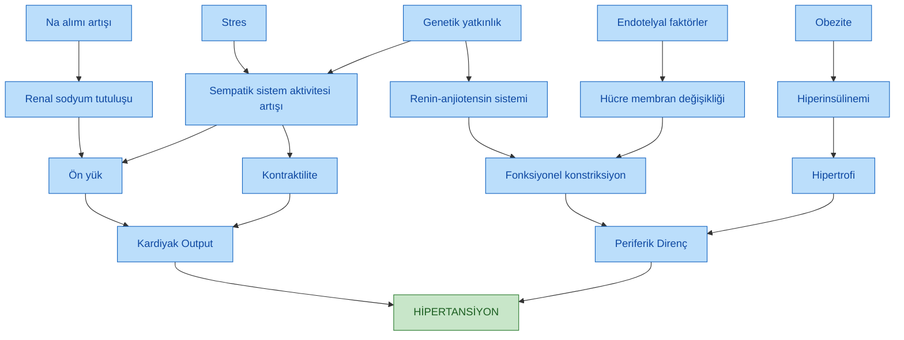
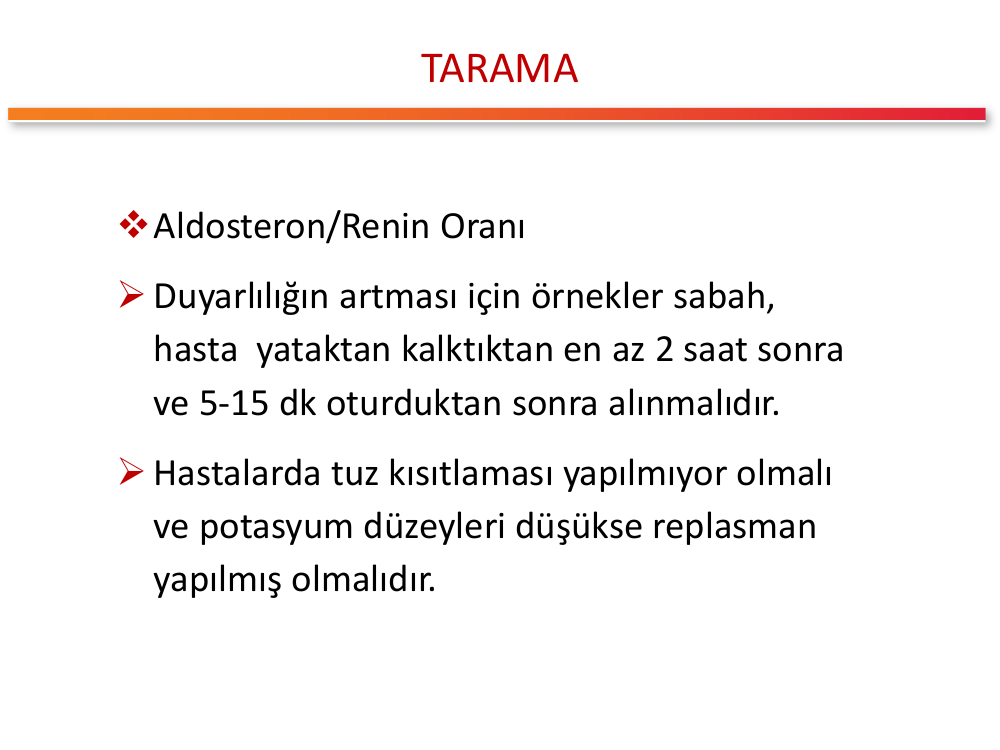
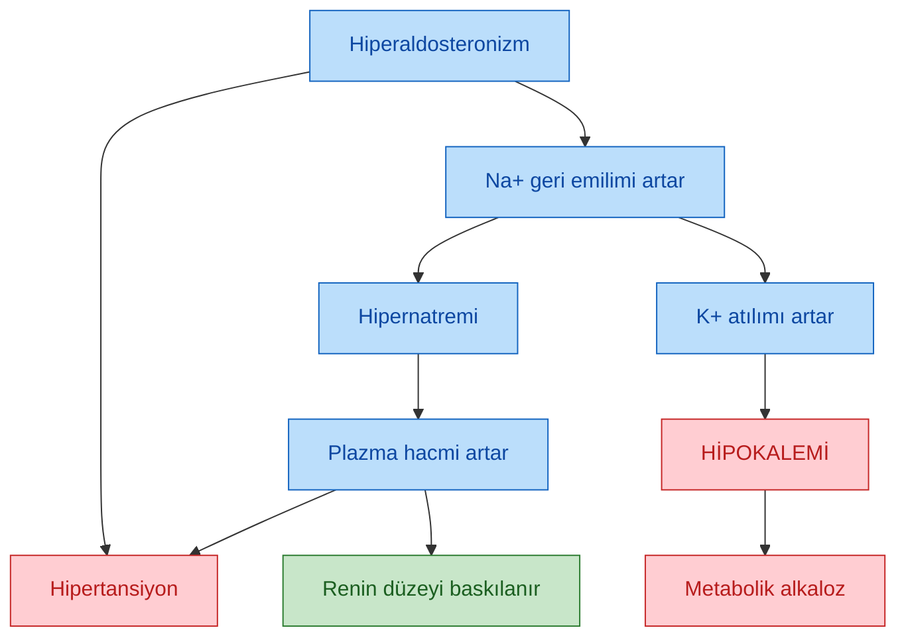
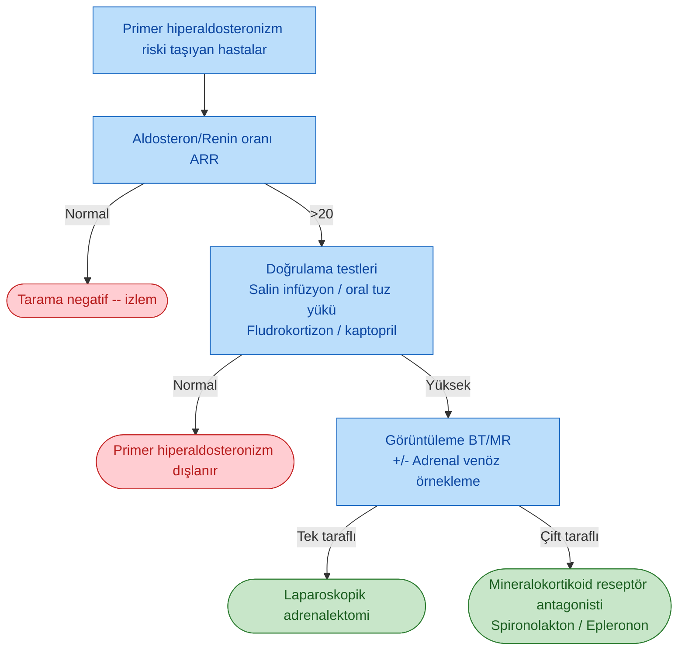

# SEKONDER HİPERTANSİYON

**Hazırlayan:** Prof. Dr. Engin Güney
**Bölüm:** Aydın Adnan Menderes Üniversitesi -- Endokrinoloji ve Metabolizma Hastalıkları Bilim Dalı

---

## İÇİNDEKİLER

1. [Hipertansiyon Tanımı ve Fizyopatolojisi](#hipertansiyon-tanımı-ve-fizyopatolojisi)
2. [Sekonder Hipertansiyon -- Genel Yaklaşım](#sekonder-hipertansiyon----genel-yaklaşım)
3. [Ne Zaman Sekonder Hipertansiyondan Şüphelenelim?](#ne-zaman-sekonder-hipertansiyondan-şüphelenelim)
4. [Sekonder HT Nedenlerinin Sınıflaması](#sekonder-ht-nedenlerinin-sınıflaması)
5. [Cushing Sendromu ve Hipertansiyon](#cushing-sendromu-ve-hipertansiyon)
6. [Feokromositoma](#feokromositoma)
7. [Primer Hiperaldosteronizm](#primer-hiperaldosteronizm)
8. [Primer Hiperaldosteronizm -- Kimler Taranmalı?](#primer-hiperaldosteronizm----kimler-taranmalı)
9. [Aldosteron/Renin Oranı (ARR) -- Tarama](#aldosteronrenin-oranı-arr----tarama)
10. [Doğrulama Testleri](#doğrulama-testleri)
11. [Ayırıcı Tanı -- Görüntüleme ve Adrenal Venöz Örnekleme](#ayırıcı-tanı----görüntüleme-ve-adrenal-venöz-örnekleme)
12. [Primer Hiperaldosteronizm Tedavisi](#primer-hiperaldosteronizm-tedavisi)
13. [Primer Hiperaldosteronizm Tanı Algoritması](#primer-hiperaldosteronizm-tanı-algoritması)
14. [Renal Parenkimal ve Renovasküler Hipertansiyon](#renal-parenkimal-ve-renovasküler-hipertansiyon)
15. [Diğer Endokrin Nedenler](#diğer-endokrin-nedenler)
16. [İlaç / Madde Kaynaklı Hipertansiyon](#ilaç--madde-kaynaklı-hipertansiyon)
17. [Obstrüktif Uyku Apne Sendromu (OSAS) ve Aort Koarktasyonu](#obstrüktif-uyku-apne-sendromu-osas-ve-aort-koarktasyonu)
18. [Gebelik ve Hipertansiyon](#gebelik-ve-hipertansiyon)
19. [Yaş-Spesifik Sekonder HT Nedenleri](#yaş-spesifik-sekonder-ht-nedenleri)
20. [Klinik Vakalar](#klinik-vakalar)
21. [Özet -- Kırmızı Bayraklar ve Klinik İnciler](#özet----kırmızı-bayraklar-ve-klinik-inciler)

---

## HİPERTANSİYON TANIMI VE FİZYOPATOLOJİSİ

> **Tanım:** Sistolik kan basıncının **140 mmHg** ve/veya diyastolik kan basıncının **90 mmHg** ve üzerinde olması hipertansiyon (HT) olarak tanımlanır.

> **Temel denklem:** Arteriyal kan basıncı = **Kardiyak output × Periferik direnç**

HT gelişiminde birçok fizyopatolojik faktör aynı anda kardiyak output ve periferik direnci artırarak rol oynar.

> **Şema yorumu:** Hipertansiyon patogenezinde beş ana tetikleyici (Na alımı artışı, stres, genetik yatkınlık, endotelyal faktörler ve obezite) birbirine paralel yolaklarla **kardiyak outputu** (ön yük, kontraktilite üzerinden) ve **periferik direnci** (fonksiyonel konstriksiyon ve hipertrofi üzerinden) artırarak kan basıncını yükseltir. Sempatik sistem aktivasyonu ve renin-anjiotensin sistemi çoğu yolağın ortak dönüm noktasıdır.

---

## SEKONDER HİPERTANSİYON -- GENEL YAKLAŞIM

> **Tanım:** Sekonder hipertansiyon, altta yatan tanımlanabilir bir nedeni (çoğunlukla endokrin, renal, vasküler, nörojenik veya ilaç kaynaklı) olan ve bu nedenin düzeltilmesi ile kan basıncının normale dönebildiği ya da kontrolünün kolaylaştığı HT şeklidir.

* Tüm hipertansif hastaların **yaklaşık %5-10'unu** oluşturur.
* **Dirençli hipertansiyonlu** hastalarda ve genç yaş grubunda sıklığı belirgin olarak daha yüksektir.
* Erken tanı ile **küratif** veya kan basıncı kontrolünü dramatik şekilde iyileştiren tedavi şansı vardır.

---

## NE ZAMAN SEKONDER HİPERTANSİYONDAN ŞÜPHELENELİM?

| Kırmızı Bayrak | Açıklama |
|---|---|
| **Genç yaşta HT** | 30 yaş altında yeni başlayan HT |
| **İleri yaşta ani başlangıçlı HT** | 55 yaş üzeri hastada ani ortaya çıkan ya da ani kötüleşen HT |
| **Dirençli HT** | Biri diüretik olmak üzere uygun dozda 3 antihipertansifle kontrol edilemeyen HT (>140/90 mmHg) |
| **Malign / hızlandırılmış HT** | Ciddi retinopati, akut hedef organ hasarı |
| **Hipokalemi** | Spontan ya da düşük doz diüretikle gelişen hipokalemi (primer hiperaldosteronizm düşündürür) |
| **Paroksismal atak** | Çarpıntı, baş ağrısı, terleme (feokromositoma triadı) |
| **Orantısız hedef organ hasarı** | Kan basıncı yüksekliğinin süresi ve derecesiyle uyumsuz ciddi sol ventrikül hipertrofisi, retinopati, proteinüri |
| **Aile öyküsü yokluğunda HT** | Ailede HT öyküsü olmayan, ancak erken yaşta HT gelişmiş hasta |
| **Abdominal üfürüm** | Renovasküler HT şüphesi |
| **Santrifugal obezite, mor stria, proksimal güçsüzlük** | Cushing sendromu |
| **İlaç / madde kullanımı** | OKS, NSAID, steroid, sempatomimetik, kokain, efedra, siklosporin |

---

## SEKONDER HT NEDENLERİNİN SINIFLAMASI

Sekonder hipertansiyona yol açan endokrin hastalıklar üç ana grupta toplanabilir:

1. **Kortizol fazlalığı ile ilişkili HT** -- Cushing sendromu
2. **Katekolaminlerle ilişkili HT** -- Feokromositoma, paraganglioma
3. **Mineralokortikoidlerle ilişkili HT** -- Primer hiperaldosteronizm, 11-deoksikortikosteron fazlalığı, Liddle sendromu, görünür mineralokortikoid fazlalığı (AME), glukokortikoidle düzelebilen hiperaldosteronizm

Bunlara ek olarak **non-endokrin sekonder HT nedenleri** de vardır:

* **Renal parenkimal** (kronik böbrek hastalığı, glomerülonefritler, polikistik böbrek)
* **Renovasküler** (fibromusküler displazi, aterosklerotik renal arter stenozu)
* **Tiroid** (hipo/hipertiroidi), **primer hiperparatiroidi**, **akromegali**
* **Obstrüktif uyku apne sendromu (OSAS)**
* **Aort koarktasyonu**
* **İlaç / madde kaynaklı HT**
* **Gebelik HT / preeklampsi / HELLP**
* **Nörojenik** (intrakranial basınç artışı, kuadripleji, akut porfiri)

---

## CUSHİNG SENDROMU VE HİPERTANSİYON

Cushing sendromunda HT prevalansı **%75-85** civarındadır ve multifaktöriyeldir.

### Hipertansiyon Mekanizmaları

* **Renin-anjiotensin sistemi aktivasyonu:** Glukokortikoidler karaciğerde anjiotensinogen sentezini artırır ve bunun sonucunda renin-anjiotensin sistemi aktive olarak kardiyak output artar.
* **Vazodilatör prostaglandin sentezinde azalma:** Fosfolipaz A2 inhibisyonu sonucu prostaglandin üretimi azalır.
* **Kallikrein-kinin sisteminde baskılanma:** Vazodilatör kinin komponentlerinde azalma oluşur.
* **Vasküler duyarlılık artışı:** Epinefrin, norepinefrin ve anjiotensin II gibi endojen vazokonstrüktörlere damar duyarlılığı artar.
* **Damar düz kas hücrelerine sodyum girişi artar** -- hücre içi sodyum artışı vazokonstriksiyona katkı sağlar.
* **Mineralokortikoid etki:** Ektopik ACTH sendromunda artmış **deoksikortikosteron** ve çok yüksek **kortizol** düzeyleri, 11β-hidroksisteroid dehidrogenaz enziminin satüre olması nedeniyle mineralokortikoid reseptörlerine bağlanarak Na retansiyonu ve hipokalemi yapar.
* **Adrenal karsinom** olgularında aldosteron ve deoksikortikosteron düzeyleri de artabilir.

> **💡 Klinik inci:** 11β-hidroksisteroid dehidrogenaz enzimi normalde kortizolu kortizona çevirerek mineralokortikoid reseptörünü korur. Cushing'te bu koruyucu mekanizma **satüre olur**; kortizol mineralokortikoid etki göstererek hipokalemik alkaloza ve HT'ye yol açar.

### Cushing Sendromu HT'sinde Tedavi

* Tedavinin temeli **altta yatan nedenin düzeltilmesidir** (transsfenoidal cerrahi, adrenalektomi, ektopik odak eksizyonu).
* Medikal kontrolde **spironolakton**, **epleronon**, ACEi/ARB ve kalsiyum kanal blokerleri tercih edilir.
* Gerekirse ketokonazol, metirapon ya da osilodrostat gibi steroidogenez inhibitörleri kullanılır.

---

## FEOKROMOSİTOMA

> **Tanım:** Feokromositoma, **sempatik sinir sisteminin kromaffin hücrelerinden** köken alan ve **epinefrin, norepinefrin, bazı olgularda da dopamin** salgılayan tümörlerdir. Adrenal meduller yerleşimli olanlara feokromositoma, ekstra-adrenal olanlara **paraganglioma** denir.

* Her yaşta görülebilir, ancak en sık **4. ve 5. dekadlarda** ortaya çıkar.
* Hipertansif hastaların yaklaşık **%0.1-0.6**'sında saptanır; ancak **tedavi edilmezse mortalitesi yüksektir**.
* **"%10 kuralı":** %10 bilateral, %10 ekstra-adrenal (paraganglioma), %10 malign, %10 çocukta, %10 familyal (günümüzde familyal oran daha yüksek kabul edilir, yaklaşık %30-40).

### Feokromositoma ile Birlikte Görülen Sendromlar

| Sendrom | Gen | Eşlik Eden Tümörler |
|---|---|---|
| **MEN 2A** | **RET** | Feokromositoma + Medüller tiroid karsinomu + Paratiroid adenomu |
| **MEN 2B** | **RET** | Feokromositoma + Medüller tiroid karsinomu + Mukozal nöromalar + Marfanoid habitus |
| **von Hippel-Lindau (VHL)** | **VHL** | Feokromositoma + Retinal hemanjiyoblastom + SSS hemanjiyoblastomu + Berrak hücreli renal karsinom |
| **Nörofibromatozis tip 1 (NF1)** | **NF1** | Feokromositoma + Café-au-lait lekeleri + Nörofibromlar |
| **Familyal paraganglioma** | **SDHB, SDHC, SDHD, SDHA, SDHAF2** | Baş-boyun paragangliomaları, abdominal paragangliomalar (SDHB → malign potansiyel ↑) |

### Feokromositomanın 5P'si (Klasik Semptomlar)

1. **P**ressure (hipertansiyon)
2. **P**ain (baş ağrısı)
3. **P**erspiration (terleme)
4. **P**alpitation (çarpıntı)
5. **P**allor (solukluk)

### Klinik

* Olguların çoğunda semptomlar **süreklidir**, ancak şiddet değiştiğinden **paroksismal** olarak algılanır.
* Az bir bölümünde ataklar arasındaki dönemde bulgu görülmez.
* Bazı olgularda klinik bulgular minimaldir ve **tesadüfen (insidentaloma)** saptanır.

### Atak Sırasındaki Klinik Bulgular

* **Güçlü kalp atımı (palpitasyon)**
* **Baş ağrısı** (klasik olarak zonklayıcı)
* **Yüzde solukluk** (flushing değil, pallor hakimdir -- norepinefrin etkisi)
* **Soğuk, nemli eller ve ayaklar**
* Bazı olgularda **flushing**
* **Hipertansiyon** (paroksismal veya sürekli)

### Atak Özellikleri

* Ataklar genellikle **haftada birkaç kez** görülür ve **yaklaşık 15 dakika** sürer.
* Zaman geçtikçe **atak sıklıkları artar**, ancak atak özellikleri değişmez.
* Tümörün sıkışmasına yol açan hareketler (karna bası, eğilme), emosyonel değişiklikler, anksiyete, idrar yapma (mesane paragangliomasında), anestezi indüksiyonu atağı tetikleyebilir.

### Tanı -- Biyokimyasal Testler

> **Temel prensip:** Plazma serbest metanefrinler ya da 24 saatlik idrar fraksiyonlanmış metanefrinleri **en duyarlı** testlerdir ve ilk basamakta kullanılır.

**24 saatlik idrarda bakılacak testler:**

* **Metanefrinler** (metanefrin + normetanefrin) -- duyarlılığı yüksek
* **Vanilmandelik asit (VMA)** -- özgüllüğü yüksek, duyarlılığı düşük

**Plazma testleri:**

* **Plazma katekolamin düzeyleri** (norepinefrin, epinefrin, dopamin)
* **Plazma serbest metanefrinler** (en yüksek duyarlılık, taramada tercih edilir)

### İdrar Örneği Toplamada Dikkat Edilecekler

* İdrar örneğinin sağlıklı olması için dikkatli olunmalıdır.
* **Atak sırasında toplanmaya başlanan 24 saatlik idrar** düzeyleri daha değerlidir.
* Ölçümleri etkilediği bilinen ilaçların (triskiklik antidepresanlar, fenoksibenzamin, labetalol, levodopa, MAOI, sempatomimetikler, asetaminofen) kesilmesi çok önemlidir.
* Örnekleme öncesinde **kahve, çay, çikolata, vanilyalı ürünler, muz** gibi yiyeceklerden kaçınılması önerilir.

### Lokalizasyon Çalışmaları

* **Bilgisayarlı tomografi (BT)** -- ilk tercih, yüksek duyarlılık
* **Manyetik rezonans (MR)** -- T2'de "ampul parlaklığı" (light-bulb sign)
* **MIBG sintigrafisi (I-123 MIBG)** -- fonksiyonel görüntüleme, ekstra-adrenal ve metastaz değerlendirmesi
* **Octreotide (somatostatin reseptör) sintigrafisi** -- özellikle MIBG-negatif paragangliomada
* **68Ga-DOTATATE PET/BT** -- güncel en duyarlı fonksiyonel görüntüleme
* **Adrenal venöz örnekleme** -- nadiren ayırıcı tanıda kullanılır

### Tedavi

> **Tedavinin temeli CERRAHİDİR** (laparoskopik adrenalektomi).

**Preoperatif hazırlık kritik önemdedir:**

* **Cerrahiden önce en az 10-14 gün** α-adrenerjik reseptör antagonistleri ile tedavi edilmelidir.
* **Fenoksibenzamin** (non-selektif α-bloker, tercih edilen) veya **doksazosin** (selektif α1-bloker) kullanılır.
* Yeterli α-blokaj sağlandıktan sonra (postüral hipotansiyon, burun tıkanıklığı gözlenmesi) gerekirse **β-bloker** eklenir.
* **⚠️ ÖNEMLİ:** α-blokaj yapılmadan **asla β-bloker verilmez** -- karşıtsız α-stimülasyonu hipertansif krize ve akut sol ventrikül yetmezliğine yol açar.
* Hasta tuzdan zengin beslenmeli; gerekirse intravenöz sıvı ile volüm genişletilmelidir.
* Alternatif olarak kalsiyum kanal blokerleri ve metirozin (tirozin hidroksilaz inhibitörü, katekolamin sentezini azaltır) kullanılabilir.

**İntraoperatif:**

* Anestezi ya da tümör manipülasyonuna bağlı **hipertansif krizin** önlenmesi için yeterli preoperatif blokaj şarttır.
* Tümör damarının bağlanmasından sonra ani hipotansiyon gelişebilir -- sıvı replasmanı ve gerekirse vazopressör desteği verilir.

**Postoperatif izlem:**

* İlk 24-48 saatte hipoglisemi ve hipotansiyon açısından dikkat.
* Metanefrin düzeyleri **2-4 hafta sonra** normalleşir; takipte kullanılır.
* **Ömür boyu yıllık takip** (rekürens ve ikincil tümörler açısından).

---

## PRİMER HİPERALDOSTERONİZM

> **Şema yorumu:** J.W. Conn, 1955 yılında ilk kez **primer aldosteronizmi** tanımladı (J Clin Lab Med 1955; 45:661-664). İndeks vaka **34 yaşında kadın** hastada **hipertansiyon + hipokalemi + aldosteron üreten adenom** üçlüsü ile gelmişti. Görseldeki makroskopik adrenal adenom, tipik olarak **altın-sarı renkli** kesit yüzü gösterir (kolesterol ester içeriği); çapı genellikle 1-3 cm arasındadır ("Conn adenomu"). Hastalık bugün **"Conn sendromu"** olarak da anılmaktadır.

### Mineralokortikoid Aktivitesi Olan Steroidler

* **Aldosteron** (esas mineralokortikoid)
* **11-deoksikortikosteron (DOC)**
* **Kortizol** (aldosterona benzer reseptör afinitesine sahip; serbest düzeyi aldosterondan ~100 kat yüksek; normalde hedef dokularda 11β-HSD ile kortizona çevrilerek inaktive edilir)

### Aldosteron Metabolizmi

* Aldosteronun **%30-50'si** plazmada serbest formdadır.
* **Karaciğerde hızla inaktive olur**.
* Metabolitleri: **tetrahidroaldosteron** ve **aldosteron-18-glukuronid**.
* 11-deoksikortikosteronun ise **%5'ten azı** serbest formdadır.

### Mineralokortikoid Reseptör Seçiciliği

* Kortizol, aldosterona benzer mineralokortikoid reseptör afinitesine sahiptir ve dolaşımdaki serbest düzeyleri **aldosterondan yaklaşık 100 kat yüksektir**.
* Hedef dokularda (böbrek distal tubulus) **11β-hidroksisteroid dehidrogenaz tip 2 (11β-HSD2)** enzimi ile kortizona dönüştürülerek mineralokortikoid aktivite göstermesi engellenir.
* Bu enzim **meyan kökü (likoris)** ve **glisirrizin** tarafından inhibe edilerek "görünür mineralokortikoid fazlalığı" (AME) tablosu oluşturabilir.

### Aldosteronun Böbrekteki Etkisi

* Mineralokortikoidler **sıvı volümünün düzenlenmesi ve potasyum metabolizması** üzerine etkilidir.
* Aldosteron esas etkisini **kollektör kanallar ve distal tubuluslarda** gösterir.
* **Na reabsorpsiyonunu** ve **K sekresyonunu** artırır.
* Ayrıca **H+ sekresyonunu artırarak metabolik alkaloza** neden olur.

### Kaçış Fenomeni (Escape Phenomenon)

* Aldosteronun etkisi ile **başlangıçta sodyum retansiyonu** olur.
* Daha sonra **natriürez artarak 3-5 gün içinde sodyum dengesi normale döner**.
* Bu durum, tubulusların aldosteronun sodyum tutucu etkisine **duyarsız hale gelmesi sonucudur (kaçış fenomeni)**.
* Kaçış olsa da potasyum kaybı devam eder ve HT süreğenleşir.

### Primer Hiperaldosteronizm Fizyopatolojisi

> **Şema yorumu:** Aldosteron fazlalığı iki ana yolla HT yaratır. Birincisi, böbrekte **Na geri emiliminin** artması sonucu gelişen **hipernatremi ve plazma hacmi artışı** doğrudan kan basıncını yükseltir. İkinci yolla **K atılımı** artar, **hipokalemi ve metabolik alkaloz** gelişir. Plazma hacmi artışı nedeniyle **renin baskılanır** -- bu da tanıda **yüksek aldosteron / düşük renin** kombinasyonunu oluşturan temel mekanizmadır.

### Primer Hiperaldosteronizm Nedenleri

| Neden | Sıklık | Özellik |
|---|---|---|
| **Bilateral idiyopatik adrenal hiperplazi (IHA)** | %60-70 | En sık neden; medikal tedavi endikasyonu |
| **Aldosteron üreten adenom (APA -- Conn adenomu)** | %30-40 | Cerrahi ile küratif tedavi şansı |
| **Aldosteron üreten karsinom** | <%1 | Büyük boyut, heterojen görünüm, metastaz |
| **Familyal hiperaldosteronizm tip I (GRA)** | <%1 | Glukokortikoidle baskılanabilir; CYP11B1/B2 füzyon geni |
| **Familyal hiperaldosteronizm tip II-IV** | Çok nadir | KCNJ5, CACNA1D, CACNA1H, CLCN2 mutasyonları |
| **Unilateral adrenal hiperplazi** | Nadir | Tek taraflı cerrahi küratif olabilir |

### Primer Hiperaldosteronizm -- Epidemiyoloji ve Tarama Oranları

* Primer hiperaldosteronizm araştırması önerilen kişiler, hipertansif hastaların **yaklaşık %50'sini** kapsar.
* Gerçek yaşam verileri tarama oranlarının çok düşük olduğunu ve primer hiperaldosteronizmin sekonder hipertansiyonun **yeterince tanı konmayan ve tedavi edilmeyen bir nedeni** olduğunu ortaya koymaktadır.
* Primer hiperaldosteronizmli hastaların **%1'inden azı** yaşamları boyunca taranmakta ve tedavi edilmektedir (Reincke M et al. Lancet Diabetes Endocrinol 2021; 9:876-892).

---

## PRİMER HİPERALDOSTERONİZM -- KİMLER TARANMALI?

**Endocrine Society 2016 kılavuzuna göre tarama endikasyonları:**

* **Hipertansiyon + spontan ya da diüretikle ilişkili hipokalemi**
* **Hipertansiyon + adrenal insidentaloma**
* **Hipertansiyon + obstrüktif uyku apnesi**
* **Hipertansiyon + ailede erken başlangıçlı HT ya da serebrovasküler olay (<40 yaş) öyküsü**
* **Primer hiperaldosteronizmli hastaların hipertansif 1. derece yakınları**
* **Farklı günlerde yapılan 3 ölçümde kan basıncı 150/100 mmHg üzeri** saptanan hastalar
* **Biri diüretik olmak üzere 3 antihipertansif ilaca karşın kan basıncı >140/90 mmHg** olan hastalar (dirençli HT)
* **4 ya da daha fazla antihipertansifle kontrol altındaki (<140/90 mmHg) hastalar**

*(Funder JW et al. J Clin Endocrinol Metab 2016; 101:1889-1916)*

---

## ALDOSTERON/RENİN ORANI (ARR) -- TARAMA

> **Prensip:** Primer hiperaldosteronizmin tarama testi **aldosteron/renin oranıdır (ARR)**. Yüksek aldosteron düzeyi varlığında düşük-baskılı renin bulunması tanıyı destekler.

### Örnek Alma Kuralları

* Örnekler **sabah** alınmalıdır.
* Hasta yataktan kalktıktan **en az 2 saat sonra** ve örneği almadan önce **5-15 dakika oturduktan sonra** kan alınmalıdır.
* Hastalarda **tuz kısıtlaması yapılmıyor olmalıdır** (normal sodyum alımı).
* Potasyum düzeyleri düşükse **replasmanla normale getirilmiş olmalıdır** (hipokalemi aldosteronu baskılar; yanlış negatiflik yaratır).

### ARR'yi Etkileyen İlaçlar

| İlaç Sınıfı | Aldosteron | Renin | ARR Etkisi | Öneri |
|---|---|---|---|---|
| **Mineralokortikoid reseptör antagonistleri** (spironolakton, epleronon) | ↑ | ↑↑ | Yanlış negatif | **4-6 hafta önce kesilmeli** |
| **Diüretikler** (tiyazid, loop) | ↑ | ↑↑ | Yanlış negatif | 2-4 hafta kesilmeli |
| **ACEi / ARB** | ↓ | ↑↑ | Yanlış negatif | 2 hafta kesilmeli (mümkünse) |
| **β-blokerler** | ↓ | ↓↓ | Yanlış pozitif | 2 hafta kesilmeli |
| **α2-agonistler (klonidin)** | ↓ | ↓↓ | Yanlış pozitif | 2 hafta kesilmeli |
| **NSAID'ler** | ↓ | ↓↓ | Yanlış pozitif | Kesilmeli |
| **Verapamil SR, hidralazin, doksazosin** | Etkisiz | Etkisiz | **Güvenli** | Gerekirse bu ilaçlarla kontrol sağlanabilir |

### ARR Değerlendirmesi

* **ARR > 20 (bazı merkezlerde >30)** ve **plazma aldosteronu > 15 ng/dL** ise primer hiperaldosteronizm için tarama pozitif kabul edilir.
* Pozitif tarama sonrası **doğrulama testi** yapılmalıdır.

---

## DOĞRULAMA TESTLERİ

Doğrulama testleri aldosteronun **Na yüklemesi ile baskılanmamasını** göstererek tanıyı pekiştirir.

* **Salin infüzyon testi**
* **Oral tuz yükleme testi**
* **Fludrokortizon baskılama testi**
* **Kaptopril testi**

*(Funder JW et al. J Clin Endocrinol Metab 2016; 101:1889-1916)*

### Salin İnfüzyon Testi

* Hastalar testten önceki **1 saat** ve test süresince **yatar durumda** olmalıdır.
* Teste sabah **08:00-09:30 arasında** başlanmalıdır.
* **2 litre %0.9 NaCl, 4 saatte** infüze edilir.
* Test **kontrolsüz HT, böbrek yetmezliği, aritmi ve ciddi hipokalemisi olan hastalarda yapılmamalıdır**.

**Yorumlama:**

* Aldosteron düzeyi **<5 μg/gün (5 ng/dL)** ise primer hiperaldosteronizm olasılığı **düşüktür**.
* Aldosteron düzeyi **>10 μg/gün (10 ng/dL)** ise primer hiperaldosteronizm olasılığı **çok yüksektir**.

### Oral Tuz Yükleme Testi

* Hastanın **3 gün, 6 g/gün tuz** alması sağlanmalıdır.
* Normal potasyum düzeylerini sürdürmek için **potasyum replasmanı** yapılmalıdır.
* **Testin 3. günü 24 saatlik idrar toplanır** (aldosteron ve Na ölçümü).
* Kontrolsüz HT, böbrek yetmezliği, aritmi ve ciddi hipokalemide **kontrendikedir**.

**Yorumlama:**

* İdrar aldosteronu **<10 μg/gün** ise primer hiperaldosteronizm olasılığı **düşüktür**.
* İdrar aldosteronu **>14 μg/gün** ise primer hiperaldosteronizm olasılığı **çok yüksektir** (idrar Na >200 mmol/gün olması kaydıyla -- yeterli tuz yükünün göstergesi).

### Fludrokortizon Baskılama Testi

* Hastalara **4 gün boyunca, 6 saatte bir 0.1 mg fludrokortizon** verilir.
* **KCl ve NaCl replasmanı** yapılmalıdır.
* **4. günün 10:00**'da alınan kanda plazma aldosteron düzeyi değerlendirilir.
* Plazma aldosteron düzeyinin **>6 ng/dL** olması primer hiperaldosteronizm tanısını destekler.

### Kaptopril Testi

* Hastalara **1 saat oturduktan sonra** 25-50 mg kaptopril verilir.
* Hastalar oturmaya devam ederken **0, 1 ve 2. saatlerde** plazma aldosteronu ve renin aktivitesi ölçülür.
* Plazma aldosteron düzeyi normalde kaptoprille **>%30 baskılanır**.
* Primer hiperaldosteronizmli hastalarda plazma aldosteron düzeyi **yüksek ve plazma renin aktivitesi (PRA) baskılı** olarak devam eder.

> **💡 Klinik inci:** Kaptopril testi **yaşlı, komorbid veya yatarak test yapılamayan hastalarda** güvenli bir ayakta doğrulama testidir; volüm yüklenmesi olmadığından kalp ve böbrek hastalarında avantajlıdır.

---

## AYIRICI TANI -- GÖRÜNTÜLEME VE ADRENAL VENÖZ ÖRNEKLEME

Primer hiperaldosteronizm doğrulandıktan sonra amaç; **cerrahiden yarar görecek tek taraflı hastalığı** (APA / unilateral hiperplazi), **medikal tedavi gereken bilateral hastalıktan (IHA)** ayırmaktır.

### Görüntüleme Yöntemleri

* **Bilgisayarlı tomografi (BT)** -- birinci basamak görüntüleme (ince kesit adrenal BT).
* **Manyetik rezonans (MR)** -- BT'ye alternatif.

**Görüntülemenin sınırları:**

* Öncelikle **nadir bir neden olan aldosteron üreten karsinom** dışlanmalıdır (>4 cm lezyon, heterojen görünüm).
* **Mikroadenomlar (<1 cm) görüntülenemeyebilir**.
* Yaşla birlikte **adrenal insidentalomaların sıklığı artar** ve **yanlış pozitif** sonuç elde edilebilir (nonfonksiyone adenoma karşı aldosteron üreten adenom karışabilir).

### Adrenal Venöz Örnekleme (AVS)

> **Altın standart:** Tek taraflı -- bilateral hastalık ayırımında **adrenal venöz örnekleme** en duyarlı ve özgül yöntemdir.

* Her iki adrenal venden ve alt ana venadan kan örneklenir.
* **Kortizol** ile düzeltilmiş aldosteron oranı hesaplanır.
* **Lateralizasyon indeksi** ≥4 (bazı merkezlerde ≥2-3) olması **tek taraflı aşırı sekresyon** lehinedir.

**Endocrine Society önerisi:**

* **Cerrahi planlanan tüm hastalarda AVS önerilmekle birlikte**, bazı uzmanlar tek taraflı hastalık göstergeleri (genç yaş, tipik adenom görünümü, belirgin hipokalemi) ve hasta tercihini göz önünde tutarak **seçici AVS** önermektedir.
* Özellikle **<35 yaş + klasik biyokimyasal profil + tek taraflı BT lezyonu** durumlarında AVS atlanabilir.

---

## PRİMER HİPERALDOSTERONİZM TEDAVİSİ

### Cerrahi Tedavi

* **Endikasyon:** Tek taraflı adenom (APA) veya unilateral hiperplazi.
* **Yöntem:** **Laparoskopik adrenalektomi** (altın standart).
* Hastaların yaklaşık **%30-60'ında HT tamamen düzelir**, geri kalanında kan basıncı kontrolü belirgin şekilde iyileşir.
* Hipokalemi tüm hastalarda düzelir.

### Medikal Tedavi

**Endikasyonlar:**

* Bilateral hastalık (IHA)
* Cerrahi girişim için uygun olmayan hastalar
* Cerrahi tedavi yerine medikal tedaviyi tercih eden **tek taraflı adenom** olguları

### Preoperatif Hazırlık -- Önemli Dikkat

> **⚠️ ÖNEMLİ:** Primer hiperaldosteronizm nedeniyle adrenalektomi uygulanacak hastalarda **postoperatif dönemde hiporeninemik hipoaldosteronizm (hiperkalemi, hipotansiyon) riski** vardır. Bu nedenle **operasyon öncesinde mineralokortikoid reseptör antagonisti tedavisi ile potasyum ve renin düzeylerinin normale getirilmesi gereklidir** (Vilela LAP, Almeida MQ. Arch Endocrinol Metab 2017; 61(3):305-312).

### Spironolakton

* Aldosteronun mineralokortikoid reseptörüne bağlanmasını **kompetetif olarak inhibe eder**.
* **Non-selektif** etkisi nedeniyle androjen reseptörü üzerine **antagonistik** ve progesteron reseptörü üzerine **agonistik** etki gösterir.
* Bu etkiler; **jinekomasti, erektil disfonksiyon ve menstrüasyon düzensizlikleri** gibi yan etkilerinin temelidir.

**Doz:**

* **50 mg/gün** başlanmalı ve **3-4 haftada bir 50 mg** artırılmalıdır.
* Yan etki riski dozla orantılı olarak artar.

**Jinekomasti sıklığı:**

| Doz | Jinekomasti Oranı |
|---|---|
| **<50 mg/gün** | **%6.9** |
| **>150 mg/gün** | **%52** |

### Epleronon

* **Selektif mineralokortikoid reseptör antagonisti** olan epleronon, androjen ve progesteron reseptör etkileşimi yapmadığından **jinekomasti ve seksüel yan etki yaratmaz**.
* Ancak spironolaktona oranla **etkinliği daha düşük** ve **maliyeti daha yüksektir**.
* Genellikle **25-50 mg 2x1** dozunda kullanılır.

### Diğer Ajanlar

* **Amiloride ve triamteren** -- epitelyal Na kanal blokerleri; hipokalemi kontrolünde ek tedavi olarak kullanılabilir.
* **Finerenon** -- yeni nesil nonsteroidal selektif MRA; öncelikle diyabetik nefropatide onaylı, primer hiperaldosteronizmde yeri araştırılıyor.

### Tedavi Takibi ve Kardiyovasküler Risk

> **⚠️ ÖNEMLİ:** Kardiyovasküler olay ve mortalite riski artışı, mineralokortikoid reseptör antagonisti ile tedavi edilen hastalarda **sadece renin aktivitesi baskılı (<1 μg/L/saat) kalmaya devam eden** hastalarda görülür.

> **💡 Klinik inci:** Artmış kardiyovasküler riskten kaçınmak için **doz titrasyonunun kan basıncı kontrolü yerine plazma renin aktivitesinde yükselmeye göre yapılması** daha yararlı olur. Renin baskılı kaldıkça mineralokortikoid reseptör aktivasyonu devam etmektedir -- hedef renin aktivitesinin **"unsuppressed"** hale gelmesidir.

---

## PRİMER HİPERALDOSTERONİZM TANI ALGORİTMASI

> **Şema yorumu:** Risk gruplarında ilk basamak **aldosteron/renin oranı (ARR)** ölçümüdür. Oran >20 ise dört doğrulama testinden biri ile aldosteron aşırı sekresyonu ispatlanır. Doğrulanmış hastalarda **BT/MR** ve gerektiğinde **adrenal venöz örnekleme** ile lateralizasyon sağlanır. **Tek taraflı hastalıkta laparoskopik adrenalektomi** kür şansı yaratır; **çift taraflı hastalıkta** ise mineralokortikoid reseptör antagonisti (spironolakton / epleronon) medikal tedavinin temelidir (Güney E, Aldosteron üreten adrenal adenomlar. Türkiye Klinikleri Özel Sayısı 2019; 36-41).

---

## RENAL PARENKİMAL VE RENOVASKÜLER HİPERTANSİYON

### Renal Parenkimal HT

Sekonder HT'nin **en sık nedenidir** (tüm sekonder HT'nin %2-5'i, erişkin HT hastalarının yaklaşık %2-3'ü).

**Nedenler:**

* **Kronik böbrek hastalığı** (diyabetik nefropati, hipertansif nefroskleroz)
* **Glomerülonefritler** (IgA nefropatisi, FSGS, membranöz GN, lupus nefriti)
* **Polikistik böbrek hastalığı (otozomal dominant)**
* **Reflü nefropatisi, obstrüktif üropati**
* **Tübülointerstisyel nefritler**

**Mekanizma:** Sodyum-su retansiyonu + renin-anjiotensin sistemi aktivasyonu + sempatik sistem aktivasyonu + vazodilatör yetersizliği.

**Tanıda:** Kreatinin, tahmini GFR, tam idrar tetkiki (proteinüri, hematüri, eritrosit silendirleri), idrar protein/kreatinin oranı, böbrek ultrasonu (boyut, kistler, hidronefroz).

### Renovasküler HT

**İki ana etiyolojik grup:**

| Özellik | Fibromusküler Displazi (FMD) | Aterosklerotik Renal Arter Stenozu |
|---|---|---|
| **Tipik yaş/cinsiyet** | **Genç kadın** (15-50 yaş) | **Yaşlı erkek** (>50 yaş), sigara içici |
| **Lokalizasyon** | Distal 2/3 renal arter, medial fibroplazi -- **"tesbih/dizi boncuğu" görünümü** | Ostial ya da proksimal 1/3 |
| **Bilaterallik** | %35 bilateral | %30-50 bilateral |
| **Eşlik eden hastalık** | Karotis ve serebral anevrizma riski | Yaygın ateroskleroz (koroner, serebrovasküler, PAH) |
| **Seyir** | Genellikle progresyon yavaş | Progresif, oklüzyona gidebilir |
| **Tedavi** | **PTA (balon anjiyoplasti -- stentsiz)** | **PTRA + stent** ya da medikal |

**Klinik ipuçları:**

* Abdominal veya renal arterde **üfürüm (sistolik + diyastolik)**
* **ACEi/ARB başlanmasından sonra kreatininde >%30 artış** (özellikle bilateral stenozda)
* Ani başlangıçlı veya kötüleşen HT
* Asimetrik böbrek boyutu (>1.5 cm fark)
* Rekürrens akciğer ödemi (flash pulmonary edema)

**Tanı yöntemleri:**

* **Renal arter Doppler USG** (ilk basamak, operatör bağımlı)
* **BT anjiyografi** veya **MR anjiyografi** (tercih edilen noninvaziv yöntemler)
* **Dijital substraksiyon anjiyografi (DSA)** -- altın standart, genellikle girişim sırasında yapılır
* **Kaptopril renografi** ve **renal ven renin ölçümü** -- günümüzde daha az kullanılır

**⚠️ Tedavi dikkatleri:**

* **Bilateral** renal arter stenozunda ya da **tek böbrekli hastada tek taraflı stenoz** varsa, **ACEi/ARB kullanımı akut böbrek hasarına** yol açabilir.
* Aterosklerotik stenoz çoğu zaman medikal tedavi ile yönetilir; stent sadece dirençli HT, progresif böbrek yetmezliği veya rekürrens akciğer ödeminde düşünülür (**CORAL çalışması** rutin stent üstünlüğünü göstermemiştir).
* FMD'de anjiyoplasti kür şansı yüksektir ve ilk tercihtir.

---

## DİĞER ENDOKRİN NEDENLER

### Tiroid Hastalıkları

**Hipertiroidi:**

* **Sistolik HT** baskındır, nabız basıncı geniştir.
* Sempatik aktivasyon, kardiyak output artışı, β-reseptör duyarlılığı artışı.
* Tedavi: antitiroid ajan ± β-bloker.

**Hipotiroidi:**

* **Diyastolik HT** baskındır.
* Periferik vasküler direnç artışı, myokard kontraktilitesi azalır.
* Tedavi: levotiroksin replasmanı.

### Primer Hiperparatiroidi

* Serum kalsiyum artışı → vasküler düz kas kontraktilitesi artar, vasküler kalsifikasyon gelişir.
* Hiperkalseminin renal etkileri (nefrokalsinoz) ve RAS aktivasyonu HT'ye katkıda bulunur.
* Paratiroidektomi bazen HT'yi düzeltebilir.

### Akromegali

* Büyüme hormonu / IGF-1 fazlalığı → sodyum retansiyonu, plazma volüm artışı, sol ventrikül hipertrofisi.
* HT sıklığı **%30-50** civarındadır.
* OSAS sıklıkla eşlik eder ve HT'ye katkı sağlar.
* Tedavi: transsfenoidal cerrahi, somatostatin analogları (oktreotid, lanreotid), pegvisomant.

---

## İLAÇ / MADDE KAYNAKLI HİPERTANSİYON

| Sınıf | Örnekler | Mekanizma |
|---|---|---|
| **Oral kontraseptifler** | Estrojen içerikli OKS | Anjiyotensinogen sentezi artışı |
| **NSAID'ler** | İbuprofen, naproksen, selektif COX-2 inh. | Renal vazodilatör prostaglandin inhibisyonu, Na retansiyonu |
| **Glukokortikoidler** | Prednizolon, deksametazon | Mineralokortikoid etki, vasküler duyarlılık artışı |
| **Kalsinörin inhibitörleri** | **Siklosporin, takrolimus** | Renal vazokonstriksiyon, RAS aktivasyonu |
| **Eritropoetin** | rHuEPO | Vasküler direnç artışı, endotelin artışı |
| **VEGF inhibitörleri** | Bevasizumab, sunitinib, sorafenib, aksitinib | NO üretim azalması, endotel disfonksiyonu |
| **Sempatomimetikler** | Dekonjestanlar (psödoefedrin), **efedra**, pseudoefedrin | α-adrenerjik vazokonstriksiyon |
| **Rekrasyonel ilaçlar** | **Kokain, amfetamin, metamfetamin, ekstazi (MDMA)** | Ani sempatik deşarj, hipertansif kriz |
| **Meyan kökü (likoris)** | Glisirrizik asit | 11β-HSD2 inhibisyonu -- AME tablosu |
| **MAO inhibitörleri + tiramin** | Peynir reaksiyonu | Sempatik kriz |
| **Alkol ve kronik aşırı kafein** | -- | Sempatik aktivasyon |

> **💡 Klinik inci:** Yeni başlayan ya da kontrolden çıkan HT'de **mutlaka tüm ilaç, reçetesiz ürün, bitkisel destek ve rekrasyonel madde kullanımı** sorgulanmalıdır.

---

## OBSTRÜKTİF UYKU APNE SENDROMU (OSAS) VE AORT KOARKTASYONU

### OSAS ve HT

* Dirençli hipertansiyonlu hastalarda **%70'e varan sıklıkta** eşlik eder.
* Mekanizma: tekrarlayan hipoksi-hiperkapni → sempatik aktivasyon, endotel disfonksiyonu, RAS aktivasyonu, oksidatif stres.
* **Gece "non-dipper" patern** (gece kan basıncı düşmez) tipiktir.
* Tarama: Epworth Uykululuk Skalası, STOP-BANG sorgusu; doğrulama **polisomnografi** ile.
* Tedavi: **CPAP**, kilo verme, pozisyon tedavisi; HT üzerindeki etkisi ılımlıdır ancak dirençli HT hastalarında anlamlıdır.

### Aort Koarktasyonu

* **Genç/adölesan HT**'de önemli bir neden; çocuk yaştaki sekonder HT'nin önde gelen sebeplerindendir.
* Klinik: **üst ekstremitede yüksek, alt ekstremitede düşük kan basıncı**; femoral nabızların geç ve zayıf olması (**radial-femoral gecikme**).
* Fizik muayenede: interskapular sistolik üfürüm, aort kapağı üzerinde sistolik ejeksiyon kliği.
* Tanı: ekokardiyografi, BT/MR anjiyografi.
* Tedavi: cerrahi onarım veya **perkütan balon anjiyoplasti + stent**.

---

## GEBELİK VE HİPERTANSİYON

Gebelikte HT dört kategoride değerlendirilir:

| Kategori | Tanım |
|---|---|
| **Kronik HT** | Gebelik öncesi veya <20. haftada mevcut HT |
| **Gestasyonel HT** | 20. haftadan sonra proteinürisiz yeni başlangıçlı HT, postpartum düzelir |
| **Preeklampsi** | 20. haftadan sonra HT + **proteinüri (≥300 mg/24 saat)** veya hedef organ tutulumu (trombositopeni, karaciğer enzim artışı, böbrek yetmezliği, pulmoner ödem, serebral/görsel semptomlar) |
| **Süperempoze preeklampsi** | Kronik HT zemininde preeklampsi |

### Preeklampsi Ağır Kriterleri

* **TA ≥160/110 mmHg**
* **Trombositopeni** (<100.000/μL)
* **Karaciğer enzimlerinde artış** (>2x normal üst sınır) veya ciddi sağ üst kadran / epigastrik ağrı
* **Serum kreatinin >1.1 mg/dL** veya başlangıcın iki katı
* **Pulmoner ödem**
* **Yeni başlangıçlı serebral veya görsel semptomlar**

### HELLP Sendromu

* **H**emolysis -- mikroanjiyopatik hemolitik anemi (şistositler, LDH↑, indirekt bilirubin↑, haptoglobin↓)
* **E**levated **L**iver enzymes -- AST/ALT artışı
* **L**ow **P**latelets -- <100.000/μL
* Preeklampsinin ağır formu; acil doğum gerektirir.

### Tedavi Yaklaşımı

* **Kullanılabilir:** **Metildopa**, **labetalol**, **nifedipin**, hidralazin (akut).
* **Kontrendike:** **ACEi, ARB, direkt renin inhibitörleri, spironolakton, atenolol** (özellikle 1. trimesterde).
* Preeklampsi şüphesinde magnezyum sülfat (nöbet profilaksisi), zamanında doğum (34-37 hafta arasında ağır preeklampside).

---

## YAŞ-SPESİFİK SEKONDER HT NEDENLERİ

### Çocuklarda (<12 yaş)

* **Renal parenkimal hastalıklar** (en sık; reflü nefropatisi, glomerülonefritler)
* **Aort koarktasyonu**
* **Renovasküler (FMD, Williams sendromu, NF1)**
* **Endokrin:** Konjenital adrenal hiperplazi, feokromositoma, neuroblastoma

### Adölesan - Genç Erişkin (12-40 yaş)

* **FMD (özellikle genç kadın)**
* **Aort koarktasyonu**
* **Primer hiperaldosteronizm**
* **Feokromositoma (familyal sendromlar)**
* **Renal parenkimal hastalıklar**
* **İlaç / madde kullanımı** (OKS, kokain, amfetamin, anabolik steroidler)

### Orta Yaş (40-60)

* **Primer hiperaldosteronizm (en sık sekonder HT nedeni!)**
* **Renal parenkimal hastalıklar**
* **OSAS**
* **Cushing sendromu**
* **Feokromositoma**

### Yaşlı (>60 yaş)

* **Aterosklerotik renal arter stenozu**
* **İzole sistolik HT** (arteriyel sertleşme)
* **İlaç kaynaklı** (NSAID, glukokortikoid)
* **OSAS**
* **Hipotiroidi, primer hiperparatiroidi**

---

## KLİNİK VAKALAR

**📋 VAKA ÖRNEĞİ 1: Genç Kadın, Hipokalemi ve HT**

**Hasta:** 32 yaşında kadın öğretmen.
**Öykü:** 2 yıldır bilinen HT, amlodipin + valsartan + hidroklorotiyazid ile kontrol sağlanamamış. Son 6 ayda güçsüzlük, noktüri, kas krampları.
**Fizik Muayene:** Nabız 78/dk, **TA 168/102 mmHg**, kardiyak ve abdominal muayene doğal, abdominal üfürüm yok.
**Laboratuvar:** **K+ 2.8 mEq/L**, Na+ 146 mEq/L, kreatinin 0.8 mg/dL, idrar K+ atılımı 48 mEq/gün (artmış), metabolik alkaloz (HCO3- 30 mEq/L).
**Test:** HCTZ ve ARB kesilip doksazosin + verapamil ile replase edildi. K replasmanı sonrası **plazma aldosteron 38 ng/dL, plazma renin aktivitesi 0.2 ng/mL/saat**, **ARR = 190** (>20, pozitif).
**Doğrulama:** Salin infüzyon testi sonrası aldosteron 22 ng/dL (>10) -- doğrulandı.
**Görüntüleme:** Adrenal BT: sol adrenal bezinde **1.4 cm hipodens adenom**.
**Tanı:** **Aldosteron üreten adenom (Conn sendromu)**.
**Tedavi:** Sol laparoskopik adrenalektomi; preoperatif spironolakton 100 mg/gün ile K ve renin normale getirildi.
**İzlem:** Postop 6 ayda TA 124/78 mmHg (tek ilaç), K+ normal.

**Öğretici Notlar:**

1. Dirençli HT + spontan/diüretikle gelişen hipokalemi kombinasyonu primer hiperaldosteronizm için kırmızı bayrak.
2. ARR ölçümünden önce interferans yapan ilaçlar (spironolakton, diüretik, ACEi/ARB, β-bloker) kesilmeli; **doksazosin ve verapamil** güvenli seçenekler.
3. Cerrahi öncesi MRA ile K ve renin normale getirilerek postoperatif hiporeninemik hipoaldosteronizm önlenir.

---

**📋 VAKA ÖRNEĞİ 2: Paroksismal Hipertansif Ataklar**

**Hasta:** 45 yaşında erkek mühendis.
**Öykü:** 1 yıldır haftada 2-3 kez olan zonklayıcı başağrısı, çarpıntı, terleme ve solukluk atakları. Ataklar 10-20 dk sürüyor. Ataklar sırasında evde ölçülen kan basıncı 210/125 mmHg, ataklar arasında 138/86 mmHg.
**Öz / Aile Öyküsü:** Annesinde ve halasında medüller tiroid karsinomu nedeniyle tiroidektomi, bir kuzeninde adrenal bez cerrahisi öyküsü var.
**Fizik Muayene:** Nabız 96/dk, TA (atak dışı) 142/88 mmHg, taşikardi dışında özellik yok.
**Laboratuvar:** **Plazma serbest metanefrin 3.2 nmol/L (normal <0.5)**, **24 saatlik idrar metanefrin 4200 μg/gün (normal <1000)**, kalsitonin 380 pg/mL (↑), CEA hafif artmış.
**Görüntüleme:** Adrenal BT: sağ sürrenalde **4.5 cm heterojen kitle**; MIBG sintigrafisi: sağ adrenalde yoğun tutulum.
**Genetik:** **RET protoonkogen** mutasyonu (+) -- **MEN 2A**.
**Tanı:** MEN 2A ilişkili **sağ adrenal feokromositoma + medüller tiroid karsinomu**.
**Tedavi:**

* Önce feokromositoma cerrahisi planlandı (medüller tiroid karsinomu cerrahisinden **önce**).
* **14 gün fenoksibenzamin** 10 mg 2x1 → 40 mg 2x1'e titrasyon, ardından **propranolol 20 mg 3x1** eklendi; tuzdan zengin diyet.
* Laparoskopik sağ adrenalektomi uygulandı.
* 4 hafta sonra total tiroidektomi + santral boyun diseksiyonu.

**Öğretici Notlar:**

1. Feokromositoma + medüller tiroid karsinomu + paratiroid hastalığı triadı **MEN 2A** düşündürür; tüm aile bireyleri RET taraması için yönlendirilmelidir.
2. **Feokromositoma her zaman MTC'den önce opere edilir** -- aksi halde anestezi sırasında hipertansif kriz ölümcüldür.
3. β-bloker asla α-blokajdan önce başlatılmaz.
4. Biyokimyasal tanıda en duyarlı test **plazma serbest metanefrinler** veya **24 saat idrar fraksiyonlanmış metanefrinleri**dir.

---

**📋 VAKA ÖRNEĞİ 3: Genç Kadında Dirençli HT ve Abdominal Üfürüm**

**Hasta:** 28 yaşında kadın, sigara içmiyor.
**Öykü:** 6 ay önce rutin kontrolde 172/104 mmHg ölçüldü. 3 ilaçla (amlodipin + valsartan + HCTZ) kan basıncı hedefe ulaşmadı. Valsartan başlandıktan 1 hafta sonra kreatinin 0.8'den **1.6 mg/dL**'ye yükseldi.
**Fizik Muayene:** Nabız 72/dk, TA 162/98 mmHg, **abdominal sistolik-diyastolik üfürüm (+)**, femoral nabızlar normal ve zamanında.
**Laboratuvar:** Na+ 140, K+ 3.9, kreatinin (valsartan kesildikten sonra) 0.9 mg/dL.
**Görüntüleme:** Renal arter Doppler'da sol renal arterde yüksek hızlı akım; **BT anjiyografi: sol renal arter orta 1/3'ünde "dizi boncuğu" (string of beads) görünümü**.
**Tanı:** **Fibromusküler displazi -- medial fibroplazi tipi**.
**Tedavi:** **Perkütan transluminal renal anjiyoplasti (PTRA) -- stentsiz**; postprosedür 6 ayda TA 126/80 mmHg (tek ilaç, amlodipin).

**Öğretici Notlar:**

1. Genç, sigara içmeyen kadında yeni HT + abdominal üfürüm → FMD akla gelmeli.
2. ARB başlangıcında kreatinin >%30 yükselişi **bilateral stenoz veya tek böbrekli hastada unilateral stenoz** düşündürür.
3. FMD tedavisinde **balon anjiyoplasti yeterlidir; stent genellikle gerekmez** (aterosklerotik stenozdan farkı).
4. FMD tanısı alan hastalarda ekstrarenal vasküler tutulum (karotis, serebral) araştırılmalıdır.

---

## ÖZET -- KIRMIZI BAYRAKLAR VE KLİNİK İNCİLER

### Sekonder HT İçin Kırmızı Bayraklar

1. **Genç yaşta HT** (<30 yaş) ya da **yaşlıda ani başlangıçlı HT** (>55 yaş)
2. **Dirençli HT** (3 ilaçla kontrol edilemeyen, biri diüretik)
3. **Hipokalemi** (özellikle diüretikle orantısız)
4. **Paroksismal semptomlar** (baş ağrısı, çarpıntı, terleme)
5. **Abdominal üfürüm**, asimetrik böbrek boyutu
6. **Orantısız hedef organ hasarı**
7. **Ailede HT öyküsü yokluğu** veya erken yaşta SVO öyküsü
8. **Santrifugal obezite, striae, proksimal miyopati** (Cushing)
9. **Flash pulmoner ödem** (bilateral renal arter stenozu)
10. **Gece "non-dipper" patern** (OSAS, sekonder nedenler)

### Klinik İnciler

> **💡 "Aldosterone excess, renin suppression":** Primer hiperaldosteronizm tanısının temel biyokimyasal imzası.

> **💡 "First alpha then beta":** Feokromositomada α-blokaj önce, β-bloker sonra -- sıralama hayatidir.

> **💡 "String of beads":** Renal arter BT anjiyografisinde **dizi boncuğu** görünümü FMD'nin klasik bulgusudur.

> **💡 "Light-bulb sign":** T2 MR'da feokromositomanın ampul parlaklığı tipik bulgudur.

> **💡 "Renin hedefi, kan basıncı değil":** Primer hiperaldosteronizm medikal tedavisinde MRA dozu renin aktivitesini baskısızlaştıracak şekilde titre edilir; bu kardiyovasküler sonuçları iyileştirir.

> **💡 "10-14 gün alfa-blokaj":** Feokromositoma cerrahisi öncesi yeterli sürede α-blokaj postüral hipotansiyon ve burun tıkanıklığı ile işaretlenir -- bu klinik belirtiler yeterli blokajın göstergesidir.

> **💡 Gebelikte ACEi / ARB kesinlikle kontrendikedir:** Fetal renal agenezi, oligohidramnios, iskelet anomalileri riski vardır; gebelik planlayan HT hastasında bu ilaçlar kesilmelidir.

---

**Kaynaklar:**

* Funder JW et al. The Management of Primary Aldosteronism: Case Detection, Diagnosis, and Treatment: An Endocrine Society Clinical Practice Guideline. *J Clin Endocrinol Metab* 2016; 101(5):1889-1916.
* Reincke M et al. Diagnosis and treatment of primary aldosteronism. *Lancet Diabetes Endocrinol* 2021; 9:876-892.
* Vilela LAP, Almeida MQ. Diagnosis and management of primary aldosteronism. *Arch Endocrinol Metab* 2017; 61(3):305-312.
* Conn JW. Primary aldosteronism. *J Clin Lab Med* 1955; 45:661-664.
* Güney E. Aldosteron üreten adrenal adenomlar. *Türkiye Klinikleri Özel Sayısı* (Ed: Engin Güney), 2019; 36-41.
* Williams B et al. 2018 ESC/ESH Guidelines for the management of arterial hypertension. *Eur Heart J* 2018; 39(33):3021-3104.
* Lenders JWM et al. Pheochromocytoma and Paraganglioma: An Endocrine Society Clinical Practice Guideline. *J Clin Endocrinol Metab* 2014; 99(6):1915-1942.
