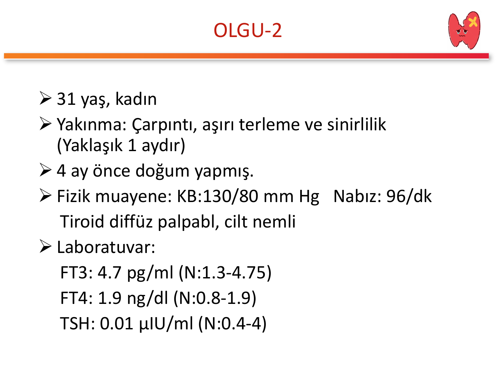
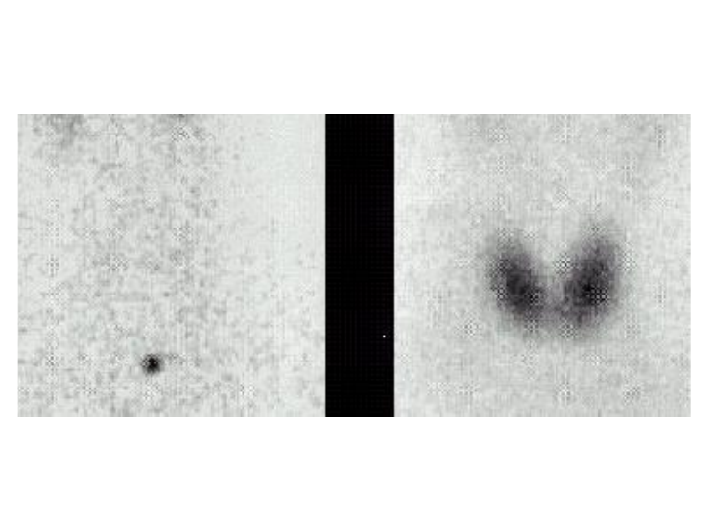
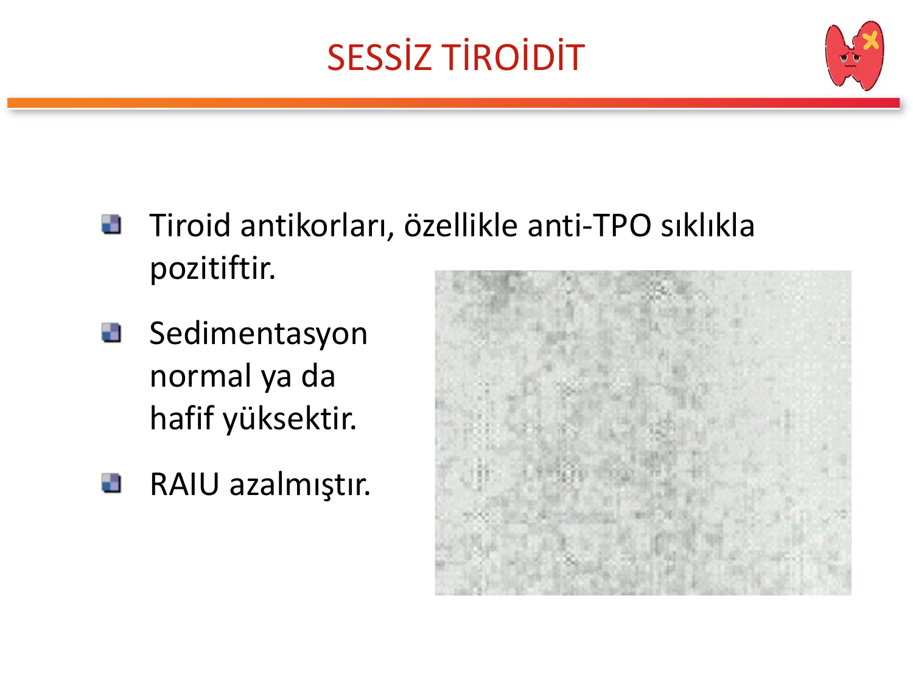
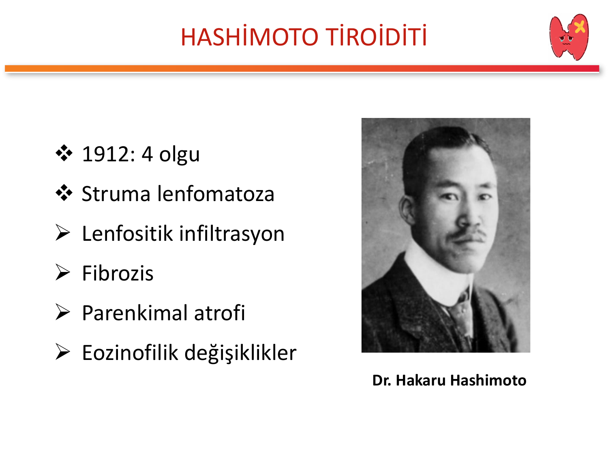
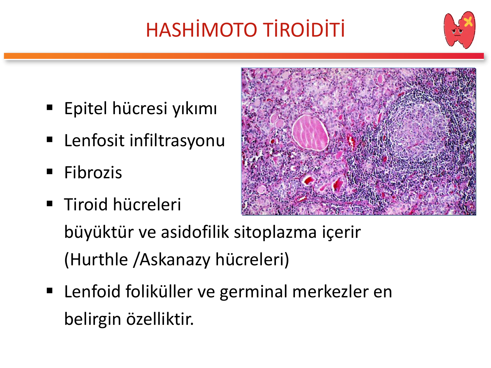
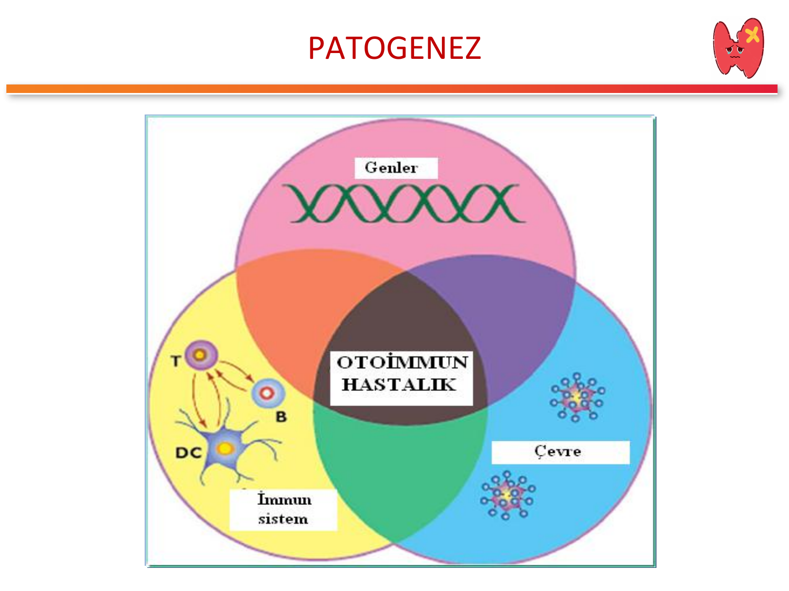
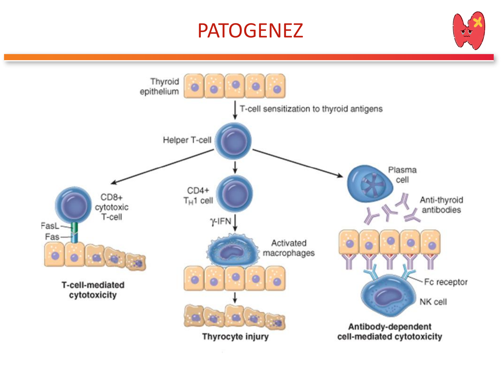
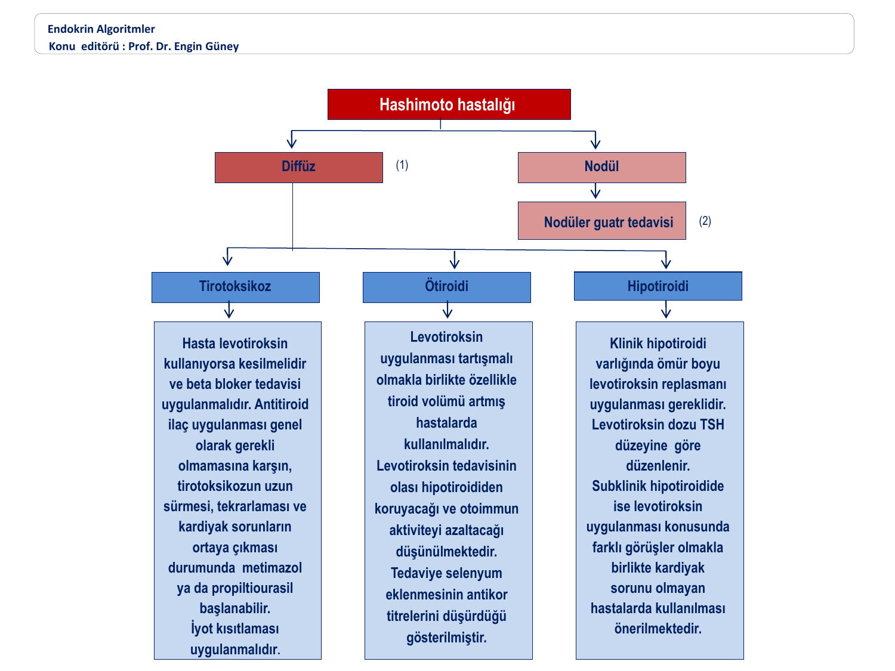

# TİROİDİTLER

**Hazırlayan:** Prof. Dr. Engin Güney
**Bölüm:** Endokrinoloji

---

## İÇİNDEKİLER

1. [Tanım ve Genel Bakış](#tanım-ve-genel-bakış)
2. [Sınıflama](#sınıflama)
3. [Akut (Süpüratif) Tiroidit](#akut-süpüratif-tiroidit)
4. [Subakut Granülomatöz Tiroidit (De Quervain)](#subakut-granülomatöz-tiroidit-de-quervain)
5. [Subakut Lenfositik (Sessiz) Tiroidit](#subakut-lenfositik-sessiz-tiroidit)
6. [Postpartum Tiroidit](#postpartum-tiroidit)
7. [Hashimoto Tiroiditi (Kronik Otoimmun Tiroidit)](#hashimoto-tiroiditi-kronik-otoimmun-tiroidit)
8. [Riedel Tiroiditi](#riedel-tiroiditi)
9. [İlaç İlişkili Tiroiditler](#i̇laç-i̇lişkili-tiroiditler)
10. [Radyasyon ve Travmatik Tiroidit](#radyasyon-ve-travmatik-tiroidit)
11. [Ayırıcı Tanı ve Büyük Karşılaştırma](#ayırıcı-tanı-ve-büyük-karşılaştırma)
12. [Tanısal Yaklaşım](#tanısal-yaklaşım)
13. [Klinik Vaka Örnekleri](#klinik-vaka-örnekleri)
14. [Özet ve Akılda Kalıcı Bilgiler](#özet-ve-akılda-kalıcı-bilgiler)
15. [Test Soruları](#test-soruları)
16. [Kısaltmalar](#kısaltmalar)

---

## TANIM VE GENEL BAKIŞ

> **Tiroidit:** Tiroid bezinin inflamasyonu ile seyreden ve follikül hücrelerinin hasarına neden olan bir grup hastalıktır.

**Ortak mekanizma:** Follikül yıkımı → preforme tiroid hormonlarının dolaşıma salınımı (tirotoksikoz) → depoların tükenmesi → hipotiroidi → tiroid epitelinin rejenerasyonu → ötiroidi.

**Temel sınıflama (klasik):**

* **Akut tiroidit** (süpüratif, bakteriyel)
* **Subakut tiroidit** (granülomatöz / lenfositik)
* **Kronik tiroidit** (Hashimoto, Riedel)

> 💡 **Akılda kalıcı:** Tiroidit "tiroid bezinin iltihabı" değil, klinik olarak **tirotoksikoz yapabilen ama antitiroid ilaç gerektirmeyen** hastalıklar grubudur. Bu tirotoksikozun temeli **hormon yapımı değil, yıkım ve sızıntıdır**.

---

## SINIFLAMA

**TEMD Tiroid Hastalıkları Tanı ve Tedavi Kılavuzu -- 2019** sınıflaması:

| Grup | Tip | Etyoloji / Özellik |
|---|---|---|
| **Akut** | Akut süpüratif tiroidit | Bakteriyel (stafilokok ön planda) |
| **Subakut** | Subakut granülomatöz tiroidit (De Quervain) | Viral sonrası, ağrılı |
| **Subakut** | Sessiz (ağrısız lenfositik) tiroidit | Otoimmun, ağrısız |
| **Subakut** | Postpartum tiroidit | Sessiz tiroiditin doğum sonrası varyantı |
| **Kronik** | Hashimoto tiroiditi | Kronik otoimmun, en sık |
| **Kronik** | Riedel tiroiditi | IgG4 ilişkili fibrosklerozis |
| **Diğer** | Radyasyon tiroiditi | RAİ tedavisi sonrası 5-10 gün; eksternal RT sonrası |
| **Diğer** | Travmaya bağlı tiroidit | İnce iğne, cerrahi, palpasyon tiroiditi |
| **Diğer** | İlaca bağlı tiroiditler | Amiodaron, IFN-α, IL-2, lityum, TKİ, checkpoint inhibitörleri |

> 💡 **Mnemonik -- 6 büyük tiroidit "ASSHiRi":** **A**kut, **S**ubakut granülomatöz (De Quervain), **S**essiz, **H**ashimoto, **Ri**edel + **Postpartum**. Bunlara "ilaç-radyasyon" grubunu ekleyin → sınavda sorulabilecek tüm başlıklar kapanır.

> 💡 **Mnemonik -- Ağrılı vs Ağrısız ayrımı ("ARA"):** **A**kut süpüratif → ağrılı. Su**BA**kut granülomatöz → ağrılı. Diğer tümü (**RA**hat) → ağrısız. Boyun ağrısı olmayan bir tirotoksikozda ilk akla gelecek dört tablo: **sessiz, postpartum, Hashimoto tirotoksik fazı, Graves**.

---

## AKUT (SÜPÜRATİF) TİROİDİT

> **Tanım:** Viral etyoloji dışında kalan **enfeksiyöz ajanlarla** oluşan tiroid inflamasyonudur.

### Neden Nadirdir?

Tiroid bezi enfeksiyonlara dirençli bir dokudur:

* **Yoğun iyot içeriği** (iyot bakteriyostatik)
* **Zengin kanlanma**
* **Yoğun lenfatik drenaj**
* **Sağlam fibröz kapsül**

### Etyoloji

| Grup | Ajanlar | Not |
|---|---|---|
| **Bakteriyel** | Staphylococcus aureus, Streptococcus spp., Gram negatifler | En sık neden |
| **Çocuklarda** | Pyriform sinüs fistülü → sol lob sık | Anatomik anomali |
| **İmmunsüpresif hastalarda** | Mantar, mikobakteri, Pneumocystis | HIV, kemoterapi |

### Klinik

* **Ağrı, hassasiyet** ve lokal **ısı artışı**
* Yüksek ateş, **bölgesel lenfadenopati**
* Ağrı kulağa vurabilir, yutmakla artar
* **Tiroid fonksiyonları genellikle etkilenmez** (ötiroid)

**⚠️ ÖNEMLİ:**

* Çocukta tekrarlayan akut tiroidit → **pyriform sinüs fistülü** araştırılmalı (özellikle **sol lob**).
* İmmunsüprese hastada atipik ajanlar (tüberküloz, fungal) düşünülmeli.

### Tanı

* Tam kan, CRP, ESR → bakteriyel enfeksiyon paterni (lökositoz, yüksek CRP)
* **USG ile abse** aranır
* **İnce iğne aspirasyonu (İİAB) ile kültür + Gram boyama** tanıda altın standart

### Tedavi

* **Mikrobiyolojik incelemeye göre antibiyoterapi** seçilir
* **En önemli neden stafilokok abseleri** → kültür beklenmeden **geniş spektrumlu ve stafilokokları kapsayan** antibiyotik başlanır
* Abse varsa **cerrahi drenaj** tedaviye yardımcı olur
* Pyriform sinüs fistülü saptanırsa **cerrahi eksizyon** tekrar nüksü önler

---

## SUBAKUT GRANÜLOMATÖZ TİROİDİT (DE QUERVAIN)

> **Tanım:** De Quervain tiroiditi (1904 tanımlı), **ağrılı subakut tiroidit** olarak da bilinir; viral enfeksiyon sonrası ortaya çıkan granülomatöz reaktif bir inflamasyondur.

### Epidemiyoloji

| Parametre | Değer |
|---|---|
| İnsidans | **4,9 / 100.000** |
| Kadın/Erkek oranı | **4/1** |
| En sık yaş | 30-50 |
| Mevsim | Yaz ve erken sonbahar (viral ÜSYE sonrası) |

### Etyopatogenez

* Genellikle viral **üst solunum yolu enfeksiyonundan 2-8 hafta sonra** ortaya çıkar
* Sorumlu viruslar: **Kabakulak, kızamık, coxsackie, influenza, Ebstein-Barr virus (EBV), HIV, adenovirüsler**
* Viral enfeksiyonların **tiroid yüzey antijenlerini değiştirmesi** ve buna karşı **reaktif inflamasyon** mekanizması
* Sitokinler tetikleyici: **IL-2, TNF-α, IFN-α**

**HLA ilişkisi:**

> Tiroid otoimmünitesinin primer rolü yoktur ama **HLA-B35** ile ilişkisi gösterilmiştir. Bu ilişki, viral antijenin makrofajlarda **HLA-B35 molekülüne bağlanarak sitotoksik T-hücrelerini aktive etmesi** ve tiroid folliküler hücrelerinde hasara yol açması ile açıklanır.

İmmunolojik, inflamatuvar reaksiyon **kendi kendini sınırlar** ve kalıcı değildir.

### Klinik

**Semptomlar:**

* Tiroid bezi bölgesinde **kulağa vuran**, **yutkunmakla artan ağrı**
* Palpasyonla **ciddi ağrı ve hassasiyet**
* **Grip benzeri** semptomlar: yorgunluk, artralji, myalji, **subfebril ateş**
* **Hafif-orta tirotoksikoz** bulguları (çarpıntı, terleme, kilo kaybı)

**Muayene:**

* Tiroid bezi **büyük, ağrılı, hassas ve sert**
* Hastalık genellikle **her iki lobu tutar**: bir taraftan başlar, günler içinde diğer tarafa **"yürür"** (karşı tarafa yayılır)

### Klasik Klinik Seyir -- Trifazik Patern



| Faz | Süre | Patofizyoloji | TSH | FT3 / FT4 | RAIU |
|---|---|---|---|---|---|
| **1. Tirotoksik faz** | **4-8 hafta** | Follikül yıkımı → preforme hormon sızıntısı | ↓ Baskılı | ↑ Yüksek | **↓↓ Azalmış** |
| **2. Ötiroid geçiş** | Günler-haftalar | Depolar tükenmeye başlar | Normalleşiyor | Normalleşiyor | Düşük |
| **3. Hipotiroid faz** | 2-8 hafta | Depolar tükendi, rejenerasyon başlıyor | ↑ Yüksek | ↓ Düşük | Orta |
| **4. Tam iyileşme** | 6-12 ay | Folliküler rejenerasyon tamamlandı | Normal | Normal | Normal |

```
    TIROTOKSİK         ÖTİROİD         HİPOTİROİD         ÖTİROİD
    (4-8 hafta)                         (2-8 hafta)       (kalıcı)
       ↑ ↑               =               ↓ ↓                =
    FT3/FT4           normal           FT3/FT4           normal
    TSH ↓↓            normal           TSH ↑             normal
    ESR>100           ESR ↓            ESR normal        ESR normal
       │                 │                │                │
   Ağrı+                Ağrı↓           Ağrı yok          ──▶ İYİLEŞME
```

> ⭐ **Kritik nokta:** Kalıcı hipotiroidi yalnızca **~%10** hastada görülür; çoğunluk **tam ötiroidiye döner**.

### Laboratuvar

| Test | Bulgu |
|---|---|
| **ESR (sedim)** | **>100 mm/saat** -- "tiroiditlerin sedimi" |
| **CRP** | Belirgin yüksek |
| Lökositoz | Hafif |
| FT3, FT4 | ↑ (erken faz) |
| TSH | ↓ (erken faz) |
| **Tiroglobulin** | ↑↑ (follikül yıkımı) |
| Anti-TPO, Tg-Ab | Genellikle **negatif** (otoimmun değil) |

> 💡 **Sınav pearl -- "100'ler kuralı":** De Quervain'de **ESR > 100 mm/saat** neredeyse sabittir. Ağrılı guatr + tirotoksikoz + sedim 100 üzeri → De Quervain düşün.

### Görüntüleme



* **RAIU (radyoaktif iyot uptake):** **Belirgin azalmış** (%0-5)
* **USG:** İnflamasyondan etkilenen bölgelerde **lokalize/jeneralize hipoekojen, heterojen alanlar**; "haritadaki kıtalar" gibi bulanık sınırlı hipoekoik bölgeler
* **Renkli Doppler:** Parankim **vaskülaritesi artmamıştır** (Graves hastalığının aksine!); etkilenmiş parankimde **hemen hemen hiç kan akımı izlenmez**. İnflamasyon bölgelerinde nodüler görünüm olabilir.

> ⭐ **Graves vs De Quervain -- renkli Doppler pearl:**
> - **Graves:** Artmış vaskülarite ("thyroid inferno")
> - **De Quervain:** Azalmış/yok vaskülarite
> Her ikisinde de tirotoksikoz var, ama **RAIU Graves'te yüksek, De Quervain'de düşük**.

### Tedavi

**Ağrı ve inflamasyon için basamaklı yaklaşım:**

| Basamak | Tedavi | Doz |
|---|---|---|
| **1.** Hafif vaka | NSAİ + istirahat | İbuprofen 1200-3200 mg/gün (bölünmüş) |
| **2.** NSAİ yetersizse veya ağır | Oral prednizolon/metilprednizolon | **0,5 mg/kg/gün**, 1 hafta; sonra 3 günde bir 4 mg azalt |
| **3.** Tirotoksikoz semptomatik | β-bloker | Propranolol 40-120 mg/gün <br>Atenolol 25-50 mg/gün |
| **4.** Belirgin hipotiroid faz (TSH >10 mU/L ve semptomatik) | Geçici levotiroksin | 6-8 hafta, TSH normal aralıkta tutulacak doz |

**⚠️ ÖNEMLİ:**

* **Kortikosteroide yanıt dramatiktir** -- **bir gün içinde** ağrı ve semptomların çoğu geriler.
* Yanıt yoksa **tanı sorgulanmalıdır** (akut süpüratif, lenfoma, kanama vs düşün).
* Hastaların **~%20'sinde** ilaç kesildikten sonra tiroid ağrısı **tekrarlayabilir**; bu durumda tedavi tekrarlanır.
* **Antitiroid ilaçların yeri YOKTUR** (yapım değil yıkım var → PTU/metimazol gereksiz ve zararlı).

> 💡 **Mnemonik -- "NS-KSi":** De Quervain tedavi basamakları = **N**SAİ → **S**teroid → **β-bloker** (semptomatik) → **Si**nırlı levotiroksin (hipotiroid fazda). Antitiroid **yasak**.

---

## SUBAKUT LENFOSİTİK (SESSİZ) TİROİDİT

> **Tanım:** Kendi kendini sınırlayabilen, **T-hücre kökenli otoimmun destrüktif** tiroid hasarıdır. Klinik ve patolojik olarak postpartum tiroiditin "doğum olmaksızın" görülen formudur.

### Temel Özellikler

* **Ağrısız** (sessiz adı buradan: "silent, painless thyroiditis")
* Genel olarak **tirotoksikoz bulguları** ile ortaya çıkar
* Bazı hastalar tirotoksik fazı **fark etmeden** hipotiroid fazda başvurur
* Histolojik olarak **lenfositik infiltrasyon** (Hashimoto'ya benzer ama granülom yok, ağrı yok)

### Klinik Seyir

Subakut granülomatöz tiroidit ile aynı **trifazik patern** izlenir (yukarıdaki şekle bakınız):

1. **Tirotoksik faz** (2-8 hafta)
2. **Ötiroid geçiş**
3. **Hipotiroid faz** (2-8 hafta)
4. **Tam ötiroidi** (genellikle)

### Laboratuvar



| Test | Bulgu |
|---|---|
| **Anti-TPO** | **Sıklıkla pozitif** (De Quervain'den en önemli farkı!) |
| Anti-Tg | Değişken |
| **ESR** | **Normal veya hafif yüksek** (De Quervain'den farkı: sedim çok yükselmez) |
| **RAIU** | **Azalmış** |
| Tiroglobulin | ↑ |

> 💡 **De Quervain vs Sessiz ayrımı:** Her ikisinde de tirotoksikoz + düşük RAIU var. Fark: **Ağrı var mı? ESR çok yüksek mi? Anti-TPO pozitif mi?**
> - De Quervain = **Ağrı + ESR >100 + TPO negatif**
> - Sessiz = **Ağrısız + ESR normal + TPO pozitif**

### Tedavi

* Kendi kendini sınırlayan bir hastalık olduğu için **tedavisiz izlem** yeterlidir
* **Tirotoksik fazda** semptomatikse → düşük doz β-bloker
* **Ciddi hipotiroidi** semptomları → geçici levotiroksin replasmanı
* **Antitiroid tedavilerin yeri YOKTUR**
* NSAİ veya steroid gerekmez (ağrı yok)

---

## POSTPARTUM TİROİDİT

> **Tanım:** Klinik ve patolojik olarak **sessiz tiroidite benzer**, ancak **doğum veya abortus yapmış kadınlarda bir yıl içinde** meydana gelir.

### Epidemiyoloji

| Parametre | Değer |
|---|---|
| **Sıklık (gebeler)** | **%8-10** |
| **Kalıcı hipotiroidi riski** | %10-20 |
| Gebelikle antikor ilişkisi | Gebelikte ↓, doğum sonrası ↑ (immun rebound) |

### Klinik Varyantlar (3 tip)

| Tip | Klinik Seyir | Sıklık |
|---|---|---|
| **Tip 1** | Yalnız tirotoksikoz (izole) | ~%30 |
| **Tip 2** | Yalnız hipotiroidi (izole) | ~%40 |
| **Tip 3** | Klasik **tirotoksikoz → hipotiroidi → ötiroidi** | ~%25 |

```
   DOĞUM                  2-6 ay                   4-8 ay                    1 yıl
     │                       │                       │                        │
     │   Tirotoksik faz      │   Hipotiroid faz     │    Ötiroidi             │
     ▼                       ▼                       ▼                        ▼
  Antikor ↑          Sessiz tiroidit         Levotiroksin           %10-20 kalıcı
  (rebound)           benzeri yıkım           gerekebilir           hipotiroidi
```

### Ayırıcı Tanı -- Postpartum Graves'ten Ayırım

**⚠️ KRİTİK:** Doğum sonrası tirotoksikozun iki ana nedeni: **postpartum tiroidit** ve **postpartum Graves hastalığı**. Prevalans farkı çok belirgin:

> * **Postpartum tiroidit prevalansı: %4,1**
> * **Postpartum Graves prevalansı: %0,2**

| Özellik | **Postpartum Tiroidit** | **Postpartum Graves** |
|---|---|---|
| Başlangıç | 2-6 ay | 6-12 ay |
| Guatr | Küçük, sert | **Büyük, belirgin** |
| Orbitopati | **❌ Yok** | **✅ Var → Graves göstergesi** |
| **TRAb** | Negatif | **Yüksek titre pozitif (Graves lehine)** |
| **Total T4 / T3 oranı** | <20 | **>20 (Graves lehine)** |
| USG vaskülaritesi | Normal / azalmış | **Artmış kan akımı (Graves lehine)** |
| RAIU | Azalmış | Artmış |
| Tedavi | β-bloker ± L-T4 | Antitiroid veya RAİ |

**⚠️ ÖNEMLİ:** Tiroid sintigrafi ve tutulum incelemeleri **laktasyon döneminde önerilmez** (radyoaktif madde süte geçer). Ayırıcı tanı **klinik + USG + antikor + T4/T3 oranı** ile yapılmalıdır.

### Tedavi ve İzlem

| Durum | Yaklaşım |
|---|---|
| Semptomatik tirotoksik faz | **Düşük doz β-bloker**: Propranolol 10-20 mg 3-4×1 veya metoprolol 25-50 mg/gün |
| Hipotiroidi + semptomatik / TSH >10 | **Geçici levotiroksin** |
| Uzun dönem izlem | **Yıllık TSH kontrolü** (kalıcı hipotiroidi %10-20!) |
| Antitiroid ilaçlar | **❌ Yeri yoktur** |

> ⭐ **Pearl -- Yıllık TSH takibi ihmal edilmez!** Postpartum tiroidit geçiren kadınların yaklaşık **1/5'inde yıllar içinde kalıcı hipotiroidi** gelişir; ayrıca **sonraki gebeliklerde tekrarlama riski yüksektir**.

> 💡 **Mnemonik -- "3 zaman, 3 tip":** Postpartum tiroiditi düşünürken aklınıza **3** gelsin: **3** klinik tip (izole tirotoksik / izole hipotiroid / klasik üç fazlı) ve **3. fazda %10-20 kalıcılık**.

---

## HASHİMOTO TİROİDİTİ (KRONİK OTOİMMUN TİROİDİT)



> **Tanım:** Hashimoto hastalığı; lenfositlerin tiroid antijenlerine karşı duyarlı hale geldiği ve bu antijenlerle etkileşime giren otoantikorların oluştuğu **kronik otoimmun destrüktif** tiroid hastalığıdır.

### Tarihçe

* **1912**: Dr. Hakaru Hashimoto tarafından **4 olguda** tanımlandı
* İlk adı: ***"Struma lenfomatoza"***
* **Hipotiroidinin en sık nedenidir** (iyot yeterli bölgelerde)

### Histopatoloji



**Karakteristik bulgular:**

1. **Epitel hücresi yıkımı**
2. **Lenfosit infiltrasyonu** (yoğun)
3. **Fibrozis**
4. **Parenkimal atrofi**
5. **Eozinofilik (onkositik) değişiklikler** → **Hurthle / Askanazy hücreleri** (büyük, asidofilik sitoplazmalı tiroid hücreleri)
6. **Lenfoid foliküller ve germinal merkezler** (en belirgin özellik)

> 💡 **Sınav pearl -- "HLG":** Hashimoto'nun üç histolojik imzası: **H**urthle hücreleri, **L**enfoid foliküller (germinal merkezle), **G**ermiş (atrofik) parenkim + fibrozis.

### Patogenez -- Genler + Çevre + İmmun



#### Yatkınlık Genleri

| Gen | Açılım / İşlev |
|---|---|
| **CTLA-4** | Cytotoxic T cell antigen-4 (T hücre kontrol noktası) |
| **ZFAT** | Zinc-finger gene in AITD |
| **TG** | Thyroglobulin gene (hedef antijen) |
| **PTPN22** | Protein tyrosine phosphatase-22 |
| **FCRL3** | Fc receptor-like 3 |
| **FOXE1** | Forkhead box E1 (tiroid gelişim) |
| **IL2RA** | IL-2 reseptör alfa zinciri |

#### Çevresel Faktörler

> * **Fazla iyod alımı** (Th17 ↑, T-reg ↓)
> * **Selenyum eksikliği**
> * **Sigara**
> * **İnfeksiyonlar** (özellikle **kronik hepatit C**)
> * **İlaçlar** (amiodaron, IFN, lityum, TKİ, checkpoint inhibitörleri)

**İyod ve Selenyum detayı:**

* **Kronik fazla iyod alımı** otoimmun tiroidit sıklığını artırır. Yatkın kişilerde iyod, tiroid içinde **Th17 hücrelerini artırır ve T regülatuar hücreleri baskılar** → **TNF aracılıklı apopitoz** ve parenkim hasarı.
* **Selenyum**, Hashimoto ve hafif Graves hastalığında klinik skorları düzeltmekte ve **Anti-TPO düzeylerini azaltmaktadır**. Ancak doz ve süre konusunda görüş birliği yoktur.

#### Otoantikorlar



| Antikor | Özellik |
|---|---|
| **Anti-tiroid peroksidaz (Anti-TPO)** | En sık pozitif; yıllarca saptanabilir |
| **Anti-tiroglobulin (Anti-Tg)** | Erken dönemde yüksek; hastalık ilerledikçe kaybolabilir |
| **TSH reseptör antikoru (bloke edici)** | Tiroid atrofisine katkıda bulunur (Graves'tekinin aksine **bloke edici**) |

> ⭐ **Kritik patogenez:**
> * Erken dönem → **Tg-Ab yüksek**, TPO-Ab hafif yüksek
> * İleri dönem → **Tg-Ab kaybolabilir**, TPO-Ab yıllar boyu pozitif kalır
> * Yıkım mekanizması: **T-hücre aracılı sitotoksisite + antikor-bağımlı hücresel sitotoksisite (ADCC)**

### Klinik

| Klinik tablo | Sıklık / Seyir |
|---|---|
| **Aşikar hipotiroidi** | %20 hastada ilk bulgu veya yıllar içinde ortaya çıkar |
| **Subklinik → aşikar hipotiroidi geçişi** | **Yıllık %3-5** ilerleme |
| **Geçici tirotoksikoz** ("Hashitoksikoz") | **%5'ten az**, kısa süreli |

**"Hashitoksikoz":** Hashimoto'nun erken fazında follikül yıkımına bağlı geçici tirotoksikoz tablosudur; sessiz tiroidite benzer seyreder.

### Guatr ve Ultrason

**Tipik USG bulguları:**

* **Diffüz guatr**
* **Heterojen parankim**
* **Hipoekoik "Swiss cheese" görünüm** (klasik tarif)
* Nodül görülebilir

**⚠️ Önemli Uyarı -- Tiroid Lenfoması:**

> **Hashimoto tiroiditi olduğu bilinen bir hastada tiroid bezinde ANİ BÜYÜME → tiroid lenfoması açısından araştırılmalıdır.**

Hashimoto, **primer tiroid lenfomasının en güçlü risk faktörüdür** (~60 kat); tipik tablo: uzun süreli Hashimoto + birkaç hafta içinde hızla büyüyen sert kitle + kompresif semptomlar (disfaji, stridor).

> 💡 **Mnemonik -- "Hashi-Hızlı-Lenfoma":** Bilinen Hashimoto'lu hastada hızla büyüyen tiroid → **Lenfoma!** (İİAB + core biyopsi şart.)

### Eşlik Eden Otoimmun Hastalıklar

Hashimoto sıklıkla **otoimmun çoklu sendromlar** içinde yer alır:

| Hastalık | İlişki |
|---|---|
| **Tip 1 Diabetes Mellitus** | Otoimmun poliglandüler sendrom (OPS) Tip 2 |
| **Addison hastalığı** | OPS Tip 2 -- Hashimoto + Addison + T1DM |
| **Romatoid artrit** | Sık birliktelik |
| **Kronik otoimmun gastrit** | Pernisyöz anemi → B12 eksikliği |
| **Vitiligo** | Sık birliktelik |
| **Pernisyöz anemi** | Otoimmun gastritin sonucu |
| **Myastenia gravis** | Otoimmun nöromüsküler blok |
| **Çölyak hastalığı** | Anti-doku transglutaminaz + Anti-TPO birlikte taranır |

**⚠️ Klinik Pearl -- Hashimoto + Addison:**

> Levotiroksin tedavisi sonrası hastanın TSH düzeyleri normale gelmesine karşın **semptomlarında düzelme yok ya da kötüleşme varsa → Addison hastalığı araştırılmalıdır** (Murray et al, BMJ 2001).
>
> Mekanizma: Hipotiroidi kortizol klirensini yavaşlatır; levotiroksin verildiğinde kortizol gereksinimi artar, gizli adrenal yetmezliği maskelemekten çıkar → **akut Addisonian kriz**.

### Laboratuvar

| Test | Bulgu |
|---|---|
| **TSH** | Erken dönem normal → subklinik ↑ → aşikar ↑ |
| **FT4** | Progresyonla ↓ |
| **Anti-TPO** | Genellikle **yüksek titre pozitif** (~%95) |
| **Anti-Tg** | Erken pozitif, geç kaybolabilir (~%60-80) |
| **USG** | Heterojen, hipoekoik, "Swiss cheese" patern |

### Tedavi -- Hashimoto Hastalığı Algoritması



**Klinik tabloya göre yaklaşım:**

| Tablo | Tedavi |
|---|---|
| **Tirotoksikoz (Hashitoksikoz)** | Hasta levotiroksin kullanıyorsa **kesilmelidir**; **β-bloker** verilir. Antitiroid ilaç genellikle gereksizdir; ama tirotoksikoz uzun sürer, tekrarlar veya **kardiyak sorun** çıkarsa **metimazol veya PTU** başlanabilir. **İyot kısıtlaması** uygulanmalı. |
| **Ötiroidi (subklinik)** | Levotiroksin uygulanması tartışmalı olmakla birlikte, **tiroid volümü artmış hastalarda kullanılması önerilir**. Levotiroksin, olası hipotiroididen koruyacak ve otoimmun aktiviteyi azaltacaktır. **Selenyum eklenmesi** antikor titrelerini düşürebilir. |
| **Klinik (aşikar) hipotiroidi** | **Ömür boyu levotiroksin replasmanı** gereklidir. Doz **TSH düzeyine göre** düzenlenir. |
| **Subklinik hipotiroidi** | Levotiroksin kullanımı tartışmalı; **kardiyak sorunu olmayan hastalarda kullanılması önerilir**. |
| **Nodüler guatr** | Nodül-spesifik tanı-tedavi algoritması (TIRADS, İİAB) |

**Levotiroksin dozu başlangıç kuralları:**

* Genç, sağlıklı erişkinde: **1,6-1,8 mcg/kg/gün**
* Yaşlı / KAH'lı hastada: **12,5-25 mcg/gün** başla, 4-6 haftada bir TSH kontrolü ile titre et
* **Hedef TSH: 0,5-2,5 mU/L** (gebelikte ilk trimester için 0,1-2,5)

---

## RİEDEL TİROİDİTİ

> **Tanım:** **Multifokal fibrosklerozisin tiroid tutulumu** olarak kabul edilen nadir bir kronik tiroidit türüdür. Otoimmun bir sürecin olduğu düşünülmekte ve **IgG4 ilişkili hastalıklar spektrumu** içerisinde yer almaktadır.

### Epidemiyoloji

* Nadir (%0,05 tiroid hastalıkları)
* Orta yaş kadın > erkek
* **IgG4 ilişkili sistemik hastalık** ile birliktelik (retroperitoneal fibrozis, sklerozan kolanjit, otoimmun pankreatit)

### Klinik Özellikler

**⚠️ KRİTİK -- Tahta sertliğinde guatr:**

> Hastalar **ani büyüyen, taş gibi sert guatr**, **disfoni**, **disfaji** ve **boyun-göğüste baskı şikayetleri** ile başvurur. Genellikle **ötiroid**, bazen hipotiroiddir.

**Ayırıcı Tanı İpuçları:**

| Özellik | Riedel | Tiroid Kanseri (anaplastik) |
|---|---|---|
| Sertlik | **"Tahta gibi, taşlaşmış"** | Sert, düzensiz |
| Ağrı | Hafif / yok | Hafif / yok |
| Çevre dokuya fiksasyon | **Belirgin** (ötesi ile kaynaşmış) | Var |
| IgG4 | **Yüksek** | Normal |
| Sitoloji | Fibrozis, lenfosit | Anaplastik malign hücreler |
| Seyir | Kronik, yavaş | **Hızlı, fatal (<6 ay)** |

### Tedavi

| Basamak | Tedavi |
|---|---|
| **1. Basamak** | **Kortikosteroidler: Prednizon 100 mg/gün** (IgG4 ilişkili fibrozise yönelik) |
| **2. Basamak** | **Tamoksifen** -- TGF-β1 üzerinden etki eder, fibroblastik fonksiyonu inhibe eder |
| **3. Basamak** | **Rituksimab** (steroid yanıtsız olgularda; IgG4 ilişkili hastalıkta etkili) |
| **Cerrahi** | Kesin tanı + **trakea/özofagus fonksiyonlarını koruma** için **dekompresyon** amaçlı. Total tiroidektomi genellikle komplikasyonlarla birliktedir ve **önerilmez**. |

**Tiroid hormon tedavisi:** Hipotiroidiyi düzeltir ama **hastalık seyri üzerine etkisi yoktur**.

> 💡 **Mnemonik -- "Riedel = 4 R":** **R**igid (tahta gibi), **R**etroperitoneal fibrozis birlikteliği, **R**ituksimab-cevaplı, **R**eseksiyon (sadece dekompresyon için).

---

## İLAÇ İLİŞKİLİ TİROİDİTLER

### Amiodaron İndükte Tirotoksikoz (AIT) -- Tip 1 vs Tip 2

**Amiodaron**, her 200 mg tablette **~75 mg iyot** içeren antiaritmiktir; tiroid sorunlarının en sık ilaç nedenidir. AIT **iki klinik tipte** görülür ve ayırımı tedaviyi doğrudan belirler.

| Özellik | **Tip 1 (Jod-Basedow benzeri)** | **Tip 2 (Destrüktif tiroidit)** |
|---|---|---|
| **Mekanizma** | İyot yüklenmesi → **tiroid hormon yapımı ↑** | **Amiodaronun direkt toksik etkisi** → follikül yıkımı |
| **Altta yatan tiroid hastalığı** | **Var** (nodüler guatr, latent Graves) | **Yok** (normal tiroid) |
| **Guatr** | Genellikle var | Küçük / yok |
| **Renkli Doppler** | **Artmış vaskülarite** | **Azalmış / yok vaskülarite** |
| **RAIU** | Düşük veya normal | **Çok düşük (<%5)** |
| **IL-6** | Normal | Belirgin yüksek |
| **Tedavi** | **Tionamid** (yüksek doz metimazol 40-60 mg) ± **potasyum perklorat** | **Glukokortikoid** (prednizolon 40-60 mg) |
| **Amiodaron kesilmeli mi?** | Mümkünse evet | Devam edilebilir |
| **Seyir** | İyileşme: haftalar-aylar | İyileşme: 1-3 ay |

> ⭐ **Kritik ayrım -- Renkli Doppler pearl:**
> * **Tip 1: Vaskülarite VAR** (hormon yapımı aktif, kanlanma artmış)
> * **Tip 2: Vaskülarite YOK** (destrüktif, inflamatuar)
>
> Bu iki bulgu ayırıcı tanıda altın anahtar; klinikte sıklıkla karışık tablo (mixed) görülür ve o zaman **tionamid + steroid birlikte** başlanır.

> 💡 **Mnemonik -- "1 VAR, 2 YOK":** Tip **1** = **VAR** (vaskülarite, guatr, altta hastalık, hormon yapımı). Tip **2** = **YOK** (vaskülarite yok, tiroid normal, destrüktif).

### Diğer İlaçlar

| İlaç | Mekanizma | Klinik | Tedavi |
|---|---|---|---|
| **Lityum** | TSH tiroid kavşağında inhibisyon + antikor indüksiyonu | Hipotiroidi (%20), guatr; nadiren tirotoksikoz | Levotiroksin |
| **İnterferon-α (IFN-α)** | Otoimmunite tetikleme (HCV tedavisi) | Destrüktif tiroidit + Hashimoto/Graves | İlacı değerlendir; tipe göre |
| **IL-2** | Otoimmunite tetikleme | Tiroidit | Tipe göre |
| **Tirozin kinaz inhibitörleri (TKİ)** | Sunitinib, sorafenib → tiroid mikrovasküler hasar | Hipotiroidi (%50'ye varan); bazen destrüktif faz | L-T4; ilaç kesilmez |
| **Checkpoint inhibitörleri** (pembrolizumab, nivolumab, ipilimumab) | Otoimmun rebound | **Önce geçici tirotoksikoz → sonra kalıcı hipotiroidi** (%10-20) | β-bloker → L-T4 |

**⚠️ ÖNEMLİ:**

* TKİ ve checkpoint inhibitörleri kullanan onkoloji hastalarında **her 6-8 haftada bir TSH izlemi** önerilir.
* İmmun checkpoint tiroiditinde destrüktif fazın **ağrısız** olduğuna dikkat; kalıcı hipotiroidi sıktır.

---

## RADYASYON VE TRAVMATİK TİROİDİT

### Radyasyon Tiroiditi

| Tip | Süreç |
|---|---|
| **RAİ sonrası** | Tedaviden **5-10 gün** sonra; hassasiyet, ağrı, hafif tirotoksikoz |
| **Eksternal radyoterapi (boyun / üst mediasten)** | Hodgkin lenfoma, baş-boyun kanser sonrası; **yıllar içinde hipotiroidi** (%20-50) |

**Tedavi:**
* Akut faz: NSAİ ± kısa kortikosteroid
* Uzun dönem: hipotiroidi geliştiğinde levotiroksin

### Travmatik / Palpasyon Tiroiditi

* **Palpasyon tiroiditi**: Cerrahi, trafik kazası veya agresif muayene sonrası
* İnce iğne biyopsisi sonrası %5 hastada geçici tirotoksikoz bildirilmiştir
* Kendi kendini sınırlar, semptomatik tedavi yeterli

---

## AYIRICI TANI VE BÜYÜK KARŞILAŞTIRMA

### Tiroiditlerin Karşılaştırmalı Tablosu -- KRİTİK ÖZET

| Özellik | **Akut Süpüratif** | **De Quervain** | **Sessiz** | **Postpartum** | **Hashimoto** | **Riedel** |
|---|---|---|---|---|---|---|
| **Etyoloji** | Bakteriyel | Viral sonrası granülomatöz | Otoimmun | Otoimmun (gebelik sonrası) | Otoimmun | IgG4 / fibrotik |
| **Ağrı** | ✅ **Şiddetli** | ✅ **Şiddetli** | ❌ | ❌ | ❌ | Bası hissi (hafif) |
| **Ateş** | Yüksek | Subfebril | Yok | Yok | Yok | Yok |
| **Guatr** | Lokal, hassas | Sert, ağrılı, "yürür" | Küçük, sert | Küçük | **Diffüz, heterojen** | **Taş gibi sert, fikse** |
| **ESR** | ↑ (bakteriyel) | **↑↑ >100** | Normal / hafif ↑ | Normal | Normal | Normal |
| **Lökositoz** | ✅ | Hafif | ❌ | ❌ | ❌ | ❌ |
| **Tiroid fonksiyonu** | **Ötiroid** | Trifazik (ttx→hipo→öt) | Trifazik | Trifazik | **Hipotiroidi** (genellikle) | Ötiroid / hipotiroidi |
| **Anti-TPO** | ❌ | ❌ | **✅ (+)** | **✅ (+)** | **✅✅ (+++)** | ± |
| **IgG4** | ❌ | ❌ | ❌ | ❌ | ❌ | **✅ (+++)** |
| **RAIU** | Normal | ↓↓ | ↓ | ↓ | Değişken (heterojen) | ↓ (fibrozise bağlı) |
| **USG** | Abse, hipoekoik | Hipoekoik, heterojen, düşük Doppler | Hafif hipoekoik | Hafif hipoekoik | "Swiss cheese", heterojen | Hipoekoik, fibrotik |
| **İİAB** | Pürülan, PNL | Dev hücreli granülom | Lenfositik infiltrasyon | Lenfositik | Hurthle + lenfoid folikül | Yoğun fibrozis |
| **Tedavi** | Antibiyotik + drenaj | NSAİ → steroid | İzlem / β-bloker | β-bloker ± L-T4 | **L-T4** | Steroid / tamoksifen / rituksimab |
| **Seyir** | İyileşme (tedaviyle) | **%90 tam iyileşir** | Tam iyileşme | **%10-20 kalıcı hipo** | **Kalıcı hipotiroidi** | Kronik fibrozis |

### Tirotoksikoz Ayırıcı Tanı Akış Şeması

```
                    TİROTOKSİKOZ (↑FT4/FT3, ↓TSH)
                                │
                   ┌────────────┴─────────────┐
                   ↓                          ↓
              AĞRILI GUATR              AĞRISIZ GUATR
                   │                          │
                   ↓                          ↓
           ┌───────┴─────────┐         ┌──────┴───────┐
           ↓                 ↓         ↓              ↓
      ESR >100           Ateş + Lökositoz    USG + RAIU
           │             (enfeksiyon)           │
      DE QUERVAIN             │        ┌────────┴────────┐
      NSAİ/Steroid      AKUT SÜPÜRATİF ↓                 ↓
      RAIU ↓            Antibiyotik   RAIU ↑         RAIU ↓
                        + Drenaj      Doppler ↑      Doppler ↓
                                           │              │
                                      GRAVES         SESSİZ / PP
                                      (TRAb+)        (Anti-TPO+)
                                      Antitiroid     İzlem, β-bloker
```

### Kronik Hipotiroidinin Dört Hikayesi

```
     HASHIMOTO           RIEDEL            POSTPARTUM         RADYASYON
        │                   │                    │                 │
    Yıllar içi           Taş gibi           Doğum sonrası      RT/RAİ sonrası
    sinsi hipo           sert guatr         yıl içi            yıllar içi
        │                   │                    │                 │
   Anti-TPO ↑↑↑         IgG4 ↑↑↑         Anti-TPO ↑          Öykü ipucu
   L-T4 ömür boyu    Steroid/cerrahi    β-bloker + yıllık     L-T4
                                        TSH takibi
```

---

## TANISAL YAKLAŞIM

### Öykü -- Mutlaka Sorulacaklar

* **Başlangıç hızı** (akut/subakut/kronik)
* **Ağrı** (yutkunmakla ilişki, kulağa yayılım)
* **Yakın zamanda viral ÜSYE** (2-8 hafta öncesi)
* **Doğum / abortus öyküsü** (son 1 yıl)
* **İlaç öyküsü**: Amiodaron, lityum, IFN, TKİ, checkpoint inhibitörleri
* **Radyasyon öyküsü**: RAİ, baş-boyun RT
* **Eşlik eden otoimmun hastalık**: T1DM, Addison, vitiligo, çölyak

### Fizik Muayene

* Guatrın büyüklüğü, kıvamı, ağrı-hassasiyet
* Nabız, TA, tremor, ter, göz bulguları
* Servikal lenf nodları
* Stridor, disfoni (Riedel/kanser)

### Temel Laboratuvar Paneli

| Test | Bilgisi |
|---|---|
| **TSH, FT4, FT3** | Fonksiyonel durum |
| **Anti-TPO, Anti-Tg** | Otoimmun etyoloji |
| **TRAb** | Graves ayırımı |
| **ESR, CRP** | İnflamasyon şiddeti |
| **Tiroglobulin (Tg)** | Follikül yıkımında ↑ |
| **Tam kan** | Süpüratif tiroiditte lökositoz |
| **Kalsitonin** | Medüller kanser şüphesinde |

### Görüntüleme

* **USG + renkli Doppler**: Her tiroiditte birinci basamak
* **RAIU / Sintigrafi**: Tirotoksikozun ayırıcı tanısında altın (RAIU düşük → destrüktif tiroidit; yüksek → Graves / toksik nodül)
* **BT/MR**: Riedel'de çevre doku invazyonunu değerlendirmek için
* **İİAB**: Süpüratif tiroiditte kültür; Riedel/lenfoma şüphesinde histolojik kesinlik

---

## KLİNİK VAKA ÖRNEKLERİ

**📋 VAKA ÖRNEĞİ 1: Klasik De Quervain Tiroiditi**

**Hasta:** 43 yaş, kadın
**Yakınma:** Boyunda ağrı, halsizlik, ateş
**Öykü:** Yakınmaları 2 ay önce başlamış. Ağrı kulağa vuruyormuş. Çeşitli doktorlara başvurmuş ve çeşitli antibiyotikler uygulanmış fakat geçmemiş. Tetkiklerde tiroid fonksiyon bozukluğu ve nodül saptanmış; nodül riskli göründüğü için tiroid hormonları düzeldiğinde operasyon planlanmış.
**Fizik Muayene:** TA 140/90 mmHg, Nabız 104/dk. **Tiroid sağ lob daha belirgin olmak üzere palpasyonla çok ağrılı ve sert.**
**Kullandığı İlaçlar:** Propycil (PTU) 2×1, dideral (propranolol) 1×1
**Tiroid USG:** Boyutlar hafif artmış, heterojen. Ekojenite yer yer azalmış. **Sağ lobda 20×8 mm düzensiz sınırlı hipoekoik nodül**, ayrıca iki lobda sınırları net ayırt edilemeyen hipoekoik alanlar.
**Laboratuvar:**

| Test | Değer | Normal |
|---|---|---|
| FT3 | **5,1 pg/mL** | 1,3-4,75 |
| FT4 | **2,3 ng/dL** | 0,8-1,9 |
| TSH | **<0,05 μIU/mL** | 0,4-4 |
| Anti-TPO | 10 | <34 |
| Anti-Tg (ATE) | 56 | <115 |
| **ESR** | **105 mm/saat** | <20 |

**Tanı:** **Subakut granülomatöz tiroidit (De Quervain)** -- USG'deki "nodül" görünümü aslında inflamasyon odağı.

**Klinik Değerlendirme:**
1. Hasta yanlış tanıyla (Graves) PTU almaktadır; PTU'nun burada **yeri yoktur**.
2. ESR 105 mm/saat + ağrılı guatr + düşük TSH → De Quervain klasik triadı.
3. Hipoekoik "nodül" muhtemelen inflamasyon odağı; 4-6 hafta sonra **tekrar USG ile teyit** edilir (genellikle kaybolur).

**Tedavi ve İzlem:**
* **PTU kesildi** (antitiroid tedavinin yeri yok).
* Propranolol 40 mg 2×1 semptomatik tirotoksikoz için sürdürüldü.
* Oral prednizolon **0,5 mg/kg/gün** başlandı; 1 hafta sonra 3 günde bir 4 mg azaltıldı.
* 24 saat içinde ağrı dramatik azaldı.
* 4 hafta sonra USG'de hipoekoik alanlar küçüldü → **tanı doğrulandı**, cerrahi iptal.
* 6 hafta izlemde TSH arttı, FT4 düştü (hipotiroid faz); geçici 6 hafta L-T4 verildi.
* 6. ayda ötiroidi, 12. ayda tam iyileşme.

**Öğretici Notlar:**
1. **Ağrılı guatr + düşük TSH + yüksek ESR = De Quervain**; antitiroid ilaç verilmesi yaygın bir hatadır.
2. Subakut tiroiditte USG'de "nodül-benzeri" hipoekoik alanlar aldatıcıdır; **4-6 hafta sonra tekrar değerlendirilmeden cerrahi kararı verilmemelidir**.
3. Steroid yanıtı **dramatiktir**; 24 saatte belirgin ağrı regresyonu olmazsa tanıyı gözden geçirin.

---

**📋 VAKA ÖRNEĞİ 2: Postpartum Tirotoksikoz**

**Hasta:** 31 yaş, kadın
**Yakınma:** **1 aydır** çarpıntı, aşırı terleme ve sinirlilik
**Öykü:** **4 ay önce doğum yapmış.** Ağrı yok. Göz yakınması yok. Ailede Graves öyküsü yok.
**Fizik Muayene:** TA 130/80 mmHg, Nabız 96/dk. Tiroid diffüz palpabl, cilt nemli. **Orbitopati yok.**
**Laboratuvar:**

| Test | Değer | Normal |
|---|---|---|
| FT3 | 4,7 pg/mL | 1,3-4,75 |
| FT4 | 1,9 ng/dL | 0,8-1,9 |
| TSH | **0,01 μIU/mL** | 0,4-4 |
| Anti-TPO | **185** | <34 |
| TRAb | Negatif | -- |

**Ek Tetkikler:**
* USG: Diffüz heterojen, Doppler'de vaskülarite artmamış
* Total T4/T3 oranı: **14** (<20 → postpartum tiroidit lehine)
* Sintigrafi yapılmadı (laktasyon nedeniyle)

**Tanı:** **Postpartum tiroidit -- tirotoksik faz**

**Ayırıcı Tanı Kontrolü -- Graves Değil:**

| Bulgu | Bu Hasta | Postpartum Tiroidit | Graves |
|---|---|---|---|
| Orbitopati | Yok | Yok | Var |
| Guatr büyüklüğü | Küçük diffüz | Küçük | Büyük |
| TRAb | Negatif | Negatif | Pozitif |
| T4/T3 oranı | 14 | <20 | >20 |
| Doppler | Normal | Normal | Artmış |

**Tedavi ve İzlem:**
* **Antitiroid ilaç verilmedi** (destrüktif mekanizma; PTU/metimazol zararlı olur).
* Propranolol 10 mg 3×1 semptomatik kontrol için başlandı (laktasyon uyumlu, düşük süte geçiş).
* 6 hafta sonra semptomlar kaybolmuş, TSH 6,2 μIU/mL (hipotiroid faza geçti).
* 8 hafta sonra TSH 14,5 + yorgunluk + konsantrasyon güçlüğü → **geçici levotiroksin 50 mcg** başlandı.
* 6 ay sonra levotiroksin kademeli kesildi; TSH normal sınırlarda.
* Yıllık TSH izlemine alındı (kalıcı hipotiroidi riski %10-20).

**Öğretici Notlar:**
1. **Doğum sonrası ilk yıl içinde tirotoksikoz** → postpartum tiroidit ve Graves ayırımı zorunludur.
2. **Laktasyonda sintigrafi yapılmaz**; ayırıcı tanı için **TRAb + T4/T3 oranı + USG Doppler** yeterlidir.
3. Antitiroid ilaç verilmez; sadece β-bloker (propranolol laktasyonda uygundur) ve ihtiyaca göre L-T4.
4. **Yıllık TSH takibi şart** -- kalıcı hipotiroidi ve sonraki gebeliklerde nüks riski yüksektir.

---

**📋 VAKA ÖRNEĞİ 3: Hashimoto + Gizli Addison (Murray, BMJ 2001 Kliniği)**

**Hasta:** 51 yaş, kadın
**Yakınma:** 2 aydır soğuk intoleransı, kilo alma, kabızlık
**Laboratuvar:** FT4 0,6 ng/dL (N:0,7-1,4), TSH 10,2 μIU/mL (N:0,3-4,9)
**Başlangıç Tedavi:** Hipotiroidi tanısıyla **levotiroksin 50 mcg** başlanmış.
**Birkaç hafta sonra:** Yakınmalar sürmüş, TSH 6,59 mU/L → doz **100 mcg'a çıkarılmış.**
**Klinik kötüleşme:** Yakınmalar artmış, **elektrolit bozukluğu** saptanmış: Na 130 mmol/L, K 5,4 mmol/L (hiponatremi + hiperkalemi).
**Yönlendirme:** Endokrinolojiye başvuruda **hiperpigmentasyon** dikkati çekmiş.
**İleri Tetkik:**
* **ACTH uyarı testi: yetersiz yanıt**
* **ACTH düzeyi: yüksek**
* Tanı: **Primer adrenal yetmezlik (Addison hastalığı)**

**Tanı:** **Otoimmun Poliglandüler Sendrom Tip 2 -- Hashimoto + Addison**

**Tedavi:**
* **Hidrokortizon + fludrokortizon** replasmanı başladıktan sonra yakınmalar **hızla düzelmiş**.
* Levotiroksin dozu uygun şekilde titre edildi.

**Öğretici Notlar:**
1. **Kilit Kural (BMJ 2001, Murray et al):** Levotiroksin tedavisi sonrası TSH normale gelmesine rağmen **semptomlar devam ediyor veya kötüleşiyorsa Addison hastalığı araştırılmalıdır.**
2. **Patofizyoloji:** Hipotiroidi kortizol klirensini yavaşlatır ve gizli adrenal yetmezliği maskeler; levotiroksin kortizol metabolizmasını hızlandırır → **adrenal kriz tetiklenebilir.**
3. Hashimoto olan hastada **hiperpigmentasyon, hiponatremi, hiperkalemi** görülürse **öncelikle steroid verin, sonra tiroid dozu artırın**.
4. OPS Tip 2'de Addison + Hashimoto + T1DM klasik üçlüsü aranır.

---

## ÖZET VE AKILDA KALICI BİLGİLER

### Ağrılı vs Ağrısız Tiroiditler

```
        TİROİDİT AĞRISI
              │
      ┌───────┴───────┐
      ↓               ↓
    AĞRILI         AĞRISIZ
      │               │
   ┌──┴──┐     ┌─────┼──────┬──────┐
   ↓     ↓     ↓     ↓      ↓      ↓
 Akut  De Qu  Ses  Postp  Hash  Riedel
       ervain siz  partum imoto
  │    │      │     │      │     │
 Ate   ESR   Anti  Doğum  Anti  Taş
 şli   >100  TPO+  <1 yıl TPO↑↑↑  gibi
       Viral                    IgG4↑
```

### Altın Kurallar

> ⭐ **1. Her tirotoksikoz Graves değildir!** Ağrılı guatr + düşük RAIU → De Quervain; ağrısız tirotoksikoz + düşük RAIU + postpartum → postpartum tiroidit. **Antitiroid ilaçların yeri yoktur.**

> ⭐ **2. Hashimoto'da ani büyüme → lenfoma!** Hashimoto bilinen hastada birkaç hafta içinde büyüyen sert kitle → **primer tiroid lenfoması** ekarte edilmeden geçilmez.

> ⭐ **3. Amiodaron tirotoksikozunda önce Doppler:** **Tip 1 (vaskülarite VAR) → tionamid**; **Tip 2 (vaskülarite YOK) → steroid**. Karışık → ikisi birden.

> ⭐ **4. Postpartum tiroidit ≠ postpartum Graves.** TRAb + T4/T3 oranı + USG Doppler ayırır; **laktasyonda sintigrafi yapılmaz**.

> ⭐ **5. L-T4 verilince düzelmeyen hipotiroidide Addison düşün.** Özellikle hiperpigmentasyon, hiponatremi, hiperkalemi varsa.

> ⭐ **6. De Quervain'de steroid yanıtı 24 saattir.** Yanıt yoksa tanıyı gözden geçir (süpüratif, lenfoma, kanama).

### Tiroiditin Trifazik Paternini Yapan Tiplerin Listesi

| Tiroidit | Trifazik seyir var mı? |
|---|---|
| De Quervain | ✅ (klasik) |
| Sessiz | ✅ |
| Postpartum | ✅ (Tip 3) |
| Amiodaron Tip 2 | ✅ |
| RAİ tiroiditi | Kısmen |
| Checkpoint inhibitör tiroiditi | ✅ |
| Hashimoto | ❌ (genellikle direkt hipotiroidi; nadiren "Hashitoksikoz") |
| Akut süpüratif | ❌ (ötiroid) |
| Riedel | ❌ |

### Antikor-Hastalık Eşleşmesi

| Antikor | Major Hastalık |
|---|---|
| **Anti-TPO** | Hashimoto (++), Sessiz/Postpartum (+), Graves (±) |
| **Anti-Tg** | Hashimoto erken dönem, Graves |
| **TRAb** | Graves (stimülan), Hashimoto (bloke edici -- atrofik varyant) |
| **IgG4** | Riedel tiroiditi |
| **ANCA** | İlaca bağlı tiroidit değil -- vaskülit |

---

## TEST SORULARI

**Soru 1.** 38 yaşında kadın hasta, **2 ay önce geçirdiği grip benzeri enfeksiyondan sonra başlayan** boyun ağrısı, halsizlik, çarpıntı yakınmaları ile başvuruyor. Ağrı **kulağa yayılıyor** ve yutmakla artıyor. Muayenede tiroid **sert, ağrılı**. Laboratuvarda **TSH 0,02 μIU/mL, FT4 2,8 ng/dL, ESR 112 mm/saat, Anti-TPO negatif**. Tiroid sintigrafisinde **RAIU %2** ölçülüyor. USG'de heterojen hipoekoik alanlar var, renkli Doppler'de vaskülarite azalmış.

**Hastaya önerilecek en uygun tedavi hangisidir?**

A) Yüksek doz metimazol
B) Radyoaktif iyot tedavisi
C) NSAİ / Prednizolon 0,5 mg/kg/gün + β-bloker
D) Total tiroidektomi
E) Levotiroksin 1,6 mcg/kg/gün

<details>
<summary><b>Cevap ve Açıklama</b></summary>

**Doğru cevap: C**

Klinik tablo klasik **subakut granülomatöz tiroidittir (De Quervain)**: Viral ÜSYE sonrası, ağrılı guatr, ESR >100, düşük TSH + yüksek FT4, **düşük RAIU**, azalmış Doppler vaskülaritesi. Tedavi NSAİ → yanıtsızsa prednizolon 0,5 mg/kg/gün; tirotoksikoz semptomatikse β-bloker eklenir.

* **A yanlış:** Antitiroid ilaçların (metimazol, PTU) De Quervain'de yeri yoktur; hormon yapımı değil **yıkım** vardır.
* **B yanlış:** RAI tedavisi destrüktif tiroiditte anlamsızdır; zaten uptake düşüktür.
* **D yanlış:** Cerrahi endikasyon yok.
* **E yanlış:** Tirotoksik fazda L-T4 verilmez; hipotiroid fazda gerekli olabilir.

</details>

---

**Soru 2.** 62 yaşında erkek hasta, **atrial fibrilasyon nedeniyle 2 yıldır amiodaron** kullanmakta. Son 3 ayda çarpıntı, kilo kaybı ve terleme yakınmaları olmuş. Laboratuvar: **TSH <0,01, FT4 3,6 ng/dL**. Muayenede **tiroid küçük ve palpe edilemiyor** (bilinen nodüler guatrı yok). **Renkli Doppler USG'de tiroid parankiminde vaskülarite yok**. IL-6 belirgin yüksek.

**En olası tanı ve uygun tedavi kombinasyonu hangisidir?**

A) Amiodaron İndükte Tirotoksikoz Tip 1 -- Metimazol
B) Amiodaron İndükte Tirotoksikoz Tip 2 -- Prednizolon
C) Graves hastalığı -- Metimazol + RAİ
D) Subakut granülomatöz tiroidit -- NSAİ
E) Toksik multinodüler guatr -- Metimazol + tiroidektomi

<details>
<summary><b>Cevap ve Açıklama</b></summary>

**Doğru cevap: B**

**Amiodaron İndükte Tirotoksikoz Tip 2**'nin klasik özellikleri:
* **Altta tiroid hastalığı yok** (normal tiroid)
* **Renkli Doppler'de vaskülarite YOK** (destrüktif → inflamatuar)
* **IL-6 yüksek**
* Mekanizma: Amiodaronun direkt toksik etkisi ile **follikül yıkımı**

Tedavi: **Glukokortikoid** (prednizolon 40-60 mg/gün).

* **A yanlış:** Tip 1'de **vaskülarite VAR**, altta nodüler guatr veya latent Graves olur → tionamid verilir. Bu hastada vaskülarite yok.
* **C yanlış:** Graves'te vaskülarite artmıştır; ayrıca klasik Graves kliniği (orbitopati, TRAb) yok.
* **D yanlış:** De Quervain'de ağrı ve ESR >100 olur; burada yok.
* **E yanlış:** Hastanın nodüler guatr öyküsü yok, tiroid küçük.

**Mnemonik:** "**1 VAR, 2 YOK**" -- Tip 1'de vaskülarite VAR, Tip 2'de YOK.

</details>

---

## KISALTMALAR

| Kısaltma | Açılım |
|---|---|
| **AIT** | Amiodaron İndükte Tirotoksikoz |
| **Anti-Tg (Tg-Ab)** | Anti-tiroglobulin antikoru |
| **Anti-TPO (TPO-Ab)** | Anti-tiroid peroksidaz antikoru |
| **BT** | Bilgisayarlı Tomografi |
| **CRP** | C-Reaktif Protein |
| **CTLA-4** | Cytotoxic T-lymphocyte-associated protein 4 |
| **DM** | Diabetes Mellitus |
| **EBV** | Epstein-Barr Virüs |
| **ESR (ESH, sedim)** | Eritrosit Sedimentasyon Hızı |
| **FT3, FT4** | Serbest (free) triiyodotironin, tiroksin |
| **GI / GİS** | Gastrointestinal sistem |
| **HCV** | Hepatit C virüsü |
| **HLA** | Human Leukocyte Antigen |
| **IFN** | İnterferon |
| **IgG4** | Immunglobulin G4 |
| **IL-2 / IL-6** | Interlökin 2 / 6 |
| **İİAB** | İnce iğne aspirasyon biyopsisi |
| **KB / TA** | Kan Basıncı / Tansiyon Arteriyel |
| **L-T4** | Levotiroksin |
| **MR** | Manyetik Rezonans |
| **NSAİ / NSAİİ** | Non-steroid antiinflamatuar ilaç |
| **OPS** | Otoimmun Poliglandüler Sendrom |
| **PPT** | Postpartum Tiroidit |
| **PTU** | Propiltiourasil |
| **RAI / RAİ** | Radyoaktif iyot |
| **RAIU** | Radyoaktif İyot Uptake |
| **RT** | Radyoterapi |
| **SSS** | Santral Sinir Sistemi |
| **T1DM** | Tip 1 Diabetes Mellitus |
| **TEMD** | Türkiye Endokrinoloji ve Metabolizma Derneği |
| **TGF-β** | Transforming Growth Factor Beta |
| **TKİ** | Tirozin Kinaz İnhibitörü |
| **TNF-α** | Tumor Necrosis Factor Alpha |
| **TRAb (TSHR-Ab)** | TSH reseptör antikoru |
| **TSH** | Tiroid Stimülan Hormon |
| **USG** | Ultrasonografi |
| **ÜSYE** | Üst Solunum Yolu Enfeksiyonu |

---

> **Kaynak:** Prof. Dr. Engin Güney, Aydın Adnan Menderes Üniversitesi Tıp Fakültesi, Endokrinoloji ve Metabolizma Hastalıkları Bilim Dalı -- "Tiroiditler" ders slaytı. TEMD Tiroid Hastalıkları Tanı ve Tedavi Kılavuzu-2019. Murray JS et al., BMJ 2001;333 (Hashimoto + Addison). Duntas LH, Horm Metab Res 2015;47:721-6 (İyod ve Selenyum). Köhrle J, Curr Opin Endocrinol Diabetes Obes 2015;22:392-401 (Selenyum).
