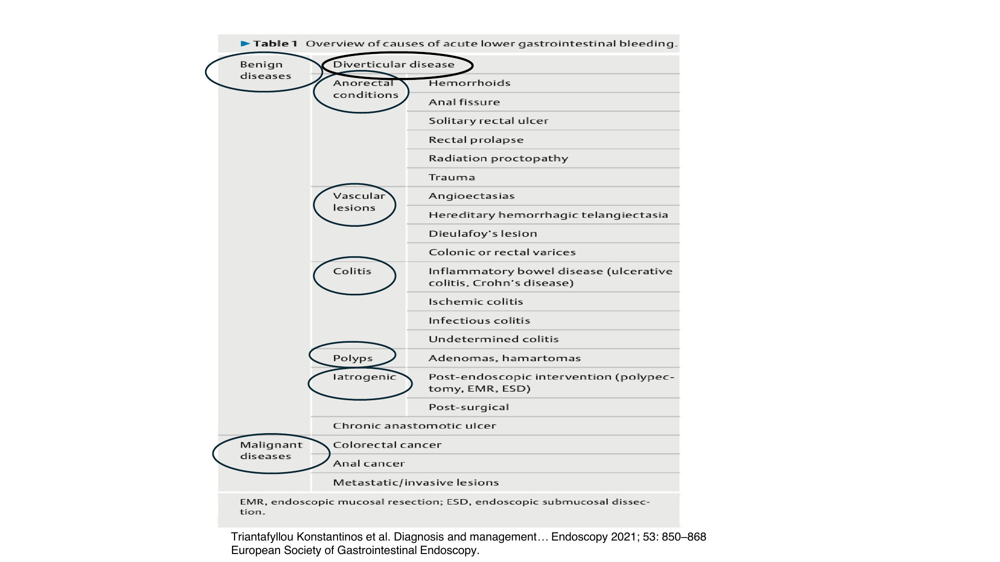
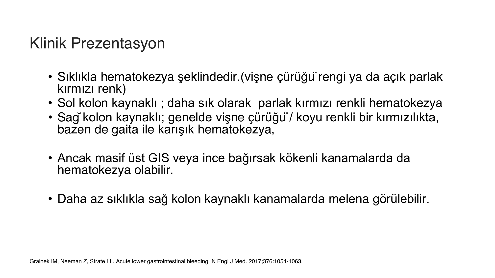
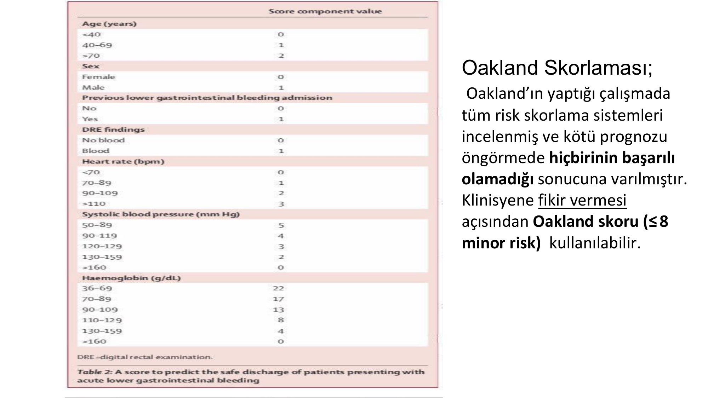
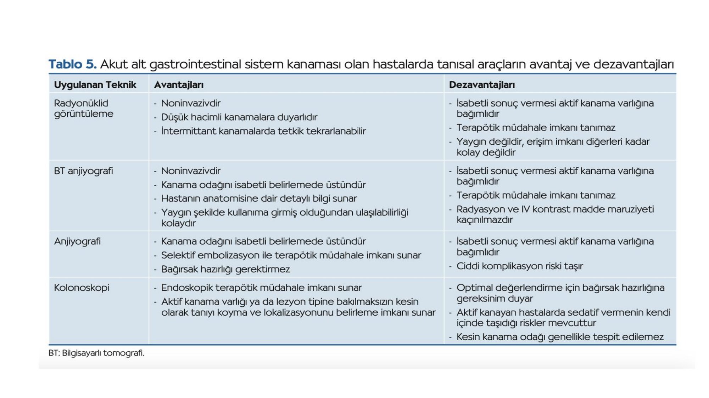
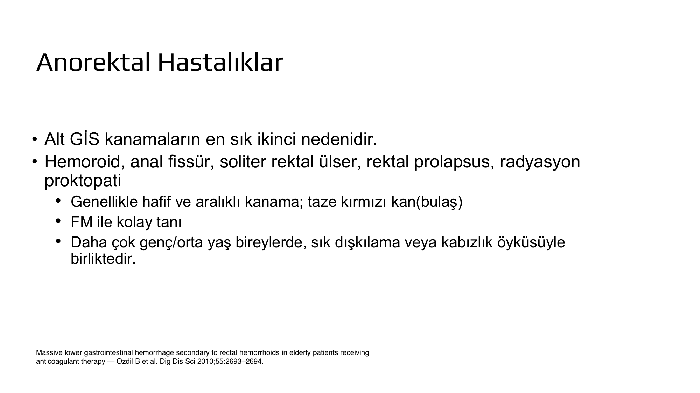
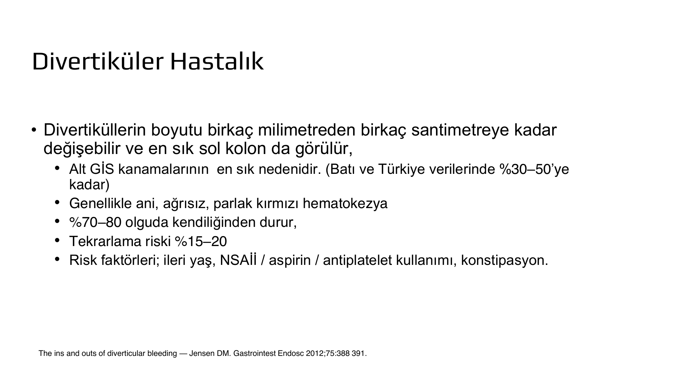
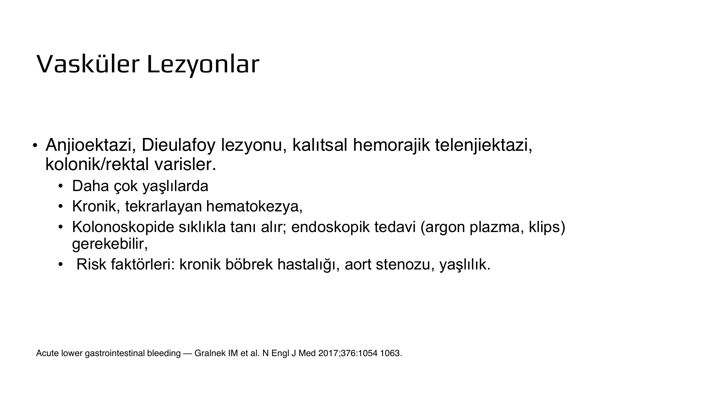
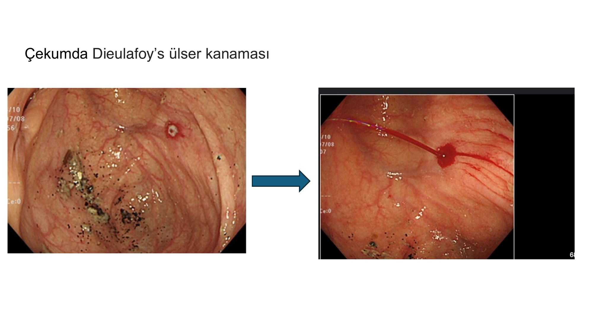
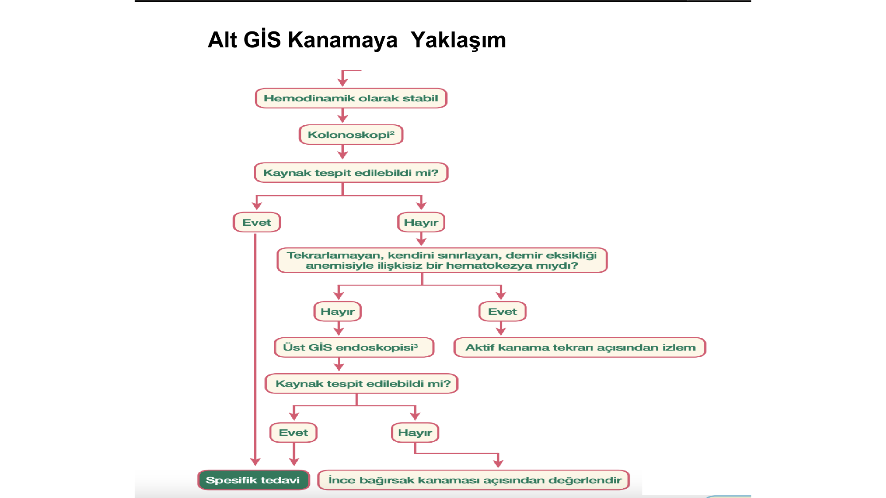

# ALT GASTROİNTESTİNAL KANAMALAR

**Hazırlayan:** Doç. Dr. Berk Baş
**Bölüm:** Aydın Adnan Menderes Üniversitesi Tıp Fakültesi — Gastroenteroloji Bilim Dalı

---

## İÇİNDEKİLER

1. [Tanım ve Epidemiyoloji](#tanım-ve-epidemiyoloji)
2. [Etiyoloji](#etiyoloji)
3. [Klinik Prezentasyon](#klinik-prezentasyon)
4. [İlk Yaklaşım ve Değerlendirme](#i̇lk-yaklaşım-ve-değerlendirme)
5. [Öykü ve Fizik Muayene](#öykü-ve-fizik-muayene)
6. [Laboratuvar](#laboratuvar)
7. [Risk Sınıflaması — Oakland Skoru](#risk-sınıflaması--oakland-skoru)
8. [Tanı — Kolonoskopi vs BT Anjiyografi](#tanı--kolonoskopi-vs-bt-anjiyografi)
9. [Tedavi — Genel Prensipler](#tedavi--genel-prensipler)
10. [Divertiküler Hastalık](#divertiküler-hastalık)
11. [Anorektal Hastalıklar](#anorektal-hastalıklar)
12. [Vasküler Lezyonlar](#vasküler-lezyonlar)
13. [İnflamatuar Hastalıklar](#i̇nflamatuar-hastalıklar)
14. [Polipler ve Maligniteler](#polipler-ve-maligniteler)
15. [İatrojenik ve Travmatik Nedenler](#i̇atrojenik-ve-travmatik-nedenler)
16. [İnce Bağırsak Kanaması Şüphesi](#i̇nce-bağırsak-kanaması-şüphesi)
17. [Alt GİS Kanamaya Yaklaşım Akış Şeması](#alt-gis-kanamaya-yaklaşım-akış-şeması)

---

## TANIM VE EPİDEMİYOLOJİ

### Tanım

**Alt GİS kanaması:** **Treitz ligamentinin distalinde** meydana gelen herhangi bir kanamadır.

### İnsidans

* **Yıllık insidans:** 20-90/100.000 kişi-yıl (erişkinlerde)
* **Tüm GİS kanamalarının ~%20-30'u**
* **Türkiye:** Yaklaşık **20/100.000** kişi-yıllık (çalışmalar sınırlı)

### Risk Faktörleri

* **İleri yaş**
* **Erkek cinsiyet** (biraz daha sık)
* **Alkol kullanımı, sigara**
* **NSAİD, düşük doz aspirin, aspirin dışı antiplatelet ilaçlar**
* Antikoagülan kullanımı

### Mortalite

* **~%2-4** (genellikle **komorbid hastalıklara bağlı**, direk kanamaya değil)

> **💡 Not:** Olguların **%22.8'inde herhangi bir neden saptanamamaktadır** (idiyopatik/kaynak tespit edilemeyen grup).

---

## ETİYOLOJİ



Alt GİS kanamaları etiyolojik olarak **6 kategoride** incelenir:

**1. Benign hastalıklar**
   * **Divertiküler hastalık**
   * **Anorektal durumlar:** Hemoroid, anal fissür, soliter rektal ülser, rektal prolapsus, radyasyon proktopati, travma
   * **Vasküler lezyonlar:** Anjiyoektaziler, HHT, Dieulafoy, kolonik/rektal varisler
   * **Kolitler:** İnflamatuar bağırsak hastalığı (ÜK, Crohn), iskemik kolit, enfeksiyöz kolit

**2. Polipler:** Adenom, hamartom

**3. İatrojenik:** Post-polipektomi, EMR, ESD, post-cerrahi (anastomoz ülseri)

**4. Malign hastalıklar:** Kolorektal kanser, anal kanser, metastatik/invaziv lezyonlar

### Nedenlerin Yaklaşık Sıklığı



| Neden | Oran |
|---|---|
| **Divertikülozis** | **%30-65** (en sık) |
| **İskemik kolit** | %5-20 |
| **Hemoroidler** | %5-20 |
| **Kolorektal polipler / neoplazmalar** | %5-15 |
| **Anjiyoektaziler** | %5-10 |
| **Post-polipektomi kanama** | %2-7 |
| **İnflamatuar bağırsak hastalıkları** | %3-5 |
| **Enfeksiyöz kolit** | %2-5 |
| **Sterkoral ülserasyon** | %0-5 |
| Kolorektal varisler | %0-3 |
| Radyasyon proktiti | %0-2 |
| **NSAİD ile tetiklenen kanamalar** | %0-2 |
| Dieulafoy lezyonu | Oldukça seyrek |

> **💡 Öğrenci ezberi:** Alt GİS kanamasının **en sık nedeni: Divertiküler hastalık** (sol kolon). **İkinci: Anorektal nedenler** (hemoroid en sık).

---

## KLİNİK PREZENTASYON


### Tipik Bulgu: Hematokezi

**Hematokezi** — vişne çürüğü rengi veya açık parlak kırmızı kanlı dışkılama.

| Kaynak | Tipik Renk |
|---|---|
| **Sol kolon kaynaklı** | **Parlak kırmızı** hematokezi |
| **Sağ kolon kaynaklı** | **Vişne çürüğü / koyu kırmızı**, bazen gaita ile karışık |

### Önemli İstisnalar

* **Masif üst GİS veya ince bağırsak kaynaklı kanamalar da hematokezi yapabilir!**
    * Çalışmalarda hematokezi ile başvuran hastaların **%10-15'inde kanama odağı Treitz ligamanı proksimalindedir** (yani üst GİS kaynaklı).
* **Sağ kolon kaynaklı kanamalarda nadiren melena** görülebilir.
* **Gaitada kan pıhtılarının görülmesi** genellikle alt GİS kanamasını destekler.

> **⚠️ ÖNEMLİ:** Hipovolemik veya hemodinamik olarak unstabil bir hasta hematokezi ile başvurduğunda, **üst GİS kanaması ekarte edilmeden** sadece alt GİS üzerinde odaklanılmamalıdır.

---

## İLK YAKLAŞIM VE DEĞERLENDİRME

GİS kanamaları **hayatı tehdit eden** durumlardır. İlk yaklaşım önceliği:

```
          Hemodinamik stabilitenin sağlanması
                         ↓
              Öykü + Fizik muayene + RT
                         ↓
                    Laboratuvar
                         ↓
     Amaç: Kanamanın şiddeti, üst GİS kaynağı
     olasılığı ve komorbiditeler tespit edilir
```

### Resüsitasyon

* **En az 2 tane geniş çaplı IV kanül** takılır
* **İzotonik NaCl veya Ringer laktat** infüzyonu (hastanın KVS'in izin verdiği ölçüde)
* **Vital bulgular monitörize** edilir, **idrar çıkışı** takip edilir
* **Hemodinamik instabil** hastalar → **yoğun bakım ünitesinde** takip

### Transfüzyon Eşikleri

| Hasta Grubu | Transfüzyon Eşiği |
|---|---|
| **Hemodinamik stabil + KVS hastalık öyküsü yok** | **Hb <7 g/dL** |
| **Akut/kronik KVS hastalık öyküsü olan** | **Hb <8 g/dL** |
| **Transfüzyon sonrası hedef** | **Hb ≥10 g/dL** |

> **💡 Restriktif transfüzyon stratejisi** (daha düşük eşik) klasik liberal transfüzyona göre mortaliteyi azaltır — özellikle aşırı transfüzyondan kaçınılmalıdır.

---

## ÖYKÜ VE FİZİK MUAYENE

### Anamnez — Sorgulanacaklar

* **Kanamanın zamanı ve miktarı?**
* **Hematokezi mi? Melena mı?**
* Halsizlik, baş dönmesi, **senkop** gibi nonspesifik semptomlar?
* **İlk defa mı?** Önceki endoskopi öyküsü?
* **Abdominal ağrı** var mı?
* **Ek hastalıklar** (KKY, KBY, KOAH, kanser, siroz?)
* **İlaçlar:** Antikoagülan, antitrombotik, steroid, NSAİD?

### Etiyolojiye Yönelik İpuçları

| Klinik Özellik | Olası Neden |
|---|---|
| **GİS semptomları olmadan ağrısız hematokezi** | **Divertiküler, vasküler, anorektal** hastalıklar |
| **Bağırsak alışkanlığı değişikliği + kilo kaybı** | **Malignite** |
| **Abdominal ağrı + ishal** | **İBH (Crohn, ÜK)** |
| **Yaşlı + KAH öyküsü + sol kolon + kanlı ishal** | **İskemik kolit** |
| **Genç + kan, mukus, ishal triadı** | **İBH** |
| **Sık dışkılama / kabızlık + taze kan bulaş** | **Hemoroid, anal fissür** |

### Fizik Muayene

* **Rektal muayene (RT) ZORUNLU:** Melena? Hematokezi? Kitle?
* **Hipovolemi bulguları:**
    * Hafif-orta (%10-15 kaybı): İstirahat taşikardisi
    * %20-25 kayıp: Ortostatik hipotansiyon
    * Ciddi (≥%40): Supin pozisyonda hipotansiyon
* **Abdominal ağrı:** İnflamatuar, iskemik, enfeksiyöz veya peptik ülser düşündürür
* **Anemi bulguları:** Konjonktiva ve cilt solukluğu
* **Karaciğer yetmezliği bulguları:** Asit, kaput meduza, hepatomegali

### Kan Kayıp Düzeyine Göre Hemodinamik Değişiklikler

| Parametre | %15 (750 mL) | %20-25 (1000-1250 mL) | %30-35 (1500-1800 mL) | %40-50 (2000-3000 mL) |
|---|---|---|---|---|
| **Kalp hızı** | <100 | >100 | >120 | >140 |
| **Solunum sayısı** | 14-19 | 20-29 | 30-40 | >40 |
| **Kan basıncı (mmHg)** | Normal | 110/80 | 70/60 | <60 |
| **Kapiller dolum** | Normal | Artmış | Artmış | Artmış |
| **İdrar (mL/dk)** | 35-50 | 30-35 | 25-30 | <15 |
| **Nörolojik** | Hafif huzursuz | Belirgin huzursuz | Konfüzyon | Letarjik |

### Alt GİS Kanamayı Taklit Edebilen Durumlar

* **Vajinal kanama** (kadın hastada dışkı ile karışabilir)
* **Gross hematüri**
* **Az sindirilmiş kırmızı yiyecekler** (kırmızı pancar, üzüm — "pseudomelena/pseudokanama")

---

## LABORATUVAR



**İstenecek testler:**

* **Tam kan sayımı** (Hb, Hct, platelet)
* **Serum biyokimyaları**
* **KCFT** (altta yatan karaciğer hastalığı?)
* **Koagülasyon parametreleri** (PT, INR, aPTT)

### Dikkat Edilmesi Gereken Noktalar

**1. Hct erken dönemde yanıltıcıdır:**

* Başvuruda Hct değerleri, volüm kaybına bağlı **düşmemiş şekilde** görülebilir.
* Sonraki **24 saatlik süreçte** volüm kaybının artması ve IV sıvı ile **dilüsyon** sonrası Hb ve Hct düşüşü görülür.
* **Akut kanamalarda Hct düşüşünün erken dönemde tutarlı olmayacağı** bilinmelidir.

**2. BUN/Kreatinin oranı:**

* **Serum kreatinin yüksekliği** → kanamaya bağlı **pre-renal ABH**
* **BUN/Kreatinin oranı >20** → **üst GİS kanaması açısından anlamlı** (özellikle >36 üst GİS lehine)

---

## RİSK SINIFLAMASI — OAKLAND SKORU



> **⚠️ ÖNEMLİ:** Oakland'ın çalışmasında **hiçbir risk skorunun kötü prognozu öngörmede tek başına başarılı olmadığı** sonucuna varılmıştır. Klinisyene fikir vermesi açısından **Oakland skoru (<8: minor risk)** kullanılabilir.

### Oakland Skoru Bileşenleri

| Parametre | Puan Aralığı |
|---|---|
| Yaş (<40 / 40-69 / ≥70) | 0 / 1 / 2 |
| Cinsiyet (kadın / erkek) | 0 / 1 |
| Önceki alt GİS kanama yatışı | 0 / 1 |
| Rektal muayenede kan | 0 / 1 |
| Kalp hızı | 0-3 |
| Sistolik kan basıncı | 0-5 |
| Hemoglobin | 0-22 |

### Oakland Skoruna Göre Yaklaşım

| Skor | Risk | Yaklaşım |
|---|---|---|
| **≤8** | **Düşük risk** | Hemodinami stabil, Hb ciddi düşük değil, senkop yok → **Ayaktan takip uygun**, gerekirse elektif kolonoskopi, demir replasmanı |
| **>8** | **Yüksek risk** | Daha fazla transfüzyon, tekrar kanama ve mortalite riski → **Yatış endikasyonu**, erken kolonoskopi/endoskopi, kanama devam ediyorsa BT anjiyo veya girişimsel radyoloji |

---

## TANI — KOLONOSKOPİ VS BT ANJİYOGRAFİ



### Stratejinin Özeti

**Hemodinamik stabil hasta** → İlk tanı yöntemi **KOLONOSKOPİ** olmalı.

* **Avantajı:** Tanı ve tedavinin **eş zamanlı** yapılabilmesi
* **Dezavantaj:** Optimal değerlendirme için **bağırsak hazırlığı** gerekir

**Hemodinamik instabil hasta** → **BT ANJİYOGRAFİ** tercih edilir.

* **Avantajı:** Bağırsak hazırlığı gerektirmez
* Kanama odağını isabetli belirlemede üstündür
* **Dezavantajı:** Terapötik müdahale imkanı tanımaz, radyasyon + IV kontrast maruziyeti

### Tanısal Araçların Karşılaştırması

| Yöntem | Avantaj | Dezavantaj |
|---|---|---|
| **Kolonoskopi** | Terapötik imkan sunar; kesin tanı ve lokalizasyon | Bağırsak hazırlığı gerektirir; sedasyon riski |
| **BT anjiyografi** | Noninvaziv; kanama odağını isabetli belirler; ulaşılabilir | Aktif kanama gerekir; terapötik değil; radyasyon + kontrast |
| **Anjiyografi** | Selektif embolizasyon ile tedavi imkanı | Aktif kanama gerekir; ciddi komplikasyon riski |
| **Radyonüklid görüntüleme (eritrosit sintigrafisi)** | Noninvaziv; **düşük hacimli kanamalara duyarlı**; intermittan kanamada tekrarlanabilir | Aktif kanama gerekir; terapötik değil; erişim zor |

> **💡 Önemli klinik karar noktaları:**
>
> * **Erken (<24 saat) kolonoskopinin ek fayda sağladığı gösterilmemiştir.**
> * **Bağırsak hazırlığı olmadan** kolonoskopi/sigmoidoskopi için veri yetersizdir.
> * **Elektif şartlarda hazırlıklı kolonoskopi** önerilir.
> * **Hemodinamik instabil hematokezyalı hastalarda**, BT anjiyo yapılamamışsa **masif üst GİS kanama ekarte edilmelidir** (üst endoskopi yapılabilir).

---

## TEDAVİ — GENEL PRENSİPLER

### Tedavinin Basamakları

1. **Resüsitasyon** (IV sıvı, transfüzyon)
2. **Tanı** (kolonoskopi / BT anjiyo)
3. **Endoskopik tedavi** (termal, klip, injeksiyon)
4. **Girişimsel radyoloji** (transkateter embolizasyon)
5. **Cerrahi** (son seçenek)

### Transkateter Arteriyel Embolizasyon

**Endikasyonlar:**

* **Hemodinamik instabil** hasta
* **BT anjiyografi ile kanama odağı belli** olan
* Kanama devam eden, unstabil
* **Endoskopik tedavi başarısız** olduğunda

> **⚠️ Radyolojik tedavi için net bir lokasyon gereklidir** — bu yüzden **eritrosit sintigrafisi** tercih edilmez (lokalizasyon için).

### Cerrahi Tedavi

* Yalnızca alt GİS kanamanın **endoskopik ve radyolojik tedaviye uygun olmayan** bir patolojiye bağlı olması
* **Bu yöntemlerin başarısız olması** durumunda önerilir

---

## DİVERTİKÜLER HASTALIK



### Temel Özellikler

* **Alt GİS kanamalarının en sık nedeni** (Batı ve Türkiye verilerinde **%30-50**)
* Divertiküllerin boyutu birkaç milimetreden birkaç santimetreye kadar değişebilir
* **En sık SOL KOLON'da** görülür (ama kanama genellikle **sağ kolon** divertikülünden!)

### Klinik

* **Ani, ağrısız, parlak kırmızı hematokezi**
* **%70-80 olgu kendiliğinden durur**
* **Tekrarlama riski: %15-20**

### Risk Faktörleri

* **İleri yaş**
* **NSAİD / aspirin / antiplatelet** kullanımı
* **Konstipasyon**

### Tedavi

* Çoğunlukla konservatif (kendi kendine düzelme)
* Endoskopik: Epinefrin injeksiyon + klip / termal
* **Cerrahi (küratif):** Divertikül içeren kolon kısmının çıkarılması
* **Cerrahi endikasyon:** Persistan, büyük kanamalar (24 saatte >4 ünite ya da tek atakta 10 ünite) veya sık tekrarlayan kanamalar

> **⚠️ Cerrahi öncesi kanama yerinin lokalizasyonu kesin olmalıdır** — çünkü divertiküler kanamanın tanısı sıklıkla tahminidir.

---

## ANOREKTAL HASTALIKLAR



**Alt GİS kanamalarının ikinci en sık nedeni.**

**Alt gruplar:**

* **Hemoroid** (en sık)
* **Anal fissür**
* **Soliter rektal ülser**
* **Rektal prolapsus**
* **Radyasyon proktopati**

### Klinik

* Genellikle **hafif ve aralıklı kanama**
* **Taze kırmızı kan bulaşı** (dışkı üstünde veya tuvalet kağıdında)
* **Fizik muayene ile kolay tanı**
* Daha çok **genç/orta yaş** bireylerde, sık dışkılama veya kabızlık öyküsüyle birlikte

### Önemli İpuçları

* **Anal fissürler Crohn hastalığı**na bağlı olabilir — ayrıntılı değerlendirilmelidir.
* Anal fissürde **lateralde yerleşim** → Crohn veya cinsel yolla bulaşan hastalık şüphesi uyandırır.
* **Çoğu hasta tüm perianal semptomlarını hemoroid olarak** bildirir — dikkat!

### 40 Yaş Kuralı

> **⚠️ ÖNEMLİ:** Aşikar rektal kanamayla başvuran **201 hastanın 10 yıllık takibinde**:
>
> * **%13 polip**
> * **%6.5 kolon kanseri**
> * **%4 İBH**
>
> **Kurallar:**
>
> * **<40 yaş, aşikar anorektal odak yoksa** veya odak tedavisine rağmen kanama devam ediyorsa → **kolonoskopi** ile tam değerlendirme
> * **>40 yaş ile kanaması olan hastalar** → **DAİMA kolonoskopi** ile değerlendirilmelidir

---

## VASKÜLER LEZYONLAR


**Alt gruplar:**

* **Anjiyoektazi** (en sık)
* **Dieulafoy lezyonu**
* **Kalıtsal hemorajik telenjiyektazi (HHT — Osler-Weber-Rendu)**
* **Kolonik / rektal varisler**

### Özellikler

* Daha çok **yaşlılarda**
* **Kronik, tekrarlayan hematokezi**
* **Kolonoskopide sıklıkla tanı alır**
* **Endoskopik tedavi:** Argon plazma koagülasyonu, klips

### Risk Faktörleri

* **Kronik böbrek hastalığı**
* **Aort stenozu** (Heyde sendromu — von Willebrand faktör 2A azalması)
* **İleri yaşlılık**

### Dieulafoy Lezyonu



* Kolonun herhangi bir yerinde görülebilir, **çekum** da dahil
* Submukozal aberran dilate damarın epiteli erode etmesi
* Endoskopik olarak tespiti zor; kanama dramatik

---

## İNFLAMATUAR HASTALIKLAR

**Alt gruplar:**

* **İskemik kolit**
* **Ülseratif kolit**
* **Crohn hastalığı**
* **Enfeksiyöz kolit**

### Klinik

* **Kanlı ishal, karın ağrısı, ateş, sistemik semptomlar**

### İskemik Kolit

* **Yaşlı ve KAH olanlarda**
* **Sol kolon tutulumu** (splenik fleksura, sigmoid)
* Ani başlangıçlı karın ağrısı ve kanlı diyare
* Genelde kendiliğinden düzelir

### İBH (ÜK, Crohn)

* **Daha genç hastalarda**
* **Kan, mukus, ishal triadı**
* **Şiddetli inflamasyon** (yaygın ülserler, derin penetrasyon) → **daha fazla kanama**
* ÜK → sürekli mukozal inflamasyon
* Crohn → segmenter, transmural tutulum

---

## POLİPLER VE MALİGNİTELER

### Polipler

* **Adenom ve hamartomlar** en sık alt GİS kanamaya neden olan poliplerdir.
* Genellikle **şiddetli kanama olmaz** — daha çok kronik, düşük hacimli.

### Kolorektal Kanser

* **Kitle yüzeyel ülserasyonlarına bağlı** kanama
* **Kronik belirgin rektal kanaması olan hastaların %7-10'u kolorektal malignite**
* **Kanamadan önce kademeli GİS kan kaybına bağlı mikrositer demir eksikliği anemisi tipiktir.**

> **💡 Kırmızı bayraklar — Malignite düşün:**
>
> * **>40 yaş + rektal kanama**
> * **Kilo kaybı**
> * **Bağırsak alışkanlığı değişikliği**
> * **Mikrositer demir eksikliği anemisi**
> * **Ailede kolorektal kanser öyküsü**

---

## İATROJENİK VE TRAVMATİK NEDENLER

### Endoskopik Girişim Sonrası

* **Polipektomi**
* **Endoskopik Mukozal Rezeksiyon (EMR)**
* **Endoskopik Submukozal Diseksiyon (ESD)**
* Biyopsi sonrası mukozal travma

### Cerrahi Sonrası

* **Anastomoz hattı ülseri**
* **Stapler hattı erozyonu**
* **Mukozal yırtıklar**
* **Erken postoperatif** dönem ve **geç dönemde kronik anastomoz ülseri**

---

## İNCE BAĞIRSAK KANAMASI ŞÜPHESİ

### Tanım

**İnce bağırsak kanaması (Small-Bowel Bleeding — SBB):** **Ampulla Vater ile ileoçekal valf arasındaki** kanamadır (OGD ve kolonoskopi ile ulaşılamayan alan).

### Ne Zaman Şüphelenmeli?

* GİS kanama bulguları olan
* **Endoskopi ve kolonoskopi bulguları negatif** olan hastalarda

> **💡 Önemli:** İlk endoskopi-kolonoskopi negatifse **tekrar etmeden ince barsak görüntülemelerine** geçilmelidir.

### Tanı Yöntemleri

* **İnce Bağırsak Kapsül Endoskopisi (SBCE)** — ilk tercih
* **İdeal olarak şüphe sonrası ilk 48 saat içinde** yapılmalıdır (son kanama epizoduyla arasındaki süre kısaldıkça tanı verimi artar)
* **Çift balon enteroskopi** — tanı + tedavi imkanı sunar; daha invaziv
* **Cihaz yardımlı enteroskopi** (spiral, tek balon)

---

## ALT GİS KANAMAYA YAKLAŞIM AKIŞ ŞEMASI



```
      Hemodinamik stabil
              ↓
        KOLONOSKOPİ
              ↓
    Kaynak tespit edilebildi mi?
       ↓             ↓
      Evet         Hayır
       ↓             ↓
   Spesifik      Tekrarlamayan, kendini
    tedavi       sınırlayan, demir eksikliği
                 anemisiyle ilişkisiz
                 hematokezi miydi?
                     ↓        ↓
                    Hayır    Evet
                     ↓        ↓
              Üst GİS       Aktif kanama
              endoskopisi   tekrarı açısından
                     ↓       izlem
              Kaynak tespit
              edilebildi mi?
                 ↓        ↓
                Evet     Hayır
                 ↓        ↓
             Spesifik   İnce bağırsak
              tedavi    kanaması açısından
                       değerlendir (SBCE)
```

---

## SINAV NOTLARI — ANAHTAR HATIRLATMALAR

> **📋 En Sık Sorulan Noktalar:**
>
> 1. **Alt GİS kanaması tanımı:** Treitz ligamentinin **distalindeki** kanama.
> 2. **En sık neden: Divertiküler hastalık (%30-65).** Genellikle sağ kolon divertikülü. %70-80 kendiliğinden durur, tekrar %15-20.
> 3. **İkinci en sık: Anorektal hastalıklar** (hemoroid en sık).
> 4. **Klinik: Hematokezi** — sol kolon parlak kırmızı; sağ kolon vişne çürüğü.
> 5. **⚠️ Hematokezi %10-15 üst GİS kaynaklı** — hipotansif hastada üst GİS ekarte et!
> 6. **BUN/Kreatinin >20** → üst GİS kanaması lehine.
> 7. **Oakland skoru ≤8** → düşük risk, ayaktan; **>8** → yatış.
> 8. **Hemodinamik stabil → kolonoskopi**; **instabil → BT anjiyografi**
> 9. **Bağırsak hazırlıksız erken kolonoskopinin faydası gösterilmemiştir** — elektif şartlarda hazırlıklı kolonoskopi önerilir.
> 10. **Transkateter arteriyel embolizasyon** → unstabil + BT anjiyo ile lokalizasyon + endoskopik tedavi başarısız.
> 11. **Eritrosit sintigrafisi radyolojik tedavi için lokasyon göstermediğinden tercih edilmez.**
> 12. **Transfüzyon eşiği:** Sağlıklı → Hb <7; KVS hastalığı → Hb <8; hedef Hb ≥10.
> 13. **Divertiküler kanama risk faktörleri:** İleri yaş, NSAİD/aspirin/antiplatelet, konstipasyon.
> 14. **>40 yaş rektal kanama → DAİMA kolonoskopi** (kolorektal kanser açısından).
> 15. **Anal fissür lateralde** → Crohn veya cinsel yolla bulaşan hastalık düşün.
> 16. **İskemik kolit** → yaşlı, KAH, sol kolon (splenik fleksura, sigmoid).
> 17. **Kronik rektal kanama hastalarının %7-10'u kolorektal malignite**; mikrositer demir eksikliği anemisi tipik.
> 18. **Kolonoskopi-endoskopi negatif → İnce bağırsak kanaması** → **SBCE ilk tercih** (ideal olarak ilk 48 saat).
> 19. **Çift balon enteroskopi** ince barsak kanamasında tanı + tedavi imkanı sunar.

---

> **Kaynaklar:**
>
> 1. Gralnek IM, Neeman Z, Strate LL. Acute lower gastrointestinal bleeding. N Engl J Med 2017;376:1054-63.
> 2. Oakland K, et al. Acute lower GI bleeding in the UK: patient characteristics, interventions and outcomes. Gut 2018;67:654-62.
> 3. Triantafyllou K, et al. European Society of Gastrointestinal Endoscopy (ESGE) Guideline: Diagnosis and management of acute lower gastrointestinal bleeding. Endoscopy 2021;53:850-68.
> 4. Oakland K, Chadwick G, East JE, et al. Diagnosis and management of acute lower gastrointestinal bleeding: guidelines from the British Society of Gastroenterology. Gut 2019;68:776-89.
> 5. Jensen DM. The ins and outs of diverticular bleeding. Gastrointest Endosc 2012;75:388-91.
> 6. Stern SDC, Cifu AS, Altkorn D. Gastrointestinal Kanama. Lange İç Hastalıklarında Semptomdan Tanıya Kanıta Dayalı Bir Rehber, 2018.
