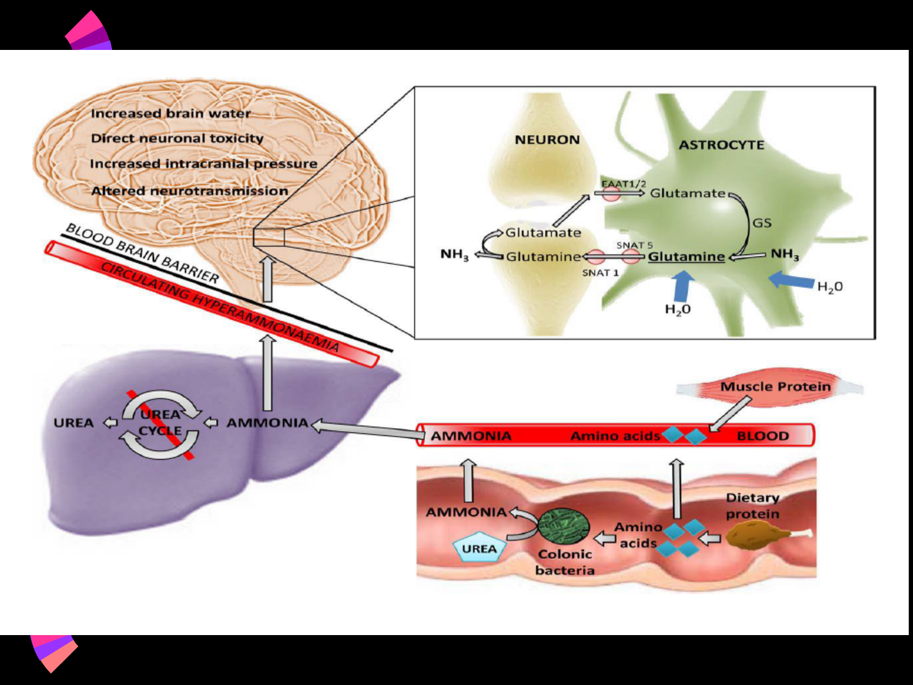
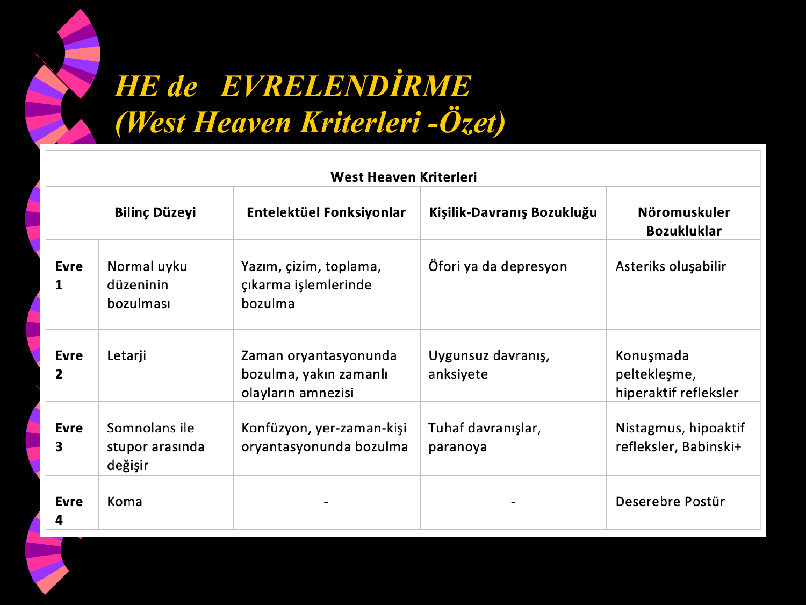

# HEPATİK ENSEFALOPATİ (HE)

**Hazırlayan:** Prof. Dr. M. Hadi Yaşa
**Bölüm:** Aydın Adnan Menderes Üniversitesi Tıp Fakültesi — Gastroenteroloji Bilim Dalı

---

## İÇİNDEKİLER

1. [Tanım](#tanım)
2. [Fizyopatoloji](#fizyopatoloji)
3. [Etiyolojik Hipotezler](#etiyolojik-hipotezler)
4. [HE Klinik Formları](#he-klinik-formları)
5. [Sirotik Hastalarda Akut ve Kronik HE](#sirotik-hastalarda-akut-ve-kronik-he)
6. [Presipite Eden Faktörler](#presipite-eden-faktörler)
7. [Klinik Sınıflandırma — West Haven Kriterleri](#klinik-sınıflandırma--west-haven-kriterleri)
8. [Klinik Semptom ve Bulgular](#klinik-semptom-ve-bulgular)
9. [Tanı — Laboratuvar ve Diğer Testler](#tanı--laboratuvar-ve-diğer-testler)
10. [Ayırıcı Tanı](#ayırıcı-tanı)
11. [Tedavi — Genel İlkeler](#tedavi--genel-i̇lkeler)
12. [Presipite Eden Faktörlerin Tedavisi](#presipite-eden-faktörlerin-tedavisi)
13. [Nitrojenik Madde Emiliminin Engellenmesi](#nitrojenik-madde-emiliminin-engellenmesi)
14. [Hiperamonyemiye Yönelik Tedavi](#hiperamonyemiye-yönelik-tedavi)
15. [Portokaval Şanttan Fazla Akımın Azaltılması](#portokaval-şanttan-fazla-akımın-azaltılması)
16. [Prognoz](#prognoz)

---

## TANIM

**Hepatik Ensefalopati (HE):** **Akut, subakut veya kronik karaciğer hastalığı** sonucu gelişen; portosistemik kollaterallerin de katkıda bulunduğu; **nöropsikiyatrik semptomlarla karakterize**; **genellikle reverzibl, metabolik bir ensefalopatidir**.

---

## FİZYOPATOLOJİ



### Temel Mekanizma

1. **Diyetteki proteinler** bağırsaklarda **toksik nitrojenik maddelere** (özellikle **amonyak**) çevrilir.
2. Bu maddeler kana karışır.
3. **Hasta karaciğerde yeterince metabolize edilemez** ya da **portokaval kollateraller yolu ile karaciğere uğramadan** sistemik dolaşıma geçer.
4. Kanda biriken maddelerden **kan-beyin bariyerini geçebilenler** santral sinir sistemine girer.
5. **Beyin fonksiyonlarında HE ile karakterize değişikliklere** yol açar.

### Amonyağın Beyindeki Etkileri

* **Beyin suyunda artış** (astrosit ödemi)
* **Direkt nöronal toksisite**
* **İntrakranyal basınç artışı**
* **Nörotransmisyon bozukluğu**

**Moleküler düzeyde:**

* Astrositte **glutamat → glutamin** dönüşümü (GS — glutamin sentaz)
* Glutamin birikimi → **astrosit şişmesi, sitotoksik ödem**
* Direkt olarak **post-sinaptik nöron membranı**nı bozar
* **GABA ve benzodiazepin etkisini uyarır**

### Kas — Bağırsak — Karaciğer — Beyin Aksisi

```
   Protein (diyet)
         ↓
  Kolonda bakteriler → Amonyak + Amino asitler
         ↓
      KAN (portal)
         ↓
   Karaciğer (sağlam) → Üre döngüsü → Üre (böbrekten atılım)
         ↓ (yetmezlikte veya şant nedeniyle geçer)
      Sistemik kan
         ↓
  Kan-beyin bariyeri (geçer)
         ↓
      BEYİN
         ↓
  Astrositte glutamin birikimi
         ↓
  Beyin ödemi + nöronal toksisite
         ↓
       HE bulguları
```

Ayrıca **kas proteini** de yıkılarak amonyak kaynağı olur.

---

## ETİYOLOJİK HİPOTEZLER

### 1. Amonyak Hipotezi (En çok kabul gören)

* **En eski ve en çok kabul gören** hipotezdir.
* **Amonyak** kan-beyin bariyerini rahatça geçen bir **nörotoksindir**.
* Tek başına HE yapabilir.
* HE'lilerin **%90'ında amonyak yüksek** bulunur.
* Oral amonyum tuzları ve IV amonyak verilerek HE oluşturulabilir.

**Amonyağın beyindeki etkisi:**

* **Glutamin** ve diğer metabolitleri artırır
* **Krebs sitrik asit döngüsünü** bozar
* **Post-sinaptik nöron membranı**nı bozar
* **GABA ve benzodiazepin etkisini uyarır**

### 2. Yalancı Nörotransmitter Hipotezi

* HE'de beyinde **aromatik amino asitler birikir**.
* **Triptofan**dan oluşan **seratonin**, **oktapamin** ve **feniletanolamin** gibi **yalancı, zayıf nörotransmitterler artar**.
* Sonuç: **Nöral inhibisyon**.

### 3. GABA Hipotezi

* HE'de beyinde **sinaptik aralıkta GABA, glisin ve benzodiazepin ligandları** artmıştır.
* **Benzodiazepin reseptör antagonisti flumazenil**, HE'li hastaların bir kısmında **geçici nörolojik düzelme** sağlar.
* HE'de **beyinde manganez artışı** da olmaktadır.

### 4. Opioidler

* HE'nin çeşitli hayvan modellerinde opioid ligand düzeylerinin arttığı gösterilmiştir.
* İnsan çalışmalarında kan ve BOS'ta **metenkefalin ve β-endorfin** artmıştır.

> **💡 Sonuç:** HE, etyolojide **birden çok faktörün rol aldığı multifaktöriyel** bir hastalıktır.

---

## HE KLİNİK FORMLARI

### A. Akut Karaciğer Yetmezliği + HE

**HE ile komplike akut hepatit** → **akut karaciğer yetmezliği, fulminan hepatit** veya **fulminan karaciğer yetmezliği** olarak adlandırılır.

### B. Portosistemik Bypass

Dekompanse sirozda gelişen veya cerrahi şant sonrası.

### C. Siroz ve Portal Hipertansiyon

**HE, klinikte en sık dekompanse karaciğer hastalığı (siroz) seyrinde görülür.**

> **⚠️ ÖNEMLİ:** HE, karaciğer hastalığının **prognozunu olumsuz yönde etkiler**.

---

## SİROTİK HASTALARDA AKUT VE KRONİK HE

### Akut HE (En sık form)

* **En sık görülen form**
* **Sıklıkla presipite eden bir faktör** vardır
* Tedavide **öncelikle bu faktör ortadan kaldırılır**
* **Tedaviye cevap çok iyidir**

### Kronik HE

* **Seyrek görülür**
* **Geniş portokaval şant vardır** (spontan veya iatrojenik — TIPS sonrası)
* İleri karaciğer hastalığında gelişir
* **Persistan veya epizodik HE atakları** görülür

### Akut Karaciğer Yetmezliği HE vs Siroz HE

| Özellik | **Akut karaciğer yetmezliği** | **Siroz HE** |
|---|---|---|
| **Klinik** | Minimal HE → akut HE → **fulminan** | Kronik HE, epizodik |
| **Mortalite** | **Çok yüksek** | Değişken |
| **Presipite faktör** | Yok | **Geniş portosistemik şant** |
| **Reversibilite** | Genellikle **irreverzibl (ölümcül)** | **Genellikle reverzibl** |

---

## PRESİPİTE EDEN FAKTÖRLER

> **🚨 Akut HE'yi tetikleyen faktörler — Tedavide en önemli adım bu faktörün tespiti ve düzeltilmesidir:**

* **Oral protein yüklenmesi**
* **Üst / alt gastrointestinal kanama** (barsakta hemoglobinin proteine dönüşümü → amonyak)
* **Konstipasyon, ishal, kusma**
* **Aşırı diüretik tedavi** (hipokalemi, alkaloz, hipovolemi)
* **Aşırı parasentez** (hipovolemi)
* **Hipoksi, hipoglisemi**
* **Derin anemi**
* **Hipotansiyon**
* **Sedatif ilaçlar** (benzodiazepinler, opioidler)
* **Azotemi** (renal yetmezlik)
* **Enfeksiyon** (özellikle SBP)

> **💡 Pratik hatırlatma — "ADILS BACK HE":** Kanama, konstipasyon, dehidratasyon, elektrolit bozuklukları, enfeksiyon, sedatif, renal yetmezlik, protein yükü.

---

## KLİNİK SINIFLANDIRMA — WEST HAVEN KRİTERLERİ



| Evre | Bilinç Düzeyi | Entelektüel Fonksiyon | Kişilik-Davranış | Nöromüsküler Bozukluklar |
|---|---|---|---|---|
| **Evre 1** | **Normal uyku düzeninin bozulması** | Yazım, çizim, toplama-çıkarma işlemlerinde bozulma | **Öfori** veya **depresyon**; anksiyete, irritabilite | **Asteriksis oluşabilir** |
| **Evre 2** | **Letarji** | **Zaman oryantasyonu**nda bozulma, yakın zamanlı olayların amnezisi | **Uygunsuz davranış**, anksiyete | Konuşmada **peltekleşme**, hiperaktif refleksler |
| **Evre 3** | **Somnolans ile stupor arasında** (uyandırılabilir) | **Konfüzyon**, yer-zaman-kişi oryantasyon bozukluğu, amnezi | **Tuhaf davranışlar**, **paranoya**, manasız konuşma | **Nistagmus, hipoaktif refleksler, Babinski (+)**, bilateral hipertoni, sık tremor, ataksi |
| **Evre 4** | **Koma** (ağrılı uyaranlara cevap var) | — | — | **Deserebre postür**, reflekslerde azalma/kayıp, hipotoni |
| **Evre 5** | **Derin koma** (ağrılı uyaranlara cevap yok) | — | — | — |

> **💡 Öğrenci özeti:**
>
> * **Evre 1:** Hafif mental/davranış değişiklikleri, uyku düzeni bozuk, **asteriksis olabilir**
> * **Evre 2:** Letarji + oryantasyon bozukluğu + asteriksis belirgin
> * **Evre 3:** Stupor, şiddetli konfüzyon
> * **Evre 4:** Koma (ağrıya yanıt var)
> * **Evre 5:** Derin koma (ağrıya yanıt yok)

---

## KLİNİK SEMPTOM VE BULGULAR

### HE'ye Özgü Bulgular

* **Flapping tremor (asteriksis)** — **FLAP TEST**
* **Fetor hepatikus** — çürük elma kokusu
* **Hiperventilasyon**
* **Uyku bozuklukları**
* **Spontan hareketlerde azalma**
* **Sabit bakış**
* **Apati**
* **Kişilik değişiklikleri:** Çocukça davranışlar, irritabilite, aileye olan ilginin kaybolması

### Asteriksis (Flapping Tremor)

* HE'nin karakteristik muayene bulgusudur
* **Evre 1, 2 ve 3 HE'de saptanabilir** (evre 4'te kaybolur)
* **Flap test:** Hasta kollarını düz uzatıp bileklerini dorsifleksiyona aldırtır → el düzgün pozisyonu koruyamaz, ritmik fleksiyon-ekstansiyon hareketleri yapar

> **⚠️ ÖNEMLİ:** **Asteriksis patognomonik değildir!** Şu durumlarda da görülebilir:
>
> * **Hipoksi, hiperkapni**
> * **Üremi**
> * **Ağır kalp yetmezliği**
> * **Sedatif zehirlenmeleri**

### Fetor Hepatikus

**Protein-amonyak-metilmerkaptan-dimetilsülfit** solunumla atılması ile nefeste oluşan **çürük elma kokusu**.

### Klinik Değerlendirmenin 2 Komponenti

1. **Hastada metabolik bir ensefalopatinin varlığının tespiti** ve derecesinin saptanması
2. **Eşlik eden karaciğer hastalığının tespiti** (sarılık, asit, ödem, kaput medusa, palmar eritem, spider nevüs, fetor hepatikus, laboratuvar bulguları)

---

## TANI — LABORATUVAR VE DİĞER TESTLER

### Tanı Yaklaşımı

* **HE için tanı koyduracak çok spesifik bir laboratuvar yoktur.**
* Tanıda öncelikli olarak **nörolojik muayene ile organik SSS lezyonlarının ekarte edilmesi** gerekir.
* Metabolik ensefalopatinin nedeninin karaciğer hastalığı olduğu **anamnez + fizik muayene + laboratuvar** ile ortaya konulur.

### 1. Biyokimyasal Testler

* **Patognomonik test yok**
* **Karaciğer fonksiyon testlerinde bozukluk**
* **Plazma amonyak düzeyinde yükseklik** (tanıda en sık kullanılan test)
* **BOS'ta glutamin ve amonyak tayini**
* **Plazmada aromatik amino asit (fenilalanin, tirozin, triptofan) artışı**
* **Dallı zincirli amino asit (valin, lösin, izolösin) azalması**

> **⚠️ Amonyak hakkında:**
>
> * Arteriyel amonyak düzeyi hastaların sadece **%90'ında yüksektir**, **%10'unda normaldir**.
> * **Amonyak normal olması HE tanısını ekarte ETTİRMEZ.**
> * Amonyak düzeyi ile HE derecesi arasında **her zaman doğru bir ilişki yoktur**.
> * Tanıdan ziyade **takipte yararlıdır**.

### İdiopatik Hiperamonyemi Nedenleri

Amonyak yüksekliği HE'ye özgü değildir. Karaciğer toksisitesi olmadan hiperamonyemi:

* **Valproat kullanımı**
* **Yoğun kemoterapötik ilaç kullanımı**
* **Multipl myelom**
* **Aşırı egzersiz**
* **Asidoz**
* **Hipokalemi**

### 2. Psikometrik Testler (Minimal HE Tanısında)

* **Number Connection Test** (Sayı bağlama testi)
* **Symbol Test**
* **Çizgi takip testi**
* **Yazı yazdırma, şekil çizdirme testleri**

Bu testler özellikle **Evre 0 (minimal HE / covert HE)** tanısında önemlidir.

### 3. Elektrofizyolojik Testler

* **EEG (Elektroensefalogram):**
    * **Dalga frekansında** ve **alfa dalgası amplitüdünde azalma**
    * İleri dönemde **paroksismal trifazik dalgalar**
* **Uyarılmış potansiyeller (Evoked potentials)**

---

## AYIRICI TANI

Mental bozukluğa sebep olabilecek diğer nedenlerin ayırıcı tanıda düşünülmesi gerekir:

* **Organik beyin sendromları**
* **Subdural hematom**
* **Enfeksiyöz ensefalopatiler** (meningoensefalit)
* **Diğer metabolik ensefalopatiler:**
    * **Üremi**
    * **Hipoglisemi, hiperglisemi**
    * **Hipo-hipernatremi**
* **Alkol intoksikasyonu**
* **Alkol yoksunluk sendromu**
* **Sedatif ve hipnotik ilaç intoksikasyonu**

> **💡 Gerekirse:** Kan tetkikleri, USG, BT, MR yapılmalıdır.

---

## TEDAVİ — GENEL İLKELER

HE tedavisi **4 ana prensibe** dayanır:

1. **Presipite edici faktörlerin tedavisi**
2. **Bağırsaklardan nitrojenik maddelerin emiliminin engellenmesi**
3. **Portokaval şanttan aşırı kan geçişinin önlenmesi**
4. **Hedef organa ve hipotezlere yönelik tedavi**

---

## PRESİPİTE EDEN FAKTÖRLERİN TEDAVİSİ

HE'ye zemin hazırlayan faktörler ortadan kaldırılmalıdır:

* **GİS kanamaları** → endoskopik hemostaz
* **Dehidratasyon** → IV sıvı
* **Konstipasyon** → laktuloz
* **Enfeksiyonlar** → antibiyoterapi (özellikle **SBP** açısından asit sıvısı incelemesi)
* **Aşırı protein alımı** → kısıtlama
* **Elektrolit düzensizlikleri** → düzeltme (özellikle K)
* **SSS etkili ilaçlar** → kesilmesi (benzodiazepin, opioid)

> **💡 Altın kural:** HE tedavisinde **en önemli adım presipite edici faktörün bulunması ve tedavi edilmesidir**. Ek ilaçlar bu olmadan yetersiz kalır.

---

## NİTROJENİK MADDE EMİLİMİNİN ENGELLENMESİ

### 1. Protein Kısıtlaması

* **Diyette protein kısıtlanması** (geçici!)
* **Günlük protein miktarı: 1.2-1.5 g/kg/gün**
    * *Not: Eski "sıkı protein kısıtlaması" yaklaşımı terkedilmiştir — protein malnütrisyonu kötü prognoz göstergesidir.*
* **Bitkisel proteinler; süt ve süt ürünleri iyi tolere edilir**
* **Hayvansal proteinler (et, yumurta) kötü etkilidir**

### 2. Disakkaritler (Laktuloz, Laktitol)

**Mekanizmalar:**

| Mekanizma | Etki |
|---|---|
| **a) Asit ortam oluşturma** | Bağırsaklarda laktik asit miktarını artırarak amonyak üreten bakterilerin **asit ortamda inhibisyonu** |
| **b) Bağırsak hareketlerini artırma** | Protein kaynaklı gıdaların **transit zamanını kısaltır** → amonyak emilimi azalır |
| **c) H⁺ iyonu artışı** | Amonyağın (NH₃) **amonyuma (NH₄⁺) dönüşümü** → NH₄⁺ emilemez (amonyak emilimini engeller) |

**Dozaj:**

* **Oral:** Günde **2-4 × 30-50 mL** (günde 2-3 yumuşak dışkı hedef)
* **Lavman (Evre 3-4):** **300 mL laktuloz + 700 mL su**

### 3. Antibiyotikler

Amonyak üretiminde rolü olan **intestinal floranın baskılanması**:

| Antibiyotik | Doz |
|---|---|
| **Rifaksimin** (tercih edilen — emilmez, yan etki az) | **1200 mg/gün** |
| **Neomisin** | 6-12 g/gün |
| **Metronidazol** | 1500-2250 mg/gün |

> **💡 Rifaksimin neden ilk tercih?** Emilmeyen bir antibiyotiktir → sistemik yan etki yok. Tekrarlayan HE ataklarının **sekonder profilaksisinde** laktuloza ek olarak kullanılır (rekürrensi azaltır).

---

## HİPERAMONYEMİYE YÖNELİK TEDAVİ

Kandaki amonyağın atılmasına yönelik tedaviler:

### 1. LOLA (L-Ornitin L-Aspartat)

* **Üre sentezinin substratıdır**
* Karaciğerde **üre sentezini uyararak** amonyak yıkımını hızlandırır
* **Dozaj:**
    * **Oral:** Günde 3 × 3-6 g
    * **IV (Evre 3-4 HE):** Günde 4-8 ampul IV infüzyon (1 ampul = 5 g, 10 mL)

### 2. Sodyum Benzoat (10 g/gün)

* **Amonyağı bağlar** ve **hippürik asit şeklinde böbrekten atılımını** sağlar

### 3. L-Karnitin

* Amonyak atılımını hızlandırır

### 4. Sodyum Fenil Bütirat

* Amonyağın böbrekle atılımını hızlandırır

### Yalancı Nörotransmitterlere Yönelik Tedavi

* **Dallı zincirli amino asit (BCAA) infüzyonu veya oral formları:** Daha çok negatif nitrojen balansı olan hastalarda yararlı olabilir

### GABA ve Benzodiazepin Ligandlarına Yönelik Tedavi

* **Flumazenil (Anexate):** Benzodiazepin reseptör antagonisti; HE'de kısa süreli etkili. Yarı ömrü çok kısa. Özellikle **benzodiazepin kullanımı sonrası HE** gelişen hastada faydalı.

---

## PORTOKAVAL ŞANTTAN FAZLA AKIMIN AZALTILMASI

Büyük portosistemik şant nedeniyle tekrarlayan HE'de (özellikle TIPS sonrası):

* **Splenik arter embolizasyonu**
* **TIPS'te stent çapının "reducing stent" ile daraltılması**
* **Şant içine sklerozan madde enjeksiyonu**
* **Şant içine "coil" yerleştirilmesi**
* **Balon oklüzyonu**

---

## PROGNOZ

| Durum | Prognoz |
|---|---|
| **Akut karaciğer yetmezliğinde HE** | **Yüksek oranda mortalite** → **acil transplantasyon endikasyonu** |
| **Sirozda HE** | Genellikle **tedaviye iyi cevap** verir. Ancak uzun vadede **kötü prognoz göstergesi**dir. |

**Genel kurallar:**

* Prognozda **erken tanı ve erken tedavi çok önemlidir**.
* **Tedaviye cevap vermeyen HE → transplantasyon endikasyonu**.

> **💡 Klinik gerçek:** HE geliştiği an, hasta **karaciğer transplantasyonu değerlendirmesi** için mutlaka merkeze yönlendirilmelidir.

---

## SINAV NOTLARI — ANAHTAR HATIRLATMALAR

> **📋 En Sık Sorulan Noktalar:**
>
> 1. **HE = metabolik, genellikle reverzibl bir ensefalopatidir.** En sık dekompanse siroz seyrinde görülür.
> 2. **En kabul gören patogenez: Amonyak hipotezi.** Amonyak HE'lilerin %90'ında yüksek.
> 3. **Amonyak normal olması HE tanısını ekarte ETTİRMEZ.**
> 4. **Patognomonik laboratuvar testi yok** — tanı klinik.
> 5. **Asteriksis (flap)** Evre 1-3'te görülür; **patognomonik değildir** (hipoksi, üremi, kalp yetmezliği, sedatifte de).
> 6. **Fetor hepatikus = çürük elma kokusu** (dimetilsülfit).
> 7. **West Haven evreleri:** 1 (uyku + öfori/depresyon) → 2 (letarji + oryantasyon bozuk) → 3 (stupor + konfüzyon) → 4 (koma, ağrıya yanıt var) → 5 (derin koma, ağrıya yanıt yok).
> 8. **Presipite eden faktörler:** GİS kanaması, konstipasyon, enfeksiyon (SBP!), dehidratasyon, sedatif, aşırı protein, elektrolit bozukluğu, diüretik abuse.
> 9. **Tedavinin ilk adımı:** **Presipite edici faktörün bulunması ve tedavisi**.
> 10. **Laktuloz** ilk tercih — günde 2-3 yumuşak dışkıya titre; amonyak → amonyum dönüşümü + transit hızlandırma.
> 11. **Rifaksimin** sekonder profilaksi için laktuloza eklenir — emilmez, yan etki az.
> 12. **LOLA** = L-ornitin L-aspartat → üre sentezini uyararak amonyağı azaltır.
> 13. **Protein kısıtlaması** terkedilmiştir — 1.2-1.5 g/kg/gün verilir; bitkisel ve süt proteinleri tercih.
> 14. **Flumazenil**, benzodiazepin ilişkili HE'de kısa süreli etkili.
> 15. **Akut karaciğer yetmezliğinde HE → acil transplantasyon**; sirozda HE → kötü prognoz göstergesi, transplantasyon değerlendirmesi.
> 16. **Minimal HE (Evre 0)** tanısında psikometrik testler (Number Connection Test) kullanılır.
> 17. **EEG:** Evre ilerledikçe dalga frekansı düşer; ileri dönemde **paroksismal trifazik dalgalar**.
> 18. **Transit GİS kanamasında HE gelişme riski yüksektir** — hemoglobin barsakta parçalanır, amonyağa dönüşür.
> 19. **SBP tanısı atlamamak için** her HE gelişen asitli hastada **parasentez** yapılmalıdır.
> 20. **Astrositte glutamin birikimi → hücre ödemi** HE'de beyin ödeminin ana mekanizmasıdır.

---

> **Kaynaklar:**
>
> 1. Prof. Dr. M. Hadi Yaşa — Hepatik Ensefalopati ders notu, ADÜ Tıp Fakültesi.
> 2. AASLD/EASL Practice Guideline: Hepatic Encephalopathy in Chronic Liver Disease 2014.
> 3. Yaşa MH et al. J Hepatology 1998;29:796-801 (HE'de opioid ligandları).
> 4. Vilstrup H et al. Hepatology 2014;60:715-35.
