# İNTESTİNAL POLİPLER

**Hazırlayan:** Dr. İsmail Taşkıran
**Bölüm:** Adnan Menderes Üniversitesi - Gastroenteroloji Bilim Dalı

---

## İÇİNDEKİLER

1. [Tanım ve Klinik Önemi](#tanim-ve-klinik-önemi)
2. [Sınıflandırma](#siniflandirma)
3. [Neoplastik Polipler - Adenomlar](#neoplastik-polipler---adenomlar)
4. [Adenom-Karsinom Sekansı](#adenom-karsinom-sekansı)
5. [Serrated Polipler](#serrated-polipler)
6. [Non-Neoplastik Polipler](#non-neoplastik-polipler)
7. [Submukozal Lezyonlar](#submukozal-lezyonlar)
8. [Klinik Bulgular ve Tanı](#klinik-bulgular-ve-tani)
9. [Tedavi ve İzlem](#tedavi-ve-izlem)
10. [Polipozis Sendromları](#polipozis-sendromlari)

---

## TANIM VE KLİNİK ÖNEMİ

> **Polip:** Gastrointestinal lümenin içine doğru oluşan bir çıkıntı

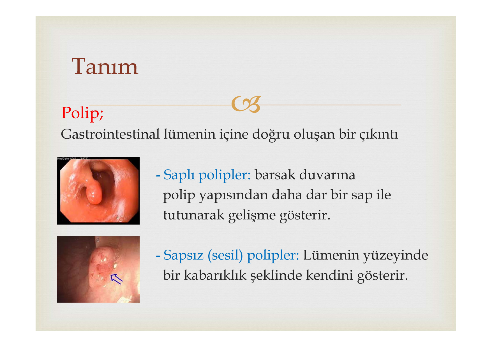

**İki morfolojik form:**

| Tip | Özellik | Klinik ipucu |
|---|---|---|
| **Saplı (pedinküle)** | Dar bir sap ile duvara tutunur | Polipektomi ile kolayca çıkarılır |
| **Sapsız (sesil)** | Geniş tabanla mukozaya oturur | Endoskopik çıkarımı daha zor, invazyon riski ↑ |

**⚠️ ÖNEMLİ:**

* Kolorektal kanser (KRK), ABD'de **3. en sık kanser** ve kansere bağlı ölümün **2. nedeni**dir
* KRK'lerin **%95'inden fazlası** adenomatöz poliplerden gelişir
* Polipleri bul → Çıkar → Kanseri **önle** (bu mantık tarama kolonoskopisinin temelidir)

---

## SINIFLANDIRMA

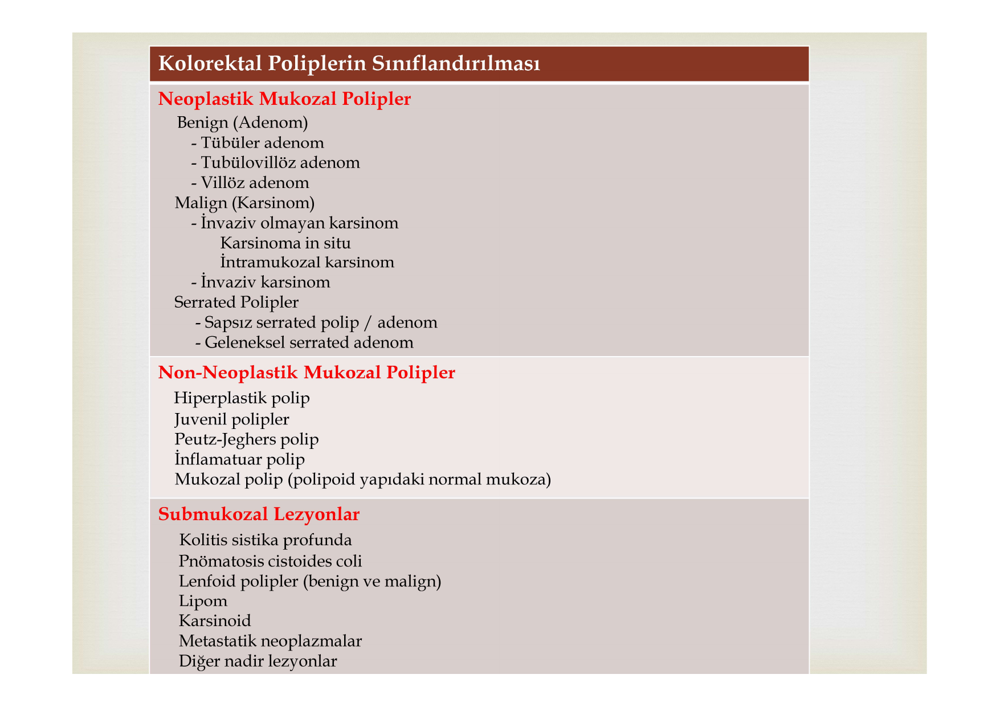

Polipleri anlamak için en kritik soru: **Kanserleşir mi, kanserleşmez mi?**

```
              KOLOREKTAL POLİPLER
                     │
         ┌───────────┼───────────┐
         ↓           ↓           ↓
    NEOPLASTİK   NON-NEOPLASTİK  SUBMUKOZAL
    (Kanser riski   (Genelde     (Duvar
     VAR ⚠️)     masum ✅)     içinden)
         │           │           │
    ┌────┴────┐   ┌──┴──┐     Lipom
    ↓         ↓   ↓     ↓    Karsinoid
  Adenom  Serrated  HP  Jüvenil  Lenfoid
    │      polip   PJ  İnflamatuar
    ↓         │
  KANSER     ↓
         (SSP/A ve TSA
          da kanser riski
          VAR ⚠️)
```

### Bir Bakışta: Polip Gördüm, Ne Yapayım?

| Polip Tipi | Kanser Riski | Ne yapmalı? |
|---|---|---|
| **Adenomatöz** (tübüler, villöz, tübülovillöz) | ⚠️ **EVET** - en önemli prekanseröz lezyon | Mutlaka çıkar + izle |
| **SSP/A, TSA** (serrated neoplazi) | ⚠️ **EVET** - %5-16 | Çıkar + yakın izle |
| **Hiperplastik** | ✅ Yok (tek başına) | Küçük/rektumda ise izlem gerekmez |
| **Jüvenil** (izole) | ✅ Yok | Familyal formda risk VAR |
| **İnflamatuar** | ✅ Yok | Adenomdan ayırt et |
| **Peutz-Jeghers** | ⚠️ Sendromda artmış risk | Sendrom takibi gerekli |

---

# NEOPLASTİK POLİPLER - ADENOMLAR

---

## ADENOMATÖZ POLİPLER

Adenomatöz polipler, pedinküllü veya sapsız olabilen **iyi huylu neoplastik epitel tümörleri**dir. Bunlar kolorektal kanserin **en önemli öncü lezyonu**dur.

### Üç Histolojik Tip

WHO'ya göre adenomlar, bezlerin yapısına göre sınıflandırılır:

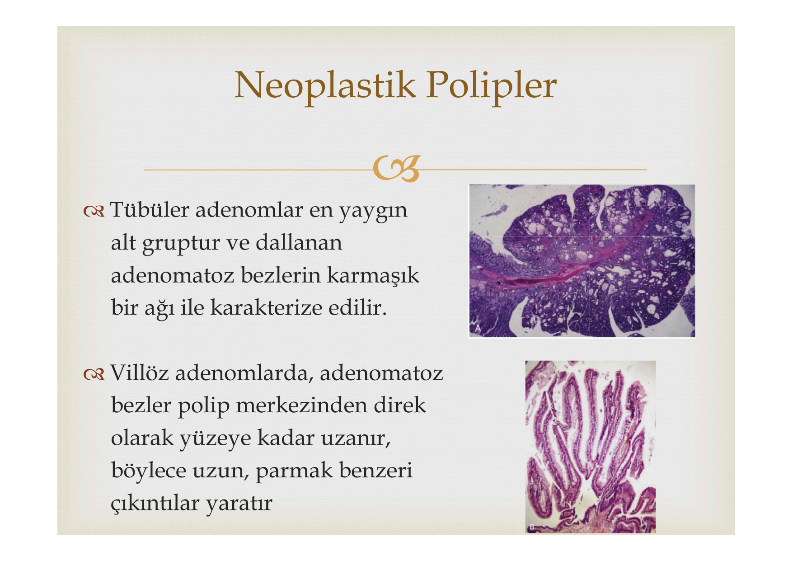

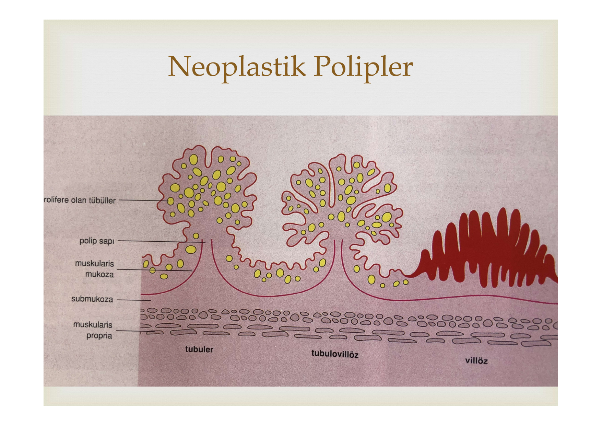

| Tip | Sıklık | Bez Yapısı | Boyut | Displazi |
|---|---|---|---|---|
| **Tübüler** | **%80-86** (en sık) | Bezlerin ≥%80'i tübül tipinde dallanır | Genelde **küçük** | Genelde **hafif** |
| **Tübülovillöz** | %8-16 | Tübüler + villöz karışım | Orta | Orta |
| **Villöz** | %3-16 | Bezlerin ≥%80'i parmak benzeri villiform yapıda | Genelde **büyük** | Genelde **şiddetli** |

> 💡 **Hatırlatıcı:** Tübüler → **T**emiz (küçük, masum) / Villöz → **V**ahşi (büyük, tehlikeli)

---

## KANSER RİSKİNİ BELİRLEYEN ÜÇ FAKTÖR

Bir adenomatöz polibin kanserleşme riskini belirleyen **3 kritik özellik** vardır. Bu üçü birbirine sıkı sıkıya bağlıdır:

```
         BÜYÜK BOYUT
              ↕
    VİLLÖZ HİSTOLOJİ ←→ YÜKSEK DİSPLAZİ
              │
              ↓
        KANSER RİSKİ ↑↑↑
```

### 1. Boyut

| Boyut | Kanser riski |
|---|---|
| <1 cm | **%1.3** (düşük ama sıfır değil!) |
| 1-2 cm | %7-10 |
| >2 cm | **%35-53** (her 2 büyük polipten 1'i kanser!) |

### 2. Histolojik Tip

| Boyut | Tübüler (% kanser) | Tübülovillöz | Villöz |
|---|---|---|---|
| <1 cm | 1 | 4 | **10** |
| 1-2 cm | 10 | 7 | 10 |
| >2 cm | 35 | 46 | **53** |

### 3. Displazi Derecesi

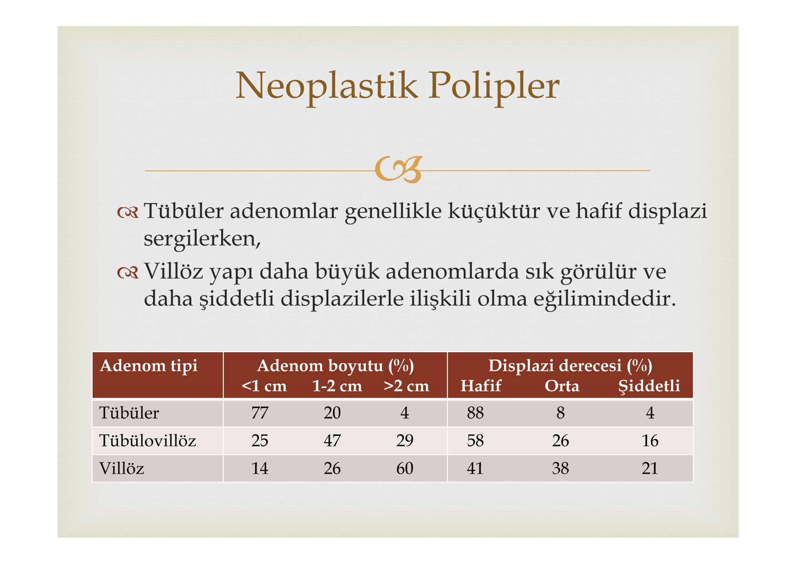

| Displazi | Sıklık | Kanser riski |
|---|---|---|
| Hafif | %70-86 | ↓ düşük |
| Orta | %18-20 | orta |
| Şiddetli (= CIS) | %5-10 | ↑↑ yüksek |
| İnvaziv karsinom | %5-7 | → kanser zaten var |

**Güncel pratikte 2'li sınıflama kullanılır:**
* **Düşük dereceli displazi** = hafif + orta → izle
* **Yüksek dereceli displazi** = şiddetli + CIS → ⚠️ agresif yaklaş

**⚠️ ÖNEMLİ:**

* <1 cm polip + villöz bileşen varsa → kanser oranı %1.3'ten **%10**'a fırlar
* <1 cm polip + ciddi displazi varsa → kanser oranı **%27**'ye yükselir
* Sonuç: **Boyut tek başına güvenilir değil!** Histoloji ve displazi de mutlaka değerlendirilmeli

---

## FLAT (DÜZ) ADENOMLAR

> Endoskopide en çok kaçırılan polip tipi

* Tamamen düz veya hafifçe yüksek, merkezi depresyon içerebilir
* Çapı kalınlığının **2 katından** fazla (Japon tanımı)
* Tipik olarak **<1 cm** → Endoskopide kolayca gözden kaçar
* Tüm adenomların **%8.5-36**'sını oluşturur
* Karsinom barındırması polipoid adenomlara göre **10 kat** daha fazla

> 💡 **Klinik ipucu:** Kromoendoskopi veya NBI gibi gelişmiş görüntüleme teknikleri flat adenomların tespitini artırabilir. Sağ kolon muayenesinde dikkatli olun!

---

## ADENOM-KARSİNOM SEKANSSI

Bu hipotez, kolorektal kanserlerin çoğunun daha önce iyi huylu adenomlardan geliştiğini savunur. Polip taramasının tüm bilimsel temeli bu hipoteze dayanır.

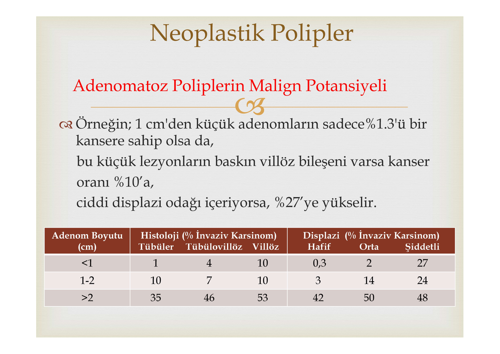

```
  Normal Mukoza → Küçük Adenom → Büyük Adenom → Karsinom
       │              │              │              │
       │          APC kaybı      K-ras         p53 kaybı
       │          (5q21)       mutasyonu      (17p)
       │                        (12p)
       │              │              │              │
       └──────────────┴──────────────┴──────────────┘
                      8 - 10 YIL
```

### Kanıtlar

* Adenomların coğrafi prevalansı kolon kanseri prevalansına **paraleldir**
* Her ikisinin de prevalansı **yaşla artar**
* Adenom gelişimi karsinomlardan **5-10 yıl önce** gelir
* Adenomdan karsinoma ilerleme, **onkogenlerin aktivasyonu** (K-ras) ve **tümör baskılayıcı genlerin inaktivasyonu** (APC, p53) ile olur

> 💡 **Sınav ipucu:** Adenom-karsinom sekansının süresi ortalama **8-10 yıl**. Bu nedenle tarama kolonoskopisi **10 yılda bir** önerilir (normal sonuçta).

---

## PREVALANS

Adenomatöz poliplerin prevalansını belirleyen **4 faktör:**
1. Popülasyonun kolon kanseri riski
2. **Yaş** (en güçlü faktör)
3. Cinsiyet (erkeklerde daha sık)
4. Aile öyküsü

| Yaş Grubu | Adenom Prevalansı | Kanser Prevalansı |
|---|---|---|
| 40-49 yaş | %8.7 | %3.5 |
| ≥50 yaş | **%27-32** | %6-10 |
| ≥65 yaş (yüksek riskli) | **%66** (her 3 kişiden 2'si!) | - |

### Anatomik Dağılım

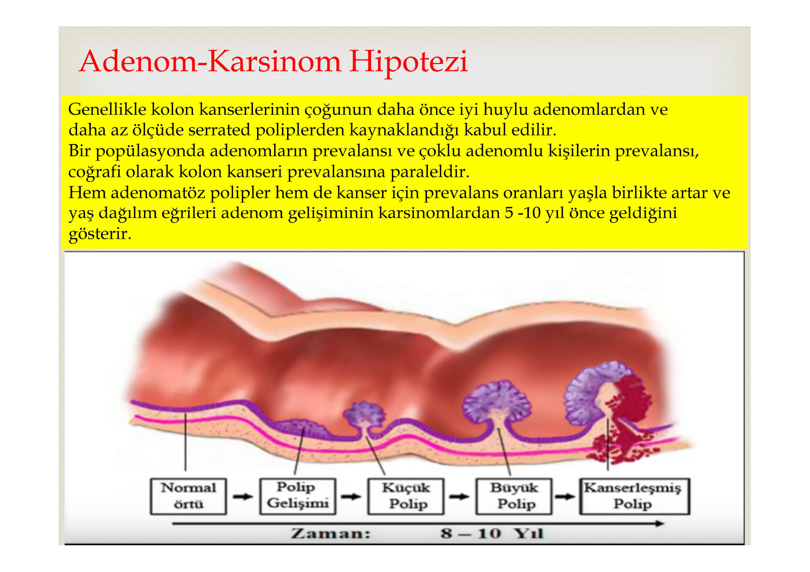

**⚠️ ÖNEMLİ:**

* Otopside adenomların **%34**'ü çekum/asendan kolonda → Sigmoidoskopi ile gözden kaçar!
* Semptomatik hastalarda **%47**'si sigmoidde → Bu yüzden semptomatik hastada önce sol kolon düşünülür
* Bu nedenle taramada **tam kolonoskopi** altın standarttır

---

# SERRATED POLİPLER

Serrated polipler, kript mimarisinde testere dişi (serrated) görünüm ile karakterizedir. Üç tipi vardır:

| Özellik | Hiperplastik Polip | SSP/A | TSA |
|---|---|---|---|
| **Kanser riski** | ✅ Yok | ⚠️ **%5-16** | ⚠️ Var |
| **Lokalizasyon** | Rektum, distal | **Proksimal kolon (sağ)** | Distal kolon (sol) |
| **Morfoloji** | Küçük, sesil | Düz, mukus kaplı | **Saplı** |
| **Sıklık** | En sık serrated tip | Tüm poliplerin <%1 | Nadir |
| **Tespit zorluğu** | Kolay | **Zor** (beyaz ışıkta kaçar) | Kolay (adenoma benzer) |
| **Displazi** | Yok | Olabilir | Adenomatöz displazi var |

> 💡 **Klinik ipucu:** SSP/A, sağ kolonda, düz, mukus kaplı ve beyaz ışık kolonoskopisiyle tespiti zor bir lezyondur. Proksimal kolonda yeterli temizlik ve dikkatli muayene kritiktir!

### Serrated Polipozis Sendromu (SPS)

Nadir ama KRK riski artmış bir durum (5 yılda **%1.9**).

**WHO Tanı Kriterleri** (birinin varlığı yeterli):
1. Kolon boyunca dağılmış **>20 serrated polip** (herhangi boyut)
2. SPS aile öyküsü + sigmoidin proksimalinde herhangi bir serrated polip
3. Rektum proksimalinde >5 mm en az 5 polip, bunlardan ≥2 tanesi ≥10 mm

---

# NON-NEOPLASTİK POLİPLER

Bu polipler genellikle masumdur ancak klinik olarak adenomlardan **ayırt edilmeleri** gerekir.

## Bir Bakışta Non-Neoplastik Polipler

| Polip | Yaş | Lokalizasyon | Ayırt Edici Özellik | Malign Potansiyel |
|---|---|---|---|---|
| **Hiperplastik** | Erişkin | Rektum | Küçük, soluk, sesil | ❌ Yok |
| **Jüvenil** | **1-10 yaş** | Rektum | Kiraz kırmızısı, saplı, tek | ❌ Yok (izole) |
| **İnflamatuar** | İBH hastaları | Değişken | İBH zemininde, rejenere mukoza | ❌ Yok |
| **Peutz-Jeghers** | Her yaş | İnce bağırsak | Hamartom, düz kas dallanması | ⚠️ Sendromda var |
| **Mukozal** | Erişkin | Değişken | Normal mukoza fazlalığı | ❌ Yok |

### Hiperplastik Polipler

* Tüm poliplerin **>%15**'i, dimunitif poliplerin **yarısından fazlası**
* **Neoplastik değil** → Proliferasyon ve diferansiyasyon normal
* Rektumda, <1 cm, asemptomatik
* Tek başına tedavi/takip gerekmez ama endoskopide adenomdan ayırt edilemediği için genellikle çıkarılır

### Jüvenil Polipler

* 15 yaş altında tüm poliplerin **%97**'si
* Kolonoskopide: **Tek, saplı, kiraz kırmızısı**, frajil/ülserli
* En sık semptom: **Hematokezya** (rektal kanama)
* İzole formda malign potansiyel **yok**
* **Familyal jüvenil polipozis**te adenom ve karsinom riski **artmıştır** → Farklı bir durum!

### İnflamatuar Polipler

* İBH (inflamatuar barsak hastalığı) zemininde oluşan rejenere mukoza ve granülasyon dokusu
* Büyük ve saplı olabilir → Adenomla karışabilir → **Ayırıcı tanı önemli**

### Peutz-Jeghers Polipleri

* **Hamartomatöz** lezyon → Düz kas dallanması ile desteklenen glandüler epitel
* Jüvenil polipten farkı: Lamina propria **normal**, anormal olan **düz kas** dokusudur
* Neredeyse her zaman **multipl**
* **Peutz-Jeghers sendromu** ile birlikte → Mukokutanöz pigmentasyon + GI polipozis

---

# SUBMUKOZAL LEZYONLAR

Mukoza altından köken alıp polipoid görünüm veren lezyonlardır:

### Colitis Cystica Profunda

* Submukozada dilate, mukus dolu bezler → Nadir
* En sık **rektumda**, <3 cm
* **Kolloid karsinomdan** ayırt edilmeli (yanlış tanı → gereksiz radikal cerrahi!)

### Pneumatosis Cystoides Coli

Submukozada gazla dolu kistler → Polipoid görünüm

| Tip | Klinik | Prognoz |
|---|---|---|
| **Pneumatosis linearis** | İskemik bağırsak, NEC (çocuk) | ⚠️ **Genellikle ölümcül** |
| **Pnömatozis sistoides intestinalis** | KOAH, skleroderma ile ilişkili | ✅ İyi - tesadüfi bulgu |

* Tedavi: **Oksijen** (5-6 L/dk) → Kistler iyileşir
* Antibiyotik **yararı yok**

---

## KLİNİK BULGULAR VE TANI

### Semptomlar

Poliplerin çoğu **asemptomatiktir** ve tesadüfen saptanır. Semptom varsa:

* **Rektal kanama** → Sigmoid/rektum poliplerinde en sık
* **Polibin anüsten prolabe olması** → Uzun saplı poliplerde
* **Sulu diyare + elektrolit bozukluğu** → Geniş rektal villöz adenomlarda (sekretuar diyare)
* **Kolik karın ağrısı** → İnvajinasyona bağlı
* **Demir eksikliği anemisi** → Kronik gizli kanama

> 💡 **Sınav ipucu:** "Rektal kanama + sulu diyare + hipokalemi" = **Villöz adenom** düşün (McKittrick-Wheelock sendromu)

### Tanı Yöntemleri

| Yöntem | Avantaj | Dezavantaj |
|---|---|---|
| **Kolonoskopi** | ⭐ Altın standart, biyopsi + tedavi imkanı | İnvaziv, hazırlık gerekli |
| Sigmoidoskopi | Kolay, hazırlık az | Sağ kolonu göremez |
| Çift kontrast kolon grafisi | Non-invaziv | Biyopsi yapılamaz |
| BT-kolonografi | Non-invaziv, 3D görüntü | Biyopsi yapılamaz, radyasyon |

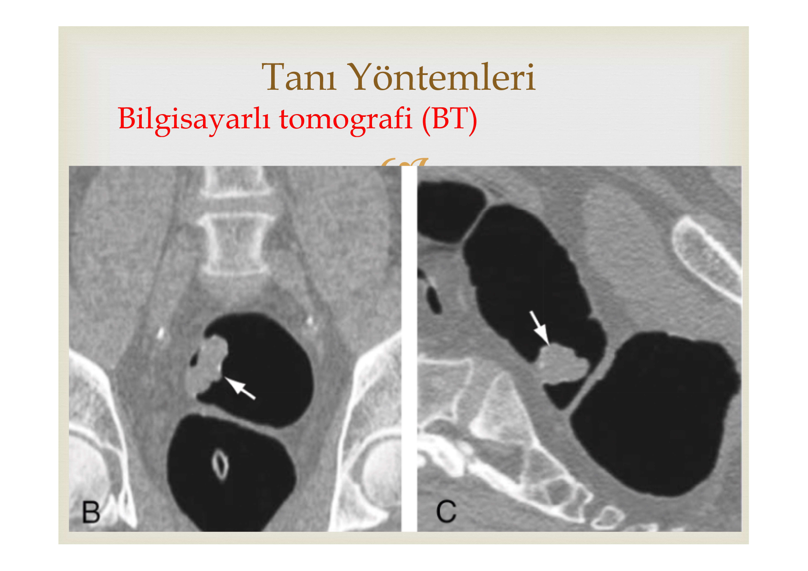

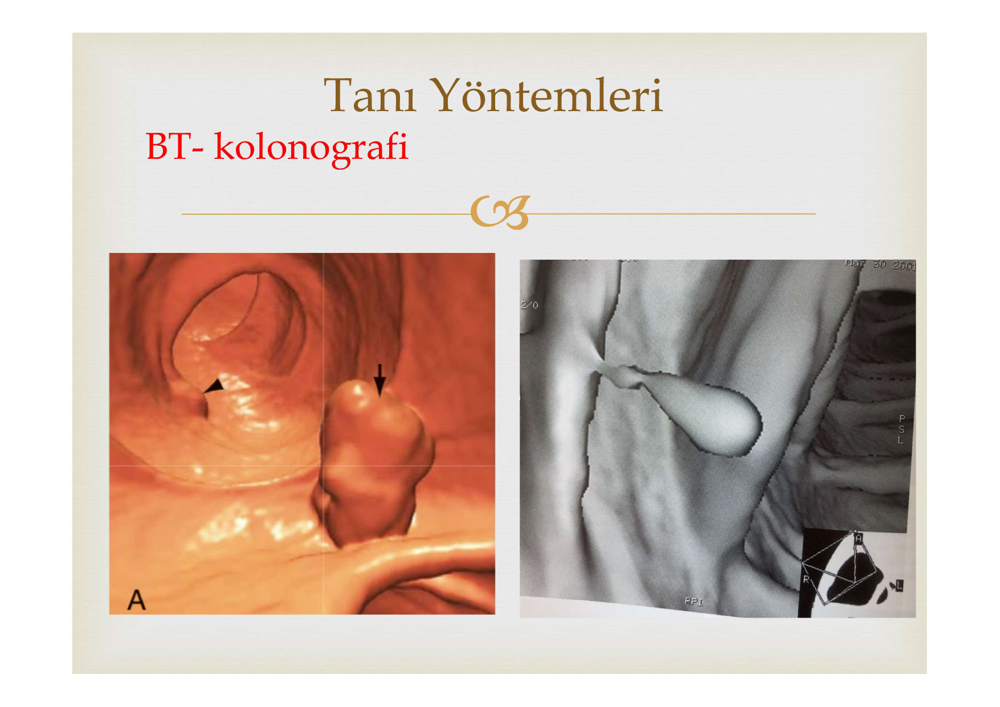

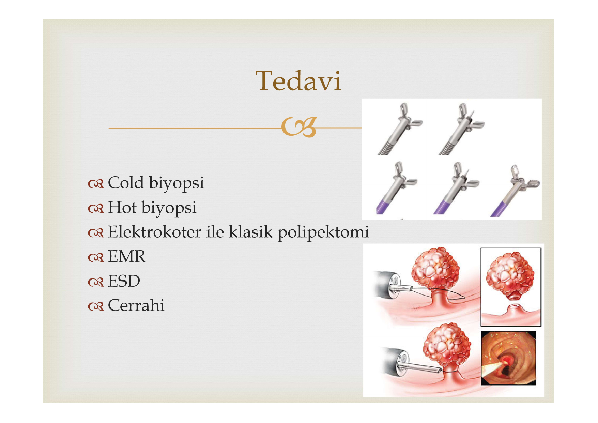

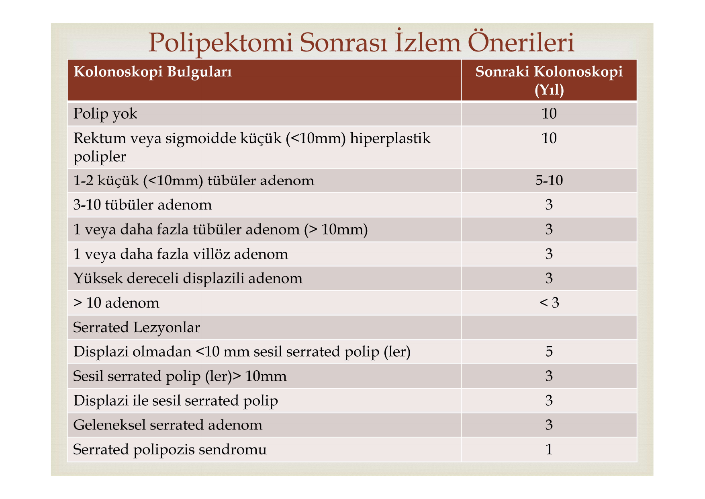

---

## TEDAVİ VE İZLEM

### Tedavi Yöntemleri

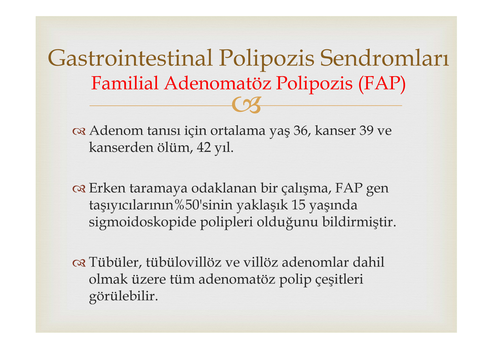

| Yöntem | Endikasyon |
|---|---|
| **Cold biyopsi** | Diminutif polipler (<5 mm) |
| **Hot biyopsi** | Küçük sesil polipler |
| **Snare polipektomi** (elektrokoter) | Saplı polipler, standart yöntem |
| **EMR** (Endoskopik Mukozal Rezeksiyon) | Büyük sesil polipler, flat lezyonlar |
| **ESD** (Endoskopik Submukozal Diseksiyon) | Çok büyük, en-bloc çıkarım gereken lezyonlar |
| **Cerrahi** | Endoskopik çıkarılamayan, malignite şüpheli |

### Polipektomi Sonrası İzlem

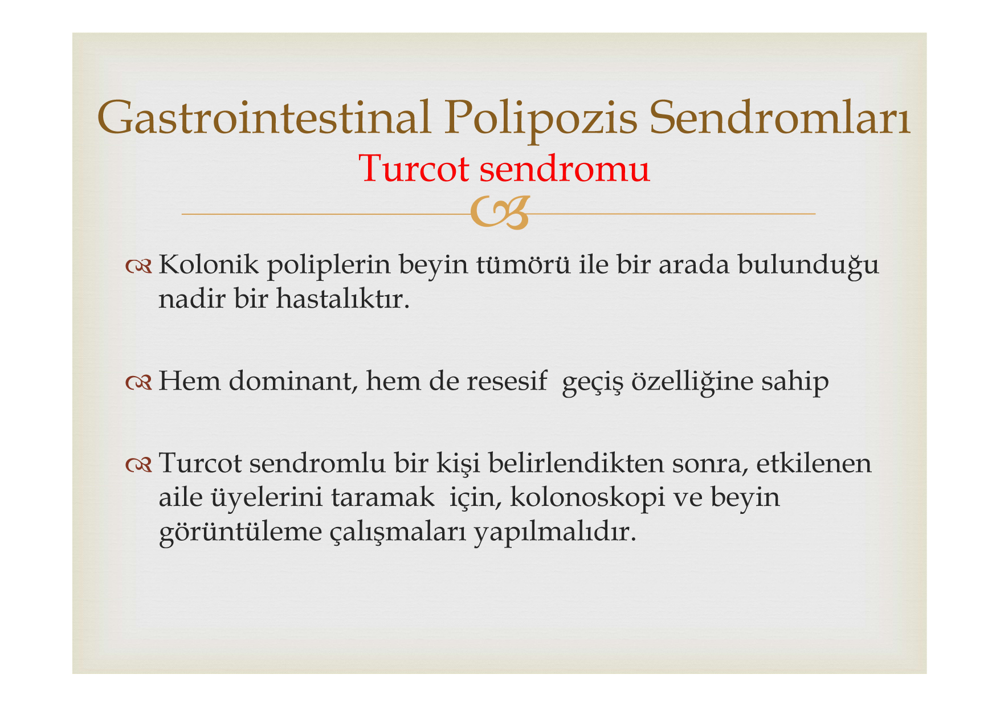

**⚠️ ÖNEMLİ:** İzlem süresi polip sayısı, boyutu, tipi ve displazi derecesine göre belirlenir:

| Risk Kategorisi | Bulgular | Sonraki Kolonoskopi |
|---|---|---|
| **Düşük risk** | Polip yok veya rektum/sigmoidde küçük HP | **10 yıl** |
| **Düşük risk** | 1-2 küçük (<10 mm) tübüler adenom | **5-10 yıl** |
| **Yüksek risk** | 3-10 tübüler adenom | **3 yıl** |
| **Yüksek risk** | Adenom >10 mm | **3 yıl** |
| **Yüksek risk** | Villöz adenom | **3 yıl** |
| **Yüksek risk** | Yüksek dereceli displazi | **3 yıl** |
| **Çok yüksek risk** | >10 adenom | **<3 yıl** |

**Serrated lezyonlarda izlem:**

| Bulgu | Sonraki Kolonoskopi |
|---|---|
| SSP <10 mm, displazi yok | **5 yıl** |
| SSP >10 mm veya displazili | **3 yıl** |
| TSA (geleneksel serrated adenom) | **3 yıl** |
| Serrated polipozis sendromu | **1 yıl** |

> 💡 **Ezber kolaylığı:** 3 yılda bir izle = "**Büyük, Villöz, Displazili, Çok sayıda**" → kısaca "her şey kötü ise 3 yıl"

---

# POLİPOZİS SENDROMLARI

Kolon poliplerinin yüzlerce-binlerce sayıda görüldüğü veya ekstraintestinal bulgularla birlikte olduğu kalıtsal sendromlardır.

## Karşılaştırma Tablosu

| Sendrom | Kalıtım | Gen | Polip Tipi | Ayırt Edici Bulgu | KRK Riski |
|---|---|---|---|---|---|
| **FAP** | OD | **APC** | Adenomatöz (yüzlerce-binlerce) | 10-12 yaşta polip başlar | ⚠️ **%100** (tedavisiz) |
| **Gardner** | OD | APC | Adenomatöz | **Osteomlar** + diş anomalileri + yumuşak doku tümörleri | ⚠️ FAP ile aynı |
| **Turcot** | OD/OR | APC/MMR | Adenomatöz | **Beyin tümörleri** | ⚠️ Yüksek |
| **Peutz-Jeghers** | OD | STK11/LKB1 | **Hamartomatöz** | **Dudak/bukkal pigmentasyon** | ⚠️ Artmış (GI + non-GI) |
| **Familyal Jüvenil** | OD | SMAD4/BMPR1A | Jüvenil (hamartom) | Çocukluk çağı, hematokezya | ⚠️ Artmış |

---

## FAMİLİAL ADENOMATÖZ POLİPOZİS (FAP)

En yaygın adenomatöz polipozis sendromudur.

* **Otozomal dominant**, **APC geni** mutasyonu (5q21)
* Prevalans: **1/5000-7500**
* Kalın bağırsakta **yüzlerce-binlerce** adenomatöz polip

### FAP'ın Doğal Seyri

```
  10-12 yaş         36 yaş         39 yaş      42 yaş
     │                │               │           │
  Polipler          Adenom         KANSER      ÖLÜM
  başlar            tanısı         gelişir
     │                │               │
     └────────────────┴───────────────┘
        Polipozisten kansere: 10-15 yıl
```

* FAP gen taşıyıcılarının **%50**'sinde **15 yaşında** sigmoidoskopide polip var
* Tedavisiz bırakılırsa KRK gelişimi **%100**
* Tarama ve sürveyansa rağmen **%25**'inde kolektomi sırasında KRK saptanır

**Tarama:** APC mutasyonu taşıyıcılarında **10 yaşından itibaren her yıl fleksibl sigmoidoskopi**

---

## GARDNER SENDROMU

FAP'ın ekstraintestinal bulgularla birlikte olan formudur (aynı APC geni).

* GI polipozis + **osteomlar** + yumuşak doku tümörleri
* **Kemik bulguları:** Mandibula, kafatası, uzun kemik osteomları; ekzostoz; diş anomalileri
* Osteomlar çocuklarda polipozisten **önce** ortaya çıkabilir → Erken tanı ipucu!
* Mandibula grafisi → Genç taşıyıcıları taramak için basit ve noninvaziv

> 💡 **Sınav ipucu:** "Kolon polipozisi + mandibula osteomu + epidermoid kist" = **Gardner sendromu**

---

## TURCOT SENDROMU

* Kolonik polipler + **beyin tümörü** birlikteliği
* Hem dominant hem resesif geçiş olabilir
* Aile üyelerinde **kolonoskopi + beyin görüntüleme** ile tarama yapılmalı

> 💡 **Sınav ipucu:** "Kolon polipozisi + beyin tümörü" = **Turcot sendromu** (Turcot → **T**umor cerebral)

---

## PEUTZ-JEGHERS SENDROMU

* **Mukokutanöz pigmentasyon** + **GI hamartomatöz polipozis**
* Etkilenen bireylerin **%95**'inde melanin birikintileri:
  - Dudaklar, ağız, burun, bukkal mukoza, eller, ayaklar, perianal/genital bölge
  - Kahverengi-yeşilimsi siyah, pürüzsüz maküllerdir
  - Bukkal pigmentasyon dışında ergenlikte **solar**
* Polipler en belirgin olarak **ince bağırsakta**
* Komplikasyonlar: **İnvajinasyon**, obstrüksiyon, kanama
* GI ve non-GI kanser riski artmıştır (meme, over, pankreas, akciğer)

> 💡 **Sınav ipucu:** "Dudaklarda kahverengi lekeler + karın ağrısı + ince bağırsak polipleri" = **Peutz-Jeghers sendromu**
