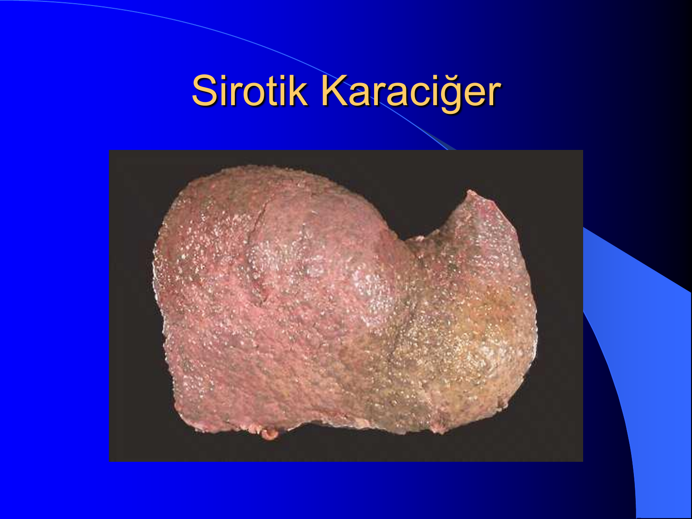
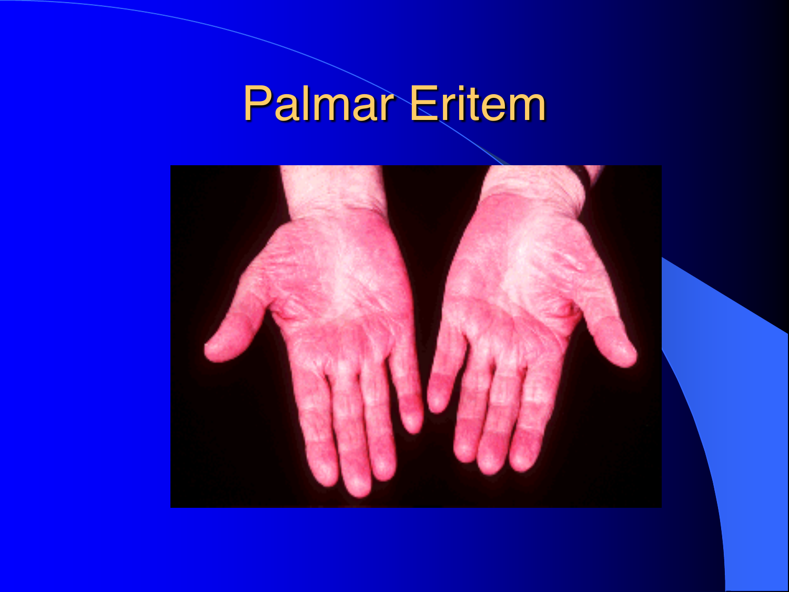
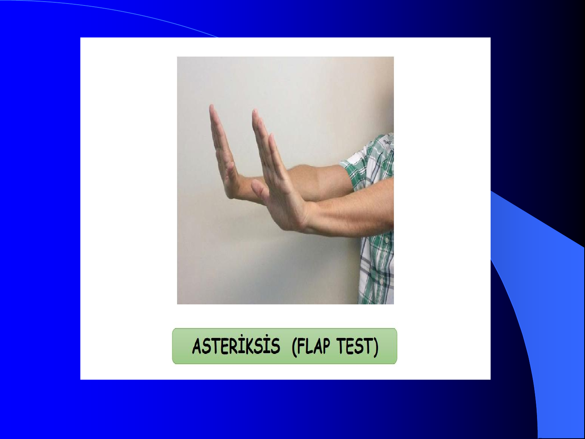
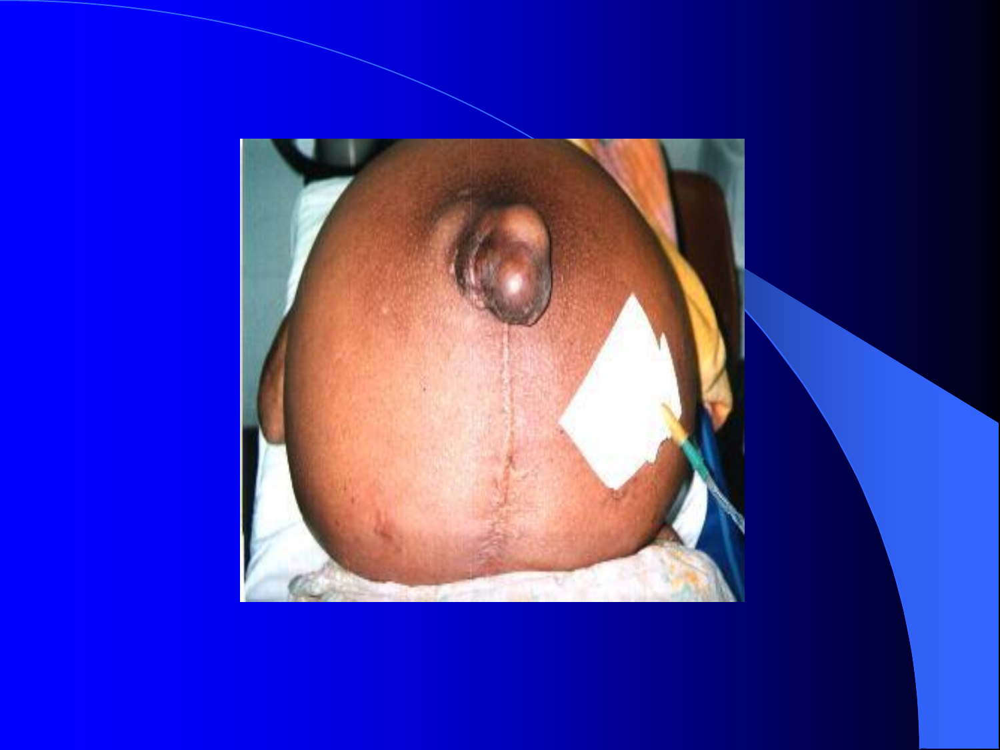
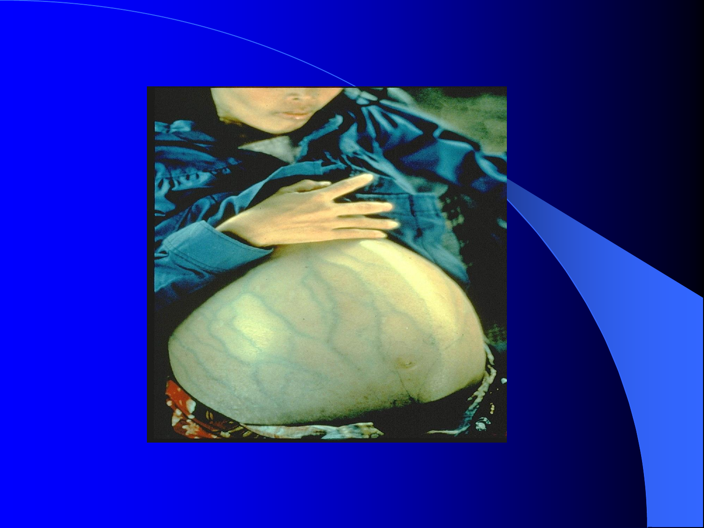

# KARACİĞER SİROZU

**Hazırlayan:** Prof. Dr. M. Hadi Yaşa
**Bölüm:** Aydın Adnan Menderes Üniversitesi Tıp Fakültesi — Gastroenteroloji Bilim Dalı

---

## İÇİNDEKİLER

1. [Tanım](#tanım)
2. [Patolojik Temeller — Karaciğer Mikroyapısı](#patolojik-temeller--karaciğer-mikroyapısı)
3. [Morfolojik Sınıflandırma](#morfolojik-sınıflandırma)
4. [Etiyolojik Sınıflandırma](#etiyolojik-sınıflandırma)
5. [Aktivite ve Kompansasyona Göre Sınıflama](#aktivite-ve-kompansasyona-göre-sınıflama)
6. [Klinik Bulgular — Karaciğer Hücre Yetmezliği](#klinik-bulgular--karaciğer-hücre-yetmezliği)
7. [Klinik Bulgular — Portal Hipertansiyon](#klinik-bulgular--portal-hipertansiyon)
8. [Child-Pugh Sınıflaması](#child-pugh-sınıflaması)
9. [Tanı](#tanı)
10. [Tedavi — Genel İlkeler](#tedavi--genel-i̇lkeler)
11. [Asit Tedavisi](#asit-tedavisi)
12. [Varis Kanaması Tedavisi](#varis-kanaması-tedavisi)
13. [Hepatik Ensefalopati Tedavisi](#hepatik-ensefalopati-tedavisi)

---

## TANIM

**Karaciğer sirozu:** Karaciğerde hücre nekrozu sonucu gelişen; **aşırı fibrozis, nodül formasyonu (rejenerasyon nodülü)** ve **lobül harabiyeti** ile karakterize, **diffüz, progresif ve kronik** bir olaydır.

> **💡 Anahtar kavram:** Sebebi ne olursa olsun, **tedavi edilmeyen tüm kronik hepatitlerin terminal dönemi ve son evresidir**.

Karaciğer sirozunda **parankim hücrelerinin yerini**, bir dolgu maddesi olan ve fonksiyon görmeyen **fibröz doku** almıştır.

> **⚠️ ÖNEMLİ:** **Tek başına fibrozis** ya da **tek başına nodül**, siroz tanısı için **yeterli değildir**.
>
> * **Yalnız fibrozis** → Konjenital hepatik fibrozis
> * **Yalnız nodül** → Nodüler rejeneratif hiperplazi

---

## PATOLOJİK TEMELLER — KARACİĞER MİKROYAPISI

### Lobül Yapısı

Karaciğerin temel morfolojik birimi **karaciğer lobülleri**dir:

* **Altıgen yapıda**
* **Ortasında sentral ven**
* **Köşelerinde portal aralık (triad):**
    * Safra kanalı
    * Portal ven dalı
    * Hepatik arter dalı
    * Lenf kanalı

### Hepatosit Membranları

Dikdörtgen şeklindeki **hepatosit** 4 kenara sahiptir:

| Kenar | İşlev |
|---|---|
| **İki kenar** | Doğrudan başka hepatositle komşu |
| **Üçüncü kenar — kanaliküler membran** | Toksik madde ve safra → **safra kanalikülü**ne atılır |
| **Dördüncü kenar — sinüzoidal membran** | **Portal ven ve hepatik arterin** sonlandığı sinüzoid boşluğa bakar |

### Disse Aralığı

**Disse aralığı (mesafesi):** Sinüzoid ile hepatositin sinüzoidal membranı arasındaki aralıktır. Besinler ve diğer maddeler bu aralıktan geçerek hepatosit içine girer.

> **💡 Siroz mekanizması:** Sirozda aşırı fibrozis **Disse aralığından başlar** → kanın karaciğere girmesine engel olur → **portal hipertansiyon** gelişir.

### Rappaport Fonksiyonel Zonları

| Zon | Konum |
|---|---|
| **Zon 1** | Portal mesafeye yakın bölge |
| **Zon 2** | İki zon arasında kalan bölge |
| **Zon 3** | Vena sentralis etrafındaki bölge |

> **⚠️ Zon 3**, karaciğerin **toksik ve iskemik hasardan en çok etkilenen** bölgedir (asetaminofen hepatotoksisitesi, iskemik hepatit).

---

## MORFOLOJİK SINIFLANDIRMA



| Tip | Özellik | Nedenler |
|---|---|---|
| **Mikronodüler siroz** | Küçük, uniform nodüller (<3 mm) | **Alkolik** |
| **Makronodüler siroz** | Büyük, değişken nodüller (>3 mm) | **Viral nedenli sirozlar** |
| **Mikst siroz** | Karma | Mikronodüler siroz zamanla mikst türe, en son dönemde makronodüler siroza dönüşür |

---

## ETİYOLOJİK SINIFLANDIRMA

### Ülkemizde En Sık Nedenler

| Etyoloji | Oran |
|---|---|
| **Viral (HBV, HCV, Delta, HGV, TTV)** | **%70-75** |
| **Alkol** | **%15-17** |
| **NASH** (nonalkolik steatohepatit) | %3 |

### Tam Etiyolojik Liste

**1. Viral:**
* HBV, **HCV**, Delta, HGV, TTV

**2. Alkol**

**3. NASH (nonalkolik steatohepatit):**
* Obezite, **DM**, trigliserid yüksekliği, ilaçlar

**4. Metabolik:**
* **Hemokromatozis**
* **Wilson hastalığı**
* **α1-antitripsin yetmezliği**
* Bazı glikojen depo hastalıkları (Gaucher)
* Amiloidozis

**5. Biliyer siroz:**
* **Primer biliyer siroz (PBS)**
* **Sekonder biliyer siroz**

**6. Otoimmün hepatitler (OİH):**
* Overlap sendromlar (OİH + PBS, OİH + PSK)

**7. İlaç ve toksinler:**
* **Metotreksat**, tetrasiklinler, **karbon tetraklorür**

**8. Diğerleri:**
* **Sarkoidoz**
* **Amiloidoz**
* **Kardiyak siroz** (Pick sirozu)
* **Kriptojenik siroz** (sebebi bilinmeyenler)

---

## AKTİVİTE VE KOMPANSASYONA GÖRE SINIFLAMA

### Aktiviteye Göre — Aktif / İnaktif Siroz

**Aktif siroz:**

* **AST ve ALT yüksek**
* **Bilirubinler artmış (sarılık)**

### Kompansasyona Göre — Kompanse / Dekompanse Siroz

> **⚠️ KRİTİK TANIM:** Aşağıdakilerden **herhangi birinin gelişmesi**, sirozun **dekompanse olduğunu** gösterir:
>
> 1. **Karında asit**
> 2. **Hepatik ensefalopati**
> 3. **Varis kanaması**
>
> Dördüncü klasik dekompansasyon bulgusu: **Sarılık** (bazı kaynaklar).

---

## KLİNİK BULGULAR — KARACİĞER HÜCRE YETMEZLİĞİ

Klinik semptom ve bulgular 2 gruba ayrılır:

1. **Karaciğer hücre yetmezliği bulguları**
2. **Portal hipertansiyon semptom ve bulguları**

### Karaciğer Hücre Yetmezliği Semptom ve Bulguları

**I. Grup:**

* **Halsizlik** (en sık ilk semptom)
* **Sarılık** → varlığı **prognozun kötü olduğunu gösterir**
* **Hiperkinetik dolaşım:** Kardiyak output artar, kan basıncı düşer, **taşikardi**, **sistolik ejeksiyon üfürümü**
* **Asit gelişimi** (hücre yetmezliği + portal hipertansiyon birlikte)
* **Hepatopulmoner sendrom**
* **Hepatorenal sendrom**
* **Ateş ve septisemi** (özellikle alkolik sirozda sık)

**II. Grup:**

* **Fetor hepatikus:** Nefesin **çürük elma** şeklinde kokması. Protein kaynaklı **merkaptanın türevi dimetildisülfitin** kanda artarak solunumla atılması.
* **Spider nevüs** ve **palmar eritem**

    > Siroz dışında: **Gebelik, RA, tirotoksikoz, bazı ateşli hastalıklar** ve nadiren sağlıklı kişilerde de görülebilir.

* **Hipogonadizm:** Libido azalması, impotans, sterilite, infertilite, mens düzensizliği (özellikle **alkolik karaciğer hastalığı ve hemokromatozis**'te sık)

**III. Grup:**

* **Erkeklerde:** **Jinekomasti**, abdominal kellik
* **Kanamaya eğilim** (koagülasyon faktör sentezi azalır)
* **Tırnak değişiklikleri:** Beyaz tırnak (Terry tırnağı), **çomak parmak**
* **Dupuytren kontraktürü:** Palmar fasianın kontraktürü — **alkolik sirozda sıktır**

### Fizik Muayenede Görülen Klasik Bulgular



* **Sarılık**
* **Palmar eritem, spider nevüs**
* **Jinekomasti**
* **Kas erimesi, kaşeksi**
* **Flap (asteriksis)** — hepatik ensefalopatide



**Asteriksis (flapping tremor):** Kollar havada tutulduğunda **ellerin düzensiz fleksiyon-ekstansiyon** hareketi. **Hepatik ensefalopatinin erken bulgusudur**.

---

## KLİNİK BULGULAR — PORTAL HİPERTANSİYON



**Portal hipertansiyon bulguları:**

* **Özofagus varisleri** (kanama riski!)
* **Kaput medusa** (göbek etrafında dilate kollateral venler)
* **Splenomegali, hipersplenizm** (pansitopeni)
* **Asit:** Hipoalbüminemi + portal hipertansiyon + lenf sızıntısı ("lenfatik ağlama")



### Asit Patogenezi

```
    Portal hipertansiyon
            ↓
  Splanknik vazodilatasyon
            ↓
  Efektif dolaşım hacmi ↓
            ↓
    RAAS aktivasyonu
            ↓
   Na ve su retansiyonu
            ↓
  Hipoalbüminemi + lenfatik sızıntı
            ↓
          ASİT
```

---

## CHILD-PUGH SINIFLAMASI

### Child (Klasik) Sınıflaması

| Sınıf | S. Bilirubin | S. Albümin | Asit | Nörolojik | Beslenme |
|---|---|---|---|---|---|
| **A** | <2 mg/dl | >3.5 g/dl | Yok | Yok | Çok iyi |
| **B** | 2-3 mg/dl | 2-3.5 g/dl | Kontrol kolay | Minimal | Orta |
| **C** | >3 mg/dl | <2 g/dl | Tedaviye cevap az | İleri | Kötü |

### Child-Pugh Skorlaması

| Parametre | 1 Puan | 2 Puan | 3 Puan |
|---|---|---|---|
| **Serum bilirubin (mg/dl)** | 1-2 | 2.1-3 | >3 |
| **Serum albümin (g/dl)** | >3.5 | 2.8-3.5 | <2.8 |
| **Ensefalopati** | Yok | Evre 1-2 | Evre 3-4 |
| **Asit** | Yok | Hafif | İleri |
| **PT uzaması (sn)** | 1-2 | 4-10 | >10 |

**Child-Pugh Sınıfları:**

| Sınıf | Toplam Puan | 1 Yıllık Sağkalım |
|---|---|---|
| **A** | **5-6 puan** | ~%100 |
| **B** | **7-9 puan** | ~%80 |
| **C** | **10-15 puan** | ~%45 |

> **💡 Öğrenci ipucu — "Child-Pugh BASPA":** **B**ilirubin, **A**lbumin, **P**T, **A**sit, **S**om (ensefalopati). Her biri 1-3 puan, toplam 5-15.

---

## TANI

### Laboratuvar Bulguları

**I. Grup — Hücre hasarı ve sentez bozukluğu:**

* **AST ve ALT** normal ya da hafif artış
* **Bilirubin artışı**
* **AST > ALT olması** çok önemli (AST/ALT >1, özellikle **alkolik sirozda AST/ALT >2**)
* **Hipoalbüminemi**
* **Protrombin zamanı uzaması, INR artışı**

**II. Grup — Kolestaz:**

* **ALP, GGT, lösin aminopeptidaz, 5'-nükleotidaz** ve **direkt bilirubin artışı**

**III. Grup — Hematolojik (hipersplenizm):**

* **Trombositopeni**, bisitopeni ya da **pansitopeni**

**IV. Grup — Asit bulguları:**

* **Asit transuda özelliğinde**
* **SAAG (serum-asit albümin gradienti) >1.1 g/dl** → portal hipertansiyon lehine
* Asitte albümin **<2.5 g/dl**

**V. Grup — Viral belirteçler:**

* **HBV:** HBsAg (+), HBV-DNA (+)
* **HCV:** Anti-HCV (+), HCV-RNA (+)

**VI. Grup — Otoimmün belirteçler:**

* **Poliklonal gamopati**

### Görüntüleme

**USG bulguları:**

* Karaciğerde **atrofik ya da büyük görünüm**
* **Karaciğer konturlarında düzensizlik**
* **Portal ven genişlemesi**
* **Hepatofugal akım** (portal HT)
* **Dalak büyüklüğü**
* **Asit**

**Diğer görüntüleme:** BT, MR, MRCP — USG bulgularına benzer ek bilgi sağlar.

### Karaciğer Biyopsisi

**Histolojik bulgular:**

* **Aşırı fibrozis**
* **Lobül harabiyeti**
* **Nodül gelişimi**

---

## TEDAVİ — GENEL İLKELER

### Temel Yaklaşım

* **Kompanse karaciğer sirozunda:** Tedavi **etyolojiye yöneliktir** ve kronik hepatit gibi tedavi edilir.
* **Dekompanse karaciğer sirozunun** kesin ve tam tedavisi ise ancak **karaciğer nakli** ile mümkündür.

### Karaciğer Nakli

* **Kadavradan ya da canlıdan** yapılabilir.
* **Ülkemizdeki başarı oranı: %85-95**

### Diğer Tedaviler

Hastayı rahatlatmaya ve ömrünü uzatmaya yönelik **palyatif tedavilerdir**.

---

## ASİT TEDAVİSİ

### 1. Genel Önlemler

* **Yatak istirahatı** — portal venöz akımı ve renal perfüzyonu artırır
* **Hastaneye yatış** (ideal):
    * **Günlük kilo takibi**
    * **Karın çevresi ölçümü**
    * **Aldığı-çıkardığı sıvı takibi**
* **Haftada 2 kez elektrolit kontrolü**

### 2. Diyet ve Sıvı Kısıtlaması

* **Tuz kısıtlaması: 450 mg tuz/gün** (veya 2 g sodyum)
* **Protein:** 0.5-1 g/kg/gün
* **Sıvı:** 1000 mL/gün (dilüsyonel hiponatremi varsa)

### 3. Diüretik Tedavisi

**Başlangıç ve titrasyon:**

| Durum | Tedavi |
|---|---|
| **4 günde kilo kaybı <1 kg** | **Spironolakton 100-300 mg/gün** veya **amilorid 10-15 mg/gün** |
| **4 günde kilo kaybı <2 kg** (spironolaktona yanıt yetersiz) | **Furosemid 80-120 mg/gün** ekle |

> **💡 Spironolakton neden ilk tercih?** Sirozda sekonder hiperaldosteronizm vardır — aldosteron antagonisti mantıklıdır. Spironolakton/furosemid oranı klasik olarak **100:40 mg** şeklinde tutulur.

### 4. Parasentez

* **Geniş hacimli parasentez:** 7-14 gün arayla **5-10 litre** boşaltılır
* **5-10 litre gibi büyük miktar için**: **Her litre için 6-10 g tuzsuz albümin** IV infüzyonla birlikte
* Gerekirse, daha hızlı tedavi için albümin infüzyonunun ortasında ve sonunda **1'er ampul furosemid** IV

> **⚠️ Steril şartlarda yapılmalıdır** — SBP riski.

### 5. TIPS (Transjuguler İntrahepatik Portosistemik Şant)

* Dirençli asitte kullanılabilir.
* Portal basıncı düşürür.

### 6. Refrakter Asit Tedavisi

* **Sık aralıklarla geniş hacimli parasentez**
* **TIPS**
* **Peritonovenöz şant** (Le Veen şantı)
* **Peritonovezikal şant**
* **Karaciğer nakli**

---

## VARİS KANAMASI TEDAVİSİ

**Akut kanama tedavisi (sıralı yaklaşım):**

1. **Resüsitasyon + kristalloid + kan ürünleri**
2. **IV somatostatin veya oktreotid** (splanknik vazokonstriksiyon)
3. **IV antibiyotik profilaksisi** (seftriakson)
4. **Endoskopik band ligasyonu** (birinci tercih)
5. **Skleroterapi** (polidokanol)
6. **Fibrin yapıştırıcı tedavileri:** **Siyanoakrilat** (fundus varislerinde)
7. **Balon tamponad:** **Sengstaken-Blakemore balonu** (geçici, max 24-48 saat)
8. **Vazopressin tedavisi** (günümüzde nadir)
9. **TIPS** (refrakter kanamada)
10. **Şant operasyonları:** Mortalite yüksek
11. **Karaciğer nakli**

### Profilaksi

* **Primer profilaksi:** **Non-selektif β-bloker** (propranolol, **karvedilol**)
* **Sekonder profilaksi:** Band ligasyonu + β-bloker

---

## HEPATİK ENSEFALOPATİ TEDAVİSİ

### Tedavi Prensipleri

1. **Presipite edici faktörü bul ve düzelt:**
    * GİS kanaması
    * Enfeksiyon (özellikle SBP)
    * Konstipasyon
    * Diüretik aşırı kullanımı / elektrolit bozukluğu
    * Sedatif / opioid
    * Yüksek protein alımı

2. **Disakkarit tedavisi — Laktuloz:**
    * **İlk tercih**
    * Günde 2-3 yumuşak dışkı yapacak doza titre edilir
    * **NH₃'u azaltır** (bakteriyel üre parçalanmasını azaltır, asidik ortam NH₃ absorpsiyonunu engeller)

3. **Antibiyotik tedavisi:**
    * **Neomisin**
    * **Rifaksimin** (tercih edilir — emilmez, yan etki az)
    * Metronidazol

4. **LOLA tedavisi:**
    * **L-ornitin, L-aspartat** — amonyak detoksifikasyonunu artırır

5. **Karaciğer nakli** (refrakter vakalarda)

---

## SINAV NOTLARI — ANAHTAR HATIRLATMALAR

> **📋 En Sık Sorulan Noktalar:**
>
> 1. **Siroz tanımı:** Diffüz fibrozis + nodül formasyonu + lobül harabiyeti. **Tek başına fibrozis veya nodül yeterli değil.**
> 2. **Ülkemizde en sık etyoloji: Viral (HBV, HCV) — %70-75.**
> 3. **Mikronodüler → alkolik; makronodüler → viral.**
> 4. **Dekompansasyon göstergeleri:** Asit, hepatik ensefalopati, varis kanaması (bazı kaynaklar sarılığı da ekler).
> 5. **Child-Pugh parametreleri (5 tane):** Bilirubin, albümin, PT, asit, ensefalopati. Puanlar 5-15; A (5-6), B (7-9), C (10-15).
> 6. **AST/ALT >2 → alkolik siroz düşün.**
> 7. **SAAG >1.1 g/dl → portal hipertansiyon** kaynaklı asit.
> 8. **Hepatofugal akım** portal hipertansiyonun klasik USG bulgusu.
> 9. **Asit tedavisi:** Tuz kısıtlaması + **spironolakton** (ilk tercih) ± furosemid. Klasik oran 100:40 mg.
> 10. **Geniş hacimli parasentez** (>5 L) → **tuzsuz albümin** (6-10 g/L) ile birlikte.
> 11. **Spider nevüs ve palmar eritem** siroz dışında gebelik, tirotoksikoz, RA'da da görülebilir.
> 12. **Fetor hepatikus = çürük elma kokusu** (dimetildisülfit).
> 13. **Asteriksis (flap tremor)** → hepatik ensefalopati erken bulgusu.
> 14. **Dupuytren kontraktürü → alkolik sirozda sık.**
> 15. **Kaput medusa** = portal hipertansiyonda umbilikal venöz kollateral açılması (göbek etrafında dilate venler).
> 16. **Varis kanaması tedavisi:** Somatostatin/oktreotid + IV seftriakson + band ligasyonu. Balon (Sengstaken-Blakemore) max 24-48 saat.
> 17. **Portal hipertansiyon profilaksisi:** Non-selektif β-bloker (propranolol, karvedilol).
> 18. **Hepatik ensefalopati tedavisi:** Laktuloz (ilk tercih) + rifaksimin.
> 19. **Kompanse sirozda etiyolojik tedavi; dekompanse sirozda tek küratif tedavi: karaciğer nakli.**
> 20. **Zon 3 hepatositleri** toksik/iskemik hasardan en çok etkilenir (asetaminofen toksisitesi burada).

---

> **Kaynaklar:**
>
> 1. Prof. Dr. M. Hadi Yaşa — Karaciğer Sirozu ders notu, ADÜ Tıp Fakültesi.
> 2. EASL Clinical Practice Guidelines for the management of patients with decompensated cirrhosis. J Hepatol 2018;69:406-60.
> 3. AASLD Practice Guidelines: Management of adult patients with ascites due to cirrhosis.
> 4. Schiff's Diseases of the Liver, 12th edition.
