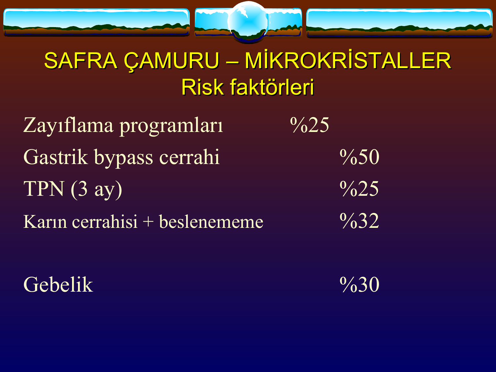
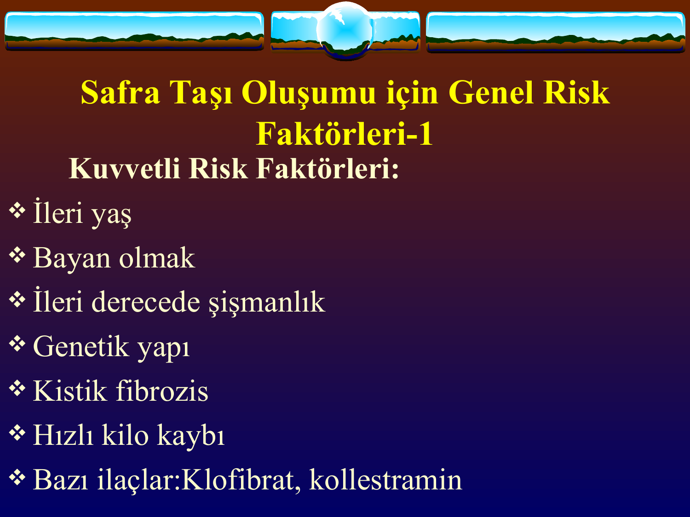
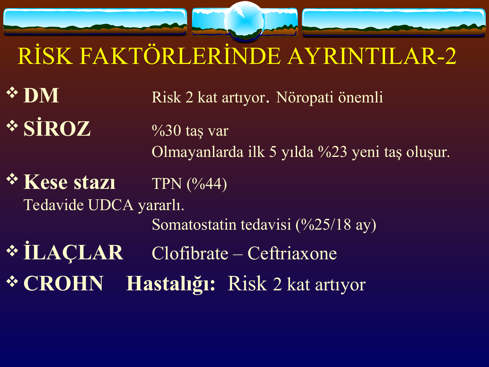
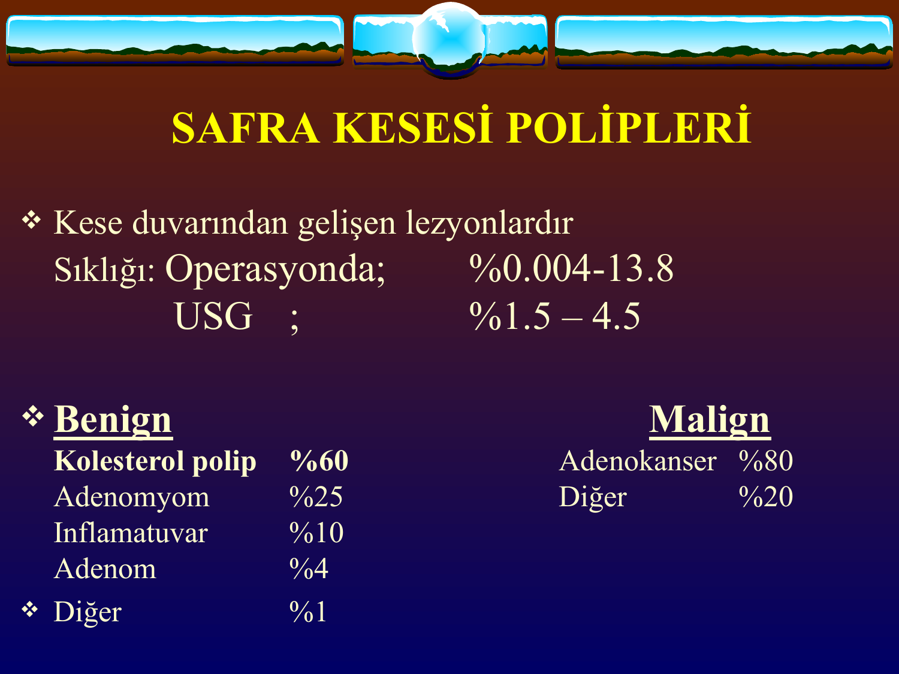
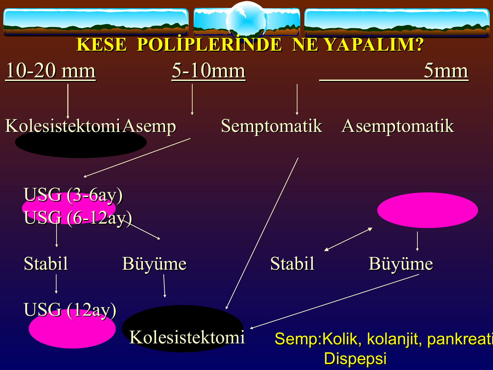

# KOLESİSTİT VE KOLELİTİAZİS (SAFRA TAŞLARI)

**Hazırlayan:** Prof. Dr. M. Hadi Yaşa
**Bölüm:** Aydın Adnan Menderes Üniversitesi Tıp Fakültesi — Gastroenteroloji Bilim Dalı

---

## İÇİNDEKİLER

1. [Safra Sentezi ve Yapısı](#safra-sentezi-ve-yapısı)
2. [Safra Asitleri ve Safra Tuzlarının Görevleri](#safra-asitleri-ve-safra-tuzlarının-görevleri)
3. [Miçel ve Litojenik Safra](#miçel-ve-litojenik-safra)
4. [Safra Taşı Tipleri](#safra-taşı-tipleri)
5. [Taş Oluşumunun Fizyopatolojisi](#taş-oluşumunun-fizyopatolojisi)
6. [Safra Çamuru ve Mikrokristaller](#safra-çamuru-ve-mikrokristaller)
7. [Risk Faktörleri](#risk-faktörleri)
8. [Klinik Semptomlar ve Fizik Muayene](#klinik-semptomlar-ve-fizik-muayene)
9. [Laboratuvar Bulguları](#laboratuvar-bulguları)
10. [Görüntüleme](#görüntüleme)
11. [Tedavi — Genel İlkeler](#tedavi--genel-i̇lkeler)
12. [Mutlaka Cerrahi Gereken Durumlar](#mutlaka-cerrahi-gereken-durumlar)
13. [Cerrahi Dışı Tedavi Yöntemleri](#cerrahi-dışı-tedavi-yöntemleri)
14. [Safra Kesesi Polipleri](#safra-kesesi-polipleri)

---

## SAFRA SENTEZİ VE YAPISI

### Safra Sentezi

* Safranın **3/4'ü hepatositlerin kanaliküler membranından** salgılanır → **kanaliküler safra**.
* **1/4'ü** safra kanallarındaki epitel hücrelerinden salgılanır → **düktüler safra** (alkalendir).

### Safranın Bileşimi

| Bileşen | Oran |
|---|---|
| **Su** | %97 |
| **Safra tuzları** | %0.7 |
| **Safra pigmentleri** | %0.2 |
| **Kolesterol** | %0.6 |
| **İnorganik tuzlar** | %0.7 |
| **Yağ asitleri** | %0-15 |
| **Fosfolipidler (lesitin)** | %0-1 |
| Diğer yağlar | %0-1 |

* **pH:** 7.8 – 8.6 (alkalen)
* **Atılan elementler:** Cu, Zn, Fe, Ca, Mg
* **İlaçların önemli bir kısmı** safra ile atılır.

---

## SAFRA ASİTLERİ VE SAFRA TUZLARININ GÖREVLERİ

### Safra Asitleri

**Primer safra asitleri** (karaciğerde sentezlenir):

| Asit | Oran |
|---|---|
| **Kolik asit** | %35 |
| **Kenodeoksikolik asit** | %35 |

**Sekonder safra asitleri** (kolonda bakteriler tarafından oluşturulur):

| Asit | Oran |
|---|---|
| **Deoksikolik asit** | %25 |
| **Litokolik asit** | %4 |
| **Ursadeoksikolik asit** | %1 |

### Safra Tuzlarının Görevleri

1. **Kolesterolün miçeller içinde çözünür hale getirilerek** bağırsaklara taşınmasını sağlar.
2. **Lipazın aktive edilmesi** → yağ sindirimi ve emilimi
3. **Fosfolipaz A2 ve kolesterol esterazın aktive edilmesi** → yağ sindirimine destek
4. **Bağırsaklarda yağda eriyen A, D, E, K vitaminlerinin emilimi**
5. **Toksik madde ve ilaçların** vücuttan atılımı

---

## MİÇEL VE LİTOJENİK SAFRA

### Miçel Formasyonu

**Miçel:** Kolesterol + fosfolipit (lesitin) + safra tuzlarının **belirli bir oranda bulunması** ile oluşan ve **kolesterolün çözünür halde taşınmasını sağlayan** mikst yapıdır.

### Litojenik Safra

**Litojenik safra:** Kolesterolün safradaki miktarının safra tuzları ve lesitine göre **orantısız artışı**dır. Yani safra **kolesterol ile süpersatüredir**.

> **💡 Önemli:** **Uzun süreli açlık halinde** safra tuzu salınımı azalır; kolesterol normal kalsa bile **litojenik safra** oluşur — bu, uzun süreli açlıkta safra taşı oluşmasının mekanizmasıdır.

### Kristalizasyon → Presipitasyon

```
       Süpersatüre safra
            ↓
      Çekirdeklenme (nükleasyon)
            ↓
    Kristalizasyon (monohidrat kristalleri)
            ↓
       Presipitasyon
            ↓
        TAŞ OLUŞUMU
```

---

## SAFRA TAŞI TİPLERİ

| Tip | Oran | Özellikler |
|---|---|---|
| **Kolesterol taşları** | **%80** | Soluk beyazımsı-sarı; çok sık |
| **Pigment taşları** | %10 | Siyah-kahverengi |
| **Mikst taşlar** | %10 | Karma |

### Kolesterol Taşları

| | Saf kolesterol | Mikst kolesterol |
|---|---|---|
| **Kolesterol içeriği** | **%90** | **%50** |
| **Boyut** | Genellikle **>2.5 cm** | Daha küçük |
| **Sayı** | **Tek** | Çok sayıda olabilir |
| **Renk** | Soluk beyazımsı-sarı | — |
| **Kırılganlık** | **Kolay kırılır** | — |

### Pigment Taşları

**Genel özellikleri:**

* Tüm safra taşlarının **%10'u**
* Genellikle **<1 cm çapında**
* **Siyah-kahverengi**
* **Ca-karbonat, Ca-fosfat, Ca-bilirubinat, Ca-palmitat** ve **bilirubin polimerleri**nden oluşurlar
* **Oldukça serttir**
* Daha çok **hemolitik anemiler** ve **sirozlularda** görülür

**Koledokta primer oluşan taşlar** genellikle **kahverengi** pigment taşlarıdır.

**Etiyolojide:**

* **Safra stazı**
* **Bakteri kolonizasyonu** — bakterilerdeki **β-glukuronidaz enzimi** safradaki Ca-bilirubinat ve Ca-palmitatı presipite eder. **Direkt bilirubin, indirekte dönüşerek çöker.**

---

## TAŞ OLUŞUMUNUN FİZYOPATOLOJİSİ

Kolesterol taşlarının oluşmasında **3 temel mekanizma** vardır:

### 1. Safranın Kolesterol ile Süpersatürasyonu

Kolesterolün artması — **obezite** ve benzeri durumlar.

### 2. Kolesterol Monohidrat Kristallerinin Nükleasyonu (Çekirdeklenme)

**Çekirdeklenmeyi arttıranlar:**
* **Prostaglandinler**
* **Musin artışı**

### 3. Safra Kesesinde Disfonksiyon ve Staz

* **Hamilelik**
* **Oral kontraseptifler**
* **Uzun süreli total parenteral beslenme (TPN)**

---

## SAFRA ÇAMURU VE MİKROKRİSTALLER



### Tanım

**Çamur:** Sıvı ortamda solid materyalin yavaşça dibe çökmesidir. Kıvamlı, müsinden zengin safralı ortamda partiküllerin görülmesi.

**Partiküller:**

* **Kolesterol monohidrat kristalleri** → kolesterol taşları
* **Kalsiyum bilirubinat granülleri** → pigment ve diğer taşlar

### Prevalans

| Durum | Çamur Oranı |
|---|---|
| Genel populasyonda safra taşı | %20 |
| **Gebelikte** | **%30** |
| **TPN'de** | **%40** |
| Kilo kaybı olanlarda | %25 |
| **Safra taşı olanlarda çamur oranı** | **%70** |

### Çamur İçin Risk Faktörleri

| Durum | Oran |
|---|---|
| **Zayıflama programları** | %25 |
| **Gastrik bypass cerrahisi** | %50 |
| **TPN (3 ay)** | %25 |
| Karın cerrahisi + beslenememe | %50 |
| **Gebelik** | %30 |

### Biliyer Staz ile İlişki

* **Ca-bilirubinat granülleri + musin salgısı + 3 günlük staz** → yeterli
* **OLTx (Ortotopik karaciğer transplantasyonu):** %56 çamur, %34 taş, %10 nekrotik materyal
* **Östrojenler** → %40 süpersatürasyon
* **Somatostatin** → %30 çamur ve safra taşı (kese hipomotilitesi)
* **Seftriakson** → %43 (Ca-seftriakson tuzları)

---

## RİSK FAKTÖRLERİ

### Kuvvetli Risk Faktörleri



* **İleri yaş** (major risk >40 yaş)
* **Bayan olmak**
* **İleri derecede şişmanlık (obezite)**
* **Genetik yapı**
* **Kistik fibrozis**
* **Hızlı kilo kaybı**
* **Bazı ilaçlar:** Klofibrat, kolestiramin

### Zayıf Risk Faktörleri

* **Hamilelik**
* **Oral kontraseptifler**
* **Hafif şişmanlık**
* **İleum hastalığı** (terminal ileum) ve rezeksiyonu
* **Safra yolları fistülü**
* **Uzun süreli açlık**
* **Total parenteral beslenme**
* **Diabetes mellitus**

### Risk Faktörlerinde Ayrıntılar

**Yaş:**
* **>40 yaş** major risk

**Cinsiyet:**
* **<40 yaş kadınlarda** 3 kat fazla (gebelik, hormon)

**Gebelik:**
* **1-3. trimester arası:** **%30 yeni çamur, %2 yeni taş**
* **Doğumdan 3 ay sonra:** Çamurun %60'ı, taşların %30'u kaybolur

**Östrojen:**
* Kolesterol süpersatürasyonu yapar
* **Menopoz sonrası östrojen kullananlarda 2 kat risk artışı**

**Genetik:**
* Ailesinde olanların yakınında **2 kat fazla** risk

**Obezite:**
* Tek başına riski **3 kat** artırır

**Kısa sürede aşırı zayıflama:**
* **Proksimal gastrik bypass:** 3 ayda %28 kolesistektomi gerekli
* **UDCA ile taş oluşumu riski azaltılabilir**



**DM:**
* Risk **2 kat** artar
* **Nöropati önemli** (otonomik — kese motilitesi ↓)

**Siroz:**
* **%30 taş** vardır
* Olmayan sirozlu hastada ilk 5 yılda **%23 yeni taş** oluşur

**Kese stazı:**
* **TPN:** %44 taş
* **Tedavide UDCA yararlıdır**
* **Somatostatin tedavisi:** 18 ayda %25 taş

**İlaçlar:**
* **Klofibrat, seftriakson** → taş riski artırır

**Crohn hastalığı:**
* Risk **2 kat** artar (terminal ileum tutulumu → safra tuzu emilim bozukluğu)

### Diğer Hastalıklarda "Sessiz Taşlar"

**Orak hücreli anemi:**

* **15 yaşında %70 sessiz taş**
* Operasyon morbiditesi %40 (profilaktik kolesistektomi önerilmez)
* Karın ağrısı ayırıcı tanısı — pre-op transfüzyon

**Herediter sferositoz:**

* Erişkinlerde **%50 kese taşı**, asemptomatik
* **Splenektomi + profilaktik kolesistektomi** önerilir

**Gastrik bypass cerrahisi:**

* **%30 taş / 3 ay**
* **UDCA yararlı olabilir**

### Sırmione Çalışması (İtalya) — Epidemiyoloji

* **n = 1914** (tüm kasaba USG ile taranmış)
* **Kese taşı prevalansı: %7** (n = 132)
* **Yaşla prevalans artıyor**
* **Cins:** K: %9, E: %5
* **Taştan habersiz vakalar: %82**
* **10 yıl takipte biliyer kolik: %16**

---

## KLİNİK SEMPTOMLAR VE FİZİK MUAYENE

### Semptomlar

* **Sağ hipokondrium ağrısı**
* Bulantı, kusma
* Üşüme, titreme
* Öğürtü
* Ateş

### Ağrının Özellikleri

* **Sağ üst kadranda künt bir ağrı** (bazen epigastriumda)
* **Özellikle yemeklerden sonra** başlar
* **Tetikleyen yiyecekler:** Yağlı yemekler, yumurta, çikolata, asitli içecekler
* **Kolik tarzda** ve çok şiddetli olabilir
* **Sağ skapula altına ve omuza yayılır**
* **Öğürtü, ateş, bulantı, kusma** eşlik edebilir
* **Taş koledoğa düşmemişse** safra kesesi taşlarında **genellikle sarılık yoktur**

### Fizik Muayene Bulguları

* **Sağ üst kadranda hassasiyet**
* **Murphy pozitifliği** (derin inspirasyonda sağ üst kadrana bası ile ağrı — nefes tutma)
* **Ele gelen kitle** (hidropik kese)
* **Ateş, taşikardi**
* Epigastrium ve sağ üst kadranda **distansiyon**
* **Barsak seslerinde azalma**

> **💡 Murphy belirtisi:** Akut kolesistit için yüksek spesifiklik; pozitif olduğunda kolesistit olasılığı yüksektir.

---

## LABORATUVAR BULGULARI

| Bulgu | Anlam |
|---|---|
| **Lökositoz (10-15.000/mm³, nötrofil hakim)** | Akut inflamasyon (kolesistit) |
| **Bilirubinler genellikle normal** | İzole kolelitiazis |
| **Bilirubin >2 mg/dl + direkt bilirubin hakim** | **Koledok taşı veya kolanjit** düşün |
| **Hiperamilazemi** | **Pankreatit** ayırıcı tanısı |
| **ALP, GGT, direkt bilirubin ↑ (kolestaz)** | **Koledok taşı veya inflamasyon** |
| **AST/ALT yüksek** | Taş **koledoğa düşmüş**, hepatit düşün |
| **Duodenal tüpajda kolesterol kristalleri** | Kolesterol taşı (vakaların %60'ında) |

---

## GÖRÜNTÜLEME

| Yöntem | Özellik |
|---|---|
| **Direkt karın grafisi** | Safra taşlarının sadece **%10-15'i** radyoopaktır (kalsiyum içerir) |
| **Abdominal USG** | **%95 sensitif ve spesifik** — **ilk tercih**. Taşlar **akustik gölge** verir, **pozisyonla yer değiştirir**. Koledok alt ucu taşları bazen görülemez. |
| **Abdominal BT** | Dansite **<0.633** ise kolesterol taşı |
| **Oral ve IV kolesisto/kolanjiografi** | Kese fonksiyonlarının değerlendirilmesinde yararlı (günümüzde nadir) |
| **MRCP** | Non-invaziv; koledok taşları için yüksek duyarlılık |
| **ERCP** | **Koledok taşlarında altın standart** — hem tanı hem tedavi (endoskopik sfinkterotomi + taş ekstraksiyonu) |
| **EUS (Endoskopik US)** | Koledok taşları için çok yüksek duyarlılık |

---

## TEDAVİ — GENEL İLKELER

### Genel Prensipler

* Safra taşları normal erişkin populasyonunda **%4-5** oranındadır.
* Risk faktörleriyle prevalans artar.
* İleri yaşlarda sıklık artar. **Kadınların %20'sinde** safra taşı saptanır.
* **Taşların büyük çoğunluğu (%81) asemptomatiktir ve tedavi gerekmez.**

### Sessiz (Asemptomatik) Kese Taşlarının Doğal Seyri

| Süre | Sessiz Taşın Semptomatik Hale Gelme Oranı |
|---|---|
| **5 yılda** | **%10** |
| **15 yılda** | **%18** |
| **Ömür boyu** | **~%33** |

> **⚠️ Klinik kural:** **<3 cm sessiz kese taşları tedavisiz izlenmelidir.**

### Semptomatik Pigment Taşları

* **Tedavisi cerrahidir.**
* **Medikal tedavinin yararı pek yoktur.**

### Porselen Safra Kesesi

* **Asemptomatik olsa bile cerrahi olarak çıkarılmalıdır** (yüksek kanser riski).

---

## MUTLAKA CERRAHİ GEREKEN DURUMLAR

> **🚨 Profilaktik / insidental kolesistektomi endikasyonları:**
>
> 1. **Semptomatik taş (sesli taş)**
> 2. **Koledok kisti**
> 3. **Pankreas kanalının koledoğa açılması** (anormal pankreatobiliyer bileşke)
> 4. **Safra kesesi adenomları (>10 mm polip)**
> 5. **Porselen safra kesesi** (%7-33 kanser riski)
> 6. **Büyük taşlar (>3 cm)**

---

## CERRAHİ DIŞI TEDAVİ YÖNTEMLERİ

**Endikasyon:** Opere olamayan ya da cerrahiyi reddeden hastalar.

### A. Safra Asitleri ile Tedavi — Ursodeoksikolik Asit (UDCA)

**Etki mekanizması:**

1. **Koloretik etki** ile safra akımını kolaylaştırır
2. Safradaki **safra asidi havuzunu genişleterek litojenik safrayı normalleştirir**
3. **Sitoprotektif etki** — safra asitlerinin hepatositleri parçalamasına engel olur

**Tedavi süresi ve kriterler:**

* **2-4 yıl** tedavi gerekir
* **Hafif-orta derece semptomatik** hasta
* **Taş <1.5 cm**
* **Kalsifiye olmamalı**
* **Kese fonksiyone olmalı**
* **Yüzen taş** olmalı
* **İlk 6 ayda taşın ≥%25 küçülmesi** → tedavinin etkin olduğunu gösterir

**Doz:** **UDCA 13-22 mg/kg/gün**

**Başarı:** 1-4 yılda hastaların **%30-70'inde** taşlarda tamamen veya kısmen çözünme.

### B. Metil Tert-Bütil Eter (MTBE)

* **Perkütan kateter** ile verilir
* **6-12 saat** verilir
* **İnvaziv bir yöntem**

### C. Monooctanoin

* MTBE'den daha az etkili
* **Ameliyat sonrası kalmış koledok taşları** için **T-tüp içinden** verilir (2-6 saat)

### D. EDTA

* **Pigment taşlarının** eritilmesinde kullanılmıştır
* 1 yıllık tedavide başarı **%30-40**
* **%10 nüks**
* **ESWL ve lazer tedavilerinden önce ve sonra** verilebilir

### E. ESWL (Extracorporal Shock Wave Lithotripsy)

**Endikasyon ve kriterler:**

* Sadece hastaların **%24'ünde** uygulanabilir
* **Taş çapı <3 cm**
* **Sayı <3**
* **Kese fonksiyone olmalı**
* **Akut kolesistit olmamalı**
* **Bir hafta önce UDCA başlanması** ve **sfinkterotomi** yararlıdır
* **Başarı oranı düşüktür**

---

## SAFRA KESESİ POLİPLERİ



### Tanım ve Sıklık

**Kese polipleri:** Kese duvarından gelişen lezyonlardır.

| | Sıklık |
|---|---|
| **Operasyonda** | %0.004 – 13.8 |
| **USG'de** | **%1.5 – 4.5** |

### Polip Tipleri

**Benign polipler:**

| Tip | Oran |
|---|---|
| **Kolesterol polip** | **%60** (en sık) |
| **Adenomyom** | %25 |
| **İnflamatuar** | %10 |
| **Adenom** | %4 |
| Diğer | %1 |

**Malign polipler:**

| Tip | Oran |
|---|---|
| **Adenokanser** | **%80** |
| Diğer | %20 |

### Kese Poliplerinde Yönetim Algoritması



| Boyut | Yaklaşım |
|---|---|
| **≥10-20 mm** | **KOLESİSTEKTOMİ** (malignite riski yüksek) |
| **5-10 mm, semptomatik** | **Kolesistektomi** (kolik, kolanjit, pankreatit, dispepsi) |
| **5-10 mm, asemptomatik** | USG takibi (3-6 ay, sonra 6-12 ay). **Büyüme varsa kolesistektomi**, stabilse 12 ayda tekrar USG. |
| **<5 mm** | USG takibi. Büyüme varsa kolesistektomi; stabilse izlem. |

---

## SINAV NOTLARI — ANAHTAR HATIRLATMALAR

> **📋 En Sık Sorulan Noktalar:**
>
> 1. **Safra taşlarının %80'i kolesterol taşıdır, %10'u pigment taşı, %10'u mikst.**
> 2. **Safra taşı prevalansı erişkinlerde %4-5**, kadınların **%20'sinde** mevcut.
> 3. **Major risk faktörleri:** Yaş >40, kadın, obezite, hızlı kilo kaybı, genetik, kistik fibroz.
> 4. **Kuvvetli ipucu — "4F":** **F**emale, **F**orty, **F**ertile, **F**at.
> 5. **Litojenik safra:** Kolesterolün orantısız artışı. **Uzun süreli açlıkta** bile gelişir (safra tuzu ↓).
> 6. **Pigment taşları:** Hemolitik anemi ve sirozda sık; **β-glukuronidaz** etkisiyle koledokta primer oluşabilir.
> 7. **Sessiz (<3 cm) taşların %81'i asemptomatik** — **TEDAVİ GEREKMEZ**.
> 8. **Cerrahi mutlak endikasyonlar:** Sesli taş, koledok kisti, kese adenomu >10 mm polip, **porselen kese**, **>3 cm taş**, pankreas kanalının koledoğa açılması.
> 9. **Porselen kese → %7-33 kanser riski** → asemptomatik olsa bile kolesistektomi.
> 10. **Murphy belirtisi** — akut kolesistit için yüksek spesifik.
> 11. **İlk görüntüleme: Abdominal USG** (%95 sensitivite ve spesifisite).
> 12. **Koledok taşında altın standart tanı + tedavi: ERCP.**
> 13. **UDCA (ursodeoksikolik asit):** Taş <1.5 cm, kalsifiye değil, fonksiyone kese, yüzen taş. Doz **13-22 mg/kg/gün**, 2-4 yıl.
> 14. **ESWL kriterleri:** Taş <3 cm, sayı <3, fonksiyone kese, akut kolesistit yok — hastaların sadece %24'ünde uygulanabilir.
> 15. **Laboratuvar:** İzole kese taşında bilirubin normal; **koledok taşında direkt bilirubin + ALP/GGT ↑**; **ALT/AST ↑ → koledoğa düşmüş**.
> 16. **Kese poliplerinde 10 mm ve üstü → kolesistektomi** (adenokanser %80).
> 17. **Gebelikte:** 1-3. trimester %30 yeni çamur, %2 yeni taş; doğumdan 3 ay sonra çamurun %60'ı, taşların %30'u kaybolur.
> 18. **Orak hücreli anemi ve herediter sferositoz:** Sessiz taş oranı yüksek; sferositozda splenektomi + profilaktik kolesistektomi önerilir.
> 19. **Seftriakson ve klofibrat** → ilaç ilişkili safra taşı.
> 20. **TPN'de** %44'e varan taş oranı — UDCA profilaksisi yararlıdır.

---

> **Kaynaklar:**
>
> 1. Prof. Dr. M. Hadi Yaşa — Safra Taşları: Etyoloji, Patogenez ve Komplikasyonlar ders notu, ADÜ Tıp Fakültesi.
> 2. Sırmione İtalya Çalışması — Hepatology 1987;7:913-7.
> 3. Lammert F, Gurusamy K, Ko CW, et al. Gallstones. Nat Rev Dis Primers 2016;2:16024.
> 4. EASL Clinical Practice Guidelines on the prevention, diagnosis and treatment of gallstones. J Hepatol 2016;65:146-81.
