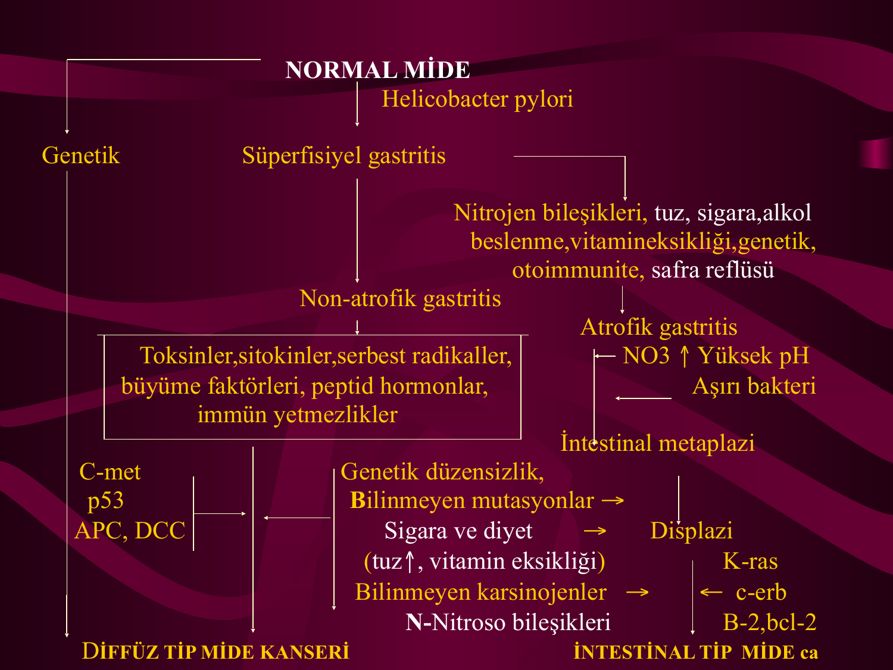
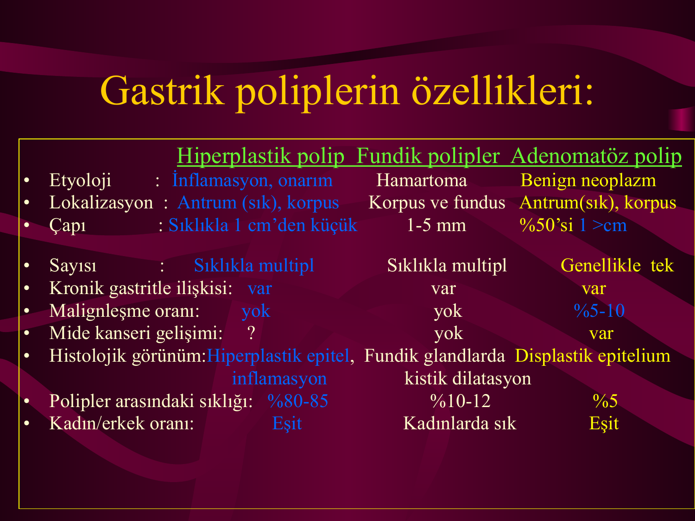
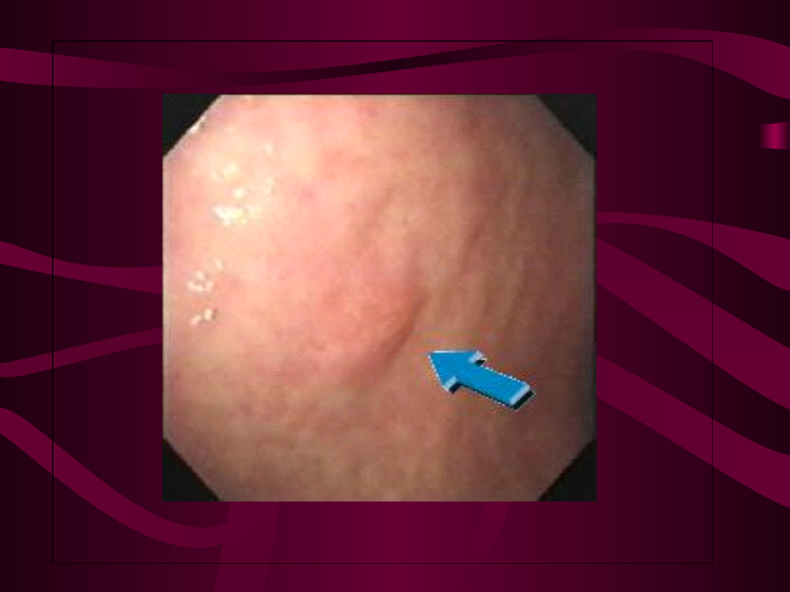
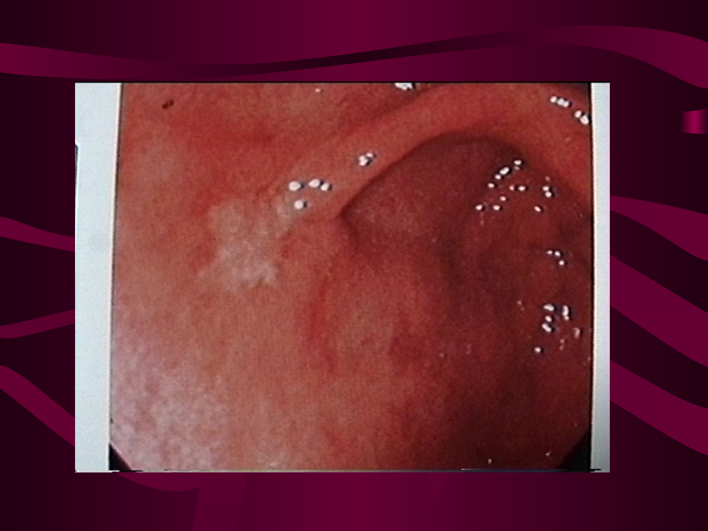

# MİDENİN PREMALİGN LEZYONLARI VE ERKEN MİDE KANSERİ

**Hazırlayan:** Prof. Dr. M. Hadi Yaşa
**Bölüm:** Aydın Adnan Menderes Üniversitesi Tıp Fakültesi — Gastroenteroloji Bilim Dalı

---

## İÇİNDEKİLER

1. [Epidemiyoloji](#epidemiyoloji)
2. [Histopatoloji](#histopatoloji)
3. [Prognoz — Erken Tanının Önemi](#prognoz--erken-tanının-önemi)
4. [Etiyoloji](#etiyoloji)
5. [Risk Faktörleri](#risk-faktörleri)
6. [Premalign Lezyonlar](#premalign-lezyonlar)
7. [Atrofi-Metaplazi-Displazi Gelişimi](#atrofi-metaplazi-displazi-gelişimi)
8. [Displazi Yönetimi ve Takibi](#displazi-yönetimi-ve-takibi)
9. [Gastrik Polipler](#gastrik-polipler)
10. [Mide Kanseri Sınıflandırması](#mide-kanseri-sınıflandırması)
11. [Klinik ve Fizik Muayene](#klinik-ve-fizik-muayene)
12. [Tanı](#tanı)
13. [Yayılım ve Metastaz](#yayılım-ve-metastaz)
14. [Tedavi](#tedavi)

---

## EPİDEMİYOLOJİ

### Dünyada ve Türkiye'de Sıklık

**Dünya:**

* Dünyada **akciğer kanserinden sonra en sık rastlanan** kanserdir.
* Kansere bağlı ölümler arasında **ikinci sırada**.
* Japonya, Çin, İzlanda, Finlandiya, Avusturya, Güney Amerika ve Doğu Avrupa'da en sık.

**Türkiye:**

* Sağlık Bakanlığı verilerine göre **GİS kanserleri içinde 1. sıradadır**.
* Erkeklerde **akciğer ve prostat kanserinden sonra 3. sık**.
* Kadınlarda **meme kanseri ve lenfomadan sonra 3. sık**.

### Ölüm Oranı (Ülkeler Arası Karşılaştırma)

| Ülke | Ölüm Oranı |
|---|---|
| **ABD** | 13 / 100.000 kişi |
| **Türkiye** | **28 / 100.000 kişi** |
| **Japonya** | 67 / 100.000 kişi |

### Demografi

* **30 yaşın altında nadirdir** (%3)
* **60 yaşından sonra pik** yapar
* **Erkeklerde daha sık**
* **En sık antruma yerleşir**

> **💡 Önemli:** Ülkemizde mide kanseri **1 numaralı sindirim sistemi kanseridir**.

---

## HİSTOPATOLOJİ

### Tip Dağılımı

* **~%91 adenokarsinom**
* **~%9:** Leiomyosarkom, lenfoma (özellikle **MALT lenfoma**), karsinoid, skuamöz hücreli karsinom, diğer

### Adenokarsinom — İki Subtip

| Subtip | Lokalizasyon | Prognoz | Köken |
|---|---|---|---|
| **İntestinal tip** | **Distal** (antrum) | **Daha iyi** | Genellikle **premalign lezyonlardan** gelişir |
| **Difüz tip** | **Proksimal, kardiya** | **Daha kötü** | Linitis plastika daha sık |

### Adenokanser Dışındaki Histolojik Tipler (Göreli Sıklıklar)

* **Non-Hodgkin lenfoma:** %3.4
* **Anaplastik:** %2
* **Sarkom:** %1.4
* **Karsinoid:** %1.4
* **MALT lenfoma:** %1.2

---

## PROGNOZ — ERKEN TANININ ÖNEMİ

### 5 Yıllık Sağkalım (Evreye Göre)

| Grup | 5 Yıllık Sağkalım |
|---|---|
| **Ortalama (genel)** | **%17** |
| **Distal yerleşimli — intestinal tip** | %20-26 |
| **Proksimal yerleşimli — difüz tip** | %10-16 |
| **Linitis plastika** | **%5** |
| **ERKEN MİDE KANSERİ** | **%90** |

### Erken Tanı Oranları

| Ülke | Erken Tanı Oranı |
|---|---|
| **ABD** | %18.1 |
| **Japonya** | **%45.7** |
| **Türkiye** | **<%5** |

> **⚠️ ÇOK ÖNEMLİ:** Türkiye'de hastaların yaklaşık **%80'i geç evrede** doktora başvurmaktadır. **Erken tanı prognozun tek belirleyici faktörüdür**.

---

## ETİYOLOJİ

Mide kanseri etiyolojisi multifaktöriyeldir:

1. **Premalign lezyonlar**
2. **Çevresel faktörler**
3. **Genetik ve ailesel faktörler**
4. **Diyet**
5. **Helicobacter pylori** (en önemli — Grup 1 karsinojen, WHO)

---

## RİSK FAKTÖRLERİ

### Yüksek Kanser Riski Taşıyanlar

**1. Genetik ve Ailesel:**

* **Ailede mide kanseri olması** — birinci derece akrabalarında **~3 kat** fazla (örn. Napolyon ailesi)
* **Ailede kolorektal kanser varlığı** (özellikle **HNPCC — Lynch sendromu**)
* **A kan grubu** (daha sık)

**2. Yaş ve Cinsiyet:**

* **Erkekler**
* **Yaşlılar** (60 yaş üzerinde pik)

**3. Premalign Lezyonlar:**

* **Kronik atrofik gastrit**
* **İntestinal metaplazi**
* **Gastrik epitelyal displazi**
* **Parsiyel gastrektomi** (benign hastalıklarda yapılan)
* **Ménétrier hastalığı**
* **Gastrik polipler**
* **Pernisyöz anemi** (2-3 kat fazla)
* **Gastrik ülserler (?)**

**4. Enfeksiyon:**

* **Helicobacter pylori** — en önemli önlenebilir risk

**5. Diyet ve Yaşam Tarzı:**

* **Kuru, tuzlu balık**, tuzlu ve baharatlı yiyeceklerin aşırı tüketimi
* **Düşük C vitamini alımı**
* **Aşırı lahana tüketimi**
* **Tütsülenmiş yiyecekler**
* **Düşük A vitamini**
* **Sigara**
* **Alkol**
* **Obezite**
* **Aklorhidri**
* **Düşük sosyoekonomik düzey**

### Düşük Kanser Riski Taşıyanlar

* **O kan grubu**
* **Kadınlar, gençler** (<30 yaş)
* **Bol sebze ve meyve tüketenler**
* **Yüksek C vitamini alımı**
* **Yüksek sosyoekonomik düzey**

---

## PREMALİGN LEZYONLAR

### Ana Premalign Lezyonlar

1. **Kronik atrofik gastrit**
2. **İntestinal metaplazi**
3. **Gastrik epitelyal displazi**
4. **Ménétrier hastalığı** (dev hipertrofik gastrit)
5. **Parsiyel gastrektomi sonrası mide güdüğü**
6. **Pernisyöz anemi** — 2-3 kat risk
7. **Gastrik adenomatöz polipler**

> **💡 En önemli etken: Helicobacter pylori**
>
> H. pylori → kronik gastrit → atrofik gastrit → intestinal metaplazi → displazi → adenokanser (**Correa kaskadı**).

---

## ATROFİ-METAPLAZİ-DİSPLAZİ GELİŞİMİ



### Patogenez (Correa Kaskadı)

```
      NORMAL MİDE
           ↓
      H. pylori
           ↓
   Süperfisiyel gastrit
           ↓
  Non-atrofik gastrit
           ↓
  Atrofik gastrit → Yüksek pH → Aşırı bakteri üremesi → NO₃ ↑
           ↓
   İntestinal metaplazi
           ↓
       Displazi
       (K-ras, c-erb B-2, bcl-2)
           ↓
  İNTESTİNAL TİP MİDE KANSERİ
```

**Difüz tip** ise **süperfisiyel gastritten farklı bir yolla** (C-met, p53, APC, DCC mutasyonları) gelişir.

### Progresyon Hızı

Bir çalışmada mide patolojisi olan **7290 hasta ortalama 5.1 yıl** izlenmiştir:

| Başlangıç Durumu | Yıllık Progresyon |
|---|---|
| **Normal mide histolojisi** | Yıllık **%7.5** oranında **kronik atrofik gastrit** (KAG) gelişimi |
| **KAG'lı hastalar** | Yıllık **%6.7** oranında **intestinal metaplazi** gelişimi |
| **İntestinal metaplazili** | Yıllık **%3.2** oranında **displazi** gelişimi |

### Malignleşme Potansiyeli (DNA Anoploidi Oranı)

| Durum | Oran |
|---|---|
| **Normal mide** | 0 |
| Normal mide + duodenal ülser | 0 |
| **Kronik atrofik gastrit** | **%15.38** |
| **İntestinal metaplazi** | **%15.38** |
| **Displazi** | **%25** |
| **Mide polipleri** | **%11.11** |

---

## DİSPLAZİ YÖNETİMİ VE TAKİBİ

### Hafif Displazi

* **%60-70 spontan geriler**
* **%20-30 aynen kalır**
* **%10 progresyon gösterir**
* **Nadiren karsinoma gelişir**

**Yaklaşım:**

* Özellikle önemli bir endoskopik lezyon ile birlikte değilse **6-12 ay aralıklarla** endoskopik ve histopatolojik kontrol genellikle yeterlidir.

### Orta Dereceli Displazi

* Hafif displazilere benzer
* **%10-14'ünde şiddetli displazi / karsinoma gelişir**
* Bazı otörler **daha sık kontrol ve biyopsi** önermektedir.

### Şiddetli Displazi

* **Daha ciddi lezyon**
* **%30-45 gerileme oranı**
* **Sıklıkla aynen sebat eder**
* **%20-80 progresyon gösterir** ve bir kısmı gastrik karsinomaya dönüşür.

> **⚠️ ÇOK ÖNEMLİ:** **Görünür bir endoskopik lezyonla (gastrik ülser, polip) birlikte bulunan şiddetli displazinin yaklaşık %50'sinde, şiddetli displazi tespit edildikten 3 ay sonra biyopsi örneklerinde karsinoma tanısı konulmuştur.**
>
> Bu nedenle şiddetli displaziler **kısa aralıklarla sıkı takip edilmelidir** ya da **rezeksiyon düşünülmelidir**.

---

## GASTRİK POLİPLER



| Özellik | **Hiperplastik Polip** | **Fundik Gland Polipleri** | **Adenomatöz Polip** |
|---|---|---|---|
| **Etiyoloji** | İnflamasyon, onarım | Hamartoma | **Benign neoplazm** |
| **Lokalizasyon** | Antrum (sık), korpus | **Korpus ve fundus** | **Antrum (sık), korpus** |
| **Çap** | Sıklıkla <1 cm | 1-5 mm | **%50'si >1 cm** |
| **Sayı** | Sıklıkla multipl | Sıklıkla multipl | Genellikle **tek** |
| **Kronik gastrit ilişkisi** | Var | Var | **Var** |
| **Malignleşme oranı** | Yok | Yok | **%5-10** |
| **Mide kanseri gelişimi** | ? | Yok | **Var** |
| **Histolojik görünüm** | Hiperplastik epitel, inflamasyon | Fundik glandlarda kistik dilatasyon | **Displastik epitelyum** |
| **Polipler arasında sıklık** | %80-85 | %10-12 | **%5** |
| **Kadın/Erkek oranı** | Eşit | **Kadınlarda sık** | Eşit |

> **💡 Önemli:** **Adenomatöz polipler** (özellikle **>1 cm**) premalign lezyonlardır → **rezeksiyon (endoskopik veya cerrahi) gerekir**.
> Fundik gland polipleri (PPI kullananlarda sık) genellikle benigndir.

---

## MİDE KANSERİ SINIFLANDIRMASI

### 1. Erken Mide Kanseri — Japon Sınıflaması



**Erken mide kanseri tanımı:** Mukoza ve submukozada **sınırlı kalan** kanser.

| Tip | Tanım |
|---|---|
| **Tip I** | **Mukozadan 0.5-2 cm kabarık** (polipoid) |
| **Tip II-a** | Mukozadan **<0.5 cm kabarık** (süperfisiyel, hafif kabarık) |
| **Tip II-b** | **Mukoza seviyesinde**, sadece renk solukluğu |
| **Tip II-c** | **Çökük ve ülsere** lezyon |
| **Tip III** | **Derin, benign ülser görünümünde** |

### 2. İleri Evre — Borrmann Sınıflaması

| Tip | Tanım |
|---|---|
| **Tip I** | **2 cm'den büyük polipoid, karnabahar** şeklinde lezyon (ülser olabilir) |
| **Tip II** | **Molar diş manzarasında** — kabarık kitle üzerinde, derin, kirli sarı eksüdalı ülser |
| **Tip III** | **2 cm'den büyük**, tabanı infiltre, **yanardağ krateri** şeklinde ülser |
| **Tip IV** | **Lümene vejetan kitle**, yaygın mide infiltrasyonu (**linitis plastika** buraya girer) |

### 3. Mikroskopik Sınıflandırma

* **İyi diferansiye**
* **Orta derecede diferansiye**
* **Kötü diferansiye (indiferansiye)**

### 4. Anatomik (Derinlik) Sınıflandırma



| Durum | Tanım |
|---|---|
| **Karsinoma in situ** | Hücre içinde sınırlı (bazal membranı aşmamış) |
| **Erken mide kanseri** | **Mukoza ve submukozada sınırlı** |
| **Linitis plastika** | Aşırı fibröz doku teşekkülü ile seyreden ve **bütün mideyi zırh gibi çepeçevre tutan** form |

### Erken Tanının Amacı

> **🎯 Hedef:**
>
> 1. **Karsinoma in situ** (hücre içinde sınırlı)
> 2. **Erken mide kanseri** (mukoza ve submukozada sınırlı)
>
> dönemlerinde tanı konulmasıdır — çünkü **5 yıllık sağkalım %90'a** çıkar.

---

## KLİNİK VE FİZİK MUAYENE

### Klinik Tablo

**Erken dönemde:**

* **%80 asemptomatik**
* Nonspesifik bulgular: **Epigastrik ağrı, bulantı, kusma, halsizlik, hematemez, melena, iştahsızlık** (özellikle **etli gıdalara karşı belirgin**)

**İleri dönemde:**

* **Kilo kaybı** — geç dönem bulgusu

### En Sık Semptomlar (Nonspesifik)

* **Kilo kaybı**
* **Karın ağrısı** — epigastriumda, künt, yemekle artar, devamlı, bazen sırta yayılır
* **Sarılık**
* **İştahsızlık**
* **Bulantı ve kusma**

### Fizik Muayene Bulguları

**Erken bulgu:**

* **Epigastrik ağrı** (nonspesifik)

**Geç bulgular:**

* **Epigastriumda ele gelen sert ve fikse kitle**
* **Kaşeksi**
* **Virchow nodülü** — sol supraklaviküler LAP
* **Irish nodülü** — ön aksiller LAP
* **Sister Mary Joseph nodülü** — umbilikal metastaz
* **Rektal shelf** (Blumer rafı) — rektal tuşede pelvis tabanında sert kitle
* **Krukenberg tümörü** — overlere metastaz
* **Lenfadenopati, asit, hepatomegali**
* **Çalkantı sesi (klepotaj)** — gastrik çıkış obstrüksiyonu
* **Sarılık, palpabl safra kesesi**
* **Gezici tromboflebitler** (Trousseau sendromu — paraneoplastik)
* Nadiren splenomegali

---

## TANI

### Laboratuvar Bulguları

* **Tanı için kullanılabilecek biyokimyasal tetkik yoktur.**
* **Sedimantasyon yüksekliği**, tümör belirteçlerinde artış **nonspesifik**
* **CEA:** GİS malignitelerinde **%30-71** oranında **nonspesifik** artış. Sağlıklılarda %4, **sigara içenlerde %8** oranında 2-3 kat artabilir. **Tanıda kullanılmaz**, post-op takip ve nüks erken tanısında anlamlı.
* **CA 19-9:** Pek çok malignitede nonspesifik artış. Pankreas kanserinde %85'inde artar; >1000 ise anlamlı.
* **CA 72-4** — göreceli spesifik ama nadir kullanılır
* **Anemi bulguları**
* **Karaciğer metastazı varsa:** ALP, GGT, AST, ALT, bilirubin artışı (geç bulgu)

### Görüntüleme

* **Mide grafisi:** Erken tanıda **yararı sınırlıdır**
* **USG, BT, MR, endosonografi:** Hastalığın yaygınlığını ve metastazları saptamada yararlı

### Altın Standart

> **🎯 ALTIN STANDART: ENDOSKOPİ + HİSTOPATOLOJİK TANI**

* **>40 yaşında mide şikayeti olan her hastaya yapılmalıdır.**
* Gerekli hallerde endoskopi ve histopatolojik inceleme **tekrarlanır**.
* **Kromoendoskopi** (vital boyalarla) — erken lezyon saptamada yararlı.

### Endoskopik Ultrasonografi (EUS)

* **Adenom ve erken mide kanseri ayırıcı tanısında**
* **Submukozal horizontal yayılım gösteren linitis plastika tanısında** gastroskopiden üstündür
* **Dezavantaj:** Yaygın değil, pahalı, tecrübeli kişi sayısı az

---

## YAYILIM VE METASTAZ

### Yayılım Yolları

**En sık: Lenfatik yayılım**

**Lenfatik yayılım örnekleri:**

* **Virchow nodülü** (sol supraklaviküler LAP)
* **Irish nodülü** (ön aksiller LAP)

**Hematojen yayılım:**

* **Karaciğer** (en sık)
* Akciğer, kemik

**Komşuluk yoluyla:**

* Özofagus, pankreas, dalak, karaciğer
* **Sister Mary Joseph nodülü** (göbek bölgesine yayılım)

**Gastrokolik ligament yoluyla:**

* **Kolon**
* **Pelvis tabanı — Rektal shelf (Blumer rafı)**
* **Overlere — Krukenberg tümörü**

---

## TEDAVİ

### Kesin Tedavi

**Cerrahi**dir.

### Erken Mide Kanserinde

* **EMR (Endoskopik Mukozal Rezeksiyon)**
* **ESD (Endoskopik Submukozal Diseksiyon)**
* Mukozaya sınırlı, iyi diferansiye, <2 cm, ülsere olmayan erken kanserde **endoskopik tedavi küratif olabilir**.

### İleri Mide Kanserinde

* **Cerrahi rezeksiyon** (subtotal veya total gastrektomi + lenf nodu diseksiyonu)
* **Perioperatif kemoterapi** (özellikle FLOT rejimi)
* **Palyatif tedavi** (inoperabl)

### İnoperabl Vakalarda

* **Değişik kemoterapi protokolleri** uygulanır
* **Hedefe yönelik tedaviler:**
    * **HER2 pozitif → trastuzumab**
    * **İmmünoterapi** (PD-1/PD-L1 inhibitörleri)

---

## SINAV NOTLARI — ANAHTAR HATIRLATMALAR

> **📋 En Sık Sorulan Noktalar:**
>
> 1. **Türkiye'de GİS kanserlerinde 1. sırada**; dünyada akciğerden sonra en sık.
> 2. **En sık histoloji: Adenokarsinom (%91).**
> 3. **Lauren sınıflaması:** **İntestinal tip** (distal, premalign lezyonlardan, daha iyi prognoz); **Difüz tip** (proksimal, linitis plastika, kötü prognoz).
> 4. **Erken mide kanserinde 5 yıllık sağkalım: %90.** Ortalama mide kanseri: %17. Linitis plastika: %5.
> 5. **Türkiye'de hastaların %80'i geç evrede başvurur.** Erken tanı oranı <%5.
> 6. **En önemli etken: H. pylori** (WHO Grup 1 karsinojen).
> 7. **Correa kaskadı:** Normal → H. pylori gastriti → atrofik gastrit → intestinal metaplazi → displazi → adenokarsinom.
> 8. **Premalign lezyonlar:** Kronik atrofik gastrit, intestinal metaplazi, displazi, pernisyöz anemi (2-3 kat), Ménétrier, adenomatöz polipler (>1 cm), parsiyel gastrektomi sonrası güdük.
> 9. **A kan grubu → risk ↑; O kan grubu → risk ↓.**
> 10. **Birinci derece akrabada mide Ca → 3 kat risk.**
> 11. **Şiddetli displazi + görünür endoskopik lezyon → %50 olasılıkla 3 ayda karsinoma tanısı.**
> 12. **Adenomatöz polip >1 cm → rezeksiyon.** Hiperplastik ve fundik gland polipleri genelde benign.
> 13. **Erken mide kanseri Japon sınıflaması:** Tip I (kabarık), Tip II (a/b/c — süperfisiyel), Tip III (ülsere).
> 14. **İleri evre Borrmann sınıflaması:** Tip I (polipoid), II (molar diş), III (kraterli ülser), IV (linitis plastika).
> 15. **Tanı altın standartı: Endoskopi + histopatoloji.** >40 yaş mide şikayetine endoskopi.
> 16. **EUS:** Linitis plastika ve submukozal yayılım değerlendirmesinde gastroskopiden üstün.
> 17. **CEA ve CA 19-9 tanıda kullanılmaz**, post-op takipte anlamlı.
> 18. **En sık yayılım yolu: Lenfatik.**
> 19. **Metastatik bulgular (eponimler):** **Virchow** (sol supraklaviküler), **Irish** (sol aksiller), **Sister Mary Joseph** (göbek), **Krukenberg** (over), **Blumer (rektal shelf)** (pelvik).
> 20. **Paraneoplastik:** Trousseau sendromu (gezici tromboflebit), akantozis nigrikans, Leser-Trélat, dermatomiyozit.
> 21. **Erken mide kanseri (mukoza/submukoza):** EMR/ESD ile endoskopik tedavi küratif olabilir.
> 22. **HER2 (+) ileri mide kanserinde:** Trastuzumab.

---

## ÇIKMIŞ SORULAR

Aşağıdaki sorular `cikmis-sorular/` klasöründeki kurasal md dosyaları ve `STÇ/` klasöründeki çıkmış soru PDF'leri taranarak bu konu ile eşleştirilmiştir. Her sorunun çözümü, ders notundaki **satır numaraları** referans verilerek açıklanmıştır.

---

### TEORİK SORULAR

---

**📋 Soru 1 — 2024-2025 / 1. Blok Teorik — Soru 22**
*(Kaynak: `cikmis-sorular/2024-2025-1-blok-teorik.md`)*

**Mide kanseri risk faktörlerinden olmayan?**

→ **B) Eritematöz pangastritis** ✅

**Çözüm:**

Notta "RİSK FAKTÖRLERİ" bölümü (**satır 122-163**) mide kanseri için 5 grup altında risk faktörlerini listeler:

| Grup | Satır |
|---|---|
| Genetik / ailesel (ailede mide Ca ~3 kat, Lynch, A kan grubu) | **126-130** |
| Yaş / cinsiyet (erkek, 60+) | **132-135** |
| Premalign lezyonlar (KAG, IM, displazi, parsiyel gastrektomi, Ménétrier, polipler, pernisyöz anemi) | **137-146** |
| **Helicobacter pylori** (WHO Grup 1 karsinojen) | **148-150** |
| Diyet (tuzlu, tütsülenmiş, düşük C/A vit, sigara, alkol, obezite) | **152-163** |

Soruda verilen A, C, D, E şıkları (intestinal metaplazi, tuzlu yeme, sigara, alkol, H. pylori, atrofik gastrit) doğrudan bu listede geçer. **Eritematöz pangastritis notta hiç geçmez**; Correa kaskadında (**satır 197-216** ve sınav notu madde 7 — **satır 492**) premalign zincirin **"atrofik gastrit"** ile başladığı vurgulanır. Atrofi olmayan yüzeysel gastritler (eritematöz pangastritis) premalign kabul edilmez.

---

**📋 Soru 2 — 2021-2022 / 3. Blok (D) — Soru 3**
*(Kaynak: `STÇ/Önceki Senelerin Çıkmışları/2021-2022/3. Blok (D blok)`)*

**Hangisi mide Ca risk faktörlerinden değildir?**
A) Aşırı tuz tüketimi
B) Aşırı kilolu olmak
C) **Aşırı zayıflama** ✅
D) Alkol
E) Sigara

**Çözüm:**

Nottaki diyet/yaşam tarzı risk faktörleri (**satır 152-163**) şunları içerir: tuzlu yeme (**satır 154**), sigara (**satır 159**), alkol (**satır 160**), **obezite** (**satır 161**). "Aşırı zayıflama" notta risk faktörü olarak geçmez; aksine "düşük kanser riski taşıyanlar" bölümünde (**satır 165-171**) **bol sebze-meyve tüketen ve yüksek sosyoekonomik düzeyli** bireylerin riski düşük olarak verilmiştir.

---

**📋 Soru 3 — 2021-2022 / 3. Blok (D) — Soru 14**
*(Kaynak: `STÇ/Önceki Senelerin Çıkmışları/2021-2022/3. Blok (D blok)`)*

**Mide kanseri gelişiminde en riskli premalign lezyon?**
→ **Displazi** ✅

**Çözüm:**

Notun "Malignleşme Potansiyeli (DNA Anöploidi Oranı)" tablosu (**satır 230-239**) premalign lezyonların malignleşme oranını açıkça karşılaştırır:

| Lezyon | DNA Anöploidi | Satır |
|---|---|---|
| Normal mide | 0 | **234** |
| Kronik atrofik gastrit | %15.38 | **236** |
| İntestinal metaplazi | %15.38 | **237** |
| **Displazi** | **%25** ✅ | **238** |
| Mide polipleri | %11.11 | **239** |

**Displazi %25 ile en yüksek orana sahiptir.** Ayrıca "Şiddetli Displazi" bölümünde (**satır 262-271**) **"görünür endoskopik lezyonla birlikte olan şiddetli displazinin %50'sinde 3 ay sonra karsinoma saptanır"** notu (**satır 269**) displazinin en kritik premalign lezyon olduğunu doğrular.

---

**📋 Soru 4 — 2021-2022 / 1. Blok (A)**
*(Kaynak: `STÇ/Önceki Senelerin Çıkmışları/2021-2022/1. Blok (A grubu)`)*

**Hangi durumda H. pylori tedavisi verilmesine gerek yoktur?**
A) Peptik ülser
B) MALT lenfoma
C) **Gastrik polip rezorbsiyonu** ✅
D) 1. derece yakınında mide CA bulunması
E) Atrofik gastrit

**Çözüm:**

Notta H. pylori "en önemli önlenebilir risk" olarak geçer (**satır 148-150**) ve Correa kaskadında patogenezin başlatıcısıdır (**satır 189, 202**). Risk faktörü olarak:
- **Atrofik gastrit** premalign lezyon (**satır 139, 179**) → H. pylori eradikasyonu endikasyon
- **Ailede mide Ca** ~3 kat risk (**satır 128**) → 1. derece yakında mide Ca → eradikasyon endikasyon
- **MALT lenfoma** histopatolojik alt tip olarak notta geçer (**satır 67, 82**) → H. pylori tedavisi küratif

"Gastrik polip rezorbsiyonu" notta H. pylori endikasyonu olarak geçmez; hiperplastik ve fundik gland polipleri (**satır 279-290**) H. pylori ile ilişkilidir ama **polip rezeksiyonu sonrası** özel bir eradikasyon endikasyonu yoktur.

---

**📋 Soru 5 — 2022-2023 / 1. Blok (A) — Soru 65**
*(Kaynak: `STÇ/Önceki Senelerin Çıkmışları/2022-2023/1. Blok (A grubu)`)*

**Aşağıdakilerden hangisi endoskopi alarm semptomlarından değildir?**
A) **Ailede mide Ca öyküsü** ✅ (alarm semptomu değil, risk faktörüdür)
B) Disfaji ve odinofaji
C) Açıklanamayan anemi
D) Geçmeyen mide ağrısı
E) Açıklanamayan kilo kaybı

**Çözüm:**

Notta "ailede mide Ca" **risk faktörü** olarak listelenir (**satır 128** — 1. derece akrabada ~3 kat risk), alarm semptomu olarak değil. Notun "KLİNİK" bölümünde (**satır 349-388**) mide kanserinin semptomları verilir: disfaji/odinofaji (**satır 357**'de hematemez/melena/iştahsızlık), kilo kaybı (**satır 360, 365**), anemi bulguları (**satır 402**) → bunlar alarm semptomudur. Aile öyküsü fizik muayene/semptom değil, **anamnestik risk faktörüdür**.

---

**📋 Soru 6 — 2022-2023 / 3. Blok (D) — Soru 44**
*(Kaynak: `STÇ/Önceki Senelerin Çıkmışları/2022-2023/3. Blok (D blok)`)*

**Hangisi mide Ca risk faktörü değildir?**
A) Aşırı tuz tüketimi
B) Obezite
C) **Kafein** ✅
D) Alkol / sigara

**Çözüm:**

Diyet/yaşam tarzı risk faktörleri listesinde (**satır 152-163**) tuz (**satır 154**), obezite (**satır 161**), alkol (**satır 160**) ve sigara (**satır 159**) geçer. **Kafein notta hiç risk faktörü olarak geçmez.** Düşük sosyoekonomik düzey, aklorhidri gibi beslenme dışı faktörler de listede bulunur ama kafein yoktur.

---

**📋 Soru 7 — 2022-2023 / 3. Blok (D) — Soru 58**
*(Kaynak: `STÇ/Önceki Senelerin Çıkmışları/2022-2023/3. Blok (D blok)`)*

**Mide kanseri risk faktörü değildir?**
A) **Kafein** ✅
B) Obezite
C) Tuzlu gıda

**Çözüm:**

Soru 6 ile aynı mantık. Obezite (**satır 161**) ve tuzlu gıda (**satır 154**) notta risk faktörüdür; **kafein notta geçmez**.

---

**📋 Soru 8 — 2022-2023 / 5. Blok (B) — Soru 71**
*(Kaynak: `STÇ/Önceki Senelerin Çıkmışları/2022-2023/5. Blok (B grubu)`)*

**Aşağıdakilerden hangisi Helicobacter pylori'nin tedavi endikasyonu değildir?**
A) **Alkalen gastrit** ✅
B) Gastrik ülser
C) Atrofik gastrit
D) Gastrik kanser rezeksiyonu
E) Mide kanseri saptanan 1. derece yakını olan

**Çözüm:**

Notta H. pylori eradikasyonunun gerekli olduğu durumlar Correa kaskadını durdurmak için premalign lezyonlarda ve ailede risk varlığında tanımlanır:
- **Atrofik gastrit** premalign lezyon (**satır 139, 179**)
- **Gastrik kanser** (post-rezeksiyon güdük de risktir — **satır 142, 183**)
- **1. derece akrabada mide Ca** ~3 kat risk (**satır 128**)

**"Alkalen gastrit"** (duodenogastrik safra reflüsü) **notta hiç geçmez** ve H. pylori ile ilişkili değildir — aksine safra varlığında H. pylori üreyemez. Bu nedenle eradikasyon endikasyonu değildir.

---

**📋 Soru 9 — 2023-2024 / 2. Blok (E) — Soru 13**
*(Kaynak: `STÇ/Önceki Senelerin Çıkmışları/2023-2024/2. Blok (E grubu)`)*

**Aşağıdakilerden hangisi premalign bir mide lezyonu değildir?**
A) **Hiperplastik polipler** ✅
B) İntestinal metaplazi
C) Displazi
D) Adenomatöz polipler
E) Kronik atrofik gastritis

**Çözüm:**

Notun "PREMALİGN LEZYONLAR" bölümü (**satır 175-185**) ana premalign lezyonları sıralar: KAG (**satır 179**), intestinal metaplazi (**satır 180**), displazi (**satır 181**), Ménétrier, parsiyel gastrektomi güdüğü, pernisyöz anemi, **gastrik adenomatöz polipler** (**satır 185**).

Gastrik Polipler tablosunda (**satır 279-290**) **hiperplastik polip** için:
- Malignleşme oranı: **Yok** (**satır 286**)
- Mide kanseri gelişimi: **?** (**satır 287**)

Buna karşın **adenomatöz polip** %5-10 malignleşme oranıyla (**satır 286**) ve ≥1 cm olduğunda mutlaka rezeksiyon gerektiren (**satır 292**) premalign lezyondur. Dolayısıyla **hiperplastik polip premalign değildir**.

---

**📋 Soru 10 — 2023-2024 / 3. Blok (D) — Soru 14**
*(Kaynak: `STÇ/Önceki Senelerin Çıkmışları/2023-2024/3. Blok (D blok)`)*

**Aşağıdakilerden hangisi mide kanseri risk faktörlerinden değildir?**
A) Antral gastrit
B) Obezite
C) Sigara
D) Alkol
E) İntestinal metaplazi

**Çözüm:**

Bu sorunun yanıt anahtarı tartışmalıdır; çünkü tüm seçenekler notta risk faktörü olarak geçer:
- Obezite (**satır 161**), sigara (**satır 159**), alkol (**satır 160**), intestinal metaplazi (**satır 140, 180**)
- "Antral gastrit" doğrudan geçmese de notta **"en sık antruma yerleşir"** ifadesi (**satır 56**) ve Correa kaskadında (**satır 197-216**) antral H. pylori gastritinin patogenezdeki rolü vurgulanır.

**Notta en zayıf bağlantı "antral gastrit"** ifadesidir — çünkü bu genel bir inflamasyon tanımıdır, **atrofi veya intestinal metaplazi eşlik etmedikçe** tek başına premalign kabul edilmez (bkz. Soru 1 çözümü, Correa kaskadı — **satır 208**).

---

**📋 Soru 11 — 2023-2024 / 4. Blok (C) — Soru 31**
*(Kaynak: `STÇ/Önceki Senelerin Çıkmışları/2023-2024/4. Blok (C grubu)`)*

**Aşağıdaki premalign lezyonlardan hangisinde malignleşme potansiyeli en yüksektir?**
A) Kronik atrofik gastritis
B) İntestinal metaplazi
C) **Epitelyal displazi** ✅
D) Fundusta 3 mm çaplı polip
E) Kronik aktif gastritis

**Çözüm:**

DNA anöploidi tablosuna göre (**satır 230-239**):
- KAG: **%15.38** (**satır 236**)
- IM: **%15.38** (**satır 237**)
- **Displazi: %25** ✅ (**satır 238**) — **en yüksek**
- Mide polipleri: %11.11 (**satır 239**)

**"Fundustaki 3 mm polip"** muhtemelen fundik gland polipidir; notun polip tablosunda (**satır 279-290**) fundik gland polipleri 1-5 mm büyüklüğünde, **malignleşme oranı "Yok"** (**satır 286**) olarak tanımlanır. "Kronik aktif gastritis" atrofi içermeyen inflamasyondur ve malignleşme potansiyeli düşüktür (bkz. Correa kaskadı — **satır 204-208**).

---

**📋 Soru 12 — 2023-2024 / 5. Blok (B) — Soru 10**
*(Kaynak: `STÇ/Önceki Senelerin Çıkmışları/2023-2024/5. Blok (B grubu)`)*

**Hangisi mide kanseri gelişme riskini arttırmaz?**
A) **Midede hiperplastik polip** ✅
B) Obezite
C) Sigara
D) Aşırı tuz tüketimi
E) Alkol

**Çözüm:**

Obezite (**satır 161**), sigara (**satır 159**), tuz (**satır 154**), alkol (**satır 160**) hepsi notun risk faktörleri listesindedir.

**Hiperplastik polip** ise gastrik polip tablosunda (**satır 279-290**):
- Malignleşme oranı: **Yok** (**satır 286**)
- Mide kanseri gelişimi: **?** (**satır 287**)

Ayrıca **satır 293**'te "Fundik gland polipleri (PPI kullananlarda sık) genellikle benigndir" ifadesi hiperplastik polip için de benzer şekilde geçerlidir. **Adenomatöz polip dışındaki polipler risk arttırmaz** — bkz. Soru 9 çözümü.

---

**📋 Soru 13 — 2024-2025 / 2. Blok (E) — Soru 59**
*(Kaynak: `STÇ/Önceki Senelerin Çıkmışları/2024-2025/2. Blok (E grubu)`)*

**Aşağıdaki premalign lezyonlardan hangisinde malignite gelişme potansiyeli en yüksektir?**
A) Kronik aktif gastritis
B) Kronik atrofik gastritis
C) İntestinal metaplazi
D) **Displazi (epitelyal displazi)** ✅
E) Fazla C vitamini almak

**Çözüm:**

Soru 3 ve Soru 11 ile aynı cevap. DNA anöploidi tablosuna göre (**satır 230-239**) **displazi %25** ile en yüksek orana sahiptir (**satır 238**). "Fazla C vitamini almak" ise notun **"Düşük Kanser Riski Taşıyanlar"** bölümünde **koruyucu faktör** olarak geçer (**satır 170** — "Yüksek C vitamini alımı").

---

**📋 Soru 14 — 2024-2025 / 3. Blok (D) — Soru 11**
*(Kaynak: `STÇ/Önceki Senelerin Çıkmışları/2024-2025/3. Blok (D grubu)`)*

**Aşağıdakilerden hangisinin mide kanseri gelişiminde rolü yoktur?**
A) Genetik yapı
B) **Fazla C vitamini tüketmek** ✅ (koruyucu)
C) Alkol
D) Sigara
E) Aşırı tuz tüketmek

**Çözüm:**

Soru 13 ile aynı mantık. Notun **satır 155**'te "Düşük C vitamini alımı" **risk faktörü** olarak, **satır 170**'te ise "Yüksek C vitamini alımı" **düşük risk / koruyucu** olarak geçer. Genetik (**satır 126-130**), alkol (**satır 160**), sigara (**satır 159**), tuz (**satır 154**) hepsi risk faktörüdür.

---

### SÖZLÜ SORULAR

---

**🗣️ Soru 15 — 3. Blok Sözlü — LAP / Virchow**
*(Kaynak: `cikmis-sorular/3-blok-sozlu-cikmislari.md`)*

**LAP etiyolojisi: ağrılı/ağrısız, fikse/mobil. Sol supraklaviküler LAP → ?**
→ ✅ **Virchow lenf nodu (GİS malignitesi, en sık mide kanseri)**

**Çözüm:**

Notta Virchow nodülü üç yerde doğrudan mide kanseri ile ilişkilendirilir:

| Referans | Satır | İçerik |
|---|---|---|
| Fizik Muayene — Geç Bulgular | **380** | *"Virchow nodülü — sol supraklaviküler LAP"* |
| Yayılım — Lenfatik | **434** | *"Virchow nodülü (sol supraklaviküler LAP)"* |
| Sınav Notları — Madde 19 | **504** | *"Virchow (sol supraklaviküler), Irish (sol aksiller), Sister Mary Joseph (göbek), Krukenberg (over), Blumer rektal shelf (pelvik)"* |

Notta **"en sık yayılım yolu: lenfatik"** olarak belirtilmiştir (**satır 430** ve sınav notu madde 18 — **satır 503**). Virchow nodülü ductus thoracicus yoluyla sol supraklaviküler bölgeye atlayan lenf metastazının palpabl bulgusudur.

---

**🗣️ Soru 16 — 2021-2022 / 4. Blok (C) — Hadi-Hilal Hocalar**
*(Kaynak: `STÇ/Önceki Senelerin Çıkmışları/2021-2022/4. Blok (C grubu)`)*

* Mide kanseri risk faktörleri ve premalign lezyonları
* Mide ca riskini arttıran sebepler (hoca 10'a yakın sebep saydırıyor)
* Premalign mide lezyonları (3 tanesi yeterli değil; polipler de dahil edilmeli)

**Çözüm — Anahtar sayılacak risk faktörleri (notta 10'dan fazla var):**

| # | Faktör | Satır |
|---|---|---|
| 1 | H. pylori (en önemli, WHO Grup 1 karsinojen) | **118, 148-150** |
| 2 | Ailede mide Ca (1. derece ~3 kat) | **128** |
| 3 | A kan grubu | **130** |
| 4 | Erkek cinsiyet / 60 yaş üzeri | **132-135** |
| 5 | Kronik atrofik gastrit | **139** |
| 6 | İntestinal metaplazi | **140** |
| 7 | Gastrik epitelyal displazi | **141** |
| 8 | Parsiyel gastrektomi güdüğü | **142** |
| 9 | Ménétrier hastalığı | **143** |
| 10 | Adenomatöz gastrik polipler | **144, 185** |
| 11 | Pernisyöz anemi (2-3 kat) | **145** |
| 12 | Tuzlu balık, tuzlu-baharatlı beslenme | **154** |
| 13 | Düşük C/A vitamini alımı | **155, 158** |
| 14 | Tütsülenmiş yiyecekler | **157** |
| 15 | Sigara, alkol, obezite | **159-161** |
| 16 | Aklorhidri | **162** |
| 17 | Düşük sosyoekonomik düzey | **163** |

**Premalign lezyonların tam listesi** (**satır 177-185**): KAG, intestinal metaplazi, epitelyal displazi, Ménétrier, parsiyel gastrektomi güdüğü, pernisyöz anemi, **gastrik adenomatöz polipler** (3 tane yeterli değil — polipleri mutlaka sayın!).

---

**🗣️ Soru 17 — 2021-2022 / 5. Blok (B) — Hadi Hoca**
*(Kaynak: `STÇ/Önceki Senelerin Çıkmışları/2021-2022/5. Blok (B grubu)`)*

* Mide kanseri öncü lezyonları ve sebep olan çevresel faktörler

**Çözüm:**

**Öncü (premalign) lezyonlar:** Notun **satır 177-185**'teki liste (bkz. Soru 16 çözümü).

**Çevresel faktörler** (diyet/yaşam tarzı — **satır 152-163**):
- **Beslenme:** Kuru-tuzlu balık (**154**), tütsülenmiş besinler (**157**), düşük C/A vitamini (**155, 158**), aşırı lahana (**156**)
- **Alışkanlıklar:** Sigara (**159**), alkol (**160**), obezite (**161**)
- **Diğer:** Aklorhidri (**162**), düşük sosyoekonomik düzey (**163**)
- **Enfeksiyon:** H. pylori (**148-150**) — Correa kaskadını başlatan en önemli çevresel faktör

---

**🗣️ Soru 18 — 2022-2023 / 1. Blok (A)**
*(Kaynak: `STÇ/Önceki Senelerin Çıkmışları/2022-2023/1. Blok (A grubu)`)*

* Mide kanserleri: ağrıları, bulguları
* Mide ağrılarını arttıran ve azaltan faktörler
* Mide kanserini fizik muayenede nasıl anlarız?
* Mide kanserinin ayırıcı tanısı nasıl yapılır?

**Çözüm:**

**1. Klinik tablo** (**satır 351-369**):
- Erken dönemde **%80 asemptomatik** (**satır 355**)
- Nonspesifik: epigastrik ağrı, bulantı, kusma, halsizlik, hematemez, melena, **etli gıdalara karşı iştahsızlık** (**satır 356**)
- İleri dönemde: kilo kaybı (geç bulgu — **satır 360**)

**2. Karın ağrısının özellikleri** (**satır 365-366**):
- Epigastriumda, **künt**, **yemekle artar**, **devamlı**, bazen sırta yayılır

**3. Fizik Muayene** (**satır 370-389**):
- **Erken:** Epigastrik ağrı (**satır 374**)
- **Geç:** Epigastriumda sert/fikse kitle (**satır 378**), kaşeksi (**satır 379**), **Virchow** (**380**), **Irish** (**381**), **Sister Mary Joseph** (**382**), **Blumer rektal shelf** (**383**), **Krukenberg** (**384**), LAP/asit/hepatomegali (**385**), klepotaj (**386**), sarılık + palpabl safra kesesi (**387**), **Trousseau gezici tromboflebit** (**388**)

**4. Tanı / Ayırıcı tanı:**
- **Altın standart: endoskopi + histopatoloji** (**satır 412**)
- **>40 yaş mide şikayeti olana endoskopi zorunlu** (**satır 414**)
- EUS: adenom/erken mide Ca ayırımı ve linitis plastika tanısında gastroskopiden üstün (**satır 418-422**)
- CEA/CA 19-9 tanıda kullanılmaz, post-op takipte anlamlı (**satır 399, 400**)

---

**🗣️ Soru 19 — 2023-2024 / 1. Blok (A)**
*(Kaynak: `STÇ/Önceki Senelerin Çıkmışları/2023-2024/1. Blok (A grubu)`)*

* Midenin premalign lezyonları

**Çözüm:**

**7 ana premalign lezyon** (**satır 177-185**):

1. **Kronik atrofik gastrit** (**satır 179**) — DNA anöploidi %15.38
2. **İntestinal metaplazi** (**satır 180**) — DNA anöploidi %15.38
3. **Gastrik epitelyal displazi** (**satır 181**) — DNA anöploidi **%25** (en yüksek)
4. **Ménétrier hastalığı** (dev hipertrofik gastrit — **satır 182**)
5. **Parsiyel gastrektomi sonrası mide güdüğü** (**satır 183**)
6. **Pernisyöz anemi** (2-3 kat risk — **satır 184**)
7. **Gastrik adenomatöz polipler** (**satır 185**, malignleşme %5-10 — **satır 286**)

**En önemli etken: H. pylori** (**satır 187-189**) — Correa kaskadını tetikler (**satır 197-216**).

---

**🗣️ Soru 20 — 2024-2025 / 2. Blok (E) — Virchow nodülü**
*(Kaynak: `STÇ/Önceki Senelerin Çıkmışları/2024-2025/2. Blok (E grubu)`)*

* **Virchow nodülü** nelerde görülür?

**Çözüm:**

Bkz. Soru 15 çözümü. Virchow nodülü = **sol supraklaviküler LAP**, klasik olarak **mide kanserinin** (aynı zamanda diğer GİS, akciğer, meme malignitelerinin) lenfatik metastazıdır. Notta **satır 380, 434, 504**'te referans verilmiştir. Notun "en sık yayılım yolu: lenfatik" ifadesi (**satır 430**) bu bulgunun patofizyolojik temelini açıklar.

---


> **Kaynaklar:**
>
> 1. Prof. Dr. M. Hadi Yaşa — Mide Kanserinde Erken Tanı ve Premalign Mide Lezyonları ders notu, ADÜ Tıp Fakültesi.
> 2. Correa P. Human gastric carcinogenesis: A multistep and multifactorial process. Cancer Res 1992;52:6735-40.
> 3. Dinis-Ribeiro M et al. MAPS II Guidelines — Management of epithelial precancerous conditions and lesions in the stomach. Endoscopy 2019;51:365-88.
> 4. Smyth EC et al. Gastric cancer. Lancet 2020;396:635-48.
