# ASİT-PEPTİK HASTALIKLAR (ÜLSER, GASTRİT)

**Hazırlayan:** Dr. Öğr. Üyesi İsmail Taşkıran
**Bölüm:** Adnan Menderes Üniversitesi - Gastroenteroloji Bilim Dalı

---

## İÇİNDEKİLER

1. [Gastrit](#gastrit)
2. [Peptik Ülser](#peptik-ülser)

---

## GASTRİK ANATOMİ VE FİZYOLOJİ

Mide üç anatomik bölgeden (fundus, korpus/body ve antrum) ve iki fonksiyonel bölgeden (oksintik ve pilorik gland alanları) oluşur.

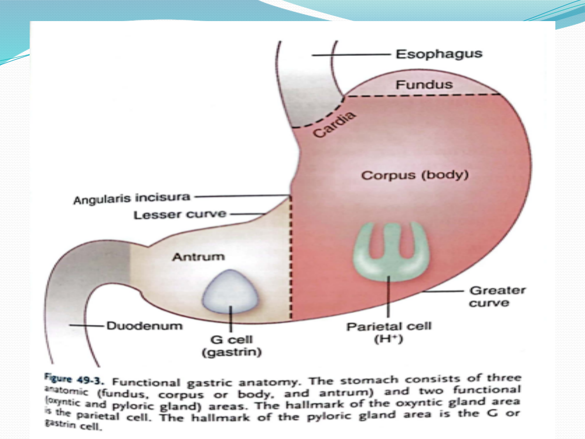

### Oksintik Gland (Fundus ve Korpus)

* **Parietal hücre** → HCl (H⁺) salgılar
* **Chief hücre** → Pepsinojen salgılar
* **ECL hücre** (Enterochromaffin-like) → Histamin salgılar
* **D hücre** → Somatostatin salgılar
* **Mukus boyun hücreleri** → Mukus salgılar
* **Enterokromaffin hücre** → ANP (atrial natriüretik peptid)

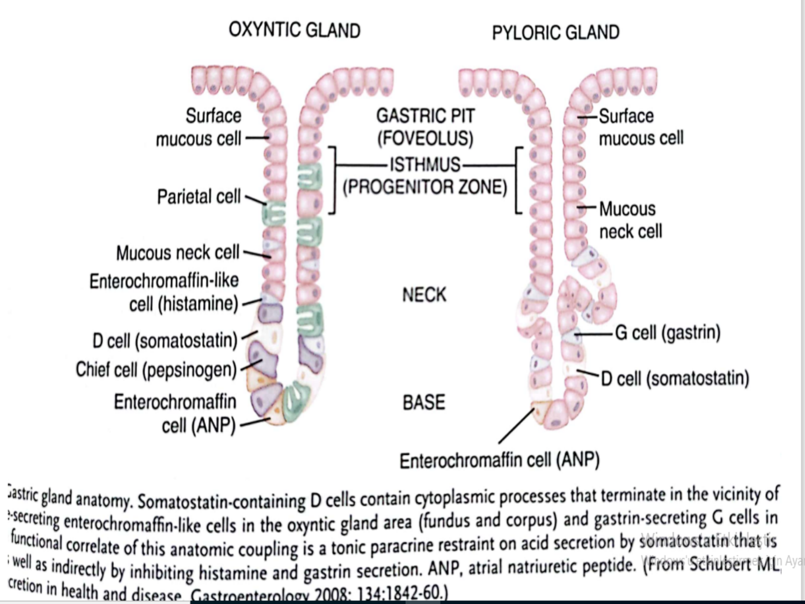

### Pilorik Gland (Antrum)

* **G hücre** → Gastrin salgılar
* **D hücre** → Somatostatin salgılar
* Mukus boyun hücreleri
* Enterokromaffin hücre (ANP)

### Asit Sekresyonunun Düzenlenmesi

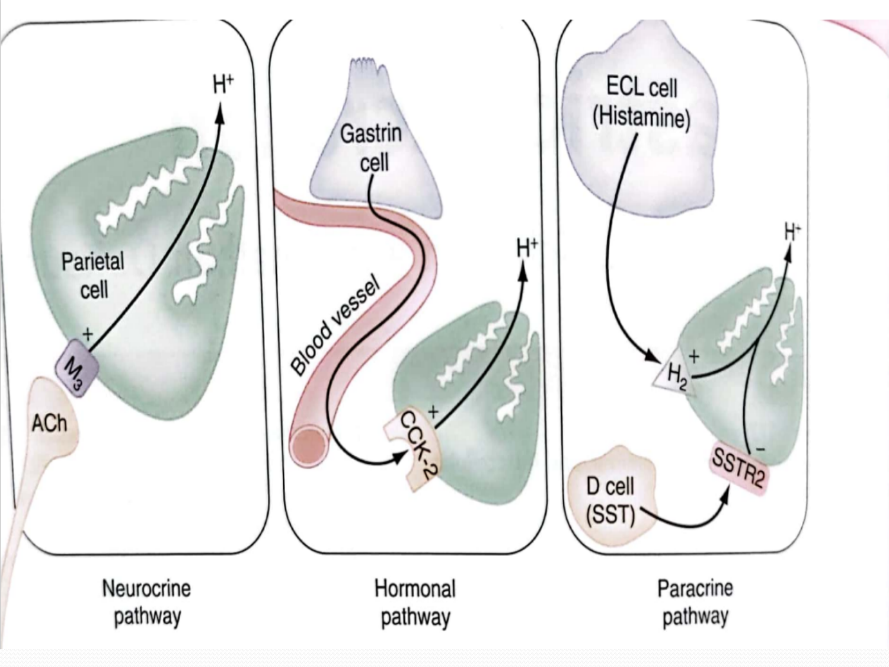

Parietal hücreden asit sekresyonu üç yolak ile uyarılır:

* **Nörokrin yolak:** Asetilkolin (ACh) → M₃ reseptörü → Parietal hücre → H⁺
* **Hormonal yolak:** Gastrin hücresi → kan damarı → CCK-2 reseptörü → Parietal hücre → H⁺
* **Parakrin yolak:** ECL hücresi (Histamin) → H₂ reseptörü → Parietal hücre → H⁺
  - D hücresi (Somatostatin) → SSTR2 reseptörü ile **inhibisyon** yapar

---

# GASTRİT

* Akut gastrit
* Kronik gastrit

---

## AKUT GASTRİT

Mide mukozasının akut inflamasyonudur. Antrum ve korpus mukozasının **polimorfonükleer hücre infiltrasyonu** ile karakterizedir.

* Genel olarak **erozif** ve **non-erozif** olarak sınıflandırılabilir
* Mide içinde tutulan yere göre de sınıflandırılabilir (antrum, korpus ve fundus)

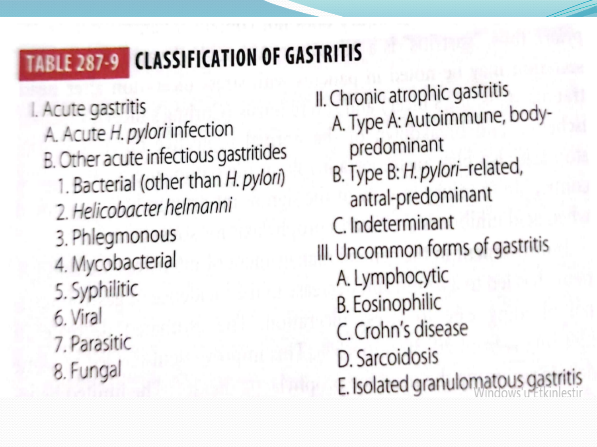

### Gastrit Sınıflaması

**I. Akut gastrit:**
* Akut *H. pylori* enfeksiyonu
* Diğer akut enfeksiyöz gastritler: Bakteriyel (H. pylori dışı), *H. helmanni*, flegmonöz, mikobakteriyel, sifiliz, viral, parazitik, fungal

**II. Kronik atrofik gastrit:**
* Tip A: Otoimmün, korpus predominant
* Tip B: *H. pylori* ilişkili, antral predominant
* C: İndeterminant

**III. Nadir gastrit formları:**
* Lenfositik, eozinofilik, Crohn hastalığı, sarkoidoz, izole granülomatöz gastritis

### Akut Gastrit Nedenleri

* **NSAİD** (aspirin, naproksen, ibuprofen)
* Alkol
* Sigara
* Bakteriyel enfeksiyonlar (*H. pylori*, streptokokus, stafilokokus, proteus, clostridia türleri, E. coli)
* Tbc
* Sifiliz
* CMV
* Fungal nedenler (C. albicans, histoplazmozis)
* Kimyasal ajanlar ve irritan ilaçlar
* Şok
* Üremi

### Patofizyoloji

* Mide asit yapımında azalma
* Bikarbonat yapımında azalma
* Mukozal kan akımında azalma
* Mukozal epitelde hasar

### Akut Eroziv Gastrit

* En sık sebepler: **NSAİD, alkol, akut stres**
* Endoskopide midenin derin tabakalarına penetre olmayan ve submukozal peteşilerle birlikte olan yüzeyel erozyonlar saptanır

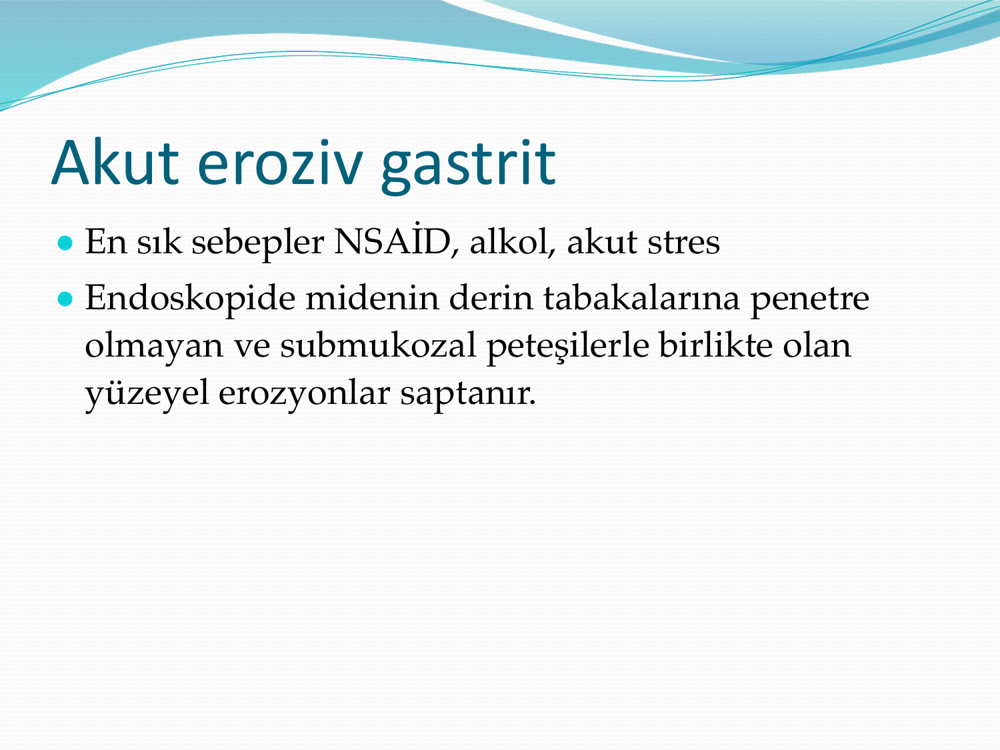

### Akut Hemorajik Gastrit

* Etiyoloji akut eroziv gastrit ile benzer (NSAİD, alkol, kortikosteroid, şok, iskemi)
* Endoskopide yaygın kanama odakları izlenir

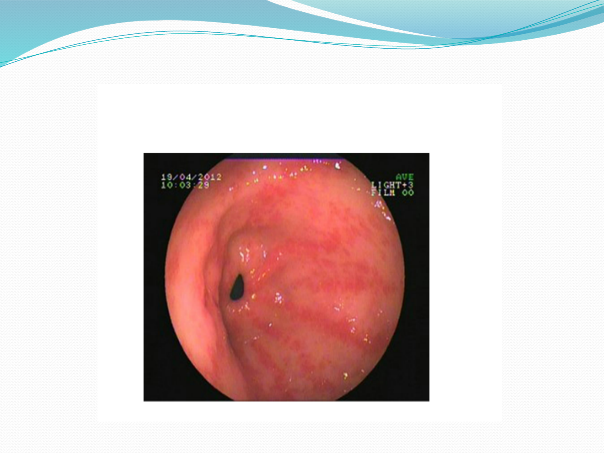

### Akut Stres Gastriti

* Özellikle yaşlı hastalarda görülen eroziv gastrit formudur
* Endoskopide ilk **12 saat** içinde şiddetli erozyonlar, korpusta peteşi ve ekimozlar izlenebilir
* Şiddetli yanıklar
* SSS travması
* Sepsis, şok, mekanik ventilasyona bağlı hastalar
* Multiorgan yetmezlik

### Özel Formlar

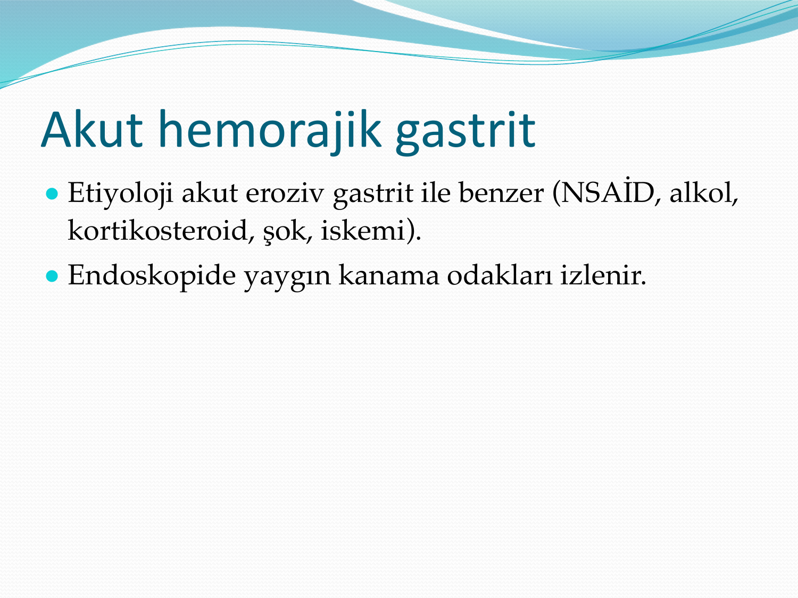

* **Süpüratif gastrit:** Yaygın streptokokal enfeksiyon veya viral enfeksiyonlar sonucu oluşabilir. Mide duvarında kalınlaşma, mukozada kanama ve fibropurulan exuda izlenebilir
* **Amfizematöz gastrit:** Gaz oluşturan bakterilere bağlı olarak oluşur. İçi hava dolu kistik boşluklar ve süpüratif gastritisde bulunan özellikler bulunur

### Klinik

* Tüm yaş gruplarında, kadın ve erkeklerde eşit sıklıkta
* Bulantı
* Kusma
* Epigastrik ağrı
* Süpüratif gastritlerde şiddetli epigastrik ağrı, bulantı, pürülan gastrik muhteva içeren kusma, hıçkırık, ateş, üşüme saptanır

### Teşhis

* **Laboratuar:** Gastritisi yapan temel patolojiye bağlıdır
* **Radyolojik çalışmalar:** Mide grafilerinde pililerde kalınlaşma, USG-BT'de mide duvar kalınlaşması
* **Diğer testler:** H. pylori tanı testleri (invazif, noninvazif) kullanılır
* **Endoskopi:** Mukoza frajil, kanamalı, pililerde kalınlaşma, ödem, erozyon ve pililerde kızarıklık saptanır

### Tedavi

* Akut gastritis ile ilgili özel bir neden saptanırsa tedavi et
* H2RA (H2 reseptör antagonistleri)
* PPI (Proton pompa inhibitörleri)
* Anti-asit / Sukralfat
* H. pylori saptanırsa tedavi et

---

## KRONİK GASTRİT

* Mide mukozasının kronik inflamasyonu (monosit, lenfosit, makrofaj)
* Atrofi (mukozanın fonksiyonel kapasitesinin kaybı ile birlikte) veya metaplazi ile birliktedir
* Genelde **antrum tutulur** (G hücrelerinde kayıp ve gastrik sekresyonlarda azalma)
* Korpusta oksintik glandlarda kayıp sonucu **asid, pepsin ve intrensek faktör kaybı**

### Kronik Gastrit Nedenleri

**İnfeksiyöz gastrit:**
* *H. pylori* gastriti
* Viral enfeksiyonlar (CMV, H. simplex)
* Mikobakteriyozis
* Fungal enfeksiyonlar (histoplazmozis...)
* Paraziter enfeksiyonlar

**Non-infeksiyöz gastrit:**
* Otoimmun gastrit
* Kimyasal gastropati (alkalen safra reflüsü, NSAİD, aspirin)
* Üremik gastropati
* Non-infeksiyöz granülomatöz gastrit (Crohn, sarkoidoz...)
* Lenfositik gastrit
* Eozinofilik gastrit
* Radyasyon gastriti
* İskemik gastrit

---

### Kronik Gastrit, H. pylori

* **Antral predominant gastrit:** Peptik ülserli hastalarda sıktır
* **Multifokal atrofik gastrit:** Korpus ve antrumda progresif gastrik atrofi ve intestinal metaplazi ile birliktedir. Gastrik kanser ve gastrik ülser gelişen vakalarda bu tip gastritis görülür

---

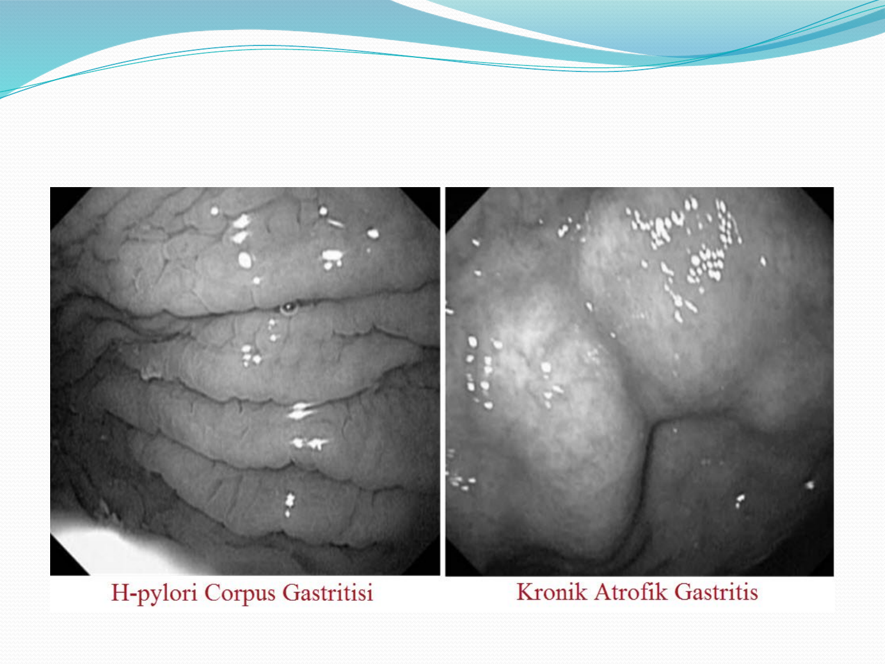

### Otoimmun Gastrit

* Mide korpusu progresif olarak atrofiye gider, İF eksikliği ve **pernisiyöz anemi** oluşur
* Serum **antiparietal** ve **antiintrensek faktör (İF) antikorları** mevcudiyeti ile birliktedir
* Vitamin B12 emilimi azalır
* Hücresel aracılı immünite olaya karışır, epitel hücre hasarı ve gastrik atrofi oluşur

---

### Kimyasal Gastropati

* Uzun süreli aspirin veya NSAİD's alınımı sonucu oluşur
* Mideye safra/pankreatik sıvı reflüsü

---

### Granülomatöz Gastrit (Non-infeksiyöz)

* Crohn hastalığı
* Sarkoidoz
* Wegener granülamatözü
* Yabancı cisim
* İzole granülomatöz gastritis

---

### Lenfositik Gastrit

* Mide yüzeyinin ve foveolar epitelin T hücrelerle yoğun infiltrasyonu ve L. propriada kronik infeksiyon bulguları mevcuttur
* H. pylori +/-
* Gluten (çölyak hastalığı) ve ticlopidine gibi ilaçlara karşı sekonder entolerans gelişebilir

---

### Eozinofilik Gastrit

* Eozinofilik gastroenteritlerin bir parçasını oluşturur
* Özellikle gastrik antrumda eozinofilik infiltrasyon mevcuttur
* Tutulum yerine göre 3 gruba ayrılır (mukoza, müsküler ve seroza tabakası)
* Hastaların kanlarında eozinofili mevcuttur
* **Mukozal tutulum:** Bulantı, kusma, kilo kaybı, anemi, protein kaybettiren enteropati
* **Müsküler tutulum:** Obstrüksiyon bulguları (pilor stenozu)
* **Serozal tutulum:** Eozinofilik asit gelişir

---

### Radyasyon Gastriti

* Radyasyona bağlı hasar akut (<6 ay) veya kronik (>1 yıl) olabilir
* Küçük dozda radyasyon (1500 R'a kadar) reversibl mukozal hasar yapar
* Yüksek dozdaki radyasyon iskemik ülserasyon ve atrofi ile karakterize **irreversibl** hasara neden olur

---

### İskemik Gastrit

* Kronik iskemik gastropati, çöliak ve süperior mezenterik arterlerdeki kronik iskemi ve aterosklerotik trombüs sonucu, özellikle yaşlılarda oluşur

---

### Kronik Gastrit, Klinik Bulgular

* **H. pylori gastriti:** Epigastrik ağrı, bulantı, kusma. Semptomlar kronik Hp gastritisine bağlı peptik ülser, gastrik karsinoma ve MALT lenfoma gibi komplikasyon gelişince daha belirgin hale gelir
* **Otoimmün gastritisler:** Klinik bulgular şiddetli gastrik atrofi sonucu İF eksikliği sonucu kobalaminin absorpsiyon eksikliğine bağlıdır. Hematolojik (megaloblastik anemi), gastrointestinal (dilde hassasiyet, kilo kaybı), nörolojik (ataksi, kaslarda zayıflık) bulgular gelişebilir
* **Granülomatöz gastritis:** Sistemik granülomatöz hastalığa bağlıdır. Çoğu vakada asemptomatiktir. Semptomatik olgularda gastrik ülser, hemoraji, pilorik striktür ve gastrik outlet sendrom gelişebilir
* **Eozinofilik gastroenteritis:** Muskularis proprianın tutulumu sonucu kalınlaşma ve rijidite oluşması, gastrik outlet semptomlarını oluşturur. Birçok hastada allerji, periferal eozinofili, astım, ekzema ve gıda sensitivitesi bulunur

### Kronik Gastrit, Tanı

* **Fizik muayene:** Megaloblastik anemiye ait bulgulara (hematolojik, nörolojik) rastlanabilir
* **Laboratuar:** Non-invaziv H. pylori tetkikleri yapılabilir. Otoimmün gastritis varlığı için serumda antiparietal ve anti-İF antikorları, aklorhidri (bazal ve stimüle), hipergastrinemi, düşük serum kobalamin (vit B12) düzey tayini ve Schilling testi yapılabilir
* **Üst GİS Endoskopisi:** Endoskopide nodülarite, intestinal metaplazi, atrofi saptanır
* **Biyopsi:** Kronik gastritin varlığı, sebebi, tipi, derecesi, Hp ve diğer bulgular hakkında bilgi verir

### Kronik Gastrit, Tedavi

* Etiyolojiye göre tedavi değişmektedir
* PPI
* Hp'e bağlı kronik gastritisde, Hp eradikasyonu için test ve tedavi prensibi uygulanmaktadır

---

---

# PEPTİK ÜLSER

---

## TANIM VE EPİDEMİYOLOJİ

* Mide veya duodenumda **muscularis mukozaya kadar uzanabilen mukozal defekt**
* ABD'de yılda **4 milyon** peptik ülser vakası, **15.000** ülser komplikasyonlarından ölüm
* 2/3'ten fazla hasta **25-64 yaş** arası
* Erkek populasyonda prevalans: **%12**
* Kadın populasyonda prevalans: **%10**

---

## PATOGENEZ

* **Multifaktöriyel**
* Koruyucu ve agresif faktör arasındaki dengenin bozulması ile ülser oluşur

### Mukozal Savunma Mekanizmaları

**Preepitelyal:**
* Mukus
* Bikarbonat
* Yüzey aktif fosfolipidler

**Epitelyal:**
* Hücresel direnç
* Restitüsyon
* Büyüme faktörleri, prostaglandinler
* Hücre proliferasyonu

**Subepitelyal:**
* Kan akımı
* Lökositler

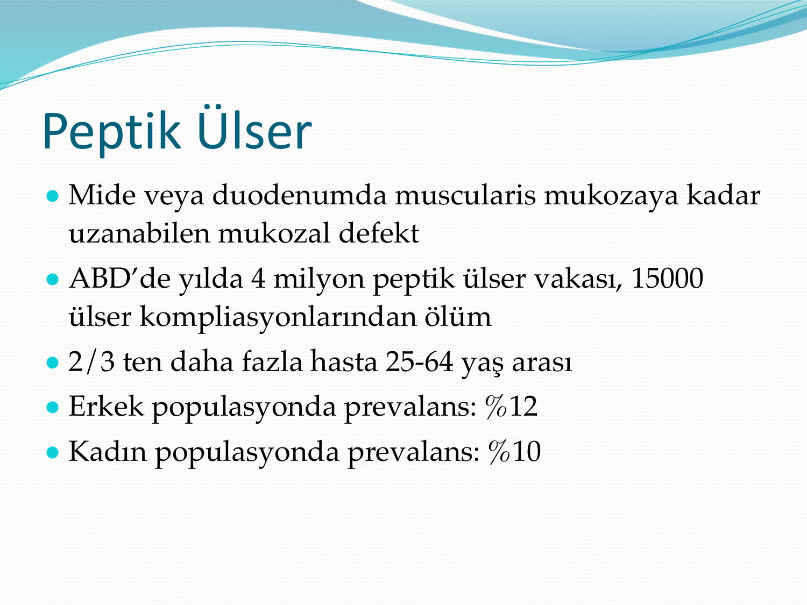

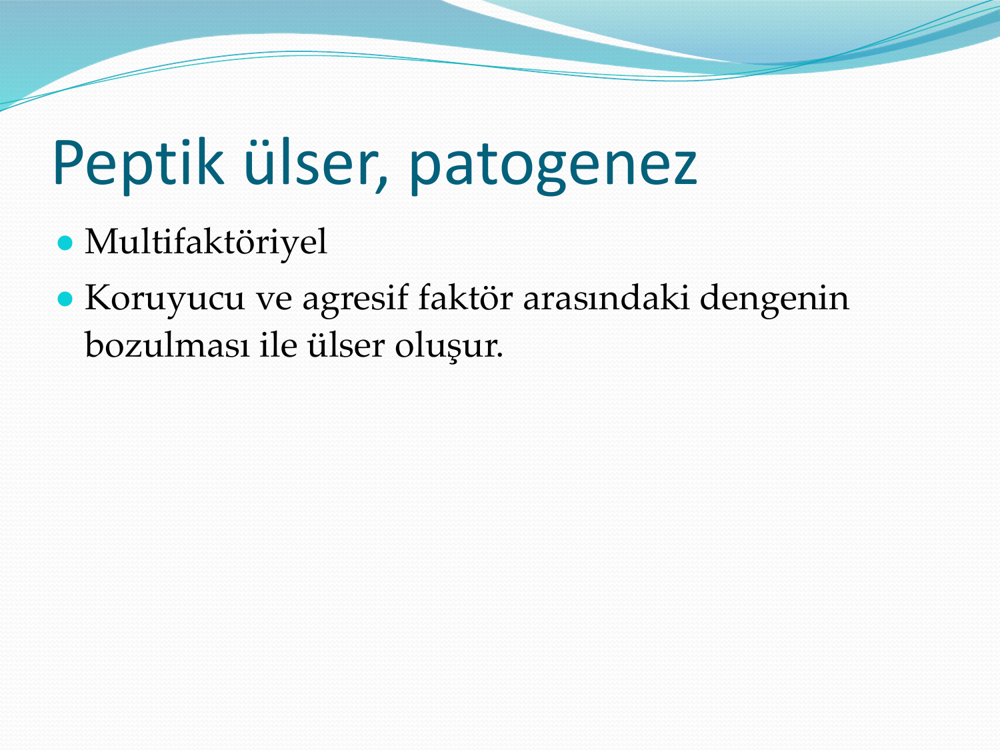

### Agresif Faktörler (Offense)

* H⁺ / Pepsin
* NSAİD'ler / Mikroplar
* Steroidler / Toksinler
* ROS (Reaktif oksijen türleri)
* Nötrofiller / Sitokinler

---

## PEPTİK ÜLSER NEDENLERİ

**En sık üç neden:**
1. **H. pylori**
2. **NSAİD's**
3. **Aspirin**

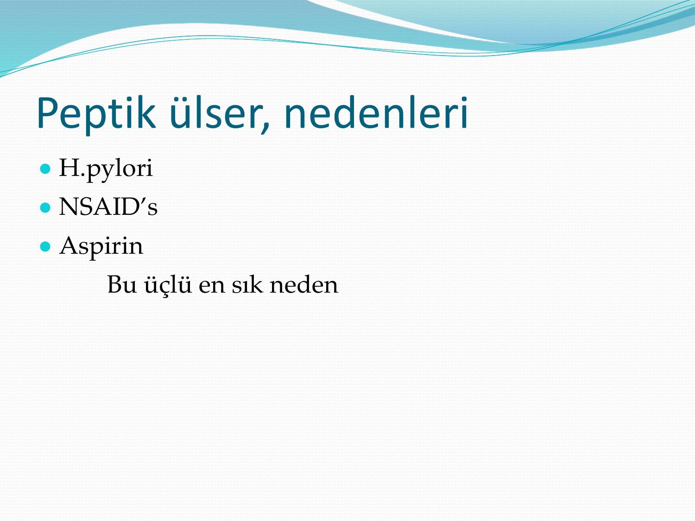

### Diğer Risk Faktörleri

* Diğer ilaçlar (potasyum klorür, steroidlerle birlikte NSAİD kullanımı, bifosfonatlar, sirolimus, mikofenolat mofetil, fluorourasil)
* Neoplazi
* Asit hipersekretuar bozukluklar (Zollinger-Ellison sendromu)
* Hiperparatiroidizm
* Crohn hastalığı
* Sarkoidoz
* Miyeloproliferatif bozukluklar
* Sistemik mastositoz
* Nadir enfeksiyonlar (CMV, herpes simpleks, tüberküloz)
* Kritik hastalar (şiddetli yanıklar, kafa travması, fiziksel travma, multiorgan yetmezlik)

---

## H. PYLORİ

* **Spiral, gram (-), üreaz üretebilen** bakteri
* Mukus tabakası ile gastrik epitel arasında bulunur
* H. pylori, üreaz sayesinde mukus tabakasının alkali kalmasını sağlar
* Multipl çevresel faktörler H. pylori'nin mide mukozasına karşı saldırgan tutum almasını sağlıyor
* Düşük sosyoekonomik düzey H. pylori için risk faktörü
* Gelişmekte olan ülkelerde prevalansı, gelişmiş ülkelerden yüksek

### H. pylori ve Hastalık İlişkisi

* Çoğu infekte hasta **asemptomatik**
* **%10-%15** hastada peptik ülser geliştirir
* H. pylori ile ilişkili **4 grup hastalık:**
  1. Kronik gastrit
  2. Peptik ülser
  3. MALT (mukoza ilişkili lenfoid doku) lenfoma
  4. Gastrik adenokarsinom

### H. pylori ve Ülser İlişkisi

* **%70-90** duodenal ülser ilişkisi
* **%30-60** gastrik ülser ilişkisi
* H. pylori eradikasyonu ülser rekürensini **%10'nun altına** düşürüyor
> Neden önemli? Eşlik ediyorsa eradike t ğlser tekrarını negelle. 

---

## DUODENAL ÜLSER ve GASTRİK ÜLSER FARKLARI

| Özellik         | Duodenal Ülser                                        | Gastrik Ülser                                         |
| --------------- | ----------------------------------------------------- | ----------------------------------------------------- |
| Lokalizasyon    | Bulbus veya pilor kanalı                              | Antrum, antrum-korpus bileşkesi, küçük kurvatur       |
| Yaş             | Daha genç, **30-55 yaş**                              | Daha yaşlı, **55-70 yaş**                             |
| Asit sekresyonu | **Artmış** (pariyetal cell mass ↑)                    | Normal veya **azalmış**                               |
| Patofizyoloji   | Bulbusta gastrik metaplazi → Hp kolonizasyonu → ülser | Mukozal savunma bozulması                             |
| Ağrı            | Yiyecek-süt-antiasit sonrası **2-4 saat rahatlar**    | Yiyecek alımı sonrası **artar**, mide boşken rahatlar |
| Kilo            | Değişmez/artar                                        | **Kilo kaybı** (yemekten korkma)                      |
| Malignite riski | **Yok**                                               | **%5 civarı**                                         |

---

## KLİNİK BULGULAR

### Semptomlar

* **Epigastrik ağrı** (klasik semptom)
* **Açlık ağrısı**, kemirici-sıkıcı tarzda
* Ağrılar zaman zaman geldiği için teşhisi bazen haftalar/aylar alabilir

> Bu ağrılar sürekli değil. 

### Komplikasyonu Düşündüren Bulgular

* Ağrı karakterinde değişiklik/şiddetlilik ve süreklilik → Komplikasyonu düşündürebilir (perforasyon, penetrasyon)
* Melena/hematemez/anemi → Kanamayı düşündürmeli
* Kusma → Obstruksiyonu akla getirmeli
* Sırta vuran şiddetli üst kadran ağrısı → Penetrasyon
* Ciddi hassas batın → Perforasyon

### Fizik Muayene

* Fizik muayene çoğu zaman normal, deep palpasyonla hassasiyet alınabilir
* Rektal tuşede melena veya GGK +liği kanamayı düşündürür
* Kanamaya taşikardi ve ortostaz bazen eşlik edebilir
* Batında yaygın hassasiyet ve rijidite → Perforasyon ve/veya penetrasyon
* Distandü abdomen → Gastrik outlet obstrüksiyon

---

## TANI

### Endoskopi

**Alarm semptomu olanlara endoskopi en erken dönemde yapılmalı:**
* 45 yaşın üstünde ise
* Anemi varsa
* Kanama varsa; dışkıda siyah renkli dışkı (melena) veya kanlı dışkı (hematokezya)
* Erken doyma
* Kilo kaybı
* 1.akrabalarda mide kanseri öyküsü

**Gastrik ülser hastalarında:**
* Malignleşme potansiyeli (**%5 civarı**) nedeni ile ülserden endoskopi ile biyopsi alındıktan sonra asit baskılayıcı tedavi sonrası **12. haftada** ülserin tamamen iyileştiği kontrol edilmelidir

**Duodenal ülserde:**
* Malignleşme potansiyeli yok → Endoskopi tekrarına gerek yok

**Alarm semptomu olmayan hastalar:**
* Ülser şüphesi olan hastalarda non-invaziv H. pylori testi yapılmalı, pozitifse tedavi edilmeli, negatif ise asit baskılayıcı tedavi verilmeli, tedavi yanıtı olmadığı durumlarda endoskopi istenmeli

**⚠️ ÖNEMLİ:** Endoskopide multiple ülser, refrakter ülser (tedavi sonrası endoskopi kontrolünde iyileşmemiş ülser), beklenen yerde olmayan ülser (post-bulber/jejenum) ve diyare/kilo kaybı gibi şikayetler varsa **Zollinger-Ellison sendromu** düşün

### Baryumlu Grafi

* Endoskopiye göre güvenli ve ucuz
* Biyopsi olanağı yok, tanıda endoskopi kadar güçlü değil, kanamalı hastalar için müdahale şansı yok

### H. Pylori Tanı Testleri

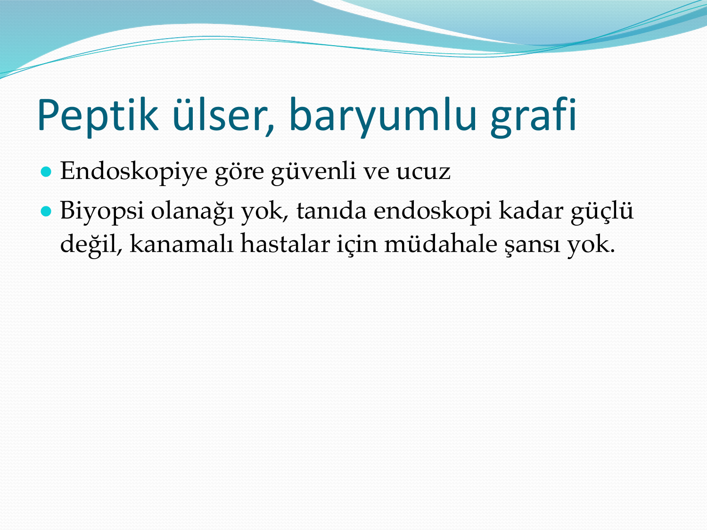

**Non-invaziv Testler:**

| Test                   | Duyarlılık (%) | Özgüllük (%) | Yorum                                                                                |
| ---------------------- | -------------- | ------------ | ------------------------------------------------------------------------------------ |
| Serolojik ELISA        | 85             | 79           | Hp'ye maruziyeti gösterir, tedavi sonrası kür doğrulaması yapılamaz                  |
| **Üre nefes testi**    | **95-100**     | **91-98**    | Tarama ve kür doğrulaması için önerilir; antibiyotik ve PPI yanlış negatif yapabilir |
| Hp dışkı antijen testi | 91-98          | 94-99        | İlk tanı ve kür doğrulaması için kullanılabilir                                      |

**İnvaziv Testler (Endoskopi ile biyopsi):**

| Test                         | Duyarlılık (%) | Özgüllük (%) | Yorum                                                                  |
| ---------------------------- | -------------- | ------------ | ---------------------------------------------------------------------- |
| Histoloji                    | >95            | 95-98        | En yaygın; antrumdan en az 2, korpustan 1 biyopsi ile duyarlılık artar |
| Hızlı üreaz testi (CLO test) | 93-97          | 95-100       | GİS kanamalı hastalarda doğruluk azalır                                |
| Kültür                       | 70-80          | 100          | Teknik olarak zor; laboratuvarlar arası duyarlılık farklı              |

---

## KOMPLİKASYONLAR

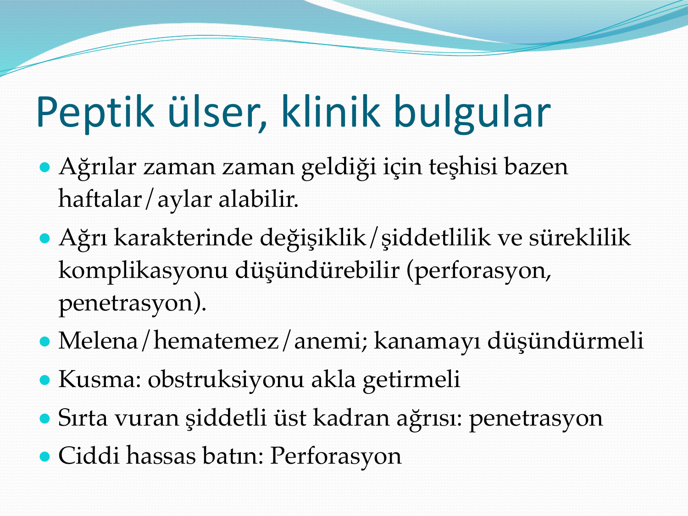

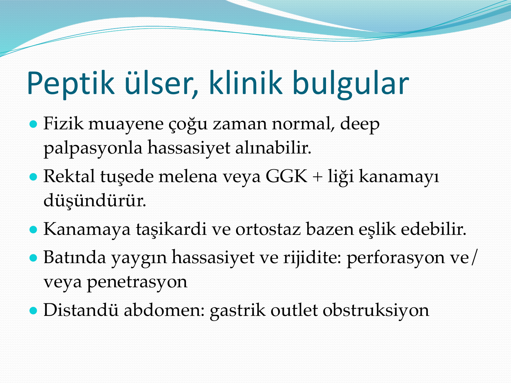

| Komplikasyon          | Sıklık |
| --------------------- | ------ |
| **Hemoraji** (en sık) | %15    |
| Perforasyon           | %7     |
| Penetrasyon           | -      |
| Obstrüksiyon          | %2     |

* **Penetrasyon:** Duodenal ülser pankreasa, gastrik ülser karaciğer sol lobuna penetre olabilir
* **Obstrüksiyon:** Gastrik outlet obstrüksiyonu

---

## TEDAVİ

### Peptik Ülser Tedavisi

* Ülser tedavisinde amaç: Ülseri iyileştirmek, ülser rekürensini ve komplikasyonlarını engellemek
* Tüm ülser hastalarında H. pylori bakılmalı ve tespit edilir ise tedavi edilmeli
* **Proton pompa inhibitörleri** (omeprazol, lansaprazol, pantoprazol, esomeprazol, rabeprazol)
* Kanama geliştiren ülserlerde **endoskopik tedavi** (epinefrin enjeksiyonu, koagulasyon, hemoklips)

### H. Pylori Tedavi Endikasyonları

**Kesin tedavi et (H. pylori tespit edilirse):**
* Aktif gastrik ve duodenal ülser
* Daha önce ülser hikayesi olanlar
* MALT lenfoma

**Tedavi ver (yararlılık düzeyi diğer grup kadar değil):**
* Gastrik adenokarsinom (erken dönem)
* Atrofik gastrit
* İntestinal metaplazi
* 1. akrabalarda gastrik adenokarsinom

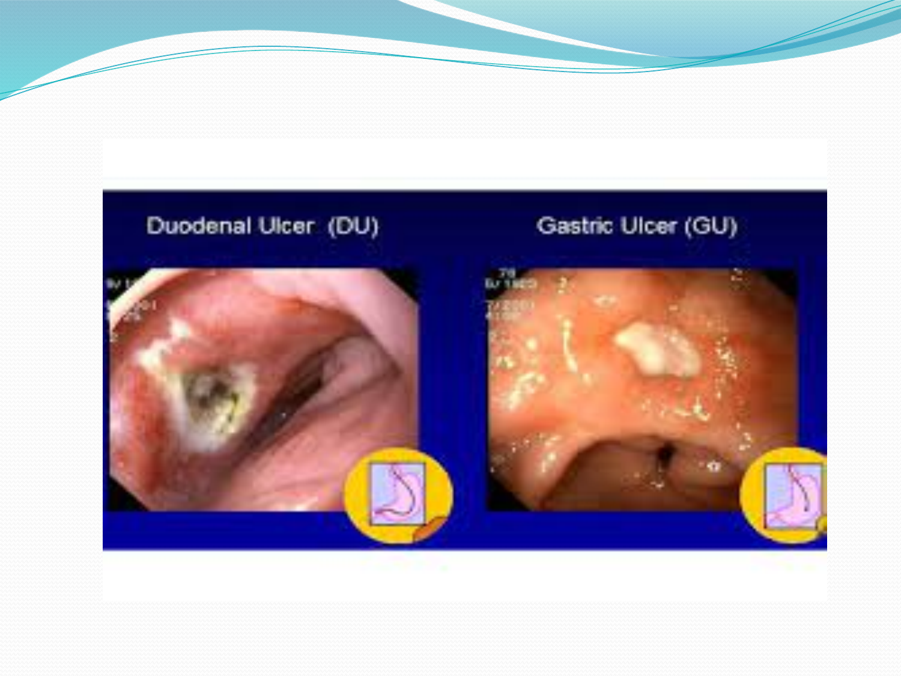

### H. Pylori Eradikasyon Rejimleri

| Rejim                                                                                                                                                 | Eradikasyon Oranı (%) | Yorum                                                                               |
| ----------------------------------------------------------------------------------------------------------------------------------------------------- | --------------------- | ----------------------------------------------------------------------------------- |
| **Üçlü tedavi:** PPI + Klaritromisin 500 mg 2x1 (veya Metronidazol 500 mg 2x1) + Amoksisilin 1 g 2x1, 7-14 gün                                        | **73-86**             | Birinci basamak tedavi; ABD'de en az 10 gün önerilir                                |
| **Üçlü tedavi (penisilin alerjisi):** PPI + Klaritromisin 500 mg 2x1 + Metronidazol 500 mg 2x1, 7-14 gün                                              | 70-85                 | Penisilin alerjisi olan hastalarda birinci basamak                                  |
| **Dörtlü tedavi:** Bizmut subsalisilat 525 mg 4x1 + Metronidazol 250 mg 4x1 + Tetrasiklin 500 mg 4x1 + PPI 2x1 (veya Ranitidin 150 mg 2x1), 10-14 gün | **75-90**             | Üçlü tedaviye yanıtsız hastalarda ikinci basamak                                    |
| **Levofloksasin bazlı üçlü tedavi:** PPI 2x1 + Levofloksasin 250-500 mg 2x1 + Amoksisilin 1 g 2x1, 10 gün                                             | 60-80                 | İkinci basamak veya kurtarma tedavisi için sık önerilir                             |
| **Ardışık tedavi:** PPI 2x1 + Amoksisilin 1 g 2x1 (ilk 5 gün) → PPI 2x1 + Klaritromisin 500 mg 2x1 + Tinidazol 500 mg 2x1 (sonraki 5 gün)             | **83-98**             | Genel eradikasyon >%90; ikinci basamak veya başlangıç tedavisi olarak düşünülebilir |
