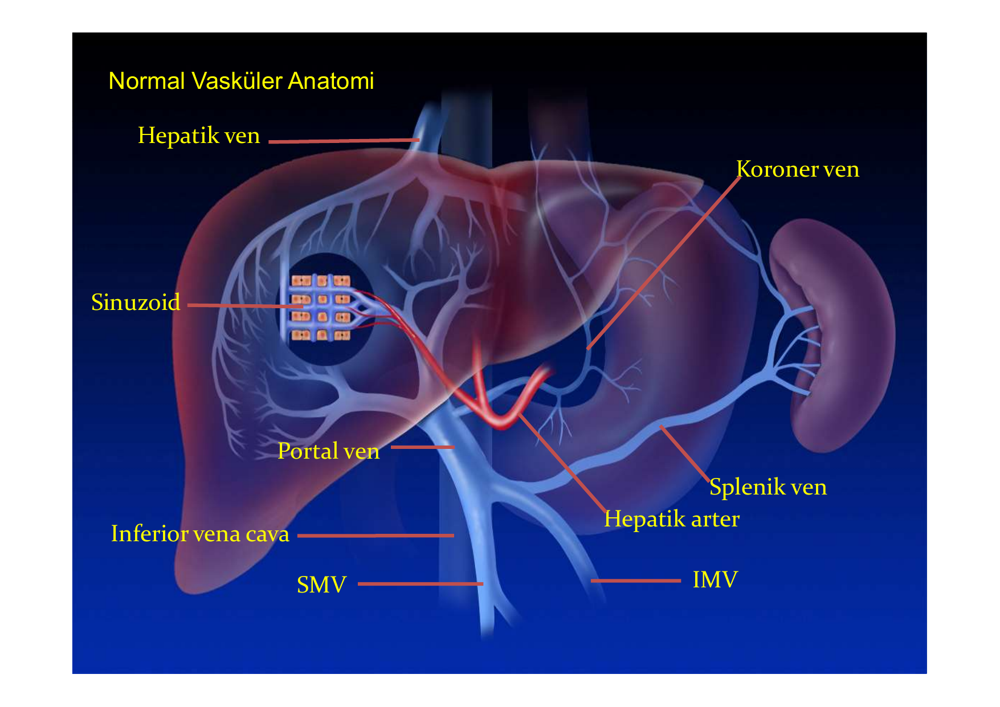
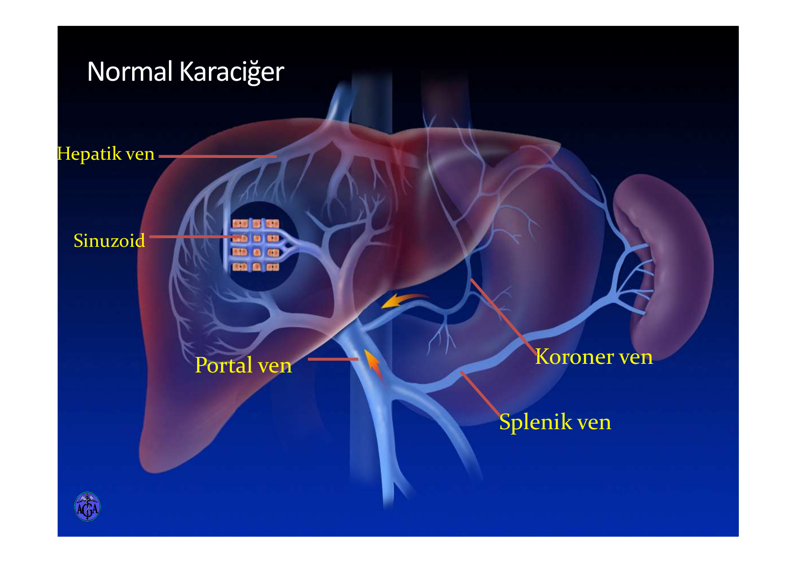
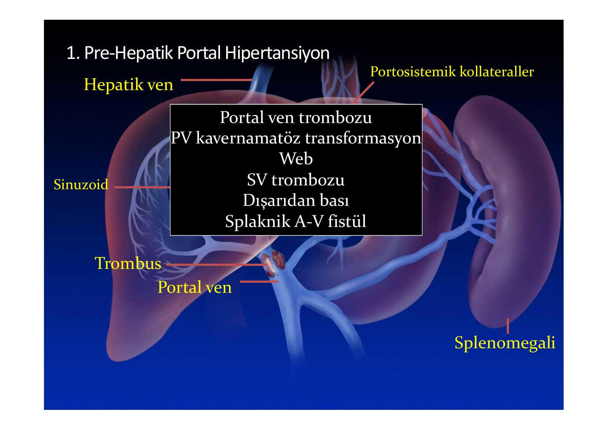
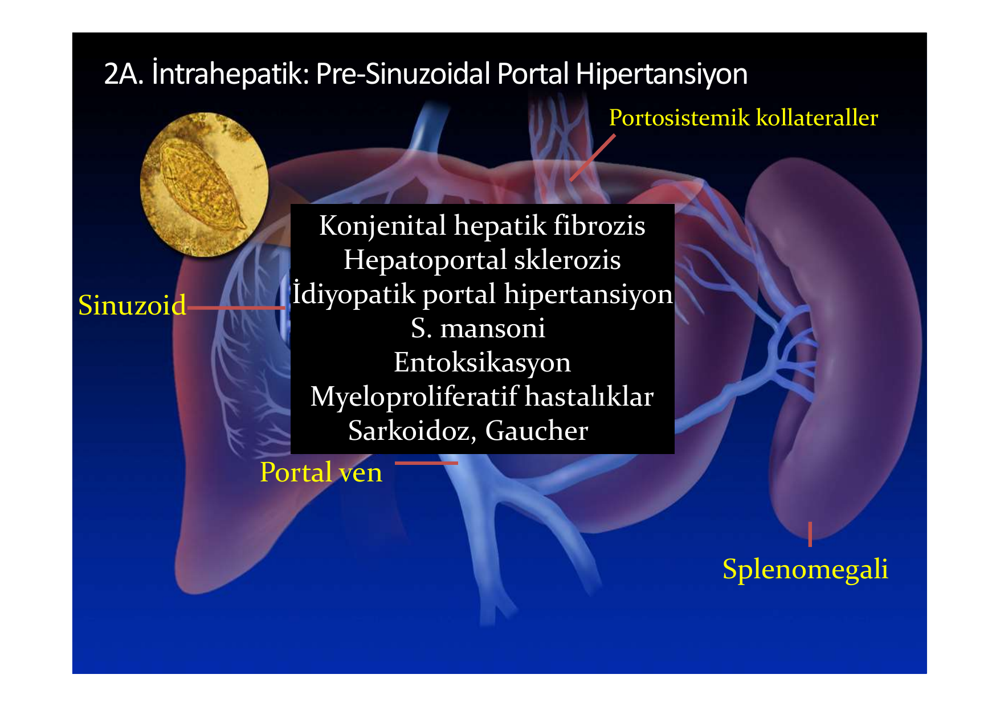
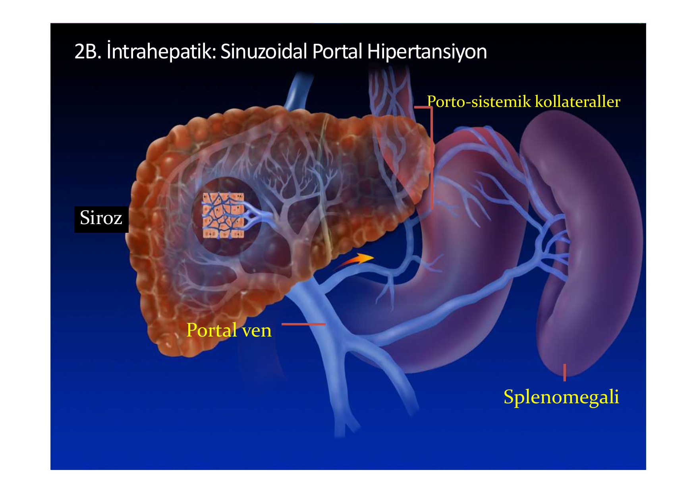
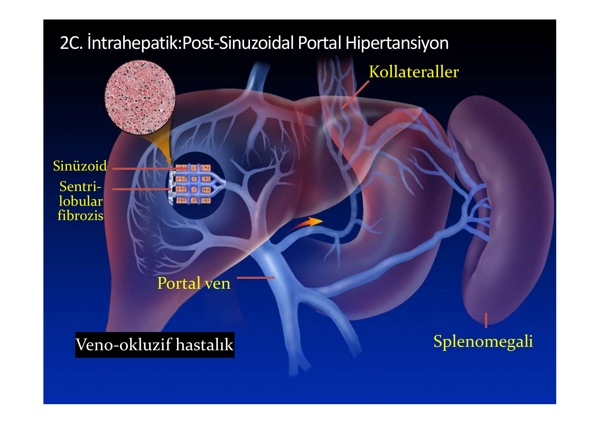
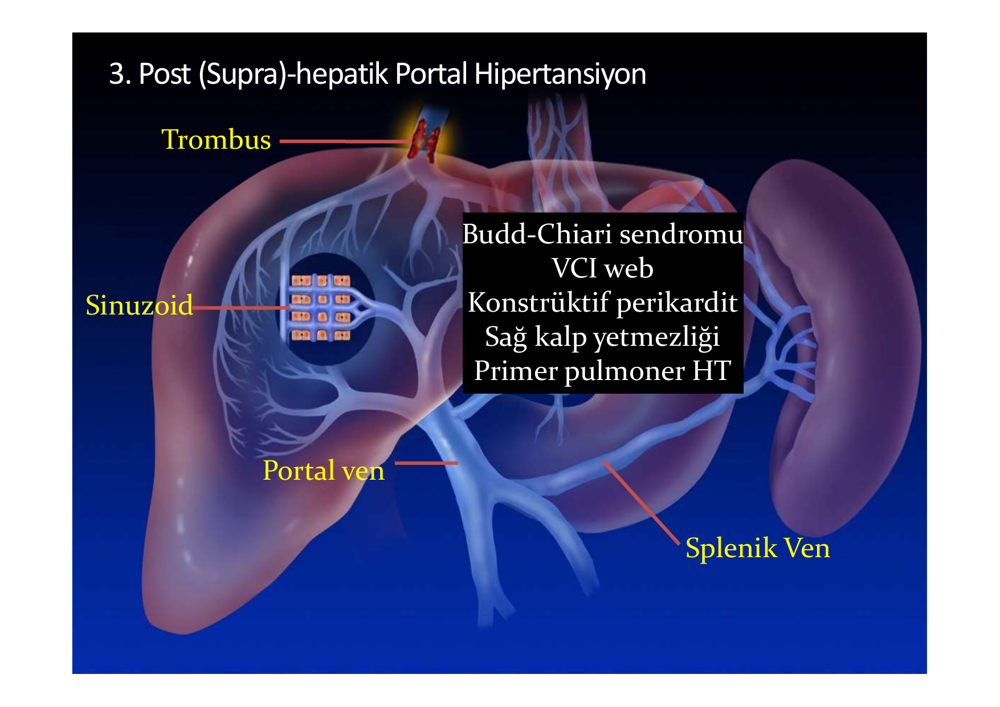

# PORTAL HİPERTANSİYON

**Hazırlayan:** Dr. İsmail Taşkıran
**Bölüm:** Gastroenteroloji

---

## İÇİNDEKİLER

1. [Giriş ve Anatomi](#giriş-ve-anatomi)
2. [Fizyopatoloji](#fizyopatoloji)
3. [Portal Hipertansiyon Sınıflaması](#portal-hipertansiyon-siniflamasi)
4. [PVS'de Tromboz Nedenleri](#pvsde-tromboz-nedenleri)
5. [Klinik Bulgular](#klinik-bulgular)
6. [Tanı](#tani)
7. [Tedavi](#tedavi)
8. [Klinik İpuçları ve Sınav Notları](#klinik-ipuçları-ve-sinav-notları)

---

## GİRİŞ VE ANATOMİ

### Portal Venöz Sistem (PVS)

Portal venöz sistem; barsak kapilerlerinden başlayan ve karaciğer sinüzoidlerinde sonlanan anatomik, vasküler yapıdır. Rektum alt kısmı hariç, tüm barsaklar, dalak, pankreas ve safra kesesinden gelen kan karaciğere taşınır. Portal sistem barsaklardan emilen besinler ile pankreastan salınan insülin ve glukagon gibi bazı hormonları yüksek konsantrasyonda direkt olarak karaciğere taşır.

> **Portal ven** = Süperior mezenterik ven (SMV) + Splenik ven (SV) birleşiminden oluşur

* Karaciğer kanının **2/3'ünü** (1000 mL) PVS'den, **1/3'ünü** (500 mL) hepatik arterden sağlar.
* Normal portal ven basıncı: **5-10 mmHg**
* Portal hipertansiyon tanımı: Portal basınç gradientinin (HVPG) **>5 mmHg** olması
* Klinik olarak anlamlı portal HT: **HVPG ≥10 mmHg** (varis oluşumu başlar)
* Varis kanaması riski: **HVPG ≥12 mmHg**

💡 **Hatırlatma:** Portal ven bir **fonksiyonel ven**dir, kapiller yataktan başlayıp başka bir kapiller yatakta (sinüzoidlerde) sonlanır. Vücuttaki diğer "portal sistem" hipofiz portal sistemidir.



### Portal Venöz Sistem Anastomozları

PVS ile diğer venöz sistemler arasında birçok noktada anastomozlar vardır. Bu anastomozlar normal olarak kanı PVS'e taşırlar. PHT geliştiğinde bu anastomozlar **genişleyerek kollateral dolaşım** oluşturur.

| Anastomoz Yeri | Portal Taraf | Sistemik Taraf | PHT'da Klinik Sonuç |
|---|---|---|---|
| Özofagogastrik bileşke | Sol gastrik ven (koroner ven) | Özofageal venler → Azygos ven | **Özofagus varisleri** ⚠️ |
| Mide fundusu | Short gastrik venler | Özofageal venler | **Gastrik varisler** |
| Göbek çevresi | Paraumblikal ven | Epigastrik venler | **Caput medusa** |
| Rektum | Süperior rektal ven (İMV) | Orta/İnferior rektal venler | **Rektal varisler** (hemoroid değil!) |
| Retroperiton | Mezenterik venler | Renal, gonadal, lumbar venler | Retroperitoneal kollateraller |

⚠️ **Dikkat:** PHT varlığında bu venler önem kazanır. PVS'de basınç arttığı zaman, sistem içindeki kan bu kollateraller aracılığı ile kaval sisteme (vena kava) ulaşmaya çalışır.

💡 **Sınav notu:** "Rektal varisler" ile "hemoroid" farklı şeylerdir! Rektal varisler PHT'a bağlıdır ve portal sistemle ilişkilidir. Hemoroid ise lokal bir vasküler patolojidir.

---

## FİZYOPATOLOJİ

Basınç (P), direnç (R) ve akım (F) ile doğru orantılıdır:

> **P = R x F**

**Portal hipertansiyon iki mekanizma ile gelişir:**

1. **Dirençte artış (yapısal + dinamik):**
   - **Yapısal komponent (%70):** Fibrozis, rejenerasyon nodülleri, kollajen birikimi → sinüzoidal alanı daraltır
   - **Dinamik komponent (%30):** Stellat hücre aktivasyonu → sinüzoidal konstrüksiyon (NO ↓, endotelin ↑)
2. **Akımda artış (hiperdinamik dolaşım):**
   - Splanknik vazodilatasyon (NO ↑, prostasiklinler ↑)
   - Plazma hacmi artışı
   - Kalp debisi artışı

💡 **Akılda kalması gereken:** Sirozda PHT'un %70'i geri dönüşümsüz yapısal değişikliklere, %30'u ise potansiyel olarak geri dönüşümlü dinamik komponentlere bağlıdır. Beta blokerler ve vazoaktif ilaçlar bu **%30'luk dinamik kısmı** hedef alır.

### Hiperdinamik Dolaşım Sendromu

Siroz + PHT olan hastalarda gelişen karakteristik dolaşım değişiklikleri:

```
Portal hipertansiyon
        ↓
Splanknik vazodilatasyon (NO ↑)
        ↓
Efektif arter kan hacmi ↓
        ↓
RAAS aktivasyonu + ADH ↑ + Sempatik aktivasyon ↑
        ↓
Na+ ve su retansiyonu → Plazma hacmi ↑
        ↓
Kalp debisi ↑ + Periferik direnç ↓
        ↓
HİPERDİNAMİK DOLAŞIM
(Yüksek kalp debisi, düşük periferik direnç, düşük TA)
        ↓
Portal akım daha da artar → PHT kısır döngüsü
```

⚠️ Bu kısır döngü **asit**, **hepatorenal sendrom** ve **hepatopulmoner sendrom** gibi komplikasyonların temelini oluşturur.

---

## PORTAL HİPERTANSİYON SINIFLAMASI

Portal hipertansiyon, tıkanıklığın karaciğer sinüzoidlerine göre yerine göre sınıflandırılır:

| Sınıf            | Alt sınıf       | HVPG       | Asit    | En sık neden          |
| ---------------- | --------------- | ---------- | ------- | --------------------- |
| **Prehepatik**   | —               | Normal     | Nadir   | PV trombozu           |
| **İntrahepatik** | Pre-sinuzoidal  | Normal     | Nadir   | Şistozomiyaz          |
| **İntrahepatik** | Sinuzoidal      | **Yüksek** | **Sık** | **Siroz** ⭐           |
| **İntrahepatik** | Post-sinuzoidal | **Yüksek** | **Sık** | Veno-okluzif hastalık |
| **Posthepatik**  | —               | Normal*    | **Sık** | Budd-Chiari           |

*Not: HVPG posthepatik sebeplerde normal olabilir çünkü hem wedge hem free hepatik ven basıncı artar.*

💡 **Sınav İpucu:** HVPG (hepatik venöz basınç gradienti) = Wedge basınç − Free hepatik ven basıncı. HVPG **sadece sinüzoidal ve post-sinüzoidal** nedenlerde artar. Pre-sinuzoidal ve prehepatik nedenlerde HVPG normal kalır!

### 1. Prehepatik



**Nedenler:**
* **Portal ven trombozu** (en sık prehepatik neden)
* PV kavernamatöz transformasyon (kronik PV trombozunun sonucu)
* Web
* Splenik ven (SV) trombozu → **Sol taraflı (sinistral) PHT**
* Dışarıdan bası (tümör, LAP)
* Splanknik A-V fistül (artmış akım nedeniyle)



**⚠️ Prehepatik PHT'un önemli özellikleri:**
* Karaciğer fonksiyonları **normaldir** (KCFT normal)
* Asit genellikle **olmaz** (sinüzoidal basınç normal)
* Splenomegali **belirgindir**
* Varis kanaması olabilir ama prognoz sirotik PHT'dan **daha iyidir**

---

### 2. İntrahepatik

#### 2A. Pre-sinuzoidal

**Nedenler:**
* Konjenital hepatik fibrozis
* Hepatoportal sklerozis
* İdiyopatik portal hipertansiyon (non-sirotik PHT)
* *S. mansoni* (şistozomiyaz) — dünyada en sık pre-sinuzoidal neden
* Entoksikasyon (arsenik, vinil klorür, bakır)
* Myeloproliferatif hastalıklar
* Sarkoidoz, Gaucher hastalığı



💡 **Sınav notu:** Şistozomiyaz (S. mansoni) pre-sinuzoidal PHT yapar. Yumurtalar portal venlerin küçük dallarında granülom ve fibrozis oluşturur. Karaciğer fonksiyonları **uzun süre korunur** çünkü hepatositler direkt etkilenmez. Bu nedenle "pipe-stem fibrosis" (Symmers fibrozisi) denilir — siroz değildir!

#### 2B. Sinuzoidal

**⭐ En sık neden: SİROZ** (portal hipertansiyonun genel olarak en sık nedeni)

Siroz → Fibrozis ve rejenerasyon nodülleri sinüzoidleri sıkıştırır → Direnç artar



#### 2C. Post-sinuzoidal

**Nedenler:**
* **Veno-okluzif hastalık (sinüzoidal obstrüksiyon sendromu):**
  - Kemik iliği transplantasyonu sonrası
  - Pyrrolizidin alkaloidleri (bush tea)
  - Azatioprin, siklofosfamid
* Sentrilobular fibrozis (alkolik hepatit)



💡 **Sınav notu:** Veno-okluzif hastalık özellikle **kemik iliği nakli sonrası** sorulur. Hepatomegali, asit, sarılık triadı ile prezente olur. Sinüzoidal endotel hasarı ve santral ven tıkanıklığı ile karakterizedir.

---

### 3. Posthepatik (Suprahepatik)

**Nedenler:**
* **Budd-Chiari sendromu** (hepatik ven trombozu) — en sık posthepatik neden
* VCI web (membranöz obstrüksiyon)
* Konstrüktif perikardit
* Sağ kalp yetmezliği
* Primer pulmoner hipertansiyon



**⚠️ Budd-Chiari Sendromu — Sık sorulan bilgiler:**
* **Triad:** Asit + hepatomegali + karın ağrısı
* Asit mayii protein miktarı **yüksektir** (eksüda, SAAG ≥1.1 ama protein >2.5 g/dL)
* En sık neden: **Myeloproliferatif hastalıklar** (polisitemia vera, esansiyel trombositoz)
* Kaudat lob hipertrofisi (kendi hepatik veni ayrı olduğu için korunur) → sınavda BT/MR sorusu
* Tanı: Doppler USG, BT/MR anjiografi
* Tedavi: Antikoagülasyon, TİPS, karaciğer transplantasyonu

---

## PVS'DE TROMBOZ NEDENLERİ

* İntraabdominal infeksiyonlar (pileflebit, apandisit, divertikülit)
* **Hiperkoagülabl durumlar** (en sık araştırılması gereken):
- Myeloproliferatif hastalıklar (Polisitemia vera, Esansiyel trombositoz)
- Faktör V Leiden mutasyonu
- Protein C, Protein S, Antitrombin III eksiklikleri
- Antifosfolipid sendromu
- Paroksismal noktürnal hemoglobinüri (PNH)
* Travma
* Retroperitoneal fibrozis
* İntraabdominal cerrahi sonrası
* Behçet hastalığı
* Tümör invazyonu ve basısı (pankreas Ca, HCC)
* Siroz (staz + koagülasyon faktörü dengesizliği)
* Bilinmeyen nedenler (%25-30)

💡 **Klinik ipucu:** PV trombozu saptanan her hastada **myeloproliferatif hastalık** araştırılmalıdır (JAK2 V617F mutasyonu!). Bu, hem Budd-Chiari hem PV trombozu için geçerlidir.

---

## KLİNİK BULGULAR

### Başlıca Klinik Bulgular

| Bulgu | Açıklama | Sıklık |
|---|---|---|
| **Asit** | Sinüzoidal/post-sinuzoidal PHT'da belirgin | ⭐⭐⭐ |
| **Kollateral (portal tip)** | Özofagus varisleri, caput medusa | ⭐⭐⭐ |
| **Splenomegali / Hipersplenizm** | Tüm PHT tiplerinde | ⭐⭐⭐ |
| Hepatomegali | Budd-Chiari, konjesyon | ⭐⭐ |
| Üst GİS kanaması | Varis rüptürü, PHT gastropatisi | ⭐⭐ |
| Ensefalopati | Porto-sistemik şantlara bağlı | ⭐⭐ |
| Kronik Kc. hastalığı bulguları | Spider anjiom, palmar eritem, jinekomasti | ⭐⭐ |

### Asit

* **Asit oluşum mekanizması (sirozda):**
  1. Sinüzoidal basınç ↑ → Lenf üretimi ↑
  2. Splanknik vazodilatasyon → Efektif arter hacmi ↓
  3. RAAS aktivasyonu → Na+ ve su retansiyonu
  4. Hipoalbüminemi → Onkotik basınç ↓
* Budd-Chiari sendromunda oluşan asit mayii total protein miktarı **yüksektir**
* Ancak ek bir faktör olan PV trombozu gibi karaciğere gelen kanı azaltan bir durum varsa, hastada asit görülmeyebilir

**⚠️ ÖNEMLİ — Asitte SAAG (Serum-Asit Albümin Gradienti):**

| SAAG ≥1.1 g/dL (Transüda) | SAAG <1.1 g/dL (Eksüda) |
|---|---|
| Siroz ⭐ | Peritoneal karsinomatoz |
| Kalp yetmezliği | Tüberküloz peritonit |
| Budd-Chiari | Pankreatik asit |
| Miksödem | Nefrotik sendrom |

### Kollateraller

* PHT'da kollaterallerin, göbek üzerindekilerinin akım yönü **yukarıya**, altındakilerin ise **aşağıya** doğrudur (hepatofugal)
* **Kaval tip:** Karnın yan taraflarında ve sırtta görülen ve akım yönü aşağıdan **yukarıya** olan kollateraller → **VCI tıkanmalarında** ortaya çıkar
* **Caput medusa:** Umblikal venin rekanalizasyonu sonucu oluşur ve saptanması **intrahepatik PHT'un göstergesidir**

💡 **Sınav İpucu — Kollateral akım yönü ayrımı:**

| Tip | Lokalizasyon | Akım yönü | Neden |
|---|---|---|---|
| **Portal tip** | Göbek etrafı, radyal | Göbekten **dışa** doğru | İntrahepatik PHT (siroz) |
| **Kaval tip** | Karın yan + sırt | Aşağıdan **yukarı** | VCI obstrüksiyonu |

### Sol Portal Hipertansiyon (Sinistral PHT)

* Endoskopide özefagus varisi yok, **sadece gastrik fundal varis** varsa → **Splenik ven trombozunu** düşündürür
* SOL PHT olarak adlandırılır
* En sık neden: **Pankreatit** (özellikle kronik pankreatit)
* Tedavisi: **Splenektomi** (küratif!)

💡 **Klasik sınav sorusu:** "Kronik pankreatit hastasında izole gastrik varis kanaması" → Sol PHT → Splenik ven trombozu → Splenektomi

### Splenomegali ve Hipersplenizm

* Üst GİS kanaması geçiren hastada splenomegali varlığı aksi ispatlanana kadar PHT'u düşündürür
* ⚠️ Ancak PHT'a bağlı kanama sonrası dalak **küçülebilir**! (hipovolemi nedeniyle)
* **Hipersplenizm bulguları:** Pansitopeni (özellikle trombositopeni ön planda)

### Ensefalopati

* Karaciğer sirozunda dekompanzasyon belirtisidir
* Hastada KCFT normal, ancak sık ensefalopati atakları varsa → **doğal şuntlar** (portosistemik) vardır
* **Tetikleyiciler:** GİS kanama, enfeksiyon, konstipasyon, aşırı protein alımı, sedatifler, hipokalemi, alkaloz

---

## TANI

### Tanı Yöntemleri

1. **Anamnez** — Alkol, hepatit, trombofili öyküsü
2. **Fizik muayene** — Splenomegali, asit, kollateral, spider anjiom
3. **Üst GİS endoskopisi** — Varis tespiti ve derecelendirme (altın standart)
4. **Laparoskopi** — Karaciğer yüzeyi değerlendirmesi (sonradan)
5. **Portal basınç ölçülmesi** — HVPG (sonradan)
6. **Radyolojik incelemeler:**
   - **A. Noninvazif yöntemler:** USG / Doppler US, CT, MRI
   - **B. İnvazif yöntemler:**
     - Venöz: Perkutan transsplenik portografi, umblikal venografi, PTK, operatif portografi
     - Arteriel: Süperior mezenterik anjiografi, splenik arterioportografi

### Portal Basınç Ölçümü

Portal basıncın ve akımın ölçülmesi için çeşitli yöntemler kullanılmış olup, en sık ve kabul edilen yöntemler; direkt olarak **perkutan veya transjuguler yöntemle portal basınç ölçümü** ve **hepatik ven wedge basınç (HVWB)** ölçümüdür.

**Normal basınç değerleri:**

| Damar | Basınç |
|---|---|
| Vena porta | 7 mmHg |
| Vena hepatika | 4 mmHg |
| Arteria hepatika | 100 mmHg |
| İntrasplenik basınç | <12 mmHg |

**HVPG ve klinik eşik değerleri:**

| HVPG Değeri | Klinik Anlam |
|---|---|
| 1-5 mmHg | **Normal** |
| **>5 mmHg** | Portal hipertansiyon tanısı |
| **≥10 mmHg** | Klinik olarak anlamlı PHT (varisler oluşmaya başlar) |
| **≥12 mmHg** | Varis kanaması riski başlar |
| **≥20 mmHg** | Kontrol edilemeyen kanama ve yüksek mortalite riski |

### Özofagus Varislerinin Endoskopik Derecelendirmesi

| Derece | Tanım |
|---|---|
| Grade I | Düz, küçük varisler; insufflasyonla kaybolur |
| Grade II | Kıvrımlı varisler; insufflasyonla kaybolmaz, lümenin <1/3'ünü kaplar |
| Grade III | Büyük, kıvrımlı varisler; lümenin >1/3'ünü kaplar |

**⚠️ Kanama risk belirteçleri:** Büyük varis boyutu, red color sign (kırmızı benek işareti), Child-Pugh skoru yüksekliği

---

## TEDAVİ

### Tedavi Yaklaşım Algoritması

```
Portal Hipertansiyon Tedavisi
         ↓
┌────────┼────────┐
↓        ↓        ↓
Primer   Aktif    Sekonder
Profilaksi Kanama  Profilaksi
↓        ↓        ↓
BB veya  Resüsitasyon  BB + EVL
EVL      + Vazoaktif   veya
         + Acil EGD    TİPS/Cerrahi
         + EVL/Sklero
         ↓
         Başarısız?
         ↓
         Balon tamponad
         → TİPS
         → Cerrahi
```

### Tedavinin Amaçları

* **Primer profilaksi:** İlk kanama atağının önlenmesi
* **Aktif kanama tedavisi:** Aktif kanamanın durdurulması
* **Sekonder profilaksi:** Rekürren kanamanın önlenmesi

### 1. Genel Önlemler

Stabilizasyon (ABC), tanı (varis mi ülser mi?), kan ürünleri replasmanı

**⚠️ ÖNEMLİ:** Sirotik hastada Hb hedefi **7-8 g/dL** (aşırı transfüzyon portal basıncı artırır!)

### 2. Farmakolojik Tedavi (Vazoaktif İlaçlar)

| İlaç                           | Doz                                                  | Etki Mekanizması                                   |
| ------------------------------ | ---------------------------------------------------- | -------------------------------------------------- |
| **Terlipressin** (en etkilisi) | 2 mg/4 saatte İV; 24-48 saat                         | Vazopressin analoğu → Splanknik vazokonstrüksiyon  |
| **Somatostatin**               | 250 mcg İV bolüs → 250 mcg/saat infüzyon (=6 mg/gün) | Splanknik vazokonstrüksiyon + glukagon inhibisyonu |
| **Oktreotid**                  | 50 mcg İV bolüs → 50 mcg/saat infüzyon               | Somatostatin analoğu                               |
| **Vazopressin**                | 20 Ü/20-30 dk → 0.4 Ü/dk infüzyon                    | Splanknik vazokonstrüksiyon (kardiyak yan etki ↑)  |

💡 **Klinik tercih:** Terlipressin veya somatostatin/oktreotid **ilk tercih** vazoaktif ajanlardır. Vazopressin tek başına artık önerilmez (koroner iskemi riski).

* Nitrogliserin → Vazopressin ile kombinasyonda koroner yan etkileri azaltmak için
* Metoklopromid, Domperidon → Yardımcı

### 3. Balon Tamponad

* **Sengstaken – Blakemore tüpü** (3 lümenli, özofageal + gastrik balon)
* Minnesota tüpü (4 lümenli)
* **Endikasyon:** Masif kanama, endoskopik tedaviye köprü
* ⚠️ Maksimum **24 saat** şişirilmiş tutulabilir (özofagus nekrozu riski!)
* Kanama kontrolü %80-90, ancak balon söndürülünce **%50 rekanama**

### 4. Endoskopik Tedavi

**Endoskopik bant ligasyonu (EVL):**
* **Altın standart** endoskopik tedavi yöntemi
* Skleroterapiden üstün (daha az komplikasyon, daha etkili)
* Varise lastik bant takılarak iskemi ve tromboz sağlanır

**Endoskopik skleroterapi:**
* %5 Etanolamin, %0.05-1 Polydakanol kullanılır
* EVL mümkün olmadığında tercih edilir

### 5. Transhepatik Variseal Obliterasyon

* Koroner ven yoluyla perkütan embolizasyon

### 6. TİPS (Transjuguler İntrahepatik Portosistemik Şunt)

* Hepatik ven ile portal ven arasında **intrahepatik şunt** oluşturulur
* Portal basıncı **hızla düşürür**
* **Endikasyonlar:**
  - Endoskopik + farmakolojik tedaviye dirençli kanama
  - Refrakter asit
  - Budd-Chiari sendromu
  - Hepatorenal sendrom (köprü tedavisi)
* **Komplikasyonlar:** Hepatik ensefalopati (%25-30), şunt stenozu/tıkanıklığı
* ⚠️ **Kontrendikasyonlar:** Sağ kalp yetmezliği, ileri ensefalopati, polikistik karaciğer

### 7. Cerrahi Tedavi

* **Portosistemik şunt:** Portokaval, mezokaval, splenorenal (Warren) şunt
* **Özefageal vasküler transsection** (Sugiura prosedürü)
* **Karaciğer transplantasyonu** → Definitif tedavi

💡 **Sınav notu:** Distal splenorenal şunt (Warren şunt) **selektif** bir şunttır — sadece gastrosplenik bölgeyi dekomprese eder, portal perfüzyonu korur → Ensefalopati riski daha düşüktür.

### 8. Primer Profilaksi (İlk Kanamayı Önleme)

* **Non-selektif beta blokerler (NSBB):** Propranolol, Nadolol, Karvedilol
- Hedef: İstirahat kalp hızının **%25 azalması** veya **55-60/dk**
- HVPG'yi %20 azaltma veya <12 mmHg'ya düşürme
* **Endoskopik bant ligasyonu (EVL)**
* NSBB + EVL kombinasyonu → Tek başına birinden üstün değil, bireysel seçim yapılır
* TİPS: Rekürren ise
⚠️ **Karvedilol** yeni kılavuzlarda öne çıkmaktadır, hem beta bloker hem alfa-1 bloker etkisi ile portal basıncı propranololden daha fazla düşürür.

### 9. Sekonder Profilaksi (Rekürren Kanamanın Önlenmesi)

* **NSBB + EVL kombinasyonu** → Altın standart
* TİPS → Refrakter vakalarda
* Cerrahi şuntlar → TİPS yapılamayan veya başarısız vakalarda
* Karaciğer transplantasyonu → Uygun adaylarda definitif tedavi

---

## KLİNİK İPUÇLARI VE SINAV NOTLARI

### Sınavda En Çok Sorulan Konular

**1. Sınıflama ile ilişkili sorular:**

| Senaryo | Düşünülecek tanı |
|---|---|
| Splenomegali + varis kanaması + **normal KCFT** | Prehepatik PHT (PV trombozu) |
| Asit + varis + hepatomegali + **JAK2 (+)** | Budd-Chiari sendromu |
| Kronik pankreatit + **izole gastrik varis** | Sol (sinistral) PHT → SV trombozu |
| KİT sonrası asit + hepatomegali + sarılık | Veno-okluzif hastalık |
| Siroz + asit + varis + ensefalopati | Sinuzoidal PHT (en sık) |
| Karnın yanında **yukarı yönlü** kollateral | VCI obstrüksiyonu (kaval tip) |
| Göbek etrafında radyal kollateral | Caput medusa → İntrahepatik PHT |

**2. Tedavi ile ilgili önemli noktalar:**

| Soru tipi | Doğru cevap |
|---|---|
| Akut varis kanamasında ilk farmakolojik ajan? | **Terlipressin** veya **Oktreotid** |
| Primer profilakside ilk seçenek? | **NSBB** (propranolol/nadolol/karvedilol) veya **EVL** |
| Sekonder profilakside altın standart? | **NSBB + EVL kombinasyonu** |
| Refrakter asite ne yapılır? | **TİPS** |
| Sol PHT tedavisi? | **Splenektomi** |
| Balon tamponad maksimum süresi? | **24 saat** |
| TİPS'in en sık komplikasyonu? | **Hepatik ensefalopati** |
| Definitif tedavi? | **Karaciğer transplantasyonu** |

**3. Rakamları hatırla:**

| Parametre | Değer |
|---|---|
| Normal portal ven basıncı | 5-10 mmHg |
| PHT tanı eşiği (HVPG) | **>5 mmHg** |
| Klinik olarak anlamlı PHT | **≥10 mmHg** |
| Varis kanama riski | **≥12 mmHg** |
| Yüksek mortalite riski | **≥20 mmHg** |
| Kc kanının PVS payı | **2/3** (1000 mL) |
| Kc kanının hepatik arter payı | **1/3** (500 mL) |
| PHT yapısal komponent | **%70** |
| PHT dinamik komponent | **%30** |
| TİPS sonrası ensefalopati riski | **%25-30** |

### Ayırıcı Tanıda Önemli İpuçları

**⚠️ ÖNEMLİ:**

* **Asit + büyük karaciğer + kaudat lob hipertrofisi** → Budd-Chiari
* **Asit yok + splenomegali belirgin + KCFT normal** → Prehepatik PHT
* **Özofagus varisi yok ama gastrik varis var** → Sol PHT (SV trombozu)
* **KCFT normal ama sık ensefalopati** → Büyük portosistemik şunt (doğal veya iatrojenik)
* **Sirozlu hastada ani kötüleşme + PV trombozu** → HCC invazyon?
* **Asit mayiinde protein >2.5 g/dL + SAAG ≥1.1** → Kardiyak asit veya Budd-Chiari

### Hatırlatıcı Özet Şema

```
         PORTAL HİPERTANSİYON NEDENLERİ
                    ↓
    ┌───────────────┼───────────────┐
    ↓               ↓               ↓
PREHEPATİK     İNTRAHEPATİK     POSTHEPATİK
    ↓               ↓               ↓
PV trombozu    ┌────┼────┐     Budd-Chiari
SV trombozu    ↓    ↓    ↓     Sağ KY
Bası      Pre-sin Sin Post-sin Konstr. perik.
               ↓    ↓    ↓
          Şistoz SİROZ  VOD
          Sarkoid  ⭐
          MPH

HVPG Normal  HVPG ↑   HVPG Normal*
Asit (-)     Asit (+)  Asit (+)
KCFT Normal  KCFT ↓    KCFT değişken
```

*SİROZ portal hipertansiyonun açık ara en sık nedenidir!*
