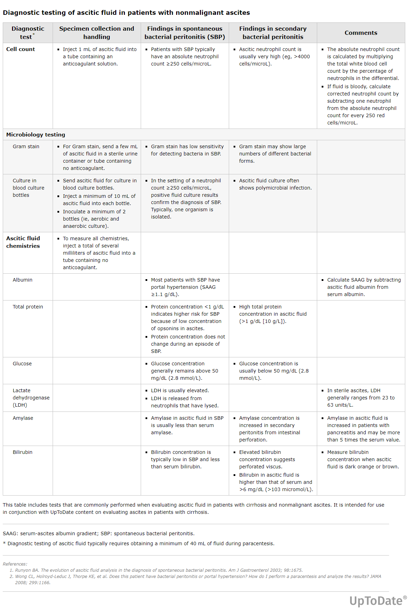
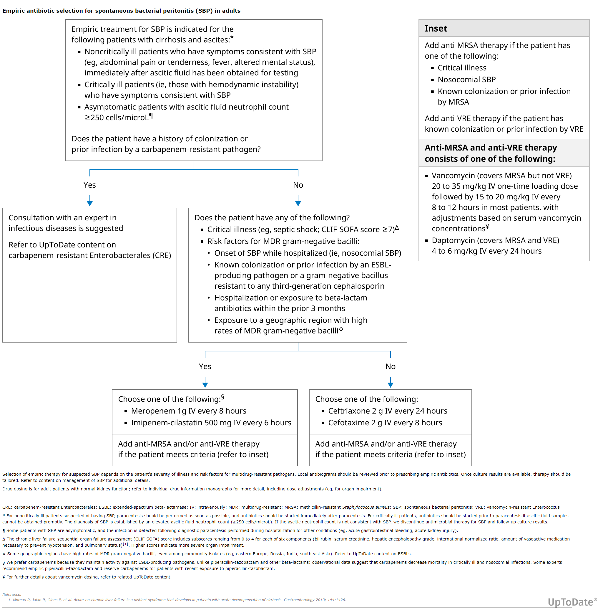
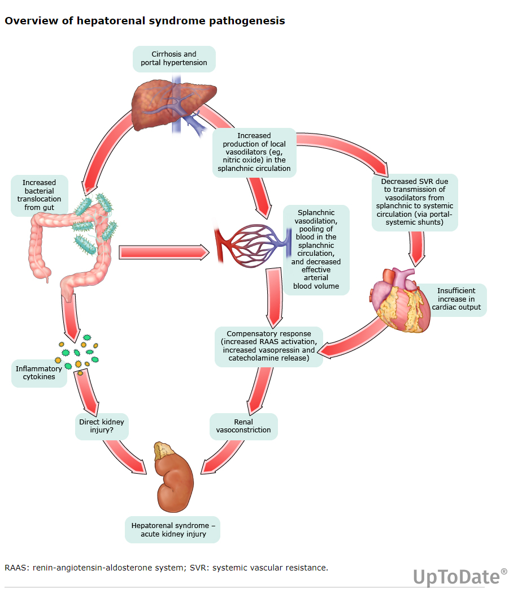
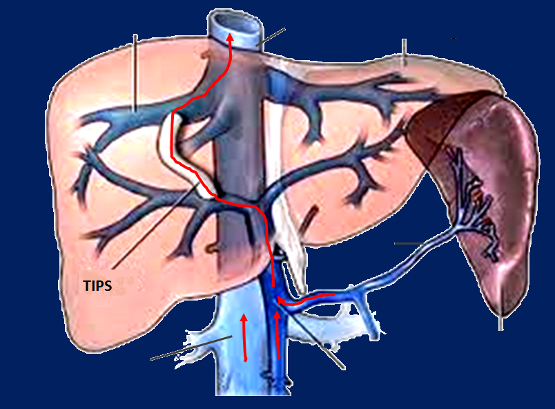
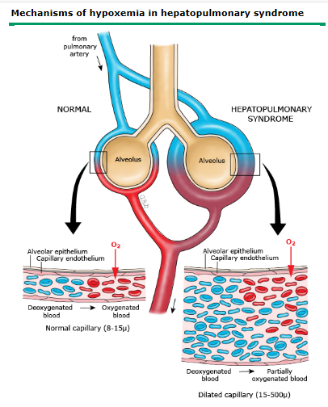

# SİROZ KOMPLİKASYONLARI — SBP, HRS, HPS

**Hazırlayan:** Dr. Berk Baş
**Bölüm:** Aydın Adnan Menderes Üniversitesi Tıp Fakültesi — İç Hastalıkları / Gastroenteroloji Bilim Dalı

---

## İÇİNDEKİLER

1. [Sirotik Hastada Asit Patogenezi](#sirotik-hastada-asit-patogenezi)
2. [Spontan Bakteriyel Peritonit (SBP)](#spontan-bakteriyel-peritonit-sbp)
    - [Tanım ve Etiyoloji](#tanım-ve-etiyoloji)
    - [Patogenez — Bakteriyel Translokasyon](#patogenez--bakteriyel-translokasyon)
    - [Risk Faktörleri](#risk-faktörleri)
    - [Klinik Bulgular](#klinik-bulgular)
    - [Tanı](#tanı)
    - [Spontan Asit Enfeksiyonu Tipleri](#spontan-asit-enfeksiyonu-tipleri)
    - [Sekonder Peritonit Ayrımı](#sekonder-peritonit-ayrımı)
    - [Tedavi](#sbp-tedavisi)
    - [Beta Bloker Kuralı](#beta-bloker-kuralı)
    - [Tedavi Takibi ve Süre](#tedavi-takibi-ve-süre)
    - [Prognoz ve Profilaksi](#prognoz-ve-profilaksi)
    - [Genel Önlemler](#genel-önlemler)
3. [Hepatorenal Sendrom (HRS)](#hepatorenal-sendrom-hrs)
    - [Tanım](#hrs-tanım)
    - [Patofizyoloji](#hrs-patofizyolojisi)
    - [HRS Tipleri (HRS-AKD / HRS-KBH)](#hrs-tipleri)
    - [Tanı Kriterleri](#hrs-tanı-kriterleri)
    - [Klinik Prezentasyon](#hrs-klinik-prezentasyon)
    - [Ayırıcı Tanı](#hrs-ayırıcı-tanı)
    - [Prognoz](#hrs-prognoz)
    - [Önleme](#hrs-önlenmesi)
    - [Tedavi](#hrs-tedavisi)
4. [Hepatopulmoner Sendrom (HPS)](#hepatopulmoner-sendrom-hps)
    - [Tanım ve Triad](#hps-tanım)
    - [Epidemiyoloji ve Prognoz](#hps-epidemiyoloji)
    - [Patogenez](#hps-patogenez)
    - [Semptom ve Bulgular](#hps-klinik)
    - [Tanı](#hps-tanı)
    - [Tedavi](#hps-tedavi)

---

## SİROTİK HASTADA ASİT PATOGENEZİ

Sirotik hastada asit oluşumu **üç temel mekanizmaya** dayanır:

1. **Portal hipertansiyon (PHT)**
2. **Periferik ve splanknik vazodilatasyon**
3. **Nörohumoral mekanizmalar**

### Hemodinamik Değişiklikler

**Splanknik sirkülasyon:**

* Portal venöz sistemde basınç ↑
* Splanknik arterlerde vazodilatasyon ↑
* Portal venöz akım ↑
* İntestinal kapiller basınç ↑
* Splanknik lenf akımı ↑
* Portokollateral sirkülasyon gelişir

**Sistemik sirkülasyon:**

* **Kardiyak output ↑**
* **Sistemik vasküler direnç ↓**
* **Sistemik arteriyel basınç ↓**
* Vazokonstrüktör sistem aktivitesi ↑
* Natriüretik peptid düzeyi ↑

> **💡 "Sirotik hasta ama hemodinamisi şok hastası gibi" paradoksu:** Sirotik dolaşımın görüntüsü ilginçtir — kardiyak output **yüksek**, sistemik vasküler direnç **düşük**, arteriyel basınç **hafif düşük**. Bu, sepsis veya anafilakside gördüğümüz "distribütif" şok paternine benzer. Sebep: splanknik dolaşımda aşırı **NO (nitrik oksit)** üretimi ve vazodilatasyon → kan splanknik yatağa "kaçar" → efektif arteryel kan volümü azalır (arterial underfilling). Vücut bunu algılar, RAAS ve sempatik sinir sistemini aktive eder → böbrek tuz ve su tutar → asit birikir.
>
> Bir başka örneği şöyle düşün: geniş bir havuzda su musluktan akıyor ama bir yerden (dev bir drenaj) sürekli kaçıyor → havuzun diğer köşesi hep az dolu görünür. Vücut "az dolu kısım"a odaklanır ve daha çok su toplar → toplam su giderek artar ama dağılım bozuk kalır. Asit bu fazlalığın "karına kaçan" kısmıdır.

---

## SPONTAN BAKTERİYEL PERİTONİT (SBP)

### Tanım ve Etiyoloji

**SBP:** Asitli hastaların yaklaşık **%10-30'unda** görünür bir sebep olmadan ortaya çıkan **asit sıvısının enfeksiyonudur**.

> **⭐ Kritik eşik:** Kültür çalışmalarında **%20-40** negatif sonuç verdiği için tanıda kültürden çok asit sıvısı PMNL sayısı önemlidir:
>
> **Asit sıvısında nötrofil sayısı ≥ 250/mm³ → SBP (ve antibiyotik endikasyonu)**

> **📝 Niçin "spontan"?** Çünkü altta **cerrahi komplikasyon, organ perforasyonu, intraabdominal apse** gibi belirgin bir neden yoktur — enfeksiyon "kendiliğinden" ortaya çıkar. Buradaki sinsilik, kaynağın **bağırsaktaki bakterilerin translokasyonu** olmasıdır; gastroenterolojinin en klasik "bağırsak-karaciğer-karın zarı" üçgeni.

### Patogenez — Bakteriyel Translokasyon

```
    Bağırsak florası (E.coli, Klebsiella, Streptokoklar...)
                           │
                           ↓
              BAKTERİYEL ÇOĞALMA (overgrowth)
                           │
       ┌───────────────────┼──────────────────────┐
       ↓                   ↓                      ↓
  Motilite ↓        Permeabilite ↑       Hipoklorhidri (PPI)
       │                   │                      │
       └───────────────────┼──────────────────────┘
                           ↓
           BAKTERİYEL TRANSLOKASYON
        (mezenterik lenf nodları → kan)
                           ↓
                  ┌────────┴─────────┐
                  ↓                  ↓
          Azalmış RES            Düşük proteinli
          aktivitesi             asit (< 1 g/dl)
                  │              Opsonik aktivite ↓
                  └────────┬─────────┘
                           ↓
                    BAKTEREMİ
                           ↓
                         SBP
```

### Sirozlu Hastada Translokasyonu Kolaylaştıran Faktörler

* **İntestinal motilitenin bozulması** (uzamış transit → bakteri birikimi)
* **PPI kullanımına bağlı hipoklorhidri** (asit bakteri bariyerini kaybeder)
* **İntestinal geçirgenliğin artması** (bozulmuş bariyer)
* **Düşük proteinli asit sıvısı (&lt; 1 g/dl)** → opsonik (antimikrobiyal) aktivite **çok düşük**
* **RES (retiküloendotelyal sistem) fonksiyonunun azalması** — karaciğer Kupffer hücreleri artık işini yapamaz

> **💡 Opsonik aktivite = asit sıvısının "savunma sistemi":** Normalde kan ve doku sıvılarında kompleman, immünoglobulin gibi opsonin proteinleri bakterilere yapışır ve onları immün hücrelere "buyurun" diye sunar. Sirozda asit sıvısı **çok seyreldiktir** ve protein içeriği düşüktür — yani bakteriler lavaboda yüzüyor gibi, savunmasız bir ortamda serbestçe çoğalırlar. Bu yüzden **protein &lt; 1 g/dl olan asitler** SBP için birer "bekleme odası"dır.

> **📝 PPI ve SBP ilişkisi:** Günümüzde karaciğer hastalarında PPI (proton pompa inhibitörü) kullanımı sıktır (üst GİS kanama korkusu, varis proflaksisi vs). Ancak PPI'lar mide asidini kaldırarak bağırsakta bakteriyel çoğalmayı artırır → SBP riski artar. Bu yüzden bugünün kuralı: **PPI'ları yalnızca açık endikasyonlarda ver**, "korunma amaçlı" kullanma.

### Ekstraintestinal Kaynaklar

Bağırsak dışı kaynaklardan da bakteri kan yoluyla asite gelebilir:

* **Üriner enfeksiyon**
* **Respiratuar enfeksiyon**

### Risk Faktörleri

* **Düşük proteinli asit** (&lt; 1 g/dl) — en önemli
* **Önceki SBP öyküsü** (nüks oranı %70'e kadar çıkar)
* **Çocuk-Pugh skoru yüksek** (ileri siroz)
* **Üst GİS kanama**
* **Hiperbilirubinemi**

### Klinik Bulgular

* Hastalarda **ilerlemiş siroz** tablosu yerleşmiştir
* **Bilirubin yüksek, PT uzamış**, hastalar **Child-Pugh B veya C**
* Genellikle **büyük volümlü asit**
* **Hastaların %13'ünde semptom ve bulgu yoktur** (!)

### SBP'li Sirozlu Hastalarda Klinik Bulgular (Garcia TG. J Hepatol 2004)

| Klinik semptom | Oran (%) |
|---|---|
| **Karın ağrısı** | **80** |
| **Ateş** | **70** |
| **Hepatik ensefalopati** | **58** |
| Hipoperistalsis | 32 |
| **Böbrek fonksiyonunda bozulma** | **30** |
| İshal | 19 |
| **Septik şok** | **16** |
| GİS kanama | 15 |
| Kusma | 13 |
| **Semptomsuz** | **10** |

> **💡 Klinik pratik kural:** Belli bir presipitan faktör olmadan **hepatik ensefalopati (HE)** veya **hepatorenal sendrom (HRS)** gelişmiş sirozlu bir hastada → **SBP'den şüphelen**. Yani "neden kötüleşti?" sorusunun en sık cevabı sessiz bir SBP'dir.
>
> Bu yüzden kural: **renal veya hepatik fonksiyonlarda bozulma olan tüm asitli sirotik hastalarda tanısal parasentez yapılmalıdır**. Hasta "ateşi yok, karnı ağrımıyor" diye rahat bırakılmaz — %10 asemptomatik olabilir.

### Tanı

**Tanısal parasentez endikasyonları:**

* Yeni tanı konmuş asit
* Sirozlu asit hastasında **akut kötüleşme** (HE, HRS, kötüleşen kreatinin)
* Enfeksiyon şüphesi (ateş, karın ağrısı, lökositoz)
* **GİS kanama gelişirse** — AB profilaksisinden **önce** tanısal parasentez

**Tanı kriterleri:**

* **Pozitif asit sıvısı bakteri kültürü** **ve/veya**
* **Asit sıvısı PMN sayısı ≥ 250 hücre/μL**

**Hemorajik parasentez düzeltmesi:**

* Eritrosit sayısı &gt; 10.000/mm³ ise her **250 eritrosit için 1 PMNL** düşülür

**Asit sıvı kültürü:**

* Hasta başında alınmalı
* **Kan kültürü ile eş zamanlı**
* En az **10 ml sıvı** kan kültürü şişesine konmalı
* Bakteriyemi araştırması da paralel yapılır



> **📝 Niçin 250 eşiği?** Çünkü bu seviyeye kadar nötrofil sayısı normal varyasyon sınırları içindedir. 250'nin üstünde ise istatistiksel olarak enfeksiyon lehine güçlü bir sinyal olur. Eşiği düşürmek yanlış pozitif, yükseltmek geç tanı getirir — 250 en uygun denge noktasıdır.

### Spontan Asit Enfeksiyonu Tipleri

SBP tek bir tablo değildir; asit sıvısındaki PMN ve kültür sonucuna göre üç farklı tablo görülür:

| Tablo | PMN | Kültür | Yaklaşım |
|---|---|---|---|
| **Klasik SBP** | ≥ 250 | Pozitif (tek organizma) | Tedavi et |
| **Kültür negatif nötrositik asit (CNNA)** | ≥ 250 | **Negatif** | Tedavi et (SBP gibi davran) |
| **Monomikrobiyal nonnötrositik bakterasit (MNB)** | &lt; 250 | Pozitif | Semptomatikse tedavi, asemptomatikse 48 saat sonra tekrar parasentez |

### Bakterasitli Hastalarda Tedavi Endikasyonları

* **Semptomatik** (ateş, karın ağrısı varsa) → **tedavi başla**
* **Asemptomatik** → 48 saat sonra tekrar parasentez; PMN ≥ 250'ye çıkarsa veya semptom gelişirse → tedavi başla

### Kültür Negatif Nötrositik Asit

* Asit sıvısı PMN ≥ 250 + kültür negatif
* Bu hastaların **çoğunda aslında SBP vardır** (sadece kültür negatif çıkmış)
* **Ampirik geniş spektrumlu antibiyotik** başlanır
* Kültür negatif olduğu için duyarlılık testine göre daraltma yapılamaz — geniş spektrum devam

> **💡 Kültür niçin %20-40 oranında negatif çıkar?** Çünkü SBP'de **bakteri sayısı düşüktür** (genellikle 1 mL'de &lt;1 koloni). Klasik kültür yöntemleri bu seyrek bakterileri yakalayamaz. Bu yüzden tanıda **PMN sayısı** kültürden daha güvenilirdir. Kültürü kan kültürü şişesine (10 mL) doğrudan alarak duyarlılığı artırabilirsin.

---

## SEKONDER PERİTONİT AYRIMI

**SBP ≠ Sekonder peritonit** — bu ayrım hayati öneme sahiptir çünkü sekonder peritonit **cerrahi gerektirir**.

### Sekonder Peritonit Nedenleri

* **Cerrahi komplikasyonu**
* **İntraabdominal enfektif komplikasyonlar** (apendisit, kolesistit vb.)
* **İntestinal perforasyon**
* Bakteriyel veya mantar kökenli

### Sekonder Peritoniti Düşündüren Bulgular

1. **Antibiyotik tedavisine cevapsızlık**
2. **Birden fazla mikroorganizma** izolasyonu (polimikrobiyal)
3. Asit sıvısında aşağıdaki bulgulardan **en az ikisinin** varlığı:
    * **Glukoz &lt; 50 mg/dl**
    * **Protein > 1 g/dl**
    * **Asit LDH > Serum LDH**

### Sekonder Peritonit Şüphesinde Yaklaşım

* **Sebebe yönelik radyolojik araştırma** (BT, USG)
* **Anaeroplara ve enterokoklara etkili** antibiyotik ile tedavi devam edilmeli
* **Cerrahi konsültasyonu** erken yapılmalı

> **💡 Niçin bu üç kriter?** SBP tek bir organizma ile olur, **bağırsak bakterileri karışım halinde** gelirse "yan yollar" (perforasyon) açılmış demektir. Glukoz **düşüktür** çünkü çok sayıda bakteri ve lökosit glukozu tüketir; LDH **yüksektir** çünkü yoğun hücresel yıkım vardır; protein **yüksektir** çünkü inflamasyon eksüdatif bir sıvı yaratır. Bu üçlü = "bağırsak perforasyonu" imzasıdır.
>
> SBP'de ise sıvı **transüda benzeri** kalır (düşük protein, hücresel).

---

## SBP TEDAVİSİ

### Ampirik Tedavi Endikasyonları

Aşağıdaki bulgulardan **bir veya daha fazlası** varsa SBP için ampirik tedavi başla:

* Ateş **> 37.8°C**
* Karın ağrısı ve/veya hassasiyet
* **Mental durumda değişiklik**
* Asit sıvısında **PMNL > 250/mm³**



### Antibiyotik Seçimi (Başlangıç)

**İlk tercih:**

* **Sefotaksim 3×2 g IV** (5 gün)
* Seftriakson, seftizoksim, seftazidim de uygun
* Amoksisilin/klavulanik asit alternatif

**Oral seçenekler (komplike olmayan hastada):**

* **Oral kinolonlar** — daha önce kinolon profilaksisi almayan, komplike olmayan hastalarda

**Profilakside florokinolon alan hastada:**

* **Sefotaksim** uygun tercih (çünkü kinolon dirençli gram-negatifler düşünülmelidir)

**Aminoglikozidler KULLANILMAMALI** → nefrotoksisite, zaten riskli olan böbreği daha da bozar.

> **💡 Niçin 3. kuşak sefalosporin?** SBP'de en sık etkenler **gram-negatif enterik çomaklar** (E. coli, Klebsiella, enterokok ve streptokoklar). Sefotaksim bu grubu kapsar, Kc fonksiyonundan bağımsız metabolize olur, güvenlidir. Kinolonlar da iyi bir alternatiftir ama dirençli suşlar artmıştır. Aminoglikozidler direkt **nefrotoksik** oldukları için SBP tedavisinde **yasak** — zaten SBP hastası HRS gelişimine eğilimli.

### Sıkkomplike/Nozokomiyal Durumlarda

* **Karbapenem** (meropenem, imipenem)
* **Anti-MRSA** (vankomisin) — MRSA kolonizasyonu/riski varsa
* **Anti-VRE** — VRE kolonizasyonu varsa

---

## BETA BLOKER KURALI

> **⚠️ ÖNEMLİ UYARI:** **SBP geliştikten sonra nonselektif beta blokerler kalıcı olarak kesilmelidir.**

### Kanıtlar

607 hastalı retrospektif bir çalışmada:

* SBP gelişen hastalarda **β-bloker alanlarda mortalite riski %58 ↑**
* **Hepatorenal sendrom oranları:** β-bloker (+) grup **%24** vs β-bloker (−) grup **%11**
* **Hastanede kalış süresi:** **29.6 vs 23.7 gün** (ortalama)

> **💡 Niçin?** Sirotik hastada zaten düşük arteryel basınç ve efektif kan volümü vardır. SBP gelişince sistemik inflamasyon → daha fazla vazodilatasyon → kan basıncı daha da düşer. β-bloker bu tabloda kalp hızını ve kardiyak output'u düşürerek **dolaşım kollapsını hızlandırır** → HRS ve mortalite artar. Yani "varis koruyucu" iyi niyetli bir ilaç, SBP ile birlikte zararlıya dönüşür.
>
> Ne zaman yeniden başlanır? **Hastanın klinik toparlanması sonrası, dolaşım stabilleşince**, hâlâ varis riski varsa dikkatli şekilde yeniden başlatılabilir.

---

## TEDAVİ TAKİBİ VE SÜRE

### Antibiyotik Etkinliği Değerlendirmesi

* **Periyodik klinik değerlendirme**
* Tedavi başlangıcından **48 saat sonra kontrol parasentezi**

### Tedavi Yetersizliği Kriterleri

a) Antibiyotik tedavisinin ilk saatlerinde **klinik kötüleşme**
b) Kontrol parasentezde başlangıca göre **PMNL sayısında &lt;%25 azalma**

### Tedavi Yetersizliğinde Yaklaşım

a) AB tedavisi **kültür sonuçlarına göre yeniden düzenlenmeli** veya ampirik değişiklik
b) **Sekonder peritonit** yönünden araştırılmalı

### Tedavi Süresi

* **5 gün** → genellikle yeterli (çalışmalar 5 vs 10 gün arasında fark göstermedi)
* Bakteriyemik hastalar dahil **çoğu hasta 5 gün tedavi edilir**
* **5 gün sonra** yeniden değerlendirme:
    * **Dramatik iyileşme varsa** → tedaviyi kes
    * **Ateş veya ağrı devam ediyorsa** → parasentez tekrarla:
        * **PMN &lt; 250** → tedaviyi durdur
        * **PMN > tedavi öncesi** → cerrahi kaynak ara (sekonder peritonit)
        * **PMN yüksek ama tedavi öncesinden düşük** → 48 saat daha devam, parasentez tekrarla

---

## PROGNOZ VE PROFİLAKSİ

### Prognoz

* **Zamanında başlanırsa mortalite &lt; %5**
* **Nefrotoksik ilaçlardan kaçınılmalı** (aminoglikozid, NSAİİ, kontrast)

### Nüks

* **Nüks oranı > %70** — profilaksi zorunlu

### Profilaksi

**Primer profilaksi (SBP geçirmemiş ama yüksek riskli):**

* **Asit protein &lt; 1 g/dl** + ilerlemiş siroz (Child-Pugh C, bilirubin > 3, kreatinin > 1.2, Na &lt; 130)
* **GİS kanamalı hastada** (sirotik + varis kanaması) — 7 gün
* **Siprofloksasin** veya **norfloksasin** (oral)

**Sekonder profilaksi (SBP geçirmiş):**

* **Norfloksasin 400 mg/gün** (veya siprofloksasin) süresiz

> **💡 Günümüzde rifaksimin:** Yeni çalışmalar rifaksiminin hem SBP profilaksisi hem HE önleme için kullanılabilir olduğunu gösteriyor. Kinolon direnci arttıkça rifaksimin giderek daha çok tercih ediliyor.

---

## GENEL ÖNLEMLER

Antibiyotik profilaksisine ek olarak:

* **Diüretik tedavisi** — asit sıvısını **konsantre ederek** opsonik aktiviteyi yükseltir, SBP'yi önlemeye yardımcı olur
* **Lokalize enfeksiyonların** (sistit, selülit) erken tanısı ve agresif tedavisi
* **PPI kullanımının kısıtlanması** — yalnızca açık endikasyon varsa

> **💡 Sözün özü — SBP zinciri:**
>
> "Sirotik asit + düşük protein + PPI + sessiz ateş = SBP şüphesi → parasentez → PMN ≥ 250 → sefotaksim + albumin + β-bloker kes → 48 saat kontrol → 5 gün tedavi → profilaksi başla"

---

## HEPATORENAL SENDROM (HRS)

### HRS Tanım

**Karaciğer hastalığı varlığında**, böbreklerde herhangi bir **histolojik bozukluk bulunmaksızın** ve böbrek yetmezliği oluşturabilen diğer nedenlerin yokluğunda:

**Renal kan akımı (RBF) ve glomerüler filtrasyon hızı (GFR)'nda azalma** ile karakterize bir hastalık durumudur.

> **⭐ Anahtar:** HRS **yapısal** bir böbrek hastalığı değil, **fonksiyonel** bir böbrek yetmezliğidir. Biyopsi yapsan böbrek normale yakın görünür; iş **sistemik dolaşımdaki şiddetli vazokonstriksiyondur**. Ancak diğer tüm nedenler ekarte edilmeden HRS diyemezsin — **dışlama tanısıdır**.

> **💡 "Sağlam böbrek, kötü dolaşım" kuralı:** HRS'li bir hastanın böbreğini başka bir alıcıya transplant etsen, bu böbrek yeni vücutta **mükemmel çalışır**! Çünkü sorun böbrekte değil, kanın "böbreğe ulaşamamasındadır". Aynı şekilde, hastaya **karaciğer nakli** yaptığında HRS geri döner — çünkü nedeni olan kötü karaciğer ortadan kalkar. Bu "fonksiyonel" kavramının en güzel klinik kanıtıdır.

### Genel Özellikler

* Sistemik arteriyel dolaşım bozukluğu + endojen vazoaktif sistem anormalliği
* **Sadece sirozda değil**; akut karaciğer yetmezliği ve **alkolik hepatitte** de görülür
* **Tetikleyiciler:** bakteriyel enfeksiyonlar, GİS kanaması, majör cerrahi, **SBP**
* Asitli sirotik hastalarda 1 yılda **%18**, 5 yılda **%39** gelişir
* Alkolik hepatitli hastalarda %28 oranında görülebilir

---

## HRS PATOFİZYOLOJİSİ

**HRS'nin temel mekanizması:** Renal dolaşımdaki **ciddi vazokonstriksiyon**

### Altta Yatan Mekanizmalar

* Sistemik arteriyel dolaşımdaki değişiklikler
* **Artmış portal basınç**
* **Vazokonstriktör maddelerin aktivasyonu**
* Vazodilatör maddelerin supresyonu

### Patogenez Akış Şeması



```
              SİROZ
                ↓
       Portal hipertansiyon
                ↓
    Splanknik vazodilatasyon
                ↓
  Efektif arteriyel kan volümünün
      azalması (UNDERFILLING)
                ↓
  Arteriyel ve kardiyopulmoner
         reseptörler algılar
                ↓
  Vazokonstriktör sistemlerin
        aktivasyonu (RAAS, SNS, ADH)
                ↓
  ┌───────────────────────────────┐
  │  BÖBREK                       │
  │  Renal vazokonstriksiyon      │
  │  (lokal vazodilatör/          │
  │   vazokonstriktör dengesi     │
  │   bozulur)                    │
  └───────────────────────────────┘
                ↓
       HEPATORENAL SENDROM
```

### Vazodilatörler ve Vazokonstriktörler

| Vazodilatörler (sup./supresse) | Vazokonstriktörler (artmış) |
|---|---|
| Prostasiklin | **Anjiotensin II** |
| Prostaglandin E2 | **Norepinefrin** |
| Nitrik oksit | Nöropeptid Y |
| Atrial natriüretik peptid | **Endotelin-1** |
| Kallikrein-kinin sistemi | Adenozin |
|   | Tromboksan A2 |
|   | Sisteinil lökotrienler |

> **💡 Paradoks:** Sirotik hastada **splanknik yatak vazodilate**, **sistemik (özellikle böbrek) yatak vazokonstrikte**. Aynı vücutta iki zıt durum. Sebep: splanknik NO üretimi fazla → splanknik dilatasyon → kan splanknika kaçar → sistemik dolaşım underfill olur → baroreseptörler RAAS/SNS aktive → sempatik tonus özellikle böbrekte kasma yapar. Yani böbrek "algılanan az kanı korumaya çalışırken" tam tersine kendini iskemiye sokar.
>
> Bunu "kısıtlı bütçe ile ev çevirmek" gibi düşün: ana salon (splanknik) aşırı harcıyor; mutfak ve banyo (böbrek) kısmak zorunda kalıyor. Sonuçta salon şatafatlı, mutfak çalışmaz hale geliyor.

### Presipitan Faktörler

* **Spontan Bakteriyel Peritonit (SBP)** — en önemli presipitan!
* **NSAİİ** (renal PG sentezini bloke eder)
* GİS kanama
* Aşırı diürez
* Majör cerrahi

---

## HRS TİPLERİ

Güncel sınıflamada (2015 ICA konsensüsü sonrası):

| Tip | Tanım | Önceki Adı |
|---|---|---|
| **HRS-AKI (HRS-AKD)** | 7-90 gün süren böbrek fonksiyon bozukluğu | Tip 1 HRS |
| **HRS-CKD (HRS-KBH)** | **90 günden uzun** süren böbrek fonksiyon bozukluğu | Tip 2 HRS |

> **📝 Eski HRS Tip 1 ve Tip 2:**
>
> * **Tip 1 (şimdi HRS-AKI):** **Hızlı seyirli**, kreatinin 2 hafta içinde 2 katına veya >2.5 mg/dl. Prognoz **çok kötü** — tedavisiz mortalite 2 hafta.
> * **Tip 2 (şimdi HRS-CKD):** Yavaş, stabil progresyon; daha sık **dirençli asit** ile birlikte. Aylar içinde ilerler.
>
> Terminoloji değişti ama klinik konsept aynı kaldı.

---

## HRS TANI KRİTERLERİ

### Major Kriterler

1. **Düşük GFR:** Serum kreatinin > **1.5 mg/dl** veya 24 saatlik kreatinin klirensi **&lt; 40 ml/dk**
2. **Şok, bakteriyel enfeksiyon, sıvı kaybı, nefrotoksik ilaç kullanımının** **OLMAMASI**
3. **Diüretik tedavinin kesilmesi ve 1.5 L plazma genişleticisi** (albümin 1 g/kg) verilmesine rağmen böbrek fonksiyonlarının düzelmemesi
    * Serum kreatinin 1.5 mg/dl'nin altına düşmemesi
    * Kreatinin klirensi 40 ml/dk üstüne çıkmaması
4. **Proteinüri olmaması** (&lt; 500 mg/gün) ve USG'de **obstrüktif veya renal parankimal hastalık** bulgusunun olmaması

### Minor Kriterler

* **İdrar volümü &lt; 500 ml/gün** (oligüri)
* **İdrar Na &lt; 10 mEq/L** (çok düşük, çünkü böbrek tuzu tutuyor)
* **İdrar osmolalitesi > Plazma osmolalitesi** (konsantre idrar)
* **İdrarda eritrosit &lt; 50** (büyük büyütmede, hematüri yok)
* **Serum Na &lt; 130 mEq/L** (dilüsyonel hiponatremi)

> **💡 İdrar sodyumu niçin bu kadar düşük?** HRS'de böbrek aşırı vazokonstrikte + RAAS maksimum aktif + aldosteron tavan → distal tübülde her sodyumu geri emer. Normal bir böbrek ABH'da (akut tübüler nekroz) tuz atar; HRS'de böbrek **"tuz cimrisi"** haline gelir. **İdrar Na &lt; 10 mEq/L** HRS lehine güçlü bir bulgudur. Bu, HRS ile ATN ayrımında çok işe yarar.

> **📝 Niçin 1.5 L plazma genişletici test?** Çünkü klasik bir sirotik hasta **prerenal azotemi** (dehidrasyon) ile de gelebilir — buna benzeyen ama geri dönüşü olan bir tablo. Plazma genişletici (albümin) verirsen prerenal olan düzelir; HRS olan düzelmez. "Düzelmiyorsa HRS" kuralı bu testle doğrulanır.

---

## HRS KLİNİK PREZENTASYON

### Özel Bir Klinik Tablo Yoktur — Temel Bulgular

HRS'ye spesifik bir klinik bulgu yoktur, ancak tabloya şunlar eşlik eder:

* **İleri karaciğer hastalığı bulguları**
* **Hiperbilirubinemi**
* **Uzamış PT**
* **Trombositopeni**
* **Hepatik ensefalopati**
* **Hipoalbuminemi**
* **Aşırı asit**
* **Azalmış arteryel KB ve düşük sistemik vasküler direnç**
* **Taşikardi**
* **Artmış kardiyak output**

### Asitli Hastada HRS Gelişimini Artıran Faktörler

* **İdrar Na &lt; 10 mEq/L**
* **Dilüsyonel hiponatremi**
* **Arteryel hipotansiyon**
* **RAAS ve sempatik sistem belirgin aktivasyonu**
* **SBP**

---

## HRS AYIRICI TANI

### Sirozlu Hastada Böbrek Yetmezliği Diğer Nedenleri

| Neden | Ayırt Edici Özellik |
|---|---|
| **Prerenal yetmezlik** (ishal, kusma, diüretik) | Volüm ekspansiyonuna yanıt verir |
| **Akut tübüler nekroz** (hipovolemik şok sonrası) | İdrar Na **yüksek**, granüler silindir |
| **HBV/HCV'ye bağlı glomerülonefrit** | **Proteinüri**, hematüri, aktif sediment |
| **İlaç nefrotoksisitesi** (NSAİİ, aminoglikozid) | İlaç öyküsü, tipik zamanlama |

> **💡 HRS vs ATN karşılaştırma ipucu:**
>
> * **İdrar Na:** HRS &lt;10, ATN > 20-40
> * **FENa:** HRS &lt;%1, ATN > %2
> * **İdrar sedimenti:** HRS temiz, ATN granüler/pigmente silindir
> * **Volüm yanıtı:** HRS yanıtsız, prerenal düzelir

---

## HRS PROGNOZ

> **⚠️ KÖTÜ PROGNOZ:**
>
> * Sirozun tüm komplikasyonları içinde **en kötü prognozlu olanıdır**.
> * Böbrek yetmezliği geliştikten sonra **pratik olarak 8-10 hafta içinde tüm hastalar ölmektedir** (tedavisiz).
> * Tip 1 HRS'de mortalite 2 hafta kadar kısa olabilir.

---

## HRS ÖNLENMESİ

### 1) SBP'li Hastada Albümin Proflaksisi

SBP tanısı **anında 1.5 g/kg albümin**, **48 saat sonra 1 g/kg albümin** dolaşım disfonksiyonunu ve HRS gelişimini **önler**.

| Grup | HRS oranı | Mortalite |
|---|---|---|
| **Antibiyotik + Albümin** | **%10** | **%10** |
| Antibiyotik (albümin yok) | %33 | %29 |

> **💡 Albümin niçin bu kadar etkili?** Albümin sadece onkotik basınç değil, aynı zamanda **endotel stabilizasyonu**, **oksidatif stres azaltma**, **bakteriyel toksin bağlama** gibi etkilere sahiptir. SBP sırasında splanknik yataktan daha da fazla kan "kaçar" — albümin bu kaçışı frenler ve efektif arteryel volümü korur → RAAS aktivasyonu azalır → böbrek vazokonstriksiyonu önlenir.
>
> Bu, nefrolojide en güçlü kanıtlardan birine dayanan ve pratik etkisi kesin olarak gösterilmiş bir müdahaledir. Asla atla.

### 2) Akut Alkolik Hepatitte Pentoksifilin

**Pentoksifilin 3×400 mg, 28 gün** kullanımı ile:

* HRS oranında **%35 → %8** düşüş
* Mortalitede **%46 → %24** düşüş

---

## HRS TEDAVİSİ

### 1) Vazokonstriktör Ajanlar + Albümin (Birinci Basamak)

> **⭐ Mantık:** HRS splanknik vazodilatasyon + renal vazokonstriksiyonun bir sonucu. Sistemik bir vazokonstriktör verirsen, splanknik dilatasyonu kısar, kan arteryel dolaşıma döner, efektif volüm artar, böbrek kan akımı iyileşir. Bu tam tersinden düşünme gerektiren bir stratejidir — "hastanın kan basıncı düşük ama daha çok vazokonstriktör verelim" diye değil, "patogenezinde vazodilatasyon var, kısmak lazım" diye düşün.

**a) Terlipressin (tercihen)**

* **Doz:** 0.5-1 mg IV her 4 saatte bir
* Kreatinin düşmezse doz **2-3 günde bir** artırılarak max 2 mg/4 saate kadar
* Kc transplantasyonuna hazırlık için kullanılabilir

**b) Midodrin + Oktreotid**

* **Midodrin:** 7.5 mg 3×1/gün **oral**
* **Oktreotid:** 100 μg 3×1 SC
* Kreatinin düşmezse midodrin **3×12.5 mg**'a, oktreotid **2×200 μg**'a çıkarılabilir

**c) Noradrenalin**

* **0.5-3 mg/saat IV infüzyon** (terlipressin yoksa alternatif)

**+ Albümin:** IV 20-40 g/gün (mutlaka eşlik etmeli)

### 2) Tedavi Süresi ve İzlem

* **En fazla 15 gün** sürdürülür
* **Serum kreatinin &lt; 1.5 mg/dl** olduğunda tedavi kesilir
* **Yan etki izlemi:** göğüs ağrısı, karın ağrısı, distal uçlarda iskemi
* **Kardiyak, serebral, periferik vasküler hastalığı olan hastalarda** vazokonstriktör kullanımı **riskli** olabilir

### 3) Transjuguler İntrahepatik Portosistemik Şant (TIPS)



* Portal basıncı düşürerek splanknik vazodilatasyonu azaltır
* Refrakter asit ve seçilmiş HRS olgularında **ümit verici**
* İleri KC yetmezliği, HE olan hastalarda dikkatli olunmalı (HE'yi kötüleştirebilir)

### 4) Karaciğer Transplantasyonu

* **Tek kesin tedavi**
* Nakil sonrası HRS **geri döner** (fonksiyonel olduğu için)

### 5) Tedavide Yararsız / Kısıtlı Etkili

* **Konvansiyonel hemodiyaliz** rutin HRS tedavisinde önerilmez — sadece hipervolemi, hiperkalemi, şiddetli metabolik asidoz varsa ve **transplantasyona köprü** olarak kullanılabilir
* **MARS (Molecular Adsorbent Recirculating System — albümin diyalizi):** Ön çalışmalar umut verici ama rutin önerilmez
* Periton-venöz şant (Le Veen) — başarısız, terk edilmiş

---

## HEPATOPULMONER SENDROM (HPS)

### HPS Tanım

**HPS'nin üç temel bileşeni (triad):**

1. **Karaciğer hastalığı**
2. **Pulmoner gaz değişim anormalliği** — hipokseminin eşlik ettiği veya etmediği **alveolo-arteryel oksijen basınç gradiyenti** ↑
3. **İntrapulmoner vasküler dilatasyon** (IPVD) — kontrast ekokardiyografi ve/veya Tc-99m makroagrege albümin akciğer perfüzyon sintigrafisinde **intrapulmoner şant varlığı**

> **⚠️ ŞART:** Hastalarda **primer bir akciğer veya kalp hastalığı OLMAMASI** gerekir!

> **💡 Sözün özü:** HPS = "Karaciğer hastası + akciğer normal görünümde ama hipoksemi + kontrastla pulmoner damarlarda şant kanıtı". Yani organ olarak akciğer **yapısal olarak** iyi, ama **damarsal seviyede** çöküyor.

### HPS Epidemiyoloji

* Kronik karaciğer hastalığı olanlarda prevalans **%4-47** (ortalama **%25**)
* HPS'li hastalarda mortalite **%78**
* Şiddetli Kc hastalığı olan ama HPS olmayan kontrol grubunda mortalite **%43**
* HPS'li hastalarda ortalama sağkalım **24 ay**, **5 yıllık yaşam %23**
* HPS olmayanlarda ortalama sağkalım **87 ay**, **5 yıllık yaşam %63**

> **📝 Dikkat çekici veri:** HPS'nin eşlik ettiği siroz, eşlik etmeyenden **3-4 kat daha kötü** seyreder. Bu yüzden HPS sadece "semptomatik tedavi" değil, **karaciğer transplantasyonu listesine alınma** kararını doğrudan etkileyen bir klinik antite olarak kabul edilir.

---

## HPS PATOGENEZ

### Mekanizma Zinciri

```
         Portal hipertansiyon
                ↓
  Barsak perfüzyonunda azalma
                ↓
  Bakteriyel translokasyon +
  Enteral endotoksin salınımı
                ↓
      TNF-α ↑ → Hemoksigenaz CO ↑, NO ↑
      (vazoaktif mediatörler)
                ↓
  Pulmoner vazodilatasyon
  (intrapulmoner vasküler dilatasyon — IPVD)
                ↓
         HİPOKSEMİ
```

### Niçin Hipoksemi Gelişir?



**Normal kapiller çapı:** 8-15 μm
**HPS'de dilate kapiller çapı:** **15-100 μm**

**Mekanizma:** Kapillerler aşırı dilate olunca, O₂ moleküllerinin alveolar yüzeyden kırmızı kan hücresinin merkezine ulaşma mesafesi **artar**. O₂ **difüzyon-perfüzyon bozukluğu** sonucunda alveolden kana tam geçemez → **hipoksemi**.

> **💡 Akla yatkın bir örnek:** Normal bir kapillerde eritrosit "akış hattının kenarından" oksijen alır — ince bir tüpte bütün eritrositler duvara değer. Dilate kapiller ise geniş bir borudur; merkezdeki eritrositler alveolar O₂'ye ulaşamaz, sadece periferdekiler alır. Ayrıca geniş borudan kan daha hızlı geçer → O₂ ile temas süresi azalır.
>
> Bu yüzden hasta **saf O₂** verildiğinde (FiO₂ %100) genellikle **kısmen düzelir** — çünkü gradient zorlandığında difüzyon mesafesi aşılabilir. Ancak anatomik şantlarda (büyük AV malformasyonlar) bu düzelme tam olmaz.

### Patogenezin İki Yüzü

1. **Karaciğer pulmoner vazodilatörleri metabolize edemiyor** veya aşırı salıyor (**NO, prostaglandin, VIP, kalsitonin, glukagon, substans P, ANP, TAF**)
2. **Pulmoner vazokonstriktörler etkisiz kalıyor**

**En önemli suçlu:** **NO (Nitrik oksit)**

---

## HPS KLİNİK

### Semptom Dağılımı

* Hastaların **%80'i karaciğer hastalığı** bulgularıyla
* Hastaların **%20'si akciğer** şikayetleriyle başvurur

### Kronik Karaciğer Hastalığı Bulguları

* Halsizlik, yorgunluk, anoreksi, asit
* **Splenomegali**, **spider nevüs**, **palmar eritem**, sarılık
* **Asteriksis** (flap tremor)
* **Çomak parmak** ← HPS için dikkat çekici
* **Hipertrofik osteoartropati**
* **Kaput meduza**, jinekomasti, testiküler atrofi
* Özofagus ve gastrik **varis kanaması**

### HPS'e Özgü İpucu Bulgular

> **🌟 HPS için daha spesifik iki bulgu:**

**Platipne:** **Dik oturmak veya ayağa kalkmakla dispne gelişmesi**, **yatar pozisyonda düzelme**

**Ortodeoksi:** **Yatar pozisyondan dik oturur pozisyona gelince**:

* PaO₂'de **>4 mmHg düşme**
* Arteryel satürasyonda **>%5 düşüş**
* Yatar pozisyonda **düzelme**

> **💡 Niçin platipne-ortodeoksi?** HPS'de intrapulmoner vasküler dilatasyonlar **akciğer bazallerinde** yoğundur. Hasta **dik oturunca** kan yerçekimiyle bazallere daha çok akar → dilate kapillerlerde daha çok şantlı alan perfüze olur → O₂ difüzyonu yetmez → hipoksemi **kötüleşir**. Yatınca bazaldeki kan akımı görece azalır → durum düzelir.
>
> Bu tablo diğer nedenlerde nadir görülür, bu yüzden HPS için "**patognomonik olmasa bile son derece ipucu verici**" kabul edilir. Sirotik bir hastada "oturunca nefesim daralır, yatınca geçer" derse HPS ekartasyonu yap.

**Çomak parmak + spider nevüs + siroz + hipoksemi** üçlüsü görürsen HPS'yi düşün.

---

## HPS TANI

### Kimlere Test?

* Kronik Kc hastalığı **ve/veya portal HT** olan hastalarda:
    * **Dispne**
    * **Platipne / ortodeoksi**
    * **Spider anjiyom**
    * **Bozulmuş oksijenasyon kanıtı** (SpO₂ **&lt; 96**)
    * → HPS şüphesi, tanı testleri istenmeli
* **Tüm karaciğer nakli adaylarına** → **semptomlara bakılmaksızın** tanı testleri yapılmalı

### Temel Tanı Testleri

| Test | Amaç |
|---|---|
| EKG | Kardiyak neden ekarte |
| **Akciğer grafisi** | Primer Ak hastalığı ekarte (HPS'de genelde normal) |
| Toraks BT | IPVD'ler, primer hastalık ekarte |
| SFT | DLCO bozulmuş olabilir, diğerleri normal |
| **Arteryel kan gazı** | PaO₂, A-a gradiyenti |
| **Kontrast ekokardiyografi** | **IPVD kanıtlama — altın standart** |
| **Tc-99m MAA sintigrafisi** | IPVD + şant fraksiyonu |

### Akciğer Görüntüleme

**Grafi:**

* HPS bulguları nadir görülür
* Bazı hastalarda bronkovasküler işaretlerde belirginleşme

**Toraks BT:**

IPVD'lerin iki karakteristik bulgusu:

1. **Pulmoner periferik damarlarda genişleme**
2. **Pulmoner arter / bronş çapı oranında artış**

Nadir olarak IPVD büyükse **arteriyovenöz malformasyon** görüntülenebilir.

### Solunum Fonksiyon Testleri (SFT)

* **Spirometri genelde normal** (HPS primer akciğer hastalığı değil)
* **Akciğer volümleri normal**
* **DLCO (karbon monoksit difüzyon kapasitesi)** hafiften şiddetliye **bozulmuş**
* DLCO azalması **spesifik değildir**, normal olması **tanıyı dışlamaz**

### Transtorasik Kontrast Ekokardiyografi (TTCE) — ALTIN STANDART

* **IV kontrast madde** enjeksiyonu + ekokardiyografi
* Kontrast: serum fizyolojik veya indosiyanin yeşili (çalkalanarak mikro-kabarcıklar oluşturulur)
* **Normal:** Mikro-kabarcıklar sağ kalpte görülür, **pulmoner kapillerden geçemez** → sol kalbe geçiş olmaz
* **İntrakardiyak şant varlığında:** Enjeksiyon sonrası **ilk 3 atımda** sol kalpte görülür
* **HPS'de (intrapulmoner şant):** Sağ kalpte görüldükten **3-6 atım sonra** sol kalpte görülür

> **💡 Zamanlama ayrıntısı önemli:** 3 atımdan önce → **kardiyak (ASD, PFO)**; 3-6 atım arası → **pulmoner (HPS)**. Bu zamanlama ayrımı iki tamamen farklı hastalığın temelini belirler.

### Tc-99m Makroagrege Albümin Sintigrafisi

* 20 μm çapındaki makroagrege albümin normalde **8-15 μm** olan pulmoner kapillerden **geçemez**
* Geçerse → **ekstrapulmoner organlarda (beyin, böbrek)** radyonüklid görülür → intrapulmoner ya da intrakardiyak **şant varlığı**
* Beyinde/böbrekteki radyonüklid oranı **şant miktarıyla korele**
* **Dezavantaj:** İntrapulmoner mi intrakardiyak mı ayrımını yapamaz — kontrast ekokardiyografi bu konuda daha iyi

---

## HPS TEDAVİ

### Medikal Tedavi — Kısıtlı

> **⚠️ HPS'de henüz **etkili bir medikal tedavi yoktur**.**

En çok önerilen, başarı şansı yüksek tedavi **karaciğer transplantasyonu**dur.

### Kanıtlanmış Öneriler

* **Tüm HPS'li hastalar karaciğer nakli yönünden değerlendirilmeli** (AASLD)
* **Oksijen desteği** hipoksemik hastalara verilmelidir
* **NO'ya yönelik** ve **portal basınç düşürücü** tedaviler denenmiştir ama etkileri sınırlıdır

### Denenmiş Medikal Tedaviler

* **Metilen mavisi** (guanilat siklaz inhibitörü) — uzun dönemde başarısız
* **Terlipressin, somatostatin analogları**
* **İndometazin** ve diğer COX inhibitörleri
* **Almitrin bismesilat**
* **Antibiyotikler, β-blokerler, glukokortikoidler** → minimal yarar, sürekli iyileşme yok
* **Pentoksifilin** ve **kersetin** (flavanoid antioksidan) → araştırma sürüyor

### Embolizasyon

Büyük intrapulmoner vasküler dilatasyonu (**Tip II lezyon — AV malformasyon benzeri**) olan nadir hastalarda **embolizasyon** yapılabilir. Bu yaklaşım oksijenasyonda düzelme sağlayabilir.

### Karaciğer Transplantasyonu

> **⭐ Tek gerçek etkili tedavi.**

* HPS nakil sonrası **düzelir** — çünkü patogenezin kaynağı olan hasarlı karaciğer değişmiştir
* Transplantasyondan sonra oksijenasyon **haftalar-aylar içinde** iyileşir
* HPS, karaciğer nakli için **MELD skorundan bağımsız öncelik** verdirir (çünkü tek çaresi nakildir ve sağkalım süresi kısadır)

### Sonuç

**HPS'li hastalarda düzelme sağlayan iki tedavi:**

1. **Uzun süreli oksijen tedavisi** (semptomatik)
2. **Karaciğer transplantasyonu** (kesin)

---

## SINAV NOTLARI — ANAHTAR HATIRLATMALAR

> **📋 En Sık Sorulan Noktalar:**
>
> ### SBP
>
> 1. **SBP tanısı:** Asit sıvısında **PMN ≥ 250/mm³** (+ pozitif kültür olsun olmasın).
> 2. **Patogenez:** Bağırsak → bakteriyel translokasyon → mezenterik lenf → bakteremi → düşük proteinli asitte kolonizasyon.
> 3. **En önemli risk faktörü:** Asit proteini **&lt; 1 g/dl** (düşük opsonik aktivite).
> 4. **Klinikte ipucu:** Sirotik hastada **nedensiz HE veya HRS** → SBP şüphesi → **parasentez şart**.
> 5. **Ampirik tedavi:** **Sefotaksim 3×2 g IV × 5 gün** (veya seftriakson).
> 6. **Aminoglikozid yasak** (nefrotoksisite). **Dilaltı nifedipin kullanma** (ayrı ders, dikkat).
> 7. **SBP + β-bloker → mortalite artar** → **nonselektif β-bloker kalıcı olarak kes**.
> 8. **Albümin + AB:** HRS'yi ve mortaliteyi yarıdan fazla azaltır (%33 → %10).
> 9. **Nüks oranı >%70** → **norfloksasin/siprofloksasin profilaksisi** süresiz.
> 10. **Sekonder peritonit düşün:** AB'ye yanıtsızlık + polimikrobiyal + glukoz &lt;50 + protein >1 + asit LDH > serum LDH (en az 2 kriter).
>
> ### HRS
>
> 11. **HRS = fonksiyonel böbrek yetmezliği** — **dışlama tanısı**. Böbrek histolojisi normaldir.
> 12. **Patogenez:** Splanknik vazodilatasyon → arteryel underfilling → RAAS/SNS → **renal vazokonstriksiyon**.
> 13. **Ayırt edici bulgular:** **İdrar Na &lt; 10 mEq/L**, oligüri, dilüsyonel hiponatremi, proteinüri **yok**, USG normal.
> 14. **En önemli presipitan: SBP** (sonra NSAİİ, GİS kanaması).
> 15. **Tedavi:** **Terlipressin + Albümin** (veya midodrin+oktreotid+albümin).
> 16. **Tek kesin tedavi:** **Karaciğer transplantasyonu**.
> 17. **Prognoz:** Sirozun **en kötü prognozlu komplikasyonu**; tedavisiz 8-10 hafta içinde ölüm.
>
> ### HPS
>
> 18. **HPS triadı:** **Karaciğer hastalığı + A-a gradiyenti ↑ + intrapulmoner şant**.
> 19. **Patogenez:** NO-indüklü pulmoner vazodilatasyon → **15-100 μm dilate kapillerler** → difüzyon-perfüzyon bozukluğu.
> 20. **Spesifik bulgular:** **Platipne, ortodeoksi** (dik durunca hipoksemi).
> 21. **Altın standart tanı:** **Kontrast ekokardiyografi** — sağ kalpten **3-6 atım sonra** sol kalpte mikrokabarcık.
> 22. **Tek kesin tedavi:** **Karaciğer transplantasyonu**. Medikal tedaviler etkisiz.
> 23. **HPS'li hastalarda mortalite ~%78**, HPS olmayan sirotiklerde %43.

---

> **Kaynaklar:**
>
> 1. Garcia TG. J Hepatol 2004 (SBP klinik tablosu).
> 2. Runyon BA. AASLD Practice Guidelines on Management of Adult Patients with Ascites Due to Cirrhosis. Hepatology 2013.
> 3. EASL Clinical Practice Guidelines for the management of patients with decompensated cirrhosis. J Hepatol 2018.
> 4. Fernandez J et al. Norfloxacin vs ceftriaxone in the prophylaxis of infections in patients with advanced cirrhosis and hemorrhage. Gastroenterology 2006.
> 5. Angeli P et al. News in pathophysiology, definition and classification of hepatorenal syndrome. ICA consensus. J Hepatol 2015.
> 6. Schenk P, Schöniger-Hekele M, Fuhrmann V, et al. Gastroenterology 2003; 125:1042.
> 7. Younis I, Sarwar S, Butt Z, et al. Ann Hepatol 2015; 14:354.
> 8. Krowka MJ, Fallon MB et al. International Liver Transplant Society Practice Guidelines: Diagnosis and Management of Hepatopulmonary Syndrome and Portopulmonary Hypertension. Transplantation 2016.
