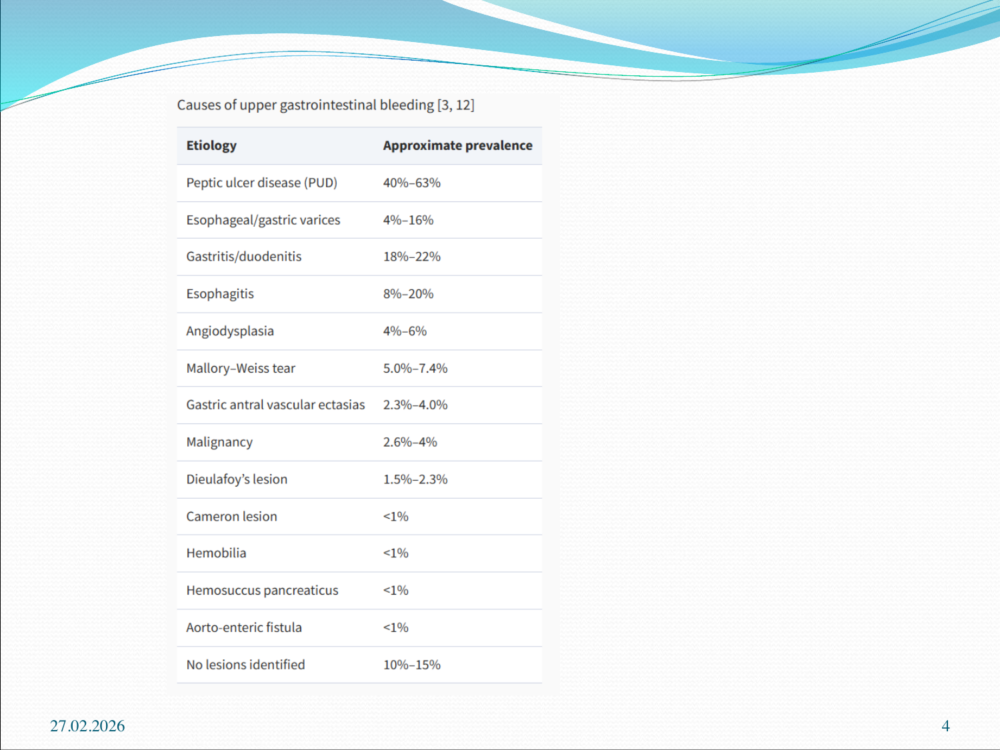
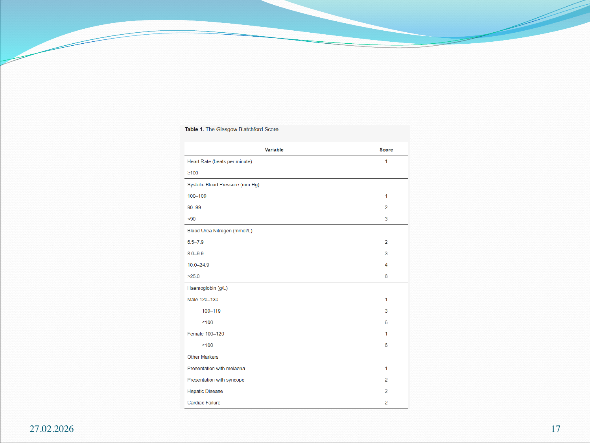
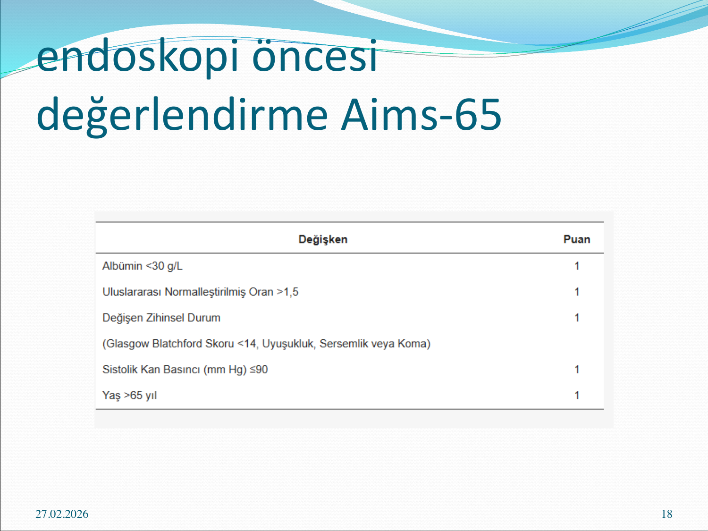
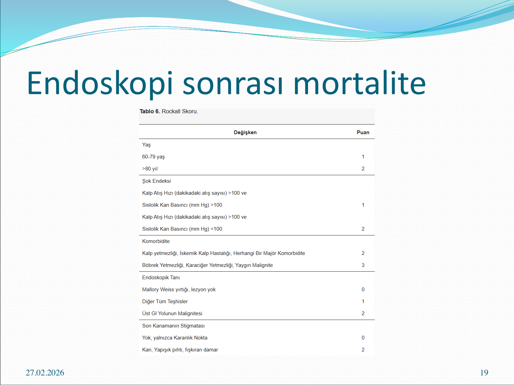
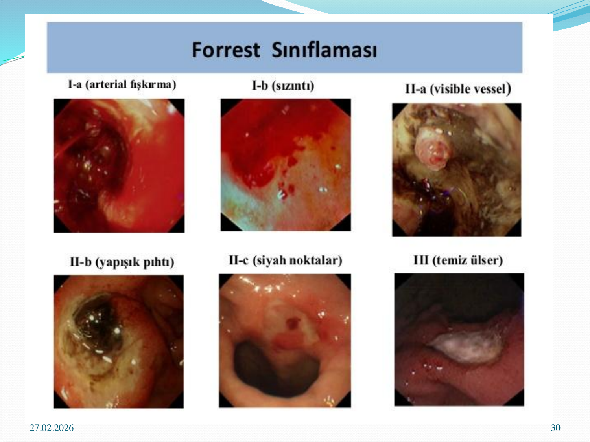
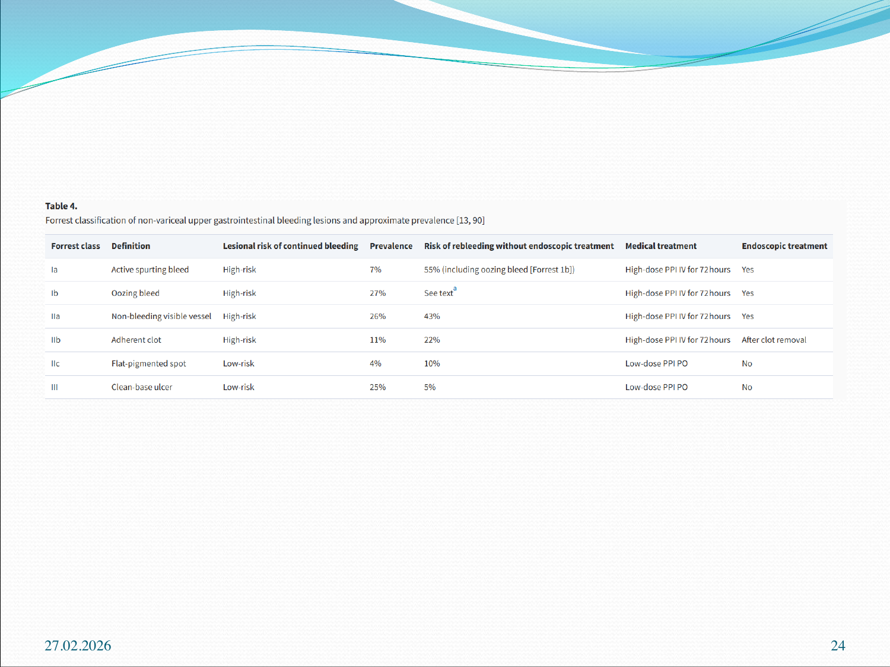
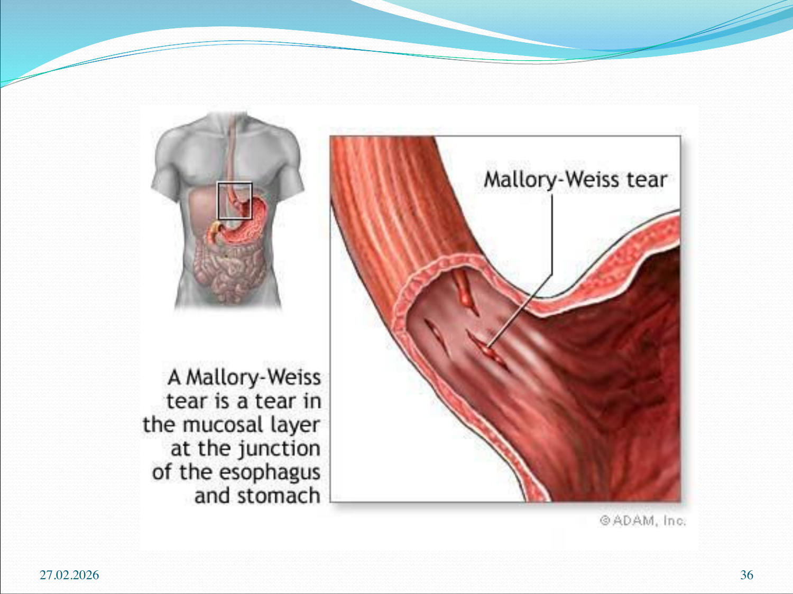
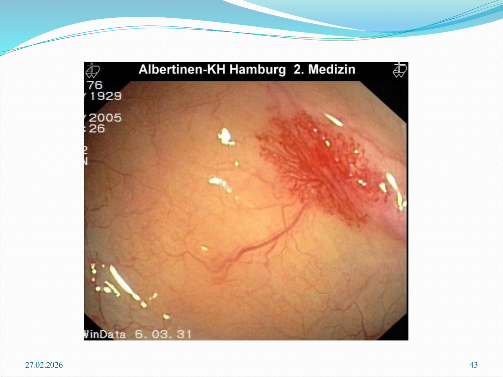
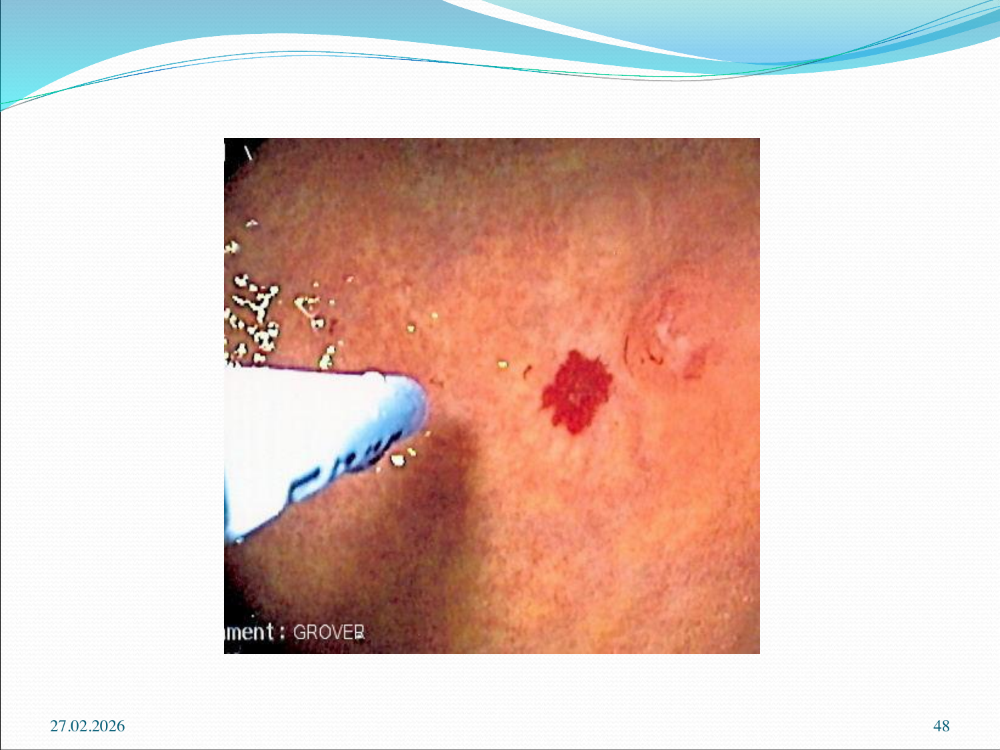

# ÜST GASTROİNTESTİNAL KANAMALAR

**Hazırlayan:** Doç. Dr. Berk Baş
**Bölüm:** Aydın Adnan Menderes Üniversitesi Tıp Fakültesi — Gastroenteroloji Bilim Dalı

---

## İÇİNDEKİLER

1. [Tanım ve Epidemiyoloji](#tanım-ve-epidemiyoloji)
2. [Etiyoloji](#etiyoloji)
3. [Klinik — Hematemez vs Melena](#klinik--hematemez-vs-melena)
4. [Öykü ve Fizik Muayene](#öykü-ve-fizik-muayene)
5. [Hipovolemi Derecesinin Değerlendirilmesi](#hipovolemi-derecesinin-değerlendirilmesi)
6. [Laboratuvar Değerlendirme](#laboratuvar-değerlendirme)
7. [Risk Skorlaması](#risk-skorlaması)
8. [Forrest Sınıflaması](#forrest-sınıflaması)
9. [İlk Acil Yaklaşım](#i̇lk-acil-yaklaşım)
10. [Peptik Ülser Kanaması Tedavisi](#peptik-ülser-kanaması-tedavisi)
11. [Özefagus Varis Kanaması](#özefagus-varis-kanaması)
12. [Mallory-Weiss ve Diğer Nedenler](#mallory-weiss-ve-diğer-nedenler)
13. [Endoskopik Tedavi Yöntemleri](#endoskopik-tedavi-yöntemleri)
14. [Antitrombotik Alan Hastada Yaklaşım](#antitrombotik-alan-hastada-yaklaşım)

---

## TANIM VE EPİDEMİYOLOJİ

**Üst gastrointestinal (GİS) kanama:** **Treitz ligamentinin proksimalindeki** (ösofagus, mide, duodenum) kaynaklardan gelişen kanamadır.

**Başvuru:**

* Akut üst GİS kanaması olan hastalar genellikle **hematemez ve/veya melena** ile başvurur.
* İlk değerlendirme **hemodinamik stabilite** ve gerekirse resüsitasyonun değerlendirilmesidir.
* İlk değerlendirmede öykü, fizik muayene ve laboratuvar testleri bulunur.

> **💡 Klinik gerçek:** Üst GİS kanaması öyküsü olan hastaların **%60'a kadarı aynı lezyondan** tekrar kanar — bu nedenle hastalara **önceki kanama atakları** mutlaka sorulmalıdır.

---

## ETİYOLOJİ



| Neden | Yaklaşık Prevalans |
|---|---|
| **Peptik ülser hastalığı (PUH)** | **%40-63** (en sık) |
| **Gastrit / duodenit** | %18-22 |
| **Özofajit** | %8-20 |
| **Özofageal / gastrik varisler** | %4-16 |
| **Anjiyodisplazi** | %4-6 |
| **Mallory-Weiss yırtığı** | %5-7.4 |
| Gastrik antral vasküler ektazi (GAVE) | %2.3-4 |
| **Malignite** | %2.6-4 |
| **Dieulafoy lezyonu** | %1.5-2.3 |
| Cameron lezyonu, hemobilia, aortoenterik fistül | <%1 |
| **Lezyon saptanamayan** | %10-15 |

### Etiyolojik Gruplama (Patogeneze Göre)

**A. Ülseratif / eroziv / inflamatuar:**

* **Peptik ülser hastalığı**
* **Enfeksiyöz:** *Helicobacter pylori*, CMV, HSV
* **İlaç ilişkili:** Aspirin, **NSAİD**, antikoagülanlar, tablet teması (tetrasiklin, potasyum klorür, kinidin)

**B. Travma:**

* **Mallory-Weiss sendromu**
* Yabancı cisim

**C. Vasküler lezyonlar:**

* **Özefageal / gastrik varisler**
* **Anjiyomalar**
* **Herediter Hemorajik Telenjiektazi (HHT — Osler-Weber-Rendu)**
* **Dieulafoy lezyonu** — submukozal aberran dilate damar
* **Aortoenterik fistül** (genellikle prostetik aort greft komplikasyonu)

**D. Tümörler** (mide kanseri, lenfoma, GIST)

**E. Hemobilia** (biliyer sistem kaynaklı)

### Tıbbi Geçmişe Göre Olası Kanama Kaynakları

| Özellik | Olası Kanama Kaynağı |
|---|---|
| **Karaciğer hastalığı / alkol abüzü** | **Varis veya portal hipertansif gastropati** |
| **Renal hastalık, aort stenozu, HHT** | **Anjiyodisplazi** |
| **H. pylori enfeksiyonu, NSAİD, sigara** | **Peptik ülser** |
| **Sigara, alkol, H. pylori** | **Malignite** |
| **Gastroenterik anastomoz** | Marjinal ülser |

### Dikkat Edilmesi Gereken İlaçlar

* **Peptik ülser predispozanları:** Aspirin, diğer NSAİD'ler
* **Özofagus ülseri yapan ilaçlar:**
    * **Tetrasiklin, doksisiklin, klindamisin** — direkt irritan
    * **Aspirin/NSAİD** → özofajit, striktür, kanama
    * **Bifosfonatlar**
* **Antiplatelet ajanlar** (klopidogrel) ve **antikoagülanlar** kanamayı teşvik eder
* **Bizmut ve demir** dışkıyı siyaha çevirebilir → klinik tabloyu değiştirir (melenayı taklit eder!)

---

## KLİNİK — HEMATEMEZ VS MELENA

### Hematemez

* **Kırmızı kan veya kahve telvesi kusma**
* **Treitz ligamanının proksimalinden** kanamayı gösterir
* **Kanlı kusma** → devam eden **orta-şiddetli** kanama
* **Kahve telvesi** kusma → daha **sınırlı** kanama (mide asidi ile kanın temas süresi uzun)

### Melena

* **Siyah, katran (kokulu) dışkı**
* **%90'ı Treitz ligamanının proksimalinden** kaynaklanır
* Ancak orofarinks, nazofarinks, ince bağırsak veya **sağ kolondan** da kaynaklanabilir
* Genelde en az **50-100 mL** kan kaybı sonrası gelişir

### Hematokezi (Maroon / Parlak Kırmızı)

* Genelde alt GİS kanamasını düşündürür
* Ancak **masif / hızlı üst GİS kanamasında** hematokezi de görülebilir — bu durum **mortalite artışı** göstergesidir

---

## ÖYKÜ VE FİZİK MUAYENE

### Sorgulanması Gerekenler

* **Kanamanın süresi ve miktarı** — başlangıcından şu ana
* **Önceki kanama atakları** (%60 aynı lezyondan tekrarlar)
* **Karaciğer hastalığı / alkol abüzü**
* **NSAİD / aspirin / antikoagülan** kullanımı
* **Bilinen ülser, varis, malignite** öyküsü
* **Dispepsi öyküsü**
* **Kilo kaybı** (→ malignite)
* **Bulantı-kusma sonrası kanama** (→ Mallory-Weiss)
* **Önceki cerrahi** (aort greft, gastroenterostomi)

### Kanamanın Şiddetini Gösteren Semptomlar

* **Ortostatik baş dönmesi**
* **Konfüzyon**
* **Anjina** (kardiyak rezerv yetersizliği)
* **Şiddetli çarpıntı**
* **Soğuk / rutubetli ekstremiteler**

### Fizik Muayene

* **Vital bulgular** — taşikardi, hipotansiyon (ortostatik)
* **Cilt:** Solukluk, terleme, siyanoz
* **Batın:** Hassasiyet, peritoneal irritasyon (→ perforasyon şüphesi)
* **Rektal muayene (ZORUNLU):** Melena / hematokezi / kahverengi dışkı değerlendirmesi
* **Karaciğer hastalığı bulguları:** Spider nevüs, palmar eritem, kaput meduza, splenomegali, asit

> **⚠️ KRİTİK:** **Rektal muayene her üst GİS kanama şüphesinde yapılmalıdır** — melena ile dışkının rengi yerinde görülerek doğrulanır.

---

## HİPOVOLEMİ DERECESİNİN DEĞERLENDİRİLMESİ

| Kan Kaybı | Klinik Bulgu |
|---|---|
| **<%15** (hafif-orta) | **Dinlenme taşikardisi** |
| **≥%15** | **Ortostatik hipotansiyon:** Ayağa kalkınca sistolik KB'de >20 mmHg düşme ve/veya kalp hızında >20/dk artış |
| **≥%40** | **Supin hipotansiyon** (yatar pozisyonda bile) |

> **💡 Genç ve sağlıklı erişkinlerde hipotansiyon geç bulgudur** — genç hastanın kompansatuvar mekanizmaları kan basıncını uzun süre korur. Taşikardi ve ortostatik değişiklikler daha erken uyarıcıdır.

---

## LABORATUVAR DEĞERLENDİRME

**İstenecek testler:**

* **Tam kan sayımı** (Hb, Hct, platelet)
* **Serum biyokimyaları**
* **BUN, kreatinin**
* **Karaciğer fonksiyon testleri** (AST, ALT, albümin)
* **Koagülasyon** (PT/INR, aPTT)
* **Kan grubu ve cross-match**

### Dikkat Edilmesi Gereken Noktalar

**1. Başlangıç hemoglobin yanıltıcıdır:**

Akut üst GİS kanamasında başlangıç Hb düzeyi, hastanın **başlangıç noktasında** kalabilir — çünkü hasta **tam kan (hem eritrosit hem plazma)** kaybeder ve henüz hemodilüsyon gerçekleşmemiştir.

> **💡 Hematokrit hemen düşmez:**
>
> * Kanamadan hemen sonra hem şekilli eleman hem plazma kaybı olur → **hemokonsantrasyon**
> * Ekstravasküler sıvı volümü normale getirmek için vasküler kompartmana geçer → **24-72 saat alır**
> * Bu yüzden ilk Hb normal olsa bile, **hastayı klinik olarak değerlendir!**

**2. BUN/kreatinin oranı yüksektir:**

Akut üst GİS kanamasında **BUN:Kreatinin >36:1** veya **Üre:Kreatinin >100:1** tipik bulgudur.

**Mekanizma:**
* Barsakta hemoglobinin **proteinlere yıkılması** → absorbe edilen nitrojen karaciğerde üreye dönüşür
* **Prerenal azotemi** (dehidratasyon, hipoperfüzyon)

---

## RİSK SKORLAMASI

### Glasgow-Blatchford Skoru (GBS) — Endoskopi Öncesi



| Değişken | Puan |
|---|---|
| **Kalp hızı ≥100/dk** | 1 |
| **Sistolik KB** 100-109 / 90-99 / <90 | 1 / 2 / 3 |
| **BUN (mmol/L)** 6.5-7.9 / 8-9.9 / 10-24.9 / >25 | 2 / 3 / 4 / 6 |
| **Hb (g/L, erkek)** 120-130 / 100-119 / <100 | 1 / 3 / 6 |
| **Hb (g/L, kadın)** 100-120 / <100 | 1 / 6 |
| **Melena ile başvuru** | 1 |
| **Senkop ile başvuru** | 2 |
| **Hepatik hastalık** | 2 |
| **Kardiyak yetmezlik** | 2 |

**Kullanım:** GBS **0 olan hastalar** çok düşük risklidir, **ayaktan takip** edilebilir.

### AIMS-65 Skoru — Endoskopi Öncesi



| Değişken | Puan |
|---|---|
| **A**lbumin <30 g/L | 1 |
| **I**NR (Uluslararası Normalleştirilmiş Oran) >1.5 | 1 |
| **M**ental durum değişikliği (GBS <14, uyuşukluk, koma) | 1 |
| **S**istolik kan basıncı ≤90 mmHg | 1 |
| Yaş **65** yıl üstü | 1 |

**Kullanım:** AIMS65, **hastane içi mortaliteyi tahmin etmede** GBS ve pRS'den daha iyi olduğu gösterilmiştir.

### Rockall Skoru (RS) — Endoskopi Sonrası



| Değişken | Puan |
|---|---|
| **Yaş** 60-79 / ≥80 | 1 / 2 |
| **Şok endeksi** | |
| • KH >100 ve SKB >100 | 1 |
| • KH >100 ve SKB <100 | 2 |
| **Komorbidite** | |
| • KKY, İKH, diğer major | 2 |
| • Renal/karaciğer yetmezliği, yaygın malignite | 3 |
| **Endoskopik tanı** | |
| • Mallory-Weiss, lezyon yok | 0 |
| • Diğer tüm tanılar | 1 |
| • Üst GİS malignitesi | 2 |
| **Son kanamanın stigmatası** | |
| • Yok / karanlık nokta | 0 |
| • Kan, yapışık pıhtı, fışkıran damar | 2 |

**Kullanım:**

* **Klinik (pre-endoskopik) Rockall:** Sadece yaş, şok endeksi, komorbidite — endoskopi öncesi hesaplanır.
* **Tam Rockall:** Endoskopi sonrası.
* **Mortalite** tahmininde yeniden kanama tahmininden daha iyidir.

### Skorlama Özetlemesi — Yüksek Risk Kesim Değerleri

> **Yüksek risk grubu tanımı:**
>
> * **ABC skoru ≥8**
> * **AIMS65 ≥3**
> * **GBS ≥12**
> * **pRS (pre-endoskopik Rockall) ≥6**
>
> **AIMS65** hastane içi mortalite tahmininde GBS ve pRS'den **daha iyidir**.

---

## FORREST SINIFLAMASI





Forrest sınıflaması, **peptik ülser kanamalarında yeniden kanama riskini öngörmede** kullanılır ve **terapötik müdahale ihtiyacını** belirler.

| Forrest | Tanım | Risk | Prevalans | Yeniden Kanama Riski | Tıbbi Tedavi | Endoskopik Tedavi |
|---|---|---|---|---|---|---|
| **Ia** | **Aktif fışkıran kanama** | **Yüksek** | %7 | **%55** (Ib dahil) | **Yüksek doz IV PPI × 72 saat** | **Evet** |
| **Ib** | **Sızıntılı kanama** | **Yüksek** | — | (yukarıdaki dahil) | **Yüksek doz IV PPI × 72 saat** | **Evet** |
| **IIa** | **Kanamayan görülebilir damar** | **Yüksek** | %43 | | **Yüksek doz IV PPI × 72 saat** | **Evet** |
| **IIb** | **Yapışık pıhtı** | Yüksek | %22 | | Yüksek doz IV PPI × 72 saat | Pıhtı kaldırıldıktan sonra |
| **IIc** | **Düz pigmente nokta** | **Düşük** | %10 | | **Düşük doz oral PPI** | **Hayır** |
| **III** | **Temiz tabanlı ülser** | **Düşük** | %5 | | **Düşük doz oral PPI** | **Hayır** |

> **💡 Öğrenci ezberi — Forrest:**
>
> * **Ia-IIb → endoskopik tedavi + IV PPI** (yüksek risk)
> * **IIc, III → düşük risk, sadece oral PPI**

---

## İLK ACİL YAKLAŞIM

### Temel Prensip: ABC

Hastada GİS kanamasından şüphelenildiğinde **önce durumun acilliği** saptanmalıdır:

```
           ABC (Airway, Breathing, Circulation)
                         ↓
     Hemodinami stabil mi? → Vital bulgular
                         ↓
            HEMODİNAMİK OLARAK UNSTABIL
                         ↓
      • NPO (nil per os)
      • İki adet büyük kalibre IV line (≥16G)
      • Oksijen desteği (nazal kanül)
      • Hızlı bolus izotonik NaCl (kristalloid resüsitasyon)
      • Kan ve ürünleri için hazırlık
                         ↓
               Transfüzyon eşikleri:
      • Aktif kanama + hemodinamik unstabilite → PRBC
      • Hb <8 (düşük risk): 2 U PRBC
      • Hb <9 (yaşlı, KAH): 2-4 U PRBC
      • Ciddi aktif kanama → 1:1:1 PRBC:TDP:Platelet
                         ↓
                    Koagülopati?
      • TDP (taze donmuş plazma) → koagülopatide ya da 4 U PRBC sonrası
      • Platelet <50.000 veya ASA kullanımı → platelet transfüzyonu
                         ↓
                    Farmakoterapi
      • PPI (tüm şüpheli/ciddi kanama):
        – Aktif kanama: IV esomeprazol/pantoprazol 80 mg bolus
        – Aktif kanama yok: 40 mg IV
      • Varis şüphesi: Somatostatin veya analogu (oktreotid 50 mcg bolus + 50 mcg/saat)
      • Variseal: IV antibiyotik (seftriakson veya kinolon)
                         ↓
               Konsültasyon
      • Acil gastroenteroloji konsültasyonu
      • Masif kanama → cerrahi + girişimsel radyoloji
                         ↓
       ENDOSKOPİ (mümkünse ilk 24 saat içinde,
       hemodinami stabil olduktan sonra)
```

### Önemli Notlar

* **NG (nazogastrik) lavaj:** Kanama kaynağı net değilse (üst mi alt mı?) veya endoskopi öncesi mideyi temizlemek için düşünülebilir.
* **NG temiz + melena (+) →** mortalite ~%5
* **NG taze kan + rektal muayenede taze kan karışık →** mortalite **%29**
* **Yaşlı / KAH:** Hct **%30'un altına inmemelidir**
* **Oksijen satürasyonu yetersizse** nazal O₂ desteği
* **CVP / wedge basınç monitörizasyonu:** Kalp hastası olanlarda sıvı yüklemesinden kaçınmak için

---

## PEPTİK ÜLSER KANAMASI TEDAVİSİ

### Medikal Tedavi

* **Antisekretuar ajanlar (PPI)** temel taş
    * Ülser iyileşmesini hızlandırır
    * Rekürrensi azaltır
    * **Forrest Ia-IIa:** Yüksek doz IV PPI × 72 saat
* **Antiasit, sukralfat** — yardımcı
* **H. pylori testi (+) ise eradike edilir** — yeniden kanamayı belirgin azaltır

### Endoskopik Tedavi

**Endikasyonlar:**

* **Aktif kanamalı hasta** (Forrest Ia, Ib)
* **Kanamayan görülebilir damar** (visible vessel — Forrest IIa)

**Endoskopik tedavi > medikal tedavi** (kanama kontrolünde).

### Anjiyografi + Embolizasyon

* **Masif ve cerrahi yapılamayan** hastada selektif mezenter anjiyografi → **embolizasyon**
* **Anjiyografi için en az 0.5 mL/dakika** aktif kanama olmalıdır

---

## ÖZEFAGUS VARİS KANAMASI

**Portal hipertansiyona sekonder** gelişen varislerden olan kanamalardır.

> **⚠️ ÖNEMLİ:** Karaciğer sirozlu hastada varis olsa bile, **kanamaların %50'si varis dışı sebepledir** (peptik ülser, portal hipertansif gastropati, vs.) — endoskopi şart.

### Klinik Seyir

* **Kanamanın %50'si spontan durur.**
* Medikal tedavi ile **yeniden kanama oranı %60-70** (çok yüksek).

### Tedavi

**1. Profilaksi (kanama öncesi):**

* **Selektif olmayan β-bloker** (propranolol, nadolol, karvedilol) — portal basıncı düşürür

**2. Aktif kanama tedavisi:**

* **Medikal:**
    * **Somatostatin veya analoğu (oktreotid)** — splanknik vazokonstriksiyon
    * **IV antibiyotik profilaksisi** (seftriakson) — sepsis ve rekürren kanamayı azaltır
* **Endoskopik:**
    * **Band ligasyonu (birinci tercih)**
    * Skleroterapi (polidokanol, etanolamin)
* **Balon tamponad:** **Sengstaken-Blakemore** veya **Minnesota** tüpü — geçici kontrol, **24-48 saat** maksimum; yerleştirmeden önce **endotrakeal entübasyon şart**
* **TIPS (Transjugular intrahepatik portosistemik şant):** Endoskopik tedavi başarısızsa

---

## MALLORY-WEISS VE DİĞER NEDENLER

### Mallory-Weiss Sendromu



* **Distal özofagusta gastroözofageal bileşke** bölgesinde **mukozal yırtık**.
* Tipik olarak **şiddetli kusma sonrası** oluşur.
* **Komplikasyon:** **Boerhaave sendromu** (tam kat özofagus rüptürü — hayati tehdit!)

**Tedavi:**

* **Kanamaların çoğu kendiliğinden durur.**
* **Endoskopik tedavi** aktif kanama olanlarda uygulanır.
* Kanayan damar **anjiyografik embolizasyon** ile durdurulabilir.

### İlaç İlişkili Kanama

* **Sebep olan ilaç kesilir**, **PPI** verilir.
* **Tekrar kanama** ilaç bırakıldıktan sonra **çok azdır**.
* **Warfarin kullanan hasta:** **Vitamin K** + **taze donmuş plazma**
* **Endoskopik tedavi** sadece kontrol edilemeyen kanamalarda endike.

### Dieulafoy Lezyonu



* **Dilate aberran submukozal damar** üzerindeki epiteli erode eder.
* **Primer bir ülser değildir.**
* Tanı zor — damar çok küçük ama dramatik kanama yapar.
* **Tedavi:** Endoskopik (termal koagülasyon, klip, bant, skleroterapi)
* Yüksek **rekürrens riski**
* **India ink ile işaretleme** → cerrahi rezeksiyon alternatif (rekürrens yok)

### Anjiyodisplaziler

* **Herediter hemorajik telenjiyektazinin (HHT)** komponenti olabilir.
* **Kanama %50 kendiliğinden durur.**
* **Endoskopik tedavi:** Termal koagülasyon, **lazer fotokoagülasyon**, **argon plazma koagülasyonu (APC)**

---

## ENDOSKOPİK TEDAVİ YÖNTEMLERİ



### 1. İnjeksiyon Tedavisi

* **Epinefrin (1:10.000 dilüsyonda, max 10 mL)** — vazokonstriksiyon ve mekanik kompresyon
* **%98 alkol** (max total hacim <1 mL)
* **Sklerozan madde** (polidokanol 1%)

> **💡 Epinefrin tek başına yetersiz** — 2. bir modalite (termal veya mekanik) ile kombinasyon önerilir.

### 2. Termal Koagülasyon

* **Heater probe** — direkt ısı
* **Bipolar / multipolar probe**
* **Argon Plazma Koagülasyonu (APC)**
* **Lazer** (günümüzde nadir)

### 3. Mekanik Yöntemler

* **Endoklip** — kanayan damarın mekanik kapatılması
* **Over-the-scope clip (OTSC)** — büyük lezyonlar için
* **Bant ligasyonu** — varis ve Dieulafoy için

---

## ANTİTROMBOTİK ALAN HASTADA YAKLAŞIM

### Antikoagülan Alan Hasta

**Hayatı tehdit eden kanama:**

| İlaç | Müdahale |
|---|---|
| **VKA (warfarin)** | **Protrombin kompleks konsantresi (PCC)** |
| **DOAK** | **İlaca spesifik reversal ajan** (dabigatran → idarusizumab; faktör Xa inhibitörleri → andeksanet alfa) veya PCC |

**Hayatı tehdit etmeyen kanama:**

* **VKA:** TDP veya vitamin K'ye karşı önerilmez (rutin olarak verilmez)
* **DOAK:** Spesifik reversal ajana karşı öneri yok

### Antiplatelet Alan Hasta

**Sekonder kardiyovasküler korumada:**

* **Trombositopeni olmadıkça platelet transfüzyonuna karşı öneri**
* **Tek ajan (ASA) ile sekonder koruma:** ASA'yı **durdurmaya karşı öneri**; durdurulduysa **hemostaz endoskopik doğrulandığı gün** yeniden başla
* **Tek P2Y12 inhibitörü:** Benzer; 5 gün içinde yeniden başlat
* **Dual antiplatelet tedavi:** ASA'yı durdurmaya karşı öneri; P2Y12 inhibitörü 5 gün içinde yeniden başlatılabilir

---

## SINAV NOTLARI — ANAHTAR HATIRLATMALAR

> **📋 En Sık Sorulan Noktalar:**
>
> 1. **En sık üst GİS kanaması nedeni: Peptik ülser hastalığı (%40-63).**
> 2. **Hematemez** = Treitz proksimalinden kanama. **Kahve telvesi** → sınırlı/yavaş; **kanlı** → aktif/orta-ağır.
> 3. **Melena %90 Treitz proksimalinden**, ama alt GİS'ten de olabilir.
> 4. **Masif üst GİS kanaması hematokezi ile de gelebilir** — hipotansiyon + taze rektal kanama → mortalite ↑.
> 5. **Başlangıç Hb yanıltıcıdır** (hemokonsantrasyon 24-72 saatte düzelir).
> 6. **BUN:Kreatinin >36:1** veya **Üre:Kreatinin >100:1** → üst GİS kanaması lehine.
> 7. **Forrest Ia (fışkıran) ve Ib (sızıntılı)** → yüksek risk, **endoskopik tedavi + yüksek doz IV PPI 72 saat**.
> 8. **Forrest IIc (düz nokta) ve III (temiz ülser)** → düşük risk, sadece oral PPI.
> 9. **AIMS65** mortalite tahmininde **GBS ve Rockall'dan üstündür**.
> 10. **GBS 0** olan hasta → ayaktan izlem uygun.
> 11. **Karaciğer hastası + üst GİS kanama:** Somatostatin/oktreotid + **IV seftriakson** + band ligasyonu. **%50 kanama varis dışı kaynaklıdır.**
> 12. **Mallory-Weiss:** Şiddetli kusma + GE bileşke yırtık. **%90 kendiliğinden durur.** Komplikasyon: **Boerhaave.**
> 13. **Dieulafoy lezyonu:** Submukozal aberran damar, primer ülser değil. Yüksek rekürrens.
> 14. **Aortoenterik fistül:** Prostetik aort greft komplikasyonu — ölümcül, mutlaka akılda tut.
> 15. **Başlangıç tedavisi:** İki büyük kalibre IV + kristalloid, NPO, PPI 80 mg IV bolus.
> 16. **Transfüzyon eşikleri:** Stabil → Hb <8; yaşlı/KAH → Hb <9; varis → hedef Hb 7-8 (aşırı transfüzyon portal basıncı artırır).
> 17. **NG lavaj rutin önerilmez** ama kaynak belirsizse veya endoskopi öncesi yapılabilir.
> 18. **Endoskopi zamanlaması:** Hemodinamik stabilite sonrası, **ilk 24 saat içinde**.
> 19. **Anjiyografik embolizasyon** → masif kanama + cerrahiye uygun olmayan. **≥0.5 mL/dk** aktif kanama gerekir.
> 20. **Warfarin kullanan hasta:** Vit K + TDP; hayatı tehdit varsa **PCC**.

---

> **Kaynaklar:**
>
> 1. UpToDate — Approach to acute upper gastrointestinal bleeding in adults
> 2. European Society of Gastrointestinal Endoscopy (ESGE) — Diagnosis and management of nonvariceal upper gastrointestinal bleeding 2021
> 3. Forrest JA et al. Endoscopy in gastrointestinal bleeding. Lancet 1974;2:394-7.
> 4. Blatchford O et al. Lancet 2000;356:1318-21.
> 5. Rockall TA et al. Gut 1996;38:316-21.
