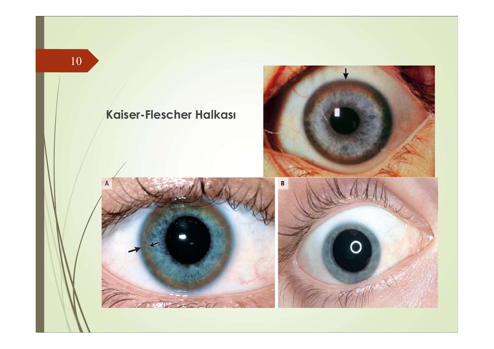

# WİLSON HASTALIĞI

**Hazırlayan:** Dr. İsmail Taşkıran
**Bölüm:** Adnan Menderes Üniversitesi - Gastroenteroloji Bilim Dalı

---

## İÇİNDEKİLER

1. [Tanım ve Tarihçe](#tanim-ve-tarihçe)
2. [Normal Bakır Metabolizması](#normal-bakir-metabolizmasi)
3. [Genetik ve Etyoloji](#genetik-ve-etyoloji)
4. [Patogenez](#patogenez)
5. [Patoloji](#patoloji)
6. [Klinik Bulgular](#klinik-bulgular)
7. [Tanı](#tani)
8. [Tedavi](#tedavi)
9. [Klinik İpuçları ve Sınav Notları](#klinik-ipuçlari-ve-sinav-notlari)

---

## TANIM VE TARİHÇE

> Wilson hastalığı, **otozomal resesif** geçişli, herediter bakır metabolizması bozukluğudur. **Genç yaşlarda** görülen, akut ve kronik seyir gösterebilen bir karaciğer hastalığıdır.

**Hastalığı tek cümlede anlamak:**

> Bakır safra ile atılamaz → Karaciğer, beyin, göz ve diğer organlarda birikir → Organ hasarı

### Tarihsel Gelişim

| Yıl | Olay |
|---|---|
| 1902 | **Kayser** pigmente korneal halkaları tarif etti (Wilson'dan 10 yıl önce!) |
| 1912 | **Samuel Alexander Kinnier Wilson** hastalığı tanımladı → "Progresif lentiküler dejenerasyon" |
| 1921 | Hall, genetik bir hastalık olduğunu bildirdi |
| 1929 | Beyin ve karaciğerde aşırı bakır biriktiği tespit edildi |
| 1952 | **Serum seruloplazmin** düzeyinin düşük olduğu gösterildi |
| 1960 | Bearn tarafından genetik geçiş doğrulandı |
| 1993 | **13. kromozom** ve **ATP7B** geninin rolü gösterildi |

> 💡 Wilson hastalığını ilk tanımlayan kişi bir **nörolog**dur — çünkü hastalık ilk olarak nöropsikiyatrik bulgularla fark edilmiştir!

---

## NORMAL BAKIR METABOLİZMASI

Hastalığı anlamak için önce bakırın vücuttaki normal yolculuğunu bilmek gerekir:

```
    DİYETLE ALINAN BAKIR (1-5 mg/gün)
              ↓
    Üst GİS'ten EMİLİM (2 mg/gün)
              ↓
    Portal ven ile KARACİĞERE taşınma
              ↓
    ┌─────────┼─────────┐
    ↓                   ↓
  SAFRA ile atılım   SERULOPLAZMİN'e
  (BAŞLICA YOL)      bağlanarak kana
    ↓                 verilme (%90)
  DIŞKI               ↓
                    Dokulara dağılım
                       ↓
                    İDRAR ile atılım
                    (maks 1 mg/gün)
```

**Anahtar noktalar:**
* Bakırın **başlıca atılım yolu safradır** → Wilson'daki primer defekt tam olarak burasıdır
* Seruloplazmin, kanda bakırın **%90-95**'ini taşır → Bakırın güvenli taşıyıcısı
* İdrar ile **maksimum 1 mg/gün** bakır atılabilir → Bu yol safranın yerini tutamaz

---

## GENETİK VE ETYOLOJİ

| Parametre | Değer |
|---|---|
| Kalıtım | **Otozomal resesif** |
| Gen | **ATP7B** |
| Kromozom | **13q14.3** (13. kromozomun uzun kolu) |
| Kodladığı protein | **P-tipi ATPaz** bakır transport proteini |
| Proteinin yeri | Hepatosit **bazolateral yüzeyi** (Trans-Golgi ağı) |
| Proteinin görevi | Bakırın **safra kanaliküllerine transportu** + seruloplazmine yüklenmesi |
| Tanımlanan mutasyon sayısı | **>400** farklı mutasyon |
| Hastalık sıklığı | **1/30.000 - 40.000** |
| Taşıyıcı sıklığı | **1/90** |

### ATP7B Proteini Ne Yapar?

ATP7B'nin iki kritik görevi vardır:

```
    ATP7B PROTEİNİ
         │
    ┌────┴────┐
    ↓         ↓
  Görev 1   Görev 2
    │         │
  Bakırı     Bakırı
  SAFRA      SERULOPLAZMİN'e
  kanalına   yükle
  pompala     │
    │         ↓
    ↓       Seruloplazmin
  ATILIM    sentezle → kana ver
```

**Mutasyon olursa** → Her iki görev de bozulur:
* Safra ile bakır atılamaz → **Bakır birikimi**
* Seruloplazmin yapılamaz → **Seruloplazmin ↓** + bakır albumine gevşek bağlanır → **Serbest bakır ↑**

---

## PATOGENEZ

### Temel Mekanizma

```
  ATP7B MUTASYONU
        ↓
  Bakırın safra ile atılımı ↓↓↓
        ↓
  Bakır hepatositte birikir
        ↓
  ┌─────┤
  │     ↓
  │  Seruloplazmin sentezi de bozulur
  │     ↓
  │  Seruloplazmin ↓ → Bakır albumine GEVŞEK bağlanır
  │     ↓
  │  SERBEST BAKIR ↑↑↑
  │     ↓
  │  İdrar bakırı ↑ (ama yeterli atılamaz!)
  │     ↓
  └→ POZİTİF BAKIR DENGESİ
        ↓
  BAKIR PARANKİMAL ORGANLARDA BİRİKİR:
  KARACİĞER > BEYİN > GÖZ > BÖBREK > EKLEM > KEMİK
```

### Bakır Neden Zarar Verir?

Dokularda biriken fazla bakır iki yolla hasar yapar:

1. **Oksidatif stres:** Serbest radikallerin oluşumu → lipid peroksidasyonu → hücre membranı hasarı
2. **Nörotoksisite:**
   - Nöronlara **direkt toksik etki**
   - Beyinde **MAO-A'yı (Mono Amin Oksidaz-A) selektif olarak inhibe** eder

> 💡 **Mekanizmayı anlat:** MAO-A inhibisyonu → serotonin, noradrenalin, dopamin yıkımı ↓ → Bu nörotransmitterlerin dengesizliği → **depresyon, psikoz, davranış değişiklikleri**. Wilson'daki psikiyatrik tablonun patolojik temeli budur.

### Yaşa Göre Klinik Tablo

Bu çok kritik bir kavramdır:

```
          BAKIR BİRİKİM ZAMANI
          ─────────────────→

  Doğum     1. dekad    2. dekad    3.-4. dekad
    │          │           │            │
    │      Subklinik   HEPATİK     NÖROPSİKİYATRİK
    │      birikim     bulgular     bulgular
    │                  ön planda    ön planda
    │                     │            │
    │                  Çocuk +      Genç erişkin
    │                  Ergen
```

**⚠️ ÖNEMLİ:**

* **1. ve 2. dekad** (çocukluk-ergenlik) → **Hepatik bulgular** ön planda (bakır henüz karaciğerde)
* **3. ve 4. dekad** (genç erişkin) → **Nöropsikiyatrik bulgular** ön planda (bakır beyine ulaşmış)
* Nörolojik bulguları olan hastaların neredeyse tamamında karaciğer hastalığı da vardır (en azından subklinik düzeyde)

---

## PATOLOJİ

### Karaciğer Patolojisi

Bakır birikiminin karaciğerdeki aşamalı seyri:

```
  Bakır hepatosit SİTOZOLÜNDE birikir
              ↓
  Sitoplazma'da yağ damlacıkları → STEATOZ
              ↓
  Piece-meal nekroz + Köprüleşme nekrozu
              ↓
  Tipik KRONİK HEPATİT tablosu
              ↓
  FİBROZİS gelişimi
              ↓
  MAKRONODÜLER SİROZ
```

> 💡 **Sınav notu:** Wilson'da histolojik bulgular **non-spesifiktir** — steatohepatit, kronik hepatit veya siroz herhangi biri olabilir. **Otoimmün hepatiti taklit edebilir!** Ayırt ettirici olan **bakır boyaları** (rodanin, orsein) ve **karaciğer bakır kantitasyonu** (>250 mcg/g kuru ağırlık) olacaktır.

### Beyin Patolojisi

* Bakır **bazal ganglionlarda** (özellikle **putamen** ve **kaudat nükleus**) birikir
* **Simetrik yumuşama** ve dejenerasyon oluşur
* Kronik olgularda nöronlar azalır → **ventriküllerde genişleme**

### Göz Patolojisi

* Korneanın **Descement membranında** bakır içeren pigment birikimi
* Kahverengi-yeşilimsi bir halka oluşur → **Kayser-Fleischer (KF) halkası**



---

## KLİNİK BULGULAR

Hastalık genellikle **3-40 yaş** arasında ortaya çıkar. Klinik prezentasyon son derece heterojendir — bu nedenle "Bin Yüzlü Hastalık" (Great Mimicker) olarak da anılır.

### Organ Tutulumları Bir Bakışta

```
        BAKIR BİRİKİMİ
  ┌────────┼────────┬────────┬────────┬────────┐
  ↓        ↓        ↓        ↓        ↓        ↓
 KC      BEYİN     GÖZ    BÖBREK   KAN     EKLEM
  │        │        │        │       │        │
Steatoz  Bazal   KF      Tübüler  Coombs  Erken
Kr.hep   ganglia halkası birikim  (-)     osteo-
Siroz    Tremor  Ayçiçeği Fanconi hemoliz artrit
Fulminan Rijidite katarakt RTA-2   Anemi  Demin.
         Psikoz          Taş
```

### Hepatik Bulgular

Karaciğer tutulumu **5 farklı şekilde** prezente olabilir:

| Prezentasyon | Özellikler | Benzettiği Hastalık |
|---|---|---|
| Asemptomatik transaminaz ↑ | Rastlantısal saptanır | Yağlı karaciğer |
| **Akut hepatit** (Wilsonian) | Viral hepatit benzeri | Viral hepatit |
| **Fulminant Wilson** | ⚠️ En tehlikeli form | Fulminant hepatit |
| **Kronik hepatit** | Yıllarca sürebilir | **Otoimmün hepatit** |
| **Siroz** | Makronodüler | Kriptojenik siroz |

### Fulminant Wilson — Hayati Bilgi

Bu form tanınmazsa hastayı kaybedersiniz. Tanınması gereken ipuçları:

**⚠️ ÖNEMLİ — Fulminant Wilson Triadı:**

```
  ┌──────────────────────────────────┐
  │    GENÇ HASTA + SARILK + ANEMİ  │
  │                                  │
  │  1. Coombs (-) hemolitik anemi   │
  │  2. Belirgin sarılık             │
  │  3. HAFİF transaminaz yüksekliği │
  │     (beklenen kadar yüksek değil │
  │      çünkü Kc zaten harap)       │
  │                                  │
  │  → WİLSON DÜŞÜN!                 │
  └──────────────────────────────────┘
```

* Nekroze hepatositlerden salınan bakır → **eritrosit membranına direkt toksik etki** → Coombs (-) hemoliz
* Hemoliz nedeniyle safra kesesinde **bilirubin taşları** oluşabilir
* Akut formda KF halkası ve nörolojik bulgular **olmayabilir** — bu tuzağa düşmeyin!
* Bakırın koruyucu etkisi nedeniyle Wilson sirozunda **HCC gelişme oranı oldukça düşüktür** (diğer sirozlardan farklı)

> 💡 **Altın kural:** <40 yaş altı **herhangi bir açıklanamayan karaciğer hastalığında** Wilson mutlaka düşünülmelidir!

### Nöropsikiyatrik Bulgular

Genellikle **20 yaş üstünde** ön plandadır. Nörolojik bulguları olan hastaların neredeyse hepsinde en azından subklinik karaciğer hastalığı vardır.

**Nörolojik bulgular:**

| Bulgu | Açıklama |
|---|---|
| **Jüvenil Parkinsonizm** | Klasik nörolojik bulgu: **tremor + rijidite** |
| Disartri | En erken nörolojik bulgu olabilir |
| Distoni | Anormal postür ve hareketler |
| Koordinasyon bozukluğu | Yürüme güçlüğü, ataksi |
| Disfaji | Yutma güçlüğü |
| Drooling | Ağızdan salya akması |

**Psikiyatrik bulgular:**

* Davranış değişiklikleri, kişilik bozukluğu
* Depresyon, anksiyete
* Psikoz (şizofreniform tablolar)
* Akademik başarıda ani düşme (gençlerde!)

> 💡 **Sınav ipucu:** "Genç bir hastada açıklanamayan nöropsikiyatrik bulgular + karaciğer hastalığı = **Wilson düşün!**" Psikiyatri kliniğinde tanı konulan vakalar vardır.

### Göz Bulguları

**Kayser-Fleischer (KF) halkası:**
* Kornea çevresinde ~5 mm, kahverengi-gri-yeşilimsi halka
* **Gözle** veya **biomikroskopla** (yarık lamba/slit-lamp muayenesi) görülür
* Vakaların yaklaşık **2/3'ünde** (~%66) bulunur

| Klinik Form | KF Halkası Pozitifliği |
|---|---|
| Nörolojik Wilson | **>%95** |
| Hepatik Wilson | **~%50** |
| Akut/Fulminant Wilson | ⚠️ **Olmayabilir!** |

**Ayçiçeği katarakt** (sunflower cataract): Daha nadir bir göz bulgusu

**⚠️ ÖNEMLİ:** KF halkası **Wilson'a özgü değildir** — kronik kolestatik hastalıklarda (PBC, PSC) da görülebilir. Ancak **KF halkası + nöropsikiyatrik bulgular** birlikteliği Wilson'a **oldukça spesifiktir**.

### Diğer Organ Tutulumları

| Organ | Bulgular | Mekanizma |
|---|---|---|
| **Böbrek** | Hiperkalsüri, renal osteodistrofi, böbrek taşları, RTA tip 2 (proksimal), Fanconi benzeri tablo | Cu'ın tübüler birikimi |
| **Kas-iskelet** | Demineralizasyon, erken osteoartrit, subartiküler kistler | Cu'ın kemik ve eklemde birikimi |
| **Hematolojik** | **Coombs (-) hemolitik anemi**, akut hemolitik krizler | Cu'ın eritrosit membranına direkt toksisitesi |

---

## TANI

### Tanı Parametreleri

Wilson tanısında tek bir test yeterli değildir — birden fazla parametre birlikte değerlendirilir:

| Parametre | Normal | Wilson'da | Yön | Yorum |
|---|---|---|---|---|
| **KF halkası** | Yok | **~2/3'ünde** (+) | — | Yarık lamba ile ara |
| **Seruloplazmin** | 20-40 mg/dL | **<20 mg/dL** (%95), <5 mg/dL (%50) | ↓ | En pratik tarama testi |
| **Total serum bakırı** | 90-150 mcg/dL | **Azalmış** | ↓ | Seruloplazmine bağlı bakır düştüğü için |
| **Serbest bakır** | <15 mcg/dL | **>25 mcg/dL** | ↑ | Toksik fraksiyon |
| **24 saat idrar bakırı** | <50 mcg/gün | **>100 mcg/gün** | ↑ | Tarama + tanı |
| **Kc bakır miktarı** | <50 mcg/g kuru | **>250 mcg/g kuru** | ↑ | Altın standart |

### Serum Bakırı Neden Paradoks Olarak DÜŞÜK?

Bu sınavlarda en çok karıştırılan noktadır. Mantığı anlayın:

```
  Normal kanda bakır:
  ├─ %90-95 → SERULOPLAZMİNE BAĞLI (güvenli)
  └─ %5-10 → SERBEST (albumine gevşek bağlı)

  Wilson'da:
  ├─ Seruloplazmin ↓↓↓ → Bağlı bakır ↓↓↓
  └─ Serbest bakır ↑↑↑ (ama total miktarı az)

  SONUÇ: Total serum bakırı ↓  (çünkü taşıyıcı protein yok)
         Serbest bakır ↑       (bu toksisite yapan kısım)
         İdrar bakırı ↑       (böbrek serbest bakırı filtreler)
```

> 💡 **Ezber yerine mantık:** Seruloplazmin = bakırın otobüsü. Otobüs yok → yolcu (bakır) yolda kaldı (serbest). Yolda kalan bakır organlara zarar verir ve idrarla atılmaya çalışılır.

### Tanı Algoritması

```
  <40 yaş + açıklanamayan karaciğer hastalığı
           VEYA
  Genç hasta + nöropsikiyatrik bulgular
           ↓
  ┌────────────────────────────┐
  │ Seruloplazmin              │
  │ + 24 saat idrar bakırı     │
  │ + KF halkası (yarık lamba) │
  └────────────┬───────────────┘
               ↓
    ┌──────────┴──────────┐
    ↓                     ↓
  Her ikisi anormal     Biri anormal, biri normal
    ↓                     ↓
  TANI KUVVETLE        KARACİĞER BİYOPSİSİ
  MUHTEMEL             (bakır kantitasyonu)
    ↓                     ↓
    └─────────┬───────────┘
              ↓
    GENETİK TEST (ATP7B mutasyonu)
    + AİLE TARAMASI (1. derece yakınlar)
```

### Tanıda Dikkat Edilecek Tuzaklar

| Tuzak | Açıklama |
|---|---|
| Seruloplazmin **yanlış yüksek** | Akut faz reaktanıdır → inflamasyon, gebelik, OKS kullanımında **yükselebilir** → Wilson maskelenebilir |
| Seruloplazmin **yanlış düşük** | Kc yetmezliği (herhangi nedenle), nefrotik sendrom, protein kaybettiren enteropatide de düşük olabilir → Wilson'a özgü değil |
| Akut Wilson'da **KF halkası yok** | Fulminant formda KF halkası **olmayabilir** → yokluğu Wilson'u ekarte ettirmez |
| Genç hastada **otoimmün hepatit tanısı** | Wilson kronik hepatiti otoimmün hepatiti taklit edebilir → ANA ve anti-SMA pozitif bile olabilir |

**D-penisilamin provokasyon testi:** 500 mg D-penisilamin verilmeden önce ve sonra 24 saatlik idrar bakırı ölçülür → Wilson'da belirgin artış gösterir. Özellikle **çocuklarda** yararlıdır.

### Leipzig Skorlama Sistemi

Wilson hastalığı tanısında kullanılan uluslararası puanlama sistemi. KF halkası, nöropsikiyatrik bulgular, Coombs negatif hemoliz, seruloplazmin, idrar bakırı, karaciğer bakırı ve genetik test sonuçlarını değerlendirir. **≥4 puan** tanı koydurucudur.

---

## TEDAVİ

### Tedavinin Ana İlkesi

> **Bakır dengesini negatifleştirmek ve bunu sürekli idame ettirmek** → Tedavi **ÖMÜR BOYU** sürer!

İki strateji vardır:

```
  STRATEJİ 1: BİRİKEN BAKIRI ÇIKAR        STRATEJİ 2: YENİ BAKIR GİRİŞİNİ ENGELLE
  (Şelasyon tedavisi)                       (Absorbsiyon inhibisyonu)
       │                                         │
  D-Penisilamin                              Çinko asetat
  Trientin                                   Diyet kısıtlaması
       │                                         │
  İdrarla bakır atılımı ↑                   Enterositte Cu tutulur
                                             → dışkı ile atılır
```

### 1. D-Penisilamin (Birinci Basamak Şelatör)

| Özellik | Detay |
|---|---|
| Etki mekanizması | Bakırla **şelasyon** yaparak idrarla atılımını artırır |
| Doz | PO **1-2 g/gün** (250 mg tb, 4-5 x 1) |
| Uygulama | **Aç karnına**, **ömür boyu** |
| Ek | **Pridoksin (B6) 50 mg/hafta** (yan etkileri azaltmak için) |

**⚠️ Yan etkileri fazladır — hasta uyumu en büyük sorundur:**

* **Erken dönem:** Ateş, deri döküntüsü, lenfadenopati
* **Hematolojik:** Lökopeni, trombositopeni, hemoliz (nadir)
* **Renal:** Nefrotik sendrom (membranöz GN)
* **İmmünolojik:** SLE benzeri sendrom
* **Dermatolojik:** Elastosis perforans serpiginosa
* **Nörolojik:** ⚠️ Tedavi başlangıcında paradoks **nörolojik kötüleşme** (%10-50)

**⚠️ ÖNEMLİ:**
* Kesilmesi → karaciğer hastalığını **presipite edebilir**, nörolojik tablo **kötüleşebilir**
* Nörolojik Wilson'da **dikkatli kullanılmalı veya trientin tercih edilmeli**

### 2. Trientin (Trientine)

| Özellik | Detay |
|---|---|
| Etki mekanizması | İdrarla bakır atılımını ↑, proteine bağlanmasını ↓ |
| Endikasyon | D-penisilamine **intoleran** hastalarda **alternatif** |
| Avantaj | **Yan etki profili çok daha iyi** |
| Doz | 750-1500 mg/gün, 2-3 doza bölünerek, aç karnına |

> 💡 **Nörolojik Wilson'da trientin tercih edilir** — çünkü D-penisilamin paradoks kötüleşme yapabilir

### 3. Çinko Asetat

| Özellik          | Detay                                                                                            |
| ---------------- | ------------------------------------------------------------------------------------------------ |
| Etki mekanizması | Bakırın **intestinal absorbsiyonunu azaltır**                                                    |
| Nasıl çalışır?   | Enterositte **metallotionein** sentezini indükler → bakır enterositte tutulur → dışkı ile atılır |
| Endikasyon       | **İdame tedavisi**, presemptomatik hastalar, gebelik                                             |
| Doz              | 150 mg/gün elemental çinko (3 x 50 mg), aç karnına                                               |
| Yan etki         | Mide bulantısı (en sık ve en önemli)                                                             |

```
  Çinkonun Etki Mekanizması:

  Çinko → Enterosit → METALLOTİONEİN ↑
                            │
                    Bakır metallotioneine
                    bağlanır ve enterositte
                    HAPİS kalır
                            │
                    Enterosit döküldüğünde
                    bakır da DIŞKI ile atılır
                            │
                    NET SONUÇ: Cu emilimi ↓
```

### 4. Karaciğer Transplantasyonu

* **Endikasyonlar:**
  - **Fulminant Wilson hastalığı** (acil endikasyon — medikal tedavi yetersiz)
  - Dekompanse karaciğer sirozunda medikal tedaviye yanıtsızlık
* Transplantasyon metabolik defekti de düzeltir → Donör karaciğerinde **normal ATP7B** var
* **KÜRATİFTİR** — transplantasyon sonrası bakır metabolizması normalleşir

### 5. Diyet

Bakırdan zengin gıdalardan kaçınılmalıdır:

> ❌ Karaciğer (sakatat), kabuklu deniz ürünleri, çikolata, fındık, mantar, fasulye

Diyet tek başına yeterli değildir, medikal tedaviyle birlikte uygulanır.

### Tedavi Seçim Algoritması — Bir Bakışta

| Klinik Durum | Birinci Seçenek | Alternatif | Notlar |
|---|---|---|---|
| **Semptomatik hepatik** | **D-penisilamin** + Pridoksin | Trientin | Şelasyon ile bakır uzaklaştır |
| **Nörolojik Wilson** | **Trientin** | ± Çinko ek olarak | Penisilamin paradoks kötüleşme! |
| **İdame tedavisi** | **Çinko asetat** | Düşük doz D-penisilamin/trientin | Uzun vadeli bakır kontrolü |
| **Presemptomatik** (aile taramasında) | **Çinko asetat** | Düşük doz şelatör | Erken başla, birikim önle |
| **Fulminant / Dekompanse** | **KC Transplantasyonu** | — | Tek küratif seçenek |
| **Gebelik** | **Çinko asetat** (en güvenli) | Düşük doz şelatör | Teratojenite riski minimize |

---

## KLİNİK İPUÇLARI VE SINAV NOTLARI

### Sınavda Çıkabilecek Klasik Vaka Senaryoları

| Senaryo | Tanı |
|---|---|
| 15 yaş, sarılık, transaminaz ↑, **Coombs (-) hemolitik anemi** | **Fulminant Wilson** |
| 25 yaş, **tremor, rijidite, disartri** + KCFT bozukluğu | **Wilson** (nörolojik form) |
| Genç hasta, kronik hepatit + **KF halkası** | **Wilson** |
| 12 yaş, **açıklanamayan siroz** | **Wilson araştır!** |
| Psikiyatri kliniğinde genç hasta, **KCFT yüksek** | **Wilson araştır!** |
| Genç hasta, otoimmün hepatit tedavisine **yanıtsız** | **Wilson olabilir mi?** |

### Laboratuvar Soruları — Hızlı Referans

| Soru | Cevap |
|---|---|
| Wilson'da **düşük** olan? | **Seruloplazmin** ve **total serum bakırı** |
| Wilson'da **yüksek** olan? | **Serbest bakır**, **24 saat idrar bakırı**, **Kc bakırı** |
| 24 saat idrarda bakır eşik? | **>100 mcg/gün** |
| Kc bakır miktarı eşik? | **>250 mcg/g** kuru ağırlık |
| Seruloplazmin anlamlı düşüklük? | **<20 mg/dL** (%95), **<5 mg/dL** (%50) |

### Tedavi Soruları — Hızlı Referans

| Soru | Cevap |
|---|---|
| İlk seçenek ilaç? | **D-penisilamin** (hepatik form) |
| Penisilamine eklenmesi gereken vitamin? | **Pridoksin (B6) 50 mg/hafta** |
| Nörolojik Wilson'da neden penisilamin riskli? | **Paradoks nörolojik kötüleşme** (%10-50) |
| Nörolojik Wilson'da tercih? | **Trientin** |
| İdame tedavide ilk seçenek? | **Çinko asetat** |
| Bakırın emilimini azaltan ilaç? | **Çinko asetat** (metallotionein indüksiyonu) |
| Fulminant Wilson tedavisi? | **Karaciğer transplantasyonu** |
| Gebelikte en güvenli? | **Çinko asetat** |
| Tedavi süresi? | **ÖMÜR BOYU** |

### Ezberlenecek Rakamlar

| Parametre | Değer |
|---|---|
| Mutant gen | **ATP7B** |
| Kromozom | **13q14.3** |
| Kalıtım | **Otozomal resesif** |
| Hastalık sıklığı | **1/30.000-40.000** |
| Taşıyıcı sıklığı | **1/90** |
| Normal seruloplazmin | **20-40 mg/dL** |
| Normal serum bakırı | **90-150 mcg/dL** |
| Normal idrar bakırı | **<50 mcg/gün** |
| Wilson'da idrar bakırı | **>100 mcg/gün** |
| Normal Kc bakırı | **<50 mcg/g** |
| Wilson'da Kc bakırı | **>250 mcg/g** |
| KF halkası pozitifliği | **~%66** (2/3) |
| Hastalık yaş aralığı | **3-40 yaş** |
| Hepatik bulgular baskın | **1.-2. dekad** |
| Nörolojik bulgular baskın | **3.-4. dekad** |

### Wilson vs Hemokromatoz Karşılaştırması

Sınavlarda sık karıştırılan iki metabolik karaciğer hastalığı:

| Özellik | Wilson Hastalığı | Herediter Hemokromatoz |
|---|---|---|
| Biriken madde | **Bakır (Cu)** | **Demir (Fe)** |
| Kalıtım | Otozomal **resesif** | Otozomal **resesif** |
| Gen / Kromozom | **ATP7B / 13. kr** | **HFE / 6. kr** |
| Yaş | **3-40** yaş (genç!) | **40-60** yaş (orta yaş) |
| Primer defekt | Safrayla Cu atılımı ↓ | Fe absorbsiyonu ↑ |
| Karaciğer | Siroz (makronodüler) | Siroz + **HCC riski yüksek** |
| HCC riski | **Düşük** (Cu koruyucu!) | **Yüksek** (%30) |
| Göz bulgusu | **KF halkası** | Yok |
| Nörolojik | **Belirgin** (bazal ganglia) | Yok |
| Deri | Yok | **Bronz deri** |
| DM | Nadir | **Bronz diyabet** |
| Kardiyak | Nadir | **Kardiyomiyopati** |
| Tanı testi | Seruloplazmin ↓, idrar Cu ↑ | Ferritin ↑, transferrin sat. ↑ |
| Tedavi | **Şelasyon** (penisilamin) + Çinko | **Flebotomi** + Şelasyon |
| Transplantasyon | Küratif | Küratif |

> 💡 **Ezber kolaylığı:** Wilson = **Genç + Beyin + Göz + Kc** / Hemokromatoz = **Orta yaş + Deri + DM + Kalp + Kc**

### KF Halkası — Ayırıcı Tanı

KF halkası Wilson'a **özgü değildir!** Aşağıdaki durumlarda da görülebilir:
* **Primer biliyer kolanjit (PBC)**
* Primer sklerozan kolanjit
* Kronik kolestatik karaciğer hastalıkları
* Kriptojenik siroz (nadir)

⚠️ Ancak **KF halkası + nöropsikiyatrik bulgular** birlikteliği Wilson'a **oldukça spesifiktir**.

---

### Hatırlatıcı Özet Şema

```

╔═════════════════════════════════════════════╗
║          WİLSON HASTALIĞI                   ║
║       "BAKIR BİRİKİM HASTALIĞI"             ║
╠═════════════════════════════════════════════╣
║                                             ║
║  Gen:    ATP7B (13. kromozom)               ║
║  Kalıtım: Otozomal Resesif                  ║
║  Defekt: Bakırın safrayla atılımı ↓         ║
║  Sıklık: 1/30.000-40.000                    ║
║                                             ║
║         BAKIR BİRİKİMİ                      ║
║      ┌────────┼────────┐                    ║
║      ↓        ↓        ↓                    ║
║  KARACİĞER  BEYİN     GÖZ                   ║
║  Steatoz    Bazal    KF halkası             ║
║  Kr. hepatit ganglia (Descement             ║
║  Siroz     Tremor    membranı)              ║
║  Fulminan  Rijidite                         ║
║            Psikoz                           ║
║                                             ║
║  TANI:                                      ║
║    Seruloplazmin ↓ (<20 mg/dL)              ║
║    İdrar bakırı ↑ (>100 mcg/gün)            ║
║    Kc bakırı ↑ (>250 mcg/g)                 ║
║    KF halkası (~%66)                        ║
║                                             ║
║  TEDAVİ:                                    ║
║    Hepatik → D-Penisilamin + B6             ║
║    Nörolojik → Trientin                     ║
║    İdame → Çinko asetat                     ║
║    Fulminant → Transplantasyon              ║
║    Gebelik → Çinko asetat                   ║
║    Süre → ÖMÜR BOYU                         ║
╚═════════════════════════════════════════════╝
```
