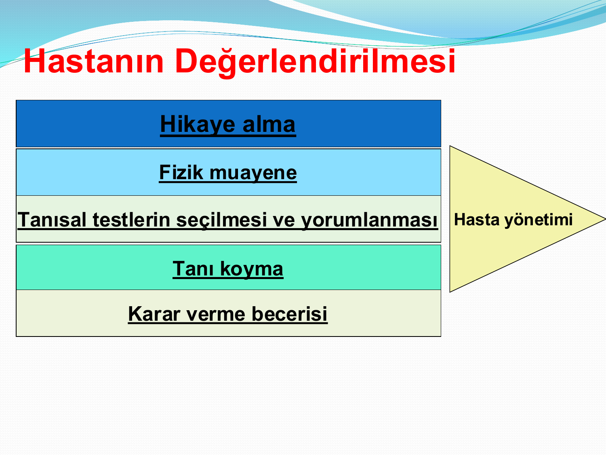

# ANAMNEZ VE HASTA DEĞERLENDİRMEDE GENEL DAHİLİ YAKLAŞIM

**Hazırlayan:** Dr. Hilal Bektaş Uysal
**Bölüm:** Genel Dahiliye — İç Hastalıkları Anabilim Dalı

---

## İÇİNDEKİLER

1. [Hekim ve Görev Alanı](#hekim-ve-gorev-alani)
2. [Hekimlik Sanatı](#hekimlik-sanati)
3. [Hastanın Değerlendirilmesi](#hastanin-degerlendirilmesi)
4. [Anamnez](#anamnez)
5. [İyi Bir Anamnez İçin](#iyi-bir-anamnez-icin)
6. [Soru Teknikleri](#soru-teknikleri)
7. [Anamnezin Temel Çerçevesi](#anamnezin-temel-cercevesi)
8. [Şikayetin Öyküsü (OPQRST)](#sikayetin-oykusu-opqrst)
9. [Özgeçmiş (SAMPLE)](#ozgecmis-sample)
10. [Soygeçmiş](#soygecmis)
11. [Sistem Sorgusu](#sistem-sorgusu)
12. [Güçlükler](#guclukler)

---

## HEKİM VE GÖREV ALANI

* İnsanların sağlığını koruma
* Sağlık koruma yöntemlerini geliştirme
* Hastalık ve sakatlıkları iyileştirme alanında gözlem, araştırma ve uygulama yapan kişi: **HEKİM**

> **Hastalık yok hasta vardır; bu açıdan hekimlik bir sanattır.**

Hekimlik — *tıp sanatı* — uygulamasıdır.

---

## HEKİMLİK SANATI

* **Teorik olarak çok bilgili olmak yetmez!**
* Klinik pratik değerlendirme yapabilmek
* İyi ve etkili iletişim
* Empati (fazla empati yorar.)
* Meslektaş ve diğer sağlık çalışanları ile iletişim becerisi
* Gerektiğinde ekip lideri olabilme önemli özelliklerdir

> Hastayı anlamak esastır. Ancak hastayı **doğru anlarsak, doğru sonuçlar** alabiliriz.
>

> Her şeyi bilen hekim en iyi hekim demek değildir. Kriz durumunu kontrol edebilen hekim en iyi hekimdir.
>
> Kendini bir hekim gibi hissederek evden çıkacaksın. 
---

## HASTANIN DEĞERLENDİRİLMESİ

Hasta yönetimi basamakları:

1. **Hikaye alma** (Anamnez)
2. **Fizik muayene**
3. **Tanısal testlerin seçilmesi ve yorumlanması**
4. **Tanı koyma**
5. **Karar verme becerisi**

---

## ANAMNEZ

* Hastanın hastalığı ile ilgili bilgilerinin alınmasına **tıbbi hikaye (anamnez)** denir
* Hastanın sağlık durumu ve sağlık problemlerinin sistemli şekilde ortaya konulması işlemidir
* Latince/Yunanca *"anamimneskein"*: hatırlamak
* Tüm teknik imkanlara rağmen tanıda anamnez **en kıymetli öğedir**
* Hastadan veya bazı durumlarda yakınlarından alınabilir
* **İç Hastalıkları** hekimi için öykü alma tüm muayenenin temelini oluşturur

---

## İYİ BİR ANAMNEZ İÇİN

### Anamnez Planı

1. Görüşmeyi başlatmak
2. Bilgi toplamak
3. Hastanın bakış açısını anlamak
4. Açıklama ve plan yapmak
5. Görüşmeyi bitirmek

### Temel İlkeler

* Uygun ve yerinde insan ilişkisi kurmak
* Sorunu iyi anlayabilmek
* Karşılıklı konuşmak
* Tüm yakınmaları ve gelişimi tarih sırası kayıt etmek
* Güven
* Kişiliğe saygı
* Hekimin dış görünüşü
* Nazik, güler yüzlü ve saygılı √
* Alçak gönüllü tutum sergilemek √

### Hasta-Hekim İlişkisi

* Hekimliğin tüm dallarında anamnez alma çok önemlidir. Hasta-hekim ilişkilerinin ilk şartı hastanın hekimine **saygı duyması ve güvenmesidir**
* Hekim hastasına karşı güler yüzlü, nazik ve saygılı davranmalı, kendine güveni tam olmalıdır
* Görüşme esnasında dış görünüşüne ve kişisel temizliğine özen göstermelidir. Bu tutum hastanın hekime olan güvenini arttırır

### Öykü Alma Ortamı

Hastanın öyküsü;
* Kendisini rahat hissedeceği bir ortam sağlanarak
* Uygun ilgi ve istekle dinlenmeli
* Gerekli bilgiler uygun şekilde not edilmelidir

### Görüşmeye Başlarken

* Hastayı selamlamak
* Adını öğrenmek, ismi ile hitap etmek
* Kendini tanıtmak
* Gerekli mahremiyeti sağlamak
* Hastayı rahatlatmak

### Bilgi Toplama Sürecinde

* Hastanın problemleri tek tek incelenmelidir
* İlk sözleri kesmeden dinlenmelidir
* Öykünün temeli **kronolojidir**, dikkat edilmeli
* Akış ve zamanlamaya uyulmalıdır
* Hastanın şikayeti **açık uçlu sorular** ile öğrenilmeli
* Sonrasında **kapalı uçlu sorular** ile netlik sağlanmalıdır

### Görüşmeyi Bitirirken

* Alınan notlar gözden geçirilmeli eksikler tamamlanmalıdır
* Ek şikayet olup olmadığı son kez sorulmalıdır
* Hastaya mevcut durum ve bir sonraki adım hakkında bilgiler verilmeli
* Ortamdan ayrılmadan önce teşekkür edilmelidir

---

## SORU TEKNİKLERİ

### Açık Uçlu Sorular (Aç-bitir)

Hastanın kendisini nasıl hissettiğini "evet"/"hayır"dan ziyade ayrıntılı bir şekilde anlatmasıdır.

> Örnek: *"...göğsünüzdeki ağrıyı tanımlar mısınız?..."*

### Kapalı Uçlu Sorular (Kapa-bitir)

Hastanın cevabını minimale indirir.

> Örnek: *"...hiç ilaç aldınız mı?..."*

### Genel İlkeler

* Bütün sorular basit, kolay, anlaşılır ve hastanın neden şikayet ettiğini anlamaya yönelik olmalıdır (anlattıklarına odaklanılmalıdır)
* Hastanın istek ve endişelerine önem verilmelidir

---

## ANAMNEZİN TEMEL ÇERÇEVESİ

1. **Giriş** (demografik bilgiler)
2. **Esas başvuru şikayeti**
3. **Bu şikayetin öyküsü**
4. **Özgeçmiş** (geçmiş tıbbi işlemler, ilaçlar, allerji, sosyal ve kişisel öykü)
5. **Soygeçmiş** (aile öyküsü)
6. **Sistem Sorgusu**

---

### 1. Giriş

* Ad-soyad
* Yaş
* Doğum tarihi
* Adres
* Telefon
* Meslek
* Anamnezin kimden alındığı
* Güvenilirliği
* Tarih, saat
* Doktorun ismi

---

### 2. Esas Başvuru Şikayeti

* Esas şikayet; hastanın yardıma ihtiyaç duyduğu ağrı, rahatsızlık veya organ disfonksiyonudur
* Esas şikayetin sorgulanmasıyla mevcut hastalık ve yaralanmaların durumu ortaya konabilir

> Sadece keyword yaz. 

---

## ŞİKAYETİN ÖYKÜSÜ (OPQRST)

### 3. Şikayetin Öyküsü

Tüm şikayetlerde sorgulanması gerekenler:

1. Yerleşim yeri
2. Nitelik ve şiddeti
3. Kronoloji
4. Oluşum yeri
5. Artıran/azaltan sebepler
6. Genel seyri ve günlük aktiviteler üzerine etkileri
7. Eşlik eden semptomlar
8. Benzer bulguların öncesindeki öyküsü sorgulanmalıdır

### OPQRST Sistemi

| Harf  | İngilizce   | Soru                                      |
| ----- | ----------- | ----------------------------------------- |
| **O** | Onset       | Şikayet ne zaman başladı?                 |
| **P** | Provocation | Şikayeti artıran/azaltan sebepler?        |
| **Q** | Quality     | Nitelik, hasta problemi nasıl tanımlıyor? |
| **R** | Radiation   | Şikayetin yeri ve yayılımı?               |
| **S** | Severity    | Şikayetin şiddeti?                        |
| **T** | Time        | Şikayet ne zaman başladı?                 |

---

### O → Onset (Başlangıç)

* Problem nasıl başladı? Ani? Yavaş?
* Problem başladığında hasta ne yapıyordu?
* Çalışıyor muydu? Egzersiz yapıyor muydu? Dinleniyor muydu? Uyuyor muydu? Yemek yeme ya da alkol alımı?
* Travma vakalarında yaralanmanın mekanizması ve kazanın tıbbi bir problemden kaynaklanmadığını belirlemek gerekir
* Hastanın bulunduğu ortam nasıldı? Koku? Isı?

---

### P → Provocation (Artıran/Azaltan Faktörler)

* Birçok hastalıkta belirleyici olan rahatsızlığı **artıran** ya da **azaltan** faktörlerdir
* Bu faktörler dinlenme yada uyuma, hareket ettirme, katı ya da sıvı gıda alımını içerir
* Hastanın pozisyonu belirleyici bir faktör olabilir
* Akut batınlı hastalarda derin nefes ağrıyı arttırır
* Anginalı hastalarda derin solunumla ağrı değişmezken, plöretik veya kosta fraktürlü hastalar derin nefes alamazlar
* Şikayetin herhangi bir ilaçla değişimi sorgulanmalıdır

---

### Q → Quality (Nitelik)

* Hastanın ağrıyı veya şikayeti nasıl algıladığının sorgulanmasıdır
* Hastaya şikayetini dikkatlice dinlemesini ve sonra nasıl hissettiğini ifade etmesini istenmelidir
* Ağrı: sıkıştırıcı, yırtıcı, baskıcı, kemirici, kramp, keskin, künt?

> Şikayeti hastanın tanımlamasını iste. 
---

### R → Radiation (Yayılım)

* Şikayetinin lokalizasyonunun ve yayılımının tanımlanmasıdır
* Hastanın ağrısı nerede; hastanın eli sternumun üzerinde mi? İki eliyle karnını tutup iki büklüm olmuş mu?
* Hastadan ağrısının/şikayetinin nerede olduğu/nereye yayıldığını göstermesi istenmelidir
* Lokalize ağrı spesifik bir alanda bulunurken, yayılan ağrı bir yada birden fazla kaynaktan farklı alanlara doğru kayar
* NEREDE BAŞLADI? NEREYE YAYILDI?

> 💡 MI ve angina gibi kalp kökenli ağrılar sıklıkla çene, sol omuz, sırt ve epigastrik bölgeye yayılım gösterirler

---

### S → Severity (Şiddet) (PUANLA)

* Hastanın hissettiği ağrı ya da rahatsızlığın derecesinin belirlenmesidir
* Daha önce benzer şikayeti olduysa, bu ağrı ile daha önce yaşadığı ağrıları karşılaştırması istenmelidir
* Ağrısızlık *sıfır*, en çok ağrı *on* ise hastanın ağrısını skorlaması şiddetin belirlenmesinde yardımcı olabilir

---

### T → Time (Zaman)

* Şikayet ne kadar süredir var; birkaç gün, saat, dakika, saniyedir devam ediyor...
* Daha önceki benzer şikayet ne kadar önce görülmüştü? Ne kadar sürmüştü?

---

## ÖZGEÇMİŞ (SAMPLE)

### 4. Özgeçmiş

| Harf  | İngilizce                    | Sorgulanacak Alan                                                                                                                                                                          |
| ----- | ---------------------------- | ------------------------------------------------------------------------------------------------------------------------------------------------------------------------------------------ |
| **S** | Sign/Symptoms                | Daha önceki semptom ve bulgular                                                                                                                                                            |
| **A** | Allergies                    | Hastanın herhangi bir ilaç, yemek ve diğer maddelere karşı alerjisi var mı?                                                                                                                |
| **M** | Medications                  | Hastanın kullandığı ilaçlar (jenerik), son alım zamanı?                                                                                                                                    |
| **P** | Past Medical Problems        | Geçirilmiş cerrahi operasyon, mevcut hastalık ve tedavi öyküsü                                                                                                                             |
| **L** | Last Oral Intake             | Son 24 saat içerisinde zararlı olabilecek yiyecek veya içecek aldı mı? En son ne zaman yemek yedi?                                                                                         |
| **E** | Events preceding the problem | Şikayete ne sebep oldu? Semptomlar başlamadan hemen önce ne yapıyordu? Hastanın yaşamında herhangi bir değişiklik oldu mu? (boşanma, sınav kaygısı, iş kaybı vb. stresin kaynağı olabilir) |

---

## SOYGEÇMİŞ

### 5. Soygeçmiş

* Ailede anne, baba ve kardeşlerin mevcut hastalıklar ve tıbbi öyküsü

---

## SİSTEM SORGUSU

### 6. Sistem Sorgusu

* Baştan sona tüm sistemlerin önceki ve şu andaki durumlarının değerlendirilmesi
* Olmayan belirtilerin kaydedilmesi
* Var olan belirtilerin mevcut özelliklerinin yazılması gereklidir
* Hastanın mevcut durumu ile bağlantılı ancak ilk kez bu aşamada ifade edilen şikayetler de burada ayrıntılı irdelenir

### Sorgulanacak Sistemler

* Genel
* Baş-Boyun
* Solunum sistemi
* Kardiyovasküler sistem
* Gastrointestinal Sistem
* Genitoüriner Sistem
* Nörolojik Sistem
* Lökomotor Sistem
* Deri
* Jinekolojik Sistem
* Psikiyatrik değerlendirme

> SİSTEM SORGULAMASI FİZİK MUAYENE DEĞİL.
> O ŞİKAYETLERİ ORTAYA ÇIKARABİLECEK KONULARIN SORGULANMASIDIR.
---

## GÜÇLÜKLER

Anamnez almada zorlanılan durumlar:

* Sessizlik
* Aşırı konuşan hastalar
* Çoklu semptomu olan hastalar
* İntoksikasyonlar
* Gergin, öfkeli ve saldırgan hastalar
* Akli melekeleri yeterli olmayan hastalar
* Psikolojik hastalıklar
* İletişim engeli bulunan hastalar
