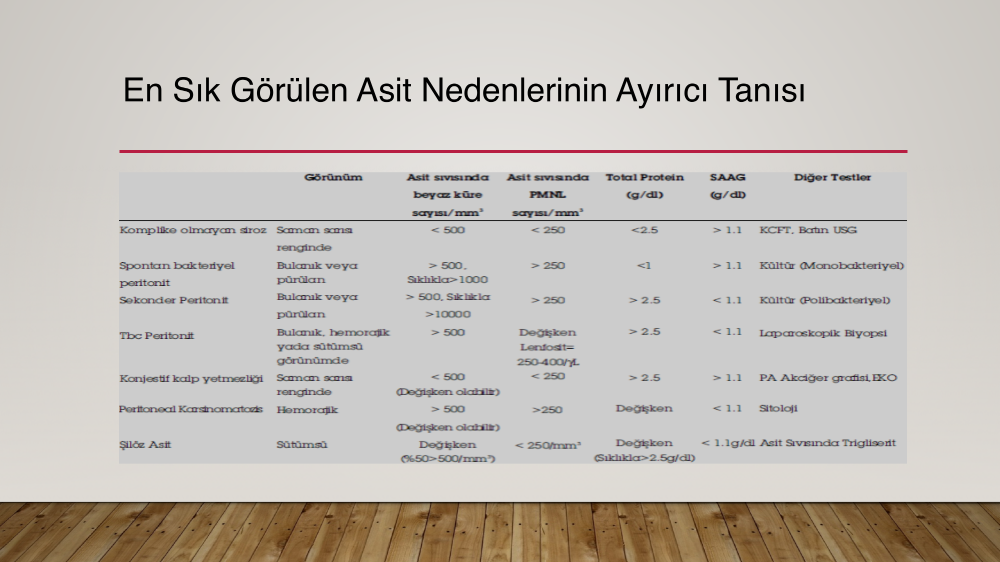

# ASİTLİ HASTAYA DAHİLİ YAKLAŞIM

**Hazırlayan:** Dr. Elif Duygu Topan (2025-2026)
**Bölüm:** Genel Dahiliye — İç Hastalıkları Anabilim Dalı

---

## İÇİNDEKİLER

1. [Tanım ve Epidemiyoloji](#tanim-ve-epidemiyoloji)
2. [Asit Sınıflandırması](#asit-siniflandirmasi)
3. [Asitli Hastaya Yaklaşım](#asitli-hastaya-yaklasim)
4. [Parasentez](#parasentez)
5. [Asit Sıvı Analizi](#asit-sivi-analizi)
6. [Tedavi](#tedavi)
7. [Refrakter Asit](#refrakter-asit)

---

## TANIM VE EPİDEMİYOLOJİ

> Periton boşluğunda patolojik miktarlarda sıvı birikmesidir. Eski Yunancada torba veya kese anlamına gelen *"askos, ascites"* kökenlidir.

* En sık asit nedeni **sirozdan kaynaklanan portal hipertansiyondur**
* Diğer yaygın nedenler: malignite ve kalp yetmezliği
* Asitin başarılı tedavisi, nedeninin doğru bir şekilde teşhis edilmesine bağlıdır

### Asit Nedenleri ve Görülme Sıklığı

| Neden | Görülme Sıklığı |
|---|---|
| **Siroz** | **%81** |
| Kanser | %10 |
| Kalp yetmezliği | %3 |
| Tüberküloz | %2 |
| Diyaliz | %1 |
| Pankreas hastalıkları | %1 |
| Diğerleri | %2 |

---

## ASİT SINIFLANDIRMASI

### Altta Yatan Patofizyolojiye Göre

**Portal hipertansiyon:**
* Siroz, alkolik hepatit, akut karaciğer yetmezliği
* Hepatik veno-oklüzif hastalık (Budd-Chiari sendromu)
* Kalp yetmezliği, konstriktif perikardit
* Hemodiyalizle ilişkili asit (nefrojenik asit)

**Hipoalbüminemi:**
* Nefrotik sendrom
* Protein kaybettiren enteropati
* Şiddetli yetersiz beslenme

**Periton hastalığı:**
* Malign asitler (over kanseri, mezotelyoma)
* Enfeksiyöz peritonit (tüberküloz veya mantar)
* Eozinofilik gastroenterit
* Periton diyalizi, multikistik mezotelyoma

**Diğer etiyolojiler:**
* Şilöz asitler, pankreas asitleri
* Miksödem, hemoperitoneum, ürolojik yaralanma

### Asit Evrelemesi

| Evre | Tanım |
|---|---|
| **Grade 1** (Hafif) | Ultrasonografi ile saptanabilen hafif asit |
| **Grade 2** (Orta) | Karında simetrik şişlik olarak fark edilebilen miktardaki asit |
| **Grade 3** (İleri) | Belirgin abdominal distansiyona yol açan tens asit |

---

## ASİTLİ HASTAYA YAKLAŞIM

### Semptomlar

* **Karın şişkinliği:** Gelişim süresi? Günler (travmaya bağlı kanlı asit) veya aylar (malign asit)
* Kilo alımı
* Nefes darlığı, erken doyma
* Dispne (sıvı birikimi ve artan karın basıncı nedeniyle)
* Ateş, karında hassasiyet, değişen mental durum → spontan bakteriyel peritonit
* Malign asitli hastalarda kilo kaybı gibi altta yatan maligniteyle ilişkili semptomlar
* Dispne, ortopne ve periferik ödem → kalp yetmezliği

### Fizik Muayene

* Karın diffüz olarak şiştir, yan akıntılar silinmiştir, **kurbağa karnı** görünümü
* Asit fazla olduğunda karın oldukça gergin, şiş ve solunuma az katılır
* Göbek platosu silinmiş, göbek dışa doğru fırlamış olabilir (göbek fıtığı)
* Göbek-ksifoid mesafesi uzamış, göbek aşağı kaymış, göbek-pubis mesafesi kısalmış
* **Perküsyon:** Asit varlığını anlamanın en iyi muayene yöntemi. Işınsal tarzda, proc. ensiformisten başlayarak aşağıya doğru yapılır. Epigastrium daima timpandır, aşağıya inildikçe matite başlar → açıklığı yukarı bakan matite = asit
* **Dalgalanma duyusu (sensation des flots):** Çok fazla miktarda ve gergin asitte kullanılır

### Etiyolojiye Göre FM Bulguları

**Siroz ilişkili:**
* Splenomegali, spider anjiom, palmar eritem
* Hipotenar ve tenar atrofi, abdominal kolateraller
* Jinekomasti, lunula kaybı
* Parotis hipertrofisi (alkolik kronik KC hastalığı)

**Kalp yetersizliği / konstriktif perikardit:**
* Juguler venöz dolgunluk, akciğerde raller

**Malignite:**
* Umbilikal nodül (Sister Mary Joseph nodülü)
* Batında ele gelen kitle, lenfadenomegali, B semptomları

### Tanıya Yönelik Tetkikler

* Laboratuvar anormallikleri asitin altta yatan nedenine bağlıdır
* Siroz/KY hastalarında: KC ve böbrek tetkiklerinde anormallik, hipoalbüminemi, trombositopeni, anemi, lökopeni
* SBP gelişen hastalarda: lökositoz, metabolik asidoz, azotemi
* Asit tanısı: FM + abdominal görüntüleme (genellikle **USG**) ile konur
* Tanı konduktan sonra → neden aranır → **parasentez** yapılır

---

## PARASENTEZ

### Kime Parasentez Yapalım?

* İlk kez saptanan asit
* Asiti olan ve hastaneye yatırılan **tüm** olgular
* Klinik kötüleşme varlığı (ateş, karın ağrısı, ensefalopati, GIS kanama, lökositoz, renal yetersizlik, metabolik asidoz)

**⚠️ ÖNEMLİ:** Koagülasyon parametreleri bozuk olsa bile parasentez için rutin TDP veya trombosit replasmanı gerekmez.

### Teknik

* Hasta sırt üstü yatarken steril şartlarda **1-1.5 inç 21-22 G** iğne ile yapılır (obez hastalarda 3.5 inç)
* **Z hattı** şeklinde giriş yapılır, iğne yavaşça itilir

### Asit Sıvısında İlk Yapılacak Testler

1. **Görünüm değerlendirmesi** (berrak, kanlı, bulanık, süt rengi)
2. **SAAG** (Serum-Asit Albümin Gradyanı)
3. **Hücre sayımı**

---

## ASİT SIVI ANALİZİ

### Görünüm Değerlendirmesi

| Görünüm | Olası Neden |
|---|---|
| **Berrak** | Siroz |
| **Bulanık** | Enfekte sıvı |
| **Beyaz (şilöz)** | Maligniteler (TG > 200 mg/dL, sıklıkla > 1000 mg/dL) |
| **Pembe veya kanlı** | Malignite, parasentez travması |
| **Kahverengi** | Derin sarılık, perfore safra kesesi veya perfore duodenum ülseri |

### Serum-Asit Albümin Gradyanı (SAAG)

| SAAG ≥ 1.1 g/dL (Portal HT var) | SAAG < 1.1 g/dL (Portal HT yok) |
|---|---|
| Siroz | Peritoneal karsinomatozis |
| Alkolik hepatit | Peritoneal tüberküloz |
| Kalp yetmezliği | Pankreatit |
| Masif hepatik metastaz | Serozit / kollajen doku hastalığı |
| Konstriktif perikardit | Nefrotik sendrom |
| Budd-Chiari sendromu | — |
| Portal ven trombozu | — |
| İdiopatik portal fibrozis | — |

### Toplam Protein Konsantrasyonu

* Her ikisi de SAAG ≥ 1.1 g/dL olan asitlerde:
  - **Siroz:** toplam protein < 2.5 g/dL
  - **Kardiyak asit:** toplam protein ≥ 2.5 g/dL
* Nefrotik asit: SAAG < 1.1 g/dL ve toplam protein < 2.5 g/dL
* Toplam protein < **15 g/L** ise SBP gelişim riski artar → antibiyotik profilaksisinden fayda görebilir

### Hücre Sayımı

* Enfeksiyonu değerlendirmek için en yararlı test
* Asit sıvısında nötrofil sayısı > **250/mm³** olan hastada antibiyotik tedavisi düşünülmelidir

### Ek Testler

| Test | Endikasyon |
|---|---|
| Kültür (aerobik/anaerobik) | Enfeksiyon, barsak perforasyonu |
| Glikoz | Malignite, enfeksiyon, barsak perforasyonu |
| LDH | Malignite, enfeksiyon, barsak perforasyonu |
| Gram boyama | Şüpheli barsak perforasyonu |
| Amilaz | Pankreas asiti veya barsak perforasyonu |
| ARB yayma, kültür, ADA | Tüberküloz peritoniti |
| Sitoloji ve CEA | Malignite |
| Trigliserit | Şilöz asit |
| Bilirubin | Barsak veya safra perforasyonu |
| Serum pro-BNP | Kalp yetmezliği |

### Asit Sıvı Analiz Testleri Özeti

| Rutin | Gereğinde | Nadiren | Faydasız |
|---|---|---|---|
| Hücre sayımı | Kültür | ARB yayma ve kültür | pH |
| Albümin | Glukoz | Sitoloji | Laktat |
| Total protein | LDH | Trigliserit | Kolesterol |
| — | Amilaz | Bilirubin | Fibronektin |
| — | Gram boyama | — | Alfa-1 antitripsin |

### En Sık Görülen Asit Nedenlerinin Ayırıcı Tanısı

---

## TEDAVİ

* Asitin etiyolojisinin doğru saptanması zorunludur
* SAAG tanı için olduğu kadar tedaviye karar vermek için de faydalıdır
* **Düşük SAAG:** Portal HT yok → tuz kısıtlaması ve diüretiklere iyi yanıt vermezler (nefrotik sendrom hariç)
* **Yüksek SAAG:** Portal HT var → genellikle tuz kısıtlaması ve diüretiklere yanıt verirler

### Sodyum Kısıtlaması

* Asit tedavisi için temel yaklaşım
* Tek başına hastaların **%10** kadarında asiti kontrol etmekte yeterli
* Günlük **< 2 g** (< 88 mmol) sodyum alımı yeterli sayılabilir
* Dilüsyonel hiponatremi olmadıkça (serum Na < 120 mmol/L) su kısıtlamasının gereği yoktur

### Diüretik Tedavisi

* **Grade 2** asitli hastalarda → tuz kısıtlaması + diüretik tedavisi
* Sekonder hiperaldosteronizm renal sodyum tutulmasında major faktör → başlangıç diüretiği **spironolakton**
* Spironolakton **100-200 mg/gün** başlanır, klinik cevaba göre doz ayarlanır
* İlk 2 hafta 200 mg/gün spironolaktona cevap yetersiz ise günlük **20-40 mg furosemid** eklenir
* Yeterli cevap alınana kadar spironolakton **400 mg/gün**, furosemid **160 mg/gün**'e çıkılır

**Spironolakton yan etkileri:** Jinekomasti, hiperpotasemi, metabolik asidoz

**Furosemid yan etkileri:** Hipopotasemi, hiponatremi, metabolik alkaloz, renal fonksiyon bozukluğu

### Grade 3 Asit Tedavisi

* Parasentez + diüretik tedavisi + sodyum kısıtlaması
* **5 litrenin üzerindeki** parasentez → total (yüksek volümlü) parasentez → hastanede yatış süresini kısaltır
* 2-3 litre parasentez için volüm ekspansiyonu gerekmez
* Total parasentezde: boşaltılan her **1 litre** asit sıvısı için **5-8 g albümin** veya 8 g dekstran 70 verilir

**⚠️ ÖNEMLİ:** Prostoglandin inhibitörlerinden (NSAİİ) sirotik asiti olan **tüm** hastalarda kaçınılmalıdır (diürezi inhibe eder, renal yetersizliği artırır, GIS kanamaya yol açar)

### Nedene Yönelik Tedavi

* Peritoneal karsinomatozis → terapötik parasentez + kemoterapi
* Tbc peritoniti → anti-tüberküloz ilaçlar
* Chlamydia peritoniti → tetrasiklin
* Lupus seroziti → glukokortikoidler
* Diyaliz ile ilgili asit → agresif diyaliz

---

## REFRAKTER ASİT

**Tanım kriterleri:**
1. En az **1 hafta** süreyle tuzsuz diyet ve maksimal dozda (160 mg furosemid + 400 mg spironolakton) diüretik tedavi alıyor olmalı
2. 4 gün içerisinde **< 0.8 kg** kilo kaybı veya idrarla atılan sodyum alınandan az olması
3. Başlangıçta tedaviye yanıt alınmış olsa bile **4 haftadan** kısa sürede yeniden Grade 2-3 asit oluşumu
4. Diüretiklere bağlı yan etkilerin ortaya çıkması:
   - Diüretik tedaviye bağlı ensefalopati
   - Kreatinin düzeyinin 2 kat artması, > 2 mg/dL
   - Serum sodyumunun 10 mEq/L azalması, < 125 mEq/L
   - Potasyum düzeyinin < 3 mEq/L veya > 6 mEq/L

**Refrakter asit tedavisi:**
1. **Boşaltıcı parasentez**
2. **TIPS** (Transjuguler İntrahepatik Portosistemik Shunt)
3. **Karaciğer nakli**
