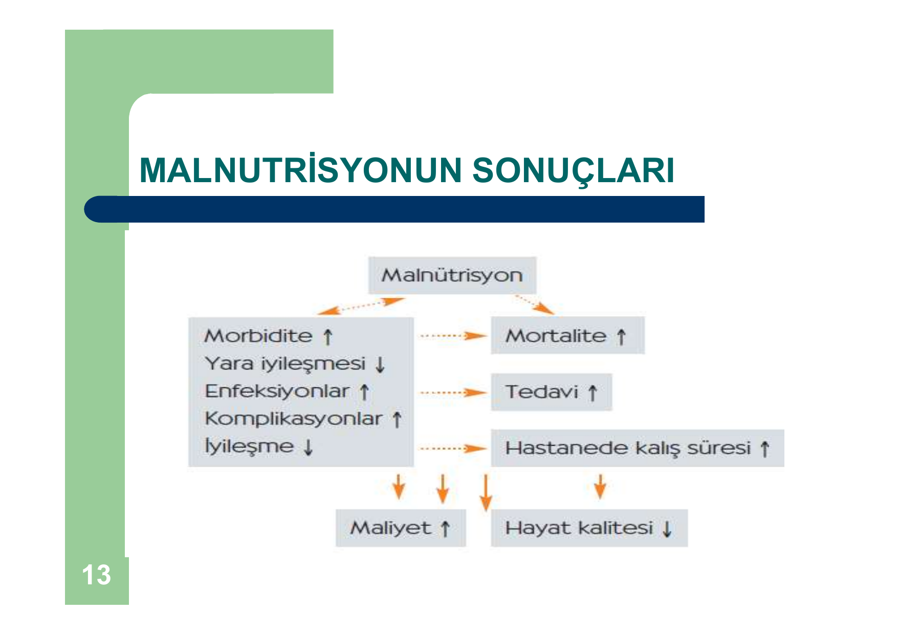
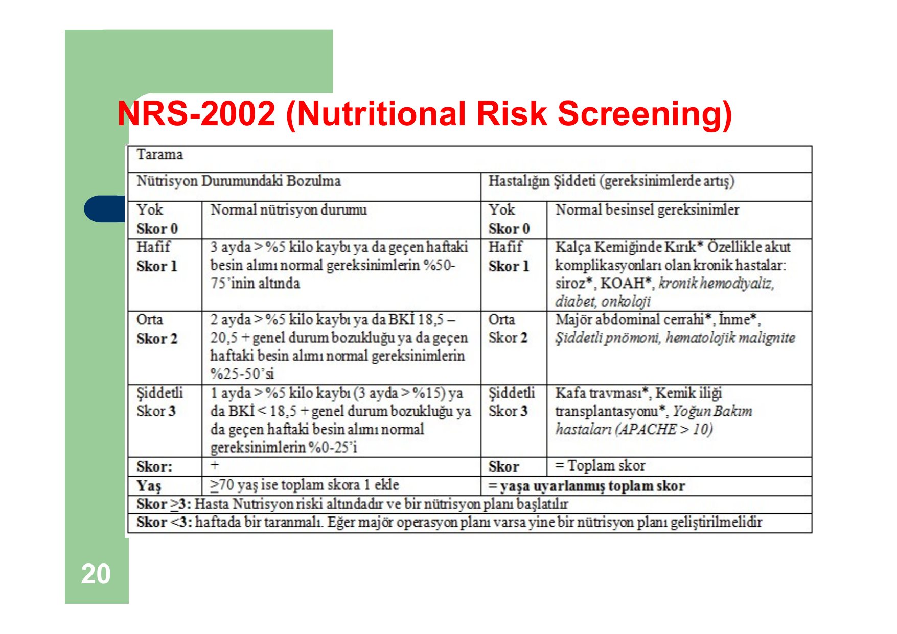
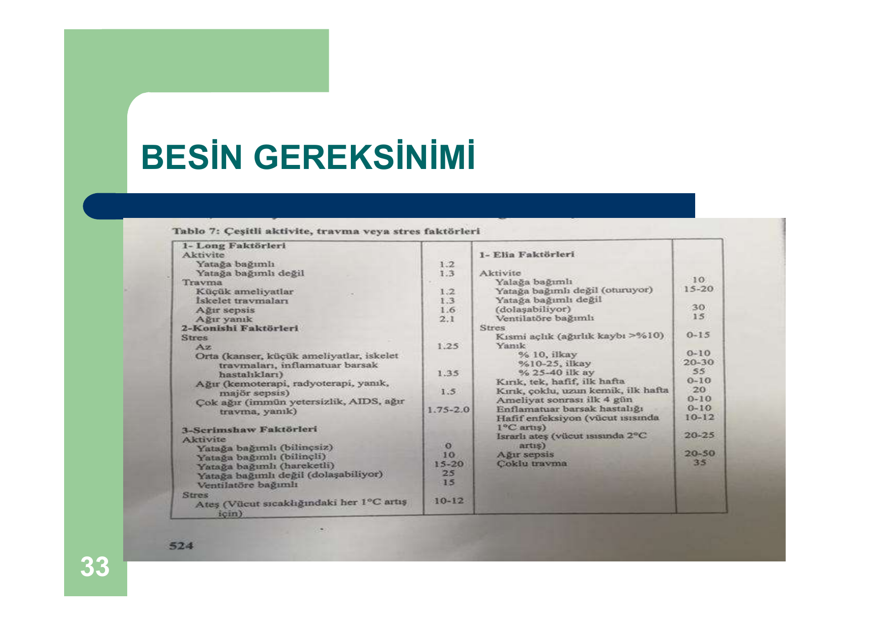

# BESLENME — BÖLÜM 1

**Hazırlayan:** Dr. Hilal Bektaş Uysal
**Bölüm:** Genel Dahiliye — İç Hastalıkları Anabilim Dalı

---

## İÇİNDEKİLER

1. [Malnutrisyon](#malnutrisyon)
2. [Strese Yanıt](#strese-yanit)
3. [Nutrisyonun Değerlendirilmesi](#nutrisyonun-degerlendirilmesi)
4. [Besin Gereksinimi](#besin-gereksinimi)
5. [Nutrisyonel Tedavi Yöntemleri](#nutrisyonel-tedavi-yontemleri)
6. [Enteral Nutrisyon](#enteral-nutrisyon)
7. [Enteral Beslenme Komplikasyonları](#enteral-beslenme-komplikasyonlari)

---

## MALNUTRİSYON

### Tanım

> Dokuların asıl gereksinimi olan makro veya mikro besin ögelerinden yoksun kalması sonucu yapısal eksiklikler ve organlarda fonksiyon bozukluklarının ortaya çıkmasına **malnutrisyon** adı verilir.

* Tüketilen besin ögelerinin alımı ile değişen metabolizma ihtiyaçlarının karşılanması arasındaki süreğen dengesizliği ifade eder
* Sonucunda vücut kitlesi kaybı, organ-sistem fonksiyon yetersizliği ortaya çıkar

### Protein Enerji Malnutrisyonu (PEM)

* Vücuttaki yağ ve protein depolarının gizli kaybı, azalmış serum protein konsantrasyonları, kötü performans statüsü ile karakterize bir durumdur
* Vücut ağırlığının son 6 ayda **%10**'dan fazlasının kaybı

**Birincil PEM:** Yetersiz protein ve/veya kalori veya esansiyel amino asitler yönünden yetersiz beslenmede olduğu gibi, normal metabolizmanın devamını sağlayacak besinlerin alınamaması halidir

**İkincil PEM:** Hastalık ve zedelenme (injury) nedeniyle gelişen malnutrisyon durumudur

### Akut Hastalıkta Malnutrisyon

* Hem vücudun protein ve enerjiye artmış ihtiyacı, hem iştahsızlık nedeniyle yetersiz alım, hem de alınan besinlerin yetersiz sindirim, absorbsiyon ve kullanımı söz konusudur
* Protein katabolizmasının artışını **idrar azot atılımı** gösterir
* Sağlıklı erişkin için günlük idrarla azot atılımı **12 gram**
* İleri derecede stres durumlarında **30 grama** kadar ulaşabilir
* 1 gram idrar azotu yaklaşık **30 gram yağsız doku kitlesi** karşılığıdır
* Şiddetli hastalık durumunda günlük **yarım kilogramı** aşan yağsız kitle kaybı olabilir

### Malnutrisyon Nedenleri

* Azalmış besin alımı
* Artmış besin ihtiyacı
* Besin ve sıvı kaybı
* Enfeksiyonlar
* Tümöre bağlı metabolizma değişiklikleri

### Malnutrisyonun Sonuçları

Malnutrisyon → Morbidite ↑, yara iyileşmesi ↓, enfeksiyonlar ↑, komplikasyonlar ↑, iyileşme ↓ → Mortalite ↑, tedavi ↓, hastanede kalış süresi ↑ → **Maliyet ↑, hayat kalitesi ↓**

### Fizik Muayene Bulguları

* Kas kitlesi ve gücünde azalma
* Kilo kaybı
* Yağ depolarında azalma
* Periferik ödem, asit
* Cilt lezyonları, turgor tonus değişiklikleri
* Anguler stomatit, jinjivit, glossit
* Tırnaklarda deformiteler
* Parestezi ve nöropatiler

**⚠️ ÖNEMLİ:**
* 5 gün ve üzerinde oral alamayacak hastalar malnutrisyon riski altındadır
* Malnutrisyon; immün mediatörlerde azalma ve postoperatif sepsis sıklığında artışla yakından ilişkilidir
* Malnutrisyonun erken tanınması hastalarda morbidite ve mortaliteyi azaltır
* Çok sayıda çalışma malnutrisyonlu hastalarda komplikasyonların iyi beslenen hastalara kıyasla **2-20 kat** daha fazla olduğunu göstermiştir

### Farklı Hastalıklarda Malnutrisyon Riski

1. Kanser **%30**
2. Sindirim Sistemi **%14**
3. Solunum Sistemi **%14**
4. Metabolik-immün **%11**
5. Mental-alkol vb **%9**

---

## STRESE YANIT

* Ameliyat, travma, ağır hastalıklar neticesinde vücutta fizyolojik bir stres oluşur
* Strese yanıt olarak; katekolaminler, ACTH, ADH, insülin, kortizol ve büyüme hormonu salınımı artar
* Açlık durumu da vücut için fizyolojik stres kaynağıdır
* Açlık durumunda karaciğerdeki glikojen depoları tüketilir ve glukoneogenez uyarılır
* Açlıkta erken dönemde depo yağlar enerji üretimi için kullanılır

**Açlık vs Stres farkı:**
* Açlık durumunda metabolik hız **azalırken**, travma ve ağır hastalık durumlarında metabolik hız **artar**
* Bu durumda enerji için yağlar ile birlikte **proteinler** de kullanılır ve protein katabolizması artar
* Sonuçta hastada; hiperkatabolik durum nedeni ile **negatif azot dengesi**, hiperglisemi, enerji amacı ile kas dokusundan dallı zincirli amino asit kullanımının arttığı görülür

---

## NUTRİSYONUN DEĞERLENDİRİLMESİ

### 1. Anamnez

Yatan hastalar için sıklıkla önerilen nutrisyonel değerlendirme araçları:
* **SGA** (Subjective Global Assessment)
* **MNA** (Mini Nutritional Assessment)
* **MUST** (Malnutrition Universal Screening Tool)
* **NRS-2002** (Nutritional Risk Screening)

### NRS-2002

**Nütrisyon destek planı endikasyonları:**
1. Şiddetli malnutrisyonda (skor = 3)
2. Ağır hasta (skor = 3)
3. Orta derecede malnutrisyon + hafif hasta (skor 2+1)
4. Hafif malnutrisyon + orta derecede hasta (skor 1+2)

| Skor | Klinik Durum |
|---|---|
| **Skor 1** | Kronik hastalığı olup komplikasyonlar nedeniyle hastaneye yatan, halsiz-düşkün durumdaki ancak düzenli olarak yataktan kalkabilen hasta. Protein gereksinimleri artmış ancak oral diyet ya da suplemanlarla karşılanabiliyor |
| **Skor 2** | Majör abdominal cerrahi gibi bir hastalık nedeniyle yatağa bağlı hasta. Protein gereksinimleri yüksek, klinik beslenme yöntemleri gerekli |
| **Skor 3** | Ventilasyon desteği altındaki YBÜ hastası. Protein gereksinimleri yüksek ve klinik beslenme yöntemleriyle karşılanamıyor. Protein yıkımı ve azot kaybı mevcut |

### 2. Fizik Muayene

1. Boy
2. Ağırlık
3. VKİ (Vücut Kitle İndeksi)
4. Deri kıvrımlarının kalınlığı
5. Mevcut hastalığa ilişkin FM bulguları

### 3. Biyokimya

| Parametre | Yarı Ömür | Özellik |
|---|---|---|
| **Serum albumini** | 20 gün | Uzun süreli beslenme durumunu yansıtır |
| **Serum transferrini** | 8 gün | Orta süreli gösterge |
| **Serum prealbumini** | 48 saat | Kısa süreli değişimlere duyarlı |

Tam kan sayımı, toplam demir-demir bağlama kapasitesi, serum kolesterolü de değerlendirilmelidir.

💡 **CRP ve prealbumin** kombine kullanıldığında en iyi göstergedir

---

## BESİN GEREKSİNİMİ

Hastanın nutrisyonel değerlendirmesi yapıldıktan sonra beslenme desteğine gereksinimi olup olmadığı ve alması gereken enerji ve besin öğeleri miktarları belirlenir.

### Enerji Gereksinimi

Sağlıklı bireylerin günlük enerji gereksinimi = **Bazal Metabolizma Hızı (BMH)** + **Fiziksel Aktivite (FA)** + **Besinlerin Termik Etkisi**

**İndirekt Kalorimetre:** Aktüel enerji tüketiminin yani BMH'nın en doğru ölçümüdür. Hastanın tükettiği O₂ ve çıkardığı CO₂ miktarı ölçülür. Ancak ventilasyon desteğinde olmayan hastalarda pratik değildir ve pahalıdır.

### Harris-Benedict Formülü (BET)

* **Erkeklerde:** 66.5 + 13.75 × ağırlık(kg) + 5 × boy(cm) - 6.8 × yaş
* **Kadınlarda:** 65.5 + 9.6 × ağırlık(kg) + 1.8 × boy(cm) - 4.7 × yaş

| Aktivite Faktörü | Değer | Yaralanma Faktörü | Değer |
|---|---|---|---|
| Yatak istirahati | 1.2 | Minör cerrahi | 1.2 |
| Hareketli | 1.3 | Travma | 1.35 |
| — | — | Sepsis | 1.6 |
| — | — | Yanık | 2.1 |

> **Total enerji tüketimi = BET × AF × YF**

### ESPEN Pratik Enerji Gereksinimleri

| Stres Düzeyi | Enerji (kcal/kg/gün) |
|---|---|
| Az/orta derecede stres | 20-25 |
| Belirgin stres (multipl travma, beyin hasarı, ağır sepsis) | 25-30 |
| Aşırı stres (ağır yanık) | 35-40 |

İndirekt kalorimetri yokluğunda YBÜ hastaları **25 kcal/kg/gün** ile başlamalı ve izleyen 2-3 günde hedefe ulaşılmalıdır.

### Karbonhidrat

* KH'ların vücuttaki başlıca işlevi enerji oluşturmaktır
* Günlük enerjinin **%50-60**'ı KH'lardan gelmelidir (150 g/gün glikoz)
* Günlük minimum KH gereksinimi **2 g/kg**
* Maksimum glukoz infüzyon hızı **5 mg/kg/h**
* Yüksek oranda glikoz kullanımı → hepatosteatoz, hiperglisemi, dehidratasyon, CO₂ artışı, solunum depresyonu, metabolik stres artışı

### Lipit

* Yağlar enerjinin en büyük kısmını oluşturur
* Esansiyel yağ asitlerini sağlar ve yağda eriyen vitaminlerin kullanımını kolaylaştırır
* LCT (uzun zincirli) ve MCT (orta zincirli) trigliseritler başlıca yağ kaynaklarıdır
* n-3 yağ asitlerinin n-6 ile dengeli verilmesi travma ve sepsiste inflamasyonu azaltır
* Günlük enerjinin **%27-33**'ü yağlardan gelmelidir
* Yağların emilim ve taşınma bozukluklarında MCT tercih edilir

### Protein

* Enerji bileşeni olarak **kullanılmaz**
* Yeterli enerji desteği ile birlikte **1.3-1.5 g/kg/gün** amino asit solüsyonu infüze edilmelidir
* **2 g/gün**'e kadar artırılabilir
* YBÜ hastalarının nutrisyon desteğinde amino asit solüsyonu **0.2-0.4 g/kg/gün L-glutamin** içermelidir

### Vitamin ve Mineraller

* Mevcut serum düzeyleri, idrarla atılan miktarları ve hastalık durumu göz önüne alınarak gerekli replasmanlar yapılmalıdır
* Hipervitaminozu önlemek için yağda eriyen vitamin miktarlarına dikkat edilmeli
* Besin öğelerinin organizmadaki oranları (Ca/P, Zn/Cu gibi) bozulmamalıdır

### Sıvı

* Sıvı gereksinimi termoregülasyonu sağladığı için günlük enerji gereksinimine göre hesaplanır
* Sıvı kısıtlaması varsa: bir gün önceki idrar miktarı + 500 mL
* Vücut ısısının her **1 °C** artışı BMH'nı **%10**; sıvı gereksinimini ise günde **300-500 mL** artırır

### Özet Besin Gereksinimleri

* **30 kcal/kg/gün** kalori
* **0.6-0.8 g/kg/gün** protein
* **30-40 mL/kg/gün** su
* 1 g protein = 4 kcal → günlük kalorinin %60-70'i KH'dan
* 1 g lipid = 9 kcal → günlük kalorinin %30-40'ı yağdan

| Gereksinim Düzeyi | Amino Asit (g/kg/gün) | Glikoz (g/kg/gün) | Yağ (g/kg/gün) | Toplam Kalori |
|---|---|---|---|---|
| **Hafif** (beslenme durumu iyi, minör op.) | 1.0 | 2.0-3.0 | 0.7 | 1400-1600 |
| **Orta** (ılımlı malnutrisyon, majör op., pankreatit, peritonit) | 1.5 | 3.0-4.0 | 0.7-1.5 | 1700-2600 |
| **Yüksek** (ciddi malnutrisyon, sepsis, kafa travması, yanıklar) | 1.5-2.0 | 3.0-5.0 | 1.5-2.0 | 2200-3700 |

---

## NUTRİSYONEL TEDAVİ YÖNTEMLERİ

Öncelikle şu soruların yanıtını vermek gerekir:
* Oral besin alımı mümkün mü? Yeterli mi?
* Gastrointestinal yol kullanılabilir mi?
* Kullanılırsa yeterli absorbsiyon sağlanır mı?
* Hastanın nutrisyonel gereksinimleri normal düzeyin üzerinde midir?

**İki ana yöntem:**
1. **Enteral Nutrisyon** (EN)
2. **Parenteral Nutrisyon** (PN)

> Mümkün olan her durumda öncelikle **enteral beslenmeyi** düşünmek ve uygulamak gerekir. Uygun olan hastalarda ilk tercih **ORAL**'dir.

---

## ENTERAL NUTRİSYON

### Tanım ve Avantajları

* Normal veya normale yakın çalışan GIS ile beslenme desteğinin sağlanmasıdır
* En fizyolojik yoldur
* Ucuz, güvenilir, GIS'i koruyucu
* Komplikasyon gelişimi daha azdır

### GIS'in Önemi

GIS sindirim ve emilim için gerekli, vücudun en büyük endokrin organı, savunma sisteminde çok önemli, yaralanmaya karşı hipermetabolik yanıtta **santral organ**

**GIS uyarısı olmadığında:**
* Barsakta hücre kitlesi azalır
* Fırçamsı kenardan salınan enzimler azalır
* Enterik flora değişir, barsak immünitesi bozulur
* **Bakteri translokasyonu** artar → sepsis, MODS gelişir

**⚠️ ÖNEMLİ:** EN vs TPN meta-analizinde (8 RKÇ): EN'da septik komplikasyonlar **%18**, TPN'de **%35**. Üç gün içinde ağızdan tam doz beslenmeye başlaması beklenmeyen tüm kritik hastalarda EN uygulanmalıdır.

### Enteral Beslenme Endikasyonları

1. Nörolojik ve psikiyatrik hastalıklar (kafa travmaları, koma, ağır depresyon, anoreksiya nervoza)
2. Özofagus hastalıkları (neoplazm, striktür)
3. GIS hastalıkları (kistik fibrozis, GIS fistüller, kısa barsak sendromu, pankreatit)
4. Organ yetmezlikleri (karaciğer ve böbrek yetmezlikleri)
5. Preoperatif ve postoperatif beslenme
6. Kemoterapi ve radyoterapi

### Enteral Beslenme Kontrrendikasyonları

* Mekanik intestinal obstrüksiyon
* Yüksek debili intestinal fistül
* Şiddetli inflamasyon ya da ameliyat sonrası staz
* Şiddetli diyare, şiddetli yanıklar, multipl travma
* Barsak istirahati zorunluluğu

### Enteral Beslenmenin Zamanlaması

* **Erken enteral beslenme:** Postoperatif ilk 24 saat içerisinde
  - Barsakları erken çalıştırdığı için bakteriyel kolonizasyonu önler
  - Septik komplikasyonlar daha azdır
* Hemodinamik stabilite sağlandıktan **2-3 saat** sonra enteral beslenme başlatılabilir

### Gastrik Erişim

**Üstünlükleri:** Normal besin deposu, kolay erişim, yüksek osmolar besinler tolere edilir, intermitant/bolus beslenme tolere edilir, mide asidinin kontaminasyonu önlemesi

**Yollar:**
* **Nazogastrik (NG):** Kısa süreli (4 hafta), kolay erişilir, daha az invazif. Dezavantaj: yüksek aspirasyon riski, kısa süreli kullanım, nazofaringeal travma
* **Gastrostomi:** Uzun süreli, endoskopik/cerrahi/radyolojik yerleştirme

### PEG (Perkütan Endoskopik Gastrostomi)

* Cerrahi gerektirmez
* Doğrudan görerek, 30 dk'dan kısa sürede
* Ekonomik

### Post-Pilorik Erişim Endikasyonları

* Gastrik reflü veya aspirasyon riski varsa
* Gastrik motilite bozukluğu varsa
* Üst GIS patolojisi varsa
* Akut pankreatit varsa

### Uygulama Protokolü

* Baş **45 derece** elevasyonda
* **10-15 mL/h** hızı ile başlanır
* Sorun yoksa 8 saatte bir iki katına çıkarılır
* Devamlı infüzyon hızı **80-100 mL/h**
* Her beslenmeden önce ve sonra tüp **30-40 mL** su ile yıkanmalıdır

### Enteral Ürünlerin Bileşimi

* Anabolizma için amino asit içeriğinin **%40**'ı esansiyel aminoasitlerden sağlanmalıdır
* Soya ve kazein başlıca protein kaynakları
* Glukoz polimerleri/maltodekstrin başlıca KH kaynağı
* LCT veya MCT'ler başlıca yağ bileşenleri
* Günlük önerilen diyet posası: **20-25 g**
* Enteral ürünlerin 1000 mL'sinde **690-860 mL** su bulunur

### Enteral Ürünlerin Sınıflandırılması

| Tip | Özellikler |
|---|---|
| **Polimerik** | Yağdan enerji oranı yüksek, osmolarite düşük, ucuz, iyi tolere edilir |
| **Elementel** | Düşük molekül ağırlıklı, minimal sindirim/emilim gereksinimi, hiperosmolar, GIS sekresyonlarını azaltır |
| **Hastalığa özgü** | Organ yetmezliği ve hiperkatabolizma için |
| **Modüler** | Tek tek makrobesin ögesi, ek olarak kullanılabilir |

### Solüsyon Seçimi

* Standard solüsyonlar **1 mL'de 1 kcal** içerir
* Hiperkalorik ürünler **1 mL'de 1.5 kcal** içerir (intolerans, diyare daha sık)
* Hastanın komorbiditeleri göz önünde bulundurularak seçim yapılmalıdır

### İmmünonutrisyon

* Arjinin, glutamin, omega-3 yağ asitleri ve diyet nükleotidleri günlük ihtiyaçların üzerinde alındığında inflamatuar, metabolik ve immün sistem proseslerini etkiler
* ESPEN rehberi: majör cerrahi ve ağır travma geçiren hastalarda immünomodülatör besinlerin kullanılmasını **kesin olarak** önermektedir
* ASPEN rehberi: majör elektif cerrahi, travma, baş boyun kanserleri gibi uygun popülasyonlarda immünonutrisyonun kullanılmasını önermektedir

### Enteral Beslenme Uygulamaları

| Yöntem | Özellikler |
|---|---|
| **Sürekli infüzyon** | Pompa ile kontrollü verilir, en az GIS yan etkisi, GIS fonksiyon bozukluğu olanlarda endike |
| **Aralıklı infüzyon** | Gün içinde eşit parçalara bölünerek verilir (3-6 parça), sürekli infüzyona göre daha fizyolojik |
| **Gece boyunca infüzyon** | Hasta gündüz özgürdür, tüple beslenme + oral alım için yararlı |
| **Bolus infüzyon** | Kısa zamanda yüksek volümde (240-480 mL), aspirasyon ve GIS komplikasyonları en sık |

**İnfüzyon hızı:** İzotonik ürünler için **20-50 mL/h**, tolere edilirse **10-25 mL/h** artırılabilir. Gastrik rezidü pompa ile 2 saatte verilen miktardan fazla veya **100 mL**'den fazla ise beslenme durdurulmalı, 1 saat sonra tekrar kontrol edilmelidir.

---

## ENTERAL BESLENME KOMPLİKASYONLARI

| Mekanik | GIS | Metabolik |
|---|---|---|
| İrritasyon | Diyare | Sıvı-elektrolit dengesizliği |
| Enfeksiyon | Şişkinlik | Dehidratasyon |
| Aspirasyon | Bulantı | Hiperglisemi |
| Özofagus erozyonu | Kusma | Hiperhidratasyon |
| Tüp obstrüksiyonları | İskemi-nekroz | Kontaminasyon |
| Tüpün yer değiştirmesi | İleus | — |

### Komplikasyonların Önlenmesi

**Mekanik:** Uygun tüp ve malzeme kullanımı, hastanın dik duruma getirilmesi, tüpün açık kalmasının sağlanması

**GIS komplikasyonları:**
* Hipertonik formülün yavaş verilmesi veya izotonik formül
* Laktozsuz formül, lif içeren formül
* Hız ve konsantrasyonun sistemli artırılması
* Beslenme pompasının kullanımı
* **Diyare** en sık görülen komplikasyondur (nedenleri: ürün içeriği, ısısı, bakteriyel kontaminasyon, osmolarite, lif ve posa içeriği, intestinal villus atrofisi)

**İlaç uygulaması:**
* Enterik kaplı, dil altı ve sürekli salınımlı ilaçlar kesinlikle parçalanmamalı
* İlaçların sıvı formları tercih edilmelidir
* İlaçlar beslenme tüpüne tek tek verilmelidir

**Metabolik izlem:** Elektrolit, glukoz, üre, kreatinin, Ca, P, Mg, prealbumin, KC enzimleri, sıvı alım-çıkım, 24 saatlik idrar üre nitrojeni

### Oral Beslenmeye Geçiş

Hastalığın seyrine, metabolik değişikliklere, çiğneme ve yutma fonksiyonlarına, sindirim ve emilim durumuna bağlıdır. Tüple beslenmeden oral beslenmeye geçişte hastanın mevcut ağırlığının korunması, geçiş diyetine toleransı ve besin gereksinimlerinin karşılanması önemlidir.
