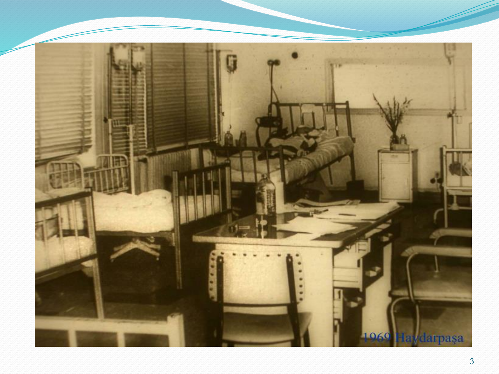
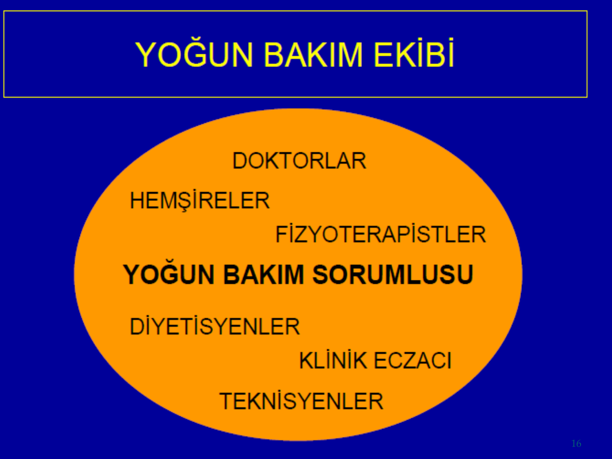
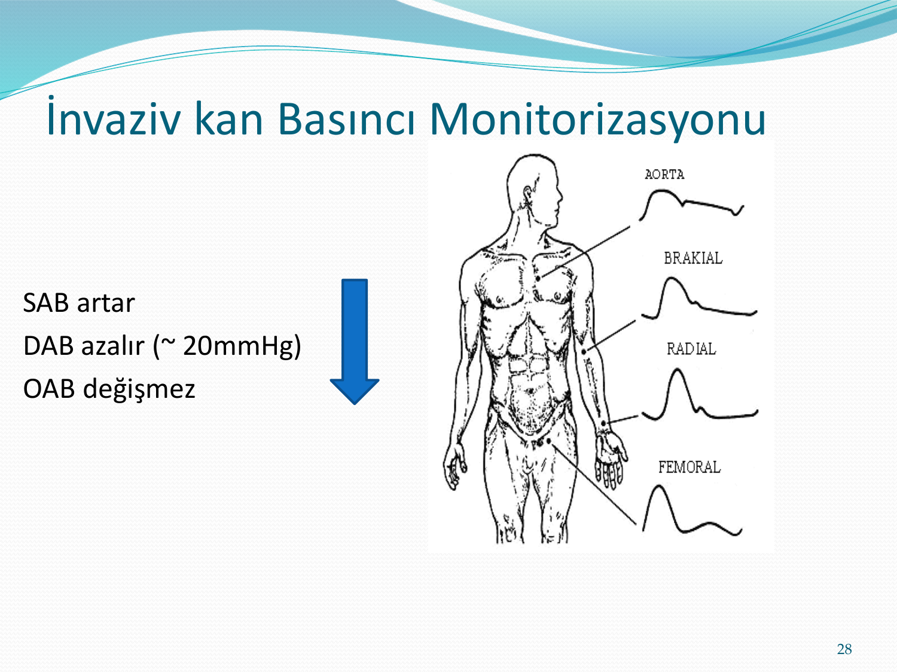
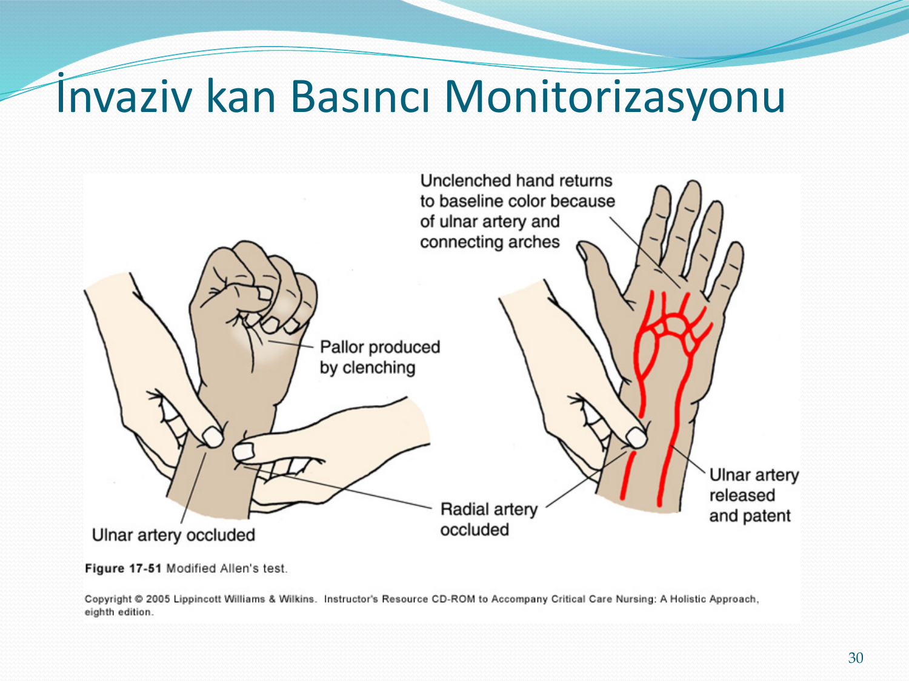
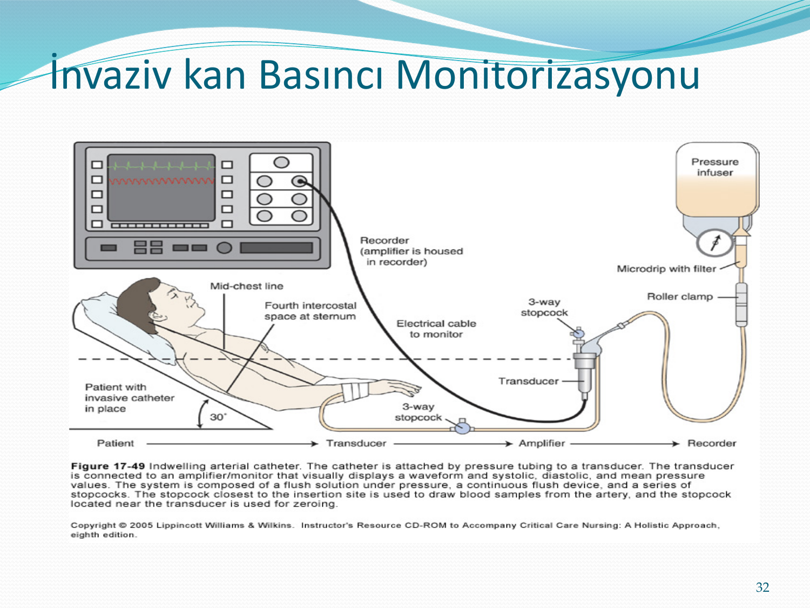
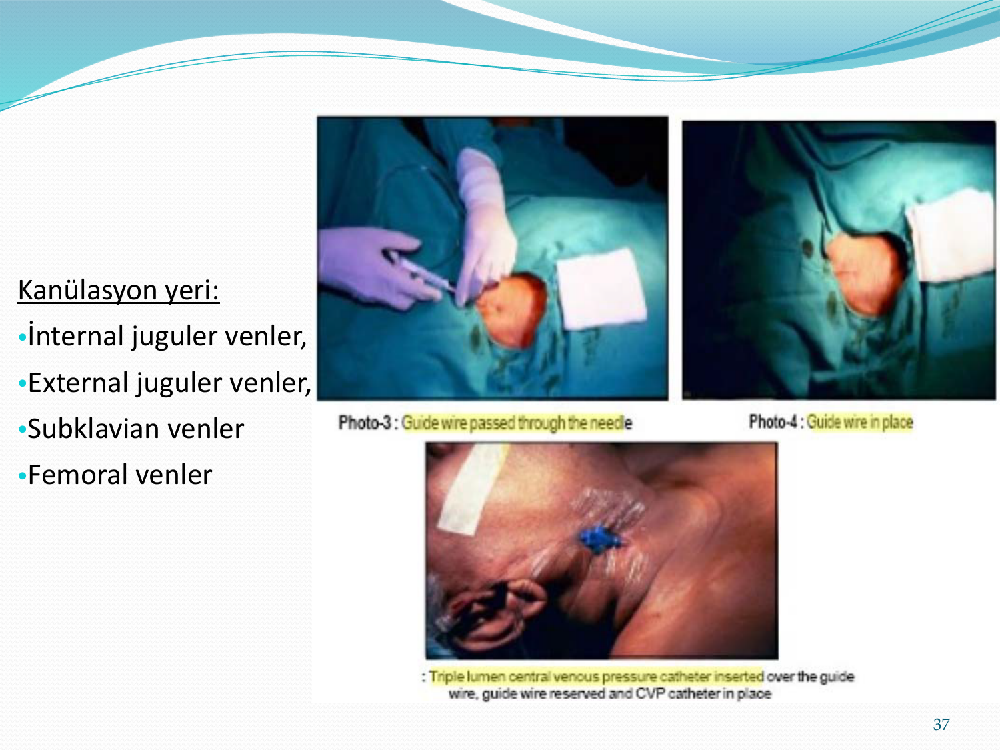
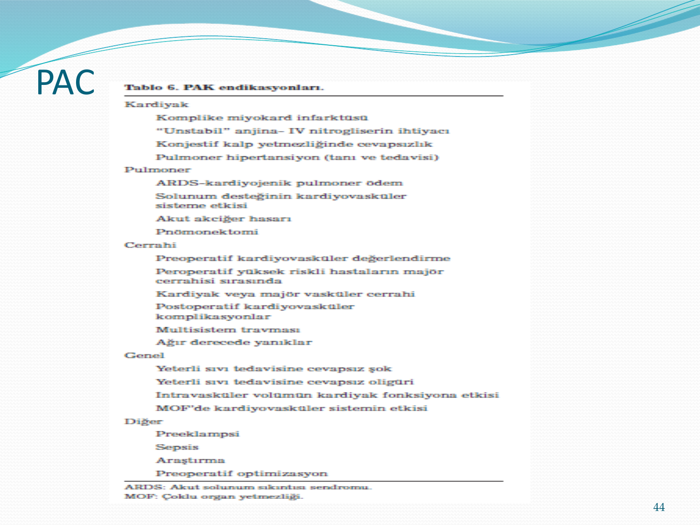
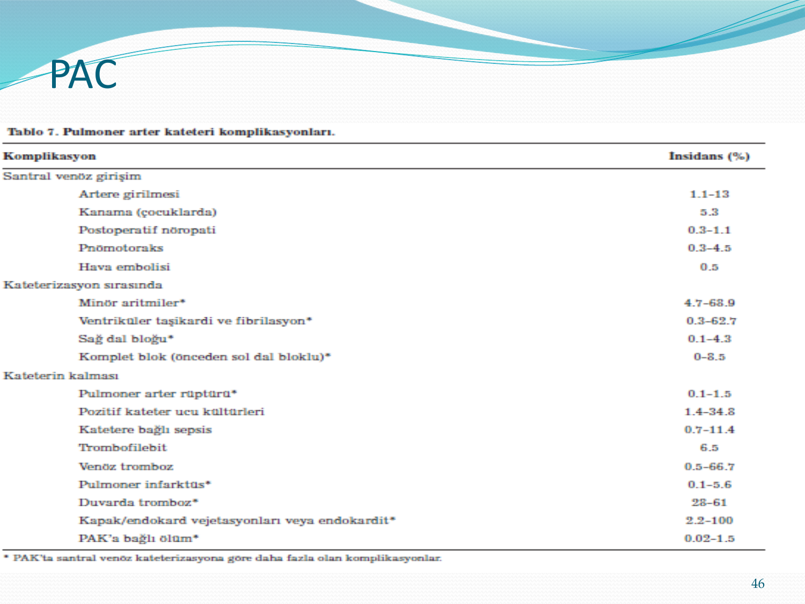

# DAHİLİ YOĞUN BAKIM ÜNİTESİNE GENEL BAKIŞ

**Hazırlayan:** Dr. Hilal Bektaş Uysal
**Bölüm:** Genel Dahiliye — İç Hastalıkları Anabilim Dalı

---

## İÇİNDEKİLER

1. [Tarihçe](#tarihce)
2. [Yoğun Bakım Ünitesi (YBÜ)](#yogun-bakim-unitesi)
3. [YBÜ'ye Kimi Yatıralım?](#ybu-ye-kimi-yatiralim)
4. [Uygun Zamanda Çıkış](#uygun-zamanda-cikis)
5. [YBÜ Hizmet Düzeyi](#ybu-hizmet-duzeyi)
6. [Yoğun Bakım Ekibi](#yogun-bakim-ekibi)
7. [Hemodinamik Monitorizasyon](#hemodinamik-monitorizasyon)
8. [Noninvazif Hemodinamik Monitorizasyon](#noninvazif-hemodinamik-monitorizasyon)
9. [İnvazif Hemodinamik Monitorizasyon](#invazif-hemodinamik-monitorizasyon)
10. [Santral Venöz Basınç Ölçümü (CVP)](#santral-venoz-basinc-olcumu)
11. [Pulmoner Arter Kateteri (PAC)](#pulmoner-arter-kateteri)

---

## TARİHÇE

* Modern yoğun bakımın temelleri **1852** yılında Kırım savaşında **Florence Nightingale**'in yoğun bakım gereken hastaları bir yere toplaması ile atılmıştır
* İlk olarak **1923** yılında John Hopkins Hastanesinde beyin cerrahisi hastalarının ameliyat sonrası bakımı için 3 yataklı özel bir ünite kurulmuştur
* Ülkemizde de ilk olarak **1959** yılında Haydarpaşa Numune Hastanesinde Prof. Dr. Cemalettin Öner tarafından 4 yataklı bir ünite kurulmuştur



---

## YOĞUN BAKIM ÜNİTESİ

> Yoğun bakım ünitesi, ciddi fizyolojik instabilitesi olan hastaların ileri düzey teknik ve yapay yaşam desteği ihtiyaçlarını karşılayan monitorizasyon ve bakım üniteleridir.

YBÜ'leri:
* Yoğun izlem
* Monitorizasyon
* Organ destek tedavileri uygulanabilen
* Günün **24 saati**, sürekli ve aynı standartta hasta bakımı veren özel birimlerdir

### YBÜ Misyonları

* Akut bir hastalık veya yaralanma sonrası hayati tehlike altında bulunan hastalara anlamlı, şefkatli, koruyucu ve yoğun bakım sağlamak
* Kritik hastalığı iyileşmekte olan hastalara **rehabilitasyon** hizmeti sunmak
* YBÜ'ne tam bakım ve tedavi amacıyla yatırılan ancak izlemi boyunca hastalığın progresyon gösterdiği hastalara uygun **palyatif** destek sunmak ve triajını sağlamak

### YBÜ'ye Yatış Kriterleri

* YBÜ'ne **geri dönüşümlü** bir tıbbi tabloda olan ve makul bir yaşam sürmesi beklenen hastalar yatırılır
* Son dönem hastalığı olan (metastatik kanser, son dönem kronik hastalık), makul bir yaşam sürme beklentisi olmayan hastalar (hipoksik-iskemik ensefalopati tablosu) veya normal bir serviste de izlemi mümkün olan hastalar **yatırılmamalıdır**
* YBÜ'ne bir hasta yatırıldıktan sonra son dönem hastalığı olduğu veya makul bir yaşam sürmeyeceği anlaşılırsa, bu hasta **palyatif bakım birimine** nakil edilmelidir

---

## YBÜ'YE KİMİ YATIRALIM?

Eğer yatak sayısı veya YBÜ koşulları (ventilatör sayısı, enfeksiyon durumu, vb.) talebe yetişemiyorsa eşit yatış endikasyonu olan hastalar içinden ilk başvuran hastaya öncelik tanınır ve aciliyet durumuna göre **triaj** uygulanır.

### Öncelik Sıralaması

**1. öncelik:** Altta yatan ciddi kronik ya da ölümcül hastalığı olmayan, organ destek tedavileri gerektiren çoklu organ yetmezliği olan, YBÜ'de uygulanacak tedavilerden yarar görecek, YBÜ dışında izlem ve tedavisi mümkün olmayan kritik durumdaki hastalar (sepsis, travma)

**2. öncelik:** Ciddi komorbiditeleri üzerine akut alevlenmeleri olan, YBÜ'de uygulanacak tedavilerden yarar görecek, sürekli monitorizasyon gerektiren ve her an durumu bozulabilecek hastalar (kalp yetmezliği olan hastada kardiyojenik şok)

**3. öncelik:** Altta yatan hastalık veya akut tablo nedeniyle uzun dönem yaşam şansı fazla olmayan ancak akut tablonun iyileştirilmesi amacıyla yatırılan ve destek tedavilerinin kısıtlı tutulabileceği hastalardır (akciğer kanseri, kardiyak tamponada bağlı şok)

**4. öncelik:** Aslında yatmaması gereken ancak özel nedenlerle yoğun bakım sorumlusunun inisiyatifine göre yatabilen (dışarıda bakımın çok zor yapılabildiği) kısa süreli yaşam beklentisi olan hastalar (genel durumu bozulmuş son dönem metastatik kanser)

### Yatış Kararı Öncesi Dikkate Alınabilecek Faktörler

* Tanı
* Hastalığın ciddiyeti
* Yaş
* Eşlik eden hastalıklar
* Fizyolojik rezerv
* Prognoz
* Uygun tedavinin bulunabilirliği
* Tedaviye o ana kadar olan yanıt
* Yeni arrest ve resusitasyon süresi
* Nörolojik ve fonksiyonel beklenti
* Beklenen yaşam kalitesi
* Hasta ve yakınlarının istekleri

**⚠️ ÖNEMLİ:**
* İleri yaş (> 65 yaş), yoğun bakım mortalitesini belirleyen bağımsız faktördür. Ancak tek başına yatışa engel bir faktör değildir
* APACHE, SAPS gibi skorlar sadece yoğun bakıma yatış sonrası hastanın hastane mortalitesini belirlemeye yöneliktir, yatış öncesi bir hastanın yoğun bakımdan fayda görüp görmeyeceğini belirlemez
* Hastanın daha önce verdiği kararlara uyulmalıdır

---

## UYGUN ZAMANDA ÇIKIŞ

* Gereğinden kısa veya uzun süreli yatış morbidite ve mortaliteyi artırmaktadır
* Uygun eğitim (ventilatör, gastrostomi, trakeostomi...)
* Ara bakım üniteleri
* Bakım evlerine çıkış
* Eve çıkış

---

## YBÜ HİZMET DÜZEYİ

* YBÜ'leri kabul edebilecekleri hastaların klinik durumlarına, sağlık personeli, donanım ve mekansal özelliklerine göre basamaklandırılır
* YBÜ'lerinde ameliyathanelerde olduğu gibi sterilizasyon şartlarını sağlayacak şekilde hepafiltre ve benzeri mikroorganizmaları süzebilen havalandırma sistemleri ve özellikli donanımlar kullanılmaktadır

| Düzey         | Özellikler                                                                                                                                                                                        |
| ------------- | ------------------------------------------------------------------------------------------------------------------------------------------------------------------------------------------------- |
| **Düzey III** | Tüm kritik hasta grubuna bakabilecek düzeyde personel, teknolojik donanım, sistem ve yapılanmaya sahip olan üniteler                                                                              |
| **Düzey II**  | Kritik hastalara tam bir bakım verebilen ancak bazı konularda yeterli personel ve donanıma sahip olmayan ve bu hastaların uygun merkezlere nakli için protokollerin bulunduğu üniteler            |
| **Düzey I**   | Kritik hastaların ilk stabilizasyonunu gerçekleştirebilen ancak bu hastalara tam bir bakım veremeyecek düzeyde olan ve bu hastaların uygun merkezlere nakli için protokollerin bulunduğu üniteler |

**⚠️ YB HASTASI SÜREKLİ AYNI STANDARTTA BAKIM GEREKTİRİR!**
* Hafta sonu, tatil veya mesai saati dışında yatan veya YBÜ'den çıkan hastalarda mortalite ve morbidite yüksek!
* Yoğun bakımcı sorumluluğunda **kapalı sistem** yönetim mortaliteyi ve yatış sürelerini azaltıyor
* Hemşire yükünün fazlalığı mortaliteyi arttırıyor
* Klinik eczacının vizitlere katılması ilaç hatalarını azaltıyor
* Fizyoterapi uygulaması mekanik ventilasyon süresini kısaltıyor

---

## YOĞUN BAKIM EKİBİ



**Yoğun Bakım Sorumlusu** merkezde olmak üzere:
* Doktorlar
* Hemşireler
* Fizyoterapistler
* Diyetisyenler
* Klinik eczacı
* Teknisyenler

> Yoğun bakım hastası **anstabildir**. Her an genel durumu değişebilir. 
> Bu nedenle hızlı yatış, uygun nakil, yakın ve hedefe yönelik monitorizasyon, hızlı ve uygun tanı ve tedavi ve en uygun zamanda çıkış planı gerekir.

> !! Reel bilgi ver ama anlık bilgileri duygularınla karışık verme.

---

## HEMODİNAMİK MONİTORİZASYON

### Hemodinami

* Hemo + dinami (Kanın Hareketi)
* Kalbin pompa mekanizmasının kanın hareketi ile ilişkisidir
* Hipovolemi-hipervolemi
* Aşırı vazodilatasyon
* Aşırı vazokonstriksiyon
* Azalmış miyokard kontraktilitesi...

### Amaç

* Fizyolojik parametrelerin izlenmesi
* Terapötik girişimlerde kılavuzluk
* Problemlerin erken belirlenmesine olanak sağlanması
* Organ disfonksiyonunun MOF'a progresinin engellenmesi
* Tedavi stratejisindeki değişiklik gereksiniminin saptanması

**→ Yeterli doku perfüzyonunun sağlanmasıdır.** (temel amaçlardan biri)

### Monitörize Edilebilen Parametreler

| Sistem                    | Parametreler                                                                                                                                              |
| ------------------------- | --------------------------------------------------------------------------------------------------------------------------------------------------------- |
| **Kardiyovasküler**       | EKG, arteryel kan basıncı, santral venöz basınç, pulmoner arteryel ve kapiller wedge basınçlar, kardiyak output ve hemodinami                             |
| **Pulmoner**              | Tidal volüm, solunum hızı, dakika ventilasyon hacmi, arteryel kan gazları-pH, oksijen transportu değişkenleri, end-tidal CO₂, transkutanöz oksijen ve CO₂ |
| **Renal**                 | İdrar outputu, plazma ve idrar osmolalitesi, osmolar ve serbest sıvı klirensleri                                                                          |
| **Kanın monitorizasyonu** | Hematokrit ve hemoglobin, kan ve plazma volümü, serum elektrolitleri ve kan kimyası                                                                       |
| **Nöromusküler**          | Fonksiyon değerlendirmesi                                                                                                                                 |
| **Isı**                   | Vücut sıcaklığı izlemi                                                                                                                                    |
| **SSS**                   | Elektroansefalogram, intrakranyal basınç                                                                                                                  |

---

## NONİNVAZİF HEMODİNAMİK MONİTORİZASYON

> Herşeyi ölçebilirsin ama invaziv mi değil mi? Bu sorunun cevabı önemli.

* EKG
* Transtorasik Ekokardiyografi
* Transözofajiyal Dopler Ekokardiyografi
* NIBP (Non invasive Blood Pressure; Osilometrik yöntem)
* **Pulse Oksimetre** (SpO₂)
* End tidal karbondioksit (ETCO₂)
* Vücut sıcaklığı izlemi
* Kapiller doluş

### Pulse Oksimetre

* Oksijene bağlamış hemoglobinin, tüm hemoglobin miktarına oranı, **oksijen satürasyonu** olarak isimlendirilir
* Kandaki oksijen parsiyel basıncı ne kadar artar ise hemoglobinin oksijenasyonu da o kadar artar
* Normal oksijen satürasyonu **%95-99** arasındadır
* Oksimetre arteryel oksihemoglobin satürasyonunu ışık dalgalarını seçerek ölçen **noninvaziv** bir yöntemdir
* El ve ayak parmağı, kulak memesi, burun kanatları, alın, çocuklarda topuğa ve anteriyor aksiller bölgeye yerleştirilebilir

**⚠️ Pulse Oksimetrede DİKKAT!**
* Arteriyal oksijen satürasyonunun %70'den düşük olması
* Hemoglobin miktarının 5 g/dL'nin altında olması
* Anormal hemoglobin varlığı (methemoglobin, orak hücreli anemi)
* KVS'de; düşük perfüzyon, düşük kardiyak output, artmış venöz pulsasyon, venöz staz, periferik vazokonstriksiyon ve ödem
* Mekanik nedenler; aşırı hareket, tırnak cilası, ekstremitelerin kan dolaşımını engelleyecek kadar sıkı tespiti
* Hipotermi, cildin rengi

> Kapillerdeki rengin ölçümü yapılarak çalışır. (spektrofotometrik ölçüm)
> CO zehirlenmesinde güvenilir değildir.
> Kan gazı alacaksın o daha güvenilir.
---

## İNVAZİF HEMODİNAMİK MONİTORİZASYON

* İnvaziv arteryel kan basıncı (İAKB)
* Periferik venöz basınç ölçümü
* Santral venöz basınç ölçümü (SVB)
* Pulmoner arter kateterizasyonu
* Kardiyak output (KO) ölçümü
* Karışık (mikst) venöz oksimetre
* Sol ventrikül end-diastolik basıncı
* İntrakraniyal basınç (İKB) monitörü
* Mesane kateterizasyonu

### İnvaziv Kan Basıncı Monitorizasyonu

* Arteryel kan basıncının büyüklüğü, doğrudan **kardiyak output (CO)** ve **sistemik vasküler rezistans (SVR)**'a bağlıdır
* Ortalama arter basıncı (OAB), organ perfüzyonunun değerlendirilmesinde daha önemli bir değişkendir
* İntra-arteryel monitorizasyon, noninvaziv tekniklerle kıyaslandığında **altın standart** olarak kabul edilmektedir

### Kan Basıncının Yorumlanması

**OAB (Ortalama Arter Basıncı)** → Organ perfüzyonunu verir (direkt bilgi)

> **OAB = DAB + (SAB - DAB) / 3**
* **DAB** (Diyastolik arter basıncı) → Koroner perfüzyonu gösterir
* **SAB** (Sistolik arter basıncı) → Kalbin oksijen tüketimini gösterir

Formülü ezberlemene gerek yok.



> Periferden merkeze doğru: SAB artar, DAB azalır (~20 mmHg), OAB değişmez

### Arteryel Kateterizasyon Alanları (fark etmiyor)

* Radyal
* Femoral
* Aksiller
* Dorsalis Pedis
* Brakial



### Gerekli Cihazlar

* İV kateter (20 G veya daha ince)
* Bağlantı sistemleri (basınç hattı, yıkama sistemleri)
* Transduser
* Analiz ve ekran sistemleri
* Arteryel kateter, heparinize bir solüsyon ile (1-3 mL/saat) sürekli olarak yıkanmalıdır
* Bu infüzyon, trombüs oluşumunu engeller ve kateterden daha uzun süre yararlanılmasını mümkün kılar



### İnvaziv Arteryel Monitorizasyon Endikasyonları

* Büyük sıvı şiftlerinin ve/veya kan kayıplarının beklendiği durumlar
* Sık arteryel kan gazları analizi gereken pulmoner hastalar
* Sol ventrikül fonksiyonu ciddi derecede bozulmuş (KKY) veya ciddi valvüler kalp hastalıkları
* Hipovolemik, kardiyojenik veya septik şok
* Multipl organ yetersizliğindeki olgular
* Masif travma olguları
* Sağ kalp yetersizliği
* Pulmoner hipertansiyon veya pulmoner emboli
* Arteryel basıncın noninvaziv olarak ölçülmesinin mümkün olamadığı olgular (morbid obezite, yanıklar, vb)
* İstemli hipotansiyon veya hipotermi planlanan cerrahi

### Komplikasyonlar

* Enfeksiyon
* Hemoraji-Hematom
* Tromboz-İskemi
* Cilt nekrozu
* Emboli
* Nörolojik hasar
* Yanlış ölçüm

---

## SANTRAL VENÖZ BASINÇ ÖLÇÜMÜ

### CVP (Santral Venöz Basınç)

* Sağ ventrikül dolum basıncının ölçümüdür
* Vena kava süperior veya sağ atrium girişinin basıncı olarak tanımlanır
* Normal değeri: **8-10 cmH₂O**
* İntravasküler volüm hakkında bilgi verir:
  - (a) Dolaşımdaki kan volümü
  - (b) Venöz tonus
  - (c) Sağ ventrikül fonksiyonları hakkında bilgi verir
* Kateter sağ atrium girişine kadar ilerletilmeli
* Sağ ventriküle girildiğinde aşırı yüksek değerler görülür

### CVP Yorumu (buralara çok girmeyeceğim)

* Santral venöz obstrüksiyondan veya intratorasik basınç değişikliklerinden (PEEP gibi) etkilenir
* Anlık değerlerden çok **seri ölçümleri** daha değerlidir
* Volüm infüzyonuna CVP'nin yanıtı, sağ ventrikül fonksiyonunun değerlendirilmesinde yararlı bir testtir
* CVP, sol kalbin doluş basınçları hakkında doğrudan fikir vermez, ancak sol ventrikül (LV) fonksiyonları iyi olan olgularda sol kalbin doluş basınçlarını değerlendirmek için **indirekt** olarak kullanılabilir

### Kanülasyon Yeri (bunu da okudu geçti.)



* İnternal juguler venler
* External juguler venler
* Subklavian venler
* Femoral venler

### CVP Endikasyonları

* İdrar outputunun iyi olmadığı veya hiç olmadığı olgularda intravasküler volümün değerlendirilmesi
* Vazoaktif veya iritan ilaçların kullanılması için venöz yol gerekliliği
* Uzun süreli ilaç ve sıvı uygulaması
* Periferik intravenöz yolların yetersiz olması
* İntravenöz solüsyonların hızlı infüzyonu
* Parenteral nütrisyon
* Sık terapötik plazmaferez, diyaliz
* Kardiyak fonksiyonları iyi olan veya olmayan olgularda büyük sıvı şiftleri ve/veya kan kaybına neden olan durumlar

### Santral Ven Kateterizasyonu Komplikasyonları

1. Artere girilmesi, arteryel zedelenme
2. Akciğer apeksine girilmesi, plevranın delinmesi, pnömotoraks
3. Torasik lenfatik hasar
4. Kanülasyon sırasında venöz hava embolisi
5. Trakeaya girilmesi, trakeal hasar
6. Hemoptizi
7. Ciltteki giriş yerinden kanama, sıvı sızıntısı
8. Kateterin yanlış yerleşmesi
9. Kateter infeksiyonu
10. Nörolojik hasar
11. Epilepsi (epilepsi nöbet hikayesi olanlarda)
12. Astım nöbeti (astım hikayesi olanlarda)
13. Kateterizasyonu yapan kişiye olan komplikasyonlar (kan, iğne batması ile bulaş)

---

## PULMONER ARTER KATETERİ

### PAC (Pulmoner Arter Kateteri)

* Pulmoner arter basıncı, **sol kalp fonksiyonu** hakkında bilgi verir
* Ucunda balon bulunan bir kateterin, sağ atriuma girdikten sonra, ucundaki balon şişirilerek, akım yönünde, sağ ventriküle, oradan da pulmoner artere gönderilmesi esasına dayanır
* Balonun artık pulmoner arter dalları içinde ilerleyemeyeceği (wedge) noktada gösterdiği basınç **pulmoner kapiller yatak basıncı (PCWP)**, bu noktada balonun indirilmesi ile okunan basınç da **pulmoner arter basıncı (PAP)** dır
* Ortalama PAP **10-17 mmHg**'dır
* Ölçüm için **Swan-Ganz kateteri** kullanılmaktadır

### PAC ile Ölçülebilen Parametreler

Balonlu ve akımla yönlenen pulmoner arter kateterleri (PAC):
* Sol ventrikülün doluş basınçlarını (LVEDP)
* Kardiyak output (CO)
* Pulmoner arter basınçları (PAP)
* Wedge basıncı (PCWP)
* Mix venöz oksijen satürasyonu ölçmek için kullanılır. *(yeni bir terminolojiymiş)*



* Özellikle **Akut Kalp Yetersizliği** ile **Sıvı Volümü Problemlerini** ayırdetmeye yarar
* Bir izlem yöntemi olarak: Akut MI, diğer kardiyak sorunlar, şok, travma, sıvı hacmi ve dolaşımın durumu hakkında şüphede olunduğu zamanlarda kullanılır

### PAC Komplikasyonları



---

## KRİTİK HASTADA: NON-İNVAZİF Mİ, İNVAZİF Mİ?

* Fayda/risk oranını iyi değerlendirmek gerekir
* **"Önce zarar verme"** prensibi
* Gerçekten gerekli mi?
* Ne kadar invazif o kadar komplike
* Doğru yorumlanamayan veriler yanlış tedavilere yol açar

> Ehil ellerde ise invaziv. Ama sonucu yorumlayamayacaksan hiçbir anlamı yok.
>

> *"Anlamlı olan herşey ölçülemez, ölçülebilen herşey anlamlı değildir."*
> — **Albert Einstein**

---
```
SONUÇ

* Her hastayı ayrı değerlendirme
* Takip edilmesi gereken parametrelerin nedenleri
* En az girişim gerektiren tekniklerin tercih edilmesi
* Olası komplikasyonların takip edilmesi
* Endikasyonu biten tekniklerin durdurulması
* Hemodinamik monitorizasyonun yararlı olabilmesi için elde edilen dataların güvenilirliği ve iyi yorumlanabilmesi
* Erken-amaca yönlendirilmiş tedavi doku perfüzyonunun erken restorasyonu için en etkin tedavidir
```