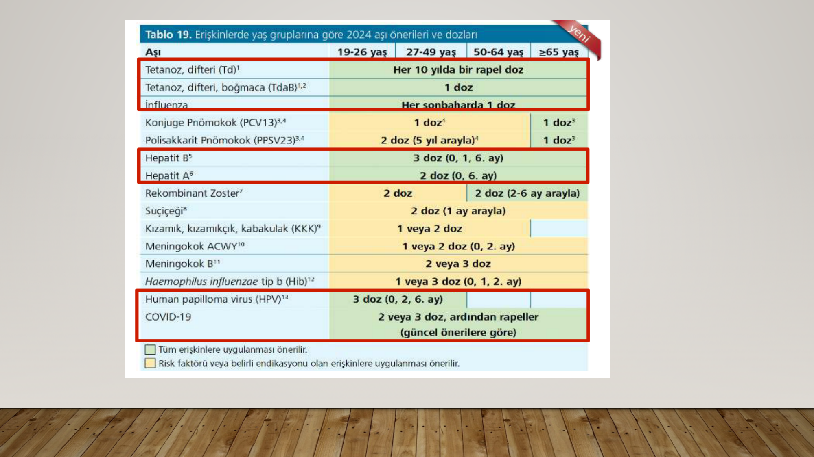
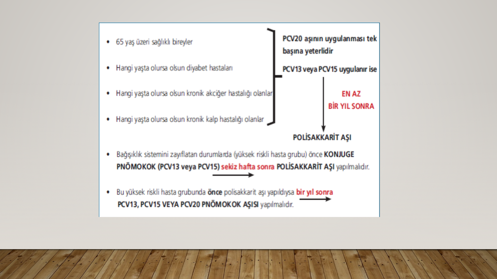
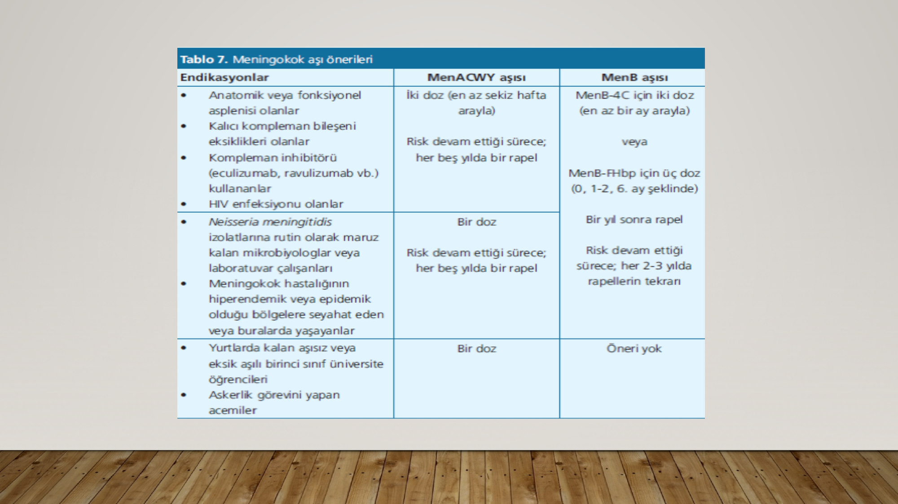

# İÇ HASTALIKLARI PRATİĞİNDE ERİŞKİN AŞILAMA

**Hazırlayan:** Dr. Elif Duygu Topan (2025-2026)
**Bölüm:** Genel Dahiliye — İç Hastalıkları Anabilim Dalı
**Kaynak:** Türkiye Enfeksiyon Hastalıkları ve Klinik Mikrobiyoloji Uzmanlık Derneği Erişkin Bağışıklama Rehberi 2024 (4. Baskı)

---

## İÇİNDEKİLER

1. [Önemi ve Epidemiyoloji](#onemi-ve-epidemiyoloji)
2. [Erişkin Dönemde Yapılması Önerilen Aşılar](#eriskin-donemde-onerilen-asilar)
3. [Difteri-Boğmaca-Tetanoz Aşıları](#difteri-bogmaca-tetanoz)
4. [Mevsimsel Grip (İnfluenza) Aşısı](#influenza-asisi)
5. [Pnömokok Aşısı](#pnomokok-asisi)
6. [Hepatit A Aşısı](#hepatit-a-asisi)
7. [Hepatit B Aşısı](#hepatit-b-asisi)
8. [Suçiçeği Aşısı](#sucicegi-asisi)
9. [Herpes Zoster (Zona) Aşısı](#zona-asisi)
10. [KKK Aşısı](#kkk-asisi)
11. [Meningokok Aşısı](#meningokok-asisi)
12. [HPV Aşısı](#hpv-asisi)
13. [Kronik Hastalıklarda ve Yaşlılıkta Aşılama](#kronik-hastaliklar)
14. [Haemophilus influenzae tip b (Hib) Aşısı](#hib-asisi)
15. [Risk Gruplarına Göre 2024 Aşı Önerileri](#risk-gruplari)

---

## ÖNEMİ VE EPİDEMİYOLOJİ

* Aşılama, bulaşıcı hastalıkları önlemede çevre sağlığı hizmetlerinden sonra en etkili ve en güvenli koruyucu sağlık hizmetidir
* Çiçek hastalığı aşılama ile dünyadan eradike edilen ilk hastalık olmuştur (son vaka: 1977, Somali)
* \> 26 hastalık önlenmekte ve kontrol altına alınmakta; her yıl milyonlarca hayat kurtulmakta
* Her yıl difteri, tetanoz, boğmaca, grip ve kızamık gibi hastalıklara bağlı **3.5-5 milyon** ölümü engeller

**⚠️ ÖNEMLİ:** ABD'de aşıyla önlenebilir hastalıklardan yıllık kaybedilen çocuk sayısı 300 iken yetişkinlerde bu sayı **50.000-70.000** arasında. Aşı ile korunulabilen hastalıklardan gerçekleşen ölümlerin **%99**'u erişkinler arasında görülmekte.

### Erişkin Aşılaması Neden Önem Kazanmaktadır?

* Doğumda beklenen yaşam süresinin artması
* Yaşlanmayla birlikte bağışıklık sisteminin zayıflamasına bağlı bulaşıcı hastalıklara karşı duyarlılığın artması
* Kronik hastalıklara bağlı bağışıklık sisteminin zayıflaması
* Son yüzyılda sanayileşmeyle birlikte ticaret, ulaşım ve iletişimin artmasına bağlı ülkeler arası iş ve turistik ziyaretlerde artış
* Çevresel bozulma ve ekonomik sebeplerle ülke içi/arası göçlerin artması
* Sadece 2010-2018 arasında kızamık aşıları sayesinde **23 milyon ölüm** engellenmiştir *(Patel MK et al. Wkly Epidemiol Rec. 2019;49:581-600)*

### Yapılması Gereken

* Erişkin aşılamasında **farkındalığın artması** ("yaşam boyu bağışıklama" kavramı)
* Günlük tıp pratiğine girmesi
* Her başvuruda aşı fırsatlarının değerlendirilmesi
* Ulusal rehber oluşturulması: hekimler için yol gösterici ve destek

### Kimleri Aşılayalım?

* Sağlıklı erişkinler (gebeler, ileri yaş 65+, sağlık çalışanları, seyahat edenler, askere gidenler)
* Kronik hastalıklar
* İmmünsupresif hastalıklar

---

## ERİŞKİN DÖNEMDE ÖNERİLEN AŞILAR

| Aşı                                  | Şema                            |
| ------------------------------------ | ------------------------------- |
| Tetanoz, difteri (Td)                | Her 10 yılda bir rapel doz      |
| Tetanoz, difteri, boğmaca (TdaB)     | 1 doz                           |
| İnfluenza                            | Her sonbaharda 1 doz            |
| Konjuge Pnömokok (PCV13/15/20)       | 1 doz                           |
| Polisakkarit Pnömokok (PPSV23)       | 2 doz (5 yıl arayla)            |
| Hepatit B                            | 3 doz (0, 1, 6. ay)             |
| Hepatit A                            | 2 doz (0, 6. ay)                |
| Rekombinant Zoster                   | 2 doz (2-6 ay arayla)           |
| Suçiçeği                             | 2 doz (1 ay arayla)             |
| Kızamık, kızamıkçık, kabakulak (KKK) | 1 veya 2 doz                    |
| Meningokok ACWY                      | 1 veya 2 doz (0, 2. ay)         |
| Meningokok B                         | 2 veya 3 doz                    |
| *Haemophilus influenzae* tip b (Hib) | 1 veya 3 doz (0, 1, 2. ay)     |
| HPV                                  | 3 doz (0, 2, 6. ay)             |
| COVID-19                             | 2 veya 3 doz, ardından rapeller |

---

## DİFTERİ-BOĞMACA-TETANOZ AŞILARI

* Aşılar deltoid kasa **İM** yoldan uygulanır
* Erişkinler için **primer aşılama:** 3 doz → 4 hafta ara ile 2 doz, ikinci dozdan 6 ay sonra 3. doz Td aşısı (0, 1 ve 7. ay)
* Primer aşılamasını tamamlamış tüm erişkinlere **10 yılda bir** Td rapeli (mümkünse en az bir dozu TdaB olmak üzere)
* Üçüncü aşı zamanında yapılmamışsa ilk dozdan sonraki **12. aya** kadar yapılabilir

### Yaralanmada Tetanoz Profilaksisi (Tablo 3)

| Bağışıklama Durumu | 
Temiz Minör Yara Td / TIG
 | 
Diğer Tüm Yaralanmalar* Td / TIG
 |
|---|---|---|
| Bilinmiyor veya < 3 doz | Evet / Hayır | Evet / Evet |
| > 3 doz | Hayır** / Hayır | Hayır*** / Hayır |

* Td: Tetanoz ve erişkin tip difteri toksoidi; TIG: Tetanoz immünglobulini
* **Diğer tüm yaralanmalar:** Kirli, dışkı ve salya teması olan yaralanmalar; kesi yaraları, yanıklar, yabancı cisim batmaları, ısırıklar, donma, kurşun yarası
* ** Evet, son dozun üzerinden geçen süre > 10 yıl ise
* *** Evet, son dozun üzerinden geçen süre > 5 yıl ise (daha sık booster doza gerek yoktur)

---

## MEVSİMSEL GRİP (İNFLUENZA) AŞISI

* DSÖ 6 aydan büyük **herkese** grip aşısı önermektedir. Her yıl tekrarlanır
* Sağlık çalışanları ve yüksek riskli bireylere bakım veren kişiler **öncelikli** grup
* Koruyucu etki uygulamadan **1-2 hafta** sonra başlar
* Uygulama zamanı: **Ekim-Kasım** ayları tercih edilmekle beraber grip mevsimi boyunca yapılabilir

### Grip İlişkili Komplikasyon Riski Yüksek Hasta Grupları

* 5 yaş altı çocuklar (özellikle < 2 yaş)
* **≥ 65 yaş** kişiler
* Gebe kadınlar (postpartum 2 hafta dahil)
* Bakımevlerinde ve uzun dönem tedavi merkezlerinde kalanlar
* Kronik hastalığı olanlar: astım, kalp hastalıkları, endokrin hastalıklar (DM), kronik akciğer hastalıkları (KOAH), kan hastalıkları (orak hücreli anemi), KC ve böbrek hastalıkları, metabolik ve nörolojik hastalıklar
* İmmünsupresyon (HIV/AIDS, kanser, kronik steroid kullanımı, biyolojik ajan kullanımı)
* Obezite (VKİ ≥ 40)

---

## PNÖMOKOK AŞISI

* COVID-19 pandemisi öncesinde pnömoni ve diğer solunum yolu enfeksiyonları ölüme yol açan bulaşıcı hastalıklar arasında **1. sırada**
* *S. pneumoniae* toplum kaynaklı pnömoni, akut menenjit ve sinüzitin en sık bakteriyel etkeni
* İnvaziv pnömokok enfeksiyonlarının insidansı **≥ 65 yaş** ve **< 2 yaş**'ta en yüksek

### Aşı Tipleri

* **Polisakkarit aşı:** PPSV23
* **Konjuge aşılar:** PCV13, PCV15, PCV20

### Endikasyonlar

* Kronik akciğer hastalığı, kronik KVH, DM, kronik KC hastalığı
* Bakımevinde kalan kişiler
* Fonksiyonel veya anatomik aspleni (elektif splenektomiden en az 2 hafta önce, acil splenektomiden en erken 2 hafta sonra)
* İmmünsupresif hastalıklar (konjenital/kazanılmış immün yetmezlikler, KBY, nefrotik sendrom, hematolojik maligniteler, yaygın malignite, uzun süreli immünsupresif tedavi, solid organ nakli)
* Koklear implantlar, BOS kaçakları, HIV enfeksiyonu

### Uygulama

* Her iki tip aşı da **0.5 mL İM** olarak uygulanır
* **PCV20** tek başına yeterlidir
* PCV13 veya PCV15 uygulanırsa **polisakkarit aşı** da yapılmalıdır
* Polisakkarit aşı en az **5 yıl** ara ile en fazla **3 kez** tekrarlanabilir (son doz 65 yaşından sonra önerilir)

---

## HEPATİT A AŞISI

* Ülkemizin ulusal aşı programına **2012** yılında dahil edilmiştir
* Aşılama öncesinde erişkin yaş grubunda **test yapılması** maliyet etkili olduğu için önerilmektedir
* Aşı sonrası antikor kontrolü gereksizdir

**Endikasyonlar:**

* Kronik karaciğer hastalığı olan kişiler
* Pıhtılaşma faktör bozukluğu olan hastalar
* Eşcinsel erkekler
* Madde bağımlılığı olan bireyler
* Hepatit A'nın sık olduğu ülkelere seyahat edecek seronegatif kişiler
* HIV/AIDS olguları
* Solid organ ve kemik iliği nakli adayları ve alıcıları
* Kanalizasyon işçileri
* Bağışık olmayan herkes

**⚠️** Seronegatif sağlık çalışanlarına **ücretsiz** olarak yapılmaktadır

---

## HEPATİT B AŞISI

* Aşılama şeması: **0-1-6. aylarda** birer doz (20 mcg)
* 1. ve 2. doz arası en az 4 hafta; 2. ve 3. doz arası en az 8 hafta; 3. doz ilk dozdan en az 16 hafta sonra

**Endikasyonlar:**

* Sağlık çalışanları ve sağlık çalışanlarının yetiştirildiği tıp, diş hekimliği, sağlık meslek yüksekokulları öğrencileri
* Hemodiyaliz hastaları
* Solid organ ve kemik iliği nakli adayları ve alıcıları
* Sık kan ve kan ürünü kullanmak zorunda kalan kişiler
* Madde bağımlıları (özellikle damar içi uyuşturucu kullananlar)
* Hepatit B taşıyıcılarının/hastalarının aile içi temaslılarından aşısız ve seronegatif olanlar; aynı evde yaşamasalar bile HBsAg pozitif kişilerin anne-baba-kardeş ve diğer yakınları
* HBsAg pozitif annelerin çocukları
* Çok sayıda cinsel partneri olan ve seks işçileri ile para karşılığı cinsel ilişkide bulunanlar; eşcinsel/biseksüel erkekler
* Hepatit B dışında kronik karaciğer hastalığı olan kişiler
* Cezaevlerinde ve ıslahevlerinde bulunan hükümlüler ve çalışanlar
* Piercing, dövme yaptırmayı planlayan kişiler; berberler, kuaförler, manikür-pedikürcüler
* Güvenlik personeli (kolluk, itfaiye) ve kazalarda/afetlerde ilk yardım uygulayan kişiler
* HBV endemisitesinin yüksek olduğu bölgelerden gelen göçmenler ve onlarla temas riski yüksek kişiler
* Mümkünse aşı öncesinde serolojik değerlendirme yapılması uygundur

**Temas sonrası profilaksi:** HBsAg (+) kişiyle temas sonrası ilk **6-24 saat** içinde HBIG 0.06 mL/kg (8-10 IU/kg) İM + eş zamanlı aşılamaya başlanmalıdır

**Temas sonrası profilaksi en sık:** HBsAg pozitif hastayla temas etmiş seronegatif sağlık çalışanları, HBsAg pozitif annenin bebeği, HBsAg pozitif biriyle cinsel ilişkiye giren seronegatif kişiler

**⚠️** HBV aşıları gebelikte ve emzirme döneminde güvenlidir

---

## SUÇİÇEĞİ (VARİCELLA ZOSTER) AŞISI

* Suçiçeğine karşı bağışıklığı olmayan tüm erişkinler aşılanabilir
* **SC veya İM** yoldan **4-8 hafta** arayla 2 doz
* **12 ay ve üzerindeki kişilere** temas sonrasında ideal olarak ilk **72 saat** içerisinde (120 saate kadar uzayabilir) aşı yapılması hastalığı önler veya hafif geçirilmesini sağlar
* **Kontraendikasyon:** Gebelik veya immün yetmezlik

---

## HERPES ZOSTER (ZONA) AŞISI

* Daha önce suçiçeği ve zona geçirip geçirmemiş olmasına bakılmaksızın **≥ 50 yaş** tüm bireylere önerilir
* **≥ 18 yaş** immünsupresyonu bulunan bireylere de önerilir
* **2-6 ay** ara ile **2 doz** rekombinan aşı
* Zona hastalığı ve en yaygın komplikasyonu olan **postherpetik nevralji** gelişimine karşı koruma sağlar

**Artmış risk grupları:** Organ nakli alıcıları, immünomodülatör tedavi alanlar, kemoterapi/kortikosteroid alanlar, kronik hastalıklar (KBY, DM, RA, KOAH), huzurevinde kalanlar

---

## KKK AŞISI

* Doğurganlık çağındaki tüm kadınlar **kızamıkçık** bağışıklığı açısından taranmalı ve bağışık değilse aşılanmalıdır
* Kızamık/kızamıkçık aşısı olduğuna dair kayıt olmayan veya serolojik olarak antikor negatif olan yetişkinlere en az **1 doz SC KKK** aşısı yapılmalıdır

---

## MENİNGOKOK AŞISI

* *N. meningitidis* nazofarenkste kolonize olarak kalabilir ve solunum sekresyonlarının yakın temasıyla bulaşır
* En fazla invaziv hastalığa neden olan serogruplar: **A, B, C, W135, X ve Y**

### Aşı Tipleri

* **MenACWY** (tetravalan konjuge): Serogrup A, C, Y, W-135
  * MenACWY-D, MenACWY-TT, MenACWY-CRM
* **MenB** (protein bazlı): Serogrup B
  * MenB-4C, MenB-FHbp

### İnvaziv Meningokok Hastalığı Riski Artmış Kişiler

* Anatomik/fonksiyonel aspleni
* Kalıcı kompleman bileşeni eksiklikleri
* Kompleman inhibitörü (ekulizumab, ravulizumab) kullananlar
* HIV enfeksiyonu
* *N. meningitidis* izolatlarına rutin maruz kalan mikrobiyologlar ve laboratuvar çalışanları
* Meningokok salgını riski altındakiler
* Hiperendemik/epidemik bölgelere seyahat edenler
* Yurtlarda kalan aşısız veya eksik aşılı 1. sınıf üniversite öğrencileri
* Askerlik görevi yapan acemiler

### Meningokok Aşı Önerileri (Tablo 7)

| Endikasyon | MenACWY | MenB |
|---|---|---|
| 
Anatomik/fonksiyonel aspleni Kompleman eksiklikleri Kompleman inhibitörü kullananlar HIV enfeksiyonu
 | 
2 doz (en az 8 hafta arayla) Risk devam ettiği sürece her 5 yılda bir rapel
 | 
MenB-4C: 2 doz (en az 1 ay arayla) veya MenB-FHbp: 3 doz (0, 1-2, 6. ay)
 |
| 
*N. meningitidis* izolatlarına maruz kalan mikrobiyologlar Hiperendemik/epidemik bölgelere seyahat edenler
 | 
1 doz Risk devam ettiği sürece her 5 yılda bir rapel
 | 
1 yıl sonra rapel Risk devam ettiği sürece her 2-3 yılda tekrar
 |
| 
Yurtlarda kalan aşısız/eksik aşılı 1. sınıf üniversite öğrencileri Askerlik görevi yapan acemiler
 | 1 doz | Öneri yok |

---

## HPV AŞISI

* HPV genital siğil, prekanseröz genital lezyonlar, servikal/vaginal/vulvar/anal/penil kanserler, baş boyun kanserleri ve rekürren respiratuar papillomatozise yol açar
* DSÖ önerisi: öncelikle **9-14 yaş** arası çocuklara uygulanmalı
* Seksüel aktivite başlamadan aşı şemasının tamamlanması etkinlik açısından önemli
* HPV aşısı için üst yaş sınırı **yoktur**
* Aşı farklı HPV tiplerine karşı bağışıklık sağlayabileceğinden genital siğil, anormal smear veya HPV DNA (+) olan kişilere de uygulanması tavsiye edilir

### HPV Aşı Önerileri (Tablo 8)

| Yaş Grubu | Dokuz Valanlı Aşı | Dört Valanlı Aşı |
|---|---|---|
| 9-13 yaş | 
2 doz (6 ay arayla) 6 aydan daha erken uygulanırsa 3. doz gereklidir
 | 
2 doz (6 ay arayla) 6 aydan daha erken uygulanırsa 3. doz gereklidir
 |
| 14 yaş | 3 doz (0, 2, 6. ay); tüm dozlar 1 yıl içinde | 3 doz (0, 2, 6. ay); tüm dozlar 1 yıl içinde |
| 15 yaş ve üzeri | 3 doz (0, 2, 6. ay); tüm dozlar 1 yıl içinde | 3 doz (0, 2, 6. ay); tüm dozlar 1 yıl içinde |

---

## KRONİK HASTALIKLAR VE YAŞLILIKTA AŞILAMA

### Kronik Hastalıklarda

* **KKH, KVH ve kalp kapak hastalıkları:** İnvaziv pnömokok hastalığı riski **9.9×** daha yüksek; pnömoni/sepsis sonrası ilk yıl KVH riski **6×** artmakta
* **KOAH:** Alevlenmelerde enfeksiyonların %48.4'ü viral, %54.7'si bakteriyel etkenlere bağlı
* **DM:** İnfluenza ve pnömokok enfeksiyonlarına bağlı mortalite **2-3×** yüksek

### Yaşlılık Dönemi

* İnfluenzaya bağlı alt solunum yolu enfeksiyonu ölüm hızı **≥ 70 yaş** bireylerde en yüksek → bu bireylerle yaşayan veya bakım veren kişilere de influenza aşısı uygulanmalı
* Pnömokok hastalığı sıklığı ve mortalitesi 50 yaşından sonra, özellikle **≥ 65 yaş**'ta artış göstermekte
* ≥ 50 yaş immünkompetan bireylere 2-6 ay ara ile 2 doz **rekombinan zoster aşısı** önerilir

---

## HAEMOPHİLUS İNFLUENZAE TİP B (HIB) AŞISI

* *Haemophilus influenzae* tip b (Hib) menenjit, pnömoni, epiglottit ve sepsis gibi invaziv hastalıklara neden olur
* Erişkinlerde belirli risk gruplarında önerilir

**Endikasyonlar:**

* Anatomik veya fonksiyonel aspleni (orak hücreli anemi, splenektomi)
* Kök hücre nakli alıcıları (nakilden 6-12 ay sonra 3 doz)
* Kompleman eksikliği
* İmmünglobulin eksikliği

**Şema:**

* Daha önce hiç aşılanmamış: 1 doz (bazı yüksek riskli gruplarda 3 doz: 0, 1, 2. ay)
* Kök hücre nakli alıcıları: 3 doz (0, 1, 2. ay şeklinde, nakilden 6-12 ay sonra başlanır)

---

## RİSK GRUPLARINA GÖRE 2024 AŞI ÖNERİLERİ (TABLO 20)

Renk kodu: **O** = Uygulanması önerilir | **D** = Diğer risk/endikasyon/yaşa göre önerilir | **K** = Kontraendike | **H** = Hastaya/hekime göre uygulanabilir

| Aşı | İmmünsupresyon | Aspleni | SOT | Romatojik Has. | Kronik Has. | HIV CD4 < 200 | HIV CD4 >= 200 | Sağlık Çalışanı | Gebe |
|---|---|---|---|---|---|---|---|---|---|
| Td/TdaB | O | O | O | O | O | O | O | O | O |
| İnfluenza | O | O | O | O | O | O | O | O | O |
| Pnömokok | O | O | O | O | O | O | O | D | D |
| Hepatit B | O | O | O | O | O | O | O | O | O |
| Hepatit A | O | O | O | O | O | O | O | O | D |
| Rekombinan Zoster | O | O | H | O | O | O | O | O | H |
| Suçiçeği | K | O | H | K | O | K | O | O | K |
| KKK | K | O | H | K | O | K | O | O | K |
| Meningokok | O | O | O | D | D | O | O | D | D |
| Hib | D | O | D | D | D | D | D | D | D |
| HPV | O | O | O | O | O | O | O | O | K |
| COVID-19 | O | O | O | O | O | O | O | O | O |

* SOT: Solid organ transplantasyonu
* Suçiçeği ve KKK canlı aşılar olduğundan immünsupresyon, HIV CD4 < 200/mm3 ve gebelikte **kontraendikedir**
* Rekombinan Zoster ve SOT/gebelik kombinasyonunda özel bir öneri yoktur, hastaya/hekime göre değerlendirilir

---

## SONUÇ

> Korumak, tedavi etmekten her zaman daha kolay ve değerlidir.
