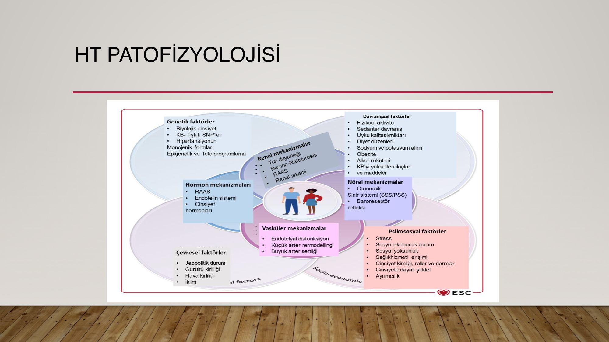
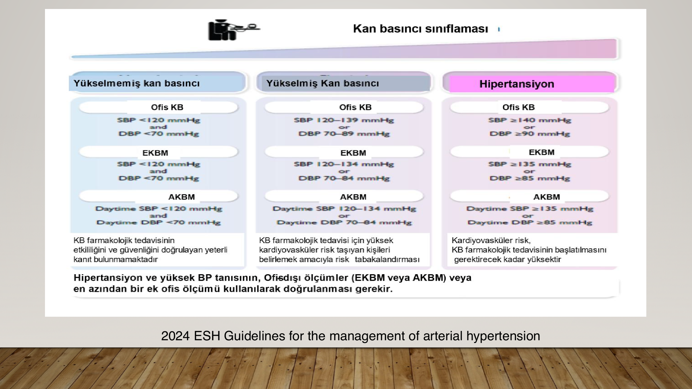
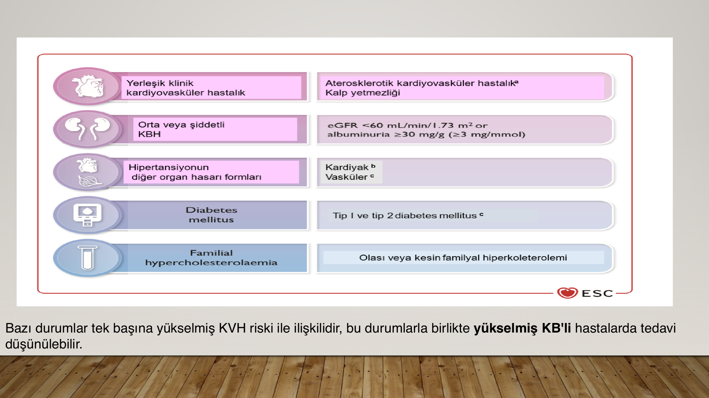
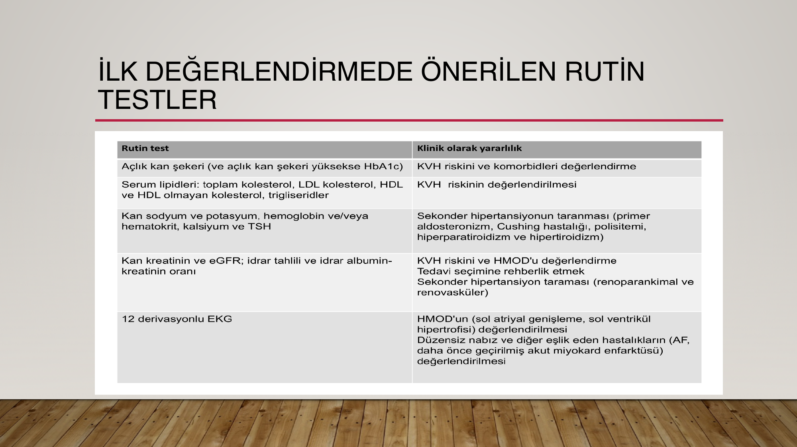
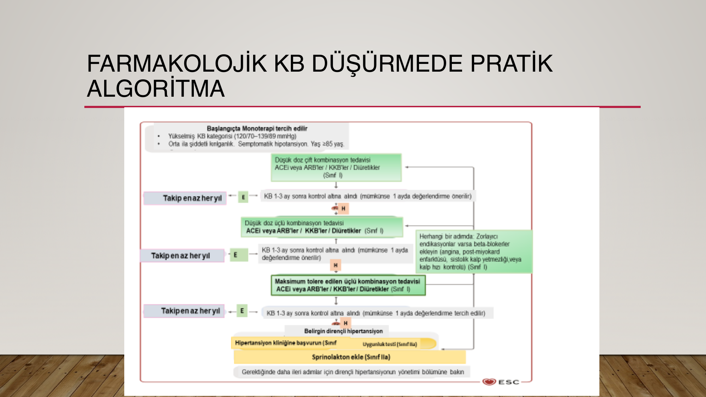

# PRİMER (ESANSİYEL) HİPERTANSİYON

**Hazırlayan:** Dr. Elif Duygu Topan (2025-2026)
**Bölüm:** Genel Dahiliye — İç Hastalıkları Anabilim Dalı
**Kaynak kılavuzlar:** Türk Hipertansiyon Uzlaşı Raporu 2025, 2024 ESH Kılavuzu, 2025 AHA/ACC Kılavuzu

---

## İÇİNDEKİLER

1. [HT'nin Önemi ve Küresel Yük](#htnin-önemi-ve-küresel-yük)
2. [Fizyoloji ve Patofizyoloji](#fizyoloji-ve-patofizyoloji)
3. [Hipertansiyon Tanımı](#hipertansiyon-tanimi)
4. [Sekonder HT](#sekonder-ht)
5. [Kan Basıncı Ölçümü](#kan-basinci-olcumu)
6. [Ofis Dışı KB Ölçümleri](#ofis-disi-kb-olcumleri)
7. [Nokturnal HT](#nokturnal-ht)
8. [Epidemiyoloji](#epidemiyoloji)
9. [HT Tanımı ve Evrelendirmesi](#ht-tanimi-ve-evrelendirmesi)
10. [KVH Risk Temelli Yaklaşım](#kvh-risk-temelli-yaklasim)
11. [End Organ Hasarı](#end-organ-hasari)
12. [Tedavi](#tedavi)
13. [KB Hedefleri](#kb-hedefleri)

---

## HT'NİN ÖNEMİ VE KÜRESEL YÜK

**HT en sık görülen kronik hastalıklardan biridir ve küresel bir halk sağlığı sorunudur.** Dünyada kardiyovasküler hastalıkların en önemli nedenidir ve prevalansı giderek artmaktadır.

### Küresel Prevalans (2019 verileri)

| Grup | Prevalans |
|---|---|
| **Kadın (30-79 yaş)** | **%32** |
| **Erkek (30-79 yaş)** | **%34** |
| **≥ 80 yaş (her iki cinsiyet)** | **%80** |

### Neden Önemli?

HT; **kalp hastalıkları, inme, böbrek hastalığı, erken ölüm ve yeti yitimi** gibi durumlarla ilişkili olup sağlık ve ekonomi alanında önemli bir yük oluşturmaktadır.

> **⭐ Temel mesaj:** HT **önlenebilir ve tedavi edilebilir** bir hastalıktır. Erken tanı + yaşam tarzı değişikliği + uygun farmakolojik tedavi ile **inme, kalp yetmezliği, KBY ve mortalite** anlamlı şekilde azaltılabilir.

> **📝 Kaynak:** Türk Hipertansiyon Uzlaşı Raporu 2025

---

## FİZYOLOJİ VE PATOFİZYOLOJİ

> **Ortalama arteryel KB = Kalp debisi × Total periferik direnç**

* **Kalp debisi** = Kalp hızı × Atım volümü
* **Total periferik direnç** = (Damar uzunluğu × Kanın viskozitesi) / Damar yarı çapı⁴
* Artmış kardiyak debideki değişiklikler sistemik vasküler direncin adaptasyonu ile daha kısa süreli KB değişikliği yaratırken, **sistemik vasküler dirençte artış** daha uzun süreli KB yüksekliğine sebep olur

---

## HİPERTANSİYON TANIMI

* Tekrarlanan ofis ölçümlerinde KB > **140/90 mmHg** olması
* Sistemik bir hastalık, ciddi komplikasyonları mevcut, toplumda yaygın olarak görülür
* Tedavi edilmezse: kalp yetersizliği, koroner kalp hastalığı, hemorajik ve trombotik inme, böbrek yetersizliği, periferik arter hastalığı, aort diseksiyonu ve ölüm oranı artar
* Komplikasyonlar ve buna bağlı ölüm oranı, KB yüksekliği ile doğru orantılı
* Çok önemli **KVH risk faktörü**

### Primer (Esansiyel) HT

* Tüm HT olgularının yaklaşık **%80-90**'ını oluşturur
* Kesin mekanizması bilinmeyen, herhangi bir ikincil hastalığa bağlı oluşmamış, sistemik arteriyel KB sürekli yüksekliğidir

### Sekonder HT

Hastaların **%10-20**'sinde mevcuttur:
* Hiperaldosteronizm, feokromositoma, hipertiroidi, Cushing, hiperparatiroidi, hipotiroidi, akromegali
* Uyku apnesi
* Parankimal böbrek hastalığı, renal arter stenozu
* Aort koarktasyonu

---

## SEKONDER HT

Aşağıdaki durumlarda sekonder HT nedenleri düşünülmeli ve araştırılmalıdır:

* **20 yaşından önce** veya **50 yaşından sonra** başlayan HT
* Ailede sekonder HT öyküsü bulunanlarda
* Ani başlayan ve şiddetli HT (> 180/110 mmHg)
* İlaç tedavisine yeterli yanıt alınamayan olgularda
* Daha önce iyi kontrol sağlanmasına karşın son zamanlarda kontrolü bozulan HT
* Belirgin hipertansif hedef organ hasarı olanlarda
* Yaş, öykü, FM ile laboratuvar incelemelerinde spesifik bir patolojiyi işaret ettiği durumlarda

---

## KAN BASINCI ÖLÇÜMÜ

### Ölçüm Koşulları

* 30 dk öncesine kadar sigara, çay, kahve içmemiş, kafein almamış ve tercihen yemek yememiş olmalı
* Manşon antekübital fossanın **2-3 cm** üstüne yerleştirilir
* Brakiyal veya radyal arter palpe edilirken manşon nabız kaybolana kadar şişirilir
* Manşon içindeki basınç, palpasyonla ölçülen SKB'nın **20 mmHg** kadar üstüne çıkarılır
* Steteskop brakiyal arter üzerine konur (manşonun altına sıkıştırılmaz)
* Manşon içindeki basınç saniyede **2-3 mmHg** düşürülerek sesler dinlenir

### Önemli Noktalar

* KB ölçümü mutlaka **her iki koldan** yapılmalıdır. İki kol arası fark < 10 mmHg ise normal
* KB farkının sistolik > 20 mmHg ve diyastolik > 10 mmHg olduğu durumlarda mutlaka **ileri araştırma** yapılmalıdır
* İlk muayenede mutlaka **ortostatik hipotansiyon** varlığına bakılmalıdır (sistolik KB > 20 mmHg düşerse ileri sorgulama)
* Takipler yüksek çıkmış koldan devam edilmeli
* Yaşlı ve diyabetik hastalarda mutlaka ayakta 3 dk bekletilerek KB ölçülmeli; sistolik ≥ 20 mmHg veya diyastolik ≥ 10 mmHg düşmesi → ortostatik hipotansiyon (diyabetik hastalarda artmış mortalite ile ilişkili)

---

## OFİS DIŞI KB ÖLÇÜMLERİ

Ofis KB ölçümlerinde beyaz önlük etkisi, gün içi değişkenlikler, rakam yuvarlama gibi sorunlar vardır.

### Evde KB Ölçümü

* En az **5 gün**, tercihen 7 gün yapılmalı
* Sabah ve akşam saatlerinde, en az 5 dk oturarak istirahat sonrası
* Beyaz önlük etkisi veya maskeli HT şüphesi varsa istenmelidir

### Ambulatuvar KB Ölçümü (ABKM)

* Özel cihazın hasta üzerinde **24 saat** süreyle taşınarak KB kayıtlarının alınması
* Gece okumaları yapılabilir
* Daha güçlü prognostik kanıt

### Beyaz Önlük HT

Evde ve gündüz ambulatuvar KB ölçümleri **normal** (< 135/85 mmHg) olmasına karşın ofis ölçümlerinin **yüksek** olması

### Maskeli HT

KB'nin ofis şartlarında **normal** (< 140/90 mmHg) olmasına rağmen ev ve/veya ambulatuvar KB ölçümlerinde (gündüz değerlerinin) > **135/85 mmHg** olması

---

## NOKTURNAL HT

| Tip | Tanım |
|---|---|
| **Dipper** | Gece tansiyonun gün içindeki ortalamadan > **%10** daha düşük olması |
| **Non-dipper** | Gece tansiyonun gün içindeki ortalamadan < **%10** daha düşük olması |
| **Reverse-dipper** | Gece tansiyonun gün içindeki ortalamadan **yüksek** olması |

**Nokturnal HT nedenleri:** Artmış santral sinir sistemi aktivitesi, otonomik disfonksiyon, OSAS ve diğer uyku bozuklukları, renal disfonksiyon, yüksek stres

---

## EPİDEMİYOLOJİ

* ABD ve Avrupa ülkelerinde yetişkin nüfusun **%25-30**'u
* Türkiye'de **%30.6-36.5** arasında
* Hipertansiyon olan hastaların yalnızca **%40.7**'si hastalıklarının farkında
* Antihipertansif tedavi alanların **%20.7**'si KB kontrol altında

---

## HT TANIMI VE EVRELENDİRMESİ

### HT Tanı Eşikleri

| Ölçüm Metodu | SKB (mmHg) | DKB (mmHg) |
|---|---|---|
| **Ofis KB** | ≥ 140 | ≥ 90 |
| **Ambulatuvar gündüz ort.** | ≥ 135 | ≥ 85 |
| **Ambulatuvar gece ort.** | ≥ 120 | ≥ 70 |
| **Ambulatuvar 24 saat ort.** | ≥ 130 | ≥ 80 |
| **Evde ölçülen KB** | ≥ 135 | ≥ 85 |

### HT Evrelendirmesi (2023/2024 ESH)

| Kategori | SKB (mmHg) | | DKB (mmHg) |
|---|---|---|---|
| **Optimal** | < 120 | ve | < 80 |
| **Normal** | 120-129 | ve | 80-84 |
| **Yüksek normal** | 130-139 | ve/veya | 85-89 |
| **Evre 1 HT** | 140-159 | ve/veya | 90-99 |
| **Evre 2 HT** | 160-179 | ve/veya | 100-109 |
| **Evre 3 HT** | ≥ 180 | ve/veya | ≥ 110 |
| **İzole sistolik HT** | ≥ 140 | ve | < 90 |
| **İzole diyastolik HT** | < 140 | ve | ≥ 90 |

---

## KVH RİSK TEMELLİ YAKLAŞIM

* Tedavi için yalnızca HT eşiğini kullanmak, birçok yüksek riskli hastanın yetersiz tedavi edilmesine yol açar
* KVH olaylarının önemli bir oranı, HT tanısı için geleneksel eşiğin altındaki hastalarda meydana gelir
* **SCORE2** (40-69 yaş) ve **SCORE2-OP** (≥ 70 yaş) 10 yıllık global KVH riskini tahmin etmek için kullanılır

### SCORE2 Risk Faktörleri

**Geleneksel:** Yaş, cinsiyet, sistolik KB, kolesterol seviyeleri, sigara içmek

**Geleneksel olmayan:**
* Cinsiyete özgü: gestasyonel diyabet/HT, preeklampsi, prematüre doğum, ölü doğum, tekrarlayan düşük
* Yüksek riskli etnik kökenler
* Prematüre aterosklerotik hastalık aile öyküsü (< 55 yaş erkek, < 65 yaş kadın)
* Düşük sosyoekonomik durum
* Otoimmün inflamatuar hastalıklar (SLE, RA, sedef hastalığı)
* Şiddetli ruhsal hastalık (majör depresif bozukluk, bipolar bozukluk, şizofreni)
* HIV

### Tek Başına Yükselmiş KVH Riski İle İlişkili Durumlar

* Yerleşik klinik kardiyovasküler hastalık / kalp yetmezliği
* Orta veya şiddetli KBH (eGFR < 60 mL/dk/1.73 m² veya albüminüri ≥ 30 mg/g)
* HT'nin diğer organ hasar formları (kardiyak, vasküler)
* Diabetes mellitus (Tip 1 ve Tip 2)
* Familyal hiperkolesterolemi

---

## END ORGAN HASARI

Uzun süredir devam eden HT → kardiyovasküler, serebrovasküler ve klinik böbrek hastalıkları → kronik hastalıkların küresel yükünü önemli ölçüde artırmaktadır

### İlk Değerlendirmede Önerilen Rutin Testler

| Rutin Test | Klinik Yararı |
|---|---|
| Açlık kan şekeri (ve açlık kan şekeri yüksekse HbA1c) | KVH riskini ve komorbiditeleri değerlendirme |
| Serum lipitleri (total kolesterol, LDL, HDL, non-HDL kolesterol, trigliseridler) | KVH riskinin değerlendirilmesi |
| Kan sodyum ve potasyum, hemoglobin ve/veya hematokrit, kalsiyum ve TSH | Sekonder HT taranması (primer aldosteronizm, Cushing, polisitemi, hiperparatiroidi ve hipertiroidi) |
| Kan kreatinin ve eGFR; idrar tahlili ve idrar albümin-kreatinin oranı | HMOD'u değerlendirme, tedavi seçiminde rehberlik, sekonder HT taraması |
| 12 derivasyonlu EKG | HMOD'un (sol atriyal genişleme, sol ventrikül hipertrofisi) değerlendirilmesi |

---

## TEDAVİ

### Yaşam Tarzı Değişikliği

* **Tuz alımı:** 2-4 g/gün (günde yaklaşık 5 g tuz ≈ bir çay kaşığı). Günlük sodyum alımının büyük kısmı işlenmiş gıdalardan alınır
* **Potasyum alımı:** Meyve ve sebze alımını artırmak (DSÖ: > 3.5 g/gün potasyum). KBY hastalarında dikkatli olunmalı!
* **Fiziksel aktivite:** Aerobik egzersiz haftada en az 3 gün, maksimum kalp hızının %65-75'i, **150 dk/hafta**. İzometrik egzersiz (plank) ve dinamik egzersiz (squat) haftada 2-3 kez
* **Kilo verme** (VKİ < 25 kg/m²)
* **Alkol alımının azaltılması**
* **Sigaranın bırakılması**

### Farmakolojik Tedavi

**Birinci basamak ilaçlar:**
* **RAS blokerleri** (ACEi, ARB)
* **Dihidropiridin KKB** (Kalsiyum kanal blokerleri)
* **Diüretikler** (tiyazidler, klortalidon, indapamid)

**Beta blokerler:** Angina veya kalp yetmezliği varlığında, MI sonrası veya kalp hızını kontrol etmek için (karvedilol, labetalol, nebivolol)

**⚠️ ÖNEMLİ:**
* Beta blokerler ve diüretikler, özellikle kombine edildiğinde, yatkın hastalarda **diyabet riskini** artırabilir
* RAS blokerleri ve KKB'ler end organ hasarını önlemede beta blokerlerden üstündür
* HT tanısı alırsa **düşük doz ikili kombinasyon** tedavisi önerilir; tek hap kombinasyonları tercih edilir

**Monoterapi tercih edilen durumlar:**
* Yükselmiş KB (120/70-139/89 mmHg) + yüksek risk (end organ hasarı, DM, KBY, KVH)
* Semptomatik ortostatik hipotansiyon
* ≥ 85 yaş

### Farmakolojik KB Düşürmede Pratik Algoritma

### Dirençli HT

Uygun yaşam tarzı önlemleri ve diüretik + RAS blokeri + KKB'nin maksimum/en fazla tolere edilen dozlarının ofis KB değerlerini < 140/90 mmHg'ye düşürmemesi durumudur.

→ Mevcut tedaviye **mineralokortikoid reseptör antagonisti (spirinolakton)** eklenir

---

## KB HEDEFLERİ

* Tedavi hedefi her zaman **120-129/70-79 mmHg**'dır (I-A)
* Tedavinin tolere edilemediği durumlarda, "makul ölçüde elde edilebilecek en düşük" sistolik KB düzeyinin hedeflenmesi önerilir (I-A)
* Bazı hastalarda kişiselleştirilmiş ve daha hoşgörülü KB hedefleri (< 140/90 mmHg) düşünülebilir (IIb-C):
  - Orta-şiddetli kırılganlık (frailty)
  - Sınırlı öngörülen yaşam süresi (< 3 yıl)
  - Semptomatik ortostatik hipotansiyon
  - Yaş ≥ 85 yıl

---

> **Kaynaklar:**
>
> 1. **Türk Hipertansiyon Uzlaşı Raporu 2025** (ana kaynak)
> 2. **2024 ESH Guidelines** for the management of arterial hypertension
> 3. **2025 AHA/ACC/AANP/AAPA/ABC/ACCP/ACPM/AGS/AMA/ASPC/NMA/PCNA/SGIM Guideline** for the Prevention, Detection, Evaluation and Management of High Blood Pressure in Adults
> 4. Dr. Elif Duygu Topan — Esansiyel Hipertansiyon 4. Sınıf ders notu, ADÜ Tıp Fakültesi, 2025-2026
