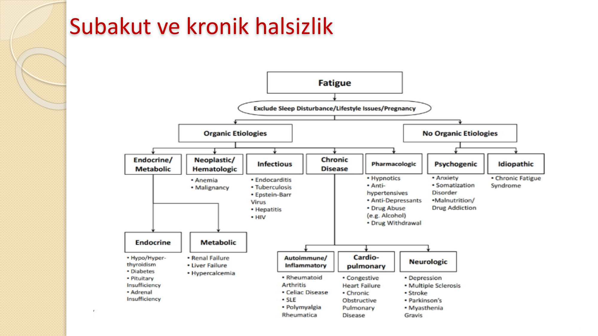
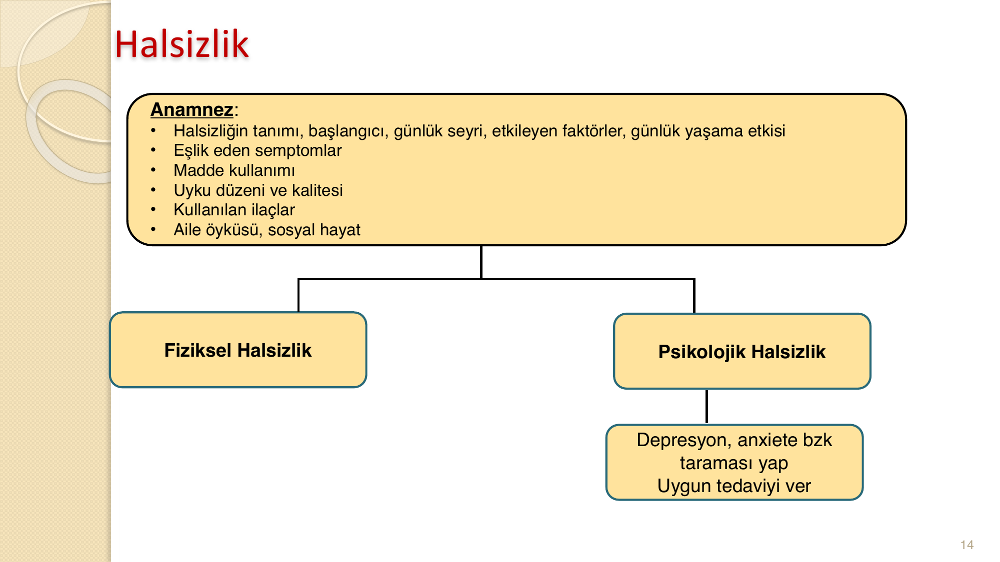
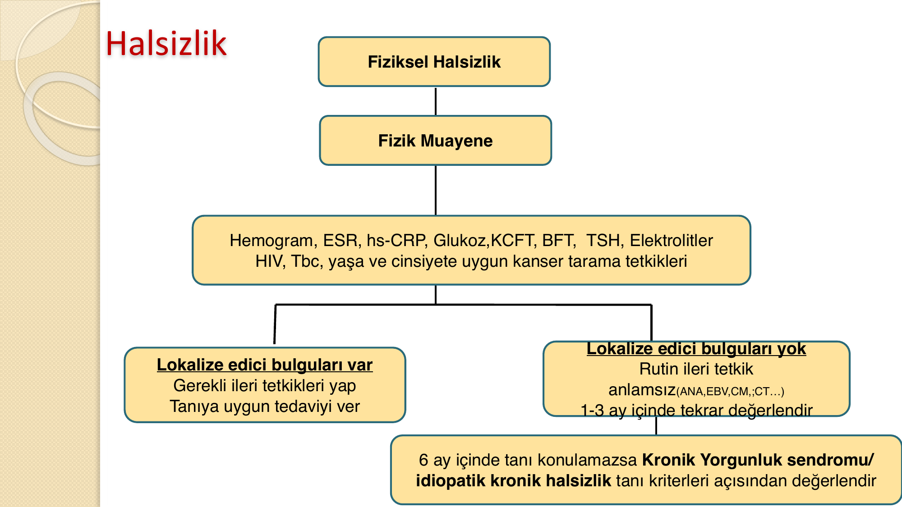
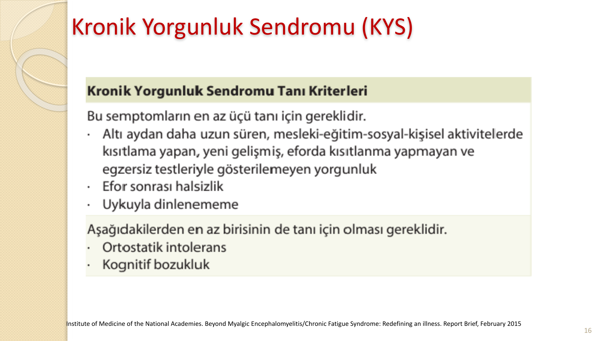
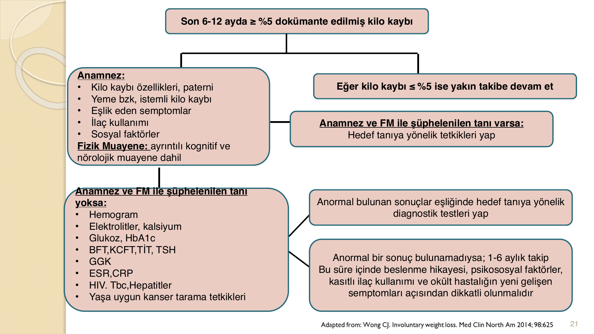
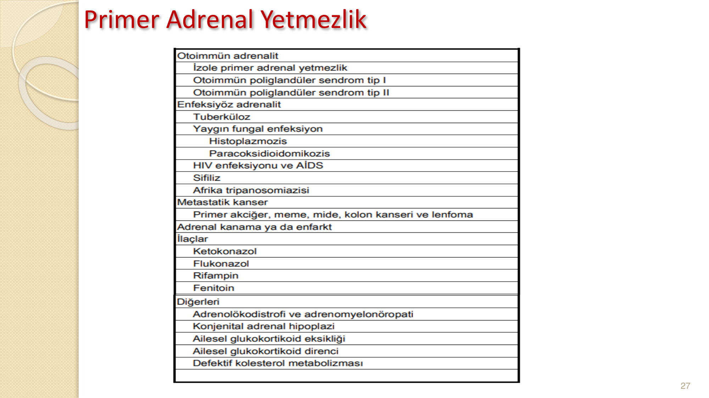
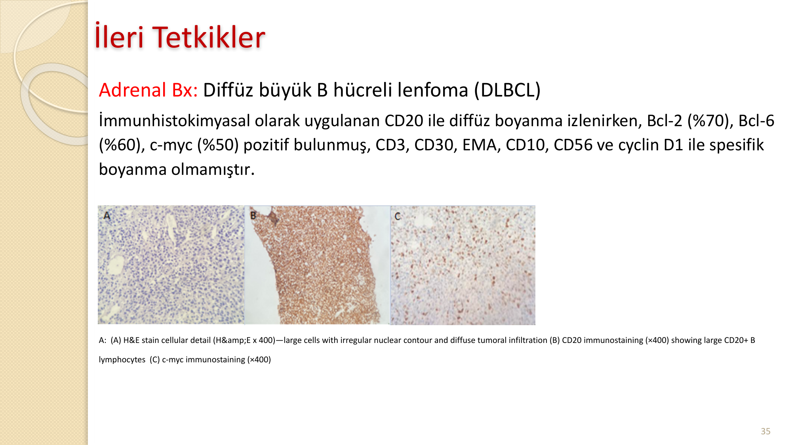

# HALSİZLİK VE KİLO KAYBI

**Hazırlayan:** Dr. Hilal Bektaş Uysal
**Bölüm:** Aydın Adnan Menderes Üniversitesi Tıp Fakültesi — Genel Dahiliye Bilim Dalı

---

## İÇİNDEKİLER

1. [Olgu Sunumu](#olgu-sunumu)
2. [Halsizlik](#halsizlik)
3. [Kronik Yorgunluk Sendromu](#kronik-yorgunluk-sendromu)
4. [Kilo Kaybı](#kilo-kaybi)
5. [Olgu Devamı ve Tanı](#olgu-devami-ve-tani)
6. [Primer Adrenal Lenfoma](#primer-adrenal-lenfoma)
7. [Hurthle Hücreli Foliküler Tiroid Karsinomu](#hurthle-hucreli-folikuler-tiroid-karsinomu)

---

## OLGU SUNUMU

**📋 VAKA ÖRNEĞİ: Halsizlik ve Kilo Kaybı**

**Hasta:** P.K., 78 yaş, kadın, ev hanımı
**Şikayet:** Halsizlik, iştahsızlık, kilo kaybı

**Öykü:**
* Daha önce hiçbir yakınması yok
* Son 2 aydır giderek artış gösteren, günlük rutin işlerini yapma kapasitesinde ≥ %50 azalmaya neden olan, aktivite ile artış gösteren, gün içinde devamlı olan **halsizlik**
* **İştahsızlık**; hasta şikayetleri başlamadan önce yediklerinin ≤ %50 kadarını yiyebiliyor
* Son 2 ayda istemsiz **~10 kg kilo kaybı** (78 kg → 68 kg)

**Özgeçmiş:** Allerjik intermittan astım, düzensiz düşük doz inhale kortikosteroid kullanımı. Sigara ve alkol yok.
**Soygeçmiş:** Özellik yok

**Sistem Sorgusu:**
* (+): Halsizlik, kilo kaybı, iştahsızlık
* (-): Kaşıntı, döküntü, baş ağrısı, baş dönmesi, ateş, gece terlemesi, öksürük, balgam, dispne, ortopne, çarpıntı, bulantı, kusma, ishal/kabızlık, karın ağrısı, dizüri, hematüri, melena, hematemez, hematokezya, epistaksis, dişeti kanaması

**Fizik Muayene:**
* Ateş 36.8 °C, Nabız 85/dk, TA **90/60** mmHg, SS 18/dk
* Genel durumu iyi, bilinci açık, koopere, oryante
* Baş Boyun: **Bilateral konjuktivalar soluk**, tiroid nonpalpabl, LAP yok
* SS: Trakea orta hatta, HİHTSEK, ral yok, ronküs yok
* KVS: S1+ S1+ ek ses üfürüm yok
* Batın: Serbest, defans yok, rebound yok, HPMG yok, asit yok, traube açık
* GÜS: Kostovertebral açı hassasiyeti yok, ele gelen kitle yok
* Ekstremite: Periferal LAP yok, PTÖ: -/-, bilateral nabızlar palpabl
* Nörolojik: Özellik yok

---

## HALSİZLİK

### Tanım

> **Halsizlik:** Aktiviteye başlamak veya devam ettirmekte zorluk, aktiviteyi devam ettirmek için azalmış kapasite, konsantrasyon güçlüğü, mental yorgunluk

* **Subjektif** bir yakınmadır
* Prevalans **%6-7.5**
* Kadın > erkek
* Birinci basamak poliklinik başvuru nedenlerinin **%21-33**'ü
* Yılda yaklaşık **7 milyon** poliklinik başvurusu

### Sınıflandırma

* Günlük aktivite kapasitesinin ≥ **%50** azalması durumunda halsizlik **patolojik** kabul edilir

| Tip                   | Süre   |
| --------------------- | ------ |
| **Akut halsizlik**    | < 1 ay |
| **Subakut halsizlik** | 1-6 ay |
| **Kronik halsizlik**  | > 6 ay |

### Akut Halsizlik

* Halsizlik yanında, ön planda başka klinik bulguların olduğu akut medikal durum
  - influenza
  - yeni ortaya çıkan stres faktörü
* Tanı konulabilecek bulguları olan medikal veya psikolojik hastalığa sahip akut halsizliği mevcut hastalarda sıklıkla ileri tetkik ve değerlendirmeye gerek yoktur

### Subakut ve Kronik Halsizlik Nedenleri

| Sistem                       | Nedenler                                                                        |
| ---------------------------- | ------------------------------------------------------------------------------- |
| **KVS/SS**                   | KKY, KoAH, uyku apne sendromu                                                   |
| **Endokrinolojik/Metabolik** | Adrenal yetmezlik, hipo/hipertiroidi, KBY, elektrolit bozuklukları              |
| **Psikolojik**               | Depresyon, anksiyete bozukluğu, somatizasyon bozukluğu                          |
| **Hematolojik/Neoplastik**   | Anemi, okült maligniteler                                                       |
| **Enfeksiyon**               | Mononükleoz sendromu, viral hepatitler, HIV, Tbc, subakut bakteriyal endokardit |
| **Romatolojik**              | Polimyalji romatika, **SLE**, RA, fibromyalji                                   |
| **Diğer**                    | İlaç toksisitesi, madde kullanımı, kronik yorgunluk sendromu                    |



### Tanı Yaklaşımı

* Kronik halsizlik ile başvuran hastaların ancak **2/3**'ünde etiyoloji saptanabilir
* Eşlik eden semptomlar etiyolojinin belirlenmesinde yardımcıdır
* Tek semptomun halsizlik olduğu durumda etiyolojiyi belirlemek güç

**Tanı basamakları:**
1. Ayrıntılı anamnez
2. Fizik muayene
3. Temel laboratuar tetkikleri
4. Altta yatan nedene yönelik ileri tetkikler

### Anamnez

* Halsizliğin tanımı, başlangıcı, günlük seyri, etkileyen faktörler, günlük yaşama etkisi
* Eşlik eden semptomlar
* Madde kullanımı
* Uyku düzeni ve kalitesi
* Kullanılan ilaçlar
* Aile öyküsü, sosyal hayat

→ **Fiziksel halsizlik** mi, **psikolojik halsizlik** mi ayırt et



### Fiziksel Halsizlikte Yaklaşım



**Temel laboratuar tetkikleri:**
* Hemogram, ESR, hs-CRP, Glukoz, KCFT, BFT, TSH, Elektrolitler
* HIV, Tbc, yaşa ve ***cinsiyete uygun kanser tarama tetkikleri***

**Lokalize edici bulguları var** → Gerekli ileri tetkikleri yap → Tanıya uygun tedaviyi ver

**Lokalize edici bulguları yok** → Rutin ileri tetkik anlamsız (ANA, EBV, CM, CT...) → 1-3 ay içinde tekrar değerlendir → 6 ay içinde tanı konulamazsa **Kronik Yorgunluk Sendromu / idiopatik kronik halsizlik** tanı kriterleri açısından değerlendir

> ****Gereksiz tetkik yapmayın!!****
---

## KRONİK YORGUNLUK SENDROMU



### KYS Tanı Kriterleri

Bu semptomların **en az üçü** tanı için gereklidir:
* Altı aydan daha uzun süren, mesleki-eğitim-sosyal-kişisel aktivitelerde kısıtlama yapan, yeni gelişmiş, eforda kısıtlanma yapmayan ve egzersiz testleriyle gösterilemeyen yorgunluk
* Efor sonrası halsizlik
* Uykuyla dinlenememe

Aşağıdakilerden **en az birisinin** de tanı için olması gereklidir:
* Ortostatik intolerans
* Kognitif bozukluk

### Epidemiyoloji ve Tedavi

* 20-40 yaş
* Kadın > Erkek
* Prevalans %0.2-2.6

**Tedavi:**
* **Antidepresanlar:** SSRI, SNRI
* **Kognitif davranışsal terapi:** Hastaların kendi hastalığıyla ilgili inanç ve düşünceleriyle nasıl başa çıkacağı, hangi düşünce ve davranışların semptomları ile dizabiliteyi arttırdığını gösteren bir tedavi yöntemidir
* **Egzersiz terapisi:** Submaksimal kalp hızında, maksimal %60 O₂ kullanılarak yaptırılmalı, en fazla 30 dk ve hastanın yorgunluk ve diğer semptomlarına göre günlük 1-2 dk arttırılacak şekilde planlanmalıdır

---

## KİLO KAYBI

### Tanım

> Son 6-12 ay içinde; bilinen bir hastalık veya uygulanan bir tedavi ile ilişkili olmayan, **istemsiz** olarak total vücut ağırlığının ≥ **%5** kaybıdır.

* Cinsiyet farkı yok
* Kohort çalışmalarında prevalansı **%7-13** arasında
* \> 65 yaş prevalans **%15-20**, evde bakım hastalarında **%50-60**
* Yaş, sigara ve öz bakım eksikliği bağımsız öngördürücü faktörler
* İstemsiz kilo kaybı **mortalite artışı** ile ilişkilidir

### Kilo Kaybı Mekanizmaları

1. Enerji tüketiminin artması
2. Enerji kaybının artması
3. Azalmış gıda alımı

* Kilo kaybı **iştah artışı** ile birlikte → hipertiroidi, kontrolsüz DM, malabsorbsiyon
* Kilo kaybı **iştah azalması** ile birlikte → maligniteler, endokrin bozukluklar, enfeksiyonlar, kronik hastalıklar, romatolojik hastalıklar, GIS hastalıkları

### Kilo Kaybı Nedenleri

| Neden                                                                         | Sıklık |
| ----------------------------------------------------------------------------- | ------ |
| **Maligniteler** (GIS, AC, hematolojik, prostat, meme, renal)                 | %25-37 |
| **Non-malign GIS hastalıkları** (İBH, çölyak, PÜ)                             | %10-20 |
| **Psikiyatrik bozukluklar** (depresyon, yeme bozukluğu)                       | %10-23 |
| **Endokrinopatiler** (adrenal yetmezlik, hipo/hipertiroidi)                   | —      |
| **Enfeksiyonlar** (HIV, Tbc, viral hepatitler, helmintik, fungal, bakteriyal) | —      |
| **İleri kronik hastalıklar** (kardiyak kaşeksi, pulmoner kaşeksi, KBY)        | —      |
| **Nörolojik hastalıklar** (stroke, Parkinson, demans, ALS)                    | —      |
| **Romatolojik hastalıklar** (ciddi RA, dev hücreli artrit, vaskülit)          | —      |
| **İlaç ve madde kullanımı**                                                   | —      |
| **Sosyal faktörler**                                                          | —      |
| **İdiyopatik**                                                                | %25    |

### Kilo Kaybında Tanı Yaklaşımı



**Son 6-12 ayda ≥ %5 dokümante edilmiş kilo kaybı varsa:**

**Anamnez:**
* Kilo kaybı özellikleri, paterni
* Yeme bozukluğu, istemli kilo kaybı
* Eşlik eden semptomlar
* İlaç kullanımı
* Sosyal faktörler

**Fizik Muayene:** Ayrıntılı kognitif ve nörolojik muayene dahil

**Eğer kilo kaybı ≤ %5 ise** → yakın takibe devam et

**Anamnez ve FM ile şüphelenilen tanı varsa** → Hedef tanıya yönelik tetkikleri yap

**Anamnez ve FM ile şüphelenilen tanı yoksa:**
* Hemogram, elektrolitler, kalsiyum
* Glukoz, HbA1c
* BFT, KCFT, TİT, TSH
* GGK, ESR, CRP
* HIV, Tbc, Hepatitler
* Yaşa uygun kanser tarama tetkikleri

**Anormal bir sonuç bulunamadıysa** → 1-6 aylık takip. Bu süre içinde beslenme hikayesi, psikososyal faktörler, kasıtlı ilaç kullanımı ve okült hastalığın yeni gelişen semptomları açısından dikkatli olunmalıdır

---

## OLGU DEVAMI VE TANI

### Olgu Değerlendirmesi

**Anamnez/FM özeti:**
* Giderek artış gösteren, günlük işleri yapma kapasitesinde ≥ %50 azalmaya neden olan halsizlik (+)
* Son 2 ayda ≥ %5 istemsiz kilo kaybı (+), iştahsızlık (+)
* Uykusu düzenli, uyku sonrası daha iyi hissediyor
* Yeni gelişen stres faktörü (-), sosyal izolasyon (-), kognitif fonksiyonlarda değişiklik (-)
* FM: **Hipotansiyon (+)**, **konjuktivalarda solukluk (+)**

**Olası etiyolojik faktörler:** Maligniteler, endokrin bozukluklar, akut/kronik enfeksiyonlar, kronik organ yetmezlikleri, romatolojik hastalıklar

### Laboratuar Bulguları

| Test           | Sonuç          | Referans   |
| -------------- | -------------- | ---------- |
| Hb             | **9.6 g/L**    | 11.2-15.7  |
| WBC            | 7.94 ×10⁹/L    | 3.98-10.04 |
| PLT            | **468** ×10⁹   | 180-370    |
| MCV            | **77**         | 79.4-94.8  |
| Sodyum         | **120 mmol/L** | 136-145    |
| Potasyum       | **4.9 mmol/L** | 3.5-5.1    |
| HbA1c          | 6.2            | 4-6        |
| LDH            | **651 U/L**    | 125-243    |
| CRP            | **151 mg/L**   | 0-5        |
| Sedim          | **35 mm/h**    | 0-20       |
| TSH            | 0.68 mIU/L     | 0.35-4.94  |
| Kortizol sabah | 10.6 μg/dL     | 2.9-19.40  |

### Synacthen Stimülasyon Testi

| Zaman   | Serum Kortizol (μg/dL) |
| ------- | ---------------------- |
| 0. dk   | 9.6                    |
| 30. dk  | 10.3                   |
| 60. dk  | 9.3                    |
| 90. dk  | 8.9                    |
| 120. dk | 9.0                    |

* ACTH: **77.4 pg/mL** (N: 0-46) ↑
* Aldosteron: **57.76 pg/mL** (N: 70-300) ↓
* Renin: 16.65 µIU/mL (N: 3.11-41.2)
* Albumin: **29.5 g/L** (N: 35-50) ↓
* Globulin: 41

**⚠️ TANI: PRİMER ADRENAL YETMEZLİK**

### Primer Adrenal Yetmezlik Nedenleri



| Kategori                   | Nedenler                                                                                                                                           |
| -------------------------- | -------------------------------------------------------------------------------------------------------------------------------------------------- |
| **Otoimmün**               | İzole primer adrenal yetmezlik, otoimmün poliglandüler sendrom tip I ve II                                                                         |
| **Enfeksiyöz**             | Tüberküloz, yaygın fungal enfeksiyon, histoplazmozis, parakoksidioidomikozis, HIV/AIDS, sifiliz, Afrika tripanozomiazisi                           |
| **Metastatik kanser**      | Primer akciğer, meme, mide, kolon kanseri ve lenfoma                                                                                               |
| **Adrenal kanama/infarkt** | —                                                                                                                                                  |
| **İlaçlar**                | Ketokonazol, flukonazol, rifampin, fenitoin                                                                                                        |
| **Diğerleri**              | Adrenolökodistrofi, adrenomyelonöropati, konjenital adrenal hipoplazi, allesel glukokortikoid eksikliği/direnci, defektif kolesterol metabolizması |

### İleri Tetkikler

* PPD (-), HIV (-), Hepatit B ve C serolojisi (-)
* Periferik yayma: Eritrositler normokrom normositer, atipik hücre yok
* İmmün elektroforez: Gammopati görülmedi
* **Abdomen BT:** Bilateral adrenal kitle (solda 62×26 mm, sağda 72×21 mm). Washout < %50
* **Adrenal MRI:** T2'de hiperintens, T1'de hipointens lezyonlar. Difüzyon kısıtlanması mevcut. Atipik adenom? Primer malignite? Metastaz?
* **PET:** Sol sürrenalde 7.0×3.0 cm, sağ sürrenalde 7.4×2.3 cm patolojik FDG tutulumu (SUVmax: **48.6**). Tiroid sol lobunda 1.6 cm nodülde artmış FDG tutulumu (SUVmax: 14.6)

### Bilateral Adrenal İnsidentaloma Ayırıcı Tanısı

* Adrenokortikal fonksiyonel/nonfonksiyonel adenom/karsinom
* Adrenal kanama
* Lenfoma
* Metastatik malignite (meme, AC, böbrek)
* Feokromasitoma

### Ek Tetkikler

| Test          | Sonuç         | Referans   |
| ------------- | ------------- | ---------- |
| LH            | 11.60 UI/L    | 2.39-6.60  |
| FSH           | 38.93 mIU/mL  | 3.35-21.63 |
| Estradiol     | < 10 pg/mL    | 21-251     |
| DHEAS         | **7.8 µg/dL** | 17-90      |
| Normetanefrin | 148.5 µg/gün  | 138-521    |
| Metanefrin    | 45 µg/gün     | 30-180     |
| VMA           | 4 mg/gün      | 3-9        |

* **TİİAB:** Hurthle hücreli invaziv foliküler tiroid karsinomu
* **Adrenal biyopsi:** Diffüz büyük B hücreli lenfoma (DLBCL). CD20 ile diffüz boyanma (+), Bcl-2 (%70), Bcl-6 (%60), c-myc (%50) pozitif



### Tedavi ve Sonuç

* Hematoloji ve Endokrinoloji BD ile konsülte edildi
* Tiroid cerrahisi öncesi DLBCL için ivedilikle KT başlanması planlandı
* Planlanan ilk KT (R-CHOP) kürünün hemen öncesinde **sepsis nedeniyle ex oldu**

### Olgu Yorumu — Neden Bu Hasta Önemli?

Bu vaka, sıradan görünen şikayetlerin arkasında birden fazla ciddi patolojiyi barındırabileceğinin en çarpıcı örneği. Vakanın öğretici noktalarını adım adım inceleyelim:

**1. İlk bakışta "basit" görünen tablo:**
78 yaşında kadın, halsizlik + iştahsızlık + kilo kaybı. Bu şikayetlerle gelen yaşlı hastaların çoğunda depresyon, yetersiz beslenme veya kronik hastalık düşünülür. Ancak bu hastada FM'deki iki ipucu hayati:
- **Hipotansiyon (90/60)** → Yaşlı bir hastada sadece dehidratasyon mu? Yoksa adrenal yetmezlik mi?
- **Konjuktival solukluk** → Anemi var, nedeni ne?

**2. Laboratuvarın "çığlık attığı" an:**
- **Na: 120** (ciddi hiponatremi) + **K: 4.9** (üst sınır) + hipotansiyon → Bu üçlü birlikte görünce **adrenal yetmezlik** akla gelmeli. Mineralokortikoid eksikliği Na kaybettirir, K tutar.
- **LDH: 651** (normalin 2.5 katı) → Hücre yıkımı var. Hemoliz? Lenfoma? Metastatik hastalık?
- **CRP: 151** → Ciddi inflamasyon. Enfeksiyon mu? Malignite mi?

**3. Synacthen testi neden kritik?**
Sabah kortizolü 10.6 — bu değer "gri zon"da. Ne kesin yeterli ne kesin yetersiz. ACTH stimülasyon testi ile provoke ettiğinde kortizol hiç artmadı (9.6 → 10.3 → 9.3 → 8.9). Bu, adrenal bezin **tamamen yanıt veremediğini** gösteriyor. ACTH yüksek (77.4) → hipofiz adrenale "çalış" diyor ama adrenal çalışamıyor → **primer** adrenal yetmezlik.

**4. İki ayrı malignite aynı hastada:**
- Adrenalde: DLBCL (agresif lenfoma)
- Tiroidde: Hurthle hücreli foliküler karsinom
- Bu birliktelik literatürde **ilk kez** bildirilmiş. "Bir hastada bir tanı yeter" düşüncesinden kaçınılmalı.

**5. Acı sonuç:**
Hasta KT başlamadan sepsis ile kaybedildi. Adrenal yetmezlikli hastalar enfeksiyonlara son derece kırılgandır — stres dozunda steroid replasmanı yapılmalı. Bu olgu, erken tanının neden hayati olduğunu bir kez daha gösteriyor.

---

## PRİMER ADRENAL LENFOMA

* **PAL:** Herhangi başka bir alanda lenfoma mevcut olmayan hastalarda bir veya her iki adrenal glandda lenfoma bulunması
* Primer extranodal lenfomalar, tüm lenfomaların **1/3**'ünü oluşturur
* PAL, extranodal lenfomaların **%3**'ünü oluşturan nadir bir malignitedir
* Bugüne kadar rapor edilmiş toplam **200'den az** vaka mevcuttur
* Vakaların **%70**'i bilateral, erkek/kadın: **3/1**
* DLBCL **%78** ile en sık görülen subtipidir

### Klinik Özellikler

* **%68** B semptomları
* **%61** adrenal yetmezlik
* **%48** halsizlik
* PAL agresif seyirlidir, ortalama survi **13 ay**

### Kötü Prognoz Faktörleri

* İleri yaş
* Başvuru sırasında adrenal yetmezlik bulunması
* LDH yüksekliği
* Büyük tümör çapı (> 6 cm)

**Tedavi:** R-CHOP ilk sıra tercih edilen KT rejimi

---

## HURTHLE HÜCRELİ FOLİKÜLER TİROİD KARSİNOMU

* Diğer diferansiye tiroid tümörlerine göre daha ileri yaşta görülür (**40-60 yaş**)
* Kadın/Erkek: **3/1**
* İyot eksikliği epidemiyolojisinde önemli rol oynar
* Sıklıkla asemptomatik tiroid nodülünün tesadüfen saptanması ile tanı konur
* Hurthle hücre tipinde lenf nodu metastazı daha sık görülür
* Radyoaktif iyot tedavisine sıklıkla **refrakterdir**
* Foliküler karsinoma göre daha kötü prognoza sahiptir
* 10 yıl hastalıksız sağkalım → FTK: **%75**, Hurthle FTK: **%41**

---

## SONUÇ

Bu olgu, **Primer Adrenal Lenfoma** ve **Hurthle hücreli foliküler tiroid karsinomu** birlikteliğini gösteren **literatürdeki ilk vakadır**.

**Öğretici Notlar:**
1. Halsizlik ve kilo kaybı nonspesifik semptomlar olsa da sistematik bir yaklaşımla ciddi patolojiler ortaya konabilir
2. Hipotansiyon + hiponatremi + hiperpotasemi → adrenal yetmezliği düşündürmeli
3. Bilateral adrenal kitlelerde lenfoma ayırıcı tanıda mutlaka yer almalıdır
4. Primer adrenal lenfoma nadir ama agresif seyirli bir malignitedir

---

## AKILDA KALMASI GEREKENLER

### Halsizlik — Ne Zaman Ciddiye Al?

Halsizlik en sık poliklinik başvuru nedenlerinden biri ama çoğu zaman "bir şey çıkmaz." Peki ne zaman alarm çalmalı?

**Kırmızı bayraklar — bunları görünce araştır:**
- Günlük aktivite kapasitesinde **≥ %50 azalma**
- İstemsiz kilo kaybı (6-12 ayda ≥ %5)
- Ateş, gece terlemesi (B semptomları → lenfoma, Tbc, HIV)
- Yeni başlayan hipotansiyon
- Açıklanamayan laboratuvar bozukluğu (anemi, hiponatremi, yüksek CRP/LDH)

**Yeşil bayraklar — muhtemelen ciddi değil:**
- Uyku düzensizliği ile doğrudan ilişkili
- Yeni stres faktörü ile zamansal uyum
- FM ve temel lab normal
- Sabahları kötü, gün içinde düzelen (depresyon paterni)

---

### Kilo Kaybı — Sihirli Sayı %5

> 6-12 ayda total vücut ağırlığının **≥ %5** istemsiz kaybı → **araştır**

70 kg'lık birinde bu 3.5 kg'a karşılık gelir. Hasta "biraz zayıfladım" deyip geçebilir — sen geçme.

**İştahla birlikte düşün:**

| İştah                               | Düşün                                                      |
| ----------------------------------- | ---------------------------------------------------------- |
| İştah **artmış** ama kilo kaybı var | Hipertiroidi, DM, malabsorbsiyon                           |
| İştah **azalmış** ve kilo kaybı var | Malignite, depresyon, kronik enfeksiyon, adrenal yetmezlik |

**Kilo kaybının en sık 3 nedeni:** Malignite (%25-37), GIS hastalıkları (%10-20), psikiyatrik nedenler (%10-23). Ama %25'i **idiyopatik** kalır — takipten vazgeçme.

---

### Adrenal Yetmezlik — Sınavda Çıkan Klasik Triad

```
HİPOTANSİYON + HİPONATREMİ + HİPERKALEMİ
         =
ADRENAL YETMEZLİK DÜŞÜN
```

Bu üçlüyü gördüğünde kortizol iste. Sabah kortizolü < 3 → kesin tanı. > 18 → dışla. Arada kaldıysa → **Synacthen (ACTH stimülasyon) testi** yap.

| Bulgu                 | Primer (Addison)                   | Sekonder (Hipofizer) |
| --------------------- | ---------------------------------- | -------------------- |
| **ACTH**              | ↑↑ (hipofiz bağırıyor)             | ↓ (hipofiz sessiz)   |
| **Aldosteron**        | ↓ (mineralokortikoid de etkilenir) | Normal (RAAS sağlam) |
| **Hiperpigmentasyon** | Var (ACTH yüksek → MSH etkisi)     | Yok                  |
| **Hiperkalemi**       | Var (aldosteron ↓)                 | Yok                  |
| **Hiponatremi**       | Var                                | Var (ADH etkisi ile) |

**Primerde hem glukokortikoid hem mineralokortikoid eksik, sekonderde sadece glukokortikoid eksik** — bu farkı hatırla.

---

### Bilateral Adrenal Kitle — Ayırıcı Tanı Yaklaşımı

Adrenalde kitle görünce ilk soru: **Tek taraflı mı, bilateral mi?**

**Bilateral** ise şunları düşün:
- **Metastaz** (en sık: akciğer, meme, böbrek, melanom)
- **Lenfoma** (DLBCL en sık tip)
- **Bilateral adenom** (fonksiyonel mi değil mi?)
- **Adrenal kanama** (antikoagülan kullanan hasta, DIC)
- **Konjenital adrenal hiperplazi**
- **İnfiltratif** (Tbc, histoplazmoz, amiloidoz)

**PET-BT'de SUVmax > 10** → malignite olasılığı çok yüksek. Bu vakada SUVmax **48.6** — neredeyse kesin malign.

---

### Primer Adrenal Lenfoma — Nadir Ama Ölümcül

Sınavda direkt sormaz ama "bilateral adrenal kitle + adrenal yetmezlik + yaşlı hasta + yüksek LDH" diye bir senaryo gelirse:

- Vakaların **%70'i bilateral**
- **%78'i DLBCL** (en sık tip)
- Ortalama sağkalım **13 ay**
- Tedavi: **R-CHOP**
- Kötü prognoz: İleri yaş, adrenal yetmezlik, LDH ↑, tümör > 6 cm

---

### Hurthle Hücreli Tiroid Ca — Diğer Tiroid Ca'larından Farkı

- Radyoaktif iyot tedavisine **refrakter** (en önemli fark!)
- Lenf nodu metastazı **daha sık**
- Foliküler Ca'ya göre **daha kötü prognoz** (10y sağkalım: %41 vs %75)
- 40-60 yaş, kadınlarda 3 kat fazla

---

### Bu Olgunun Sana Öğrettiği 5 Şey

1. **"Yaşlı hasta, halsiz, iştahsız" deyip geçme.** Arkasında iki ayrı malignite çıkabilir.

2. **Hipotansiyon + hiponatremi + hiperkalemi = Adrenal yetmezlik.** Bu triada refleks olarak cevap verebilmelisin.

3. **Sabah kortizolü "normal gibi" görünebilir.** Gri zonda Synacthen testi ile provoke et — bu vakada kortizol hiç artmadı.

4. **"Bir hastada bir tanı yeter" diye düşünme.** Bilateral adrenal DLBCL + tiroid Hurthle Ca birlikteliği bu vakayla kanıtlanmış.

5. **Adrenal yetmezlikli hasta enfeksiyona karşı savunmasızdır.** Stres dozu steroid replasmanı hayat kurtarır — bu hasta KT öncesi sepsisten kaybedildi.

---

## KISALTMALAR

| Kısaltma   | Açılımı                                                            |
| ---------- | ------------------------------------------------------------------ |
| **AC**     | Akciğer                                                            |
| **ACTH**   | Adrenokortikotropik Hormon                                         |
| **ADH**    | Antidiüretik Hormon                                                |
| **ALS**    | Amiyotrofik Lateral Skleroz                                        |
| **ANA**    | Antinükleer Antikor                                                |
| **BFT**    | Böbrek Fonksiyon Testleri                                          |
| **BT**     | Bilgisayarlı Tomografi                                             |
| **CMV**    | Sitomegalovirüs                                                    |
| **CRP**    | C-Reaktif Protein                                                  |
| **DHEAS**  | Dehidroepiandrosteron Sülfat                                       |
| **DIC**    | Dissemine İntravasküler Koagülasyon                                |
| **DLBCL**  | Diffüz Büyük B Hücreli Lenfoma                                     |
| **DM**     | Diabetes Mellitus                                                  |
| **EBV**    | Epstein-Barr Virüs                                                 |
| **ESR**    | Eritrosit Sedimentasyon Hızı                                       |
| **FDG**    | Florodeoksiglukoz                                                  |
| **FM**     | Fizik Muayene                                                      |
| **FSH**    | Folikül Stimüle Edici Hormon                                       |
| **FTK**    | Foliküler Tiroid Karsinomu                                         |
| **GGK**    | Gaitada Gizli Kan                                                  |
| **GIS**    | Gastrointestinal Sistem                                            |
| **GÜS**    | Genitoüriner Sistem                                                |
| **HbA1c**  | Glikozile Hemoglobin                                               |
| **HIV**    | İnsan İmmün Yetmezlik Virüsü                                       |
| **HPMG**   | Hepatomegali                                                       |
| **İBH**    | İnflamatuar Barsak Hastalığı                                       |
| **KCFT**   | Karaciğer Fonksiyon Testleri                                       |
| **KBY**    | Kronik Böbrek Yetmezliği                                           |
| **KKY**    | Konjestif Kalp Yetmezliği                                          |
| **KoAH**   | Kronik Obstrüktif Akciğer Hastalığı                                |
| **KT**     | Kemoterapi                                                         |
| **KYS**    | Kronik Yorgunluk Sendromu                                          |
| **LAP**    | Lenfadenopati                                                      |
| **LDH**    | Laktat Dehidrojenaz                                                |
| **LH**     | Luteinize Edici Hormon                                             |
| **MCV**    | Ortalama Eritrosit Hacmi                                           |
| **MRI**    | Manyetik Rezonans Görüntüleme                                      |
| **MSH**    | Melanosit Stimüle Edici Hormon                                     |
| **PAL**    | Primer Adrenal Lenfoma                                             |
| **PET**    | Pozitron Emisyon Tomografisi                                       |
| **PLT**    | Trombosit                                                          |
| **PPD**    | Tüberkülin Deri Testi                                              |
| **PTÖ**    | Pretibial Ödem                                                     |
| **PÜ**     | Peptik Ülser                                                       |
| **RA**     | Romatoid Artrit                                                    |
| **RAAS**   | Renin-Anjiyotensin-Aldosteron Sistemi                              |
| **R-CHOP** | Rituksimab + Siklofosfamid + Doksorubisin + Vinkristin + Prednizon |
| **SLE**    | Sistemik Lupus Eritematozus                                        |
| **SNRI**   | Serotonin-Noradrenalin Geri Alım İnhibitörü                        |
| **SSRI**   | Selektif Serotonin Geri Alım İnhibitörü                            |
| **SUVmax** | Maksimum Standardize Tutulum Değeri                                |
| **Tbc**    | Tüberküloz                                                         |
| **TİİAB**  | Tiroid İnce İğne Aspirasyon Biyopsisi                              |
| **TİT**    | Tam İdrar Tahlili                                                  |
| **TSH**    | Tiroid Stimüle Edici Hormon                                        |
| **VMA**    | Vanilmandelik Asit                                                 |
| **WBC**    | Beyaz Kan Hücresi                                                  |
