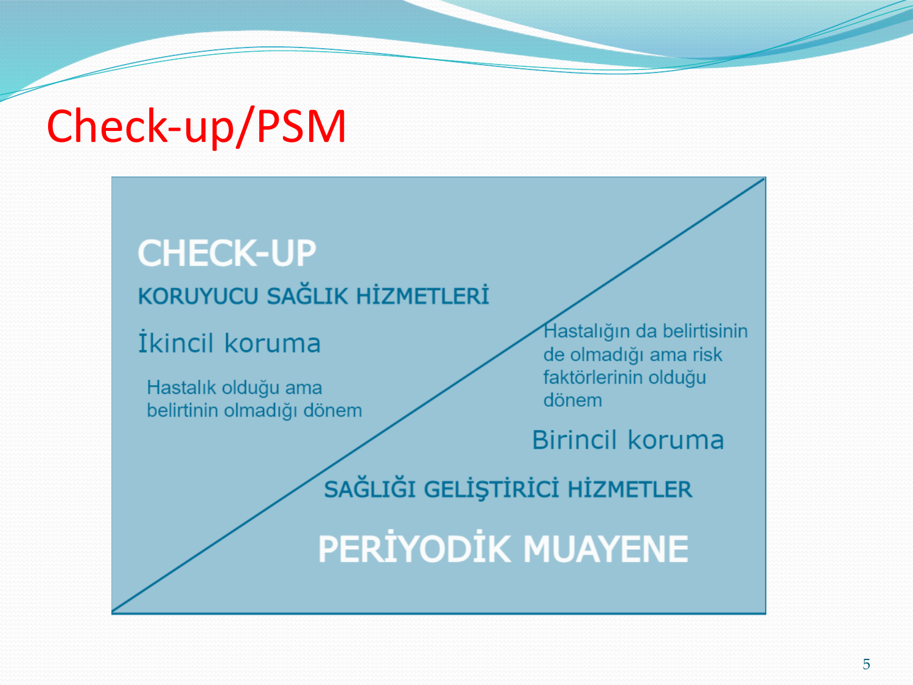
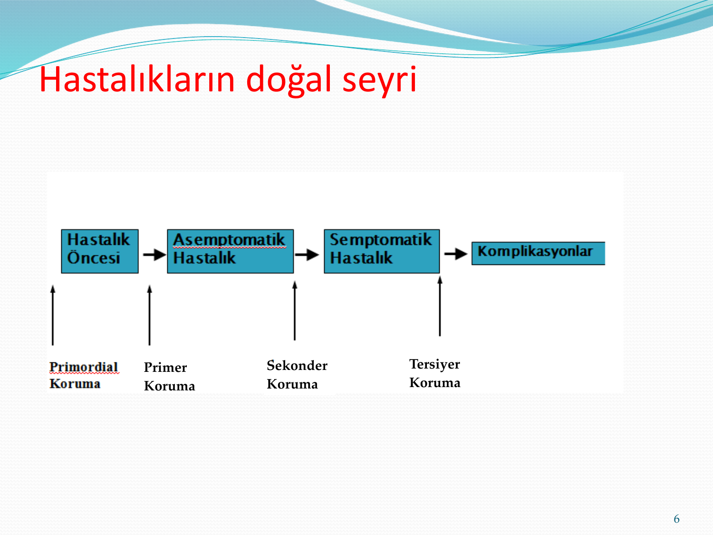

# KORUYUCU HEKİMLİK UYGULAMALARI

**Hazırlayan:** Dr. Elif Duygu Topan
**Bölüm:** Genel Dahiliye — İç Hastalıkları Anabilim Dalı

---

## İÇİNDEKİLER

1. [Periyodik Sağlık Muayenesi](#periyodik-saglik-muayenesi)
2. [Koruma Düzeyleri](#koruma-duzeyleri)
3. [Primer Koruma](#primer-koruma)
4. [Sekonder Koruma — Taramalar](#sekonder-koruma)
5. [Kanser Taramaları](#kanser-taramalari)
6. [Kemik Sağlığı ve Osteoporoz](#kemik-sagligi-ve-osteoporoz)

---

## PERİYODİK SAĞLIK MUAYENESİ

> Sağlıklı yada sağlıklı görülen kişilerin tarama muayenesi ve testler ile; yaşa, cinsiyete ve risk faktörlerine göre biçimlendirilmiş, kanıta dayalı yapılandırılmış, spesifik, etkin, uygulanabilir, kabul edilebilir bir izlem programı ile değerlendirilmesidir.

**Amaç:** Erişkinlerin asemptomatik iken ya da tanı konulmadığı dönemde iken bireysel risk faktörleri olan hastalıkların **erken tanısının** konulması ve bu sayede erken tedavi ve kür şansının artırılması

### Check-up vs PSM



Yaş ve cinsiyet farkı gözetmeden yapılan yıllık "check-up"ların yerine, kontrollerin sıklığı, yaş, cinsiyet ve maruziyet gibi kriterlerin ön plana geçtiği, **kişiye özel** yaklaşım geliştirilmiştir.

---

## KORUMA DÜZEYLERİ



```
  Hastalık Öncesi → Asemptomatik Hastalık → Semptomatik Hastalık → Komplikasyonlar
       ↑                   ↑                       ↑                      ↑
  Primordial          Primer                  Sekonder                Tersiyer
   Koruma             Koruma                   Koruma                  Koruma
```

### Primordial Koruma

* Risk faktörleri ortaya çıkmadan onların oluşmasını önlemek amaçlanır
* Henüz riskte olmayan kişilere yöneliktir
* Örnek: Obezitenin engellenmesi, çocukların sigara kullanmalarını engelleyici okul eğitimleri

### Primer Koruma

* Risk faktörleri veya çevre üzerine etki ederek hastalıkların gelişmesini önlemeye yönelik girişimler
* **Hedef kitle:** Sağlıklı kişiler
* Bağışıklama, aile planlaması, kemoprofilaksi, sağlık eğitimi hizmetleri (danışmanlık)

### Sekonder Koruma

* Gelişmekte olan bir patolojiyi ya da mevcut risk faktörünü, hastada semptomlar ortaya çıkmadan önce ortaya çıkarmaya yönelik girişimler
* **Hedef kitle:** Asemptomatik hastalar
* KB ölçümleri, serviksten sürüntü alınması, tüberkülin testi

### Tersiyer Koruma

* Hastalık ortaya çıktıktan sonra hastanın işlevselliğini ve yaşam kalitesini koruma, yaşam süresini artırma ve komplikasyonların önlenmesi
* **Hedef kitle:** Semptomatik hastalar
* Periyodik sağlık muayenesi kapsamında ele alınmaz

---

## PRİMER KORUMA

### Danışmanlık

* \> 18 yaş bireylere en az bir kez **sağlıklı diyet danışmanlığı** önerilir
* \> 18 yaş bireylerde uyuşturucu madde, alkol, tütün ürünü kullanımı ve tütün dumanından pasif etkilenim durumu sorgulanmalı
* Cinsel olarak aktif bireylerde cinsel yolla bulaşan hastalıklarla ilgili danışmanlık verilmesi önerilir
* Erişkinlerde bağışıklama ile ilgili kontroller yapılmalı, eksik aşılar yapılmalıdır

---

## SEKONDER KORUMA

### Tarama Kriterleri

**Hastalık:**
* Mortalite ve morbiditesi yüksek
* Prevalansı yüksek

**Test:**
* Sensitivitesi ve spesifitesi yüksek
* Düşük riskli ve kabul edilebilir
* Erken tanı ve tedavi etkin
* Maliyet etkin olmalı

### Kardiyovasküler Risk Değerlendirmesi

* < 40 yaş bireyde ailede erken yaşta aterosklerotik hastalık öyküsü varsa
* \> 40 yaş bireye başvuru sebebinden bağımsız olarak bir kez KV risk değerlendirmesi yapılır
* Risk saptanan gruplarda gerekli yaşam tarzı değişiklikleri ve izlemler yapılır

### Aspirin Kullanımı

**Erkek (45-65 yaş):** KV olaylardan korunmada çoğul risk faktörleri gözetilerek ve GIS yan etkiler dikkate alınarak günlük **81 mg** aspirin önerilmelidir

**Kadın (55-65 yaş):** İskemik inmenin önlenmesi amacıyla aynı şekilde günlük **81 mg** aspirin önerilmelidir

### Tansiyon Takibi

* \> 18 yaş yetişkinlerde başvuru sebebinden bağımsız olarak yılda en az **bir kez** tansiyon ölçülmelidir

### Diabetes Mellitus Taraması

**Risk faktörlerini taşıyan bireylere ve > 45 yaş herkese tarama önerilir:**
* BMI ≥ 25 kg/m² (bel çevresi kadında > 88 cm, erkekte > 102 cm)
* Fiziksel inaktivite
* Birinci derece yakınında DM öyküsü
* 4.1 kg'ın üstünde bebek doğurma / gestasyonel DM öyküsü
* HT (KB > 140/90 veya tedavi alan)
* HDL < 35 mg/dL veya TG > 250 mg/dL
* Polikistik over öyküsü
* Daha önce bozulmuş glukoz toleransı veya bozulmuş açlık glukozu
* KVH, insülin rezistansı ile ilgili klinik durumlar (akantosis nigrikans)

**DM tanısı alan kişilerde:**
* Tip 1 DM: tanıdan 5 yıl sonra; Tip 2 DM: tanı anında → yıllık albümin ekskresyonu, GFR, serum kreatinin
* Tip 1 DM: tanıdan 5 yıl sonra; Tip 2 DM: tanı anında → yıllık göz taraması
* Yıllık lipid profili

### Lipid Profili Taraması

* \> 18 yaş ve risk faktörü (+) veya > 35 yaş bütün kişilerde
* **5 yılda bir** serum lipit profili taraması (en az 12 saat açlıktan sonra)

### Tiroid Taraması

* \> 35 yaş tüm erişkinlere **5 yılda bir** TSH
* Ailede tiroid hastalığı öyküsü olanlar ilk muayenede taranmalı

### Obezite Taraması

* 18-65 yaş grubunda en az **yılda bir** ağırlık, boy, VKİ ve bel çevresi ölçümleri
* Bel çevresi: kadınlarda ≥ 88 cm, erkeklerde ≥ 102 cm → KVH risk faktörü
* Önerilen: kadınlarda < 80 cm, erkeklerde < 94 cm
* Laboratuvar: Glukoz, lipit paneli, ALT, kreatinin, TSH
* İlk yıl ayda bir, sonraki yıllarda 6 ayda bir takip

### Tüberküloz Taraması

**Risk grubu:** Tbc hasta temaslıları, tutuklu ve hükümlüler, HIV (+), bağışıklığı baskılayan tedavi alanlar, silikozis, DM, KBY, lösemi-lenfoma, düşük vücut ağırlıklı kişiler, sigara-alkol-ilaç bağımlıları

**Tarama yöntemi:** Mantoux testi (tüberkülin deri testi)

---

## KANSER TARAMALARI

### Meme Kanseri

* \> 20 yaş: Kendi kendine meme muayenesi hakkında bilgi verilmesi, ayda bir uygulanması
* 20-40 yaş: Ailede meme ca (+) ise yılda bir, (-) ise 2 yılda bir hekim tarafından klinik muayene
* 40-69 yaş: Yılda bir klinik muayene + **2 yılda bir mamografi**

### Kolorektal Kanser

* 50-70 yaş: Yılda bir **GGK testi** + her **10 yılda bir kolonoskopi**
* 1. derece akrabada kolorektal kanser/adenomatöz polip öyküsü → taramaya **40 yaşında** başla
* 1. derece akrabada erken yaşta kolorektal kanser → kanserin çıkış yaşından **5 yıl önce** başla

### Serviks Kanseri

* 30-65 yaş kadınlarda her **5 yılda bir** PAP Smear testi + HPV testi

### Prostat Kanseri

* Ailede prostat ca (+) → **40 yaşından** büyük erkeklerde tarama
* Aile öyküsü (-) → **50 yaşından** büyük erkeklerde bilgilendirme ve rektal tuşe
* Tek başına PSA ölçümü yetersizdir

---

## KEMİK SAĞLIĞI VE OSTEOPOROZ

### Tüm Yaş Gruplarında Bilgilendirme

* Sigara ve aşırı alkol alımının önlenmesi
* Diyetle yeterli kalsiyum, D vitamini alımı
* Yeterli güneş ışığına maruz kalma
* Fiziksel egzersizler
* Ev, iş, trafik kazalarından korunma
* ≥ 65 yaşta düşme ve çarpmalardan korunma yolları hakkında danışmanlık

### Sekonder Osteoporoz/Kırık Riski

< 65 yaş olup aşağıdaki risk faktörlerini barındıran erişkinlerde en az bir kez biyokimyasal testler yapılmalıdır (iCa, tam kan, kreatinin, ALP, TSH, 25-OH vitamin D₃):

* < 50 yaş kırık (+) veya ailede kalça kırığı öyküsü
* En az 3 ay süreyle 7.5 mg/gün steroid kullanımı
* Hipogonadizm
* < 45 yaş menopoz
* Malabsorbsiyon sendromu
* Primer hiperparatiroidizm
* Hızlı kemik kaybıyla seyreden diğer hastalıklar
* Düşük VKİ

### Yaşlılarda Osteoporoz Taraması

* \> 65 yaş tüm kişilerde **yılda bir** biyokimyasal testler
* Risk faktörleri ve kemik kırığı varlığına göre ilgili uzmanlıklara yönlendirme
* \> 65 yaş kadınlar ve > 70 yaş erkeklerde hayatlarında en az bir kez **DEXA** ölçümü

---

## SONUÇ

* Kişiye özel, riskler belirlenerek bir sağlık takibi şarttır
* Düzenli kontrolün yanında düzenli dengeli beslenme, fizik aktif yaşamak, az stres önemlidir
