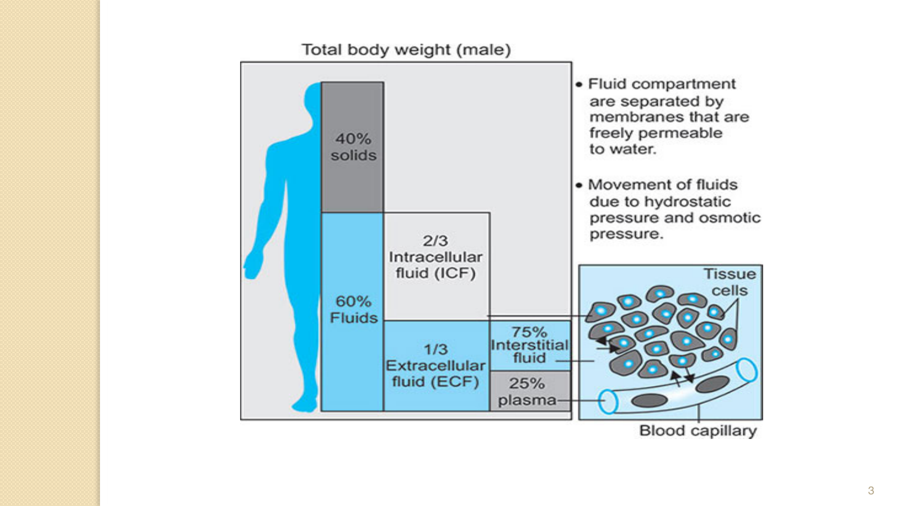
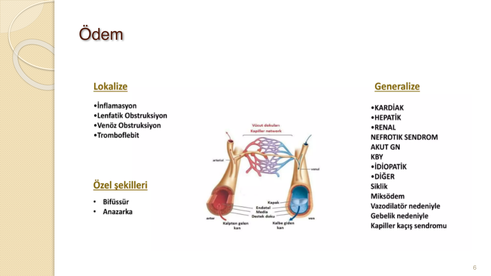
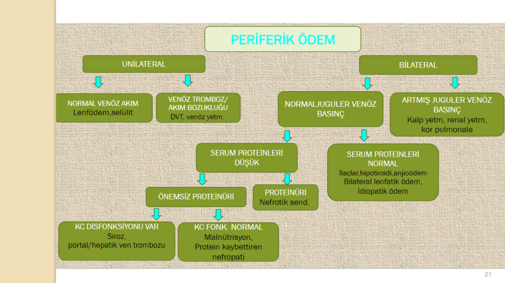
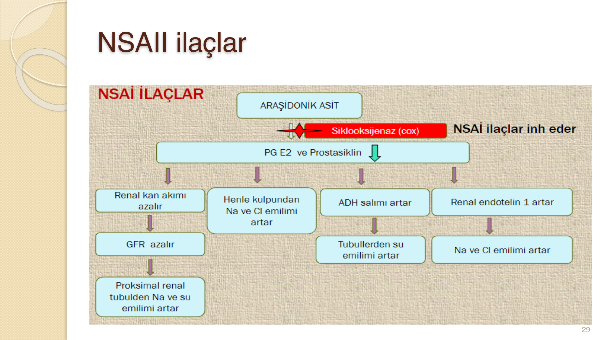

# ÖDEMLİ HASTAYA YAKLAŞIM

**Hazırlayan:** Dr. Elif Duygu Topan
**Bölüm:** Genel Dahiliye — İç Hastalıkları Anabilim Dalı

---

## İÇİNDEKİLER

1. [Ödem Tanımı ve Fizyoloji](#odem-tanimi-ve-fizyoloji)
2. [Ödem Patofizyolojisi](#odem-patofizyolojisi)
3. [Ödem Nedenleri](#odem-nedenleri)
4. [Ödemli Hastaya Yaklaşım](#odemli-hastaya-yaklasim)
5. [Ödem Muayenesi](#odem-muayenesi)
6. [Spesifik Ödem Nedenleri](#spesifik-odem-nedenleri)
7. [Ödem Tedavisi](#odem-tedavisi)

---

## ÖDEM TANIMI VE FİZYOLOJİ

* Latincede **şişlik** anlamına gelir
* İnterstisyel alanda sıvı hacminin artması olarak tanımlanır
* Klinik olarak saptanması için interstisyel sıvının **2.5-3 litre** artması gerekir



### İntravasküler ve İnterstisyel Sıvı Dağılımı

* Kapillerin sonunda bulunan arteriyollerden devamlı bir sıvı geçişi yoktur
* Sıvı, kapiller sonu venleri ve lenfatikler aracılığı ile interstisyel boşluktan intravasküler boşluğa geçer
* İskelet kasında, **kapiller hidrostatik basınç** ve **intravasküler onkotik basınç** en önemli faktörlerdir
* Normalde damar yatağından interstisyuma küçük bir gradyent farkı vardır ve fazla sıvı lenfatiklerle geri taşınır

---

## ÖDEM PATOFİZYOLOJİSİ

Ödem için; intravasküler ve interstisyel alanlar arasında dengeyi oluşturan kuvvetlerde (**Starling kuvveti**) değişiklik olması gerekir. Starling kuvveti kapiller hidrostatik basınç, plazma onkotik basıncı ve kapiller geçirgenlikteki değişikliklere bağlı olarak vasküler yataktan sıvının filtrasyonundaki değişiklikleri tanımlar.

### Ödem Gelişiminde Başlıca Mekanizmalar

1. Kapiller **hidrostatik basınç** artışı
2. Kapiller **onkotik basınç** azalması
3. İnterstisyel **onkotik basınç** artışı
4. **Lenfatik drenajın** azalması
5. Kapiller **permeabilite** artışı
6. Dokuların direncinin azalması

### Ödem Sınıflandırması



**Lokalize ödem:** İnflamasyon, lenfatik obstrüksiyon, venöz obstrüksiyon, tromboflebit

**Generalize ödem:** Kardiyak, hepatik, renal (nefrotik sendrom, akut GN, KBY), idiyopatik, siklik, miksödem, vazodilatör nedeniyle, gebelik nedeniyle, kapiller kaçış sendromu

**Özel şekilleri:** Bifözsür, anazarka

---

## ÖDEM NEDENLERİ

### Kapiller Hidrostatik Basınç Artışına Bağlı

* Kalp yetmezliği
* Kor pulmonale
* Renal sodyum retansiyonu:
  - Böbrek yetmezliği, nefrotik sendrom
  - İlaçlar (NSAİ, kortikosteroidler, mineralokortikoidler, glitazonlar, insülin, östrojen, androjenler, tamoksifen)
  - Yeniden beslenme ödemi
  - Hepatik siroz
  - Gebelik dönemi ve premenstrüel ödem
  - İdiyopatik ödem
* Venöz obstrüksiyon/yetmezlik
* Arteriolar vazodilatasyon (KKB, dihidropiridin, alfa blokerler, sempatolitikler)

### Kapiller Onkotik Basınç Azalmasına Bağlı

* **Protein kaybı:** Nefrotik sendrom, protein kaybettiren enteropatiler
* **Azalmış albümin sentezi:** Malnutrisyon, siroz

### Kapiller Permeabilite Artışına Bağlı

* Yanıklar, travma
* İnflamasyon ve sepsis
* Allerjik reaksiyonlar ve anjiyoödem
* Erişkin respiratuar distres sendromu
* Diabetes mellitus
* İnterlökin-2 tedavisi
* Malign asit

### Diğer Nedenler

**Lenfatik obstrüksiyon ve interstisyel onkotik basınç artışı:**
* Lenf nodu diseksiyonu
* Lenf nodlarında malign infiltrasyon
* Hipotiroidizm (miksödem)
* Malign asit

**Mekanizması bilinmeyen ilaçlar:** Gabapentin, pregabalin, dosetaksel, sisplatin, pramipeksol, ropinirol

### En Sık Görülen Ödem Nedenleri

* **Kalp yetmezliği** (KAH, HT, kardiyomiyopatiler, valvüler hastalıklar)
* Kor pulmonale
* Siroz
* Nefrotik sendrom ve diğer renal hastalıklar
* Premenstrüel ödem ve gebelik dönemi ödemi
* İlaçlar (NSAİİ, KKB)

---

## ÖDEMLİ HASTAYA YAKLAŞIM

### Anamnez

**Öykü sorgulaması:**
* Kardiyak, pulmoner, hepatik, böbrek hastalığı öyküsü
* İlaç kullanımı öyküsü

**Ödemin özellikleri:**
* Ne zaman, nereden ve nasıl başladığı
* Pozisyon ile değişip değişmediği, nasıl yaygınlaştığı
* İntermitant mı, persistan mı

**Eşlik eden semptomlar:**
* Nefes darlığı, ortopne, paroksismal nokturnal dispne
* Allerjik reaksiyonlar
* Sabahları göz kapakları ve çevresinde şişlik
* Karında şişlik, sarılık
* Kronik diyare

### Fizik Muayene

* Ödemin yaygınlığı
* Simetrik mi, tek taraflı mı?
* Ödem gode bırakıyor mu?
* Juguler venöz dolgunluk var mı?
* Pulmoner ödem bulguları?
* Ödemli bölgede hassasiyet veya ağrı var mı?
* Deri değişiklikleri

Hastanın FM'si tüm sistemleri içerecek şekilde eksiksiz yapılmalıdır. Anamnez ve FM ışığında oluşturulan olası ön tanılara yönelik destekleyici laboratuvar ve görüntüleme tetkikleri istenmelidir.

---

## ÖDEM MUAYENESİ

### Gode Değerlendirmesi

* Ayak sırtından, pretibial bölgeden, ayak bileğinden, yatan hastalarda sakral bölgeden değerlendirilir
* Ödemli bölgede, kemik üzerine en az **5-30 sn** basılarak değerlendirilir

| Derece | Çukur Derinliği | Süre |
|---|---|---|
| **1+** | 2 mm hafif çukur | Hızla kaybolur |
| **2+** | 4 mm çukur | 10-15 sn'de kaybolur |
| **3+** | 6 mm çukur | 1 dakikadan uzun sürebilir |
| **4+** | 8 mm çukur — ciddi ödem | 2 dk'dan uzun sürebilir |

### Ödem Tipine Göre Gode Özellikleri

* **Onkotik basınç azalması** (nefrotik sendrom) → yumuşak gode
* **Kapiller hidrostatik basınç artışı** (kalp yetmezliği) → orta sertlikte, daha az gode
* **İnterstisyel onkotik basınç artışı** (hipotiroidi ödemi, lenfatik obstrüksiyon) → gode **bırakmaz**

### Periferik Ödem Ayırıcı Tanı Algoritması



```
                    PERİFERİK ÖDEM
                   ↙            ↘
            UNİLATERAL        BİLATERAL
            ↙        ↘        ↙         ↘
  Normal venöz   Venöz tromboz/  Normal juguler  Artmış juguler
  akım           akım bzk        venöz basınç    venöz basınç
  (Lenfödem,     (DVT, venöz          ↓          (Kalp yetm,
  selülit)       yetm.)              ↓           renal yetm,
                       ↓           ↙     ↘       kor pulmonale)
                  Serum prt     Serum prt       ↓
                  düşük         normal        Serum prt
                  ↙     ↘       (İlaçlar,     normal
            Önemsiz   Proteinüri hipotiroidi,
            proteinüri (Nefrotik  anjioödem,
                ↓     send.)    bilateral
           ↙       ↘            lenfatik ödem,
    KC disf.   KC fonk.         idiopatik ödem)
    var        normal
    (Siroz,    (Malnutrisyon,
    portal/    protein
    hepatik    kaybettiren
    ven tromb) nefropati)
```

---

## SPESİFİK ÖDEM NEDENLERİ

### Kalp Yetmezliği

* Kapiller venöz **hidrostatik basınç** artar
* Sıklıkla kalp hastalığı öyküsü
* Pulmoner ödem belirtileri (ortopne, dispne, raller)
* Volüm artışı bulguları (hepatik konjesyon)
* Genellikle alt ekstremitede, bilateral, **gode bırakan** ödem
* Ödem sıklıkla **akşamları** daha fazladır (yer çekimi)

### Nefrotik Sendrom

* **Onkotik basıncın** düşmesi
* RAAS stimülasyonu (hipovolemiye kompansatuvar cevap; yeterli onkotik basınç olmadığından ödemi artırır)
* Sodyum atılımında bozukluk (Na atılamamasına bağlı su tutulumu)

**Renal nedenli ödem düşündüren bulgular:**
* Renal hastalık öyküsü
* Hipoalbuminemi, proteinüri (> 3.5 g/gün)
* Ödem genellikle yaygın; özellikle **göz kapakları ve yüz** gibi yumuşak dokularda daha belirgin
* Gece boyunca yatar pozisyonda kalınmasından dolayı en çok **sabahları** fark edilir
* İdrar sedimenti ayırıcı tanıda yardımcı
* Renal USG (KBY'de küçük böbrek, nefrotik sendromda büyük/normal böbrek)

### Siroz

* İntrasinuzoidal **hidrostatik basıncın** artmasına bağlı hepatik yüzeyden peritoneal kaviteye sıvı geçişi
* Protein sentezi de azalmıştır
* Kronik KC hastalığı belirtileri (spider nevus, palmar eritem, sarılık)
* Portal HT bulguları (karın duvarında kollateraller, özofagus varisleri)

### İlaçlara Bağlı Ödem

**NSAİİ ilaçlar:**



NSAİİ → Siklooksijenaz (COX) inhibisyonu → PG E2 ve prostasiklin ↓ → Renal kan akımı azalır, GFR azalır, Henle kulpundan Na ve Cl emilimi artar, ADH salınımı artar, renal endotelin-1 artar → Na ve su retansiyonu → **Ödem**

**Ca Kanal Blokerleri:**
* Arteriyel dilatasyona ek olarak **prekapiller dilatasyon** da yaparak ayak bileği ödemi yaparlar
* Nifedipin **%17**, amlodipin **%14.7**

---

## ÖDEM TEDAVİSİ

### Genel Prensipler

* Ödem tedavisi neden ortaya koyulduktan sonra mümkünse **nedene yönelik** olarak planlanmalıdır
* Ödemden sorumlu faktör ilaç kullanımı ise ilaç kesilmelidir
* Sıvı birikimini azaltmak için **tuz kısıtlaması** yapılmalıdır
* **Diüretikler** (loop diüretikleri, tiyazidler, mineralokortikoid reseptör blokerleri) ödemin semptomatik tedavisinde kullanılan temel ajanlardır

### Tedavi Prensipleri

* **Pulmoner ödemin tedavisi acildir** ve hızla diüretik tedavisinin uygulanması gerekir
* Diğer durumların çoğunda **furosemid** gibi bir loop diüretiğiyle tedaviye başlamak önerilir
* Sirozlu hastalarda mineralokortikoid reseptör blokerleri (**spirinolakton, eplerenon**) tedaviye eklenir
* **1.5-2 kg/gün** volüm azaltımı sağlayacak şekilde diüretik dozları ve kombinasyonları uygulanabilir
* Diüretik yan etkilerine, sıvı-elektrolit denge bozukluklarına ve **metabolik alkaloz** gelişimine dikkat edilmelidir
* Medikal tedaviye dirençli olgularda **mekanik ultrafiltrasyon** tedavide kullanılabilir
