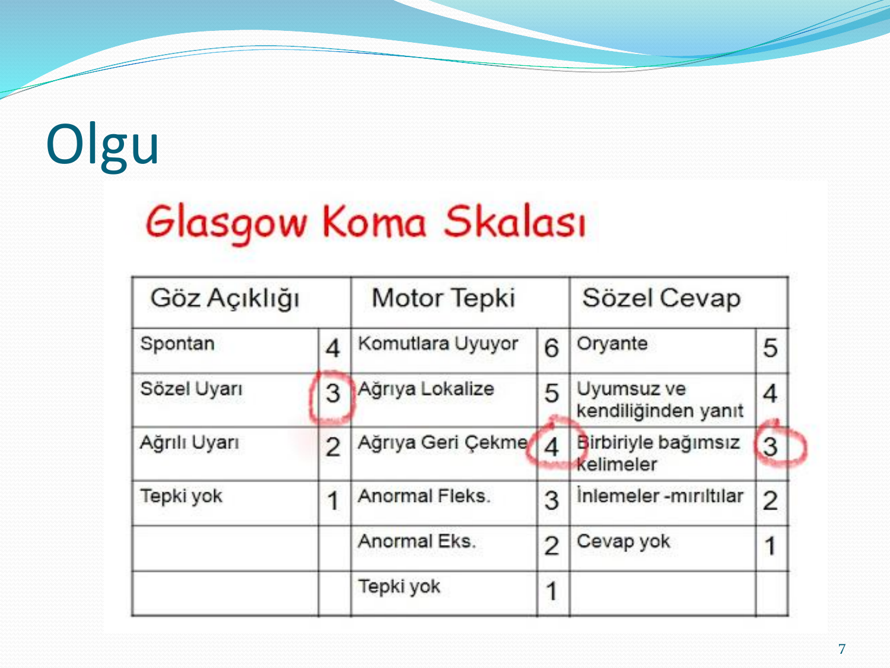
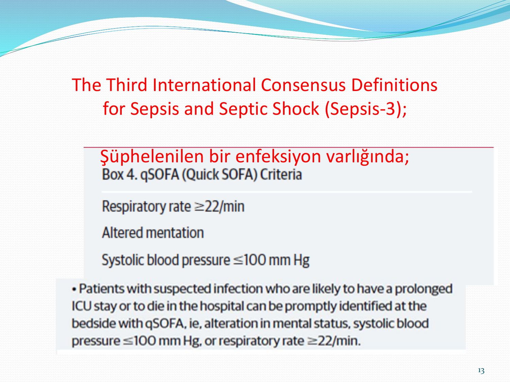
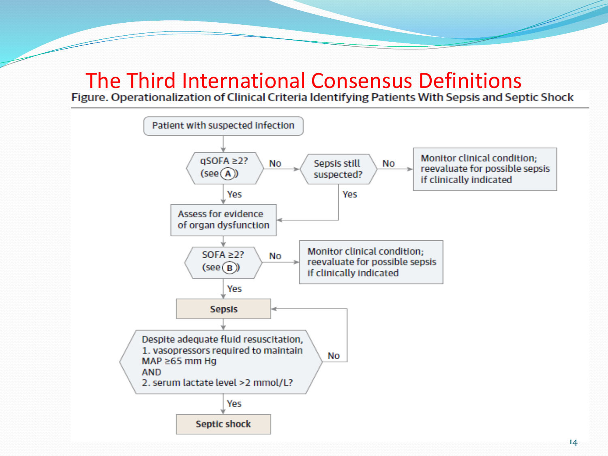
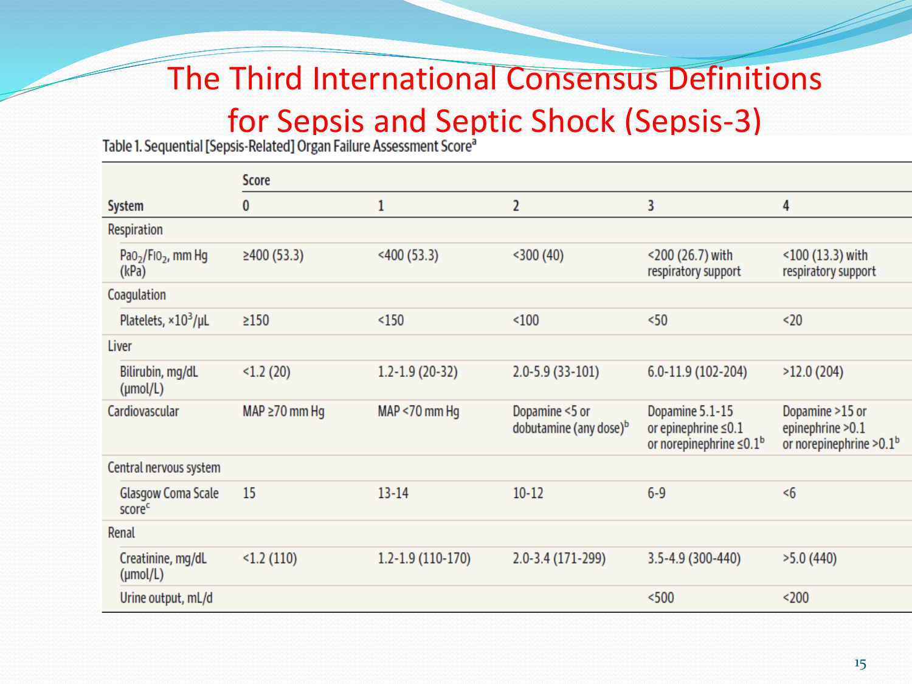

# OLGU SUNUMU — SEPTİK ŞOK

**Hazırlayan:** Dr. Hilal Bektaş Uysal
**Bölüm:** İç Hastalıkları AD — Genel Dahiliye BD

---

## OLGU

**📋 VAKA: Bilinç Bulanıklığı ve Genel Durum Bozukluğu**

**Hasta:** 75 yaş, kadın
**Şikayet:** Bilinç bulanıklığı, genel durum bozukluğu
**Başvuru:** Evde ölçülen vücut ısısının 38.2 °C, ayaklarında şişlik, tepkilerinde azalma olması nedeniyle acil servise getiriliyor

**Öykü:**
* 15 gün önce benzer şikayetler ile dış merkeze başvurmuş; idrar yolu enfeksiyonu ön tanısı ile 3 gün hospitalize edilerek parenteral antibiyoterapi verilmiş, sonra oral tedavi ile taburcu edilmiş
* Taburculuk sırasında genel durumu iyi, bilinç açık, oryante ve koopere
* Son 2-3 gündür genel durumunda tekrar bozulma; pnömoni ön tanısı ile antibiyoterapi ve kalp yetmezliği ön tanısı ile diüretik başlanmış
* Bu tedavilerden sonra genel durumunun daha da kötüleşmesi, idrar çıkışının olmaması, sürekli uyuklaması, bilinç bulanıklığı ve ateş yüksekliği olması üzerine acil servise başvuruyor

**Özgeçmiş:**
* 20 yıldır DM tanısı ile oral antidiyabetik kullanıyor
* 20 yıldır HT
* KAH + KAG (2 yıl önce) → medikal tedavi ile izlem

---

## FİZİK MUAYENE

* **TA:** 70/40 mmHg, **KTA:** 106/dk, **Ateş:** 38.3 °C, **SS:** 28/dk
* Bilinç konfü, uykuya meyilli, kooperasyon kurulamıyor
* Bilateral orta ve alt zonlarda krepitan raller mevcut
* Kalp ritmik, taşikardik, S3 yok, S4 yok, ek ses üfürüm yok
* Batın serbest, defans rebound yok, hepatosplenomegali yok
* Ekstremiteleri soğuk, uçları siyanotik
* PTÖ +++/+++
* **Glasgow skoru: 10** (Göz: 3 + Motor: 4 + Sözel: 3)

---

## LABORATUAR

| Test | Sonuç | Referans |
|---|---|---|
| **pH** | **7.18** | 7.35-7.45 |
| **PO₂** | **58 mmHg** | 80-100 |
| PCO₂ | 30 mmHg | 35-45 |
| **HCO₃** | **13 mEq/L** | 22-26 |
| **Laktat** | **17 mEq/L** | 0.5-1.5 |
| **SO₂** | **%85** | 95-100 |
| BUN | 26 mg/dL | — |
| **Kreatinin** | **2.01 mg/dL** | — |
| KCFT | Normal | — |
| Na, K, Ca, P | Normal | — |
| **Hb** | **7.9 g/dL** | — |
| Htc | 21 | — |
| WBC | 10.200 | — |
| Plt | 260.000 | — |
| Albumin | 3.0 g/dL | — |
| **CRP** | **244 mg/L** | — |
| TİT | 59 lökosit (+), lökosit esteraz (++) | — |
| PA AC grafisi | Bilateral plevral efüzyon, bilateral dağınık konsolidasyon alanları | — |

---

## TANI

### Şok Belirti ve Bulguları

* **Hipotansiyon** (TA 70/40 mmHg)
* **Taşikardi** (KTA 106/dk)
* **Bilinç değişikliği** (Glasgow 10, konfü)
* **Soğuk ekstremiteler**, siyanotik uçlar
* **Oligüri/anüri**
* **Metabolik asidoz** (pH 7.18, laktat 17)

### Sepsis-3 Kriterleri

**qSOFA:** Solunum hızı ≥ 22/dk ✅, mental durum değişikliği ✅, SKB ≤ 100 mmHg ✅ → **qSOFA: 3/3**

**Tanı: SEPTİK ŞOK** (Sepsis + yeterli sıvı resusitasyonuna refrakter hipotansiyon + hipoperfüzyon bulguları + laktat yüksekliği)

---

## TEDAVİ

### Şoklu Hastada İlk Yapılacaklar

1. **Hava yolu** korunmalı, oksijenizasyon sağlanmalı
2. **Solunumun yeterliliği** değerlendirilmeli (non-invaziv/invaziv mekanik ventilasyon)
3. **Dolaşım korunmalı** (damar yolu açılırken kan örnekleri de alınmalı ve sıvı resusitasyonu başlanmalı)
4. Sıvı resusitasyonu sonrası gerekirse **vazopressör** desteği verilebilir

### Uygulanan Tedavi

* Yüz maskesi ile 4 L/dk oksijen başlandı
* TA 70/40 mmHg olan hastaya öncelikle **500 cc kristaloid bolus** verildi ve infüzyona devam edildi
* Santral kateter takıldı → CVP: **6 mmHg**
* Kristaloid infüzyonu altında hipotansiyonun persiste etmesi üzerine **noradrenalin 0.3 mcg/kg/dk** başlandı
* Arter kateteri yerleştirildi

> Ciddi sepsis ve septik şokta resusitasyonda ilk seçilecek başlangıç sıvısı **kristaloiddir** (Grade 1A)

> Vazopressör tedavide ilk seçenek **norepinefrindir** (Grade 1B)

---

### Bikarbonat Kullanılmalı mı?

AKG: pH 7.18, laktat 17

**⚠️ HAYIR** — pH ≥ 7.15 olan, hipoperfüzyonun indüklediği laktik asidemili hastaların vazopressör gereksinimini azaltmak yada hemodinaminin düzeltilmesi amacıyla sodyum bikarbonat tedavisi **kullanılmaz** (Grade 2B)

---

### Steroid Kullanılmalı mı?

**⚠️ HAYIR** (sıvı ve vazopressör ile stabilite sağlanabiliyorsa)

* Yeterli sıvı resusitasyonu ve vazopressör tedavi ile hemodinamik stabilite sağlanabildiyse septik şok tedavisinde steroid **kullanılmaz**
* Bunun sağlanamadığı durumlarda continue infüzyon şeklinde **200 mg/gün hidrokortizon** önerilir (Grade 2C)
* Şokun olmadığı sepsisin tedavisinde kortikosteroidler **kullanılmamalıdır** (Grade 1D)

---

### Tedavi Takibi

**Solunum desteği:**
* NIMV başlandı → 1. saatinde hasta entübe edilerek invaziv mekanik ventilasyon başlandı

**3. saat kontrol AKG:** pH 7.27, PO₂ 115, PCO₂ 28, HCO₃ 18, laktat 14, SO₂ %99 → **düzelme trendi**

---

### Hb 7.9 ve SvO₂ %55 — Ne Yapılmalı?

**Hepsi:** Sıvı, eritrosit süspansiyonu, norepinefrin doz artışı, dobutamin

> Doku hipoperfüzyonu çözülmüş ise ve miyokard iskemisi, ciddi hipoksemi gibi bir durum yoksa eritrosit süspansiyonu Hb < **7.0 g/dL** altında verilir. Ancak SvO₂ < %70 ve devam eden hipoperfüzyon varsa transfüzyon daha yüksek Hb değerlerinde de düşünülebilir.

---

## SEPSİS TEDAVİSİNDE İLK 3 VE 6 SAAT

**İlk 3 saatte:**
1. **Laktat** seviyesini ölçün
2. Antibiyotiğe başlamadan önce **kan kültürü** alın
3. **Geniş spektrumlu antibiyotik** başla
4. Hipotansiyon yada laktat ≥ 4 mmol/L için **30 mL/kg kristaloid**

**6 saatte tamamlanmış olması gerekenler:**
5. MAP 65 mmHg sağlamak için **vazopressör** uygula
6. Yeterli volüm resusitasyonuna rağmen ısrarcı hipotansiyon yada başlangıç laktat ≥ 4 mmol/L → CVP ve SvO₂ ölç
7. Başlangıç laktat seviyesinde yükselme varsa laktatı tekrar ölç

**⚠️ Başarılı resusitasyonda hedef: CVP 8 mmHg, ScvO₂ %70 ve normal laktat**

---

## ODAK KONTROLÜ

Hastanın kabulünde diğer girişimler devam ederken:
* Kan kültürü alındı
* İdrar kültürü alındı
* Trakeal aspirat kültürü gönderildi
* Abdominal görüntüleme yapıldı (USG normal)
* Uygun ampirik antibiyoterapi başlandı

---

## TEDAVİ SEYRİ

Sıvı, vazopressör ve antibiyotik tedavisinin yanı sıra:
* **DVT profilaksisi** (DMAH ile)
* **GIS kanama profilaksisi** (PPI ile)
* Kan glukoz seviyelerini ≤ **180 mg/dL** tutacak şekilde insülin infüzyonu
* Bası yarası önleyici yaklaşımlar (2 saatte bir pozisyon değişikliği, havalı yatak)
* 24. saatten itibaren **enteral beslenme desteği** başlandı

### Sonuç

* Kültür sonuçlarında anlamlı üremesi olmadı
* Antibiyoterapisine yanıt alındığı için devam edildi
* **6. günde** extübe edilerek ventilatörden ayrıldı
* **7. günde** oral alımı açıldı, mobilize edildi
* **10. günde** hasta servise alındı
* Sebebe yönelik araştırmada rezidü 250 cc idrar saptanan ve **nörojenik mesane** tanısı konan hasta temiz aralıklı kateterizasyon önerisi ile taburcu edildi
