# SEPSİS

**Hazırlayan:** Dr. Hilal Bektaş Uysal
**Bölüm:** Genel Dahiliye — İç Hastalıkları Anabilim Dalı

---

## İÇİNDEKİLER

1. [Terminoloji ve Tanımlar](#terminoloji-ve-tanimlar)
2. [Epidemiyoloji](#epidemiyoloji)
3. [Sepsis-3 Tanımları](#sepsis-3-tanimlari)
4. [Sepsis Tanı Kriterleri](#sepsis-tani-kriterleri)
5. [SOFA ve qSOFA Skorları](#sofa-ve-qsofa-skorlari)
6. [Tedavi](#tedavi)
7. [Başlangıç Resusitasyon](#baslangic-resusitasyon)
8. [Tanı](#tani)
9. [Antimikrobiyal Tedavi](#antimikrobiyal-tedavi)
10. [Kaynak Kontrolü](#kaynak-kontrolu)
11. [Sıvı Tedavisi](#sivi-tedavisi)
12. [Vasopressör Tedavi](#vasopressor-tedavi)
13. [Kortikosteroidler](#kortikosteroidler)
14. [Kan Ürünleri](#kan-urunleri)
15. [Destek Tedavisi](#destek-tedavisi)

---

## TERMİNOLOJİ VE TANIMLAR

> *"Except on few occasions, the patient appears to die from the body's response to infection rather than from it."*
> — **Sir William Osler**, 1904

### SIRS (Sistemik İnflamatuvar Yanıt Sendromu)

Nonspesifik (infeksiyon veya infeksiyon dışı) bir olaya konağın verdiği cevap olup, aşağıdaki kriterlerden **2 ve daha fazlasının** bulunmasıyla tanı konur:

* Isı ≥ 38 °C veya ≤ 36 °C
* Kalp atım hızı (KAH) ≥ 90/dk
* Solunum sayısı ≥ 20/dk veya PaCO₂ < 32 mmHg
* Lökosit sayısı ≥ 12.000/mm³ veya ≤ 4.000/mm³ veya > %10 immatür nötrofil

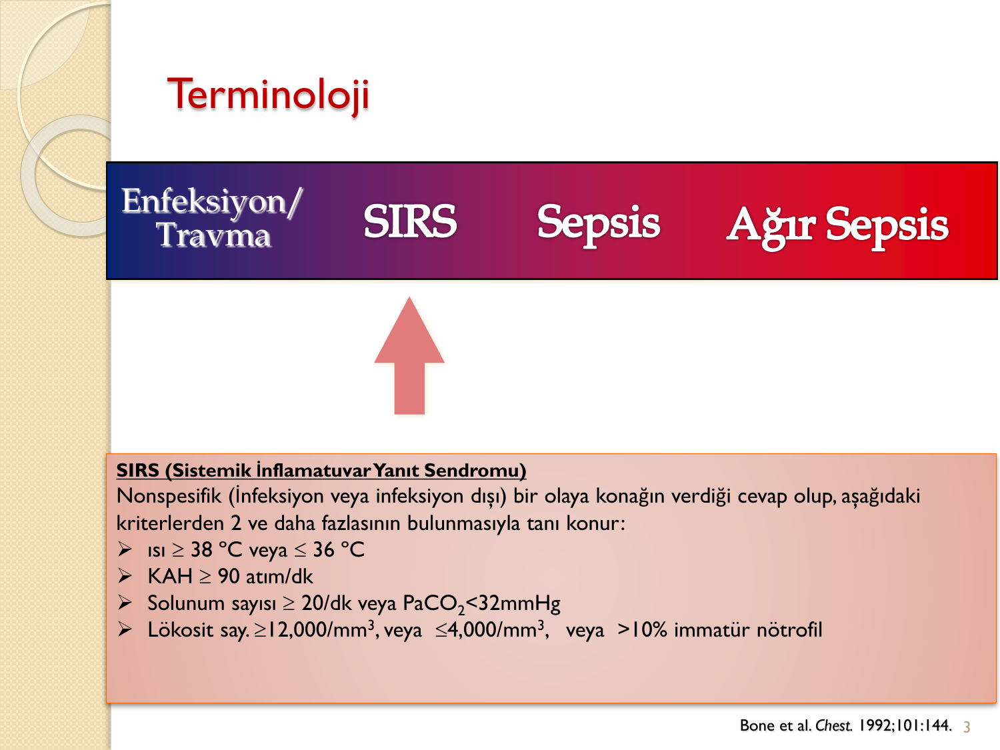

**⚠️ ÖNEMLİ:** SIRS kriterleri infeksiyon dışı durumlarla da (travma, yanık, pankreatit) ortaya çıkabilir.

---

### Sepsis (Sepsis-1 Tanımı)

> Bilinen veya **tahmin edilen** infeksiyon + ≥ 2 SIRS kriteri → **İnfeksiyona bağlı SIRS**

---

### Ağır Sepsis

> Sepsis + ≥ 1 organ disfonksiyonu → **Hipotansiyon ve organ disfonksiyonu ile birlikte olan sepsis**

---

### Septik Şok

> Sepsis + yeterli sıvı resusitasyonuna **refrakter hipotansiyon** + **hipoperfüzyon**

---

## SEPSİSE BAĞLI ORGAN DİSFONKSİYONU

| Sistem          | Kriter                                                                                           |
| --------------- | ------------------------------------------------------------------------------------------------ |
| **KVS**         | SAP < 90 mmHg veya > 40 mmHg düşüş, MAP < 70 mmHg, kapiller dolum süresi > 2 sn                  |
| **Solunum**     | PaO₂/FiO₂ < 300                                                                                  |
| **Renal**       | İdrar çıkışı < 0.5 mL/kg/h, kreatinin artışı (başlangıçtan veya 24 saat içinde > 0.7 mg/L artış) |
| **Koagülasyon** | aPTT > 60 sn, INR > 1.5, Plt < 100.000/mm³                                                       |
| **Karaciğer**   | Bilirubin > 4 mg/dL                                                                              |
| **Asit-Baz**    | Laktat > 2.1 mmol/L                                                                              |

---

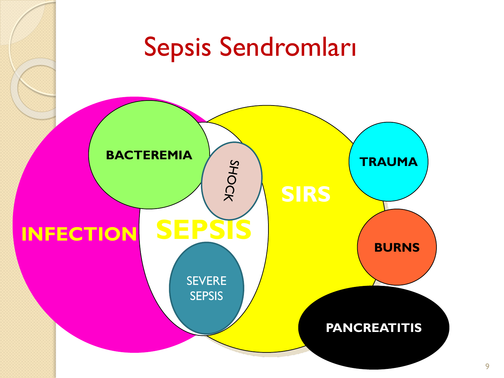

---

## EPİDEMİYOLOJİ

* **İnsidans:** 3/1000 vaka
* Yılda **751.000** vaka
* YBU mortalitesi **%34**
* Ağır sepsis hastane yatışlarının **%2**'sini oluşturuyor
* Ağır sepsiste mortalite hızı **%30-50**
* Septik şokta mortalite **%50-60**'a çıkar
* Yıllık **215.000** ölüm
* 1993-2001 arası ağır sepsis insidansında **%75 artış**, mortalitede **%17 azalma**
* Yaş arttıkça ve komorbidite varlığında sepsis riski ve mortalitesi artar

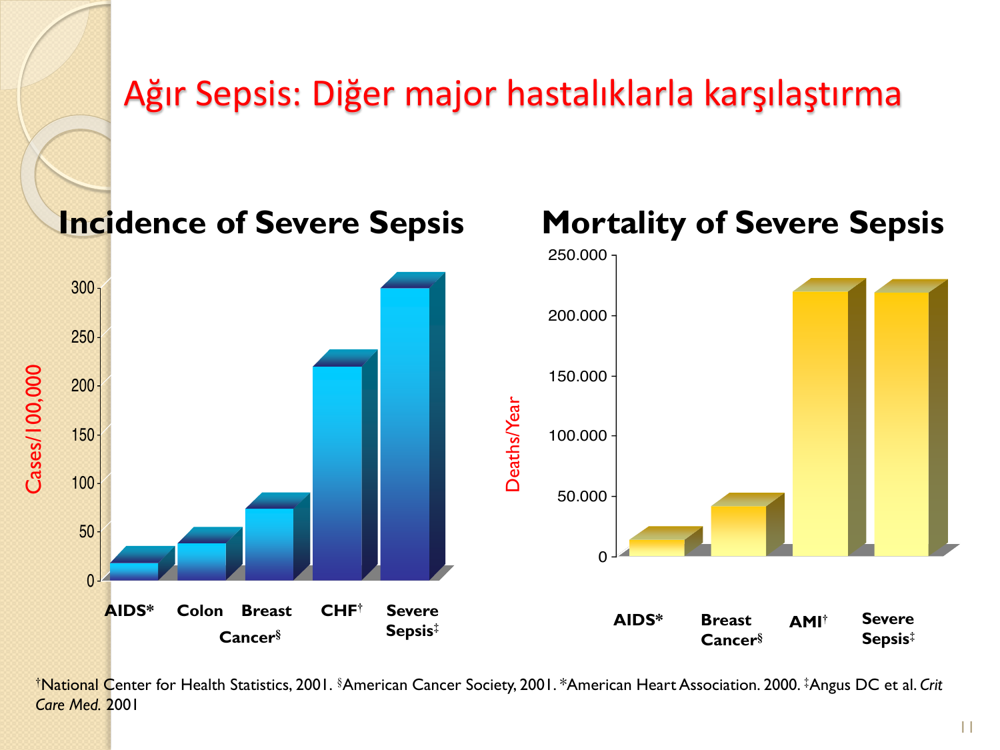

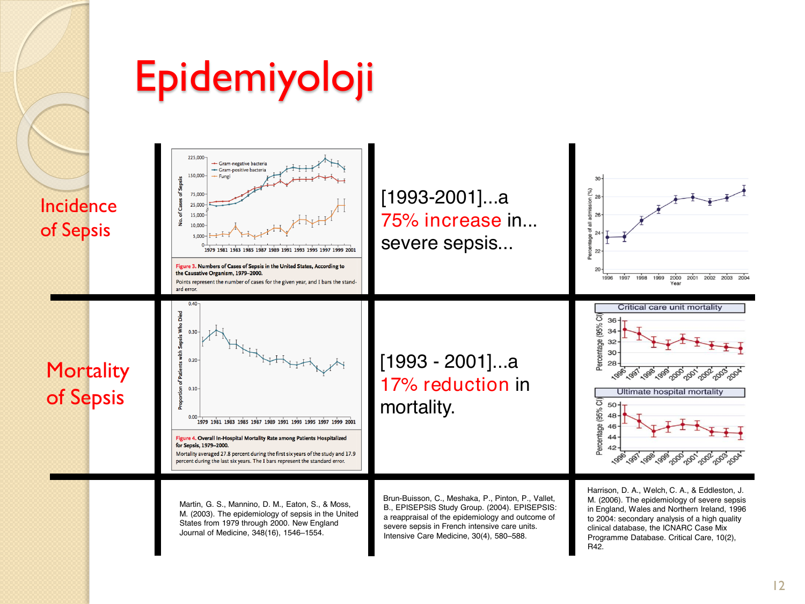

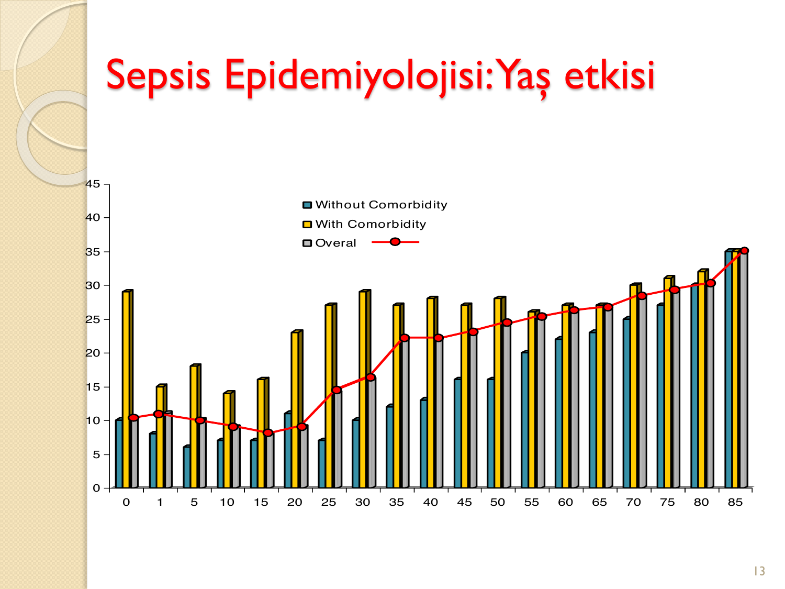

---

## SEPSİS-3 TANIMLARI

**Surviving Sepsis Campaign (SSC)** — İlk rehber 2004; 68 uluslararası otorite, 30 uluslararası organizasyon katılımıyla oluşturulmuştur.

**Sepsis-3** (JAMA 2016): European Society of Intensive Care Medicine (ESICM) ve Society of Critical Care Medicine (SCCM) tarafından yayınlanmıştır.

### Sepsis-3'ün SIRS'a Yönelik Eleştirileri

* SIRS kriterleri kişinin olası herhangi bir tehlikeye karşı cevabını yansıtmaktadır (spesifik değil)
* Hastanede yatan birçok hastada infeksiyon veya yaşamı tehdit eden sonuçlar ortaya çıkmadan da görülebilmektedir
* YBU'de infeksiyon ve yeni organ yetmezliği gelişen her **8 hastadan birinde** en az 2 SIRS kriteri mevcut değildir (düşük duyarlılık)

### Sepsis-3 Yeni Tanımlar

* **Sepsis:** İnfeksiyona karşı bozulmuş konakçı yanıtının oluşturduğu, hayatı tehdit eden bir **organ disfonksiyonu** durumudur
* **Organ disfonksiyonu:** İnfeksiyon sonucunda total **SOFA skorunda ≥ 2 puan** akut yükselme
* Önceden organ disfonksiyonu olmayan hastaların bazal skorlarının **sıfır** olduğu kabul edilir
* SOFA skoru ≥ 2, genel hastane popülasyonunda yaklaşık **%10** mortalite riskini yansıtır

**⚠️ ÖNEMLİ:**

* Sepsis eğer erken fark edilip tedavi edilemezse enfeksiyona bağlı ölüm nedenlerinin başında gelir
* Sepsisin indüklediği organ disfonksiyonu **okült** olabilir
* Enfeksiyon tablosu ile başvuran tüm hastalarda değerlendirilmelidir

### Septik Şok (Sepsis-3)

* Dolaşımsal ve hücresel/metabolik anormalliklerin artan mortaliteye katkıda bulunduğu sepsisin bir alt grubudur
* Hastane mortalitesi **%40**
* Tanı kriterleri:
  - MAP ≥ 65 mmHg olması için **vazopressör desteği** gerektiren persistan hipotansiyon
  - Yeterli volüm resusitasyonuna rağmen serum laktat seviyelerinin **≥ 2 mmol/L**

---

## SEPSİS TANI KRİTERLERİ

Tespit edilmiş yada şüpheli bir enfeksiyon ile birlikte:

### Genel Bulgular

* Ateş (> 38.3 °C) veya hipotermi (core sıcaklık < 36 °C)
* Kalp hızı > 90/dk yada yaşa göre normal değerin > 2 SD üzerinde
* Taşipne
* Mental durum değişikliği
* Ciddi ödem yada pozitif sıvı dengesi (24 saat için > 20 mL/kg)
* Diabet olmadan hiperglisemi (plazma glikoz > 140 mg/dL)

### İnflamatuar Bulgular

* Lökositoz (BK > 12.000/μL)
* Lökopeni (BK < 4.000/μL)
* Normal BK sayısı, %10'dan fazla immatür form
* Plazma CRP > normal değerin 2 SD üzeri
* Plazma **prokalsitonin** > normal değerin 2 SD üzeri

### Hemodinamik Bulgular

* Arteriyel hipotansiyon: SKB < 90 mmHg, MAP < 70 mmHg yada SKB > 40 mmHg azalma

### Doku Perfüzyonu Bulguları

* Hiperlaktatemi (> 1 mmol/L)
* Kapiller yeniden dolmada azalma yada ciltte renk değişikliği

### Organ Disfonksiyonu Bulguları

* Arterial hipoksemi (PaO₂/FiO₂ < 300)
* Akut oligüri (yeterli sıvı resusitasyonuna rağmen en az 2 saat idrar çıkışı < 0.5 mL/kg/h)
* Kreatinin artışı > 0.5 mg/dL
* Koagülasyon anormallikleri (INR > 1.5 yada aPTT > 60 sn)
* İleus
* Trombositopeni (platelet sayısı < 100.000/μL)
* Hiperbilirubinemi (plazma total bilirubin > 4 mg/dL)

---

## SOFA VE qSOFA SKORLARI

### SOFA (Sequential Organ Failure Assessment) Skoru

| Sistem                          | 0             | 1             | 2                          | 3                                                           | 4                                                         |
| ------------------------------- | ------------- | ------------- | -------------------------- | ----------------------------------------------------------- | --------------------------------------------------------- |
| **Solunum** PaO₂/FiO₂ (mmHg)    | ≥ 400         | < 400         | < 300                      | < 200 (solunum desteği ile)                                 | < 100 (solunum desteği ile)                               |
| **Koagülasyon** Plt (×10³/μL)   | ≥ 150         | < 150         | < 100                      | < 50                                                        | < 20                                                      |
| **Karaciğer** Bilirubin (mg/dL) | < 1.2         | 1.2-1.9       | 2.0-5.9                    | 6.0-11.9                                                    | > 12.0                                                    |
| **KVS**                         | MAP ≥ 70 mmHg | MAP < 70 mmHg | Dopamin < 5 veya dobutamin | Dopamin 5.1-15 veya epinefrin ≤ 0.1 veya norepinefrin ≤ 0.1 | Dopamin > 15 veya epinefrin > 0.1 veya norepinefrin > 0.1 |
| **SSS** GKS                     | 15            | 13-14         | 10-12                      | 6-9                                                         | < 6                                                       |
| **Renal** Kreatinin (mg/dL)     | < 1.2         | 1.2-1.9       | 2.0-3.4                    | 3.5-4.9                                                     | > 5.0                                                     |
| **Renal** İdrar çıkışı (mL/gün) | —             | —             | —                          | < 500                                                       | < 200                                                     |

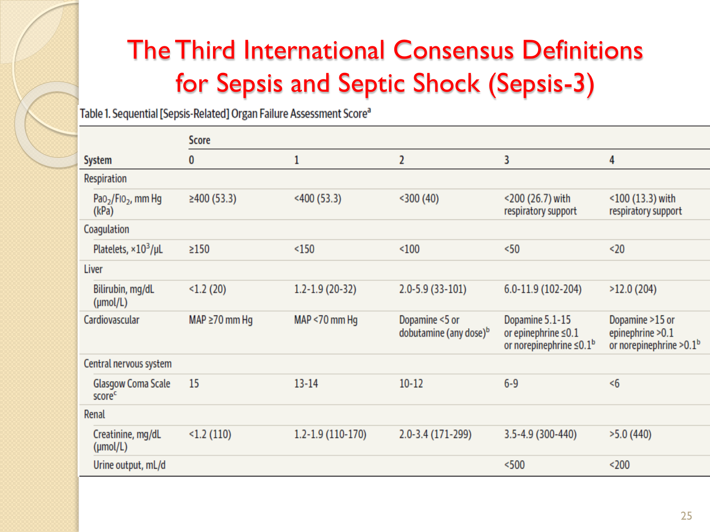

### qSOFA (Quick SOFA) Kriterleri

Yatak başında hızlı değerlendirme için kullanılır (≥ 2 kriter pozitifliği anlamlıdır):

* Solunum hızı ≥ **22/dk**
* Mental durum değişikliği (altered mentation)
* Sistolik kan basıncı ≤ **100 mmHg**

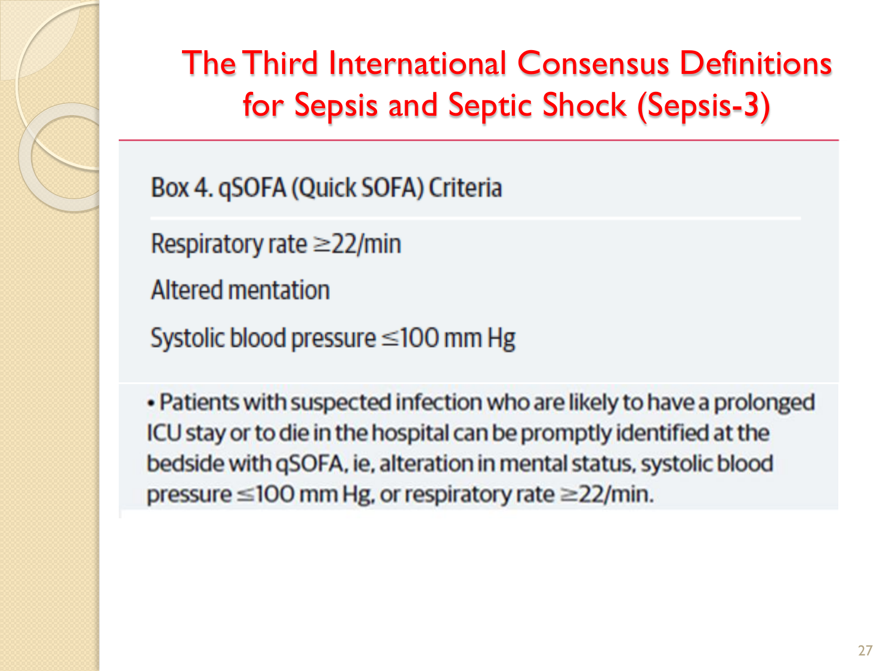

**⚠️ ÖNEMLİ:** qSOFA ≥ 2 olan ve enfeksiyon şüphesi bulunan hastalar uzun YBU kalışı veya hastanede ölüm açısından yüksek risklidir.

### Sepsis-3 Tanı Algoritması

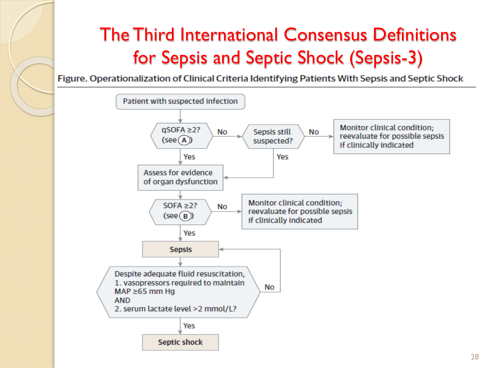

```
        Enfeksiyon şüphesi olan hasta
                    ↓
            qSOFA ≥ 2 mi?
           ↙            ↘
        Evet             Hayır
         ↓                 ↓
  Organ disfonksiyonu   Sepsis hâlâ
  kanıtını değerlendir  şüpheli mi?
         ↓               ↙      ↘
    SOFA ≥ 2 mi?      Evet     Hayır
    ↙        ↘          ↓        ↓
  Evet      Hayır    Değerlendir  İzle
   ↓          ↓
 SEPSİS    İzle
   ↓
 Yeterli sıvı resusitasyonuna rağmen:
 1. MAP ≥ 65 mmHg için vazopressör
 2. Laktat > 2 mmol/L
           ↓
      SEPTİK ŞOK
```

---

## TEDAVİ

Tedavi üç ana başlık altında yürütülür:

1. **Başlangıç resusitasyonu ve infeksiyon verileri**
2. **Hemodinamik stabilizasyon ve yardımcı tedaviler**
3. **Destek tedavisi**

### Kanıt Düzeyleri (GRADE Sistemi)

| Öneri Sınıflaması | Açıklama    |
| ----------------- | ----------- |
| **Grade I**       | Güçlü öneri |
| **Grade II**      | Zayıf öneri |

| Kanıt Düzeyi | Açıklama                                                                            |
| ------------ | ----------------------------------------------------------------------------------- |
| **Grade A**  | Randomize çalışmalarda iyi kanıtlar                                                 |
| **Grade B**  | Küçük randomize çalışmalardan orta güçte kanıtlar yada multipl gözlemsel çalışmalar |
| **Grade C**  | Zayıf yada kanıt yokluğu, çoğunlukla fikirbirliğine varılmış durum                  |

---

## BAŞLANGIÇ RESUSİTASYON

### A. Başlangıç Resusitasyon

Protokol, sepsisin indüklediği doku hipoperfüzyonu olan hastalara gecikmeden uygulanmalıdır (Grade 1C).

**Başlama koşulu:** Sıvı challenge yapıldıktan sonra ısrarcı hipotansiyon yada kan laktat ≥ 4 mmol/L

**Resusitasyonun ilk 3 saatindeki hedefler:**

* a) Santral venöz basınç (CVP): **8-12 mmHg**
* b) Ortalama arter basıncı (MAP) ≥ **65 mmHg**
* c) İdrar output ≥ **0.5 mL/kg/h**
* d) Santral venöz (superior vena kava) oksijen satürasyonu (ScvO₂) **%70** veya miks venöz oksijen satürasyonu (SvO₂) **%65**

### Sepsis Tedavisinde İlk 3 Saatte Yapılması Gerekenler

1. Laktat seviyesini ölçün
2. Antibiyotiğe başlamadan önce **kan kültürü** alın
3. **Geniş spektrumlu antibiyotik** başla
4. Hipotansiyon yada laktat ≥ 4 mmol/L için **30 mL/kg kristaloid** ver

### 6 Saatte Tamamlanmış Olması Gerekenler

5. MAP 65 mmHg sağlamak için **vazopressör** uygula (başlangıç sıvı tedavisine cevap yoksa)
6. Yeterli volüm resusitasyonuna rağmen ısrarcı arterial hipotansiyon yada başlangıç laktat ≥ 4 mmol/L ise:
   - Santral venöz basıncı (CVP) ölçün
   - Santral venöz oksijen satürasyonu (ScvO₂) ölçün
7. Başlangıç laktat seviyesinde yükselme varsa laktatı tekrar ölçün

**⚠️ Başarılı resusitasyonda hedef: CVP 8 mmHg, ScvO₂ %70 ve normal laktat**

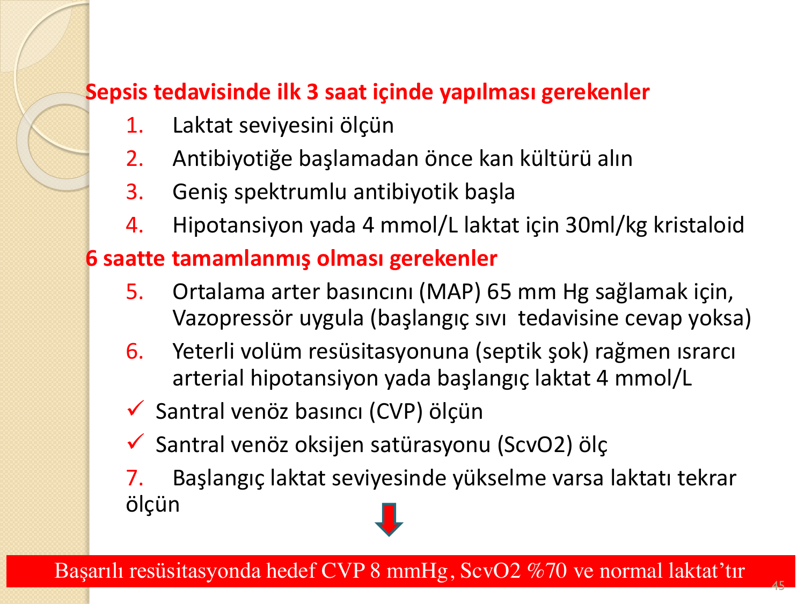

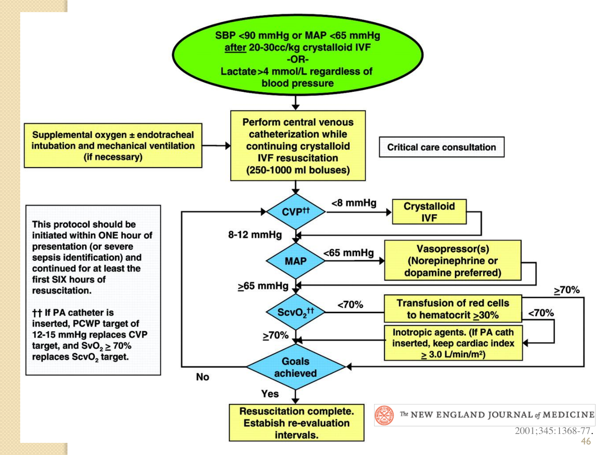

---

### B. Sepsis Taraması ve Uygulama Gelişimi

1. Ciddi sepsise erken tedavi başlanması amacıyla ciddi enfeksiyonu olan hastaların sepsis açısından **rutin taranması** (Grade 1C)
2. Ciddi sepsiste **hastane tabanlı uygulama** düzeltme çabası

---

## TANI

### C. Tanı

* Antimikrobiyal tedavinin başlanmasında belirgin gecikmeye (> 45 dak) neden olmayacak ise antimikrobiyal tedavi öncesi uygun **kültürler** alınmalıdır (Grade 1C)
* Potansiyel enfeksiyon kaynağı olarak düşünülen bölgenin **radyolojik görüntülenmesi**
### Kan Kültürü

* Antimikrobial tedavi öncesi alınan en az **2 set** kan kültürü (aerobik/anaerobik)
* En az bir tanesi **perkütan** alınmış, diğeri ise vasküler kateter 48 saatten önce takılmadıysa her kateterden bir tane (Grade 1C)
* Diğer alanların kültürleri (idrar, BOS, dekübit, respiratuar sekresyonlar vb) de antimikrobiyal tedavinin başlanmasını geciktirmeyecek ise alınmalıdır (Grade 1C)

---

## ANTİMİKROBİYAL TEDAVİ

### D. Antimikrobiyal Tedavi

1. Septik şok (Grade 1B) ve ağır sepsiste (Grade 1C) **ilk 1 saat** içinde tedavi hedefi olarak efektif **IV antibiyotik** başlanmalıdır

2. a. Sepsis kaynağı olduğu düşünülen dokuların içine yeterli konsantrasyonlarda penetre olabilen ve muhtemel patojenlere (bakteriyel/fungal/viral) karşı aktivitesi olan bir yada daha fazla ilacın başlanması (Grade 1B)

   b. Antimikrobiyal tedavi potansiyel etkinlik açısından **günlük** değerlendirilerek direnç gelişimi, toksisite ve maliyetler azaltılabilir (Grade 1B)

3. Başlangıçta septik gibi görünen fakat enfeksiyonun ileri bulguları olmayan hastalarda ampirik antibiyotiğin kesilmesinde düşük **prokalsitonin** seviyeleri veya benzer biomarkerları kullanın (Grade 2C)

4. **Ampirik antimikrobiyal tedavi** olası tüm patojenleri kapsamalıdır
   - Ampirik tedavide **kombinasyon** kullanılmalıdır:
     * Ağır sepsisli nötropenik hastalarda (Grade 2B)
     * Tedavisi zor, Acinetobacter veya Pseudomonas gibi çoklu direnç geliştirebilen mikroorganizmalara karşı (Grade 2B)
   - Ampirik kombinasyon tedavisi **2-5 günden** uzun kullanılmamalı, en uygun tekli tedaviye geçiş antibiyogram öğrenilir öğrenilmez yapılmalıdır (Grade 2B)

5. Tedavi süresi **7-10 gündür**; daha uzun tedaviler nötropeni, immün yetmezlikler, viral ve fungal enfeksiyonlar, S.aureus bakteremisi, drene olmayan fokal enfeksiyon ve yavaş klinik cevabı olan hastalarda uygulanabilir (Grade 2C)

6. Viral kaynaklı septik şok yada ciddi sepsis düşünülen hastalarda en kısa zamanda **antiviral tedavi** başlanır (Grade 2C)

7. Antimikrobial ajanlar non-infeksiyöz kaynaklı olduğu tespit edilen ciddi inflamatuar durumlarda **kullanılmamalıdır** (UG)

---

## KAYNAK KONTROLÜ

### E. Kaynak Kontrolü

1. Kaynak için anotomik tanı hızlı şekilde taranmalı, tanı konulmalı ve eğer mümkünse tanı konulduktan sonraki ilk **12 saat** içinde kaynak kontrolü için girişim yapılmalıdır (Grade 1C)

2. Peripankreatik nekroz potansiyel enfeksiyon kaynağı olarak belirlendiğinde, **demarkasyon hattı** oluşana kadar beklemek en iyisidir (Grade 2B)

3. Septik hastalarda kaynak kontrolü gerektiğinde en az invaziv yöntem uygulanmalıdır (absenin cerrahi drenajı yerine **perkütan drenajı**) (UG)

4. Damar yolu muhtemel sepsis yada septik şok nedeni ise, başka bir damar yolu açıldıktan sonra çekilmelidir (UG)

---

### F. İnfeksiyondan Korunma

* Selektif oral dekontaminasyon ve selektif sindirim dekontaminasyonu ventilatör ilişkili pnömoni insidansını azaltmak için sağlanmalıdır (Grade 2B)
* Oral klorheksidin glukonat, ciddi sepsisli YBU hastalarındaki ventilatör ilişkili pnömoniyi azaltmak için orafaringeal dekontaminasyonun sağlanması için kullanılabilir (Grade 2B)

---

## SIVI TEDAVİSİ

* Ciddi sepsis ve septik şokta resusitasyonda ilk seçilecek başlangıç sıvısı **kristaloiddir** (Grade 1A)
* Başlangıç sıvı challenge **1 L veya fazla** kristaloid olmalı
* Minimum **30 mL/kg** kristaloid (2.1 L/70 kg) ilk **4-6 saat** içinde verilmeli
* Aralıklı sıvı bolusları hastalarda hemodinamik iyileşme sağlandığı sürece verilebilir (Grade 1C)
* Başlangıç kristaloid sıvı resusitasyonuna **albumin** eklenmesi zayıf öneridir (Grade 2B)
* Ciddi sepsis ve septik şokun sıvı resusitasyonunda **hidroksietil starch** kullanımından kaçının (Grade 1B)

---

## VASOPRESSÖR TEDAVİ

### İlk Seçenek: Norepinefrin

* Vasopressor tedavide ilk seçenek **norepinefrindir** (Grade 1B)
* Yeterli kan basıncının sağlamada ek ajana gerek duyulduğunda **epinefrin** (norepinefrin yerine yada ek olarak) (Grade 2B)
* MAP yükseltmek yada norepinefrin dozunu azaltmak için norepinefrine ilave olarak **vazopressin** 0.03 ünite/dk eklenebilir (Grade 2A)

### Dopamin

* Norepinefrin yerine vazopressör olarak **dopamin** uygulanması sadece iyi seçilmiş hastalarda (taşiaritmi riski düşük hastalar ve tam yada rölatif bradikardi) (Grade 2C)
* Renal koruma için düşük doz dopamin **kullanılmamalı** (Grade 1A)
* Vazopressör alan hastaların tamamında imkanlar yeterli ise **arteryel kateter** yerleştirilmelidir (UG)

### Epinefrin

Septik şok tedavisi için epinefrin şu durumlar haricinde önerilmez:
* Norepinefrin ciddi aritmilerle ilişkili ise
* Kardiak output yüksek ve kan basıncı sürekli düşük
* Kurtarma tedavisi olarak (kombine inotrop/vazopressör ilaçlar ve düşük doz vazopressin hedef MAP'na ulaşmada başarısız ise)

### Fenilefrin

Septik şokta aşağıdaki durumlar dışında kullanılması önerilmez (Grade 1C):
* 2 veya daha fazla inotrop/vazopressör ajan ve düşük doz vazopressin kullanımına rağmen septik şok bulguları persiste ediyorsa
* Bilinen kardiyak output yüksek ise
* Norepinefrin ile ciddi aritmi yaşanmışsa

### Dobutamin (İnotrop)

* Dobutamin infüzyonu (20 μg/kg/dk) şu durumlarda vazopresörlere eklenebilir:
  - a. Yükselmiş kardiak dolma basıncı ve düşük kardiak output olan miyokardial disfonksiyon
  - b. Yeterli intravasküler volüm ve yeterli MAP sağlanmasına rağmen hipoperfüzyon belirtileri (Grade 1C)
* Önceden belirlenmiş kardiak indeksi arttırma stratejisi olarak kullanılmaz (Grade 1B)

### Norepinefrin vs Dopamin Kanıt Özeti

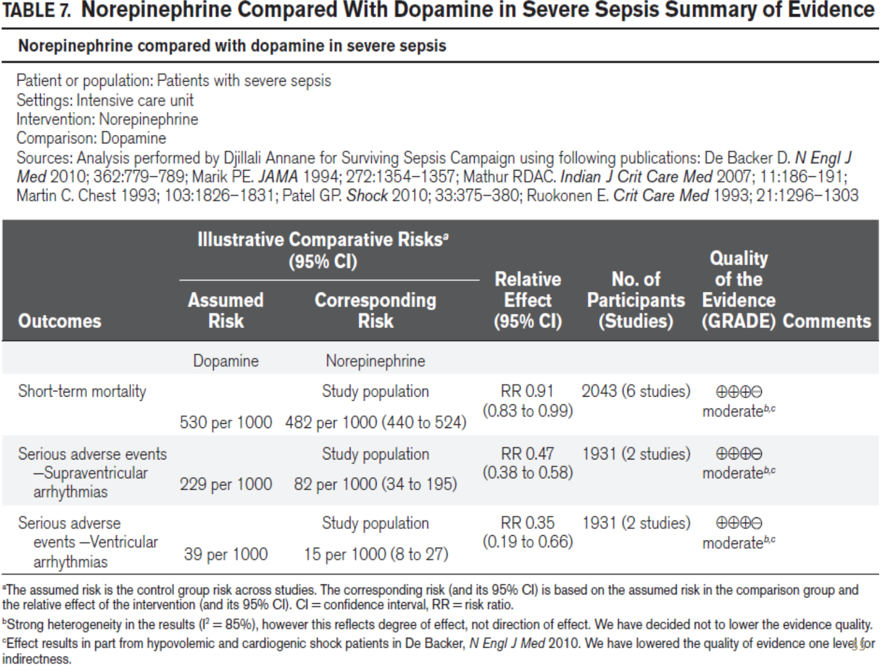

### Vasopressör ve İnotrop İlaç Özet Tablosu

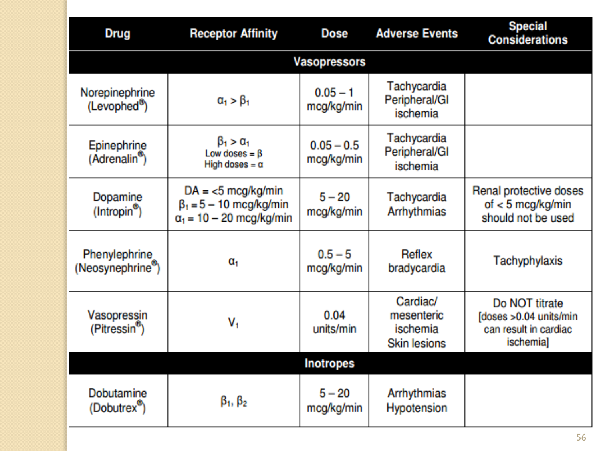

| İlaç             | Reseptör Afinitesi                      | Doz                | Yan Etkiler                                | Özel Durumlar                                                  |
| ---------------- | --------------------------------------- | ------------------ | ------------------------------------------ | -------------------------------------------------------------- |
| **Norepinefrin** | α₁ > β₁                                 | 0.05-1 mcg/kg/dk   | Taşikardi, periferik/GI iskemi             | —                                                              |
| **Epinefrin**    | β₁ > α₁ (düşük dozda β, yüksek dozda α) | 0.05-0.5 mcg/kg/dk | Taşikardi, periferik/GI iskemi             | —                                                              |
| **Dopamin**      | DA < 5 mcg/kg/dk, β₁ = 5-10, α₁ = 10-20 | 5-20 mcg/kg/dk     | Taşikardi, aritmiler                       | Renal koruyucu dozlar (< 5 mcg/kg/dk) kullanılmamalı           |
| **Fenilefrin**   | α₁                                      | 0.5-5 mcg/kg/dk    | Refleks bradikardi                         | Taşiflaksi                                                     |
| **Vazopressin**  | V₁                                      | 0.04 ünite/dk      | Kardiak/mezenterik iskemi, cilt lezyonları | Titre edilmez; > 0.04 ünite/dk kardiak iskemiye neden olabilir |
| **Dobutamin**    | β₁, β₂                                  | 5-20 mcg/kg/dk     | Aritmiler, hipotansiyon                    | İnotrop                                                        |

---

## KORTİKOSTEROİDLER

* Yeterli sıvı resusitasyonu ve vazopressör tedavi ile hemodinamik stabilite sağlanabildiyse yetişkinlerdeki septik şok tedavisi için **hidrokortizon kullanılmaz**
* Bunun sağlanamadığı durumlarda continue infüzyon şeklinde **200 mg/gün hidrokortizon** önerilir (Grade 2C)
* Artık vazopressör gerektirmeyen tedavi edilmiş hastaların hidrokortizon tedavisi azaltılır (Grade 2D)
* Şokun olmadığı sepsisin tedavisinde **kortikosteroidler kullanılmamalıdır** (Grade 1D)

---

## KAN ÜRÜNLERİ

1. Doku hipoperfüzyonu çözülmüş ise ve miyokard iskemisi, ciddi hipoksemi, akut hemoraji yada iskemik kalp hastalığı gibi bir durum yok ise eritrosit süspansiyonu sadece hemoglobin konsantrasyonu < **7.0 g/dL**'ni altında ise verilmesi ve hedef hemoglobin değerinin **7.0-9.0 g/dL** olması önerilir (Grade 1B)

2. Ciddi sepsis ile ilişkili aneminin spesifik tedavisi için **eritropoetin kullanılmaz** (Grade 1B)

3. **Taze donmuş plazma:** planlı invaziv uygulama veya kanama yoksa kullanılması önerilmez (Grade 2D)

4. Septik şok ve ciddi sepsis tedavisinde **antitrombin kullanılmaz** (Grade 1B)

5. **Platelet süspansiyonu:**
   - Plt < **10.000/mm³** → belirgin kanama olmayan hastalarda profilaktik platelet süspansiyonu
   - Plt < **20.000/mm³** → ciddi kanama riski olan hastalarda profilaktik uygulanır
   - Aktif kanama, cerrahi yada invaziv işlemlerde Plt > **50.000/mm³** üzerinde olması istenir (Grade 2D)

---

## DESTEK TEDAVİSİ

### Glukoz Kontrolü

* YBU'deki ciddi sepsisli hastaların ardışık 2 defa ölçülen kan glikoz seviyesi **180 mg/dL**'nin üzerinde olduğunda insülin infüzyon protokolü uygulanır. Hedef üst sınır glikoz değeri ≤ **180 mg/dL** olmalıdır (Grade 1A)
* Kan glikoz değerleri ve infüzyon oranları stabil olana kadar her **1-2 saatte** bir monitörize edilmeli, sonra her **4 saatte** bir bakılmalıdır (Grade 1C)

### Bikarbonat Tedavisi

* pH ≥ **7.15** olan, hipoperfüzyonun indüklediği laktik asidemili hastaların vazopressör gereksinimini azaltmak yada hemodinaminin düzeltilmesi amacıyla sodyum bikarbonat tedavisi **kullanılmaz** (Grade 2B)

### DVT Profilaksisi

* Ciddi sepsisli hastalar venöz tromboembolizm (VTE) riskine karşı günlük **profilaksi** alır (Grade 1B)
* Günlük **subkutanöz düşük ağırlıklı heparin** (LMWH) ile sağlanır (Grade 1B)
* Kreatinin klirensi < 30 mL/dk altında ise **deltaparin** yada renal metabolizması daha düşük olan bir başka LMWH (Grade 2C) yada **UFH** (Grade 1A)
* Heparin kullanımı kontraendike olan hastalar profilaksi almazlar (Grade 1B), fakat kontrendike değil ise **kompresyon çorapları** yada **intermittan kompresyon cihazları** kullanılır (Grade 2C)

### Stres Ülser Profilaksisi

* Kanama riski olan ciddi sepsis/septik şoklu hastalara **H2 bloker** yada **proton pompa inhibitörleri** kullanılarak stres ülseri profilaksisi yapılır (Grade 1B)
* Stres ülser profilaksisi için H2RA'den ziyade **proton pompa inhibitörleri** kullanılır (Grade 2D)
