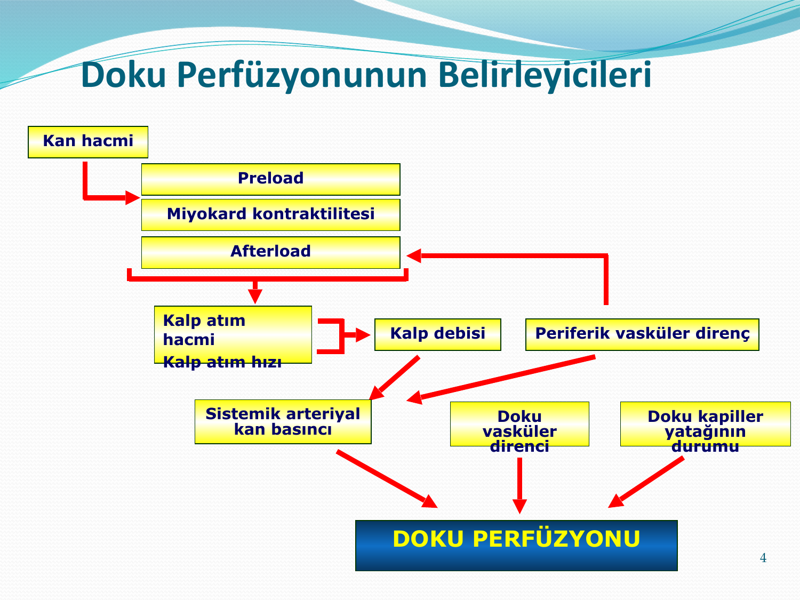
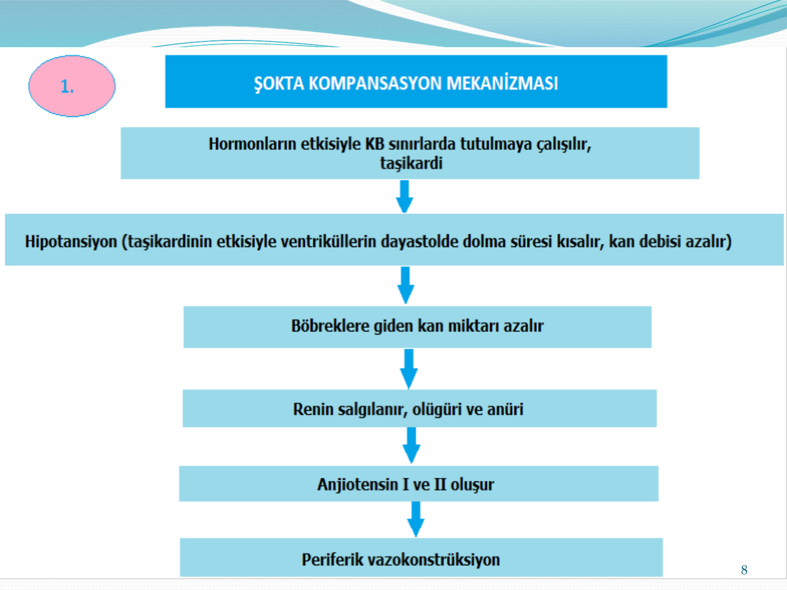
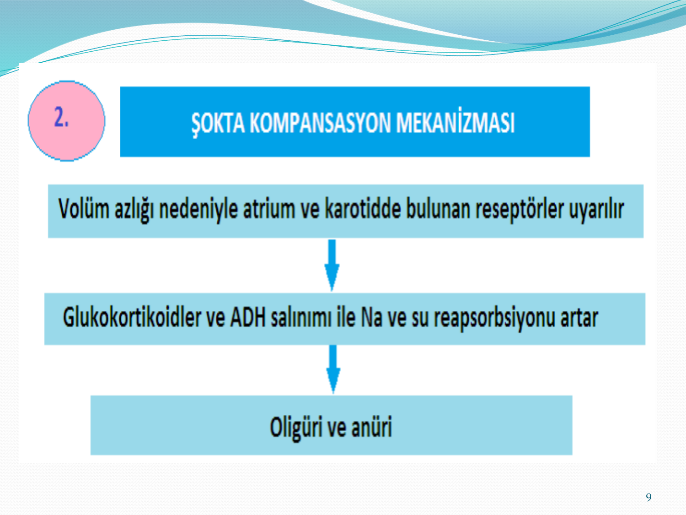
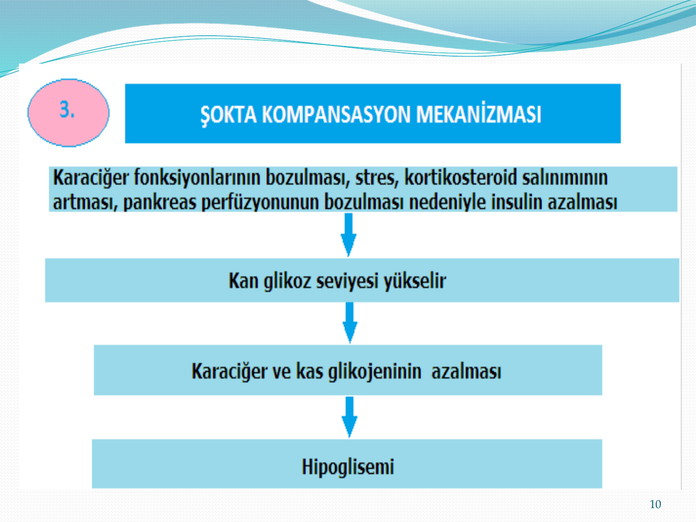
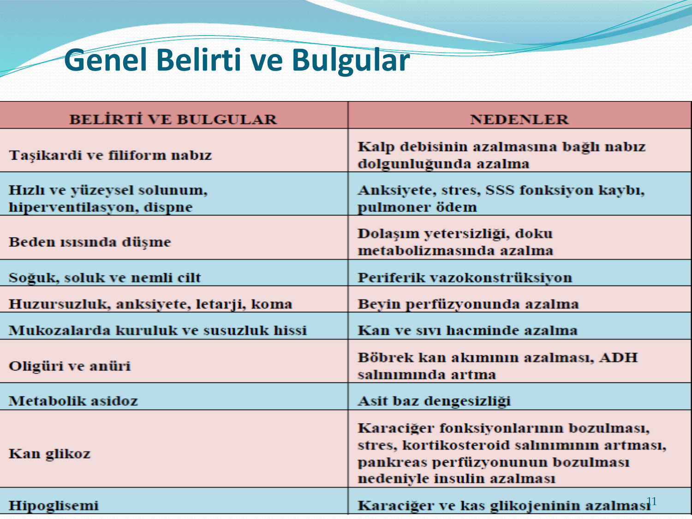
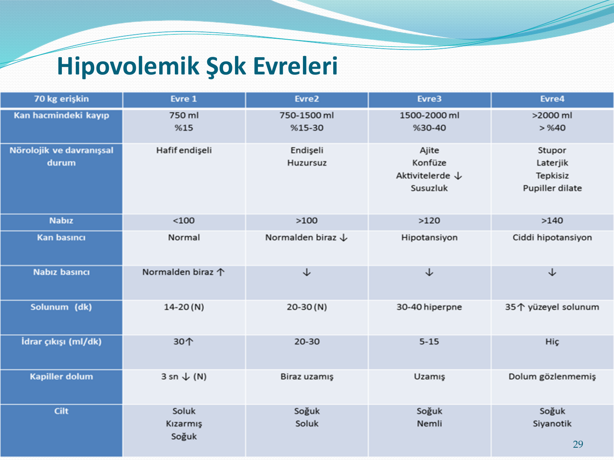
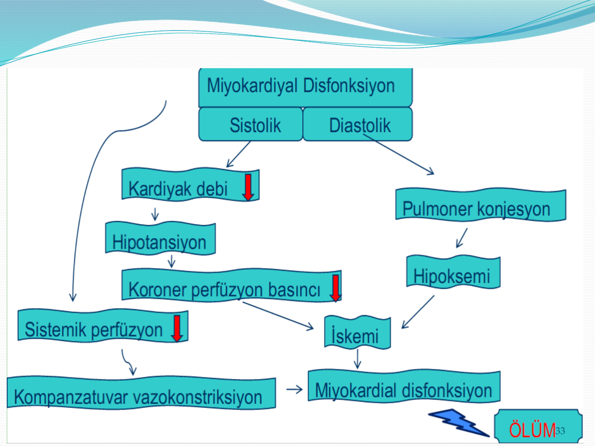
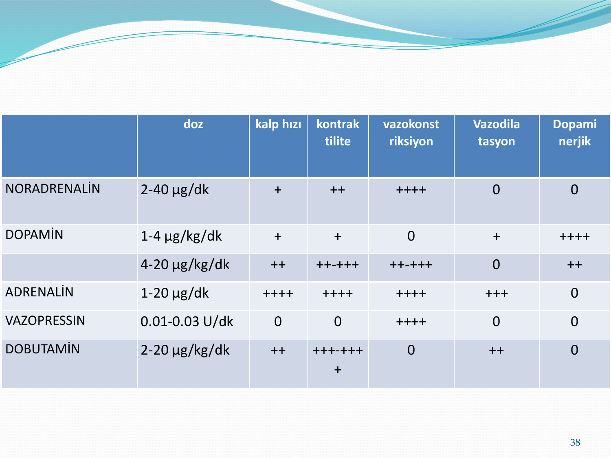
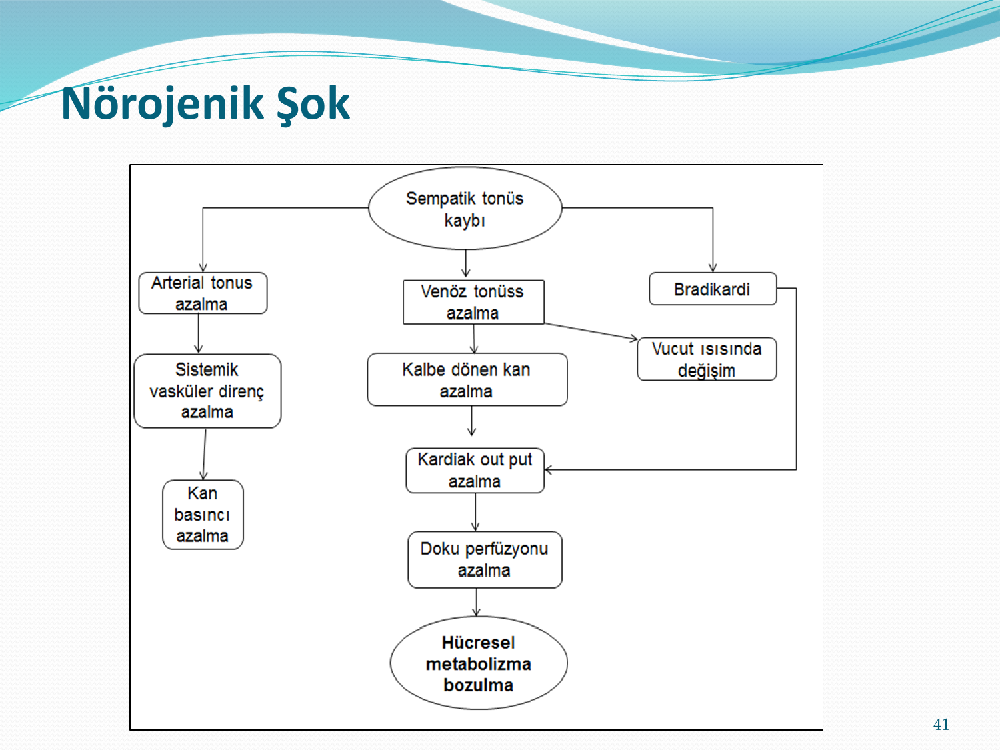
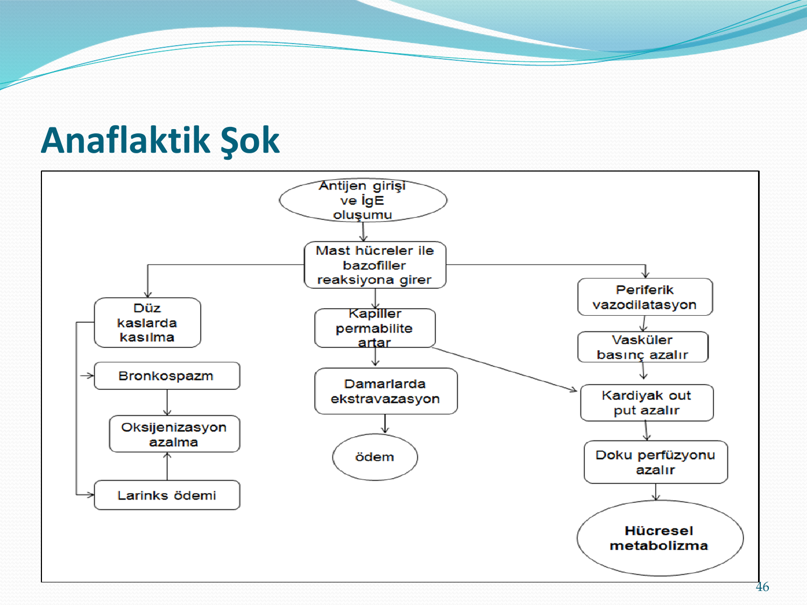

# ŞOK VE ŞOK TİPLERİ

**Hazırlayan:** Dr. Hilal Bektaş Uysal
**Bölüm:** Genel Dahiliye — İç Hastalıkları Anabilim Dalı

---

## İÇİNDEKİLER

1. [Tanım](#tanim)
2. [Doku Perfüzyonunun Belirleyicileri](#doku-perfuzyonunun-belirleyicileri)
3. [Epidemiyoloji](#epidemiyoloji)
4. [Şok Kompanzasyonu](#sok-kompanzasyonu)
5. [Genel Belirti ve Bulgular](#genel-belirti-ve-bulgular)
6. [Şok Evreleri](#sok-evreleri)
7. [Şokta Genel Tıbbi Önlemler](#sokta-genel-tibbi-onlemler)
8. [Şokun Klinik Sınıflaması](#sokun-klinik-siniflamasi)
9. [Hipovolemik Şok](#hipovolemik-sok)
10. [Kardiyojenik Şok](#kardiyojenik-sok)
11. [Distributif Şok](#distributif-sok)
12. [Obstrüktif Şok](#obstruktif-sok)

---

## TANIM

> Şok; dokularda **oksijen sunumu ile oksijen ihtiyacı** arasındaki dengesizliğin yarattığı dolaşım yetersizliğidir.

* Yetersiz dolaşım ve doku perfüzyonu ile karakterize derin hemodinamik ve metabolik bozuklukların geliştiği akut bir tablodur
* Hayatı tehdit eden, hücrelere yetersiz oksijen sunumunun eşlik ettiği, akut jeneralize bir dolaşımsal yetmezlik durumudur

Bu akut dolaşımsal yetmezlik kliniğe bir veya birkaç mekanizmanın bir araya gelmesi sonucunda yansır:

1. **Dolaşan volüm** ve venöz dönüşün azalması
2. **Kalp pompa** fonksiyon bozukluğu
3. **Obstrüksiyon** (pulmoner emboli, pnömotoraks)
4. **Distribüsyon bozukluğu**, vasküler tonus kaybı

> Neden bu kadar önemli? YBU yatışlarının 1/3'ü şok nedeniyle. Mortalite %40-80.

### Şokun Hücresel Sonuçları

```
   Yetersiz Doku Perfüzyonu
              ↓
   Hücrelerin Metabolik
   Gereksinimi Karşılanamaz
              ↓
   Hücre Membran İşlevleri Bozulur
              ↓
        HÜCRE ÖLÜMÜ
```

---

## DOKU PERFÜZYONUNUN BELİRLEYİCİLERİ



Doku perfüzyonunu belirleyen faktörler:

* **Kan hacmi** → Preload → Miyokard kontraktilitesi → Afterload
* **Kalp atım hacmi** × **Kalp atım hızı** = **Kalp debisi**
* **Kalp debisi** × **Periferik vasküler direnç** = **Sistemik arteriyal kan basıncı**
* Doku perfüzyonu ayrıca **doku vasküler direnci** ve **doku kapiller yatağının durumu** tarafından belirlenir

---

## EPİDEMİYOLOJİ

* ABD'de yılda **1 milyondan fazla** hasta acil servise başvurmakta, ICU yatışlarının yaklaşık **1/3**'ü şok nedeniyle
* Agresif tedaviye rağmen mortalite yüksek:
  - Septik şoktaki hastaların **%40-50…80**'i
  - Kardiyojenik şoktakilerin **%40-60**'ı
* Geri dönüşümsüz komplikasyonları, hücre hasarını ve mortaliteyi engellemek için **erken dönemde tanı konulup tedavi edilmesi** çok önemlidir

---

## ŞOK KOMPANZASYONU

Şok geliştiğinde, hücrelerin temel ihtiyaçları olan besin, O₂ ve sıvı-elektrolitler karşılanamayacağından ve atık maddeler atılamayacağından bu durumu düzeltmek için **kompanzasyon mekanizmaları** devreye girer.

Mekanizmada temel amaç, azalan kan hacmine paralel olarak diğer organ perfüzyonlarını azaltıp **kalp** ve **beyinin** yeterli perfüzyonunu sağlamaktır.

### 1. Kompanzasyon Mekanizması (RAAS)



```
  Hormonların etkisiyle KB sınırlarda tutulmaya çalışılır, taşikardi
                          ↓
  Hipotansiyon (taşikardinin etkisiyle ventriküllerin diyastolde
  dolma süresi kısalır, kan debisi azalır)
                          ↓
  Böbreklere giden kan miktarı azalır
                          ↓
  Renin salgılanır, oligüri ve anüri
                          ↓
  Anjiotensin I ve II oluşur
                          ↓
  Periferik vazokonstriksiyon
```

### 2. Kompanzasyon Mekanizması (ADH)



```
  Volüm azlığı nedeniyle atrium ve karotidde bulunan reseptörler uyarılır
                          ↓
  Glukokortikoidler ve ADH salınımı ile Na ve su reabsorbsiyonu artar
                          ↓
  Oligüri ve anüri
```

### 3. Kompanzasyon Mekanizması (Glukoz Metabolizması)



```
  KC fonksiyonlarının bozulması, stres, kortikosteroid salınımının
  artması, pankreas perfüzyonunun bozulması nedeniyle insülin azalması
                          ↓
  Kan glikoz seviyesi yükselir
                          ↓
  Karaciğer ve kas glikojeninin azalması
                          ↓
  Hipoglisemi
```

---

## GENEL BELİRTİ VE BULGULAR



| Belirti ve Bulgular                                 | Nedenler                                                                                                                              |
| --------------------------------------------------- | ------------------------------------------------------------------------------------------------------------------------------------- |
| Taşikardi ve filiform nabız                         | Kalp debisinin azalmasına bağlı nabız dolgunluğunda azalma                                                                            |
| Hızlı ve yüzeysel solunum, hiperventilasyon, dispne | Anksiyete, stres, SSS fonksiyon kaybı, pulmoner ödem                                                                                  |
| Beden ısısında düşme                                | Dolaşım yetersizliği, doku metabolizmasında azalma                                                                                    |
| Soğuk, soluk ve nemli cilt                          | Periferik vazokonstriksiyon                                                                                                           |
| Huzursuzluk, anksiyete, letarji, koma               | Beyin perfüzyonunda azalma                                                                                                            |
| Mukozalarda kuruluk ve susuzluk hissi               | Kan ve sıvı hacminde azalma                                                                                                           |
| Oligüri ve anüri                                    | Böbrek kan akımının azalması, ADH salınımında artma                                                                                   |
| Metabolik asidoz                                    | Asit-baz dengesizliği                                                                                                                 |
| Kan glikoz ↑                                        | KC fonksiyonlarının bozulması, stres, kortikosteroid salınımının artması, pankreas perfüzyonunun bozulması nedeniyle insülin azalması |
| Hipoglisemi                                         | Karaciğer ve kas glikojeninin azalması                                                                                                |

### Tanıda Önemli Noktalar

* **Erken tanı için şüphelenmek gerekir**
* Vital bulgular şok için güvenilir gösterge değildir
* Tanı için FM'de **doku perfüzyonu bozukluğu** belirti ve bulgularına odaklanmak gerekir:
  1. **Deri** (kutanöz perfüzyon)
  2. **Böbrekler** (idrar çıkışı)
  3. **Beyin** (mental durum)
* Şok tanısı ve tedavi takibi için tek bir değişken kullanılamaz

### Hipotansiyon ve Laktat

* **Hipotansiyon:** SKB < 90 mmHg veya MAP < 65 mmHg veya SKB > 40 mmHg düşme
* Hipotansiyon şokun olmazsa olmazı değildir! SKB normal iken belirgin doku hipoksisi olabilir
* Artan laktat düzeyleri ve azalmış ScvO₂ olan hastalarda tansiyon korunmuş olabilir
* CVP ölçümleri hem tedavi yanıtını değerlendirmede hem de şok tipi ayrımında yardımcı olur

### Laktat İzlemi

* Laktat seviyeleri şoktan şüphelenilen **her hastada** bakılmalıdır
* Serum laktat > **2 mEq/L**
* Laktat seviyesinde erken düşüş global doku hipoksisinin gerilediğini gösterirken azalmış mortalite ile de ilişkili bulunmuş
* Laktat seviyelerinin şokun ilk **8 saatinde** her **2 saatte** bir, sonrasında **8-12 saatte** bir ölçümü önerilir
* Santral venöz oksijen satürasyonu (ScvO₂) ölçümü oksijen sunumu ve kullanımı arasındaki denge ile ilgili önemli bilgiler verir

---

## ŞOK EVRELERİ

### Kompanse Evre

* Kompansasyon mekanizmalarının harekete geçmesi ile periferik direnç ve kardiak output artar, kan basıncındaki düşüş dengelenir
* Vital organların perfüzyonu korunduğu için fonksiyonları bozulmaz
* Kan basıncı genellikle **normal sınırlar** içindedir
* Şoktaki tedavi girişimi **en çok bu dönemde** başarılı olur

### Dekompanse Evre

* Doku perfüzyonunun azalması, progresif bir dolaşım ve metabolik denge bozukluğunun başlaması ile karakterizedir
* Bu dönemde kompansasyon mekanizmaları yetersiz kaldığından vital organlara kan akımı için gerekli arteriyel basınç sağlanamaz
* Sonuç olarak beyin, böbrek ve kalpte **iskemi** oluşur
* Sıklıkla **sistolik hipotansiyon** mevcuttur

### İrreversibl Evre

* Şok tablosu uzun sürerse, doku perfüzyonundaki aşırı bozukluk hücre membranı ve organellerin fonksiyonunun bozulmasına neden olur
* Ağır metabolik asidoz, doku hipoksisi ve tüm organlarda bozukluk oluşur
* Bu dönemde **tedaviye cevap alınamaz**
* İlerleyici uç organ disfonksiyonu sonucunda geri dönüşümsüz **multiorgan hasarı ve ölüm** meydana gelir

---

## ŞOKTA GENEL TIBBİ ÖNLEMLER (hangi tip olursa olsun)

### Ventilasyon Desteği

* Öncelik hava yolu açıklığının sağlanması ve solunumun sürdürülmesi
  - Pozitif basınçlı ventilasyon
  - Endotrakeal entübasyon

**⚠️ DİKKAT:** Sedatifler hipotansiyonu arttırabilirler:
* Arteriel vazodilatasyon
* Venodilatasyon
* Miyokardiyal supresyon → **Hemodinamik kollaps**

Pozitif basınçlı ventilasyon ön yükü ve kardiyak outputu azaltır. Mümkün ise **volüm replasmanı ve vazoaktif ajanların** entübasyon ve pozitif basınçlı ventilasyondan önce kullanılması önerilir.

### Monitorizasyon

* Vital bulguları, mental durum değişikliklerini izle
* İdrar çıkışı
* Deri perfüzyon değişiklikleri
* Sağ atriyum basıncı (CVP) izlenmeli
* EKO
* ScvO₂

### Sıvı Replasmanı

İntravasküler volümün düzenlenmesi için:

**Kristaloidler** → %0.9 NaCl, Ringer laktat

| Avantajları              | Dezavantajları                                                             |
| ------------------------ | -------------------------------------------------------------------------- |
| Ucuzdurlar               | Tüm ekstrasellüler sıvı volümünü ↑                                         |
| Kolay bulunabilirler     | İntertisyel sıvı ↑ → lenfatik drenaj bozulur                               |
| Allerjiye neden olmazlar | Akciğer kompliyansında ↓ → Hipoksi, pulmoner ödem, gaz değişiminde bozulma |

**Kolloidler** → İnsan albumini, dextran, jelatin, HES

| Avantajları                                     | Dezavantajları                                                                             |
| ----------------------------------------------- | ------------------------------------------------------------------------------------------ |
| Düşük volümde hemodinamik stabiliteyi sağlarlar | Pahalıdırlar                                                                               |
| Periferik ödem oluşturmazlar                    | Ca bağlama, immünglobulin düzeyini ↓, endojen albümin sentezini ↓ gibi yan etkileri vardır |

**Kan Ürünleri** → Tam kan, ES, TDP

### Vazoaktif İlaç Tedavisi

* Vazomotor tonüs ve kardiyak fonksiyonu düzenlemek amacıyla
* Sıvı resusitasyonu başarısız veya volüm infüzyonu kontrendike ise
* İlaç tedavisi **santral ven kateteri** aracılığı ile uygulanmalıdır

### Diğer Önlemler

* Metabolik gereksinimleri karşılamak amacıyla mutlaka **beslenme desteği** verilmelidir
* Akut hastalık durumunda sıklıkla gelişen **stres ülseri profilaksisi** amacıyla hastaya PPI, histamin-2 blokerleri verilmelidir

### Tedavi Hedefleri

* İdrar çıkışı: > **0.5 mL/kg/h**
* CVP: **8-12 cmH₂O**
* MAP: **65-90 mmHg**
* Santral venöz oksijen satürasyonu > **%70**
* Laktat < **2 mmol/L**

---

## ŞOKUN KLİNİK SINIFLAMASI

1. **Hipovolemik şok**
2. **Kardiyojenik şok**
3. **Distributif şok**
   - Nörojenik şok
   - Anaflaktik şok
   - Septik şok
4. **Obstrüktif şok** (extrakardiyak obstrüksiyon: pnömotoraks, tamponad, emboli)

---

## HİPOVOLEMİK ŞOK

* Dolaşan kan ve sıvı hacminin azalmasına bağlı olarak gelişen bir tablodur
* Venöz dönüşün azalması sonucu atım hacmi ve kardiyak output azalır
* Volüm kaybı devam ederse kan basıncı düşer ve yaşamsal organlarda doku perfüzyonu yetersiz olmaya başlar
* **En sık görülen** şok çeşididir

### Patofizyoloji

```
  Kan volümünde azalma
           ↓
  Venöz dönüşte azalma
           ↓
  Strok volümde azalma
           ↓
  Kardiyak outputta azalma
           ↓
  Doku perfüzyonunda azalma
```

### Hipovolemik Şok Nedenleri

**Hemorajik şok:**
* Kan kaybı (ağır GİS kanamaları, aort anevrizma yırtılması, femur ve pelvis kırıkları, uzuv kopması, cerrahi girişimler, jinekolojik kanama)

**Nonhemorajik şok:**
* Akut plazma kaybı (geniş yanıklar, peritonit, pankreatit, intestinal obstrüksiyon gibi nedenlerle intraabdominal sıvı kaybı)
* Akut ekstrasellüler sıvı kaybı (kusma, ishal, diabetik ketoasidoz, diabetes insipidus, diüretik kullanımı, akut böbrek yetmezliğinin diürez dönemi)

### Hipovolemik Şok Evreleri (70 kg Erişkin)



| Parametre                | Evre 1                 | Evre 2               | Evre 3                                    | Evre 4                                      |
| ------------------------ | ---------------------- | -------------------- | ----------------------------------------- | ------------------------------------------- |
| **Kan kaybı**            | 750 mL (%15)           | 750-1500 mL (%15-30) | 1500-2000 mL (%30-40)                     | > 2000 mL (> %40)                           |
| **Nörolojik durum**      | Hafif endişeli         | Endişeli, huzursuz   | Ajite, konfüze, aktivitelerde ↓, susuzluk | Stupor, laterjik, tepkisiz, pupiller dilate |
| **Nabız**                | < 100                  | > 100                | > 120                                     | > 140                                       |
| **Kan basıncı**          | Normal                 | Normalden biraz ↓    | Hipotansiyon                              | Ciddi hipotansiyon                          |
| **Nabız basıncı**        | Normalden biraz ↑      | ↓                    | ↓                                         | ↓                                           |
| **Solunum (/dk)**        | 14-20 (N)              | 20-30 (N)            | 30-40 hiperpne                            | 35 ↑ yüzeyel solunum                        |
| **İdrar çıkışı (mL/dk)** | 30 ↑                   | 20-30                | 5-15                                      | Hiç                                         |
| **Kapiller dolum**       | 3 sn ↓ (N)             | Biraz uzamış         | Uzamış                                    | Dolum gözlenmemiş                           |
| **Cilt**                 | Soluk, kızarmış, soğuk | Soğuk, soluk         | Soğuk, nemli                              | Soğuk, siyanotik                            |

### Hipovolemik Şok Tedavisi

* Hipovolemiye neden olan durum kontrol altına alınır
* Esas sorun intravasküler volümün kaybı olduğu için kaybedilen volüm yerine konmalı
* Sıvı replasmanı için öncelikle **kristaloidler**, kan ve kan ürünleri kullanılır
* Amaç: Hava yolunun açık tutulması, solunumun desteklenmesi ve normal kan dolaşımının sağlanması
* Hastaya **iki ya da daha fazla** damar yolu açılmalı
* Kan kaybı > **%30**'dan fazla olması durumunda **kan ürünleri**
* O₂ verilmeli, gerekirse entübasyon
* Hastanın monitörizasyonu, CVP ölçümü, idrar çıkışı, kan oksijenizasyon durumu, asit-baz ve sıvı-elektrolit ve mental durumu değerlendirilmeli

> Temel mekanizma volüm kaybını tedavi et sonra düşün.

---

## KARDİYOJENİK ŞOK

* İntravasküler alanda yeterli kan olmasına karşın kalbin pompalama gücünün azalmasına bağlı **kalp atım hacminin düşmesi** ve doku perfüzyonunun azalması durumudur
* Azalmış kardiyak outputa bağlı **end organ hipoperfüzyonudur**
* Kardiyojenik şokta sol ventrikül fonksiyon bozukluğunu kompanse etmek için oluşan cevaplar, başlangıçta kompanzasyon sağlar
* Daha sonraki dönemde tablo ilerledikçe kalp işlevlerinin daha çok bozulması şok tablosunun ilerlemesine neden olur

### Kardiyojenik Şok Patofizyolojisi



```
         Miyokardiyal Disfonksiyon
         (Sistolik + Diastolik)
          ↙                ↘
  Kardiyak debi ↓      Pulmoner konjesyon
       ↓                    ↓
  Hipotansiyon          Hipoksemi
       ↓                    ↓
  Koroner perfüzyon ↓     İskemi
       ↓                    ↓
  Sistemik perfüzyon ↓  Miyokardial disfonksiyon
       ↓                    ↑
  Kompanzatuvar      ←——————┘
  vazokonstriksiyon
       ↓
     ÖLÜM
```

### Tanı Kriterleri (Bunu soruyorum)

* SKB < 90 mmHg 30 dk süre ile veya SKB > 90 mmHg olması için vazopressör ihtiyacı
* Pulmoner konjesyon veya artmış LV dolum basınçları
* Bozulmuş organ perfüzyonu bulguları:
  - Bozulmuş mental status
  - Soğuk, nemli deri
  - Oligüri
  - Artmış laktat seviyeleri
* İleri hemodinamik monitorizasyon; kardiyak index ve PCWP ölçümü tanı için artık önerilmiyor

### Kardiyojenik Şok Nedenleri

**Miyokardla ilgili nedenler:**
* Sol ventrikül miyokardının **%40**'dan fazla nekrozu
* Sağ ventriküler infarkt
* Dilate kardiyomyopati
* Uzamış iskemi veya kardiyopulmoner resusitasyon
* Kalp ameliyatları sonrası

**Aritmik nedenler:**
* Atrial fibrilasyon ve atrial flatter
* Ventriküler fibrilasyon
* Bradiaritmiler ve tam kalp bloku

**Mekanik nedenler:**
* Miyokard yırtılması
* Kalp kapak hastalıkları
* Aort disseksiyonu
* Aort darlığı

### Kardiyojenik Şok Belirti ve Bulgular

* Hipotansiyon
* Hızlı filiform nabız, venlerde dolgunluk
* Artmış solunum, wheezing, pulmoner ödem
* Siyanotik, soğuk, soluk ve nemli cilt
* Anksiyete, korku, irritabilite, huzursuzluk, bilinç bulanıklığı
* Juguler venlerde dolgunluk, yeni gelişen üfürüm
* Oligüri, anüri
* Ödem
* Aritmi
* **CVP ve PCWP ↑**

### Kardiyojenik Şok Tedavisi

**Kalp debisinin artırılması:**
* Disritmileri düzelt
* Önyükü düzenle
* Kontraktiliteyi arttır
* Ardyükü azalt

**Kardiyak yük en aza indirilmelidir:**
* Hipotermiden korunmalı
* Hematokrit yükseltilmeli
* Mekanik ventilasyon

### Vazoaktif İlaçlar



| İlaç             | Doz            | Kalp Hızı | Kontraktilite | Vazokonstriksiyon | Vazodilatasyon | Dopaminerjik |
| ---------------- | -------------- | --------- | ------------- | ----------------- | -------------- | ------------ |
| **Noradrenalin** | 2-40 μg/dk     | +         | ++            | ++++              | 0              | 0            |
| **Dopamin**      | 1-4 μg/kg/dk   | +         | +             | 0                 | +              | ++++         |
| **Dopamin**      | 4-20 μg/kg/dk  | ++        | ++-+++        | ++-+++            | 0              | ++           |
| **Adrenalin**    | 1-20 μg/dk     | ++++      | ++++          | ++++              | +++            | 0            |
| **Vazopressin**  | 0.01-0.03 U/dk | 0         | 0             | ++++              | 0              | 0            |
| **Dobutamin**    | 2-20 μg/kg/dk  | ++        | +++-++++      | 0                 | ++             | 0            |

---

## DİSTRİBUTİF ŞOK

* Vasküler tonüs yetersizliğinden kaynaklanan şoktur
* Kan hacmi yeterli olduğu halde damarlarda yaygın vazodilatasyon olur ve perfüzyon bozulur
* Alt gruplarına göre yaklaşım ve tedavisi değişiklik gösterir

---

### Nörojenik Şok

* Periferik arterlerde ani vazomotor tonüs kaybına bağlı;
  - Kanın periferde göllenmesi
  - Kalbe dönen kanın azalması → **perfüzyonun azalması**
  - Kalp atım hacminin düşmesi



**Nörojenik Şok Nedenleri:**
* Spinal kord yaralanmaları
* Spinal anestezi
* Sedatif, narkotik, trankilizanlar gibi ilaçlar
* Ani korku, heyecan, ağrı

**Nörojenik Şok Belirti ve Bulgular:**
* Hipotansiyon
* Yavaş ve sıçrayıcı nabız
* Değişken solunum
* Kuru ve ılık cilt
* Anksiyete, huzursuzluk, letarjiden komaya gidiş
* Oligüri
* Vücut ısısı ↓

**Nörojenik Şok Tedavisi:**
* Bayılma ile ortaya çıkan nörojenik şokta, hasta uyarıdan uzaklaştırılır, varsa ağrısı kontrol altına alınır ve **trendelenburg pozisyonu** verilir (sıklıkla)
* Spinal anesteziye bağlı gelişen nörojenik şok, vazokonstrüktör ilaçların kullanılması ile kısa sürede düzelebilir
* Yeterli sıvı replasmanına rağmen düzelmeyen hipotansiyon durumunda vazokontrüktif ilaçlar kısa süreli kullanılabilir

---

### Anaflaktik Şok

* Anaflaktik reaksiyon, kişinin daha önce duyarlılık kazandığı bir antijen ile karşılaşması sonucu gelişen **ağır alerjik reaksiyondur**
* Duyarlılığı olan bir kişi antijenle karşılaştığında IgE yapısında bir antikor oluşturur. Kişi daha sonra aynı antijenle karşılaştığında antijen, **mast hücreleri ve bazofillere** bağlı olan IgE ile reaksiyona girer ve **histamin, lökotrienler ve kemotaktik mediyatörlerin** salınmasına neden olur



**Anaflaktik Şok Belirti ve Bulgular:**
* Hipotansiyon
* Taşikardi
* Ritim bozukluğu
* Dispne, stridor, wheezing
* Laringospazm, bronkospazm, pulmoner ödem
* Ilık ve ödemli cilt
* Oligüri-anüri
* Parestezi, pruritis
* Abdominal kramp, diyare ve kusma

**Anaflaktik Şok Tedavisi:**
* **Havayoluna dikkat!**
* Oksijen
* **Adrenalin** (anafilaksinin asıl ilacı)
* Sıvı tedavisi
* Antihistaminik
* Kortikosteroid
* Bronkodilatörler (beta-2 mimetikler, metilksantinler)
* Gerekirse, vazopresörler (dopamin)

### Adrenalin Dozları

* **İ.M. doz:** 0.5 mg (0.01 mg/kg) İ.M. (1:1000)
* İhtiyaca göre 5-10 dak. da bir yapılabilir
* Eğer çoklu doz ihtiyacı veya ağır reaksiyon varsa **IV/infüzyon**
* Hasta hamile ise **0.3 mg (1:1000)** önerilir

**⚠️ ÖNEMLİ:** Refrakter şokta IV adrenalin:
* **1:1000'lik dilüsyon kullanılmamalı**, en az 1:10.000'lik dilüsyon tercih edilmelidir
* **IV doz:** 1 mg (1:10.000'lik adrenalinden 10 mL); 3-5 dakika arayla doz tekrarlanabilir
* **1:10.000 adrenalin** = 1 mL Adrenalin + 9 mL %0.9 NaCl = 10 mL karışım

**Cevap alınamazsa:** 1 mg adrenalin 500 mL dekstroz/SF içerisinde 1-4 microgram/dk (0.5-2 mL/dk) olacak şekilde verilir

---

### Septik Şok

Septik şok konusu ayrıntılı olarak [Sepsis ders notunda](sepsis.md) ele alınmıştır.

---

## OBSTRÜKTİF ŞOK

* Anahtar bulgu: **Venöz dolgunluk** olmasıdır
* **Tansiyon pnömotoraks** → İğne torakostomi ile tedavi et
* **Kardiyak tamponad** → Perikardiosentez düşün
* **Pulmoner emboli** → Tanıyı doğrula, trombolitik veya embolektomi planla

---

## SONUÇ

* Şok tanı ve ayırıcı tanısı hızla yapılarak etkin tedaviye başlanmalıdır
* Hiçbir laboratuar değeri tek başına spesifik ve sensitif değil
* Şok **YBÜ'de** tedavi edilmelidir
* En önemli destek tedavisi **volüm tedavisidir**

---

## AKILDA KALMASI GEREKENLER

### Şok Nedir? — Tek Cümle

> Şok = **Doku oksijen sunumu < Doku oksijen ihtiyacı** → hücre ölümü

Hipotansiyon şok demek değildir, şokta hipotansiyon olmayabilir. Asıl bakılacak olan **doku perfüzyonu**: deri, böbrek (idrar), beyin (bilinç).

---

### 4 Şok Tipini Ayırt Etme Tablosu

|                     | **Hipovolemik**             | **Kardiyojenik**                         | **Distributif**                          | **Obstrüktif**                 |
| ------------------- | --------------------------- | ---------------------------------------- | ---------------------------------------- | ------------------------------ |
| **CVP / JVD**       | ↓↓                          | ↑↑                                       | ↓ veya N                                 | ↑↑                             |
| **Kardiyak output** | ↓                           | ↓↓                                       | ↑ (sıcak şok) veya ↓                     | ↓                              |
| **SVR**             | ↑                           | ↑                                        | ↓↓                                       | ↑                              |
| **Cilt**            | Soğuk, soluk                | Soğuk, nemli                             | Sıcak, kızarık (erken)                   | Soğuk                          |
| **Anahtar ipucu**   | Kanama/dehidratasyon öyküsü | Göğüs ağrısı, pulmoner ödem, yeni üfürüm | Ateş/enfeksiyon, allerjen, spinal travma | JVD + hipotansiyon + sessiz AC |

**Kolay hatırlama:**
- **Hipovolemik** → Damar BOŞ (CVP ↓, her şey azalmış)
- **Kardiyojenik** → Pompa BOZUK (CVP ↑, akciğerde su)
- **Distributif** → Damar GENİŞ (SVR ↓, cilt sıcak)
- **Obstrüktif** → Yol TIKALI (CVP ↑ ama akciğer temiz)

---

### Tedavi Hedefleri — 5 Rakam

| Hedef            | Değer            |
| ---------------- | ---------------- |
| **MAP**          | ≥ 65 mmHg        |
| **İdrar çıkışı** | > 0,5 mL/kg/saat |
| **CVP**          | 8-12 cmH₂O       |
| **ScvO₂**        | > %70            |
| **Laktat**       | < 2 mmol/L       |

---

### Hipovolemik Şok Evreleri — Pratik Hatırlama

- **Evre 1 (%15):** Her şey normal gibi, sadece hafif endişe. Nabız < 100. **Tuzak evre** — gözden kaçırma.
- **Evre 2 (%15-30):** Nabız > 100, KB biraz düşük. Huzursuz hasta. **Sıvı ver.**
- **Evre 3 (%30-40):** Nabız > 120, hipotansiyon, konfüzyon. **Kan ver.**
- **Evre 4 (> %40):** Nabız > 140, stupor, anüri. **Masif transfüzyon**, cerrahi düşün.

**Altın kural:** Kan kaybı %30'u geçince → **kan ürünleri** şart.

---

### Kardiyojenik Şok — Kısır Döngüyü Hatırla

```
Miyokard hasarı → Debi ↓ → Hipotansiyon → Koroner perfüzyon ↓
      ↑                                              ↓
      └────────── Daha fazla iskemi ←──────────────┘
```

Bu kısır döngü kırılmazsa hasta kaybedilir. Tedavi mantığı:
1. **Debiyi arttır** → Dobutamin (inotropik)
2. **Ardyükü azalt** → Vazodilatör
3. **Ritmi düzelt** → Antiaritmik
4. **Mekanik destek** → İABP, ECMO

**⚠️** Kardiyojenikte **sıvı verme** — akciğeri batırırsın. (Hipovolemikten temel fark!)

---

### Anafilaktik Şok — Sınav Klasiği

**Birinci ilaç, her zaman, tartışmasız:** **ADRENALİN İ.M.**

| Durum        | Doz                                           |
| ------------ | --------------------------------------------- |
| Erişkin      | **0,5 mg İ.M.** (1:1000)                      |
| Gebe         | 0,3 mg İ.M. (1:1000)                          |
| IV gerekirse | **1:10.000 dilüsyon** (asla 1:1000 IV yapma!) |

**Sıralama:** Adrenalin → Sıvı → Antihistaminik → Steroid → Bronkodilatör

---

### Vazoaktif İlaçlar — Kim Nerede?

| Şok Tipi             | Birinci Seçenek                              |
| -------------------- | -------------------------------------------- |
| **Septik şok**       | **Noradrenalin**                             |
| **Kardiyojenik şok** | **Dobutamin** (debiyi arttır) ± Noradrenalin |
| **Anafilaktik şok**  | **Adrenalin**                                |
| **Nörojenik şok**    | Sıvı + gerekirse **vazokonstrüktör**         |
| **Hipovolemik şok**  | Önce **SIVI**, ilaç son çare                 |

---

### Obstrüktif Şok — 3 Neden, 3 Tedavi

| Neden                 | Tedavi                        |
| --------------------- | ----------------------------- |
| Tansiyon pnömotoraks  | **İğne torakostomi**          |
| Kardiyak tamponad     | **Perikardiosentez**          |
| Masif pulmoner emboli | **Trombolitik / embolektomi** |

**Ortak özellik:** JVD + hipotansiyon + düşük debi. Akciğer temiz ise tamponad/PE, trakeada deviasyon varsa pnömotoraks.

---

### Laktat — En Önemli Takip Parametresi

- Şoktan şüphelenilen **her hastada** bakılmalı
- İlk **8 saat** → her **2 saatte** bir ölç
- Sonrası → **8-12 saatte** bir
- Laktat düşüyorsa → tedavi işe yarıyor
- Laktat düşmüyorsa → altta yatan nedeni tekrar gözden geçir

---

### Şok Evreleri — Geri Dönüş Penceresi

```
Kompanse evre ──→ Dekompanse evre ──→ İrreversibl evre
  (KB normal)      (hipotansiyon)       (tedaviye yanıt yok)
  ✅ TEDAVİ ET      ⚠️ ACİL MÜDAHALE     ❌ GERİ DÖNÜŞÜMSÜZ
```

**En kritik mesaj:** Şokun **kompanse evresinde** yakalamak hayat kurtarır. KB normal diye şoku dışlama — **deri, idrar, bilinç**'e bak.
