# AKUT LÖSEMİLER

**Hazırlayan:** Dr. A. Hilal Eroğlu Küçükdiler
**Bölüm:** ADÜ Tıp Fakültesi - Hematoloji
**Tarih:** 2024-2025 Dönem IV (03.09.2024)

---

## İÇİNDEKİLER

1. [Genel Bilgiler ve Sınıflama](#genel-bilgiler-ve-sınıflama)
2. [Tanı Yaklaşımı Algoritması](#tanı-yaklaşımı-algoritması)
3. [Akut Myeloid Lösemi (AML)](#akut-myeloid-lösemi-aml)
4. [Akut Promiyelositik Lösemi (APL)](#akut-promiyelositik-lösemi-apl)
5. [Akut Lenfoblastik Lösemi (ALL)](#akut-lenfoblastik-lösemi-all)
6. [AML vs ALL Karşılaştırması](#aml-vs-all-karşılaştırması)
7. [Mikst Fenotipik Akut Lösemi (MPAL)](#mikst-fenotipik-akut-lösemi-mpal)
8. [Hematolojik Acil Durumlar](#hematolojik-acil-durumlar)
9. [Destek Tedavisi ve Komplikasyonlar](#destek-tedavisi-ve-komplikasyonlar)
10. [Vaka Örnekleri](#vaka-örnekleri)
11. [Özet ve Sınav İçin Önemli Noktalar](#özet-ve-sınav-için-önemli-noktalar)

---

## GENEL BİLGİLER VE SINIFLAMA

Akut lösemiler, kemik iliğinde **immatür (blast) hücrelerin kontrolsüz çoğalması** ve normal hematopoezin baskılanması ile karakterize malign hematolojik hastalıklardır. Blast hücreler olgunlaşma kapasitesini kaybetmiştir; kemik iliğini infiltre ederek normal kan hücresi üretimini engeller.

> 💡 **Analoji — Fabrika Modeli:** Kemik iliğini bir **fabrika**, kök hücreleri **stajyerler** olarak düşünün. Normalde stajyerler eğitilip uzmanlaşır (olgunlaşır → eritrosit, lökosit, trombosit). Akut lösemide stajyerler (blastlar) olgunlaşamaz, birikir ve fabrikayı felç eder — üretim durur (sitopeni), kapasiteyi aşan stajyerler dışarı taşar (blastlar kana çıkar).

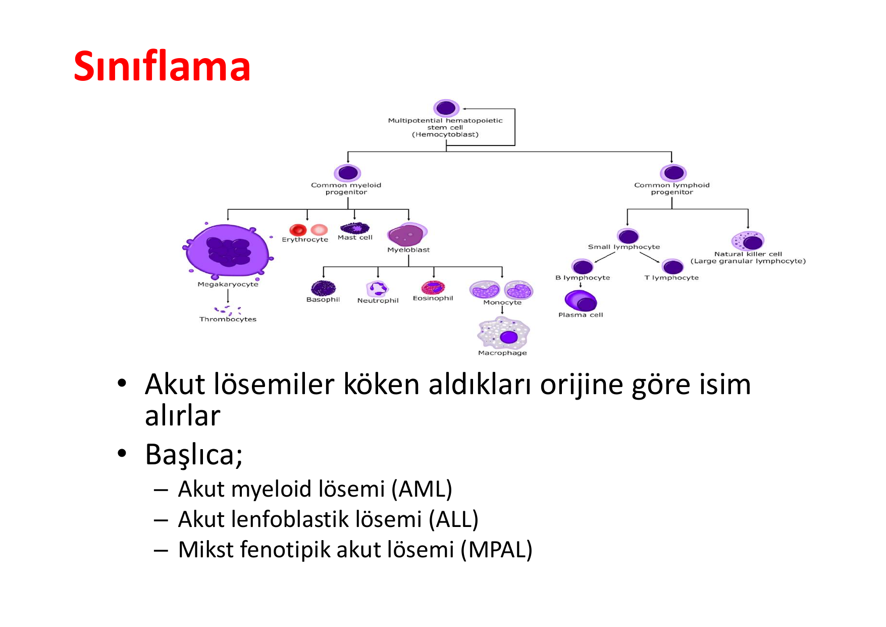

Akut lösemiler köken aldıkları hücre serisine göre isimlendirilir:

* **Akut myeloid lösemi (AML)** — myeloid seri kaynaklı
* **Akut lenfoblastik lösemi (ALL)** — lenfoid seri kaynaklı
* **Mikst fenotipik akut lösemi (MPAL)** — her iki serinin özelliklerini taşıyan

### Hematopoez Ağacı ve Lösemi Kökenleri

```
              Pluripotent Kök Hücre
                      ↓
         ┌────────────┴────────────┐
         ↓                         ↓
   Myeloid Progenitör        Lenfoid Progenitör
         ↓                         ↓
    ┌────┴────┐               ┌────┴────┐
    ↓    ↓    ↓               ↓    ↓    ↓
  Erit Granu Mono           B hc  T hc  NK
  rosit losit sit           re    re    hücre
    
  ←── AML burada ──→     ←── ALL burada ──→
     bloke olur              bloke olur
```

**⚠️ ÖNEMLİ — Akut vs Kronik Lösemi Ayrımı:**

> 💡 **Analoji:** Akut lösemi bir **yangın** — hızlı başlar, haftalar içinde ölümcül olabilir. Kronik lösemi bir **sızıntı** — yavaş ilerler, yıllar alır.

| Özellik         | Akut Lösemi                   | Kronik Lösemi    |
| --------------- | ----------------------------- | ---------------- |
| Başlangıç       | Hızlı (semptomlar <3 ay)      | Yavaş, sinsi     |
| Blast oranı     | ≥**%20** (kemik iliğinde)     | Düşük            |
| Olgunlaşma      | Bloklanmış (immatür hücreler) | Kısmen korunmuş  |
| Tedavisiz seyir | Haftalar-aylar içinde ölümcül | Yıllar sürebilir |

>  Kemik iliğinde blast oranı **≥%20** olması akut lösemi tanısı koydurur (WHO kriteri). Bu eşik değer sınavlarda sık sorulur. Eski FAB sınıflamasında eşik %30 idi.

---

## TANI YAKLAŞIMI ALGORİTMASI

Akut lösemi şüphesinde sistematik bir tanı yaklaşımı esastır:

```
        Klinik şüphe (sitopeni, blast, organomegali)
                         ↓
              ┌──────────┴──────────┐
              ↓                     ↓
      Periferik Yayma          Tam Kan Sayımı
      (blast aranır)           (sitopeni?)
              ↓                     ↓
              └──────────┬──────────┘
                         ↓
               Kemik İliği Aspirasyonu
               (blast ≥%20 → TANI)
                         ↓
         ┌───────────────┼───────────────┐
         ↓               ↓               ↓
   Morfoloji      İmmünfenotipleme   Sitogenetik
   (boyamalar)    (flow sitometri)   + Moleküler
         ↓               ↓               ↓
    MPO, SBB        Soy tayini       Karyotip
    Auer cis.     (myeloid vs        FISH
    Esteraz        lenfoid)          NPM1, FLT3
                                     CEBPA, TP53
                         ↓
              ┌──────────┴──────────┐
              ↓                     ↓
           AML                    ALL
    (MPO+, Auer+,          (TdT+, CD19/CD20
     CD13, CD33,            veya CD3/CD7,
     CD117, HLA-DR)         CD10, MPO-)
```

### İmmünfenotipleme ile AML vs ALL Ayrımı

> 💡 **Analoji — Kimlik Kartı:** Her blast hücre yüzeyinde "kimlik kartı" taşır (CD belirteçleri). Flow sitometri bu kartları okuyarak hücrenin hangi soydan geldiğini belirler — tıpkı bir havalimanında pasaport kontrolü gibi.

| Belirteç | AML | B-ALL | T-ALL |
|---|---|---|---|
| **MPO** (miyeloperoksidaz) | ✅ Pozitif (≥%3) | ❌ | ❌ |
| **TdT** (terminal deoksinükleotidil transferaz) | ❌ (genellikle) | ✅ | ✅ |
| **CD13, CD33, CD117** | ✅ Myeloid | ❌ | ❌ |
| **CD19, CD20, CD22, CD79a** | ❌ | ✅ B-lenfoid | ❌ |
| **CD10 (CALLA)** | ❌ | ✅ (pre-B) | ± |
| **CD3 (sitoplazmik/yüzey)** | ❌ | ❌ | ✅ T-lenfoid |
| **CD7** | ± | ❌ | ✅ |
| **HLA-DR** | ✅ (APL hariç!) | ✅ | ± |
| **CD34** | ± | ± | ± |
| **Auer cisimciği** | ✅ Patognomonik | ❌ Asla | ❌ Asla |

**⚠️ ÖNEMLİ:**

* **APL (M3)** → HLA-DR **negatif**, CD34 **negatif** (diğer AML'lerden farklı!)
* **TdT** → Lenfoid belirteç; AML'de pozitifse kötü prognoz göstergesi
* **CD10 (CALLA)** pozitifliği → B-ALL'de **iyi prognoz** göstergesi

---

## AKUT MYELOİD LÖSEMİ (AML)

### Tanım

Klonal undiferensiye myeloid neoplastik hücrelerin kan, kemik iliği veya diğer dokularda birikmesidir.

* **En sık görülen akut lösemidir** (erişkinlerde akut lösemilerin ~%80'i)
* Tanıda **medyan yaş: 67**
* **5 yıllık sağkalım: %27** (ileri yaş ve genetik faktörlere bağlı olarak değişir)

>  Erişkinde en sık görülen akut lösemi **AML**, çocukta ise **ALL**'dir. Bu ayrım sınavlarda klasik bir sorudur.

---

### Etiyoloji

AML vakalarının çoğunda etiyoloji **net olarak belirlenemez**. Viral bir etiyolojiyi gösteren doğrudan kanıt yoktur. Genom dizileme çalışmaları, AML vakalarının çoğunun **ilerleyen yaşla birlikte biriken sınırlı sayıda somatik mutasyondan** kaynaklandığını göstermektedir.

**Bilinen risk faktörleri:**

* **Genetik yatkınlık** — Down sendromu, Fanconi anemisi, Bloom sendromu
* **Radyasyon** — İyonlaştırıcı radyasyon maruziyeti
* **Kimyasal maruziyet** — Benzen (en önemli kimyasal neden), kloramfenikol, fenilbütazon
* **Önceki kemoterapi** (terapiyle ilişkili AML — t-AML)

**⚠️ Terapiyle İlişkili AML (t-AML)**

> 💡 **Analoji:** t-AML, fabrikaya zarar veren bir **endüstriyel kaza** gibidir. Alkilleyici ajanlar fabrikanın temelini yavaşça çürütür (4–6 yıl, önce MDS evresi). Topoizomeraz II inhibitörleri ise ani bir patlama yapar (1–3 yıl, direkt lösemi).

Antikanser ilaçlar, t-AML'nin önde gelen nedenidir. İki ana tip vardır:

| Özellik | Alkilleyici Ajan İlişkili | Topoizomeraz II İnhibitörü İlişkili |
|---|---|---|
| Latent süre | **4-6 yıl** | **1-3 yıl** |
| Kromozom anomalisi | Kromozom **5 ve 7** (monozomi/delesyon) | Kromozom **11q23** (MLL rearanjmanı) |
| Öncül faz | Displazi/MDS evresi var | Genellikle yok, direkt lösemi |
| Morfoloji | Displastik özellikler | **Monositik** özellikler |
| Örnek ilaçlar | Siklofosfamid, busulfan, melfalan | Etoposid, doksorubisin |

> "Daha önce meme kanseri nedeniyle kemoterapi alan 55 yaşında kadın, 5 yıl sonra pansitopeni ile başvuruyor" → **Alkilleyici ajanla ilişkili t-AML** düşündürmeli. Monozomi 5/7 tipiktir.

* İyonlaştırıcı radyasyon, benzen, kloramfenikol ve fenilbütazon gibi ilaçlara maruziyet nadiren AML'ye dönüşebilen **kemik iliği yetmezliğine** neden olabilir

---

### WHO 2022 AML Sınıflandırması

WHO 2022 sınıflandırmasında AML, diferansiasyon düzeyine göre alt tiplere ayrılmaktadır:

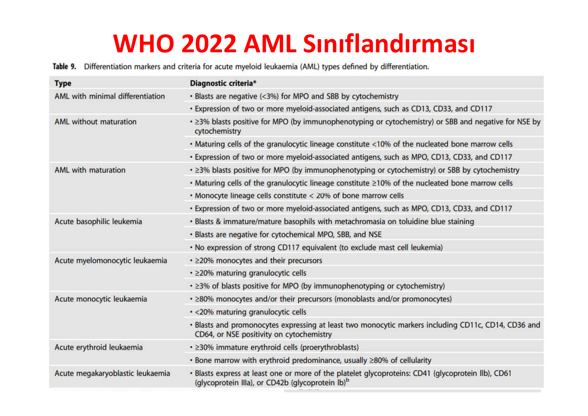

| Alt Tip | Tanısal Özellikler |
|---|---|
| AML, minimal diferansiyasyon | MPO ve SBB negatif, ≥2 myeloid antijen (CD13, CD33, CD117) |
| AML, maturasyonsuz | ≥%3 blast MPO+, granülositik seri <%10 |
| AML, maturasyonlu | ≥%3 blast MPO+, granülositik seri ≥%10, monosit seri <%20 |
| Akut bazofilik lösemi | Bazofiller toluidin mavisi ile metakromazi gösterir |
| Akut miyelomonositik lösemi | ≥%20 monositler ve prekürsörleri, ≥%20 olgunlaşan granülositler |
| Akut monositik lösemi | ≥%80 monosit/promonosit, granülositik seri <%20 |
| Akut eritroid lösemi | ≥%30 immatür eritroid hücre (proeritrobast), eritroid predominans |
| Akut megakaryoblastik lösemi | CD41, CD61 veya CD42b ekspresyonu |

> 💡 **Sınav notu:** Artık güncel pratikte **FAB sınıflaması yerine WHO sınıflaması** kullanılmaktadır. Ancak FAB alt tipleri (M0-M7) hâlâ sınavlarda sorulmaktadır ve morfolojiyi anlamak için faydalıdır.

**Eski FAB Sınıflaması (referans):**

| FAB | Alt Tip | Ayırt Edici Özellik | Klinik İpucu |
|---|---|---|---|
| M0 | Minimal diferansiyasyonlu AML | MPO negatif, CD13/CD33 pozitif | Kötü prognoz |
| M1 | Maturasyonsuz AML | >%90 blast, minimal granülasyon | — |
| M2 | Maturasyonlu AML | t(8;21), Auer cisimcikleri sık | ⭐ İyi prognoz |
| **M3** | **Akut promiyelositik lösemi (APL)** | **t(15;17), Auer cisimcikleri +++, DIC** | **⭐ ATRA ile kür, ACİL** |
| M4 | Akut miyelomonositik | Myeloid + monositik diferansiasyon | Dişeti hiperplazisi |
| M4Eo | M4 + anormal eozinofiller | inv(16) | ⭐ İyi prognoz |
| M5 | Akut monositik | Dişeti hiperplazisi, cilt infiltrasyonu sık | Ekstramedüller tutulum ↑ |
| M6 | Akut eritroid | Eritroid predominans | Kötü prognoz |
| M7 | Akut megakaryoblastik | CD41, CD61, CD42b | Down sendromu ile ilişkili |

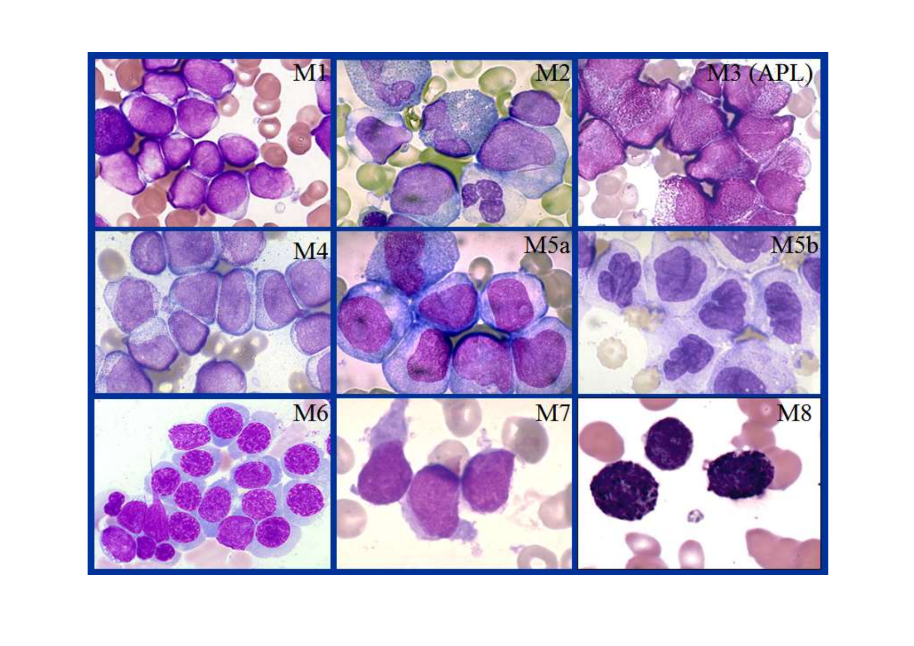

> 💡 **Hatırlatma — FAB Alt Tiplerine Klinik İpuçları:**
> * **Dişeti hiperplazisi** → **M4 veya M5** (monositik)
> * **DIC** → **M3** (APL)
> * **Down sendromlu çocuk** → **M7** (megakaryoblastik)
> * **Auer cisimciği bolluğu (faggot)** → **M3** (APL)
> * **Cilt infiltrasyonu (leukemia cutis)** → **M5** (monositik)
> * **inv(16) + anormal eozinofil** → **M4Eo**

---

### ELN Risk Sınıflandırması

ELN (European LeukemiaNet) genetik risk sınıflandırması, tedavi kararında ve prognoz belirlemede kritik öneme sahiptir:

> 💡 **Analoji — Trafik Işığı:** ELN risk sınıflaması bir haritadaki trafik ışığı gibidir: ✅ Yeşil (iyi) = konsolidasyonla yoluna devam. ⚠️ Sarı (orta) = dikkatli ol, nakil düşün. ❌ Kırmızı (kötü) = dur, allojenik nakil planla.

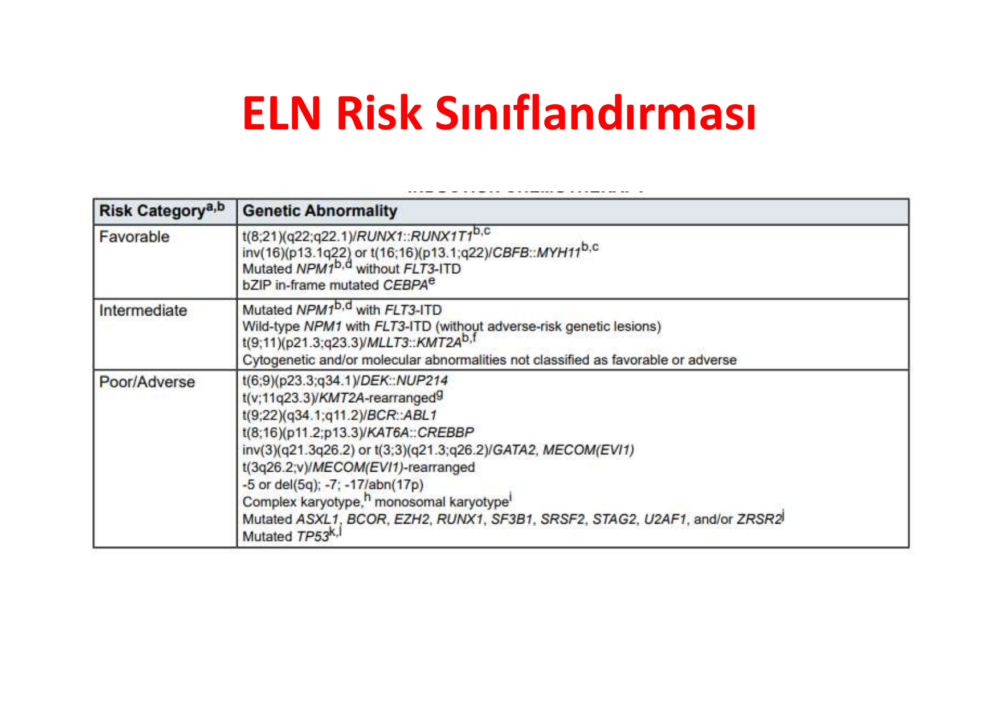

| Risk Kategorisi | Genetik Anomali | 5 Yıllık Sağkalım |
|---|---|---|
| **✅ İyi (Favorable)** | t(8;21), inv(16)/t(16;16), mutant NPM1 (FLT3-ITD yok), bialelik CEBPA | ~%60-70 |
| **⚠️ Orta (Intermediate)** | Mutant NPM1 + FLT3-ITD, wild-type NPM1 + FLT3-ITD (olumsuz genetik lezyon yok), t(9;11) | ~%30-40 |
| **❌ Kötü (Poor/Adverse)** | t(6;9), t(v;11q23.3)/KMT2A, t(9;22)/BCR-ABL1, inv(3), -5/del(5q), -7, kompleks karyotip, monosomal karyotip, mutant TP53, ASXL1, RUNX1 | ~%10-15 |

>  **NPM1 mutasyonu** (FLT3-ITD olmadan) → iyi prognoz. 
>  **FLT3-ITD** mutasyonu → kötü prognoz (artık midostaurin ile hedeflenebilir). 
>  **TP53 mutasyonu** → en kötü prognozlu gruplardan biri.

---

### Klinik ve Laboratuvar Risk Faktörleri

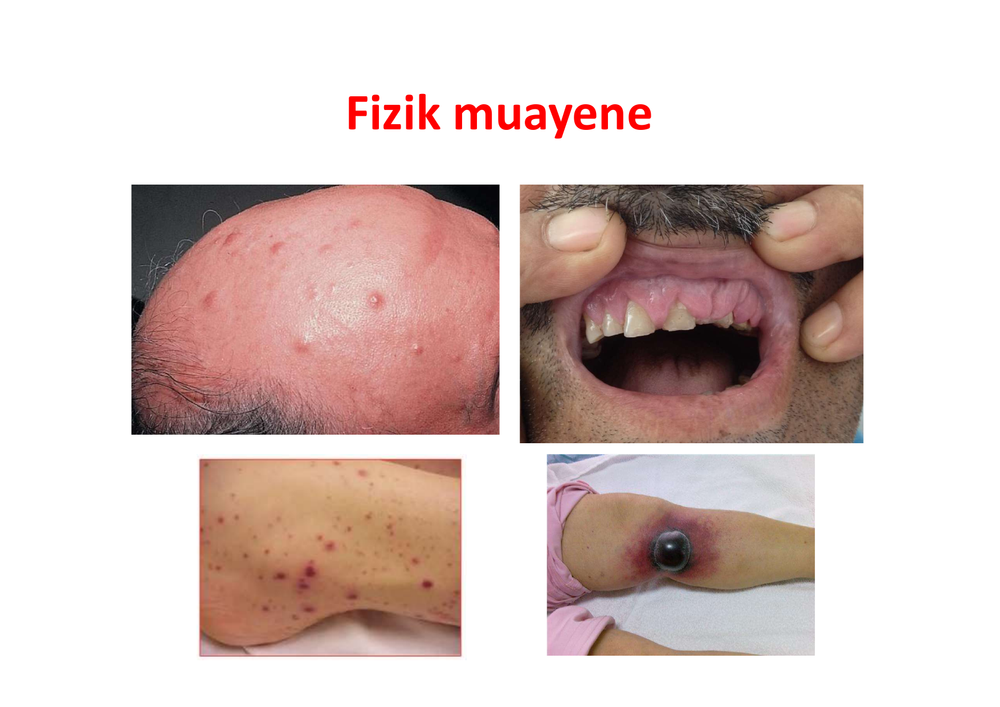

| Parametre                | İyi Prognoz | Kötü Prognoz |
| ------------------------ | ----------- | ------------ |
| Yaş                      | <45         | <2 veya >60  |
| ECOG performans          | 0-1         | >1           |
| Tip                      | De novo     | Sekonder     |
| Enfeksiyon               | Yok         | Var          |
| Önceki kemoterapi        | Yok         | Var          |
| Beyaz küre               | <25.000/μL  | >100.000/μL  |
| LDH (tümör yükü)         | Normal      | Yüksek       |
| Ekstramedüller hastalık  | Yok         | Var          |
| SSS tutulumu             | Yok         | Var          |
| Sitoredüksiyon hızı      | Hızlı       | Yavaş        |
| Auer cisimciği           | Var         | Yok          |
| Eozinofil                | Var         | Yok          |
| Megaloblastik eritroid   | Yok         | Var          |
| Displastik çehre         | Yok         | Var          |
| FAB                      | M2, M3, M4  | M0, M6, M7   |
| CD34                     | Negatif     | Pozitif      |
| HLA-DR                   | Yok         | Var          |
| TdT                      | Yok         | Var          |
| MDR (çoklu ilaç direnci) | Yok         | Var          |

> 💡 **Sınav notu:** **Yaş >60**, **sekonder AML**, **lökosit >100.000**, **kötü sitogenetik** ve **yavaş yanıt** en önemli olumsuz prognostik faktörlerdir.

---

### Klinik Bulgular

Semptomlar genelde yavaş yavaş veya aniden başlar. Lösemi tanısı konmadan önce yaklaşık **≤3 ay** süren semptomlar mevcuttur.

> 💡 **Analoji — Fabrika Çöküşünün 3 Sonucu:** Fabrika çöktüğünde üç şey olur: (1) Ürün çıkmaz → **sitopeni** (anemi, kanama, enfeksiyon). (2) Stajyerler fabrikadan taşar → **lösemik infiltrasyon** (organomegali, kemik ağrısı). (3) Çok fazla stajyer boru hatlarını tıkar → **lökostaz**.

**Semptomların kaynağına göre sınıflama:**

**1. Kemik iliği yetmezliğine bağlı (sitopeniler):**
* **Anemi** → Yorgunluk (en sık ilk semptom), solukluk, dispne, çarpıntı
* **Trombositopeni** → Kanama, kolay morarma, peteşi, epistaksis, dişeti kanaması
* **Pansitopeni**
* **Nötropeni** → Enfeksiyona yatkınlık, ateş (%10 hastada ilk semptom)

**2. Lösemik infiltrasyona bağlı:**
* Kemik ağrısı (blast hücrelerin periost infiltrasyonu)
* Lenfadenopati
* Hepatosplenomegali
* **Miyeloid sarkom** (kloroma/granülositik sarkom): Blastların ekstrameduller birikmesi → en sık **cilt, lenf düğümü, GİS, yumuşak doku ve testis**

**3. Genel semptomlar:**
* Anoreksi ve kilo kaybı
* Gece terlemesi
* Spesifik olmayan öksürük, baş ağrısı


**⚠️ ÖNEMLİ — Hangi Bulgu Hangi Alt Tipi Düşündürür?**

* **Dişeti hiperplazisi** → Monositik lösemiler (M4, M5) düşündürür
* **DIC (yaygın damar içi pıhtılaşma)** → **APL (M3)** düşündürür → Acil tedavi!
* **Cilt nodülleri (leukaemia cutis)** → Monositik lösemiler
* **Kemik ağrısı** → Özellikle çocuklarda ALL'de belirgin
* **Mediastinal kitle** → T-ALL
* **Lökostaz** (BK >100.000) → Dispne, nörolojik semptomlar, retinal kanama
* **Hemorajik bül**

---

### Laboratuvar Bulguları

* **Anemi** — çoğunlukla **normokrom normositer**
* **Lökosit** — Ortanca 15.000/μL (%20 hastada >100.000/μL)
> **Lökosit >100.000 ise → Lökostaz riski!** SSS bulguları, AMI, çift görme; priapizm; solunum sistemi
* **Trombositopeni** — <100.000/μL (hastaların **%75**'inde), %25'inde <25.000/μL

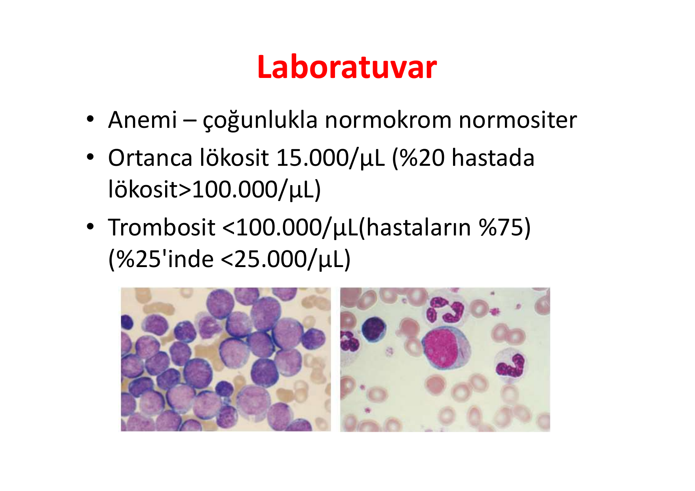

**Periferik yayma bulguları:**
* Blast hücreler (myeloblastlar)
* **Auer cisimcikleri** (azurofilik granüllerin füzyonuyla oluşan çubuk şeklinde inklüzyonlar) → AML'ye **patognomonik**
* **Faggot hücresi** (çok sayıda Auer cisimciği içeren blast) → **APL (M3)** için karakteristik

> 💡 **Analoji — Parmak İzi:** Auer cisimciği, suç mahallinde bulunan **parmak izi** gibidir — AML'ye özgüdür, ALL'de asla görülmez. Faggot hücresi ise "çok sayıda parmak izi" demektir ve APL'yi işaret eder.

> 💡 **Sınav notu:** Periferik yaymada **Auer cisimciği** görülmesi AML tanısını kesinleştirir; ALL'de **görülmez**. Faggot hücresi = APL.

**Kemik iliği aspirasyonu:**
* **≥%20 blast** → Akut lösemi tanısı (WHO kriteri)
* İmmünfenotipleme (flow sitometri) — soy tayini için gerekli
* Sitogenetik analiz — karyotip, FISH
* Moleküler testler — NPM1, FLT3, CEBPA, TP53 vb.

---

### AML Tedavisi

Tedavi, hastanın yaşı, performans durumu, komorbiditeleri ve hastalığın genetik özelliklerine göre planlanır.

> 💡 **Analoji — Savaş Planı:** AML tedavisi bir savaş planıdır. İndüksiyon (7+3) = yoğun bombardıman ile düşmanı geri püskürtmek (tam remisyon). Konsolidasyon = kalan cepleri temizlemek. Kök hücre nakli = bölgeyi tamamen yeniden inşa etmek.

**Tedavi yanıtı kriterleri (tam remisyon — CR):**
* Kemik iliği blast oranı **<%5** olmalı
* Varsa eşlik eden sitogenetik mutasyonlar negatifleşmeli
* **Hematolojik yanıt:** Nötrofil >1.000/μL ve trombosit >100.000/μL

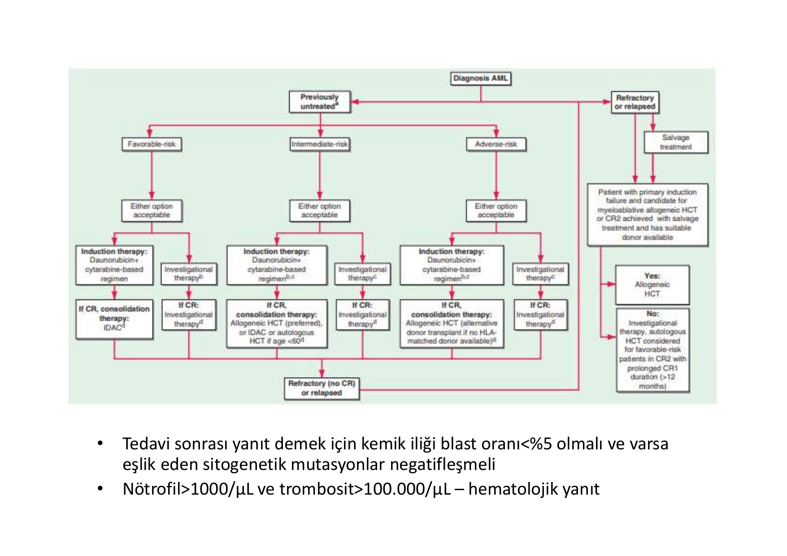

**Tedavi Algoritması:**

```
                    AML Tanısı
                        ↓
             İntensif tedaviye uygun mu?
            ┌───────────┴───────────┐
            ↓                       ↓
          EVET                    HAYIR
            ↓                       ↓
     İndüksiyon "7+3"        Venetoklaks +
     (Sitarabin 7 gün +      Azasitidin/Desitabin
      Antrasiklin 3 gün)     (yaşlı/unfit hastalar)
     FLT3+ ise midostaurin        ↓
            ↓                  Hedefe yönelik
       Tam remisyon?           tedaviler
       ┌────┴────┐
       ↓         ↓
     EVET      HAYIR
       ↓         ↓
  Konsolidasyon  Kurtarma KT
  (riske göre):  veya klinik
                 çalışma
  ┌──────┬──────┐
  ↓      ↓      ↓
 İYİ   ORTA   KÖTÜ
  ↓      ↓      ↓
HiDAC  Allo   Allo
3-4 kür HKHN   HKHN
```

**Standart tedavi yaklaşımı:**

**1. İndüksiyon kemoterapisi ("7+3" rejimi):**
* **Sitarabin** (Ara-C) 7 gün + **Daunorubisin** (veya idarubisin) 3 gün
* Amaç: Tam remisyon elde etmek (CR — Complete Remission)

**2. Konsolidasyon tedavisi:**
* Yüksek doz sitarabin (HiDAC) — özellikle iyi risk grubunda
* Veya allojenik kök hücre nakli (orta/kötü risk grubunda)

**3. Hedefe yönelik tedaviler:**
* **FLT3 inhibitörleri:** Midostaurin, gilteritinib (FLT3 mutant AML'de)
* **IDH inhibitörleri:** Enasidenib (IDH2), ivosidenib (IDH1)
* **Venetoklaks** + azasitidin/desitabin (yaşlı/unfit hastalar)
* **Gemtuzumab ozogamisin** (anti-CD33) — CD33+ AML'de

**4. Allojenik Kök Hücre Nakli (HKHN) Endikasyonları:**
* **Orta ve kötü risk** AML'de birinci tam remisyonda
* Refrakter veya relaps hastalıkta
* İyi risk grupta genellikle **endike değil** (HiDAC yeterli)

> 💡 **Analoji — Kök Hücre Nakli:** Nakli, çökmüş fabrikanın tamamen yıkılıp **yeni bir fabrika kurulması** olarak düşünün. Donörün kök hücreleri yeni fabrikayı kurar ve ayrıca lösemi hücrelerini tanıyıp yok eder (graft-versus-leukemia etkisi — yeni işçilerin eski kötü stajyerleri kovması).

> 💡 **Sınav notu:** "7+3" rejimi (7 gün sitarabin + 3 gün antrasiklin) AML'nin standart indüksiyon tedavisidir. İntensif tedaviye uygun olmayan yaşlı hastalarda **venetoklaks + hipometile edici ajan** kombinasyonu güncel standarttır.

### Minimal Rezidüel Hastalık (MRD)

MRD, mikroskopik olarak saptanamayan ancak ileri tekniklerle tespit edilen lösemi hücrelerini ifade eder.

> 💡 **Analoji — Dedektif:** Savaş sonrası bölge temizlenmiş gibi görünür, ama birkaç düşman hâlâ saklanıyordur. MRD testi, bu saklanmış düşmanları bulan **termal kamera** gibidir. MRD pozitifse relaps riski yüksektir.

* **Flow sitometri** veya **PCR/NGS** ile değerlendirilir
* **MRD negatif** → Daha iyi prognoz
* **MRD pozitif** (CR'da bile) → Relaps riski artmış, nakil düşün

---

## AKUT PROMİYELOSİTİK LÖSEMİ (APL)

APL, AML'nin özel ve **acil tedavi gerektiren** bir alt tipidir. FAB sınıflamasında **M3** olarak bilinir.

### Patogenez

> 💡 **Analoji — Kilitli Kapı:** APL'de fabrikanın bir bölümünde (promiyelosit hattı) **kilitli bir kapı** vardır. PML-RARA füzyon proteini kapıyı kilitler, olgunlaşma promiyelosit aşamasında durur. **ATRA** bu kapının anahtarıdır — kapıyı açar ve hücreler olgunlaşmaya devam eder. Bu yüzden "diferansiasyon tedavisi" denir.

* **t(15;17)(q24;q21)** translokasyonu → **PML-RARA** füzyon geni oluşur
* Normal RARA (retinoik asit reseptör alfa) geni → Ligand bağımlı steroid reseptörü, transkripsiyon faktörü olarak görev yapar
* RARA, retinoik asit reseptör elementlerine bağlanarak **myeloid diferansiasyonda görevli genleri uyarır**
* PML-RARA füzyon proteini → Diferansiasyonu **bloke eder** → Promiyelosit aşamasında olgunlaşma durur

```
  Kromozom 15        Kromozom 17
     (PML)      +      (RARA)
       ↓                  ↓
       └────────┬─────────┘
                ↓
        t(15;17) translokasyonu
                ↓
        PML-RARA füzyon proteini
                ↓
     ┌──────────┴──────────┐
     ↓                     ↓
  Diferansiasyon         Granüller
  BLOKE EDİLİR          prokoagülan
  (promiyelositte        madde salar
   durma)                    ↓
     ↓                   DIC tetiklenir
  Promiyelosit           (kanama!)
  birikimi                   
     ↓                       
  ← ATRA ile →
  blokaj kalkar
  (diferansiasyon
   yeniden başlar)
```

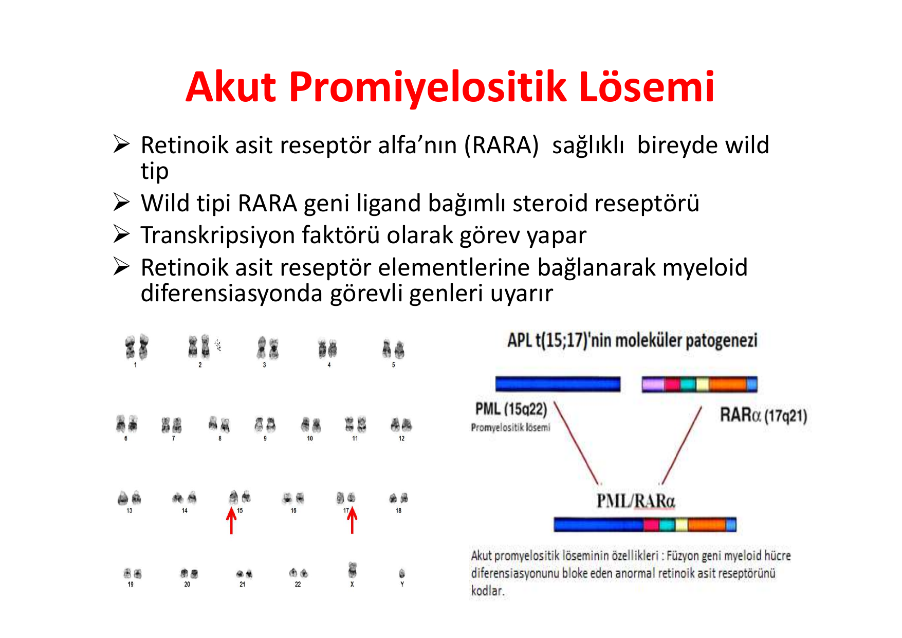

> 💡 **Sınav notu:** APL'de t(15;17) translokasyonu → PML-RARA füzyon geni, sınavların en klasik sorularından biridir. ATRA (all-trans retinoik asit) bu blokajı kaldırarak **diferansiasyonu yeniden başlatır** — bu yüzden "diferansiasyon tedavisi" olarak adlandırılır.

---

### Morfoloji

APL iki morfolojik varyanta sahiptir:

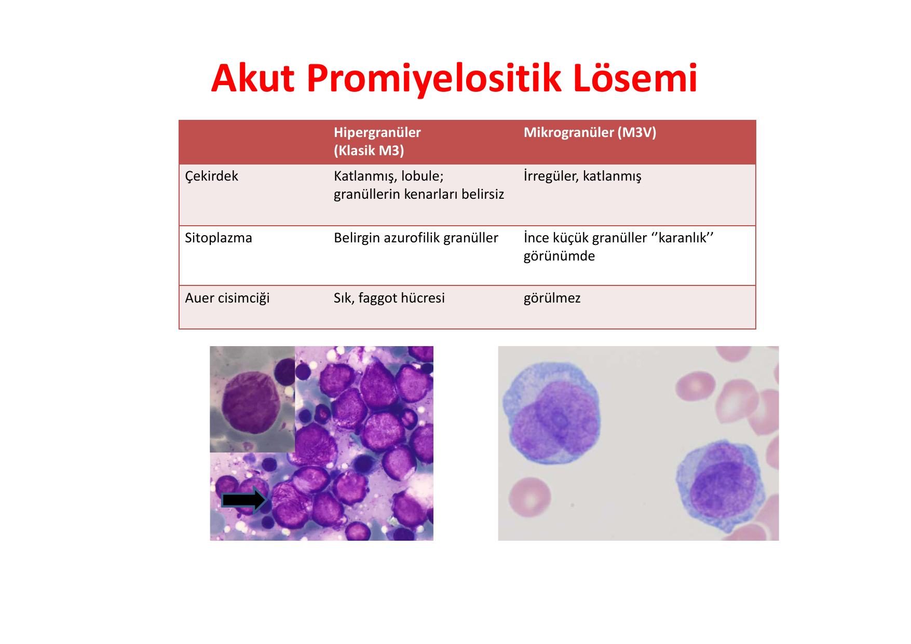

| Özellik | Hipergranüler (Klasik M3) | Mikrogranüler (M3V) |
|---|---|---|
| Çekirdek | Katlanmış, lobüle; granüller kenarları belirsizleştirir | İrregüler, katlanmış |
| Sitoplazma | **Belirgin azurofilik granüller** | İnce küçük granüller, "karanlık" görünüm |
| Auer cisimciği | **Sık**, faggot hücresi görülür | Görülmez |
| Lökosit | Genellikle normal veya düşük | Genellikle **yüksek** |

**⚠️ ÖNEMLİ — APL ve DIC:**

APL, **yaygın damar içi pıhtılaşma (DIC)** ile güçlü bir şekilde ilişkilidir. Promiyelositik granüllerden salınan prokoagülan maddeler DIC'i tetikler. Bu durum **hayatı tehdit eden kanama** ile sonuçlanabilir ve APL'yi hematolojik bir **ACİL** yapar.

> 💡 **Sınav notu:** Genç bir hastada **pansitopeni + DIC bulguları** (fibrinojen ↓, D-dimer ↑, PT/aPTT uzamış) → **APL düşün** → ATRA tedavisine hemen başla, sitogenetik sonucunu bekleme!

---

### APL Tedavisi

```
     APL Şüphesi (pansitopeni + DIC)
                ↓
     ⚠️ ATRA DERHAL BAŞLA
     (tanı doğrulanmadan!)
                ↓
     Tanı doğrulandı: t(15;17)+
                ↓
         Lökosit sayısı?
     ┌──────────┴──────────┐
     ↓                     ↓
  ≤10.000/μL           >10.000/μL
  (Düşük risk)         (Yüksek risk)
     ↓                     ↓
  ATRA + ATO           ATRA + ATO +
  (kemoterapisiz         İdarubisin
   kür mümkün!)             
     ↓                     ↓
     └──────────┬──────────┘
                ↓
     Konsolidasyon & İdame
     (ATRA + MTX + 6-MP)
                ↓
     3 ayda bir t(15;17) PCR takibi
     (%85+ uzun süreli remisyon)
```

* **Düşük riskli** (lökosit ≤10.000/μL): **ATRA + Arsenik trioksit (ATO)** → Tercih edilen tedavi
* ATO temin edilemeyen/kontrendike durumlarda: **ATRA + İdarubisin**
* **Konsolidasyon ve idame tedavisi:** ATRA, metotreksat, merkaptopürin
* Remisyonda ise **3 ayda bir t(15;17) takibi** (PML-RARA PCR)
* Hastaların **%85**'inde uzun süreli remisyon sağlanır

**⚠️ Diferansiasyon Sendromu (Retinoik Asit Sendromu):**

> 💡 **Analoji — Darboğaz:** ATRA ile kilitli kapı açıldığında, tüm promiyelositler aynı anda olgunlaşmaya çalışır — bu bir **darboğaz** yaratır. Hücreler diferansiye olurken sitokin fırtınası kopar → kapiller sızıntı, efüzyon, organ hasarı.

ATRA veya ATO tedavisi sırasında ortaya çıkabilen ciddi bir komplikasyondur. Promiyelositlerin hızlı diferansiasyonu sonucu gelişir:

* Dispne, ateş, periferik ödem
* **Hipotansiyon**, kilo alımı
* Pleuro-perikardiyal efüzyon
* Akut böbrek yetmezliği
* Kas-iskelet ağrısı
* Hiperbilirubinemi
* **Tedavi:** Yüksek doz **deksametazon** (10 mg IV, 12 saatte bir)

> 💡 **Sınav notu:** ATRA tedavisi altında ani **ateş, dispne, hipotansiyon, efüzyon** gelişen hasta → **Diferansiasyon sendromu** → Tedavisi **deksametazon**. APL tedavisinin en önemli komplikasyonudur.

---

## AKUT LENFOBLASTİK LÖSEMİ (ALL)

### Tanım ve Epidemiyoloji

Kemik iliği ve periferik kanda öncelikli olmak üzere **lenfoid seride progenitör hücrelerin klonal malign hastalığıdır**.

* Lösemilerin **%12**'sini oluşturur
* **Çocuklarda** akut lösemilerin **%65**'i, **erişkinlerde %20**'si ALL'dir
* İnsidans: **1.5-2/100.000**
* İnsidans pik: **1-4 yaşta 7.7/100.000**
* Ortanca yaş: **13** (bimodal dağılım: **2-4 yaş** ve **60 yaş üzeri** pik yapar)
* E/K: **1.4/1**
* Konvansiyonel sitogenetik tetkikler ile hastaların **%70-75**'inde anormal klon bulunur

> 💡 **Sınav notu:** ALL **çocukluk çağının en sık malignitesidir** ve en sık **2-5 yaş arası** görülür. Erişkinde ise en sık AML görülür. Bu ayrım sınavların vazgeçilmez sorularındandır.

---

### Risk Faktörleri

**Genetik sendromlar:**
* **Down sendromu** — ALL riski ~20 kat artmış (ayrıca AML-M7 riski de artar)
* **Nijmegen Breakage sendromu** — Otozomal dominant, immünyetmezlik, büyümede duraklama, mikrosefali
* **Bloom sendromu** — Otozomal resesif, immünyetmezlik, genomik instabilite
* **Ataksi-telanjiektazi** — Otozomal resesif, immünyetmezlik, serebellar ataksi, okulokutanöz telanjiektazi

**Çevresel faktörler:**
* İntrauterin radyasyon maruziyeti
* Nükleer kaza
* Düşük iyonize radyasyonlu alanlar
* Pestisit, sigara, gebelikte alkol, nitrat
* Yüksek kilolu doğan bebekler
* Virüsler: **HTLV-I** (Erişkin T hücreli lösemi/lenfoma — ATL ile ilişkili)

**Genetik faktörler:**
* Lösemiye özel genlerin varlığı: **MLL-AF4**, **ETV6-RUNX1** (TEL-AML1), hiperdiploidi veya klonotipik immünglobulin rearanjmanı
* Akkiz değişiklikler: **CDKN2A/CDKN2B** tümör süpresör lokus ve **BCR-ABL1** mutasyonu

> 💡 **Sınav notu:** Down sendromlu çocuklarda hem ALL hem AML riski artmıştır. ALL daha sıktır, ancak <3 yaşta **AML-M7 (megakaryoblastik)** riski belirgin artmıştır.

---

### ALL Sınıflandırması

ALL, WHO sınıflandırmasına göre **B-lenfoblastik** ve **T-lenfoblastik** lösemi/lenfoma olarak iki ana gruba ayrılır.

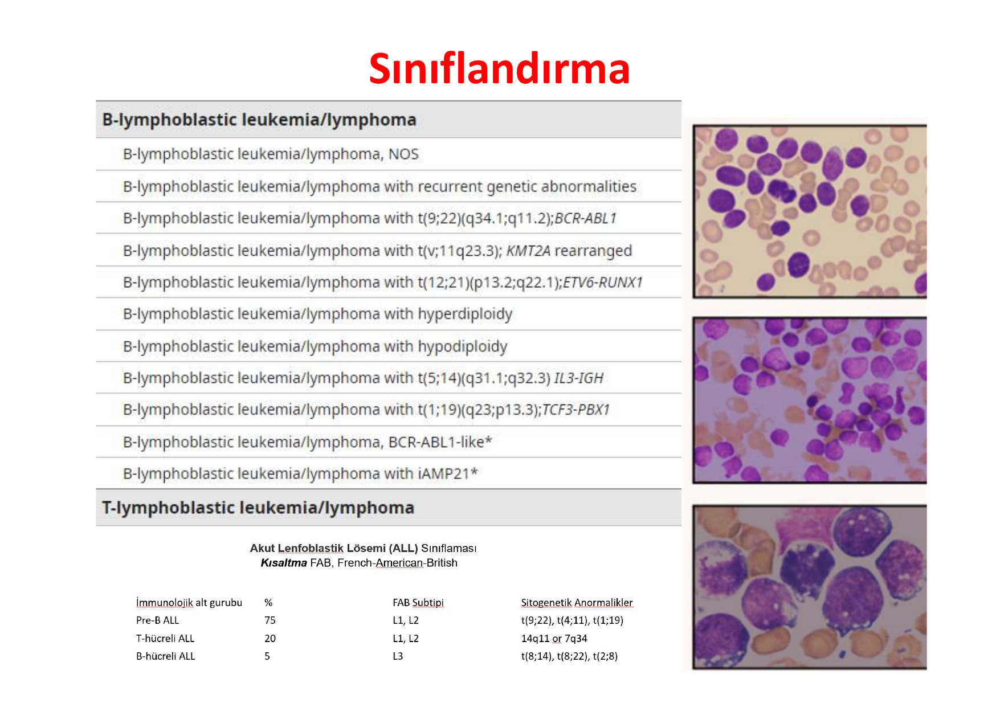

**B-Lenfoblastik Lösemi/Lenfoma alt tipleri:**
* B-ALL, NOS (not otherwise specified)
* t(9;22)(q34.1;q11.2) / **BCR-ABL1** → Philadelphia kromozomu pozitif (Ph+)
* t(v;11q23.3) / **KMT2A** rearanjmanı
* t(12;21)(p13.2;q22.1) / **ETV6-RUNX1** → Çocuklarda en sık, iyi prognoz
* **Hiperdiploidi** (>50 kromozom) → İyi prognoz
* **Hipodiploidi** → Kötü prognoz
* t(5;14)(q31.1;q32.3) / **IL3-IGH** → Eozinofili ile birlikte
* t(1;19)(q23;p13.3) / **TCF3-PBX1**
* BCR-ABL1-like (Ph-like) ALL
* iAMP21

**T-Lenfoblastik Lösemi/Lenfoma:**
* Erken Pre/Pro T-ALL
* Kortikal T-ALL (CD1a+)
* Matür T-ALL

**Akut Lenfoblastik Lösemi FAB sınıflaması:**

| İmmünolojik alt grup | Sıklık (%) | FAB Subtipi | Sitogenetik Anomaliler |
|---|---|---|---|
| **Pre-B ALL** | 75 | L1, L2 | t(9;22), t(4;11), t(1;19) |
| **T-hücreli ALL** | 20 | L1, L2 | 14q11 veya 7q34 |
| **B-hücreli ALL** | 5 | L3 | t(8;14), t(8;22), t(2;8) |

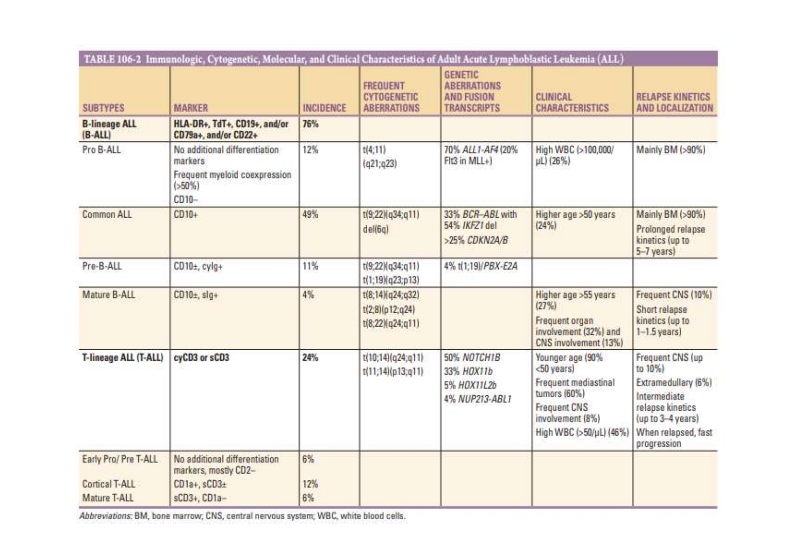

**⚠️ ALL'de Önemli Sitogenetik Anomaliler ve Prognostik Anlamları:**

| Anomali | Sıklık | Prognoz | Hatırlatma |
|---|---|---|---|
| **t(12;21) / ETV6-RUNX1** | Çocuklarda %25 | ⭐ En iyi prognoz | Çocukta en sık anomali |
| **Hiperdiploidi (>50 kr)** | %25 | ✅ İyi prognoz | >50 kromozom = iyi |
| **t(1;19) / TCF3-PBX1** | %6 | Orta | — |
| **t(9;22) / BCR-ABL1 (Ph+)** | Erişkinde %25-30 | ❌ Kötü prognoz (TKİ ile iyileşme) | Erişkinde en sık kötü |
| **t(4;11) / KMT2A-AF4** | İnfant ALL'de sık | ❌ Kötü prognoz | Bebeklerde düşün |
| **Hipodiploidi (<44 kr)** | %1-2 | ❌ En kötü prognoz | <44 kromozom = kötü |
| **t(8;14) / MYC** | B-ALL (L3) | Burkitt tip | MYC translokasyonu |

> 💡 **Sınav notu:**
> * **Philadelphia kromozomu (Ph+)** = t(9;22) = BCR-ABL1 → Erişkin ALL'de %25-30 oranında görülür ve kötü prognozludur. Tedaviye **tirozin kinaz inhibitörü (imatinib, dasatinib)** eklenmesi ile prognoz belirgin düzelmiştir.
> * **t(12;21)/ETV6-RUNX1** → Çocuklarda en sık görülen anomali ve **en iyi** prognozlu gruptur.
> * **t(8;14)** → Burkitt lösemi/lenfoma (L3) ile ilişkili, MYC translokasyonu.

---

### ALL'de Prognostik Faktörler

| Parametre | İyi Prognoz | Kötü Prognoz |
|---|---|---|
| **Yaş** | 1-10 yaş (çocuk) | <1 yaş (infant) veya >35 yaş |
| **Lökosit** | <30.000 (B-ALL), <100.000 (T-ALL) | >30.000 (B-ALL), >100.000 (T-ALL) |
| **İmmünfenotip** | Pre-B (CD10/CALLA+) | Pro-B, matür B, erken T |
| **Sitogenetik** | t(12;21), hiperdiploidi | t(9;22), t(4;11), hipodiploidi |
| **Steroid yanıtı** | 8. gün blast <1000/μL | 8. gün blast >1000/μL |
| **MRD (14. gün)** | Negatif | Pozitif |
| **SSS tutulumu** | Yok | Var |
| **Cinsiyet** | Kız | Erkek (testis relapsı) |

> 💡 **Hatırlatma:** "1-10 yaş, düşük lökosit, CD10+, hiperdiploidi veya t(12;21)" = **standart risk** ALL. Bunun dışı = **yüksek risk**.

---

### Klinik Bulgular

Semptomlar kemik iliği infiltrasyonu ve ekstrameduller tutulum ile ilişkilidir:

> 💡 **Analoji — Çocukların Hastalığı:** ALL'li çocuğu hatırlamak kolaydır: çocuk **kemik ağrısı** ile yürümek istemez (blast infiltrasyonu). Lenfoid sistem tutulduğu için **lenf bezleri şişer** (AML'den daha belirgin). Blastlar **kale duvarlarının arkasına** saklanır (SSS, testis — kan-beyin ve kan-testis bariyeri kemoterapiyi engeller).

**Kemik iliği yetmezliği belirtileri:**
* Halsizlik, iştahsızlık, gece terlemeleri
* Solukluk, nefes darlığı (anemi)
* Kemik ağrısı (özellikle çocuklarda belirgin — blast infiltrasyonu)
* Kanama bulguları (trombositopeni)

**Ekstrameduller tutulum:**
* **Sıklıkla:** Hepatomegali, splenomegali, lenfadenopati (AML'den daha belirgin)
* **Nadiren:** Testis, tonsil, adenoidler, meme, gastrointestinal sistem

**Özel klinik durumlar:**
* **Santral sinir sistemi (SSS) tutulumu** — Baş ağrısı, kusma, letarji, kranial sinir paralizisi (ALL'de AML'den daha sık)
* **Prekürsör T hücreli ALL'de mediastinal kitle** → **Vena kava süperior (VKS) sendromu** (yüzde ödem, boyun venöz dolgunluğu, dispne) ONKOLOJİK ACİL
* **Burkitt tipi lösemi/lenfomada** SSS tutulumu ve bulky lenfadenopati sık

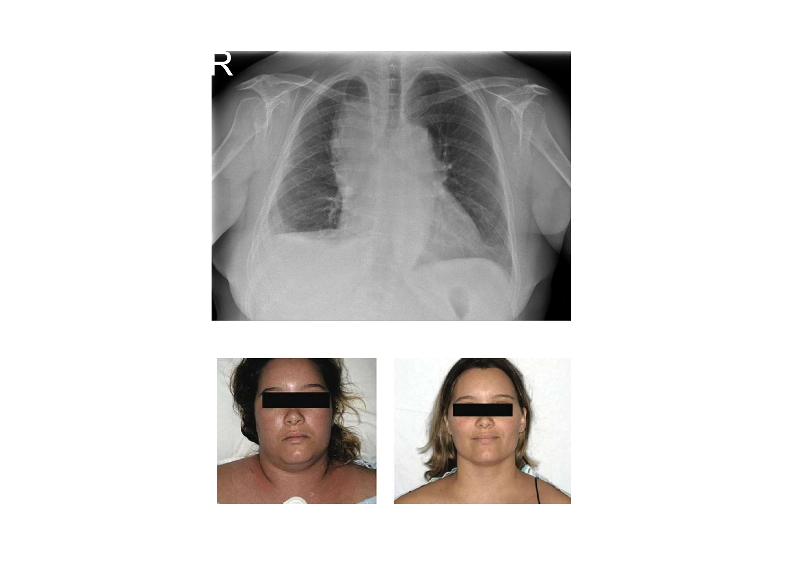

---

### Laboratuvar Bulguları

* Beyaz küre **genellikle yüksek** (ancak lökopeni de olabilir)
* Anemi sıklıkla eşlik eder → **%50'den fazla hastada Hb <10 g/dL**
* **Trombositopeni** — Ortanca 55.000-60.000/mm³
* Blastlar periferik kanda **%0-100** arasında değişir
* **Lökoeritroblastik kan tablosu** olabilir (normoblast + immatür granülositler)
* **Eozinofili** nadirdir; eğer varsa **t(5;14)** olabilir
* Tümör yüküne ve tümör lizisine bağlı olarak **LDH ↑, K ↑, P ↑** (fosfor) yüksek olabilir

> 💡 **Sınav notu:** Tümör lizis sendromu bulguları: **Ürik asit ↑, K ↑, fosfor ↑, kalsiyum ↓, LDH ↑, akut böbrek yetmezliği**. Özellikle yüksek tümör yüklü ALL ve Burkitt lenfomada tedavi başlandıktan sonra gelişir. Profilaksi: **hidrasyon + allopürinol/rasburikaz**.

---

### ALL Tedavisi

ALL tedavisi birden fazla faz içerir ve uzun sürelidir (2-3 yıl):

> 💡 **Analoji — Maraton:** ALL tedavisi **uzun bir maraton**dur (2-3 yıl), AML tedavisi ise kısa bir sprint. Fazlar: Prefaz (ısınma) → İndüksiyon (yarışın zor kısmı) → Konsolidasyon (tempo koruma) → İdame (bitiş çizgisine kadar koşmaya devam).

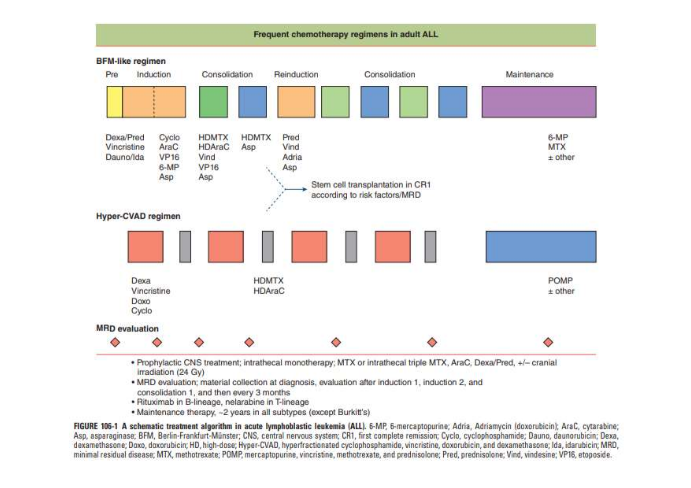

**Tedavi Algoritması:**

```
                   ALL Tanısı
                       ↓
               ┌───────┴───────┐
               ↓               ↓
           Ph(−) ALL       Ph(+) ALL
               ↓               ↓
                            KT + TKİ
                            (dasatinib
                             tercih edilir)
               ↓               
     ┌─────────┼─────────┐
     ↓         ↓         ↓
   Prefaz  İndüksiyon  Konsolidasyon
   (5-7gün) (4-6 hf)   (HD-MTX,
   Steroid  Dexa+VCR    HD-Ara-C)
            +DNR+Asp        ↓
                       Reindüksiyon
                            ↓
                     İdame (~2 yıl)
                     6-MP + MTX
                            ↓
                   SSS Profilaksisi
                   (TÜM hastalara!)
                   İntratekal KT
```

**Tedavi fazları:**

**1. Preindüksiyon (prefaz):**
* Steroid (deksametazon/prednizolon) — 5-7 gün
* Destek tedavisi

**2. İndüksiyon (4-6 hafta):**
* Deksametazon/Prednizolon
* Vinkristin
* Daunorubisin/İdarubisin
* Asparaginaz
* ± Siklofosfamid

**3. Konsolidasyon/İntensifikasyon:**
* Yüksek doz metotreksat (HDMTX)
* Yüksek doz sitarabin (HDAra-C)
* VP-16, 6-merkaptopürin

**4. Reindüksiyon:**
* İndüksiyon benzeri rejimin tekrarı

**5. İdame tedavisi (~2 yıl):**
* 6-merkaptopürin (6-MP) günlük
* Metotreksat (MTX) haftalık
* ± Diğer ajanlar

**6. SSS profilaksisi (TÜM hastalara):**
* İntratekal kemoterapi (MTX veya üçlü: MTX + Ara-C + deksametazon)
* ± Kranial radyoterapi (seçilmiş vakalarda)

> 💡 **Analoji — Kale Duvarları:** SSS ve testis, **kan-beyin bariyeri** ve **kan-testis bariyeri** ile korunan "kale" bölgeleridir — kemoterapi zor ulaşır. Bu yüzden ALL'de mutlaka intratekal profilaksi yapılır. Testis ise relaps alanı olarak izlenir. Bu bölgelere "sanctuary site" (sığınak) denir.

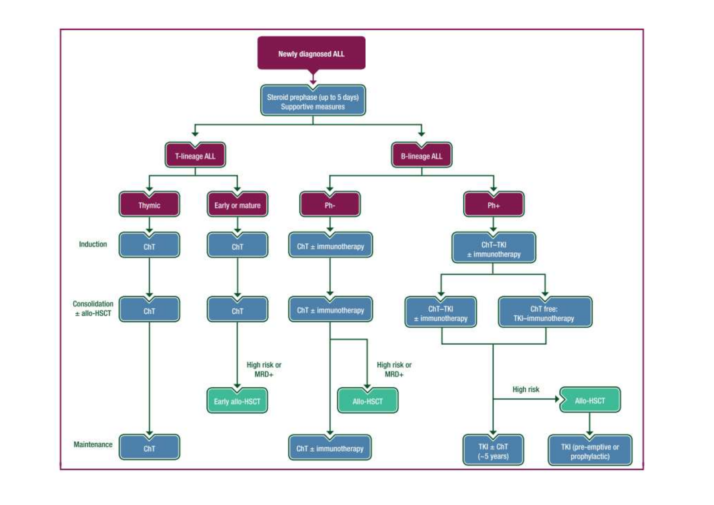

**Hedefe yönelik tedaviler:**

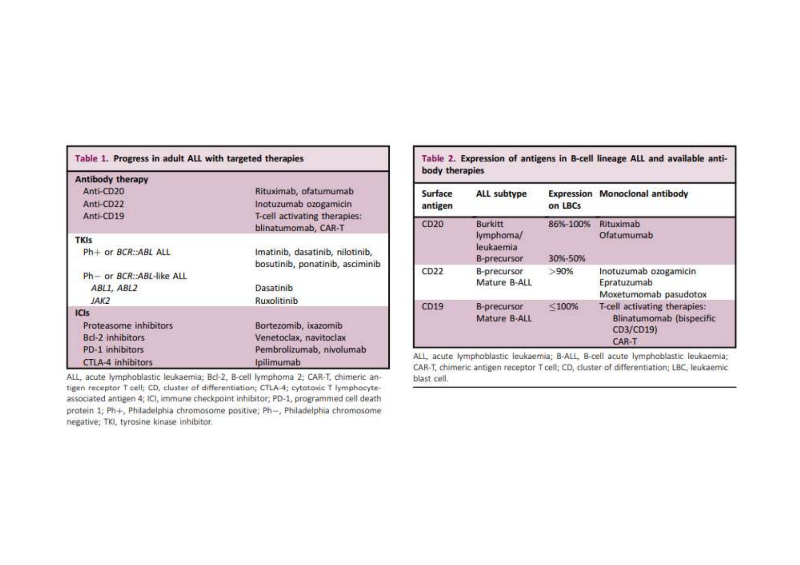

| Hedef | İlaç | Mekanizma | Endikasyon |
|---|---|---|---|
| **BCR-ABL1 (Ph+)** | İmatinib, dasatinib, ponatinib | Tirozin kinaz inhibitörü | Ph+ ALL |
| **CD20** | Rituksimab, ofatumumab | Anti-CD20 monoklonal antikor | CD20+ B-ALL |
| **CD22** | İnotuzumab ozogamisin | Antikor-ilaç konjugatı (ADC) | R/R B-ALL |
| **CD19** | Blinatumumab (BiTE) | Bispecific T-cell engager | R/R B-ALL |
| **CD19** | CAR-T hücre tedavisi | Genetik modifiye T hücreleri | R/R B-ALL |
| **JAK2** | Ruksolitinib | JAK2 inhibitörü | JAK2 mutant ALL |

> 💡 **Analoji — Çöpçatan ve Özel Kuvvetler:**
> * **Blinatumumab** bir **çöpçatan** gibidir: bir eliyle blast üzerindeki CD19'u, diğer eliyle T hücrenin CD3'ünü tutar ve ikisini tanıştırır → T hücre blastı öldürür.
> * **CAR-T** ise **özel kuvvetler**dir: hastanın kendi T hücreleri laboratuvarda silahlandırılır (CD19'a yönlendirilir) ve geri verilir → blastları hedefli olarak yok eder.
> * **İnotuzumab** bir **truva atı**dır: Antikor CD22'ye bağlanır, hücre içine alınır, taşıdığı toksini (kalikeamisin) salar → hücre ölür.

> 💡 **Sınav notu:**
> * **Ph+ ALL** tedavisine mutlaka **tirozin kinaz inhibitörü** (dasatinib tercih edilir — SSS geçişi imatinibden daha iyi) eklenir.
> * **Blinatumumab** — Bispecific T-cell engager (BiTE): CD19 (blast üzerinde) ve CD3 (T hücre üzerinde) arasında köprü kurarak T hücre aracılı blast öldürmesini sağlar.
> * **CAR-T hücre tedavisi** — Hastanın kendi T hücreleri genetik olarak modifiye edilerek CD19'a yönlendirilir. R/R B-ALL'de devrim niteliğinde yanıtlar elde edilmiştir.
> * ALL'de idame tedavisi **~2 yıl** sürer (Burkitt tipi hariç). AML'de ise idame tedavisi genellikle **yoktur**.

---

## AML vs ALL KARŞILAŞTIRMASI

Bu tablo, sınavlarda en çok sorulan ayrımları tek yerde toplar:

| Özellik | AML | ALL |
|---|---|---|
| **Sık görüldüğü yaş** | İleri yaş (medyan 67) | Çocukluk çağı (pik 2-4 yaş) |
| **Auer cisimciği** | ✅ Var (patognomonik) | ❌ Yok |
| **MPO boyama** | ✅ Pozitif (≥%3) | ❌ Negatif |
| **TdT** | ❌ Negatif (genellikle) | ✅ Pozitif |
| **Sudan Black B** | ✅ Pozitif | ❌ Negatif |
| **PAS boyama** | ❌ Negatif | ✅ Kaba granüler pozitif |
| **Lenfadenopati** | Nadir | **Sık ve belirgin** |
| **Hepatosplenomegali** | Daha az belirgin | **Daha belirgin** |
| **SSS tutulumu** | Nadir | **Daha sık** |
| **Kemik ağrısı** | Daha az | **Daha belirgin (çocuklarda)** |
| **Dişeti hiperplazisi** | **M4/M5'te sık** | Nadir |
| **DIC** | **M3 (APL)** | Nadir |
| **Mediastinal kitle** | Nadir | **T-ALL'de sık** |
| **Testis tutulumu** | Nadir | **ALL'de sık (relaps alanı)** |
| **Cilt infiltrasyonu** | **M5'te sık** | Nadir |
| **İndüksiyon tedavisi** | "7+3" (sitarabin + antrasiklin) | Steroid + VCR + DNR + Asp |
| **İdame tedavisi** | Genellikle yok | **~2 yıl** (6-MP + MTX) |
| **SSS profilaksisi** | Rutin değil | **Tüm hastalara** |
| **En sık ölüm nedeni** | Enfeksiyon | Enfeksiyon |

> 💡 **Sınav ipucu — Hızlı ayrım:**
> * **TdT(+)** = ALL (lenfoid belirteç)
> * **Auer cisimciği** = AML (asla ALL'de yok)
> * **MPO(+)** = AML (myeloid belirteç)
> * **PAS kaba granüler(+)** = ALL

---

## MİKST FENOTİPİK AKUT LÖSEMİ (MPAL)

MPAL, hem myeloid hem lenfoid seri özelliklerini taşıyan nadir bir akut lösemi alt tipidir. Blastlar tek hücrede birden fazla soy belirteçlerini eksprese eder veya iki ayrı blast popülasyonu mevcuttur.

> 💡 **Analoji — İki Üniforma:** MPAL, hem myeloid hem lenfoid **iki ayrı üniformayı** aynı anda giyen bir hücre gibidir — hangi takıma ait olduğu belli değildir. Tedavi genellikle ALL rejimi ile yapılır çünkü "iki tarafı da kapsayan" daha geniş bir strateji gerekir.

### MPAL Soy Atama Kriterleri

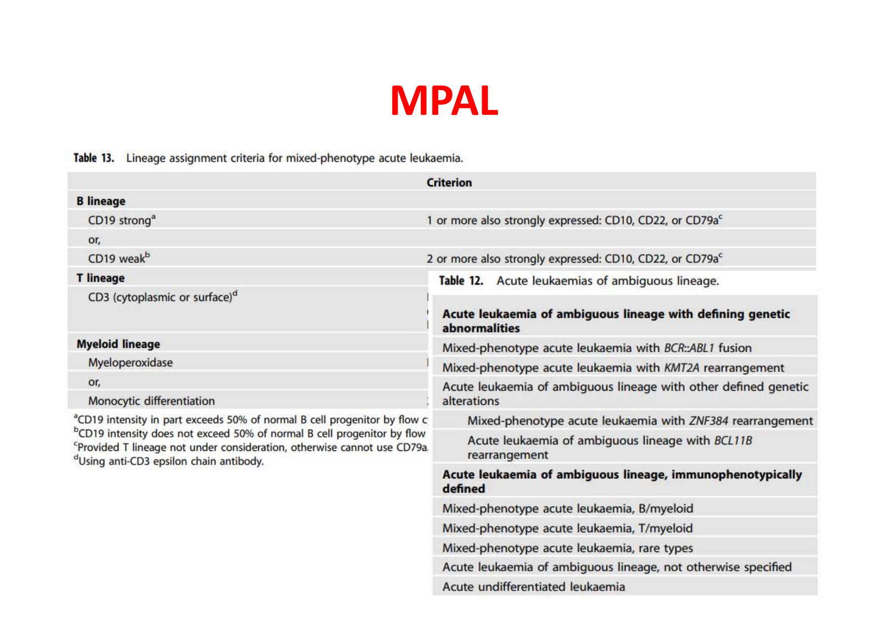

**B-lenfoid soy atama:**
* **CD19 güçlü** + ≥1 diğer B belirteci (CD10, CD22, CD79a)
* Veya **CD19 zayıf** + ≥2 diğer B belirteci

**T-lenfoid soy atama:**
* **CD3** (sitoplazmik veya yüzey) ekspresyonu

**Myeloid soy atama:**
* **Miyeloperoksidaz (MPO)** pozitifliği
* VEYA monositik diferansiasyon (≥2 monositik belirteç: CD11c, CD14, CD36, CD64, lizozim)

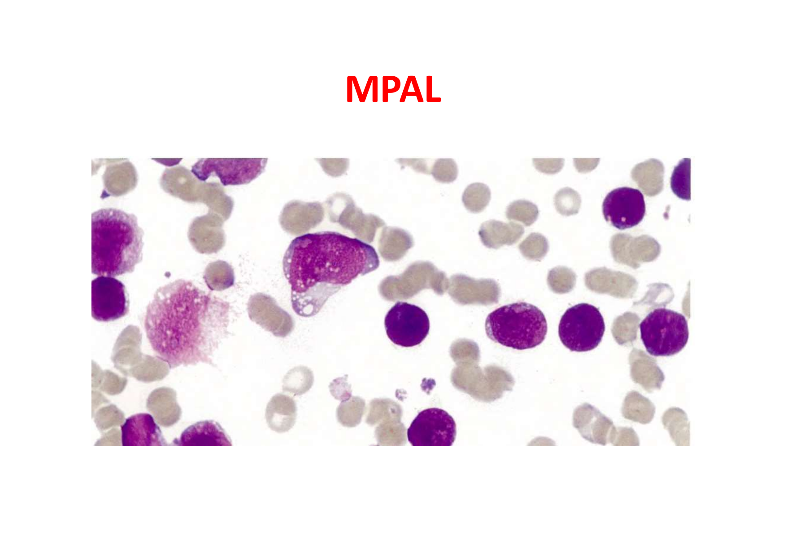

### EGIL Skorlama Sistemi

Avrupa İmmünolojik Lösemi Grubu (EGIL) skorlama sistemi, her soy için belirteçlere puan vererek soy ataması yapar:

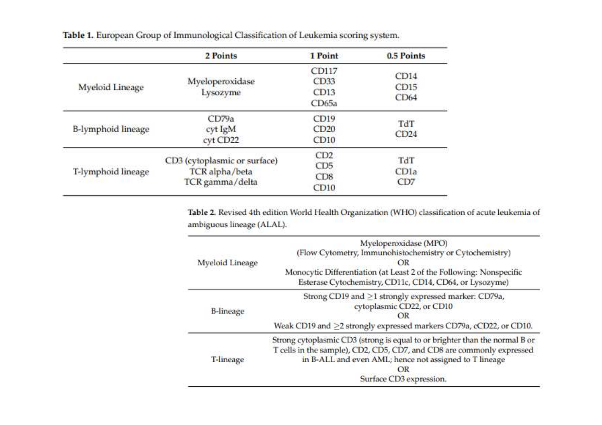

| Soy | 2 Puan | 1 Puan | 0.5 Puan |
|---|---|---|---|
| **Myeloid** | MPO, Lizozim | CD117, CD33, CD13, CD65a | CD14, CD15, CD64 |
| **B-lenfoid** | CD79a, cyt IgM, cyt CD22 | CD19, CD20, CD10 | TdT, CD24 |
| **T-lenfoid** | CD3 (cyt/yüzey), TCR α/β, TCR γ/δ | CD2, CD5, CD8, CD10 | TdT, CD1a, CD7 |

> 💡 **Sınav notu:** MPAL tanısı için bir blastın **aynı anda ≥2 puan** iki farklı soydan alması gerekir. Pratikte MPAL nadir görülür ancak prognozu daha kötüdür.

### MPAL Klinik Özellikleri ve Tedavi

* Klinik ve laboratuvar bulguları **AML ve ALL ile benzer**
* **Prognozu daha kötüdür** (her iki soy özelliği taşıması nedeniyle tedaviye dirençli)
* Baskın olan alt tipine göre (genetik mutasyonlar) tedavi planı yapılır
* **Sıklıkla ALL tipi tedaviler önerilir** (ALL rejimleri genellikle daha geniş spektrumludur)

---

## HEMATOLOJİK ACİL DURUMLAR

Akut lösemilerde tanı anında veya tedavi sırasında ortaya çıkabilen acil durumlar:

### 1. Lökostaz (Hiperlökositoz)

> 💡 **Analoji — Trafik Sıkışıklığı:** Lökostaz, kan damarlarında çok fazla blast hücrenin **trafik sıkışıklığı** yaratmasıdır — damarları tıkar, doku perfüzyonu bozulur.

* **Tanım:** BK >100.000/μL (genellikle blast hakimiyetinde)
* **Patofizyoloji:** Blast hücrelerin damar duvarına yapışması ve mikrosirkülasyonu tıkaması
* **En sık:** AML'de (özellikle monositik tipler), T-ALL'de
* **Bulgular:**
  - **Pulmoner:** Dispne, hipoksi, diffüz infiltratlar
  - **Nörolojik:** Baş ağrısı, konfüzyon, görme bozukluğu, çift görme, strok benzeri tablo
  - **Diğer:** Retinal kanama, priapizm, AMI
* **Tedavi:**
  - **Lökaferez** (acil blast sayısını düşürmek)
  - Acil kemoterapi başlangıcı
  - Hidrasyon + TLS profilaksisi

**⚠️ ÖNEMLİ:** Lökostazda eritrosit transfüzyonu **dikkatli** yapılmalı — viskoziteyi daha da artırabilir!

---

### 2. DIC (Yaygın Damar İçi Pıhtılaşma) — APL

> 💡 **Analoji — Hem Sel Hem Kuraklık:** DIC'de pıhtılaşma sistemi **hem aşırı çalışır hem çöker** — aynı anda hem yaygın pıhtı oluşur (mikrotrombi) hem de pıhtılaşma faktörleri tükenerek kanama gelişir.

* **En sık neden:** APL (M3)
* **Mekanizma:** Promiyelositik granüllerden salınan doku faktörü ve prokoagülan maddeler
* **Laboratuvar:** Fibrinojen ↓, D-dimer ↑, PT/aPTT uzamış, trombositopeni, şistositler
* **Tedavi:**
  - **ATRA derhal başla** (tanı doğrulanmadan!)
  - Fibrinojen replasmanı (kriyopresipitat — hedef >150 mg/dL)
  - Trombosit transfüzyonu (hedef >30.000-50.000)
  - Taze donmuş plazma (TDP)

---

### 3. Tümör Lizis Sendromu (TLS)

> 💡 **Analoji — Baraj Yıkımı:** Kemoterapi bir baraj yıkımı gibidir — blast hücrelerin içindekiler (potasyum, fosfor, ürik asit, nükleik asitler) kana dökülür ve böbrekleri boğar.

* **Risk faktörleri:** Yüksek tümör yükü (BK >100.000), Burkitt lenfoma/lösemi, ALL
* **Laboratuvar (CAIRO-BISHOP kriterleri):**
  - **Ürik asit ↑** (nükleik asit yıkımı)
  - **Potasyum ↑** (hücre içi K dökülmesi → aritmi!)
  - **Fosfor ↑** (hücre içi P dökülmesi)
  - **Kalsiyum ↓** (fosfat ile bağlanarak çöker)
  - **LDH ↑** (hücre yıkımı göstergesi)
  - Akut böbrek yetmezliği (ürik asit kristalleri tubulleri tıkar)
* **Profilaksi (tedaviden ÖNCE başla):**
  - Agresif IV hidrasyon (2.5-3 L/m²/gün)
  - **Allopürinol** (ürik asit üretimini azaltır) veya **rasburikaz** (ürik asidi doğrudan parçalar — yüksek riskli hastalarda tercih)
  - K ve P kısıtlaması
  - Laboratuvar takibi (her 6-8 saatte bir)
* **Tedavi:** Elektrolit düzeltme, hidrasyon, gerekirse diyaliz

---

### 4. VKS Sendromu (Vena Kava Süperior)

> 💡 **Analoji — Mengene:** Mediastinal kitle vena kava süperioru **mengene gibi sıkıştırır** — baş ve boyundan venöz dönüş engellenir.

* **En sık neden (akut lösemide):** T-ALL'de mediastinal kitle
* **Bulgular:** Yüzde ödem, boyun venöz dolgunluğu, dispne, öksürük, baş ağrısı, üst ekstremite ödemi
* **Tedavi:** Acil kemoterapi ve/veya steroid ± radyoterapi

---

### Acil Durumlar Özet Tablosu

| Acil Durum | En Sık İlişkili | Anahtar Bulgu | Acil Tedavi |
|---|---|---|---|
| **Lökostaz** | AML (monositik), T-ALL | BK >100.000, dispne, nörolojik | Lökaferez + KT |
| **DIC** | APL (M3) | Fibrinojen ↓, kanama | ATRA + fibrinojen |
| **TLS** | ALL, Burkitt | K ↑, P ↑, ürik asit ↑, Ca ↓ | Hidrasyon + rasburikaz |
| **VKS sendromu** | T-ALL | Yüz ödemi, venöz dolgunluk | Steroid + KT ± RT |

---

## DESTEK TEDAVİSİ VE KOMPLİKASYONLAR

Akut lösemi tedavisinde **destek tedavisi**, kemoterapinin başarısı kadar önemlidir.

### Transfüzyon Desteği

* **Eritrosit transfüzyonu:** Hb <7-8 g/dL veya semptomatik anemi
* **Trombosit transfüzyonu:** Trombosit <10.000 (profilaktik) veya <20.000 (ateşli hastada) veya <50.000 (aktif kanama)
* **Lökostazda eritrosit dikkatli!** (viskozite artışı riski)
* **APL'de trombosit hedefi daha yüksek:** >30.000-50.000 (DIC nedeniyle)

### Enfeksiyon Yönetimi

* **Febril nötropeni** (ANC <500 + ateş ≥38.3°C) → Geniş spektrumlu antibiyotik DERHAL başla (piperasilin-tazobaktam veya meropenem)
* **Antifungal profilaksi:** Flukonazol veya posakonazol (uzamış nötropeni döneminde)
* **Antiviral profilaksi:** Asiklovir (HSV/VZV reaktivasyonu önlemi)
* **Pneumocystis profilaksisi:** TMP-SMX (özellikle ALL tedavisinde)

### TLS Profilaksisi

* Tedaviden ÖNCE başla
* Hidrasyon + allopürinol (düşük-orta risk) veya rasburikaz (yüksek risk)
* Laboratuvar takibi her 6-8 saatte bir

### Tedavi Komplikasyonlarının Özeti

| Komplikasyon | Ne Zaman? | İlişkili Durum | Yönetim |
|---|---|---|---|
| **Febril nötropeni** | İndüksiyon sırasında | Tüm akut lösemiler | Geniş spektrum AB |
| **TLS** | Tedavi başlangıcında | Yüksek tümör yükü | Hidrasyon + rasburikaz |
| **Diferansiasyon sendromu** | ATRA/ATO tedavisi | APL | Deksametazon |
| **Mukozit** | Kemoterapi sonrası | Tüm | Ağız bakımı, analjezi |
| **Kardiyotoksisite** | Antrasiklin kullanımı | AML, ALL | Kümülatif doz takibi |
| **Nörotoksisite** | Vinkristin, İT KT | ALL | Doz ayarlama |

---

## VAKA ÖRNEKLERİ

**📋 VAKA ÖRNEĞİ 1: Erişkin AML**

**Hasta:** 62 yaşında erkek
**Öykü:** 3 haftadır artan yorgunluk, 1 haftadır dişeti kanaması ve kolay morarma. Ateş (38.5°C) son 3 gündür.
**Fizik Muayene:** Solukluk, dişetlerinde hiperplazi ve kanama, bilateral alt ekstremitelerde peteşiler. Nabız 98/dk, TA 110/70 mmHg, SpO₂ %96
**Laboratuvar:** Hb 7.2 g/dL, BK 45.000/μL, Plt 18.000/μL. Periferik yaymada **%60 blast, Auer cisimcikleri** görülüyor.
**Kemik iliği:** %72 blast (MPO+, CD13+, CD33+, CD117+, TdT−)
**Moleküler:** NPM1 mutant, FLT3 wild-type
**Tanı:** AML (NPM1 mutant, iyi risk grubu)
**Tedavi:** "7+3" indüksiyonu → CR sonrası HiDAC konsolidasyon

**Öğretici Notlar:**
1. Dişeti hiperplazisi → monositik AML düşündürür ama her AML'de olabilir
2. Auer cisimciği → AML tanısını kesinleştirir
3. NPM1 mutant + FLT3 wild-type → **iyi prognoz grubu** → Nakil gerekmez, HiDAC yeterli
4. TdT negatif → myeloid soy (lenfoid olsa TdT+ olurdu)

---

**📋 VAKA ÖRNEĞİ 2: APL — Hematolojik Acil**

**Hasta:** 28 yaşında kadın
**Öykü:** 1 haftadır burun kanaması, dişeti kanaması, ciltte yaygın morluklar. Bugün başlayan baş ağrısı.
**Fizik Muayene:** Yaygın ekimozlar, peteşiler, aktif epistaksis. Nabız 110/dk, TA 90/60 mmHg, SpO₂ %97
**Laboratuvar:** Hb 8.5 g/dL, BK 3.200/μL, Plt 22.000/μL. **Fibrinojen 85 mg/dL** (N: 200-400), **D-dimer >20.000**, PT 18 sn (N: <14).
**Periferik yayma:** Az sayıda hipergranüler promyelosit, **faggot hücreleri** görülüyor.
**Tanı:** APL (M3) — DIC ile birlikte
**Tedavi:** **ATRA derhal başlandı** (sitogenetik sonucu beklenmeden!) + Fibrinojen replasmanı + Trombosit transfüzyonu. t(15;17) pozitif geldi → ATRA + ATO kombinasyonuna devam.

**Öğretici Notlar:**
1. Genç hasta + pansitopeni + **DIC bulguları** → APL düşün!
2. Faggot hücresi = APL patognomonik bulgusu
3. **ATRA'yı sitogenetik beklenmeden başla** — DIC nedeniyle mortalite çok yüksek
4. Fibrinojen <150 mg/dL → kriyopresipitat ile yerine koy
5. APL, lösemiler arasında **en yüksek kür oranına** sahiptir (%85+)

---

**📋 VAKA ÖRNEĞİ 3: Çocukluk Çağı ALL**

**Hasta:** 4 yaşında erkek çocuk
**Öykü:** 2 haftadır yürümek istemiyor (kemik ağrısı), iştahsızlık, solukluk. 3 gündür ateş.
**Fizik Muayene:** Soluk, bilateral servikal ve aksiller lenfadenopati (+), hepatomegali (4 cm), splenomegali (3 cm). Nabız 120/dk, TA 90/55 mmHg
**Laboratuvar:** Hb 6.8 g/dL, BK 85.000/μL, Plt 35.000/μL. Periferik yaymada **%80 lenfoblast** (MPO negatif, Auer cisimciği yok)
**Flow sitometri:** CD19+, CD10+, TdT+, CD34+, MPO−, CD3−
**Sitogenetik:** t(12;21)/ETV6-RUNX1, hiperdiploidi (54 kromozom)
**Tanı:** Pre-B ALL (standart risk)
**Tedavi:** BFM protokolü (prefaz → indüksiyon → konsolidasyon → reindüksiyon → idame 2 yıl) + İntratekal SSS profilaksisi

**Öğretici Notlar:**
1. 4 yaşında çocuk + kemik ağrısı + LAP + HSM + blast → **ALL** klasik tablosu
2. CD19+, CD10+, TdT+ → **B-ALL** (pre-B)
3. MPO negatif, Auer yok → AML dışlanır
4. t(12;21) + hiperdiploidi → **En iyi prognoz grubu**
5. SSS profilaksisi **unutulmamalı** — tüm ALL hastalarına uygulanır
6. İdame tedavisi **~2 yıl** sürer (AML'de yok!)

---

**📋 VAKA ÖRNEĞİ 4: T-ALL ve Mediastinal Kitle**

**Hasta:** 17 yaşında erkek
**Öykü:** 2 haftadır artan öksürük, nefes darlığı, yüzde şişlik. Boyun damarlarında dolgunluk fark etmiş.
**Fizik Muayene:** Yüzde ve boyunda ödem, boyun venlerinde belirgin dolgunluk, üst ekstremitelerde hafif ödem, bilateral supraklaviküler LAP. SpO₂ %92
**PA Akciğer:** Geniş mediastinal kitle
**Laboratuvar:** BK 120.000/μL, Plt 45.000/μL. Periferik yaymada lenfoblastlar.
**Flow sitometri:** CD3+, CD7+, CD5+, TdT+, CD1a+, CD19−, MPO−
**Tanı:** T-ALL + VKS sendromu
**Tedavi:** Acil steroid başlandı (deksametazon) → Kemoterapi protokolü başlatıldı. TLS profilaksisi (hidrasyon + rasburikaz).

**Öğretici Notlar:**
1. Genç erkek + mediastinal kitle + VKS bulguları → **T-ALL** düşün
2. CD3+, CD7+, TdT+, CD1a+ → T-lenfoid soy (kortikal T-ALL)
3. BK >100.000 → **Lökostaz ve TLS riski** yüksek
4. VKS sendromu → Acil tedavi gerektirir (steroid etkili)
5. T-ALL'de prognoz B-ALL'den **daha kötüdür**

---

## ÖZET VE SINAV İÇİN ÖNEMLİ NOKTALAR

### Genel Özet

* Akut lösemiler **hızlı başlangıçlıdır** (semptomlar <3 ay)
* Sitopeni, lökostaz veya lösemik infiltrasyona bağlı semptomlar
* **Tedavi edilmezse ölümcüldür**
* Genellikle ileri yaş hastalıkları olup, **nükslerle seyreder**
* Tedavi hastanın yaşı, performans durumu, komorbiditesi, hastalığın genetik özellikleri ve ulaşılabilen tedaviye göre düzenlenir
* **Enfeksiyonlardan korunma ve kemoprofilaksi önemlidir**
* En sık ölüm sebepleri: **enfeksiyonlar** ve **hastalık nüksü**

---

### Sınavda En Çok Sorulan Konular

**1. Tanı kriterleri:**
* Kemik iliğinde blast ≥**%20** → Akut lösemi (WHO)
* **Auer cisimciği** → AML'ye patognomonik, ALL'de görülmez

**2. AML vs ALL ayrımı:**
* AML → erişkin, dişeti hiperplazisi (M4/M5), Auer cisimciği, MPO+, TdT−
* ALL → çocuk, lenfadenopati belirgin, SSS tutulumu sık, testis relapsı, TdT+, MPO−

**3. APL (M3):**
* **t(15;17) / PML-RARA**
* **DIC** ile birliktelik → Hematolojik acil
* Tedavi: **ATRA + ATO** (diferansiasyon tedavisi)
* Komplikasyon: **Diferansiasyon sendromu** → Deksametazon
* HLA-DR negatif, CD34 negatif (diğer AML'lerden farklı!)

**4. Sitogenetik — Prognoz ilişkisi:**
* İyi: t(8;21), inv(16), t(15;17), t(12;21), hiperdiploidi, NPM1 mutant
* Kötü: t(9;22)/Ph+, kompleks karyotip, -5/-7, FLT3-ITD, TP53 mutant, hipodiploidi

**5. Terapiyle ilişkili lösemi:**
* Alkilleyici ajan → 4-6 yıl, kr. 5/7 anomalisi
* Topoizomeraz II → 1-3 yıl, 11q23 anomalisi

**6. Hedefe yönelik tedaviler:**
* FLT3-ITD → Midostaurin/Gilteritinib
* Ph+ ALL → TKİ (dasatinib)
* CD19 → Blinatumumab, CAR-T
* CD22 → İnotuzumab ozogamisin
* APL → ATRA + ATO
* Yaşlı AML → Venetoklaks + azasitidin

**7. Acil durumlar:**
* **Lökostaz** (BK >100.000) → Lökaferez
* **Tümör lizis sendromu** → Hidrasyon, allopürinol/rasburikaz
* **DIC** (APL) → ATRA derhal başla
* **VKS sendromu** (T-ALL mediastinal kitle) → Acil tedavi

**8. ALL'de relaps alanları:**
* **SSS** ve **testis** → "Sanctuary site" (koruma alanları — kemoterapinin zor ulaştığı bölgeler)
* Bu nedenle SSS profilaksisi tüm ALL hastalarına yapılır

**9. İmmünfenotipleme özeti:**
* AML: CD13+, CD33+, CD117+, MPO+, HLA-DR+ (APL hariç)
* B-ALL: CD19+, CD10+, CD22+, CD79a+, TdT+
* T-ALL: CD3+, CD7+, CD5+, TdT+, CD1a+ (kortikal)

**10. MRD (Minimal Rezidüel Hastalık):**
* MRD negatifliği → daha iyi prognoz
* MRD pozitif kalması → relaps riski yüksek, nakil düşün

> **⚠️ Altın kurallar:**
> * Akut lösemi şüphesinde → Hemen **periferik yayma** ve **kemik iliği aspirasyonu**
> * Blast ≥%20 → Akut lösemi
> * **APL şüphesi varsa tanı doğrulanmadan ATRA başla** (DIC nedeniyle mortalite yüksek)
> * ALL tedavisinde **SSS profilaksisi** atlanmamalı
> * Tedavi öncesi **tümör lizis profilaksisi** unutulmamalı
> * **TdT(+) = ALL, Auer cisimciği = AML** — bu iki bulgu tek başına soy ayrımı yaptırır


 # SINAV SORULARI DİPNOT: TUS İÇİN