# DEMİR EKSİKLİĞİ ANEMİSİ VE MEGALOBLASTİK ANEMİ

**Hazırlayan:** Dr. A. Hilal Eroğlu Küçükdiler
**Bölüm:** Aydın Adnan Menderes Üniversitesi Tıp Fakültesi
**Dönem:** 2024-2025 Dönem IV (28.08.2024)
mail: e_hilal@hotmail.com

---

## İÇİNDEKİLER

1. [Anemi Tanımı ve Epidemiyoloji](#anemi-tanimi-ve-epidemiyoloji)
2. [Anemiye Yaklaşım](#anemiye-yaklasim)
3. [Demir Eksikliği Anemisi](#demir-eksikliği-anemisi)
4. [Megaloblastik Anemi](#megaloblastik-anemi)
5. [DEA vs Megaloblastik Anemi — Karşılaştırma](#dea-vs-megaloblastik-anemi--karşılaştırma)
6. [Klinik Vaka Örnekleri](#klinik-vaka-örnekleri)

---

# ANEMİ TANIMI VE EPİDEMİYOLOJİ

## Anemi Tanımı (DSÖ)

Anemi, periferik kandaki hemoglobin konsantrasyonunun yaş ve cinsiyete göre belirlenen eşik değerlerin altına düşmesidir. DSÖ'nün belirlediği eşik değerler sınavlarda sıkça sorulur:

| Grup | Hemoglobin Eşik Değeri |
|---|---|
| Erkekler | **<13 g/dL** |
| Kadınlar | **<12 g/dL** |
| Gebeler | **<11 g/dL** |

> Sınavlarda sorarım diyor; kurtarma sorusu. Bu üç değeri mutlaka bilin.

Kadınlarda eşik değerin daha düşük olmasının nedeni menstrüel kayıp ve daha düşük androjen düzeyine bağlı olarak eritropoezin daha az uyarılmasıdır. Gebelerde ise fizyolojik hemodilüsyon (plazma hacmi eritrosit kütlesinden daha fazla artar) nedeniyle eşik daha da düşüktür.

## Epidemiyoloji

Anemi dünya genelinde en yaygın hematolojik sorundur. DSÖ'ye göre prevalans:
* Okul öncesi çocuklarda **%42.6** (büyüme hızının yüksek olması nedeniyle demir ihtiyacı artar)
* Gebelerde **%38.2** (fetal gelişim için demir transferi + hemodilüsyon)
* Gebe olmayan kadınlarda **%29** (menstrüel kayıp)

Kadınlardaki prevalans erkeklerden yüksektir (K>E):
* Avrupa'da **%22.9**
* Türkiye'de **%24.3**

> Dünya genelinde aneminin **en sık sebebi: Demir Eksikliği**. Tüm anemilerin yaklaşık yarısından sorumludur.

---

## ANEMİYE YAKLAŞIM

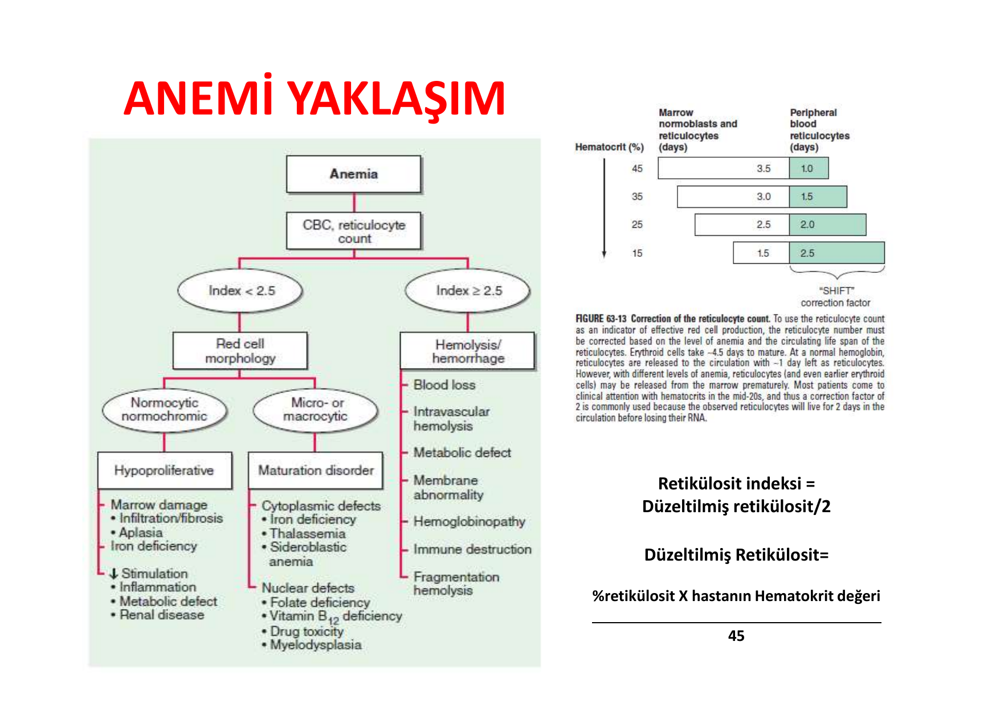

Anemi saptandığında ilk yapılacak şey **nedeni bulmaktır**. Bunun için temel yaklaşım iki adımdan oluşur:

**1. Adım:** CBC (tam kan sayımı) + retikülosit sayısı iste. CBC ile aneminin tipi (mikro/normo/makrositer) belirlenir; retikülosit sayısı ise kemik iliğinin anemiye yeterince yanıt verip vermediğini gösterir.

**2. Adım:** Retikülosit indeksini hesapla — bu indeks aneminin **üretim bozukluğuna mı** yoksa **yıkım/kayba mı** bağlı olduğunu ayırt ettirir.

### Retikülosit İndeksi

Retikülosit sayısı tek başına yanıltıcı olabilir çünkü anemi varlığında yüzdesel olarak yüksek görünse de gerçek üretimi yansıtmayabilir. Bu yüzden iki düzeltme yapılır:

> **Düzeltilmiş Retikülosit** = %Retikülosit x (Hastanın Hct / 45)

Bu formül anemi derecesine göre düzeltme yapar (45 = normal hematokrit değeri).

> **Retikülosit İndeksi** = Düzeltilmiş Retikülosit / 2

İkiye bölme nedeni: Ağır anemide kemik iliği retikülositleri erken salıverir ve bu hücreler dolaşımda normalden uzun süre (2 gün) kalır — "shift retikülositleri" denir. Bu yüzden 2'ye bölerek gerçek üretim hızını elde ederiz.


```
  Retikülosit İndeksi
         │
    ┌────┴────┐
    ↓         ↓
  <2.5       ≥2.5
    │         │
  Üretim ↓   Yıkım ↑ veya
    │       Kanama
    ↓         ↓
  Eritrosit   Hemoliz?
  morfolojisi Hemoraji?
    │
  ┌─┴──────────┐
  ↓             ↓
Normositer    Mikro/Makrositer
Normokrom
  │             │
Hipoproliferatif  Matürasyon
  │             bozukluğu
  ↓             ↓
Kİ hasarı     SİTOPLAZMİK:
İnflamasyon   DEA, Talasemi,
Metabolik     Sideroblastik
Renal hast.   NÜKLEER:
              Folat eks., B12 eks.
              İlaç toksisitesi, MDS
```

> Bu index yüksekse (**≥2.5**) kemik iliği aktif olarak eritrosit üretiyor demektir → **akut kan kaybı veya hemoliz** düşün. Düşükse (**<2.5**) kemik iliği yeterince yanıt veremiyor → **üretim bozukluğu** düşün ve eritrosit morfolojisine bak.

---

# DEMİR EKSİKLİĞİ ANEMİSİ

---

## NORMAL DEMİR METABOLİZMASI

DEA'yı anlamak için önce normal demir metabolizmasını bilmek gerekir. Demir vücutta kapalı bir döngüde kullanılır: emilim çok sınırlıdır, atılım mekanizması yoktur ve demirin büyük kısmı geri dönüşümle yeniden kullanılır.

### Demir Homeostazı

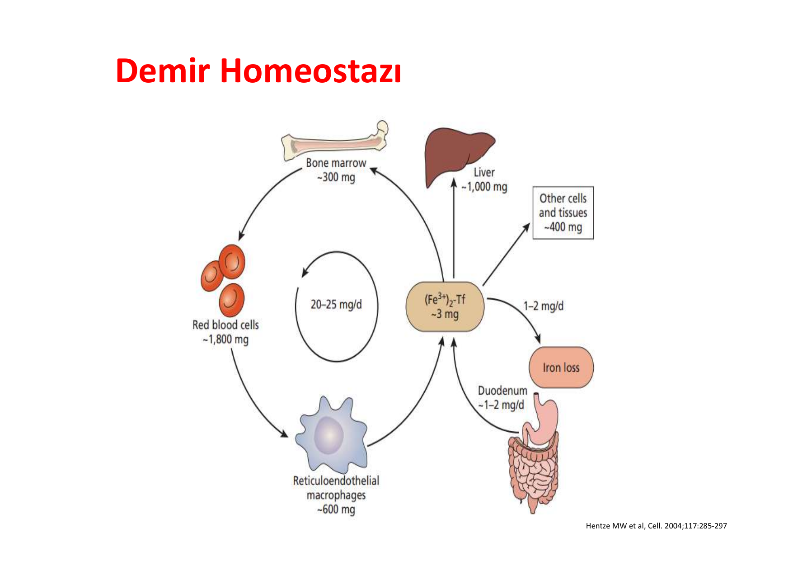

Vücuttaki demir dağılımı (toplam ~4000-4500 mg):
* **Eritrositlerde:** ~1800 mg (en büyük havuz)
* **Karaciğerde:** ~1000 mg (depo)
* **RES makrofajlarında:** ~600 mg (geri dönüşüm)
* **Kemik iliğinde:** ~300 mg
* **Diğer hücre ve dokular:** ~400 mg
* **Transferrine bağlı (plazmada):** ~3 mg

Günlük demir döngüsü:
* Eritropoez için gereksinim: **20-25 mg/gün** (büyük kısmı geri dönüşümden)
* Duodenumdan emilim: **1-2 mg/gün**
* Kayıp: **1-2 mg/gün** (deri, GIS mukoza dökülmesi, idrar — aktif atılım mekanizması yok!)

Dikkat edin: Günlük eritropoez 20-25 mg demir gerektirirken bağırsaktan sadece 1-2 mg emilir. Demek ki demirin büyük çoğunluğu (**~95%'i**) yaşlı eritrositlerin RES makrofajlarında yıkılmasıyla geri kazanılır. Bu yüzden RES sistemi ve geri dönüşüm mekanizması demir homeostazında kritik rol oynar.

### Demir Emilimi

> **DEMİR EKSİKLİĞİ BİR HASTALIK DEĞİL; BİR HASTALIĞIN SONUCUDUR**

Demir emilimi **duodenumda** gerçekleşir. Diyetle alınan demir iki formda bulunur: hem demir (hayvansal kaynak, daha iyi emilir) ve non-hem demir (bitkisel kaynak, Fe³⁺ formunda, emilim için Fe²⁺'ye indirgenmesi gerekir).
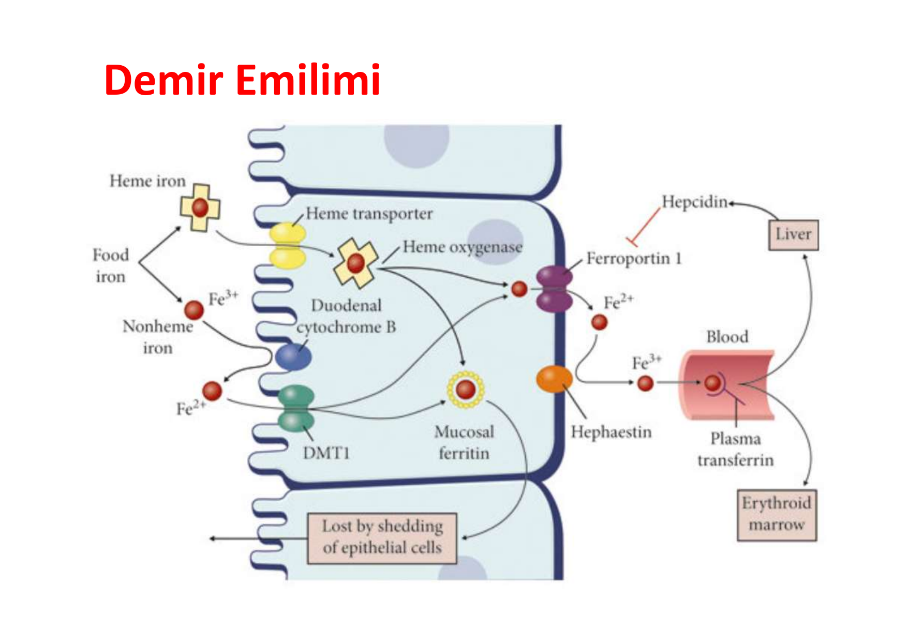

```
  BESİNDEKİ DEMİR
  ┌────┴────┐
  ↓         ↓
HEM DEMİR  NON-HEM DEMİR (Fe³⁺)
  │              │
  ↓              ↓
Heme         Duodenal sitokrom B
transporter  (Fe³⁺ → Fe²⁺ indirger)
  │              │
  ↓              ↓
Heme         DMT1 ile
oksijenaz    enterosit içine
  │              │
  └──────┬───────┘
         ↓
  ENTEROSİT İÇİ
  ┌──────┴──────┐
  ↓              ↓
Mukozal       FERROPORTIN 1
ferritin      (bazolateral çıkış)
(depo)            │
  │              ↓
  ↓         HEFESTIN
Enterosit   (Fe²⁺ → Fe³⁺)
dökülmesi       │
(kayıp)         ↓
           TRANSFERRIN'e
           bağlanma → KANA
```

> BU EMİLİM MEKANİZMASI DEMİRE HAS DEĞİL. +2 DEĞERLİKLİ İYONLARIN HEPSİ İÇİN GEÇERLİ. 

### Demir Emilimini Etkileyen Faktörler

| Emilimi Artıranlar ✅                            | Emilimi Azaltanlar ❌         |
| ----------------------------------------------- | ---------------------------- |
| C vitamini (askorbik asit) — Fe³⁺→Fe²⁺ indirger | Fitat (tahıl, baklagil)      |
| Hayvansal protein (et faktörü)                  | Tannat (çay, kahve)          |
| Asidik ortam (mide asidi)                       | Kalsiyum (süt ürünleri)      |
| Fermentasyon (ekşi maya ekmek)                  | Oksalat (ıspanak)            |
| Demir eksikliği durumu (hepsidin ↓)             | PPI / H2 reseptör blokerleri |
| Eritropoetik aktivite ↑                         | İnflamasyon (hepsidin ↑)     |
| Hipoksi                                         | Polifenoller                 |

> 💡 **Pratik ipucu:** Oral demir preparatı **aç karnına**, **C vitamini ile birlikte** alınmalı. Çay/kahve/süt ile arasında en az **2 saat** olmalı.

### Hepsidin — Demir Dengesinin Ana Düzenleyicisi /NEGATİF ETKİLEYİCİ; BUNU TUSTA SORMUŞLAR.

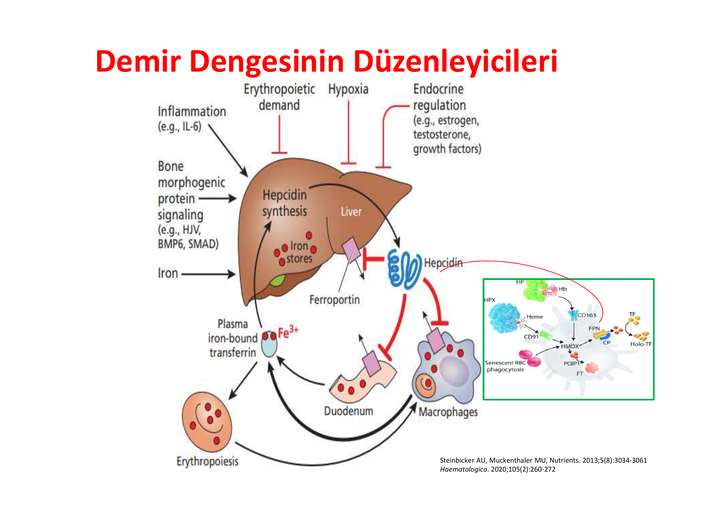

> **Hepsidin** karaciğerden üretilir ve **ferroportini inhibe ederek** demirin enterosit ve makrofajlardan kana geçişini engeller. 

| Durum                                        | Hepsidin Düzeyi | Sonuç                         |
| -------------------------------------------- | --------------- | ----------------------------- |
| Demir yüklenmesi, inflamasyon (IL-6)         | ↑ Artar         | Emilim ↓, demir hücrede kalır |
| Demir eksikliği, hipoksi, eritropoetik talep | ↓ Azalır        | Emilim ↑, demir kana geçer    |

> 💡 **Klinik bağlantı:** İnflamasyonda hepsidin ↑ → Demir enterosit ve makrofajlarda hapis kalır → "Kronik hastalık anemisi"nde demir deposu dolu ama kullanılamaz! Bu yüzden ferritin N/↑ ama serum demiri ↓.

---

## ETİYOLOJİ

| Mekanizma | Nedenler |
|---|---|
| **İhtiyaç artışı** | Bebeklik döneminde hızlı büyüme, genç çocukluk ve ergenlik, gebelik ve emzirme, eritropoez uyarıcı ajanlarla tedavi (ESA) |
| **Alım azlığı** | Malnutrisyon, vejeteryan veya vegan diyet |
| **İntestinal emilim azalması** | Gastrektomi, duodenal bypass, bariatrik cerrahi, çölyak hastalığı, otoimmün atrofik gastrit, *H. pylori* enfeksiyonu, ilaçlar (PPI ve H2RB), **genetik:** İRİDA, kalıtsal hipotransferrinemi, DMT1 hastalığı, aseruloplazminemi, glutaredoksin 5 eksikliği |
| **Kronik kan kaybı** | Kancalı kurt/diğer paraziter enfeksiyonlar, GIS benign/malign lezyonlar, salisilat/kortikosteroid/NSAİİ, GÜS: menoraji/hematüri, intravasküler hemoliz (PNH), ilaçlar: antikoagülan/antiplatelet ajanlar, hemostaz bozuklukları: HHT/vWH, **demir replasmanı yapılmadan tekrarlanan kan bağışları/iatrojenik** |
| **İnflamasyon ilişkili** | Kronik enfeksiyonlar, kronik böbrek yetmezliği (KBY), kalp yetmezliği (KKY), inflamatuar barsak hastalıkları (İBH) |

> 💡 **GİS bakısı vakaların %60'ında nedeni açıklar** — postmenopozal kadınlarda ve erkeklerde DEA saptandığında GİS malignite mutlaka araştırılmalı!

---

## KLİNİK BULGULAR

### Semptomlar

| Semptom                 | Sıklık |
| ----------------------- | ------ |
| Solukluk                | %45-50 |
| Yorgunluk               | %44    |
| Baş ağrısı              | %63    |
| Alopesi                 | %30    |
| Atrofik glossit         | %27    |
| Huzursuz bacak sendromu | %24    |
| Taşikardi               | %9     |
| Senkop                  | %0.3   |

Diğer: Dispne, koilonişi (kaşık tırnak), Plummer-Vinson sendromu (<0.1%), nörobilişsel işlev bozukluğu, angina pektoris, baş dönmesi, kuru/pürüzlü cilt, kuru/yıpranmış saçlar

### Fizik Muayene Bulguları

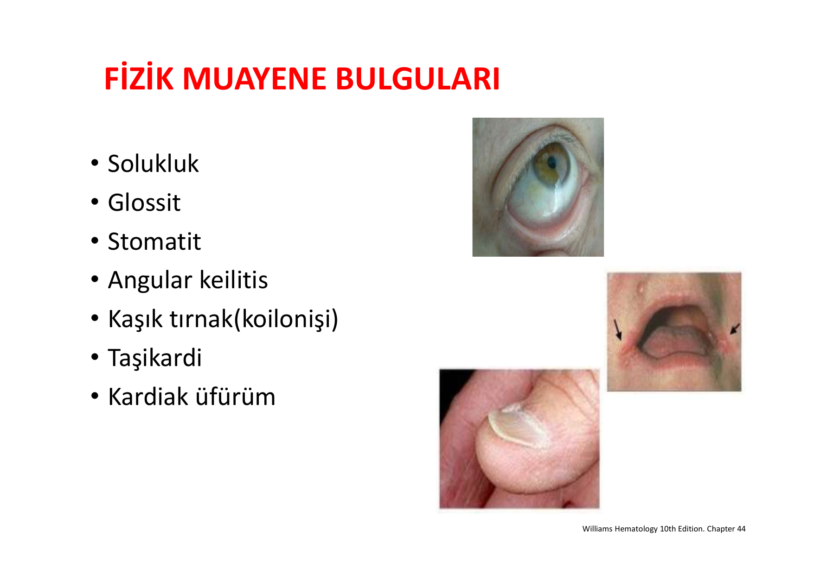

* Solukluk (deri, konjonktiva, tırnak yatağı)
* **Glossit** (düz, parlak, ağrılı dil)
* **Stomatit**, angular keilit
* **Koilonişi** (kaşık tırnak) — DEA'ya spesifik bulgu
* Taşikardi
* Angular keilitis
* Kardiak üfürüm (hiperdinamik dolaşım)

> Hayatında bir defa görmüş hoca.
>  "Koilonişi + Glossit + Disfaji" = **Plummer-Vinson (Paterson-Kelly) sendromu** → DEA + özofageal web → Özofagus SCC riski ↑

---

## LABORATUVAR BULGULARI

Demir eksikliği bir anda ortaya çıkmaz; **kademeli bir süreçtir**. Önce depolar tükenir, sonra demir taşınmasında bozulma olur, en son eritrosit üretimi etkilenir. Bu evreleri anlamak önemlidir çünkü her evrede farklı laboratuvar parametreleri bozulur.

### Demir Eksikliğinin Evreleri

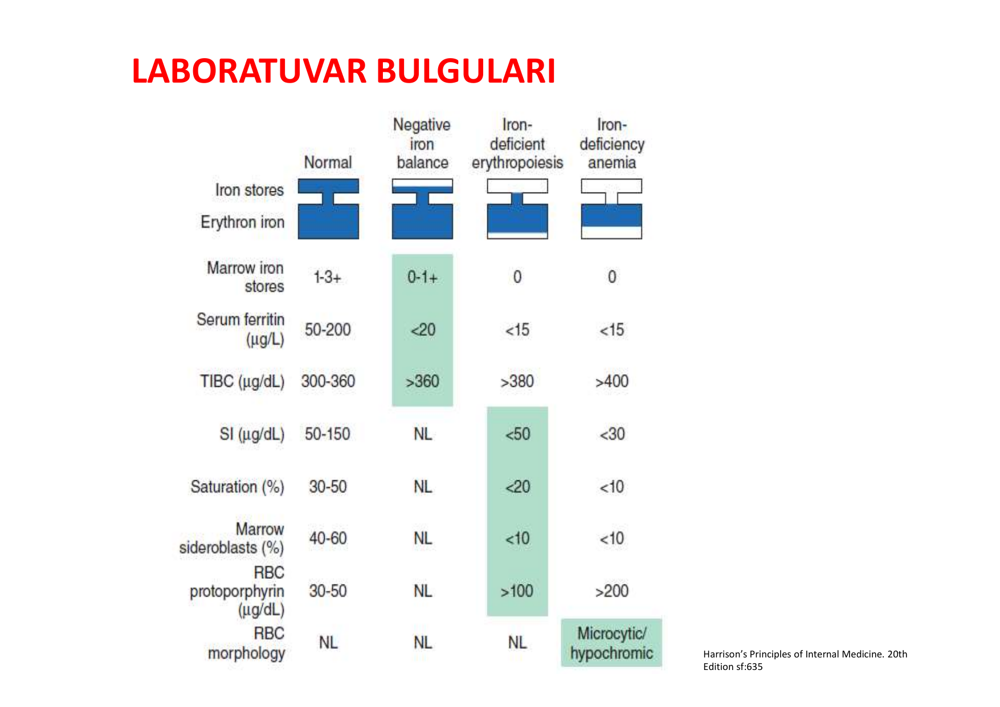

**Evre 1 — Negatif Demir Dengesi:** Demir kaybı alımı aşar, depolar tükenmeye başlar. Bu evrede **sadece ferritin düşer**, diğer parametreler normaldir. Hasta asemptomatiktir.

**Evre 2 — Demir Eksikli Eritropoez:** Depolar tamamen tükenmiştir. Kemik iliğine yeterli demir ulaşamaz. Serum demiri düşer, TDBK artar (vücut daha fazla demir taşımaya çalışır), transferrin satürasyonu düşer. Ancak **henüz anemi yoktur** veya hafiftir, eritrosit morfolojisi normaldir.

**Evre 3 — Demir Eksikliği Anemisi (DEA):** Eritropoez ciddi şekilde bozulmuştur. Hemoglobin düşer, eritrositler **mikrositik ve hipokromik** hale gelir. Bu en geç aşamadır.

| Parametre                       | Normal  | Negatif Demir Dengesi | Demir Eksikli Eritropoez | DEA                       |
| ------------------------------- | ------- | --------------------- | ------------------------ | ------------------------- |
| Kİ demir depoları               | 1-3+    | 0-1+                  | 0                        | 0                         |
| **Serum ferritin (mcg/L)**      | 50-200  | **<20**               | <15                      | <15                       |
| **TDBK (mcg/dL)**               | 300-360 | >360                  | >380                     | **>400**                  |
| **Transferrin saturasyonu (%)** | 30-50   | N                     | **<20**                  | **<10**                   |
| Serum demiri (mcg/dL)           | 50-150  | N                     | **<50**                  | **<30**                   |
| Kİ sideroblast (%)              | 40-60   | N                     | <10                      | <10                       |
| RBC protoporfirin (mcg/dL)      | 30-50   | N                     | >100                     | >200                      |
| RBC morfolojisi                 | N       | N                     | N                        | **Mikrositik/Hipokromik** |

> 💡 **Anahtar:** Ferritin **ilk düşen** parametredir (depo tükenince). MCV ve morfoloji **en son** bozulur. Yani DEA gelişmeden önce "gizli demir eksikliği" dönemi vardır!

### WHO Ferritin Eşik Değerleri (2020)

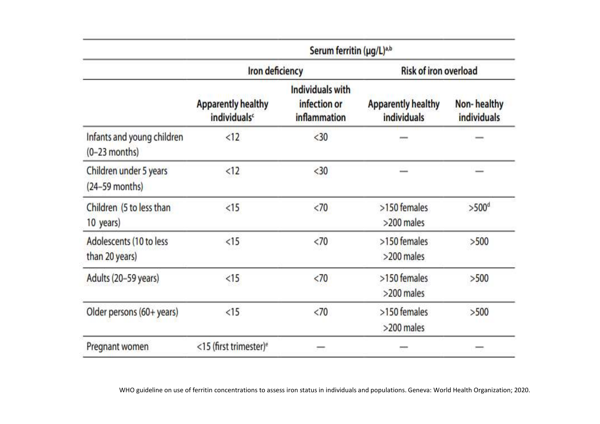

| Yaş Grubu | Demir Eksikliği (Sağlıklı) | Demir Eksikliği (İnflamasyon var) | Demir Yüklenmesi Riski (Sağlıklı) | Demir Yüklenmesi (Hasta) |
|---|---|---|---|---|
| Bebek/küçük çocuk (0-23 ay) | **<12** mcg/L | **<30** mcg/L | — | — |
| 5 yaş altı çocuk (24-59 ay) | **<12** mcg/L | **<30** mcg/L | — | — |
| Çocuk (5-<10 yaş) | **<15** mcg/L | **<70** mcg/L | >150 K / >200 E | >500 |
| Adolesan (10-<20 yaş) | **<15** mcg/L | **<70** mcg/L | >150 K / >200 E | >500 |
| Erişkin (20-59 yaş) | **<15** mcg/L | **<70** mcg/L | >150 K / >200 E | >500 |
| Yaşlı (60+ yaş) | **<15** mcg/L | **<70** mcg/L | >150 K / >200 E | >500 |
| Gebe (1. trimester) | **<15** mcg/L | — | — | — |

> ⚠️ **Ferritin akut faz reaktanıdır** — inflamasyon varsa normal/yüksek bile olsa DEA ekarte edilemez! İnflamasyonda eşik **<70 mcg/L** olarak kabul edilir.

### Periferik Yayma

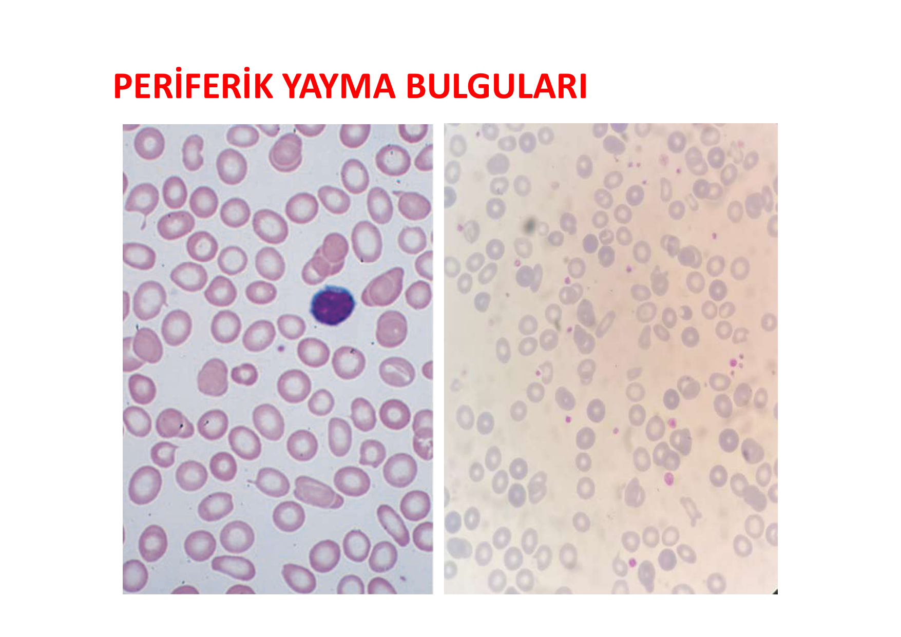

* **Mikrositoz** (MCV ↓) ve **hipokromi** (MCH, MCHC ↓)
* **Anizositoz** (RDW ↑) — farklı boyutlarda eritrositler
* **Poikilositoz** — target hücreler, eliptositler (daha çok hemoglobinopati)
* Trombositoz eşlik edebilir (reaktif)
-  Eritrosit normal boyutu: 6-8 µm
-  kalem hücresi?
### Mikrositer Anemi Ayırıcı Tanı

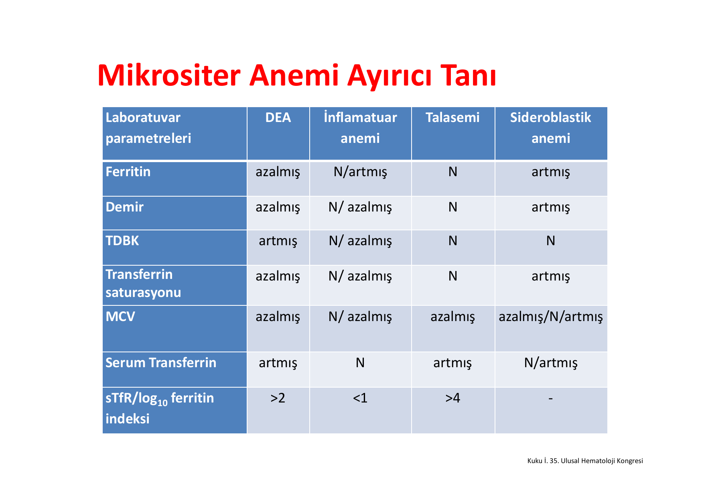

| Parametre             | DEA       | İnflamatuar Anemi | Talasemi | Sideroblastik Anemi |
| --------------------- | --------- | ----------------- | -------- | ------------------- |
| **Ferritin**          | ↓ azalmış | N/↑ artmış        | N        | ↑ artmış            |
| **Serum demiri**      | ↓         | N/↓               | N        | ↑                   |
| **TDBK**              | ↑ artmış  | N/↓               | N        | N                   |
| **Transferrin sat.**  | ↓         | N/↓               | N        | ↑                   |
| **MCV**               | ↓         | N/↓               | ↓        | ↓/N/↑               |
| **Serum transferrin** | ↑         | N                 | ↑        | N/↑                 |
| **sTfR/log ferritin** | **>2**    | **<1**            | **>4**   | -                   |

> 💡 **Sınav ipucu:** sTfR/log ferritin indeksi >2 → **DEA**, <1 → **kronik hastalık anemisi**. Bu indeks inflamasyondan etkilenmez, ayırıcı tanıda çok değerlidir.

### Tanı Algoritması

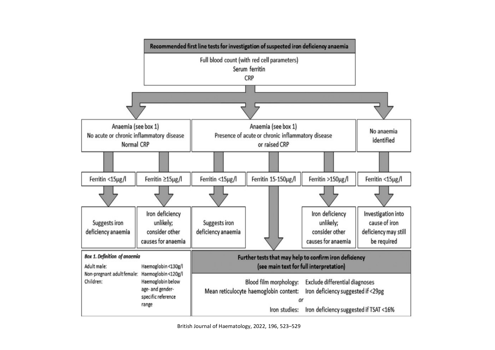

### Retikülosit Hemoglobin İçeriği (CHr, Ret-He)

* Hemogram ile aynı zamanda hızlı bilgi sağlar
* Ferritinden farklı olarak **inflamasyondan etkilenmez**
* CHr <28.5 pg → demir eksikliği düşündürür
* Talasemili bireylerde düşük CHr güvenilir değil, ancak yüksek CHr demir eksikliğini **dışlayabilir**

### Konjenital Demir Transport Bozuklukları

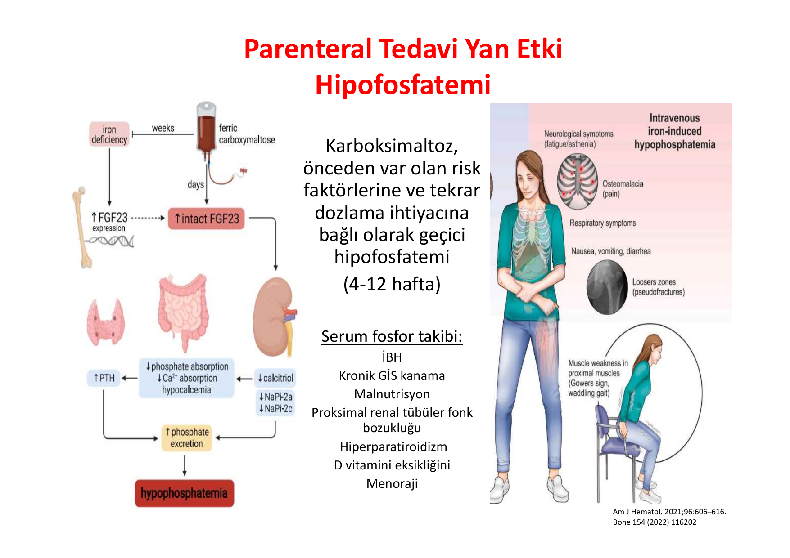

| Bozukluk | Tanı Yaşı | Kc Demir Yükü | Beyin Hasarı | Serum Demiri | Transferrin Sat. | Ring Sideroblast | Ferritin | Hepsidin |
|---|---|---|---|---|---|---|---|---|
| DMT1 | Doğumda | Var | Yok | ↑ | Artmış | Yok | ↓/N/hafif ↑ | ↓/N |
| Atransferrinemi | Geç başlangıç | Var | Yok | ↓ | Artmış/ölçülemez | Yok | ↑ | ↓ |
| Aseruloplazminemi | Geç başlangıç | Var | **Var** | ↓ | Azalmış | Yok | ↑ | ↓ |
| **TMPRSS6 (İRİDA)** | 18-24 ay | **Yok** | Yok | ↓ | Azalmış | Yok | ↓/N | **↑ Yüksek** |

> Bunları ezbere bilmenizi istemiyorum ama arada dönüp bakarsınız.

> 💡 **İRİDA** (Iron-Refractory Iron Deficiency Anemia): Oral demir tedavisine dirençli DEA. 
> Hepsidin yüksek olduğu için demir emilemez. IV demir kısmen etkili.

---

## TEDAVİ

DEA tedavisinde iki temel prensip vardır: **(1)** Eksikliğin **nedenini bul ve tedavi et** (DEA bir hastalık değil, bir hastalığın sonucudur!) **(2)** Demir depolarını replase et. Tedavide parenteral demir verilmesini gerektiren bir durum yoksa **oral demir tedavisi ilk tercihtir**. Semptomların varlığına bakılmaksızın DEA olan **tüm hastalar tedavi edilmelidir**.

### Oral Demir Tedavisi

**İlk seçenek:** Ferröz (Fe²⁺) demir preparatları — Fe²⁺ formları, Fe³⁺'e göre biyoyararlanımı daha yüksektir çünkü enterosit DMT1 taşıyıcısı Fe²⁺'yi doğrudan alır, Fe³⁺'ün önce indirgenmesi gerekir.

| Fe²⁺ Formu    | Elemental Fe (mg) | Tablet/Kutu (n) | Göreli Maliyet |
| ------------- | ----------------- | --------------- | -------------- |
| Sülfat        | 80                | 30              | 1              |
| Fumarat       | 100               | 30              | 1              |
| Glisin sülfat | 40-100            | 20-30           | 0.6-1.3        |
| Bisglisinat   | 17-28             | 90              | Geri ödeme yok |

| Fe³⁺ Formu     | Elemental Fe (mg) | Tablet/Kutu (n) | Göreli Maliyet |
| -------------- | ----------------- | --------------- | -------------- |
| Hidroksimaltoz | 100               | 20-30           | 1-2            |
| Süksinat       | 40                | 10-20           | 1.5-3          |

> demir tedavisinin en önemli yan etkilerinden biri gis. gaytayı siyaha boyar. bunu hastaya bildir. normal diye.

### Fe²⁺ vs Fe³⁺ Etkinlik Karşılaştırması

| Hb (g/dL) | Fe²⁺     | Fe³⁺     | p         |
| --------- | -------- | -------- | --------- |
| Bazal     | 9.7      | 9.7      | NS        |
| **1. ay** | **12.1** | **10.9** | **<.001** |
| **6. ay** | **12.5** | **11.4** | **<.01**  |

> 💡 Fe²⁺ preparatları Fe³⁺'ten **hem 1. ayda hem 6. ayda anlamlı olarak daha etkin** (ArGüelles et al. Hematology, 2007)

**Dozlama prensipleri:**

Dozlama stratejisi anemi şiddetine göre belirlenir. Buradaki mantık şudur: Hepsidin her demir dozundan sonra geçici olarak artar ve emilimi bloke eder. Bu etki yaklaşık 24 saat sürer. Bu yüzden **gün aşırı** vermek, her gün vermekten daha verimli emilim sağlar (her dozda emilen demir yüzdesi artar). Ancak ağır anemide hızlı Hb artışı gerektiğinden günlük rejim tercih edilebilir.

* Anemisi olmayanlarda (sadece demir eksikliği) → **düşük doz, gün aşırı** tedavi
* Hafif anemide → gün aşırı (alt grup analizinde her iki rejim arasında Hb artışı açısından anlamlı fark yok)
* Orta-ağır anemide → **günde 2 kez ardışık gün** (BD) tedavisi tercih edilebilir (BD: 2x200 mg, AD: gün aşırı 400 mg; 62 hastalık RKÇ'de BD grubunda 3. ve 6. haftada Hb artışı anlamlı olarak daha fazla — Kaundal et al. Ann Hematol, 2019)

### Oral Demir — GIS Yan Etki Profili

| Oral demir preparatı        | Çalışma (n) | Hasta (n) | Ortalama doz (mg Fe/gün) | GIS yan etki (GAE) oranı |
| --------------------------- | ----------- | --------- | ------------------------ | ------------------------ |
| İron protein süksinilat     | 10          | 4198      | 88                       | —                        |
| **Ferröz sülfat**           | 40          | 3271      | 120                      | **%27**                  |
| Ferröz sülfat + mukoproteoz | 32          | 1293      | 105                      | **%4**                   |
| **Ferröz fumarat**          | 11          | 757       | 105                      | **%39**                  |
| **Ferröz glisin sülfat**    | 8           | 604       | 121                      | **%19**                  |
| Ferröz glukonat             | 10          | 572       | 175                      | —                        |

> ⚠️ **Fumarat en yüksek GIS yan etki oranına sahip (%39)**, mukoproteoz ile kombine sülfat en düşük (%4). Yan etki intoleransında preparat değişikliği denenmelidir. (Cancelo-Hidalgo et al. Curr Med Res Opin, 2013)

**Yan etki azaltma:**
* Yemek sonrası kullanım
* Düşük doz demir içeren preparat
* Enterik formlar

**⚠️ İlaç Etkileşimleri (oral demir):**

| Etkileşen İlaç/Madde     | Mekanizma                            | Öneri                  |
| ------------------------ | ------------------------------------ | ---------------------- |
| Tetrasiklin, doksisiklin | Şelasyon → her ikisinin de emilimi ↓ | En az **2 saat** ara   |
| Levodopa                 | Şelasyon → levodopa etkinliği ↓      | En az **2 saat** ara   |
| Levotiroksin             | Şelasyon → tiroid hormon emilimi ↓   | En az **4 saat** ara   |
| Kininolon antibiyotikler | Şelasyon → antibiyotik etkinliği ↓   | En az **2 saat** ara   |
| Antasitler, PPI, H2RB    | Mide pH ↑ → Fe³⁺ indirgenemez        | Ayrı zamanlarda kullan |
| Kalsiyum preparatları    | DMT1'de kompetisyon                  | Ayrı zamanlarda kullan |
| Bisfosfonatlar           | Şelasyon → bisfosfonat emilimi ↓     | En az **2 saat** ara   |

> 💡 **Klinik ipucu:** Oral demir tedavisinde yanıtsızlığın en sık nedenlerinden biri **ilaç etkileşimleri** ve **yanlış kullanımdır** hastanın ilaç listesini mutlaka gözden geçirin!

### Parenteral Demir Tedavisi Endikasyonları

| Endikasyon                       | Sebep                                                         |
| -------------------------------- | ------------------------------------------------------------- |
| Oral demir intoleransı           | Persistan GI yan etkiler                                      |
| Oral tedaviye yanıtsızlık        | Gastrektomi, çölyak, atrofik gastrit, *H. pylori*, İBH, İRİDA |
| Ağır anemi (Hb <7-8 g/dL)        | Hızlı Hb artış ihtiyacı                                       |
| Gebelik (2. veya 3. trimester)   | Hızlı Hb artış, oral intolerans                               |
| ESA tedavisi                     | KBY'de oral tedaviden daha etkin                              |
| Kronik kanamalar (oral yetersiz) | Menoraji, HHT, vWH                                            |
| Diğer                            | Majör cerrahi öncesi/sonrası, KKY                             |

### Parenteral Demir Tedavisi — SUT Endikasyonları

* İntestinal malabsorbsiyon sendromları
* Kronik inflamatuar bağırsak hastalıkları
* Aktif GIS kanaması olan hastalar
* Hemodiyaliz hastaları
* Total ve subtotal gastrektomili hastalar
* Atrofik gastritli hastalar
* Oral demir alımını tolere edemeyen hamileler
* DEA bulunan kronik böbrek hastaları
* Periton diyaliz hastalarının anemisi
* Postpartum dönemde gözlenen anemi
* Cerrahi öncesi ve sonrası gözlenen anemi
* Kansere bağlı anemi
* KKY hastalarının anemisi
* Prediyaliz hastalarının anemisi

### Demir Açığı Hesaplama — Ganzoni Formülü

> **Demir açığı (mg)** = (Vücut ağırlığı (kg) x [Hedef Hb – Mevcut Hb] x 2.4) + 500

### Parenteral Demir Preparatları

|                        | Glukonat (TR yok)           | Sükroz                      | Dekstran            | Karboksimaltoz      | İzomaltozit        | Hidroksi Polimaltoz   |
| ---------------------- | --------------------------- | --------------------------- | ------------------- | ------------------- | ------------------ | --------------------- |
| **Maks. doz (mg/gün)** | 125-250 mg                  | 100-300 mg                  | 500-1000 mg         | 1000 mg             | 1000 mg            | 100-300 mg            |
| **Test dozu**          | Çoklu alerji varsa önerilir | Çoklu alerji varsa önerilir | 25 mg IV            | —                   | —                  | Test dozu uygulanır   |
| **Uygulanışı**         | 12.5 mg/dk                  | 100 mg/30 dk                | 1-4 saat IV         | Enjeksiyon, 15 dk   | 20 mg/kg, 15 dk IV | 1 amp (100 mg)/gün İM |
| **Anafilaksi**         | 1.5/10.000                  | 1.2/10.000                  | **9.8/10.000**      | 0.8/10.000          | —                  | —                     |
| **Gebelik kategorisi** | B                           | B                           | C (1. trimester KE) | C (1. trimester KE) | A                  | A                     |

> 💡 **Pratik not:** Sükroz ucuz ve güvenli (1. tercih); karboksimaltoz pahalı ama tek seferde yüksek doz verilebilir; dekstran anafilaksi riski en yüksek olan preparattır.

### Parenteral Demir — Yan Etkiler

**Hafif/orta infüzyon reaksiyonları** (1:200 sıklıkta, genellikle kendi kendini sınırlar):
* Bulantı
* Kaşıntı, ürtiker
* Flushing
* Sırt veya torasik ağrı

**Ciddi reaksiyonlar** (1:200.000 sıklıkta):
* Hipotansiyon
* Dispne
* **Anafilaksi**

**⚠️ ÖNEMLİ:**
* IV demir tedavisi **enfeksiyon varlığında kontrendikedir**
* Parenteral tedavi **anafilaksi şartlarını karşılayacak ortamda** verilmelidir
* Astım, çoklu ilaç alerjisi veya inflamatuar artrit → infüzyon öncesi **metilprednizolon profilaksisi**
> herkese değil sadece alerji öyküsü olanlara.

### Karboksimaltoz ve Hipofosfatemi

Karboksimaltoz → geçici **hipofosfatemi** riski (FGF23 ↑) → 4-12 hafta

**Serum fosfor takibi yapılması gereken risk grupları:**
* İBH
* Kronik GIS kanama
* Malnutrisyon
* Proksimal renal tübüler fonksiyon bozukluğu
* Hiperparatiroidizm
* D vitamini eksikliği
* Menoraji

### Eritrosit Transfüzyonu

* Aktif kanaması olup **hemodinamisi stabil olmayan** hastalarda
* **Anemi ilişkili organ iskemisi** belirti/bulgusu gösteren hastalarda

### Tedavi Yanıt Değerlendirme

Tedaviye yanıtı takip etmek çok önemlidir. Yanıt yoksa tanıyı, uyumu, malabsorbsiyonu ve ilaç etkileşimlerini sorgulamalısınız. Pika gibi bazı semptomlar hematolojik değişikliklerden önce bile düzelir — bu, demir eksikliğinin sadece anemi değil **doku düzeyinde** etkileri olduğunu gösterir.

| Zaman | Beklenen Yanıt |
|---|---|
| Tedavi başlangıcı | Pika (varsa) çok erken kaybolur — hematolojik değişiklik olmadan! |
| İlk 72 saat | Huzursuz bacak sendromu düzelir (hastaların çoğunda ilk gece bile düzelme başlar) |
| 1-2 hafta | Dil papillaları düzelir |
| **7-10 gün** | **Retikülosit piki** — tedavi yanıtının ilk objektif göstergesi |
| 1-2 hafta | Hb yavaş yavaş yükselmeye başlar |
| **3 hafta** | Hb **~2 g/dL** yükselir |
| **6-8 hafta** | Hb normale dönmeli — eğer dönmediyse tedavi başarısız! |
| Sonrasında | Depo dolumu için **3 ay daha** tedaviye devam (Hb düzelse bile depolar henüz dolmamıştır) |

> ⚠️ **Kritik:** Hb normale döndükten sonra tedaviyi kesmeyin! Depo dolumu için **en az 3 ay daha** devam edilmelidir. Erken kesilirse eksiklik tekrarlar.

### Tedavi Algoritması

```
  DEA Nedenini Tedavi Et
          +
  Oral Demir Tedavisi Başla
  (Aylık Hb, Ferritin, TSAT takibi)
          │
    Tedavi Etkin mi?
    ┌─────┴─────┐
    ↓           ↓
   EVET        HAYIR
    │           │
  3 ay oral   Tedavi uyumunu sorgula
  Fe devam    Malabsorbsiyon araştır
    │         H. pylori eradikasyonu
    ↓         İlaç etkileşimi sorgula
  Takip:          │
  3 ay aylık      ↓ Etkin değilse
  1 yıl 3 ayda  PARENTERAL Fe
  bir kontrol    REPLASMANINI
    │            │
    ↓            ↓
  Demir eks.   Demir eksikliği devam
  devam        ediyorsa → İLERİ
  ederse →     ARAŞTIRMA
  1 yıl daha   (GIS malignite?)
```

> Kan transfüzyonları evlilik gibidir; yapınca ikinci kez yapmak zor gelir.

---

## DEA — SONUÇ VE SINAV ÖZETİ

* Tanıda: **Hb** (K<12, E<13, Gebe<11) + **Ferritin** + **TSAT** + **CRP** (eşlik eden inflamatuar durumu değerlendirmek için)
* Semptomların varlığına bakılmaksızın, **demir eksikliği anemisi olan tüm hastalar tedavi edilmelidir**
* Demir eksikliğinin **nedeni belirlenmeli ve tedavi edilmeli** (DEA bir hastalık değil, bir hastalığın sonucudur!)
* Tedavide parenteral demir verilmesini gerektiren bir durum yoksa **oral demir tedavisi (Fe²⁺) ilk tercih** edilmelidir
* Anemisi olmayanlarda düşük doz gün aşırı; hafif anemide gün aşırı; orta-ağır anemide günde 2 kez ardışık gün tedavisi tercih edilebilir
* Yan etki olanlarda: yemek sonrası kullanım, düşük doz preparat, enterik formlar
* Parenteral tedavi; uygun endikasyonda, **demir açığı hesaplanarak** ve **anafilaksi şartlarını karşılayacak ortamda** verilmelidir
* Tedavide **maliyet ve etkinlik** göz önünde bulundurulmalıdır

---

---

# MEGALOBLASTİK ANEMİ

---

## TANIM

Makrositer anemi (MCV >100 fL) geniş bir kavramdır ve birçok nedeni olabilir. **Megaloblastik anemi** bunun bir alt kümesidir ve spesifik olarak **DNA sentez bozukluğuna** bağlıdır.

Temel patofizyoloji şudur: DNA sentezi bozulduğunda hücre bölünemez ama RNA ve protein sentezi (sitoplazma) normal devam eder. Sonuç olarak çekirdek küçük kalırken sitoplazma büyümeye devam eder — buna **nükleer-sitoplazmik dissosiyasyon** denir. Bu durum sadece eritroid seriyi değil, **tüm hızlı bölünen hücreleri** etkiler (lökositler, trombositler, GIS epitel hücreleri).

Kemik iliğinde üretilen bu büyük, immatür hücreler (megaloblastlar) normal olgunlaşmayı tamamlayamaz ve çoğu **kemik iliğinde yıkılır** → **inefektif eritropoez**. Bu yüzden LDH çok yükselir ve indirekt bilirubin artar (intramedüller hemoliz).

```
  DNA sentezi bozulur → Çekirdek olgunlaşması GERİ KALIR
                         Sitoplazma olgunlaşması NORMAL
                              ↓
                    NÜKLEER-SİTOPLAZMİK
                    DİSSOSİYASYON
                              ↓
                    BÜYÜK, İMMATÜR HÜCRELER
                    (Megaloblastlar)
                              ↓
                    Çoğu kemik iliğinde YIKILIR
                    (İNEFEKTİF ERİTROPOEZ)
```

## NEDENLERİ

* **Kobalamin (Vitamin B12) eksikliği** veya metabolizma bozuklukları
* **Folat eksikliği** veya metabolizma bozuklukları
* Antifolat etkinlikli ilaç tedavisi (metotreksat vb.)
* DNA sentezini etkileyen ilaçlar (sitozin arabinozid, hidroksiüre, 6-merkaptopürin)

### Makrositer Anemi Ayırıcı Tanı — Megaloblastik vs Non-Megaloblastik

> Her makrositer anemi megaloblastik değildir! Ayırıcı tanıda **hipersegmente nötrofil** varlığı/yokluğu kilit ipucudur.

| Megaloblastik (DNA sentez bozukluğu)        | Non-Megaloblastik                         |
| ------------------------------------------- | ----------------------------------------- |
| B12 eksikliği                               | Alkolizm (en sık non-megaloblastik neden) |
| Folat eksikliği                             | Karaciğer hastalığı                       |
| Antifolat ilaçlar (metotreksat)             | Hipotiroidizm                             |
| DNA sentez inhibitörleri (hidroksiüre, AZT) | MDS (miyelodisplastik sendrom)            |
| Konjenital (Orotik asidüri, Lesch-Nyhan)    | Retikülosit artışı (hemoliz, kanama)      |
|                                             | Aplastik anemi                            |
|                                             | İlaçlar (valproat, AZT)                   |

> 💡 **Ayırıcı ipucu:** Megaloblastik → **hipersegmente nötrofil (+)**, LDH ↑↑↑, indirekt bilirubin ↑ / Non-megaloblastik → hipersegmente nötrofil **yok**, LDH normal/hafif ↑

---

## KOBALAMİN (VİTAMİN B12)

### Temel Bilgiler

B12 (kobalamin), merkezinde **kobalt iyonu** bulunan, tetrapirol halka yapısına sahip, suda çözünen bir vitamindir. İnsan vücudu B12'yi sentezleyemez, sadece **hayvansal kaynaklardan** (et, balık, süt, yumurta) alınabilir. Bu yüzden vejeteryan/vegan bireylerde eksiklik riski yüksektir.

* Günlük ihtiyaç: **2 mcg** (çok düşük — bu yüzden eksiklik geç ortaya çıkar)
* Total vücut deposu: **2-5 mg** (karaciğer en büyük depo)
* Depo yarı ömrü: **400 gün**
* Depolar vücudumuzun **3-4 yıllık** ihtiyacını karşılayabilir

> 💡 **Klinik önem:** Günlük ihtiyaç çok düşük ve depolar çok büyük olduğu için B12 eksikliği **yıllar içinde** gelişir. Bir hasta bugün gastrektomi olsa, B12 eksikliği belirtileri ancak **3-4 yıl sonra** ortaya çıkar. Bu, folatla önemli bir farktır (folat depoları sadece 3-4 ay yetecek kadardır).

### İki Koenzim Formu

| Koenzim                      | Reaksiyon                                              | Klinik Önemi                                          |
| ---------------------------- | ------------------------------------------------------ | ----------------------------------------------------- |
| **Metilkobalamin**           | Homosistein → Metiyonin <br> Metil H4 folat → H4 folat | Folat döngüsü ile bağlantı, homosistein metabolizması |
| **Deoksiadenozil kobalamin** | Metilmalonil CoA → Süksinil CoA                        | Bu reaksiyon bozulunca **MMA ↑** → nöropati           |

> 💡 **Sınav ipucu:** B12 eksikliğinde hem **homosistein** hem **MMA** (metilmalonik asit) yükselir. Folat eksikliğinde **sadece homosistein** yükselir. Bu ayırıcı tanının temelidir!

Neden böyle? Çünkü homosistein → metiyonin reaksiyonu hem B12 hem folat gerektirir (her iki eksiklikte de homosistein birikir). Ama metilmalonil CoA → süksinil CoA reaksiyonu **sadece B12** gerektirir (folat bu reaksiyona katılmaz). Bu yüzden MMA yüksekliği B12 eksikliğine spesifiktir.

### B12 Emilimi ve Taşınması

B12 emilimi oldukça karmaşık bir süreçtir ve **her basamakta** bir bozukluk eksikliğe yol açabilir. Bu yüzden B12 eksikliğinin en sık nedeni **malabsorbsiyon**dur (alım eksikliği değil).

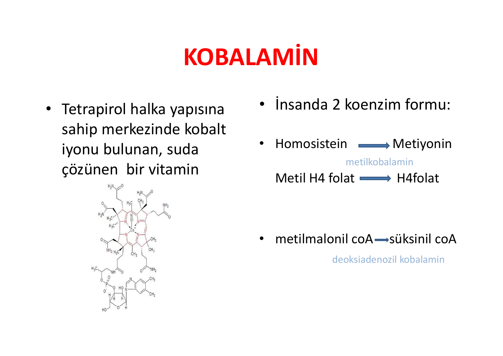

```
  Diyetle B12 alımı (hayvansal protein)
          ↓
  Midede: HCl + Pepsin → B12 proteinden ayrılır
          ↓
  B12 → HAPTOKORRIN'e (R protein, tükürükten) bağlanır
          ↓
  Duodenumda: Pankreatik enzimler haptokorini parçalar
          ↓
  B12 → İNTRİNSİK FAKTÖR'e (İF, parietal hücreden) bağlanır
          ↓
  TERMİNAL İLEUM: B12-İF kompleksi → Cubilin/Amnionless
  reseptörü ile aktif emilim (%60-80)
          ↓
  Portal dolaşıma → TRANSKOBALAMİN II'ye bağlı olarak
  (holotranskobalamin = aktif form)
```

**Pasif transport:** İF'den bağımsız, ileumda endositoz ile %1-2 emilim → Bu yüzden yüksek doz oral B12 tedavisi bile kısmen etkili olabilir

### Pernisiyöz Anemi — B12 Eksikliğinin En Sık Nedeni

> **Pernisiyöz anemi**, parietal hücrelere karşı gelişen **otoimmün gastrit** sonucu intrinsik faktör (İF) üretiminin bozulması ve buna bağlı B12 malabsorbsiyonudur. ---**ÖNEMLİ**

| Özellik                             | Detay                                                                                   |
| ----------------------------------- | --------------------------------------------------------------------------------------- |
| **Mekanizma**                       | Anti-parietal hücre Ab (%90) ve/veya anti-İF Ab (%60)                                   |
| **Anti-İF antikoru**                | Duyarlılık düşük (%60) ama **spesifitesi çok yüksek** (%95+) → pozitifse tanı koydurucu |
| **Yaş**                             | Genellikle **>40 yaş**, kadınlarda daha sık                                             |
| **Eşlik eden otoimmün hastalıklar** | Hashimoto tiroiditi, Tip 1 DM, vitiligo, Addison hastalığı                              |
| **Histopatoloji**                   | Gastrik korpus ve fundusta **atrofik gastrit**, parietal hücre kaybı                    |
| **GIS komplikasyonu**               | Gastrik karsinoid tümör ve **mide adenokarsinomu** riski ↑ → endoskopik takip           |
| **Schilling testi**                 | Klasik tanı testi (artık nadiren kullanılır): B12 emilimi İF ile düzelir                |

> ⚠️ **Pernisiyöz anemili hastalarda mide kanseri riski 2-3 kat artmıştır** — düzenli endoskopik takip önerilir.

### B12 Eksikliği Nedenleri

**Malabsorbsiyon (en sık mekanizma):**
* **Pernisiyöz anemi** (en sık neden)
* Gastrektomi (gastrik bypass, bariatrik cerrahi dahil)
* Gastrik pH bozan durumlar (PPI, atrofik gastrit, Zollinger-Ellison)
* İBH: Terminal ileum absorbsiyon kusuru
* Terminal ileum rezeksiyonu
* Pankreatik yetersizlik: R proteininden B12 ayrılamaması
* Kör barsak sendromu: Bakteriyel çoğalma
* Konjenital İF eksikliği
* *Diphyllobothrium latum* enfeksiyonu (çiğ balık)

**Alım eksikliği:** Vejeteryan/veganlar

**Herediter absorbsiyon-transport bozuklukları:** Transkobalamin eksikliği, İmerslund-Grasbeck sendromu

**İlaçlar (B12 absorbsiyonunu bozarak):** 
- Neomisin
- Metformin (diyabetik hastalarda sadece ilaca baakrak bile anlayabilirsin)
- PPI
- kolşisin
- antikonvülzanlar

### B12 Eksikliği — Yalancı Düşük (Spuriously Low)

Total B12 düşük ama fonksiyonel B12 (holotranskobalamin) normal olan durumlar: (sınav sorusu olabilir??)
* Multiple myelom
* HIV enfeksiyonu
* Gebelik
* Oral kontraseptifler
* Difenilhidantoin

---

## MEGALOBLASTİK ANEMİ — KLİNİK BULGULAR

Megaloblastik aneminin bulguları üç kategoride incelenir: (1) anemiye bağlı genel bulgular, (2) GIS bulguları (hızlı bölünen GIS epitelinin etkilenmesi), (3) nörolojik bulgular (sadece B12 eksikliğinde). Klinik tablonun ayırt edici özelliği **limon sarısı** renktir — solukluk (anemi) + hafif sarılık (inefektif eritropoeze bağlı indirekt hiperbilirubinemi) birleşiminden oluşur.

### Anemiye Bağlı

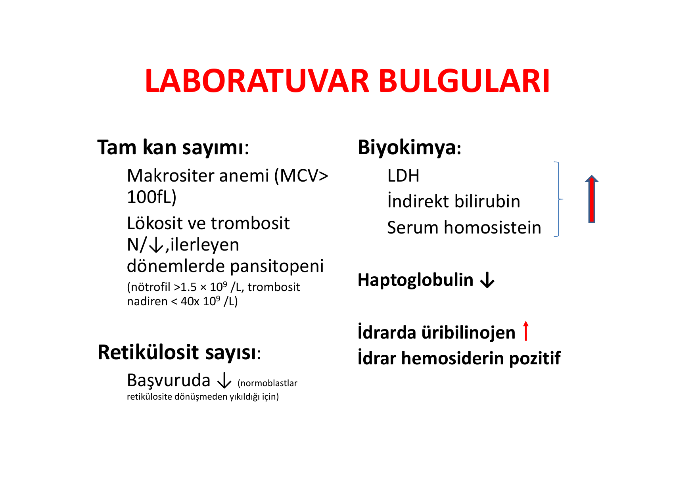

* Halsizlik, yorgunluk
* **Solukluk (limon sarısı renk)** — solukluk + subikter birlikteliği (inefektif eritropoeze bağlı indirekt bilirubin ↑)
* Subikter

### GIS Bulguları

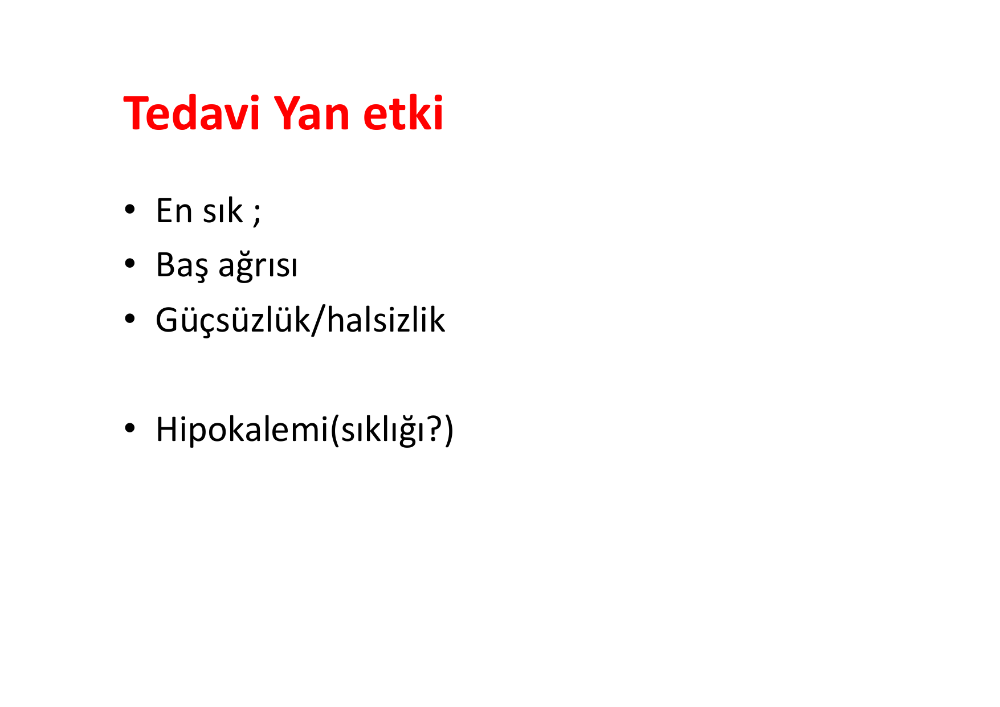

* Dilde papilla atrofisi → düz, parlak, kızarık, ağrılı dil (**Hunter dili**)
* Angular keilit
* Aftöz stomatit
* Pansitopeni görülebilir: Lökopeniye bağlı enfeksiyonlar, trombositopeniye bağlı peteşiler

### Nörolojik Bulgular (B12'ye Spesifik!)

* Kol ve bacaklarda **simetrik nöropati** (en sık)
* Parestezi / uyuşma-karıncalanma
* Unutkanlık
* Güçsüzlük
* Pozisyon ve titreşim algısının bozulması → el becerisinde bozulma (Romberg ve Lhermitte pozitif)

**⚠️ ÖNEMLİ:** Anemi veya makrositoz **olmadan da** nörolojik bulgular olabilir!

> 💡 **Sınav ipucu:** DEA ile B12 eksikliği bir arada olursa MCV normal bile olabilir — nörolojik bulguları kaçırmayın!

### Subakut Kombine Dejenerasyon (Funicular Miyeloz)

B12 eksikliğine **spesifik** nörolojik sendrom — spinal kordun **arka kordon** ve **lateral kortikospinal traktus** tutulumudur.

```
  B12 eksikliği → Metilmalonil CoA birikimi
         ↓
  Anormal yağ asitleri → Miyelin sentezinde kullanılır
         ↓
  DEFEKTİF MİYELİN → DEMİYELİNİZASYON
         ↓
  ┌──────┴──────────────┐
  ↓                     ↓
ARKA KORDON          LATERAL KORTİKOSPİNAL
(Duyusal)            TRAKTUS (Motor)
  ↓                     ↓
Pozisyon/vibrasyon    Spastisite
duyusu kaybı         Babinski (+)
Ataksik yürüyüş      Güçsüzlük
Romberg (+)          Hiperrefleksi
```

| Bulgu                                                           | Tutulan Yapı                      |
| --------------------------------------------------------------- | --------------------------------- |
| Parestezi, uyuşma (eldiven-çorap)                               | Periferik sinir                   |
| Pozisyon ve vibrasyon duyusu kaybı                              | **Arka kordon** (posterior kolon) |
| Ataksik yürüyüş, Romberg (+)                                    | **Arka kordon**                   |
| Spastisite, Babinski (+)                                        | **Lateral kortikospinal traktus** |
| Lhermitte bulgusu (boyun fleksiyonunda elektrik çarpması hissi) | Servikal spinal kord              |
| Kognitif bozukluk, demans                                       | Serebral tutulum                  |
| Depresyon, psikoz                                               | Serebral tutulum                  |

> ⚠️ **Tedavi gecikirse nörolojik hasar kalıcı olabilir!** 6 aydan uzun süreli nörolojik bulgularda tam düzelme beklenmez. Erken tedavi kritiktir.

---

## MEGALOBLASTİK ANEMİ — LABORATUVAR

Megaloblastik aneminin laboratuvar tablosu **hemolizi taklit eder** (LDH ↑↑↑, indirekt bilirubin ↑, haptoglobulin ↓). Ama burada hemoliz periferik kanda değil **kemik iliğinde** olur (inefektif eritropoez = intramedüller hemoliz). Retikülosit sayısı düşüktür — gerçek hemolitik anemiden ayırt ettiren en önemli farktır. Ayrıca megaloblastik anemi **pansitopeni** yapabilir (sadece eritroid değil, tüm hücre serileri etkilenir) — bu nedenle ayırıcı tanıda lösemi ve aplastik anemiyle karışabilir.

### Tam Kan Sayımı ve Biyokimya

| Parametre            | Değişiklik                         |
| -------------------- | ---------------------------------- |
| MCV                  | **>100 fL** (makrositer)           |
| Lökosit, trombosit   | N/↓, ileri dönemde **pansitopeni** (nötrofil genellikle >1.5 × 10⁹/L, trombosit nadiren <40 × 10⁹/L) |
| Retikülosit          | ↓ (normoblastlar retikülosite dönüşmeden yıkıldığı için — inefektif eritropoez) |
| LDH                  | **↑↑↑** (çok yüksek)               |
| İndirekt bilirubin   | ↑                                  |
| Serum homosistein    | ↑                                  |
| Haptoglobulin        | ↓                                  |
| İdrarda ürobilinojen | ↑                                  |
| İdrar hemosiderin    | **Pozitif**                        |

### Periferik Kan Yayması

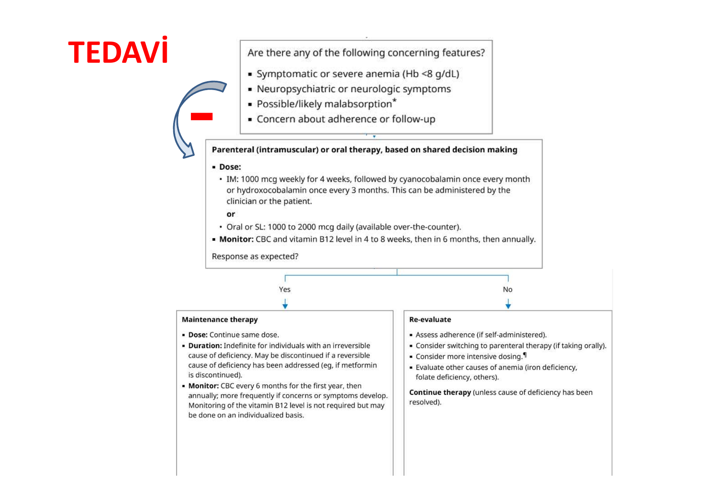

* **Makroovalositoz** (büyük, oval eritrositler)
* Anizositoz, poikilositoz
* **Howell-Jolly cisimleri** (nükleer kalıntılar)
* **Nötrofillerde hipersegmentasyon** (≥5 loblu nötrofiller) — megaloblastik anemiye **oldukça spesifik** bulgu

### B12 ve Folat Düzeyleri ile Tanı Algoritması

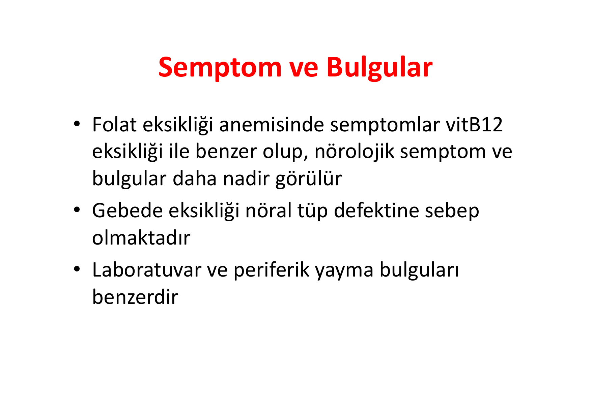

**B12 ve folat düzey yorumlaması:**

| | Eksik | Ara Değer (Gri Bölge) | Normal |
|---|---|---|---|
| **Vitamin B12** | **<200 pg/mL** | 200-300 pg/mL | **>300 pg/mL** |
| **Folat** | **<2 ng/mL** | 2-4 ng/mL | **>4 ng/mL** |

| Parametre | B12 Eksikliği | Folat Eksikliği |
|---|---|---|
| Vitamin B12 | **<200 pg/mL** = eksik | Normal |
| Folat | Normal | **<2 ng/mL** = eksik |
| **MMA** | **↑ Artmış** | Normal |
| **Homosistein** | ↑ Artmış | ↑ Artmış |

> 💡 **Altın kural:** MMA ↑ + Homosistein ↑ = **B12 eksikliği** / MMA Normal + Homosistein ↑ = **Folat eksikliği**

**Ara değerlerde (B12: 200-300 pg/mL, Folat: 2-4 ng/mL):** MMA ve homosistein ölç → Kesin tanı koy

**B12/folat eksikliğinden ne zaman şüphelenilmeli?**
* Eksikliğe yatkın hastalık veya diyet öyküsü
* Düşük retikülosit sayısı ile makrositer anemi
* Hafif pansitopeni
* Hipersegmente nötrofiller
* Açıklanamayan nöropsikiyatrik bulgular

---

## B12 EKSİKLİĞİ TEDAVİSİ

### Vitamin B12 Formları

* **Siyanokobalamin / Hidroksikobalamin**
* Önerilen yollar: **İntramusküler**, oral, sublingual
* Önerilmeyen: İntravenöz, intranazal, transdermal

### Tedavi Algoritması

**Ciddi bulgular varsa** (Hb <8, nöropsikiyatrik semptomlar, malabsorbsiyon, uyum endişesi):
* İlk hafta: 1000 mcg İM, haftada 1-3 kez veya günlük
* Sonra: 1000 mcg İM, haftada 1 kez → 4 haftaya kadar
* Nöropsikiyatrik semptomlar düzeliyorsa 3 aya kadar uzatılabilir
* İdame: 1000 mcg İM ayda 1 (siyanokobalamin) veya 2 ayda 1 (hidroksikobalamin)
* Takip: 2-3 hafta sonra CBC (retikülosit sayısı dahil) tekrarla

> ⚠️ **Herhangi bir nöropsikiyatrik semptomu olan hastalara İM kobalamin tedavisi önerilir** (oral/SL yeterli olmayabilir!)

**Hafif bulgular** (ciddi bulgu yok):
* İM: 1000 mcg haftalık x 4 hafta → ayda 1 (siyanokobalamin) veya 3 ayda 1 (hidroksokobalamin) idame
* **VEYA** Oral/SL: 1000-2000 mcg/gün
* Takip: CBC ve B12 düzeyi 4-8 haftada, sonra 6 ayda, sonra yıllık

**Tedavi süresi:**
* **Geri dönüşümsüz neden** (pernisiyöz anemi, çölyak, terminal ileum gastrektomi vb.) → **ömür boyu** idame tedavisi
* **Geri dönüşümlü neden** (metformin kullanımı, diyet eksikliği vb.) → neden düzeltildiğinde kesilebilir

**Yanıt yoksa yeniden değerlendirme:**
* Diğer anemi nedenleri araştır (eşlik eden DEA, folat eksikliği)
* Oral tedavideyse parenteral tedaviye geç
* Daha yoğun dozlama düşün (B12 düzeyi hâlâ düşükse)
* Nöropsikiyatrik semptomların diğer nedenlerini değerlendir

### Tedavi Yan Etkileri

* En sık: Baş ağrısı, güçsüzlük/halsizlik
* **Hipokalemi** (dikkat — tedavi başlangıcında izle!)

### Tedavi Yanıtı

> Tedaviye yanıt çok iyidir, hızlı semptomatik düzelme görülür.

| Zaman          | Beklenen Yanıt                             |
|---|---|
| Saatler içinde | Kemik iliğinde değişiklikler başlar        |
| 1-2 gün        | LDH, indirekt bilirubin normale döner      |
| **~1 hafta**   | **Retikülosit piki**                       |
| 1 hafta sonra  | Hb yükselmeye başlar                       |
| **4-8 hafta**  | Hb normale döner                           |
| 1 hafta        | Lökosit ve trombosit normale döner         |
| 2 hafta        | Hipersegmentasyon normale döner            |
| 2-3 ay         | MCV normale döner                          |
| **3-12 ay**    | **Nöropati düzelir** (tam düzelmeyebilir!) |

---

## FOLAT /B9

### Temel Bilgiler

Folat, B12'den farklı olarak hem hayvansal hem **bitkisel kaynaklardan** (özellikle yeşil yapraklı sebzeler) alınabilir. Adı da buradan gelir: Latince *folium* = yaprak. B12'yle karşılaştırıldığında en önemli fark **depo süresidir**: B12 depoları 3-4 yıl yeterken folat depoları sadece 3-4 ay yeter. Bu yüzden folat eksikliği çok daha hızlı gelişir.

* B9 vitamini / Folacin / *Pteroil glutamik asit* (PGA)
* 1941 yılında ıspanak yaprağında keşfedilmiş
* **Isıya dayanıksız** (uzun pişirmede kaybolur — bu önemli: yiyecekleri çok pişirmek folat kaybına yol açar)
* Diyetle alınan: ~250 mcg/gün
* Günlük yetişkin gereksinimi: ~100 mcg
* Toplam vücut folatı: ~10 mg (karaciğer en büyük depo)
* Depolar yalnızca **3-4 ay** yeterli (B12'nin 3-4 yılına kıyasla çok kısa!)

> Folat, **nükleik asitlerin ve amino asitlerin metabolizması** için kritik olan çeşitli reaksiyonlarda **tek karbonlu ünitelerin alıcıları ve vericileri** olarak işlev görür.

### Folat Formları

| Form | Açıklama |
|---|---|
| **Folik asit** (sentetik) | Takviye ve fortifikasyonda kullanılır; DHFR ile THF'ye dönüştürülür |
| **5-Metiltetrahidrofolat (5-MTHF)** | Dolaşımdaki başlıca doğal form; B12 bağımlı metiyonin sentaz reaksiyonunda kullanılır |
| **Folinik asit (lökovorin)** | Aktif folat formu; metotreksat toksisitesinde kurtarma tedavisi (rescue therapy) olarak kullanılır |

### Folat Tuzağı (Methylfolate Trap) — B12-Folat Bağlantısı

> B12 ve folat metabolizması **metiyonin sentaz** reaksiyonunda kesişir. Bu reaksiyonun bozulması megaloblastik aneminin temel mekanizmasıdır.

```
  5-Metil THF (folat deposu)
        │
        ↓  METİYONİN SENTAZ
           (B12 = kofaktör)
        │
  ┌─────┴─────┐
  ↓           ↓
THF         Metiyonin
(aktif      (→ SAM → metilasyon
folat)       reaksiyonları)
  ↓
5,10-Metilen THF
  ↓
TİMİDİLAT SENTAZ
  ↓
dTMP → DNA SENTEZİ ✅
```

**B12 eksikliğinde ne olur?**
* Metiyonin sentaz çalışamaz → 5-Metil THF, THF'ye dönüştürülemez
* Folat **5-Metil THF formunda "hapis kalır"** → kullanılabilir folat ↓
* DNA sentezi bozulur → **Megaloblastik anemi**
* Bu yüzden B12 eksikliğinde **serum folat paradoks olarak normal/yüksek** olabilir (hücre içi fonksiyonel folat ↓)

> 💡 **Sınav ipucu:** "Folat tuzağı" B12 eksikliğinin neden megaloblastik anemiye yol açtığını açıklar. Ayrıca neden **sadece folat vermek aneminin hematolojik bulgularını düzeltir ama nöropatiyi düzeltmez** (hatta kötüleştirir) sorusunun cevabıdır — çünkü folat DNA sentezini bypass eder ama B12'ye bağımlı metilmalonil CoA → süksinil CoA reaksiyonunu düzeltemez!

### Folat Eksikliği Nedenleri

| Mekanizma                 | Nedenler                                                                                   |
| ------------------------- | ------------------------------------------------------------------------------------------ |
| **Diyetle yetersiz alım** | Meyve/sebze yetersiz tüketimi, uzun süre pişirme                                           |
| **Alkolizm**              | Böbrekten folat atılımı ↑, hücre içi metabolizmayı bozar                                   |
| **Emilim bozukluğu**      | Çölyak, Crohn hastalığı                                                                    |
| **Artmış ihtiyaç**        | Gebelik ve laktasyon, hemolitik anemiler, maligniteler, eksfoliyatif dermatit, hemodiyaliz |
| **Antifolat ilaçlar**     | Metotreksat, antikonvülzanlar, sülfosalazin, tetrasiklin                                   |

### Folat Eksikliği — Klinik

Folat eksikliğinin hematolojik bulguları B12 eksikliği ile **neredeyse aynıdır** (makrositoz, hipersegmentasyon, pansitopeni, LDH ↑↑↑). Ayırt edici iki kritik fark:

1. **Nörolojik semptom ve bulgular folat eksikliğinde çok nadir** — çünkü nöropatiye neden olan metilmalonil CoA → süksinil CoA reaksiyonu sadece B12'ye bağımlıdır, folat bu reaksiyona katılmaz
2. **Gebede folat eksikliği nöral tüp defektine** (spina bifida, anensefali) sebep olur — bu yüzden gebelik öncesi folat profilaksisi kritiktir

Laboratuvar ve periferik yayma bulguları B12 eksikliği ile benzerdir. Ayırıcı tanıda **MMA** anahtardır: folat eksikliğinde MMA normal, B12 eksikliğinde yüksektir.

### Folat Tedavisi

Folat tedavisi B12'ye kıyasla çok daha basittir:

* **1-5 mg/gün oral** — tek yol yeterli
* 1-4 ay veya tam hematolojik iyileşme olana kadar
* Folat ucuzdur ve malabsorbsiyonu olanlarda bile etkilidir (emilim kapasitesi geniştir)

**⚠️ ÖNEMLİ — SINAV KLASİĞİ:**

* Yüksek doz folik asit verilmeden önce **kobalamin eksikliği mutlaka dışlanmalı** ve varsa düzeltilmelidir
* Neden? Folat verince DNA sentezi düzelir → anemi ve hematolojik bulgular iyileşir → klinisyen "tedavi işe yaradı" der. Ama B12'ye bağımlı olan miyelin metabolizması düzelmez → **nörolojik hasar sessizce ilerler ve kötüleşir!**
* Bu durum "**folat tuzağının klinik yansıması**"dır

> 💡 **Sınav ipucu:** "Megaloblastik anemi + folat verdim anemi düzeldi ama nöropati kötüleşti" = **Altta yatan B12 eksikliği kaçırılmış!** Bu senaryo sınavlarda çok sevilir.

### Profilaksi

* Gebelik planı olanlarda folat replasmanı: **400 mcg/gün**
* Kronik hemolitik anemi formlarında (pirüvat kinaz eksikliği vb.) günlük folat takviyesi almalıdır
* Folat tedavisine başlamadan önce **kobalamin eksikliği ekarte edilmelidir**

---

## DEA vs MEGALOBLASTİK ANEMİ — KARŞILAŞTIRMA

| Özellik                 | DEA                             | B12 Eksikliği                      | Folat Eksikliği                    |
| ----------------------- | ------------------------------- | ---------------------------------- | ---------------------------------- |
| **MCV**                 | ↓ **Mikrositer**                | ↑ **Makrositer**                   | ↑ **Makrositer**                   |
| **Yayma**               | Hipokromi, mikrositoz           | Makroovalositoz, hipersegmentasyon | Makroovalositoz, hipersegmentasyon |
| **Ferritin**            | ↓                               | N                                  | N                                  |
| **Serum demiri**        | ↓                               | N                                  | N                                  |
| **TDBK**                | ↑                               | N                                  | N                                  |
| **LDH**                 | N/hafif ↑                       | **↑↑↑**                            | **↑↑↑**                            |
| **İndirekt bilirubin**  | N                               | ↑                                  | ↑                                  |
| **Retikülosit**         | N/↓                             | ↓                                  | ↓                                  |
| **MMA**                 | N                               | **↑**                              | N                                  |
| **Homosistein**         | N                               | ↑                                  | ↑                                  |
| **Nörolojik bulgu**     | ❌ Yok (HBS hariç)               | ⚠️ **VAR**                          | ❌ Nadir                            |
| **Glossit tipi**        | Atrofik glossit                 | **Hunter dili** (ağrılı, kırmızı)  | Hunter dili                        |
| **Koilonişi**           | ✅ Var                           | ❌ Yok                              | ❌ Yok                              |
| **Depo tükenme süresi** | Aylar                           | **3-4 yıl**                        | **3-4 ay**                         |
| **En sık neden**        | Kan kaybı (E), menstrüasyon (K) | Pernisiyöz anemi                   | Yetersiz alım                      |
| **Tedavi**              | Oral/IV demir                   | İM/Oral B12                        | Oral folat                         |

---

## MEGALOBLASTİK ANEMİ — SONUÇ VE SINAV ÖZETİ

* Kobalamin eksikliğinin **en sık sebebi pernisiyöz anemi**dir; bozulmuş emilim ve semptomatik eksikliğe neden olur
* Hem kobalamin hem de folat eksiklikleri megaloblastik anemiye neden olur; ancak **nöropsikiyatrik semptomlar sıklıkla kobalamin eksikliğinde** görülür
* **Herhangi bir nöropsikiyatrik semptomu olan hastalara İM kobalamin tedavisi önerilir**
* Folat eksikliğinin en yaygın nedeni **diyetle alımın azalmasıdır**
* Gebelik planı olanlarda folat replasmanı: **400 mcg/gün**
* Bazı kronik hemolitik anemi formlarında (pirüvat kinaz eksikliği vb.) günlük folat takviyesi almalıdır
* ⚠️ **Folat tedavisine başlamadan önce kobalamin eksikliği ekarte edilmelidir** — aksi halde nörolojik hasar kötüleşir!

**Sınav için kritik ayırıcı tanı kuralları:**
* **MMA ↑ + Homosistein ↑** = B12 eksikliği
* **MMA N + Homosistein ↑** = Folat eksikliği
* **MMA N + Homosistein N** = B12 ve folat eksikliği dışlandı
* **Hipersegmente nötrofil** = megaloblastik anemiye oldukça spesifik
* **LDH ↑↑↑** + indirekt bilirubin ↑ + haptoglobulin ↓ = inefektif eritropoez (hemoliz tablosunu taklit eder!)
* Makrositer anemi + nörolojik bulgu = **B12 eksikliğini düşün** (folat eksikliğinde nöroloji nadir)
* MCV normal + nörolojik bulgu = **B12 + DEA bir arada olabilir** (MCV birbirini maskeler)

---

## KLİNİK VAKA ÖRNEKLERİ

**📋 VAKA ÖRNEĞİ 1: Demir Eksikliği Anemisi**

**Hasta:** 32 yaşında kadın
**Öykü:** 6 aydır artan halsizlik, yorgunluk ve efor dispnesi. Menstrüasyon düzensiz, son aylarda adet kanamaları 7-8 güne uzamış ve ped değiştirme sıklığı artmış. Beslenme düzensiz, çay tüketimi günde 8-10 bardak.
**Fizik Muayene:** Nabız 98/dk, TA 110/70 mmHg, SpO₂ %97. Konjonktivalar soluk, dil papillalarında silinme mevcut. Tırnaklarda koilonişi. Kardiak muayenede apikal sistolik üfürüm.
**Laboratuvar:** Hb 8.2 g/dL, MCV 68 fL, MCH 22 pg, RDW %18.5, Ferritin 4 mcg/L, Serum demiri 18 mcg/dL, TDBK 480 mcg/dL, Transferrin saturasyonu %4
**Tanı:** Demir eksikliği anemisi (menoraji zemininde)
**Tedavi:** Oral ferröz sülfat 80 mg elemental Fe, gün aşırı, aç karnına + C vitamini. Jinekolojiye menoraji değerlendirmesi için yönlendirildi.
**İzlem:** 10. günde retikülosit piki, 3. haftada Hb 10.1 g/dL, 8. haftada Hb 12.4 g/dL. Depo dolumu için 3 ay daha tedaviye devam edildi.

**Öğretici Notlar:**
1. Reprodüktif çağdaki kadınlarda DEA'nın en sık nedeni **menoraji**dir
2. Aşırı çay tüketimi (tannat) demir emilimini azaltır → hasta eğitimi önemli
3. Koilonişi DEA'ya **spesifik** bir fizik muayene bulgusudur
4. Tedavide depo dolumu için Hb normalleştikten sonra **3 ay daha** devam edilmelidir

---

**📋 VAKA ÖRNEĞİ 2: B12 Eksikliği — Pernisiyöz Anemi**

**Hasta:** 58 yaşında kadın, bilinen Hashimoto tiroiditi
**Öykü:** 3 aydır artan halsizlik, ellerde ve ayaklarda uyuşma/karıncalanma, yürürken dengesizlik. Son 1 aydır unutkanlık belirginleşmiş. Diyeti normal, et ve süt ürünleri yeterli tüketiyor.
**Fizik Muayene:** Nabız 88/dk, TA 130/80 mmHg. Ciltte **limon sarısı** renk. Dilde papilla atrofisi, kırmızı ve parlak görünüm (Hunter dili). Nörolojik: Alt ekstremitelerde vibrasyon duyusu ↓, Romberg (+), derin tendon refleksleri ↓ (periferik nöropati), Babinski (+) bilateral.
**Laboratuvar:** Hb 7.8 g/dL, MCV 118 fL, WBC 3200/µL, PLT 110.000/µL (pansitopeni). LDH 1850 U/L (↑↑↑), indirekt bilirubin 2.1 mg/dL. B12: 85 pg/mL (↓↓), folat: 8 ng/mL (N). MMA: 1200 nmol/L (↑↑), homosistein: 45 µmol/L (↑). Anti-İF antikoru (+), anti-parietal hücre antikoru (+).
**Periferik Yayma:** Makroovalositler, hipersegmente nötrofiller (6 loblu), Howell-Jolly cisimleri.
**Tanı:** Pernisiyöz anemiye bağlı B12 eksikliği + Subakut kombine dejenerasyon
**Tedavi:** Siyanokobalamin 1000 mcg İM günlük x 7 gün → haftada 1 x 4 hafta → ayda 1 ömür boyu idame. Serum potasyum takibi (hipokalemi riski).
**İzlem:** 7. günde retikülosit piki (%12), 2. haftada LDH normale döndü. 6. haftada Hb 11.8 g/dL. 3. ayda paresteziler belirgin geriledi ancak vibrasyon duyusu hafif azalmış kaldı.

**Öğretici Notlar:**
1. **Limon sarısı renk** = solukluk + subikter → inefektif eritropoeze bağlı hemoliz işareti
2. B12 eksikliğinde **pansitopeni** görülebilir — sadece anemi değil!
3. LDH **çok yüksek** olması megaloblastik aneminin karakteristiğidir (inefektif eritropoez)
4. Otoimmün hastalık birlikteliği (Hashimoto + pernisiyöz anemi) sık görülür
5. Nörolojik bulgular **6 ayı geçtiyse** tam düzelme beklenmez → erken tanı hayati önem taşır
6. **MMA ↑ + Homosistein ↑** = B12 eksikliği (folat eksikliğinde sadece homosistein ↑)

---

**📋 VAKA ÖRNEĞİ 3: Folat Tuzağı — Yanlış Tedavi Tuzağı**

**Hasta:** 65 yaşında erkek, kronik alkolizm öyküsü
**Öykü:** Halsizlik ve solukluk nedeniyle başvurdu. Dış merkezde makrositer anemi saptanmış, "folat eksikliği" düşünülerek **folik asit 5 mg/gün** başlanmış. 2 ay sonra anemisi düzelmiş ancak ayaklarında uyuşma ve yürüme güçlüğü başlamış.
**Fizik Muayene:** Alt ekstremitelerde eldiven-çorap tarzı duyu kaybı, vibrasyon duyusu ↓, ataksik yürüyüş.
**Laboratuvar:** Hb 12.5 g/dL (düzelmiş), MCV 96 fL (düzelmiş), B12: 110 pg/mL (↓), MMA: 980 nmol/L (↑↑).
**Tanı:** Altta yatan B12 eksikliğinin gözden kaçması + folat tuzağı. Folat verilmesi hematolojik tabloyu düzeltmiş ancak nörolojik hasarı ağırlaştırmış.
**Tedavi:** Folik asit kesildi. B12 1000 mcg İM tedavisi başlandı.

**Öğretici Notlar:**
1. ⚠️ **Megaloblastik anemide folat vermeden ÖNCE mutlaka B12 eksikliği dışlanmalıdır!**
2. Folat, DNA sentezini düzelterek hematolojik tabloyu iyileştirir ama B12'ye bağımlı miyelinizasyonu düzeltemez
3. Hematolojik düzelme klinisyeni yanıltır → nöropati ilerler → **geri dönüşümsüz hasar**
4. Alkolik hastalarda **hem folat hem B12 eksikliği** birlikte olabilir → ikisini birden değerlendir
