# HEMOGLOBİNOPATİLER

**Hazırlayan:** Doç. Dr. Atakan Turgutkaya
**Bölüm:** Aydın Adnan Menderes Üniversitesi -- Erişkin Hematoloji Bilim Dalı

---

## İÇİNDEKİLER

1. [Tanım ve Sınıflandırma](#tanım-ve-sınıflandırma)
2. [Hemoglobin Yapısı](#hemoglobin-yapısı)
3. [Gelişim Dönemine Göre Hemoglobinler](#gelişim-dönemine-göre-hemoglobinler)
4. [Hemoglobinopati Sınıflaması](#hemoglobinopati-sınıflaması)
5. [Epidemiyoloji](#epidemiyoloji)
6. [Bazı Önemli Genel Noktalar](#bazı-önemli-genel-noktalar)
7. [Saptama Yöntemleri](#saptama-yöntemleri)
8. [Orak Hücre Sendromları](#orak-hücre-sendromları)
9. [Orak Hücre Hastalığı Patofizyolojisi](#orak-hücre-hastalığı-patofizyolojisi)
10. [Klinik Bulgular ve Komplikasyonlar](#klinik-bulgular-ve-komplikasyonlar)
11. [Orak Hücre Taşıyıcılığı](#orak-hücre-taşıyıcılığı)
12. [Tedavi](#tedavi)
13. [Akut Göğüs Sendromu](#akut-göğüs-sendromu)
14. [Transfüzyon](#transfüzyon)
15. [Talasemiler](#talasemiler)
16. [Talasemi Tedavisi](#talasemi-tedavisi)
17. [HbF Herediter Persistansı](#hbf-herediter-persistansı)
18. [Kazanılmış Hemoglobinopatiler](#kazanılmış-hemoglobinopatiler)
19. [Oksijen Afinitesini Değiştiren Hbpatiler](#oksijen-afinitesini-değiştiren-hbpatiler)
20. [Hemoglobinopatilerde Aplastik Kriz](#hemoglobinopatilerde-aplastik-kriz)

---

## TANIM VE SINIFLANDIRMA

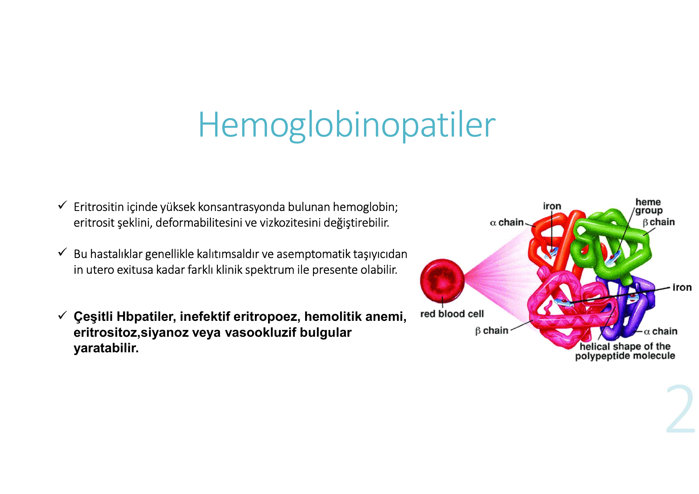

> **Şema yorumu:** Görselde kırmızı kan hücresi içinde **hemoglobin tetrameri** gösterilmiştir. Yapı **2 alfa zinciri + 2 beta zinciri** (toplam 4 polipeptid) ve her zincirde demir içeren bir **hem grubu** içerir. Polipeptid molekülleri sarmal (heliks) yapıdadır.

**Hemoglobinopatilerin temel özellikleri:**

* Eritrosit içinde yüksek konsantrasyonda bulunan hemoglobin; eritrositin **şeklini, deformabilitesini ve viskozitesini** değiştirebilir
* Bu hastalıklar genellikle **kalıtımsaldır** ve **asemptomatik taşıyıcıdan in utero exitusa** kadar farklı klinik spektrum ile prezente olabilir
* Çeşitli Hbpatiler şu klinik tablolara yol açabilir:
   * İnefektif eritropoez
   * Hemolitik anemi
   * Eritrositoz
   * Siyanoz
   * Vazoekluzif bulgular

---

## HEMOGLOBİN YAPISI

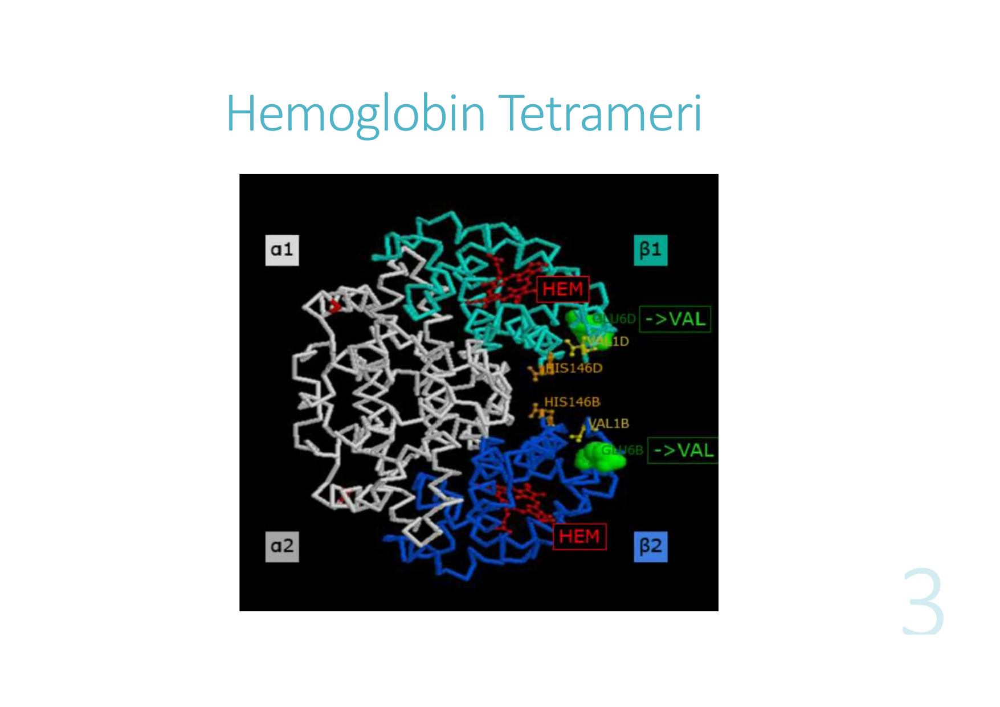

> **3D protein yapısı yorumu:** Görselde hemoglobinin dört polipeptid zinciri (**α1, α2, β1, β2**) ve merkezi **HEM grupları** (turuncu) gösterilmiştir. **HIS92, HIS146, VAL1B** gibi belirli aminoasit pozisyonları işaretlenmiştir; bu pozisyonlardaki **VAL ile substitüsyonlar** (örn. β6 Glu→Val orak hücre mutasyonu) hemoglobin fonksiyonunu/stabilitesini bozar. Her bir alfa-beta zincir çifti birbirine sıkıca paketlenir ve oksijen bağlama bölgesini şekillendirir.

---

## GELİŞİM DÖNEMİNE GÖRE HEMOGLOBİNLER

Embriyonik, fetal ve erişkin dönemde **farklı hemoglobinler** üretilir. Globin gen ekspresyonu ontogenez boyunca değişir.

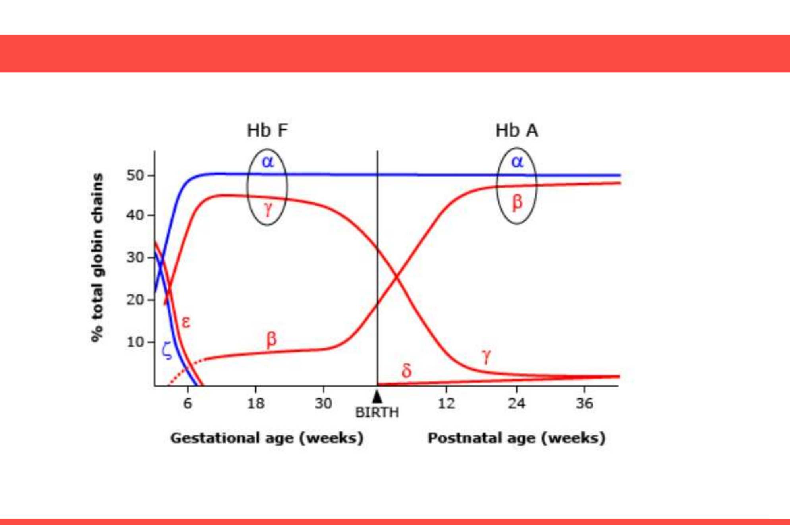

> **Grafik yorumu (Globin zincir geçişleri):**
>
> X ekseni doğum öncesi gestasyonel haftaları ve doğum sonrası postnatal haftaları, Y ekseni ise toplam globin zincirinin yüzdesini gösterir. **BIRTH** çizgisi (yaklaşık 40. gestasyonel hafta) iki dönemi ayırır.
>
> **Gestasyonel dönem (Hb F bölgesi):**
> * **α (alfa, mavi)** -- 6. haftadan itibaren hızla yükselir, **~%50'de stabilize olur ve tüm yaşam boyunca kalır**
> * **ε (epsilon, kırmızı)** ve **ζ (zeta, mavi)** -- sadece **embriyonik** dönemde (4-8 hafta) eksprese edilir; sonra kaybolur
> * **γ (gama, kırmızı)** -- 6. haftadan başlayıp gestasyon süresince yükselir, **doğumda ~%45-50** ile dominanttır (HbF'in β karşılığı)
> * **β (beta, kırmızı)** -- gestasyon süresince **çok düşük (<%10)** kalır
>
> **Postnatal dönem (Hb A geçişi):**
> * **β (beta)** -- doğumdan sonra **hızla yükselir**; ~24-36. postnatal haftada **~%50** seviyesine ulaşır → erişkin HbA dominansı
> * **γ (gama)** -- doğumdan sonra **hızla düşer**; ~6 ayda %2'nin altına iner (HbF azalması)
> * **δ (delta)** -- postnatal dönemde yavaşça yükselir; **~%2.5-3.5** seviyesinde kalır (HbA₂)
>
> **🔑 Klinik anlamı:**
> * **β globin mutasyonları** (orak hücre, β-talasemi) **doğumdan 3-9 ay sonra** semptomatik olur -- çünkü γ→β geçişi bu süreçte tamamlanır
> * **α globin mutasyonları** **in utero ve doğumda** semptomatiktir -- α zinciri tüm dönemlerde gerekli
> * **HbF** (α₂γ₂) doğumda dominanttır, sonradan azalır; **erişkinde <%2** olmalı (HbF persistansı patolojik)
> * **HbF, oraklaşmaya karşı koruyucudur** -- bu yüzden hidroksiüre tedavisi HbF'yi arttırarak orak hücre semptomlarını azaltır

### Embriyonik Dönem (4-6. gestasyonel hafta)

Embriyogenez 4-6. haftalarda eksprese edilirler ve gestasyonun 8. haftasında yerini fetal Hb'e bırakırlar.

| Hb tipi | Yapı | Globin zincirleri |
|---|---|---|
| **Hb Gower-1** | ζ₂ε₂ | 2 zeta + 2 epsilon |
| **Hb Gower-2** | α₂ε₂ | 2 alfa + 2 epsilon |
| **Hb Portland** | ζ₂γ₂ | 2 zeta + 2 gamma |

### Fetal Dönem ve Sonrası

| Hb tipi | Yapı | Eksprese olduğu dönem | Erişkin oranı |
|---|---|---|---|
| **HbF** | α₂γ₂ | 8. gestasyonel haftadan itibaren, doğumda dominant | <%2 |
| **HbA** (major) | α₂β₂ | Doğum sonrası dominant olur | **%96-97** |
| **HbA₂** (minor) | α₂δ₂ | Erişkin yaşam | **%2.5-3.5** |

> **🔑 Klinik anlamı:** Fetal hayatta β-globin yerine γ-globin baskındır. Bu nedenle β-globin mutasyonları (orak hücre, β-talasemi) doğumdan **3-9 ay sonra** semptomatik olur. Alfa zincir tüm dönemlerde gerekli olduğundan **alfa zincir bozuklukları in utero ve doğumda** semptomatiktir.

---

## HEMOGLOBİNOPATİ SINIFLAMASI

### 1) Yapısal Hbpatiler
Globin zincirinde aminoasit sekans değişmesi sonucu

| Alt tip | Örnek | Klinik |
|---|---|---|
| **Anormal hemoglobin polimerizasyonu** | HbS | Orak hücre hastalığı |
| **Yüksek O₂ afiniteli** | Hb Yakima | Polisitemi |
| **Düşük O₂ afiniteli** | Hb Kansas | Siyanoz, psödoanemi |
| **Unstabil hemoglobinler** | -- | Hemolitik anemi, sarılık |
| **M hemoglobinler** | -- | Methemoglobinemi, siyanoz |

### 2) Talasemiler (alfa, beta vs.)
Globin mRNA'sında üretim veya translasyonu bozacak mutasyonlar sonucu **hatalı globin zincir üretimi**

### 3) Talasemik Hemoglobin Varyantları
Yapısal Hbpatiler ile talasemik fenotip birlikteliği:
* **HbE**
* **HbCS**
* **Hb Lepore**

### 4) Fetal Hb'in Herediter Persistansı

### 5) Kazanılmış Hbpatiler
Toksinler aracılığıyla Hb modifikasyonu veya sentezinde klonal anormallikler:
* Toksik maruziyet sonrası **methemoglobin ve sulfhemoglobin** oluşumu
* **Karboksihemoglobin** (CO maruziyeti)
* Eritrolösemide **HbH artışı**
* Eritroid stres ve kemik iliği displazisinde **HbF artışı**

---

## EPİDEMİYOLOJİ

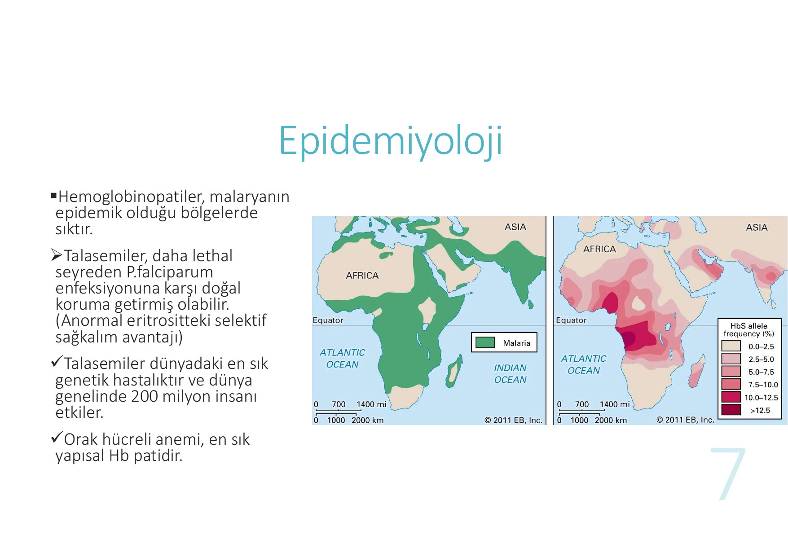

> **Harita yorumu:** Hemoglobinopatiler **malaryanın endemik olduğu bölgelerde** belirgin şekilde sıktır (Sahra-altı Afrika, Akdeniz havzası, Orta Doğu, Hindistan, Güneydoğu Asya). Pembe-koyu renkler yüksek HbS sıklığını, sıtma endemik bölgeleriyle çakıştığını gösterir. **Talasemiler P. falciparum enfeksiyonuna karşı kısmi koruma** sağladığı için bu bölgelerde doğal seleksiyon yoluyla yaygınlaşmıştır (anormal eritrositteki selektif sağkalım avantajı).
>
> Türkiye'nin Akdeniz kıyıları (özellikle Çukurova, Ege) talasemi açısından yüksek riskli bölgelerdir.

**Anahtar epidemiyolojik bilgiler:**

* Hemoglobinopatiler **malaryanın endemik olduğu bölgelerde** sıktır
* **Talasemiler dünyadaki en sık genetik hastalıktır** -- 200 milyon insanı etkiler
* **Orak hücreli anemi** en sık yapısal Hb patidir

---

## BAZI ÖNEMLİ GENEL NOKTALAR

* **Otozomal ko-dominant trait:** Birleşik heterozigotlar **komposit özellik** taşırlar
   * Örnek: **sickle-beta talasemi** -- hem beta talasemi hem orak hücreli anemi özellikleri taşır

* **Alfa zinciri** HbA, HbA₂ ve HbF'de bulunduğu için, **alfa zincir mutasyonları her 3 Hb tipinde de anormallik yaratır**:
   * Alfa globin anormalliklerine bağlı Hbpatiler **hem in utero hem doğumdan sonra** semptomatiktir
   * Alfa zinciri her dönemin baskın hemoglobininin parçasıdır

* **Beta globin anormalliklerine bağlı Hbpatiler**, doğumdan **3-9 ay sonra** semptomatik olmaya başlar
   * Çünkü HbA (α₂β₂), HbF (α₂γ₂)'in yerini almaktadır

---

## SAPTAMA YÖNTEMLERİ

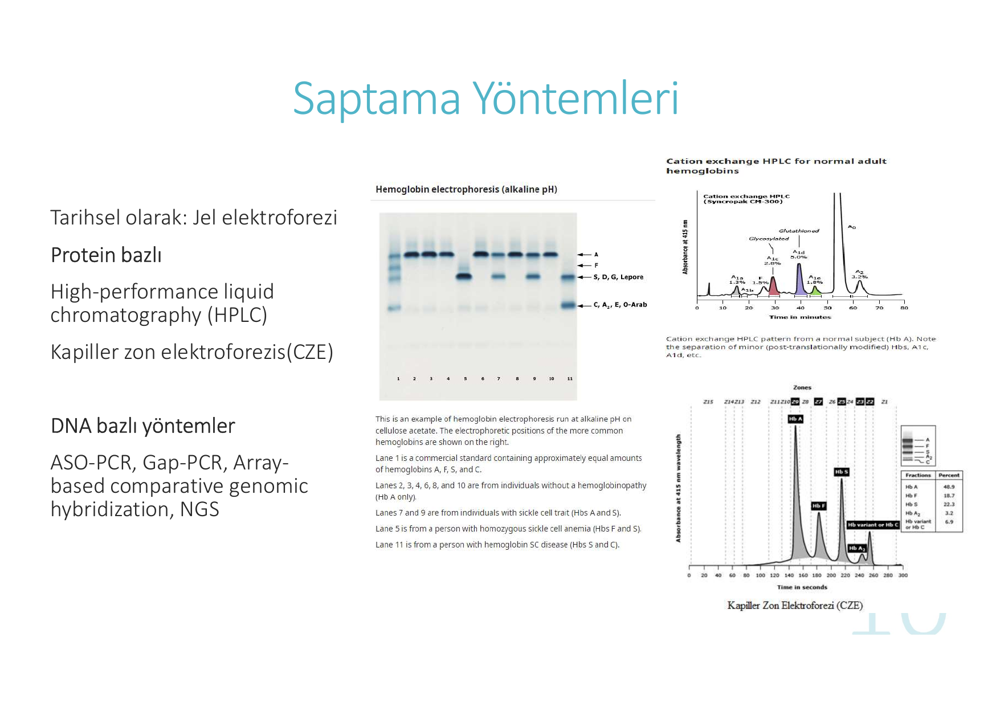

> **Şema yorumu:**
> * **Sol panel (Hemoglobin elektroforezi, alkali pH, selüloz asetat):** Lane 2,3,4,6,8,10 = normal birey (Hb A); Lane 7,9 = orak hücre taşıyıcılığı (HbA + HbS); Lane 5 = homozigot orak hücre anemisi (HbF + HbS, **HbA yok**); Lane 11 = HbSC hastalığı.
> * **Sağ üst panel (Cation exchange HPLC):** Normal erişkinde Hb A pikleri (HbA0 büyük pik %94, HbA1c %5, F/A2 küçük pikler).
> * **Sağ alt panel (Kapiller Zon Elektroforezi -- CZE):** Pikler farklı Hb tiplerini ayırır; modern Hbpati taramasında en sık kullanılan yöntem.

### Kullanılan Yöntemler

**Protein bazlı yöntemler:**
* **Tarihsel:** Jel elektroforezi (selüloz asetat, alkali pH)
* **Modern:** High-performance liquid chromatography (**HPLC**) -- altın standart
* **Modern:** Kapiller zon elektroforezi (**CZE**)

**DNA bazlı yöntemler:**
* ASO-PCR (Allele-Specific Oligonucleotide PCR)
* Gap-PCR
* Array-based comparative genomic hybridization
* **NGS** (Next Generation Sequencing) -- ileri tanı

---

## ORAK HÜCRE SENDROMLARI

> **Genetik temel:** β-globin geninde **6. aminoasit olan glutamin yerine valin** gelmesi sonucu nokta mutasyon: **HbS (α₂β₂⁶ Glu→Val)**

### Genotip Varyantları

| Genotip | Klinik |
|---|---|
| **Taşıyıcı** (HbAS) | Genellikle asemptomatik |
| **Homozigot HbSS** | Hastalıklı (klasik orak hücre anemisi) |

### Birleşik Heterozigotlar

| Birleşik mutasyon | Özellikler |
|---|---|
| **Sickle + β-talasemi (β⁰ veya β⁺)** | HbA düzeyine bağlı (%5-45 arası) vazoekluzyon ve hemoliz hafif veya ciddi olabilir. **β⁰** (hemoglobin üretmeyen) ise homozigot HbS hastalığına benzer (HbA yok, sadece HbS + HbF + artmış HbA₂) |
| **HbSC** | Orta-ciddi vazoekluzyon |
| **Hb D Los Angeles (Punjab)** | Orta seyir |
| **HbSE** | Hafif-orta klinik |
| **Hb O-Arab** | Ciddi orak hücre fenotipi |

### Klinik Özellikler -- Sickle Hemoglobinopatiler Karşılaştırması

| Klinik durum | Klinik anormallikler | Hb düzeyi (g/dL) | MCV (fL) | Hb elektroforezi |
|---|---|---|---|---|
| **Orak hücre taşıyıcılığı (HbAS)** | Yok; nadiren ağrısız hematüri | Normal | Normal | HbS/A: 40/60 |
| **Orak hücre anemisi (HbSS)** | Vazoekluzif krizler (dalak/beyin/Kİ/böbrek/akciğer infarktı), aseptik kemik nekrozu, safra taşları, priapizm, ayak ülserleri | 7-10 | 80-100 | HbS/A: 100/0; HbF: 2-25% |
| **S/β⁰ talasemi** | Vazoekluzif krizler; aseptik kemik nekrozu | 7-10 | 60-80 | HbS/A: 100/0; HbF: 1-10% |
| **S/β⁺ talasemi** | Nadir krizler ve aseptik nekroz | 10-14 | 70-80 | HbS/A: 60/40 |
| **HbSC** | Nadir krizler, aseptik nekroz, ağrısız hematüri | 10-14 | 80-100 | HbS/A: 50/0; HbC: 50% |

---

## ORAK HÜCRE HASTALIĞI PATOFİZYOLOJİSİ

### Oraklaşma Mekanizması

> **Deoksijenizasyon olduğunda** hemoglobinde **reverzibl polimerizasyon**, eritrosit içi **dehidratasyon** (Ca²⁺ influks ve K⁺ sızıntısı), **hipervizkozite** → orak şeklini alma → **kapillerleri geçmek için gerekli esnekliklerini kaybederler**.

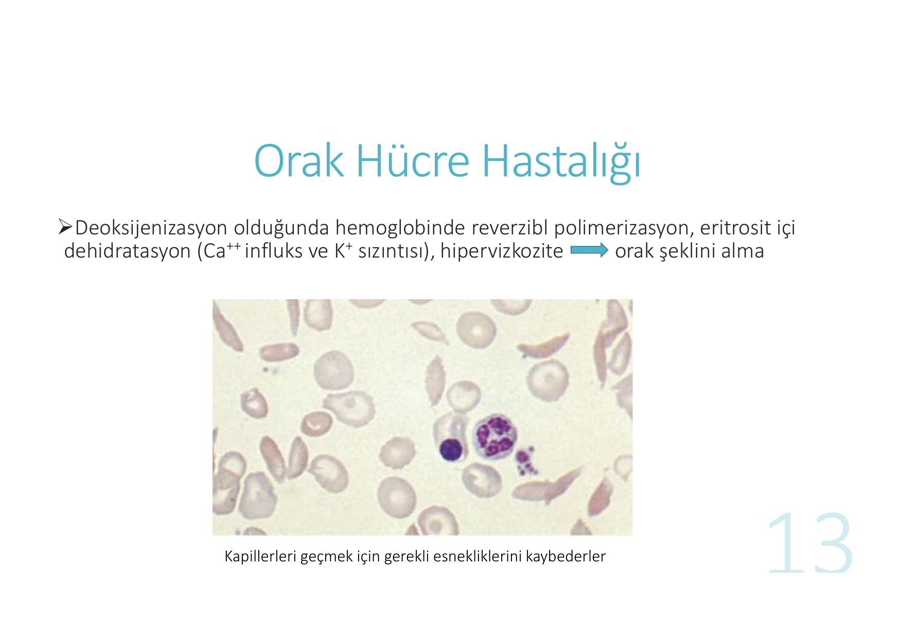

> **Histolojik yorum:** Periferik yaymada **orak şeklinde (drepanosit)** eritrositler net görünür. Normal biconcave eritrositlerin yanında **yarımay/orak şekilli, deforme** hücreler izlenir. Bazı hücrelerde **Howell-Jolly cisimcikleri** (nükleer kalıntılar) görülebilir -- bu fonksiyonel/anatomik aspleninin (oto-splenektomi sonucu) bulgusudur.

### Krizin Patofizyoloji Şeması (Mermaid)

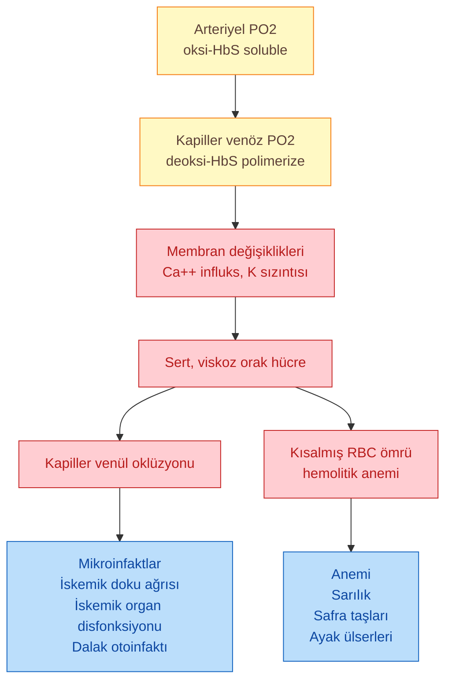

### Nitrik Oksid (NO) Etkisi

NO **vazodilatör** etkilidir; ek olarak hemoglobin fonksiyonunu modifiye eder, trombosit aktivasyonunu bloke eder ve orak hücrelerin endotele adhesivitesini azaltır.

> **Orak hücre hastalığında intravasküler hemoliz nedeniyle NO azalır** (serbest hem nedeniyle).

NO eksikliği vazokonstriksiyon ve inflamasyonu arttırır → **endotelyal disfonksiyon ve uç-organ vaskülopatisi**:

* Bacak ülserleri
* Nefropati
* Priapizm
* Pulmoner hipertansiyon
* İnme

### İnflamasyon ve Vazoekluzyon

* **WBC ve mast hücreleri** ile modifiye edilen inflamatuar değişiklikler vazoekluzyona katkıda bulunur
* Yüksek WBC sayısı ile **ağrı derecesi, hemorajik inme ve mortalite** arasında ilişki bulunmuştur

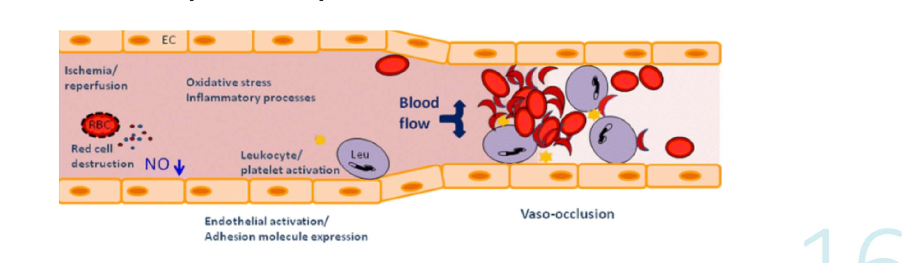

> **Şema yorumu (Vazo-oklüzyon kaskadı):**
>
> Görselde damar lümeninde orak hücre hastalığında oluşan **çok bileşenli vazoekluzyon süreci** gösterilir:
>
> * **Sol bölge (başlangıç):** İskemi/reperfüzyon hasarı + **eritrosit yıkımı (RBC destruction)** → serbest hem salınımı → **NO azalması (NO↓)**. Eş zamanlı **oksidatif stres** ve inflamatuar süreçler aktive olur.
> * **Orta bölge:** **Endotel aktivasyonu** ve **adhezyon molekülü ekspresyonu** (P-selektin, E-selektin, VCAM-1) artışı. **Lökosit ve trombosit aktivasyonu** -- bu hücreler endotele yapışır.
> * **Sağ bölge (sonuç):** Aktive lökosit, trombosit ve orak eritrosit kümeleri **damar lümenini tıkar** -- klasik **vazo-oklüzyon** tablosu. Kan akımı (Blood flow) durur.
>
> **🔑 Klinik anlamı:** Bu şema, orak hücre krizinin **sadece eritrosit oraklaşması olmadığını**, aynı zamanda lökosit/trombosit/endotel etkileşimini içeren karmaşık bir inflamatuar olay olduğunu özetler. Bu yüzden tedavide:
> * **Crizanlizumab** (P-selektin inhibitörü) → adhezyonu bloklar
> * **Hidroksiüre** → WBC sayısını da azaltır (ek faydası)
> * **L-arginin** → NO yolağını destekler

### Orak Hücre Hastalığı Bir Hiperkoagulabl Durumdur

* İnflamatuar sitokinlerin indüklenmesi
* RBC membranlarından dökülen **mikropartiküller**
* Endotel disfonksiyonu
* Sito-adeziv proteinler aracılığı ile RBC'nin endotele yapışması
* İskemi-reperfüzyon hasarı
* **Doku faktörü (TF)** ekspresyonu (monositler, mikropartiküller)
* **Trombosit aktivasyonu**
* Koagülasyon yolak aktivasyonu ve trombin oluşumu
* İntravasküler hemoliz → serbest hem → NO azalması

---

## KLİNİK BULGULAR VE KOMPLİKASYONLAR

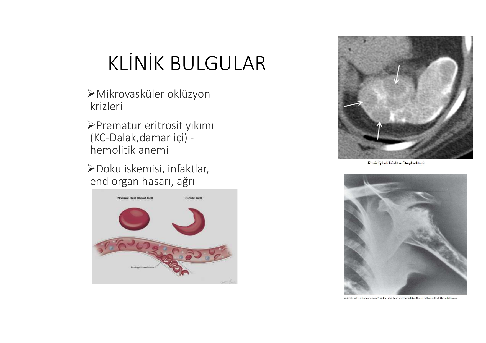

> **Görsel yorumu:** Görselde solda **normal biconcave eritrosit ile orak hücrenin karşılaştırması** gösterilmektedir -- orak hücrenin uç ucuna uzun, sert yapısı kapilleri tıkayabilir. Sağda kemik kesitinde **erken kemik infaktı** ve omuz/femur başında **aseptik nekroz** (avasküler nekroz) görünmektedir; bu, vazoekluzif krizlerin uzun dönem sonucudur.

**Üç ana mekanizma:**

1. **Mikrovasküler oklüzyon krizleri**
2. **Prematür eritrosit yıkımı** (KC-Dalak, damar içi) → hemolitik anemi
3. **Doku iskemisi, infarktlar, end organ hasarı, ağrı**

### Sistem Bazlı Komplikasyonlar

| Sistem | Komplikasyonlar | Klinik bulgular |
|---|---|---|
| **Serebrovasküler** | İskemik inme | Hemiparezi, ciddi başağrısı, disfazi |
| **Kardiyak** | Kardiyomyopati, kalp yetmezliği, MI, aritmiler | Ani ölüm |
| **Sirkulatuar** | Splenik sekestrasyon, fonksiyonel aspleni, VTE | Çocukta splenomegali, Hb'de ani düşme |
| **Genitoüriner** | Renal disfonksiyon, priapizm | Hematüri, proteinüri, ağrılı sürekli ereksiyon |
| **Hepatobilier** | Kolelitiazis, hepatik fibroz | Karın ağrısı, hepatomegali |
| **Göz** | Proliferatif retinopati, retina dekolmanı | Ağrı, görme bulanıklığı, körlük |
| **Pulmoner** | **Akut göğüs sendromu**, pulmoner hipertansiyon | Pulmoner enfeksiyon, göğüs ağrısı, öksürük, dispne |
| **İskelet sistemi** | Daktilit, **aseptik nekroz** | Şiş el-ayak parmakları, ağrı, mobilitede azalma |
| **Endokrinolojik** | Geciken puberte, gelişme geriliği, osteoporoz | Boy kısalığı, fraktürler |
| **Gebelik** | IUGR, fetal ölüm, düşük doğum ağırlığı, preeklampsi | Maternal ve fetal morbidite/mortalite |

---

## ORAK HÜCRE TAŞIYICILIĞI

* Genellikle **asemptomatik**, Hb-MCV normal, **HbS %40 civarı**
* **Ağrısız hematüri** (genellikle adölesan erkeklerde papiller nekroz sonucu)
* İzostenüri, nadiren üreterin dökülen papillalar ile tıkanması
* **⚠️ Ağır egzersiz / dehidratasyon / yüksek irtifaya** bağlı ağrılı kriz; masif oraklaşma sonucu **ani ölüm** bildirilmiştir
* Tromboemboli/böbrek hastalığı riskinde hafif artış

---

## TEDAVİ

### Hedefe Yönelik Tedavi Stratejileri

| Mekanizma | İlaç | Detay |
|---|---|---|
| **Fetal Hb (HbF) üretimini arttırma** | **Hidroksiüre** | 10-30 mg/kg/gün; HbF artışı polimerizasyonu inhibe eder. Tedavinin **temel taşıdır** |
| | Gen terapisi | β-globin gen editing, antisickling D globin, γ-globin gen ekspresyonu artışı |
| **Hemoglobin polimerizasyonu inhibisyonu** | **L-glutamin** | Hidroksiüre ile atak devam eden veya tolere edemeyen tüm hastalarda |
| | **Voxelotor** | HbS molekülünü oksi- konfigürasyonunda korur; semptomatik ve ciddi anemide |
| **Hücre adezyonu azaltılması** | **Crizanlizumab** | P-selektin inhibitörü; HU ve glutamine dirençli hastalarda |
| **Oksidatif stres azaltılması** | L-glutamin, L-arginin, katepsin B inhibitörleri | -- |
| **Küratif** | Allojenik kemik iliği nakli | Tek kür şansı |
| | Gen tedavisi | β-globin/γ-globin gen modifikasyonu |

### Vazoekluzif Krizlerin Önlenmesi

> **Hidroksiüre tedavinin temel taşıdır:**
> * Polimerizasyon sürecini inhibe eden HbF miktarını arttırır
> * Akut vazoekluzif ağrı ataklarını ve vazoekluzif olay sıklığını azaltır (akut göğüs sendromu, inme vb.)
> * Hastaneye yatış oranını azaltır ve **sağkalımı arttırır**

**Kan transfüzyonu endikasyonları (önleme amaçlı):**
* Cerrahi öncesi
* İnme ve akut göğüs sendromu önlenmesi
* Tedavide: semptomatik anemi, akut inme, akut göğüs sendromu, multiorgan yetmezliği (MOY)

### Orak Hücre Ağrılı Krizin Akut Tedavisi

* Çoğu kriz **evde oral hidrasyon ve analjezi** ile yatıştırılabilir
* **Hidrasyon** (agresif ama dikkatli)
* **Oksijen verilmesi**
* Tetikleyen nedenin araştırılıp düzeltilmesi: dehidratasyon, enfeksiyon, asidoz, aşırı yoğun egzersiz, sıcak/soğuk maruziyeti
* **Analjezi:** **Morfin sülfat 0.1-0.15 mg/kg, her 3-4 saatte bir**
* Kemik ağrısı **ketorolak**'a iyi yanıt verir (30-60 mg sonrası her 3-4 saatte 15-30 mg)
* Çoğu kriz **1-7 günde yatışır**
* **⚠️ Transfüzyon ağrılı kriz süresini KISALTMAZ**; sadece ciddi olgularda düşünülmelidir

---

## AKUT GÖĞÜS SENDROMU

> 🚨 **Tıbbi bir acildir. Yoğun bakımda takip edilmesi düşünülmelidir.**

**Klinik tanım:** Göğüs ağrısı + öksürük + ateş + hipoksi + akciğerde infiltrasyonlar

**Tedavi:**
* **Oksijen inhalasyonu**
* Pnömoni ve PTE ekartasyonu
* **Dikkatli hidrasyon** (Pulmoner ödem riski!)
* **Hct >30** olacak şekilde transfüzyon
* SpO₂ <%90 ise → **Exchange transfüzyon**

---

## TRANSFÜZYON

### Genel Prensipler

* **Kronik anemi** genelde Hb <7 g/dL olmadıkça transfüzyon gerektirmez
* Kronik transfüzyonlarda riskler: **demir yüklenmesi**, mikroorganizma bulaşı, **alloimmunizasyon**, diğer transfüzyon komplikasyonları
* **⚠️ Akut atakta transfüzyon viskoziteyi arttırır**

### Endikasyonlar

* Semptomatik anemi
* **Aplastik kriz**
* Splenik veya hepatik **sekestrasyon krizi**
* **Akut göğüs sendromu**
* **Major cerrahi öncesi**

### Kronik Transfüzyon Programı Endikasyonları

* SVO (serebrovasküler olay) öyküsü
* Çocuklarda SVO **primer profilaksisi** (transkraniyal Doppler ile yüksek risk varsa)
* Ciddi ağrılı kriz öyküsü
* Ciddi kardiyopulmoner hastalık öyküsü
* Komplike gebelikler

### Exchange Transfüzyon Endikasyonları

| Durum | Endikasyon |
|---|---|
| Akut göğüs sendromu | SpO₂ <%90 ise |
| **Akut inme** | Mutlak |
| **Akut multiorgan yetmezliği (MOY)** | Mutlak |
| **Ciddi akut priapizm** | Mutlak |
| Kronik dönemde kullanım | Demir yüklenmesini azaltır ama donör maruziyetini arttırır |

### İmmunizasyon ve Enfeksiyon Profilaksisi

> **⚠️ Aspleni!** Bakteriyel ve viral enfeksiyonlara yatkınlık.

* **Ateş tıbbi acildir** -- parenteral antibiyotik açısından mutlaka değerlendirilmelidir
* **5 yaş üzeri** çocuklarda penisilin profilaksisi
* **Kapsüllü m.o**'lara karşı aşılar (pnömokok, meningokok, Hib)
* COVID-19 aşısı, yıllık influenza aşısı

---

## TALASEMİLER

### Patogenez

> α veya β globin sentezinde **kalıtımsal bozukluklar**.

* Mutasyonlar globin üretiminin herhangi bir basamağında olabilir: transkripsiyon, translasyon, post-translasyonel
* **Dengelenmemiş α veya β subuniti birikir**
* Ağır formlarda dengelenmemiş zincir birikimi → **toksik inklüzyon cisimcikleri** → kemik iliğinde eritroblast ölümü → **inefektif eritropoez**
* Periferik kana çıkan az sayıda eritrositlerdeki inklüzyon cismi nedeniyle bunlar da **dalakta yıkılır** (hemoliz)
* Derin anemi → **EPO artışı** indüklenir → **eritroid hiperplazi** → ekstrameduller hematopoez
* **Masif kemik iliği ekspansiyonu**

### Klinik Bulgular

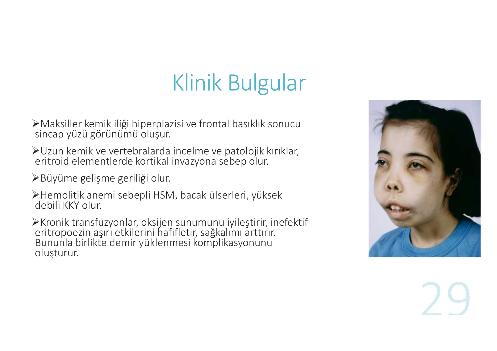

> **Klinik foto yorumu:** Görseldeki çocuk hastada talasemi majorun klasik fasiyal bulgularını izleyebiliriz: **maksiller kemik iliği hiperplazisi** sonucu yanak çıkıntıları ve burun köprüsü genişlemiş, **frontal basıklık** belirgindir -- bu karakteristik görünüm "**sincap yüzü**" (chipmunk facies) olarak adlandırılır. Aynı zamanda göz altında morluk (kronik anemi) ve yorgun-soluk genel görünüm dikkat çeker. Bu fasiyal değişiklikler kronik kompanse edilmemiş hemolitik anemi/inefektif eritropoez sonucu kemik iliğinin masif ekspansiyonundan kaynaklanır.

**Klinik bulgular:**
* **Sincap yüzü** görünümü (maksiller hiperplazi + frontal basıklık)
* Uzun kemik ve vertebralarda incelme, **patolojik kırıklar** (eritroid elementlerin kortikal invazyonu)
* **Büyüme-gelişme geriliği**
* Hemolitik anemi sebepli **HSM, bacak ülserleri, yüksek debili KKY**

### Talasemi Komplikasyonları

* Osteoporoz
* **Ekstrameduller hematopoez**
* Hipogonadizm
* Kolelitiazis
* **Tromboz**
* Pulmoner hipertansiyon
* Karaciğer bozuklukları
* Bacak ülserleri
* Hipotiroidi
* **Kalp yetmezliği**
* Diabetes mellitus (DM)

### Beta Talasemi Sınıflandırması

| Tip | Genotip | Klinik |
|---|---|---|
| **β-talasemi major** | β⁰/β⁰ | Transfüzyona bağımlı, ciddi mikrositik anemi |
| **β-talasemi intermedia** | β⁺/β⁺ veya β⁰/β⁺ | Orta şiddet |
| **β-talasemi trait (minör)** / sessiz taşıyıcı | β⁺/β veya β⁰/β | Hafif mikrositik anemi |

> * **β⁰:** Beta globin zinciri oluşumu **total olarak defektif**
> * **β⁺:** Bir miktar beta globin zinciri oluşumuna izin veren mutasyon

### Talasemi Genotip-Fenotip Özet Tablosu

#### Alfa Talasemiler (alfa globin zinciri azalması)

| Tip | Genotip | Klinik | Hb Elektroforezi |
|---|---|---|---|
| **Alfa talasemi major (Hidrops fetalis)** | (--/--) | Ciddi mikrositik anemi + hidrops fetalis; **in utero ölümcül** | Hb Barts (γ globin tetramerleri) + Hb Portland; HbF, HbA, HbA₂ **YOK** |
| **HbH hastalığı** | (α-/--) veya (αα^T/--) | Orta mikrositik anemi | HbH (%30'a kadar); HbA₂ (%4'e kadar) |
| **Alfa talasemi minör** (alfa talasemi trait) | (α-/α-) veya (αα/--) | Hafif mikrositik anemi | Hb Barts (yenidoğan döneminde %3-8) |
| **Alfa talasemi minima** (sessiz taşıyıcı) | (αα/α-) | Normal veya hafif düşük Hb/MCV | Normal |

#### Beta Talasemiler (beta globin zinciri azalması)

| Tip | Klinik | Hb Elektroforezi |
|---|---|---|
| **Transfüzyona bağımlı (TDT)** -- önceden β-talasemi major | Ciddi mikrositik anemi + target hücreler (tipik Hb 3-4 g/dL) | HbA₂ ≥%5; HbF (%95'e kadar); **HbA YOK** |
| **β-talasemi intermedia** | Hafif-orta mikrositik anemi | HbA₂ artmış; HbF artmış; HbA azalmış |
| **β-talasemi minör** | Hafif mikrositik anemi (taşıyıcılık) | HbA₂ artmış (%3.5'tan fazla); HbF (%5'e kadar) |

> **⚠️ ÖNEMLİ TUZAK:** **Demir eksikliği** olması, **HbA₂'yi düşük gösterebilir** ve beta talasemi trait varlığını gizleyebilir (yalancı normal görülür). Bu nedenle demir replasmanı yapıldıktan sonra hemoglobin elektroforezi bakılmalıdır.

---

## TALASEMİ TEDAVİSİ

### Standart Tedavi

* Talasemi majorlü hastalar **Hct %27-30** arasında tutup eritropoezi baskılamaya yetecek kadar **kronik transfüzyona** ihtiyaç duyar
* Yıllık transfüzyon gereksinimi fazlaysa **splenektomi**
* **Folik asit** replasmanı
* **Demir yüklenmesi** komplikasyonları için şelasyon tedavisi
* **Mutlaka endokrinolojik değerlendirme:** glukoz intoleransı, tiroid disfonksiyonu, gecikmiş puberte

### Luspatercept (Reblozyl)

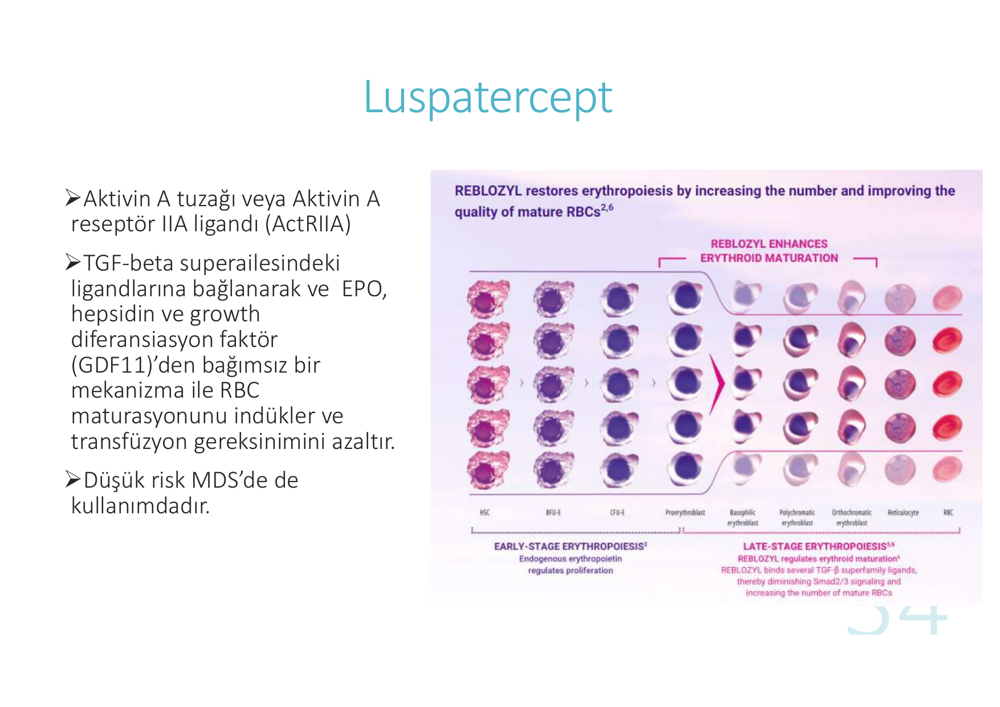

> **Şema yorumu:** Görselde eritropoez basamakları (HSC → BFU-E → CFU-E → proeritroblast → bazofilik/polikromatik/ortokromatik eritroblast → retikülosit → olgun RBC) gösterilir. **Endojen EPO** erken dönem eritroid proliferasyonu düzenlerken, **Luspatercept (Reblozyl) geç dönem maturasyonu** indükler -- TGF-β superailesindeki ligandlara bağlanarak Smad2/3 sinyalini azaltır ve olgun RBC sayısını arttırır.

**Mekanizma:**
* **Aktivin A tuzağı** veya Aktivin A reseptör IIA ligandı (ActRIIA)
* **TGF-β superailesindeki ligandlara** bağlanarak EPO, hepsidin ve growth diferansiasyon faktör (GDF11)'den bağımsız bir mekanizma ile **RBC maturasyonunu indükler**
* Transfüzyon gereksinimini azaltır
* **Düşük risk MDS'de de** kullanılmaktadır

### Splenektomi Endikasyonları

* Talasemiye bağlı **ciddi anemi varlığı**
* Transfüzyon gereksiniminde **ciddi artış** (yıl boyunca **2 katına çıkması**)
* **Gelişme geriliği**
* Ciddi sitopeniye yol açan **hipersplenizm**
* Semptomatik splenomegali
* **Splenik infaktı veya splenik ven trombozu**

### Beta Talasemi İntermedia Özellikleri

* Beta talasemi intermedialı hastalar **kronik transfüzyona gerek duymadan** hayatta kalabilirler
* Tipik **tanı yaşı 2-4 yaş**
* Klinik prezentasyon **heterojen**
* Anemiyi agreve edebilecek faktörler gelişebilir (enfeksiyonlar, hipersplenizm vs.)
* Bazılarında sonradan **transfüzyon bağımlılığı 3.-4. dekadda** veya eritropoetik stres dönemlerinde (gebelik, enfeksiyon) gelişebilir
* Bazılarında **ekstrameduller hematopoez** bulguları olabilir
* Transfüzyon bağımlı olmasalar da artan eritron nedeniyle **demir absorbsiyonu artabilir** ve hemosiderozis gelişebilir

> **Eritron:** Kırmızı kan hücreleri ve kemik iliğindeki prekürsörlerinin toplam kütlesi.

---

## HBF HEREDİTER PERSİSTANSI

> Erişkin yaşamda **HbF sentezinin sürmesidir** (%10-15'den 100'e kadar).

* **Zararlı bir etkisi yoktur** (HbF %100 olsa da)
* HbF **oraklaşmaya karşı koruyucudur**

---

## KAZANILMIŞ HEMOGLOBİNOPATİLER

### CO İntoksikasyonu ve Methemoglobinemi

* Kronik sigara içenlerde CO düzeyi **%10-15'e** çıkar ve sekonder polisitemiye neden olur
* **⚠️ CO, siyanoz oluşumunu gizler!**

### Klonal Anormallikler

* **MDS, eritrolösemi ve MPN**'lerde HbF artışı veya HbH hastalığının hafif formu görülebilir; genellikle ciddi değildir

---

## OKSİJEN AFİNİTESİNİ DEĞİŞTİREN HBPATİLER

### Yüksek O₂ Afiniteli Hb Varyantları (örn. Hb Yakima -- β99 Asp→His)

* **İzole eritrositoza** yol açarlar
* Hafif doku hipoksisi
* Protein bazlı elektroforezle saptanabilseler de normal saptanması yokluklarını ekarte etmez (genetik çalışma gerekebilir)
* Ekstrem olgularda Hct **%60-65'e çıkıp hipervizkozite** yaratabilir

### Düşük O₂ Afiniteli Hb Varyantları (örn. Hb Kansas -- β102 Asn→Lys)

* **Siyanoz ve/veya anemi**
* Genellikle **tedavi gerektirmezler**

---

## HEMOGLOBİNOPATİLERDE APLASTİK KRİZ

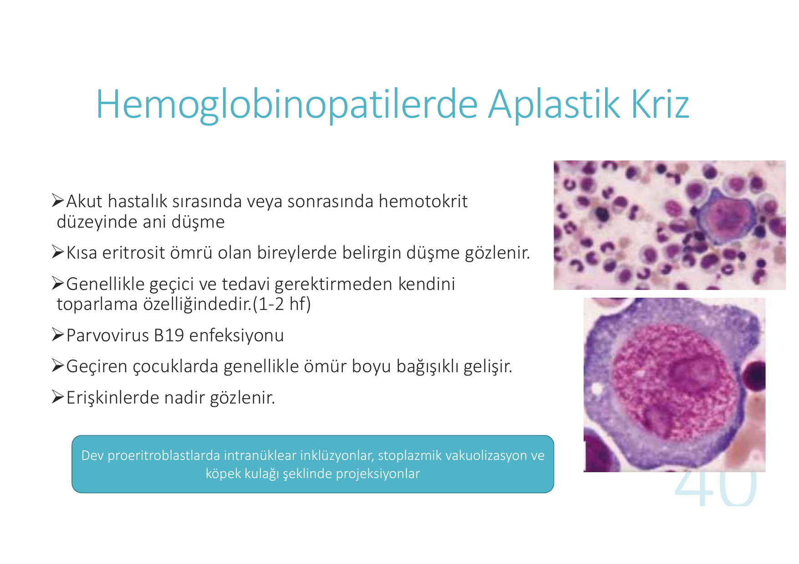

> **Histolojik yorum:** Görselde kemik iliği aspirasyonunda **dev (giant) proeritroblastlar** görülür. Karakteristik olarak:
> * **Geniş, mavi/mor sitoplazmalı**, çok büyük çekirdekli hücreler
> * Çekirdek içinde **intranükleer inklüzyon cisimcikleri** (parvovirüsün viral inklüzyonları)
> * Sitoplazmada **vakuolizasyon**
> * Hücrenin kenarında **"köpek kulağı" (dog-ear) şeklinde projeksiyonlar** (parvovirüs B19'un patognomonik bulgusu)
>
> Bu hücreler parvovirüs B19'un eritroid prekürsörlerde replikasyonunun morfolojik yansımasıdır; eritropoez bloke edildiği için **transient aplastik kriz** gelişir.

**Klinik özellikler:**

* Akut hastalık sırasında veya sonrasında **hematokritte ani düşme**
* **Kısa eritrosit ömrü olan bireylerde** belirgin düşme (hemolitik hastalıklarda kompansasyon yetmezliği)
* Genellikle geçici, **tedavi gerektirmeden 1-2 haftada** kendini toparlar
* En sık etken: **Parvovirus B19 enfeksiyonu**
* Geçiren çocuklarda genellikle **ömür boyu bağışıklık** gelişir
* **Erişkinlerde nadir** gözlenir

---

## ÖZET TABLO -- HEMOGLOBİNOPATİLER

| Konu | Anahtar Bilgi |
|---|---|
| **En sık genetik hastalık** | Talasemi (200 milyon kişi etkilenir) |
| **En sık yapısal Hbpati** | Orak hücreli anemi |
| **HbS mutasyonu** | β-globin geninde 6. aminoasit Glu→Val |
| **Erişkin Hb dağılımı** | HbA %96-97 · HbA₂ %2.5-3.5 · HbF <%2 |
| **Beta zincir mutasyonu klinik başlama** | 3-9 ay (HbF→HbA geçişi) |
| **Alfa zincir mutasyonu klinik başlama** | İn utero / doğumda |
| **Tedavinin temel taşı (orak)** | Hidroksiüre (HbF↑) |
| **Tıbbi acil orak hücre** | Akut göğüs sendromu, akut inme, MOY → exchange transfüzyon |
| **Talasemi major karakteristik** | Sincap yüzü, transfüzyona bağımlılık |
| **Demir eksikliği tuzak** | β-talasemi trait taramada gizleyebilir |
| **CO intoksikasyonu** | Siyanozu gizler |
| **Aplastik kriz etkeni** | Parvovirus B19 (dev proeritroblast) |
| **Sıtma korelasyonu** | Hemoglobinopatiler malarya endemik bölgelerde sık |
