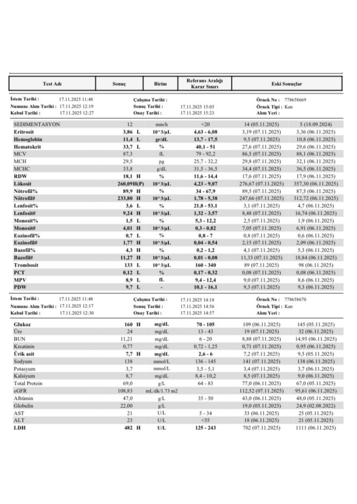
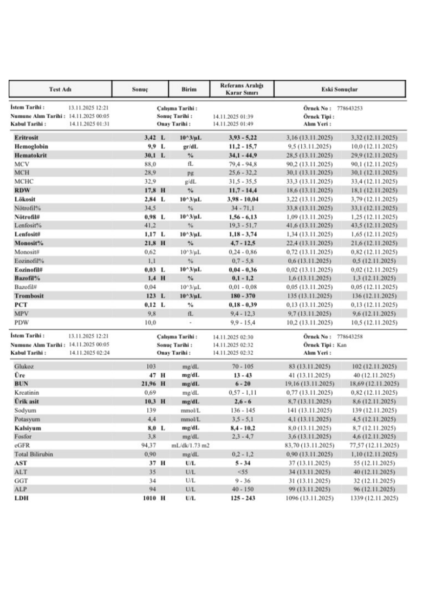
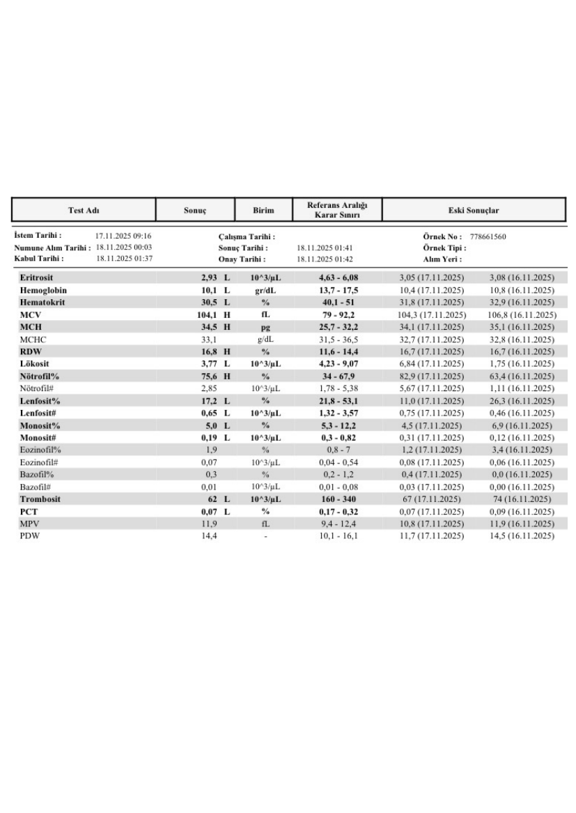
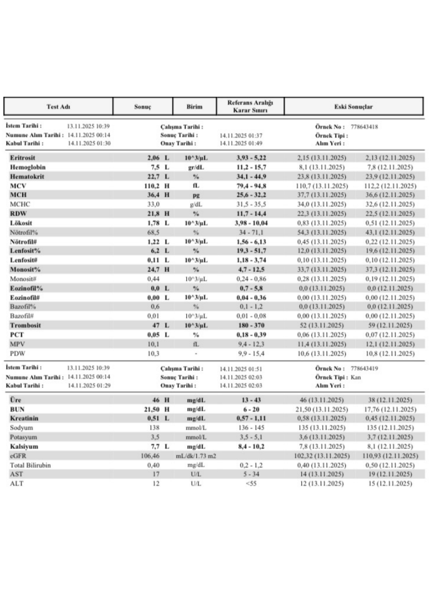
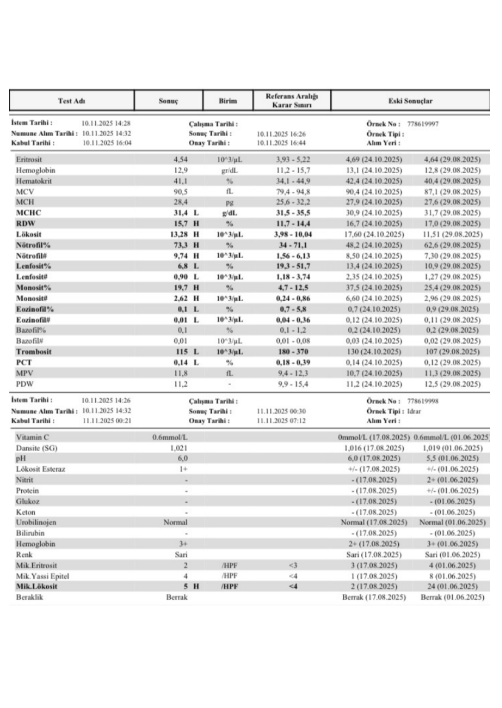

# HEMOGRAM OLGU SUNUMLARI

**Hazırlayan:** Dr. İrfan Yavaşoğlu
**Bölüm:** Aydın Adnan Menderes Üniversitesi Tıp Fakültesi -- İç Hastalıkları AD, Hematoloji BD
**Konu:** Gerçek hasta hemogramları üzerinden tanısal yaklaşım

---

## İÇİNDEKİLER

1. [Hemogram Yorumlamada Temel Yaklaşım](#hemogram-yorumlamada-temel-yaklaşım)
2. [Olgu 1 -- Lökositoz + Bisitopeni + Yüksek LDH](#olgu-1----lökositoz--bisitopeni--yüksek-ldh)
3. [Olgu 2 -- Pansitopeni + Monositoz](#olgu-2----pansitopeni--monositoz)
4. [Olgu 3 -- Pansitopeni + Makrositoz Şüphesi](#olgu-3----pansitopeni--makrositoz-şüphesi)
5. [Olgu 4 -- Ağır Pansitopeni + Belirgin Makrositoz](#olgu-4----ağır-pansitopeni--belirgin-makrositoz)
6. [Olgu 5 -- Lökositoz + Mutlak Monositoz + Hematüri](#olgu-5----lökositoz--mutlak-monositoz--hematüri)
7. [Sentez Tablosu -- 5 Olgu Karşılaştırması](#sentez-tablosu----5-olgu-karşılaştırması)

---

## HEMOGRAM YORUMLAMADA TEMEL YAKLAŞIM

> **Sistematik okuma kuralı (5 adım):**
>
> 1. **Hangi seriler etkilenmiş?** Eritrosit, lökosit, trombosit -- hangi(ler)i azalmış/artmış?
> 2. **Eritrosit indeksleri** -- MCV (mikrositer/normositer/makrositer), MCH, MCHC, **RDW** (anizositoz göstergesi)
> 3. **Lökosit alt grupları** -- nötrofil, lenfosit, monosit, eozinofil, bazofil mutlak ve göreceli
> 4. **Trombosit** sayısı + **MPV** (büyük mü küçük mü); **PCT** ve **PDW** ipuçları
> 5. **Kronoloji** -- önceki tetkikler ile karşılaştırma; akut mu, kronik mi, ilerleyici mi?

### Anahtar Eşik Değerler

| Parametre | Eşik / Kategori |
|---|---|
| **Hemoglobin** | Erkek <13 g/dL, Kadın <12 g/dL → anemi |
| **MCV** | <80 fL mikrositer · 80-100 fL normositer · >100 fL makrositer |
| **RDW** | >14.5% anizositoz (etiyolojik anlamlı) |
| **Lökosit** | <4 K/μL lökopeni · >11 K/μL lökositoz · >50 K/μL ekstrem |
| **Mutlak nötrofil sayısı (ANC)** | <1.5 K/μL nötropeni · <0.5 K/μL **ağır nötropeni** (febril nötropeni riski) |
| **Mutlak lenfosit sayısı** | <1 K/μL lenfopeni |
| **Mutlak monosit sayısı** | >0.9 K/μL **mutlak monositoz** (CMML için önemli kriter) |
| **Trombosit** | <150 K/μL trombositopeni · <50 K/μL kanama riski · <20 K/μL **spontan kanama riski** |

### Sitopenilerin Genel Ayırıcı Tanısı

| Sitopeni paterni | Düşünülecek başlıca tanılar |
|---|---|
| **İzole anemi** | DEA, talasemi, hemolitik anemi, kronik hastalık anemisi, B12/folat eks. |
| **İzole lökositoz** | Enfeksiyon, lökemoid reaksiyon, KML, polisitemia vera, steroid etkisi |
| **İzole trombositopeni** | İTP, ilaç ilişkili, gebelik, EDTA-aglütinasyon (psödotrombositopeni) |
| **Bisitopeni / pansitopeni** | **MDS, akut lösemi, aplastik anemi, megaloblastik anemi**, hipersplenizm, kemoterapi, B12/folat eksikliği, sepsis, otoimmun |
| **Lökositoz + sitopeni** | **Akut lösemi**, KML blastik kriz, lökoeritroblastik tablo (kemik iliği infiltrasyonu) |
| **Lökositoz + monositoz** | CMML, enfeksiyon (TBC, EBV, CMV), kronik inflamasyon, sepsis recovery |

---

## OLGU 1 -- LÖKOSİTOZ + BİSİTOPENİ + YÜKSEK LDH

**Tarih:** 07.11.2025 (önceki: 06.11.2025)

### Hemogram Bulguları

| Parametre | Değer | Referans | Yorum |
|---|---|---|---|
| Eritrosit | **3.19** M/μL | 4.63-6.08 | ↓ Anemi |
| **Hemoglobin** | **9.5** g/dL | 13.9-17.8 | ↓↓ Orta anemi |
| Hematokrit | 27.6% | 40.1-51 | ↓ |
| **MCV** | **86.5** fL | 79-92 | Normositer |
| MCH | 29.8 pg | 27-32 | Normal |
| MCHC | 34.4 g/dL | 31-36.5 | Normal |
| **RDW** | **17.6%** | 11.6-14.4 | ↑ Anizositoz |
| **Lökosit** | **27.66** K/μL | 4.5-11 | ↑↑ **Lökositoz** |
| Nötrofil% | 89.5% | 40-70 | ↑ |
| **Nötrofil#** | **24.77** K/μL | 1.8-7.7 | ↑↑ Belirgin nötrofili |
| Lenfosit% | 3.1% | 20-40 | ↓ Göreceli lenfopeni |
| Lenfosit# | 0.85 K/μL | 1.0-4.0 | ↓ |
| Monosit% | 2.5% | 2-10 | Normal |
| Eozinofil% | 0.8% | 1-6 | Düşük |
| Bazofil% | 4.1% | 0-1 | ↑ **Mutlak bazofili anlamlı olabilir** |
| **Trombosit** | **89** K/μL | 150-400 | ↓ Trombositopeni |
| MPV | 9.0 fL | 9.4-12.4 | Sınırda düşük |

### Biyokimya Bulguları

| Parametre | Değer | Yorum |
|---|---|---|
| **LDH** | **702 → 1111** | ↑↑↑ **Çok yüksek** |
| Ürik asit | 7.2 → 9.5 | ↑ Hiperürisemi (yüksek hücre döngüsü) |
| BUN | 8.88 → 14.95 | Sınırda |
| Glukoz | 109 → 145 | Hafif yüksek |
| Total Protein | 67-77 | Normal |
| Albümin | 43-48 | Normal |
| AST/ALT | 33/18 | Normal |
| Kalsiyum | 4.5 → 9.0 | İlk değer çok düşük (büyük olasılıkla preanalitik hata; ikinci ölçüm normal) |

### Önemli Bulgular ve Sentez

> **🚨 KRİTİK BULGULAR:**
> * **Bisitopeni** (anemi + trombositopeni) zemininde **belirgin lökositoz (~28 K/μL) + nötrofili (~25 K/μL)**
> * **LDH ÇOK YÜKSEK (>1000)** -- yüksek hücre yıkım/döngüsü göstergesi
> * **Hiperürisemi** (9.5) -- yine yüksek hücre döngüsünü destekler
> * **Bazofili (%4)** -- normalin üstünde; **KML** için önemli bir ipucudur
> * RDW yüksek (anizositoz)

### Olası Tanılar

| Olasılık | Tanı | Destekleyen Bulgular |
|---|---|---|
| **Çok güçlü** | **Kronik Miyeloid Lösemi (KML) veya Akut Lösemi** | Lökositoz + bisitopeni + LDH ↑↑↑ + ürik asit ↑ + bazofili |
| **Güçlü** | **Akut lösemi (AML/ALL)** | Bisitopeni + LDH yüksek + lökositoz |
| Olası | Lökoeritroblastik reaksiyon (kemik iliği infiltrasyonu) | RDW ↑ + bisitopeni + nötrofili |
| Daha az olası | Lökemoid reaksiyon (ağır enfeksiyon, sepsis) | Lökositoz + nötrofili; ancak bazofili ve LDH ↑↑↑ enfeksiyon için tipik değil |

> **🔑 Klinik kararı sıkıştıran ipucu:** Bazofili + LDH'nin saatler içinde 700'den 1100'e çıkmış olması (ilerleyici hastalık) + bisitopeni → **lösemi spektrum** (özellikle KML akselere/blastik faz veya AML) için yüksek risk.

### İleri İnceleme Planı

1. **Periferik yayma** -- blast var mı? Granülosit dizisinin tüm aşamaları görülüyor mu (KML için karakteristik)? Bazofil/eozinofil sayımı?
2. **Kemik iliği aspirasyon + biyopsi**
3. **Sitogenetik:** **Philadelphia kromozomu (t(9;22))** ve **BCR-ABL** PCR (KML için)
4. **Akım sitometri** (akut lösemi şüphesinde fenotipleme)
5. **Tümör lizis sendromu paneli:** ürik asit, K, Ca, fosfor, böbrek fonksiyonları (LDH ↑↑↑ → tedavi başlangıcında TLS riski)
6. **İmmunofenotipleme + mutasyon paneli** (FLT3, NPM1, IDH1/2 -- AML şüphesinde)

---

## OLGU 2 -- PANSİTOPENİ + MONOSİTOZ

**Tarih:** 13.11.2025 (önceki: 12.11.2025)

### Hemogram Bulguları

| Parametre | Değer | Referans | Yorum |
|---|---|---|---|
| Eritrosit | **3.16** M/μL | 3.93-5.22 | ↓ |
| **Hemoglobin** | **9.5** g/dL | 11.2-15.7 | ↓ Orta anemi |
| Hematokrit | 28.5% | 34.1-44.9 | ↓ |
| MCV | 90.2 fL | 79.4-94.8 | Normositer |
| MCHC | 33.3 g/dL | 31.5-35.5 | Normal |
| **RDW** | **18.6%** | 11.7-14 | ↑ Belirgin anizositoz |
| **Lökosit** | **3.22** K/μL | 3.98-10.04 | ↓ Lökopeni |
| Nötrofil% | 33.8% | 41-71 | ↓ |
| **Nötrofil#** | **1.09** K/μL | 1.56-6.13 | ↓ Nötropeni (sınırda) |
| Lenfosit% | 42% | 20-40 | Sınırda yüksek |
| Lenfosit# | 1.34 K/μL | 1.18-3.74 | Normal |
| **Monosit%** | **22.4%** | 4.7-12.8 | ↑↑ Belirgin göreceli monositoz |
| **Monosit#** | **0.72** K/μL | 0.24-0.86 | Üst sınıra yakın |
| Eozinofil% | 0.6% | 0.7-5.8 | Düşük |
| Bazofil# | 0.05 K/μL | 0.01-0.08 | Normal |
| **Trombosit** | **135** K/μL | 150-450 | ↓ Hafif trombositopeni |
| MPV | 9.7 fL | 9.4-12.3 | Normal |

### Biyokimya Bulguları

| Parametre | Değer | Yorum |
|---|---|---|
| Glukoz | 83-103 | Normal |
| BUN | 19.16 | Üst sınır |
| Kreatinin | 0.69 | Normal |
| **Ürik asit** | **8.7** | ↑ Hiperürisemi |
| **Kalsiyum** | **8.0** | Sınırda düşük |
| GFR | 94 mL/dk/1.73 m² | Normal |
| Total Bilirubin | 0.90 | Normal |
| AST/ALT | 25/24 | Normal |
| ALP | 99 | Normal |
| GGT | 31 | Normal |
| **LDH** | **1096 → 1339** | ↑↑↑ Çok yüksek ve **artıyor** |

### Önemli Bulgular ve Sentez

> **🚨 KRİTİK BULGULAR:**
> * **Trisitopeni** (anemi + lökopeni + sınırda trombositopeni) → **pansitopeni paterni**
> * **Mutlak monosit yakın 1 K/μL** + **göreceli monositoz %22** → **CMML kriteri için sınırda** (CMML tanısında mutlak monosit ≥1 K/μL ve göreceli ≥%10 birlikte aranır)
> * **RDW belirgin yüksek (18.6)** → eritroid serisinde olgunlaşma bozukluğu
> * **LDH çok yüksek ve ilerliyor** (1096 → 1339)
> * **Hiperürisemi**
> * Nötrofili yok ama **mutlak nötrofil 1.09** -- sınırda nötropeni (febril nötropeni eşiği değil)

### Olası Tanılar

| Olasılık | Tanı | Destekleyen Bulgular |
|---|---|---|
| **Çok güçlü** | **MDS / Miyelodisplastik Sendrom** | Pansitopeni + RDW ↑↑ + LDH ↑ + monositoz |
| **Güçlü** | **CMML (Kronik Miyelomonositik Lösemi)** | Monositoz + sitopeniler + LDH ↑ |
| Olası | Megaloblastik anemi (B12/folat eksikliği) | Pansitopeni + RDW ↑; ancak MCV normositer (90) -- aleyhine |
| Olası | Aplastik anemi | Pansitopeni; ancak monositoz ve LDH yüksekliği aleyhine |
| Daha az olası | Akut lösemi (alösemik form) | Pansitopeni + LDH ↑; periferik yaymada blast varsa düşünülür |
| Sekonder | Kronik enfeksiyon, otoimmun, ilaç toksisitesi, viral enf. | İlk değerlendirmede dışlanmalı |

### İleri İnceleme Planı

1. **Periferik yayma** -- displazi bulguları (Pelger-Huët anomalisi, hipogranüler nötrofiller, displastik monositler), blast yüzdesi, şistosit
2. **Retikülosit sayımı** (kemik iliği yanıtını değerlendirir)
3. **B12, folat, demir profili (ferritin, transferrin satürasyonu, demir, TDBK)**
4. **Direkt antiglobulin testi (DAT)** -- otoimmun komponent
5. **Viral seroloji:** HIV, HBV, HCV, EBV, CMV, parvovirüs B19
6. **Kemik iliği aspirasyon + biyopsi + sitogenetik + akım sitometri** -- displazi, blast, dizziness sınıflama (WHO 2022)
7. **Karın USG** -- splenomegali (CMML, KML, MPN); hepatomegali

---

## OLGU 3 -- PANSİTOPENİ + MAKROSİTOZ ŞÜPHESİ

**Tarih:** 17.11.2025 (önceki: 16.11.2025)

### Hemogram Bulguları

| Parametre | Değer | Referans | Yorum |
|---|---|---|---|
| Eritrosit | **2.93** M/μL | 4.63-6.08 | ↓↓ Belirgin azalma |
| **Hemoglobin** | **10.1** g/dL | 13.9-17.8 | ↓ Orta anemi |
| Hematokrit | 30.5% | 40.1-51 | ↓ |
| **MCV** | **~104** fL | 79-92 | ↑ **Makrositer** |
| MCH | 34.5 pg | 27-32 | ↑ Hiperkromik (makrositere paralel) |
| **RDW** | **16.8%** | 11-14 | ↑ Anizositoz |
| **Lökosit** | **3.77** K/μL | 4-10 | ↓ Lökopeni |
| Nötrofil% | 75.6% | 40-70 | ↑ Göreceli yüksek |
| Nötrofil# | 2.85 K/μL | 1.8-7.7 | Normal sınırda |
| Lenfosit% | 12% | 20-40 | ↓↓ Göreceli lenfopeni |
| **Lenfosit#** | **0.65** K/μL | 1.0-4.0 | ↓↓ Mutlak lenfopeni |
| Monosit% | 8.0% | 2-10 | Normal |
| Monosit# | 0.31 K/μL | 0.2-0.8 | Normal |
| Eozinofil% | 1.9% | 0.7-5.8 | Normal |
| Bazofil% | 0.3% | 0-1 | Normal |
| **Trombosit** | **51** K/μL | 150-400 | ↓↓ **Belirgin trombositopeni** |
| PCT | 0.07% | 0.17-0.32 | ↓ |
| MPV | 11.9 fL | 9.4-12.4 | Üst sınır |
| PDW | 14 | 9.9-15.4 | Üst sınır |

### Önemli Bulgular ve Sentez

> **🚨 KRİTİK BULGULAR:**
> * **Pansitopeni** (üç hat etkilenmiş): orta anemi, lökopeni, **belirgin trombositopeni (51)**
> * **Makrositer anemi** (MCV ~104, MCH ~34.5)
> * **RDW yüksek** (16.8) -- karışık eritrosit popülasyonu
> * **Mutlak lenfopeni** (0.65)
> * Nötrofil mutlak normal aralıkta -- bu, "lökopeniye rağmen göreceli nötrofili" tablosu: lökositlerin azalması özellikle **lenfosit kaybı** üzerinden olmuş
> * MPV/PDW üst sınırda → büyük trombositler → **kemik iliği** trombositi telafi etmeye çalışıyor olabilir

### Olası Tanılar

| Olasılık | Tanı | Destekleyen Bulgular |
|---|---|---|
| **Çok güçlü** | **Megaloblastik anemi (B12 / folat eksikliği)** | Pansitopeni + makrositoz + RDW ↑ + lenfopeni |
| **Güçlü** | **MDS** | Pansitopeni + makrositoz + RDW ↑ |
| Olası | İlaç toksisitesi (metotreksat, hidroksiüre, KT ajanları) | Pansitopeni + makrositoz |
| Olası | Alkolik karaciğer hastalığı | Makrositoz; ancak izole değil, pansitopeni yok genelde |
| Olası | Hipotiroidizm | Makrositoz; ek pansitopeni nadir |
| Daha az olası | Aplastik anemi (hipoplastik MDS) | Pansitopeni; ancak MCV genelde normositerdir |

### İleri İnceleme Planı

1. **Periferik yayma:** Hipersegmente nötrofiller (>5 lob), oval makrositler, **megaloblast** -- B12/folat eksikliği için klasik bulgular
2. **B12, folat (serum + RBC folat), MMA (metilmalonik asit), homosistein**
3. **Retikülosit sayımı** -- megaloblastikte düşük olur
4. **LDH, indirekt bilirubin, haptoglobin** -- intramedüller hemoliz (megaloblastikte ↑↑ LDH klasik)
5. **TSH, T4** -- hipotiroidizm
6. **Ferritin, demir profili**
7. Yanıt yoksa veya eksiklik dışlandıysa: **kemik iliği aspirasyon + biyopsi + sitogenetik** (MDS değerlendirmesi için)

---

## OLGU 4 -- AĞIR PANSİTOPENİ + BELİRGİN MAKROSİTOZ

**Tarih:** 13.11.2025 (önceki: 12.11.2025)

### Hemogram Bulguları

| Parametre | Değer | Referans | Yorum |
|---|---|---|---|
| **Eritrosit** | **2.06** M/μL | 3.93-5.22 | ↓↓↓ **Çok düşük** |
| **Hemoglobin** | **7.81** g/dL | 12.2-15.7 | ↓↓↓ **Ağır anemi** -- transfüzyon eşiğine yakın |
| Hematokrit | 23.8% | 34.1-44.9 | ↓↓ |
| **MCV** | **110.7** fL | 79-94.8 | ↑↑ **Belirgin makrositer** |
| **MCH** | **37.7** pg | 26-31.2 | ↑↑ Çok yüksek |
| MCHC | 34.0 g/dL | 31.5-35.5 | Normal |
| **RDW** | **22.3%** | 11-14 | ↑↑↑ **Çok belirgin anizositoz** |
| **Lökosit** | **0.83** K/μL | 3.98-10.04 | ↓↓↓ **Ağır lökopeni** |
| Nötrofil% | -- | -- | -- |
| **Nötrofil# (ANC)** | **0.45** K/μL | 1.56-6.13 | ↓↓↓ **AĞIR NÖTROPENİ** -- **agranülositoz sınırı** |
| Lenfosit% | 12% | 20-40 | ↓ |
| **Lenfosit#** | **0.10** K/μL | 1.18-3.74 | ↓↓↓ **Çok ağır lenfopeni** |
| Monosit% | 33.7% | 4.7-12.8 | ↑ Göreceli monositoz |
| Monosit# | 0.28 K/μL | 0.24-0.86 | Normal sınırda (göreceli yüksek, mutlak normal) |
| Eozinofil# | 0.00 | 0.04-0.36 | ↓ |
| Bazofil# | 0.00 | 0.01-0.08 | ↓ |
| **Trombosit** | **52** K/μL | 150-450 | ↓↓ Ağır trombositopeni |
| MPV | 11.4 fL | 9.4-12.3 | Üst sınır |

### Biyokimya Bulguları

| Parametre | Değer | Yorum |
|---|---|---|
| Üre | 46 | Yüksek |
| BUN | 21.50 | ↑ |
| **Kreatinin** | **0.51** | Düşük (kas kütlesi az olabilir, malnütrisyon, yaşlı) |
| Sodyum | 138 | Normal |
| Potasyum | 3.5 | Sınırda düşük |
| **Kalsiyum** | **7.7** | ↓ Hipokalsemi |
| GFR | 106 mL/dk/1.73 m² | Normal |
| Total Bilirubin | 0.40 | Normal |
| AST/ALT | 17/12 | Normal |

### Önemli Bulgular ve Sentez

> **🚨 ACİL DURUM:**
>
> * **Ağır pansitopeni** -- üç hat da ileri derecede etkilenmiş
> * **ANC = 450/μL → AĞIR NÖTROPENİ** (febril nötropeni eşiği <500); **enfeksiyon riski çok yüksek**, **acil izolasyon** gerekebilir
> * **Belirgin makrositoz (MCV 110.7) + MCH 37.7 + RDW 22.3** -- **megaloblastik anemi paterni** (klasik üçlü)
> * **Trombositopeni (52)** + ağır anemi (Hb 7.8) → kanama riski + transfüzyon ihtiyacı yakın
> * **Mutlak lenfopeni 0.10 K/μL** -- olağanüstü düşük; immun yetmezlik düşündürür
> * **Hipokalsemi (7.7)** -- malnütrisyon eşliği olabilir

### Olası Tanılar

| Olasılık | Tanı | Destekleyen Bulgular |
|---|---|---|
| **Çok güçlü** | **Megaloblastik anemi (B12 / folat eksikliği)** | MCV 110.7 + MCH 37.7 + RDW 22.3 + pansitopeni klasik tablo |
| **Güçlü** | **MDS (yüksek riskli, RAEB veya RA-RS)** | Ağır pansitopeni + makrositoz + RDW ↑↑↑ |
| **Güçlü** | **Akut lösemi (alösemik veya hipolösemik form)** | Pansitopeni + ağır lökopeni; periferik yaymada blast varsa |
| Olası | **Aplastik anemi** | Pansitopeni + ağır nötropeni; ancak MCV genelde normositerdir, RDW çok yükselmez |
| Olası | İlaç toksisitesi (kemoterapi, metotreksat, hidroksiüre, klorampenikol, sülfa) | Ağır pansitopeni; ilaç öyküsü kritik |
| Olası | Kemik iliği infiltrasyonu (lenfoma, miyelom, metastatik kanser) | Pansitopeni + lökoeritroblastik bulgular |

### İleri İnceleme Planı

> **⚠️ ACİL ADIMLAR (öncelikli):**
> 1. **İzolasyon** ve nötropenik diyet
> 2. **Kan kültürü** + ateş varsa **ampirik geniş spektrumlu antibiyotik** (febril nötropeni protokolü)
> 3. **Trombosit transfüzyonu hazırlığı** (kanama varsa veya <10-20 K)
> 4. **Eritrosit transfüzyonu** (Hb <8 ve semptom)

**Etyolojik araştırma:**
1. **Periferik yayma** -- megaloblast, hipersegmente nötrofil, blast, displazi, lökoeritroblastik bulgu
2. **B12, folat, MMA, homosistein** (megaloblastik tarama)
3. **LDH, indirekt bilirubin, haptoglobin** -- ineffective eritropoez (megaloblastikte çok yüksek)
4. **Retikülosit sayımı**
5. **Ferritin, demir profili**
6. **Tiroid fonksiyonu (TSH, fT4)**
7. **Viral seroloji** (HIV, HBV, HCV, parvovirüs B19, EBV, CMV)
8. **İlaç öyküsü** detaylı sorgulanmalı
9. **Kemik iliği aspirasyon + biyopsi + sitogenetik + akım sitometri** -- esansiyel
10. Sitogenetik MDS/AML için (kompleks karyotip, monozomi 7, trizomi 8 vb.)

---

## OLGU 5 -- LÖKOSİTOZ + MUTLAK MONOSİTOZ + HEMATÜRİ

**Tarih:** 10.11.2025 (önceki: 24.10.2025, 29.08.2025)

### Hemogram Bulguları

| Parametre | Değer | Referans | Yorum |
|---|---|---|---|
| MCV | 90.5 fL | 79.4-94.8 | Normositer |
| MCH | 28.4 pg | 26-31.2 | Normal |
| **MCHC** | **31** g/dL | 31.5-35.5 | ↓ Hafif düşük (hipokromi göstergesi olabilir) |
| **RDW** | **18.7%** | 11-14 | ↑↑ Anizositoz |
| **Lökosit** | **13.28** K/μL | 3.98-10.04 | ↑ **Lökositoz** |
| Nötrofil% | ~73 | 40-71 | Üst sınır |
| **Nötrofil#** | **9.74** K/μL | 1.56-6.13 | ↑ Nötrofili |
| Lenfosit% | 6.8% | 19.4-51.7 | ↓↓ Belirgin göreceli lenfopeni |
| **Lenfosit#** | **0.90** K/μL | 1.18-3.74 | ↓ **Mutlak lenfopeni** |
| **Monosit%** | **19.7%** | 4.7-12.8 | ↑↑ Belirgin göreceli monositoz |
| **Monosit#** | **2.62** K/μL | 0.24-0.86 | ↑↑↑ **Mutlak monositoz** -- 3 katından fazla |
| Eozinofil# | 0.09 | 0.04-0.36 | Normal |
| Bazofil# | 0.01 | 0.01-0.08 | Normal |
| **Trombosit** | **113** K/μL | 180-370 | ↓ Hafif trombositopeni |
| PCT | 0.14% | 0.18-0.39 | Sınırda |
| MPV | 8 fL | 9.4-12.3 | ↓ Düşük (küçük trombositler) |

### İdrar Tahlili Bulguları

| Parametre | Değer | Yorum |
|---|---|---|
| Dansite | 1.016 | Normal |
| pH | 6.0 | Normal |
| Lökosit esteraz | +/- | Sınırda (idrarda lökosit izi) |
| Nitrit | -- (önceki: 2+) | Eski örnekte pozitif (UTI öyküsü) |
| Protein | -- | Normal |
| Glukoz | -- | Normal |
| Keton | -- | Normal |
| **Hemoglobin** | **2+** | ↑↑ **Hematüri/hemoglobinüri** |
| Renk | Sarı | Normal |
| Mik. Eritrosit | 3 /HPF | Normal sınırda (Hb 2+ ile uyumsuz) |
| Mik. Lökosit | 4 /HPF | Sınırda |
| Mik. Yassı Epitel | 1 /HPF | Normal |

### Önemli Bulgular ve Sentez

> **🚨 KRİTİK BULGULAR:**
> * **Mutlak monositoz 2.62 K/μL** -- normalin 3 katından fazla; **CMML için ana kriter** (≥1.0 K/μL ve ≥%10) karşılanıyor (>3 ay sürüp sürmediği önemli)
> * **Lökositoz + nötrofili + lenfopeni** -- akut inflamatuvar yanıt veya kortikosteroid etkisi paterni
> * **Hafif trombositopeni** + **hafif anemi** (önceki ölçümler ile karşılaştırılmalı)
> * **RDW ↑↑** -- eritroid disregülasyon
> * **MPV düşük** -- küçük trombositler (kemik iliği baskılanması göstergesi olabilir)
> * **İdrarda Hb 2+ ama mikroskopik eritrosit sadece 3** → **hemoglobinüri** (intravasküler hemoliz) veya **miyoglobinüri**; ya da geçici makroskopik kanama sonrası dilüsyon
> * Eski örnekte **nitrit 2+** → **rezolve UTI öyküsü**
> * **Karşılaştırmalı seyir:** Önceki örneklere göre lökositoz ve monositoz **artıyor** (29.08'de WBC 11.5 → 24.10'da 17.6 → 10.11'de 13.3); monosit# 2.96 → 6.60 → 2.62

### Olası Tanılar

| Olasılık | Tanı | Destekleyen Bulgular |
|---|---|---|
| **Çok güçlü** | **CMML (Kronik Miyelomonositik Lösemi)** | Mutlak monositoz >1 + göreceli >%10 + hafif sitopeniler + RDW ↑ + persistant artış öyküsü |
| **Güçlü** | **Sekonder reaktif monositoz** (TBC, kronik enfeksiyon, EBV, otoimmun, granülomatöz hst.) | Lökositoz + monositoz + lenfopeni; kronik enfeksiyon paterni |
| Olası | **MDS** (monositoz alt tipi) | Pansitopeni eğilimi + RDW ↑ + monositoz |
| Olası | **Sepsis / iyileşme dönemi** | Lökositoz + nötrofili + monositoz (geç faz) |
| Olası | Kortikosteroid kullanımı | Nötrofili + lenfopeni; ancak monositoz daha az tipik |
| **İdrar bulgusu için:** | İntravasküler hemoliz, miyoglobinüri, böbrek/üroloji kanama, **kateter travması, taş, tümör** | İdrar Hb 2+ ama mikroskopik eritrosit az |

### İleri İnceleme Planı

1. **Periferik yayma** -- monosit morfolojisi (displastik mi?), blast varlığı, anormal granülosit alt tipleri, şistosit
2. **Mutlak monosit takibi** -- CMML tanısı için **>3 ay** persistan ≥1 K/μL gerek
3. **B12, folat, demir profili**
4. **LDH, indirekt bilirubin, haptoglobin, retikülosit, periferik yayma** -- intravasküler hemoliz dışlanması (idrarda Hb 2+ açıklanmalı)
5. **Direkt ve indirekt Coombs testi**
6. **Akciğer grafisi + PPD/IGRA** -- TBC dışlanması (monositoz nedeni)
7. **HIV, HCV, HBV, EBV, CMV serolojisi**
8. **Kemik iliği aspirasyon + biyopsi + sitogenetik + moleküler** (CMML şüphesinde):
   * Sitogenetik
   * **TET2, SRSF2, ASXL1, DNMT3A, JAK2, KRAS** mutasyonları
   * Akım sitometri
9. **İdrar incelemesi tekrarı + idrar kültürü** -- Hb 2+ açıklanmalı; gerekirse **CK, miyoglobin** (rabdomiyoliz dışlama)
10. Karın USG -- splenomegali (CMML için tipik)

---

## SENTEZ TABLOSU -- 5 OLGU KARŞILAŞTIRMASI

| Parametre | Olgu 1 | Olgu 2 | Olgu 3 | Olgu 4 | Olgu 5 |
|---|---|---|---|---|---|
| **Hb (g/dL)** | 9.5 ↓ | 9.5 ↓ | 10.1 ↓ | **7.8 ↓↓↓** | ~13 (normal) |
| **MCV (fL)** | 86.5 normositer | 90.2 normositer | ~104 ↑ | **110.7 ↑↑** | 90.5 normositer |
| **RDW (%)** | 17.6 ↑ | 18.6 ↑ | 16.8 ↑ | **22.3 ↑↑↑** | 18.7 ↑↑ |
| **Lökosit (K/μL)** | **27.66 ↑↑** | 3.22 ↓ | 3.77 ↓ | **0.83 ↓↓↓** | 13.28 ↑ |
| **ANC (K/μL)** | 24.77 ↑↑ | 1.09 ↓ | 2.85 normal | **0.45 ↓↓↓** | 9.74 ↑ |
| **Mutlak monosit (K/μL)** | normal | 0.72 sınır | 0.31 normal | 0.28 normal | **2.62 ↑↑↑** |
| **Trombosit (K/μL)** | 89 ↓ | 135 ↓ | **51 ↓↓** | 52 ↓↓ | 113 ↓ |
| **LDH (U/L)** | **702→1111 ↑↑↑** | **1096→1339 ↑↑↑** | -- | -- | -- |
| **Sitopeni paterni** | Bisitopeni + lökositoz | Pansitopeni + monositoz | Pansitopeni + makrositoz | **Ağır pansitopeni** | Lökositoz + monositoz + hafif anemi |
| **En güçlü ön tanı** | **Lösemi (KML/AML)** | **MDS / CMML** | **Megaloblastik anemi / MDS** | **Megaloblastik anemi / MDS / AML** | **CMML / reaktif monositoz** |
| **Aciliyet** | Yüksek (TLS riski) | Orta | Orta | **ÇOK YÜKSEK** (febril nötropeni riski) | Orta |

---

## GENEL ÖĞRETİCİ NOKTALAR

### Bu 5 Olgudan Çıkan Klinik Pearl'lar

> **🔑 1. RDW her zaman önemlidir.** 5 olgunun tamamında RDW yüksek -- anizositoz herhangi bir kan diskrazisinin **erken bulgusu**dur. Normositer anemide bile RDW ↑ → DEA, hemoliz veya kemik iliği patolojisi düşündürür.

> **🔑 2. Mutlak değerler oranlardan daha güvenilir.** Olgu 5'te göreceli monositoz %19.7 olsa da gerçek alarm **mutlak monosit 2.62**'dir. CMML kriteri **mutlak ≥1 K/μL VE göreceli ≥%10**'dur -- ikisi birden.

> **🔑 3. ANC <500 = ACİL.** Olgu 4 gibi ağır nötropenide (ANC 0.45) **febril nötropeni protokolü** hazır olmalı; ateş çıkar çıkmaz kan kültürü + geniş spektrumlu antibiyotik.

> **🔑 4. LDH yüksekliği "yıkım" demektir.** >1000 değeri:
> * Akut lösemi
> * Megaloblastik anemi (intramedüller hemoliz)
> * Hemolitik anemi
> * TTP/HUS
> * Lenfoma (özellikle agresif)
> * Tümör lizis sendromu
> * Ağır karaciğer/kas yıkımı

> **🔑 5. Bazofili nadirdir ve önemlidir.** Bazofil %4 (Olgu 1) anormaldir → **KML için tipik bulgu** (ayrıca alerji, hipotiroidizm, kronik inflamasyon).

> **🔑 6. Makrositoz + RDW ↑↑ + pansitopeni → mutlaka B12/folat ölç.** Kolay tedavi edilebilir, atlanırsa nörolojik kalıcı hasar (subakut kombine dejenerasyon).

> **🔑 7. Karşılaştırmalı önceki örnekler altın değerindedir.** Olgu 5'te 3 örnekteki seyir, akut bir tablo yerine **ilerleyici/kronik bir süreç** olduğunu gösterdi -- CMML olasılığını güçlendirdi.

> **🔑 8. İdrar tahlilindeki Hb pozitifliği + mikroskopik eritrosit yokluğu = HEMOLİZ veya MYOGLOBİNÜRİ.** Olgu 5'te bu bulgu hemoliz işaretçilerini (LDH, haptoglobin, indirekt bilirubin) istemeyi zorunlu kılıyor.

### Hemogram Yorumlamada Sık Yapılan Hatalar

| Hata | Doğrusu |
|---|---|
| Sadece Hb'ye bakıp anemiyi sınıflandırmak | MCV, MCH, RDW birlikte değerlendirilmeli |
| Lökosit normal görüp ayrıntıya inmemek | Mutlak nötrofil, lenfosit, monosit ayrı ayrı kontrol edilmeli |
| Trombositopeni → İTP demek | EDTA-aglütinasyon dışlanmalı (sitratlı tüpte tekrar), şistosit varsa TMA |
| Pansitopenide direkt aplastik anemi demek | MDS, megaloblastik, akut lösemi, hipersplenizm de düşünülmeli |
| LDH'yi atlama | Hücre döngüsü/yıkımının en hassas göstergelerinden |
| Tek hemogram ile karar | Önceki tetkikler ile **mutlaka** karşılaştırılmalı |

---

