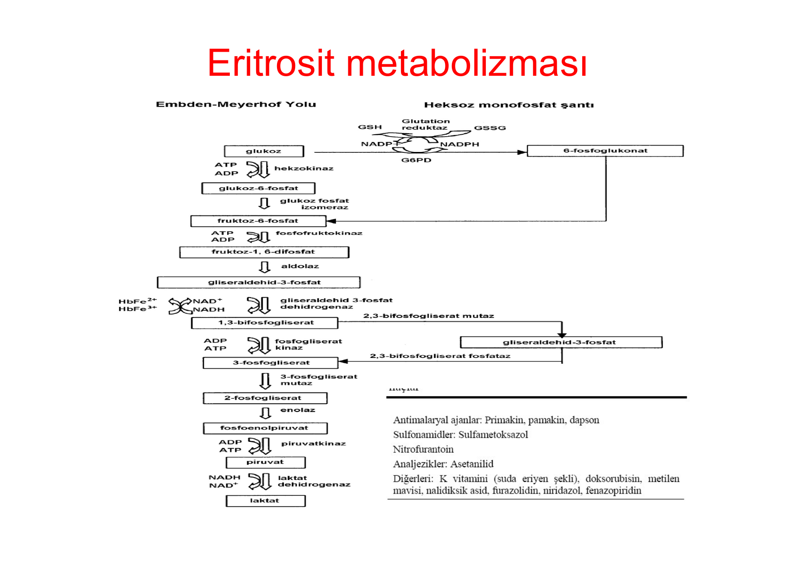
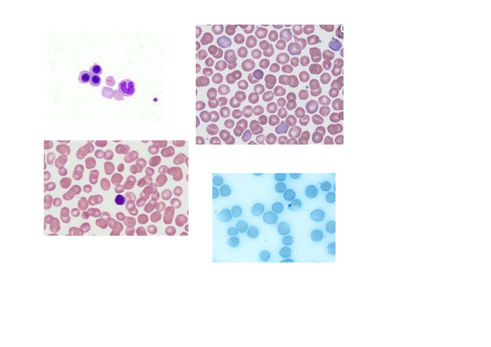
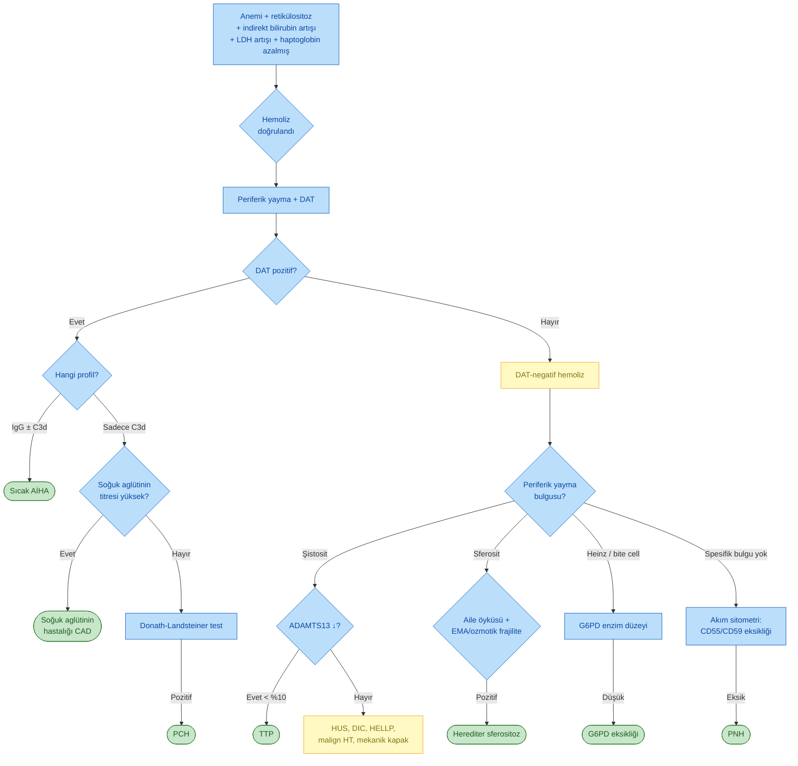

# HEMOLİTİK ANEMİ

**Hazırlayan:** Dr. İrfan Yavaşoğlu
**Bölüm:** Aydın Adnan Menderes Üniversitesi Tıp Fakültesi - İç Hastalıkları AD - Hematoloji BD

---

## İÇİNDEKİLER

1. [Tanım ve Genel Bakış](#tanım-ve-genel-bakış)
2. [Sınıflama](#sınıflama)
3. [Laboratuvar](#laboratuvar)
4. [Eritrosit Metabolizması ve İlaca Bağlı Hemoliz](#eritrosit-metabolizması-ve-i̇laca-bağlı-hemoliz)
5. [Periferik Yayma Bulguları](#periferik-yayma-bulguları)
6. [Otoimmun Hemolitik Anemilerin Sınıflaması](#otoimmun-hemolitik-anemilerin-sınıflaması)
7. [İlaca Bağlı İmmun Hemoliz](#i̇laca-bağlı-i̇mmun-hemoliz)
8. [Tanısal Yaklaşım Algoritması](#tanısal-yaklaşım-algoritması)

---

## TANIM VE GENEL BAKIŞ

> **Hemolitik anemi:** Eritrositlerin normal yaşam süresinden (~120 gün) önce yıkıma uğraması sonucu gelişen, kemik iliğinin telafi edici eritropoetik yanıtının yetersiz kaldığı anemi grubu.

Hemoliz iki ana yolla gerçekleşir:

* **Ekstravasküler hemoliz** -- başlıca dalak (ve bir miktar karaciğer) makrofajları aracılığıyla; eritrosit hasarı ya da membran anormalliği nedeniyle retiküloendoteliyal sistemde fagositoz
* **İntravasküler hemoliz** -- damar içinde eritrosit lizisi; hemoglobinin doğrudan plazmaya salınması

Klinikte en kritik ayrım bu ikilidir; çünkü laboratuvar profili, klinik bulgular ve etyolojik dağılım birbirinden farklıdır.

---

## SINIFLAMA

Hemolitik anemiler eritrosit içine ait (intrensek) veya dış (ekstrensek) nedenlere göre iki ana grupta toplanır.

> **Genel kural:**
>
> * **İntrensek nedenler** → büyük çoğunlukla **doğumsal/herediter** (PNH istisnadır, edinseldir)
> * **Ekstrensek nedenler** → büyük çoğunlukla **edinsel**

### A. İntrensek Nedenli Hemolitik Anemiler

| Eritrosit Membran Bozuklukları               | Globin Yapı/Sentez Bozuklukları                          | Eritrosit Enzim Eksiklikleri                                        |
| -------------------------------------------- | -------------------------------------------------------- | ------------------------------------------------------------------- |
| Herediter sferositoz                         | Hemoglobin SS (orak hücre anemisi)                       | Glukoz-6-fosfat dehidrogenaz (G6PD)                                 |
| Herediter eliptositoz                        | Talasemiler                                              | Pirüvat kinaz                                                       |
| Abetalipoproteinemi / akantositoz            | Diğer hemoglobinopatiler (CC, DD, EE, vb.)               | Glukoz fosfat izomeraz                                              |
| Herediter stomatositoz                       | Çift heterozigot hastalıklar (HbSC, orak hücre-talasemi) | Pirimidin 5'-nükleotidaz                                            |
| Herediter piropoikilositoz                   | Durağan olmayan (unstabil) hemoglobinler                 | Adenozin deaminaz                                                   |
| Herediter kserositoz                         |                                                          | Aldolaz                                                             |
| McLeod sendromu                              |                                                          | 2,3-bifosfogliserat mutaz                                           |
| **Paroksismal gece hemoglobinürisi (PNH)\*** |                                                          | Enolaz, heksokinaz, fosfofruktokinaz, trioz fosfat izomeraz         |
|                                              |                                                          | γ-glutamil sistein sentetaz, glutatyon peroksidaz/redüktaz/sentetaz |
|                                              |                                                          | Hem oksijenaz-1, lesitin-kolesterol asiltransferaz                  |

> **\*** PNH dışında intrensek sebeplerle gelişen hemolitik anemilerin hepsi **doğumsal kusurlar** sonucunda oluşur. PNH ise edinsel klonal bir hastalıktır.

### B. Ekstrensek Nedenli Hemolitik Anemiler

| Grup                            | Alt Gruplar                                                                                                                                                                                                                                                     |
| ------------------------------- | --------------------------------------------------------------------------------------------------------------------------------------------------------------------------------------------------------------------------------------------------------------- |
| **1. İmmun hemolitik anemiler** | 
**İzoantikorlara bağlı:**

- Yanlış kan transfüzyonu

- Yenidoğanın hemolitik anemisi

**Otoantikora bağlı:**

- İdyopatik

- Sekonder (otoimmun sendromlar)

**İlaçlara bağlı**
                                           |
| **2. Mekanik nedenler**         | 
- Kardiyak hemolitik anemi

- Mikroanjiyopatik hemolitik anemiler (TTP, HUS, DIC)

- HELLP sendromu

- Malign hipertansiyon

- Hemodiyaliz

- Vaskülitler

- Yürüme/maraton hemoglobinürisi

- Yanıklar, suda boğulma
 |
| **3. Enfeksiyonlar**            | Sıtma (malarya), babesiozis, bartonellozis, *Clostridium perfringens*                                                                                                                                                                                           |
| **4. Kimyasal ajanlar**         | Kurşun, klorin, kloramin, arsin gazı, yılan zehiri                                                                                                                                                                                                              |
| **5. Diğer nedenler**           | Karaciğer hastalıkları, hipersplenizm                                                                                                                                                                                                                           |

> Ekstrensek sebeplerle oluşan hemolitik anemilerin hemen hepsi **edinsel** nedenlerle gelişir.
> malignite dediğinde altını doldurman lazım. lenfoma, lösemi, solid tümörler
> ttp, hüs, afa buna neden olaylardan bazıları
---

## LABORATUVAR

### Ekstravasküler ve İntravasküler Hemolizin Karşılaştırılması

Hemoliz tipinin belirlenmesi etyolojiye yönlendirir; özellikle haptoglobin, hemoglobinüri ve hemosiderinüri ayrıma kritiktir.

| Laboratuvar Bulgusu                     | Ekstravasküler Hemoliz | İntravasküler Hemoliz |
| --------------------------------------- | ---------------------- | --------------------- |
| **Retikülosit**                         | ↑ artmış               | ↑ artmış              |
| **Bilirubin (indirekt)**                | ↑ artmış               | ↑ artmış              |
| **Haptoglobin**                         | ↓ azalmış / hiç yok    | Hiç yok               |
| **LDH**                                 | ↑ artmış               | ↑↑ belirgin artmış    |
| **Hemoglobinemi (plazmada serbest Hb)** | −                      | +                     |
| **Methemalbuminemi**                    | −                      | +                     |
| **Ferritin**                            | Normal / artmış        | Azalmış               |
| **Hemosiderinüri**                      | −                      | + (~1 hafta sonra)    |
| **Hemoglobinüri**                       | −                      | +                     |
| **Böbrek demiri**                       | Normal                 | ↑ artmış              |
| **Kemik iliği demiri**                  | Normal / artmış        | Azalmış               |

> **💡 Klinik ipucu:**
>
> * **Haptoglobin** akut intravasküler hemolizde **saatler içinde tükenir** -- en hassas erken belirteçtir
> * **Hemosiderinüri** intravasküler hemolizin **kronikleşmesini** gösterir; idrarda ~1 hafta sonra ortaya çıkar
> * Ekstravasküler hemolizde **demir geri dönüşümlüdür**, intravasküler hemolizde ise idrarla **demir kaybı** olur

### Hemolitik Anemi Tanısında Kullanılan Spesifik Testler

İlk basamak testler (haptoglobin, retikülosit, indirekt bilirubin, LDH, periferik yayma) hemolizi gösterdikten sonra **etyolojiye yönelik** ileri testler istenir.

| Kategori          | Test                                   | Açıklama                                         |
| ----------------- | -------------------------------------- | ------------------------------------------------ |
| **Otoimmun**      | Direkt antiglobulin testi (DAT/Coombs) | Her tip hemolitik anemide ilk istenecek test     |
|                   | Genişletilmiş (enhanced) DAT           | DAT negatif fakat AİHA hâlâ şüpheliyse           |
|                   | Soğuk aglütinin titresi                | Soğuk aglütinin hastalığı                        |
|                   | Donath-Landsteiner testi               | Paroksismal soğuk hemoglobinürisi                |
| **Diğer edinsel** | ADAMTS13 düzeyi                        | Trombotik trombositopenik purpura (TTP)          |
|                   | Serolojik kompleman                    | Kompleman aracılı trombotik mikroanjiyopati      |
|                   | Akım sitometrisi (flow cytometry)      | Paroksismal gece hemoglobinürisi (PNH)           |
| **Herediter**     | Eosin-5-maleimid (EMA) bağlanma        | Herediter sferositoz, eliptositoz (bazı vakalar) |
|                   | Ozmotik frajilite                      | Herediter sferositoz                             |
|                   | Eritrosit enzim aktivitesi             | Eritrosit enzimopatileri (G6PD, PK vb.)          |
|                   | Yeni nesil dizileme (NGS)              | Tüm tipler; seçilmiş hastalar                    |

#### Periferik Yayma Bulgularıyla Hemoliz Tipi Ayrımı

| Bakılan Parametre  | İntravasküler Hemoliz (I) | Ekstravasküler Hemoliz (E) |
| ------------------ | ------------------------- | -------------------------- |
| Periferik yayma    | **Şistosit**              | **Sferosit**               |
| Haptoglobin        | Belirgin azalmış          | Değişmemiş / hafif azalmış |
| İdrar hemosiderini | ~1 hafta sonra pozitif    | Negatif                    |
| İdrar hemoglobini  | Pozitif                   | Negatif                    |
| Karboksihemoglobin | Artmış                    | Negatif                    |

> **⚠️ ÖNEMLİ:**
>
> * **Şistositler** → mikroanjiyopatik (TTP/HUS/DIC), mekanik kalp kapağı, malign HT
> * **Sferositler** → herediter sferositoz **veya** sıcak otoimmun hemolitik anemi (wAIHA)
> * Sferosit her zaman herediter değildir -- DAT mutlaka kontrol edilmelidir

---

## ERİTROSİT METABOLİZMASI VE İLACA BAĞLI HEMOLİZ

Eritrosit, anaerobik glikolitik (Embden-Meyerhof) yolağı ile ATP üretir; pentoz fosfat (heksoz monofosfat) şantı ile NADPH ve glutatyon (GSH) üretir. Bu iki yolaktaki bozukluklar farklı klinik tablolar oluşturur:

* **Embden-Meyerhof yolağı bozuklukları** (en sık: pirüvat kinaz eksikliği) → kronik non-sferositik hemolitik anemi
* **Heksoz monofosfat şantı / glutatyon yolağı bozuklukları** (en sık: G6PD eksikliği) → oksidan stresle tetiklenen akut hemoliz, Heinz cisimcikleri

### Şemadaki Türkçe Karşılıklar

**Embden-Meyerhof yolağı:** Glukoz → glukoz-6-fosfat (heksokinaz) → fruktoz-6-fosfat → fruktoz-1,6-difosfat (fosfofruktokinaz) → gliseraldehid-3-fosfat (aldolaz) → 1,3-bifosfogliserat (gliseraldehid-3-fosfat dehidrogenaz; methemoglobin redüksiyonunu sağlar) → 3-fosfogliserat (fosfogliserat kinaz; ATP üretir) → 2-fosfogliserat → fosfoenolpirüvat (enolaz) → pirüvat (pirüvat kinaz; ATP üretir) → laktat (laktat dehidrogenaz).

**2,3-bifosfogliserat (BPG) yan yolu:** 1,3-BPG → 2,3-BPG (mutaz) → 3-fosfogliserat (fosfataz). 2,3-BPG hemoglobinin oksijen afinitesini düzenler.

**Heksoz monofosfat şantı:** Glukoz-6-fosfat → 6-fosfoglukonat (G6PD; NADP → NADPH üretir) → glutatyon yolağı (GSSG → GSH; glutatyon redüktaz). NADPH ve GSH eritrositi oksidan strese karşı korur.

### G6PD Eksikliğinde Hemolizi Tetikleyen Başlıca İlaçlar

| Grup              | İlaçlar                                                                                                              |
| ----------------- | -------------------------------------------------------------------------------------------------------------------- |
| Antimalaryal      | Primakin, pamakin, dapson                                                                                            |
| Sülfonamid        | Sülfametoksazol                                                                                                      |
| Üriner antiseptik | Nitrofurantoin                                                                                                       |
| Analjezik         | Asetanilid                                                                                                           |
| Diğerleri         | K vitamini (suda eriyen şekli), doksorubisin, metilen mavisi, nalidiksik asit, furazolidin, niridazol, fenazopiridin |

> **💡 Klinik:** G6PD eksikliği olan hastada **fava (bakla) tüketimi** ve oksidan ilaçlar akut intravasküler hemolize yol açar (favizm). Tipik bulgular: ani başlangıçlı sarılık, koyu idrar (hemoglobinüri), Heinz cisimcikleri ve "ısırılmış hücre" (bite cell) görünümü.

---

## PERİFERİK YAYMA BULGULARI

Periferik yayma incelemesi, hemolitik aneminin tipini belirlemede en hızlı ve en ucuz yöntemdir. Aşağıda hocanın slaytında yer alan örnek görüntüler bulunmaktadır.

> **⚠️ Görsel yorumu (temkinli):**
>
> Hocanın slaytında dört ayrı periferik yayma örneği yer almaktadır. Bu görüntüler genel olarak hemolitik anemilerde karşılaşılan morfolojik bulguları örneklemektedir; **kesin tanısal yorum için** klinik bağlam, eritrosit indeksleri, retikülosit yanıtı ve uygun konfirmatuvar testler gereklidir. Slaytlardaki olası bulgular:
>
> * Eritrofagositoz veya çok sayıda nükleuslu hücre içeren alanlar (immun hemoliz lehine olabilir)
> * Sferosit benzeri (santral solukluğu kaybolmuş, küçük yoğun) eritrositler -- herediter sferositoz veya sıcak AİHA ile uyumlu olabilir
> * Polikromazi ve nükleuslu eritrositler -- belirgin retikülositoz yanıtını yansıtabilir
> * Süpravital (metilen mavisi) boyamada Heinz cisimcikleri benzeri inklüzyonlar -- oksidan hemoliz (G6PD eksikliği gibi) ile uyumlu olabilir

### Hemolitik Anemilerde Sık Görülen Periferik Yayma Bulguları

| Morfolojik Bulgu                            | İlişkili Olabilecek Patoloji                             |
| ------------------------------------------- | -------------------------------------------------------- |
| **Sferosit**                                | Herediter sferositoz, sıcak AİHA                         |
| **Şistosit (helmet/triangular)**            | TTP, HUS, DIC, mekanik kapak, malign HT, HELLP           |
| **Orak hücre (sickle cell)**                | Orak hücre anemisi                                       |
| **Hedef hücre (target cell)**               | Talasemi, HbC, karaciğer hastalığı                       |
| **Akantosit**                               | Abetalipoproteinemi, ileri karaciğer hastalığı           |
| **Eliptosit / ovalosit**                    | Herediter eliptositoz, megaloblastik anemi               |
| **Heinz cisimciği (süpravital boyama ile)** | G6PD eksikliği, unstabil hemoglobin                      |
| **Bite cell (ısırılmış hücre)**             | G6PD eksikliği (Heinz cisminin dalakta uzaklaştırılması) |
| **Aglütinasyon (eritrosit kümeleşmesi)**    | Soğuk aglütinin hastalığı                                |

---

## OTOİMMUN HEMOLİTİK ANEMİLERİN SINIFLAMASI

Otoimmun hemolitik anemiler (AİHA), otoantikorların ısı reaktivitesine ve hedef antijenine göre sınıflandırılır. Direkt Coombs testi (DAT) profili her tip için karakteristiktir.

### 1. Sıcak Otoimmun Hemolitik Anemi (warm AİHA / wAIHA)

* **DAT:** IgG **veya** IgG + C3d pozitif
* **Antikor:** IgG, başlıca **Rh sistemi epitoplarına** karşı
* **Etyoloji:** İdyopatik **veya** sekonder (otoimmun, lenfoproliferatif, neoplastik hastalıklar)
* **Hemoliz tipi:** Ağırlıklı **ekstravasküler** (dalak)

### 2. Soğuk Otoimmun Hemolitik Anemi

#### 2a. Soğuk Aglütinin Hastalığı (CAD)

* **DAT:** Sadece **C3d** pozitif
* **Antikor:** IgM, **I/i sistemine** karşı
* **Etyoloji:**
  * İdyopatik
  * Sekonder: Enfeksiyonlar (akut geçici -- *Mycoplasma pneumoniae*, EBV) veya lenfoproliferatif hastalıklar (kronik)

#### 2b. Paroksismal Soğuk Hemoglobinürisi (PCH)

* **Donath-Landsteiner testi:** Pozitif
* **Antikor:** Bitermik IgG, eritrosit **P antijenine** karşı
* **Etyoloji:**
  * İdyopatik
  * Sekonder: Sifiliz (kronik), diğer enfeksiyonlar (akut geçici, sıklıkla çocuklarda viral enfeksiyon sonrası)

### 3. Karışık (Mikst) Otoimmun Hemolitik Anemi

* **DAT:** IgG **ve** C3d pozitif
* **Antikor:** Sıcak IgG otoantikorları + yüksek titrede IgM soğuk aglütininlerin birlikte varlığı
* **Etyoloji:** İdyopatik **veya** sekonder (lenfoproliferatif/otoimmun hastalıklar)

### Özet Karşılaştırma

| Özellik            | Sıcak AİHA             | CAD                                      | PCH                             | Mikst                |
| ------------------ | ---------------------- | ---------------------------------------- | ------------------------------- | -------------------- |
| **DAT profili**    | IgG ± C3d              | C3d                                      | C3d (test öncesi)               | IgG + C3d            |
| **Antikor sınıfı** | IgG                    | IgM                                      | IgG (bitermik)                  | IgG + IgM            |
| **Hedef antijen**  | Rh                     | I/i                                      | P                               | Karışık              |
| **Hemoliz yeri**   | Ekstravasküler (dalak) | Ekstravasküler (KC) ± intravasküler      | İntravasküler                   | Karışık              |
| **Tetikleyici**    | --                     | Soğuk                                    | Soğuğa maruziyet sonrası ısınma | --                   |
| **Tedavi temeli**  | Steroid, rituksimab    | Soğuktan korunma, rituksimab, sutimlimab | Soğuktan korunma, destek        | Steroid + rituksimab |

---

## İLACA BAĞLI İMMUN HEMOLİZ

İlaca bağlı immun hemolitik anemiler üç farklı immunolojik mekanizmayla oluşur. Mekanizma ilaca özgüdür ve DAT profilini belirler.

| Mekanizma         | İlaç Absorpsiyonu (Hapten)                                                                                                                                                                                                                                                                                                      | İmmun Kompleks                                                                                                                                                                     | Otoantikor                                                                                                                                                      |
| ----------------- | ------------------------------------------------------------------------------------------------------------------------------------------------------------------------------------------------------------------------------------------------------------------------------------------------------------------------------- | ---------------------------------------------------------------------------------------------------------------------------------------------------------------------------------- | --------------------------------------------------------------------------------------------------------------------------------------------------------------- |
| **DAT profili**   | Anti-IgG pozitif                                                                                                                                                                                                                                                                                                                | Anti-C3 pozitif                                                                                                                                                                    | Anti-IgG pozitif (ekstravasküler)                                                                                                                               |
| **Tipik İlaçlar** | 
**Penisilinler:**

- Penisilin

- Ampisilin

- Metisilin

- Karbenisilin

**Sefalosporinler:**

- Sefalotin

- Sefaloridin

**Diğer:**

- Tetrasiklin

- Tolbutamid

- Asetaminofen

- Probenesid

- Streptomisin

- Fluorourasil

- Sulindak
 | 
- Kinidin

- Fenasetin

- Rifampin

- Sülfonamidler

- İzoniazid

- Kinin

- İnsülin

- Melfalan

- Hidralazin

- Klorpromazin
 | 
- α-metildopa

- Hidroklorotiazid

- Mefenamik asit

- L-dopa

- Prokainamid

- İbuprofen

- Diklofenak

- İnterferon
 |

> **💡 Klinik özet:**
>
> * **Hapten tipi:** İlaç eritrosit yüzeyine bağlanır; anti-ilaç IgG → ekstravasküler hemoliz. **Klasik örnek:** yüksek doz penisilin
> * **İmmun kompleks:** İlaç-antikor kompleksi eritrosite C3 aktivasyonu yapar → intravasküler hemoliz. **Klasik örnek:** kinidin
> * **Otoantikor:** İlaç gerçek otoantikor üretimini tetikler; DAT klinik tabloyla wAIHA'ya benzer. **Klasik örnek:** α-metildopa (ilacın kesilmesinden aylar sonra DAT pozitif kalabilir)

---

## TANISAL YAKLAŞIM ALGORİTMASI

---

## KAYNAK

Dr. İrfan Yavaşoğlu -- Hemolitik Anemi ders slaytları, Aydın Adnan Menderes Üniversitesi Tıp Fakültesi, İç Hastalıkları AD - Hematoloji BD.

---

> **Asla vazgeçme.**
