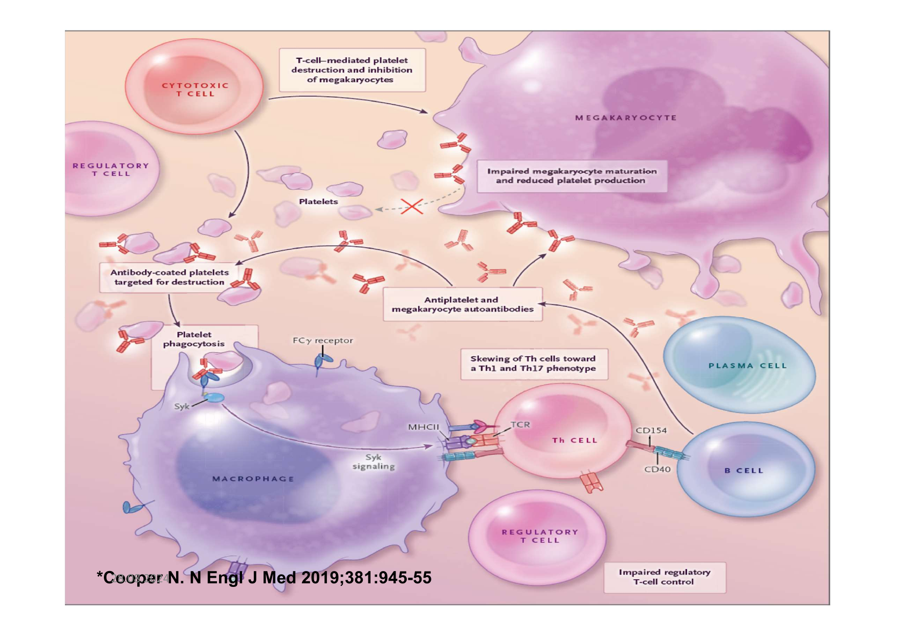
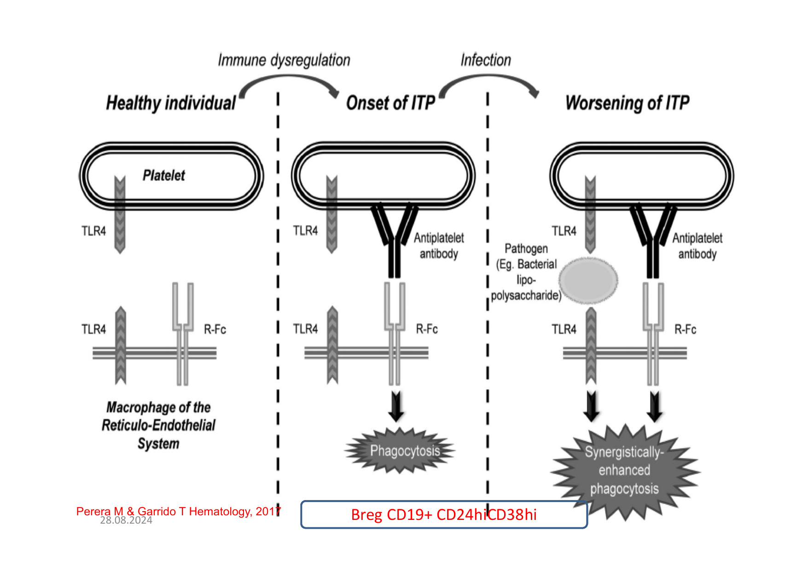
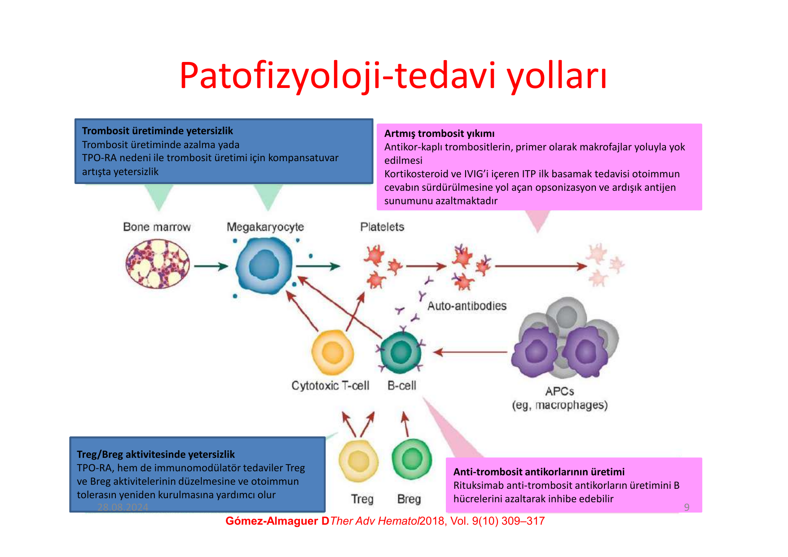
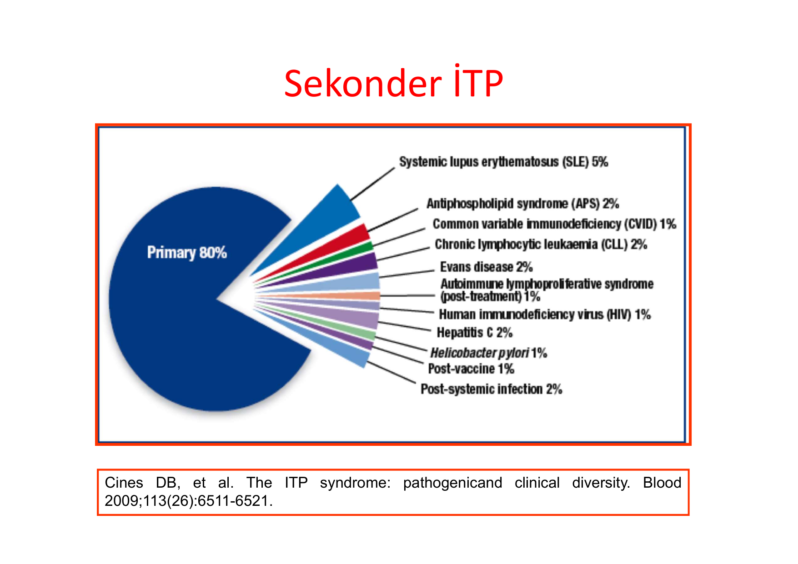
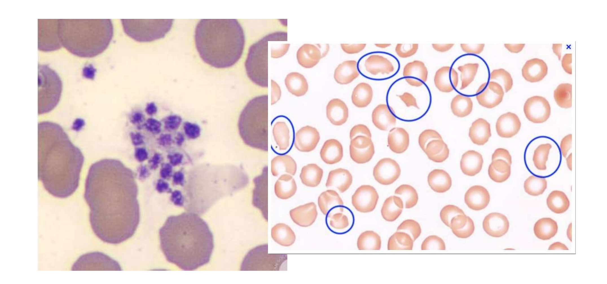
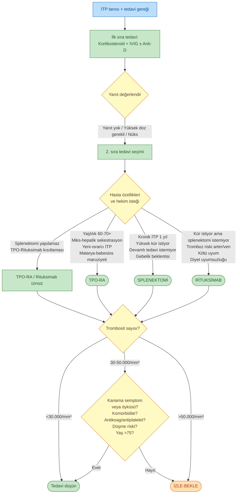
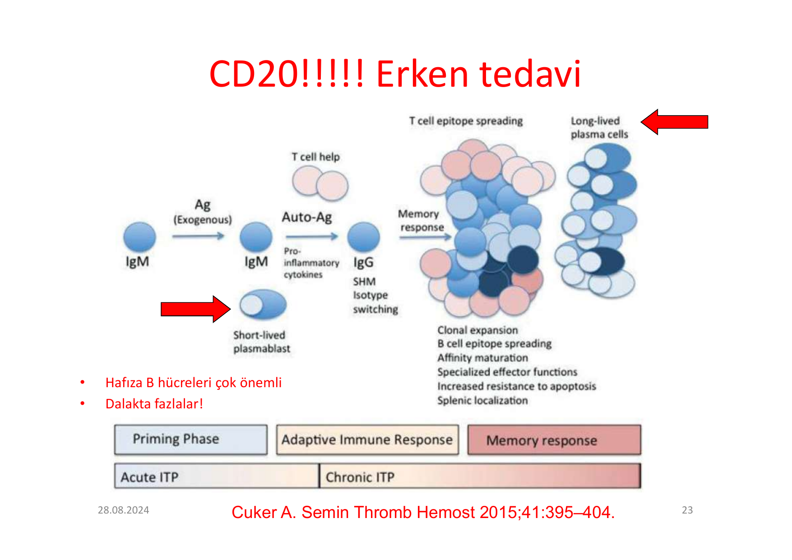
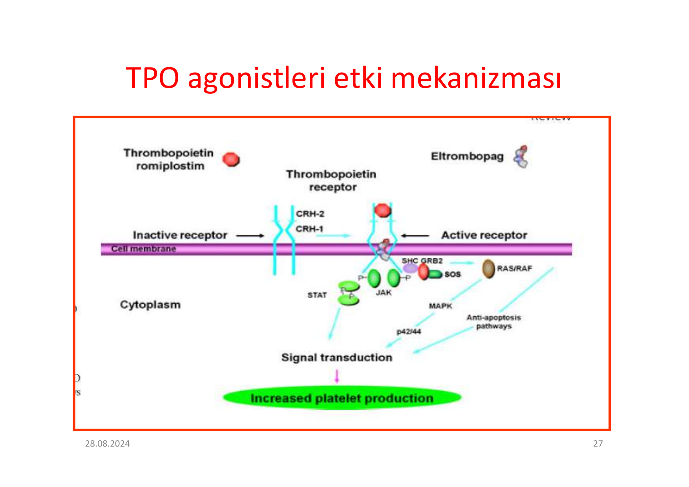
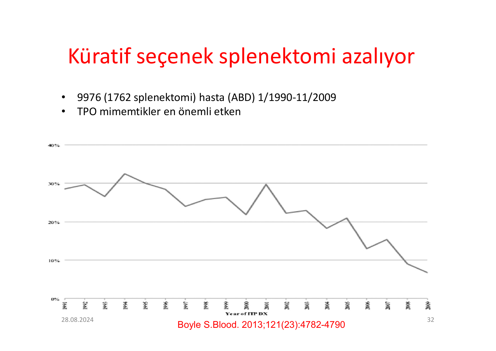

# İMMUN TROMBOSİTOPENİYE GENEL YAKLAŞIM

**Hazırlayan:** Prof. Dr. İrfan Yavaşoğlu
**Bölüm:** Aydın Adnan Menderes Üniversitesi Tıp Fakültesi -- İç Hastalıkları AD, Hematoloji BD

---

## İÇİNDEKİLER

1. [Tarihçe](#tarihçe)
2. [Tanımlar ve Sınıflandırma](#tanımlar-ve-sınıflandırma)
3. [Patogenez](#patogenez)
4. [Sekonder İTP](#sekonder-i̇tp)
5. [Ayırıcı Tanı](#ayırıcı-tanı)
6. [Tanı -- Dışlama Yaklaşımı](#tanı----dışlama-yaklaşımı)
7. [30.000/mm³ Sınırı Nereden Geliyor?](#30000mm³-sınırı-nereden-geliyor)
8. [Tedavi Kararı](#tedavi-kararı)
9. [Tedavi Seçenekleri](#tedavi-seçenekleri)
10. [Tedavi Algoritması](#tedavi-algoritması)
11. [İlaç Yanıt Süreleri](#i̇laç-yanıt-süreleri)
12. [Erişkinde İTP'de Acil Tedavi](#erişkinde-i̇tpde-acil-tedavi)
13. [Yanıt Tanımları](#yanıt-tanımları)
14. [Rituksimab](#rituksimab)
15. [TPO Agonistleri](#tpo-agonistleri)
16. [Splenektomi](#splenektomi)
17. [Steroid-IVIG Sonrası Seçenekler](#steroid-ivig-sonrası-seçenekler)
18. [Yeni İlaçlar](#yeni-i̇laçlar)
19. [Gebelikte İTP](#gebelikte-i̇tp)

---

## TARİHÇE

| Yıl | Kişi | Katkı |
|---|---|---|
| **1735** | **Werlhof** | Hastalık tanımı (klasik adı: morbus maculosus haemorrhagicus Werlhofii) |
| 1874 | **Osler** | Trombosit (pale granular masses) tanımlaması, mikroorganizma ile ilişki |
| 1881 | **Bizzozero** (patolog) | Trombositlerin morfolojik tanımlaması |
| 1889 | **Hayem** | Kanama-trombosit ilişkisini ortaya koyma |
| **1916** | **Kaznelson** | **Tıp öğrencisi**, hocası Schloffer'ın izniyle yapılan **ilk splenektomi** -- ITP tedavisi tarihinin dönüm noktası |

---

## TANIMLAR VE SINIFLANDIRMA

### Etyolojiye Göre

| Tip | Tanım |
|---|---|
| **Primer İTP** | Bilinen bir nedeni olmadan ortaya çıkan, otoimmun nedenlere bağlı **izole trombositopeni** |
| **Sekonder İTP** | Diğer hastalıklarda ortaya çıkan otoimmun trombositopeni (HIV, HCV, SLE, KLL vb.) |
| **İlaca bağlı İTP** | Belirli ilaç maruziyeti sonrası gelişen |

### Süreye Göre

| Süre | Tanım |
|---|---|
| **Akut İTP** | Tanıdan itibaren **3 aya kadar** |
| **Persistan İTP** | Tanıdan sonra **3-12 ay** içinde devam eden |
| **Kronik İTP** | Tanıdan sonra **12 aydan fazla** süre geçmiş |

### Şiddete Göre

| Şiddet | Eşik |
|---|---|
| **Ağır İTP** | Trombosit sayısı **<20.000/mm³** |

---

## PATOGENEZ

> **İTP otoimmun bir hastalıktır.** Tarihçesi: **Harrington'un kendi üzerinde yaptığı test** (1951) -- ITP hastasının plazmasını sağlıklı bireye verdiğinde trombositopeni oluştuğunu göstermiş, dolaşan bir faktörün varlığını kanıtlamıştır.

### Antikorlar

* Trombosit yüzeyindeki **GPllb/Illa, GPlb/V/IX, GPla/lla** antijenlerine karşı IgG otoantikorlar

### İmmun Hemostaz Değişikliği

* **Periferik tolerans kaybı**
* **T hücre aracılı sitotoksisite** ve **Treg anormalliği**
* **B regülatör hücre (Breg)** disfonksiyonu

### İTP Patogenez Şeması (Çok Mekanizmalı)

> **Şema yorumu (Cooper NEJM 2019 -- ITP'nin çoklu patogenetik mekanizmaları):**
>
> Görsel ITP'nin **basit antikor hastalığı olmadığını**, çok katmanlı bir immun disregülasyon olduğunu vurgular. Görseldeki 4 ana mekanizma:
>
> 1. **Antikor-aracılı yıkım (klasik):** Plazma hücrelerinin ürettiği **anti-trombosit IgG** trombosit yüzeyine bağlanır → **dalakta makrofaj** Fc-γ reseptörü ile fagosite eder.
> 2. **Megakaryosit baskılanması:** Aynı antikorlar ve **sitotoksik T hücreleri** kemik iliğinde **megakaryosit maturasyonunu inhibe eder** ve trombosit üretimini düşürür. (Bu, neden klasik "kemik iliğinde megakaryosit artmış olmalı" beklentisinin kısmen yanılttığını açıklar.)
> 3. **T hücre aracılı sitotoksisite:** **CD8+ sitotoksik T hücreler** doğrudan trombositleri ve megakaryositleri yıkabilir.
> 4. **Treg disfonksiyonu + Th1/Th17 dengesizliği:** Th hücreleri Th1 ve Th17 fenotipine kayar (proinflamatuar); **regülatör T hücreleri (Treg) yetersizdir** → otoimmun yanıtı baskılayamaz. **B regülatör hücreler (Breg)** de işlev kaybeder.
>
> **🔑 Tedavi açısından anlamı:** Bu çoklu mekanizma → çoklu tedavi hedefi:
> * Antikor üretimi → **Rituksimab (anti-CD20)**, kortikosteroid, IVIG
> * Megakaryosit baskılanması → **TPO reseptör agonistleri (Eltrombopag, Romiplostim)**
> * Yıkım yeri → **Splenektomi**
> * SYK aracılı sinyal → **Fostamatinib**

### Detaylı Hücresel İmmun Yanıt Şeması (Perera M & Garrido T)

> **Şema yorumu (Perera & Garrido, Hematology 2017 -- ITP'nin 5-bölümlü hücresel immun şeması):**
>
> Görsel ITP'nin patogenezini **5 ayrı hücre tipinin etkileşimi** olarak detaylandırır:
>
> **🅐 Aktive Makrofaj (sol üst):**
> * **İnflamatuar uyarı** ile aktive olur
> * IL-1β, IL-1α, M-CSF salgılar; CD68+ (makrofaj markerı)
> * Antikor kaplı trombositleri **fagosite eder**
> * **Otoantijenler -- trombosit peptidleri** olarak işlenip MHC-II ile sunulur
> * **İnsetteki grafik:** Periferik kandaki **Th17 (proinflamatuar)** ve **Treg (anti-inflamatuar) hücrelerin dengesi** -- ITP'de bu denge bozulmuştur. **Trombosit sayısı düşerken ITP aktivitesi artar; Th17/Treg oranı bozulur.**
>
> **🅑 Makrofaj-Th hücresi etkileşimi (orta üst):**
> * Makrofaj otoantijeni **MHC-II ile sunar** → otoreaktif Th hücresinin **TCR/CD3** ile tanır
> * Ko-stimülatör molekül etkileşimi: **CD80/86 (makrofaj) ↔ CD28/CTLA-4 (Th hücresi)** ve **CD40L (Th) ↔ CD40 (makrofaj)**
> * Bu etkileşim Th hücresini aktive eder
>
> **🅒 Otoreaktif Th Lenfosit (orta alt):**
> * Aktive olan Th hücresi **bol miktarda sitokin salgılar:**
>   * **IL-2** (T hücre proliferasyonu)
>   * **IL-4** (B hücre yardımı, IgG'ye geçiş)
>   * **IL-15** (NK ve T hücre aktivasyonu)
>   * **IFN-γ, TNF-α** (proinflamatuar)
>   * **GM-CSF** (myeloid aktivasyon)
>   * **Soluble IL-2R, IL-2R-IL-2 kompleksi** -- aşırı T hücre aktivasyon işareti
>
> **🅓 Otoreaktif B Lenfosit (sağ üst):**
> * Th hücresinin yardımı (CD40L-CD40 + sitokinler) ile aktive olur
> * **CD20+, CD40+** (rituksimab hedefi)
> * **GPIIbIIIa** ve diğer trombosit antijenlerine karşı **antiplatelet IgG** üretir
> * Soluble Ig de salgılar
> * → **Antibody-mediated platelet destruction** (antikor aracılı yıkım): kaplı trombositler dalakta makrofajlar tarafından yıkılır
>
> **🅔 Sitotoksik CD8+ T Lenfosit (sol alt):**
> * Trombosit yüzeyindeki **MHC-I + peptid** kompleksini **TCR/CD3** ile tanır
> * **Direkt sitotoksik etki** ile trombositleri ve **megakaryositleri** yıkar
> * → **Cellular immunity-mediated destruction** (hücresel immunite aracılı yıkım)
>
> **🔑 Sonuç (sağda büyük ok):** Hem antikor hem hücresel immunite **Platelet/Megakaryocyte Destruction**'a yol açar -- bu çoklu mekanizma neden ITP'de **tek bir tedavinin yeterli olmadığını** ve neden farklı basamak ilaçların farklı hücreleri hedeflediğini açıklar:
> * **Anti-CD20 (Rituksimab)** → 🅓 B hücre deplesyonu → antikor üretimi azalır
> * **Kortikosteroid, IVIG** → 🅐 makrofaj fagositozunu azaltır + 🅒/🅓 hücre aktivasyonunu baskılar
> * **TPO-RA** → megakaryosit üretimini stimüle eder, dolaylı olarak Treg restorasyonu
> * **Splenektomi** → 🅓 B hücre + 🅐 makrofaj kaynaklarını fiziksel olarak çıkarır
> * **Fostamatinib (SYK inh.)** → 🅐 Fc-γR aracılı fagositozu bloke eder

### İnfeksiyon-İmmun Dysregulasyon Sinerjisi

> **Şema yorumu (İTP'nin şiddetlenme mekanizması -- 3 panel):**
>
> Görsel **infeksiyonun ITP'yi neden alevlendirdiğini** açıklar:
>
> * **Sol panel (Sağlıklı birey):** Trombosit normal dolaşır; retiküloendoteliyal sistem (RES) makrofajları **TLR4 ve Fc-γ reseptörü** taşır ama herhangi bir antikor olmadığı için fagositoz olmaz.
> * **Orta panel (ITP başlangıcı):** Anti-trombosit antikor üretilir → trombosite bağlanır → makrofaj **Fc-γ reseptörü ile fagosite eder**. Trombosit sayısı düşer.
> * **Sağ panel (ITP şiddetlenmesi -- enfeksiyon eşliğinde):** **Bakteriyel lipopolisakkarit (LPS)** gibi patojen molekülü makrofajın **TLR4'ünü uyarır** → makrofaj **aktive olur** → mevcut antikor-trombosit kompleksini **sinerjik olarak artmış** şekilde fagosite eder. Trombosit sayısında **akut, dramatik düşüş**.
>
> **🔑 Klinik önemi:** Akut viral/bakteriyel enfeksiyon dönemlerinde ITP hastalarının trombosit sayısının ani düşmesi ve kanama riskinin artması bu mekanizmayla açıklanır. **Aşı sonrası geçici trombositopeni** de benzer mekanizmayla ilişkilidir.

### Patofizyoloji-Tedavi Yolları (Türkçe Özet Şeması)

> **Şema yorumu (ITP tedavi yollarının patofizyolojiye göre eşleşmesi):**
>
> Görsel her tedavi sınıfının hangi patofizyolojik mekanizmaya yönelik olduğunu özetler:
>
> | Patofizyolojik mekanizma | Tedavi hedefi | İlaç sınıfı |
> |---|---|---|
> | **Trombosit üretiminde yetersizlik** -- megakaryositin yetersiz çalışması veya kompanse edememesi | Megakaryosit uyarımı | **TPO-RA** (Eltrombopag, Romiplostim, Avatrombopag) |
> | **Artmış trombosit yıkımı** -- antikor kaplı trombositlerin makrofajca yok edilmesi | Fagositoz inhibisyonu, antikor blokajı | **Kortikosteroid, IVIG, Anti-D, Splenektomi** -- Kortikosteroid ve IVIG, opsonizasyon ve antijen sunumunu azaltır |
> | **Treg/Breg aktivitesinde yetersizlik** -- otoimmunite kontrol edilemiyor | İmmun tolerans yeniden kurulması | **TPO-RA**, immunmodulatör (azatiyopürin, mikofenolat, danazol) |
> | **Anti-trombosit antikor üretimi** -- B hücre aracılı | B hücre yıkımı | **Rituksimab** (anti-CD20), Fostamatinib (SYK inhibitörü) |

---

## SEKONDER İTP

> **Pasta grafik yorumu:** Tüm İTP olgularının yaklaşık **%80'i primer**, **%20'si sekonder**. Sekonder nedenlerin dağılımı:
>
> | Sekonder neden | Sıklık |
> |---|---|
> | **SLE** | %5 |
> | Antifosfolipid sendromu (APS) | %2 |
> | Common Variable Immunodeficiency (CVID) | %1 |
> | Kronik Lenfositik Lösemi (KLL) | %2 |
> | **Evans sendromu** (otoimmun hemolitik anemi + ITP) | %2 |
> | Otoimmun lenfoproliferatif sendrom (ALPS, post-tedavi) | %1 |
> | **HIV** | %1 |
> | **Hepatit C** | %2 |
> | **H. pylori** | %1 |
> | Post-aşı | %1 |
> | Post-sistemik enfeksiyon | %2 |
>
> **🔑 Klinik anlamı:** Yeni tanı ITP hastasında **mutlaka HIV, HCV (ve rituksimab planlanıyorsa HBV) tarama**. SLE'yi düşündüren bulguları olan hastada **ANA, anti-dsDNA, antifosfolipid antikorlar**. Yaşlı hastada **lenfadenopati, organomegali varsa KLL/lenfoma**, çocuk veya genç erişkinde **otoimmun hemolitik anemi varsa Evans sendromu** araştırılır.

---

## AYIRICI TANI

> **Histolojik yorum (ITP'nin iki kritik ayırıcı tanısı):**
>
> **Sol panel -- Pseudothrombocytopenia (yalancı trombositopeni):**
> * Eritrositler arasında **trombosit kümesi (platelet aggregate/clump)** görünür -- yığılmış, parlak mavi-mor noktalı topluluk
> * **EDTA antikoagulanı** ile in vitro aglütinasyonun klasik bulgusu (~%0.1 sıklıkta)
> * Otomatik kan sayım cihazı bu kümeleri **tek bir hücre** olarak sayar → yalancı düşük trombosit
> * **Hasta tamamen asemptomatik**, kanama yok, gerçek ITP değil
> * **Doğrulama:** Periferik yaymada küme görmek; **sitratlı tüpte (mavi kapaklı)** trombosit sayısı tekrar bakılır → normal çıkar
> * **🔑 Klinik kural:** Asemptomatik trombositopeni saptanan her hastada **periferik yayma + sitratlı tüp tekrar** sayım yapılmalı; tedavi verilmemeli
>
> **Sağ panel -- Şistositler (TMA/TTP/HUS bulgusu):**
> * Mavi dairelerle işaretlenmiş **fragmente eritrositler** -- "**helmet cells (kask hücresi)**", "**triangle/fragment cells**", parçalanmış RBC'ler
> * Eritrositlerin mikrodamarlardaki **fibrin iplikçikleri** arasından mekanik olarak parçalanması (mikroanjiyopatik hemoliz)
> * **>%1 şistosit** MAHA tanısı için anlamlı
> * Birlikte: **LDH ↑, haptoglobin ↓, indirekt bilirubin ↑, retikülositoz, direkt antiglobulin negatif**
> * **🔑 Klinik kural:** Trombositopeni + şistosit + nörolojik veya renal bulgu = **TTP/HUS düşün** → ADAMTS13 iste, ITP olarak tedavi etme; yanlış tanı ITP tedavisi (steroid/IVIG) gecikme yaparak fatal olabilir

### Değişken / Diğer Tanı Olasılıkları

| Klinik / Lab bulgu | Olası tanı | Doğrulayıcı testler |
|---|---|---|
| Semptom yok, in vitro fenomen | **Pseudothrombocytopenia** (EDTA aglütinasyonu) | Periferik yaymada trombosit agregasyonu, **sitratlı tüpte tekrar sayım** |
| Karaciğer veya böbrek hastalığı semptomları, klinik öykü | **Renal/hepatik hastalık** | Renal/karaciğer fonksiyon testleri, abdominal görüntüleme (KC + dalak) |
| Diğer sitopeniler + anormal periferik yayma | **MDS, akut lösemi** | Periferik yayma, kemik iliği aspirasyon + biyopsi, flow sitometri, sitogenetik |
| Pansitopeni | **Aplastik anemi** | Kemik iliği aspirasyon + biyopsi + sitogenetik |
| Genç yaşta başlangıç, ailede trombositopeni öyküsü, **anormal trombosit boyut/morfolojisi** veya nötrofil anormallikleri, böbrek hastalığı, sağırlık (MYH9 ilişkili) | **Genetik trombositopeniler** (Bernard-Soulier, MYH9 ilişkili) | Periferik yayma, **MPV (ortalama trombosit hacmi)**, genetik test |
| Nörolojik veya kardiyak semptomlar | **TTP (trombotik trombositopenik purpura)** | Periferik yaymada **şistositler**, LDH ↑, haptoglobin ↓, **ADAMTS13 düzeyi**, direkt antiglobulin negatif hemoliz |
| Venöz tromboz, önceden heparin maruziyeti | **HIT (heparin ilişkili trombositopeni)** | **Anti-PF4-heparin antikor testi**, trombosit aktivasyon testi |
| Yeni ilaç başlandıktan sonra ani başlangıç (sık ilaçlar: kinin/kinidin, asetaminofen, abciksimab, karbamazepin, rifampisin, vankomisin) | **İlaç ilişkili trombositopeni** | İlaca bağımlı antikor testleri |
| Kilo kaybı, gece terlemesi, **lenfadenopati veya splenomegali** | **Lenfoproliferatif hastalık** (KLL, Hodgkin lenfoma) | CBC, periferik kan + kemik iliği flow sitometri, kemik iliği biyopsi, protein elektroforezi, abdomen/göğüs/boyun görüntüleme |
| Hipogamaglobulinemi, sitopeniler, **sık enfeksiyonlar** (özellikle göğüs/sinüs), kolit, lenfadenopati, splenomegali | **İmmun yetmezlik sendromu** (CVID, ALPS) | Ig kantifikasyonu, lenfosit alt grup sayımı, genetik test |
| Risk popülasyonu, diğer önerici bulgular | **Enfeksiyon** (HIV/AIDS, HBV, HCV, CMV, EBV, **H. pylori**) | Serolojik + PCR testleri, H. pylori için **soluk ya da gaita antijen testi** |
| **Artralji/artrit, saç dökülmesi, güneş hassasiyeti, ağız ülserleri, döküntü, tromboemboli** | **Otoimmun hastalık** (SLE, RA, antifosfolipid sendromu) | ANA, RF, anti-CCP, antifosfolipid antikorlar |
| Trombositopeni + **direkt antiglobulin pozitif hemolitik anemi** | **Evans sendromu** | Periferik yayma, haptoglobin, LDH, direkt antiglobulin |

---

## TANI -- DIŞLAMA YAKLAŞIMI

> ITP **dışlama tanısıdır** -- diğer trombositopeni nedenlerini ekarte ettikten sonra konur. 3 farklı kılavuz yaklaşımı:

| Test | ASH Kılavuzu | International Consensus Report | McMaster Yaklaşımı |
|---|---|---|---|
| CBC + kan yayması | ✅ | ✅ + retikülosit | ✅ + trombosit çapı |
| HIV ve HCV | ✅ | ✅ | ✅ |
| Rituksimab öncesi HBV | ✅ | ✅ | ✅ (HBsAg + core Ab) |
| Kantitatif Ig | -- | ✅ | ✅ + SPEP |
| **DAT (direkt antiglobulin testi)** | -- | ✅ | ✅ |
| H. pylori | -- | ✅ (erişkinlerde) | ✅ |
| Kemik iliği | -- | ✅ (60 yaş ve üzeri) | -- |
| Kan grubu (Rh) -- anti-D düşünülürse | -- | ✅ | -- |
| **Elektrolit, kreatinin** | -- | -- | ✅ |
| **Karaciğer enzimleri** | -- | -- | ✅ |
| Abdominal ultrason | -- | -- | ✅ |
| **TSH** | -- | -- | ✅ |
| **ANA, ACA (antikardiyolipin), NSI** | -- | -- | ✅ |
| **Trombosit otoantikorları** | -- | -- | ✅ |
| Öykü/CBC'ye göre ileri inceleme | ✅ | ✅ | -- |
| Potansiyel yarara göre diğer testler | -- | ✅ | -- |

---

## 30.000/mm³ Sınırı Nereden Geliyor?

> **Portielje JE, Blood 2001** -- 134 ITP hastası, 10 yıl izlem (Hollanda) çalışması:

* Steroid + splenektomi tedavisi sonrası
* **2 yıl sonunda %85 hastada trombosit >30.000/mm³**
* **Kanama, ekimoz fazla olsa da mortalite artmıyor**
* %6 hastada kronik sürdürme tedavisi (KS) gerekiyor
* Hastanede kalış süresi artmış
* **%9 refrakter İTP, normal popülasyona göre 4.2 kat ölüm**

> **🔑 Klinik kural:** Trombosit **>30.000/mm³** ve **aktif kanama yoksa**, asemptomatik hastalarda tedaviye gerek yoktur. Bu eşik mortalite riski olmadığı veriye dayanır.

---

## TEDAVİ KARARI

Tedavi kararını etkileyen klinik faktörler:

### Kanama Bulguları
* **Persistan şiddetli trombositopeni**
* **Ağızda hemorajik bül**
* **Ciddi morluk ve peteşiler**
* Organ kanaması: **intrakraniyal kanama, gastrointestinal kanama**
* Hematüri
* Kanamaya bağlı anemi ve mikrositoz
* **Menoraji**

### Yaşam Kalitesi ve Komorbidite
* Yaşam üzerinde etki
* İş veya okul aktivitelerinde kayıp
* **Depresyon, yorgunluk, anksiyete**
* Riskli aktiviteler (kayak vs.)
* Alınan riskle ilgili yaşam evresi
* Komorbidite
* Hastayı düzenli olarak takip edememe **veya** acil tedaviye erişmede zorluk

---

## TEDAVİ SEÇENEKLERİ

### Birinci Basamak

| Ajan | Doz | Etki başlangıcı | Yanıt süresi | Yan etki / Dikkat |
|---|---|---|---|---|
| **Prednizon / Prednizolon** | **1-2 mg/kg PO**, 1-2 hafta, sonra hızlı taper (yanıt yoksa) | 1-2 hafta | **Tedavi sırasında %60-80 yanıt; kesince %30-50 sürekli yanıt** | Kilo alımı, insomnia, akne, mood, cushingoid görünüm, glukoz intoleransı, **osteoporoz, enfeksiyon riski**, GİS sx, nöropsikiyatrik (özellikle deksametazonda) |
| **Deksametazon** | **20-40 mg PO**, 4 gün, her 2-4 haftada bir; **maksimum 4 siklus** | 1-2 hafta | %60-80 yanıt; %30-50 sürekli yanıt | Aynı yan etkiler, nöropsikiyatrik daha belirgin |
| **IVIG (immün globulin)** | **0.4 g/kg/gün IV, 5 güne kadar** **VEYA** **1 g/kg, 1-2 gün** | 1-4 gün | **Geçici yanıt 1-4 hafta** (<%80); tekrarlanabilir | Başağrısı, **aseptik menenjit, böbrek yetmezliği** |

### TPO Reseptör Agonistleri (TPO-RA)

| Ajan | Doz | Başlangıç | Yanıt | Yan etki |
|---|---|---|---|---|
| **Romiplostim** | **1-10 μg/kg SC haftada 1** | 1-2 hafta | Tedavi devam ederse %40-60 yanıt; kesince %10-30 sürekli yanıt | Başağrısı, kas ağrısı, **olası tromboz ve myelofibrozis riski** |
| **Eltrombopag** | **25-75 mg PO/gün** | 1-2 hafta | %40-60 (devamla); %10-30 (kesince) | GİS sx, transaminit, katarakt; tromboz/myelofibrozis riski; **kalsiyum içeren gıdadan 4 saat sonra veya 2 saat önce alınmalı** (demir, süt vb.) |
| **Avatrombopag** | **5-40 mg PO/gün** | 1-2 hafta | %65 hastada 8 günde yanıt | Başağrısı, artralji, olası tromboz |

### İmmunmodulatörler / Sonraki Basamak

| Ajan | Doz | Başlangıç | Yanıt | Yan etki |
|---|---|---|---|---|
| **Rituksimab** | **375 mg/m² IV haftada 1, 4 hafta** veya 1 g 2× (2 hafta arayla); düşük doz **100-200 mg haftada 1, 4 hafta** | 1-8 hafta | %60 yanıt 6 ayda, %30 2 yılda; tekrarlanabilir | İnfüzyon reaksiyonu, nötropeni, **hipogammaglobulinemi**, serum hastalığı, enfeksiyon, **nadiren PML**; **HBsAg+ veya anti-HBc+ hastalarda kullanılmamalı** (HBV reaktivasyon) |
| **Fostamatinib** (SYK inh.) | **100-150 mg PO 2×1** | 1-2 hafta | %18-43 yanıt (devamla) | Hipertansiyon, bulantı, diyare, transaminit |
| **Azatiyopürin** | 1-2 mg/kg PO (max 150 mg/gün) | 6-12 hafta | %30-60 | Halsizlik, terleme, nötropeni, transaminit, **kanser riski** |
| **Mikofenolat mofetil** | 500 mg PO 2×1, 2 hafta sonra 1 g 2×1'e çıkar | 4-8 hafta | %30-60 | Başağrısı, GİS, fungal cilt enf, **gebelikte teratojen**, kanser riski |
| **Danazol** (androjenik) | **400-800 mg PO/gün** | 3-6 ay | %30-60 | Hirsutizm, akne, amenore, transaminit; **prostat kanserinde kullanılmamalı** |
| **Dapson** | **75-100 mg PO/gün** | 3 hafta | %30-60 | GİS, methemoglobinüri, döküntü, **G6PD eksikliğinde hemolitik anemi** |

---

## TEDAVİ ALGORİTMASI

> **🔑 Algoritma özeti (Türkçe metin karşılığı):**
> 1. **İlk basamak:** Kortikosteroid (+ IVIG/Anti-D) -- yeni tanı çoğu hastada
> 2. **Yanıt yoksa veya nüks:** 2. basamak seçimi hasta özelliklerine göre:
>    * **Splenektomi:** Kürativ seçenek, yaşlı veya komorbiditeli olmayan hastalarda; gebelik beklentisi varsa öncelikli
>    * **Rituksimab:** Splenektomi istemeyen, tromboz riski olan, kötü uyumlu hasta
>    * **TPO-RA:** Yaşlı, ısrarcı ITP, splenektomi yapılamayan hastada
> 3. **Kanama/komorbidite olmadan trombosit >50.000:** İzle-bekle
> 4. **30-50.000:** Risk faktörleri varsa tedavi düşün

---

## İLAÇ YANIT SÜRELERİ

| İlaç | Başlangıç yanıt (gün) | Pik yanıt (gün) |
|---|---|---|
| **Anti-D** | **1-3** | 3-7 |
| **IVIG** | **1-3** | 2-7 |
| **Deksametazon** | 2-14 | 4-28 |
| **Prednizon** | 4-14 | 7-28 |
| **Romiplostim** | 5-14 | 14-60 |
| **Vinblastin / Vinkristin** | 7-14 | 7-42 |
| **Eltrombopag** | 7-28 | 14-90 |
| **Rituksimab** | 7-56 | 14-180 |
| **Danazol** | 14-90 | 28-180 |
| **Azatiyopürin** | 30-90 | 30-180 |
| **Splenektomi** | 1-56 | 7-56 |

> **🔑 Klinik kullanım:** Acil yanıt gerekiyorsa (kanama, cerrahi öncesi) → **IVIG veya Anti-D** (1-3 gün). Steroid 1-2 hafta sürer. Rituksimab ve splenektomi yanıtı haftalar/aylar sonra.

---

## ERİŞKİNDE İTP'DE ACİL TEDAVİ

> **Endikasyonlar:**
> * **Hayatı tehdit eden kanamalar:** GİS, **kafa içi**, masif üriner kanama
> * Travma sonrası masif kanamalar
> * **Operasyon veya doğum öncesi** acil olarak trombosit yükseltme

**Acil rejim:**

1. **IVIG 1 g/kg tek doz** (gerekirse 2. doz)
2. **+ Kortikosteroid** (pulse veya orta-yüksek doz)
3. Ardından **trombosit süspansiyonu** desteği

> **⚠️ Önemli notlar:**
> * Trombosit transfüzyonu tek başına etkili **değildir** (antikorlar transfüze trombositi de hızlıca yıkar)
> * IVIG/pulse steroid sonrası trombosit yaşam süresi artabilir → trombosit transfüzyonu o zaman etkili
> * **Etkisi birkaç saat sürer** → cerrahi/girişim hemen sonrasında planlanmalı

---

## YANIT TANIMLARI

| Yanıt türü | Kriter |
|---|---|
| **Tam yanıt** | **>100.000/mm³ trombosit sayısı** (7 gün arayla 2 ölçüm) **VE** kanama yok |
| **Yanıt** | **>30.000/mm³** trombosit sayısı **VE** **2 katından fazla** artış **VE** kanama yok |
| **Yanıtsız** | <30.000/mm³ trombosit veya 2 katından az artış **veya** kanama (aynı gün harici 2 ölçüm) |
| **Tam yanıt kaybı** | <100.000/mm³ trombosit **VE/VEYA** kanama varlığı |
| **Yanıt kaybı** | <30.000/mm³ trombosit veya 2 katından fazla düşüş **veya** kanama |

---

## RİTUKSİMAB

> **Mekanizma:** Anti-CD20 monoklonal antikor; **B hücrelerini deplete eder** → otoantikor üretimini azaltır.

### Erken Tedavi Mantığı (Hafıza B Hücreleri)

> **Şema yorumu (B hücre maturasyonu ve ITP kronikleşmesi):**
>
> Görsel ITP'nin akut → kronik geçişinde **B hücresi yaşam siklusunun rolünü** ve neden erken rituksimab tedavisinin önemli olduğunu gösterir:
>
> * **Priming faz (Akut ITP):** Antijen sunum hücreleri (APC) ile T hücre yardımı → naif B hücreleri **CD20+** aktive olur → **kısa ömürlü plazmoblastlar** IgM üretir.
> * **Adaptive immune response:** Pro-inflamatuar sitokinler etkisi ile **somatik hipermutasyon (SHM)** ve **izotip switching (IgM → IgG)** olur. Kronik T hücre yardımı ile **klonal genişleme**, B hücre **epitop yayılması (epitope spreading)**, **afinite olgunlaşması**.
> * **Memory response (Kronik ITP):** **Hafıza B hücreleri** ve **uzun ömürlü plazma hücreleri** oluşur. Bunlar:
>   * Apoptoza karşı dirençli
>   * **Dalakta yerleşmiş** (uzun ömürlü)
>   * Sürekli yüksek afiniteli **anti-trombosit IgG** üretir
>
> **🔑 Klinik anlamı (Cuker A. Semin Thromb Hemost 2015):**
> * **Hafıza B hücreleri çok önemli** -- bunlar oluştuktan sonra rituksimab etkisi azalır
> * **Dalakta fazlalar** -- splenektomi bunları çıkarır ama Rituksimab her yere gider
> * **Erken rituksimab (akut faz)** → memory B hücre oluşumunu engeller, kalıcı remisyon şansı yüksek
> * **Geç rituksimab (kronik faz)** → memory B hücreler zaten yerleşmiş, sadece kısmi yanıt

### Rituksimab Klinik Bilgileri

* **Otoimmunite geri dönebilir** (kür şüpheli)
* Güvenli profil
* **Erken kullanım, genç hasta, B hücre azalış oranı** ile etkinlik artar
* **FcγR polimorfizmi (V158)** yanıt belirleyici
* Konvansiyonel tedaviye yanıtsız hastalarda yanıt alınabilir
* **5 yıl yanıt oranı:** Erişkinde **%21**, çocukta **%26**
* **Deksametazon ile kombinasyon:** %63-86 yanıt
* **Düşük doz** (100 mg/m² × 4 hafta) → yanıt süresi uzun
* **Önemli:** HBsAg+ veya anti-HBc+ hastalarda **HBV reaktivasyon riski** -- önceden taranmalı

---

## TPO AGONİSTLERİ

### Trombopoietin (TPO) Hakkında

* Trombosit üretiminde **primer düzenleyici protein**
* Megakaryosit'in **tüm farklılaşma ve olgunlaşma basamaklarında** etkili:
   * Koloni formunda büyüme
   * **Endomitoz artışı**
   * Maturasyonu uyarması
* **Yarı ömrü 20 saat**, 3. kromozomdan sentezlenir
* **Reseptörler ile dolaşımdan uzaklaştırılır (c-mpl)** → 50-150 pg/mL

### TPO Agonistlerinin İTP'deki Mantığı

* **Kemik iliği yetmezliklerinde TPO artar** (KC kaynaklı)
* **ITP'de TPO normal** (belirgin yüksek değil) -- çünkü trombosit reseptörleri ile bağlandığında hızla klirens olur
* **Hızlı TPO klirensi:** Antikor kaplı trombositlerle bağlandığında TPO da yıkılır
* **Erken TPO mimetik ajanlar:** Doğal TPO ile homoloji vardı → antikor gelişimi sorun oldu
* **Yeni TPO agonistleri:** **Homoloji yok, antikor gelişimi yok**

### Eltrombopag vs Romiplostim

| Özellik | **Eltrombopag** | **Romiplostim** |
|---|---|---|
| Yapı | **Non-peptid küçük molekül** | **Peptid** |
| Uygulama | **PO** (oral) | **SC** (subkütan, haftalık) |
| ADP etkisi | **Yok** | **Var** |
| Bağlanma yeri | TPO reseptör transmembran (CRH-1) | TPO reseptör ekstrasellüler |

### Etki Mekanizması

> **Şema yorumu (TPO agonist mekanizması):**
>
> * **TPO reseptörü** (c-mpl, MPL) megakaryositlerin yüzeyinde bulunur. İnaktif durumdayken sinyal vermez.
> * **Romiplostim** (kırmızı top) → reseptörün **endojen TPO bağlanma yerine bağlanır** (ekstrasellüler).
> * **Eltrombopag** (mavi/yeşil yıldız) → reseptörün **transmembran bölgesine (CRH-1)** bağlanır -- farklı bir alosterik bölge.
> * Her iki bağlanma da reseptörü **aktif konformasyona** geçirir.
> * **JAK** kinaz aktive olur → **STAT** ve **MAPK** sinyal yolakları → DNA → **artmış trombosit üretimi**.
> * **SHC, GRB2, SOS** adaptör proteinleri sinyali güçlendirir.
>
> **🔑 Klinik fark:**
> * Romiplostim TPO ile **çakışan bağlanma yeri** kullandığı için endojen TPO'nun yerini alır
> * Eltrombopag **farklı bir bölgeye bağlanır** → endojen TPO ile birlikte sinerjik çalışabilir
> * Bu yüzden bir agoniste yanıt alınamayan hastada diğeri denenebilir

### TPO-RA Yan Etkileri

* Başağrısı, nazofarenjit benzeri tablo
* **Rebound trombositopeni** (kesince)
* **Kemik iliği fibrozisi?** (uzun dönem -- tartışmalı)
* **Tromboz** (50-200.000/mm³ aralığında) -- aşırı yanıt
* Hematolojik malignite progresyonu? (özellikle MDS olgularında dikkat)
* **Hepatotoksisite** (özellikle eltrombopag)
* Katarakt gelişimi (steroid kullanımıyla potansiyalize)

---

## SPLENEKTOMİ

### Genel Bilgiler

* **2/3 hastada remisyon**
* Yanıt **7-10 gün** içinde
* **Operasyon mortalitesi <%1**
* Ağır intra-postoperatif kanama nadir <%1
* **Laparoskopik splenektomi** genellikle önerilen teknik
   * Avantaj: Yüksek remisyon-kür
   * Dezavantaj: Operasyon riski (yaşlı, komorbidite); **post-splenektomi sepsis** (ölüm oranı 1/1500 hasta-yılı); artmış kardiyovasküler olaylar
* Endikasyon: **Kortikosteroid yetmezliği** (ağır trombositopeni, kanama)

### Laparotomik vs Laparoskopik

| Yöntem | Mortalite | Komplikasyon |
|---|---|---|
| **Laparotomik** | %1 | %12.9 |
| **Laparoskopik** | %0.2 | %9.6 |

> **Sistematik derleme (Kojouri K, Blood 2004):** %66 tam yanıt (2632 hasta). Operasyon öncesi yanıtı belirleyen özellik bulunamadı.

### Splenektomi Sonrası Takip

* **Splenektomi sonrası ilk yıl %15 nüks**
* **10. yılda 2/3 hasta hâlâ remisyonda**
* **Mümkünse remisyon sebebiyle 1 yıl geciktirilmeli**
* **Aşılama: 2-3 hafta önce** (mümkünse 2 hafta sonrası)
   * **Pnömokok**
   * **Hemofilus influenza**
   * **Meningokok**
* **Komplikasyonlar:** Pulmoner hipertansiyon, tromboz (hızlı eritrosit yıkımı sonrası)

### Küratif Seçenek Olarak Splenektomi Azalıyor

> **Grafik yorumu (Boyle S. Blood 2013):** ABD'den 9.976 ITP hastası (1.762 splenektomi) verisi (1990-2009 arası). Y ekseni splenektomi oranı (%); X ekseni tanı yılı.
>
> * **1991-2000:** Splenektomi oranı **~%25-30** seviyelerinde sabit
> * **2001-2007:** **Hızlı düşüş** -- 2007 sonrası %15'in altına
> * **2009:** **<%10**
>
> **🔑 Düşüşün nedeni:** **TPO mimetiklerinin (Eltrombopag 2008, Romiplostim 2008) FDA onayı**. Etkili medikal alternatif olduğu için splenektomi gibi geri dönülemez kürativ seçenek hekim/hasta tercihi olarak gerilemiştir. Buna karşın splenektomi hâlâ uygun adaylar için **en yüksek küratif yanıt sunan tedavidir** -- TPO-RA tedavi devam ettiği sürece etkilidir, kesince çoğunda nüks olur.

---

## STEROİD-IVIG SONRASI SEÇENEKLER

Tedavi seçimini etkileyen faktörler ve önerilen ajanlar:

| Etkileyen faktör | Splenektomi | Rituksimab | TPO-RA | Dapson-Danazol |
|---|---|---|---|---|
| Sağlık otoritesi izni yok | -- | **ÖNERİ** | **DÜŞÜNME** | DÜŞÜNME |
| Hasta-Hekim isteği | **ÖNERİ** | ÖNERİ | ÖNERİ | ÖNERİ |
| Yeni tanı / ısrarcı İTP | **DÜŞÜNME** | -- | -- | -- |
| Ağır komorbiditeler | DÜŞÜNME | -- | **ÖNERİ** | -- |
| Ağır hafıza hasarı | -- | -- | **Kullandıysa romiplostim** | -- |
| Kötü yaşam beklentisi | DÜŞÜNME | -- | **ÖNERİ** | -- |
| Ağır enfeksiyon öyküsü, hipogamaglobulinemi, steroid-immunsupresif uzamış kullanım | DÜŞÜNME | DÜŞÜNME | **ÖNERİ** | -- |
| Tromboz öyküsü | DÜŞÜNME | **ÖNERİ** | DÜŞÜNME | **Danazol KAÇIN** |
| Splenik yıkım için izotop çalışması yapıldıysa | **ÖNERİ** | -- | -- | -- |

---

## YENİ İLAÇLAR

| İlaç | Sınıf / Hedef | Onay |
|---|---|---|
| **Avatrombopag** 20 mg tb | TPO-RA | FDA Mayıs 2018 (kr KC trombositopeni); Haziran 2019 (kr İTP) -- ABD |
| **Lusutrombopag** | TPO-RA | FDA Temmuz 2018 (kr KC trombositopeni) -- Japon |
| **Fostamatinib (R788)** | **SYK kinaz inhibitörü** | FDA Nisan 2018, PO kullanım |
| **Rozanolixizumab** | Anti-FcRn (anti-IgG transport) | -- |
| **Rozrolimupab** | Anti-RhD (anti-D antibody) | -- |
| **Klaritromisin** | Antibiyotik (immunmodulatör etki) | -- |
| **Amifostin** | Sitoprotektif | -- |
| **Aferez yöntemleri** | Plazmaferez/immunadsorpsiyon | -- |

---

## GEBELİKTE İTP

### Trombositopeni Sıklığı

* Gebede trombosit sayısı **gebe olmayanlardan düşük** (normal sınırlar içinde)
* **Hemodilüsyon + artmış trombosit aktivasyonu/klirensi**
* **Son trimestrda %10 düşüş**
* **Gebelik trombositopenisi:** 1/1000-1/10.000 oluşabilir
* **Eski İTP nüks edebilir**

### Eşik Değerler ve Yönetim

| Durum | Eşik |
|---|---|
| **Tedavi gerekmiyor** | Trombosit >20.000/mm³ + kanama yok |
| **Doğum-anestezi (vajinal)** | **>75.000** (kadın doğum önerisi) |
| **Sezaryen izni** | **>50.000** (hematolog görüşü) |
| **Epidural anestezi** | **>70-80.000** |

### İlaç Güvenliği

| İlaç | Gebelikte güvenlik |
|---|---|
| **IVIG** | ✅ Güvenli |
| **Steroid (prednizolon)** | ✅ Güvenli |
| **Azatiyopürin (AZA)** | Kategori D -- olgu sunumları |
| **Rituksimab** | Kategori C -- olgu sunumları |
| **TPO mimetikleri** | Kategori C -- olgu sunumları |

### Takip

* **Aylık trombosit takibi**
* **34. haftadan sonra → haftalık takip**

---

## ÖZET TABLO -- İTP ANAHTAR NOKTALAR

| Konu | Anahtar Bilgi |
|---|---|
| **İTP süre sınıflaması** | Akut ≤3 ay · Persistan 3-12 ay · Kronik >12 ay |
| **Ağır İTP eşiği** | <20.000/mm³ |
| **Tedavi başlama eşiği (asemptomatik)** | <30.000/mm³ |
| **Anti-trombosit antikor hedefi** | GP IIb/IIIa, GP Ib/V/IX, GP Ia/IIa |
| **İlk basamak tedavi** | Kortikosteroid (prednizon 1-2 mg/kg veya deksametazon 40 mg × 4 gün) |
| **Acil tedavi** | IVIG 1 g/kg + pulse steroid + trombosit transfüzyonu |
| **En sık sekonder neden** | SLE (%5) |
| **HIV/HCV** taraması | Tüm yeni tanı İTP'de yapılmalı |
| **HBV taraması** | Rituksimab planlanıyorsa **mutlaka** |
| **Tedavi başarısı** | Tam yanıt: >100.000 + kanama yok · Yanıt: >30.000 + 2× artış + kanama yok |
| **TPO yanıt başlangıcı** | 1-2 hafta |
| **Eltrombopag özellikle dikkat** | Demir/kalsiyum içeren gıdadan **2 saat önce veya 4 saat sonra** alınmalı |
| **Splenektomi remisyon oranı** | %66 tam yanıt |
| **Splenektomi sonrası 1. yıl nüks** | %15 |
| **Splenektomi sonrası 10. yıl remisyon** | 2/3 hasta |
| **Post-splenektomi aşılama** | Pnömokok, Hib, meningokok (operasyondan 2-3 hafta önce ideal) |
| **Rituksimab kontrendikasyonu** | Aktif HBV, anti-HBc+ |
| **Rituksimab erken tedavi mantığı** | Hafıza B hücre oluşumunu engeller, kalıcı remisyon şansı yüksek |
| **Erişkinde rituksimab 5 yıl yanıt** | %21 |
| **Gebelik vajinal doğum trombosit eşiği** | >75.000 |
| **Gebelik epidural anestezi eşiği** | >70-80.000 |
| **Yeni ilaçlar** | Avatrombopag, Fostamatinib, Rozanolixizumab |
