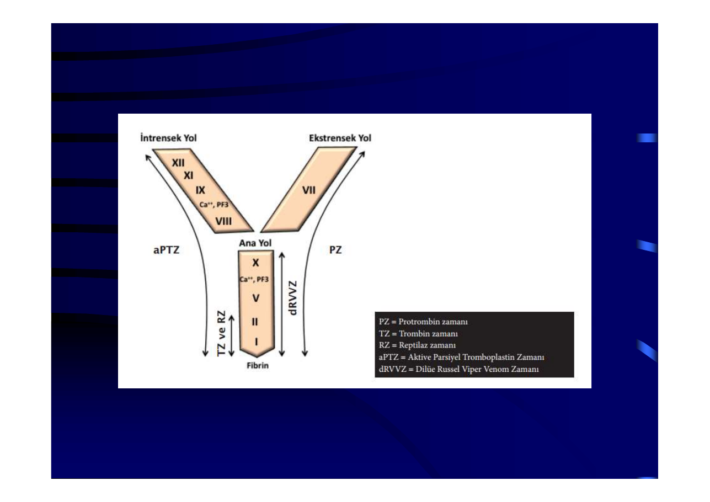
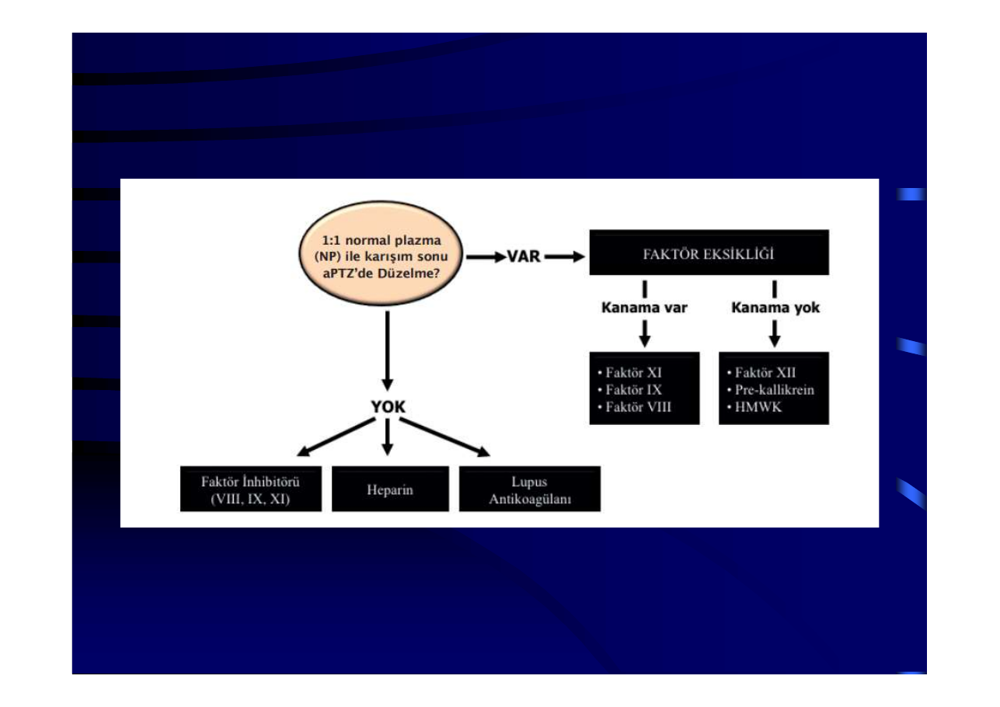
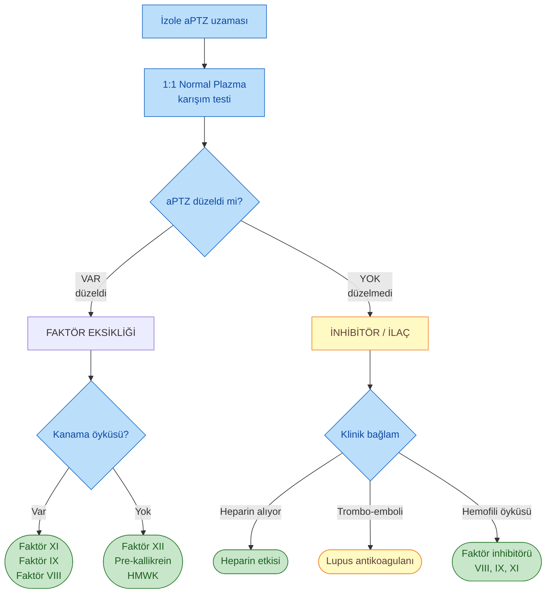
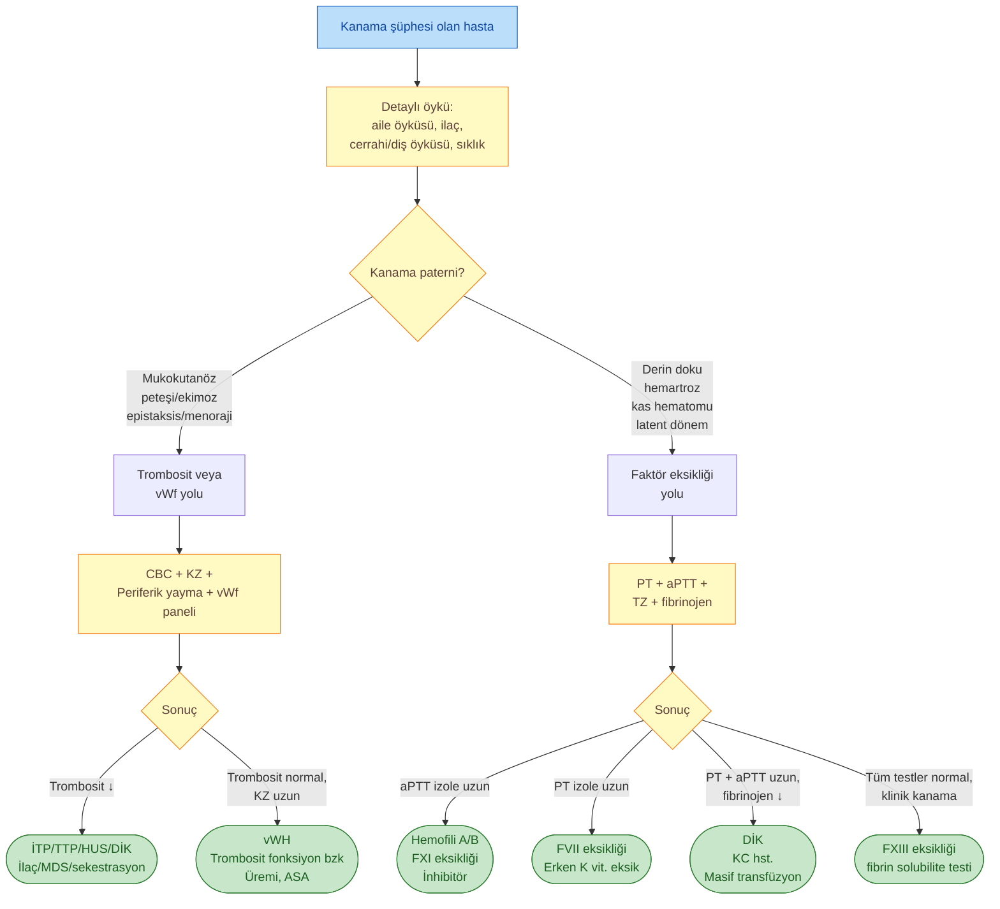

# KALITSAL KOAGÜLASYON HASTALIKLARI VE KANAMA BOZUKLUKLARI

**Hazırlayan:** Dr. İrfan Yavaşoğlu
**Bölüm:** Aydın Adnan Menderes Üniversitesi Tıp Fakültesi -- İç Hastalıkları AD, Hematoloji BD

---

## İÇİNDEKİLER

1. [Kalıtsal Koagülasyon Hastalıklarının Sınıflaması](#kalıtsal-koagülasyon-hastalıklarının-sınıflaması)
2. [Koagülasyon Kaskadı](#koagülasyon-kaskadı)
3. [Hemofili A (Faktör VIII Eksikliği)](#hemofili-a-faktör-viii-eksikliği)
4. [Hemofili B (Faktör IX Eksikliği)](#hemofili-b-faktör-ix-eksikliği)
5. [Diğer Kalıtsal Faktör Eksiklikleri](#diğer-kalıtsal-faktör-eksiklikleri)
6. [Faktör XIII Eksikliği](#faktör-xiii-eksikliği)
7. [Von Willebrand Hastalığı](#von-willebrand-hastalığı)
8. [Fibrinojen Bozuklukları](#fibrinojen-bozuklukları)
9. [Ayırıcı Tanı](#ayırıcı-tanı)
10. [aPTT Uzaması -- Tanısal Yaklaşım](#aptt-uzaması----tanısal-yaklaşım)
11. [Özet Tablo](#özet-tablo----anahtar-noktalar)

---

## KALITSAL KOAGÜLASYON HASTALIKLARININ SINIFLAMASI

Kalıtsal koagülasyon hastalıkları kalıtım paterni ve etkilenen faktöre göre sınıflandırılır. Bu sınıflama prenatal danışmanlık, taşıyıcı tarama ve risk değerlendirmesinde kritiktir.

| Kalıtım Paterni | Hastalıklar |
|---|---|
| **X kromozomuna resesif** | Hemofili A (FVIII), Hemofili B (FIX) |
| **Otozomal resesif** | Faktör 5, 7, 10, 11, 12, 13 eksiklikleri; afibrinojenemi; hipofibrinojenemi; protrombin (FII) eksikliği |
| **Otozomal dominant** | von Willebrand hastalığı (Tip 1, çoğu Tip 2); disfibrinojenemiler |
| **Kombine hastalıklar** | Hemofili A ile Faktör 5/7/11 eksikliği, vWH, disfibrinojenemi, trombosit disfonksiyonu, Hemofili B birlikteliği |
| **K vitaminine bağlı faktör eksiklikleri** | Faktör 2, 7, 9, 10 (edinsel; warfarin, KC hst., yenidoğan) |
| **Çeşitli** | Prekallikrein, yüksek molekül ağırlıklı kininojen (HMWK) eksikliği; inhibitör eksiklikleri (α2-antiplazmin, anormal α1-antitripsin) |

> **🔑 Klinik özet:**
>
> * **Mukokutanöz kanama (epistaksis, gingival, GİS)** → trombosit veya **vWH** lehine
> * **Eklem/kas kanaması (hemartroz, derin hematom)** → **faktör eksikliği** (Hemofili A/B) lehine
> * **Latent dönem (travmadan saatler-günler sonra kanama)** → faktör eksikliği için karakteristiktir; trombosit bozukluklarında kanama anında başlar

---

## KOAGÜLASYON KASKADI

Koagülasyon kaskadı üç ana yolaktan oluşur ve her yolak farklı laboratuvar testleriyle değerlendirilir.

### Y-Şemasının Detaylı Açıklaması

Bu Y-şeması, koagülasyon kaskadını **klasik laboratuvar testlerinin neyi ölçtüğüne göre** organize eder. Her test "kaskadın hangi kolundan girer, hangi kolundan çıkar"ı görsel olarak haritalar -- klinikte test yorumlamayı kolaylaştırmak için ideal şekildir.

#### Y'nin Üç Kolu

**🔵 Sol Kol -- İntrensek Yol (yukarıdan aşağıya: XII → XI → IX → VIII)**

* **Başlangıç:** Damar içinde yabancı yüzeyle (negatif yüklü kollajen, cam, kaolin) temas → **FXII (Hageman) aktivasyonu**
* **Sıralama:** XII → XI → IX → VIII (kofaktör)
* **Kritik kofaktörler:** **Ca²⁺ ve PF3** (trombosit faktör-3 = trombosit yüzey fosfolipidi). Bu kofaktörler tenaz kompleksinin (FIXa + FVIIIa) çalışması için zorunludur
* **PF3 ne demek?** Trombositler aktive olunca yüzeylerinde dışarı çevirdikleri **fosfatidilserin** -- bu zarın koagülasyon faktörlerinin Ca²⁺ aracılı tutunmasına izin veren yüzdür. **In vitro testte** PF3 yerine **kefalin (cephalin)** veya kaolin eklenir → bu yüzden test "**aktive parsiyel tromboplastin zamanı**" adını alır
* **Birleşme noktası:** İntrensek yolun çıktısı **FXa oluşumu** -- ana yola burada katılır

**🟠 Sağ Kol -- Ekstrensek Yol (sadece FVII)**

* **Başlangıç:** Damar dışı doku hasarı → subendotel **doku faktörü (TF)** kana temas eder
* **Tek faktör:** Sadece **FVII** çalışır (en kısa kol -- tek adımlı amplifikasyon, bu yüzden FVII yarı ömrü en kısa olduğunda ilk uzayan testtir)
* **Mekanizma:** TF + FVII → TF-VIIa kompleksi → doğrudan FX'i aktive eder (ayrıca FIX'i de aktive ederek intrensek yolu güçlendirir -- "amplifikasyon basamağı")
* **Birleşme noktası:** İntrensek yol gibi **FXa düzeyinde** ortak yola katılır

**🟣 Orta Kol -- Ana (Ortak) Yol (yukarıdan aşağıya: X → V → II → I → Fibrin)**

* Hem intrensek hem ekstrensek yolun birleştiği son ortak basamak
* **X** (Stuart-Prower) → **Xa** -- protrombinaz kompleksinin enzimatik bileşeni
* Burada da **Ca²⁺ ve PF3** zorunludur (ortak yolda da fosfolipid yüzey gerekir)
* **V** (proakselerin) → **Va** -- protrombinaz kompleksinin kofaktör bileşeni (trombin tarafından geri besleme ile aktifleşir)
* **II** (protrombin) → **IIa (TROMBİN)** -- şemada gösterilmese de **trombin oluşumu kaskadın merkezi olayıdır** ve birden fazla noktada geri besleme yapar (V, VIII, XI, XIII aktivasyonu, fibrinojen → fibrin)
* **I** (fibrinojen) → **Fibrin** -- şemanın en altındaki son ürün; ardından FXIIIa ile çapraz bağlanıp **stabil fibrin pıhtısı** oluşur

#### Y'nin Dış Tarafındaki Test Okları -- Hangi Test Neyi Görür?

Şemanın dış kısmındaki oklar **her testin "hangi noktadan kaskada girip nereye kadar gittiğini"** gösterir. Bu, hangi faktör eksikliğinin hangi testi uzatacağını anlamanın en pratik yoludur:

| Test (şemadaki ok) | Yolak | Hangi faktörü "görür"? | Klinik kullanım |
|---|---|---|---|
| **PZ (PT)** -- sağ dış ok | **Ekstrensek + Ortak** | **VII**, X, V, II, I | Warfarin takibi (INR), KC sentez fonksiyonu, K vit. eksikliği |
| **aPTZ (aPTT)** -- sol dış ok | **İntrensek + Ortak** | **XII, XI, IX, VIII**, X, V, II, I | Heparin takibi, Hemofili A/B/C, lupus antikoagulan, FVIII inhibitörü |
| **TZ (Trombin Zamanı)** -- sol alt ok | Sadece **fibrinojen → fibrin** | **I (fibrinojen)** | Heparin etkisi, disfibrinojenemi, dabigatran etkisi |
| **RZ (Reptilaz Zamanı)** -- sol alt ok | Fibrinojen → fibrin (heparinden bağımsız) | **I** | TZ uzunsa **heparin var mı** ayrımı (RZ heparine duyarlı değildir) |
| **dRVVZ (Dilüe Russell Viper Venom Zamanı)** -- orta alt ok | **Doğrudan FX'i aktive eder** (yılan zehiri ile) | X, V, II, I | **Lupus antikoagulan tanısında altın standart** -- intrensek/ekstrensek yolu atlar, sadece ortak yolu test eder |

#### Şema Üzerinden Test Yorumlama Mantığı

Y şeklini görselleştirerek izole test bozukluklarında hangi kolun problemli olduğunu hızla bulabilirsin:

| Lab paterni | Şemada problem | Düşünülecek tanılar |
|---|---|---|
| **Sadece PT uzun** | Sadece sağ kol | **FVII eksikliği** (kalıtsal nadir; edinsel: erken K vit. eksikliği, warfarin başlangıcı, KC hst.) |
| **Sadece aPTT uzun** | Sadece sol kol | **İntrensek yol eksikliği** (FVIII, FIX, FXI, FXII; veya heparin, lupus antikoagulan, FVIII inhibitörü) |
| **Hem PT hem aPTT uzun** | Ortak gövde veya birden fazla yol | Ortak yol eksikliği (X, V, II, fibrinojen) **veya** çoklu eksiklik (KC hst., DİK, ileri warfarin, masif transfüzyon) |
| **TZ ve RZ uzun, PT/aPTT normal** | Sadece en alt basamak | Fibrinojen anormalliği (afibrinojenemi, disfibrinojenemi, hipofibrinojenemi) |
| **TZ uzun ama RZ normal** | Heparin etkisi | Heparin AT-III aracılı çalışır; RZ trombinden bağımsız → heparine duyarlı değil |
| **dRVVZ uzun ama PT/aPTT normal** | İntrensek/ekstrensek atlanmış | **Lupus antikoagulanı** (1:1 NP karışımıyla düzelmez -- inhibitördür) |
| **PT, aPTT, TZ, RZ tümü normal ama klinik kanama** | Kaskad-sonrası adım | **FXIII eksikliği** (fibrin solubilite testi gerekir) ya da **trombosit fonksiyon bozukluğu** (KZ uzar) |

> **🔑 PF3 vurgusu (klinik paradoks):**
>
> Trombositopenide veya trombosit fonksiyon bozukluğunda (Glanzmann, Bernard-Soulier) PT/aPTT **normal** olabilir ama **in vivo koagülasyon yine de bozulur** -- çünkü "fosfolipid yüzey eksikliği" testte kefalin/kaolin ile telafi edilir, in vivo'da telafi edilmez. "**Lab normal ama klinik kanama var**" paradoksunun bir nedenidir.

> **🔑 Modern bakış:**
>
> Bu klasik Y-şeması laboratuvar testlerini anlamak için vazgeçilmezdir; ancak günümüz **hücre-bazlı koagülasyon modelinde** ekstrensek ve intrensek yollar bağımsız değildir. Gerçekte **TF-VIIa kompleksi** hem FX'i (ekstrensek/ortak) hem de FIX'i (intrensek amplifikasyon) aktive ederek tek entegre bir süreç başlatır -- son aşamada **"trombin patlaması" (thrombin burst)** ile fibrin oluşur. PT ve aPTT reaktifleri hâlâ klasik yolu uyarmak üzere tasarlanmış olduğu için Y-şeması test yorumlamada güncelliğini koruyor.

### Pıhtılaşma Faktörlerinin Adları ve Fonksiyonları

| Faktör | Diğer Adı / Eponim | Fonksiyon |
|---|---|---|
| **I** | Fibrinojen | Pıhtıyı oluşturur (**fibrin**) |
| **II** | Protrombin | Edimsel formu (**IIa = trombin**) **I, V, VII, VIII, XI, XIII, Protein C** ve **trombositleri aktive eder** |
| **III** | **Doku faktörü (TF)** | **FVIIa'nın kofaktörü**dür (önceden Faktör III olarak adlandırıldı) |
| **IV** | **Kalsiyum (Ca²⁺)** | Koagülasyon faktörlerinin **fosfolipidlere bağlanmasını sağlar** (önceden Faktör IV olarak adlandırıldı) |
| **V** | Proakselerin, labil faktör | **FX'un kofaktörü**dür; **protrombinaz kompleksini** oluşturur |
| **VI** | -- | **Atanmamıştır** (önceden Va olarak adlandırıldı) |
| **VII** | Prokonvertin, stabil faktör | **FIX ve FX'u aktive eder** |
| **VIII** | **Antihemofilik faktör-A** | **FIXa'nın kofaktörü**dür; **tenaz kompleksini** oluşturur |
| **IX** | **Antihemofilik faktör-B**, Christmas faktörü | **FX'u aktive eder**; FVIIIa ile **tenaz kompleksini** oluşturur |
| **X** | Stuart-Prower faktörü | **FII'yi aktive eder**; FV ile **protrombinaz kompleksini** oluşturur |
| **XI** | Plazma tromboplastin öncülü (PTA) | **FIX'u aktive eder** |
| **XII** | Hageman faktörü | **FXI, FVII ve prekallikrein'i aktive eder** |
| **XIII** | Fibrini stabilize eden faktör (FSF) | **Fibrin monomerlerini fibrin polimerlerine dönüştürür** (çapraz bağlama) |
| **von Willebrand faktörü (vWf)** | -- | **FVIII'e** ve **subendoteldeki kollajene** bağlanır → trombosit **adezyonunu sağlar** |
| **Prekallikrein** | Fletcher faktörü | **FXII'yi aktive eder**; **HMWK'yı böler** |
| **Yüksek moleküler ağırlıklı kininojen (HMWK / YMAK)** | Fitzgerald faktörü | **FXII, FXI ve prekallikrein'in** karşılıklı aktivasyonunu **destekler** |

> **🔑 Kompleks isimleri:**
>
> * **Tenaz kompleksi** = FIXa + FVIIIa + Ca²⁺ + fosfolipid → FX'u aktive eder (intrensek yolun ana enzim kompleksi)
> * **Protrombinaz kompleksi** = FXa + FVa + Ca²⁺ + fosfolipid → protrombini (FII) trombine (FIIa) çevirir (ortak yolun ana enzim kompleksi)
> * **K vitaminine bağımlı faktörler:** **II, VII, IX, X** + **Protein C, Protein S** (γ-karboksilasyon için K vit. gerekir → warfarin bu adımı bloke eder)

### Şemadaki Kısaltmalar ve Yolaklar

| Test | Ölçtüğü Yolak | Faktörler |
|---|---|---|
| **PZ (Protrombin Zamanı, PT)** | Ekstrensek + Ortak | **VII**, X, V, II, I (fibrinojen) |
| **aPTZ (Aktive Parsiyel Tromboplastin Zamanı, aPTT)** | İntrensek + Ortak | **XII, XI, IX, VIII**, X, V, II, I |
| **TZ (Trombin Zamanı)** | Sadece fibrinojen → fibrin | I (fibrinojen) |
| **RZ (Reptilaz Zamanı)** | Trombin yolundan bağımsız fibrin oluşumu | I (heparin etkisinden bağımsız) |
| **dRVVZ (Dilüe Russell Viper Venom Zamanı)** | Ortak yolun X aktivasyonu | X, V, II, I (lupus antikoagulan tanısı) |

> **💡 Klinik kullanım:**
>
> * **PT uzar, aPTT normal** → **Faktör VII eksikliği** (kalıtsal nadir; edinsel: erken K vit. eksikliği, warfarin, KC hst.)
> * **aPTT uzar, PT normal** → **İntrensek yol eksikliği** (Hemofili A/B, FXI, FXII, prekallikrein, HMWK; veya heparin, lupus antikoagulanı, faktör inhibitörü)
> * **PT ve aPTT birlikte uzar** → **Ortak yol eksikliği** (X, V, II, I) ya da **kombine eksiklik** (KC hst., DİK, masif transfüzyon, warfarin overdoz)
> * **TZ ve RZ uzar, PT/aPTT normal** → **Fibrinojen anormalliği** (afibrinojenemi, disfibrinojenemi)

### Koagülasyon Kaskadı -- Detaylı Görsel

### Şemanın Detaylı Türkçe Karşılığı ve Öğretici Açıklaması

**🟡 Background (Genel Çerçeve)**

Koagülasyon kaskadı, **doku hasarı** ardından kanamayı durdurmak için ardışık olarak işleyen enzim aktivasyonları zinciridir. Temel mantık:

* **Her adım bir sonrakini aktive eder** (zincirleme amplifikasyon -- başlangıçtaki küçük uyaran sonunda büyük miktar fibrin üretir)
* **Sonuçta stabil bir kan pıhtısı (fibrin clot)** oluşur
* Bu sürecin tamamına **sekonder hemostaz** denir (primer hemostaz = trombosit tıkacı oluşumu; bu kaskad onu kalıcılaştırır)
* Kaskaddaki herhangi bir basamakta defekt (eksiklik veya inhibisyon) → **kanama bozukluğu**

---

**🔵 İNTRENSEK YOL (Intrinsic Pathway -- aPTT ile ölçülür)**

İntrensek yol "hepsi kanın içinde başlar" ilkesiyle çalışır -- damar hasarı ile **kollajen, kallikrein ve HMWK** açığa çıkar; bu üçü FXII'yi aktive eder. Adım adım:

1. **FXII (Hageman faktörü)** + kollajen/kallikrein/HMWK temas → **FXIIa**
   * Kontak fazı reaksiyonudur
   * **⚠️ FXII eksikliği klinik kanama yapmaz** (in vivo doku faktörü yolu yeterli olur), ama aPTT uzar
2. **FXIIa** → FXI'i aktive eder → **FXIa**
   * FXI eksikliği = **Hemofili C** (özellikle Aşkenazi Yahudilerde)
   * Cerrahi/travma sonrası kanama yapar; spontan kanama nadirdir
3. **FXIa + Ca²⁺** → FIX'i aktive eder → **FIXa**
   * **FIX eksikliği = Hemofili B (Christmas hastalığı)** -- şemada **🅑 etiketi**
   * X kromozomuna resesif geçer
4. **FVIII** -- intrensek yolun kofaktörü:
   * **vWf'ye bağlı** olarak plazmada dolaşır (vWf onu yıkımdan korur)
   * **Trombin** tarafından aktive edilir → **FVIIIa**
   * **FVIII eksikliği = Hemofili A** -- şemada **🅐 etiketi**
   * **vWf eksikliği** dolaylı olarak FVIII'i de düşürür (Tip 2N vWH klasik örnek) -- şemada **🅓 etiketi**
5. **FIXa + FVIIIa + Ca²⁺ + fosfolipid yüzeyi** = **TENAZ KOMPLEKSİ**
   * Bu kompleks ortak yola geçişin ana kapısıdır
   * FX'i aktive eder

> **🔑 Klinik bağlantı:** İntrensek yol bozuklukları **aPTT'yi uzatır, PT'yi etkilemez**. Bu yüzden Hemofili A/B'de izole aPTT uzaması görülür.

---

**🟠 EKSTRENSEK YOL (Extrinsic Pathway -- PT ile ölçülür)**

Ekstrensek yol "tetiği dışarıdan çekilir" -- normalde **damar dışında** bulunan **doku faktörü (TF)**, damar hasarı ile kana temas eder ve süreci başlatır:

1. **Endotel hasarı** → subendotelyal **doku faktörü (FIII / TF)** açığa çıkar
   * Eski adlandırmada Faktör III, modern adlandırmada **doku faktörü (TF)**
   * Damar dışı tüm hücrelerde (özellikle fibroblast, düz kas) konstitütif olarak bulunur
2. **TF + FVII** → kompleks → **FVIIa**
   * FVII bir K vitaminine bağımlı faktördür (şemada **🅔 etiketi = vit K eksikliği** kategorisinde)
   * **Ca²⁺ varlığında** çalışır
3. **TF-FVIIa kompleksi** doğrudan **FX'i aktive eder** → **FXa**
   * Bu şant intrensek yolu atlayarak ortak yola direkt geçer
   * Aynı zamanda FIX'i de aktive edebilir (intrensek yolu güçlendirir -- "amplifikasyon" basamağı)

> **🔑 Klinik bağlantı:**
> * Ekstrensek yol bozuklukları **PT'yi izole olarak uzatır**
> * **FVII yarı ömrü en kısadır (~6 saat)** -- bu yüzden K vit. eksikliğinde, warfarin başlangıcında **ilk uzayan PT'dir**
> * **Doku faktörü yolağı** in vivo koagülasyonun **fizyolojik tetikleyicisidir** (intrensek yol daha çok in vitro test reaktivitesini açıklar)

---

**🟣 ORTAK YOL (Common Pathway -- her iki testi de etkiler)**

Hem intrensek hem ekstrensek yolun birleştiği son basamaktır. Trombin geri besleme döngüsü ile sürecin amplifikasyonu sağlanır:

1. **FX** → **FXa** (intrensek yolun tenaz kompleksi VEYA ekstrensek yolun TF-FVIIa kompleksi tarafından)
   * **FX K vit. bağımlıdır** (şemada **🅔**)
   * Eski adı: **Stuart-Prower faktörü**
2. **FV** → **FVa** (trombin tarafından geri besleme ile aktive edilir)
   * FV eksikliği = **parahemofili** (Owren hastalığı)
3. **FXa + FVa + Ca²⁺ + fosfolipid yüzeyi** = **PROTROMBİNAZ KOMPLEKSİ**
4. Protrombinaz → **FII (protrombin) → FIIa (TROMBİN)**
   * **FII K vit. bağımlıdır** (şemada **🅔**)
   * **Trombin merkezi enzimdir** -- birden fazla yerde geri besleme yapar:
     * FV → FVa
     * FVIII → FVIIIa
     * FXI → FXIa (ek amplifikasyon)
     * FXIII → FXIIIa
     * Fibrinojen → fibrin
     * Protein C aktivasyonu (negatif feedback)
5. **Trombin (FIIa) + FI (fibrinojen) → Fibrin monomerleri (Ia)**
6. **FXIII** → **FXIIIa** (trombin tarafından aktive edilir)
   * **Stabilize edici faktör**; eksikliğinde klasik testler normal, fibrin pıhtı solubilite testi tanı koydurur
7. **FXIIIa + Ca²⁺** → fibrin monomerleri arasında **kovalent çapraz bağlar** → **STABİL FİBRİN PIHTISI** (görseldeki son aşama)

> **🔑 Klinik bağlantı:**
> * Ortak yol bozuklukları **hem PT hem aPTT'yi uzatır** (X, V, II, fibrinojen)
> * **K vit. eksikliği veya warfarin** → 4 K vit. bağımlı faktörü (II, VII, IX, X) etkiler → **PT ve aPTT birlikte uzar**, ama PT daha hassas
> * **DİK** → bütün faktörler tüketilir + fibrinojen düşer + D-dimer yükselir → tüm testler bozulur

---

**🔴 Coagulation Disorders (Şemadaki Renk Kodlu Etiketler -- Eşlik Eden Hastalıklar)**

Şemada her etiket bir kanama bozukluğunun hangi faktörü etkilediğini gösterir:

| Etiket | Hastalık | Etkilenen Faktör | Kalıtım | Lab Bulgu |
|---|---|---|---|---|
| **🅐** | **Hemofili A** | FVIII | X'e resesif | aPTT ↑, PT normal |
| **🅑** | **Hemofili B** (Christmas) | FIX | X'e resesif | aPTT ↑, PT normal |
| **🅒** | **Hemofili C** | FXI | Otozomal resesif | aPTT ↑, PT normal |
| **🅓** | **von Willebrand hastalığı** | vWf (+ dolaylı FVIII) | OD (Tip 1, 2); OR (Tip 3) | KZ ↑, aPTT normal/↑, RİPA değişken |
| **🅔** | **K vitamini eksikliği / warfarin** | II, VII, IX, X (+ Protein C, S) | Edinsel | PT ↑↑, aPTT ↑, INR ↑ |

> **💡 Şemanın öğretici özeti:**
>
> * **Tek defekt → birden fazla bulgu yapabilir** çünkü trombin geri beslemeli amplifikasyon zincirinde küçük bir kayıp aşağı doğru büyür
> * Şemadaki **mor oklar (Thrombin)** trombin geri beslemesini gösterir -- trombin yalnızca pıhtı yapan değil, kaskadı **kendi kendini güçlendiren** ana orkestratördür
> * **Heyecan verici nokta:** Hücre-bazlı modern modelde kaskad artık iki ayrı yol değil, **TF-VIIa ile başlayan ve trombin patlaması (thrombin burst) ile biten** tek entegre süreç olarak öğretilir; ancak laboratuvar test mantığı (PT ↔ ekstrensek; aPTT ↔ intrensek) hâlâ bu klasik şemaya dayalıdır

---

## HEMOFİLİ A (FAKTÖR VIII EKSİKLİĞİ)

### Faktör VIII Hakkında

* **Antihemofilik faktör (AHF)**, **265 kDa** tek zincirli protein
* **Faktör X aktivasyonunda intrensek yolda** görevli (FIXa'nın kofaktörü)
* **Karaciğer parankim hücresinde ve endotelde** sentezlenir
* **vWf ile kompleks** halinde dolaşır (vWf onu yıkımdan korur)
* Yarı ömrü **8-12 saat**
* **X kromozomunda** lokalize → X'e resesif geçiş
* Hemostaz için **%25 aktivite ve 10 μg/L konsantrasyon** yeterlidir
* Semptomatik hastalarda **ortalama %5 aktivite**
* Sıklık: **1 / 5.000-10.000 erkek**

### Genetik

* Hemofili A geni X kromozomunun uzun kolunda yer alır; **22. intron kırılma noktası** (Hemofili variantları), **delesyon, kopma, mutasyonlar** saptanmıştır
* Bazı varyantlar otozomal dominant geçişlidir
* **Taşıyıcı erkekler** ve **X kromozom inaktivasyonu** klinik tabloyu modifiye eder

### Kadınlarda Hemofili A

Genelde sadece taşıyıcı olan kadınlar şu durumlarda klinik hemofili gösterebilir:

* **X kromozom inaktivasyonu** (lyonizasyon -- şanslı X inaktivasyonu)
* **Taşıyıcı kadın × hasta erkek evliliği**
* **Otozomal dominant** varyant
* **45 XX / 45 X mozaisizm** (Turner sendromu varyantı)

### Klinik Bulgular

Klinik şiddet faktör düzeyiyle korelasyondadır.

| Faktör Düzeyi | Klinik Şiddet | Olgu Oranı | Klinik |
|---|---|---|---|
| **<1 U/dL (%1)** | **Şiddetli** | %70 | Spontan kanama, **hemartroz**, kas hematomu |
| **1-5 U/dL (%1-5)** | **Orta** | %15 | Minimal travma/cerrahi ile orta kanama; nadiren hemartroz |
| **6-40 U/dL (%6-40)** | **Hafif** | %15 | Yalnızca **ağır travma** veya **majör cerrahi** ile kanama |

> **⚠️ ÖNEMLİ:** Hemofili kanaması travmadan **1-5 gün sonra** (latent dönem) ortaya çıkabilir; bu özellik trombositopatiden ayırt edicidir.

#### Hemartroz

Hemofili A'nın patognomonik bulgusudur:

* **Sinoviyal damarlardan kanama** (spontan veya travma ile)
* Akut dönem: **şiş (ödem), ağrılı eklem**, yineleyen kanama
* İlerleyen evre: **subkondral ve sinoviyal iskemi, hyalin kıkırdak kaybı, subkondral kanama, kistler, destrüksiyon, eklem aralığında daralma, fibröz/ossöz ankiloz**
* Son evre: **kronik hemofilik artropati**

#### Hemartrozun Radyolojik Sınıflaması

* Osteoporoz
* Epifizeal genişleme
* Subkondral düzensizlik
* Eklem aralığında daralma
* Subkondral kistler
* Eklem erozyonu
* Eklem deformitesi

#### Diğer Klinik Kanama Tipleri

* **Subkutan-intramusküler kanama**
* **Sefal hematom**, hematom
* **Psoas-retroperitoneal hematom** → femoral nöropati, akut apandisit kliniği taklit edebilir
* **Kas doku nekrozu** → kompartman sendromu
* **İskemik sinir zedelenmesi** → Volkmann iskemik kontraktürü, ulnar/femoral sinir hasarı
* **Sünnet kanamaları**
* **GİS, ÜGS, dil, SSS, orofarinks kanaması**
* **Cerrahi yara, travma, enjeksiyon yerinde** kanama

### Laboratuvar

| Test | Bulgu |
|---|---|
| **PT (Protrombin zamanı)** | Normal |
| **TZ (Trombin zamanı)** | Normal |
| **Kanama zamanı** | Normal |
| **aPTT (PTT)** | **Uzamış** |
| **Faktör VIII düzeyi ve aktivitesi** | Düşük |
| **Faktör VIIIc** | Düşük |
| Şiddetli kanamada | Anemi, lökositoz, trombositoz |

### Kanamalarda İstenen Faktör Düzeyleri

| Klinik Durum | Hedef FVIII Düzeyi |
|---|---|
| **Diş çekimi** | **%30** |
| **Orta derecede kanama** (erken hemartroz, orta hematom, hematüri) | **%30** |
| **Tehdit edici kanama** (hemartroz + ağrı + şişlik, GİS kanaması, hava yolu tıkanması, kanamasız ağır travma, nörolojik bulgu olmadan kafa travması) | **%50** |
| **Yaşamı tehdit edici kanama** (intrakraniyal, majör travma, majör cerrahi) | **%80** |

> **⚠️ İdame süreleri:**
> * **Orta derece ve tehdit edici kanama:** Hedef düzey **72 saat** sürdürülmeli
> * **Ortopedik cerrahi:** **21 gün** idame
> * **Diğer cerrahi:** **14 gün**
> * **Oral cerrahi:** **48-72 saat**

### Tedavi

#### Taze Donmuş Plazma (TDP)

* FVIII düzeyini ~%20 artırır
* **Hafif olgularda:** 2-4 gün, 10-15 mL/kg, 12 saatte bir
* **Ağır olgularda:** 30 mL/kg yükleme → 1-2 gün 8 saatte bir 10-15 mL/kg → 12 saatte bir 10-15 mL/kg

#### Kriyopresipitat

* 200 mL plazmadan elde edilir
* İçerik: **50-120 Ü FVIII**, **250 mg fibrinojen**, **F-V/VII/IX/X/XI/XIII**, **vWf**
* **Hafif olgularda:** 1.25-1.75 torba/10 kg, 2-4 gün, 12 saatte bir
* **Ağır olgularda:** 3.5 torba/10 kg yükleme → 1-2 gün 8 saatte bir → 12 saatte bir 1.75 torba/10 kg

#### Pürifiye Faktör VIII

* Eskiden hayvansal kaynak (viral enf. + inhibitör riski) → **rekombinant insan FVIII** standart
* **Pahalı**
* Majör kanamada: **2 Ü/kg/saat sürekli infüzyon**
* **1 Ü FVIII/kg → kanda %2 FVIII düzeyi** artışı sağlar
* **Doz formülü:** (İstenen FVIII düzeyi − Hastadaki FVIII düzeyi) × Kg / 2
* Genel uygulama: **Hafif olgularda** 2-4 gün, 10-15 Ü/kg, 12 saatte bir; **ağır olgularda** 30 Ü/kg yükleme → 1-2 gün 12 saatte bir → 12 saatte bir 10-15 Ü/kg
* **Eski/pürifiye olmayan ürün riskleri:** AIDS, hepatit B, hepatotoksisite, *P. carinii* pnömonisi, CD4/CD8 oranını düşürme, alerjik reaksiyonlar

#### DDAVP (1-desamino-8-D-arjinin vazopresin)

* Vazopresin analoğu; tuz-su tutucu, hafif kan basıncı artışı yapar
* **Endojen endotelden vWf ve FVIII salınımını uyarır**
* **Kullanım yeri:** **Hafif Hemofili A** ve **Tip 1 vWH** (bazen Tip 2A)
* Doz: **0.3-0.4 μg/kg, 15-30 dk infüzyon**
* **Yan etki:** Anaflaksi, HT atakları
* **⚠️ Kontrendikasyon:** **Tip 2B vWH** ve **psödo-vWH** (vWf agregatlarını artırır → trombotik komplikasyon, trombositopeni)

#### EACA (Epsilon Aminokaproik Asit)

* **Antifibrinolitik** -- oral sekresyonlardaki plazminojen aktivatörlerini inhibe eder
* **Diş çekimi öncesi** **48-96 saat** boyunca **40 mg/kg (4-6 g/gün)** verilir
* FVIII'i ~%30 düzeyine çıkarır

### Komplikasyonlar

| Komplikasyon | Açıklama |
|---|---|
| **Hepatit (HBV, HCV)** | %10-20 hepatosplenomegali (HPSPMG), kronik aktif/persistan hepatit, KC sirozu |
| **Demir eksikliği anemisi** | Yineleyen kanama nedeniyle |
| **Otoimmun hemolitik anemi** | Nadiren |
| **AIDS** | Eski faktör konsantrelerinden bulaş öyküsü |
| **FVIII inhibitör (antikor) gelişimi** | %5-10; **IgG yapısında**, tedaviyi zorlaştırır |

#### FVIII İnhibitörü -- Yönetim

| Tip | Klinik | Tedavi |
|---|---|---|
| **Tip 1** | FVIII verilmesiyle antikor titresi artar (anamnestik reaksiyon); ciddi kanama olmadığı sürece FVIII'e ihtiyaç yok | **Protrombin kompleksi** |
| **Tip 2** | Yüksek FVIII düzeyine ihtiyaç duyar | DDAVP, **protrombin kompleksi**, **FVIII kompleksi**, **F-VII konsantresi (rFVIIa)** |

> **🔑 İnhibitör tespiti:** **Bethesda Ünitesi** ile ölçülür; düzeye göre **immun tolerans indüksiyonu** (yüksek doz FVIII düzenli verilerek antikor azaltılması) ya da **bypass ajan (rFVIIa, aPCC)** seçilir.

### Prognoz

Mortalite/morbidite başlıca şu durumlardan etkilenir:

* **Eklem değişiklikleri** (kronik artropati)
* **AIDS** (eski transfüzyon kohortunda)
* **Karaciğer hastalığı**
* **Doğal inhibitör gelişimi**

### Prenatal Tanı

* **RFLPs (Restriction Fragment Length Polymorphism)**
* **Amniyosentez veya koryon villus biyopsisi**
* Defektif allel ve **XO mozaisizmi** saptanabilir

---

## HEMOFİLİ B (FAKTÖR IX EKSİKLİĞİ)

### Faktör IX Hakkında

* **55 kDa**, tek zincirli, **karaciğerde** sentezlenir
* Yarı ömrü **24 saat** (FVIII'den uzun)
* **K vitaminine bağımlı** (II, VII, IX, X grubunda)
* Faktör XI**a** veya Faktör VII**a** ile FIX**a**'a dönüşür
* Faktör VIII ve X'u aktifler
* K vit. FIX'da **rezidüe glutamik asit** üzerindeki ikinci karboksil grubunu içine sokan **posttranslasyonel modifikasyon (γ-karboksilasyon)** için **kofaktör**dür → kalsiyum bağlanması ve fosfolipid yüzeyinde adsorpsiyon mümkün olur
* **X'e bağlı resesif** geçiş
* **10.000'de 1 erkek çocukta** görülür (Hemofili A'dan ~5 kat seyrek)

### Klinik Özellikler

* Klinik tablo Hemofili A ile **birebir aynıdır** (hemartroz, hematom, GİS/ÜGS kanaması, vb.)
* **<%1 aktivite** → şiddetli kanamalar (nadirdir)
* **%20-25 aktivite hemostaz için yeterlidir**
* **PTT uzamıştır**; bazı varyantlarda PT da uzayabilir
* Varyantlar: **CRM+/−, Leyden, PTZ uzun, Chapel Hill, Zutphen**
* Mutasyonlar Hemofili A'ya göre daha **nadir**dir
* Prenatal tanı **RFLPs** ile yapılır

### Kanamalarda İstenen Faktör Düzeyleri

| Klinik Durum | Hedef FIX Düzeyi |
|---|---|
| **Diş çekimi** | **%30** |
| **Orta derecede kanama** | **%15-20** |
| **Tehdit edici kanama** | **%40** |
| **Yaşamı tehdit edici kanama** | **%60** |

### Tedavi

> **⚠️ ÖNEMLİ:** **DDAVP ve kriyopresipitat Hemofili B'de ETKİSİZDİR** (FIX içermezler).

| Tedavi | Endikasyon |
|---|---|
| **Taze Donmuş Plazma (TDP)** | Orta derecede olgular |
| **Protrombin kompleksi konsantresi (PCC)** | Tüm şiddetli olgular |
| **Pürifiye Faktör IX (rekombinant)** | Standart -- şiddetli olgular |

#### Protrombin Kompleksi (PCC)

* **K vit. bağımlı faktörleri içerir:** Protrombin (II), F-VII, F-IX, F-X, **protein C ve protein S**
* **Hafif kanamalarda:** 20-30 Ü/kg yükleme → 2-4 gün, 15 Ü/kg, 24 saatte bir
* **Ağır kanamalarda:** 40-60 Ü/kg yükleme → 20-25 Ü/kg, 24 saatte bir

#### Pürifiye Faktör IX

* Eski pürifikasyon: **ısı (72 saat 80°C veya 144 saat 60°C)**, jel kromatografisi, solvent/deterjan, monoklonal antikor
* AIDS, hepatit, **tromboemboli riski** nedeniyle günümüzde **rekombinant** ürün tercih edilir
* **Pahalı**
* **Hafif kanamalarda:** 20-30 Ü/kg yükleme → 15 Ü/kg, 24 saatte bir, 2-4 gün
* **Ağır kanamalarda:** 60-70 Ü/kg yükleme → 20-40 Ü/kg, 24 saatte bir

---

## DİĞER KALITSAL FAKTÖR EKSİKLİKLERİ

### Genel Karşılaştırma

| Faktör | Kalıtım | Sıklık | Klinik | Lab | Tedavi |
|---|---|---|---|---|---|
| **Protrombin (II)** | Otozomal resesif | Çok nadir | Hemostaz için %25 aktivite gerek; klinik %1 altında. Spontan kanama, göbek kordon, meno-metroraji, yenidoğan kanaması; hemartroz nadir | **PT ve PTT uzar**, protrombin <10 Ü/dL | TDP, **PCC** |
| **Faktör V (parahemofili)** | Otozomal resesif | **1/1.000.000** | Epistaksis, menoraji, gingival kanama, çabuk morarma; GİS/SSS kanaması <%1; hemartroz nadir; FVIII eksikliği ile birlikte olabilir | Şiddetli olgularda kanama zamanı uzar (1/3); **PT, PTT uzar**, TZ normal | **TDP** |
| **Faktör VII** | Otozomal resesif | -- | Epistaksis, hematom, GÜS, cerrahi/neonatal SSS kanaması; şiddetli kanama <%1; **tromboembolik olaylar sıktır**; **Dubin-Johnson, Rotor sendromu, homosistinüride** sık | **PT uzar (izole)** | TDP, **PCC**, **rFVIIa** |
| **Faktör X** | Otozomal resesif | -- | <%10 → FVII benzeri; <%1 → Hemofili A benzeri kanama | **PT, PTT uzar**, TZ normal; kanama zamanı nadiren uzar | TDP, **PCC** |
| **Faktör XI** (Hemofili C) | Otozomal resesif | Aşkenazi Yahudilerde sık | Spontan kanama nadir; cerrahi/travma sonrası kanama sık; hemartroz/menoraji nadir; **Gaucher** ve **Noonan sendromu** ile birlikte | **PTT uzar**; homozigot <20 Ü/dL, heterozigot 30-65 Ü/dL | TDP; kontrol edilemezse **plazma değişimi** |
| **Faktör XII** | Otozomal resesif | -- | **Klinik kanama YOK**; cerrahi bile sorunsuz geçirilir | **PTT uzar** (yalancı uzama gibi yorumlanır) | Tedavi gerekmez; nadiren TDP |

### Edinsel Faktör VII ve X Eksiklikleri

| Faktör | Edinsel Nedenler |
|---|---|
| **Edinsel FVII eksikliği** | K vitamini eksikliği, karaciğer hastalığı, **warfarin tedavisi** |
| **Edinsel FX eksikliği** | K vitamini eksikliği, karaciğer hastalığı, **amiloidoz** (FX adsorbsiyonu nedeniyle), warfarin tedavisi |

> **🔑 Klinik ipucu:** Sebebi açıklanamayan **izole FX eksikliği** + **proteinüri/kardiyak/nöropati** → **AL amiloidoz** araştırılmalı.

---

## FAKTÖR XIII EKSİKLİĞİ

Faktör XIII, fibrin α ve γ zincirleri arasında **ε-amino γ-glutamil çapraz bağları** oluşturarak **fibrin stabilizasyonunu** sağlar (A ve B subünit yapısında).

### Görev Alanları

* **Yara iyileşmesi**
* **Koagülasyon stabilizasyonu** (neonatal göbek kanaması, sünnet kanaması, hemartroz, hematom, yumuşak doku kanaması; **%25 SSS kanaması**)
* **Spermatogenez** (eksiklikte infertilite)
* **Plasental implantasyon** (eksiklikte tekrarlayan abortus)

### Klinik Özellikler

* **Otozomal resesif**
* **%1 aktivasyon koagülasyonda yeterlidir**
* Edinsel/sekonder formda: **İzoniazid, fenitoin, penisilin, prokainamid** çapraz bağları bozar
* **Crohn hastalığı, monoklonal gamopati, otoimmun hastalıklar, HSC, kolitis ülseroza, karaciğer hastalıkları** ile birlikte görülebilir
* **Fibrin pıhtı solubilitesi bozulur**

### Laboratuvar -- Klasik Bulgu

> **⚠️ AYIRICI ÖZELLİK:** **KZ, TZ, PT, PTT NORMAL** -- klasik koagülasyon testleri normal çıktığı için tanı atlanır. Tanı **fibrin pıhtı solubilite testi (5M üre veya monoklor asetik asit)** ile konur.

* **FXIII aktivasyonu** (<%1 → klinik kanama)
* **FXIII antijeni** ölçülür

### Tedavi

* Yarı ömrü **9-19 gün** -- uzun aralıklı profilaksi mümkündür
* **TDP:** 2-3 mL/kg, 4-6 haftada bir
* **Kriyopresipitat:** 1 torba / 10-20 kg, 3-4 haftada bir; hedef **FXIII aktivitesi %25-50**
* **İnsan plasentasından pürifiye FXIII** (rekombinant da var)
* **Tekrarlayan düşüklerde:** 21 günde bir TDP veya pürifiye FXIII

---

## VON WİLLEBRAND HASTALIĞI

### Kavramlar ve Tanımlar

| Terim | Açıklama |
|---|---|
| **FVIIIc** | FVIII'in koagulant aktivitesi |
| **FVIIIc Ag** | FVIII'in antijenik tanımlaması |
| **vWf** | von Willebrand faktörü (protein) |
| **vWf Ag** | vWf antijenik tanımlaması |
| **Ristosetin kofaktör (FVIII:RCo)** | vWf'nin trombositi agregate ettirme aktivitesi (fonksiyonel test) |
| **RİPA** | Ristosetin ile indüklenen trombosit agregasyonu |

### vWf Hakkında

* **400.000-20 milyon Da** ağırlığında **multimerik glikoprotein**
* **Vasküler endotel ve megakaryositlerde** sentezlenir
* **Fonksiyonu:**
  * **Trombosit membran reseptörü (GP-Ib)** ile **subendotel** arasında köprü oluşturur → **trombosit adezyonu**
  * Plazma ve vasküler endotel arasındaki multimerlere **disülfit bağları** ile bağlanır
  * **FVIII ile kompleks** halinde plazmada dolaşır → FVIII'i yıkımdan korur
  * Ristosetin varlığında trombositleri **agglütine eder** (bu özellik tanı testidir)
  * **Trombosit α-granüllerinde** depolanır

### Genel Klinik

* **En sık görülen kalıtsal kanama bozukluğudur**
* Sıklık: **80-100 kişide 1**
* **Tip 3 dışında otozomal dominant** geçer
* vWf geni **12. kromozomda**
* Yarı ömür **4-6 saat**
* Plazmada **10 μg/mL yeterli**, **<5 μg/mL** klinik
* Klinik: **mukokutanöz kanama** -- epistaksis, gingival, GİS, **menoraji**; hemartroz nadir

### Laboratuvar İncelemeleri

| Test | Bulgu |
|---|---|
| **vWf düzeyi** | Tipe göre azalmış / normal |
| **Kanama zamanı** | Uzamış (aspirin tolerans testi) |
| **Ristosetin kofaktör (FVIII:RCo)** | Azalmış |
| **FVIIIc** | Tipe göre azalmış / normal |
| **RİPA** | Tip 2B dışında **azalmış** (Tip 2B'de **artmış**) |
| **Kan grubu** | Tip 1'de **0 grubu sık** (genel popülasyona göre) |

### vWH Tipleri Karşılaştırması

| Tip | Kalıtım | vWf | FVIIIc | RİPA | RCo | SDS-Agar (multimerler) | Sıklık | Klinik Notlar |
|---|---|---|---|---|---|---|---|---|
| **Tip 1** | OD | ↓ (>%50) | ↓ | Normal/↓ | ↓ | Normal | **%70-80** | En sık tip; hafif-orta |
| **Tip 2A** | OD/OR | Normal/↓ | Normal/↓ | ↓ | ↓ | **Large + intermediate multimerler azalmış** | -- | Multimerlerin birikim bozukluğu veya hızlı katabolizması |
| **Tip 2B** | OD | ↓/Normal | ↓/Normal | **↑↑ (artmış)** | ↓/Normal | Plazmada large multimer ↓; trombositlere uygunsuz bağlanma | -- | **GP-Ib'ye artmış afinite** → vWf-aracılı agregasyon → **TROMBOSİTOPENİ** |
| **Tip 2M** | OR | Normal | Normal | Normal | Normal | Normal | -- | vWf aktivitesi ↓; trombosit bağımlı vWf fonksiyonları bozuk |
| **Tip 2N (Normandy)** | OR | Normal | **Çok ↓** | -- | -- | Normal | -- | vWf'nin **FVIII bağlanma** bölgesinde defekt → klinik **Hemofili A taklit eder** |
| **Tip 3** | **OR** | **Yok/çok ↓** | Çok ↓ | Çok ↓ | Çok ↓ | **Small multimerler azalmış** | -- | **En şiddetli tip**; iki orta dereceli Tip 1'in çocuğudur; ağır kanama |

### Psödo-Von Willebrand Hastalığı (Trombosit Tipi)

* **Otozomal resesif** geçişlidir
* **Large multimerler azalmıştır**
* **Trombositler tarafından tüketim** vardır → **GP-Ib'de defekt**
* **Trombositopeni** vardır
* **Tip 2B'ye benzer** -- ayrım için trombosit kaynaklı vWf incelenir

### Edinsel Von Willebrand Hastalığı

| Hastalık Grubu | Örnekler |
|---|---|
| **Lenfoproliferatif** | Multipl miyelom, Waldenström makroglobulinemisi |
| **Diğer hematolojik** | Herediter hemorajik telenjiektazi (HHT), orak hücre anemisi |
| **Otoimmun/Diğer** | SLE, Wilms tümörü, lenfoma, **TTP**, üremi |
| **Miyeloproliferatif** | ET, PV, KML |
| **Kardiyak** | **Mitral kapak prolapsusu, kardiyopulmoner bypass, ağır aort stenozu (Heyde sendromu)** |

### Tedavi

#### Kriyopresipitat

* **Large multimer, vWf, FVIIIc** içerir
* **Tip 2B ve Tip 3'te** verilebilir (DDAVP'nin kontrendike olduğu tipler)
* **Optimal hemostaz sağlanana kadar 48-72 saat**
* Doz: **1 torba / 10 kg**

#### Taze Donmuş Plazma (TDP)

* Orta derecede olgularda

#### DDAVP

* **Özellikle Tip 1'de etkindir**
* **Tip 2A'da verilebilir** (endojen endotelden FVIIIc ve large multimer salınımı uyarılır)
* **⚠️ Tip 2B ve psödo-vWH'de KONTRENDİKE** (trombotik olaylar, trombositopeni)

#### Yüksek Molekül Ağırlıklı vWF Konsantresi

* **Günümüzde en uygun tedavi seçeneği**
* **Yükleme dozu gereksiz**
* Doz: **50 Ü/kg tek doz** sonra **günlük 30 Ü/kg**

---

## FİBRİNOJEN BOZUKLUKLARI

### Fibrinojen Hakkında

* Normal düzey: **200-400 mg/dL**
* **340.000 Da**, iki sentetik yarı moleküllü dimerik glikoprotein
* **Disülfit bağları** ile birbirine bağlı
* Yarı ömrü **4-6 gün**
* **Karaciğerde** sentezlenir

### Hipofibrinojenemi ve Afibrinojenemi

* Sentez, sekresyon veya gen defekti ile
* **Konjenital hipofibrinojenemili hastalarda fibrinojen %50-100 mg/dL**

#### Konjenital Afibrinojenemi

* **Otozomal resesif**
* Klinik:
  * Umblikal kanama
  * **Sünnet kanaması**
  * **İntraserebral kanama**
  * GİS kanaması (yaşamı tehdit edici)
  * **Menoraji**
  * **%20 hemartroz**
  * **Abortus**, **ablatio plasenta**

#### Laboratuvar

| Test | Bulgu |
|---|---|
| **PT** | Uzamış |
| **aPTT** | Uzamış |
| **Trombin pıhtılaşma zamanı** | Uzamış |
| **Reptilaz zamanı** | Uzamış |
| **Fibrinojen düzeyi** | Düşük / yok |

#### Ayırıcı Tanı (Edinsel hipofibrinojenemi)

* **Karaciğer hastalığı**
* **DİK (Yaygın damar içi pıhtılaşma)**
* **L-Asparaginaz tedavisi** (özellikle ALL tedavisinde)
* **ATG + steroid tedavisi** sırasında

#### Tedavi

* **Kriyopresipitat**
* **Fibrinojen konsantresi:** **100 mg/kg yükleme**, **20 mg/kg** idame, **gün aşırı**

### Konjenital Disfibrinojenemi

* **Otozomal dominant** geçişlidir
* Patofizyoloji: Fibrin α ve β zincirlerinden A ve B fibrinopeptidlerin oluşumunda, fibrin polimerizasyon ve çapraz bağ oluşumunda **mutasyonlar**
* En sık: **Fibrin polimerizasyon defekti**

#### Klinik

| Klinik Tablo | Oran |
|---|---|
| **Asemptomatik** | %40 |
| **Kanama diatezi** (yumuşak doku, menoraji, cerrahi) | %40-45 |
| **Tromboz eğilimi** (venöz/arteriyel) | %10-15 |
| Tromboz + kanama birlikteliği | Olabilir |
| **Abortus**, yara iyileşmesinde gecikme | -- |

#### Tromboza Eğilim Mekanizmaları

* Plazminojen veya t-PA'nın fibrine bağlanma yetersizliği
* t-PA'nın salınım ve sentezinin azalışı
* Trombosit agregasyonunun düzenlenmesi bozulmuştur

#### Laboratuvar

| Test | Bulgu |
|---|---|
| **Fibrinojen düzeyi** | Normal / bazen düşük |
| **Trombin pıhtılaşma zamanı (TZ)** | **Uzamış** |
| **PT** | **Uzamış** |
| **Reptilaz zamanı (RZ)** | **Uzamış** |

> **🔑 Tanı ipucu:** Disfibrinojenemide **fibrinojen Ag düzeyi normaldir, fonksiyonel (Clauss) düzey düşüktür** -- Ag/aktivite oranı >1 olur.

### Edinsel Disfibrinojenemi

* **Karaciğer hastalıkları**
* **Maligniteler** (özellikle hepatoma, renal CA)
* **Otoimmun hastalıklar** (multipl miyelom, makroglobulinemi)

### Disfibrinojenemi Tedavisi

* **Özgül tedavi yok**
* **Kanamada:** TDP, kriyopresipitat
* **Antifibrinolitikler** (kanamada) -- **trombozda kontrendike**
* **Tekrarlayan trombozda:** antitrombotikler
* **Tekrarlayan abortusta:** profilaktik kriyopresipitat

---

## AYIRICI TANI

Kanama hastalarına yaklaşımda **PT, aPTT, kanama zamanı ve trombosit sayısının** birlikte değerlendirilmesi tanıyı büyük ölçüde daraltır.

### Tablonun Tam Karşılığı

| Koşul | PZ (PT) | aPTZ (aPTT) | Kanama Zamanı | Trombositler |
|---|---|---|---|---|
| **K vitamini eksikliği** | Uzun | Uzun | Normal | Normal |
| **Varfarin tedavisi** | Uzun | Uzun | Normal | Normal |
| **YDP** (yenidoğanın hemorajik hastalığı) | Uzun | Uzun | Normal | Normal |
| **vWH** | Normal | Uzun | Uzun | Normal |
| **Hemofili A/B** | Normal | Uzun | Normal | Normal |
| **Asetilsalisilik asit (ASA)** | Normal | Normal | Uzun | Normal |
| **Trombositopeni** | Normal | Normal | Uzun | **Azalmış** |
| **Hemofili** | Normal | Uzun | Normal | Normal |
| **Karaciğer hastalığı** | Uzun | Uzun | Uzun | Normal/azalmış |
| **Üremi** | Normal | Normal | Uzun | Normal |
| **Karaciğer hastalığı -- erken** | Normal | Normal | Normal | Normal |
| **Karaciğer hastalığı -- geç** | Uzun | Uzun | Uzun | Azalmış |
| **Fibrinojen hastalığı** | Uzun | Uzun | Normal | Normal |
| **Üremi** | Normal | Normal | Uzun | Normal |
| **Bernard-Soulier sendromu** | Normal | Normal | Uzun | Azalmış |

> **💡 Klinik kullanım kuralı:**
>
> | Lab paterni | İlk düşünülecek tanı |
> |---|---|
> | **Sadece KZ uzun** | Trombosit fonksiyon bozukluğu (ASA, üremi, vWH erken) |
> | **Sadece aPTT uzun** | Hemofili A/B, vWH, FXI/FXII eksikliği, heparin, lupus antikoagulan |
> | **Sadece PT uzun** | FVII eksikliği, erken K vit. eksikliği, erken warfarin etkisi |
> | **PT + aPTT uzun** | Ortak yol eksikliği, K vit. eksikliği (ileri), warfarin, KC hst., DİK |
> | **Tüm parametreler bozuk** | DİK, ileri KC hst., masif transfüzyon |
> | **Sadece trombosit ↓** | İTP, MDS, ilaç, sekestrasyon |
> | **Trombosit ↓ + KZ uzun** | Trombositopeni veya **Bernard-Soulier** (büyük trombositler) |

---

## aPTT UZAMASI -- TANISAL YAKLAŞIM

İzole aPTT uzamasında en kritik basamak **karışım (mixing) testidir**: Hastanın plazmasına 1:1 oranında normal plazma eklenip aPTT tekrar bakılır.

### Algoritmanın Mermaid Karşılığı

> **🔑 Algoritma özeti:**
>
> 1. **İzole aPTT uzaması** → 1:1 normal plazma ile karıştır
> 2. **aPTT düzelirse → Faktör eksikliği**
>    * Kanama varsa: **FVIII, FIX, FXI** (klinik kanama yapanlar)
>    * Kanama yoksa: **FXII, prekallikrein, HMWK** (klinik kanama yapmaz)
> 3. **aPTT düzelmezse → İnhibitör veya ilaç**
>    * Heparin etkisi (anti-Xa veya TZ ile doğrula)
>    * **Lupus antikoagulanı** (paradoksal olarak tromboz riski)
>    * **Faktör inhibitörü** (özellikle FVIII edinsel inhibitör → ağır spontan kanama)

---

## KANAMA HASTASINA GENEL TANISAL YAKLAŞIM

---

## ÖZET TABLO -- ANAHTAR NOKTALAR

| Konu | Anahtar Bilgi |
|---|---|
| **Hemofili A sıklığı** | 1/5.000-10.000 erkek |
| **Hemofili B sıklığı** | 1/10.000 erkek (~5 kat seyrek) |
| **Hemofili kalıtımı** | X'e resesif |
| **Hemofili A şiddetli formda olgu oranı** | %70 (FVIII <%1) |
| **Hemostaz için yeterli FVIII düzeyi** | **%25** |
| **Hemostaz için yeterli FIX düzeyi** | **%20-25** |
| **FVIII yarı ömrü** | 8-12 saat |
| **FIX yarı ömrü** | 24 saat |
| **FVIII inhibitör sıklığı** | %5-10 |
| **DDAVP endikasyonu** | Hafif Hemofili A, Tip 1 vWH (Tip 2A); **Tip 2B ve psödo-vWH'de KONTRENDİKE** |
| **DDAVP-cryopresipitat Hemofili B'de** | **ETKİSİZ** (FIX içermezler) |
| **1 Ü/kg FVIII** | Kanda %2 FVIII düzeyi artışı |
| **FVIII doz formülü** | (Hedef − Mevcut) × Kg / 2 |
| **Yaşamı tehdit edici kanamada FVIII hedefi** | %80 |
| **Ortopedik cerrahi idame süresi** | 21 gün |
| **Diş çekiminde FVIII hedefi** | %30; **EACA** profilaktik |
| **En sık kalıtsal kanama bozukluğu** | **Von Willebrand hastalığı** (~1/100) |
| **vWH en sık tip** | **Tip 1 (%70-80)** |
| **vWH'de RİPA artmış** olan tip | **Tip 2B** (uygunsuz GP-Ib bağlanması, trombositopeni) |
| **vWH'de FVIII çok düşük** olan tip | **Tip 2N (Normandy)** -- Hemofili A taklit eder |
| **vWH'de en şiddetli tip** | **Tip 3** (otozomal resesif) |
| **Heyde sendromu** | Aort stenozu + edinsel vWH (large multimer kaybı) + GİS angiodisplazi kanaması |
| **FXII eksikliğinde** | **Klinik kanama yok**; PTT izole uzun |
| **FXIII eksikliği klasik bulgu** | **PT, aPTT, KZ, TZ NORMAL** -- fibrin solubilite testi tanı koydurur; göbek/sünnet kanaması, tekrarlayan abortus |
| **Edinsel FX eksikliği + proteinüri** | **AL amiloidoz** araştır |
| **PT izole uzun** | **FVII eksikliği** veya erken K vit. eksikliği / warfarin |
| **aPTT izole uzun + kanama yok** | FXII, prekallikrein, HMWK |
| **aPTT izole uzun + kanama** | FVIII, FIX, FXI |
| **1:1 NP karışımı düzelmiyor** | İnhibitör (heparin, lupus antikoagulan, FVIII inhibitör) |
| **Disfibrinojenemi** | Klinik **hem kanama hem tromboz** olabilir; fibrinojen Ag normal, fonksiyonel düşük |

---

## KAYNAK

Dr. İrfan Yavaşoğlu -- Kalıtsal Koagülasyon Hastalıkları (Hemofili, Trombositopeni) ders slaytları, Aydın Adnan Menderes Üniversitesi Tıp Fakültesi, İç Hastalıkları AD - Hematoloji BD.
