# KANAMA BOZUKLUKLARINA GENEL YAKLAŞIM

**Hazırlayan:** Prof. Dr. İrfan Yavaşoğlu
**Bölüm:** Aydın Adnan Menderes Üniversitesi Tıp Fakültesi -- İç Hastalıkları AD, Hematoloji BD

---

## İÇİNDEKİLER

1. [Hemostazın Fazları -- Akış Şeması](#hemostazın-fazları----akış-şeması)
2. [Hemostaz Fazları ve İlgili Bozukluklar](#hemostaz-fazları-ve-i̇lgili-bozukluklar)
3. [Kanama Öyküsü -- PEARLS](#kanama-öyküsü----pearls)
4. [Klinik Kanama Paternleri Karşılaştırması](#klinik-kanama-paternleri-karşılaştırması)
5. [ISTH Kanama Skoru ve İlk Değerlendirme](#ısth-kanama-skoru-ve-i̇lk-değerlendirme)
6. [Tarama Testlerine Göre Algoritma](#tarama-testlerine-göre-algoritma)
7. [APTT / PT Yorumlama Matrisi](#aptt--pt-yorumlama-matrisi)
8. [Mixing Study (Karışım Testi) Yorumu](#mixing-study-karışım-testi-yorumu)
9. [Faktör Hassasiyeti (APTT/PT Uzaması Eşikleri)](#faktör-hassasiyeti-aptt-pt-uzaması-eşikleri)
10. [Von Willebrand Hastalığı Algoritması](#von-willebrand-hastalığı-algoritması)
11. [VWD Alt Tipleri](#vwd-alt-tipleri)
12. [VWD Tip 2N vs Hemofili A Ayırıcı Tanısı](#vwd-tip-2n-vs-hemofili-a-ayırıcı-tanısı)
13. [Hemofili Ağırlık Sınıflaması](#hemofili-ağırlık-sınıflaması)
14. [Kalitatif Trombosit Defektleri Algoritması](#kalitatif-trombosit-defektleri-algoritması)
15. [Kalıtsal Trombosit Bozuklukları Moleküler Karşılaştırma](#kalıtsal-trombosit-bozuklukları-moleküler-karşılaştırma)
16. [Fibrin Oluşumu ve Fibrinolitik Bozukluklar Algoritması](#fibrin-oluşumu-ve-fibrinolitik-bozukluklar-algoritması)
17. [Vasküler Bozukluklar Algoritması](#vasküler-bozukluklar-algoritması)
18. [Kalıtsal Vasküler Sendromların Klinik Karşılaştırması](#kalıtsal-vasküler-sendromların-klinik-karşılaştırması)
19. [Trombosit Agregasyon Paternleri ve EM Bulguları](#trombosit-agregasyon-paternleri-ve-em-bulguları)
20. [Anormal Fibrinolizde Laboratuvar Bulguları](#anormal-fibrinolizde-laboratuvar-bulguları)
21. [Mikroanjiyopatik Anemi (MAHA) Ayırıcı Tanısı](#mikroanjiyopatik-anemi-maha-ayırıcı-tanısı)
22. [Kanama Bozukluklarında İlaç ve İlişki Tablosu](#kanama-bozukluklarında-i̇laç-ve-i̇lişki-tablosu)
23. [Genel Algoritma Özeti](#genel-algoritma-özeti)
24. [Özet Tablo -- Tek Satırda Tanıya Gitmek](#özet-tablo----tek-satırda-tanıya-gitmek)

---

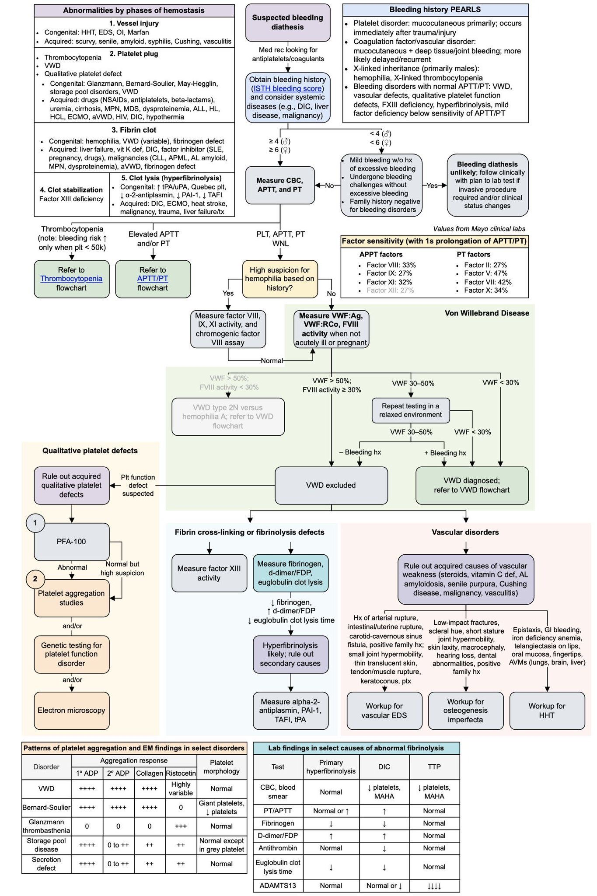

---

## HEMOSTAZIN FAZLARI -- AKIŞ ŞEMASI

Hemostaz **ardışık** ama **örtüşen** beş fazdan oluşur. Her fazdaki bozukluk, klinikte karakteristik bir kanama paterni yapar.

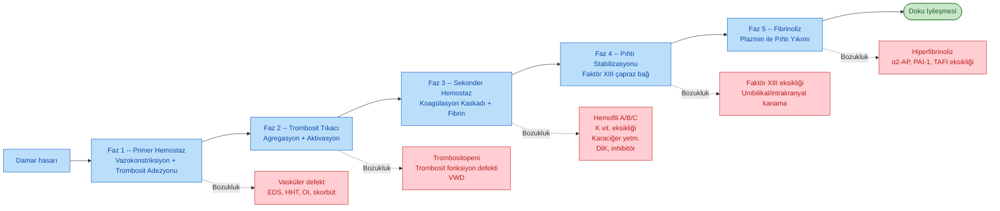

> **Klinik İpucu:** Primer hemostaz bozukluğu (faz 1-2) → **anında mukokutanöz kanama**. Sekonder hemostaz bozukluğu (faz 3-4) → **gecikmiş derin doku/eklem kanaması**. Fibrinolitik bozukluk → **geç dönemde yeniden kanama** (rebleeding).

---

## HEMOSTAZ FAZLARI VE İLGİLİ BOZUKLUKLAR

Kanama bozuklukları **hemostazın beş fazı** üzerinden düşünülmelidir. Her fazda hem konjenital hem akkiz nedenler vardır.

### 1. Damar Hasarı (Vessel Injury)

| Tip | Örnekler |
|---|---|
| **Konjenital** | HHT (Osler-Weber-Rendu), Ehlers-Danlos sendromu (EDS), Osteogenezis İmperfekta (OI), Marfan |
| **Akkiz** | Skorbüt (C vitamini eksikliği), senil purpura, amiloidoz, sifiliz, Cushing, vaskülitler |

### 2. Trombosit Tıkacı (Platelet Plug)

**a) Trombositopeni**

**b) Kalitatif trombosit defekti**

| Tip | Örnekler |
|---|---|
| **Konjenital** | Glanzmann trombastenisi, Bernard-Soulier sendromu, May-Hegglin anomalisi, depo havuzu hastalıkları (storage pool disorders), von Willebrand hastalığı |
| **Akkiz** | **İlaçlar:** NSAİİ, antiplateletler, beta-laktam antibiyotikler **Sistemik:** üremi, siroz, MPN, MDS, dispoteinemi, ALL, HL, HCL, ECMO, edinsel VWD (aVWD), HIV, DİK, hipotermi |

### 3. Fibrin Pıhtısı (Fibrin Clot)

| Tip | Örnekler |
|---|---|
| **Konjenital** | Hemofili (A, B, C), VWD (değişken), fibrinojen defekti |
| **Akkiz** | Karaciğer yetmezliği, K vitamini eksikliği, DİK, **faktör inhibitörleri** (SLE, gebelik, ilaçlar), malignite (KLL, APML, AL amiloidoz, MPN, dispoteinemi), aVWD, fibrinojen defekti |

### 4. Pıhtı Stabilizasyonu (Clot Stabilization)

* **Faktör XIII eksikliği** -- APTT ve PT normal olduğu halde ağır kanama (umbilikal kord kanaması, intrakranyal kanama). Üre solubilite testi ile tanı konur.

### 5. Pıhtı Lizisi -- Hiperfibrinoliz (Clot Lysis)

| Tip | Örnekler |
|---|---|
| **Konjenital** | ↑tPA/uPA, Quebec trombosit hastalığı, ↓α-2-antiplazmin, ↓PAI-1, ↓TAFI |
| **Akkiz** | DİK, ECMO, sıcak çarpması (heat stroke), malignite, travma, karaciğer yetmezliği/transplant sonrası |

---

## KANAMA ÖYKÜSÜ -- PEARLS

> **Kanama paterni tanıyı yönlendirir.** Öykü laboratuvardan önce gelir.

**⚠️ ÖNEMLİ İPUÇLARI:**

* **Trombosit hastalıkları:** Primer mukokutanöz kanama; travma/yaralanma sonrası **hemen** oluşur (gecikmiş değil).
* **Koagülasyon faktörü / vasküler bozukluk:** Mukokutanöz + **derin doku / eklem kanaması**; gecikmiş kanama daha olasıdır.
* **X'e bağlı kalıtım (erkeklerde baskın):** Hemofili A/B, X'e bağlı trombositopeni. Aile öyküsünde dayı/erkek kardeşte kanama sorgula.
* **Normal APTT/PT ile seyreden kanama bozuklukları:**
  - **VWD** (hafif)
  - Vasküler defektler
  - Kalitatif trombosit fonksiyon defektleri
  - **Faktör XIII eksikliği**
  - Hiperfibrinoliz
  - APTT/PT duyarlılığının altında kalan hafif faktör eksikliği

---

## KLİNİK KANAMA PATERNLERİ KARŞILAŞTIRMASI

Kanama paterni, etiyolojik aksı dörde indirir. Primer ve sekonder hemostaz bozuklukları **ayrı klinik tablolar** oluşturur.

| Özellik | Trombosit / Vasküler Bozukluk (Primer) | Koagülasyon Faktör Bozukluğu (Sekonder) |
|---|---|---|
| **Kanama başlangıcı** | **Anında** (travma sonrası hemen) | **Gecikmiş** (saatler -- günler sonra) |
| **Süre** | Kısa ama zor duran | Uzun, tekrarlayan (rebleeding) |
| **Lokalizasyon** | Cilt, mukoza (burun, dişeti, GİS) | **Derin doku, eklem, kas** (hematom) |
| **Peteşi** | **Sık** | Nadir |
| **Purpura** | Var (küçük) | Büyük ekimoz şeklinde |
| **Hemartroz** | Nadir | **Karakteristik** (özellikle hemofili) |
| **Cerrahi sonrası kanama** | Hemen başlar | Gecikmeli başlar |
| **Tipik örnek** | VWD, trombositopeni, Glanzmann | Hemofili A/B, K vit. eksikliği |
| **Cinsiyet eğilimi** | Her iki cins | **Erkek baskın** (X'e bağlı hemofili) |
| **Menoraji** | **Çok sık** | Daha nadir |
| **İlk testte APTT/PT** | Genellikle **normal** | Genellikle **uzun** |

### Kanama Bölgesine Göre Ayırıcı Tanı

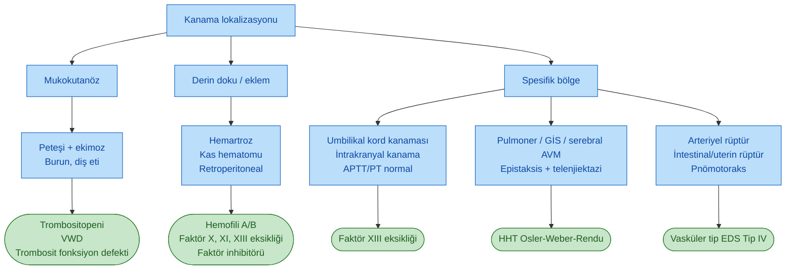

---

## ISTH KANAMA SKORU VE İLK DEĞERLENDİRME

Kanama şüphesi olan her hastada ilk adım sistematik öykü + fizik muayene + temel taramadır.

### Adım Adım Yaklaşım

1. **İlaç sorgulaması (med rec)** -- antiplatelet, antikoagülan, NSAİİ, herbal ürünler
2. **Kanama öyküsü** -- **ISTH-BAT (Bleeding Assessment Tool)** ile skorla
3. **Sistemik hastalık değerlendirmesi** -- DİK, karaciğer hastalığı, malignite
4. **Temel tarama** -- **CBC (tam kan), APTT, PT**

### ISTH-BAT Skor Yorumlaması

| Skor | Yorum | Eylem |
|---|---|---|
| **< 4 (çocuklar < 3)** | Aşırı kanama öyküsü olmayan hafif kanama | **Kanama diyatezi olası değil**, klinik takip |
| **≥ 4 (çocuklar ≥ 3)** | Kanama diyatezi şüphesi | **Girişimsel işlem varsa** laboratuvar testleri planla; klinik durum değişirse test |

> **Önemli:** ISTH skoru negatif olsa bile invaziv işlem öncesi veya klinik kötüleşme varsa tarama testleri yenilenir.

---

## TARAMA TESTLERİNE GÖRE ALGORİTMA

İlk CBC + APTT + PT sonuçlarına göre beş ana yol ayrılır.

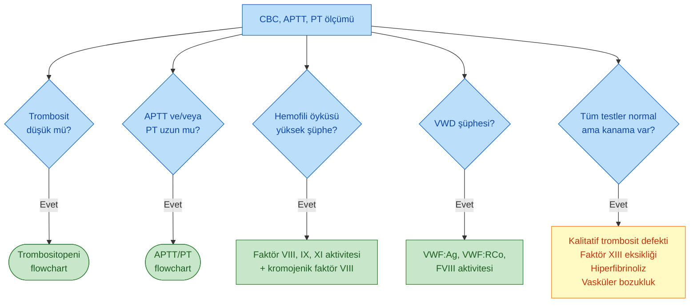

> **Kanama riski sadece trombosit < 50.000/mm³ olduğunda anlamlıdır.** Trombosit sayısı 50.000'in üzerindeyse izole trombositopeni genellikle kanama yapmaz.

---

## APTT / PT YORUMLAMA MATRİSİ

APTT **intrinsik + ortak** yolu, PT **ekstrinsik + ortak** yolu değerlendirir. Sonuç kombinasyonu hangi akstaki bozukluğu işaret eder.

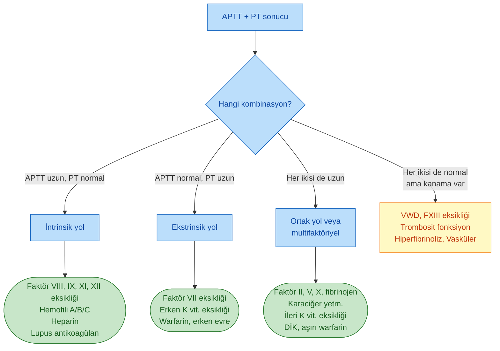

### Dört Olası Kombinasyonun Ayırıcı Tanı Tablosu

| APTT | PT | Olası Nedenler | İlk Test |
|---|---|---|---|
| **↑** | Normal | Hemofili A/B/C, FVIII inhibitörü, VWD (FVIII düşüklüğü ile), heparin, **lupus antikoagülan (trombotik!)** | Mixing study, faktör düzeyi |
| Normal | **↑** | Faktör VII eksikliği, **erken K vit. eksikliği**, **erken warfarin**, hafif karaciğer hastalığı | Faktör VII, K vit. tedavisi |
| **↑** | **↑** | Faktör II/V/X/fibrinojen eksikliği, ağır K vit. eksikliği, **DİK**, ağır karaciğer hastalığı, warfarin (ileri) | Fibrinojen, faktör II/V/X, trombosit, D-dimer |
| Normal | Normal | **VWD, FXIII eksikliği, trombosit fonksiyon defekti, hiperfibrinoliz, vasküler bozukluk, hafif faktör eksikliği** | VWF panel, FXIII, PFA-100, öglobulin lizis |

> **ÖNEMLİ PARADOKS:** **Lupus antikoagülan** APTT'yi uzatır ama **tromboza eğilim** yaratır (kanama değil)! Mixing testinde **düzelmez** -- inhibitör olduğu anlaşılır.

> **Faktör XII eksikliği:** APTT'yi uzatır (eşik %27) ama **klinik kanama yapmaz**. Rutin tarama sırasında yakalanan uzun APTT'nin en sık sebebi. Tedavi gerekmez.

---

## MIXING STUDY (KARIŞIM TESTİ) YORUMU

APTT veya PT uzun çıktığında, bunun **faktör eksikliği** mi yoksa **inhibitör** mü olduğunu ayırmak için yapılır. Hasta plazması **normal plazma ile 1:1 oranında karıştırılır**, test tekrarlanır.

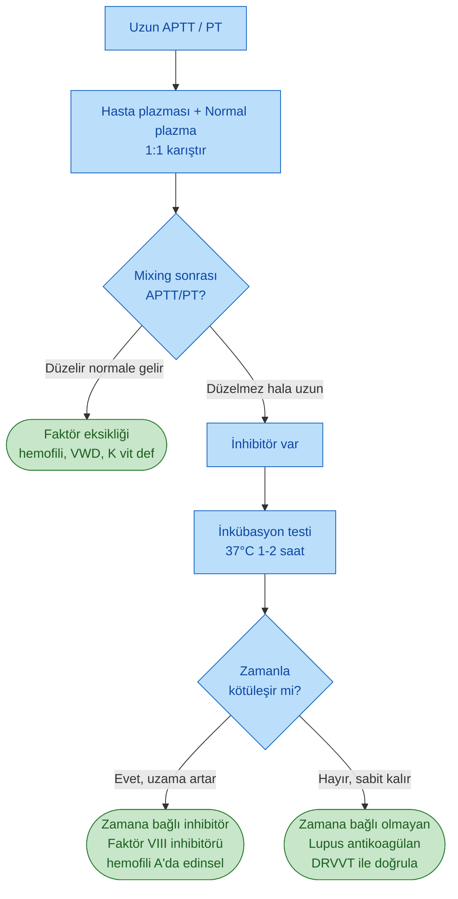

### Mixing Study -- Tek Bakışta Yorum

| Senaryo | Yorum | Sonraki Adım |
|---|---|---|
| Karıştırınca **düzelir** | Faktör eksikliği | Spesifik faktör düzeyi ölç |
| Karıştırınca **düzelmez, hemen** | Lupus antikoagülan / acil inhibitör | DRVVT, anti-fosfolipid paneli |
| Karıştırınca **düzelir ama 1-2 saat inkübasyonda bozulur** | **Zamana bağlı inhibitör** (edinsel hemofili) | Bethesda tayini, faktör VIII Ab |
| PT mixing düzelmez | Faktör II/V/X/VII inhibitörü (nadir) | Spesifik faktör + inhibitör tarama |

---

## FAKTÖR HASSASİYETİ (APTT/PT UZAMASI EŞİKLERİ)

Faktör eksikliğinde APTT veya PT'nin **1 saniye uzaması** için gereken aktivite eşikleri (Mayo Clinic değerleri):

### APTT Faktörleri

| Faktör | Eşik Aktivite |
|---|---|
| **Faktör VIII** | %33 |
| **Faktör IX** | %27 |
| **Faktör XI** | %32 |
| **Faktör XII** | %27 |

### PT Faktörleri

| Faktör | Eşik Aktivite |
|---|---|
| **Faktör II (Protrombin)** | %27 |
| **Faktör V** | %47 |
| **Faktör VII** | %42 |
| **Faktör X** | %34 |

**⚠️ Klinik Anlam:**

* Faktör V için aktivite %50'nin altına inmedikçe PT uzamayabilir -- yani **hafif Faktör V eksikliği PT ile yakalanmaz**.
* Faktör IX aktivitesi %27 olan bir hemofili B hastasında APTT normal sınırda olabilir; klinik şüphe varsa mutlaka **faktör düzeyi** ölçülmelidir.
* APTT ve PT **normal** ama klinik kanama varsa: VWD, FXIII eksikliği, hafif faktör eksikliği, trombosit fonksiyon defekti, hiperfibrinoliz düşünülür.

---

## VON WILLEBRAND HASTALIĞI ALGORİTMASI

VWD şüphesi varsa üçlü panel: **VWF:Ag, VWF:RCo (ristosetin kofaktör), FVIII aktivitesi**.

> **Test zamanlaması önemli:** Akut hastalık, gebelik, akut stres VWF düzeyini yükseltir (akut faz reaktanıdır). Test **stabil, dinlenmiş durumda** yapılmalıdır.

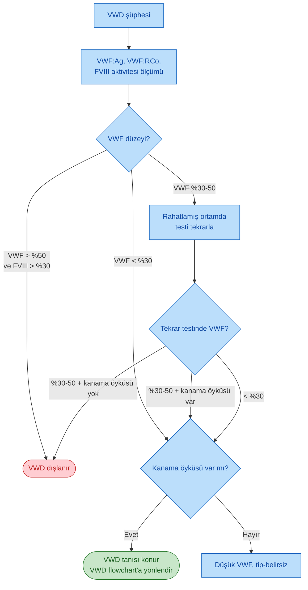

> **VWF %30-50 gri zon:** Bu aralık hem hafif tip 1 VWD hem de düşük VWF varyantları olarak yorumlanabilir. **Kanama öyküsü** tanıyı belirler; öykü negatifse yalnızca girişimsel işlem öncesi test gerekir.

---

## VWD ALT TİPLERİ

VWD fonksiyonel ve yapısal defekte göre altı ana alt tipe ayrılır. Her tipin laboratuvar profili farklıdır.

| Tip | Mekanizma | VWF:Ag | VWF:RCo | FVIII | VWF:RCo/Ag Oranı | Multimerler | Özellik |
|---|---|---|---|---|---|---|---|
| **Tip 1** | **Kantitatif** kısmi eksiklik (%70-80) | ↓ | ↓ | Normal veya ↓ | **> 0.7** (normal) | Normal dağılım | En sık form; AD kalıtım |
| **Tip 2A** | **Kalitatif** -- yüksek ve orta ağırlıklı multimer yok | Normal veya ↓ | ↓↓ | Normal veya ↓ | **< 0.7** | **Yüksek multimer yok** | Kanama ağırlığı değişken |
| **Tip 2B** | **Kalitatif** -- GPIb'ye artmış afinite | Normal veya ↓ | ↓ | Normal veya ↓ | < 0.7 | Yüksek multimer yok | **Trombositopeni**, RIPA düşük dozda artmış, DDAVP kontrendike! |
| **Tip 2M** | **Kalitatif** -- GPIb'ye azalmış afinite | Normal veya ↓ | ↓↓ | Normal veya ↓ | **< 0.7** | **Normal multimer** | 2A'dan multimer ile ayrılır |
| **Tip 2N** | **Kalitatif** -- FVIII bağlama bölgesi defekti | Normal veya ↓ | Normal veya ↓ | **↓↓ (<%30)** | Normal | Normal | **Hemofili A taklitçisi!** FVIII:VWF bağlama testi ile ayrılır |
| **Tip 3** | **Kantitatif** -- tam eksiklik | **↓↓↓ (saptanamaz)** | ↓↓↓ | ↓↓↓ (%1-10) | Hesaplanamaz | Yok | En ağır form, AR kalıtım, hemartroz gibi hemofili benzeri kanama |

### Alt Tipleri Ayıran Özel Testler

| Test | Kullanım |
|---|---|
| **VWF:CB** (kollajen bağlama) | Yüksek multimer eksikliğini gösterir (Tip 2A, 2B) |
| **RIPA** (düşük doz ristosetin ile trombosit agregasyonu) | **Tip 2B'de artmış** (patognomonik) |
| **VWF:FVIII bağlama** | **Tip 2N** tanısında altın standart |
| **VWF multimer analizi** | Tip 2A ve 2M'yi ayırır |
| **VWF gen sekanslama** | Tip 3 ve ailesel formlarda |

---

## VWD TİP 2N VS HEMOFİLİ A AYIRICI TANISI

**Kritik Nokta:** İlk algoritmada **"VWF > %50 ama FVIII < %30"** dalı **VWD tip 2N vs Hemofili A** ayırıcı tanısına yönlendirir. Bu iki tablo fenotipik olarak çok benzerdir ama tedavi tamamen farklıdır.

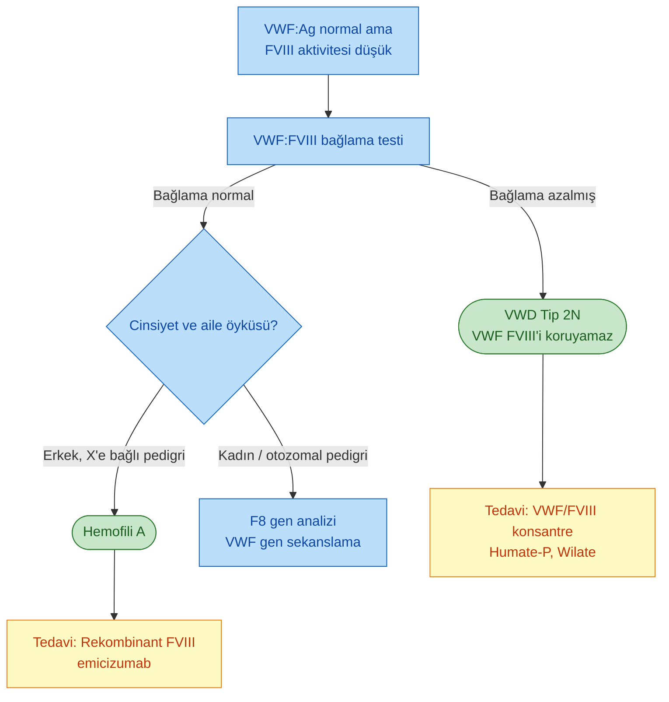

| Özellik | VWD Tip 2N | Hemofili A |
|---|---|---|
| **Kalıtım** | **Otozomal resesif** (her iki cins etkilenir) | **X'e bağlı resesif** (erkek baskın) |
| **Aile öyküsü** | Akraba evliliği olabilir, kadın hasta olur | Dayı/erkek kardeşlerde hemofili |
| **VWF:Ag** | Normal veya hafif düşük | **Normal** |
| **FVIII aktivitesi** | Düşük (%5-30) | Düşük (değişken) |
| **FVIII yarı ömrü** | **Kısa** (VWF koruyamaz) | Normal |
| **VWF:FVIII bağlama** | **Azalmış** (patognomonik) | **Normal** |
| **Rekombinant FVIII yanıtı** | **Yetersiz / kısa** | Etkili |
| **VWF/FVIII konsantresi** | Etkili | Gerekli değil |

> **Klinik Önem:** Tip 2N hastaya rekombinant FVIII verilirse etki **kısa sürer** çünkü koruyucu VWF yoktur. Tedavi **VWF içeren konsantrat** olmalıdır.

---

## HEMOFİLİ AĞIRLIK SINIFLAMASI

Faktör aktivite düzeyine göre üç kategori; klinik kanama paterni ve tedavi yaklaşımı değişir.

| Ağırlık | Faktör Aktivitesi | Kanama Paterni | APTT | Tedavi |
|---|---|---|---|---|
| **Ağır** | **< %1** | **Spontan** hemartroz, kas hematomu, intrakranyal kanama; sık (ayda birkaç) | Belirgin uzun | Profilaksi zorunlu |
| **Orta** | **%1 -- %5** | Hafif travma sonrası kanama; spontan atak nadir | Uzun | Travma/cerrahi öncesi faktör |
| **Hafif** | **%6 -- %40** | Yalnız cerrahi/major travma ile kanama; genellikle erişkinde tanı | Hafif uzun veya normal | Olay bazlı tedavi, DDAVP (A) |

### Hemofili Alt Tipleri

| Tip | Faktör | Genetik | Sıklık (erkek) |
|---|---|---|---|
| **Hemofili A** | Faktör VIII | X'e bağlı resesif | 1/5.000 |
| **Hemofili B (Christmas)** | Faktör IX | X'e bağlı resesif | 1/30.000 |
| **Hemofili C (Rosenthal)** | Faktör XI | **Otozomal resesif** | Eşit (Aşkenazi Yahudilerinde yüksek) |

> **Klinik ayırt edici:** Hemofili A ve B klinik olarak **ayrılamaz**; faktör düzeyi ile ayrılır. Hemofili C **daha hafif** seyirli, hemartroz nadir; genellikle cerrahi öncesi tanı konur.

---

## KALİTATİF TROMBOSİT DEFEKTLERİ ALGORİTMASI

Trombosit sayısı **normal** ama kanama varsa kalitatif defekt düşünülür.

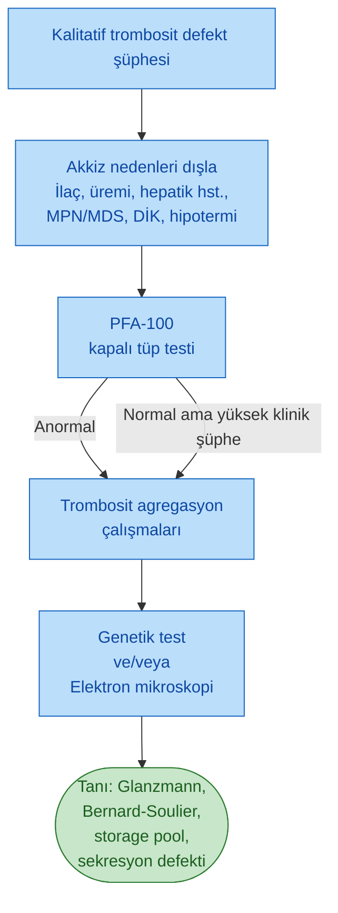

> **PFA-100** (Platelet Function Analyzer): Yüksek akımda trombosit tıkacı oluşum süresini ölçen tarama testi. Normal sonuç, özellikle depo havuzu / sekresyon defektlerini **dışlayamaz**; klinik şüphe yüksekse agregasyona geçilir.

---

## KALITSAL TROMBOSİT BOZUKLUKLARI MOLEKÜLER KARŞILAŞTIRMA

Major kalıtsal trombosit fonksiyon defektlerinin moleküler düzeyi ve ayırt edici bulguları:

| Hastalık | Gen / Defekt | Trombosit Sayısı | Trombosit Boyutu | Kalıtım | Karakteristik |
|---|---|---|---|---|---|
| **Bernard-Soulier** | **GP1BA, GP1BB, GP9** (GPIb-V-IX kompleksi) | **↓** | **Dev (> 4 μm)** | AR | Ristosetin agregasyonu **yok**, VWF bağlanamıyor |
| **Glanzmann Trombastenisi** | **ITGA2B, ITGB3** (GPIIb/IIIa = αIIbβ3 integrin) | Normal | Normal | AR | **Tüm agonistlere yanıt yok** (ADP, kollajen) ama ristosetin korunmuş |
| **May-Hegglin anomalisi** | **MYH9** (non-muscle miyozin) | ↓ | **Dev** + **nötrofil Döhle-benzeri inklüzyon** | AD | Sendromik: işitme kaybı, nefrit, katarakt olabilir |
| **Gri trombosit sendromu** | **NBEAL2** (alfa granül eksikliği) | Normal veya ↓ | Büyük | AR | Yayma'da **gri trombosit**, miyelofibroz |
| **Storage pool hastalığı (delta)** | Delta granül (yoğun granül) eksikliği | Normal | Normal | Değişken | **Hermansky-Pudlak** (albinizm), Chediak-Higashi |
| **Sekresyon defekti** | Sinyal iletim defekti | Normal | Normal | Değişken | Agregasyonda **ikinci dalga** yok |
| **Quebec trombosit hastalığı** | **PLAU duplikasyonu** → ↑ uPA | Hafif ↓ | Normal | AD | **Fibrinolitik profil**, geç kanama |

### GPIb vs GPIIb/IIIa: İki Ana Defektin Karşılaştırması

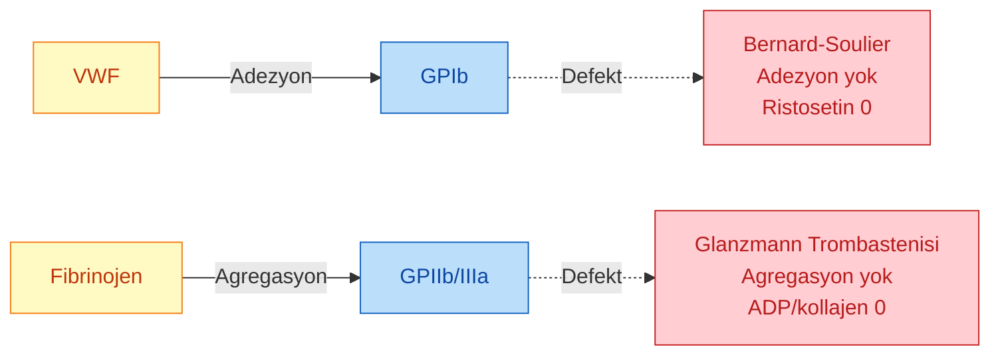

> **Mnemonik:** **B**ernard-Soulier = **B**ig platelets + **B**inding adhesion problem (GP**I**b); **G**lanzmann = **G**erçek agregasyon yok (GP **II**b/**III**a). Ristosetin Bernard-Soulier'de sıfır, Glanzmann'da korunmuş.

---

## FİBRİN OLUŞUMU VE FİBRİNOLİTİK BOZUKLUKLAR ALGORİTMASI

APTT/PT normal, kanama var ve trombosit/VWD dışlandıysa fibrin oluşumu veya fibrinolitik akstaki bozukluklar aranır.

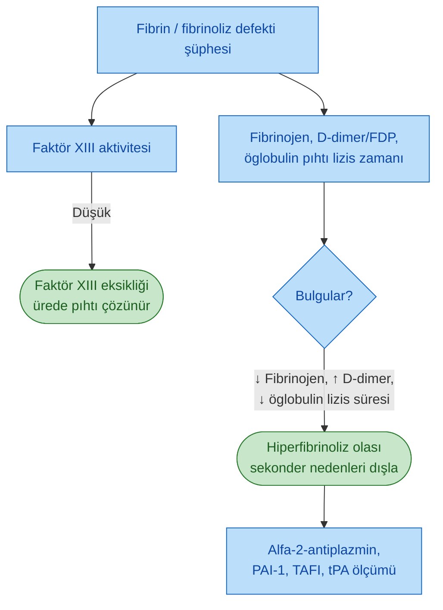

> **Öglobulin pıhtı lizis zamanı (ECLT):** Plazmanın pıhtı lizisini ne kadar sürede tamamladığını gösterir. Hiperfibrinolizde **kısalır**. Değeri normalde > 2 saat; **< 60 dk** patolojiktir.

---

## VASKÜLER BOZUKLUKLAR ALGORİTMASI

Tüm koagülasyon testleri, trombosit sayısı ve fonksiyonu normal olduğu halde kanama varsa vasküler yapı defekti aranır.

### Akkiz Nedenleri Önce Dışla

* Steroid kullanımı
* C vitamini eksikliği (skorbüt)
* AL amiloidoz
* Senil purpura
* Cushing hastalığı
* Malignite
* Vaskülitler

### Konjenital Vasküler Bozukluklara Yaklaşım -- Klinik İpuçlarına Göre

| Klinik Bulgu | Olası Tanı | İleri Tetkik |
|---|---|---|
| Arteriyel rüptür öyküsü, intestinal/uterin rüptür, karotid-kavernöz fistül, küçük eklem hipermobilitesi, translusent cilt, tendon rüptürü, keratokonus | **Vasküler tip Ehlers-Danlos (tip IV)** | COL3A1 gen testi |
| Düşük fraktür eşiği, küçük travma ile kırık, kısa boy, demir eksikliği anemisi, eklem hipermobilitesi, işitme kaybı, diş anomalileri, pozitif aile öyküsü | **Osteogenezis İmperfekta** | COL1A1/COL1A2 gen testi, kemik mineral dansitometri |
| Epistaksis, GİS kanama, cilt laksitesi, makrosefali, dudak/oral mukoza/parmak ucu telenjiektazileri, **AVM'ler (akciğer, beyin, karaciğer)** | **HHT (Osler-Weber-Rendu)** | ENG, ACVRL1 gen testi + organ tarama (pulmoner, hepatik, serebral AVM) |

> **HHT'de Curaçao kriterleri:** epistaksis, telenjiektazi, viseral AVM, aile öyküsü -- ≥3 kriter kesin tanı.

---

## KALITSAL VASKÜLER SENDROMLARIN KLİNİK KARŞILAŞTIRMASI

Üç ana kalıtsal vasküler sendrom -- klinik bulgular, ilişkili genler ve karakteristik komplikasyonlar:

| Özellik | Vasküler EDS (Tip IV) | Osteogenezis İmperfekta | HHT (Osler-Weber-Rendu) |
|---|---|---|---|
| **Gen** | **COL3A1** | **COL1A1 / COL1A2** | **ENG (HHT1)** / **ACVRL1 (HHT2)** / SMAD4 |
| **Kalıtım** | Otozomal dominant | Otozomal dominant | Otozomal dominant |
| **Cilt** | Translusent, belirgin venler | Ince, bazen morarma eğilimi | Telenjiektazi (dudak, dil, parmak ucu) |
| **Kemik / İskelet** | Küçük eklem hipermobilitesi | **Düşük travma kırığı**, kısa boy, osteopeni | Genellikle normal |
| **Göz** | Keratokonus | **Mavi sklera** (Tip I) | Konjonktiva telenjiektazisi |
| **İşitme** | Normal | **Sensörinöral işitme kaybı** (Tip I erişkin) | Normal |
| **Diş** | Normal | **Dentinogenezis imperfekta** | Normal |
| **Major komplikasyon** | **Arteriyel rüptür** (orta yaşlarda ölüm), intestinal/uterin rüptür, **karotid-kavernöz sinüs fistülü**, **pnömotoraks** | Tekrarlayan kırıklar, skolyoz, kardiyak kapak sorunları | **AVM'ler** (pulmoner, serebral, hepatik) -- paradoks emboli, beyin absesi, yüksek debili kalp yetmezliği |
| **Kanama tipi** | Spontan vasküler rüptür, intrakranyal kanama | Purpura, kolay morarma | **Tekrarlayan epistaksis** (en sık), GİS kanama, demir eksikliği anemisi |
| **Tanı** | Klinik + COL3A1 sekans | Klinik + COL1A1/A2 sekans + kemik dansitometri | **Curaçao kriterleri** + gen testi + organ tarama (PAV, MR beyin) |
| **Cerrahi risk** | **YÜKSEK** (dokular yırtılır) | Kırık riski | Yüksek (AVM kanaması) |

### Ayırıcı İpuçları

> **EDS tip IV şüphesi:** Genç yaşta spontan arteriyel diseksiyon/rüptür, ince translusent cilt, küçük eklem hipermobilitesi, akrogeri (küçük eller/ayaklar). **Cerrahi yaklaşımda çok dikkat** -- dikiş tutmaz, anastomoz bozulabilir.

> **OI şüphesi:** Çocuklukta açıklanamayan kırıklar + mavi sklera + dentinogenezis imperfekta. Child abuse ile karışabilir, ailesel özellikler sorgulanmalı.

> **HHT şüphesi:** Rekürren epistaksis + dudak/parmak telenjiektazileri + demir eksikliği anemisi. Pulmoner AVM varsa **paradoks emboli, serebral abse, hipoksi** riski; mutlaka kontrast ekokardiyografi ile taranmalı.

---

## TROMBOSİT AGREGASYON PATERNLERİ VE EM BULGULARI

Seçili kalitatif trombosit bozukluklarında agregasyon cevabı ve elektron mikroskopi bulguları:

| Hastalık | 1° ADP | 2° ADP | Kollajen | Ristosetin | Trombosit Morfolojisi |
|---|---|---|---|---|---|
| **VWD** | ++++ | ++++ | ++++ | **Çok değişken** | Normal |
| **Bernard-Soulier** | ++++ | ++++ | ++++ | **0** (yok) | **Dev trombositler**, ↓ trombosit |
| **Glanzmann trombastenisi** | **0** | **0** | **0** | +++ | Normal |
| **Storage pool hastalığı** | ++++ | **0 → ++** | ++ | ++ | Gri trombosit dışında normal |
| **Sekresyon defekti** | ++++ | **0 → ++** | ++ | ++ | Normal |

> **Okuma ipucu:** "++++" normal, "0" yanıt yok. **Bernard-Soulier'de ristosetin sıfır** (GPIb defekti), **Glanzmann'da ristosetin normal ama diğer agonistlere yanıt yok** (GPIIb/IIIa defekti). VWD'de ristosetin yanıtı tip 2B dışında azalır; tip 2B'de paradoksal olarak düşük doz ristosetine yanıt **artar**.

### Patofizyolojik Bağlantılar

* **Bernard-Soulier:** GPIb-V-IX kompleksi eksik → VWF'ye bağlanamaz → ristosetin yanıtı yok
* **Glanzmann:** GPIIb/IIIa eksik → fibrinojene bağlanamaz → **agregasyon** olmaz ama ristosetine yanıt korunur (çünkü ristosetin adhezyonu GPIb üzerinden)
* **Storage pool hastalığı:** Delta veya alfa granülleri yok/boşalmış → sekresyon yetersiz → sekonder (2° ADP) yanıt baskılanmış

---

## ANORMAL FİBRİNOLİZDE LABORATUVAR BULGULARI

Üç ana fibrinolitik/mikroanjiyopatik tabloda karşılaştırmalı laboratuvar:

| Test | Primer Hiperfibrinoliz | DİK | TTP |
|---|---|---|---|
| **CBC, periferik yayma** | Normal | ↓ trombosit, **MAHA** (mikroanjiyopatik hemolitik anemi) | ↓ trombosit, **MAHA** |
| **PT / APTT** | Normal veya ↑ | **↑** | **Normal** |
| **Fibrinojen** | **↓** | **↓** | Normal |
| **D-dimer / FDP** | **↑** | **↑↑** | Normal |
| **Antitrombin** | Normal | **↓** | Normal |
| **Öglobulin pıhtı lizis zamanı** | **↓ (kısalmış)** | ↓ | Normal |
| **ADAMTS13** | Normal | Normal veya ↓ | **↓↓↓↓ (<%10)** |

### Ayırıcı Tanıda Öne Çıkanlar

> **TTP'yi DİK'ten ayıran nokta:** TTP'de PT/APTT **normal** ve ADAMTS13 **ağır eksik** (<%10). DİK'te ise PT/APTT uzar, fibrinojen düşer, D-dimer belirgin artar.

> **Primer hiperfibrinolizi DİK'ten ayıran nokta:** Her ikisinde de fibrinojen düşük, D-dimer yüksek olabilir. Ancak **primer hiperfibrinolizde trombosit ve antitrombin NORMAL**, DİK'te ikisi de **düşük**. Ayrıca primer hiperfibrinolizde MAHA yoktur.

> **ADAMTS13 düzeyi TTP için diagnostik:** %10'un altı aktivite, uygun klinikle birlikte TTP tanısını destekler. İnhibitör varlığı edinsel TTP'yi düşündürür.

---

## MİKROANJİYOPATİK ANEMİ (MAHA) AYIRICI TANISI

MAHA = **trombositopeni + mikroanjiyopatik hemolitik anemi** (periferik yaymada **şistosit**) triadı. Akut, ayırıcı tanı yapılması gereken bir tablodur.

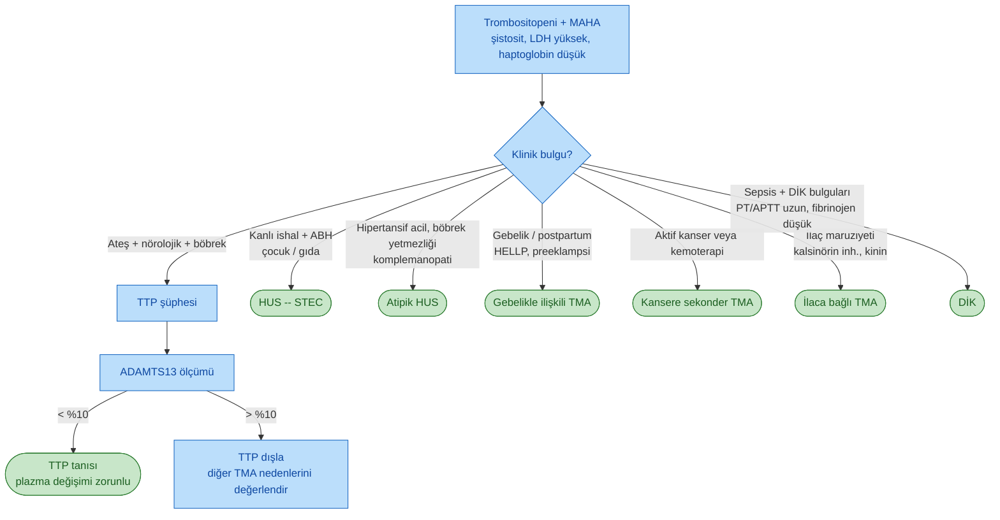

### TMA Sendromlarının Karşılaştırma Tablosu

| Özellik | TTP | STEC-HUS | Atipik HUS | DİK | HELLP |
|---|---|---|---|---|---|
| **Yaş grubu** | Erişkin | **Çocuk** (< 5 yaş) | Her yaş | Her yaş | Gebelik 3. trimester |
| **Prodrom** | Bazen viral | **Kanlı ishal** (E. coli O157:H7) | Yok | Altta yatan hastalık | Preeklampsi |
| **ADAMTS13** | **< %10** | Normal / hafif ↓ | Normal | Normal veya ↓ | Normal |
| **Böbrek tutulumu** | Hafif -- orta | **Ağır (ABH)** | Ağır (ABH) | Değişken | Orta |
| **Nörolojik bulgu** | **Belirgin** | Nadir | Değişken | DİK'e bağlı | Nöbet (eklampsi) |
| **Ateş** | **Sık** | Bazen | Yok | Sık | Yok |
| **Koagülasyon** | Normal | Normal | Normal | **Bozuk** | Normal / bozuk |
| **Kompleman** | Normal | Normal | **Disregülasyon** | Normal | Normal |
| **Karaciğer enzimleri** | Normal | Normal | Normal | Değişken | **↑↑ AST/ALT** |
| **Tedavi** | **Plazmaferez + steroid + kaplacizumab / rituksimab** | Destek tedavi | **Eculizumab** | Altta yatan nedeni tedavi + destek | **Doğum** |

> **"5K triadı" ve "pentadı":** TTP klasik pentadı = ateş, trombositopeni, MAHA, nörolojik bulgu, böbrek bozukluğu. Klinikte beşinin hepsi %40 hastada görülür; **triad (trombositopeni + MAHA + nörolojik bulgu)** daha hassastır.

> **Acil yönetim:** TTP şüphesinde **ADAMTS13 sonucu beklenmeden** plazma değişimi başlatılır (PLASMIC skoru ≥ 6 ise). Geç başlangıç mortaliteyi katlar.

---

## KANAMA BOZUKLUKLARINDA İLAÇ VE İLİŞKİ TABLOSU

Kanama/koagülasyon bozukluğu yapan ilaçlar ve klinikte karşılaşılan durumlar:

### Trombosit Fonksiyonunu Bozan İlaçlar

| İlaç Grubu | Örnekler | Mekanizma | Geri Dönüş Süresi |
|---|---|---|---|
| **Siklooksijenaz inhibitörleri** | **Aspirin** | İrreversibl COX-1 inhibisyonu → TXA₂ azalır | Trombosit ömrü boyunca (7-10 gün) |
| **NSAİİ (reversibl)** | İbuprofen, naproksen, diklofenak | Reversibl COX inhibisyonu | İlaç yarı ömrü + birkaç saat |
| **ADP reseptör blokörleri** | **Klopidogrel, prasugrel, tikagrelor** | P2Y12 reseptörü | Klopidogrel 5-7 gün, tikagrelor 3-5 gün |
| **GPIIb/IIIa inhibitörleri** | Abciximab, eptifibatide, tirofiban | GPIIb/IIIa blokajı | Kısa (saatler) |
| **PDE inhibitörleri** | **Dipiridamol, silostazol** | cAMP artışı | 24-48 saat |
| **Beta-laktam antibiyotikler** | Penisilinler, sefalosporinler (yüksek doz) | Membran etkisi | Birkaç gün |
| **SSRI / SNRI** | Fluoksetin, sertralin | Trombosit serotonin deplesyonu | 1-2 hafta |
| **Ginkgo, sarımsak, ginseng** | Fitoterapik | Değişken | Değişken |

### Koagülasyonu Bozan İlaçlar

| İlaç | Hedef | Monitör | Antidot / Reverse |
|---|---|---|---|
| **Warfarin** | K vit. döngüsü (II, VII, IX, X) | **INR** | K vitamini + PCC / FFP |
| **Heparin (UFH)** | AT III → FIIa, FXa | **APTT** | **Protamin sülfat** |
| **LMWH** | Anti-Xa > anti-IIa | Anti-Xa (seçilmiş) | Protamin (kısmi) |
| **Fondaparinuks** | Selektif anti-Xa | Anti-Xa | Rekombinant FVIIa (off-label) |
| **Dabigatran** | Direkt trombin inhibitörü | Trombin zamanı | **İdarusizumab** |
| **Rivaroksaban, apiksaban, edoksaban** | Direkt FXa | Anti-Xa (spesifik) | **Andeksanet alfa**, PCC |

### Kanama Riski Yaratan Klinik Durumlar

| Durum | Mekanizma | Klinik İpucu |
|---|---|---|
| **Üremi** | Trombosit disfonksiyonu (guanidinosüksinik asit, NO) | BUN > 100, uzun kanama zamanı → **DDAVP, kriyopresipitat, diyaliz** |
| **Karaciğer yetmezliği** | Faktör sentezi ↓ + trombositopeni + hiperfibrinoliz | PT/APTT uzar, fibrinojen düşer → **FFP, K vit., PCC** |
| **K vitamini eksikliği** | II, VII, IX, X + Protein C/S sentezi bozulur | İzole PT uzaması → erken; APTT + PT → geç |
| **Masif transfüzyon** | Dilüsyonel trombositopeni + faktör eksikliği | 1:1:1 oran (pRBC:FFP:trombosit) |
| **Edinsel hemofili A** | Otoantikor (genellikle yaşlı, malignite/postpartum) | Ani başlangıçlı ekimoz, izole APTT uzaması + düzelmeyen mixing | 
| **aVWD** | Monoklonal gammapati, lenfoproliferatif, aort stenozu (**Heyde sendromu**) | Edinsel VWD bulgusu, yüksek multimer eksikliği |

---

## GENEL ALGORİTMA ÖZETİ

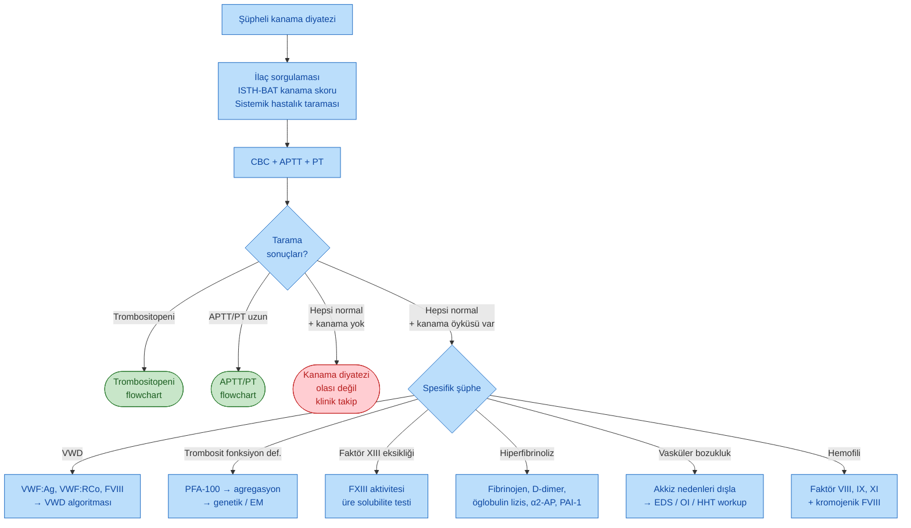

---

## ÖZET TABLO -- TEK SATIRDA TANIYA GİTMEK

| Bulgu | İlk Akla Gelen |
|---|---|
| Mukokutanöz kanama, travmadan hemen sonra | **Trombosit hastalığı** (sayı veya fonksiyon) |
| Derin doku/eklem kanaması, gecikmiş | **Faktör eksikliği** (hemofili) |
| X'e bağlı erkek hasta | **Hemofili A/B, X'e bağlı trombositopeni** |
| Umbilikal kord kanaması, intrakranyal kanama, APTT/PT normal | **Faktör XIII eksikliği** |
| Uzun APTT, FVIII düşük, FVIII:VWF:Ag oranı düşük | **VWD tip 2N** |
| Ristosetin agregasyonu yok, dev trombosit | **Bernard-Soulier** |
| Tüm agonistlere yanıt yok, ristosetin normal | **Glanzmann trombastenisi** |
| Gri trombosit, sekonder agregasyon azalmış | **Depo havuzu hastalığı (alfa granül)** |
| Trombositopeni + MAHA, PT/APTT normal | **TTP** (ADAMTS13 <%10) |
| Trombositopeni + MAHA + uzun PT/APTT | **DİK** |
| Fibrinojen ↓, D-dimer ↑, trombosit **normal** | **Primer hiperfibrinoliz** |
| Epistaksis + telenjiektazi + pulmoner AVM | **HHT** |
| Düşük travma kırığı + mavi sklera | **Osteogenezis İmperfekta** |
| Akkiz kanama, C vit. düşük, peteşi + folliküler hiperkeratoz | **Skorbüt** |
| Yaşlı hasta, sırt/ekstansör yüzde purpura | **Senil purpura** |

---

*Kaynak: İrfan Yavaşoğlu Hocanın Hemato.pdf tek sayfa algoritma özeti (Mayo Clinic laboratuvar değerleri). Not CLAUDE.md standardına uygun olarak Mermaid flowchart'lar ve Türkçe tablolarla genişletildi.*
